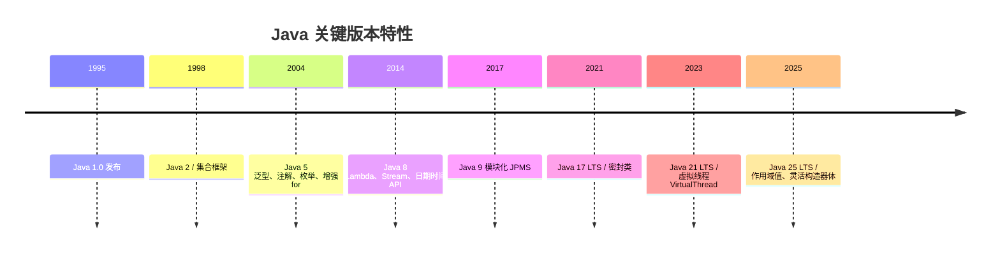
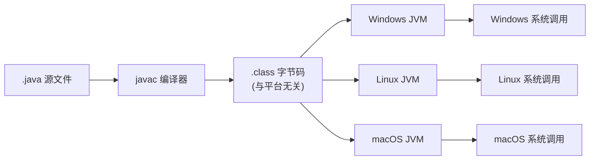
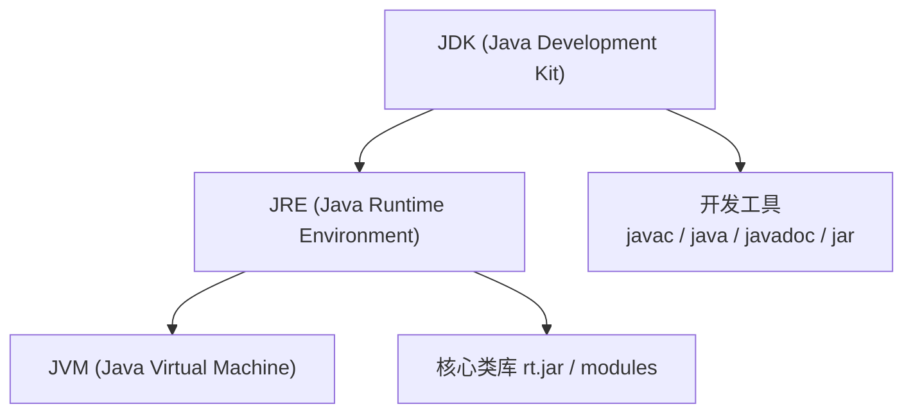
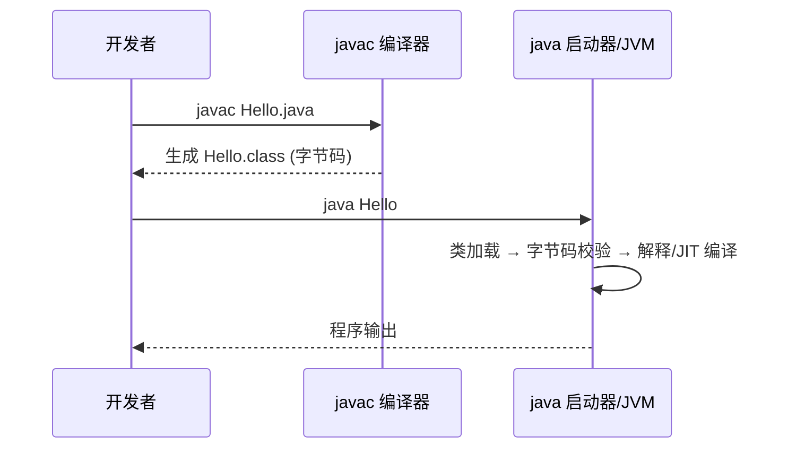
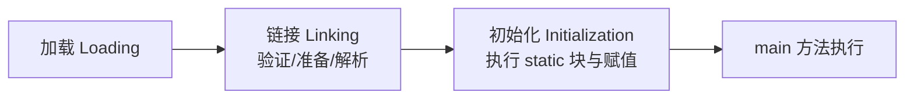

# 初识 Java

## 学习目标

- 理解 Java 的语言定位与版本演进（Java SE / EE / ME 与 LTS 版本）
- 掌握 JDK、JRE、JVM 三者的职责边界与包含关系
- 理解"一次编写，到处运行"背后的字节码与 JVM 跨平台机制
- 能够独立完成 JDK 安装、环境变量配置与第一个程序 `HelloWorld` 的编译运行

## Java 语言概览

Java 由 Sun Microsystems（现为 Oracle）的 James Gosling 团队于 1995 年发布，是一种**静态类型、面向对象、基于类的通用编程语言**。其设计哲学可概括为两点：

1. **简单且熟悉**：语法借鉴 C/C++，但去除了指针、多继承、手动内存管理等易错特性
2. **平台无关**：源代码编译为与硬件无关的字节码(Bytecode)，由 JVM 在目标平台上解释/编译执行

### 版本体系

| 发行线 | 定位 | 说明 |
|--------|------|------|
| Java SE (Standard Edition) | 标准版 | 核心类库与语言规范，所有其他版本的基础 |
| Java EE / Jakarta EE | 企业版 | 构建服务端分布式应用（Servlet、EJB、JPA 等），已交由 Eclipse 基金会 |
| Java ME | 微型版 | 嵌入式与移动设备，当前使用场景有限 |

> 自 Java 9 起改为半年一次特性发布（Feature Release），**LTS（Long-Term Support）** 版本自 Java 17 起按每两年一次的节奏推出。截至 2026-09，主流 LTS 为 Java 17、21、25。生产项目应优先选择 LTS。

### 语言演进关键节点



## JVM 跨平台原理

"Write Once, Run Anywhere" 的核心在于 **JVM（Java Virtual Machine）** 与**字节码**的分工。



要点：
- 字节码是一种**中间表示(IR)**，不绑定任何具体 CPU 架构
- 各平台提供各自的 JVM 实现，负责把字节码翻译为本地机器指令
- 这也意味着同一份 `.class` 文件可在任何装有兼容 JVM 的系统上运行

### JDK / JRE / JVM 关系



| 组件 | 职责 | 使用者 |
|------|------|--------|
| JVM | 加载并执行字节码、内存管理、垃圾回收 | 运行时 |
| JRE | JVM + 核心类库，提供运行环境 | 运行 Java 程序 |
| JDK | JRE + 编译器与诊断工具 | 开发 Java 程序 |

> 自 Java 11 起 Oracle 不再单独发布 JRE 安装包，开发者直接分发 JDK 运行。

## 开发环境搭建

### 安装 JDK

推荐使用发行版（任选其一）：Oracle JDK、Eclipse Temurin (AdoptOpenJDK)、Amazon Corretto、Azul Zulu。以 macOS / Linux 为例验证安装：

```bash
java -version
javac -version
```

### 编译与运行模型

Java 采用**两阶段执行**：先由 `javac` 把源码编译为字节码，再由 `java` 启动 JVM 加载并执行。



### 第一个程序

```java
public class HelloWorld {
    public static void main(String[] args) {
        System.out.println("Hello, Java!");
    }
}
```

编译与运行：

```bash
javac HelloWorld.java   # 生成 HelloWorld.class
java HelloWorld         # 输出: Hello, Java!
```

**命名约束（易错点）**：`public` 类的类名必须与文件名完全一致（含大小写）。文件 `HelloWorld.java` 中只能有一个 `public class HelloWorld`，否则编译报错。

## 程序执行机制深入

### main 方法的签名约定

```java
public static void main(String[] args)
```

- `public`：JVM 需从外部调用，必须公开
- `static`：无需实例化对象即可由 JVM 直接调用
- `void`：进程退出码通过 `System.exit(int)` 或返回值控制，main 本身不返回值
- `String[] args`：命令行参数数组，例如 `java HelloWorld a b c` 时 `args = ["a","b","c"]`

### 类加载简图



> 深入类加载的双亲委派模型、JIT 编译、垃圾回收等机制将在后续 JVM 专题展开，本章只需建立"源码→字节码→JVM"的宏观认知。

## 常见误区

| 误区 | 事实 |
|------|------|
| Java 是解释型语言，所以慢 | 现代 JVM 通过 JIT(Just-In-Time) 把热点字节码编译为本地机器码，性能接近 C++ |
| 安装了 JDK 还要单独装 JRE | Java 11+ 已合并，JDK 自带运行能力 |
| `java HelloWorld.class` 才能运行 | 正确命令是 `java HelloWorld`（传类名，不带 `.class` 后缀） |

## 面试要点

1. **JDK、JRE、JVM 的区别？** 见上文关系图，JDK 含开发工具，JRE 含运行环境，JVM 是执行引擎。
2. **为什么 Java 可以跨平台？** 因为编译产物是平台无关的字节码，由各平台 JVM 适配本地指令。
3. **Java 是编译型还是解释型？** 两者兼具：先编译为字节码（编译型），再由 JVM 解释执行、热点代码 JIT 编译（解释+编译混合型）。

## 总结

- Java 是一门静态类型、面向对象的跨平台语言，依托 JVM 实现"一次编写，到处运行"
- JDK ⊃ JRE ⊃ JVM，开发者用 `javac` 编译、用 `java` 运行
- 理解字节码与 JVM 的职责边界，是后续深入内存模型、并发、性能调优的基础

## 版本差异(旧版 → Java 21)

| 维度 | 旧版(Java 8/11) | Java 21 |
|------|----------------|---------|
| LTS 版本 | Java 8、11 | Java 17、21、25（17 起每两年一个 LTS，25 为最新） |
| 发布节奏 | 2017 年起半年一次特性发布 | 延续半年节奏，LTS 每两年一次 |
| 关键新特性 | Lambda/Stream/模块化(9) | 虚拟线程、Record、密封类、模式匹配 switch（21 正式） |
| Oracle 收费模式 | 8 早期免费，11 起 Oracle 转商业授权 | Oracle JDK 17 起恢复 NFTC 免费条款，也可选开源发行版（Temurin/Corretto） |
| 安全基线 | TLS 1.2 为主 | TLS 1.3 默认，默认强封装 JDK 内部 API |

## 继续阅读

- 下一章：[语言基础与数据类型](01-语言基础与数据类型)
