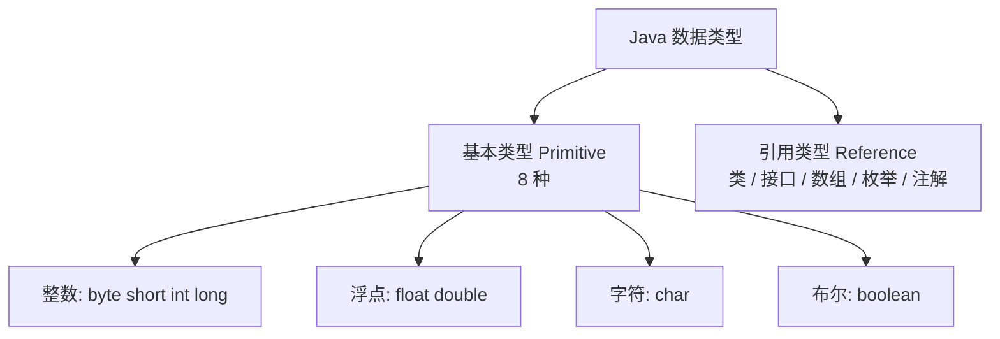
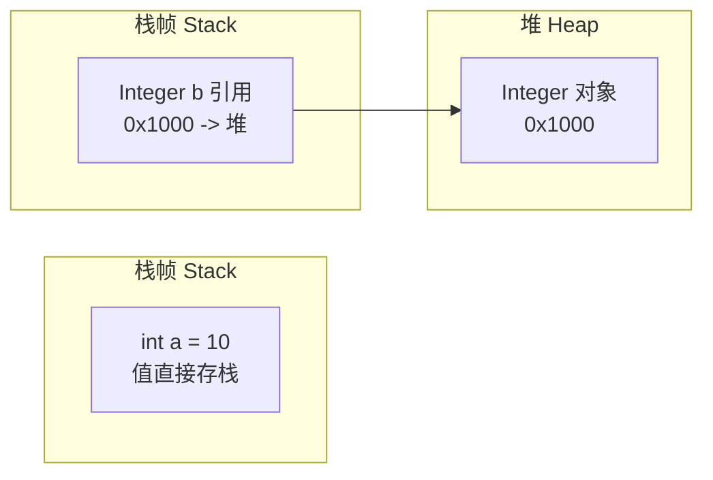
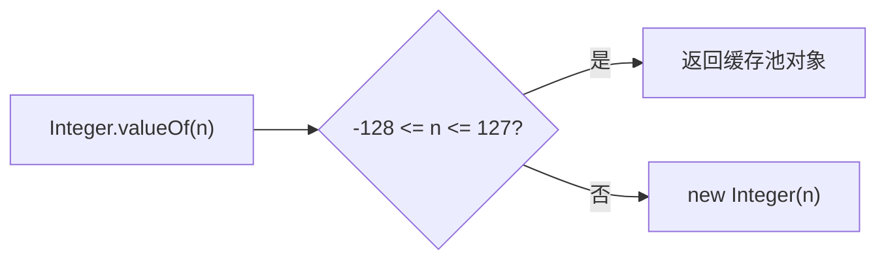

# 语言基础与数据类型

## 学习目标

- 掌握标识符命名规则、关键字(Reserved Word)与保留字的区别
- 区分基本类型(Primitive Type)与引用类型(Reference Type)的内存存储模型
- 理解数值类型提升(Numeric Promotion)规则与隐式转换中的精度丢失
- 掌握包装类(Integer 缓存、自动装箱拆箱)的底层机制与坑点

## 词法基础

### 标识符与关键字

标识符用于命名类、方法、变量，规则如下：

- 由字母、`$`、`_` 或 Unicode 字母开头，后可接数字
- 不能与 **关键字(Keyword)** 或 **字面量保留字(`true`/`false`/`null`)** 重名
- 大小写敏感：`name` 与 `Name` 是两个不同标识符

Java 共有 50+ 个关键字（如 `class`、`public`、`synchronized` 等；`var`（Java 10+）为上下文关键字）。注意 `goto`、`const` 是**保留但未使用**的关键字，同样不可作标识符。

### 注释

```java
// 单行注释
/* 多行注释，不可嵌套 */
/** 文档注释，可由 javadoc 提取为 API 文档 */
public class Demo {}
```

> 工程规范：公开 API 必须用 `/** */` 文档注释；临时调试用 `//`；避免用多行注释包裹已删除代码（交给版本控制）。

## 数据类型体系

Java 是**强类型(Strongly Typed)**语言：每个变量声明时必须明确类型，且类型在编译期确定。



### 基本类型规格

| 类型 | 位数 | 默认值 | 取值范围 | 说明 |
|------|------|--------|----------|------|
| `byte` | 8 | 0 | -128 ~ 127 | 节省内存，IO/网络常用 |
| `short` | 16 | 0 | -32768 ~ 32767 | 较少直接使用 |
| `int` | 32 | 0 | -2³¹ ~ 2³¹-1 | 最常用整数类型 |
| `long` | 64 | 0L | -2⁶³ ~ 2⁶³-1 | 大整数，字面量加 `L` |
| `float` | 32 | 0.0f | 约 ±3.4e38 | 字面量加 `f` |
| `double` | 64 | 0.0d | 约 ±1.8e308 | 默认浮点类型 |
| `char` | 16 | '\u0000' | 0 ~ 65535 | UTF-16 代码单元 |
| `boolean` | 1(逻辑) | false | `true` / `false` | JVM 规范未规定物理位数 |

### 存储模型差异（核心原理）



- **基本类型**：值直接存于栈帧局部变量表（或对象字段在堆中）
- **引用类型**：栈中仅存**引用地址**（指针），实际对象在堆(Heap)中

> 这是 Java 与 C/C++ 指针的本质区别：引用不可算术运算、不能访问任意内存，由 JVM 保证安全。

## 类型转换与提升

### 隐式转换（拓宽）

从小到大自动进行：`byte → short → int → long → float → double`，`char → int`。

```java
int a = 100;
long b = a;        // 自动拓宽，安全
double d = b;      // 自动拓宽
```

### 显式转换（窄化）与精度丢失

```java
double x = 9.99;
int y = (int) x;   // y = 9，小数部分直接截断（非四舍五入）

int big = 300;
byte c = (byte) big; // 溢出：300 超出 byte 范围，结果为 44（模 256）
```

> 窄化转换可能**静默丢失精度或溢出**，必须显式强转且需评估业务影响。

### 数值提升(Numeric Promotion)

运算时操作数按规则提升：

1. 若任一操作数为 `double`，另一提升为 `double`
2. 否则若任一为 `float`，提升为 `float`
3. 否则若任一为 `long`，提升为 `long`
4. 否则两者均提升为 `int`（即使原是 `byte`/`short`/`char`）

```java
byte b1 = 1, b2 = 2;
// byte sum = b1 + b2;  // 编译错误：b1+b2 已提升为 int
int sum = b1 + b2;       // 正确
```

## 包装类与自动装箱

每个基本类型对应一个包装类（位于 `java.lang`），用于泛型、集合、空值表达等场景。

| 基本类型 | 包装类 |
|----------|--------|
| `int` | `Integer` |
| `char` | `Character` |
| 其余 | 首字母大写的同名类（`Long`、`Double`…） |

### 自动装箱/拆箱(Autoboxing)

```java
Integer a = 100;        // 编译器自动：Integer a = Integer.valueOf(100);
int b = a;              // 编译器自动：int b = a.intValue();
```

### Integer 缓存陷阱（高频面试题）

`Integer.valueOf(int)` 对 **-128 ~ 127** 区间的值使用缓存池：

```java
Integer x = 127;
Integer y = 127;
System.out.println(x == y);   // true（同一缓存对象）

Integer m = 128;
Integer n = 128;
System.out.println(m == n);   // false（超出缓存，新建对象）

System.out.println(m.equals(n)); // true（比较值，永远用 equals）
```



> **最佳实践**：包装类比较值一律用 `equals()`，绝不用 `==`（`==` 比较的是引用地址）。

### 其他坑点

- `Integer` 与 `int` 混用：`Integer obj = null; int i = obj;` → 拆箱时抛 `NullPointerException`
- `Float`/`Double` 的 `equals` 比较会区分 `NaN`，且 `0.0 == -0.0` 但包装类 `equals` 认为不等
- 字符串转数值用 `Integer.parseInt()`，注意 `NumberFormatException`

## 字符与布尔类型

- `char` 采用 UTF-16，可直接参与整数运算：`char c = 'A' + 1;` → `'B'`
- `boolean` **只能用 `true`/`false`**，不能与 `int` 互转（不同于 C 的 0/1 约定）

## 面试要点

1. **基本类型与引用类型的存储区别？** 基本类型存值，引用类型栈存地址、堆存对象。
2. **`Integer a=128; Integer b=128; a==b` 结果？** `false`，超出缓存区间各自新建对象。
3. **为什么 `byte+byte` 结果是 `int`？** 数值提升规则要求低于 `int` 的操作数先提升为 `int`。
4. **`boolean` 占几个字节？** JVM 规范未规定物理大小，逻辑上 1 位，具体由虚拟机实现决定。

## 总结

- Java 强类型，8 种基本类型 + 引用类型，存储模型（栈值/堆对象）是理解所有对象的起点
- 数值提升、窄化溢出是隐蔽 bug 来源，涉及计算务必评估范围
- 包装类用于泛型与可空场景，比较值必须用 `equals`，注意 `Integer` 缓存区间与拆箱 NPE

## 版本差异(旧版 → Java 21)

| 特性 | 旧版(Java 8) | Java 10/21 |
|------|--------------|------------|
| 局部变量类型推断 | 无 | `var`（Java 10+）用于局部变量，简化声明 |
| 文本块 | 无 | `"""` 文本块（Java 15 正式）简化多行字符串 |
| 模式匹配 | 无 | `instanceof` 模式匹配（Java 16）、record 模式（Java 21） |
| 基本类型 | 8 种不变 | 无新增基本类型，`var`/record/sealed 增强引用类型表达 |
| Unicode 版本 | Unicode 6.2 | Unicode 15.0（Java 21） |

## 继续阅读

- 上一章：[初识 Java](00-初识Java)
- 下一章：[运算符与类型转换](02-运算符与类型转换)
