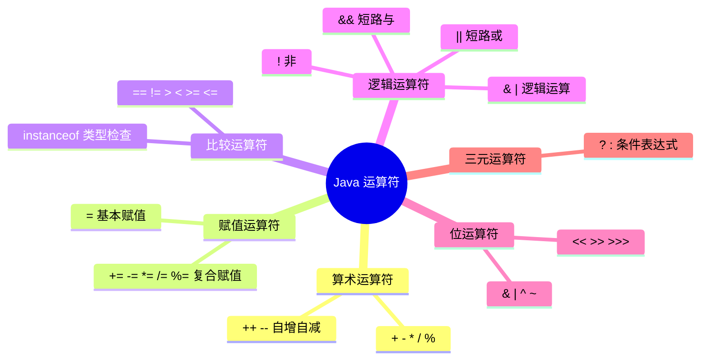
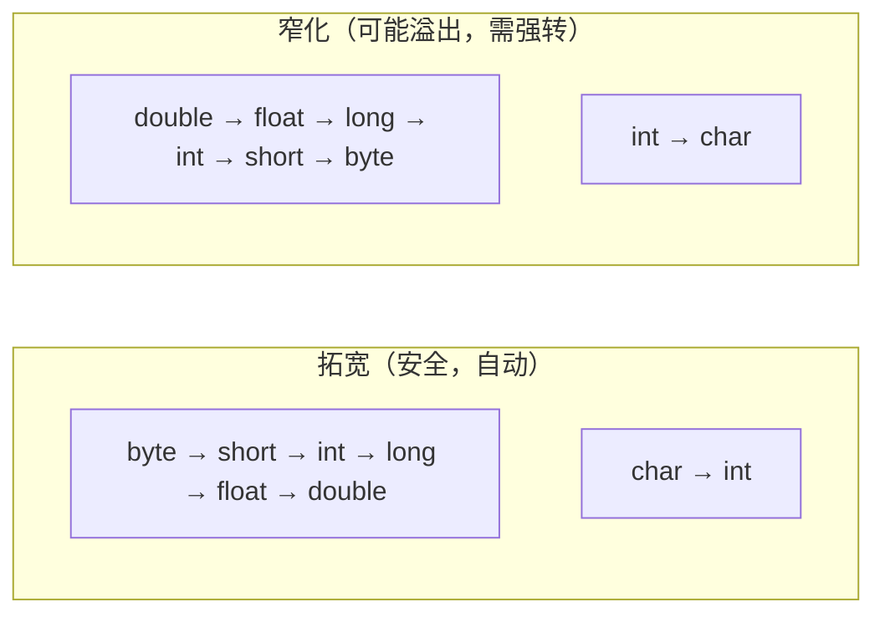

# 运算符与类型转换

## 学习目标

- 掌握 Java 全部运算符分类与语义（算术、赋值、比较、逻辑、位、三元、instanceof）
- 理解短路运算 `&&`/`||` 的执行机制及其在空指针防御中的应用
- 记忆运算符优先级与结合性表，能正确推断复杂表达式求值顺序
- 区分基本类型与引用类型的 `==` 语义，规避字符串/包装类/浮点数比较陷阱
- 理解类型提升(Numeric Promotion)与窄化转换的精度风险

## 运算符分类

Java 运算符可以分为以下几大类：



- **算术运算符**：用于数学计算
- **赋值运算符**：用于变量赋值
- **比较运算符**（关系运算符）：用于比较操作
- **逻辑运算符**：用于布尔逻辑运算
- **位运算符**：用于二进制位操作
- **三元运算符**：用于条件判断
- **instanceof 运算符**：用于类型检查

本文将从基础概念到高级应用，全面深入地讲解 Java 运算符的各个方面。

## 一、算术运算符

算术运算符是 Java 中最常用的运算符类型，用于执行基本的数学运算。它们都是二元运算符，即需要两个操作数参与运算。

### 1.1 基本算术运算符

Java 中的基本算术运算符包括：

| 运算符 | 名称 | 示例 | 结果 | 说明 |
|--------|------|------|------|------|
| `+` | 加法 | `5 + 3` | `8` | 求两个数的和 |
| `-` | 减法 | `5 - 3` | `2` | 求两个数的差 |
| `*` | 乘法 | `5 * 3` | `15` | 求两个数的积 |
| `/` | 除法 | `5 / 3` | `1` | 求两个数的商 |
| `%` | 取模 | `5 % 3` | `2` | 求余数 |

### 1.2 除法运算详解

除法运算在 Java 中有一些特殊规则，需要特别注意：

#### 整数除法

当两个整数相除时，结果也是整数，小数部分会被**直接截断**（不是四舍五入）：

```java
public class IntegerDivision {
    public static void main(String[] args) {
        System.out.println(7 / 3);    // 输出: 2(不是 2.333...,也不是 3)
        System.out.println(7 / 4);    // 输出: 1
        System.out.println(-7 / 3);   // 输出: -2

        // 常见陷阱:想要浮点数结果却得到整数
        int a = 5, b = 3;
        double result = a / b;  // 错误!result = 1.0,不是 1.666...
        System.out.println(result);  // 1.0

        // 正确的做法:至少有一个操作数是浮点数
        double correct = (double) a / b;  // 或者 a / (double) b
        System.out.println(correct);  // 1.6666666666666667

        // 实际开发场景:计算平均值
        int[] scores = {85, 90, 78, 92, 88};
        int sum = 0;
        for (int score : scores) {
            sum += score;
        }
        double average = (double) sum / scores.length;  // 正确:86.6
        System.out.println("平均分:" + average);
    }
}
```

#### 浮点数除法

如果操作数中有浮点数，则进行浮点数除法：

```java
public class FloatingDivision {
    public static void main(String[] args) {
        System.out.println(7.0 / 3);   // 2.3333333333333335
        System.out.println(7 / 3.0);   // 2.3333333333333335

        // 浮点数除以 0 的特殊情况
        System.out.println(5.0 / 0);   // Infinity(正无穷)
        System.out.println(-5.0 / 0);  // -Infinity(负无穷)
        System.out.println(0.0 / 0);   // NaN(Not a Number)
    }
}
```

::: danger

**除零异常重要提醒**：
- 整数除以 0 会抛出 `ArithmeticException` 异常
- 浮点数除以 0 会得到 `Infinity`、`-Infinity` 或 `NaN`，**不会抛出异常**

```java
int result = 5 / 0;  // 运行时抛出 ArithmeticException: / by zero
double d = 5.0 / 0;  // 结果为 Infinity
```

:::

### 1.3 取模运算详解

取模运算符 `%` 返回两个数相除后的余数。取模运算在循环、判断奇偶、数组索引等场景中有广泛应用。

#### 基本规则

取模运算的结果符号与**被除数**（左操作数）相同：

```java
public class ModuloExample {
    public static void main(String[] args) {
        System.out.println(7 % 3);    // 1
        System.out.println(-7 % 3);   // -1(符号与被除数相同)
        System.out.println(7 % -3);   // 1
        System.out.println(-7 % -3);  // -1

        // 特殊情况
        System.out.println(0 % 5);    // 0
        System.out.println(5 % 1);    // 0
        System.out.println(5 % 0);    // ArithmeticException: / by zero
    }
}
```

#### 实际应用

```java
public class ModuloApplication {
    public static void main(String[] args) {
        // 1. 判断奇偶数(最常用的场景)
        int num = 15;
        if (num % 2 == 0) {
            System.out.println(num + " 是偶数");
        } else {
            System.out.println(num + " 是奇数");
        }

        // 2. 循环数组索引(环形访问)
        String[] days = {"周一", "周二", "周三", "周四", "周五", "周六", "周日"};
        for (int i = 0; i < 14; i++) {  // 循环两周
            System.out.print(days[i % days.length] + " ");
        }
        // 输出: 周一 周二 周三 周四 周五 周六 周日 周一 周二 周三 周四 周五 周六 周日
        System.out.println();

        // 3. 提取数字各位(数字处理常用)
        int number = 12345;
        System.out.println("个位:" + (number % 10));      // 5
        System.out.println("十位:" + (number / 10 % 10));  // 4
        System.out.println("百位:" + (number / 100 % 10)); // 3

        // 4. 时间计算(实际开发场景)
        int totalSeconds = 3725;
        int hours = totalSeconds / 3600;
        int minutes = (totalSeconds % 3600) / 60;
        int seconds = totalSeconds % 60;
        System.out.printf("时长: %02d:%02d:%02d%n", hours, minutes, seconds);  // 01:02:05

        // 5. 分页计算(Web开发常见)
        int totalItems = 95;
        int pageSize = 10;
        int totalPages = (totalItems + pageSize - 1) / pageSize;  // 向上取整
        System.out.println("总页数:" + totalPages);  // 10
    }
}
```

### 1.4 字符串连接运算符

`+` 运算符除了用于数值加法外，还可以用于字符串连接。这是 Java 中唯一被重载的运算符。

#### 连接规则

当 `+` 运算符的操作数中**至少有一个是字符串**时，它会执行字符串连接操作：

```java
public class StringConcatenation {
    public static void main(String[] args) {
        // 字符串 + 字符串
        String str1 = "Hello" + " " + "World";  // "Hello World"
        System.out.println(str1);

        // 字符串 + 数字(自动转换为字符串)
        String str2 = "Age: " + 25;  // "Age: 25"
        System.out.println(str2);

        // 数字 + 字符串
        String str3 = 100 + " dollars";  // "100 dollars"
        System.out.println(str3);

        // 混合运算(注意顺序,从左到右计算)
        String str4 = 10 + 20 + " = 30";  // "30 = 30"(先计算 10+20,再连接)
        System.out.println(str4);

        String str5 = "结果:" + 10 + 20;  // "结果:1020"(从左到右连接)
        System.out.println(str5);

        String str6 = "结果:" + (10 + 20);  // "结果:30"(括号改变优先级)
        System.out.println(str6);

        // 实际开发场景:日志输出
        String username = "张三";
        int age = 25;
        double score = 98.5;
        System.out.println("用户信息 - 姓名:" + username + ", 年龄:" + age + ", 分数:" + score);
    }
}
```

#### 编译器优化

Java 编译器会对字符串连接进行优化：

```java
public class StringOptimization {
    public static void main(String[] args) {
        // 编译时常量连接(编译时优化)
        String s1 = "Hello" + " " + "World";  // 编译后: s1 = "Hello World"

        // 运行时连接
        String s2 = "Hello";
        String s3 = s2 + " " + "World";
        // Java 8 编译器优化为: new StringBuilder().append(s2).append(" ").append("World").toString()
        // Java 9+ 改用 invokedynamic(StringConcatFactory)动态拼接,语义不变

        // 性能对比
        long start = System.currentTimeMillis();

        // 方式1: 使用 + 连接(循环中效率低,不推荐)
        String result1 = "";
        for (int i = 0; i < 10000; i++) {
            result1 += i;  // 每次都创建新的 String 对象和 StringBuilder
        }
        long time1 = System.currentTimeMillis() - start;

        // 方式2: 使用 StringBuilder(推荐)
        start = System.currentTimeMillis();
        StringBuilder sb = new StringBuilder();
        for (int i = 0; i < 10000; i++) {
            sb.append(i);
        }
        String result2 = sb.toString();
        long time2 = System.currentTimeMillis() - start;

        System.out.println("方式1耗时:" + time1 + "ms");
        System.out.println("方式2耗时:" + time2 + "ms");
    }
}
```

::: tip

**字符串连接最佳实践**：
- 在编译时常量连接场景，使用 `+` 运算符即可
- 在循环或大量字符串连接场景，使用 `StringBuilder`
- 避免在循环中使用 `result += xxx`，性能极差

```java
// 推荐:简单场景
String message = "用户 " + username + " 登录成功";

// 推荐:循环场景
StringBuilder sb = new StringBuilder();
for (String item : items) {
    sb.append(item).append(",");
}

// 不推荐:循环中使用 +
String result = "";
for (String item : items) {
    result += item;  // 性能差,每次都创建新对象
}
```

:::

### 1.5 自增和自减运算符

自增 `++` 和自减 `--` 运算符是单目运算符，可以放在操作数之前（前置）或之后（后置）。

#### 前置与后置的区别

| 形式 | 名称 | 说明 | 示例 |
|------|------|------|------|
| `++a` | 前置自增 | 先加 1，再使用 | `int a = 5; int b = ++a; // a=6, b=6` |
| `a++` | 后置自增 | 先使用，再加 1 | `int a = 5; int b = a++; // a=6, b=5` |
| `--a` | 前置自减 | 先减 1，再使用 | `int a = 5; int b = --a; // a=4, b=4` |
| `a--` | 后置自减 | 先使用，再减 1 | `int a = 5; int b = a--; // a=4, b=5` |

#### 详细示例

```java
public class IncrementOperator {
    public static void main(String[] args) {
        // 基本用法
        int a = 5;
        int b = ++a;  // a 先自增为 6,然后赋值给 b
        System.out.println("a = " + a + ", b = " + b);  // a = 6, b = 6

        int c = 5;
        int d = c++;  // c 先赋值给 d,然后自增
        System.out.println("c = " + c + ", d = " + d);  // c = 6, d = 5

        // 独立使用(前置和后置效果相同)
        int x = 5;
        x++;  // x = 6
        ++x;  // x = 7
        System.out.println("x = " + x);  // x = 7

        // for 循环中的标准用法
        for (int i = 0; i < 5; i++) {  // i++ 是标准写法
            System.out.println("i = " + i);
        }

        // 数组索引中使用(实际开发场景)
        int[] arr = {10, 20, 30, 40, 50};
        int i = 0;
        System.out.println(arr[i++]);  // 10(先取 arr[0],再 i++)
        System.out.println(arr[i]);    // 20(i 已经是 1)
        System.out.println(arr[++i]);  // 30(先 ++i 自增,再取 arr[2])
    }
}
```

#### 常见陷阱

::: danger

**自增自减的陷阱**：

```java
public class IncrementTrap {
    public static void main(String[] args) {
        // 陷阱1: 复杂表达式中的自增(不推荐)
        int i = 1;
        i = i++;  // 结果: i = 1(不是 2!)
        System.out.println("i = " + i);  // i = 1

        // 解释过程:
        // 1. temp = i(保存 i 的值到临时变量,temp = 1)
        // 2. i = i + 1(i 自增,i = 2)
        // 3. i = temp(将临时变量的值赋给 i,i = 1)

        // 陷阱2: 多次自增(可读性差,容易出错)
        int a = 1;
        int b = a++ + a++ + a++;  // 过程: 1 + 2 + 3 = 6
        System.out.println("a = " + a + ", b = " + b);  // a = 4, b = 6

        // 陷阱3: 同一表达式中自增与变量读取(求值顺序)
        int x = 5;
        System.out.println(x++ + " " + x);  // 5 6(x++ 先取 5 并自增,后一个 x 已是 6)
    }
}
```

:::

::: tip

**自增自减最佳实践**：
1. **避免在复杂表达式中使用自增自减**，以免产生歧义
2. **独立使用**： `i++` 或 `++i` 单独成行
3. **在循环中**： `for (int i = 0; i < n; i++)` 是标准用法
4. **优先使用后置自增**： 在 for 循环中，`i++` 更符合习惯

```java
// 推荐:单独使用
int i = 5;
i++;  // 单独一行,清晰明了

// 推荐:for 循环中
for (int i = 0; i < 10; i++) {
    // ...
}

// 不推荐:复杂表达式中
int j = i++ + ++i;  // 可读性差,容易出错
```

:::

## 二、赋值运算符

赋值运算符用于给变量赋值。Java 中的赋值运算符分为基本赋值运算符和复合赋值运算符。

### 2.1 基本赋值运算符

基本赋值运算符 `=` 是最常用的运算符之一：

```java
public class BasicAssignment {
    public static void main(String[] args) {
        // 基本赋值
        int a = 10;
        double d = 3.14;
        String str = "Hello";

        // 连续赋值(从右到左)
        int x, y, z;
        x = y = z = 100;  // 等价于: x = (y = (z = 100));
        System.out.println("x = " + x + ", y = " + y + ", z = " + z);

        // 声明时赋值
        int m = 10, n = 20, p = 30;

        // 赋值表达式的值
        int value;
        System.out.println(value = 100);  // 输出 100(赋值表达式有返回值)

        // 常见错误
        // 10 = a;  // 编译错误:左边必须是变量
        // a + b = 20;  // 编译错误:左边必须是变量
    }
}
```

### 2.2 复合赋值运算符

复合赋值运算符将运算和赋值合并为一个操作：

| 运算符 | 示例 | 等价形式 | 说明 |
|--------|------|----------|------|
| `+=` | `a += b` | `a = a + b` | 加法赋值 |
| `-=` | `a -= b` | `a = a - b` | 减法赋值 |
| `*=` | `a *= b` | `a = a * b` | 乘法赋值 |
| `/=` | `a /= b` | `a = a / b` | 除法赋值 |
| `%=` | `a %= b` | `a = a % b` | 取模赋值 |

### 2.3 复合赋值运算符的特殊性

复合赋值运算符有一个重要的特性：**自动类型转换**

::: danger

**重要区别**：

```java
public class CompoundAssignment {
    public static void main(String[] args) {
        // 普通赋值:需要显式类型转换
        short s = 5;
        // s = s + 10;  // 编译错误!s + 10 是 int 类型
        s = (short) (s + 10);  // 必须强制转换

        // 复合赋值:自动类型转换
        short s2 = 5;
        s2 += 10;  // 编译通过!等价于 s2 = (short) (s2 + 10)

        // 潜在风险:精度丢失或溢出(编译器不会警告)
        byte b = 127;
        b += 1;  // 溢出!b = -128
        System.out.println("b = " + b);  // b = -128

        // 实际开发中的场景
        int total = 0;
        for (int i = 1; i <= 100; i++) {
            total += i;  // 累加,简洁明了
        }
        System.out.println("1到100的和:" + total);  // 5050
    }
}
```

**区别总结**：
- `a = a + b`: 需要显式类型转换，编译器会检查类型
- `a += b`: 自动类型转换，可能发生精度丢失或溢出

:::

### 2.4 赋值运算符综合示例

```java
public class AssignmentOperatorExample {
    public static void main(String[] args) {
        // 基本赋值
        int a = 10;
        System.out.println("a = " + a);  // 10

        // 复合赋值
        a += 5;  // a = 15
        System.out.println("a += 5: " + a);

        a -= 3;  // a = 12
        System.out.println("a -= 3: " + a);

        a *= 2;  // a = 24
        System.out.println("a *= 2: " + a);

        a /= 5;  // a = 4
        System.out.println("a /= 5: " + a);

        a %= 3;  // a = 1
        System.out.println("a %= 3: " + a);

        // 实际开发场景:累加器
        int sum = 0;
        int[] numbers = {1, 2, 3, 4, 5, 6, 7, 8, 9, 10};
        for (int num : numbers) {
            sum += num;  // 使用 += 累加
        }
        System.out.println("数组元素和:" + sum);  // 55

        // 实际开发场景:计数器
        int count = 0;
        for (int num : numbers) {
            if (num % 2 == 0) {  // 统计偶数个数
                count++;
            }
        }
        System.out.println("偶数个数:" + count);  // 5
    }
}
```

## 三、比较运算符（关系运算符）

比较运算符用于比较两个值的大小关系，运算结果为布尔值（`true` 或 `false`）。

### 3.1 基本比较运算符

| 运算符 | 名称 | 示例 | 结果 | 说明 |
|--------|------|------|------|------|
| `==` | 等于 | `5 == 5` | `true` | 判断两个值是否相等 |
| `!=` | 不等于 | `5 != 3` | `true` | 判断两个值是否不相等 |
| `>` | 大于 | `5 > 3` | `true` | 判断左边是否大于右边 |
| `<` | 小于 | `5 < 3` | `false` | 判断左边是否小于右边 |
| `>=` | 大于等于 | `5 >= 5` | `true` | 判断左边是否大于等于右边 |
| `<=` | 小于等于 | `5 <= 3` | `false` | 判断左边是否小于等于右边 |

### 3.2 基本数据类型比较

```java
public class PrimitiveComparison {
    public static void main(String[] args) {
        // 整数比较
        int a = 10, b = 20;
        System.out.println("a == b: " + (a == b));  // false
        System.out.println("a != b: " + (a != b));  // true
        System.out.println("a > b: " + (a > b));    // false
        System.out.println("a < b: " + (a < b));    // true

        // 字符比较(比较 Unicode 码值)
        char c1 = 'A', c2 = 'B';
        System.out.println("c1 < c2: " + (c1 < c2));  // true(A=65, B=66)

        // 布尔值比较
        boolean flag1 = true, flag2 = false;
        System.out.println("flag1 == flag2: " + (flag1 == flag2));  // false
        // System.out.println(flag1 > flag2);  // 编译错误:布尔值不能比较大小

        // 不同类型比较(自动类型提升)
        System.out.println("10 == 10.0: " + (10 == 10.0));  // true(int 自动提升为 double)
        System.out.println("'A' == 65: " + ('A' == 65));    // true(char 自动提升为 int)

        // 实际开发场景:条件判断
        int age = 18;
        if (age >= 18) {
            System.out.println("成年人");
        }

        // 实际开发场景:范围判断
        int score = 85;
        if (score >= 60 && score < 90) {
            System.out.println("成绩良好");
        }
    }
}
```

### 3.3 引用类型比较

::: warning

**重要区别**：

`==` 和 `!=` 用于引用类型时，比较的是**引用（内存地址）**，而不是对象的内容。要比较对象的内容是否相等，应使用 `equals()` 方法。

```java
public class ReferenceComparison {
    public static void main(String[] args) {
        // 字符串比较(最常见的陷阱)
        String s1 = "Hello";
        String s2 = "Hello";       // 字符串常量池中的同一个对象
        String s3 = new String("Hello");  // 堆中的新对象
        String s4 = "Hel" + "lo";  // 编译时常量,指向常量池

        System.out.println("s1 == s2: " + (s1 == s2));        // true
        System.out.println("s1 == s3: " + (s1 == s3));        // false
        System.out.println("s1.equals(s3): " + s1.equals(s3)); // true
        System.out.println("s1 == s4: " + (s1 == s4));        // true

        // 数组比较
        int[] arr1 = {1, 2, 3};
        int[] arr2 = {1, 2, 3};
        int[] arr3 = arr1;

        System.out.println("arr1 == arr2: " + (arr1 == arr2));  // false
        System.out.println("arr1 == arr3: " + (arr1 == arr3));  // true
        // 数组没有重写 equals 方法,比较的仍是引用
        System.out.println("arr1.equals(arr2): " + arr1.equals(arr2));  // false

        // 使用 Arrays.equals 比较数组内容
        System.out.println("Arrays.equals(arr1, arr2): " +
            java.util.Arrays.equals(arr1, arr2));  // true

        // 包装类比较(Integer 缓存陷阱)
        Integer i1 = 127;
        Integer i2 = 127;
        Integer i3 = 128;
        Integer i4 = 128;

        System.out.println("i1 == i2: " + (i1 == i2));  // true(缓存范围 -128~127)
        System.out.println("i3 == i4: " + (i3 == i4));  // false(超出缓存范围)
        System.out.println("i3.equals(i4): " + i3.equals(i4));  // true

        // 实际开发场景:字符串比较
        String input = "admin";
        // 错误: if (input == "admin") { ... }
        // 正确:
        if (input.equals("admin")) {
            System.out.println("管理员登录");
        }

        // 更安全的写法(避免空指针)
        if ("admin".equals(input)) {
            System.out.println("管理员登录");
        }
    }
}
```

:::

### 3.4 浮点数比较陷阱

浮点数在计算机中的存储存在精度问题，直接使用 `==` 比较可能出现错误结果：

```java
public class FloatingComparison {
    public static void main(String[] args) {
        // 经典陷阱: 0.1 + 0.2
        double d1 = 0.1 + 0.2;
        double d2 = 0.3;
        System.out.println("d1 = " + d1);  // 0.30000000000000004
        System.out.println("d2 = " + d2);  // 0.3
        System.out.println("d1 == d2: " + (d1 == d2));  // false!

        // 正确的比较方式1: 使用误差范围
        double epsilon = 1e-10;
        System.out.println("Math.abs(d1 - d2) < epsilon: " +
            (Math.abs(d1 - d2) < epsilon));  // true

        // 正确的比较方式2: 使用 BigDecimal(推荐)
        java.math.BigDecimal bd1 = new java.math.BigDecimal("0.1");
        java.math.BigDecimal bd2 = new java.math.BigDecimal("0.2");
        java.math.BigDecimal bd3 = bd1.add(bd2);
        java.math.BigDecimal bd4 = new java.math.BigDecimal("0.3");
        System.out.println("bd3.compareTo(bd4) == 0: " +
            (bd3.compareTo(bd4) == 0));  // true

        // 特殊值比较
        System.out.println("NaN == NaN: " + (Double.NaN == Double.NaN));  // false
        System.out.println("Double.isNaN(NaN): " + Double.isNaN(Double.NaN));  // true
    }
}
```

::: tip

**比较运算符最佳实践**：
1. **基本数据类型**： 使用 `==` 比较
2. **字符串**： 使用 `equals()` 方法比较内容，推荐用 `"常量".equals(变量)` 避免空指针
3. **浮点数**： 使用误差范围或 `BigDecimal` 比较
4. **数组**： 使用 `Arrays.equals()` 比较内容
5. **避免使用 `==` 比较对象**，除非明确要比较引用

:::

## 四、逻辑运算符

逻辑运算符用于组合布尔表达式，构建更复杂的逻辑条件。

### 4.1 基本逻辑运算符

| 运算符 | 名称 | 示例 | 结果 | 说明 |
|--------|------|------|------|------|
| `&&` | 逻辑与（短路） | `true && false` | `false` | 两个都为 true 才返回 true |
| `||` | 逻辑或（短路） | `true || false` | `true` | 至少一个为 true 就返回 true |
| `!` | 逻辑非 | `!true` | `false` | 取反 |
| `&` | 逻辑与（非短路） | `true & false` | `false` | 不短路 |
| `|` | 逻辑或（非短路） | `true \| false` | `true` | 不短路 |
| `^` | 逻辑异或 | `true ^ false` | `true` | 不同为 true，相同为 false |

### 4.2 逻辑运算真值表

#### 与运算（&&、&）

| A | B | A && B | A & B |
|---|---|--------|-------|
| `true` | `true` | `true` | `true` |
| `true` | `false` | `false` | `false` |
| `false` | `true` | `false` | `false` |
| `false` | `false` | `false` | `false` |

#### 或运算（||、|）

| A | B | A \|\| B | A \| B |
|---|---|--------|--------|
| `true` | `true` | `true` | `true` |
| `true` | `false` | `true` | `true` |
| `false` | `true` | `true` | `true` |
| `false` | `false` | `false` | `false` |

### 4.3 短路运算详解

短路运算符 `&&` 和 `||` 是 Java 中最常用的逻辑运算符，它们具有短路特性：

- **`&&` 短路**： 如果左边为 `false`，右边不会被执行
- **`||` 短路**： 如果左边为 `true`，右边不会被执行

```java
public class ShortCircuitDemo {
    public static void main(String[] args) {
        int a = 5;

        // && 短路
        boolean result1 = (a > 10) && (a++ > 0);
        System.out.println("result1 = " + result1);  // false
        System.out.println("a = " + a);  // 5(a++ 没有执行)

        // & 非短路
        boolean result2 = (a > 10) & (a++ > 0);
        System.out.println("result2 = " + result2);  // false
        System.out.println("a = " + a);  // 6(a++ 执行了)

        // || 短路
        int b = 5;
        boolean result3 = (b > 0) || (b++ > 10);
        System.out.println("result3 = " + result3);  // true
        System.out.println("b = " + b);  // 5(b++ 没有执行)

        // | 非短路
        boolean result4 = (b > 0) | (b++ > 10);
        System.out.println("result4 = " + result4);  // true
        System.out.println("b = " + b);  // 6(b++ 执行了)
    }
}
```

### 4.4 短路运算的实际应用

短路运算在实际开发中非常有用，特别是在防止空指针异常方面：

```java
public class ShortCircuitApplication {
    public static void main(String[] args) {
        // 1. 防止空指针异常(最常见的应用)
        String str = null;
        // if (str.equals("Hello")) {  // NullPointerException
        //     System.out.println("相等");
        // }

        if (str != null && str.equals("Hello")) {  // 安全
            System.out.println("相等");
        } else {
            System.out.println("str 为 null 或不相等");
        }

        // 2. 避免不必要的计算(性能优化)
        boolean isCacheValid = false;

        // 如果缓存有效,就不会检查数据库
        if (isCacheValid || checkDatabase()) {  // checkDatabase() 不会被调用
            System.out.println("数据可用");
        }

        // 3. 安全的类型转换
        Object obj = "Hello";
        if (obj instanceof String && ((String) obj).length() > 0) {
            String s = (String) obj;
            System.out.println("非空字符串:" + s);
        }

        // 4. 配置验证(实际开发场景)
        int port = 8080;
        String host = "localhost";
        if (port > 0 && port <= 65535 && host != null && !host.isEmpty()) {
            System.out.println("配置有效");
        }

        // 5. 用户输入验证
        String username = "admin";
        String password = "123456";
        if (username != null && !username.isEmpty() &&
            password != null && password.length() >= 6) {
            System.out.println("输入有效");
        }
    }

    private static boolean checkDatabase() {
        System.out.println("检查数据库连接...");  // 这行不会输出
        return true;
    }
}
```

::: tip

**逻辑运算符最佳实践**：
1. **优先使用短路运算符**： `&&` 和 `||` 性能更好，且能避免不必要的计算
2. **合理利用短路特性**： 将简单或可能为 false/true 的条件放在前面
3. **避免复杂逻辑**： 如果逻辑过于复杂，考虑拆分为多个条件或使用中间变量
4. **防止空指针**： 使用 `变量 != null && 变量.方法()` 的模式

```java
// 推荐:防止空指针
if (str != null && str.length() > 0) {
    // ...
}

// 推荐:性能优化(简单条件在前)
if (simpleCheck() && expensiveCheck()) {
    // ...
}

// 不推荐:过于复杂的逻辑
if ((a > b && c < d) || (e == f && g != h) || ...) {
    // 可读性差
}

// 推荐:拆分逻辑
boolean condition1 = a > b && c < d;
boolean condition2 = e == f && g != h;
if (condition1 || condition2) {
    // ...
}
```

:::

## 五、位运算符（了解）

位运算符直接对整数的二进制位进行操作，是 Java 中最底层的运算符。位运算在底层编程、算法优化等场景中非常重要。

::: tip 学习建议
位运算符对于初学者来说可能比较抽象，可以先了解基本概念，在实际开发中逐步深入学习。初学者可以跳过本节，待有一定编程基础后再学习。
:::

### 5.1 位运算符概览

| 运算符 | 名称 | 示例 | 说明 |
|--------|------|------|------|
| `&` | 按位与 | `5 & 3` | 两位都为 1 才为 1 |
| `|` | 按位或 | `5 \| 3` | 有一位为 1 就为 1 |
| `^` | 按位异或 | `5 ^ 3` | 两位不同为 1，相同为 0 |
| `~` | 按位取反 | `~5` | 0 变 1，1 变 0 |
| `<<` | 左移 | `5 << 2` | 各位左移若干位，低位补 0 |
| `>>` | 右移 | `5 >> 1` | 各位右移若干位，高位补符号位 |
| `>>>` | 无符号右移 | `5 >>> 1` | 各位右移若干位，高位补 0 |

### 5.2 常见应用

```java
public class BitwiseOperation {
    public static void main(String[] args) {
        // 1. 判断奇偶(比 % 2 更高效)
        int num = 15;
        if ((num & 1) == 1) {
            System.out.println(num + " 是奇数");
        } else {
            System.out.println(num + " 是偶数");
        }

        // 2. 快速乘除 2(左移乘 2,右移除 2)
        int a = 5;
        System.out.println("5 << 1 = " + (a << 1));  // 10 (5 * 2)
        System.out.println("5 >> 1 = " + (a >> 1));  // 2  (5 / 2)

        // 3. 交换两个变量(不使用临时变量)
        int x = 5, y = 10;
        x = x ^ y;
        y = x ^ y;
        x = x ^ y;
        System.out.println("x = " + x + ", y = " + y);  // x = 10, y = 5
    }
}
```

## 六、三元运算符（条件运算符）

三元运算符是 Java 中唯一的三元运算符，它可以简化简单的 `if-else` 语句。

### 6.1 基本语法

```java
条件 ? 表达式1 : 表达式2
```

**执行流程**：
1. 计算条件的值（必须为布尔类型）
2. 如果条件为 `true`，计算并返回 `表达式1` 的值
3. 如果条件为 `false`，计算并返回 `表达式2` 的值

### 6.2 基本用法示例

```java
public class TernaryOperatorBasic {
    public static void main(String[] args) {
        // 1. 求绝对值
        int num = -100;
        int abs = num >= 0 ? num : -num;
        System.out.println("绝对值:" + abs);  // 100

        // 2. 求最大值
        int a = 10, b = 20;
        int max = a > b ? a : b;
        System.out.println("最大值:" + max);  // 20

        // 3. 求最小值
        int min = a < b ? a : b;
        System.out.println("最小值:" + min);  // 10

        // 4. 判断奇偶
        int number = 15;
        String oddOrEven = number % 2 == 0 ? "偶数" : "奇数";
        System.out.println(number + " 是 " + oddOrEven);  // 15 是 奇数

        // 5. 判断正负零
        int value = -5;
        String sign = value > 0 ? "正数" : (value < 0 ? "负数" : "零");
        System.out.println(value + " 是 " + sign);  // -5 是 负数

        // 6. 空值处理(实际开发常见场景)
        String str = null;
        String result = str != null ? str : "默认值";
        System.out.println("结果:" + result);  // 默认值

        // 7. 成绩等级判定
        int score = 85;
        String grade = score >= 90 ? "优秀" :
                       (score >= 80 ? "良好" :
                       (score >= 60 ? "及格" : "不及格"));
        System.out.println("成绩等级:" + grade);  // 良好
    }
}
```

### 6.3 三元运算符与 if-else 的等价关系

```java
public class TernaryVsIfElse {
    public static void main(String[] args) {
        int a = 10, b = 20;

        // 三元运算符
        int max1 = a > b ? a : b;

        // 等价的 if-else
        int max2;
        if (a > b) {
            max2 = a;
        } else {
            max2 = b;
        }

        System.out.println("max1 = " + max1 + ", max2 = " + max2);

        // 实际开发场景:简化代码
        int age = 18;
        // 使用 if-else
        String status1;
        if (age >= 18) {
            status1 = "成年";
        } else {
            status1 = "未成年";
        }

        // 使用三元运算符(更简洁)
        String status2 = age >= 18 ? "成年" : "未成年";

        System.out.println("状态:" + status2);
    }
}
```

::: tip

**三元运算符最佳实践**：
1. **简单条件判断**： 优先使用三元运算符
2. **复杂逻辑**： 使用 `if-else` 语句
3. **避免深层嵌套**： 最多嵌套一层
4. **注意类型兼容性**： 确保两个表达式类型兼容

```java
// 推荐:简单条件
String status = age >= 18 ? "成年" : "未成年";
int max = a > b ? a : b;

// 不推荐:复杂嵌套
String result = a > b ? (a > c ? a : c) : (b > c ? b : c);

// 推荐:使用 if-else
int maxValue;
if (a >= b && a >= c) {
    maxValue = a;
} else if (b >= c) {
    maxValue = b;
} else {
    maxValue = c;
}
```

:::

## 七、instanceof 运算符

`instanceof` 运算符用于在运行时检查对象是否是特定类或接口的实例。

### 7.1 基本语法

```java
对象 instanceof 类型
```

返回值为 `boolean` 类型。

### 7.2 基本用法

```java
public class InstanceofBasic {
    public static void main(String[] args) {
        // 基本类型包装类
        Object obj = "Hello";
        System.out.println(obj instanceof String);    // true
        System.out.println(obj instanceof Object);    // true
        System.out.println(obj instanceof Integer);   // false

        // 接口检查
        java.util.List<String> list = new java.util.ArrayList<>();
        System.out.println(list instanceof java.util.List);     // true
        System.out.println(list instanceof java.util.ArrayList);// true
        System.out.println(list instanceof java.util.Collection);// true

        // 数组检查
        int[] arr = new int[10];
        System.out.println(arr instanceof int[]);     // true
        System.out.println(arr instanceof Object);    // true

        // null 检查
        String str = null;
        System.out.println(str instanceof String);    // false
    }
}
```

### 7.3 继承关系中的 instanceof

```java
class Animal {}
class Dog extends Animal {}
class Cat extends Animal {}

public class InstanceofInheritance {
    public static void main(String[] args) {
        Animal animal = new Dog();

        System.out.println("animal instanceof Dog: " + (animal instanceof Dog));    // true
        System.out.println("animal instanceof Animal: " + (animal instanceof Animal)); // true
        System.out.println("animal instanceof Cat: " + (animal instanceof Cat));    // false

        // 向下转型前的检查(最常用的场景)
        if (animal instanceof Dog) {
            Dog dog = (Dog) animal;  // 安全的向下转型
            System.out.println("成功转换为 Dog");
        }

        // 不安全的转型(编译通过,运行时抛出 ClassCastException)
        // Cat cat = (Cat) animal;  // ClassCastException
    }
}
```

### 7.4 Java 16+ 的模式匹配

从 Java 16 开始，`instanceof` 支持模式匹配（JEP 394），可以在判断的同时进行类型转换：

```java
public class InstanceofPatternMatching {
    public static void main(String[] args) {
        Object obj = "Hello World";

        // 传统写法
        if (obj instanceof String) {
            String str = (String) obj;
            System.out.println("字符串长度:" + str.length());
        }

        // Java 16+ 模式匹配写法(更简洁)
        if (obj instanceof String str) {
            System.out.println("字符串长度:" + str.length());
        }

        // 带条件限制的模式匹配
        if (obj instanceof String str && str.length() > 5) {
            System.out.println("长字符串:" + str);
        }
    }
}
```

::: warning

**注意事项**：
1. **null 的检查**： `null instanceof 任何类型` 都返回 `false`
2. **只能用于引用类型**： 不能用于基本数据类型

```java
String str = null;
System.out.println(str instanceof String);  // false
System.out.println(str instanceof Object);  // false

int i = 10;
// System.out.println(i instanceof Integer);  // 编译错误
```

:::

### 7.5 Java 21 模式匹配进阶：record 模式与嵌套解构

Java 16 正式化的 `instanceof` 模式匹配在 Java 21（JEP 440）进一步扩展为 **record 模式（Record Patterns）**，支持对 record 对象做嵌套解构，与 switch 模式匹配（JEP 441）组合可写出声明式、穷尽的分支逻辑。

```java
// Java 21: record 模式基本用法
record Point(int x, int y) {}
record Line(Point start, Point end) {}

public class RecordPatternDemo {
    // 直接解构 record 组件
    static String describe(Object obj) {
        if (obj instanceof Point(int x, int y)) {
            return "坐标: (" + x + ", " + y + ")";
        }
        return "非坐标对象";
    }

    // 嵌套解构：一条语句解构两层结构
    static String describeLine(Object obj) {
        if (obj instanceof Line(Point(int x1, int y1), Point(int x2, int y2))) {
            return "线段: (" + x1 + "," + y1 + ") -> (" + x2 + "," + y2 + ")";
        }
        return "非线段对象";
    }

    public static void main(String[] args) {
        System.out.println(describe(new Point(3, 4)));          // 坐标: (3, 4)
        System.out.println(describeLine(new Line(
            new Point(0, 0), new Point(10, 10))));              // 线段: (0,0) -> (10,10)
    }
}
```

**关键规则**：

1. `null` 不会匹配任何 record 模式（与 `instanceof` 一致，返回 `false`）
2. 嵌套模式中的绑定变量必须唯一，不可重复声明
3. record 模式可与 `instanceof` 流程语句、`switch` 表达式（JEP 441）两种上下文组合

**与 switch 模式匹配的组合应用**：

```java
// 穷尽性由编译器保证（密封类 + record 模式）
sealed interface Shape permits Circle, Rectangle {}
record Circle(double r) implements Shape {}
record Rectangle(double w, double h) implements Shape {}

public class ShapeDemo {
    static double area(Shape s) {
        return switch (s) {
            case Circle c -> Math.PI * c.r() * c.r();
            case Rectangle r -> r.w() * r.h();
        };  // 密封类下无需 default，编译器验证穷尽
    }

    public static void main(String[] args) {
        System.out.println(area(new Circle(2)));        // 12.566370614359172
        System.out.println(area(new Rectangle(3, 4)));  // 12.0
    }
}
```

> **演进**：Java 16 预览 → Java 19 预览（record 模式）→ Java 21 正式（JEP 440/441）。生产环境可直接使用。

## 八、运算符优先级与结合性

### 8.1 完整的优先级表

Java 运算符的优先级从高到低排列：

| 优先级 | 运算符 | 名称 | 结合性 |
|--------|--------|------|--------|
| 1 | `()` `[]` `.` | 括号、数组下标、成员访问 | 左→右 |
| 2 | `!` `~` `++` `--` `+` `-` | 逻辑非、按位取反、自增自减、正负号 | 右→左 |
| 3 | `*` `/` `%` | 乘、除、取模 | 左→右 |
| 4 | `+` `-` | 加、减（及字符串连接） | 左→右 |
| 5 | `<<` `>>` `>>>` | 左移、右移、无符号右移 | 左→右 |
| 6 | `<` `<=` `>` `>=` `instanceof` | 比较运算符 | 左→右 |
| 7 | `==` `!=` | 相等性判断 | 左→右 |
| 8 | `&` | 按位与 | 左→右 |
| 9 | `^` | 按位异或 | 左→右 |
| 10 | `|` | 按位或 | 左→右 |
| 11 | `&&` | 逻辑与（短路） | 左→右 |
| 12 | `||` | 逻辑或（短路） | 左→右 |
| 13 | `? :` | 三元运算符 | 右→左 |
| 14 | `=` `+=` `-=` `*=` `/=` `%=` `<<=` `>>=` `>>>=` `&=` `^=` `\|=` | 赋值运算符 | 右→左 |

### 8.2 优先级示例

```java
public class PrecedenceExample {
    public static void main(String[] args) {
        // 示例1: 算术运算符优先级
        int a = 2 + 3 * 4 - 5;  // 等价于 2 + (3 * 4) - 5 = 9
        System.out.println("2 + 3 * 4 - 5 = " + a);

        // 示例2: 比较和逻辑运算符
        boolean b1 = 5 > 3 && 2 < 1;  // 等价于 (5 > 3) && (2 < 1) = true && false = false
        System.out.println("5 > 3 && 2 < 1: " + b1);

        // 示例3: 位运算和比较运算符(三元优先级低于 &,必须加括号)
        int c = 5 & (3 > 2 ? 1 : 0);  // 等价于 5 & ((3 > 2) ? 1 : 0) = 5 & 1 = 1
        System.out.println("5 & 3 > 2 ? 1 : 0 = " + c);

        // 示例4: 复杂的混合运算
        int f = 1 + 2 * 3 - 4 / 2 << 1;  // 等价于 ((1 + (2 * 3)) - (4 / 2)) << 1 = (7 - 2) << 1 = 10
        System.out.println("1 + 2 * 3 - 4 / 2 << 1 = " + f);
    }
}
```

### 8.3 如何避免优先级问题

::: tip

**最佳实践**：

1. **不确定就加括号**： 括号优先级最高，使用括号可以明确运算顺序

```java
// 不清晰
int result = a + b * c | d & e;

// 清晰
int result = (a + (b * c)) | (d & e);
```

2. **拆分复杂表达式**： 将复杂表达式拆分为多个简单表达式

```java
// 复杂
int result = a + b * c - d / e << f & g | h;

// 清晰
int temp1 = b * c;
int temp2 = d / e;
int temp3 = a + temp1 - temp2;
int result = temp3 << f;
```

3. **避免连续比较**

```java
// 错误
if (a < b < c) { }  // 编译错误

// 正确
if (a < b && b < c) { }
```

4. **注意位运算优先级**： 位运算的优先级低于比较运算符

```java
// 错误意图: 检查第 3 位是否为 1
if (flags & 0b1000 != 0) { }  // 错误!等价于 flags & (0b1000 != 0)

// 正确
if ((flags & 0b1000) != 0) { }
```

:::

## 九、常见陷阱与最佳实践

### 9.1 常见陷阱总结

#### 整数除法陷阱

```java
public class IntegerDivisionTrap {
    public static void main(String[] args) {
        // 错误: 想要得到浮点数结果,却得到整数
        int a = 1, b = 3;
        double result = a / b;  // 0.0

        // 正确: 至少一个操作数使用浮点数
        double correct = 1.0 / 3;  // 0.333...

        System.out.println("错误:" + result);
        System.out.println("正确:" + correct);
    }
}
```

#### 浮点数比较陷阱

```java
public class FloatingComparisonTrap {
    public static void main(String[] args) {
        // 错误: 直接用 == 比较浮点数
        double d1 = 0.1 + 0.2;
        double d2 = 0.3;
        System.out.println("d1 == d2: " + (d1 == d2));  // false

        // 正确: 使用误差范围
        final double EPSILON = 1e-10;
        System.out.println("接近相等:" + (Math.abs(d1 - d2) < EPSILON));  // true

        // 或者使用 BigDecimal
        java.math.BigDecimal bd1 = new java.math.BigDecimal("0.1");
        java.math.BigDecimal bd2 = new java.math.BigDecimal("0.2");
        java.math.BigDecimal sum = bd1.add(bd2);
        java.math.BigDecimal target = new java.math.BigDecimal("0.3");
        System.out.println("BigDecimal 比较:" + (sum.compareTo(target) == 0));  // true
    }
}
```

#### 字符串比较陷阱

```java
public class StringComparisonTrap {
    public static void main(String[] args) {
        String s1 = new String("Hello");
        String s2 = new String("Hello");

        // 错误: 使用 == 比较字符串
        System.out.println("s1 == s2: " + (s1 == s2));  // false

        // 正确: 使用 equals 方法
        System.out.println("s1.equals(s2): " + s1.equals(s2));  // true

        // 更安全的写法(避免空指针)
        String input = null;
        // if (input.equals("admin")) { ... }  // NullPointerException
        if ("admin".equals(input)) {  // 安全
            System.out.println("管理员");
        }
    }
}
```

#### 自增自减陷阱

```java
public class IncrementTrap {
    public static void main(String[] args) {
        // 陷阱: 复杂表达式中的自增
        int i = 1;
        i = i++;  // i 仍然是 1
        System.out.println("i = i++ 后 i = " + i);

        // 正确: 单独使用
        int m = 1;
        m++;  // 或 ++m
        System.out.println("m = " + m);
    }
}
```

### 9.2 最佳实践总结

#### 使用括号明确优先级

```java
public class UseParentheses {
    public static void main(String[] args) {
        // 不清晰
        int result1 = 2 + 3 * 4 - 5;

        // 清晰
        int result2 = 2 + (3 * 4) - 5;

        // 位运算
        int flags = 0b1010;
        if ((flags & 0b1000) != 0) {
            // ...
        }
    }
}
```

#### 合理使用短路运算

```java
public class UseShortCircuit {
    public static void main(String[] args) {
        // 空值检查(最常见的应用)
        String str = getString();
        if (str != null && !str.isEmpty()) {
            System.out.println("有效字符串");
        }

        // 避免不必要的计算
        if (isCacheValid() || isDataFromDatabase()) {
            System.out.println("数据有效");
        }
    }

    private static String getString() {
        return null;
    }

    private static boolean isCacheValid() {
        return false;
    }

    private static boolean isDataFromDatabase() {
        System.out.println("从数据库查询");
        return true;
    }
}
```

#### 注意类型转换

```java
public class TypeConversionPractice {
    public static void main(String[] args) {
        // 整数除法转浮点数
        double result = 1.0 / 3;  // 或 (double) 1 / 3

        // 避免溢出
        long largeValue = 12345678901L;

        // 使用 Math 方法检查溢出(Java 8+)
        try {
            int safe = Math.toIntExact(largeValue);
        } catch (ArithmeticException e) {
            System.out.println("数值超出 int 范围");
        }
    }
}
```

#### 字符串处理最佳实践

```java
public class StringPractice {
    public static void main(String[] args) {
        // 比较: 使用 equals(推荐用常量.equals(变量)避免空指针)
        String s1 = "Hello";
        String s2 = new String("Hello");
        if ("Hello".equals(s2)) {
            System.out.println("字符串相等");
        }

        // 拼接: 循环中使用 StringBuilder
        StringBuilder sb = new StringBuilder();
        for (int i = 0; i < 100; i++) {
            sb.append(i).append(",");
        }
        String result = sb.toString();
    }
}
```

## 十、类型提升与窄化转换

运算符运算时涉及的隐式类型转换规则，是本章最容易引发隐蔽 bug 的部分，单独说明。

### 10.1 数值提升(Numeric Promotion)

二元运算时操作数按以下顺序提升：

1. 若任一操作数为 `double`，另一提升为 `double`
2. 否则若任一为 `float`，提升为 `float`
3. 否则若任一为 `long`，提升为 `long`
4. 否则两者均提升为 `int`（即使原是 `byte`/`short`/`char`）

```java
byte b1 = 1, b2 = 2;
// byte sum = b1 + b2;  // 编译错误：b1+b2 已提升为 int
int sum = b1 + b2;       // 正确
```

### 10.2 隐式与显式转换



```java
int a = 100;
long b = a;        // 自动拓宽
double d = b;      // 自动拓宽

double x = 9.99;
int y = (int) x;   // y = 9，小数截断

int big = 300;
byte c = (byte) big; // 溢出：300 超出 byte 范围，结果为 44（模 256）
```

> 窄化转换可能**静默丢失精度或溢出**，必须显式强转且需评估业务影响。

## 十一、面试要点

1. **`&&` 与 `&` 的区别？** `&&` 短路（左 false 右不执行），`&` 非短路且可作位运算；逻辑场景一律用 `&&`/`||`。
2. **`Integer a=128; Integer b=128; a==b` 结果？** `false`，超出 `Integer` 缓存区间（-128~127）各自新建对象，比较值用 `equals`。
3. **浮点数 `0.1+0.2==0.3` 为何为 `false`？** IEEE 754 二进制浮点不精确，应使用误差范围或 `BigDecimal`。
4. **`i = i++` 为什么 i 还是 1？** 后缀自增先把原值存入临时变量、自增、再把临时值赋回，最终覆盖为原值。
5. **位运算优先级为何容易出错？** 位运算（`&`/`|`/`^`）优先级低于比较运算，写 `flags & 0x8 != 0` 会被解析为 `flags & (0x8 != 0)`，必须加括号。

## 十二、总结

运算符是 Java 编程的基础，深入理解运算符对于编写高质量代码至关重要：

1. **算术运算符**： 用于数学计算，注意整数除法和取模运算
2. **赋值运算符**： 包括基本赋值和复合赋值，注意自动类型转换
3. **比较运算符**： 用于比较操作，注意引用类型和浮点数比较
4. **逻辑运算符**： 用于布尔运算，理解短路特性
5. **三元运算符**： 简化简单条件判断
6. **instanceof 运算符**： 类型检查和安全转型
7. **优先级和结合性**： 不确定就加括号
8. **类型转换**： 理解自动提升和强制转换
9. **避免陷阱**： 掌握常见错误和最佳实践

通过系统学习和大量练习，你将能够熟练运用 Java 运算符，编写出高效、安全、可读性强的代码。

## 版本差异(旧版 → Java 21)

| 特性 | 旧版(Java 8/11) | Java 21 |
|------|----------------|---------|
| instanceof | 仅返回布尔值，转型需手动强转 | 模式匹配（Java 16, JEP 394）：`if (obj instanceof String s)` 边判断边绑定 |
| record 模式 | 无 | 嵌套解构 record 组件（JEP 440），如 `if (obj instanceof Point(int x, int y))` |
| switch 模式匹配 | 不支持对象类型匹配 | JEP 441 正式：类型模式 + `when` 守卫 + `case null` |
| 穷尽性检查 | 无 | 密封类 + 模式匹配时编译器强制穷尽分支 |

## 继续阅读

- 上一章：[语言基础与数据类型](01-语言基础与数据类型)
- 下一章：[流程控制](03-流程控制)
