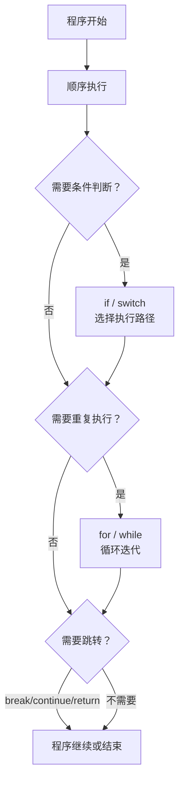
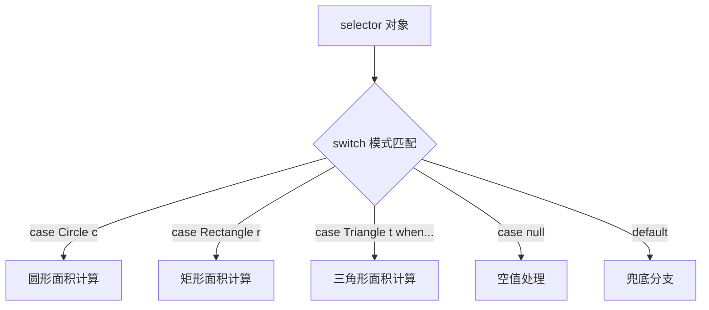

# 流程控制

## 学习目标

- 掌握 `if-else` 与 `switch`（含 Java 12+ 表达式、Java 21 模式匹配）两种分支结构的适用场景与 fall-through 行为
- 理解 `for` / 增强 for / `while` / `do-while` 循环的执行时机与差异
- 区分 `break` / `continue` / `return` 三类控制转移语句的作用范围
- 掌握 `label` 跳出多层循环的技巧与可读性权衡
- 识别 `switch` 缺少 `break` 穿透、浮点/布尔不可作 `switch` 变量等常见陷阱

流程控制是编程的核心机制,决定了代码的执行顺序。Java 提供了完整的流程控制结构,包括条件语句、循环语句和跳转语句,使程序能够根据不同条件执行不同操作,实现复杂的业务逻辑。

## 核心概念

### 什么是流程控制

流程控制是程序的"决策中枢"，它赋予程序判断和选择的能力：



::::: tip 流程控制的本质

```
顺序执行 → 条件判断 → 循环迭代 → 跳转控制
```

**三大作用**:
1. **决策能力**: 根据条件选择执行路径(if/switch)
2. **重复能力**: 高效执行重复任务(for/while)
3. **控制能力**: 灵活改变执行流程(break/continue/return)

**核心价值**:
- **避免冗余**: 用循环替代重复代码
- **逻辑清晰**: 用条件判断表达业务规则
- **高效执行**: 只执行必要的代码路径

:::::

### 流程控制分类

```
流程控制
├── 条件语句
│   ├── if 语句 (单一条件)
│   ├── if-else 语句 (二选一)
│   ├── if-else-if 语句 (多选一)
│   └── switch 语句 (多分支选择)
├── 循环语句
│   ├── for 循环 (已知次数)
│   ├── while 循环 (已知条件)
│   ├── do-while 循环 (至少一次)
│   └── for-each 循环 (遍历集合)
└── 跳转语句
    ├── break (跳出)
    ├── continue (跳过)
    └── return (返回)
```

## 条件语句详解

条件语句使程序具有"判断"能力,根据不同条件执行不同的代码路径。

### if 条件语句

#### if 语句原理

**语法结构**:
```java
if (布尔表达式) {
    // 条件为 true 时执行的代码块
}
```

**执行流程**:
```
开始
  ↓
计算布尔表达式
  ↓
  ├─ true → 执行代码块 → 继续
  └─ false → 直接继续
```

**核心要点**:
- 条件表达式必须是 `boolean` 类型
- 代码块用 `{}` 包裹(即使只有一行)
- 条件为 `false` 时跳过整个代码块

#### 基本 if 语句

**示例：成年判断**

```java
public class BasicIfExample {
    public static void main(String[] args) {
        int age = 18;
        
        // 基本的 if 语句
        if (age >= 18) {
            System.out.println("您已成年，可以观看此电影");
        }
        
        System.out.println("程序继续执行...");
    }
}
```

**执行分析**:
```
1. 声明 age = 18
2. 计算条件: age >= 18 → 18 >= 18 → true
3. 执行 if 块: 打印"您已成年..."
4. 继续执行: 打印"程序继续执行..."
```

#### if-else 语句

**语法结构**:
```java
if (条件) {
    // 条件为 true 时执行
} else {
    // 条件为 false 时执行
}
```

**特点**: 二选一结构,必然执行其中一个分支

**示例：成绩判断**

```java
public class IfElseExample {
    public static void main(String[] args) {
        int score = 55;
        
        if (score >= 60) {
            System.out.println("恭喜，您及格了！");
        } else {
            System.out.println("很遗憾，您不及格，需要补考。");
        }
    }
}
```

#### if-else-if 语句链

**语法结构**:
```java
if (条件1) {
    // 条件1 为 true
} else if (条件2) {
    // 条件1 为 false 且 条件2 为 true
} else if (条件3) {
    // 条件1、2 为 false 且 条件3 为 true
} else {
    // 所有条件都为 false
}
```

**执行特点**: 从上到下依次判断,一旦某个条件为 `true` 就执行对应代码块,然后跳出整个结构

**示例：成绩等级**

```java
public class GradeExample {
    public static void main(String[] args) {
        int score = 85;
        
        if (score >= 90) {
            System.out.println("优秀");
        } else if (score >= 80) {
            System.out.println("良好");  // 执行这里
        } else if (score >= 70) {
            System.out.println("中等");
        } else if (score >= 60) {
            System.out.println("及格");
        } else {
            System.out.println("不及格");
        }
    }
}
```

**执行流程详解**:
```
1. 判断 score >= 90: 85 >= 90 → false
2. 判断 score >= 80: 85 >= 80 → true
3. 执行对应语句块,打印"良好"
4. 跳出整个 if-else-if 结构
```

::::: warning 条件判断顺序的重要性

**错误示例**：条件顺序不当

```java
// × 错误：先判断宽泛的条件
int score = 85;

if (score >= 60) {
    System.out.println("及格");  // score=85 会输出这个
} else if (score >= 70) {
    System.out.println("中等");  // 永远不会执行
} else if (score >= 80) {
    System.out.println("良好");  // 永远不会执行
} else if (score >= 90) {
    System.out.println("优秀");  // 永远不会执行
}
```

**正确示例**：从严格到宽松

```java
// √ 正确：从高到低判断
int score = 85;

if (score >= 90) {
    System.out.println("优秀");
} else if (score >= 80) {
    System.out.println("良好");  // 正确输出
} else if (score >= 70) {
    System.out.println("中等");
} else if (score >= 60) {
    System.out.println("及格");
}
```

**排序原则**:
- 从范围小到范围大
- 从具体条件到一般条件
- 从最可能满足到最不可能满足

:::::

#### 嵌套 if 语句

`if` 语句可以嵌套使用,实现复杂的条件判断:

```java
public class NestedIfExample {
    public static void main(String[] args) {
        int age = 25;
        boolean hasLicense = true;
        
        // 嵌套 if 语句
        if (age >= 18) {
            System.out.println("年龄符合要求");
            
            if (hasLicense) {
                System.out.println("有驾照，可以驾驶");
            } else {
                System.out.println("没有驾照，需要先考取驾照");
            }
        } else {
            System.out.println("年龄不符合要求，不能驾驶");
        }
    }
}
```

::::: tip 避免深层嵌套的最佳实践

**问题代码**：过多的嵌套

```java
// × 不推荐：深层嵌套难以阅读
public void processOrder(Order order) {
    if (order != null) {
        if (order.isValid()) {
            if (order.hasItems()) {
                if (order.getPayment() != null) {
                    if (order.getPayment().isValid()) {
                        processPayment(order);
                    } else {
                        throw new InvalidPaymentException();
                    }
                } else {
                    throw new MissingPaymentException();
                }
            } else {
                throw new EmptyOrderException();
            }
        } else {
            throw new InvalidOrderException();
        }
    } else {
        throw new NullPointerException("Order is null");
    }
}
```

**解决方案 1**：使用卫语句(Guard Clause)

```java
// √ 推荐：使用卫语句减少嵌套
public void processOrder(Order order) {
    // 提前检查并返回异常情况
    if (order == null) {
        throw new NullPointerException("Order is null");
    }
    
    if (!order.isValid()) {
        throw new InvalidOrderException();
    }
    
    if (!order.hasItems()) {
        throw new EmptyOrderException();
    }
    
    if (order.getPayment() == null) {
        throw new MissingPaymentException();
    }
    
    if (!order.getPayment().isValid()) {
        throw new InvalidPaymentException();
    }
    
    // 处理正常逻辑
    processPayment(order);
}
```

**解决方案 2**：合并条件

```java
// √ 推荐：合并相关条件
public void processOrder(Order order) {
    validateOrder(order);
    processPayment(order);
}

private void validateOrder(Order order) {
    if (order == null) {
        throw new NullPointerException("Order is null");
    }
    if (!order.isValid() || !order.hasItems()) {
        throw new InvalidOrderException();
    }
    if (order.getPayment() == null || !order.getPayment().isValid()) {
        throw new InvalidPaymentException();
    }
}
```

:::::

#### 花括号使用规范

**关键原则**: 始终使用花括号,即使只有一行代码

```java
public class BraceExample {
    public static void main(String[] args) {
        int n = 70;
        
        // √ 推荐：始终使用花括号
        if (n >= 60) {
            System.out.println("及格了");
        }
        
        // × 不推荐：省略花括号
        if (n >= 60)
            System.out.println("及格了");
        
        //  容易出错的例子
        if (n >= 60)
            System.out.println("及格了");
            System.out.println("恭喜！");  // 这行不在 if 块内，但缩进误导了读者
    }
}
```

::::: danger 为什么不应该省略花括号

**问题 1**：Git 合并冲突

```java
// 开发者 A 添加了一行代码
if (condition)
    doSomething();
    doAnotherThing();  // A 添加

// 开发者 B 也添加了一行
if (condition)
    doSomething();
    doSomethingElse();  // B 添加

// 合并后可能产生难以察觉的 bug
if (condition)
    doSomething();
    doAnotherThing();  // 这行会执行吗？
    doSomethingElse();  // 这行会执行吗？
```

**问题 2**：维护时的错误

```java
// 原始代码
if (score >= 60)
    System.out.println("及格");

// 后来需要添加日志
if (score >= 60)
    System.out.println("及格");
    log.info("学生及格");  // 这行总是会执行，不是 if 的一部分！
```

**最佳实践**:
- 始终使用花括号,即使只有一行代码
- 这是 Google、Oracle 等公司的编码规范要求
- 现代 IDE 可以自动格式化花括号

:::::

#### 条件表达式简化

复杂的条件表达式应该提取为方法或变量:

```java
public class ConditionSimplification {
    
    // × 不好的例子：复杂的条件判断
    public void process(User user) {
        if (user != null && user.getAge() >= 18 && 
            user.getAge() <= 65 && user.isActive() && 
            user.hasPermission("admin")) {
            // 处理逻辑
        }
    }
    
    // √ 好的例子：提取条件为方法
    public void processBetter(User user) {
        if (isValidUser(user)) {
            // 处理逻辑
        }
    }
    
    private boolean isValidUser(User user) {
        return user != null && 
               isWorkingAge(user.getAge()) && 
               user.isActive() && 
               user.hasPermission("admin");
    }
    
    private boolean isWorkingAge(int age) {
        return age >= 18 && age <= 65;
    }
}
```

#### 三元运算符

对于简单的 `if-else` 赋值,可以使用三元运算符:

**语法**: `条件 ? 值1 : 值2`

**示例**:

```java
public class TernaryOperatorExample {
    public static void main(String[] args) {
        int score = 75;
        
        // 使用 if-else
        String result1;
        if (score >= 60) {
            result1 = "及格";
        } else {
            result1 = "不及格";
        }
        
        // 使用三元运算符（更简洁）
        String result2 = score >= 60 ? "及格" : "不及格";
        
        System.out.println(result1);  // 输出：及格
        System.out.println(result2);  // 输出：及格
        
        // 嵌套三元运算符
        String grade = score >= 90 ? "优秀" :
                       score >= 80 ? "良好" :
                       score >= 70 ? "中等" :
                       score >= 60 ? "及格" : "不及格";
        
        System.out.println(grade);  // 输出：中等
    }
}
```

::::: warning 三元运算符的使用注意

```java
// √ 适合使用三元运算符的场景
String status = isActive ? "活跃" : "非活跃";
int max = a > b ? a : b;

// × 不适合使用三元运算符的场景
// 1. 有副作用
String result = flag ? doSomething() : doOther();  // 不清晰

// 2. 过于复杂
int value = a > b ? (c > d ? e : f) : (g > h ? i : j);  // 难以理解

// 3. 嵌套过深
String result = condition1 ? 
                (condition2 ? value1 : value2) : 
                (condition3 ? value3 : value4);  // 不如用 if-else
```

**使用原则**:
- 只在简单的赋值场景使用
- 不要嵌套超过一层
- 不要在有副作用的表达式中使用
- 可读性优先于简洁性

:::::

### switch 多重选择语句

`switch` 语句是一种多分支选择结构,根据表达式的值从多个分支中选择一个执行。

#### switch 语句原理

**语法结构**:
```java
switch (表达式) {
    case 值1:
        // 语句块1
        break;
    case 值2:
        // 语句块2
        break;
    case 值3:
        // 语句块3
        break;
    default:
        // 默认语句块
        break;
}
```

**执行流程**:
```
开始
  ↓
计算 switch 表达式
  ↓
与各个 case 值比较
  ↓
  ├─ 匹配成功 → 执行对应 case 块
  │              ↓
  │           遇到 break → 跳出 switch
  │
  └─ 全部不匹配 → 执行 default 块(如果有)
```

**关键规则**:
1. 表达式类型: `byte`、`short`、`char`、`int`、枚举、`String`(Java 7+)
2. `case` 值必须是常量,不能是变量
3. `break` 用于跳出 switch 结构
4. `default` 分支可选,处理所有不匹配的情况

#### 基本 switch 示例

```java
public class BasicSwitchExample {
    public static void main(String[] args) {
        int dayOfWeek = 3;
        
        switch (dayOfWeek) {
            case 1:
                System.out.println("星期一");
                break;
            case 2:
                System.out.println("星期二");
                break;
            case 3:
                System.out.println("星期三");  // 执行这里
                break;
            case 4:
                System.out.println("星期四");
                break;
            case 5:
                System.out.println("星期五");
                break;
            case 6:
                System.out.println("星期六");
                break;
            case 7:
                System.out.println("星期日");
                break;
            default:
                System.out.println("无效的日期");
                break;
        }
    }
}
```

#### switch 穿透现象

`switch` 语句的一个重要特性是"穿透性"(fall-through)。如果 `case` 后面没有 `break`,程序会继续执行下一个 `case` 的语句。

::::: warning switch 穿透的陷阱

```java
public class SwitchFallThrough {
    public static void main(String[] args) {
        int option = 2;
        
        // × 忘记写 break 导致穿透
        switch (option) {
            case 1:
                System.out.println("选择1");
            case 2:
                System.out.println("选择2");  // 从这里开始执行
            case 3:
                System.out.println("选择3");  // 继续执行
            default:
                System.out.println("默认选项");  // 继续执行
        }
        
        // 输出：
        // 选择2
        // 选择3
        // 默认选项
    }
}
```

**正确写法**:

```java
public class SwitchCorrect {
    public static void main(String[] args) {
        int option = 2;
        
        // √ 每个 case 都有 break
        switch (option) {
            case 1:
                System.out.println("选择1");
                break;
            case 2:
                System.out.println("选择2");  // 只执行这一行
                break;
            case 3:
                System.out.println("选择3");
                break;
            default:
                System.out.println("默认选项");
                break;
        }
        
        // 输出：选择2
    }
}
```

:::::

#### 利用穿透实现多个 case 执行相同代码

有时多个 `case` 需要执行相同的代码,可以利用穿透特性:

```java
public class MultipleCaseExample {
    public static void main(String[] args) {
        int month = 2;
        
        // 判断季节
        switch (month) {
            case 12:
            case 1:
            case 2:
                System.out.println("冬季");
                break;
            case 3:
            case 4:
            case 5:
                System.out.println("春季");
                break;
            case 6:
            case 7:
            case 8:
                System.out.println("夏季");
                break;
            case 9:
            case 10:
            case 11:
                System.out.println("秋季");
                break;
            default:
                System.out.println("无效的月份");
                break;
        }
    }
}
```

#### switch 支持的数据类型

**1. 基本数据类型**

```java
public class SwitchTypes {
    public static void main(String[] args) {
        // byte
        byte b = 1;
        switch (b) {
            case 1: System.out.println("byte: 1"); break;
            case 2: System.out.println("byte: 2"); break;
        }
        
        // short
        short s = 10;
        switch (s) {
            case 10: System.out.println("short: 10"); break;
            case 20: System.out.println("short: 20"); break;
        }
        
        // char
        char c = 'A';
        switch (c) {
            case 'A': System.out.println("char: A"); break;
            case 'B': System.out.println("char: B"); break;
        }
        
        // int
        int i = 100;
        switch (i) {
            case 100: System.out.println("int: 100"); break;
            case 200: System.out.println("int: 200"); break;
        }
        
        // × 不支持 long、float、double、boolean
        // long l = 100L;
        // switch (l) { }  // 编译错误
    }
}
```

**2. 枚举类型**

```java
public class SwitchEnum {
    enum Day {
        MONDAY, TUESDAY, WEDNESDAY, THURSDAY, FRIDAY, SATURDAY, SUNDAY
    }
    
    public static void main(String[] args) {
        Day day = Day.WEDNESDAY;
        
        switch (day) {
            case MONDAY:
            case TUESDAY:
            case WEDNESDAY:
            case THURSDAY:
            case FRIDAY:
                System.out.println("工作日");
                break;
            case SATURDAY:
            case SUNDAY:
                System.out.println("周末");
                break;
        }
    }
}
```

**3. String 类型(Java 7+)**

```java
public class SwitchString {
    public static void main(String[] args) {
        String fruit = "apple";
        
        switch (fruit) {
            case "apple":
                System.out.println("苹果");
                break;
            case "banana":
                System.out.println("香蕉");
                break;
            case "orange":
                System.out.println("橙子");
                break;
            default:
                System.out.println("未知水果");
                break;
        }
    }
}
```

::::: warning String 在 switch 中的注意事项

```java
public class SwitchStringWarning {
    public static void main(String[] args) {
        String fruit = null;
        
        // × 如果 fruit 为 null，会抛出 NullPointerException
        try {
            switch (fruit) {  // NullPointerException
                case "apple":
                    System.out.println("苹果");
                    break;
                default:
                    System.out.println("其他");
            }
        } catch (NullPointerException e) {
            System.out.println("发生了空指针异常");
        }
        
        // √ 正确做法：先判空
        if (fruit != null) {
            switch (fruit) {
                case "apple":
                    System.out.println("苹果");
                    break;
                default:
                    System.out.println("其他");
            }
        } else {
            System.out.println("水果为空");
        }
    }
}
```

**注意事项**:
1. `switch` 中的 `String` 是通过 `equals()` 方法比较的
2. `String` 可以为 `null`,但在 `switch` 中会抛出 `NullPointerException`
3. 建议在使用前进行空值检查

:::::

#### switch 最佳实践

**1. 始终添加 default 分支**

```java
// × 缺少 default
switch (type) {
    case 1: handleType1(); break;
    case 2: handleType2(); break;
}

// √ 添加 default
switch (type) {
    case 1: handleType1(); break;
    case 2: handleType2(); break;
    default: 
        log.warn("未知的类型: {}", type);
        break;
}
```

**2. 使用枚举代替魔法数字**

```java
// × 使用魔法数字
switch (status) {
    case 0: // 新建
        break;
    case 1: // 处理中
        break;
    case 2: // 已完成
        break;
}

// √ 使用枚举
enum Status { NEW, PROCESSING, COMPLETED }

switch (status) {
    case NEW:
        break;
    case PROCESSING:
        break;
    case COMPLETED:
        break;
}
```

::::: tip switch 与 if 的选择

**使用 switch 的场景**:
- 判断一个变量是否等于多个可能的值
- 条件是基于等值比较
- 分支较多且基于同一变量的不同值
- 需要清晰表达多个离散值的选择

**使用 if 的场景**:
- 条件涉及范围判断(如大于、小于、区间)
- 条件涉及多个变量的复杂逻辑
- 条件不是基于等值比较
- 需要复杂的布尔表达式

**对比示例**:

```java
// √ 适合使用 switch
public String getDayName(int day) {
    switch (day) {
        case 1: return "星期一";
        case 2: return "星期二";
        case 3: return "星期三";
        case 4: return "星期四";
        case 5: return "星期五";
        case 6: return "星期六";
        case 7: return "星期日";
        default: return "无效";
    }
}

// √ 适合使用 if
public String getGrade(int score) {
    if (score >= 90) {
        return "优秀";
    } else if (score >= 80) {
        return "良好";
    } else if (score >= 60) {
        return "及格";
    } else {
        return "不及格";
    }
}

// √ 适合使用 if(复杂条件)
public boolean canVote(Person person) {
    if (person == null) {
        return false;
    }
    if (person.getAge() >= 18 && person.isCitizen()) {
        return true;
    }
    return false;
}
```

:::::

#### switch 表达式(Java 12+)

从 Java 12 开始,`switch` 升级为表达式语法,使用 `->` 箭头,更简洁且不会出现穿透问题。

**传统 switch 的问题**:
1. 容易忘记 `break` 导致穿透错误
2. 多个 case 执行相同代码时需要重复
3. 不能直接返回值,需要额外定义变量
4. 代码冗长,可读性不佳

**新 switch 表达式的优势**:

```java
public class SwitchExpression {
    public static void main(String[] args) {
        String fruit = "apple";
        
        // √ 新语法：使用 -> 箭头
        switch (fruit) {
            case "apple" -> System.out.println("苹果");
            case "banana" -> System.out.println("香蕉");
            case "orange" -> System.out.println("橙子");
            default -> System.out.println("未知水果");
        }
        
        // 多条语句使用 {}
        switch (fruit) {
            case "apple" -> {
                System.out.println("苹果");
                System.out.println("红色或绿色");
            }
            case "banana" -> {
                System.out.println("香蕉");
                System.out.println("黄色");
            }
            default -> System.out.println("未知水果");
        }
        
        // 直接返回值
        int calories = switch (fruit) {
            case "apple" -> 52;
            case "banana" -> 89;
            case "orange" -> 47;
            default -> 0;
        };
        System.out.println(fruit + " 的热量: " + calories + " kcal/100g");
        
        // 多个值合并
        String type = switch (fruit) {
            case "apple", "pear", "peach" -> "仁果类";
            case "banana", "mango" -> "热带水果";
            case "orange", "lemon" -> "柑橘类";
            default -> "其他";
        };
        System.out.println(fruit + " 属于: " + type);
    }
}
```

**yield 关键字**

当 `switch` 表达式分支中有多条语句,需要显式返回值时,使用 `yield` 关键字:

```java
public class YieldExample {
    public static void main(String[] args) {
        String fruit = "orange";
        
        // 使用 yield 返回值
        int price = switch (fruit) {
            case "apple" -> 5;
            case "banana" -> 3;
            case "orange" -> {
                // 复杂计算
                int basePrice = 4;
                int seasonalAdjustment = 1;
                yield basePrice + seasonalAdjustment;  // 返回值
            }
            default -> {
                System.out.println("未知水果，使用默认价格");
                yield 0;  // 必须返回值
            }
        };
        
        System.out.println(fruit + " 的价格: " + price + " 元/斤");
    }
}
```

**对比传统 switch**:

```java
public class SwitchComparison {
    public static void main(String[] args) {
        String fruit = "apple";
        
        // × 传统 switch：冗长且容易出错
        int price1;
        switch (fruit) {
            case "apple":
                price1 = 5;
                break;
            case "banana":
                price1 = 3;
                break;
            case "orange":
                price1 = 4;
                break;
            default:
                price1 = 0;
                break;
        }
        
        // √ 新 switch 表达式：简洁清晰
        int price2 = switch (fruit) {
            case "apple" -> 5;
            case "banana" -> 3;
            case "orange" -> 4;
            default -> 0;
        };
    }
}
```

#### switch 模式匹配(Java 21 正式)

从 Java 21 开始,**模式匹配 for switch(Pattern Matching for Switch)** 正式发布(JEP 441),`switch` 可以直接对任意对象做类型模式匹配,并配合 `when` 守卫子句(Java 20 预览起以 `when` 取代早期预览的 `&&` 守卫写法,Java 21 转正)实现更精细的分支逻辑。

**核心能力**:

1. 对对象类型做模式匹配,无需先 `instanceof` 再强转
2. 支持 `case null` 显式处理空值(Java 17 预览、Java 21 正式)
3. 支持 `when` 守卫子句(早期版本为 `&&`)
4. 与 record 模式、密封类组合达到穷尽性检查

```java
// Java 21: switch 模式匹配
public class SwitchPatternMatching {
    sealed interface Shape permits Circle, Rectangle, Triangle {}
    record Circle(double radius) implements Shape {}
    record Rectangle(double width, double height) implements Shape {}
    record Triangle(double base, double height) implements Shape {}

    // 类型模式 + when 守卫 + 穷尽分支
    public static double area(Shape s) {
        return switch (s) {
            case Circle c -> Math.PI * c.radius() * c.radius();
            case Rectangle r -> r.width() * r.height();
            // when 守卫: 进一步限定条件
            case Triangle t when t.base() > 0 && t.height() > 0 -> t.base() * t.height() / 2;
            default -> 0;
        };
    }

    // case null 显式处理空值
    public static String describe(Object obj) {
        return switch (obj) {
            case null -> "null 值";
            case String s -> "字符串: " + s;
            case Integer i when i > 100 -> "大整数: " + i;
            case Integer i -> "小整数: " + i;
            default -> "其他类型: " + obj.getClass().getSimpleName();
        };
    }

    public static void main(String[] args) {
        System.out.println(area(new Circle(2.0)));       // 12.566370614359172
        System.out.println(area(new Triangle(4, 3)));    // 6.0
        System.out.println(describe(null));              // null 值
        System.out.println(describe(200));               // 大整数: 200
    }
}
```

**record 模式与嵌套解构**(Java 21 正式, JEP 440):

```java
record Point(int x, int y) {}
record Line(Point start, Point end) {}

public class RecordPatternSwitchDemo {
    // 嵌套 record 模式: 一次解构多层
    static String describeLine(Object obj) {
        return switch (obj) {
            case Line(Point(int x1, int y1), Point(int x2, int y2)) ->
                "线段: (" + x1 + "," + y1 + ") -> (" + x2 + "," + y2 + ")";
            default -> "未知对象";
        };
    }

    public static void main(String[] args) {
        System.out.println(describeLine(new Line(new Point(0, 0), new Point(10, 10))));
        // 线段: (0,0) -> (10,10)
    }
}
```

> **演进时间线**: Java 17 预览类型模式(JEP 406)→ Java 18 `case null` 预览(JEP 420)→ Java 20 `when` 取代 `&&`(JEP 433)→ **Java 21 正式发布(JEP 441)**。生产环境可直接使用。

**switch 模式匹配与 if-else 链对比(Mermaid)**:



**面试要点**:

1. **switch 模式匹配的优势?** 消除 `instanceof` + 强转的模板代码,编译器自动完成类型检查与穷尽性校验,与 record 模式结合可解构嵌套对象。
2. **`when` 与 `&&` 的区别?** Java 20 后守卫子句统一使用 `when` 关键字,更符合可读性,`&&` 写法已废弃。
3. **`case null` 的作用?** 传统 switch 传 null 会抛 NPE,`case null` 允许显式处理空值分支。


## 循环语句详解

循环语句用于重复执行某段代码,直到满足特定条件为止。Java 提供了多种循环结构,适用于不同场景。

### 循环语句分类

| 循环类型 | 适用场景 | 特点 | 执行次数 |
|---------|---------|------|---------|
| while | 不确定循环次数,只知道循环条件 | 先判断后执行 | 可能 0 次 |
| do-while | 至少需要执行一次的循环 | 先执行后判断 | 至少 1 次 |
| for | 已知循环次数或需要索引 | 结构清晰,计数器自动管理 | 由条件决定 |
| for-each | 遍历集合或数组,不需要索引 | 语法简洁,只读遍历 | 集合长度 |

### while 循环

#### while 循环原理

**语法结构**:
```java
while (条件表达式) {
    // 循环体
    // 需要包含改变条件的语句，否则会变成死循环
}
```

**执行流程**:
```
开始
  ↓
判断条件
  ↓
  ├─ true → 执行循环体 → 改变条件 → 判断条件
  └─ false → 跳出循环
```

**核心要点**:
- 先判断条件,后执行循环体
- 循环体必须包含改变条件的语句
- 条件最终要变为 `false`,否则死循环

#### 基本 while 循环示例

**示例 1：计算 1 到 100 的和**

```java
public class WhileExample1 {
    public static void main(String[] args) {
        int sum = 0;  // 累加的和,初始化为0
        int n = 1;    // 循环计数器,从1开始
        
        while (n <= 100) {  // 循环条件：n <= 100
            sum = sum + n;  // 累加
            n++;            // 计数器加1,重要！
        }
        
        System.out.println("1到100的和 = " + sum);  // 输出：5050
    }
}
```

**执行流程分析**:
```
初始：sum = 0, n = 1
第1次循环：n=1, 1<=100(true), sum=0+1=1, n=2
第2次循环：n=2, 2<=100(true), sum=1+2=3, n=3
第3次循环：n=3, 3<=100(true), sum=3+3=6, n=4
...
第100次循环：n=100, 100<=100(true), sum=4950+100=5050, n=101
第101次判断：n=101, 101<=100(false), 退出循环
```

**示例 2：计算阶乘**

```java
public class Factorial {
    public static void main(String[] args) {
        int n = 5;
        long factorial = 1;
        int i = 1;
        
        while (i <= n) {
            factorial = factorial * i;
            i++;
        }
        
        System.out.println(n + "! = " + factorial);  // 输出：5! = 120
    }
}
```

**示例 3：查找第一个满足条件的数**

```java
public class FindFirst {
    public static void main(String[] args) {
        // 找出第一个能被7整除的三位数
        int num = 100;
        
        while (num < 1000) {
            if (num % 7 == 0) {
                System.out.println("第一个能被7整除的三位数: " + num);
                break;  // 找到后立即退出
            }
            num++;
        }
        // 输出：第一个能被7整除的三位数: 105
    }
}
```

#### while 循环的常见陷阱

::::: danger 死循环

如果循环条件永远满足,那这个循环就变成了死循环。死循环将导致 100% 的 CPU 占用。

```java
// × 死循环示例1：忘记更新条件变量
public class DeadLoop1 {
    public static void main(String[] args) {
        int n = 1;
        while (n <= 10) {
            System.out.println(n);
            // 忘记写 n++，导致无限循环
        }
    }
}

// × 死循环示例2：条件永远为真
public class DeadLoop2 {
    public static void main(String[] args) {
        while (true) {  // 永远为 true
            System.out.println("无限循环");
        }
    }
}

// √ 正确的无限循环(配合 break 使用)
public class InfiniteLoopWithBreak {
    public static void main(String[] args) {
        while (true) {
            // 执行某些操作
            if (shouldStop()) {
                break;  // 满足条件时退出
            }
        }
    }
    
    private static boolean shouldStop() {
        return Math.random() > 0.9;
    }
}
```

**避免死循环的建议**:
1. 确保循环条件最终会变为 `false`
2. 确保循环体内有改变条件变量的语句
3. 使用 `break` 提供退出机制
4. 设置最大循环次数作为安全阀

:::::

::::: danger 整数溢出问题

```java
public class IntegerOverflow {
    public static void main(String[] args) {
        int sum = 0;
        int n = 1;
        
        while (n > 0) {  // 看起来像死循环
            sum = sum + n;
            n++;
            
            if (n % 100000000 == 0) {
                System.out.println("n = " + n);
            }
        }
        
        // 循环内打印 n = 100000000, 200000000, ... , 2100000000
        // n 溢出为 -2147483648 后条件不成立,循环意外退出
        System.out.println("循环结束，n = " + n);  // 循环结束，n = -2147483648
    }
}
```

**问题分析**:
- `int` 类型的最大值是 `2147483647`
- 当 `n` 增加到 `2147483647` 后再加 1,会溢出变成负数
- 条件 `n > 0` 变为 `false`,循环退出

**解决方案**:

```java
// √ 方案1：使用更大的数据类型
long n = 1L;
while (n > 0) {
    // ...
    n++;
}

// √ 方案2：设置上限
while (n > 0 && n <= Integer.MAX_VALUE - 1) {
    // ...
    n++;
}

// √ 方案3：使用 Math.addExact 检测溢出
try {
    n = Math.addExact(n, 1);
} catch (ArithmeticException e) {
    break;  // 溢出时退出
}
```

:::::

#### while 循环的实际应用

**应用 1：读取用户输入**

```java
import java.util.Scanner;

public class UserInputExample {
    public static void main(String[] args) {
        Scanner scanner = new Scanner(System.in);
        int sum = 0;
        int count = 0;
        
        System.out.println("请输入数字（输入-1结束）：");
        
        int number;
        while (true) {
            number = scanner.nextInt();
            
            if (number == -1) {
                break;  // 输入-1时退出循环
            }
            
            sum += number;
            count++;
        }
        
        if (count > 0) {
            double average = (double) sum / count;
            System.out.println("平均数: " + average);
        } else {
            System.out.println("没有输入有效数字");
        }
        
        scanner.close();
    }
}
```

**应用 2：猜数字游戏**

```java
import java.util.Scanner;
import java.util.Random;

public class GuessNumberGame {
    public static void main(String[] args) {
        Random random = new Random();
        int targetNumber = random.nextInt(100) + 1;  // 1-100的随机数
        Scanner scanner = new Scanner(System.in);
        
        System.out.println("欢迎来到猜数字游戏！");
        System.out.println("我已经想好了一个1到100之间的数字，请猜猜看！");
        
        int guess;
        int attempts = 0;
        
        while (true) {
            System.out.print("请输入你的猜测: ");
            guess = scanner.nextInt();
            attempts++;
            
            if (guess < targetNumber) {
                System.out.println("太小了，再试试！");
            } else if (guess > targetNumber) {
                System.out.println("太大了，再试试！");
            } else {
                System.out.println("恭喜你，猜对了！");
                System.out.println("你一共猜了 " + attempts + " 次");
                break;
            }
        }
        
        scanner.close();
    }
}
```

**应用 3：文件读取**

```java
import java.io.BufferedReader;
import java.io.FileReader;
import java.io.IOException;

public class FileReadExample {
    public static void main(String[] args) {
        String filePath = "example.txt";
        
        try (BufferedReader reader = new BufferedReader(new FileReader(filePath))) {
            String line;
            int lineNumber = 1;
            
            // while 循环读取文件每一行
            while ((line = reader.readLine()) != null) {
                System.out.println("第" + lineNumber + "行: " + line);
                lineNumber++;
            }
            
        } catch (IOException e) {
            System.out.println("读取文件时出错: " + e.getMessage());
        }
    }
}
```

**应用 4：数据处理**

```java
public class DataProcessing {
    public static void main(String[] args) {
        // 找出最大公约数（GCD）- 欧几里得算法
        int a = 48;
        int b = 18;
        
        int originalA = a;
        int originalB = b;
        
        while (b != 0) {
            int temp = b;
            b = a % b;
            a = temp;
        }
        
        System.out.println(originalA + " 和 " + originalB + " 的最大公约数是: " + a);
        // 输出：48 和 18 的最大公约数是: 6
    }
}
```

### do-while 循环

#### do-while 循环原理

**语法结构**:
```java
do {
    // 循环体
} while (条件表达式);  // 注意：这里有分号
```

**执行流程**:
```
开始
  ↓
执行循环体
  ↓
判断条件
  ↓
  ├─ true → 执行循环体
  └─ false → 跳出循环
```

**核心特点**: 先执行后判断,至少执行一次

#### do-while 与 while 的区别

```java
public class DoWhileVsWhile {
    public static void main(String[] args) {
        int n = 10;
        
        // while 循环：先判断后执行
        System.out.println("while 循环：");
        while (n < 5) {
            System.out.println("n = " + n);
            n++;
        }
        System.out.println("while 循环结束，n = " + n);  // n = 10，一次都没执行
        
        // 重置 n
        n = 10;
        
        // do-while 循环：先执行后判断
        System.out.println("\ndo-while 循环：");
        do {
            System.out.println("n = " + n);  // 至少执行一次
            n++;
        } while (n < 5);
        System.out.println("do-while 循环结束，n = " + n);  // n = 11，执行了一次
    }
}
```

**输出**:
```
while 循环：
while 循环结束，n = 10

do-while 循环：
n = 10
do-while 循环结束，n = 11
```

#### do-while 循环的典型应用场景

**场景 1：用户输入验证**

```java
import java.util.Scanner;

public class InputValidation {
    public static void main(String[] args) {
        Scanner scanner = new Scanner(System.in);
        int age;
        
        // 至少让用户输入一次
        do {
            System.out.print("请输入您的年龄（1-120）：");
            age = scanner.nextInt();
            
            if (age < 1 || age > 120) {
                System.out.println("年龄无效，请重新输入！");
            }
        } while (age < 1 || age > 120);
        
        System.out.println("您的年龄是：" + age);
        scanner.close();
    }
}
```

**场景 2：菜单系统**

```java
import java.util.Scanner;

public class MenuSystem {
    public static void main(String[] args) {
        Scanner scanner = new Scanner(System.in);
        int choice;
        
        // 菜单至少显示一次
        do {
            System.out.println("\n===== 主菜单 =====");
            System.out.println("1. 查看信息");
            System.out.println("2. 添加信息");
            System.out.println("3. 修改信息");
            System.out.println("4. 删除信息");
            System.out.println("0. 退出系统");
            System.out.print("请选择操作：");
            
            choice = scanner.nextInt();
            
            switch (choice) {
                case 1:
                    System.out.println("执行查看信息操作");
                    break;
                case 2:
                    System.out.println("执行添加信息操作");
                    break;
                case 3:
                    System.out.println("执行修改信息操作");
                    break;
                case 4:
                    System.out.println("执行删除信息操作");
                    break;
                case 0:
                    System.out.println("感谢使用，再见！");
                    break;
                default:
                    System.out.println("无效选项，请重新选择！");
            }
        } while (choice != 0);
        
        scanner.close();
    }
}
```

**场景 3：游戏循环**

```java
import java.util.Scanner;
import java.util.Random;

public class DiceGame {
    public static void main(String[] args) {
        Scanner scanner = new Scanner(System.in);
        Random random = new Random();
        int totalScore = 0;
        String continuePlaying;
        
        System.out.println("欢迎来到骰子游戏！");
        
        do {
            // 掷骰子
            int dice1 = random.nextInt(6) + 1;
            int dice2 = random.nextInt(6) + 1;
            int roundScore = dice1 + dice2;
            
            System.out.println("骰子1: " + dice1 + ", 骰子2: " + dice2);
            System.out.println("本轮得分: " + roundScore);
            
            totalScore += roundScore;
            System.out.println("总分: " + totalScore);
            
            System.out.print("继续游戏吗？(y/n): ");
            continuePlaying = scanner.next();
            
        } while (continuePlaying.equalsIgnoreCase("y"));
        
        System.out.println("游戏结束！最终得分: " + totalScore);
        scanner.close();
    }
}
```

**场景 4：重试机制**

```java
import java.util.Scanner;

public class RetryMechanism {
    private static final int MAX_ATTEMPTS = 3;
    
    public static void main(String[] args) {
        Scanner scanner = new Scanner(System.in);
        String correctPassword = "admin123";
        int attempts = 0;
        boolean authenticated = false;
        
        System.out.println("请输入密码（最多3次机会）：");
        
        do {
            attempts++;
            System.out.print("第" + attempts + "次尝试：");
            String inputPassword = scanner.next();
            
            if (inputPassword.equals(correctPassword)) {
                authenticated = true;
                break;
            } else {
                System.out.println("密码错误！");
                if (attempts < MAX_ATTEMPTS) {
                    System.out.println("还剩" + (MAX_ATTEMPTS - attempts) + "次机会");
                }
            }
        } while (attempts < MAX_ATTEMPTS);
        
        if (authenticated) {
            System.out.println("登录成功！");
        } else {
            System.out.println("登录失败，账户已锁定！");
        }
        
        scanner.close();
    }
}
```

#### do-while 循环注意事项

```java
public class DoWhileNotes {
    public static void main(String[] args) {
        int x = 10;
        
        // √ 正确：使用花括号
        do {
            System.out.println("x = " + x);
            x++;
        } while (x < 5);
        
        // × 不推荐：省略花括号
        do
            System.out.println("x = " + x);
        while (x < 5);  // 容易误以为是单独的语句
        
        //  常见错误：忘记分号
        // do {
        //     System.out.println("x = " + x);
        // } while (x < 5)  // 编译错误：缺少分号
    }
}
```

### for 循环

#### for 循环原理

**语法结构**:
```java
for (初始化语句; 循环条件; 更新语句) {
    // 循环体
}
```

**执行流程**:
```
开始
  ↓
执行初始化语句(只执行一次)
  ↓
判断循环条件
  ↓
  ├─ true → 执行循环体 → 执行更新语句 → 判断循环条件
  └─ false → 跳出循环
```

**核心要点**:
- 初始化语句只执行一次
- 循环条件在每次循环开始前判断
- 更新语句在每次循环体执行后执行
- 三个部分都可以省略,但分号不能省略

#### 基本 for 循环示例

**示例 1：计算 1 到 100 的和**

```java
public class ForExample1 {
    public static void main(String[] args) {
        int sum = 0;
        
        // for 循环计算 1 到 100 的和
        for (int i = 1; i <= 100; i++) {
            sum += i;
        }
        
        System.out.println("1到100的和 = " + sum);  // 输出：5050
    }
}
```

**执行流程详解**:
```
1. 初始化：i = 1
2. 判断：1 <= 100 (true) -> 执行循环体 -> sum = 1
3. 更新：i = 2
4. 判断：2 <= 100 (true) -> 执行循环体 -> sum = 3
5. 更新：i = 3
...
101. 更新：i = 101
102. 判断：101 <= 100 (false) -> 退出循环
```

**示例 2：遍历数组**

```java
public class ArrayTraversal {
    public static void main(String[] args) {
        int[] numbers = {1, 4, 9, 16, 25};
        int sum = 0;
        
        // 遍历数组
        for (int i = 0; i < numbers.length; i++) {
            System.out.println("索引 " + i + ": " + numbers[i]);
            sum += numbers[i];
        }
        
        System.out.println("数组元素之和 = " + sum);
    }
}
```

**示例 3：打印乘法表**

```java
public class MultiplicationTable {
    public static void main(String[] args) {
        // 打印九九乘法表
        for (int i = 1; i <= 9; i++) {
            for (int j = 1; j <= i; j++) {
                System.out.printf("%d×%d=%-2d ", j, i, i * j);
            }
            System.out.println();  // 换行
        }
    }
}
```

**输出**:
```
1×1=1  
1×2=2  2×2=4  
1×3=3  2×3=6  3×3=9  
...
```

#### for 循环的变体

**1. 省略初始化语句**

```java
public class ForVariant1 {
    public static void main(String[] args) {
        int i = 0;  // 在外部初始化
        
        for (; i < 5; i++) {
            System.out.println("i = " + i);
        }
        
        System.out.println("循环结束后，i = " + i);  // i = 5
    }
}
```

**2. 省略循环条件**

```java
public class ForVariant2 {
    public static void main(String[] args) {
        for (int i = 0; ; i++) {
            if (i >= 5) {
                break;  // 必须用 break 退出
            }
            System.out.println("i = " + i);
        }
    }
}
```

**3. 省略更新语句**

```java
public class ForVariant3 {
    public static void main(String[] args) {
        for (int i = 0; i < 5; ) {
            System.out.println("i = " + i);
            i++;  // 在循环体内更新
        }
    }
}
```

**4. 完全省略**

```java
public class ForVariant4 {
    public static void main(String[] args) {
        // 等同于 while (true)
        for (;;) {
            System.out.println("无限循环");
            if (Math.random() > 0.9) {
                break;
            }
        }
    }
}
```

**5. 多个变量**

```java
public class ForVariant5 {
    public static void main(String[] args) {
        // 使用多个变量
        for (int i = 0, j = 10; i < j; i++, j--) {
            System.out.println("i = " + i + ", j = " + j);
        }
    }
}
```

#### for 循环的最佳实践

**实践 1：计数器变量作用域**

```java
public class CounterScope {
    public static void main(String[] args) {
        // √ 推荐：计数器定义在 for 循环内
        for (int i = 0; i < 5; i++) {
            System.out.println("i = " + i);
        }
        // System.out.println(i);  // 编译错误：找不到变量 i
        
        // × 不推荐：计数器定义在 for 循环外
        int j;
        for (j = 0; j < 5; j++) {
            System.out.println("j = " + j);
        }
        System.out.println("j = " + j);  // j = 5，可以访问但容易引起混淆
    }
}
```

**原则**：将计数器变量的作用域限制在最小范围内,避免意外修改。

**实践 2：避免修改循环变量**

```java
public class ModifyCounter {
    public static void main(String[] args) {
        int[] numbers = {1, 2, 3, 4, 5};
        
        // × 不推荐：在循环体内修改循环变量
        for (int i = 0; i < numbers.length; i++) {
            System.out.println(numbers[i]);
            i++;  // 这样会跳过元素
        }
        
        // √ 推荐：只在更新语句中修改循环变量
        for (int i = 0; i < numbers.length; i++) {
            System.out.println(numbers[i]);
        }
        
        // √ 如果需要跳过某些元素，修改更新语句
        for (int i = 0; i < numbers.length; i += 2) {
            System.out.println(numbers[i]);  // 只打印索引为偶数的元素
        }
    }
}
```

**实践 3：使用临时变量优化性能**

```java
public class PerformanceOptimization {
    public static void main(String[] args) {
        int[] largeArray = new int[10000];
        
        // × 每次循环都调用 length
        for (int i = 0; i < largeArray.length; i++) {
            // 处理数组元素
        }
        
        // √ 缓存数组长度
        int length = largeArray.length;
        for (int i = 0; i < length; i++) {
            // 处理数组元素
        }
    }
}
```

::::: tip 现代 JVM 优化

现代 JVM(如 HotSpot)会自动优化 `array.length` 的调用,使其不会每次都重新计算。因此,手动缓存长度在性能上的提升并不明显,但代码可读性仍然很重要。

:::::

#### 嵌套 for 循环

`for` 循环可以嵌套使用,常用于处理二维数据结构或复杂的迭代逻辑。

**示例 1：二维数组遍历**

```java
public class TwoDimensionalArray {
    public static void main(String[] args) {
        int[][] matrix = {
            {1, 2, 3},
            {4, 5, 6},
            {7, 8, 9}
        };
        
        // 遍历二维数组
        for (int i = 0; i < matrix.length; i++) {
            for (int j = 0; j < matrix[i].length; j++) {
                System.out.printf("matrix[%d][%d] = %d  ", i, j, matrix[i][j]);
            }
            System.out.println();
        }
    }
}
```

**示例 2：打印图案**

```java
public class PrintPattern {
    public static void main(String[] args) {
        // 打印三角形
        for (int i = 1; i <= 5; i++) {
            for (int j = 1; j <= i; j++) {
                System.out.print("* ");
            }
            System.out.println();
        }
        
        System.out.println();
        
        // 打印倒三角形
        for (int i = 5; i >= 1; i--) {
            for (int j = 1; j <= i; j++) {
                System.out.print("* ");
            }
            System.out.println();
        }
    }
}
```

**输出**:
```
* 
* * 
* * * 
* * * * 
* * * * * 

* * * * * 
* * * * 
* * * 
* * 
* 
```

**示例 3：查找元素**

```java
public class SearchIn2DArray {
    public static void main(String[] args) {
        int[][] matrix = {
            {1, 2, 3},
            {4, 5, 6},
            {7, 8, 9}
        };
        
        int target = 5;
        boolean found = false;
        int foundRow = -1;
        int foundCol = -1;
        
        // 查找元素
        outer:
        for (int i = 0; i < matrix.length; i++) {
            for (int j = 0; j < matrix[i].length; j++) {
                if (matrix[i][j] == target) {
                    found = true;
                    foundRow = i;
                    foundCol = j;
                    break outer;  // 使用标签跳出外层循环
                }
            }
        }
        
        if (found) {
            System.out.println("找到 " + target + " 在位置 [" + foundRow + "][" + foundCol + "]");
        } else {
            System.out.println("未找到 " + target);
        }
    }
}
```

#### for 循环的实际应用

**应用 1：冒泡排序**

```java
public class BubbleSort {
    public static void main(String[] args) {
        int[] arr = {64, 34, 25, 12, 22, 11, 90};
        
        System.out.println("排序前：");
        printArray(arr);
        
        // 冒泡排序
        for (int i = 0; i < arr.length - 1; i++) {
            for (int j = 0; j < arr.length - i - 1; j++) {
                if (arr[j] > arr[j + 1]) {
                    // 交换元素
                    int temp = arr[j];
                    arr[j] = arr[j + 1];
                    arr[j + 1] = temp;
                }
            }
        }
        
        System.out.println("\n排序后：");
        printArray(arr);
    }
    
    private static void printArray(int[] arr) {
        for (int i = 0; i < arr.length; i++) {
            System.out.print(arr[i] + " ");
        }
        System.out.println();
    }
}
```

**应用 2：查找算法**

```java
public class SearchAlgorithm {
    public static void main(String[] args) {
        int[] arr = {2, 5, 8, 12, 16, 23, 38, 56, 72, 91};
        int target = 23;
        
        // 线性查找
        int linearResult = linearSearch(arr, target);
        System.out.println("线性查找: " + target + " 在索引 " + linearResult);
        
        // 二分查找(要求数组已排序)
        int binaryResult = binarySearch(arr, target);
        System.out.println("二分查找: " + target + " 在索引 " + binaryResult);
    }
    
    // 线性查找
    private static int linearSearch(int[] arr, int target) {
        for (int i = 0; i < arr.length; i++) {
            if (arr[i] == target) {
                return i;
            }
        }
        return -1;
    }
    
    // 二分查找
    private static int binarySearch(int[] arr, int target) {
        int left = 0;
        int right = arr.length - 1;
        
        while (left <= right) {
            int mid = left + (right - left) / 2;
            
            if (arr[mid] == target) {
                return mid;
            } else if (arr[mid] < target) {
                left = mid + 1;
            } else {
                right = mid - 1;
            }
        }
        
        return -1;
    }
}
```

**应用 3：字符串处理**

```java
public class StringProcessing {
    public static void main(String[] args) {
        String str = "Hello, World!";
        
        // 遍历字符串的每个字符
        System.out.println("字符串的每个字符：");
        for (int i = 0; i < str.length(); i++) {
            char ch = str.charAt(i);
            System.out.println("索引 " + i + ": " + ch + " (ASCII: " + (int)ch + ")");
        }
        
        // 统计字符出现次数
        String text = "Hello World";
        int[] count = new int[256];  // ASCII 字符集
        
        for (int i = 0; i < text.length(); i++) {
            count[text.charAt(i)]++;
        }
        
        System.out.println("\n字符出现次数：");
        for (int i = 0; i < count.length; i++) {
            if (count[i] > 0) {
                System.out.println((char)i + ": " + count[i]);
            }
        }
    }
}
```

### foreach 循环(增强 for 循环)

`foreach` 语句是 `for` 语句的特殊简化版本,专门用于遍历集合和数组。

#### foreach 循环原理

**语法结构**:
```java
for (元素类型 变量名 : 数组或集合) {
    // 使用变量
}
```

**执行流程**:
```
开始
  ↓
获取集合/数组的第一个元素
  ↓
赋值给变量
  ↓
执行循环体
  ↓
获取下一个元素
  ↓
  ├─ 还有元素 → 赋值给变量
  └─ 没有元素 → 跳出循环
```

#### 基本 foreach 循环示例

```java
public class ForeachExample {
    public static void main(String[] args) {
        // 遍历数组
        int[] numbers = {1, 2, 3, 4, 5};
        
        System.out.println("遍历数组：");
        for (int num : numbers) {
            System.out.println(num);
        }
        
        // 遍历集合
        String[] fruits = {"苹果", "香蕉", "橙子"};
        
        System.out.println("\n遍历字符串数组：");
        for (String fruit : fruits) {
            System.out.println(fruit);
        }
    }
}
```

#### foreach 循环的特点

**优点**:
1. 语法简洁,代码可读性高
2. 不需要关心索引,减少出错机会
3. 适用于所有实现了 `Iterable` 接口的集合

**缺点**:
1. 无法获取当前元素的索引
2. 无法在遍历时修改集合结构(添加/删除元素)
3. 无法在遍历时修改数组元素的值

#### foreach 循环的限制

**限制 1：无法修改基本类型数组元素的值**

```java
public class ForeachLimitation1 {
    public static void main(String[] args) {
        int[] numbers = {1, 2, 3, 4, 5};
        
        // × 尝试使用 foreach 修改数组元素
        for (int num : numbers) {
            num = num * 2;  // 这只是修改了临时变量，不影响原数组
        }
        
        // 打印原数组
        for (int num : numbers) {
            System.out.print(num + " ");  // 输出：1 2 3 4 5(没有改变)
        }
        
        // √ 使用传统 for 循环修改数组元素
        for (int i = 0; i < numbers.length; i++) {
            numbers[i] = numbers[i] * 2;
        }
        
        System.out.println();
        for (int num : numbers) {
            System.out.print(num + " ");  // 输出：2 4 6 8 10
        }
    }
}
```

**限制 2：无法在遍历时修改集合结构**

```java
import java.util.ArrayList;
import java.util.List;

public class ForeachLimitation2 {
    public static void main(String[] args) {
        List<String> names = new ArrayList<>();
        names.add("张三");
        names.add("李四");
        names.add("王五");
        names.add("赵六");
        
        // × 在 foreach 循环中删除元素通常抛出 ConcurrentModificationException
        // (注意:若恰好删除的是"倒数第二个"元素,迭代器不再调用 next(),可能不抛异常而静默漏删)
        try {
            for (String name : names) {
                if (name.equals("李四")) {
                    names.remove(name);  // 抛出异常
                }
            }
        } catch (java.util.ConcurrentModificationException e) {
            System.out.println("捕获到异常：ConcurrentModificationException");
        }
        
        // √ 使用迭代器删除
        names.add("李四");
        java.util.Iterator<String> iterator = names.iterator();
        while (iterator.hasNext()) {
            String name = iterator.next();
            if (name.equals("李四")) {
                iterator.remove();  // 安全删除
            }
        }
        
        System.out.println("删除后的列表：" + names);
        
        // √ Java 8+ 使用 removeIf 方法
        names.add("李四");
        names.removeIf(name -> name.equals("李四"));
        System.out.println("删除后的列表：" + names);
    }
}
```

#### foreach 遍历集合

**遍历 List**

```java
import java.util.ArrayList;
import java.util.List;

public class ForeachList {
    public static void main(String[] args) {
        List<String> languages = new ArrayList<>();
        languages.add("Java");
        languages.add("Python");
        languages.add("JavaScript");
        languages.add("Go");
        
        // 使用 foreach 遍历
        System.out.println("编程语言列表：");
        for (String language : languages) {
            System.out.println("- " + language);
        }
    }
}
```

**遍历 Set**

```java
import java.util.HashSet;
import java.util.Set;

public class ForeachSet {
    public static void main(String[] args) {
        Set<String> cities = new HashSet<>();
        cities.add("北京");
        cities.add("上海");
        cities.add("广州");
        cities.add("深圳");
        
        // 使用 foreach 遍历(顺序不保证)
        System.out.println("城市列表：");
        for (String city : cities) {
            System.out.println("- " + city);
        }
    }
}
```

**遍历 Map**

```java
import java.util.HashMap;
import java.util.Map;

public class ForeachMap {
    public static void main(String[] args) {
        Map<String, Integer> scores = new HashMap<>();
        scores.put("张三", 90);
        scores.put("李四", 85);
        scores.put("王五", 92);
        
        // 遍历键
        System.out.println("所有学生：");
        for (String name : scores.keySet()) {
            System.out.println("- " + name);
        }
        
        // 遍历值
        System.out.println("\n所有成绩：");
        for (Integer score : scores.values()) {
            System.out.println("- " + score);
        }
        
        // 遍历键值对(推荐)
        System.out.println("\n学生成绩：");
        for (Map.Entry<String, Integer> entry : scores.entrySet()) {
            System.out.println(entry.getKey() + ": " + entry.getValue());
        }
    }
}
```

#### foreach 与 Java 8 Stream API

Java 8 引入的 Stream API 提供了更强大的集合操作方式:

```java
import java.util.Arrays;
import java.util.List;
import java.util.stream.Collectors;

public class ForeachVsStream {
    public static void main(String[] args) {
        List<String> words = Arrays.asList("apple", "banana", "cherry", "date");
        
        // 传统 foreach
        System.out.println("传统 foreach：");
        for (String word : words) {
            System.out.println(word);
        }
        
        // Java 8 forEach 方法
        System.out.println("\nJava 8 forEach：");
        words.forEach(word -> System.out.println(word));
        
        // 使用方法引用(更简洁)
        System.out.println("\n使用方法引用：");
        words.forEach(System.out::println);
        
        // Stream API 过滤和转换
        System.out.println("\n过滤并转换：");
        words.stream()
             .filter(word -> word.length() > 4)
             .map(String::toUpperCase)
             .forEach(System.out::println);
        
        // 收集结果
        List<String> longWords = words.stream()
                                      .filter(word -> word.length() > 4)
                                      .collect(Collectors.toList());
        System.out.println("\n长度大于4的单词：" + longWords);
    }
}
```

## 跳转语句详解

跳转语句用于控制程序的执行流程,包括 `break`、`continue` 和 `return`。

### break 语句

`break` 语句用于立即终止循环或 `switch` 语句,跳出当前的代码块。

#### break 在循环中的应用

**基本用法：跳出当前循环**

```java
public class BreakExample {
    public static void main(String[] args) {
        // 在 for 循环中使用 break
        System.out.println("for 循环中的 break：");
        for (int i = 1; i <= 10; i++) {
            if (i == 5) {
                break;  // 当 i=5 时跳出循环
            }
            System.out.print(i + " ");
        }
        // 输出：1 2 3 4
        
        System.out.println("\n\nwhile 循环中的 break：");
        int i = 1;
        while (i <= 10) {
            if (i == 5) {
                break;
            }
            System.out.print(i + " ");
            i++;
        }
        // 输出：1 2 3 4
    }
}
```

#### break 在 switch 中的应用

```java
public class BreakInSwitch {
    public static void main(String[] args) {
        int day = 3;
        
        switch (day) {
            case 1:
                System.out.println("星期一");
                break;  // 必须有 break
            case 2:
                System.out.println("星期二");
                break;
            case 3:
                System.out.println("星期三");
                break;  // 跳出 switch
            default:
                System.out.println("无效");
        }
    }
}
```

#### 带标签的 break 语句

在嵌套循环中,普通的 `break` 只能跳出当前所在的循环。如果需要跳出外层循环,可以使用带标签的 `break`。

**示例：查找二维数组中的元素**

```java
public class LabeledBreak {
    public static void main(String[] args) {
        int[][] matrix = {
            {1, 2, 3},
            {4, 5, 6},
            {7, 8, 9}
        };
        
        int target = 5;
        boolean found = false;
        int foundRow = -1;
        int foundCol = -1;
        
        search:
        for (int i = 0; i < matrix.length; i++) {
            for (int j = 0; j < matrix[i].length; j++) {
                if (matrix[i][j] == target) {
                    found = true;
                    foundRow = i;
                    foundCol = j;
                    break search;  // 找到后立即退出所有循环
                }
            }
        }
        
        if (found) {
            System.out.println("找到 " + target + " 在位置 [" + foundRow + "][" + foundCol + "]");
        }
    }
}
```

**示例：打印乘法表,遇到特定情况停止**

```java
public class LabeledBreakExample {
    public static void main(String[] args) {
        // 打印九九乘法表，当遇到 6*6 时停止
        outer:  // 标签
        for (int i = 1; i <= 9; i++) {
            for (int j = 1; j <= i; j++) {
                System.out.printf("%d×%d=%d ", j, i, i * j);
                
                if (i == 6 && j == 6) {
                    System.out.println("\n遇到 6×6，停止打印");
                    break outer;  // 跳出外层循环
                }
            }
            System.out.println();
        }
    }
}
```

#### break 的实际应用

**应用 1：提前退出循环**

```java
public class EarlyExit {
    public static void main(String[] args) {
        // 查找第一个负数
        int[] numbers = {10, 20, -5, 30, 40};
        int firstNegative = -1;
        
        for (int num : numbers) {
            if (num < 0) {
                firstNegative = num;
                break;  // 找到第一个就退出
            }
        }
        
        if (firstNegative != -1) {
            System.out.println("找到第一个负数：" + firstNegative);
        } else {
            System.out.println("没有负数");
        }
    }
}
```

**应用 2：验证数据**

```java
public class DataValidation {
    public static void main(String[] args) {
        int[] data = {1, 2, 3, 0, 5, 6};
        boolean hasError = false;
        
        // 检查数据是否包含 0 或负数
        for (int value : data) {
            if (value <= 0) {
                System.out.println("数据错误：" + value);
                hasError = true;
                break;  // 发现错误立即停止
            }
        }
        
        if (!hasError) {
            System.out.println("数据验证通过");
        }
    }
}
```

### continue 语句

`continue` 语句用于跳过当前循环的剩余部分,直接进入下一次循环迭代。

#### continue 在循环中的应用

```java
public class ContinueExample {
    public static void main(String[] args) {
        // 打印 1-10 中的奇数
        System.out.println("1-10中的奇数：");
        for (int i = 1; i <= 10; i++) {
            if (i % 2 == 0) {
                continue;  // 跳过偶数
            }
            System.out.print(i + " ");  // 只打印奇数
        }
        // 输出：1 3 5 7 9
        
        System.out.println("\n\n跳过特定条件：");
        for (int i = 1; i <= 10; i++) {
            System.out.println("开始处理 i = " + i);
            
            if (i == 3 || i == 7) {
                System.out.println("跳过 i = " + i);
                continue;  // 跳过后续代码，进入下一次循环
            }
            
            System.out.println("完成处理 i = " + i);
        }
    }
}
```

**执行流程详解**:
```
i=1: 打印"开始处理"，不满足条件，打印"完成处理"
i=2: 打印"开始处理"，不满足条件，打印"完成处理"
i=3: 打印"开始处理"，满足条件，continue，跳过后续代码
i=4: 打印"开始处理"，不满足条件，打印"完成处理"
...
i=7: 打印"开始处理"，满足条件，continue，跳过后续代码
...
```

#### continue 与 while 循环

在 `while` 循环中使用 `continue` 要特别小心,确保循环变量更新在 `continue` 之前:

```java
public class ContinueInWhile {
    public static void main(String[] args) {
        // × 危险：可能导致死循环
        int i = 0;
        while (i < 10) {
            if (i == 5) {
                continue;  // i 永远是 5，死循环！
            }
            System.out.print(i + " ");
            i++;
        }
        
        // √ 正确：更新在 continue 之前
        i = 0;
        while (i < 10) {
            i++;  // 先更新
            if (i == 5) {
                continue;  // 现在可以跳过
            }
            System.out.print(i + " ");
        }
        // 输出：1 2 3 4 6 7 8 9 10
    }
}
```

#### 带标签的 continue 语句

与 `break` 类似,`continue` 也可以带标签,用于跳过外层循环的当前迭代:

```java
public class LabeledContinue {
    public static void main(String[] args) {
        // 打印乘法表，跳过包含 5 的组合
        outer:
        for (int i = 1; i <= 9; i++) {
            for (int j = 1; j <= i; j++) {
                if (i == 5 || j == 5) {
                    continue outer;  // 跳过外层循环的当前迭代
                }
                System.out.printf("%d×%d=%d ", j, i, i * j);
            }
            System.out.println();
        }
    }
}
```

#### continue 的实际应用

**应用 1：过滤数据**

```java
public class FilterData {
    public static void main(String[] args) {
        String[] words = {"apple", "", "banana", null, "cherry", "", "date"};
        
        System.out.println("有效的单词：");
        for (String word : words) {
            // 跳过无效数据
            if (word == null || word.isEmpty()) {
                continue;
            }
            
            System.out.println(word);
        }
    }
}
```

**应用 2：处理特定条件**

```java
public class ProcessCondition {
    public static void main(String[] args) {
        int[] numbers = {1, 2, 3, 4, 5, 6, 7, 8, 9, 10};
        int sum = 0;
        
        // 计算奇数的和
        for (int num : numbers) {
            if (num % 2 == 0) {
                continue;  // 跳过偶数
            }
            sum += num;
        }
        
        System.out.println("奇数的和：" + sum);  // 输出：25
    }
}
```

### return 语句

`return` 语句用于从方法中返回,可以携带返回值。`return` 语句会立即终止当前方法的执行,返回到调用者。

#### return 语句的基本用法

**无返回值的方法(void)**:

```java
public class ReturnVoid {
    public static void main(String[] args) {
        printPositiveNumber(5);
        printPositiveNumber(-3);
    }
    
    public static void printPositiveNumber(int num) {
        if (num <= 0) {
            System.out.println(num + " 不是正数");
            return;  // 提前返回
        }
        
        System.out.println("正数：" + num);
    }
}
```

**有返回值的方法**:

```java
public class ReturnValue {
    public static void main(String[] args) {
        int result = divide(10, 2);
        System.out.println("10 / 2 = " + result);
        
        result = divide(10, 0);
        System.out.println("10 / 0 = " + result);
    }
    
    public static int divide(int a, int b) {
        if (b == 0) {
            System.out.println("除数不能为0");
            return -1;  // 返回错误码
        }
        
        return a / b;
    }
}
```

#### return 在循环中的应用

在方法中,`return` 可以直接退出整个方法,常用于查找、验证等场景:

```java
import java.util.List;
import java.util.Arrays;

public class ReturnInLoop {
    public static void main(String[] args) {
        List<Integer> numbers = Arrays.asList(1, 3, 5, 7, 9);
        
        // 查找元素
        int index = findIndex(numbers, 5);
        System.out.println("5 的索引：" + index);
        
        index = findIndex(numbers, 4);
        System.out.println("4 的索引：" + index);
        
        // 检查是否包含
        boolean contains = contains(numbers, 7);
        System.out.println("是否包含 7：" + contains);
    }
    
    // 查找元素索引
    public static int findIndex(List<Integer> list, int target) {
        for (int i = 0; i < list.size(); i++) {
            if (list.get(i) == target) {
                return i;  // 找到后立即返回
            }
        }
        return -1;  // 未找到
    }
    
    // 检查是否包含元素
    public static boolean contains(List<Integer> list, int target) {
        for (int num : list) {
            if (num == target) {
                return true;  // 找到后立即返回
            }
        }
        return false;  // 未找到
    }
}
```

### break、continue、return 的区别

```java
public class JumpComparison {
    public static void main(String[] args) {
        System.out.println("break 示例：");
        testBreak();
        
        System.out.println("\ncontinue 示例：");
        testContinue();
        
        System.out.println("\nreturn 示例：");
        testReturn();
    }
    
    // break：跳出循环，继续执行循环后面的代码
    public static void testBreak() {
        for (int i = 1; i <= 5; i++) {
            if (i == 3) {
                break;
            }
            System.out.print(i + " ");
        }
        System.out.println("循环结束");
        // 输出：1 2 循环结束
    }
    
    // continue：跳过当前迭代，继续下一次循环
    public static void testContinue() {
        for (int i = 1; i <= 5; i++) {
            if (i == 3) {
                continue;
            }
            System.out.print(i + " ");
        }
        System.out.println("循环结束");
        // 输出：1 2 4 5 循环结束
    }
    
    // return：退出整个方法
    public static void testReturn() {
        for (int i = 1; i <= 5; i++) {
            if (i == 3) {
                return;  // 整个方法结束
            }
            System.out.print(i + " ");
        }
        System.out.println("这行不会执行");
        // 输出：1 2
    }
}
```

**对比总结**:

| 语句 | 作用 | 影响范围 | 使用场景 |
|------|------|----------|---------|
| break | 跳出当前循环或 switch | 当前代码块 | 找到目标、验证失败 |
| continue | 跳过当前迭代,继续下一次循环 | 当前循环 | 过滤数据、跳过特殊情况 |
| return | 退出当前方法 | 整个方法 | 返回结果、提前终止 |
| break label | 跳出指定标签的循环 | 指定的外层循环 | 嵌套循环跳出 |
| continue label | 跳过指定标签循环的当前迭代 | 指定的外层循环 | 嵌套循环跳过 |

### 跳转语句的最佳实践

**实践 1：优先使用 return 而非 break**

```java
public class ReturnVsBreak {
    // × 使用 break
    public int findFirstPositive(int[] arr) {
        int result = -1;
        for (int num : arr) {
            if (num > 0) {
                result = num;
                break;
            }
        }
        return result;
    }
    
    // √ 直接使用 return
    public int findFirstPositiveBetter(int[] arr) {
        for (int num : arr) {
            if (num > 0) {
                return num;  // 找到后立即返回
            }
        }
        return -1;
    }
}
```

**实践 2：避免过度使用跳转语句**

```java
public class AvoidExcessiveJumps {
    // × 过多的 continue 使代码难以理解
    public void processData(int[] data) {
        for (int num : data) {
            if (num < 0) {
                continue;
            }
            if (num > 100) {
                continue;
            }
            if (num % 2 == 0) {
                continue;
            }
            // 处理数据
            System.out.println(num);
        }
    }
    
    // √ 合并条件，更清晰
    public void processDataBetter(int[] data) {
        for (int num : data) {
            if (num >= 0 && num <= 100 && num % 2 != 0) {
                // 处理数据
                System.out.println(num);
            }
        }
    }
    
    // √ 或使用卫语句
    public void processDataWithGuard(int[] data) {
        for (int num : data) {
            if (shouldSkip(num)) {
                continue;
            }
            // 处理数据
            System.out.println(num);
        }
    }
    
    private boolean shouldSkip(int num) {
        return num < 0 || num > 100 || num % 2 == 0;
    }
}
```

**实践 3：合理使用标签**

```java
public class LabelBestPractice {
    // √ 适当的标签使用：搜索二维数组
    public boolean search(int[][] matrix, int target) {
        search:
        for (int i = 0; i < matrix.length; i++) {
            for (int j = 0; j < matrix[i].length; j++) {
                if (matrix[i][j] == target) {
                    return true;
                }
            }
        }
        return false;
    }
    
    // × 避免过度使用标签
    public void badExample() {
        outer:
        for (int i = 0; i < 10; i++) {
            middle:
            for (int j = 0; j < 10; j++) {
                inner:
                for (int k = 0; k < 10; k++) {
                    // 过多的标签使代码难以理解
                    if (condition1()) break inner;
                    if (condition2()) continue middle;
                    if (condition3()) break outer;
                }
            }
        }
    }
    
    private boolean condition1() { return false; }
    private boolean condition2() { return false; }
    private boolean condition3() { return false; }
}
```

## 常见陷阱与注意事项

### 条件判断陷阱

#### 浮点数比较陷阱

```java
public class FloatingPointTrap {
    public static void main(String[] args) {
        double a = 0.1 + 0.2;
        double b = 0.3;
        
        // × 直接比较浮点数
        if (a == b) {
            System.out.println("相等");  // 不会执行！
        } else {
            System.out.println("不相等");  // 实际输出这个
            System.out.println("a = " + a);  // a = 0.30000000000000004
            System.out.println("b = " + b);  // b = 0.3
        }
        
        // √ 使用误差范围比较
        double epsilon = 1e-10;
        if (Math.abs(a - b) < epsilon) {
            System.out.println("在误差范围内相等");
        }
        
        // √ 使用 BigDecimal
        java.math.BigDecimal bd1 = new java.math.BigDecimal("0.1").add(new java.math.BigDecimal("0.2"));
        java.math.BigDecimal bd2 = new java.math.BigDecimal("0.3");
        if (bd1.compareTo(bd2) == 0) {
            System.out.println("BigDecimal 比较：相等");
        }
    }
}
```

#### 字符串比较陷阱

```java
public class StringCompareTrap {
    public static void main(String[] args) {
        String s1 = new String("hello");
        String s2 = new String("hello");
        String s3 = "hello";
        String s4 = "hello";
        
        // × 使用 == 比较字符串
        if (s1 == s2) {
            System.out.println("s1 == s2");  // 不会执行
        }
        
        // √ 使用 equals() 比较
        if (s1.equals(s2)) {
            System.out.println("s1 equals s2");  // 会执行
        }
        
        // 字符串池
        if (s3 == s4) {
            System.out.println("s3 == s4");  // 会执行(字符串池)
        }
        
        //  注意：字面量和 new 创建的区别
        if (s1 == s3) {
            System.out.println("s1 == s3");  // 不会执行
        }
        
        // √ 推荐：都使用 equals()
        if (s1.equals(s3)) {
            System.out.println("s1 equals s3");  // 会执行
        }
    }
}
```

#### 空指针异常陷阱

```java
public class NullPointerTrap {
    public static void main(String[] args) {
        String str = null;
        
        // × 直接调用方法
        try {
            int length = str.length();  // NullPointerException
        } catch (NullPointerException e) {
            System.out.println("空指针异常");
        }
        
        // √ 先判空
        if (str != null) {
            System.out.println(str.length());
        } else {
            System.out.println("字符串为空");
        }
        
        // √ 使用 Optional(Java 8+)
        java.util.Optional.ofNullable(str)
            .ifPresent(s -> System.out.println(s.length()));
        
        // √ 使用 Objects.equals() 避免空指针
        String str2 = null;
        if (java.util.Objects.equals(str, str2)) {
            System.out.println("相等");
        }
    }
}
```

### 循环陷阱

#### 数组越界陷阱

```java
public class ArrayIndexTrap {
    public static void main(String[] args) {
        int[] arr = {1, 2, 3};
        
        // × 常见错误：索引从 0 开始
        try {
            System.out.println(arr[3]);  // ArrayIndexOutOfBoundsException
        } catch (ArrayIndexOutOfBoundsException e) {
            System.out.println("数组越界");
        }
        
        // √ 正确：检查索引范围
        int index = 3;
        if (index >= 0 && index < arr.length) {
            System.out.println(arr[index]);
        } else {
            System.out.println("索引超出范围");
        }
    }
}
```

#### 死循环陷阱

```java
public class InfiniteLoopTrap {
    public static void main(String[] args) {
        // × 忘记更新循环变量
        int i = 0;
        while (i < 10) {
            System.out.println(i);
            // 忘记写 i++
        }
        
        // × 条件永远为真
        while (true) {
            // 没有 break 语句
        }
        
        // × while 中的 continue 导致死循环
        i = 0;
        while (i < 10) {
            if (i == 5) {
                continue;  // i 永远是 5
            }
            i++;
        }
        
        // √ 正确的 while 循环
        i = 0;
        while (i < 10) {
            if (i == 5) {
                i++;  // 在 continue 前更新
                continue;
            }
            System.out.println(i);
            i++;
        }
    }
}
```

### switch 陷阱

#### 穿透陷阱

```java
public class SwitchFallThroughTrap {
    public static void main(String[] args) {
        int value = 2;
        
        // × 忘记 break 导致穿透
        switch (value) {
            case 1:
                System.out.println("1");
            case 2:
                System.out.println("2");  // 从这里开始执行
            case 3:
                System.out.println("3");  // 继续执行
            default:
                System.out.println("default");  // 继续执行
        }
        // 输出：2 3 default
    }
}
```

#### null 值陷阱

```java
public class SwitchNullTrap {
    public static void main(String[] args) {
        String str = null;
        
        // × switch 表达式为 null 时抛出 NullPointerException
        try {
            switch (str) {
                case "hello":
                    System.out.println("hello");
                    break;
                default:
                    System.out.println("default");
            }
        } catch (NullPointerException e) {
            System.out.println("NullPointerException");
        }
        
        // √ 先判空
        if (str != null) {
            switch (str) {
                case "hello":
                    System.out.println("hello");
                    break;
                default:
                    System.out.println("default");
            }
        }
    }
}
```

## 性能考虑

### 循环性能优化

#### 减少循环内的计算

```java
public class LoopPerformance {
    public static void main(String[] args) {
        int[] arr = new int[10000];
        int n = 100;
        
        // × 每次循环都计算 arr.length
        for (int i = 0; i < arr.length; i++) {
            // 处理
        }
        
        // √ 缓存数组长度
        int len = arr.length;
        for (int i = 0; i < len; i++) {
            // 处理
        }
        
        // × 每次循环都创建新对象
        for (int i = 0; i < n; i++) {
            String s = new String("hello");
            // 处理
        }
        
        // √ 复用对象
        String s = "hello";
        for (int i = 0; i < n; i++) {
            // 处理 s
        }
    }
}
```

#### 选择合适的循环类型

```java
public class LoopChoice {
    // √ 已知循环次数：使用 for
    public int sum(int n) {
        int result = 0;
        for (int i = 1; i <= n; i++) {
            result += i;
        }
        return result;
    }
    
    // √ 不确定循环次数：使用 while
    public int findFirst(int[] arr, int target) {
        int i = 0;
        while (i < arr.length && arr[i] != target) {
            i++;
        }
        return i < arr.length ? i : -1;
    }
    
    // √ 遍历集合：使用 for-each
    public void printNames(List<String> names) {
        for (String name : names) {
            System.out.println(name);
        }
    }
    
    // √ 需要索引：使用传统 for
    public void printNamesWithIndex(List<String> names) {
        for (int i = 0; i < names.size(); i++) {
            System.out.println(i + ": " + names.get(i));
        }
    }
}
```

#### 避免在循环中进行 I/O 操作

```java
public class LoopIO {
    // × 每次循环都进行 I/O 操作
    public void badExample(List<String> items) {
        for (String item : items) {
            System.out.println(item);  // 频繁的 I/O
        }
    }
    
    // √ 使用 StringBuilder 减少I/O次数
    public void goodExample(List<String> items) {
        StringBuilder sb = new StringBuilder();
        for (String item : items) {
            sb.append(item).append("\n");
        }
        System.out.println(sb.toString());
    }
}
```

### 条件判断优化

#### 条件判断顺序

```java
public class ConditionOrder {
    // √ 将最可能为 true 的条件放在前面
    public String getCategory(int value) {
        // 假设大部分值在 0-100 范围
        if (value >= 0 && value <= 100) {
            return "普通";
        } else if (value > 100 && value <= 1000) {
            return "中等";
        } else {
            return "高等";
        }
    }
    
    // √ 将计算简单的条件放在前面
    public boolean canAccess(User user, Resource resource) {
        // 先判断简单的条件
        if (user == null) {
            return false;
        }
        if (!user.isActive()) {
            return false;
        }
        // 再判断复杂的条件
        return hasComplexPermission(user, resource);
    }
    
    private boolean hasComplexPermission(User user, Resource resource) {
        // 复杂的权限判断逻辑
        return true;
    }
}
```

#### 使用 switch 代替复杂的 if-else-if

```java
public class SwitchVsIf {
    // × 复杂的 if-else-if 链
    public String getDayNameIf(int day) {
        if (day == 1) {
            return "星期一";
        } else if (day == 2) {
            return "星期二";
        } else if (day == 3) {
            return "星期三";
        } else if (day == 4) {
            return "星期四";
        } else if (day == 5) {
            return "星期五";
        } else if (day == 6) {
            return "星期六";
        } else if (day == 7) {
            return "星期日";
        } else {
            return "无效";
        }
    }
    
    // √ 使用 switch 更清晰
    public String getDayNameSwitch(int day) {
        switch (day) {
            case 1: return "星期一";
            case 2: return "星期二";
            case 3: return "星期三";
            case 4: return "星期四";
            case 5: return "星期五";
            case 6: return "星期六";
            case 7: return "星期日";
            default: return "无效";
        }
    }
    
    // √ Java 12+ 使用 switch 表达式
    public String getDayNameModern(int day) {
        return switch (day) {
            case 1 -> "星期一";
            case 2 -> "星期二";
            case 3 -> "星期三";
            case 4 -> "星期四";
            case 5 -> "星期五";
            case 6 -> "星期六";
            case 7 -> "星期日";
            default -> "无效";
        };
    }
}
```

## 面试要点

### 条件语句面试题

**Q1: if-else 和 switch 的区别?**

| 方面 | if-else | switch |
|------|---------|--------|
| 条件类型 | 布尔表达式 | 等值比较 |
| 数据类型 | 任意类型 | byte/short/char/int/enum/String |
| 判断方式 | 范围判断、复杂逻辑 | 离散值匹配 |
| 性能 | 多次条件判断 | 跳转表优化 |
| 可读性 | 复杂逻辑清晰 | 多分支清晰 |

**Q2: 为什么 switch 不支持 long?**

- `switch` 设计初衷是处理有限的离散值
- `long` 范围太大,跳转表会占用过多内存
- 如果需要判断 `long`,应该使用 `if-else`

**Q3: switch 表达式(Java 12+)有什么优势?**

1. 不会忘记 `break`,避免穿透错误
2. 可以直接返回值,减少代码量
3. 支持多个值合并,语法简洁
4. 使用 `yield` 在代码块中返回值

### 循环语句面试题

**Q4: while 和 do-while 的区别?**

| 方面 | while | do-while |
|------|-------|----------|
| 执行顺序 | 先判断后执行 | 先执行后判断 |
| 最少执行次数 | 0 次 | 1 次 |
| 适用场景 | 不确定是否执行 | 至少执行一次 |

**Q5: for 和 while 的选择?**

- **使用 for**: 已知循环次数或需要索引
- **使用 while**: 不确定循环次数,只知道循环条件
- **使用 do-while**: 至少执行一次

**Q6: foreach 循环的限制?**

1. 无法获取当前索引
2. 无法修改数组元素的值(基本类型)
3. 无法在遍历时修改集合结构
4. 只能用于实现了 `Iterable` 的集合

### 跳转语句面试题

**Q7: break、continue、return 的区别?**

| 语句 | 作用 | 影响范围 |
|------|------|----------|
| break | 跳出循环 | 当前循环 |
| continue | 跳过当前迭代 | 当前循环 |
| return | 退出方法 | 整个方法 |

**Q8: 如何跳出多重嵌套循环?**

使用带标签的 `break`:

```java
outer:
for (int i = 0; i < n; i++) {
    for (int j = 0; j < m; j++) {
        if (condition) {
            break outer;  // 跳出外层循环
        }
    }
}
```

### 综合面试题

**Q9: 如何优化循环性能?**

1. 减少循环内的重复计算
2. 选择合适的循环类型
3. 避免在循环中进行 I/O 操作
4. 使用局部变量缓存中间结果
5. 合理使用 `break` 和 `continue`

**Q10: 常见的循环陷阱有哪些?**

1. 死循环(忘记更新循环变量)
2. 数组越界(索引从 0 开始)
3. 整数溢出(循环变量超出范围)
4. while 循环中 `continue` 导致死循环
5. foreach 循环修改集合结构

## 最佳实践总结

### 条件语句最佳实践

1. **始终使用花括号**,即使只有一行代码
2. **条件顺序**:从严格到宽松,从最可能到最不可能
3. **复杂条件提取为方法或变量**
4. **避免深层嵌套**,使用卫语句
5. **合理使用三元运算符**,保持可读性

### 循环语句最佳实践

1. **选择合适的循环类型**
   - 已知次数: `for`
   - 未知次数: `while`
   - 至少一次: `do-while`
   - 遍历集合: `for-each`

2. **循环变量作用域**:定义在 `for` 循环内
3. **避免在循环体内修改循环变量**
4. **减少循环内的重复计算**
5. **合理使用跳转语句**

### switch 语句最佳实践

1. **使用枚举代替魔法数字**
2. **始终添加 default 分支**
3. **每个 case 都有 break**(传统 switch)
4. **优先使用 switch 表达式**(Java 12+)
5. **String 判断前先判空**

### 跳转语句最佳实践

1. **优先使用 return 而非 break**(查找场景)
2. **避免过度使用 continue**
3. **合理使用标签**,避免过度
4. **跳转语句要清晰易懂**
5. **保持代码可读性**

## 学习建议

### 基础练习(1-2周)

- 编写判断闰年的程序
- 计算阶乘和斐波那契数列
- 打印各种图案(三角形、菱形等)
- 实现简单的计算器

### 算法练习(2-4周)

- 排序算法(冒泡、选择、插入)
- 查找算法(线性查找、二分查找)
- 递归算法(汉诺塔、快速排序)
- 动态规划(背包问题、最长公共子序列)

### 项目实战(1-2个月)

- 学生管理系统(增删改查)
- 图书管理系统(借阅、归还)
- 简单的游戏(猜数字、井字棋)
- 文本处理工具(统计、分析)

### 持续改进

- 重构重复代码
- 提高代码可读性
- 学习新的 Java 特性
- 关注性能优化

## 版本差异(旧版 → Java 21)

| 特性 | 旧版(Java 8/11) | Java 21 |
|------|----------------|---------|
| switch 语句 | 仅支持 `byte/short/char/int`、枚举、String(Java 7+),需显式 `break` 防穿透 | 支持任意对象类型模式匹配,`->` 箭头语法,`yield` 返回值 |
| switch 空值 | 传 `null` 直接抛 `NullPointerException` | `case null` 显式处理空值分支 |
| 守卫子句 | 无 | `when` 关键字限定分支条件(Java 20+ 取代 `&&`) |
| 类型判断 | 需 `instanceof` + 强转 | 类型模式直接匹配,编译器穷尽性检查 |
| 对象解构 | 手动 getter 逐层取值 | record 模式嵌套解构(JEP 440) |
| 多值 case | 不允许 | `case "apple", "pear"` 多值合并 |

## 总结

流程控制是 Java 编程的基础,掌握好流程控制对于写出高质量的代码至关重要。

**核心要点**:

1. **选择合适的控制结构**: 根据具体场景选择 `if`、`switch` 或循环结构
2. **保持代码简洁**: 避免深层嵌套,使用早期返回和卫语句
3. **利用新特性**: 合理使用 Java 8+ 的新特性如 Stream API 和 Optional
4. **注重可读性**: 代码不仅要能运行,更要易于理解和维护
5. **避免常见陷阱**: 注意浮点数比较、字符串比较、空指针等问题

**最佳实践**:

1. 始终使用花括号,即使只有一行代码
2. 优先使用 `for-each` 循环遍历集合
3. 使用枚举代替魔法数字
4. 提取复杂条件为方法或变量
5. 合理使用跳转语句,避免过度使用

通过不断练习和实践,你会逐渐掌握流程控制的精髓,写出更加优雅和高效的代码。

## 继续阅读

- 上一章：[运算符与类型转换](02-运算符与类型转换)
- 下一章：[数组](04-数组)
