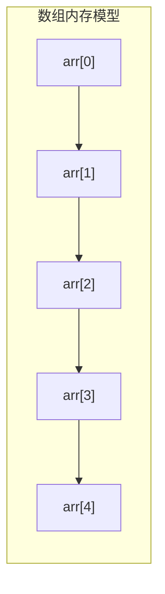

# 数组

## 学习目标

- 掌握一维数组与多维数组的声明、初始化及内存布局（栈引用 + 堆连续空间）
- 理解数组长度 `length` 不可变、越界 `ArrayIndexOutOfBoundsException` 的本质
- 熟练使用 `java.util.Arrays` 工具类（sort / fill / copyOf / binarySearch / equals）
- 区分数组与集合（ArrayList）在定长、类型、性能上的取舍
- 识别数组协变、二维数组不等长等易错点

数组是最为常见的数据结构,是相同类型的用一个标识符封装到一起的基本类型数据序列或对象序列。可以用统一的数组名和下标来唯一确定数组中的元素。实质上,数组是一个简单的线性序列,因此访问速度很快。

## 一、数组概述

### 1.1 什么是数组



数组可以存放类型相同的变量。数组所有元素初始化为默认值,整型都是 `0`,浮点型是 `0.0`,布尔型是 `false`;数组一旦创建后,大小就不可改变。

```java
public class Main {
  public static void main(String[] args) {
    // 传统方式:定义多个变量存储多个数据
    int n1 = 68;
    int n2 = 79;
    int n3 = 91;
    int n4 = 85;
    int n5 = 62;

    // 使用数组:用一个变量存储多个数据
    int[] ns = new int[5];
    ns[0] = 68;
    ns[1] = 79;
    ns[2] = 91;
    ns[3] = 85;
    ns[4] = 62;
  }
}
```

数组是引用类型,在使用索引访问数组元素时,如果索引超出范围运行时将抛出 `ArrayIndexOutOfBoundsException` 异常。可以在定义数组时直接指定初始化的元素,数组大小由编译器自动推算。

:::: warning

**数组索引范围**: 数组的索引从 `0` 开始,到 `length - 1` 结束。访问 `arr[length]` 或负数索引会抛出 `ArrayIndexOutOfBoundsException` 异常。

```java
int[] arr = {1, 2, 3};
System.out.println(arr[0]);  // 正确:1
System.out.println(arr[2]);  // 正确:3
System.out.println(arr[3]);  // 错误:ArrayIndexOutOfBoundsException
System.out.println(arr[-1]); // 错误:ArrayIndexOutOfBoundsException
```

::::

```java
public class Main {
  public static void main(String[] args) {
    int[] ns = new int[] { 68, 79, 91, 85, 62 };
    // int[] ns = { 68, 79, 91, 85, 62 };
    System.out.println(ns.length); // 编译器自动推算数组大小为5
  }
}
```

:::: danger

注意数组是引用类型,并且数组大小不可变。数组大小看上去好像是变了,但其实根本没变。

执行 `ns = new int[] { 68, 79, 91, 85, 62 };` 时 `ns` 指向一个 5 个元素的数组。执行 `ns = new int[] { 1, 2, 3 };` 时 `ns` 指向一个新的 3 个元素的数组。但是原有的 5 个元素的数组并没有改变,只是无法再通过变量 `ns` 引用到它了。

::::

```java
public class Main {
  public static void main(String[] args) {
    int[] ns;
    ns = new int[] { 68, 79, 91, 85, 62 };
    System.out.println(ns.length); // 5
    ns = new int[] { 1, 2, 3 };
    System.out.println(ns.length); // 3
  }
}
```

### 1.2 数组在内存中的存储

数组在内存中是连续存储的,这使得数组具有以下特点:

1. **快速随机访问**: 可以通过索引直接访问任意元素,时间复杂度 O(1)
2. **内存连续**: 缓存友好,访问效率高
3. **大小固定**: 一旦创建,长度不可改变

```
数组在内存中的表示:

声明数组: int[] arr = {10, 20, 30, 40, 50};

栈内存          堆内存
┌────────┐     ┌─────────────────────────┐
│ arr    │────▶│ 10 │ 20 │ 30 │ 40 │ 50 │
└────────┘     └─────────────────────────┘
   引用            连续的内存空间
                索引: 0    1    2    3    4
```

### 1.3 数组优缺点

**优点**:

- 可以直接通过下标(或索引)的方式访问指定位置的元素,速度很快(时间复杂度 O(1))
- 内存连续,缓存友好,访问效率高
- 实现简单,是其他数据结构的基础

**缺点**:

- 数组要求所有元素的类型相同
- 数组要求内存空间连续,并且长度一旦确定就不能修改
- 增加和删除元素时可能移动大量元素,效率低(时间复杂度 O(n))
- 需要预先知道数组大小,不够灵活

### 1.4 数组与集合的区别

| 特性         | 数组                   | 集合(如 ArrayList)               |
| ------------ | ---------------------- | ---------------------------------- |
| **长度**     | 固定,创建后不可变     | 动态,可以自动扩容                 |
| **类型**     | 可以存储基本类型和对象 | 只能存储对象(基本类型需要包装类) |
| **性能**     | 访问速度快,内存连续   | 访问速度相对较慢,但操作更灵活     |
| **功能**     | 功能简单               | 提供丰富的操作方法                 |
| **适用场景** | 长度固定、性能要求高   | 长度不确定、需要频繁增删           |

:::: tip

在实际开发中,如果数组长度固定且已知,使用数组可以获得更好的性能。如果长度不确定或需要频繁修改,建议使用 `ArrayList` 等集合类。

**实际开发选择建议**:

```java
// 场景1: 存储固定长度的数据(如一周7天)
String[] days = {"周一", "周二", "周三", "周四", "周五", "周六", "周日"};

// 场景2: 存储大量数值数据,性能敏感(如矩阵运算)
double[] matrix = new double[10000];
for (int i = 0; i < matrix.length; i++) {
    matrix[i] = Math.random();
}

// 场景3: 需要动态增删元素(使用集合)
List<String> names = new ArrayList<>();
names.add("张三");
names.add("李四");
names.remove(0);  // 删除第一个元素
```

::::

### 1.5 字符串数组

如果数组元素是一个引用类型,例如字符串。对于 `String[]` 类型的数组变量 `names`,它实际上包含 3 个元素,但每个元素都指向某个字符串对象:

```java
String[] names = { "ABC", "XYZ", "zoo" };

names[1] = "cat";
```

```
          ┌─────────────────────────┐
names │   ┌─────────────────────┼───────────┐
  │   │   │                     │           │
  ▼   │   │                     ▼           ▼
┌───┬───┬─┴─┬─┴─┬───┬───────┬───┬───────┬───┬───────┬───┐
│   │░░░│░░░│░░░│   │ "ABC" │   │ "XYZ" │   │ "zoo" │   │
└───┴─┬─┴───┴───┴───┴───────┴───┴───────┴───┴───────┴───┘
      │                 ▲
      └─────────────────┘
```

对 `names[1]` 进行赋值效果如下:

```
          ┌─────────────────────────────────────────────────┐
names │   ┌─────────────────────────────────┐           │
  │   │   │                                 │           │
  ▼   │   │                                 ▼           ▼
┌───┬───┬─┴─┬─┴─┬───┬───────┬───┬───────┬───┬───────┬───┬───────┬───┐
│   │░░░│░░░│░░░│   │ "ABC" │   │ "XYZ" │   │ "zoo" │   │ "cat" │   │
└───┴─┬─┴───┴───┴───┴───────┴───┴───────┴───┴───────┴───┴───────┴───┘
      │                 ▲
      └─────────────────┘
```

这里注意到原来 `names[1]` 指向的字符串 `"XYZ"` 并没有改变,仅仅是将 `names[1]` 的引用从指向 `"XYZ"` 改成指向 `"cat"` ,其结果是字符串 `"XYZ"` 再也无法通过 `names[1]` 访问

## 二、创建一维数组

数组作为对象允许使用 `new` 关键字进行内存分配。在使用数组之前,必须首先定义数组变量所属的类型。一维数组的创建有两种形式

### 2.1 使用 `new` 关键字创建数组

使用 `new` 关键字可以显式地分配内存空间来创建数组。语法如下:

```java
数据类型[] 数组名 = new 数据类型[数组长度];
```

或者

```java
数据类型 数组名[] = new 数据类型[数组长度];
```

**推荐使用第一种方式**,更符合 Java 编码规范。

示例:

```java
// 创建一个包含5个整数的数组
int[] numbers = new int[5];

// 或者(不推荐)
int numbers[] = new int[5];
```

特点:

- **动态初始化**: 数组的大小在运行时确定
- **默认值**: 数组元素会被初始化为对应数据类型的默认值(例如,`int` 类型的默认值为 `0`,`boolean` 类型的默认值为 `false`,对象引用的默认值为 `null`)

```java
public class ArrayExample {
    public static void main(String[] args) {
        // 创建一个包含5个整数的数组
        int[] numbers = new int[5];

        // 为数组元素赋值
        numbers[0] = 10;
        numbers[1] = 20;
        numbers[2] = 30;
        numbers[3] = 40;
        numbers[4] = 50;

        // 打印数组元素
        for (int i = 0; i < numbers.length; i++) {
            System.out.println("numbers[" + i + "] = " + numbers[i]);
        }
    }
}
```

### 2.2 使用数组初始化列表创建数组

数组初始化列表允许在声明数组的同时直接赋值。语法如下:

```java
数据类型[] 数组名 = {元素1, 元素2, 元素3, ..., 元素n};
```

或者

```java
数据类型 数组名[] = {元素1, 元素2, 元素3, ..., 元素n};
```

**推荐使用第一种方式**。

示例:

```java
// 创建并初始化一个包含5个整数的数组
int[] numbers = {10, 20, 30, 40, 50};

// 或者(不推荐)
int numbers[] = {10, 20, 30, 40, 50};
```

特点:

- **静态初始化**: 数组的大小和元素在编译时确定。
- **简洁性**: 适合已知数组元素的情况,代码更加简洁。

```java
public class ArrayInitializerExample {
    public static void main(String[] args) {
        // 创建并初始化一个包含5个整数的数组
        int[] numbers = {10, 20, 30, 40, 50};

        // 打印数组元素
        for (int i = 0; i < numbers.length; i++) {
            System.out.println("numbers[" + i + "] = " + numbers[i]);
        }
    }
}
```

### 2.3 两种方式的比较

| 特性           | 使用 `new` 关键字                        | 使用数组初始化列表         |
| -------------- | ---------------------------------------- | -------------------------- |
| **初始化时机** | 运行时                                   | 编译时                     |
| **数组大小**   | 必须指定                                 | 根据初始化元素自动确定     |
| **灵活性**     | 更灵活,适用于动态分配                   | 适用于已知元素的情况       |
| **代码简洁性** | 相对繁琐,需要额外赋值                   | 更加简洁                   |
| **适用场景**   | 数组大小在运行时才能确定,或需要动态赋值 | 数组大小和元素在编译时已知 |

### 2.4 实际开发中的选择

```java
import java.util.Scanner;

public class ArrayCreationBestPractice {
    public static void main(String[] args) {
        // 场景1: 已知所有元素,使用静态初始化
        String[] weekdays = {"周一", "周二", "周三", "周四", "周五", "周六", "周日"};
        
        // 场景2: 需要从输入或计算得到元素,使用动态初始化
        Scanner scanner = new Scanner(System.in);
        System.out.print("请输入学生人数:");
        int count = scanner.nextInt();
        int[] scores = new int[count];  // 动态创建数组
        
        for (int i = 0; i < count; i++) {
            System.out.print("请输入第" + (i+1) + "个学生的成绩:");
            scores[i] = scanner.nextInt();
        }
        
        // 场景3: 先创建数组,后续填充
        int[] tempArray = new int[100];
        // 通过计算填充数组
        for (int i = 0; i < tempArray.length; i++) {
            tempArray[i] = i * i;  // 存储平方数
        }
    }
}
```

## 三、二维数组

### 3.1 创建二维数组

#### 使用 `new` 关键字动态分配内存

```java
数据类型[][] 数组名 = new 数据类型[行数][列数];
```

示例:

```java
// 创建一个 3 行 4 列的整数二维数组
int[][] matrix = new int[3][4];
```

示例:

```java
// 创建一个 3 行的二维数组,每行的列数将在后续分配
int[][] matrix = new int[3][];
matrix[0] = new int[4]; // 第一行有4列
matrix[1] = new int[5]; // 第二行有5列
matrix[2] = new int[3]; // 第三行有3列
```

**注意**: 这种方式允许每行的列数不同,即创建的是"锯齿状"或"不规则"的二维数组

#### 使用数组初始化列表静态分配内存

直接在声明时初始化所有元素

```java
数据类型[][] 数组名 = {
    {元素11, 元素12, ..., 元素1n},
    {元素21, 元素22, ..., 元素2n},
    ...
    {元素m1, 元素m2, ..., 元素mn}
};
```

示例

```java
// 创建并初始化一个 2 行 3 列的整数二维数组
int[][] matrix = {
    {1, 2, 3},
    {4, 5, 6}
};
```

以下是一个综合示例,展示了多种创建和初始化二维数组的方法:

```java
public class TwoDimensionalArrayExample {
    public static void main(String[] args) {
        // 方法1: 使用 new 关键字指定行数和列数
        int[][] matrix1 = new int[2][3];
        matrix1[0][0] = 1;
        matrix1[0][1] = 2;
        matrix1[0][2] = 3;
        matrix1[1][0] = 4;
        matrix1[1][1] = 5;
        matrix1[1][2] = 6;

        System.out.println("矩阵1:");
        printMatrix(matrix1);

        // 方法2: 使用初始化列表
        int[][] matrix2 = {
            {7, 8, 9},
            {10, 11, 12}
        };

        System.out.println("矩阵2:");
        printMatrix(matrix2);

        // 方法3: 不规则数组
        int[][] jaggedArray = new int[3][];
        jaggedArray[0] = new int[]{1, 2};
        jaggedArray[1] = new int[]{3, 4, 5};
        jaggedArray[2] = new int[]{6};

        System.out.println("锯齿状数组:");
        for (int i = 0; i < jaggedArray.length; i++) {
            for (int j = 0; j < jaggedArray[i].length; j++) {
                System.out.print(jaggedArray[i][j] + " ");
            }
            System.out.println();
        }

        // 方法4: 使用循环动态赋值
        int rows = 2;
        int cols = 3;
        int[][] matrix3 = new int[rows][cols];
        int value = 1;
        for (int i = 0; i < rows; i++) {
            for (int j = 0; j < cols; j++) {
                matrix3[i][j] = value++;
            }
        }

        System.out.println("矩阵3 (动态赋值):");
        printMatrix(matrix3);
    }

    // 辅助方法:打印二维数组
    public static void printMatrix(int[][] matrix) {
        for (int[] row : matrix) {
            for (int num : row) {
                System.out.print(num + "\t");
            }
            System.out.println();
        }
        System.out.println();
    }
}
```

### 3.2 实现杨辉三角

编程使用二维数组来实现杨辉三角的生成和遍历

```java
package LanguageBasic.array;

import java.util.Scanner;

public class ArrayArrayTriangleTest {

  public static void main(String[] args) {

    // 1.提示用户输入一个行数并使用变量记录
    System.out.println("请输入一个行数:");
    Scanner sc = new Scanner(System.in);
    int num = sc.nextInt();

    // 2.根据用户输入的行数来声明对应的二维数组
    int[][] arr = new int[num][];

    // 3.针对二维数组中的每个元素进行初始化,使用双重for循环
    // 使用外层for循环控制二维数组的行下标
    for (int i = 0; i < num; i++) {
      // 针对二维数组中的每一行进行内存空间的申请
      arr[i] = new int[i + 1];
      // 使用内层for循环控制二维数组的列下标
      for (int j = 0; j <= i; j++) {
        // 收尾都为1
        if (0 == j || i == j) {
          arr[i][j] = 1;
        } else {
          // 否则对应位置的元素就是上一行当前列的元素加上上一行前一列的元素
          arr[i][j] = arr[i - 1][j] + arr[i - 1][j - 1];
        }
      }
    }

    // 4.打印最终生成的结果
    for (int i = 0; i < num; i++) {
      for (int j = 0; j <= i; j++) {
        System.out.print(arr[i][j] + " ");
      }
      System.out.println();
    }
  }
}
```

## 四、三维数组(了解)

三维数组就是二维数组的数组。可以这么定义一个三维数组:

```java
int[][][] ns = {
  {
    {1, 2, 3},
    {4, 5, 6},
    {7, 8, 9}
  },
  {
    {10, 11},
    {12, 13}
  },
  {
    {14, 15, 16},
    {17, 18}
  }
};
```

它在内存中的结构如下:

```
                            ┌───┬───┬───┐
                   ┌───┐  ┌──▶│ 1 │ 2 │ 3 │
               ┌──▶│░░░│──┘   └───┴───┴───┘
               │   ├───┤      ┌───┬───┬───┐
               │   │░░░│─────▶│ 4 │ 5 │ 6 │
               │   ├───┤      └───┴───┴───┘
               │   │░░░│──┐   ┌───┬───┬───┐
        ┌───┐  │   └───┘  └──▶│ 7 │ 8 │ 9 │
ns ────▶│░░░│──┘              └───┴───┴───┘
        ├───┤      ┌───┐      ┌───┬───┐
        │░░░│─────▶│░░░│─────▶│10 │11 │
        ├───┤      ├───┤      └───┴───┘
        │░░░│──┐   │░░░│──┐   ┌───┬───┐
        └───┘  │   └───┘  └──▶│12 │13 │
               │              └───┴───┘
               │   ┌───┐      ┌───┬───┬───┐
               └──▶│░░░│─────▶│14 │15 │16 │
                   ├───┤      └───┴───┴───┘
                   │░░░│──┐   ┌───┬───┐
                   └───┘  └──▶│17 │18 │
                              └───┴───┘
```

如果要访问三维数组的某个元素,例如 `ns[2][0][1]` 只需要顺着定位找到对应的最终元素 `15` 即可。理论上可以定义任意的 N 维数组。但在实际应用中,除了二维数组在某些时候还能用得上,更高维度的数组很少使用

## 五、数组基本操作

### 5.1 遍历数组

通过 `for` 循环就可以遍历数组。因为数组的每个元素都可以通过索引来访问

```java
public class Main {
  public static void main(String[] args) {
    int[] ns = { 1, 4, 9, 16, 25 };
    for (int i=0; i< ns.length; i++) {
      int n = ns[i];
      System.out.println(n);
    }
  }
}
```

第二种方式是使用 `for each` 循环,直接迭代数组的每个元素:

```java
public class Main {
  public static void main(String[] args) {
    int[] ns = { 1, 4, 9, 16, 25 };
    for (int n : ns) {
      System.out.println(n);
    }
  }
}
```

> 注意:在 `for (int n : ns)` 循环中,变量 `n` 直接拿到 `ns` 数组的元素,而不是索引

#### 遍历二维数组

`Java` 中遍历二维数组有多种方法,常用的包括传统的 `for` 循环、增强型 `for` 循环(也称为 "for-each" 循环)、`while` 循环以及使用 Java 8 引入的流(Streams)

1. 使用传统的 `for` 循环

   ```java
   public class Traverse2DArrayForLoop {
     public static void main(String[] args) {
       int[][] matrix = {
         {1, 2, 3},
         {4, 5, 6},
         {7, 8, 9}
       };

       // 使用传统的 for 循环遍历二维数组
       for (int i = 0; i < matrix.length; i++) {           // 遍历行
         for (int j = 0; j < matrix[i].length; j++) {    // 遍历列
           System.out.print(matrix[i][j] + "\t");
         }
         System.out.println(); // 换行
       }
     }
   }
   ```

2. 使用增强型 `for` 循环(For-Each 循环)

   ```java
   public class Traverse2DArrayForEachLoop {
     public static void main(String[] args) {
       int[][] matrix = {
         {1, 2, 3},
         {4, 5, 6},
         {7, 8, 9}
       };

       // 使用增强型 for 循环遍历二维数组
       for (int[] row : matrix) {          // 遍历每一行
         for (int element : row) {       // 遍历行中的每一个元素
           System.out.print(element + "\t");
         }
         System.out.println(); // 换行
       }
     }
   }
   ```

3. 使用 `while` 循环

   ```java
   public class Traverse2DArrayWhileLoop {
     public static void main(String[] args) {
       int[][] matrix = {
         {1, 2, 3},
         {4, 5, 6},
         {7, 8, 9}
       };

       int i = 0;
       // 使用 while 循环遍历二维数组
       while (i < matrix.length) {
         int j = 0;
         while (j < matrix[i].length) {
           System.out.print(matrix[i][j] + "\t");
           j++;
         }
         System.out.println(); // 换行
         i++;
       }
     }
   }
   ```

4. 使用 `Java 8` 的 `Streams API`。`Streams API` 提供一种函数式编程的方式来处理集合和数组。对于二维数组,可以先将其转换为流,然后进行操作

   ```java
   import java.util.Arrays;

   public class Traverse2DArrayStreams {
     public static void main(String[] args) {
       int[][] matrix = {
         {1, 2, 3},
         {4, 5, 6},
         {7, 8, 9}
       };

       // 使用 Java 8 Streams 遍历二维数组
       Arrays.stream(matrix)
         .flatMapToInt(Arrays::stream) // 将二维数组展平为一维流
         .forEach(element -> System.out.print(element + "\t"));

       System.out.println(); // 换行
     }
   }

   // 输出结果:1	2	3	4	5	6	7	8	9
   ```

说明

- `Arrays.stream(matrix)` 将二维数组转换为一个 `Stream<int[]>`,每个元素是一行数组。
- `.flatMapToInt(Arrays::stream)` 将每一行的数组展平为一个 `IntStream`,从而将所有元素合并到一个流中。
- `.forEach(...)` 对流中的每个元素执行打印操作。

性能比较:

- **传统 `for` 循环**: 通常性能最佳,因为它直接通过索引访问元素,没有额外的开销
- **增强型 `for` 循环**: 语法简洁;对数组而言会被编译为索引访问,性能与传统 `for` 相当(依赖迭代器的是集合遍历)
- **Streams API**: 提供了更强大的功能和更高的可读性,但性能通常低于传统的循环,尤其是在处理大规模数据时

### 5.2 填充 fill 方法

`Java` 中的 `fill()` 方法是 `java.util.Arrays` 类中的一个静态方法,用于将指定的值分配给指定数组中的每个元素

`fill()` 方法针对每种数组类型都有重载(8 种基本类型数组 + `Object[]`),以 `int` 为例:

1. `public static void fill(int[] a, int val)` 对数组的所有元素赋值为指定的值

   - `a`:需要填充的数组
   - `val`:用来填充数组元素的值

   注意:对象数组对应 `fill(Object[] a, Object val)` 重载。

2. `public static void fill(int[] a, int fromIndex, int toIndex, int val)` 对数组的指定范围赋值为指定的值。

   - `a`:需要填充的数组
   - `fromIndex`:开始进行赋值操作的数组起始索引(包括)
   - `toIndex`:结束赋值操作的数组终止索引(不包括)
   - `val`:用来填充数组元素的值

```java
import java.util.Arrays;

public class ArrayFillExample {
    public static void main(String[] args) {
        // 示例 1:基本数据类型数组使用 Arrays.fill()
        int[] intArray = new int[5];
        Arrays.fill(intArray, 42);
        System.out.println("填充后的 int 数组: " + Arrays.toString(intArray));

        // 示例 2:对象类型数组使用 Arrays.fill()
        String[] strArray = new String[5];
        Arrays.fill(strArray, "Hello");
        System.out.println("填充后的 String 数组: " + Arrays.toString(strArray));

        // 示例 3:给对象的某个范围填充值
        String[] strArrayRange = new String[5];
        Arrays.fill(strArrayRange, 1, 4, "World");
        System.out.println("部分填充后的 String 数组: " + Arrays.toString(strArrayRange));
    }
}
```

输出结果:

```
填充后的 int 数组: [42, 42, 42, 42, 42]
填充后的 String 数组: [Hello, Hello, Hello, Hello, Hello]
部分填充后的 String 数组: [null, World, World, World, null]
```

:::: danger

注意:`Arrays.fill()` 对基本数据类型数组(如 `int[]`、`double[]`)与对象数组(如 `String[]`)都有"全部元素"和"指定范围"两种重载。对基本类型数组的部分元素填充可直接用 `Arrays.fill(intArray, 1, 4, 42)`,无需手动循环;范围参数同样是"含头不含尾"。

::::

### 5.3 排序 sort 方法

`Java` 中的 `sort()` 方法是 `java.util.Arrays` 类中的一个静态方法,用于对数组进行排序

`sort()` 方法有以下几种重载形式:

1. `public static void sort(int[] a)` 对指定的 `int` 型数组按数字升序进行排序
2. `public static void sort(Object[] a)` 根据元素的自然顺序对指定对象数组按升序进行排序。数组中的所有元素都必须实现 `Comparable` 接口。此方法对于基本数据类型数组是不适用的

   - `a`:需要排序的对象数组,数组中的元素必须实现 `Comparable` 接口

3. `public static <T> void sort(T[] a, Comparator<? super T> c)` 根据指定比较器产生的顺序对指定对象数组进行排序。这允许使用自定义的排序规则。

   类型参数:

   - `T`:数组元素的类型(使用比较器排序时无需实现 `Comparable`,排序规则完全由比较器决定)

   参数:

   - `a`:需要排序的对象数组
   - `c`:用来对数组元素进行比较的比较器

示例:

```java
import java.util.Arrays;
import java.util.Comparator;

public class ArraySortExample {
    public static void main(String[] args) {
        // 示例 1:对 int 数组进行排序
        int[] intArray = {5, 2, 9, 1, 5, 6};
        Arrays.sort(intArray);
        System.out.println("排序后的 int 数组: " + Arrays.toString(intArray));

        // 示例 2:对 String 数组进行排序
        String[] strArray = {"banana", "apple", "orange", "grape"};
        Arrays.sort(strArray);
        System.out.println("排序后的 String 数组: " + Arrays.toString(strArray));

        // 示例 3:使用自定义比较器对 String 数组进行排序(按字符串长度)
        String[] strArrayCustomSort = {"banana", "apple", "orange", "grape"};
        Arrays.sort(strArrayCustomSort, Comparator.comparingInt(String::length));
        System.out.println("按长度排序后的 String 数组: " + Arrays.toString(strArrayCustomSort));
    }
}
```

输出结果:

```
排序后的 int 数组: [1, 2, 5, 5, 6, 9]
排序后的 String 数组: [apple, banana, grape, orange]
按长度排序后的 String 数组: [apple, grape, banana, orange]
```

#### 理解排序

```java
import java.util.Arrays;

public class Main {
  public static void main(String[] args) {
    int[] ns = { 28, 12, 89, 73, 65, 18, 96, 50, 8, 36 };
    Arrays.sort(ns);
    System.out.println(Arrays.toString(ns));
  }
}
```

对数组排序实际上修改了数组本身。排序前的数组是 `int[] ns = { 9, 3, 6, 5 };` 。在内存中,这个整型数组表示如下:

```
      ┌───┬───┬───┬───┐
ns───▶│ 9 │ 3 │ 6 │ 5 │
      └───┴───┴───┴───┘
```

当调用 `Arrays.sort(ns);` 后,这个整型数组在内存中变为:

```
      ┌───┬───┬───┬───┐
ns───▶│ 3 │ 5 │ 6 │ 9 │
      └───┴───┴───┴───┘
```

如果对一个字符串数组进行排序,例如:

```java
String[] ns = { "banana", "apple", "pear" };
```

排序前这个数组在内存中表示如下:

```
                   ┌──────────────────────────────────┐
               ┌───┼──────────────────────┐           │
               │   │                      ▼           ▼
         ┌───┬─┴─┬─┴─┬───┬────────┬───┬───────┬───┬──────┬───┐
ns ─────▶│░░░│░░░│░░░│   │"banana"│   │"apple"│   │"pear"│   │
         └─┬─┴───┴───┴───┴────────┴───┴───────┴───┴──────┴───┘
           │                 ▲
           └─────────────────┘
```

调用 `Arrays.sort(ns);` 排序后,这个数组在内存中表示如下:

```
                   ┌──────────────────────────────────┐
               ┌───┼──────────┐                       │
               │   │          ▼                       ▼
         ┌───┬─┴─┬─┴─┬───┬────────┬───┬───────┬───┬──────┬───┐
ns ─────▶│░░░│░░░│░░░│   │"banana"│   │"apple"│   │"pear"│   │
         └─┬─┴───┴───┴───┴────────┴───┴───────┴───┴──────┴───┘
           │                              ▲
           └──────────────────────────────┘
```

原来的 3 个字符串在内存中均没有任何变化,但是 `ns` 数组的每个元素指向变化

### 5.4 复制数组

`Java` 中提供了多种复制数组的方法,常用的有 `Arrays.copyOf()`、`Arrays.copyOfRange()` 和 `System.arraycopy()`。

#### Arrays.copyOf()

`Arrays.copyOf()` 是 Java 6 中引入的 `Arrays` 类的方法,用于复制指定的数组,截取或用默认值填充以获得指定的长度。

```java
public static int[] copyOf(int[] original, int newLength)
```

参数解释:

- `original`: 原始数组
- `newLength`: 新数组的长度

**特点**:

- 如果新长度小于原数组长度,会截取前面的元素
- 如果新长度大于原数组长度,会用默认值填充(数值类型为 0,布尔类型为 false,对象类型为 null)

示例:

```java
import java.util.Arrays;

public class CopyOfExample {
    public static void main(String[] args) {
        int[] originalArray = {1, 2, 3, 4, 5};

        // 截取前3个元素
        int[] copiedArray1 = Arrays.copyOf(originalArray, 3);
        System.out.println(Arrays.toString(copiedArray1)); // [1, 2, 3]

        // 扩展到8个元素,后面用0填充
        int[] copiedArray2 = Arrays.copyOf(originalArray, 8);
        System.out.println(Arrays.toString(copiedArray2)); // [1, 2, 3, 4, 5, 0, 0, 0]
    }
}
```

#### Arrays.copyOfRange()

`Arrays.copyOfRange()` 将指定数组的指定范围复制到一个新数组中。

```java
public static int[] copyOfRange(int[] original, int from, int to)
```

参数解释:

- `original`: 原始数组
- `from`: 范围的初始索引(包括)
- `to`: 范围的最终索引(不包括)

示例:

```java
import java.util.Arrays;

public class CopyOfRangeExample {
    public static void main(String[] args) {
        int[] originalArray = {1, 2, 3, 4, 5};

        // 复制索引1到4(不包括4)的元素
        int[] copiedArray = Arrays.copyOfRange(originalArray, 1, 4);
        System.out.println(Arrays.toString(copiedArray)); // [2, 3, 4]

        // 如果to超出范围,会用默认值填充
        int[] extendedArray = Arrays.copyOfRange(originalArray, 1, 8);
        System.out.println(Arrays.toString(extendedArray)); // [2, 3, 4, 5, 0, 0, 0]
    }
}
```

#### System.arraycopy()

`System.arraycopy()` 是 `System` 类提供的底层数组复制方法,性能最高。

```java
public static void arraycopy(Object src, int srcPos, Object dest, int destPos, int length)
```

参数解释:

- `src`: 源数组
- `srcPos`: 源数组的起始位置
- `dest`: 目标数组
- `destPos`: 目标数组的起始位置
- `length`: 要复制的元素个数

示例:

```java
public class ArrayCopyExample {
    public static void main(String[] args) {
        int[] source = {1, 2, 3, 4, 5};
        int[] dest = new int[5];

        // 将source数组从索引0开始,复制5个元素到dest数组的索引0位置
        System.arraycopy(source, 0, dest, 0, 5);

        System.out.println(Arrays.toString(dest)); // [1, 2, 3, 4, 5]

        // 部分复制
        int[] dest2 = new int[3];
        System.arraycopy(source, 1, dest2, 0, 3);
        System.out.println(Arrays.toString(dest2)); // [2, 3, 4]
    }
}
```

:::: tip

**三种复制方法的比较**:

| 方法                   | 性能 | 易用性 | 适用场景                               |
| ---------------------- | ---- | ------ | -------------------------------------- |
| `Arrays.copyOf()`      | 中等 | 高     | 需要扩展或截取数组                     |
| `Arrays.copyOfRange()` | 中等 | 高     | 需要复制数组的某个范围                 |
| `System.arraycopy()`   | 最高 | 中等   | 性能要求高的场景,需要精确控制复制过程 |

::::

### 5.5 查询数组 binarySearch

`binarySearch()` 方法是 Java 中 `java.util.Arrays` 类提供的一个静态方法,用于在一个**已排序**的数组中执行二分查找,以查找特定元素。

**返回值**:

- 如果找到元素,返回该元素的索引(非负数)
- 如果未找到元素,返回 `-(插入点) - 1`,其中插入点是该元素应该插入的位置

```java
public static int binarySearch(int[] a, int key)
public static int binarySearch(Object[] a, Object key)
public static <T> int binarySearch(T[] a, T key, Comparator<? super T> c)
```

参数说明:

- `a`:要进行二分查找的数组,该数组必须已经按照升序排序
- `key`:要在数组中查找的元素
- `c`:自定义比较器(可选)

:::: danger

**重要提示**:

1. 数组必须是已排序的,否则 `binarySearch()` 方法的结果将是不确定的
2. `binarySearch()` 方法适用于基本数据类型数组和对象数组
3. 对于对象数组,数组中的元素必须实现 `Comparable` 接口,或者提供一个 `Comparator`
4. 如果数组中有重复元素,不保证返回哪个索引

::::

示例:

```java
import java.util.Arrays;

public class BinarySearchExample {
    public static void main(String[] args) {
        int[] numbers = {1, 3, 5, 7, 9, 11, 13, 15};

        // 对数组进行排序(binarySearch() 要求数组是已排序的)
        Arrays.sort(numbers);

        // 在数组中查找元素 7
        int index = Arrays.binarySearch(numbers, 7);
        if (index >= 0) {
            System.out.println("元素 7 的索引为: " + index); // 输出:元素 7 的索引为: 3
        } else {
            System.out.println("元素 7 未在数组中找到");
        }

        // 在数组中查找元素 8(不存在)
        index = Arrays.binarySearch(numbers, 8);
        if (index >= 0) {
            System.out.println("元素 8 的索引为: " + index);
        } else {
            // 返回 -(插入点) - 1 = -(4) - 1 = -5
            System.out.println("元素 8 未在数组中找到,插入位置为: " + (-index - 1));
            // 输出:元素 8 未在数组中找到,插入位置为: 4
        }
    }
}
```

**二分查找的时间复杂度**:O(log n),比线性查找 O(n) 快得多,但要求数组必须是有序的。

### 5.6 toString 方法

在 `Java` 中数组本身并没有 `toString()` 方法

```java
import java.util.Arrays;

public class ArrayToStringExample {
  public static void main(String[] args) {
    int[] numbers = {1, 2, 3, 4, 5};
    String arrayAsString = Arrays.toString(numbers);
    System.out.println("数组的字符串表示: " + arrayAsString); // 数组的字符串表示: [1, 2, 3, 4, 5]
  }
}
```

注意:`Arrays.toString()` 方法适用于基本数据类型数组和对象数组。但对于多维数组,需要使用 `Arrays.deepToString()` 方法来获取其字符串表示。下面是一个多维数组的示例:

```java
import java.util.Arrays;

public class MultiDimensionalArrayToStringExample {
  public static void main(String[] args) {
    int[][] matrix = {
      {1, 2, 3},
      {4, 5, 6},
      {7, 8, 9}
    };
    String multiDimensionalArrayAsString = Arrays.deepToString(matrix);
    System.out.println("多维数组的字符串表示: " + multiDimensionalArrayAsString);
    //  [[1, 2, 3], [4, 5, 6], [7, 8, 9]]
  }
}
```

## 六、命令行参数

`Java` 程序的入口是 `main` 方法,而 `main` 方法可以接受一个命令行参数,它是一个 `String[]` 数组。这个命令行参数由 JVM 接收用户输入并传给 `main` 方法:

```java
public class Main {
  public static void main(String[] args) {
    for (String arg : args) {
      System.out.println(arg);
    }
  }
}
```

可以利用接收到的命令行参数,根据不同的参数执行不同的代码。例如实现 `-version` 参数,打印程序版本号:

```java
public class Main {
  public static void main(String[] args) {
    for (String arg : args) {
      if ("-version".equals(arg)) {
        System.out.println("v 1.0");
        break;
      }
    }
  }
}
```

在命令行执行

```bash
javac Main.java
java Main -version
```

## 七、数组工具类 java.util.Arrays

java.util.Arrays 类可以实现对数组中元素的遍历、查找、排序等操作

| 方法                                                         | 作用                               | 说明                         |
| ------------------------------------------------------------ | ---------------------------------- | ---------------------------- |
| `static String toString(int[] a)`                            | 输出数组中的内容                   | 将数组转换为字符串表示       |
| `static void fill(int[] a, int val)`                         | 将参数指定元素赋值给数组中所有元素 | 填充数组的所有元素           |
| `static boolean equals(int[] a, int[] a2)`                   | 判断两个数组元素内容和次序是否相同 | 比较两个数组是否相等         |
| `static void sort(int[] a)`                                  | 对数组中的元素进行从小到大排序     | 对数组进行排序(修改原数组) |
| `static int binarySearch(int[] a, int key)`                  | 从数组中查找参数指定元素所在的位置 | 二分查找(要求数组已排序)   |
| `static int[] copyOf(int[] original, int newLength)`         | 复制数组                           | 复制数组,可以指定新长度     |
| `static int[] copyOfRange(int[] original, int from, int to)` | 复制数组的指定范围                 | 复制数组的某个范围           |
| `static boolean deepEquals(Object[] a1, Object[] a2)`        | 深度比较两个多维数组               | 比较多维数组的内容           |
| `static String deepToString(Object[] a)`                     | 深度输出多维数组内容               | 将多维数组转换为字符串       |
| `static void parallelSort(int[] a)`                          | 并行排序数组                       | Java 8+,利用多核并行排序    |
| `static int hashCode(int[] a)`                               | 计算数组的哈希码                   | 返回数组的哈希码值           |

编程实现数组工具类的使用

```java
package LanguageBasic.array;
import java.util.Arrays;

public class ArraysTest {

  public static void main(String[] args) {

    int[] arr1 = {10, 20, 30, 40, 50};
    // 2.使用原始方式打印数组中的所有元素,要求打印格式为:[10, 20, 30, 40, 50]
    System.out.print("第一个数组中的元素有:[");
    for (int i = 0; i < arr1.length; i++) {
      // 当打印的元素是最后一个元素时,则直接打印元素本身即可
      if (arr1.length - 1 == i) {
        System.out.print(arr1[i]);
      } else {
        // 否则打印元素后打印逗号加空格
        System.out.print(arr1[i] + ", ");
      }
    }
    System.out.println("]");

    // 3.使用数组工具类实现数组中所有元素的打印
    System.out.println("第一个数组中的元素有:" + Arrays.toString(arr1));  // [10, 20, 30, 40, 50]

    // 4.声明一个长度为5元素类型为int类型的一维数组
    int[] arr2 = new int[5];
    System.out.println("第二个数组中的元素有:" + Arrays.toString(arr2)); // [0, 0, 0, 0, 0]

    Arrays.fill(arr2, 10);
    System.out.println("第二个数组中的元素有:" + Arrays.toString(arr2)); // [10, 10, 10, 10, 10]

    // 5.声明一个长度为 5 元素类型为 int 类型的一维数组并初始化
    int[] arr3 = new int[5];
    Arrays.fill(arr3, 10);
    System.out.println("第三个数组中的元素有:" + Arrays.toString(arr3)); // [10, 10, 10, 10, 10]
    // 判断该数组是否与上述数组相等并打印,若相同则打印true,否则打印false
    System.out.println(Arrays.equals(arr2, arr3)); // true

    // 修改数组3中的元素值
    arr3[4] = 20;
    System.out.println("第三个数组中的元素有:" + Arrays.toString(arr3)); // [10, 10, 10, 10, 20]
    System.out.println(Arrays.equals(arr2, arr3)); // false  要求内容要相同
  }
}
```

编程使用数组来记录学生的考试成绩并打印

```java
package LanguageBasic.array;
import java.util.Arrays;
import java.util.Scanner;

public class ArrayScoreTest {

  public static void main(String[] args) {

    // 1.提示用户输入学生的人数并使用变量记录
    System.out.println("请输入学生的人数:");
    Scanner sc = new Scanner(System.in);
    int num = sc.nextInt();

    // 2.根据学生的人数来声明对应长度的数组负责记录学生的考试成绩
    // 变长数组 : 主要指变量可以作为数组的长度,但绝不是数组的长度可以发生改变
    int[] scores = new int[num];

    // 3.提示用户输入每个学生的考试成绩并记录一维数组中
    for (int i = 0; i < num; i++) {
      System.out.println("请输入第" + (i + 1) + "个学生的考试成绩:");
      scores[i] = sc.nextInt();
    }

    // 5.计算本班级学生的总分以及平均分并使用变量记录
    int sum = 0;
    for (int i = 0; i < scores.length; i++) {
      sum += scores[i];
    }
    double avg = sum * 1.0 / num;
    // 打印最终的计算结果
    System.out.println("本班级学生的总分是:" + sum + ",平均分是:" + avg);

    // 6.查找本班所有学生考试成绩中的最低分和最高分并打印出来
    System.out.println("原始的考试成绩是:" + Arrays.toString(scores));

    // 调用工具类中的排序方法对所有考试成绩进行从小到大的排序
    Arrays.sort(scores);
    System.out.println("排序后的考试成绩是:" + Arrays.toString(scores));
    System.out.println("最低分是:" + scores[0] + ",最高分是:" + scores[num - 1]);

    System.out.println("----------------------------------------------");
    // 从数组中查找指定元素所在的下标位置
    System.out.println("59分在数组中的下标位置是:" + Arrays.binarySearch(scores, 59));
    System.out.println("60分在数组中的下标位置是:" + Arrays.binarySearch(scores, 60));
  }
}
```

## 八、常见错误和注意事项

### 8.1 数组索引越界

```java
int[] arr = {1, 2, 3};
System.out.println(arr[3]); // ArrayIndexOutOfBoundsException
```

**解决方法**:始终检查索引是否在有效范围内(0 到 length-1)

```java
int index = 3;
if (index >= 0 && index < arr.length) {
    System.out.println(arr[index]);
}
```

### 8.2 空指针异常

```java
int[] arr = null;
System.out.println(arr.length); // NullPointerException
```

**解决方法**:在使用数组前检查是否为 null

```java
if (arr != null) {
    System.out.println(arr.length);
}
```

### 8.3 数组长度不可变误解

```java
int[] arr = new int[5];
arr.length = 10; // 编译错误!length 是 final 的
```

**说明**:数组长度在创建时就确定了,无法修改。如果需要"扩容",需要创建新数组并复制元素。

### 8.4 数组比较使用 ==

```java
int[] arr1 = {1, 2, 3};
int[] arr2 = {1, 2, 3};
System.out.println(arr1 == arr2); // false(比较的是引用)
System.out.println(Arrays.equals(arr1, arr2)); // true(比较的是内容)
```

### 8.5 多维数组的 length 属性

```java
int[][] matrix = new int[3][4];
System.out.println(matrix.length); // 3(行数)
System.out.println(matrix[0].length); // 4(第一行的列数)
```

## 九、实战案例

### 9.1 双色球抽奖游戏

使用数组实现双色球抽奖,生成 6 个不重复的红球号码(1-33)和 1 个蓝球号码(1-16)。

```java
import java.util.Arrays;
import java.util.Random;

public class DoubleColorBallLottery {
    public static void main(String[] args) {
        // 生成红球号码(6个,范围1-33,不重复)
        int[] redBalls = generateRedBalls(1, 33, 6);
        // 生成蓝球号码(1个,范围1-16)
        int blueBall = generateBlueBall(1, 16);

        // 对红球进行排序以便显示
        Arrays.sort(redBalls);

        System.out.println("双色球中奖号码:");
        System.out.print("红球: ");
        for (int ball : redBalls) {
            System.out.printf("%02d ", ball);
        }
        System.out.println();
        System.out.println("蓝球: " + String.format("%02d", blueBall));
    }

    /**
     * 生成指定数量的不重复随机数
     * @param min 最小值
     * @param max 最大值
     * @param count 数量
     * @return 不重复的随机数数组
     */
    private static int[] generateRedBalls(int min, int max, int count) {
        Random random = new Random();
        int[] balls = new int[count];
        boolean[] used = new boolean[max - min + 1]; // 标记数字是否已使用
        int index = 0;

        while (index < count) {
            int ball = random.nextInt(max - min + 1) + min;
            if (!used[ball - min]) {
                used[ball - min] = true;
                balls[index++] = ball;
            }
        }
        return balls;
    }

    /**
     * 生成单个随机数
     * @param min 最小值
     * @param max 最大值
     * @return 随机数
     */
    private static int generateBlueBall(int min, int max) {
        Random random = new Random();
        return random.nextInt(max - min + 1) + min;
    }
}
```

**运行示例**:

```
双色球中奖号码:
红球: 05 12 18 23 28 31
蓝球: 09
```

### 9.2 数组扩容

实现一个动态数组,当元素数量达到容量的 80% 时自动扩容到原来的 1.5 倍。

```java
import java.util.Arrays;

public class ArrayExpansion {
    private int[] array;
    private int size;      // 当前元素数量
    private int capacity;  // 数组容量

    /**
     * 构造函数
     * @param capacity 初始容量
     */
    public ArrayExpansion(int capacity) {
        if (capacity <= 0) {
            throw new IllegalArgumentException("容量必须大于0");
        }
        this.array = new int[capacity];
        this.size = 0;
        this.capacity = capacity;
    }

    /**
     * 添加元素
     * @param number 要添加的元素
     */
    public void add(int number) {
        // 当元素数量达到容量的80%时,进行扩容
        if (size >= capacity * 0.8) {
            expandCapacity();
        }
        array[size++] = number;
    }

    /**
     * 扩容方法:将容量扩大到原来的1.5倍
     */
    private void expandCapacity() {
        int oldCapacity = capacity;
        capacity = (int) (capacity * 1.5);
        int[] newArray = new int[capacity];
        // 使用 System.arraycopy 复制原数组元素
        System.arraycopy(array, 0, newArray, 0, size);
        array = newArray;
        System.out.println("数组已扩容:从 " + oldCapacity + " 扩容到 " + capacity);
    }

    /**
     * 获取指定索引的元素
     * @param index 索引
     * @return 元素值
     */
    public int get(int index) {
        if (index < 0 || index >= size) {
            throw new IndexOutOfBoundsException("索引超出范围");
        }
        return array[index];
    }

    /**
     * 获取当前元素数量
     * @return 元素数量
     */
    public int size() {
        return size;
    }

    /**
     * 获取当前容量
     * @return 容量
     */
    public int capacity() {
        return capacity;
    }

    /**
     * 显示数组内容
     */
    public void display() {
        System.out.print("数组元素: [");
        for (int i = 0; i < size; i++) {
            System.out.print(array[i]);
            if (i < size - 1) {
                System.out.print(", ");
            }
        }
        System.out.println("]");
        System.out.println("元素数量: " + size);
        System.out.println("数组容量: " + capacity);
        System.out.println("使用率: " + String.format("%.2f%%", (size * 100.0 / capacity)));
    }

    public static void main(String[] args) {
        // 创建初始容量为10的动态数组
        ArrayExpansion array = new ArrayExpansion(10);

        System.out.println("开始添加元素:");
        // 添加12个元素,测试扩容功能
        for (int i = 1; i <= 12; i++) {
            array.add(i);
            if (i == 9) {
                System.out.println("添加第9个元素后:");
                array.display();
                System.out.println();
            }
        }

        System.out.println("最终结果:");
        array.display();
    }
}
```

**运行示例**:

```
开始添加元素:
添加第9个元素后:
数组已扩容:从 10 扩容到 15
数组元素: [1, 2, 3, 4, 5, 6, 7, 8, 9]
元素数量: 9
数组容量: 15
使用率: 60.00%

最终结果:
数组元素: [1, 2, 3, 4, 5, 6, 7, 8, 9, 10, 11, 12]
元素数量: 12
数组容量: 15
使用率: 80.00%
```

:::: tip

**扩容策略说明**:

- 当元素数量达到容量的 80% 时触发扩容
- 扩容倍数为 1.5 倍(这是一个常用的扩容策略,在空间利用率和性能之间取得平衡)
- 使用 `System.arraycopy()` 进行数组复制,性能较高
- 这种方式类似于 `ArrayList` 的内部实现机制

::::

## 十、学习建议

### 10.1 重点掌握

1. **数组的声明和初始化**:掌握两种创建数组的方式
2. **数组索引访问**:理解索引从 0 开始,避免越界异常
3. **数组遍历**:熟练使用 for 循环和 for-each 循环
4. **Arrays 工具类**:掌握常用的排序、查找、填充、复制方法
5. **二维数组**:理解二维数组的结构和使用

### 10.2 常见陷阱

1. **索引越界**:访问不存在的索引
2. **空指针**:数组未初始化就使用
3. **类型混淆**:数组是引用类型,`==` 比较的是引用
4. **长度误解**:数组长度不可变

### 10.3 最佳实践

1. **始终检查索引范围**,避免 ArrayIndexOutOfBoundsException
2. **使用 Arrays.equals() 比较数组内容**,而不是 ==
3. **选择合适的创建方式**:
   - 已知元素值:使用静态初始化
   - 动态获取元素:使用动态初始化
4. **遍历数组**:
   - 需要索引:使用传统 for 循环
   - 不需要索引:使用 for-each 循环
5. **性能考虑**:
   - 数组长度固定且已知:使用数组
   - 需要频繁增删:使用 ArrayList

## 十一、总结

数组是 Java 中最基础的数据结构,具有以下特点:

1. **优点**:访问速度快、内存连续、实现简单
2. **缺点**:长度固定、类型单一、增删效率低
3. **适用场景**:数据量固定、频繁查询、性能要求高

掌握数组的使用是学习 Java 集合框架的基础,理解数组的工作原理有助于更好地理解 ArrayList 等集合类的内部实现。在实际开发中,应根据具体需求选择数组或集合类,在性能和灵活性之间取得平衡。

## 面试要点

1. **数组与集合（ArrayList）的区别？** 数组定长、可存基本类型、性能高；ArrayList 动态扩容、只能存引用类型（自动装箱）、内存略多。
2. **`arr1 == arr2` 与 `Arrays.equals(arr1, arr2)` 的区别？** `==` 比较引用地址（两个内容相同的数组为 `false`），`Arrays.equals` 比较内容。
3. **`int[][] m = new int[3][4]; m.length` 是多少？** `3`（行数）；`m[0].length` 才是列数 `4`。
4. **`Arrays.binarySearch` 要求什么？** 数组必须**已排序**，否则结果不确定；未找到时返回 `-(插入点)-1`。
5. **数组协变陷阱？** `Object[] oa = new String[1]; oa[0] = 123;` 编译通过但运行时抛 `ArrayStoreException`，这是数组协变带来的类型安全隐患。

## 版本差异(旧版 → Java 21)

| 特性 | 旧版(Java 8) | Java 9/21 |
|------|--------------|-----------|
| 数组工具 | `Arrays.asList`、`sort`/`binarySearch` | 新增 `Arrays.mismatch`（Java 9）、`compare`/`compareUnsigned` |
| 不可变集合 | `Arrays.asList` 返回固定大小视图 | `List.copyOf(数组)`（Java 10）不可变副本 |
| 数组流收集 | `collect(Collectors.toList())` | `stream.toList()`（Java 16）不可变列表 |
| 数组本质 | 数组类型协变、可存基本类型 | 不变；新代码优先用集合与 record 表达数据 |

## 继续阅读

- 上一章：[流程控制](03-流程控制)
- 下一章：[面向对象](05-面向对象)
