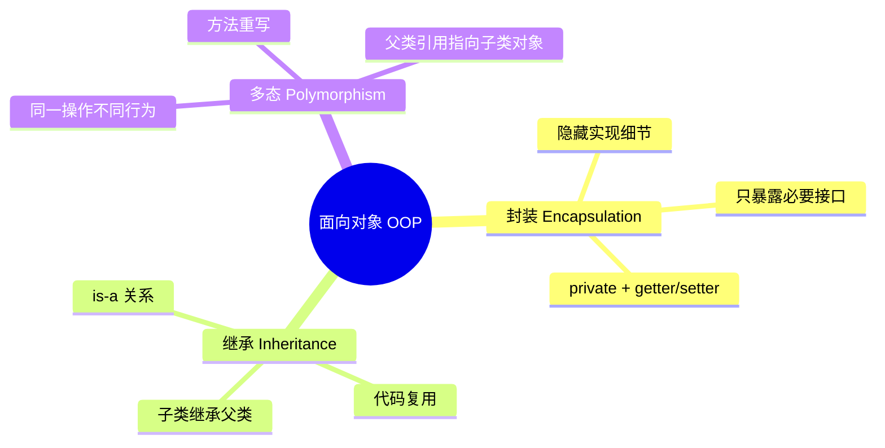

# 类和对象

## 学习目标

- 掌握类与对象、构造方法、this 引用与封装（访问控制修饰符）
- 理解方法重载(overload)与重载解析规则
- 掌握静态成员、静态导入与单例模式的实现方式
- 理解内部类（成员/局部/匿名/静态嵌套）的持有关系与适用场景
- 识别对象内存模型（栈引用指向堆对象）与默认值陷阱

面向对象编程(Object-Oriented Programming, OOP)是 Java 的核心编程思想。本章将深入讲解类和对象的概念、创建与使用,以及相关的核心技术点。

## 面向对象核心概念

### 什么是面向对象

面向对象是一种编程范式,它将程序中的数据和操作数据的方法封装在一起,形成"对象",通过对象之间的交互来完成程序的功能。



面向对象的三大特性:
- **封装(Encapsulation)**: 隐藏对象的实现细节,只暴露必要的接口
- **继承(Inheritance)**: 子类继承父类的属性和方法,实现代码复用
- **多态(Polymorphism)**: 同一操作作用于不同对象,产生不同的行为

:::: tip 为什么使用面向对象?

1. **符合人类思维**: 对象模型更贴近现实世界的思维方式
2. **模块化设计**: 将复杂系统分解为多个独立对象,降低复杂度
3. **代码复用**: 通过继承和组合,减少重复代码
4. **易于维护**: 封装性使得修改内部实现不影响外部代码
5. **团队协作**: 不同开发者可以并行开发不同的类

::::

### 类(Class)

**类是对象的模板/蓝图**,它定义了一类对象共同具有的属性和行为。

**理解类**:
- 类是抽象的概念,不是具体的实体
- 类定义了对象的结构(有什么属性、能做什么)
- 类是创建对象的模具

**现实类比**: 汽车设计图纸是一个类,它定义了汽车应该有什么属性(颜色、品牌、座位数)和行为(启动、加速、刹车),但图纸本身不是汽车。

```java
// 定义一个学生类
public class Student {
    // 属性(字段)
    private String name;      // 姓名
    private int age;          // 年龄
    private String studentId; // 学号
    
    // 行为(方法)
    public void study() {
        System.out.println(name + "正在学习");
    }
    
    public void introduce() {
        System.out.println("我是" + name + ",今年" + age + "岁");
    }
    
    // 公共方法提供对私有字段的受控访问(封装,详见下文)
    public String getName() { return name; }
    public void setName(String name) { this.name = name; }
}
```

### 对象(Object)

**对象是类的实例化结果**,是根据类定义创建的具体实体。

**理解对象**:
- 对象是具体的、实际存在的
- 每个对象都有类中定义的属性和方法
- 同一个类可以创建多个不同的对象

**现实类比**: 根据汽车设计图纸制造出来的每一辆真实的汽车都是对象,它们都有图纸中定义的属性和行为,但每辆车的具体属性值可能不同(颜色、品牌等)。

```java
// 创建对象
Student student1 = new Student();  // 创建第一个学生对象
Student student2 = new Student();  // 创建第二个学生对象

// 每个对象是独立的(字段为 private,通过 setter 赋值)
student1.setName("张三");
student2.setName("李四");

// 张三和李四都是 Student 类的实例,但它们是不同的对象
```

### 引用(Reference)

**引用是指向对象的变量**,它存储了对象在内存中的地址。

**理解引用**:
- 引用不是对象本身,而是对象的"遥控器"
- 通过引用可以访问和操作对象
- 多个引用可以指向同一个对象

```java
// 创建对象并获取引用
Student student = new Student();  // student 是引用,new Student() 创建对象

// 引用指向对象
Student s1 = new Student();
Student s2 = s1;  // s2 和 s1 指向同一个对象

s1.setName("王五");
System.out.println(s2.getName());  // 输出"王五",因为 s1 和 s2 指向同一个对象
```

**内存模型**:
```
栈内存(存储引用)         堆内存(存储对象)
┌─────────────┐         ┌──────────────────┐
│  student    │────────→│ Student 对象      │
│ (引用变量)   │         │  - name: "张三"   │
└─────────────┘         │  - age: 20        │
                        │  - studentId: ... │
                        └──────────────────┘
```

## 类的组成

一个完整的类通常包含以下组成部分:

### 1. 字段(Field)

字段(也称为成员变量、属性)定义对象的状态信息。

```java
public class Person {
    // 实例字段 - 每个对象独立拥有
    private String name;    // 姓名
    private int age;        // 年龄
    
    // 静态字段 - 所有对象共享
    private static int totalCount = 0;  // 总人数
    
    // 常量
    public static final int MAX_AGE = 150;
}
```

**字段的分类**:

| 类型 | 关键字 | 特点 | 示例 |
|-----|-------|------|------|
| 实例字段 | 无 | 每个对象独立拥有 | `private String name;` |
| 静态字段 | `static` | 所有对象共享 | `private static int count;` |
| 常量 | `static final` | 不可变的静态字段 | `public static final double PI = 3.14;` |

**字段默认值**:

未初始化的字段会有默认值:

| 数据类型 | 默认值 |
|---------|--------|
| byte, short, int, long | 0 |
| float, double | 0.0 |
| char | '\u0000' |
| boolean | false |
| 引用类型 | null |

:::: warning 局部变量没有默认值

局部变量(方法内定义的变量)必须显式初始化,否则编译错误:

```java
public void test() {
    int a;  // 局部变量未初始化
    System.out.println(a);  // 编译错误: 可能尚未初始化变量 a
}
```

::::

### 2. 方法(Method)

方法定义对象的行为,是执行特定任务的代码块。

**方法的组成**:
```java
[修饰符] 返回值类型 方法名(参数列表) [throws 异常] {
    // 方法体
    return 返回值;  // 如果返回值类型不是 void
}
```

**示例**:
```java
public class Calculator {
    // 无返回值的方法
    public void printResult(int result) {
        System.out.println("结果是: " + result);
    }
    
    // 有返回值的方法
    public int add(int a, int b) {
        return a + b;
    }
    
    // 静态方法
    public static int multiply(int a, int b) {
        return a * b;
    }
    
    // 无参数的方法
    public double getPi() {
        return 3.14159265;
    }
}
```

**方法的分类**:

| 类型 | 特点 | 调用方式 |
|-----|------|---------|
| 实例方法 | 属于对象 | `对象.方法名()` |
| 静态方法 | 属于类,使用 `static` 修饰 | `类名.方法名()` 或 `对象.方法名()` |
| 构造方法 | 用于创建对象 | `new 构造方法()` |

### 3. 构造方法(Constructor)

构造方法是一种特殊的方法,用于创建和初始化对象。

**构造方法的特点**:
- 方法名必须与类名完全相同
- 没有返回值类型(连 `void` 都不写)
- 在创建对象时自动调用
- 可以重载(一个类可以有多个构造方法)

**构造方法的类型**:

```java
public class Book {
    private String title;
    private String author;
    private double price;
    
    // 1. 无参构造方法
    public Book() {
        this.title = "未知";
        this.author = "未知";
        this.price = 0.0;
    }
    
    // 2. 有参构造方法
    public Book(String title, String author) {
        this.title = title;
        this.author = author;
        this.price = 0.0;
    }
    
    // 3. 全参构造方法
    public Book(String title, String author, double price) {
        this.title = title;
        this.author = author;
        this.price = price;
    }
    
    // 4. 私有构造方法 - 单例模式
    private Book(String title) {
        this.title = title;
    }
    
    // 提供静态方法获取实例
    public static Book createBook(String title) {
        return new Book(title);
    }
}
```

:::: danger 默认构造方法

如果类中没有定义任何构造方法,编译器会自动提供一个无参的默认构造方法:

```java
public class Person {
    private String name;
    // 编译器自动提供:
    // public Person() {}
}
```

**注意**: 如果定义了任何构造方法,编译器就不再提供默认构造方法!

```java
public class Person {
    private String name;
    
    public Person(String name) {
        this.name = name;
    }
    // 此时没有无参构造方法!
}

// 错误: 找不到无参构造方法
Person p = new Person();  // 编译错误
```

::::

### 4. 初始化块

初始化块用于初始化操作,分为实例初始化块和静态初始化块。

```java
public class Example {
    private static int staticVar;
    private int instanceVar;
    
    // 静态初始化块 - 类加载时执行一次
    static {
        staticVar = 100;
        System.out.println("静态初始化块执行");
    }
    
    // 实例初始化块 - 每次创建对象时执行
    {
        instanceVar = 50;
        System.out.println("实例初始化块执行");
    }
    
    public Example() {
        System.out.println("构造方法执行");
    }
}
```

**执行顺序**:
- 静态初始化块: 类加载时执行一次
- 实例初始化块: 每次创建对象时执行,在构造方法之前
- 构造方法: 最后执行

## 对象的创建与使用

### 创建对象

使用 `new` 关键字创建对象:

```java
类名 引用变量 = new 构造方法(参数);
```

**创建对象的步骤**:
1. 声明引用变量: `类名 引用变量`
2. 创建对象: `new 构造方法()`
3. 将引用指向对象: `=`

```java
// 方式1: 分步创建
Student student;           // 1. 声明引用
student = new Student();   // 2. 创建对象并赋值

// 方式2: 一步创建(推荐)
Student student = new Student();

// 使用有参构造方法
Student student = new Student("张三", 20, "S001");
```

### 访问对象的成员

通过引用变量和点运算符 `.` 访问对象的字段和方法:

```java
public class Person {
    public String name;    // 公有字段
    private int age;       // 私有字段
    
    public void sayHello() {
        System.out.println("你好,我是" + name);
    }
    
    public int getAge() {
        return age;
    }
    
    public void setAge(int age) {
        this.age = age;
    }
}

// 使用对象
Person person = new Person();
person.name = "李四";        // 访问公有字段
person.setAge(25);          // 通过 setter 访问私有字段
person.sayHello();          // 调用方法
```

### 对象的生命周期

```java
// 1. 创建对象
Person person = new Person();

// 2. 使用对象
person.name = "王五";
person.sayHello();

// 3. 对象不再被引用
person = null;  // 对象变为垃圾,等待垃圾回收
```

**对象的销毁**:
- Java 有自动垃圾回收机制(GC)
- 当对象不再被任何引用指向时,会被标记为垃圾
- 垃圾回收器会在适当时候回收对象的内存

## 方法详解

### 方法重载(Overloading)

**方法重载**是指在同一个类中定义多个同名方法,但参数列表不同。

**重载的规则**:
- 方法名必须相同
- 参数列表必须不同(参数个数、类型、顺序)
- 返回值类型可以相同也可以不同
- 访问修饰符可以不同

```java
public class Calculator {
    // 重载的 add 方法
    public int add(int a, int b) {
        return a + b;
    }
    
    public double add(double a, double b) {
        return a + b;
    }
    
    public int add(int a, int b, int c) {
        return a + b + c;
    }
}

// 使用
Calculator calc = new Calculator();
calc.add(1, 2);           // 调用第一个方法
calc.add(1.5, 2.5);       // 调用第二个方法
calc.add(1, 2, 3);        // 调用第三个方法
```

**方法签名**: 方法名 + 参数列表(不包括返回值类型)

```java
// 这两个方法不能共存,因为方法签名相同
public int add(int a, int b) { }
public double add(int a, int b) { }  // 编译错误
```

### 参数传递

Java 的参数传递方式: **值传递(Pass by Value)**

#### 基本类型参数

传递的是数据的副本,修改形参不影响实参:

```java
public class Test {
    public static void changeValue(int num) {
        num = 100;  // 修改的是副本
        System.out.println("方法内: " + num);  // 100
    }
    
    public static void main(String[] args) {
        int a = 10;
        changeValue(a);
        System.out.println("方法外: " + a);  // 10,没有改变
    }
}
```

#### 引用类型参数

传递的是引用的副本(地址值的副本),可以通过形参修改对象:

```java
public class Test {
    public static void changeName(Person p) {
        p.name = "李四";  // 通过引用修改对象
    }
    
    public static void main(String[] args) {
        Person person = new Person();
        person.name = "张三";
        
        changeName(person);
        System.out.println(person.name);  // "李四",对象被修改了
    }
}
```

**注意**: 修改形参的引用本身不影响实参:

```java
public class Test {
    public static void changeReference(Person p) {
        p = new Person();  // 形参指向新对象,不影响实参
        p.name = "王五";
    }
    
    public static void main(String[] args) {
        Person person = new Person();
        person.name = "张三";
        
        changeReference(person);
        System.out.println(person.name);  // "张三",引用本身没变
    }
}
```

**内存图解**:
```
实参 person  ──────→ Person对象1(name="张三")
                      ↑
形参 p      ──────────┘
                      (两个引用指向同一个对象)

形参 p      ──────→ Person对象2(name="王五")  // p 指向新对象
                      但实参 person 不受影响
```

### 可变参数

Java 5 引入可变参数,允许方法接受任意数量的参数:

```java
public int sum(int... nums) {
    int total = 0;
    for (int num : nums) {
        total += num;
    }
    return total;
}

// 调用
sum(1);              // nums = {1}
sum(1, 2);           // nums = {1, 2}
sum(1, 2, 3, 4, 5);  // nums = {1, 2, 3, 4, 5}
```

**可变参数规则**:
- 一个方法最多只能有一个可变参数
- 可变参数必须是参数列表的最后一个
- 可变参数本质是数组
- 可以传数组或多个参数

```java
// 正确
public void method(int a, String... strs) { }

// 错误 - 可变参数必须在最后
public void method(String... strs, int a) { }

// 错误 - 只能有一个可变参数
public void method(String... strs, int... nums) { }
```

## this 关键字

`this` 关键字代表当前对象的引用,在实例方法和构造方法中使用。

### this 的用途

#### 1. 区分成员变量和局部变量

当局部变量与成员变量同名时,使用 `this` 区分:

```java
public class Person {
    private String name;
    
    public void setName(String name) {
        this.name = name;  // this.name 是成员变量,name 是参数
    }
}
```

#### 2. 在构造方法中调用其他构造方法

使用 `this()` 调用本类的其他构造方法,实现构造方法复用:

```java
public class Person {
    private String name;
    private int age;
    
    public Person() {
        this("未知", 0);  // 调用两个参数的构造方法
    }
    
    public Person(String name) {
        this(name, 0);    // 调用两个参数的构造方法
    }
    
    public Person(String name, int age) {
        this.name = name;
        this.age = age;
    }
}
```

**注意**:
- `this()` 必须在构造方法的第一行
- 不能形成循环调用

#### 3. 作为方法参数传递

将当前对象传递给其他方法:

```java
public class Person {
    public void introduce() {
        printInfo(this);  // 将当前对象传递给方法
    }
    
    public static void printInfo(Person p) {
        System.out.println(p.name);
    }
}
```

#### 4. 作为方法返回值

返回当前对象,支持链式调用:

```java
public class StringBuilder {
    private String str = "";
    
    public StringBuilder append(String s) {
        this.str += s;
        return this;  // 返回当前对象
    }
}

// 链式调用
StringBuilder sb = new StringBuilder();
sb.append("Hello").append(" ").append("World");
```

### this 的本质

`this` 是一个隐式参数,编译器自动传递:

```java
public class Person {
    private String name;
    
    public void setName(String name) {
        this.name = name;
    }
}

// 编译器转换为:
public void setName(Person this, String name) {
    this.name = name;
}

// 调用时:
Person person = new Person();
person.setName("张三");  // 实际传递: setName(person, "张三");
```

## 封装

### 什么是封装

**封装(Encapsulation)**是将对象的状态(字段)和行为(方法)包装在一起,并隐藏内部实现细节,只暴露必要的访问接口。

**封装的目的**:
- 隐藏实现细节
- 保护数据安全
- 提供统一的访问方式
- 提高代码的可维护性

### 封装的实现

#### 1. 私有化字段

使用 `private` 修饰字段,防止外部直接访问:

```java
public class Person {
    private String name;    // 私有字段,外部无法直接访问
    private int age;
}
```

#### 2. 提供公共访问方法

提供 `getter` 和 `setter` 方法,控制字段的访问和修改:

```java
public class Person {
    private String name;
    private int age;
    
    // getter - 获取字段值
    public String getName() {
        return name;
    }
    
    // setter - 设置字段值,可以添加验证逻辑
    public void setName(String name) {
        if (name == null || name.trim().isEmpty()) {
            throw new IllegalArgumentException("姓名不能为空");
        }
        this.name = name;
    }
    
    public int getAge() {
        return age;
    }
    
    public void setAge(int age) {
        if (age < 0 || age > 150) {
            throw new IllegalArgumentException("年龄必须在 0-150 之间");
        }
        this.age = age;
    }
}
```

#### 3. 封装的好处

```java
public class BankAccount {
    private String accountNumber;
    private double balance;
    
    public BankAccount(String accountNumber, double initialBalance) {
        this.accountNumber = accountNumber;
        this.balance = initialBalance;
    }
    
    // 业务方法 - 封装了复杂的业务逻辑
    public void deposit(double amount) {
        if (amount <= 0) {
            throw new IllegalArgumentException("存款金额必须大于0");
        }
        balance += amount;
    }
    
    public boolean withdraw(double amount) {
        if (amount <= 0) {
            throw new IllegalArgumentException("取款金额必须大于0");
        }
        if (balance >= amount) {
            balance -= amount;
            return true;
        }
        return false;  // 余额不足
    }
    
    // 只提供 getter,不提供 setter - 余额只能通过业务方法修改
    public double getBalance() {
        return balance;
    }
}
```

### 访问控制符

Java 提供四种访问控制符,控制类和成员的访问权限:

| 修饰符 | 同一类中 | 同一包中 | 不同包子类 | 不同包非子类 |
|-------|---------|---------|-----------|-------------|
| public | √ | √ | √ | √ |
| protected | √ | √ | √ | × |
| default(无修饰符) | √ | √ | × | × |
| private | √ | × | × | × |

**访问控制的最佳实践**:
- 字段通常设为 `private`
- 构造方法通常设为 `public`(单例模式除外)
- 方法根据需要设为 `public` 或 `protected`
- 辅助方法设为 `private`

```java
public class Example {
    private String privateField;     // 只能在本类中访问
    String defaultField;             // 同一包中可访问
    protected String protectedField; // 子类可访问
    public String publicField;       // 所有类可访问
    
    private void privateMethod() { } // 辅助方法,私有化
    public void publicMethod() { }   // 公共接口
}
```

## 实战案例

### 案例1: 学生管理系统

```java
public class Student {
    // 封装字段
    private String studentId;
    private String name;
    private int age;
    private String major;
    
    // 静态字段 - 统计学生数量
    private static int totalCount = 0;
    
    // 无参构造方法
    public Student() {
        this("未分配", "未知", 0, "未分配");
    }
    
    // 有参构造方法
    public Student(String studentId, String name, int age, String major) {
        this.studentId = studentId;
        this.name = name;
        this.age = age;
        this.major = major;
        totalCount++;  // 每创建一个学生,计数加1
    }
    
    // getter 和 setter
    public String getStudentId() { return studentId; }
    
    public void setStudentId(String studentId) {
        if (studentId == null || studentId.trim().isEmpty()) {
            throw new IllegalArgumentException("学号不能为空");
        }
        this.studentId = studentId;
    }
    
    public String getName() { return name; }
    
    public void setName(String name) {
        if (name == null || name.trim().isEmpty()) {
            throw new IllegalArgumentException("姓名不能为空");
        }
        this.name = name;
    }
    
    public int getAge() { return age; }
    
    public void setAge(int age) {
        if (age < 0 || age > 150) {
            throw new IllegalArgumentException("年龄必须在 0-150 之间");
        }
        this.age = age;
    }
    
    public String getMajor() { return major; }
    
    public void setMajor(String major) { this.major = major; }
    
    // 静态方法 - 获取学生总数
    public static int getTotalCount() {
        return totalCount;
    }
    
    // 实例方法 - 自我介绍
    public void introduce() {
        System.out.println("我是" + name + ",学号:" + studentId + 
                         ",年龄:" + age + "岁,专业:" + major);
    }
    
    // 实例方法 - 学习
    public void study(String course) {
        System.out.println(name + "正在学习" + course);
    }
    
    // 重写 toString 方法
    @Override
    public String toString() {
        return "Student{studentId='" + studentId + "', name='" + name + 
               "', age=" + age + ", major='" + major + "'}";
    }
}

// 使用示例
public class Main {
    public static void main(String[] args) {
        // 创建学生对象
        Student student1 = new Student("S001", "张三", 20, "计算机科学");
        Student student2 = new Student("S002", "李四", 21, "软件工程");
        Student student3 = new Student();  // 使用无参构造
        
        // 调用方法
        student1.introduce();
        student1.study("Java编程");
        
        // 修改属性
        student3.setName("王五");
        student3.setAge(22);
        student3.setStudentId("S003");
        student3.setMajor("人工智能");
        student3.introduce();
        
        // 获取学生总数
        System.out.println("学生总数: " + Student.getTotalCount());
        
        // 打印对象信息
        System.out.println(student1);
    }
}
```

**输出结果**:
```
我是张三,学号:S001,年龄:20岁,专业:计算机科学
张三正在学习Java编程
我是王五,学号:S003,年龄:22岁,专业:人工智能
学生总数: 3
Student{studentId='S001', name='张三', age=20, major='计算机科学'}
```

### 案例2: 银行账户系统

```java
public class BankAccount {
    // 私有字段
    private String accountNumber;
    private String accountHolder;
    private double balance;
    
    // 静态字段 - 银行名称
    private static String bankName = "中国银行";
    
    // 构造方法
    public BankAccount(String accountNumber, String accountHolder) {
        this(accountNumber, accountHolder, 0.0);
    }
    
    public BankAccount(String accountNumber, String accountHolder, double initialBalance) {
        this.accountNumber = accountNumber;
        this.accountHolder = accountHolder;
        this.balance = initialBalance;
    }
    
    // getter 方法
    public String getAccountNumber() { return accountNumber; }
    public String getAccountHolder() { return accountHolder; }
    public double getBalance() { return balance; }
    
    // 不提供 balance 的 setter - 余额只能通过业务方法修改
    
    // 业务方法 - 存款
    public void deposit(double amount) {
        if (amount <= 0) {
            throw new IllegalArgumentException("存款金额必须大于0");
        }
        balance += amount;
        System.out.println("存款成功: +" + amount + ", 余额: " + balance);
    }
    
    // 业务方法 - 取款
    public boolean withdraw(double amount) {
        if (amount <= 0) {
            throw new IllegalArgumentException("取款金额必须大于0");
        }
        if (balance < amount) {
            System.out.println("取款失败: 余额不足");
            return false;
        }
        balance -= amount;
        System.out.println("取款成功: -" + amount + ", 余额: " + balance);
        return true;
    }
    
    // 业务方法 - 转账
    public boolean transfer(BankAccount target, double amount) {
        if (this.withdraw(amount)) {
            target.deposit(amount);
            System.out.println("转账成功: 从" + accountNumber + 
                             "转账" + amount + "到" + target.accountNumber);
            return true;
        }
        return false;
    }
    
    // 静态方法 - 获取银行名称
    public static String getBankName() {
        return bankName;
    }
    
    // 重写 toString
    @Override
    public String toString() {
        return "账户[" + accountNumber + "], 户主: " + accountHolder + 
               ", 余额: " + balance + "元";
    }
}

// 使用示例
public class Main {
    public static void main(String[] args) {
        System.out.println("银行: " + BankAccount.getBankName());
        System.out.println("=".repeat(50));
        
        // 创建账户
        BankAccount account1 = new BankAccount("123456", "张三", 1000);
        BankAccount account2 = new BankAccount("789012", "李四");
        
        System.out.println(account1);
        System.out.println(account2);
        System.out.println();
        
        // 存款
        account2.deposit(500);
        
        // 取款
        account1.withdraw(200);
        
        // 转账
        account1.transfer(account2, 300);
        
        System.out.println();
        System.out.println("转账后:");
        System.out.println(account1);
        System.out.println(account2);
    }
}
```

**输出结果**:
```
银行: 中国银行
==================================================
账户[123456], 户主: 张三, 余额: 1000.0元
账户[789012], 户主: 李四, 余额: 0.0元

存款成功: +500.0, 余额: 500.0
取款成功: -200.0, 余额: 800.0
取款成功: -300.0, 余额: 500.0
存款成功: +300.0, 余额: 800.0
转账成功: 从123456转账300.0到789012

转账后:
账户[123456], 户主: 张三, 余额: 500.0元
账户[789012], 户主: 李四, 余额: 800.0元
```

## 常见误区

### 误区1: 引用就是对象

**错误理解**:
```java
Person p = new Person();  // p 就是对象
```

**正确理解**:
```java
Person p = new Person();  // p 是引用,指向堆中的对象
```

**验证**:
```java
Person p1 = new Person();
Person p2 = p1;  // p1 和 p2 是两个引用,指向同一个对象

p1.name = "张三";
System.out.println(p2.name);  // "张三" - 证明是同一个对象
```

### 误区2: 值传递会改变实参

**错误理解**:
```java
public void changeValue(int num) {
    num = 100;
}

int a = 10;
changeValue(a);
System.out.println(a);  // 以为会输出 100
```

**正确理解**: 基本类型传递的是值的副本,不会改变实参

### 误区3: 引用类型参数可以改变引用本身

**错误理解**:
```java
public void changeReference(Person p) {
    p = new Person();  // 以为能改变外部的引用
}

Person person = new Person();
changeReference(person);
// 以为 person 指向新对象
```

**正确理解**: 引用类型传递的是引用的副本,形参改变不影响实参

### 误区4: 构造方法有返回值

**错误代码**:
```java
public class Person {
    private String name;
    
    public void Person() {  // 这是普通方法,不是构造方法!
        this.name = "默认";
    }
}
```

**正确代码**:
```java
public class Person {
    private String name;
    
    public Person() {  // 构造方法没有返回值类型
        this.name = "默认";
    }
}
```

### 误区5: 忽略默认构造方法

**错误代码**:
```java
public class Person {
    private String name;
    
    public Person(String name) {
        this.name = name;
    }
}

// 错误: 找不到无参构造方法
Person p = new Person();
```

**解决方案**:
```java
public class Person {
    private String name;
    
    // 显式提供无参构造方法
    public Person() {
        this.name = "默认";
    }
    
    public Person(String name) {
        this.name = name;
    }
}
```

### 误区6: 静态方法可以访问实例成员

**错误代码**:
```java
public class Person {
    private String name;
    
    public static void printName() {
        System.out.println(name);  // 编译错误: 无法访问实例字段
    }
}
```

**正确做法**:
```java
public class Person {
    private String name;
    
    // 方案1: 改为实例方法
    public void printName() {
        System.out.println(name);
    }
    
    // 方案2: 通过对象访问
    public static void printName(Person p) {
        System.out.println(p.name);
    }
}
```

## 面试要点

### 1. 类和对象的关系

**问题**: 类和对象有什么关系?

**答案**:
- 类是对象的模板/蓝图,定义了对象的属性和行为
- 对象是类的实例化结果,是类的具体实现
- 类是抽象的,对象是具体的
- 一个类可以创建多个对象

**类比**: 类就像建筑设计图纸,对象就像根据图纸建造的房子。

### 2. 构造方法的特点

**问题**: 构造方法有什么特点?

**答案**:
- 方法名必须与类名完全相同
- 没有返回值类型(连 void 都不写)
- 在创建对象时自动调用
- 可以重载
- 如果没有定义构造方法,编译器提供默认无参构造方法
- 一旦定义了任何构造方法,编译器不再提供默认构造方法

### 3. 方法重载和方法重写的区别

**问题**: 方法重载和方法重写有什么区别?

**答案**:

| 对比项 | 方法重载(Overloading) | 方法重写(Overriding) |
|-------|---------------------|-------------------|
| 定义位置 | 同一个类中 | 子类中 |
| 方法签名 | 方法名相同,参数列表不同 | 方法名和参数列表都相同 |
| 返回值 | 可以不同 | 必须相同或为子类型 |
| 访问权限 | 可以不同 | 不能更严格 |
| 发生时机 | 编译时 | 运行时 |

**示例**:
```java
// 重载 - 同一个类中
public int add(int a, int b) { return a + b; }
public double add(double a, double b) { return a + b; }

// 重写 - 父子类之间
class Animal {
    public void sound() { System.out.println("动物发声"); }
}

class Dog extends Animal {
    @Override
    public void sound() { System.out.println("汪汪汪"); }
}
```

### 4. 值传递和引用传递

**问题**: Java 是值传递还是引用传递?

**答案**: Java 只有值传递。

- 基本类型: 传递的是数据的副本
- 引用类型: 传递的是引用的副本(地址值的副本)

**关键点**: 
- 形参是实参的副本
- 修改形参的值不影响实参
- 但可以通过形参修改引用指向的对象

### 5. this 关键字的作用

**问题**: this 关键字有什么作用?

**答案**:
1. 引用当前对象
2. 区分成员变量和局部变量(同名时)
3. 在构造方法中调用其他构造方法(`this()`)
4. 作为方法参数传递当前对象
5. 作为方法返回值返回当前对象

**注意**: 
- `this` 只能在实例方法和构造方法中使用
- 静态方法中不能使用 `this`
- `this()` 必须在构造方法的第一行

### 6. 封装的优点

**问题**: 为什么要使用封装?

**答案**:
1. **隐藏实现细节**: 外部不需要知道内部如何实现
2. **保护数据安全**: 通过访问控制防止非法访问
3. **数据验证**: 在 setter 方法中添加验证逻辑
4. **提高可维护性**: 修改内部实现不影响外部代码
5. **灵活性**: 可以控制读写权限(只读、只写、读写)

### 7. 静态成员和实例成员的区别

**问题**: 静态成员和实例成员有什么区别?

**答案**:

| 对比项 | 实例成员 | 静态成员 |
|-------|---------|---------|
| 关键字 | 无 | `static` |
| 属于 | 对象 | 类 |
| 内存 | 每个对象独立 | 所有对象共享 |
| 调用方式 | `对象.成员` | `类名.成员` 或 `对象.成员` |
| 访问限制 | 可访问所有成员 | 只能访问静态成员 |
| 生命周期 | 随对象创建销毁 | 随类加载卸载 |

### 8. 成员变量和局部变量的区别

**问题**: 成员变量和局部变量有什么区别?

**答案**:

| 对比项 | 成员变量 | 局部变量 |
|-------|---------|---------|
| 定义位置 | 类中,方法外 | 方法内、代码块内、形参 |
| 作用域 | 整个类 | 所在代码块 |
| 默认值 | 有默认值 | 无默认值,必须初始化 |
| 生命周期 | 随对象创建销毁 | 随方法调用结束 |
| 访问修饰符 | 可以有 | 不能有 |

### 9. 构造方法是否可以被重写?

**问题**: 构造方法可以被重写吗?

**答案**: 构造方法不能被重写,但可以被重载。

**原因**:
- 构造方法名必须与类名相同
- 子类构造方法名与父类不同
- 子类可以通过 `super()` 调用父类构造方法

### 10. 创建对象的方式

**问题**: Java 中创建对象有哪些方式?

**答案**:
1. **new 关键字**: 最常见的方式
   ```java
   Person p = new Person();
   ```

2. **反射**: 通过 Class 对象创建(`Class.newInstance()` 自 Java 9 起已废弃,应使用 `Constructor.newInstance()`)
   ```java
   Person p = Person.class.getDeclaredConstructor().newInstance();
   ```

3. **克隆**: 实现 Cloneable 接口
   ```java
   Person p2 = (Person) p1.clone();
   ```

4. **反序列化**: 从文件或网络恢复对象
   ```java
   ObjectInputStream ois = new ObjectInputStream(new FileInputStream("person.dat"));
   Person p = (Person) ois.readObject();
   ```

## 小结

本章学习了面向对象的核心概念:

1. **类和对象**: 类是模板,对象是实例,引用是指向对象的变量
2. **类的组成**: 字段、方法、构造方法、初始化块
3. **方法**: 方法重载、参数传递(值传递)、可变参数
4. **this 关键字**: 引用当前对象,区分变量,调用构造方法
5. **封装**: 隐藏实现细节,保护数据安全
6. **访问控制**: public、protected、default、private

**核心要点**:
- 理解面向对象的思想: 万物皆对象
- 掌握类的设计: 合理使用封装、继承、多态
- 理解内存模型: 栈存储引用,堆存储对象
- 掌握参数传递: Java 只有值传递
- 养成良好习惯: 私有化字段,提供公共访问方法

**下一步学习**:
- 继承和多态
- 抽象类和接口
- 内部类和枚举

## 扩展：面向对象设计原则（SOLID）

面向对象设计有一组重要的编码原则（SOLID），是判断类设计是否合理的准则：

| 缩写 | 原则 | 中文名 |
|------|------|--------|
| SRP | Single Responsibility Principle | 单一责任原则 |
| OCP | Open Closed Principle | 开放封闭原则 |
| LSP | Liskov Substitution Principle | 里氏替换原则 |
| DIP | Dependency Inversion Principle | 依赖倒置原则 |
| ISP | Interface Segregation Principle | 接口分离原则 |

### 单一责任原则（SRP）

当需要修改某个类的时候，原因有且只有一个。即让一个类只承担一种类型的责任，当它需要承担其他类型的责任时，就需要分解这个类。

### 开放封闭原则（OCP）

软件实体应该可扩展而不可修改。对扩展开放，对修改封闭。

### 里氏替换原则（LSP）

子类对象必须能够替换掉所有父类对象。只有子类实例能替换其任何父类实例时，二者才具有 is-A 关系。

### 依赖倒置原则（DIP）

1. 高层模块不应依赖低层模块，二者都应依赖抽象。
2. 抽象不应依赖细节，细节应依赖抽象。

### 接口分离原则（ISP）

不能强迫用户去依赖那些他们不使用的接口。使用多个专门的接口比使用单一的总接口更好。

## 扩展：访问控制（作用域）详解

访问控制修饰符限定类的访问范围：

| 修饰符 | 同一包 | 子类 | 任意类 |
|--------|--------|------|--------|
| `public` | √ | √ | √ |
| `protected` | √ | √ | ×（跨包子类可访问） |
| （默认/package） | √ | × | × |
| `private` | × | × | × |

- **public**：被修饰的类、属性、方法可以被任何类访问。
- **private**：被修饰的字段、方法无法被其他类访问，限定在 class 内部。嵌套类拥有访问外部类 `private` 成员的权限。
- **protected**：作用于继承关系，可被子类及其子类访问。
- **package（默认）**：只允许同一包内访问。包没有父子关系，`com.apache` 与 `com.apache.abc` 是不同包。

**局部变量**：在方法内部定义的变量，作用域从声明处到所在块结束，方法参数也是局部变量。应尽可能缩小局部变量的作用域、延后声明。

**final 修饰符**：`final` 修饰类阻止继承、修饰方法阻止重写、修饰字段/局部变量阻止重新赋值。

**最佳实践**：
- 不确定是否需要 `public` 时，就不声明为 `public`，尽可能少暴露对外的字段和方法。
- 把方法定义为 package 权限有助于测试（测试类与被测类同包即可访问）。
- 一个 `.java` 文件只能包含一个 `public` 类，文件名须与 `public` 类同名。

> **内部类（Inner/匿名/静态嵌套类）** 的完整讲解见「[包与命名空间](19-包与命名空间)」章节。

## 版本差异(旧版 → Java 21)

| 特性 | 旧版(Java 8) | Java 16/17/21 |
|------|--------------|---------------|
| 数据载体类 | 手写字段/构造器/getter/equals/hashCode | `record`（Java 16 正式）自动生成，适合值对象 |
| 继承边界 | final 一刀切或完全开放 | 密封类 `sealed`/`permits`（Java 17 正式）受控继承 |
| 类型判断 | instanceof + 强转 | 模式匹配（Java 16）+ record 模式（Java 21） |
| 接口能力 | 默认/静态方法（Java 8） | 私有方法（Java 9） |
| 变量捕获 | 需 final 或事实上 final | 不变；Lambda 同样要求事实上 final |

## 继续阅读

- 上一章：[数组](04-数组)
- 下一章：[继承、多态、抽象类与接口](06-继承多态抽象类接口)
