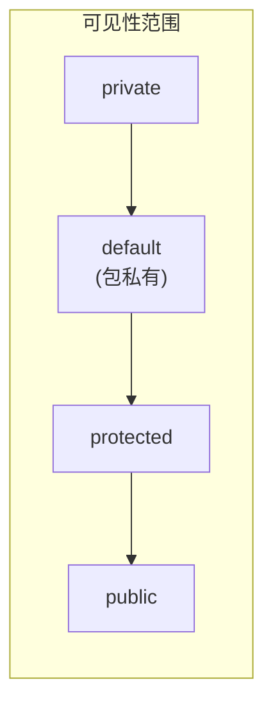
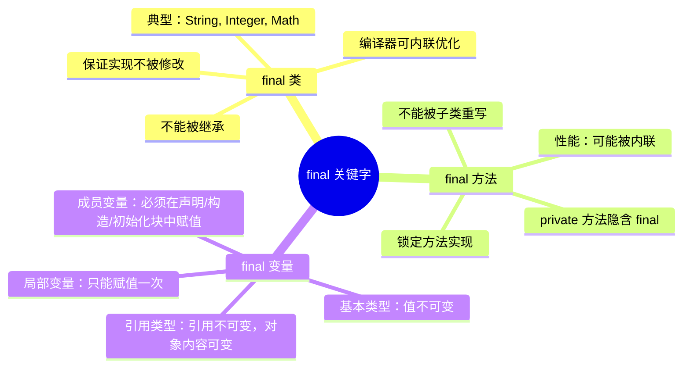
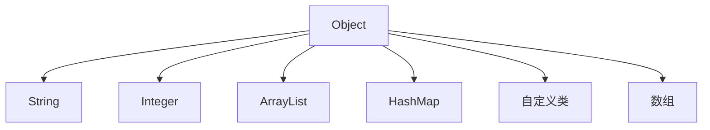
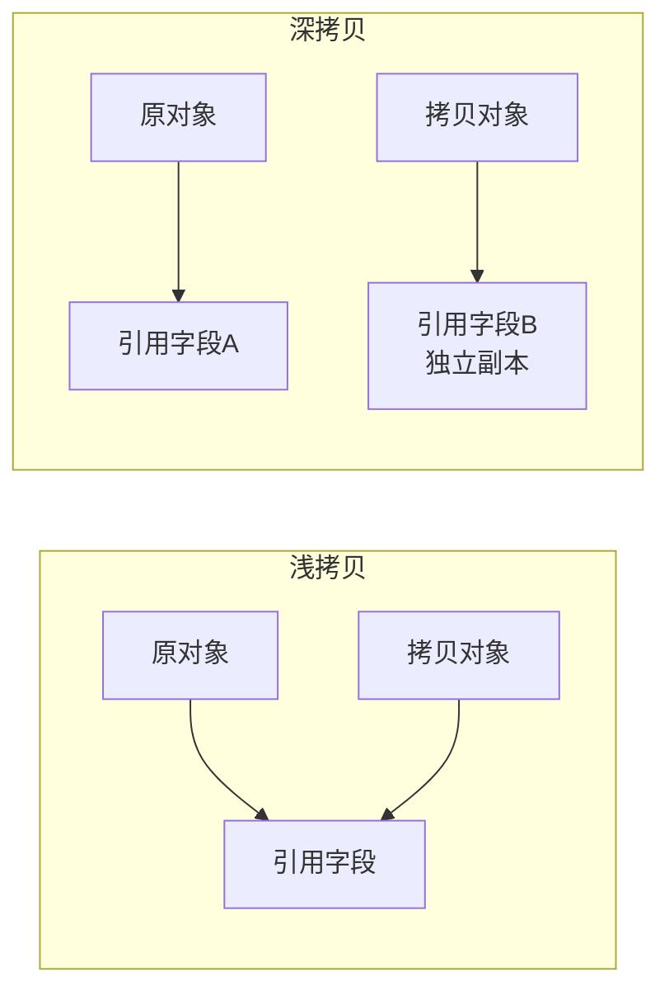
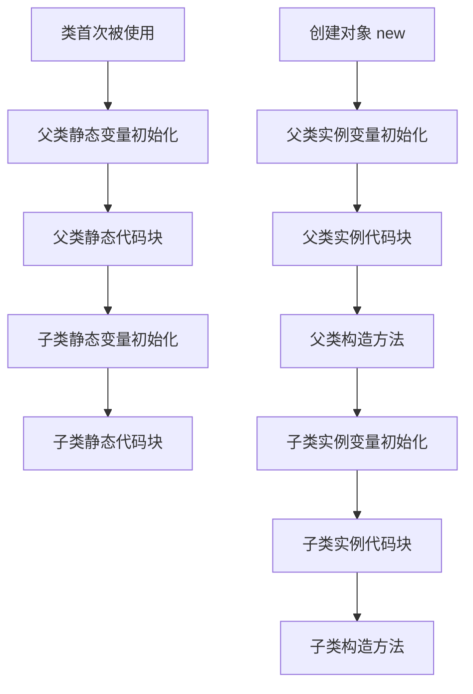

# 继承、多态、抽象类与接口

## 学习目标

- 理解继承的 is-a 关系、super 调用父类构造与方法的规则
- 掌握方法重写(override)与重载(overload)的区别及 @Override 作用
- 理解多态的编译期类型与运行期绑定（动态分派）
- 区分抽象类与接口的设计意图，掌握 Java 8+ 接口默认方法/静态方法
- 识别单继承限制、构造器不可继承、final 阻止继承/重写等约束

::: tip 核心要点
- **继承**是面向对象的核心机制,实现代码复用和层次化设计
- **多态**允许统一接口处理不同对象,提升系统灵活性
- **抽象类**提供部分实现,用于建立基类
- **接口**定义行为规范,实现多重继承效果
:::

## 一、继承的核心概念

### 1.1 什么是继承

**继承(Inheritance)** 是面向对象编程的核心特性之一,它允许一个类(子类)基于另一个类(父类)来创建,从而实现代码的重用和扩展。

**继承的本质作用:**
- **代码复用**: 子类自动拥有父类的属性和方法,避免重复编写
- **层次结构**: 建立类的层次关系,使系统结构更清晰
- **多态基础**: 为多态提供实现基础,统一父类引用管理子类对象
- **扩展增强**: 子类可扩展或重写父类功能

**继承关系术语:**
- **父类/超类/基类(Superclass)**: 被继承的类
- **子类/派生类(Subclass)**: 继承父类的类
- **is-a 关系**: 子类是父类的一种特殊类型

### 1.2 继承的语法与基本用法

使用 `extends` 关键字实现继承:

```java
// 父类
public class Animal {
    String name;
    
    public Animal(String name) {
        this.name = name;
    }
    
    public void eat() {
        System.out.println(name + "正在吃东西");
    }
    
    public void sleep() {
        System.out.println(name + "正在睡觉");
    }
}

// 子类继承父类
public class Dog extends Animal {
    // 子类特有的属性
    private String breed;
    
    public Dog(String name, String breed) {
        super(name); // 调用父类构造方法
        this.breed = breed;
    }
    
    // 子类特有的方法
    public void bark() {
        System.out.println(name + "汪汪叫");
    }
    
    // 重写父类方法
    @Override
    public void eat() {
        System.out.println(name + "(" + breed + ")在啃骨头");
    }
}

// 使用示例
public class Test {
    public static void main(String[] args) {
        Dog dog = new Dog("旺财", "金毛");
        dog.eat();    // 调用重写的方法
        dog.sleep();  // 继承自父类的方法
        dog.bark();   // 子类特有的方法
    }
}
```

**输出结果:**
```
旺财(金毛)在啃骨头
旺财正在睡觉
旺财汪汪叫
```

### 1.3 继承的核心特性

#### 1. 单继承机制
Java 只支持**单继承**,即一个类只能有一个直接父类:

```java
// √ 正确: 单继承
public class Dog extends Animal { }

// × 错误: Java不支持多重继承
// public class Dog extends Animal, Creature { }
```

**为什么Java不支持多重继承?**
- 避免菱形继承问题(钻石问题)
- 降低语言复杂度
- 通过接口可以实现类似功能

#### 2. 多层继承
虽然不支持多重继承,但支持多层继承链:

```java
class Animal { }
class Mammal extends Animal { }
class Dog extends Mammal { }  // 多层继承
```

#### 3. 访问控制继承

子类对父类成员的访问权限:

| 访问修饰符 | 同一类 | 同包 | 不同包子类 | 不同包非子类 |
|-----------|-------|------|-----------|-------------|
| public | √ | √ | √ | √ |
| protected | √ | √ | √ | × |
| 默认(包私有) | √ | √ | × | × |
| private | √ | × | × | × |

**访问示例:**

```java
// 父类
public class Parent {
    public int publicVar = 1;
    protected int protectedVar = 2;
    int defaultVar = 3;        // 包私有
    private int privateVar = 4;
    
    private void privateMethod() {
        System.out.println("私有方法");
    }
    
    protected void protectedMethod() {
        System.out.println("受保护方法");
    }
}

// 同包子类
public class Child extends Parent {
    public void accessMembers() {
        System.out.println(publicVar);      // √ 可访问
        System.out.println(protectedVar);   // √ 可访问
        System.out.println(defaultVar);     // √ 同包可访问
        // System.out.println(privateVar);  // × 编译错误
        
        protectedMethod();  // √ 可访问
        // privateMethod(); // × 编译错误
    }
}

// 不同包子类
public class AnotherChild extends Parent {
    public void accessMembers() {
        System.out.println(publicVar);      // √ 可访问
        System.out.println(protectedVar);   // √ 可访问
        // System.out.println(defaultVar);  // × 不同包无法访问
        // System.out.println(privateVar);  // × 编译错误
    }
}
```

### 1.4 super 关键字详解

`super` 关键字用于引用父类成员:

**三种用法:**

#### 1. 调用父类构造方法

```java
public class Animal {
    private String name;
    
    public Animal(String name) {
        this.name = name;
    }
}

public class Dog extends Animal {
    private String breed;
    
    public Dog(String name, String breed) {
        super(name);  // 必须是构造方法第一行
        this.breed = breed;
    }
}
```

**重要规则:**
- `super()` 必须是构造方法的第一条语句
- 如果父类没有无参构造方法,子类必须显式调用 `super(参数)`
- 如果没有显式调用 `super()`,编译器会自动插入 `super()` 调用父类无参构造

#### 2. 访问父类成员变量

```java
public class Parent {
    protected int value = 10;
}

public class Child extends Parent {
    private int value = 20;  // 同名变量(不推荐)
    
    public void printValues() {
        System.out.println("子类value: " + value);        // 20
        System.out.println("父类value: " + super.value);  // 10
    }
}
```

#### 3. 调用父类方法

```java
public class Parent {
    public void show() {
        System.out.println("父类方法");
    }
}

public class Child extends Parent {
    @Override
    public void show() {
        super.show();  // 先调用父类方法
        System.out.println("子类增强逻辑");
    }
}
```

### 1.5 继承中的构造方法

**构造方法调用链:**

```java
class A {
    public A() {
        System.out.println("A的构造方法");
    }
}

class B extends A {
    public B() {
        super();  // 默认隐式调用
        System.out.println("B的构造方法");
    }
}

class C extends B {
    public C() {
        super();  // 默认隐式调用
        System.out.println("C的构造方法");
    }
}

public class Test {
    public static void main(String[] args) {
        new C();
    }
}
```

**输出结果:**
```
A的构造方法
B的构造方法
C的构造方法
```

**构造方法执行顺序:** Object → ... → 父类 → 子类

### 1.6 继承的限制与注意事项

#### 1. 不能继承的内容

```java
public class Parent {
    // 私有成员不能直接继承
    private int privateField;
    
    // 构造方法不能继承
    public Parent(int value) { }
    
    // final方法不能重写
    public final void finalMethod() { }
    
    // static方法不参与多态
    public static void staticMethod() { }
}
```

#### 2. 继承层次的深度控制

```java
// × 不推荐: 继承层次过深
class A { }
class B extends A { }
class C extends B { }
class D extends C { }
class E extends D { }
// ...继续继承

// 推荐: 控制在3层以内,优先使用组合
```

#### 3. 组合优于继承

```java
// × 不好的设计: 过度使用继承
class Animal { }
class FlyingAnimal extends Animal { }
class SwimmingAnimal extends Animal { }
// 问题: 鸭子既能飞又能游怎么办?

// √ 好的设计: 使用组合
class Animal {
    private MovementBehavior movement;
    
    public void move() {
        movement.move();
    }
}

interface MovementBehavior {
    void move();
}

class FlyingMovement implements MovementBehavior {
    public void move() {
        System.out.println("在空中飞翔");
    }
}

class SwimmingMovement implements MovementBehavior {
    public void move() {
        System.out.println("在水中游泳");
    }
}

// 使用
Animal duck = new Animal();
duck.movement = new FlyingMovement();  // 可以飞
duck.movement = new SwimmingMovement(); // 也可以游
```

**继承 vs 组合选择:**
- **继承**: 明确的 is-a 关系,需要多态性
- **组合**: has-a 或 can-do 关系,需要灵活性

## 二、方法重写与方法重载

### 2.1 方法重写(Override)

**方法重写**是子类重新定义父类中已有的方法,实现运行时多态的关键机制。

#### 重写的规则

```java
class Animal {
    // 父类方法
    public void makeSound() {
        System.out.println("动物发出声音");
    }
    
    // 返回类型为父类
    public Animal create() {
        return new Animal();
    }
    
    // 受保护方法
    protected void eat() {
        System.out.println("动物在吃东西");
    }
    
    // final方法不能重写
    public final void sleep() {
        System.out.println("动物在睡觉");
    }
    
    // static方法不参与重写
    public static void count() {
        System.out.println("统计动物数量");
    }
}

class Dog extends Animal {
    // √ 正确重写
    @Override
    public void makeSound() {
        System.out.println("狗汪汪叫");
    }
    
    // √ 协变返回类型(JDK 5+)
    @Override
    public Dog create() {  // 返回类型可以是父类返回类型的子类
        return new Dog();
    }
    
    // √ 访问权限可以更宽松
    @Override
    public void eat() {  // protected → public
        System.out.println("狗在啃骨头");
    }
    
    // × 编译错误: 不能重写final方法
    // @Override
    // public void sleep() { }
    
    // 这不是重写,而是定义了新的静态方法(不推荐同名)
    public static void count() {
        System.out.println("统计狗的数量");
    }
}
```

**方法重写五大规则:**

| 规则 | 说明 | 示例 |
|-----|------|------|
| 方法签名相同 | 方法名、参数列表必须完全相同 | `void eat()` vs `void eat(String food)` × |
| 返回类型兼容 | 相同或是父类返回类型的子类型(协变返回) | `Animal create()` → `Dog create()` √ |
| 访问权限放宽 | 不能比父类更严格 | `protected` → `public` √ |
| 异常范围缩小 | 不能抛出更广泛的检查异常 | `throws IOException` → `throws FileNotFoundException` √ |
| @Override注解 | 建议使用,编译器会检查重写正确性 | `@Override public void eat() { }` |

#### 不能重写的方法

```java
class Parent {
    // final方法
    public final void finalMethod() { }
    
    // static方法
    public static void staticMethod() { }
    
    // private方法(子类不可见)
    private void privateMethod() { }
}

class Child extends Parent {
    // × 编译错误: final方法不能重写
    // public void finalMethod() { }
    
    // × 这不是重写,是新的静态方法
    public static void staticMethod() { }
    
    // √ 这是新方法,不是重写
    private void privateMethod() { }
}
```

### 2.2 方法重载(Overload)

**方法重载**是在同一个类中定义多个同名方法,参数列表不同,实现编译时多态。

#### 重载规则

```java
public class Calculator {
    // 重载方法1: 两个整数
    public int add(int a, int b) {
        return a + b;
    }
    
    // 重载方法2: 三个整数
    public int add(int a, int b, int c) {
        return a + b + c;
    }
    
    // 重载方法3: 两个浮点数
    public double add(double a, double b) {
        return a + b;
    }
    
    // 重载方法4: 整数和浮点数
    public double add(int a, double b) {
        return a + b;
    }
    
    // × 编译错误: 仅返回类型不同不能重载
    // public double add(int a, int b) {
    //     return a + b;
    // }
    
    // √ 重载可以改变访问修饰符
    private long add(long a, long b) {
        return a + b;
    }
}
```

**方法重载核心规则:**
- **必须不同**: 参数列表(参数类型、个数、顺序)
- **可以不同**: 返回类型、访问修饰符、异常声明
- **不能仅靠**: 返回类型、访问修饰符、异常声明区分

#### 重载方法的选择

```java
public class OverloadTest {
    public void test(int a) {
        System.out.println("int参数: " + a);
    }
    
    public void test(long a) {
        System.out.println("long参数: " + a);
    }
    
    public void test(Integer a) {
        System.out.println("Integer参数: " + a);
    }
    
    public void test(int... a) {
        System.out.println("可变参数: " + Arrays.toString(a));
    }
    
    public static void main(String[] args) {
        OverloadTest obj = new OverloadTest();
        
        obj.test(10);           // 调用 test(int)
        obj.test(10L);          // 调用 test(long)
        obj.test(Integer.valueOf(10)); // 调用 test(Integer)
        obj.test(10, 20);       // 调用 test(int...)
    }
}
```

**方法匹配优先级:** 精确匹配 → 自动类型转换 → 自动装箱 → 可变参数

### 2.3 重写 vs 重载对比

| 特性 | 方法重写(Override) | 方法重载(Overload) |
|-----|------------------|------------------|
| **发生位置** | 父类与子类之间 | 同一个类中 |
| **方法名** | 必须相同 | 必须相同 |
| **参数列表** | 必须相同 | 必须不同 |
| **返回类型** | 相同或协变返回 | 可以不同 |
| **访问修饰符** | 不能更严格 | 可以任意修改 |
| **异常声明** | 不能更广泛 | 可以任意修改 |
| **多态类型** | 运行时多态 | 编译时多态 |
| **绑定机制** | 动态绑定 | 静态绑定 |
| **@Override** | 建议使用 | 不适用 |

**实战对比示例:**

```java
class Parent {
    // 方法1
    public void show(int a) {
        System.out.println("Parent.show(int): " + a);
    }
    
    // 方法2: 重载
    public void show(double a) {
        System.out.println("Parent.show(double): " + a);
    }
}

class Child extends Parent {
    // 重写方法1
    @Override
    public void show(int a) {
        System.out.println("Child.show(int): " + a);
    }
    
    // 重载: 新增方法
    public void show(String s) {
        System.out.println("Child.show(String): " + s);
    }
    
    // 重写方法2
    @Override
    public void show(double a) {
        System.out.println("Child.show(double): " + a);
    }
}

public class Test {
    public static void main(String[] args) {
        Parent p = new Child();
        p.show(10);      // 动态绑定,调用 Child.show(int)
        p.show(10.5);    // 动态绑定,调用 Child.show(double)
        // p.show("hello"); // 编译错误: Parent没有show(String)
        
        Child c = new Child();
        c.show(10);      // 调用 Child.show(int)
        c.show(10.5);    // 调用 Child.show(double)
        c.show("hello"); // 调用 Child.show(String)
    }
}
```

## 三、多态的核心原理

### 3.1 多态的定义与类型

**多态(Polymorphism)** 指同一操作作用于不同对象时产生不同的行为。多态是面向对象编程的核心特性之一。

**多态的三要素:**
1. **继承**: 子类继承父类
2. **重写**: 子类重写父类方法
3. **向上转型**: 父类引用指向子类对象

**多态的类型:**

| 类型 | 实现方式 | 绑定时机 | 示例 |
|-----|---------|---------|------|
| **编译时多态** | 方法重载 | 编译期 | `add(int, int)` vs `add(int, int, int)` |
| **运行时多态** | 方法重写+向上转型 | 运行期 | `Animal a = new Dog(); a.makeSound();` |

### 3.2 运行时多态的实现原理

#### 核心机制: 动态绑定

**动态绑定(Dynamic Binding)** 是在运行时根据对象的实际类型而非引用类型来决定调用哪个方法。

```java
class Animal {
    public void makeSound() {
        System.out.println("动物发出声音");
    }
}

class Dog extends Animal {
    @Override
    public void makeSound() {
        System.out.println("狗汪汪叫");
    }
}

class Cat extends Animal {
    @Override
    public void makeSound() {
        System.out.println("猫喵喵叫");
    }
}

public class PolymorphismDemo {
    // 多态方法: 接收父类类型参数
    public static void letAnimalSpeak(Animal animal) {
        animal.makeSound();  // 运行时动态绑定
    }
    
    public static void main(String[] args) {
        Animal animal1 = new Dog();  // 向上转型
        Animal animal2 = new Cat();  // 向上转型
        
        animal1.makeSound();  // 输出: 狗汪汪叫
        animal2.makeSound();  // 输出: 猫喵喵叫
        
        // 统一接口处理不同类型对象
        letAnimalSpeak(new Dog());  // 输出: 狗汪汪叫
        letAnimalSpeak(new Cat());  // 输出: 猫喵喵叫
    }
}
```

**动态绑定原理:**
1. 编译时检查引用类型是否有该方法
2. 运行时JVM查找对象的实际类型;
3. 从实际类型开始向上查找方法实现;
4. 找到第一个匹配的方法并执行

#### JVM方法调用指令

| 指令 | 绑定类型 | 使用场景 |
|-----|---------|---------|
| `invokestatic` | 静态绑定 | 调用静态方法 |
| `invokespecial` | 静态绑定 | 调用构造方法、私有方法、super方法 |
| `invokevirtual` | 动态绑定 | 调用虚方法(普通实例方法) |
| `invokeinterface` | 动态绑定 | 调用接口方法 |
| `invokedynamic` | 动态绑定 | Lambda表达式、方法引用 |

### 3.3 向上转型与向下转型

#### 向上转型(Upcasting)

**向上转型**是将子类对象赋值给父类引用,自动进行,安全可靠。

```java
Animal animal = new Dog();  // 向上转型
animal.makeSound();  // 调用Dog重写的方法
// animal.bark();    // 编译错误: 父类引用无法调用子类特有方法
```

**向上转型特点:**
- 自动类型转换,无需显式声明
- 只能调用父类定义的方法
- 实际执行的是子类重写的方法
- 安全,不会出现ClassCastException

#### 向下转型(Downcasting)

**向下转型**是将父类引用转换为子类引用,需要显式类型转换,存在风险。

```java
Animal animal = new Dog();  // 向上转型

// 不安全的向下转型
// Dog dog = (Dog) animal;  // 编译通过,运行时可能出错

// 安全的向下转型
if (animal instanceof Dog) {
    Dog dog = (Dog) animal;  // 向下转型
    dog.bark();  // 调用子类特有方法
}
```

#### instanceof 运算符详解

`instanceof` 用于判断对象是否是指定类或其子类的实例:

```java
class Animal { }
class Dog extends Animal { }
class Cat extends Animal { }

public class InstanceOfDemo {
    public static void main(String[] args) {
        Animal animal1 = new Dog();
        Animal animal2 = new Cat();
        Animal animal3 = new Animal();
        
        // instanceof判断
        System.out.println(animal1 instanceof Animal);  // true
        System.out.println(animal1 instanceof Dog);     // true
        System.out.println(animal1 instanceof Cat);     // false
        System.out.println(animal3 instanceof Dog);     // false
        
        // Java 16+: 模式匹配(正式特性,JEP 394)
        if (animal1 instanceof Dog dog) {
            dog.bark();  // 直接使用dog变量
        }
    }
}
```

**instanceof规则:**
- `null instanceof 任何类` 返回 `false`
- 对象实际类型 instanceof 目标类型或其父类 → `true`
- 编译器会检查类型是否兼容(无继承关系则编译错误)

#### 类型转换最佳实践

```java
public void processAnimal(Animal animal) {
    // 方式1: 传统instanceof检查
    if (animal instanceof Dog) {
        Dog dog = (Dog) animal;
        dog.bark();
    } else if (animal instanceof Cat) {
        Cat cat = (Cat) animal;
        cat.meow();
    }
    
    // 方式2: Java 16+ 模式匹配
    if (animal instanceof Dog dog) {
        dog.bark();
    } else if (animal instanceof Cat cat) {
        cat.meow();
    }
    
    // 方式3: 多态方法(推荐)
    animal.makeSound();  // 无需类型转换
}
```

### 3.4 多态的经典应用场景

#### 1. 方法参数多态

```java
// 统一处理不同类型的Shape对象
public class Canvas {
    // 多态参数
    public void draw(Shape shape) {
        shape.draw();  // 根据实际对象调用对应draw方法
    }
    
    public void drawMultiple(Shape... shapes) {
        for (Shape shape : shapes) {
            shape.draw();
        }
    }
}

abstract class Shape {
    abstract void draw();
}

class Circle extends Shape {
    void draw() {
        System.out.println("绘制圆形");
    }
}

class Rectangle extends Shape {
    void draw() {
        System.out.println("绘制矩形");
    }
}

// 使用
Canvas canvas = new Canvas();
canvas.draw(new Circle());      // 绘制圆形
canvas.draw(new Rectangle());   // 绘制矩形
canvas.drawMultiple(new Circle(), new Rectangle());  // 批量绘制
```

#### 2. 集合存储多态

```java
// 统一集合管理不同子类对象
List<Animal> animals = new ArrayList<>();
animals.add(new Dog());
animals.add(new Cat());
animals.add(new Bird());

// 统一处理
for (Animal animal : animals) {
    animal.makeSound();  // 多态调用
}
```

#### 3. 工厂模式

```java
interface Product {
    void use();
}

class ProductA implements Product {
    public void use() {
        System.out.println("使用产品A");
    }
}

class ProductB implements Product {
    public void use() {
        System.out.println("使用产品B");
    }
}

class ProductFactory {
    // 静态工厂方法返回接口类型
    public static Product createProduct(String type) {
        switch (type) {
            case "A":
                return new ProductA();
            case "B":
                return new ProductB();
            default:
                throw new IllegalArgumentException("未知产品类型");
        }
    }
}

// 使用
Product product = ProductFactory.createProduct("A");
product.use();  // 多态调用
```

#### 4. 策略模式

```java
// 策略接口
interface PaymentStrategy {
    void pay(int amount);
}

// 具体策略
class CreditCardPayment implements PaymentStrategy {
    public void pay(int amount) {
        System.out.println("信用卡支付: " + amount + "元");
    }
}

class AlipayPayment implements PaymentStrategy {
    public void pay(int amount) {
        System.out.println("支付宝支付: " + amount + "元");
    }
}

// 上下文类
class ShoppingCart {
    private PaymentStrategy strategy;
    
    // 动态设置策略
    public void setPaymentStrategy(PaymentStrategy strategy) {
        this.strategy = strategy;
    }
    
    public void checkout(int amount) {
        strategy.pay(amount);  // 多态调用
    }
}

// 使用
ShoppingCart cart = new ShoppingCart();
cart.setPaymentStrategy(new CreditCardPayment());
cart.checkout(100);  // 信用卡支付

cart.setPaymentStrategy(new AlipayPayment());
cart.checkout(200);  // 支付宝支付
```

### 3.5 多态的优势与局限

#### 优势

**1. 代码复用与可维护性**
```java
// 无需为每种动物编写独立方法
public void letAnimalSpeak(Animal animal) {
    animal.makeSound();  // 一处代码处理所有子类
}
```

**2. 扩展性符合开闭原则**
```java
// 新增子类无需修改现有代码
class Bird extends Animal {
    @Override
    public void makeSound() {
        System.out.println("鸟儿叽叽喳喳");
    }
}
// letAnimalSpeak方法无需修改即可处理Bird
```

**3. 降低耦合度**
```java
// 模块间通过接口通信,降低依赖
public class BusinessService {
    private DataSource dataSource;  // 接口类型
    
    // 可以注入任何DataSource实现
    public void setDataSource(DataSource dataSource) {
        this.dataSource = dataSource;
    }
}
```

#### 局限性

**1. 无法直接调用子类特有方法**
```java
Animal animal = new Dog();
// animal.bark();  // 编译错误

// 需要向下转型
if (animal instanceof Dog) {
    ((Dog) animal).bark();
}
```

**2. 性能开销**
动态绑定比静态绑定有轻微性能开销(通常可忽略)

**3. 设计复杂性**
过度使用多态可能导致类层次结构复杂

## 四、抽象类与接口深度对比

### 4.1 抽象类(Abstract Class)

**抽象类**是不能实例化的类,用于定义子类的通用模板。

#### 抽象类的特点

```java
// 抽象类定义
public abstract class Animal {
    // 普通成员变量
    protected String name;
    private int age;
    
    // 构造方法
    public Animal(String name, int age) {
        this.name = name;
        this.age = age;
    }
    
    // 抽象方法(无实现)
    public abstract void makeSound();
    
    // 抽象方法(无实现)
    public abstract void move();
    
    // 具体方法
    public void sleep() {
        System.out.println(name + "在睡觉");
    }
    
    // final方法(不能被子类重写)
    public final void die() {
        System.out.println(name + "死亡");
    }
    
    // static方法
    public static void describe() {
        System.out.println("这是一个动物类");
    }
}

// 子类实现抽象方法
public class Dog extends Animal {
    public Dog(String name, int age) {
        super(name, age);  // 调用抽象类构造方法
    }
    
    @Override
    public void makeSound() {
        System.out.println(name + "汪汪叫");
    }
    
    @Override
    public void move() {
        System.out.println(name + "在奔跑");
    }
}

// × 编译错误: 抽象类不能实例化
// Animal animal = new Animal("测试", 1);

// √ 通过具体子类实例化
Animal dog = new Dog("旺财", 3);
```

**抽象类核心特性:**
- 使用 `abstract` 关键字修饰
- 不能直接实例化
- 可以包含抽象方法和具体方法
- 可以有构造方法、成员变量、静态方法
- 子类必须实现所有抽象方法(除非子类也是抽象类)

#### 抽象类的应用场景

**场景1: 提供部分实现**

```java
// 抽象类提供模板实现
public abstract class AbstractDao<T> {
    // 具体方法: 公共逻辑
    public void save(T entity) {
        if (validate(entity)) {
            doSave(entity);
        }
    }
    
    // 具体方法: 验证逻辑可复用
    protected boolean validate(T entity) {
        return entity != null;
    }
    
    // 抽象方法: 子类实现具体保存逻辑
    protected abstract void doSave(T entity);
    
    // 抽象方法: 子类实现具体查询逻辑
    public abstract T findById(Long id);
}

// 子类实现
public class UserDao extends AbstractDao<User> {
    @Override
    protected void doSave(User user) {
        System.out.println("保存用户: " + user.getName());
    }
    
    @Override
    public User findById(Long id) {
        System.out.println("查询用户ID: " + id);
        return new User();
    }
}
```

**场景2: 模板方法模式**

```java
// 抽象类定义算法骨架
public abstract class DataProcessor {
    // 模板方法: 定义算法骨架
    public final void process() {
        loadData();
        validateData();
        transformData();
        saveData();
    }
    
    // 抽象方法: 子类实现
    protected abstract void loadData();
    protected abstract void transformData();
    protected abstract void saveData();
    
    // 具体方法: 可复用的逻辑
    protected void validateData() {
        System.out.println("验证数据格式");
    }
}

// 具体子类
class CSVProcessor extends DataProcessor {
    protected void loadData() {
        System.out.println("从CSV文件加载数据");
    }
    
    protected void transformData() {
        System.out.println("转换CSV数据格式");
    }
    
    protected void saveData() {
        System.out.println("保存CSV数据");
    }
}
```

### 4.2 接口(Interface)

**接口**是完全抽象的类型,定义行为规范,实现多重继承效果。

#### 接口的基本特性

```java
// 接口定义
public interface Flyable {
    // 常量: 默认 public static final
    int MAX_HEIGHT = 10000;
    
    // 抽象方法: 默认 public abstract
    void fly();
    
    // 默认方法(JDK 8+): 有具体实现
    default void land() {
        System.out.println("降落中...");
    }
    
    // 静态方法(JDK 8+): 工具方法
    static void checkWeather() {
        System.out.println("检查天气状况");
    }
    
    // 私有方法(JDK 9+): 代码复用
    private void log(String message) {
        System.out.println("[LOG] " + message);
    }
}

// 实现接口
public class Bird implements Flyable {
    @Override
    public void fly() {
        System.out.println("鸟儿在飞翔");
    }
    
    // 可以重写默认方法
    @Override
    public void land() {
        Flyable.super.land();  // 调用接口默认实现
        System.out.println("鸟儿着陆");
    }
}

// 使用
Flyable bird = new Bird();
bird.fly();      // 调用实现类方法
bird.land();     // 调用默认方法
Flyable.checkWeather();  // 调用静态方法
```

#### 接口的演进历程

**JDK 8之前: 纯抽象**
```java
interface Flyable {
    void fly();  // 只有抽象方法
}
```

**JDK 8: 增强功能**
```java
interface Flyable {
    void fly();
    
    // 默认方法: 向后兼容
    default void startEngine() {
        System.out.println("启动引擎");
    }
    
    // 静态方法: 工具方法
    static void checkFuel() {
        System.out.println("检查燃料");
    }
}
```

**JDK 9: 私有方法**
```java
interface Flyable {
    void fly();
    
    default void flyHigh() {
        checkCondition();  // 复用私有方法
        System.out.println("高空飞行");
    }
    
    default void flyLow() {
        checkCondition();  // 复用私有方法
        System.out.println("低空飞行");
    }
    
    // 私有方法: 复用代码
    private void checkCondition() {
        System.out.println("检查飞行条件");
    }
    
    // 私有静态方法
    private static void log(String message) {
        System.out.println("[LOG] " + message);
    }
}
```

#### 多接口实现与冲突解决

```java
interface InterfaceA {
    default void show() {
        System.out.println("InterfaceA.show");
    }
}

interface InterfaceB {
    default void show() {
        System.out.println("InterfaceB.show");
    }
}

// 实现多个接口
class MyClass implements InterfaceA, InterfaceB {
    // 必须重写冲突的默认方法
    @Override
    public void show() {
        // 方式1: 调用指定接口的默认方法
        InterfaceA.super.show();
        
        // 方式2: 提供新实现
        System.out.println("MyClass.show");
    }
}

// 多接口继承
interface InterfaceC extends InterfaceA, InterfaceB {
    // 接口也可以重写默认方法
    @Override
    default void show() {
        InterfaceA.super.show();
        System.out.println("InterfaceC.show");
    }
}
```

**冲突解决规则:**
1. **类优先**: 类中声明的方法优先于接口默认方法
2. **子接口优先**: 层次结构中更具体的接口优先
3. **显式重写**: 多个接口有相同默认方法时必须显式重写

#### 函数式接口

**函数式接口**是只有一个抽象方法的接口,可以使用Lambda表达式。

```java
// 自定义函数式接口
@FunctionalInterface
public interface Calculator {
    int calculate(int a, int b);
}

// 使用Lambda表达式
Calculator add = (a, b) -> a + b;
Calculator multiply = (a, b) -> a * b;

System.out.println(add.calculate(5, 3));       // 8
System.out.println(multiply.calculate(5, 3));  // 15

// Java内置函数式接口
// Predicate<T>: 判断型接口
Predicate<Integer> isEven = n -> n % 2 == 0;
System.out.println(isEven.test(4));  // true

// Consumer<T>: 消费型接口
Consumer<String> printer = s -> System.out.println(s);
printer.accept("Hello");  // Hello

// Supplier<T>: 供给型接口
Supplier<Double> randomSupplier = () -> Math.random();
System.out.println(randomSupplier.get());

// Function<T, R>: 函数型接口
Function<String, Integer> stringLength = s -> s.length();
System.out.println(stringLength.apply("Hello"));  // 5
```

### 4.3 抽象类 vs 接口详细对比

#### 对比表格

| 特性 | 抽象类 | 接口 |
|-----|-------|------|
| **关键字** | `abstract class` | `interface` |
| **实例化** | 不能直接实例化 | 不能实例化 |
| **继承/实现** | 单继承:`extends` | 多实现:`implements` |
| **成员变量** | 任意类型变量 | 只能是`public static final`常量 |
| **构造方法** | 可以有构造方法 | 不能有构造方法 |
| **抽象方法** | 可以有抽象方法 | JDK 8前全部是抽象方法 |
| **具体方法** | 可以有具体方法 | JDK 8+可以有default方法 |
| **静态方法** | 可以有静态方法 | JDK 8+可以有静态方法 |
| **私有方法** | 可以有私有方法 | JDK 9+可以有私有方法 |
| **设计目的** | 代码复用,模板设计 | 行为规范,多重继承 |
| **关系类型** | is-a关系 | can-do关系 |

#### 核心区别示例

```java
// 抽象类: is-a关系,共享代码
public abstract class Vehicle {
    protected String brand;  // 成员变量
    protected int speed;
    
    public Vehicle(String brand) {  // 构造方法
        this.brand = brand;
    }
    
    // 抽象方法
    public abstract void start();
    
    // 具体方法: 共享代码
    public void stop() {
        System.out.println(brand + "停止运行");
    }
    
    // 私有方法
    private void log(String message) {
        System.out.println(message);
    }
}

// 接口: can-do关系,行为规范
public interface Flyable {
    int MAX_HEIGHT = 10000;  // 常量
    
    void fly();  // 抽象方法
    
    // 默认方法
    default void land() {
        System.out.println("降落");
    }
}

// 组合使用
public class Airplane extends Vehicle implements Flyable {
    public Airplane(String brand) {
        super(brand);
    }
    
    @Override
    public void start() {
        System.out.println(brand + "飞机启动");
    }
    
    @Override
    public void fly() {
        System.out.println(brand + "飞机起飞");
    }
}
```

### 4.4 抽象类与接口的选择原则

#### 使用抽象类的场景

```java
// √ 适合使用抽象类
// 1. 需要共享代码和状态
public abstract class Employee {
    protected String name;
    protected double salary;
    
    public Employee(String name, double salary) {
        this.name = name;
        this.salary = salary;
    }
    
    // 共享方法
    public void work() {
        System.out.println(name + "在工作中");
    }
    
    // 抽象方法
    public abstract double calculateBonus();
}

// 2. 需要控制子类初始化
public abstract class DatabaseConnection {
    protected String url;
    
    public DatabaseConnection(String url) {
        this.url = url;
        connect();  // 子类必须先连接
    }
    
    protected abstract void connect();
}

// 3. 需要protected成员
public abstract class Account {
    protected double balance;
    
    protected void updateBalance(double amount) {
        this.balance += amount;
    }
}
```

#### 使用接口的场景

```java
// √ 适合使用接口
// 1. 定义行为规范,无状态共享
public interface Comparable<T> {
    int compareTo(T o);
}

// 2. 实现多重继承
public class Duck implements Flyable, Swimmable, Walkable {
    // 具备多种能力
}

// 3. 为不相关类定义共同行为
public interface Serializable { }
// 任何类都可实现,无论继承层次

// 4. 函数式接口
@FunctionalInterface
public interface ActionListener {
    void actionPerformed(ActionEvent e);
}
```

#### 最佳实践总结

**优先使用接口:**
- 定义行为规范
- 需要多重继承
- 不相关类实现共同行为
- 使用Lambda表达式

**使用抽象类:**
- 需要共享代码和状态
- 需要控制子类初始化
- 需要protected成员
- 明确的is-a关系

**组合使用:**
```java
// 接口定义规范
public interface DataSource {
    Connection getConnection();
}

// 抽象类提供部分实现
public abstract class AbstractDataSource implements DataSource {
    protected String url;
    protected String username;
    
    public AbstractDataSource(String url, String username) {
        this.url = url;
        this.username = username;
    }
    
    // 共享代码
    protected void validateConfig() {
        if (url == null || url.isEmpty()) {
            throw new IllegalArgumentException("URL不能为空");
        }
    }
}

// 具体实现
public class MySQLDataSource extends AbstractDataSource {
    public MySQLDataSource(String url, String username) {
        super(url, username);
    }
    
    @Override
    public Connection getConnection() {
        validateConfig();  // 复用抽象类方法
        // 返回MySQL连接
        return null;
    }
}
```

### 4.5 密封类与密封接口（Java 17 正式）

在实际业务中，继承层次往往需要**受控**：只允许特定子类继承，禁止外部随意扩展。Java 17（JEP 409）正式引入**密封类（Sealed Classes）**，用 `sealed`、`permits`、`non-sealed`、`final` 四个关键字精确控制继承边界。

**核心语法**：

```java
// 密封类：只允许 Circle、Square、Triangle 三个子类
public sealed class Shape permits Circle, Square, Triangle {}

// 直接子类必须声明为 final / sealed / non-sealed
public final class Circle extends Shape {}          // 不再允许下级继承
public sealed class Square extends Shape permits ColoredSquare {}
public non-sealed class Triangle extends Shape {}   // 恢复开放继承
```

**密封接口 + record 子类**（与 Java 21 模式匹配天然契合）：

```java
// record 隐式 final，天然满足 sealed 约束
public sealed interface Expr permits ConstantExpr, PlusExpr, TimesExpr {
    int eval();
}

public record ConstantExpr(int i) implements Expr {
    public int eval() { return i; }
}

public record PlusExpr(Expr a, Expr b) implements Expr {
    public int eval() { return a.eval() + b.eval(); }
}

public record TimesExpr(Expr a, Expr b) implements Expr {
    public int eval() { return a.eval() * b.eval(); }
}
```

**约束规则**：

1. 密封类/接口与直接子类必须在**同一模块**（或同一包，未命名模块时）
2. `permits` 列出的子类必须直接继承密封类（不允许隔代）
3. 直接子类必须用 `final`（终结）、`sealed`（继续密封）或 `non-sealed`（解封）之一声明
4. record 类隐式 `final`，可直接作为密封接口的实现子类

**为什么需要密封类（与 final 的对比）**：

| 维度 | `final` 类 | 密封类 |
|------|-----------|--------|
| 继承自由度 | 完全禁止继承 | 限制在允许集合内继承 |
| 扩展性 | 无法扩展 | 可枚举的受控扩展 |
| 模式匹配 | 无额外作用 | 支撑穷尽性检查（无需 default） |
| 领域建模 | 不适合开放层级 | 适合表达式、状态机、协议树 |

**密封类 + switch 模式匹配的穷尽性（Java 21 最佳实践）**：

```java
// 编译器验证：所有密封子类都有分支，无需 default
// (假设 Shape 的各子类为 record 或提供 radius()/side()/base()/height() 访问器)
static double area(Shape s) {
    return switch (s) {
        case Circle c -> Math.PI * c.radius() * c.radius();
        case Square sq -> sq.side() * sq.side();
        case Triangle t -> t.base() * t.height() / 2;
    };
}
```

> **演进**：Java 15 预览 → Java 16 二次预览 → Java 17 正式（JEP 409）。是 Java 21 模式匹配生态的基础设施。

## 五、instanceof 与类型转换详解

### 5.1 instanceof 运算符深度解析

`instanceof` 是Java的类型比较运算符,用于检查对象是否是指定类的实例。

#### instanceof的工作原理

```java
class Animal { }
class Dog extends Animal { }
class Cat extends Animal { }

public class InstanceOfDemo {
    public static void main(String[] args) {
        Animal animal1 = new Dog();
        Animal animal2 = new Cat();
        Animal animal3 = null;
        
        // 基本用法
        System.out.println(animal1 instanceof Animal);  // true: Dog是Animal的子类
        System.out.println(animal1 instanceof Dog);     // true: 实际类型是Dog
        System.out.println(animal1 instanceof Cat);     // false: 不是Cat实例
        
        // null的特殊处理
        System.out.println(animal3 instanceof Dog);     // false: null instanceof 任何类型都是false
        
        // 编译时类型检查
        String str = "hello";
        // System.out.println(str instanceof Animal);  // 编译错误: 类型不兼容
        
        // 数组类型检查
        int[] arr = new int[5];
        System.out.println(arr instanceof int[]);    // true
        System.out.println(arr instanceof Object);   // true: 数组是Object的子类
    }
}
```

**instanceof判断规则:**

| 情况 | 结果 |
|-----|------|
| `null instanceof 任何类型` | `false` |
| `对象实际类型 instanceof 目标类型` | `true` |
| `对象实际类型 instanceof 目标类型的父类` | `true` |
| `对象实际类型 instanceof 目标类型的子类` | `false` |
| `无继承关系的类型` | 编译错误 |

#### Java 16+ 模式匹配增强

```java
// 传统写法
public void processOld(Animal animal) {
    if (animal instanceof Dog) {
        Dog dog = (Dog) animal;
        dog.bark();
    }
}

// Java 16+ 模式匹配
public void processNew(Animal animal) {
    if (animal instanceof Dog dog) {
        dog.bark();  // 直接使用dog变量
    }
}

// 带条件的模式匹配
public void processWithCondition(Animal animal) {
    if (animal instanceof Dog dog && dog.getAge() > 3) {
        dog.bark();
    }
}
```

### 5.2 类型转换详解

#### 向上转型(Upcasting)

**自动类型转换,安全可靠**

```java
class Animal {
    public void eat() {
        System.out.println("动物吃东西");
    }
}

class Dog extends Animal {
    public void bark() {
        System.out.println("汪汪叫");
    }
    
    @Override
    public void eat() {
        System.out.println("狗吃骨头");
    }
}

public class UpcastingDemo {
    public static void main(String[] args) {
        Dog dog = new Dog();
        Animal animal = dog;  // 向上转型(自动)
        
        animal.eat();   // 调用Dog重写的方法: 狗吃骨头
        // animal.bark();  // 编译错误: 无法调用子类特有方法
        
        // 编译时类型 vs 运行时类型
        System.out.println(animal.getClass().getName());  // Dog
    }
}
```

**向上转型特点:**
- 编译时类型 = 父类类型
- 运行时类型 = 子类类型
- 只能调用父类定义的方法
- 实际执行的是子类重写的方法

#### 向下转型(Downcasting)

**强制类型转换,需要谨慎**

```java
public class DowncastingDemo {
    public static void main(String[] args) {
        // 场景1: 正确的向下转型
        Animal animal1 = new Dog();  // 向上转型
        if (animal1 instanceof Dog) {
            Dog dog = (Dog) animal1;  // 向下转型
            dog.bark();  // 可以调用子类特有方法
        }
        
        // 场景2: 错误的向下转型
        Animal animal2 = new Cat();
        // Dog dog = (Dog) animal2;  // 编译通过,运行时抛出ClassCastException
        if (animal2 instanceof Dog) {
            Dog dog = (Dog) animal2;
        } else {
            System.out.println("类型不匹配,无法转换");
        }
        
        // 场景3: Java 16+ 模式匹配
        if (animal1 instanceof Dog dog) {
            dog.bark();  // 类型转换和检查一步完成
        }
    }
}
```

#### 类型转换最佳实践

```java
public class TypeConversionBestPractice {
    // √ 推荐: 使用多态
    public void processAnimal1(Animal animal) {
        animal.makeSound();  // 无需类型转换
    }
    
    // √ 可接受: 必要时的类型检查
    public void processAnimal2(Animal animal) {
        if (animal instanceof Dog dog) {
            dog.bark();
        } else if (animal instanceof Cat cat) {
            cat.meow();
        }
    }
    
    // × 不推荐: 过度使用类型检查
    public void processAnimal3(Animal animal) {
        if (animal instanceof Dog) {
            Dog dog = (Dog) animal;
            dog.bark();
            dog.eat();
            dog.sleep();
            // ... 大量Dog特有方法
        }
        // 应该考虑重新设计,使用多态或访问者模式
    }
    
    // √ 推荐: 访问者模式处理复杂逻辑
    interface AnimalVisitor {
        void visit(Dog dog);
        void visit(Cat cat);
    }
    
    public void processAnimal4(Animal animal, AnimalVisitor visitor) {
        if (animal instanceof Dog dog) {
            visitor.visit(dog);
        } else if (animal instanceof Cat cat) {
            visitor.visit(cat);
        }
    }
}
```

### 5.3 常见陷阱与解决方案

#### 陷阱1: 忽略null检查

```java
// × 危险代码
Animal animal = getAnimal();  // 可能返回null
if (animal instanceof Dog) {
    Dog dog = (Dog) animal;  // 安全
}
// 但如果后续使用animal时要小心
animal.eat();  // animal可能为null!

// √ 安全代码
Animal animal = getAnimal();
if (animal != null) {
    animal.eat();  // 安全
    if (animal instanceof Dog dog) {
        dog.bark();
    }
}
```

#### 陷阱2: 过度依赖向下转型

```java
// × 设计问题: 过度使用instanceof
public void process(Object obj) {
    if (obj instanceof String) {
        String str = (String) obj;
        System.out.println(str.length());
    } else if (obj instanceof Integer) {
        Integer num = (Integer) obj;
        System.out.println(num * 2);
    } else if (obj instanceof Double) {
        Double num = (Double) obj;
        System.out.println(num * 3);
    }
    // 违反开闭原则,新增类型需要修改代码
}

// √ 更好的设计: 使用重载
public void process(String str) {
    System.out.println(str.length());
}

public void process(Integer num) {
    System.out.println(num * 2);
}

public void process(Double num) {
    System.out.println(num * 3);
}
```

#### 陷阱3: 数组类型转换

```java
// 数组协变(有风险)
String[] strings = new String[10];
Object[] objects = strings;  // 向上转型,编译通过

// objects[0] = Integer.valueOf(1);  // 编译通过,但运行时抛出ArrayStoreException

// √ 安全的数组操作
Object[] objects = new Object[10];
objects[0] = "hello";
objects[1] = 123;  // 安全

// 泛型数组(推荐)
List<String>[] stringLists = new ArrayList[10];  // 编译警告
List<String>[] stringLists = (List<String>[]) new ArrayList[10];  // 安全但需要强转
```

## 六、设计模式在继承与多态中的应用

### 6.1 模板方法模式(Template Method)

**模板方法模式**在抽象类中定义算法骨架,将某些步骤延迟到子类实现。

```java
// 抽象类定义模板
public abstract class DataExporter {
    // 模板方法: 定义算法骨架,final防止子类重写
    public final void export(String data) {
        validateData(data);
        String processed = processData(data);
        String formatted = formatData(processed);
        saveData(formatted);
        logExport(data);
    }
    
    // 抽象方法: 子类必须实现
    protected abstract String processData(String data);
    protected abstract String formatData(String data);
    protected abstract void saveData(String data);
    
    // 具体方法: 子类可选重写
    protected void validateData(String data) {
        if (data == null || data.isEmpty()) {
            throw new IllegalArgumentException("数据不能为空");
        }
    }
    
    // 钩子方法: 子类可选重写
    protected void logExport(String data) {
        System.out.println("数据导出完成");
    }
}

// 具体子类: CSV导出
public class CSVExporter extends DataExporter {
    @Override
    protected String processData(String data) {
        return data.replace(",", ";");
    }
    
    @Override
    protected String formatData(String data) {
        return "CSV格式: " + data;
    }
    
    @Override
    protected void saveData(String data) {
        System.out.println("保存到CSV文件: " + data);
    }
}

// 具体子类: JSON导出
public class JSONExporter extends DataExporter {
    @Override
    protected String processData(String data) {
        return "{\"data\":\"" + data + "\"}";
    }
    
    @Override
    protected String formatData(String data) {
        return "JSON格式: " + data;
    }
    
    @Override
    protected void saveData(String data) {
        System.out.println("保存到JSON文件: " + data);
    }
    
    // 重写钩子方法
    @Override
    protected void logExport(String data) {
        System.out.println("JSON数据导出完成: " + data);
    }
}

// 使用
DataExporter csvExporter = new CSVExporter();
csvExporter.export("name,age,city");

DataExporter jsonExporter = new JSONExporter();
jsonExporter.export("name:张三,age:25,city:北京");
```

**模板方法模式核心组成:**
- **模板方法**: 定义算法骨架,通常为final
- **抽象方法**: 子类必须实现的步骤
- **具体方法**: 共享的通用实现
- **钩子方法**: 子类可选重写的扩展点

### 6.2 策略模式(Strategy)

**策略模式**定义一系列算法,封装每个算法,使它们可以互相替换。

```java
// 策略接口
public interface SortStrategy {
    <T extends Comparable<T>> void sort(List<T> list);
}

// 具体策略: 冒泡排序
public class BubbleSortStrategy implements SortStrategy {
    @Override
    public <T extends Comparable<T>> void sort(List<T> list) {
        System.out.println("使用冒泡排序");
        // 冒泡排序实现
        for (int i = 0; i < list.size() - 1; i++) {
            for (int j = 0; j < list.size() - 1 - i; j++) {
                if (list.get(j).compareTo(list.get(j + 1)) > 0) {
                    T temp = list.get(j);
                    list.set(j, list.get(j + 1));
                    list.set(j + 1, temp);
                }
            }
        }
    }
}

// 具体策略: 快速排序
public class QuickSortStrategy implements SortStrategy {
    @Override
    public <T extends Comparable<T>> void sort(List<T> list) {
        System.out.println("使用快速排序");
        // 快速排序实现(简化版)
        Collections.sort(list);
    }
}

// 上下文类
public class SortedList<T extends Comparable<T>> {
    private List<T> list;
    private SortStrategy strategy;
    
    public SortedList(List<T> list) {
        this.list = list;
    }
    
    // 设置策略
    public void setSortStrategy(SortStrategy strategy) {
        this.strategy = strategy;
    }
    
    // 执行排序
    public void sort() {
        if (strategy != null) {
            strategy.sort(list);
        }
    }
    
    public List<T> getList() {
        return list;
    }
}

// 使用
List<Integer> numbers = Arrays.asList(5, 2, 8, 1, 9, 3);
SortedList<Integer> sortedList = new SortedList<>(new ArrayList<>(numbers));

// 策略1: 冒泡排序
sortedList.setSortStrategy(new BubbleSortStrategy());
sortedList.sort();
System.out.println(sortedList.getList());

// 策略2: 快速排序
sortedList.setSortStrategy(new QuickSortStrategy());
sortedList.sort();
System.out.println(sortedList.getList());
```

### 6.3 组合模式(Composite)

**组合模式**将对象组合成树形结构以表示"部分-整体"的层次结构。

```java
// 抽象组件
public abstract class FileSystemComponent {
    protected String name;
    
    public FileSystemComponent(String name) {
        this.name = name;
    }
    
    public abstract void display(int depth);
    public abstract int getSize();
}

// 叶子节点: 文件
public class File extends FileSystemComponent {
    private int size;
    
    public File(String name, int size) {
        super(name);
        this.size = size;
    }
    
    @Override
    public void display(int depth) {
        System.out.println("-".repeat(depth) + name);
    }
    
    @Override
    public int getSize() {
        return size;
    }
}

// 组合节点: 文件夹
public class Folder extends FileSystemComponent {
    private List<FileSystemComponent> children = new ArrayList<>();
    
    public Folder(String name) {
        super(name);
    }
    
    // 添加子组件
    public void add(FileSystemComponent component) {
        children.add(component);
    }
    
    // 移除子组件
    public void remove(FileSystemComponent component) {
        children.remove(component);
    }
    
    @Override
    public void display(int depth) {
        System.out.println("-".repeat(depth) + name + "/");
        for (FileSystemComponent child : children) {
            child.display(depth + 2);
        }
    }
    
    @Override
    public int getSize() {
        int totalSize = 0;
        for (FileSystemComponent child : children) {
            totalSize += child.getSize();
        }
        return totalSize;
    }
}

// 使用
Folder root = new Folder("根目录");

Folder documents = new Folder("文档");
documents.add(new File("简历.docx", 1024));
documents.add(new File("报告.pdf", 2048));

Folder pictures = new Folder("图片");
pictures.add(new File("照片.jpg", 3072));
pictures.add(new File("图标.png", 512));

root.add(documents);
root.add(pictures);
root.add(new File("readme.txt", 256));

root.display(0);
System.out.println("总大小: " + root.getSize() + " bytes");
```

## 七、常见误区与陷阱

### 7.1 继承相关误区

#### 误区1: 过度使用继承

```java
// × 错误示范: 不恰当的继承关系
class Stack extends Vector { }  // 栈不应该继承向量
class Properties extends Hashtable { }  // 属性不应该继承哈希表

// 问题: 暴露了父类不应该暴露的方法
Stack<String> stack = new Stack<>();
stack.add(0, "element");  // 栈不应该支持在任意位置插入

// √ 正确做法: 使用组合
class Stack<E> {
    private LinkedList<E> list = new LinkedList<>();
    
    public void push(E item) {
        list.addFirst(item);
    }
    
    public E pop() {
        return list.removeFirst();
    }
}
```

#### 误区2: 破坏里氏替换原则

```java
// × 错误示范: 子类改变了父类的行为约定
class Rectangle {
    protected int width;
    protected int height;
    
    public void setWidth(int width) {
        this.width = width;
    }
    
    public void setHeight(int height) {
        this.height = height;
    }
    
    public int getArea() {
        return width * height;
    }
}

class Square extends Rectangle {
    @Override
    public void setWidth(int width) {
        this.width = width;
        this.height = width;  // 改变了父类的行为约定
    }
    
    @Override
    public void setHeight(int height) {
        this.height = height;
        this.width = height;  // 改变了父类的行为约定
    }
}

// 问题: 无法用Square替换Rectangle
public void test(Rectangle rect) {
    rect.setWidth(5);
    rect.setHeight(4);
    // Rectangle: area = 20
    // Square: area = 16  行为不一致!
    assert rect.getArea() == 20;  // Square会导致断言失败
}

// √ 正确做法: 不应该建立继承关系
class Shape {
    abstract int getArea();
}

class Rectangle extends Shape { }
class Square extends Shape { }  // 各自独立实现
```

#### 误区3: 构造方法中的多态调用

```java
// × 危险代码: 构造方法中调用可重写的方法
class Parent {
    protected int value;
    
    public Parent() {
        this.value = 10;
        init();  // 在构造方法中调用可重写的方法
    }
    
    protected void init() {
        System.out.println("Parent init, value = " + value);
    }
}

class Child extends Parent {
    private String name;
    
    public Child(String name) {
        super();  // 先调用父类构造方法
        this.name = name;
    }
    
    @Override
    protected void init() {
        // 此时name还未初始化,值为null!
        System.out.println("Child init, name = " + name);
    }
}

// 问题演示
Child child = new Child("张三");
// 输出: Child init, name = null  (name还未初始化)

// √ 正确做法: 避免在构造方法中调用可重写的方法
class Parent {
    protected int value;
    
    public Parent() {
        this.value = 10;
        // 不调用可重写的方法
    }
    
    public void init() {  // 改为public,让外部显式调用
        System.out.println("Parent init, value = " + value);
    }
}

class Child extends Parent {
    private String name;
    
    public Child(String name) {
        super();
        this.name = name;
    }
    
    @Override
    public void init() {
        System.out.println("Child init, name = " + name);  // name已初始化
    }
}

// 使用
Child child = new Child("张三");
child.init();  // 显式调用init,此时name已初始化
```

### 7.2 多态相关误区

#### 误区1: 成员变量参与多态

```java
class Parent {
    public String name = "Parent";
    
    public void show() {
        System.out.println("Parent.show");
    }
}

class Child extends Parent {
    public String name = "Child";  // 隐藏父类变量(不推荐)
    
    @Override
    public void show() {
        System.out.println("Child.show");
    }
}

// 多态只对方法有效,对成员变量无效
Parent parent = new Child();
parent.show();           // 输出: Child.show (方法多态)
System.out.println(parent.name);  // 输出: Parent (变量不参与多态)

Child child = new Child();
System.out.println(child.name);  // 输出: Child

// 建议: 避免在子类中定义与父类同名的成员变量
// 将成员变量设为private,通过getter方法访问
```

#### 误区2: 静态方法的多态

```java
class Parent {
    public static void staticMethod() {
        System.out.println("Parent.staticMethod");
    }
}

class Child extends Parent {
    public static void staticMethod() {  // 隐藏父类静态方法(不是重写)
        System.out.println("Child.staticMethod");
    }
}

// 静态方法不参与多态
Parent parent = new Child();
parent.staticMethod();  // 输出: Parent.staticMethod

// 编译时根据引用类型决定调用哪个方法
Parent.staticMethod();   // Parent.staticMethod
Child.staticMethod();    // Child.staticMethod

// 建议: 通过类名直接调用静态方法,避免产生误解
```

#### 误区3: private方法的误解

```java
class Parent {
    private void privateMethod() {
        System.out.println("Parent.privateMethod");
    }
    
    public void callPrivate() {
        privateMethod();  // 调用私有方法
    }
}

class Child extends Parent {
    // 这不是重写,是新的私有方法
    private void privateMethod() {
        System.out.println("Child.privateMethod");
    }
}

Parent parent = new Child();
parent.callPrivate();  // 输出: Parent.privateMethod
// 私有方法对子类不可见,无法重写

// 建议: 如果希望子类可以自定义行为,使用protected或public
```

### 7.3 接口与抽象类误区

#### 误区1: 接口可以包含实例变量

```java
// × 错误认识
interface MyInterface {
    int value = 10;  // 这不是实例变量,是常量 public static final
}

// √ 正确理解
interface MyInterface {
    // 等价于: public static final int value = 10;
    int value = 10;
}

// 如果需要实例变量,使用抽象类
abstract class MyAbstractClass {
    protected int value = 10;  // 实例变量
}
```

#### 误区2: 默认方法可以访问实例变量

```java
// × 错误示范
interface Counter {
    int count = 0;  // 常量,不是实例变量
    
    default void increment() {
        // count++;  // 编译错误: 不能修改final变量
    }
}

// √ 正确做法: 默认方法只能访问常量和其他默认方法
interface Counter {
    int MAX_COUNT = 100;  // 常量
    
    default void checkCount(int count) {
        if (count > MAX_COUNT) {
            System.out.println("超过最大值");
        }
    }
}
```

#### 误区3: 接口继承导致的冲突未处理

```java
interface A {
    default void show() {
        System.out.println("A.show");
    }
}

interface B {
    default void show() {
        System.out.println("B.show");
    }
}

// × 编译错误: 必须显式解决冲突
// class MyClass implements A, B { }

// √ 正确处理
class MyClass implements A, B {
    @Override
    public void show() {
        A.super.show();  // 选择A的实现
        B.super.show();  // 选择B的实现
        // 或提供新的实现
        System.out.println("MyClass.show");
    }
}
```

## 八、实战案例:电商系统设计

### 8.1 商品体系设计

```java
// 商品抽象类
public abstract class Product {
    protected String id;
    protected String name;
    protected double price;
    protected int stock;
    
    public Product(String id, String name, double price, int stock) {
        this.id = id;
        this.name = name;
        this.price = price;
        this.stock = stock;
    }
    
    // 抽象方法: 不同商品计算折扣方式不同
    public abstract double calculateDiscount();
    
    // 具体方法: 显示商品信息
    public void displayInfo() {
        System.out.printf("商品ID: %s, 名称: %s, 价格: %.2f, 库存: %d%n",
                id, name, price, stock);
    }
    
    // getter和setter
    public double getPrice() {
        return price;
    }
    
    public int getStock() {
        return stock;
    }
    
    public void setStock(int stock) {
        this.stock = stock;
    }
}

// 实体商品
public class PhysicalProduct extends Product {
    private double weight;
    private String dimensions;
    
    public PhysicalProduct(String id, String name, double price, int stock,
                          double weight, String dimensions) {
        super(id, name, price, stock);
        this.weight = weight;
        this.dimensions = dimensions;
    }
    
    @Override
    public double calculateDiscount() {
        // 实体商品: 库存超过100打8折
        return stock > 100 ? price * 0.2 : 0;
    }
    
    // 计算运费
    public double calculateShipping() {
        return weight * 5;  // 每公斤5元
    }
}

// 数字商品
public class DigitalProduct extends Product {
    private String downloadUrl;
    private long fileSize;
    
    public DigitalProduct(String id, String name, double price, int stock,
                         String downloadUrl, long fileSize) {
        super(id, name, price, stock);
        this.downloadUrl = downloadUrl;
        this.fileSize = fileSize;
    }
    
    @Override
    public double calculateDiscount() {
        // 数字商品: 首次购买优惠10元
        return 10;
    }
    
    // 生成下载链接
    public String generateDownloadLink(String userId) {
        return downloadUrl + "?token=" + userId + "_" + System.currentTimeMillis();
    }
}

// 使用多态
public class ProductService {
    public void processProducts(List<Product> products) {
        for (Product product : products) {
            product.displayInfo();
            double discount = product.calculateDiscount();
            System.out.printf("折扣金额: %.2f%n", discount);
            System.out.println("---");
        }
    }
}
```

### 8.2 支付系统设计(策略模式)

```java
// 支付策略接口
public interface PaymentStrategy {
    boolean pay(double amount);
    String getPaymentMethod();
}

// 信用卡支付
public class CreditCardPayment implements PaymentStrategy {
    private String cardNumber;
    private String cvv;
    private String expiryDate;
    
    public CreditCardPayment(String cardNumber, String cvv, String expiryDate) {
        this.cardNumber = cardNumber;
        this.cvv = cvv;
        this.expiryDate = expiryDate;
    }
    
    @Override
    public boolean pay(double amount) {
        System.out.printf("使用信用卡支付 %.2f 元%n", amount);
        System.out.println("卡号: " + maskCardNumber(cardNumber));
        return true;
    }
    
    @Override
    public String getPaymentMethod() {
        return "信用卡";
    }
    
    private String maskCardNumber(String cardNumber) {
        return "**** **** **** " + cardNumber.substring(cardNumber.length() - 4);
    }
}

// 支付宝支付
public class AlipayPayment implements PaymentStrategy {
    private String account;
    
    public AlipayPayment(String account) {
        this.account = account;
    }
    
    @Override
    public boolean pay(double amount) {
        System.out.printf("使用支付宝支付 %.2f 元%n", amount);
        System.out.println("账号: " + account);
        return true;
    }
    
    @Override
    public String getPaymentMethod() {
        return "支付宝";
    }
}

// 微信支付
public class WeChatPayment implements PaymentStrategy {
    private String openid;
    
    public WeChatPayment(String openid) {
        this.openid = openid;
    }
    
    @Override
    public boolean pay(double amount) {
        System.out.printf("使用微信支付 %.2f 元%n", amount);
        System.out.println("OpenID: " + openid);
        return true;
    }
    
    @Override
    public String getPaymentMethod() {
        return "微信";
    }
}

// 订单类
public class Order {
    private String orderId;
    private List<Product> products = new ArrayList<>();
    private PaymentStrategy paymentStrategy;
    
    public Order(String orderId) {
        this.orderId = orderId;
    }
    
    public void addProduct(Product product) {
        products.add(product);
    }
    
    public void setPaymentStrategy(PaymentStrategy paymentStrategy) {
        this.paymentStrategy = paymentStrategy;
    }
    
    public double calculateTotal() {
        double total = 0;
        for (Product product : products) {
            total += product.getPrice() - product.calculateDiscount();
        }
        return total;
    }
    
    public boolean checkout() {
        double total = calculateTotal();
        System.out.println("订单号: " + orderId);
        System.out.printf("订单总额: %.2f 元%n", total);
        
        if (paymentStrategy != null) {
            System.out.println("支付方式: " + paymentStrategy.getPaymentMethod());
            return paymentStrategy.pay(total);
        } else {
            System.out.println("请选择支付方式");
            return false;
        }
    }
}

// 使用
Order order = new Order("ORD-2023-001");
order.addProduct(new PhysicalProduct("P001", "Java编程思想", 108.00, 150, 1.2, "16开"));
order.addProduct(new DigitalProduct("D001", "视频教程", 199.00, 999, "http://download.example.com", 1024));

// 策略1: 信用卡支付
order.setPaymentStrategy(new CreditCardPayment("6225888888888888", "123", "12/25"));
order.checkout();

// 策略2: 支付宝支付
order.setPaymentStrategy(new AlipayPayment("user@example.com"));
order.checkout();
```

### 8.3 促销活动设计(组合模式)

```java
// 促销组件抽象类
public abstract class PromotionComponent {
    protected String name;
    
    public PromotionComponent(String name) {
        this.name = name;
    }
    
    public abstract double calculateDiscount(Order order);
    public abstract void display(int depth);
}

// 单个促销
public class SinglePromotion extends PromotionComponent {
    private double discountAmount;
    private Predicate<Order> condition;
    
    public SinglePromotion(String name, double discountAmount, Predicate<Order> condition) {
        super(name);
        this.discountAmount = discountAmount;
        this.condition = condition;
    }
    
    @Override
    public double calculateDiscount(Order order) {
        return condition.test(order) ? discountAmount : 0;
    }
    
    @Override
    public void display(int depth) {
        System.out.println("-".repeat(depth) + name + " (减" + discountAmount + "元)");
    }
}

// 组合促销
public class CompositePromotion extends PromotionComponent {
    private List<PromotionComponent> promotions = new ArrayList<>();
    
    public CompositePromotion(String name) {
        super(name);
    }
    
    public void addPromotion(PromotionComponent promotion) {
        promotions.add(promotion);
    }
    
    @Override
    public double calculateDiscount(Order order) {
        double totalDiscount = 0;
        for (PromotionComponent promotion : promotions) {
            totalDiscount += promotion.calculateDiscount(order);
        }
        return totalDiscount;
    }
    
    @Override
    public void display(int depth) {
        System.out.println("-".repeat(depth) + name + ":");
        for (PromotionComponent promotion : promotions) {
            promotion.display(depth + 2);
        }
    }
}

// 使用
// 创建单个促销
PromotionComponent newMemberPromo = new SinglePromotion(
    "新用户立减", 20, order -> order.calculateTotal() > 100
);

PromotionComponent weekendPromo = new SinglePromotion(
    "周末特惠", 30, order -> true
);

// 创建组合促销
CompositePromotion holidayPackage = new CompositePromotion("节日大礼包");
holidayPackage.addPromotion(new SinglePromotion("满200减50", 50, order -> order.calculateTotal() >= 200));
holidayPackage.addPromotion(new SinglePromotion("新人券", 30, order -> true));

CompositePromotion allPromotions = new CompositePromotion("所有促销活动");
allPromotions.addPromotion(newMemberPromo);
allPromotions.addPromotion(weekendPromo);
allPromotions.addPromotion(holidayPackage);

// 显示促销结构
allPromotions.display(0);

// 计算折扣
Order order = new Order("ORD-001");
order.addProduct(new PhysicalProduct("P001", "商品A", 150, 10, 1.0, "标准"));
double totalDiscount = allPromotions.calculateDiscount(order);
System.out.println("总折扣: " + totalDiscount + "元");
```

## 九、面试要点总结

### 9.1 继承相关面试题

#### Q1: Java为什么不支持多重继承?

**回答要点:**
1. **菱形继承问题**: 如果类A继承B和C,B和C都继承D并重写了D的方法,类A调用该方法时会产生二义性
2. **复杂度增加**: 多重继承会使类的层次结构复杂,难以理解和维护
3. **替代方案**: 通过接口可以实现类似多重继承的效果,同时避免了多重继承的复杂性

```java
// 菱形继承问题示例(假设Java支持多重继承)
class D {
    void method() { }
}
class B extends D {
    void method() { System.out.println("B"); }
}
class C extends D {
    void method() { System.out.println("C"); }
}
// 假设允许:
// class A extends B, C { }
// A调用method()时,调用B的还是C的? 二义性!
```

#### Q2: 重写和重载的区别?

| 特性 | 重写(Override) | 重载(Overload) |
|-----|---------------|---------------|
| 发生位置 | 父类与子类之间 | 同一个类中 |
| 方法签名 | 必须相同 | 参数列表必须不同 |
| 返回类型 | 相同或协变返回 | 可以不同 |
| 访问修饰符 | 不能更严格 | 可以任意修改 |
| 多态类型 | 运行时多态 | 编译时多态 |
| @Override | 建议使用 | 不适用 |

#### Q3: super关键字的作用?

**三种用法:**
1. `super()`: 调用父类构造方法(必须第一条语句)
2. `super.成员变量`: 访问父类成员变量
3. `super.方法()`: 调用父类方法

**面试代码示例:**
```java
class Parent {
    int value = 10;
    
    Parent(int value) {
        this.value = value;
    }
    
    void show() {
        System.out.println("Parent: " + value);
    }
}

class Child extends Parent {
    int value = 20;
    
    Child() {
        super(100);  // 1. 调用父类构造方法
    }
    
    void show() {
        super.show();  // 2. 调用父类方法
        System.out.println("Child: " + value);
        System.out.println("Parent value: " + super.value);  // 3. 访问父类变量
    }
}
```

### 9.2 多态相关面试题

#### Q1: 多态的实现原理?

**回答要点:**
1. **三个必要条件**: 继承、重写、向上转型
2. **动态绑定**: 运行时根据对象的实际类型决定调用哪个方法
3. **JVM方法表**: JVM为每个类维护方法表,运行时查表确定方法实现

**执行流程:**
```
1. 编译时检查引用类型是否有该方法
2. 运行时获取对象的实际类型
3. 在实际类型的方法表中查找方法
4. 找到后执行方法
```

#### Q2: 静态方法能否参与多态?

**不能!** 静态方法属于类级别,不参与多态。

```java
class Parent {
    public static void staticMethod() {
        System.out.println("Parent");
    }
}

class Child extends Parent {
    public static void staticMethod() {
        System.out.println("Child");
    }
}

Parent parent = new Child();
parent.staticMethod();  // 输出: Parent (不是Child!)
// 静态方法根据引用类型决定,与对象实际类型无关
```

#### Q3: 成员变量能否参与多态?

**不能!** 成员变量不参与多态,编译时根据引用类型决定。

```java
class Parent {
    String name = "Parent";
}

class Child extends Parent {
    String name = "Child";
}

Parent parent = new Child();
System.out.println(parent.name);  // 输出: Parent (不是Child!)
```

### 9.3 抽象类与接口面试题

#### Q1: 抽象类和接口的区别?

**核心区别:**
- **设计理念**: 抽象类是"is-a"关系,接口是"can-do"关系
- **继承**: 抽象类单继承,接口多实现
- **成员**: 抽象类可以有实例变量,接口只能有常量
- **构造方法**: 抽象类可以有,接口不能有
- **方法实现**: 抽象类可以部分实现,接口JDK 8前只能定义抽象方法

#### Q2: Java 8之后接口的变化?

**JDK 8新增:**
- `default`方法: 提供默认实现
- `static`方法: 提供工具方法

**JDK 9新增:**
- `private`方法: 代码复用
- `private static`方法: 静态方法的代码复用

```java
interface MyInterface {
    void abstractMethod();  // 抽象方法
    
    default void defaultMethod() {  // 默认方法
        System.out.println("默认实现");
        privateMethod();  // 复用私有方法
    }
    
    static void staticMethod() {  // 静态方法
        System.out.println("静态方法");
    }
    
    private void privateMethod() {  // 私有方法
        System.out.println("私有方法");
    }
}
```

#### Q3: 什么时候用抽象类,什么时候用接口?

**使用抽象类:**
- 需要共享代码和状态
- 需要控制子类初始化
- 需要protected成员
- 明确的is-a关系

**使用接口:**
- 定义行为规范
- 需要多重继承
- 不相关类实现共同行为
- 使用Lambda表达式

### 9.4 instanceof与类型转换面试题

#### Q1: instanceof的作用和注意事项?

**作用:** 判断对象是否是指定类或其子类的实例

**注意事项:**
1. `null instanceof 任何类型` 返回 `false`
2. 编译器会检查类型兼容性
3. Java 16+支持模式匹配语法

```java
// 传统写法
if (obj instanceof String) {
    String str = (String) obj;
    System.out.println(str.length());
}

// Java 16+ 模式匹配
if (obj instanceof String str) {
    System.out.println(str.length());
}
```

#### Q2: 向上转型和向下转型的区别?

| 特性 | 向上转型 | 向下转型 |
|-----|---------|---------|
| 方向 | 子类→父类 | 父类→子类 |
| 安全性 | 安全 | 需要类型检查 |
| 自动/强制 | 自动 | 强制转换 |
| 方法调用 | 只能调用父类定义的方法 | 可以调用子类特有方法 |
| 风险 | 无风险 | ClassCastException |

### 9.5 设计模式面试题

#### Q1: 模板方法模式的应用场景?

**场景:**
- 多个子类有相同算法结构,但具体步骤实现不同
- 需要控制子类扩展点
- 重构重复代码

**示例:**
```java
// JDBC模板
abstract class JdbcTemplate {
    public final void execute(String sql) {
        Connection conn = getConnection();
        PreparedStatement stmt = createStatement(conn, sql);
        ResultSet rs = executeQuery(stmt);
        processResult(rs);
        closeResources(conn, stmt, rs);
    }
    
    protected abstract void processResult(ResultSet rs);
    // 其他方法有默认实现
}
```

#### Q2: 策略模式的优缺点?

**优点:**
- 避免多重条件语句
- 易于扩展新策略
- 策略可复用

**缺点:**
- 客户端必须了解所有策略
- 策略过多会导致类数量增加

**应用:**
- 支付方式选择
- 排序算法选择
- 路径规划算法选择

## 十、访问控制符详解

Java 提供四种访问控制符，用于控制类、方法、变量的可见性，是实现**封装**的核心机制。

### 10.1 四种访问控制符总览



| 访问控制符 | 同一类内 | 同一包内 | 不同包的子类 | 不同包非子类 | 适用范围 |
|------------|----------|----------|--------------|--------------|----------|
| **private** | √ | × | × | × | 成员 |
| **default（包私有）** | √ | √ | × | × | 类、成员 |
| **protected** | √ | √ | √ | × | 成员 |
| **public** | √ | √ | √ | √ | 类、成员 |

### 10.2 访问控制与继承

子类对父类成员的访问受访问控制符约束：

```java
public class Parent {
    public int publicVar = 1;
    protected int protectedVar = 2;
    int defaultVar = 3;        // 包私有
    private int privateVar = 4;
    
    private void privateMethod() {
        System.out.println("私有方法");
    }
    
    protected void protectedMethod() {
        System.out.println("受保护方法");
    }
}

// 同包子类
public class Child extends Parent {
    public void accessMembers() {
        System.out.println(publicVar);      // √ 可访问
        System.out.println(protectedVar);   // √ 可访问
        System.out.println(defaultVar);     // √ 同包可访问
        // System.out.println(privateVar);  // × 编译错误：私有成员不可访问
        
        protectedMethod();  // √ 可访问
        // privateMethod(); // × 编译错误
    }
}

// 不同包子类
public class AnotherChild extends Parent {
    public void accessMembers() {
        System.out.println(publicVar);      // √ 可访问
        System.out.println(protectedVar);   // √ 可访问（子类继承）
        // System.out.println(defaultVar);  // × 不同包无法访问
        // System.out.println(privateVar);  // × 编译错误
    }
}
```

### 10.3 封装原则与最佳实践

::: tip 封装的核心原则
1. **字段设为 private**：隐藏实现细节，防止外部直接修改
2. **提供公共访问方法**：通过 getter/setter 控制访问
3. **最小权限原则**：选择能完成功能的最严格访问权限
:::

```java
public class BankAccount {
    private String accountNumber;  // 私有字段
    private double balance;        // 私有字段
    
    public BankAccount(String accountNumber, double balance) {
        this.accountNumber = accountNumber;
        this.balance = balance;
    }
    
    // 公共 getter 方法
    public String getAccountNumber() {
        return accountNumber;
    }
    
    public double getBalance() {
        return balance;
    }
    
    // 控制性的修改方法（非简单setter，包含业务校验）
    public void deposit(double amount) {
        if (amount > 0) {
            balance += amount;
        }
    }
    
    public boolean withdraw(double amount) {
        if (amount > 0 && amount <= balance) {
            balance -= amount;
            return true;
        }
        return false;
    }
}
```

**类的访问控制规则：**
- **外部类**：只能是 `public` 或 `default`
- **内部类**：可以是四种访问权限的任意一种

```java
public class OuterClass {
    private class PrivateInnerClass { }      // 仅外部类内部可见
    protected class ProtectedInnerClass { }  // 同包或子类可见
    class DefaultInnerClass { }              // 同包可见
    public class PublicInnerClass { }        // 所有地方可见
}
```

## 十一、final 关键字详解

`final` 关键字表示"最终的、不可改变的"，可以修饰类、方法和变量，是 Java 实现不可变性的重要手段。

### 11.1 final 的三种用法



### 11.2 final 变量（常量）

被 `final` 修饰的变量一旦赋值就不能再修改。

```java
public class FinalVariableDemo {
    // 编译时常量：声明时就确定值，编译器会内联优化
    public static final int MAX_SIZE = 100;
    public static final String APP_NAME = "OrderService";
    
    // 运行时常量：运行时确定值
    public static void main(String[] args) {
        // 基本类型 final 变量
        final int MAX_VALUE = 100;
        // MAX_VALUE = 200;  // 编译错误：无法修改 final 变量
        
        final double PI;
        PI = 3.14159;  // 第一次赋值（blank final）
        // PI = 3.14;  // 编译错误：无法再次赋值
        
        // 引用类型 final：引用不可变，对象内容可变
        final StringBuilder sb = new StringBuilder("Hello");
        sb.append(" World");  // √ 合法：修改对象内容
        System.out.println(sb);  // 输出: Hello World
        // sb = new StringBuilder("Hi");  // × 编译错误：无法修改引用
        
        final int[] arr = {1, 2, 3};
        arr[0] = 100;  // √ 合法：修改数组元素
        // arr = new int[5];  // × 编译错误：无法修改引用
    }
}
```

::: warning final 引用类型的常见误解
`final` 修饰引用类型时，**只是引用（地址）不可变**，对象本身的内容仍然可以修改。如果需要真正的不可变对象，需要将类设计为不可变类（所有字段 final、不提供修改方法、防御性拷贝）。
:::

### 11.3 final 成员变量的赋值时机

`final` 成员变量必须在以下三种位置之一赋值：

```java
public class FinalFieldDemo {
    // 方式1：声明时赋值
    final int A = 1;
    
    // 方式2：初始化块赋值
    final int B;
    {
        B = 2;
    }
    
    // 方式3：构造方法赋值
    final int C;
    
    public FinalFieldDemo() {
        this.C = 3;
    }
    
    // 静态 final 变量
    static final double PI = 3.14159;
    static final int MAX_SIZE;
    static {
        MAX_SIZE = 100;  // 静态初始化块赋值
    }
}
```

### 11.4 final 方法

被 `final` 修饰的方法不能被子类重写，用于锁定方法实现。

```java
class Parent {
    // final 方法：子类不能重写
    public final void display() {
        System.out.println("父类的 final 方法");
    }
    
    // private 方法隐含 final（子类不可见，无法重写）
    private void secret() {
        System.out.println("私有方法");
    }
}

class Child extends Parent {
    // × 编译错误：无法重写 final 方法
    // @Override
    // public void display() { }
    
    // 这不是重写，而是新方法
    private void secret() {
        System.out.println("子类的私有方法");
    }
}
```

### 11.5 final 类

被 `final` 修饰的类不能被继承，用于保证类的实现不被修改。

```java
// final 类不能被继承
final class FinalClass {
    public void method() {
        System.out.println("final 类的方法");
    }
}

// × 编译错误：无法继承 final 类
// class SubClass extends FinalClass { }
```

::: tip 为什么要设计成 final 类？
1. **不可变性保证**：如 `String` 类，保证字符串不可变，实现字符串常量池优化和安全性
2. **安全性**：防止子类破坏父类的实现逻辑（如 `Integer` 等包装类）
3. **性能优化**：编译器可以对 final 方法进行内联优化，减少方法调用开销
:::

**Java 标准库中的 final 类**：`String`、`Math`、`Integer`、`Boolean`、`Double` 等包装类都是 final 类。

### 11.6 final 与 static 的结合

`static final` 用于定义类级别的常量，通常使用大写字母和下划线命名。

```java
public class Constants {
    // 全局常量
    public static final double PI = 3.14159;
    public static final int MAX_VALUE = 100;
    public static final String APP_NAME = "MyApp";
    
    // 私有常量（仅供类内部使用）
    private static final int DEFAULT_SIZE = 10;
}
```

### 11.7 final 在 Lambda 和匿名内部类中的应用

匿名内部类和 Lambda 表达式访问的局部变量必须是 `final` 或 **effectively final**（初始化后不再修改）。

```java
public class FinalInLambda {
    public void demo() {
        String prefix = "Hello ";  // effectively final（未显式声明final，但未修改）
        
        // Lambda 表达式访问局部变量
        Runnable r = () -> {
            System.out.println(prefix + "World");  // √ 合法
            // prefix = "Hi ";  // 如果修改 prefix，上面会报错
        };
        
        new Thread(r).start();
    }
    
    public void demoWithFinal() {
        final String suffix = "!";
        
        Runnable r = () -> {
            System.out.println("Hello" + suffix);
        };
        
        new Thread(r).start();
    }
}
```

::: danger 为什么 Lambda/匿名内部类要求变量是 final？
这是 Java 的设计选择，原因是：
1. **生命周期不一致**：Lambda 可能在外部方法返回后才执行，局部变量已出栈
2. **实现方式**：Java 通过**值拷贝**将变量传入 Lambda，而非引用
3. **避免混淆**：如果允许修改，开发者会期望修改外部变量，但实际只是修改了拷贝
:::

## 十二、Object 类详解

`Object` 类是 Java 中所有类的根类，位于类层次结构的最顶层。每个 Java 类都直接或间接继承自 `Object`。



### 12.1 Object 类的核心方法

| 方法 | 用途 | 默认行为 |
|------|------|----------|
| `getClass()` | 获取运行时类 | 返回对象的 Class 对象 |
| `hashCode()` | 获取哈希码 | 返回对象身份哈希值（默认实现与内存地址相关，规范不保证相等） |
| `equals(Object)` | 判断相等 | 比较引用地址（`==`） |
| `toString()` | 字符串表示 | `类名@哈希码十六进制` |
| `clone()` | 创建副本 | 浅拷贝（需实现 Cloneable） |
| `finalize()` | 垃圾回收前调用 | 空实现（JDK 9 已弃用） |
| `wait()/notify()/notifyAll()` | 线程通信 | 线程等待/唤醒 |

### 12.2 equals() 方法详解

`equals()` 方法定义在 `Object` 类中，默认实现是比较引用（`==`），通常需要重写以比较内容。

**equals() 方法的五大性质（等价关系）：**

| 性质 | 含义 | 示例 |
|------|------|------|
| **自反性** | `x.equals(x)` 返回 true | 任何对象等于自身 |
| **对称性** | `x.equals(y)` ↔ `y.equals(x)` | A 等于 B 则 B 等于 A |
| **传递性** | `x.equals(y)` 且 `y.equals(z)` → `x.equals(z)` | A=B, B=C → A=C |
| **一致性** | 多次调用结果一致 | 不修改对象则结果不变 |
| **非空性** | `x.equals(null)` 返回 false | 任何对象不等于 null |

```java
import java.util.Objects;

public class Person {
    private String name;
    private int age;
    private String id;
    
    public Person(String name, int age, String id) {
        this.name = name;
        this.age = age;
        this.id = id;
    }
    
    @Override
    public boolean equals(Object obj) {
        // 1. 检查是否是同一个对象（性能优化）
        if (this == obj) return true;
        
        // 2. 检查是否为 null 或类型不同
        if (obj == null || getClass() != obj.getClass()) return false;
        
        // 3. 类型转换并比较字段
        Person person = (Person) obj;
        return age == person.age && 
               Objects.equals(name, person.name) && 
               Objects.equals(id, person.id);
    }
    
    // 重写 equals 必须重写 hashCode
    @Override
    public int hashCode() {
        return Objects.hash(name, age, id);
    }
}
```

::: warning equals() 和 hashCode() 必须一起重写
如果不一起重写，会导致：
- `HashSet`、`HashMap` 等哈希集合无法正常工作
- 相等的对象可能有不同的哈希码，违反 Object 类的约定
- 集合中会出现"逻辑相等但存储不同位置"的幽灵数据
:::

### 12.3 hashCode() 方法详解

`hashCode()` 返回对象的哈希码值，用于支持哈希表（HashMap、HashSet 等）。

**重要约定：**
1. 同一对象多次调用 `hashCode()` 应返回相同值（执行期间对象未被修改）
2. 如果 `equals()` 返回 true，则 `hashCode()` **必须**相同
3. 如果 `equals()` 返回 false，`hashCode()` 不必不同，但不同可提高哈希表性能

```java
// hashCode 的正确实现
@Override
public int hashCode() {
    // 方式1：Objects.hash()（推荐，简洁）
    return Objects.hash(name, age, id);
    
    // 方式2：手动计算（性能更好）
    int result = name.hashCode();
    result = 31 * result + age;
    result = 31 * result + (id != null ? id.hashCode() : 0);
    return result;
}
```

::: tip 为什么用 31 作为乘数？
1. 31 是奇质数，乘法结果分布均匀
2. `31 * i` 等价于 `(i << 5) - i`，可被 JVM 优化为位移和减法
3. 历史传统：String 的 hashCode 从 JDK 1.1 就用 31
:::

### 12.4 toString() 方法

返回对象的字符串表示。默认返回 `类名@哈希码十六进制`，建议重写以提供有意义的信息。

```java
public class ToStringDemo {
    private String name;
    private int age;
    
    public ToStringDemo(String name, int age) {
        this.name = name;
        this.age = age;
    }
    
    @Override
    public String toString() {
        return "ToStringDemo{name='" + name + "', age=" + age + "}";
    }
    
    public static void main(String[] args) {
        ToStringDemo obj = new ToStringDemo("张三", 25);
        
        // 打印对象会自动调用 toString()
        System.out.println(obj);  // ToStringDemo{name='张三', age=25}
        System.out.println(obj.toString());  // 同上
    }
}
```

### 12.5 clone() 方法与对象拷贝

创建并返回对象的副本。类必须实现 `Cloneable` 接口，否则抛出 `CloneNotSupportedException`。



```java
import java.util.Arrays;

// 浅拷贝示例
class ShallowCopy implements Cloneable {
    private int[] data;
    
    public ShallowCopy(int[] data) {
        this.data = data;
    }
    
    @Override
    protected Object clone() throws CloneNotSupportedException {
        return super.clone();  // 默认浅拷贝
    }
    
    public int[] getData() { return data; }
}

// 深拷贝示例
class DeepCopy implements Cloneable {
    private int[] data;
    
    public DeepCopy(int[] data) {
        this.data = data.clone();
    }
    
    @Override
    protected Object clone() throws CloneNotSupportedException {
        DeepCopy cloned = (DeepCopy) super.clone();
        cloned.data = this.data.clone();  // 深拷贝引用类型
        return cloned;
    }
    
    public int[] getData() { return data; }
}

public class CloneDemo {
    public static void main(String[] args) throws CloneNotSupportedException {
        int[] original = {1, 2, 3};
        
        // 浅拷贝：修改副本会影响原对象
        ShallowCopy shallow1 = new ShallowCopy(original);
        ShallowCopy shallow2 = (ShallowCopy) shallow1.clone();
        shallow2.getData()[0] = 99;
        System.out.println("浅拷贝 - 原对象: " + Arrays.toString(shallow1.getData()));  // [99, 2, 3]
        
        // 深拷贝：修改副本不影响原对象
        DeepCopy deep1 = new DeepCopy(original);
        DeepCopy deep2 = (DeepCopy) deep1.clone();
        deep2.getData()[0] = 99;
        System.out.println("深拷贝 - 原对象: " + Arrays.toString(deep1.getData()));  // [1, 2, 3]
    }
}
```

::: danger clone() 的替代方案
`clone()` 方法存在诸多问题（浅拷贝陷阱、Cloneable 接口不含方法、final 字段问题），推荐替代方案：
1. **拷贝构造方法**：`public Person(Person other)` — 最推荐
2. **拷贝工厂方法**：`public static Person copyOf(Person other)`
3. **序列化/反序列化**：实现深拷贝，但性能较差
:::

### 12.6 finalize() 方法（已弃用）

`finalize()` 方法在对象被垃圾回收前调用，**从 Java 9 开始已被弃用**，不推荐使用。

**推荐替代方案：**
- `try-with-resources` 语句
- 实现 `AutoCloseable` 接口
- 使用 `Cleaner` 类（Java 9+）

```java
// 推荐方式：try-with-resources
public class ResourceDemo {
    public static void main(String[] args) {
        try (MyResource resource = new MyResource()) {
            resource.use();
        }  // 自动调用 close() 方法
    }
}

class MyResource implements AutoCloseable {
    public void use() {
        System.out.println("使用资源");
    }
    
    @Override
    public void close() {
        System.out.println("关闭资源");
    }
}
```

## 十三、代码块与初始化顺序

理解类加载和对象初始化的顺序对于编写正确的 Java 程序至关重要。

### 13.1 初始化顺序全景



### 13.2 静态代码块

使用 `static` 修饰的代码块，在**类加载时执行一次**，用于初始化静态成员。

```java
public class StaticBlockDemo {
    private static final Map<String, String> CONFIG;
    
    static {
        CONFIG = new HashMap<>();
        CONFIG.put("host", "localhost");
        CONFIG.put("port", "8080");
        System.out.println("静态代码块执行");
    }
    
    public static void main(String[] args) {
        System.out.println("main 方法执行");
        System.out.println(CONFIG);
    }
}
```

### 13.3 实例代码块

没有 `static` 修饰的代码块，在**创建对象时执行**，每次创建对象都会执行，在构造方法之前。

```java
public class InstanceBlockDemo {
    private String name;
    
    // 实例代码块
    {
        System.out.println("实例代码块执行");
        name = "默认名称";
    }
    
    public InstanceBlockDemo() {
        System.out.println("构造方法执行");
    }
    
    public static void main(String[] args) {
        new InstanceBlockDemo();
        System.out.println("---");
        new InstanceBlockDemo();
    }
    // 输出:
    // 实例代码块执行
    // 构造方法执行
    // ---
    // 实例代码块执行
    // 构造方法执行
}
```

### 13.4 完整初始化顺序验证

```java
class Parent {
    static {
        System.out.println("1. 父类静态代码块");
    }
    
    {
        System.out.println("4. 父类实例代码块");
    }
    
    public Parent() {
        System.out.println("5. 父类构造方法");
    }
}

class Child extends Parent {
    private static int staticVar = initStaticVar();
    
    static {
        System.out.println("3. 子类静态代码块");
    }
    
    private int instanceVar = initInstanceVar();
    
    {
        System.out.println("7. 子类实例代码块");
    }
    
    public Child() {
        System.out.println("8. 子类构造方法");
    }
    
    private static int initStaticVar() {
        System.out.println("2. 子类静态变量初始化");
        return 10;
    }
    
    private int initInstanceVar() {
        System.out.println("6. 子类实例变量初始化");
        return 20;
    }
}

public class InitializationOrderDemo {
    public static void main(String[] args) {
        new Child();
    }
}
// 输出:
// 1. 父类静态代码块
// 2. 子类静态变量初始化
// 3. 子类静态代码块
// 4. 父类实例代码块
// 5. 父类构造方法
// 6. 子类实例变量初始化
// 7. 子类实例代码块
// 8. 子类构造方法
```

::: tip 静态初始化只执行一次
静态代码块和静态变量初始化只在**类首次加载时**执行一次。后续创建对象时，只会执行实例代码块和构造方法。
:::

## 十四、最佳实践总结

### 14.1 设计原则

1. **组合优于继承**: 优先考虑组合,继承用于明确的is-a关系
2. **接口优先**: 定义行为规范时使用接口
3. **里氏替换**: 子类必须能替换父类
4. **接口隔离**: 接口要小而专一
5. **依赖倒置**: 依赖抽象不依赖具体

### 14.2 代码规范

1. **必须使用@Override注解**: 编译器帮助检查重写正确性
2. **避免过度继承**: 继承层次控制在3层以内
3. **构造方法中避免调用可重写方法**: 可能导致空指针或未初始化问题
4. **优先使用多态**: 减少instanceof和类型转换
5. **合理使用final**: final类、final方法防止不必要的重写

### 14.3 性能考虑

1. **动态绑定开销**: 运行时多态有轻微性能开销(通常可忽略)
2. **避免频繁类型转换**: instanceof和类型转换有性能成本
3. **缓存计算结果**: 抽象类中可以使用模板缓存中间结果

### 14.4 调试技巧

1. **打印对象实际类型**: `obj.getClass().getName()`
2. **使用调试器查看对象类型**: 查看对象的实际类型和引用类型
3. **单元测试覆盖**: 测试多态方法的所有分支

---

**总结:** 继承、多态、抽象类和接口是Java面向对象编程的核心机制。理解它们的原理、区别和最佳实践,能够帮助我们设计出更加灵活、可扩展、可维护的系统。在实际开发中,应该遵循"组合优于继承、接口优于抽象类"的原则,合理运用设计模式,避免常见的陷阱和误区。

## 版本差异(旧版 → Java 21)

| 特性 | 旧版(Java 8/11) | Java 17/21 |
|------|----------------|------------|
| 继承边界控制 | `final` 一刀切禁止 / 无限制开放 | 密封类 `sealed`/`permits`/`non-sealed`（JEP 409）精确控制允许继承的子类集合 |
| record 作为子类 | 无 | record 隐式 `final`，可直接作为密封接口实现子类 |
| instanceof 判断 | 仅布尔判断 + 手动强转 | 模式匹配（Java 16）+ record 模式嵌套解构（Java 21） |
| switch 分支 | 仅支持数值/枚举/String | 对任意对象类型做模式匹配，密封类下穷尽性由编译器保证 |
| 接口默认方法 | 默认/静态方法（Java 8） | 私有方法（Java 9）、record 组合能力 |

## 面试要点

1. **重载与重写的区别？** 重载是同方法名不同参数列表（编译期绑定）；重写是子类覆盖父类方法签名一致（运行期动态分派），需 @Override。
2. **抽象类与接口如何选择？** 抽象类表达 is-a 共享状态与模板方法；接口表达能力(capability)契约，Java 8+ 可带默认方法。
3. **多态的实现机制？** 对象头中类型指针指向方法表(vtable)，调用虚方法时按运行期实际类型查表分派。
4. **为什么 Java 只支持单继承？** 避免多继承的菱形继承歧义（C++ 的 diamond problem），用接口实现多重能力。

## 继续阅读

- 上一章：[面向对象](05-面向对象)
- 下一章：[异常处理](07-异常处理)
