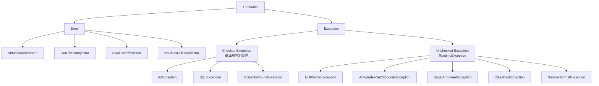
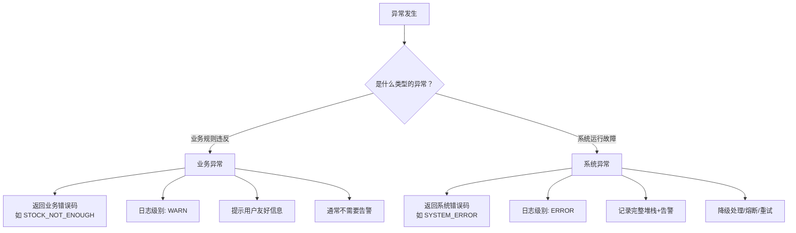
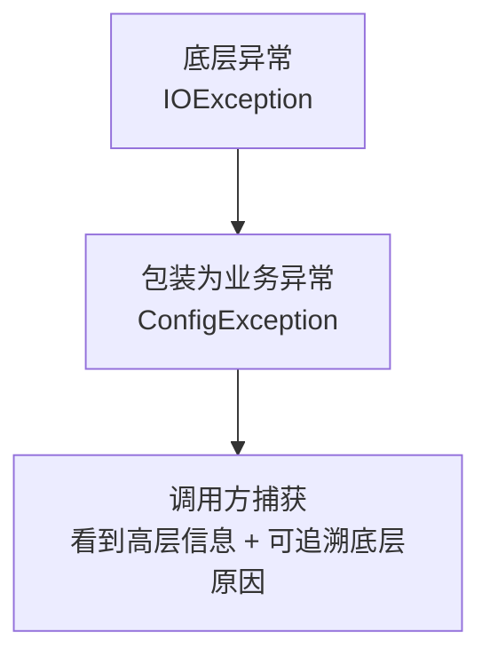

# 异常处理

## 学习目标

- 掌握 `Throwable` 体系（`Error` 与 `Exception` 的区别）与受检/非受检异常的划分
- 理解 `try-catch-finally` 的执行顺序，特别是 `finally` 与 `return` 的交互
- 掌握 `throw` 与 `throws` 的差异，以及方法签名中的异常声明
- 熟练使用 `try-with-resources`（Java 7+）自动关闭资源，避免资源泄漏
- 能够设计自定义异常并运用异常链（cause）保留根因

## 异常概述

在 Java 中,**异常(Exception)** 是程序运行过程中发生的错误或意外情况。Java 提供了一套完整的异常处理机制,用于捕获和处理这些异常,确保程序的健壮性和可靠性。

**为什么需要异常处理?**

- **提高程序健壮性**:通过异常处理,程序可以在遇到错误时优雅地恢复或终止,而不是直接崩溃
- **分离正常流程和错误处理**:异常处理机制将正常业务逻辑与错误处理代码分离,提高代码可读性
- **提供详细的错误信息**:异常对象包含错误的详细信息,便于调试和问题定位
- **强制处理特定错误**:受检异常强制开发者处理可能出现的错误情况

## Java 异常体系架构

Java 的异常类都继承自 `java.lang.Throwable` 类,形成了一个完整的异常层次结构:



### Throwable 类

`Throwable` 是所有错误和异常的父类,主要方法包括:

- `String getMessage()`:获取异常的详细消息
- `String toString()`:返回异常的简短描述(类名 + 消息)
- `void printStackTrace()`:打印异常堆栈跟踪信息
- `Throwable getCause()`:获取异常的原因(异常链)
- `StackTraceElement[] getStackTrace()`:获取堆栈跟踪数组

```java
public class ThrowableMethods {
    public static void main(String[] args) {
        try {
            int result = 10 / 0;
        } catch (ArithmeticException e) {
            System.out.println("getMessage(): " + e.getMessage());
            System.out.println("toString(): " + e.toString());
            System.out.println("\nprintStackTrace():");
            e.printStackTrace();
        }
    }
}
```

**输出:**
```
getMessage(): / by zero
toString(): java.lang.ArithmeticException: / by zero

printStackTrace():
java.lang.ArithmeticException: / by zero
    at ThrowableMethods.main(ThrowableMethods.java:4)
```

### Error 类

`Error` 表示严重的系统级问题,通常是 JVM 无法处理的错误。程序通常无法恢复,开发者也不需要处理这些错误。

**常见 Error 类:**

| Error 类 | 说明 | 常见原因 |
|---------|------|---------|
| `OutOfMemoryError` | 内存不足错误 | 堆内存不足,创建大对象 |
| `StackOverflowError` | 栈溢出错误 | 无限递归调用 |
| `NoClassDefFoundError` | 类定义未找到错误 | 类路径问题,编译时存在但运行时缺失 |
| `VirtualMachineError` | 虚拟机错误 | JVM 资源耗尽或内部错误 |

```java
// StackOverflowError 示例
public class StackOverflowExample {
    public static void main(String[] args) {
        recursiveMethod();
    }
    
    static void recursiveMethod() {
        recursiveMethod(); // 无限递归,导致 StackOverflowError
    }
}
```

### Exception 类

`Exception` 是所有异常的父类,分为两大类:

1. **Checked Exception(受检异常)**:编译器强制要求处理的异常
2. **Unchecked Exception(非受检异常)**:编译器不强制要求处理的异常

## Checked vs Unchecked 异常

### Checked Exception(受检异常)

**定义**:编译器会检查的异常,必须在代码中显式处理(使用 `try-catch` 捕获或 `throws` 声明抛出)。

**特点**:
- 继承自 `Exception` 但不继承自 `RuntimeException`
- 编译器强制要求处理
- 通常表示外部因素导致的错误(如文件不存在、网络连接失败)
- 代表可恢复的错误情况

**常见 Checked Exception:**

| 异常类 | 说明 |
|-------|------|
| `IOException` | 输入输出操作失败 |
| `FileNotFoundException` | 文件未找到 |
| `SQLException` | 数据库操作失败 |
| `ClassNotFoundException` | 类未找到 |
| `InterruptedException` | 线程被中断 |
| `ParseException` | 解析失败 |
| `MalformedURLException` | URL 格式不正确 |

```java
import java.io.FileInputStream;
import java.io.FileNotFoundException;

public class CheckedExceptionExample {
    public static void main(String[] args) {
        // 必须处理 FileNotFoundException,否则编译错误
        try {
            FileInputStream fis = new FileInputStream("nonexistent.txt");
        } catch (FileNotFoundException e) {
            System.out.println("File not found: " + e.getMessage());
        }
    }
}
```

### Unchecked Exception(非受检异常)

**定义**:编译器不会检查的异常,不需要显式处理。

**特点**:
- 继承自 `RuntimeException`
- 编译器不强制要求处理
- 通常表示程序逻辑错误(如空指针、数组越界)
- 代表编程错误或不可恢复的错误

**常见 Unchecked Exception:**

| 异常类 | 说明 |
|-------|------|
| `NullPointerException` | 空指针异常 |
| `ArrayIndexOutOfBoundsException` | 数组下标越界 |
| `ArithmeticException` | 算术异常(如除以零) |
| `NumberFormatException` | 数字格式异常 |
| `IllegalArgumentException` | 非法参数异常 |
| `ClassCastException` | 类型转换异常 |
| `IllegalStateException` | 非法状态异常 |

```java
public class UncheckedExceptionExample {
    public static void main(String[] args) {
        // 不需要显式处理,编译器不强制要求
        String str = null;
        System.out.println(str.length()); // 抛出 NullPointerException
    }
}
```

### 对比总结

| 特性 | Checked Exception | Unchecked Exception |
|-----|------------------|---------------------|
| **继承关系** | 继承 `Exception` 但不继承 `RuntimeException` | 继承 `RuntimeException` |
| **编译器检查** | 编译器强制要求处理 | 编译器不强制要求处理 |
| **典型场景** | 外部因素导致的错误(I/O、网络、数据库) | 程序逻辑错误(空指针、越界) |
| **恢复可能性** | 通常可恢复 | 通常不可恢复,需要修复代码 |
| **处理方式** | 必须 try-catch 或 throws | 可选处理,建议预防为主 |
| **设计理念** | 强制开发者考虑错误情况 | 避免过度使用异常处理 |

**选择建议**:

- 如果异常表示可恢复的情况,调用者应该采取合理的恢复措施 → 使用 Checked Exception
- 如果异常表示编程错误,应该通过修复代码避免 → 使用 Unchecked Exception

## try-catch-finally 详解

### 基本语法

```java
try {
    // 可能抛出异常的代码
} catch (ExceptionType1 e) {
    // 处理 ExceptionType1 类型的异常
} catch (ExceptionType2 e) {
    // 处理 ExceptionType2 类型的异常
} finally {
    // 无论是否发生异常都会执行的代码
}
```

### try 块

`try` 块用于包裹可能抛出异常的代码:

- try 块中发生异常后,剩余代码不会执行
- try 块必须紧跟至少一个 catch 块或 finally 块
- try 块可以单独配合 finally 使用(无 catch)

```java
public class TryBlockExample {
    public static void main(String[] args) {
        try {
            System.out.println("Step 1");
            int result = 10 / 0; // 抛出 ArithmeticException
            System.out.println("Step 2"); // 不会执行
        } catch (ArithmeticException e) {
            System.out.println("Step 3: Caught exception");
        }
        System.out.println("Step 4: Continue");
    }
}
```

**输出:**
```
Step 1
Step 3: Caught exception
Step 4: Continue
```

### catch 块

`catch` 块用于捕获并处理特定类型的异常:

- 一个 try 块可以有多个 catch 块
- **catch 块的顺序很重要**:子类异常必须在父类异常之前
- 匹配成功后,后续 catch 块不再执行

**异常捕获顺序规则:**

```java
// √ 正确:子类异常在前
try {
    // ...
} catch (NullPointerException e) {
    // 处理空指针异常
} catch (RuntimeException e) {
    // 处理运行时异常
} catch (Exception e) {
    // 处理其他异常
}

// × 错误:父类异常在前,子类异常永远不会被捕获
try {
    // ...
} catch (Exception e) {
    // ...
} catch (NullPointerException e) { // 编译错误:不可达代码
    // ...
}
```

**多异常捕获(Java 7+):**

```java
// 使用 | 捕获多种异常类型
try {
    // ...
} catch (NullPointerException | ArrayIndexOutOfBoundsException e) {
    System.out.println("Caught: " + e.getClass().getSimpleName());
    // 注意:e 是 final 的,不能重新赋值
}
```

**注意事项:**
- 不能在多异常捕获中使用继承关系的异常(如 `Exception | RuntimeException`)
- 多异常捕获中的异常变量是 final 的,不能重新赋值

### finally 块

`finally` 块中的代码无论是否发生异常都会执行:

**执行时机:**
- try 块正常执行完毕后执行
- try 块发生异常并被 catch 捕获后执行
- try 块发生异常但未被 catch 捕获前执行
- try 或 catch 块中有 return 语句,在 return 之前执行

```java
public class FinallyExecution {
    public static void main(String[] args) {
        System.out.println("Result: " + test());
    }
    
    static String test() {
        try {
            System.out.println("Try block");
            return "Return from try";
        } catch (Exception e) {
            System.out.println("Catch block");
            return "Return from catch";
        } finally {
            System.out.println("Finally block (always executes)");
        }
    }
}
```

**输出:**
```
Try block
Finally block (always executes)
Result: Return from try
```

**finally 与 return 的执行顺序:**

```java
public class FinallyReturn {
    public static void main(String[] args) {
        System.out.println("Test 1: " + test1()); // 返回 20
        System.out.println("Test 2: " + test2()); // 返回 10
    }
    
    // finally 中的 return 会覆盖 try 中的 return
    static int test1() {
        try {
            return 10;
        } finally {
            return 20; // 不推荐:覆盖了 try 的返回值
        }
    }
    
    // finally 中修改基本类型不影响返回值
    static int test2() {
        int x = 10;
        try {
            return x;
        } finally {
            x = 20; // 不影响返回值,因为已经保存了副本
        }
    }
}
```

:::: warning

**finally 使用注意事项:**

1. **避免在 finally 中使用 return**:会覆盖 try/catch 的返回值
2. **finally 中抛出异常会覆盖原有异常**:导致原始异常丢失
3. **finally 块总会执行**:即使 try/catch 中有 return 或抛出异常
4. **不要在 finally 中使用控制流语句**(return、throw、break、continue)

::::

### try-catch-finally 执行流程

**流程图:**

```
        进入 try 块
             │
             ▼
    try 块是否抛出异常?
        /          \
      否            是
       │             │
       ▼             ▼
   执行 finally   是否有匹配的 catch?
       │           /          \
       │         是            否
       │          │             │
       │          ▼             ▼
       │      catch 处理    执行 finally
       │          │             │
       │          ▼             ▼
       │      执行 finally   异常继续传播
       │          │
       ▼          ▼
      程序继续执行
```

**完整示例:**

```java
public class TryCatchFinallyFlow {
    public static void main(String[] args) {
        System.out.println("=== Scenario 1: No exception ===");
        testScenario1();
        
        System.out.println("\n=== Scenario 2: Exception caught ===");
        testScenario2();
        
        System.out.println("\n=== Scenario 3: Exception not caught ===");
        try {
            testScenario3();
        } catch (Exception e) {
            System.out.println("Caught in main: " + e.getClass().getSimpleName());
        }
    }
    
    static void testScenario1() {
        try {
            System.out.println("Try: executing");
        } catch (Exception e) {
            System.out.println("Catch: handling exception");
        } finally {
            System.out.println("Finally: always executes");
        }
        System.out.println("After try-catch-finally");
    }
    
    static void testScenario2() {
        try {
            System.out.println("Try: throwing exception");
            throw new RuntimeException("Test exception");
        } catch (RuntimeException e) {
            System.out.println("Catch: handling exception");
        } finally {
            System.out.println("Finally: always executes");
        }
        System.out.println("After try-catch-finally");
    }
    
    static void testScenario3() {
        try {
            System.out.println("Try: throwing exception");
            throw new Exception("Test exception");
        } finally {
            System.out.println("Finally: always executes (exception not caught)");
        }
        // 这里不会执行,因为异常未被捕获
    }
}
```

## throw 和 throws 关键字

### throw 关键字

`throw` 用于手动抛出一个异常对象:

**特点:**
- 可以抛出任何 Throwable 对象
- 抛出异常后,方法立即停止执行
- 可以抛出内置异常或自定义异常

```java
public class ThrowExample {
    public static void main(String[] args) {
        try {
            validateAge(15);
        } catch (IllegalArgumentException e) {
            System.out.println("Caught: " + e.getMessage());
        }
    }
    
    static void validateAge(int age) {
        if (age < 0) {
            throw new IllegalArgumentException("Age cannot be negative");
        }
        if (age < 18) {
            throw new IllegalArgumentException("Age must be at least 18");
        }
        System.out.println("Age is valid: " + age);
    }
}
```

**抛出 checked exception:**

```java
import java.io.IOException;

public class ThrowCheckedException {
    public static void main(String[] args) {
        try {
            readFile(null);
        } catch (IOException e) {
            System.out.println("Caught: " + e.getMessage());
        }
    }
    
    // 必须声明 throws IOException
    static void readFile(String fileName) throws IOException {
        if (fileName == null) {
            throw new IOException("File name cannot be null");
        }
        // 读取文件...
    }
}
```

### throws 关键字

`throws` 用于声明方法可能抛出的异常:

**特点:**
- 用在方法签名中,声明可能抛出的异常类型
- 可以声明多个异常,用逗号分隔
- 只是将异常传递给调用者处理,不实际处理异常
- 对于 checked exception,必须使用 throws 声明或 try-catch 捕获

```java
import java.io.FileInputStream;
import java.io.FileNotFoundException;
import java.io.IOException;

public class ThrowsExample {
    public static void main(String[] args) {
        try {
            method1();
        } catch (IOException e) {
            System.out.println("Caught in main: " + e.getMessage());
        }
    }
    
    // 声明可能抛出 IOException
    static void method1() throws IOException {
        method2();
    }
    
    // 声明多个异常
    static void method2() throws FileNotFoundException, IOException {
        FileInputStream fis = new FileInputStream("file.txt");
        fis.read();
    }
}
```

### throw vs throws 对比

| 特性 | throw | throws |
|-----|-------|--------|
| **位置** | 方法体内 | 方法签名后 |
| **作用** | 抛出异常对象 | 声明可能抛出的异常类型 |
| **数量** | 一次只能抛出一个异常 | 可以声明多个异常 |
| **处理方式** | 实际抛出异常 | 仅声明,不处理 |
| **后续代码** | throw 后的代码不执行 | 方法正常执行 |
| **使用场景** | 需要主动抛出异常时 | 方法不处理异常,由调用者处理 |

**对比示例:**

```java
import java.io.IOException;

public class ThrowVsThrows {
    public static void main(String[] args) {
        try {
            methodWithThrows();
            methodWithThrow();
        } catch (IOException e) {
            System.out.println("Caught: " + e.getMessage());
        }
    }
    
    // throws:声明异常,不处理
    static void methodWithThrows() throws IOException {
        System.out.println("Method with throws");
        // 可能抛出 IOException 的操作
    }
    
    // throw:主动抛出异常
    static void methodWithThrow() throws IOException {
        System.out.println("Method with throw");
        throw new IOException("Manually thrown exception");
        // 这里的代码不会执行
    }
}
```

## try-with-resources

### 基本概念

`try-with-resources` 是 Java 7 引入的语法,用于自动管理实现了 `AutoCloseable` 接口的资源。资源会在 try 块执行完毕后自动关闭。

**传统方式 vs try-with-resources:**

```java
import java.io.FileInputStream;
import java.io.IOException;

public class ResourceManagement {
    public static void main(String[] args) {
        // 传统方式(Java 7 之前)
        traditionalWay();
        
        // try-with-resources 方式(Java 7+)
        modernWay();
    }
    
    static void traditionalWay() {
        FileInputStream fis = null;
        try {
            fis = new FileInputStream("file.txt");
            // 使用资源
            int data = fis.read();
        } catch (IOException e) {
            e.printStackTrace();
        } finally {
            // 手动关闭资源
            if (fis != null) {
                try {
                    fis.close();
                } catch (IOException e) {
                    e.printStackTrace();
                }
            }
        }
    }
    
    static void modernWay() {
        // 自动关闭资源
        try (FileInputStream fis = new FileInputStream("file.txt")) {
            int data = fis.read();
        } catch (IOException e) {
            e.printStackTrace();
        }
        // 资源自动关闭,无需 finally
    }
}
```

### 语法规则

**基本语法:**

```java
try (ResourceType resource = new ResourceType()) {
    // 使用资源
} catch (Exception e) {
    // 处理异常
}
```

**声明多个资源:**

```java
import java.io.FileInputStream;
import java.io.FileOutputStream;
import java.io.IOException;

public class MultipleResources {
    public static void main(String[] args) {
        try (FileInputStream fis = new FileInputStream("input.txt");
             FileOutputStream fos = new FileOutputStream("output.txt")) {
            
            int data;
            while ((data = fis.read()) != -1) {
                fos.write(data);
            }
            
        } catch (IOException e) {
            e.printStackTrace();
        }
        // 资源按声明顺序的逆序关闭(fos 先关闭,fis 后关闭)
    }
}
```

### AutoCloseable 接口

所有实现了 `AutoCloseable` 接口的类都可以使用 try-with-resources:

```java
public interface AutoCloseable {
    void close() throws Exception;
}
```

**自定义资源类:**

```java
public class CustomResource implements AutoCloseable {
    private String name;
    
    public CustomResource(String name) {
        this.name = name;
        System.out.println(name + " created");
    }
    
    public void doSomething() {
        System.out.println(name + " doing something");
    }
    
    @Override
    public void close() {
        System.out.println(name + " closed");
    }
}

public class CustomResourceExample {
    public static void main(String[] args) {
        try (CustomResource r1 = new CustomResource("Resource1");
             CustomResource r2 = new CustomResource("Resource2")) {
            r1.doSomething();
            r2.doSomething();
        }
        // 输出顺序:
        // Resource1 created
        // Resource2 created
        // Resource1 doing something
        // Resource2 doing something
        // Resource2 closed  (后声明的先关闭)
        // Resource1 closed
    }
}
```

### 异常抑制

在 try-with-resources 中,如果 try 块和 close() 方法都抛出异常,close() 方法抛出的异常会被抑制:

```java
public class SuppressedException implements AutoCloseable {
    @Override
    public void close() throws Exception {
        throw new Exception("Exception from close()");
    }
    
    public static void main(String[] args) {
        try (SuppressedException se = new SuppressedException()) {
            throw new Exception("Exception from try block");
        } catch (Exception e) {
            System.out.println("Primary exception: " + e.getMessage());
            
            // 获取被抑制的异常
            Throwable[] suppressed = e.getSuppressed();
            for (Throwable t : suppressed) {
                System.out.println("Suppressed exception: " + t.getMessage());
            }
        }
    }
}
```

**输出:**
```
Primary exception: Exception from try block
Suppressed exception: Exception from close()
```

### 常见使用场景

| 资源类型 | 说明 |
|---------|------|
| `FileInputStream` / `FileOutputStream` | 文件输入输出流 |
| `BufferedReader` / `BufferedWriter` | 缓冲读写器 |
| `Connection` / `Statement` / `ResultSet` | JDBC 数据库资源 |
| `Socket` / `ServerSocket` | 网络套接字 |
| `Formatter` / `Scanner` | 格式化器和扫描器 |

:::: tip

**try-with-resources 优势:**

1. **自动资源管理**:无需手动关闭,避免资源泄漏
2. **代码简洁**:减少样板代码
3. **异常安全**:即使发生异常也能正确关闭资源
4. **异常处理**:自动处理 try 和 close 异常的抑制关系

**最佳实践:**

- 所有实现了 `AutoCloseable` 的资源都应使用 try-with-resources
- 不要在 try-with-resources 外部持有资源引用
- 如果资源关闭失败也需要特殊处理,考虑使用传统方式

::::

## 自定义异常

### 为什么需要自定义异常

**原因:**
- 内置异常无法准确描述业务特定错误
- 提高代码可读性和可维护性
- 统一错误处理机制

**设计原则:**
- 继承 `Exception` 创建 checked exception(需要强制处理)
- 继承 `RuntimeException` 创建 unchecked exception(不需要强制处理)
- 提供多个构造方法
- 类名以 `Exception` 结尾

### 自定义异常示例

```java
// 自定义受检异常
class InsufficientBalanceException extends Exception {
    private double balance;
    private double amount;
    
    // 无参构造方法
    public InsufficientBalanceException() {
        super("Insufficient balance");
    }
    
    // 带消息的构造方法
    public InsufficientBalanceException(String message) {
        super(message);
    }
    
    // 带详细信息
    public InsufficientBalanceException(double balance, double amount) {
        super(String.format("Insufficient balance: balance=%.2f, withdraw amount=%.2f", 
                           balance, amount));
        this.balance = balance;
        this.amount = amount;
    }
    
    // 带原因异常
    public InsufficientBalanceException(String message, Throwable cause) {
        super(message, cause);
    }
    
    public double getBalance() { return balance; }
    public double getAmount() { return amount; }
}

// 自定义非受检异常
class InvalidAgeException extends RuntimeException {
    private int age;
    
    public InvalidAgeException(int age) {
        super("Invalid age: " + age + ". Age must be between 0 and 150");
        this.age = age;
    }
    
    public InvalidAgeException(String message) {
        super(message);
    }
    
    public int getAge() { return age; }
}
```

### 使用自定义异常

```java
public class BankAccount {
    private String accountNumber;
    private double balance;
    
    public BankAccount(String accountNumber, double balance) {
        this.accountNumber = accountNumber;
        this.balance = balance;
    }
    
    // 使用自定义受检异常
    public void withdraw(double amount) throws InsufficientBalanceException {
        if (amount <= 0) {
            throw new IllegalArgumentException("Amount must be positive");
        }
        if (amount > balance) {
            throw new InsufficientBalanceException(balance, amount);
        }
        balance -= amount;
    }
    
    public double getBalance() {
        return balance;
    }
}

public class Person {
    private String name;
    private int age;
    
    public Person(String name, int age) {
        this.name = name;
        setAge(age);
    }
    
    // 使用自定义非受检异常
    public void setAge(int age) {
        if (age < 0 || age > 150) {
            throw new InvalidAgeException(age);
        }
        this.age = age;
    }
    
    public int getAge() { return age; }
}

// 使用示例
public class CustomExceptionExample {
    public static void main(String[] args) {
        // 处理受检异常
        BankAccount account = new BankAccount("12345", 1000.0);
        try {
            account.withdraw(1500.0);
        } catch (InsufficientBalanceException e) {
            System.out.println("Error: " + e.getMessage());
            System.out.println("Available balance: " + e.getBalance());
        }
        
        // 处理非受检异常(可选)
        try {
            Person person = new Person("Alice", 200);
        } catch (InvalidAgeException e) {
            System.out.println("Error: " + e.getMessage());
        }
    }
}
```

### 自定义异常最佳实践

1. **命名规范**:以 `Exception` 结尾,名称清晰描述错误
2. **选择正确的父类**:
   - 业务异常(需要调用者处理) → 继承 `Exception`
   - 编程错误(应修复代码) → 继承 `RuntimeException`
3. **提供多个构造方法**:
   - 无参构造
   - 带消息的构造
   - 带原因异常的构造
4. **添加有用的字段和方法**:提供详细的错误信息
5. **保留原始异常**:使用异常链保留 cause

## 业务异常与系统异常

::: tip 核心要点
异常处理不是语法题，而是边界治理问题。很多 Java 项目真正难看的地方，不是业务代码，而是异常处理。
:::

### 为什么需要区分

在实际项目中，将业务异常和系统异常分开处理至关重要：



| 维度 | 业务异常 | 系统异常 |
|------|----------|----------|
| **含义** | 业务规则违反 | 系统运行故障 |
| **典型例子** | 库存不足、余额不足、参数错误 | 数据库连接失败、网络超时、内存溢出 |
| **返回码** | 业务错误码（如 STOCK_NOT_ENOUGH） | 系统错误码（如 SYSTEM_ERROR） |
| **日志级别** | WARN（业务规则违反） | ERROR（系统故障） |
| **告警策略** | 通常不需要告警 | 需要告警 |
| **处理方式** | 提示用户，友好提示 | 记录日志，告警，降级处理 |
| **重试策略** | 通常不需要重试 | 可以考虑重试 |

### 业务异常的设计

#### 自定义业务异常基类

```java
/**
 * 业务异常基类
 */
public class BusinessException extends RuntimeException {
    
    private final String errorCode;
    private final String errorMessage;
    
    public BusinessException(String errorCode, String errorMessage) {
        super(errorMessage);
        this.errorCode = errorCode;
        this.errorMessage = errorMessage;
    }
    
    public BusinessException(String errorCode, String errorMessage, Throwable cause) {
        super(errorMessage, cause);
        this.errorCode = errorCode;
        this.errorMessage = errorMessage;
    }
    
    public String getErrorCode() {
        return errorCode;
    }
    
    public String getErrorMessage() {
        return errorMessage;
    }
}

/**
 * 库存不足异常
 */
public class InsufficientStockException extends BusinessException {
    
    public InsufficientStockException(String productId, int required, int available) {
        super("INSUFFICIENT_STOCK", 
              String.format("商品 %s 库存不足,需要 %d,可用 %d", productId, required, available));
    }
}

/**
 * 余额不足异常
 */
public class InsufficientBalanceException extends BusinessException {
    
    public InsufficientBalanceException(BigDecimal required, BigDecimal available) {
        super("INSUFFICIENT_BALANCE", 
              String.format("余额不足,需要 %s,可用 %s", required, available));
    }
}
```

#### 业务错误码规范

```java
/**
 * 业务错误码枚举
 */
public enum ErrorCode {
    
    // 用户相关错误 (1000-1999)
    USER_NOT_FOUND("1001", "用户不存在"),
    USER_ALREADY_EXISTS("1002", "用户已存在"),
    INVALID_PASSWORD("1003", "密码错误"),
    
    // 商品相关错误 (2000-2999)
    PRODUCT_NOT_FOUND("2001", "商品不存在"),
    INSUFFICIENT_STOCK("2002", "库存不足"),
    
    // 订单相关错误 (3000-3999)
    ORDER_NOT_FOUND("3001", "订单不存在"),
    ORDER_ALREADY_PAID("3002", "订单已支付"),
    
    // 通用错误 (9000-9999)
    INVALID_PARAMETER("9001", "参数错误"),
    SYSTEM_ERROR("9999", "系统异常");
    
    private final String code;
    private final String message;
    
    ErrorCode(String code, String message) {
        this.code = code;
        this.message = message;
    }
    
    public String getCode() { return code; }
    public String getMessage() { return message; }
}
```

### 统一异常处理器

在实际项目中，推荐使用 Spring 的 `@RestControllerAdvice` 统一处理异常：

```java
/**
 * 统一异常处理器
 */
@RestControllerAdvice
@Slf4j
public class GlobalExceptionHandler {
    
    /**
     * 处理业务异常
     */
    @ExceptionHandler(BusinessException.class)
    public ResponseEntity<ErrorResponse> handleBusinessException(BusinessException e) {
        log.warn("业务异常: {}", e.getMessage());
        
        ErrorResponse response = new ErrorResponse();
        response.setCode(e.getErrorCode());
        response.setMessage(e.getErrorMessage());
        response.setTimestamp(System.currentTimeMillis());
        
        return ResponseEntity.ok().body(response);
    }
    
    /**
     * 处理参数校验异常
     */
    @ExceptionHandler(MethodArgumentNotValidException.class)
    public ResponseEntity<ErrorResponse> handleValidationException(MethodArgumentNotValidException e) {
        BindingResult bindingResult = e.getBindingResult();
        String errorMessage = bindingResult.getFieldErrors().stream()
            .map(FieldError::getDefaultMessage)
            .collect(Collectors.joining(", "));
        
        log.warn("参数校验失败: {}", errorMessage);
        
        ErrorResponse response = new ErrorResponse();
        response.setCode("INVALID_PARAMETER");
        response.setMessage(errorMessage);
        response.setTimestamp(System.currentTimeMillis());
        
        return ResponseEntity.badRequest().body(response);
    }
    
    /**
     * 处理所有未知异常（兜底）
     */
    @ExceptionHandler(Exception.class)
    public ResponseEntity<ErrorResponse> handleException(Exception e) {
        log.error("系统异常", e);
        
        ErrorResponse response = new ErrorResponse();
        response.setCode("SYSTEM_ERROR");
        response.setMessage("系统繁忙,请稍后重试");  // 不暴露内部错误
        response.setTimestamp(System.currentTimeMillis());
        
        return ResponseEntity.status(500).body(response);
    }
}

/**
 * 错误响应对象
 */
@Data
public class ErrorResponse {
    private String code;
    private String message;
    private Long timestamp;
    private String traceId;  // 链路追踪ID
}
```

::: warning 异常处理的关键原则
1. **不要吞掉异常** — 至少记录日志
2. **保留异常链** — 使用 `new RuntimeException("消息", e)` 保留原始异常
3. **在合适的层次处理异常** — 不要在底层吞掉，也不要在每层都捕获
4. **业务异常和系统异常分开处理** — 日志级别、返回格式都不同
5. **异常信息要包含上下文** — 不要只写"用户不存在"，要写"用户不存在: userId=123"
:::

### 异常与事务的关系

#### Spring 事务回滚规则

```java
@Service
public class OrderService {
    
    // × 默认:只对 RuntimeException 和 Error 回滚
    // 如果抛出 IOException,事务不会回滚!
    @Transactional
    public void createOrder1() throws IOException {
        // ...
    }
    
    // √ 推荐:指定回滚异常
    @Transactional(rollbackFor = Exception.class)
    public void createOrder2() throws IOException {
        // 对所有 Exception 回滚
    }
}
```

#### 异常吞掉导致事务不回滚（常见坑）

```java
@Service
public class OrderService {
    
    // × 错误:异常被吞掉,事务不回滚
    @Transactional
    public void createOrderBad(OrderDTO dto) {
        try {
            orderRepository.save(order);
            productRepository.decreaseStock(dto.getProductId(), dto.getQuantity());
        } catch (Exception e) {
            log.error("创建订单失败", e);
            // 异常被捕获,事务提交!库存可能已扣减但订单未创建
        }
    }
    
    // √ 正确:让异常传播,事务回滚
    @Transactional(rollbackFor = Exception.class)
    public void createOrderGood(OrderDTO dto) {
        orderRepository.save(order);
        productRepository.decreaseStock(dto.getProductId(), dto.getQuantity());
        // 如果发生异常,事务自动回滚
    }
}
```

## 异常链(Exception Chaining)

### 概念

异常链是指将一个异常作为另一个异常的原因(cause),保留完整的异常信息,便于调试和问题追踪。



**用途:**
- 保留原始异常信息
- 提供更高层次的抽象
- 便于问题定位和调试

### 实现方式

**方式一:使用带 cause 参数的构造方法**

```java
try {
    // 底层操作
} catch (LowLevelException e) {
    // 将底层异常包装成高层异常
    throw new HighLevelException("High level error message", e);
}
```

**方式二:使用 initCause() 方法**

```java
try {
    // 底层操作
} catch (LowLevelException e) {
    HighLevelException high = new HighLevelException("High level error message");
    high.initCause(e);
    throw high;
}
```

### 完整示例

```java
import java.io.FileInputStream;
import java.io.IOException;

// 自定义业务异常
class ConfigException extends Exception {
    public ConfigException(String message) {
        super(message);
    }
    
    public ConfigException(String message, Throwable cause) {
        super(message, cause);
    }
}

public class ExceptionChainingExample {
    public static void main(String[] args) {
        try {
            loadConfig("config.txt");
        } catch (ConfigException e) {
            System.out.println("Config error: " + e.getMessage());
            
            // 获取原始异常
            Throwable cause = e.getCause();
            if (cause != null) {
                System.out.println("Caused by: " + cause.getClass().getName());
                System.out.println("Cause message: " + cause.getMessage());
            }
            
            // 打印完整堆栈跟踪
            System.out.println("\nFull stack trace:");
            e.printStackTrace();
        }
    }
    
    static void loadConfig(String fileName) throws ConfigException {
        try (FileInputStream fis = new FileInputStream(fileName)) {
            // 读取配置...
        } catch (IOException e) {
            // 将 IOException 包装成 ConfigException,保留原始异常
            throw new ConfigException("Failed to load config file: " + fileName, e);
        }
    }
}
```

**输出:**
```
Config error: Failed to load config file: config.txt
Caused by: java.io.FileNotFoundException
Cause message: config.txt (No such file or directory)

Full stack trace:
ConfigException: Failed to load config file: config.txt
    at ExceptionChainingExample.loadConfig(ExceptionChainingExample.java:32)
    at ExceptionChainingExample.main(ExceptionChainingExample.java:15)
Caused by: java.io.FileNotFoundException: config.txt (No such file or directory)
    at java.io.FileInputStream.open0(Native Method)
    at java.io.FileInputStream.open(FileInputStream.java:195)
    at java.io.FileInputStream.<init>(FileInputStream.java:138)
    at ExceptionChainingExample.loadConfig(ExceptionChainingExample.java:30)
    ... 1 more
```

### 异常链的优势

1. **保留完整信息**:不丢失原始异常的堆栈跟踪
2. **层次化抽象**:将底层异常转换为业务异常
3. **便于调试**:可以追溯到异常的根本原因
4. **解耦**:调用者不需要了解底层实现细节

## 异常处理最佳实践

### 1. 只对真正的异常使用异常

**错误示例:**用异常控制流程

```java
// × 错误:用异常代替条件判断
try {
    int index = findIndex(array, target);
    return array[index];
} catch (ArrayIndexOutOfBoundsException e) {
    return -1;
}

// √ 正确:使用条件判断
int index = findIndex(array, target);
if (index >= 0 && index < array.length) {
    return array[index];
}
return -1;
```

### 2. 捕获特定异常,避免过于宽泛

**错误示例:**捕获 Exception

```java
// × 错误:捕获过于宽泛
try {
    // ... 多种操作
} catch (Exception e) {
    // 无法区分具体的错误类型
    e.printStackTrace();
}

// √ 正确:捕获特定异常
try {
    // ...
} catch (FileNotFoundException e) {
    // 处理文件未找到
} catch (IOException e) {
    // 处理其他 IO 错误
}
```

### 3. 不要忽略异常

**错误示例:**空 catch 块

```java
// × 错误:隐藏异常
try {
    importantOperation();
} catch (Exception e) {
    // 空的 catch 块,异常被忽略
}

// √ 正确:记录异常
try {
    importantOperation();
} catch (Exception e) {
    logger.error("Operation failed", e);
    // 或者重新抛出
    throw new RuntimeException("Operation failed", e);
}
```

### 4. 使用 try-with-resources 管理资源

```java
// × 传统方式:繁琐且容易出错
FileInputStream fis = null;
try {
    fis = new FileInputStream("file.txt");
    // 使用资源
} finally {
    if (fis != null) {
        try {
            fis.close();
        } catch (IOException e) {
            // 忽略关闭异常
        }
    }
}

// √ 推荐方式:自动管理资源
try (FileInputStream fis = new FileInputStream("file.txt")) {
    // 使用资源
}
```

### 5. 提供有意义的异常信息

```java
// × 错误:异常信息不明确
throw new IllegalArgumentException("Invalid argument");

// √ 正确:提供详细信息
throw new IllegalArgumentException(
    String.format("Age must be between %d and %d, but got %d", 
                  MIN_AGE, MAX_AGE, age));
```

### 6. 正确使用异常链

```java
// × 错误:丢失原始异常
try {
    lowLevelOperation();
} catch (LowLevelException e) {
    throw new HighLevelException("Operation failed"); // 丢失了 cause
}

// √ 正确:保留原始异常
try {
    lowLevelOperation();
} catch (LowLevelException e) {
    throw new HighLevelException("Operation failed", e);
}
```

### 7. 尽早抛出异常(Fail Fast)

```java
// × 错误:延迟检查
public void process(String data) {
    // 复杂的逻辑...
    if (data == null) {
        throw new IllegalArgumentException("Data cannot be null");
    }
    // 更多处理...
}

// √ 正确:尽早检查
public void process(String data) {
    if (data == null) {
        throw new IllegalArgumentException("Data cannot be null");
    }
    // 复杂的逻辑...
}
```

### 8. 异常文档化

```java
/**
 * 从文件加载用户数据
 * 
 * @param fileName 文件名
 * @return 用户对象
 * @throws FileNotFoundException 文件不存在
 * @throws IOException 读取文件失败
 * @throws InvalidDataException 数据格式无效
 */
public User loadUser(String fileName) 
        throws FileNotFoundException, IOException, InvalidDataException {
    // ...
}
```

### 9. 避免在循环中使用异常

```java
// × 错误:循环中使用异常
for (int i = 0; i < items.length; i++) {
    try {
        process(items[i]);
    } catch (NullPointerException e) {
        // 跳过 null 元素
    }
}

// √ 正确:使用条件检查
for (int i = 0; i < items.length; i++) {
    if (items[i] != null) {
        process(items[i]);
    }
}
```

### 10. 合理使用日志

```java
import org.slf4j.Logger;
import org.slf4j.LoggerFactory;

public class ExceptionLogging {
    private static final Logger logger = LoggerFactory.getLogger(ExceptionLogging.class);
    
    public void process(String data) {
        try {
            doProcess(data);
        } catch (IllegalArgumentException e) {
            // 业务异常,记录警告
            logger.warn("Invalid input data: {}", data, e);
        } catch (IOException e) {
            // 系统异常,记录错误
            logger.error("IO error while processing data", e);
            throw new RuntimeException("Processing failed", e);
        }
    }
}
```

## 常见误区

### 误区1:异常会影响性能,应该避免使用

**事实**:异常处理在正常情况下开销很小,只有在异常实际发生时才有较大开销。应该避免用异常控制流程,而不是避免使用异常。

### 误区2:所有异常都应该捕获

**事实**:
- 只捕获你能处理的异常
- 对于无法恢复的错误,让异常传播
- 不要捕获 Error 类型的错误

```java
// × 错误:捕获所有异常
try {
    // ...
} catch (Throwable t) {
    // 捕获了 Error,这是严重错误,不应捕获
}

// √ 正确:只捕获能处理的异常
try {
    // ...
} catch (IOException e) {
    // 处理 IO 错误
}
```

### 误区3:finally 总是会执行

**事实**:以下情况 finally 不会执行:
- 在 try 或 catch 中调用了 `System.exit()`
- 线程意外死亡
- 断电等不可抗力

```java
try {
    System.exit(0); // finally 不会执行
} finally {
    System.out.println("This won't be printed");
}
```

### 误区4:异常信息只需包含错误描述

**事实**:异常信息应包含足够的上下文信息:

```java
// × 信息不足
throw new IllegalArgumentException("Invalid port");

// √ 包含上下文
throw new IllegalArgumentException(
    String.format("Invalid port number: %d. Port must be between %d and %d",
                  port, MIN_PORT, MAX_PORT));
```

### 误区5:应该在方法中捕获所有异常

**事实**:应该根据职责决定是捕获还是抛出:
- 当前方法能处理 → 捕获
- 当前方法无法处理,应由调用者处理 → 抛出

### 误区6:throws 声明的异常一定会抛出

**事实**:`throws` 只是声明可能抛出,不代表一定会抛出:

```java
// 这个方法可能抛出 IOException,但不一定会抛出
public void readFile(String fileName) throws IOException {
    if (fileName != null) {
        // 可能抛出 IOException
    }
    // 如果 fileName 为 null,不会抛出 IOException
}
```

### 误区7:异常处理可以替代参数验证

**事实**:
- 参数验证应在方法开始时进行(fail-fast)
- 异常处理是最后的防线,不是第一道防线

```java
// × 错误:依赖异常进行参数验证
public void setAge(int age) {
    try {
        if (age < 0) {
            throw new Exception("Age cannot be negative");
        }
        this.age = age;
    } catch (Exception e) {
        System.out.println(e.getMessage());
    }
}

// √ 正确:主动验证参数
public void setAge(int age) {
    if (age < 0 || age > 150) {
        throw new IllegalArgumentException(
            "Invalid age: " + age + ". Age must be between 0 and 150");
    }
    this.age = age;
}
```

## 异常处理性能考虑

### 性能开销来源

1. **创建异常对象**:需要填充堆栈跟踪信息
2. **堆栈跟踪生成**:遍历调用栈,开销较大
3. **异常传播**:在调用栈中向上传播

### 性能优化建议

#### 1. 避免用异常控制流程

```java
// × 性能差:在循环中使用异常
int sum = 0;
int index = 0;
while (true) {
    try {
        sum += array[index++];
    } catch (ArrayIndexOutOfBoundsException e) {
        break; // 用异常结束循环
    }
}

// √ 性能好:使用条件判断
int sum = 0;
for (int i = 0; i < array.length; i++) {
    sum += array[i];
}
```

#### 2. 重用异常对象(谨慎使用)

```java
// 对于固定消息的异常,可以考虑重用(但通常不推荐)
private static final IllegalArgumentException INVALID_ARG = 
    new IllegalArgumentException("Invalid argument");

public void method(int value) {
    if (value < 0) {
        throw INVALID_ARG;
    }
}
```

#### 3. 避免频繁的堆栈跟踪

```java
// × 性能差:频繁调用 printStackTrace()
for (int i = 0; i < 1000; i++) {
    try {
        operation();
    } catch (Exception e) {
        e.printStackTrace(); // 每次都生成堆栈跟踪
    }
}

// √ 性能好:使用日志框架
for (int i = 0; i < 1000; i++) {
    try {
        operation();
    } catch (Exception e) {
        logger.error("Operation failed", e); // 日志框架会优化输出
    }
}
```

## 常见异常类速查表

### RuntimeException 及其子类

| 异常类 | 说明 | 常见原因 |
|-------|------|---------|
| `NullPointerException` | 空指针异常 | 访问 null 对象的成员 |
| `ArrayIndexOutOfBoundsException` | 数组越界 | 访问数组时索引超出范围 |
| `ArithmeticException` | 算术异常 | 整数除以零 |
| `NumberFormatException` | 数字格式异常 | 字符串转数字失败 |
| `IllegalArgumentException` | 非法参数异常 | 参数不符合要求 |
| `IllegalStateException` | 非法状态异常 | 对象状态不适合当前操作 |
| `ClassCastException` | 类型转换异常 | 强制转换不兼容类型 |
| `UnsupportedOperationException` | 不支持的操作异常 | 调用不支持的方法 |

### IOException 及其子类

| 异常类 | 说明 | 常见原因 |
|-------|------|---------|
| `IOException` | 输入输出异常 | I/O 操作失败 |
| `FileNotFoundException` | 文件未找到异常 | 访问不存在的文件 |
| `EOFException` | 文件结束异常 | 读取到文件末尾 |
| `SocketException` | 套接字异常 | 网络连接问题 |

### 其他常见异常

| 异常类 | 说明 |
|-------|------|
| `SQLException` | 数据库操作异常 |
| `ClassNotFoundException` | 类未找到异常 |
| `InterruptedException` | 线程中断异常 |
| `ParseException` | 解析异常 |

## 面试要点

### 基础问题

**Q1: Error 和 Exception 的区别是什么?**

**答**:
- **Error**:表示严重的系统级问题,通常是 JVM 无法处理的错误,如 `OutOfMemoryError`、`StackOverflowError`。程序通常无法恢复,不需要捕获处理。
- **Exception**:表示程序可以处理的异常情况。分为 Checked Exception(受检异常)和 Unchecked Exception(非受检异常)。

**Q2: Checked Exception 和 Unchecked Exception 的区别是什么?**

**答**:
- **Checked Exception**:编译器强制要求处理的异常,继承自 `Exception` 但不继承自 `RuntimeException`。必须使用 `try-catch` 捕获或 `throws` 声明抛出。
- **Unchecked Exception**:编译器不强制要求处理的异常,继承自 `RuntimeException`。通常表示程序逻辑错误,应该通过修复代码来避免,而不是捕获处理。

**Q3: throw 和 throws 的区别是什么?**

**答**:
- **throw**:在方法体内使用,用于手动抛出一个异常对象。throw 后的代码不会执行。
- **throws**:在方法签名后使用,用于声明方法可能抛出的异常类型。只是声明,不实际处理异常。

**Q4: finally 块一定会执行吗?**

**答**:在以下情况下 finally 块不会执行:
1. 在 try 或 catch 块中调用了 `System.exit()`
2. 线程意外死亡
3. 断电等不可抗力

其他情况下,finally 块总会执行,即使 try 或 catch 块中有 return 语句。

**Q5: finally 块中有 return 会发生什么?**

**答**:finally 块中的 return 会覆盖 try 或 catch 块中的 return 值。应该避免在 finally 块中使用 return 语句。

### 进阶问题

**Q6: try-with-resources 的优势是什么?**

**答**:
1. 自动管理资源,无需手动关闭,避免资源泄漏
2. 代码更简洁,减少样板代码
3. 异常安全:即使发生异常也能正确关闭资源
4. 自动处理异常抑制关系

**Q7: 什么是异常链?为什么要使用异常链?**

**答**:异常链是指将一个异常作为另一个异常的原因(cause),通过 `initCause()` 或带 cause 参数的构造方法实现。

**为什么要使用异常链**:
- 保留原始异常的完整信息
- 提供更高层次的抽象(将底层异常转换为业务异常)
- 便于调试和问题定位
- 实现层次化异常处理

**Q8: 如何设计一个好的自定义异常类?**

**答**:
1. 选择正确的父类:业务异常继承 `Exception`,编程错误继承 `RuntimeException`
2. 类名以 `Exception` 结尾,清晰描述错误
3. 提供多个构造方法:无参、带消息、带 cause
4. 添加有用的字段和方法,提供详细错误信息
5. 实现 Serializable 接口(可选)
6. 提供序列化版本号

**Q9: 异常处理的性能考虑有哪些?**

**答**:
1. 避免用异常控制程序流程,只在真正的异常情况使用
2. 避免在循环中频繁抛出和捕获异常
3. 谨慎使用 `printStackTrace()`,使用日志框架替代
4. 异常信息应提供足够的上下文,便于快速定位问题
5. 对于固定消息的异常,可以考虑重用异常对象(但通常不推荐)

**Q10: 多个 catch 块的顺序有什么要求?**

**答**:
- 子类异常必须在父类异常之前捕获
- 如果父类异常在前,子类异常永远不会被捕获,会导致编译错误
- 匹配成功后,后续 catch 块不会执行

```java
// 正确顺序
try {
    // ...
} catch (NullPointerException e) {  // 子类
    // ...
} catch (RuntimeException e) {      // 父类
    // ...
} catch (Exception e) {             // 最顶层父类
    // ...
}
```

### 实战问题

**Q11: 如何处理方法中可能抛出的多个异常?**

**答**:

**方式一:多个 catch 块**
```java
try {
    operation();
} catch (IOException e) {
    // 处理 IO 异常
} catch (SQLException e) {
    // 处理 SQL 异常
}
```

**方式二:多异常捕获(Java 7+)**
```java
try {
    operation();
} catch (IOException | SQLException e) {
    // 统一处理多种异常
}
```

**方式三:异常包装**
```java
try {
    operation();
} catch (IOException | SQLException e) {
    throw new ServiceException("Operation failed", e);
}
```

**Q12: finally 块中抛出异常会发生什么?**

**答**:finally 块中抛出的异常会覆盖 try 或 catch 块中的异常,导致原始异常丢失。应该避免在 finally 块中抛出异常。

```java
try {
    throw new Exception("Exception from try");
} finally {
    throw new Exception("Exception from finally"); // 覆盖了 try 的异常
}
// 最终抛出:Exception from finally
```

**Q13: 如何在异常处理中避免资源泄漏?**

**答**:

**方式一:try-with-resources(推荐)**
```java
try (FileInputStream fis = new FileInputStream("file.txt");
     BufferedReader reader = new BufferedReader(new InputStreamReader(fis))) {
    // 使用资源
} // 自动关闭
```

**方式二:传统方式,在 finally 中关闭**
```java
FileInputStream fis = null;
try {
    fis = new FileInputStream("file.txt");
    // 使用资源
} finally {
    if (fis != null) {
        try {
            fis.close();
        } catch (IOException e) {
            // 记录日志,不要抛出异常
        }
    }
}
```

**Q14: 什么情况下应该使用 Checked Exception?什么情况下使用 Unchecked Exception?**

**答**:

**使用 Checked Exception**:
- 异常表示可恢复的错误情况
- 调用者能够采取合理的恢复措施
- 异常是 API 的一部分,调用者必须考虑

**使用 Unchecked Exception**:
- 异常表示编程错误或不可恢复的错误
- 调用者无法或不需要处理
- 应该通过修复代码来避免的错误

**示例**:
- 文件不存在(`FileNotFoundException`)→ Checked Exception,调用者可以提示用户或创建文件
- 空指针异常(`NullPointerException`)→ Unchecked Exception,应该修复代码,添加 null 检查

**Q15: 如何在异常处理中保持代码的可维护性?**

**答**:
1. **提供有意义的异常信息**:包含足够的上下文信息
2. **使用异常链**:保留原始异常信息
3. **合理分层**:将底层异常转换为业务异常
4. **文档化异常**:在 Javadoc 中声明可能抛出的异常
5. **统一异常处理**:使用框架提供的异常处理机制
6. **记录异常日志**:便于问题排查
7. **避免异常滥用**:不要用异常控制流程

### 代码分析题

**Q16: 以下代码的输出是什么?**

```java
public class ExceptionTest {
    public static void main(String[] args) {
        System.out.println(method());
    }
    
    static int method() {
        try {
            return 1;
        } catch (Exception e) {
            return 2;
        } finally {
            return 3;
        }
    }
}
```

**答**:输出为 `3`。finally 块中的 return 会覆盖 try 块中的 return 值。这是不推荐的写法。

**Q17: 以下代码会抛出什么异常?**

```java
try {
    throw new Exception("Exception 1");
} catch (Exception e) {
    throw new RuntimeException("Exception 2");
} finally {
    throw new IllegalArgumentException("Exception 3");
}
```

**答**:最终抛出 `IllegalArgumentException("Exception 3")`。finally 块中的异常会覆盖 catch 块中的异常。

**Q18: 以下代码有什么问题?如何改进?**

```java
try {
    // ... 一些操作
} catch (Exception e) {
    e.printStackTrace();
}
```

**答**:
**问题**:
1. 捕获过于宽泛,捕获了所有异常
2. 使用 `printStackTrace()` 而不是日志框架
3. 没有合理的异常处理逻辑,只是打印

**改进**:
```java
try {
    // ... 一些操作
} catch (SpecificException e) {
    logger.error("Operation failed", e);
    throw new BusinessException("User-friendly error message", e);
}
```

## 总结

### 核心要点

1. **异常体系**:Throwable → Error/Exception,Exception → Checked/Unchecked
2. **Checked Exception**:编译器强制处理,表示可恢复错误
3. **Unchecked Exception**:编译器不强制处理,表示编程错误
4. **try-catch-finally**:异常捕获和资源清理的标准机制
5. **try-with-resources**:自动资源管理的最佳实践
6. **throw vs throws**:抛出异常对象 vs 声明异常类型
7. **异常链**:保留原始异常信息,便于调试

### 最佳实践清单

- [ ] 只对真正的异常使用异常,不用异常控制流程
- [ ] 捕获特定异常,避免过于宽泛
- [ ] 提供有意义的异常信息
- [ ] 使用异常链保留原始异常
- [ ] 优先使用 try-with-resources 管理资源
- [ ] 不要忽略异常,至少记录日志
- [ ] 尽早抛出异常(fail-fast)
- [ ] 文档化异常
- [ ] 合理使用日志记录异常
- [ ] 注意异常处理的性能影响

### 学习建议

1. **理解原理**:掌握异常体系结构和处理机制
2. **实践练习**:编写各种异常处理场景的代码
3. **阅读源码**:学习优秀框架的异常处理方式
4. **总结经验**:记录项目中遇到的异常处理问题
5. **关注性能**:了解异常处理的性能影响

## 日志框架

异常处理与日志密不可分——记录异常是异常处理的第一步。Java 生态中常见的日志方案有 JDK Logging、Commons Logging + Log4j、SLF4J + Logback 等。

### JDK Logging

Java 标准库内置 `java.util.logging`，可直接使用，自动打印时间、调用类、调用方法等信息：

```java
import java.util.logging.Level;
import java.util.logging.Logger;

public class Hello {
  public static void main(String[] args) {
    Logger logger = Logger.getGlobal();
    logger.info("start process...");
    logger.warning("memory is running out...");
    logger.severe("process will be terminated...");
  }
}
```

JDK Logging 定义了 7 个日志级别（从严重到普通）：`SEVERE`、`WARNING`、`INFO`、`CONFIG`、`FINE`、`FINER`、`FINEST`。默认级别是 `INFO`，级别以下的日志不会被打印。但 JDK Logging 配置不太方便（JVM 启动时读取配置、之后无法修改），使用并不广泛。

### Commons Logging + Log4j

**Commons Logging** 是 Apache 的日志接口，可挂接不同的日志系统；**Log4j** 是最流行的日志实现。二者组合使用：Commons Logging 作 API，Log4j 作底层实现。

```java
import org.apache.commons.logging.Log;
import org.apache.commons.logging.LogFactory;

public class Main {
  public static void main(String[] args) {
    Log log = LogFactory.getLog(Main.class);
    log.info("start...");
    log.warn("end.");
  }
}
```

Commons Logging 定义 6 个级别：`FATAL`、`ERROR`、`WARNING`、`INFO`、`DEBUG`、`TRACE`，默认 `INFO`。它提供了一个很有用的重载 `info(String, Throwable)` 来记录异常：

```java
try {
  // ...
} catch (Exception e) {
  log.error("got exception!", e);
}
```

Log4j 是组件化日志系统，通过 `Appender` 决定输出目的地（console 屏幕 / file 文件 / socket 网络 / jdbc 数据库）、`Filter` 过滤日志、`Layout` 格式化日志。通常用配置文件（`log4j2.xml`）配置而非直接调用 API。

### SLF4J + Logback

**SLF4J** 类似 Commons Logging（日志接口），**Logback** 类似 Log4j（日志实现）。SLF4J 改进了接口，用占位符 `{}` 替代字符串拼接，更自然：

```java
import org.slf4j.Logger;
import org.slf4j.LoggerFactory;

class Main {
  final Logger logger = LoggerFactory.getLogger(getClass());

  void test() {
    int score = 99;
    logger.info("Set score {} for Person {} ok.", score, "xiaoye");
  }
}
```

| 功能 | Commons Logging | SLF4J |
|------|----------------|-------|
| 日志接口 | `org.apache.commons.logging.Log` | `org.slf4j.Logger` |
| 获取实例 | `org.apache.commons.logging.LogFactory` | `org.slf4j.LoggerFactory` |

**最佳实践**：在开发阶段使用日志接口（Commons Logging 或 SLF4J）写入日志，把对应的配置文件（`log4j2.xml` 或 `logback.xml`）和实现 jar 放入 `classpath` 即可自动切换，无需修改代码。当前趋势是越来越多项目从 Commons Logging + Log4j 转向 SLF4J + Logback。

## 版本差异(旧版 → Java 21)

| 特性 | 旧版(Java 8) | Java 9/21 |
|------|--------------|-----------|
| try-with-resources | 需局部变量；资源须实现 AutoCloseable | 可直接使用已有效 final 变量（Java 9） |
| 异常改进 | 无 | `Throwable` 与 `Future`/`CompletionStage` 组合增强（Java 8 已有，Java 21 虚拟线程中异常更均匀） |
| 可空性表达 | 无 | `java.util.Optional`（Java 8）、`Objects.requireNonNullElse`（Java 9） |
| 日志生态 | Log4j 1.x / Commons Logging | SLF4J + Logback 为事实标准；Log4j 1.x 已 EOL |

## 继续阅读

- 上一章：[继承、多态、抽象类与接口](06-继承多态抽象类接口)
- 下一章：[字符串与常用类](08-字符串)
