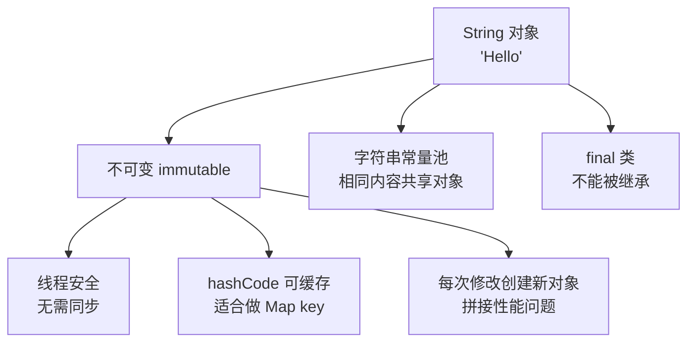
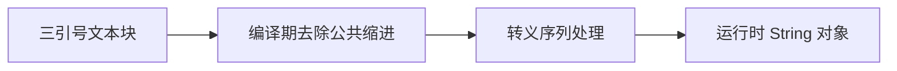

# 字符串操作

## 学习目标

- 理解 String 的不可变性(immutable)与字符串常量池(String Pool)机制
- 掌握 `==` 与 `equals` 的本质区别，熟练用 `equals`/`equalsIgnoreCase` 比较内容
- 理解 `StringBuilder`/`StringBuffer` 的可变性与拼接性能差异（线程安全 vs 非安全）
- 掌握常用 API：substring/charAt/indexOf/format/正则 matches
- 识别 `new String("x")` 绕过常量池、循环 `+` 拼接性能差等陷阱

字符串是 Java 程序中经常处理的对象,如果字符串运用得不好,将影响到程序运行的效率。在 Java 中字符串作为 `String` 类的实例来处理。以对象的方式处理字符串,将使字符串更加灵活、方便。

## String 类概述



Java 中 `String` 是一个非常重要的类,用于表示和操作字符串。`String` 类位于 `java.lang` 包中,是 Java 核心类之一。由于字符串在程序中非常常用,Java 对 `String` 类进行了高度优化,使其成为不可变（immutable）的、线程安全的对象。

单个字符可以用 `char` 类型保存,多个字符组成的文本就需要保存在 `String` 对象中。`String` 通常被称为字符串,一个 `String` 对象最多可以保存 `Integer.MAX_VALUE`（约 21.4 亿）个字符的文本内容。

## String 的不可变性原理

### 什么是不可变性

不可变性（Immutability）是指：一旦 `String` 对象被创建,它的值就不能被改变。所有看起来修改字符串的操作,实际上都是创建了一个新的字符串对象。

### 底层实现机制

**JDK 8 及之前**：
- `String` 类内部使用 `final char[] value` 存储字符数据
- `final` 修饰符保证引用不可变
- 没有提供修改字符数组的方法

**JDK 9 及之后**：
- 改为使用 `final byte[] value` + `byte coder` 存储数据
- 支持 Compact Strings 优化,根据内容选择 Latin-1 或 UTF-16 编码
- 对于纯 ASCII 字符串,空间占用减少一半

```java
// JDK 8 源码
public final class String {
    private final char[] value;
    // ...
}

// JDK 9+ 源码
public final class String {
    private final byte[] value;
    private final byte coder;  // 编码标识
    // ...
}
```

### 不可变性的保证

1. **final 类修饰**：`String` 类被 `final` 修饰,不能被继承
2. **final 字段**：存储数据的数组被 `final` 修饰,引用不可变
3. **私有访问**：字符数组私有,外部无法访问
4. **无修改方法**：不提供任何修改内容的方法

### 为什么设计为不可变

::: tip 不可变性的优势

**1. 线程安全**
- 不可变对象本质上是线程安全的
- 多线程环境下无需额外同步机制
- 可以自由地在多个线程间共享

**2. 安全性**
- 字符串常用于类加载器、网络连接、文件路径等敏感场景
- 不可变性防止恶意修改
- 作为参数传递时,确保内容不被意外改变

**3. 缓存优化**
- 不可变性使得字符串常量池成为可能
- 相同内容的字符串可以共享,节省内存
- 哈希值可以被缓存,提高性能

**4. 性能优化**
- 字符串哈希值可以缓存（`hashCode()` 只计算一次）
- 作为 HashMap 的 key 时性能更好
- 适合作为常量使用

:::

### 不可变性的代价

::: warning 性能考虑

**1. 拼接开销**
- 每次拼接都创建新对象
- 循环中拼接产生大量临时对象
- 建议使用 `StringBuilder` 或 `StringBuffer`

**2. 内存占用**
- 创建大量不同字符串会占用较多内存
- 部分字符串可能留在常量池中无法回收

**3. 更新成本**
- 任何修改操作都需要创建新对象
- 频繁修改的场景应使用可变字符串类

:::

```java
// 不可变性示例
String str = "Hello";
str = str + " World";  // 创建了一个新的字符串对象

// 内存中实际存在：
// 1. "Hello" 字符串（可能在常量池）
// 2. " World" 字符串（可能在常量池）
// 3. "Hello World" 字符串（新创建）

System.out.println(str);  // 输出: Hello World
```

## 字符串常量池（String Pool）

### 常量池的概念

字符串常量池（String Pool / String Constant Pool）是 Java 堆内存中的一块特殊区域,用于存储字符串字面量,以提高内存利用率并优化性能。

### 常量池的位置演进

| JDK 版本 | 位置 | 说明 |
|---------|------|------|
| JDK 6 及之前 | 方法区（永久代） | 大小受限于永久代,容易 OOM |
| JDK 7 | 堆内存 | 从永久代移到堆中,更容易管理 |
| JDK 8 及之后 | 堆内存 | 元空间取代永久代,但字符串常量池仍在堆中 |

### 常量池的工作原理

::: code-group

```java [基本原理]
String str1 = "Hello";  // 创建字符串字面量
String str2 = "Hello";  // 复用常量池中的对象

// 过程：
// 1. 创建 str1 时,JVM 检查常量池
// 2. 常量池没有 "Hello",创建并放入池中
// 3. 创建 str2 时,JVM 检查常量池
// 4. 常量池已有 "Hello",直接返回引用

System.out.println(str1 == str2);  // true,指向同一对象
```

```java [new String()]
String str1 = new String("Hello");
String str2 = new String("Hello");

// 过程：
// 1. 编译时,"Hello" 放入常量池
// 2. 运行时,new 创建堆对象,复制常量池的值
// 3. 每次new都创建新对象

System.out.println(str1 == str2);  // false,不同对象
System.out.println(str1 == "Hello");  // false,堆对象 vs 常量池对象
```

```java [intern() 方法]
String str1 = new String("Hello");
String str2 = str1.intern();  // 将字符串加入常量池
String str3 = "Hello";

System.out.println(str2 == str3);  // true
System.out.println(str1 == str2);  // false

// intern() 方法：
// 1. 检查常量池中是否存在相等字符串
// 2. 存在则返回常量池引用
// 3. 不存在则添加到常量池并返回引用
```

:::

### 常量池的内存分析

```java
String s1 = "Hello";
String s2 = new String("Hello");
String s3 = s2.intern();

// 内存布局：
// ┌─────────────────┐
// │  字符串常量池    │  "Hello" ← s1, s3
// └─────────────────┘
// ┌─────────────────┐
// │      堆内存      │  String对象 ← s2
// └─────────────────┘

System.out.println(s1 == s2);  // false
System.out.println(s1 == s3);  // true
System.out.println(s2 == s3);  // false
```

### 字符串对象的创建过程

**字面量创建**：
```java
String str = "Hello";
```
1. 编译期：`"Hello"` 被放入 class 文件的常量池
2. 类加载时：将字符串常量放入字符串常量池
3. 运行时：直接返回常量池中的引用

**new 创建**：
```java
String str = new String("Hello");
```
1. 编译期：`"Hello"` 被放入 class 文件的常量池
2. 类加载时：将 `"Hello"` 放入字符串常量池
3. 运行时：在堆中创建新的 String 对象
4. 新对象复制常量池中 `"Hello"` 的值

### 常量池的优化建议

:::: tip 最佳实践

**1. 优先使用字面量**
```java
// 推荐
String str = "Hello";

// 不推荐
String str = new String("Hello");  // 创建不必要的堆对象
```

**2. 合理使用 intern()**
```java
// 适用于：大量重复字符串的场景
// 例如：从数据库读取的状态值、国家代码等

// 注意：不要滥用,可能导致常量池过大
```

**3. 字符串拼接优化**
```java
// 编译期可确定的拼接,编译器会优化
String str = "Hello" + " " + "World";  // 编译为 "Hello World"

// 运行时拼接,Java 8 编译器会转为 StringBuilder
String result = str1 + str2 + str3;  // Java 9+ 改用 invokedynamic 动态拼接,语义不变
```

::::

## String、StringBuilder、StringBuffer 对比

### 三者的核心区别

| 特性 | String | StringBuilder | StringBuffer |
|------|--------|--------------|--------------|
| **可变性** | 不可变 | 可变 | 可变 |
| **线程安全** | 是（不可变） | 否 | 是（synchronized） |
| **性能** | 低（频繁拼接） | 最高 | 中等 |
| **引入版本** | JDK 1.0 | JDK 5 | JDK 1.0 |
| **适用场景** | 字符串常量、少量拼接 | 单线程大量拼接 | 多线程大量拼接 |

### String：不可变字符串

**特点**：
- 不可变,每次修改都创建新对象
- 线程安全（不可变性保证）
- 可以作为常量、哈希键使用

**适用场景**：
- 字符串常量
- 不需要修改的字符串
- 少量字符串拼接（编译器会优化）

```java
String str = "Hello";
str = str + " World";  // 创建新对象

// 编译器优化：少量拼接会被优化
String result = "Hello" + " " + "World";  // 编译后直接是 "Hello World"
```

### StringBuilder：可变字符串（非线程安全）

**特点**：
- 可变,支持在原对象上修改
- 非线程安全,性能最高
- JDK 5 引入

**常用方法**：
- `append(String str)`：追加字符串
- `insert(int offset, String str)`：插入字符串
- `delete(int start, int end)`：删除指定范围
- `reverse()`：反转字符串
- `replace(int start, int end, String str)`：替换指定范围

```java
// 基本使用
StringBuilder sb = new StringBuilder();
sb.append("Hello");
sb.append(" ");
sb.append("World");
String result = sb.toString();  // "Hello World"

// 链式调用
StringBuilder sb2 = new StringBuilder();
sb2.append("Hello").append(" ").append("World");

// 其他操作
StringBuilder sb3 = new StringBuilder("Hello World");
sb3.insert(5, " Java");      // "Hello Java World"
sb3.delete(5, 10);            // "Hello World"
sb3.reverse();                // "dlroW olleH"
```

### StringBuffer：可变字符串（线程安全）

**特点**：
- 可变,支持在原对象上修改
- 线程安全（所有方法用 `synchronized` 修饰）
- 性能略低于 `StringBuilder`

**适用场景**：
- 多线程环境下需要字符串拼接
- 需要线程安全的字符串操作

```java
// 使用方式与 StringBuilder 相同
StringBuffer sb = new StringBuffer();
sb.append("Hello");
sb.append(" World");
String result = sb.toString();  // "Hello World"
```

### 性能对比

::: code-group

```java [拼接性能测试]
public class StringPerformance {
    public static void main(String[] args) {
        int count = 100000;
        
        // 方式1：使用 + 拼接（性能最差）
        long start1 = System.currentTimeMillis();
        String result1 = "";
        for (int i = 0; i < count; i++) {
            result1 += i;
        }
        long end1 = System.currentTimeMillis();
        System.out.println("String +: " + (end1 - start1) + "ms");
        
        // 方式2：使用 StringBuilder（性能最好）
        long start2 = System.currentTimeMillis();
        StringBuilder sb = new StringBuilder();
        for (int i = 0; i < count; i++) {
            sb.append(i);
        }
        String result2 = sb.toString();
        long end2 = System.currentTimeMillis();
        System.out.println("StringBuilder: " + (end2 - start2) + "ms");
        
        // 方式3：使用 StringBuffer（性能中等）
        long start3 = System.currentTimeMillis();
        StringBuffer sbf = new StringBuffer();
        for (int i = 0; i < count; i++) {
            sbf.append(i);
        }
        String result3 = sbf.toString();
        long end3 = System.currentTimeMillis();
        System.out.println("StringBuffer: " + (end3 - start3) + "ms");
    }
}

// 典型输出（100000次拼接）：
// String +: 5000ms+
// StringBuilder: 5ms
// StringBuffer: 8ms
```

```java [预分配容量优化]
// 未预分配容量
StringBuilder sb1 = new StringBuilder();  // 默认容量16
for (int i = 0; i < 10000; i++) {
    sb1.append(i);  // 多次扩容
}

// 预分配容量
StringBuilder sb2 = new StringBuilder(50000);  // 预估容量
for (int i = 0; i < 10000; i++) {
    sb2.append(i);  // 无需扩容
}
```

:::

### 选择指南

:::: tip 选择建议

**1. 少量字符串拼接（<10次）**
```java
// 直接使用 + 拼接
String result = "Hello" + " " + "World";
```

**2. 单线程大量拼接**
```java
// 使用 StringBuilder
StringBuilder sb = new StringBuilder();
for (String item : items) {
    sb.append(item);
}
String result = sb.toString();
```

**3. 多线程大量拼接**
```java
// 使用 StringBuffer
StringBuffer sb = new StringBuffer();
// 多线程环境下安全使用
sb.append("Hello");
```

**4. 字符串常量**
```java
// 使用 String 字面量
String CONSTANT = "Hello World";
```

**5. 频繁修改单个字符串**
```java
// 使用 StringBuilder
StringBuilder sb = new StringBuilder("Hello");
sb.insert(5, " World");  // 在原对象上修改
```

::::

## String.intern() 详解

### intern() 方法说明

`intern()` 方法是一个 native 方法,用于将字符串手动加入字符串常量池。

```java
public native String intern();
```

### 工作原理

**JDK 6 及之前**：
- 调用 `intern()` 时,如果常量池中不存在该字符串,则在常量池中复制一份并返回引用
- 如果已存在,直接返回常量池中的引用

**JDK 7 及之后**：
- 调用 `intern()` 时,如果常量池中不存在该字符串,则在常量池中记录堆中对象的引用（不再复制）
- 如果已存在,直接返回常量池中的引用

### 典型示例

::: code-group

```java [JDK 7+ 示例]
String s1 = new String("Hello");
String s2 = s1.intern();
String s3 = "Hello";

System.out.println(s1 == s2);  // false（s1是堆对象,s2是常量池引用）
System.out.println(s2 == s3);  // true（都是常量池引用）

// JDK 7+ 中,s1.intern() 不会复制字符串
// 而是在常量池中记录 s1 的引用
```

```java [intern() 的典型陷阱]
String s1 = new String("Hello") + new String("World");
s1.intern();
String s2 = "HelloWorld";

System.out.println(s1 == s2);  // JDK 6: false  JDK 7+: true

// 解释：
// JDK 6: intern() 会在常量池中创建新对象,s2 指向常量池新对象
// JDK 7+: intern() 在常量池中记录 s1 的引用,s2 指向 s1
```

```java [动态字符串的 intern]
// 示例1：运行时创建的字符串
String s1 = new String("Hello") + new String("World");
String s2 = s1.intern();
String s3 = "HelloWorld";
System.out.println(s1 == s3);  // JDK 7+ true

// 示例2：常量池中已存在
String s4 = "Java";
String s5 = new String("Ja") + new String("va");
String s6 = s5.intern();
System.out.println(s4 == s6);  // true（常量池中已存在）
System.out.println(s5 == s6);  // false（s5是堆对象）
```

:::

### intern() 的应用场景

**1. 大量重复字符串的场景**

```java
// 示例：从数据库读取大量重复的状态值
public class StatusProcessor {
    public void process(List<String> statuses) {
        for (String status : statuses) {
            // 使用 intern() 复用字符串对象
            String interned = status.intern();
            
            if ("ACTIVE".equals(interned)) {
                // 处理 ACTIVE 状态
            } else if ("INACTIVE".equals(interned)) {
                // 处理 INACTIVE 状态
            }
        }
    }
}
```

**2. 减少内存占用**

```java
// 示例：读取大量数据,其中某些字段值重复
public class DataReader {
    public List<Data> readData(Connection conn) throws SQLException {
        List<Data> list = new ArrayList<>();
        String sql = "SELECT id, status, country FROM users";
        
        try (Statement stmt = conn.createStatement();
             ResultSet rs = stmt.executeQuery(sql)) {
            
            while (rs.next()) {
                Data data = new Data();
                data.setId(rs.getLong("id"));
                // 使用 intern() 复用重复的状态值
                data.setStatus(rs.getString("status").intern());
                // 使用 intern() 复用重复的国家代码
                data.setCountry(rs.getString("country").intern());
                
                list.add(data);
            }
        }
        return list;
    }
}
```

### intern() 的性能考虑

::: warning 注意事项

**1. 不要滥用 intern()**
- 常量池大小有限（JDK 7+ 在堆中,但仍受堆大小限制）
- 大量使用可能导致内存问题
- 仅用于大量重复且生命周期长的字符串

**2. intern() 的性能开销**
- 需要查找常量池,有一定开销
- 适合字符串复用率高的场景

**3. 内存泄漏风险**
- 常量池中的字符串在 JDK 7+ 中会被垃圾回收
- 但仍需谨慎使用,避免常量池过大

**4. 替代方案**
- 考虑使用自定义的字符串池（如 Guava Interner）
- 可以更好地控制池的大小和行为

:::

```java
// 不推荐：所有字符串都 intern()
String str = someString.intern();  // 可能导致常量池过大

// 推荐：仅对重复率高的字符串使用
if (isFrequentlyUsed(someString)) {
    str = someString.intern();
}
```

## String 常用方法详解

### 字符串长度与访问

**length()：返回字符串长度**
```java
String str = "Hello World";
System.out.println(str.length());  // 输出: 11

// 注意：length() 返回的是字符数,不是字节数
String chinese = "你好世界";
System.out.println(chinese.length());  // 输出: 4（字符数）
```

**charAt(int index)：返回指定索引的字符**
```java
String str = "Hello";
System.out.println(str.charAt(0));  // 输出: H
System.out.println(str.charAt(4));  // 输出: o

// 注意：索引从 0 开始,范围 [0, length()-1]
// 超出范围会抛出 StringIndexOutOfBoundsException
```

**toCharArray()：转换为字符数组**
```java
String str = "Hello";
char[] chars = str.toCharArray();
for (char c : chars) {
    System.out.print(c + " ");  // H e l l o
}
```

### 字符串比较

::: code-group

```java [equals() 与 equalsIgnoreCase()]
String str1 = "Hello";
String str2 = "hello";

// equals(): 区分大小写比较
System.out.println(str1.equals(str2));  // false

// equalsIgnoreCase(): 忽略大小写比较
System.out.println(str1.equalsIgnoreCase(str2));  // true

// 安全的比较方式：常量在前
String userInput = null;
// 错误：可能导致空指针异常
// if (userInput.equals("YES")) { }

// 正确：常量在前
if ("YES".equalsIgnoreCase(userInput)) {
    System.out.println("User confirmed");
}
```

```java [compareTo() 方法]
// compareTo(): 按字典顺序比较
// 返回值：0=相等,负数=小于,正数=大于
String str1 = "Apple";
String str2 = "Banana";
String str3 = "Apple";

System.out.println(str1.compareTo(str2));  // 负数（'A' < 'B'）
System.out.println(str1.compareTo(str3));  // 0（相等）
System.out.println(str2.compareTo(str1));  // 正数（'B' > 'A'）

// compareToIgnoreCase(): 忽略大小写比较
String str4 = "apple";
System.out.println(str1.compareToIgnoreCase(str4));  // 0
```

```java [== vs equals()]
String str1 = "Hello";
String str2 = new String("Hello");

// == 比较引用（地址）
System.out.println(str1 == str2);  // false

// equals() 比较内容
System.out.println(str1.equals(str2));  // true

// 推荐：始终使用 equals() 比较字符串内容
```

:::

### 字符串查找

```java
String str = "Hello World, Hello Java";

// indexOf(): 查找字符或子串第一次出现的位置
System.out.println(str.indexOf('o'));         // 4
System.out.println(str.indexOf("Hello"));     // 0
System.out.println(str.indexOf('o', 5));      // 7（从索引5开始查找）
System.out.println(str.indexOf("Python"));    // -1（未找到）

// lastIndexOf(): 查找最后一次出现的位置
System.out.println(str.lastIndexOf('o'));     // 17
System.out.println(str.lastIndexOf("Hello")); // 13

// contains(): 判断是否包含子串
System.out.println(str.contains("World"));    // true
System.out.println(str.contains("Python"));   // false

// startsWith() 和 endsWith()
System.out.println(str.startsWith("Hello"));  // true
System.out.println(str.endsWith("Java"));     // true
System.out.println(str.startsWith("World", 6));  // true（从索引6开始）
```

### 字符串截取与分割

::: code-group

```java [substring() 截取]
String str = "Hello World";

// substring(int beginIndex): 从指定索引截取到末尾
System.out.println(str.substring(6));      // "World"

// substring(int beginIndex, int endIndex): 截取指定范围
System.out.println(str.substring(0, 5));   // "Hello"
System.out.println(str.substring(6, 11));  // "World"

// 注意：[beginIndex, endIndex)，不包含 endIndex
```

```java [split() 分割]
// 基本分割
String str1 = "Apple,Banana,Orange";
String[] fruits = str1.split(",");
// ["Apple", "Banana", "Orange"]

// 限制分割次数
String str2 = "a,b,c,d,e";
String[] parts = str2.split(",", 3);
// ["a", "b", "c,d,e"]

// 使用正则表达式分割
String str3 = "Hello   World  Java";  // 多个空格
String[] words = str3.split("\\s+");
// ["Hello", "World", "Java"]

// 特殊字符需要转义
String str4 = "192.168.1.1";
String[] nums = str4.split("\\.");  // . 需要转义
// ["192", "168", "1", "1"]
```

:::

### 字符串替换

```java
String str = "Hello World, Hello Java";

// replace(char oldChar, char newChar): 替换所有字符
System.out.println(str.replace('o', '0'));  // "Hell0 W0rld, Hell0 Java"

// replace(CharSequence target, CharSequence replacement): 替换所有子串
System.out.println(str.replace("Hello", "Hi"));  // "Hi World, Hi Java"

// replaceFirst(String regex, String replacement): 替换第一个匹配
System.out.println(str.replaceFirst("Hello", "Hi"));  // "Hi World, Hello Java"

// replaceAll(String regex, String replacement): 替换所有匹配（支持正则）
String text = "abc123def456";
System.out.println(text.replaceAll("\\d+", ""));  // "abcdef"（移除所有数字）
System.out.println(text.replaceFirst("\\d+", ""));  // "abcdef456"
```

### 大小写转换与空白处理

::: code-group

```java [大小写转换]
String str = "Hello World";

// toLowerCase(): 转小写
System.out.println(str.toLowerCase());  // "hello world"

// toUpperCase(): 转大写
System.out.println(str.toUpperCase());  // "HELLO WORLD"

// 注意：某些语言的大小写转换有特殊规则
// 可以指定 Locale 进行转换
String turkish = "TITLE";
System.out.println(turkish.toLowerCase(Locale.forLanguageTag("tr-TR")));  // "tıtle"（土耳其语特殊规则）
```

```java [空白处理]
String str = "  Hello World  ";

// trim(): 去除两端空白
System.out.println(str.trim());  // "Hello World"

// Java 11+ 新增方法
String str2 = "  Hello World  ";

// strip(): 去除两端空白（支持 Unicode）
System.out.println(str2.strip());  // "Hello World"

// stripLeading(): 去除开头空白
System.out.println(str2.stripLeading());  // "Hello World  "

// stripTrailing(): 去除结尾空白
System.out.println(str2.stripTrailing());  // "  Hello World"

// isBlank(): 判断是否为空白（Java 11+）
System.out.println("  ".isBlank());  // true
System.out.println("".isBlank());    // true
System.out.println("Hello".isBlank());  // false

// isEmpty(): 判断是否为空（长度为0）
System.out.println("".isEmpty());     // true
System.out.println("  ".isEmpty());   // false
```

:::

### 字符串连接与格式化

::: code-group

```java [字符串连接]
// + 操作符
String str1 = "Hello" + " " + "World";  // "Hello World"

// concat() 方法
String str2 = "Hello".concat(" ").concat("World");  // "Hello World"

// String.join(): 连接多个字符串（Java 8+）
String[] words = {"Hello", "World", "Java"};
String result = String.join(", ", words);  // "Hello, World, Java"

String result2 = String.join("-", "2024", "01", "15");  // "2024-01-15"

// StringJoiner 类（Java 8+）
StringJoiner joiner = new StringJoiner(", ", "[", "]");
joiner.add("Apple").add("Banana").add("Orange");
System.out.println(joiner.toString());  // "[Apple, Banana, Orange]"
```

```java [字符串格式化]
String name = "John";
int age = 25;
double salary = 5000.50;

// String.format(): 格式化字符串
String message = String.format("Name: %s, Age: %d, Salary: %.2f", name, age, salary);
System.out.println(message);  // "Name: John, Age: 25, Salary: 5000.50"

// System.out.printf(): 格式化输出
System.out.printf("Name: %s, Age: %d%n", name, age);

// 常用格式化符号：
// %s - 字符串
// %d - 整数
// %f - 浮点数
// %.2f - 保留2位小数
// %n - 换行符（跨平台）
// %tY-%tm-%td - 日期格式化

// 格式化日期
Date now = new Date();
System.out.printf("Date: %tY-%tm-%td%n", now, now, now);  // "Date: 2024-01-15"
```

:::

### 字符串与基本类型转换

```java
// 字符串转基本类型
String intStr = "123";
int num = Integer.parseInt(intStr);           // 123
Integer numObj = Integer.valueOf(intStr);     // 123（返回 Integer 对象）

String doubleStr = "123.45";
double d = Double.parseDouble(doubleStr);     // 123.45

String boolStr = "true";
boolean b = Boolean.parseBoolean(boolStr);    // true

// 基本类型转字符串
int num2 = 456;
String str1 = String.valueOf(num2);           // "456"
String str2 = Integer.toString(num2);         // "456"
String str3 = num2 + "";                      // "456"（不推荐）

// 其他类型
double d2 = 78.9;
String str4 = String.valueOf(d2);             // "78.9"
String str5 = Double.toString(d2);            // "78.9"

boolean b2 = false;
String str6 = String.valueOf(b2);             // "false"
String str7 = Boolean.toString(b2);           // "false"
```

### 其他常用方法

```java
String str = "Hello World";

// repeat(): 重复字符串（Java 11+）
String repeated = "Hello".repeat(3);  // "HelloHelloHello"

// lines(): 按行分割（Java 11+）
String multiLine = "Line1\nLine2\nLine3";
multiLine.lines().forEach(System.out::println);

// indent(): 缩进（Java 12+）
String indented = "Hello\nWorld".indent(4);
// "    Hello\n    World\n"

// transform(): 转换（Java 12+）
String transformed = "hello".transform(s -> s.toUpperCase());  // "HELLO"

// stripIndent(): 去除缩进（Java 13+，文本块相关）
// translateEscapes(): 转义字符处理（Java 13+）
```

### 文本块（Text Blocks, Java 15 正式）

文本块用三引号 `"""` 包裹多行字符串，免去手工拼接换行与转义，可读性大幅提升。Java 15（JEP 378）正式发布。

```java
// 传统写法：手工转义，可读性差
String json = "{\"name\":\"Java\",\"version\":21}";

// 文本块写法：保留原始格式
String json = """
    {
      "name": "Java",
      "version": 21
    }
    """;
```

**关键规则**：

1. 起始三引号后必须换行，编译器自动去除公共缩进（按最小缩进行裁剪）
2. 结尾三引号的位置决定公共缩进的基线
3. 转义序列仍生效：`\n`、`\t` 等；`\"` 不再需要，`"` 可直接书写
4. `\\` 可显式保留反斜杠；`\s` 避免尾部空白被裁剪（Java 14 预览引入）

**与 `formatted()` 组合（Java 15 正式）**：

```java
String sql = """
    SELECT id, name
    FROM users
    WHERE age > %d
      AND status = '%s'
    """.formatted(18, "ACTIVE");
```

**适用场景**：SQL 语句、JSON/XML/HTML 模板、帮助文本、正则表达式（避免双重转义）。



## 正则表达式

### 正则表达式基础

正则表达式（Regular Expression）是一种用于匹配字符串模式的强大工具。Java 通过 `java.util.regex` 包提供正则表达式支持。

### 正则表达式语法

::: details 常用正则表达式语法

**字符匹配**：
- `.` - 任意单个字符
- `\d` - 数字字符 [0-9]
- `\D` - 非数字字符 [^0-9]
- `\w` - 单词字符 [a-zA-Z_0-9]
- `\W` - 非单词字符
- `\s` - 空白字符（空格、制表符、换行等）
- `\S` - 非空白字符

**量词**：
- `*` - 0次或多次
- `+` - 1次或多次
- `?` - 0次或1次
- `{n}` - 恰好n次
- `{n,}` - 至少n次
- `{n,m}` - n到m次

**边界匹配**：
- `^` - 行的开头
- `$` - 行的结尾
- `\b` - 单词边界
- `\B` - 非单词边界

**分组**：
- `()` - 捕获分组
- `(?:)` - 非捕获分组
- `(?=)` - 正向预查
- `(?!)` - 负向预查

**字符类**：
- `[abc]` - a、b 或 c
- `[^abc]` - 除 a、b、c 之外的字符
- `[a-z]` - a 到 z
- `[a-zA-Z]` - a 到 z 或 A 到 Z

**转义字符**：
- `\\` - 反斜杠
- `\.` - 点号
- `\*` - 星号
- `\+` - 加号
- `\?` - 问号
- `\(`, `\)` - 括号
- `\[`, `\]` - 方括号

:::

### String 类中的正则表达式方法

```java
// matches(): 判断是否匹配整个正则表达式
String email = "user@example.com";
boolean isEmail = email.matches("^[\\w.-]+@[\\w.-]+\\.[a-zA-Z]{2,}$");  // true

// split(): 根据正则表达式分割字符串
String text = "Hello   World\tJava\nPython";  // 多种空白字符
String[] words = text.split("\\s+");
// ["Hello", "World", "Java", "Python"]

// replaceFirst(): 替换第一个匹配
String str = "abc123def456";
String result = str.replaceFirst("\\d+", "XXX");  // "abcXXXdef456"

// replaceAll(): 替换所有匹配
String result2 = str.replaceAll("\\d+", "XXX");  // "abcXXXdefXXX"
```

### Pattern 和 Matcher 类

对于复杂的正则表达式操作,可以使用 `Pattern` 和 `Matcher` 类。

::: code-group

```java [基本使用]
import java.util.regex.*;

public class RegexDemo {
    public static void main(String[] args) {
        String text = "The price is $100 and $200";
        String pattern = "\\$\\d+";  // 匹配 $数字
        
        // 编译正则表达式
        Pattern p = Pattern.compile(pattern);
        
        // 创建匹配器
        Matcher m = p.matcher(text);
        
        // 查找所有匹配
        while (m.find()) {
            System.out.println("Found: " + m.group() + 
                             " at position " + m.start());
        }
        // 输出:
        // Found: $100 at position 13
        // Found: $200 at position 22
    }
}
```

```java [分组捕获]
String text = "2024-01-15, 2025-02-20";
String pattern = "(\\d{4})-(\\d{2})-(\\d{2})";  // 日期格式

Pattern p = Pattern.compile(pattern);
Matcher m = p.matcher(text);

while (m.find()) {
    System.out.println("Full match: " + m.group());      // "2024-01-15"
    System.out.println("Year: " + m.group(1));           // "2024"
    System.out.println("Month: " + m.group(2));          // "01"
    System.out.println("Day: " + m.group(3));            // "15"
}
```

```java [替换操作]
String text = "Hello   World    Java";  // 多个空格

// 使用 Matcher 替换
Pattern p = Pattern.compile("\\s+");
Matcher m = p.matcher(text);
String result = m.replaceAll(" ");  // "Hello World Java"

// 使用 StringBuffer 进行追加替换
String text2 = "abc123def456ghi";
Pattern p2 = Pattern.compile("\\d+");
Matcher m2 = p2.matcher(text2);

StringBuffer sb = new StringBuffer();
while (m2.find()) {
    // 将匹配的数字替换为 [数字]
    m2.appendReplacement(sb, "[" + m2.group() + "]");
}
m2.appendTail(sb);  // 追加剩余部分
System.out.println(sb.toString());  // "abc[123]def[456]ghi"
```

:::

### 常用正则表达式示例

::: code-group

```java [邮箱验证]
public static boolean isValidEmail(String email) {
    if (email == null || email.isEmpty()) {
        return false;
    }
    // 简单邮箱验证
    String regex = "^[\\w.-]+@[\\w.-]+\\.[a-zA-Z]{2,}$";
    return email.matches(regex);
}

// 测试
System.out.println(isValidEmail("user@example.com"));     // true
System.out.println(isValidEmail("user.name@domain.co"));  // true
System.out.println(isValidEmail("invalid.email"));        // false
```

```java [手机号验证]
public static boolean isValidPhone(String phone) {
    if (phone == null) {
        return false;
    }
    // 移除所有非数字字符
    String digits = phone.replaceAll("\\D", "");
    // 验证11位手机号,以1开头
    return digits.matches("^1[3-9]\\d{9}$");
}

// 测试
System.out.println(isValidPhone("13812345678"));     // true
System.out.println(isValidPhone("138-1234-5678"));  // true
System.out.println(isValidPhone("12345678901"));    // false
```

```java [身份证号验证]
public static boolean isValidIdCard(String idCard) {
    if (idCard == null) {
        return false;
    }
    // 18位身份证号（15 位老证已极少使用,此正则未覆盖）
    String regex = "^[1-9]\\d{5}(18|19|20)\\d{2}(0[1-9]|1[0-2])" +
                   "(0[1-9]|[12]\\d|3[01])\\d{3}[0-9Xx]$";
    return idCard.matches(regex);
}
```

```java [密码强度验证]
public static boolean isStrongPassword(String password) {
    if (password == null || password.length() < 8) {
        return false;
    }
    // 至少包含大小写字母、数字和特殊字符
    String regex = "^(?=.*[a-z])(?=.*[A-Z])(?=.*\\d)" +
                   "(?=.*[@$!%*?&])[A-Za-z\\d@$!%*?&]{8,}$";
    return password.matches(regex);
}
```

```java [URL 提取]
public static List<String> extractUrls(String text) {
    List<String> urls = new ArrayList<>();
    String regex = "https?://[\\w.-]+(?:\\.[a-zA-Z]{2,})+" +
                   "(?:/[\\w./?%&=-]*)?";
    Pattern p = Pattern.compile(regex);
    Matcher m = p.matcher(text);
    
    while (m.find()) {
        urls.add(m.group());
    }
    return urls;
}
```

:::

### 正则表达式性能优化

::: warning 性能提示

**1. 预编译正则表达式**
```java
// 不推荐：每次调用都编译
public boolean isValid(String str) {
    return str.matches("\\d+");  // 内部会编译正则表达式
}

// 推荐：预编译
private static final Pattern NUMBER_PATTERN = Pattern.compile("\\d+");

public boolean isValid(String str) {
    return NUMBER_PATTERN.matcher(str).matches();
}
```

**2. 避免过度使用贪婪量词**
```java
// 贪婪量词：尽可能多匹配,可能回溯
String text = "This is a <b>bold</b> and <i>italic</i> text";
String regex1 = "<.+>";  // 匹配整个 "<b>bold</b> and <i>italic</i>"

// 勉强量词：尽可能少匹配
String regex2 = "<.+?>";  // 匹配 "<b>" 和 "</b>" 和 "<i>" 和 "</i>"
```

**3. 使用非捕获分组**
```java
// 捕获分组：会保存匹配内容,影响性能
String regex1 = "(\\d{4})-(\\d{2})-(\\d{2})";

// 非捕获分组：不保存匹配内容
String regex2 = "(?:\\d{4})-(?:\\d{2})-(?:\\d{2})";
```

**4. 避免复杂的正则表达式**
- 过于复杂的正则表达式难以维护
- 可能导致性能问题（回溯爆炸）
- 考虑拆分为多个简单正则或使用其他方法

:::

## 字符串拼接优化

### 编译器优化

**1. 字面量拼接**
```java
// 编译期优化：直接合并为一个字符串
String str = "Hello" + " " + "World";
// 编译后：String str = "Hello World";
```

**2. 常量表达式拼接**
```java
final String PREFIX = "Hello";
final String SUFFIX = "World";

// 编译期优化
String str = PREFIX + " " + SUFFIX;  // "Hello World"
```

**3. 运行时拼接优化（Java 8 为 StringBuilder,Java 9+ 为 invokedynamic）**
```java
// Java 8 会自动使用 StringBuilder 优化
String str = str1 + str2 + str3;

// Java 8 编译后等价于：
String str = new StringBuilder()
    .append(str1)
    .append(str2)
    .append(str3)
    .toString();
// Java 9+ 改用 invokedynamic(StringConcatFactory)在运行期生成拼接代码,语义不变
```

### 不同场景的拼接方式

::: code-group

```java [少量拼接]
// 推荐：直接使用 +
String message = "Hello, " + name + "!";

// 或使用 concat()
String greeting = "Hello".concat(name);
```

```java [循环中拼接]
// 错误：性能极差
String result = "";
for (int i = 0; i < 1000; i++) {
    result += i;  // 每次循环都创建新对象
}

// 推荐：使用 StringBuilder
StringBuilder sb = new StringBuilder();
for (int i = 0; i < 1000; i++) {
    sb.append(i);
}
String result = sb.toString();

// 预分配容量（如果知道大概长度）
StringBuilder sb2 = new StringBuilder(4000);  // 预分配容量
```

```java [集合拼接]
// 推荐：使用 String.join()
List<String> list = Arrays.asList("Apple", "Banana", "Orange");
String result = String.join(", ", list);  // "Apple, Banana, Orange"

// 或使用 StringJoiner
StringJoiner joiner = new StringJoiner(", ", "[", "]");
list.forEach(joiner::add);
String result2 = joiner.toString();  // "[Apple, Banana, Orange]"

// Java 8+ Stream
String result3 = list.stream()
    .collect(Collectors.joining(", "));  // "Apple, Banana, Orange"

String result4 = list.stream()
    .collect(Collectors.joining(", ", "[", "]"));  // "[Apple, Banana, Orange]"
```

```java [多线程环境]
// 使用 StringBuffer
StringBuffer sb = new StringBuffer();
for (int i = 0; i < 1000; i++) {
    sb.append(i);
}
String result = sb.toString();
```

:::

### 拼接性能对比

```java
public class ConcatenationPerformance {
    public static void main(String[] args) {
        int count = 100000;
        
        // 1. 使用 + 拼接（性能最差）
        long start1 = System.currentTimeMillis();
        String result1 = "";
        for (int i = 0; i < count; i++) {
            result1 += i;
        }
        System.out.println("+: " + (System.currentTimeMillis() - start1) + "ms");
        
        // 2. 使用 StringBuilder（推荐）
        long start2 = System.currentTimeMillis();
        StringBuilder sb = new StringBuilder(count * 5);  // 预分配容量
        for (int i = 0; i < count; i++) {
            sb.append(i);
        }
        String result2 = sb.toString();
        System.out.println("StringBuilder: " + (System.currentTimeMillis() - start2) + "ms");
        
        // 3. 使用 String.concat()
        long start3 = System.currentTimeMillis();
        String result3 = "";
        for (int i = 0; i < count; i++) {
            result3 = result3.concat(String.valueOf(i));
        }
        System.out.println("concat: " + (System.currentTimeMillis() - start3) + "ms");
        
        // 4. 使用 String.format()
        long start4 = System.currentTimeMillis();
        StringBuilder sb4 = new StringBuilder();
        for (int i = 0; i < count; i++) {
            sb4.append(String.format("%d", i));
        }
        System.out.println("format: " + (System.currentTimeMillis() - start4) + "ms");
    }
}

// 典型输出（100000次拼接）：
// +: 5000ms+
// StringBuilder: 5ms
// concat: 1000ms+
// format: 200ms+
```

### 拼接优化建议

:::: tip 最佳实践

**1. 少量拼接（< 5 个字符串）**
- 直接使用 `+` 操作符
- 编译器会自动优化

**2. 循环中拼接**
- 必须使用 `StringBuilder` 或 `StringBuffer`
- 预分配容量（如果知道大概长度）

**3. 集合拼接**
- 使用 `String.join()` 或 `Collectors.joining()`
- 代码简洁,性能良好

**4. 多线程环境**
- 使用 `StringBuffer`
- 线程安全但性能稍低

**5. 格式化拼接**
- 使用 `String.format()`
- 代码可读性好,但性能稍低

**6. 大量重复拼接**
- 考虑使用字符串缓冲池
- 或使用第三方库（如 Guava Joiner）

::::

## 字符串编码与解码

### 字符编码基础

**常见字符编码**：
- **ASCII**：美国标准编码,支持 128 个字符
- **ISO-8859-1**：扩展 ASCII,支持 256 个字符
- **GB2312/GBK**：中文编码标准
- **UTF-8**：变长编码,兼容 ASCII,支持所有 Unicode 字符
- **UTF-16**：定长编码,Java 内部使用

### Java 中的字符串编码

```java
// Java 内部使用 UTF-16 编码
String str = "Hello 你好";

// JDK 8: char[] 存储 UTF-16 编码单元
// JDK 9+: byte[] 存储,根据内容选择 Latin-1 或 UTF-16
```

### 字符串与字节数组转换

```java
// 字符串转字节数组
String str = "Hello 你好";

// 1. 使用默认字符集（不推荐）
byte[] bytes1 = str.getBytes();  // 使用平台默认字符集

// 2. 指定字符集（推荐）
byte[] bytes2 = str.getBytes("UTF-8");
byte[] bytes3 = str.getBytes(StandardCharsets.UTF_8);  // 推荐（无异常）

// 3. 其他编码
byte[] bytes4 = str.getBytes("GBK");
byte[] bytes5 = str.getBytes("ISO-8859-1");

// 字节数组转字符串
byte[] bytes = str.getBytes(StandardCharsets.UTF_8);

// 1. 使用默认字符集（不推荐）
String str1 = new String(bytes);

// 2. 指定字符集（推荐）
String str2 = new String(bytes, StandardCharsets.UTF_8);
String str3 = new String(bytes, "UTF-8");

// 3. 其他编码
String str4 = new String(bytes, "GBK");
```

### 常见编码问题

::: code-group

```java [乱码问题]
// 问题：编码和解码使用不同字符集
String str = "你好世界";

// 错误：编码使用 UTF-8,解码使用 GBK
byte[] bytes = str.getBytes(StandardCharsets.UTF_8);
String wrong = new String(bytes, "GBK");  // 乱码

// 正确：编码和解码使用相同字符集
String right = new String(bytes, StandardCharsets.UTF_8);  // "你好世界"
```

```java [文件读写编码]
// 文件读取
try (BufferedReader reader = new BufferedReader(
        new InputStreamReader(
            new FileInputStream("file.txt"), 
            StandardCharsets.UTF_8))) {
    String line;
    while ((line = reader.readLine()) != null) {
        System.out.println(line);
    }
} catch (IOException e) {
    e.printStackTrace();
}

// 文件写入
try (BufferedWriter writer = new BufferedWriter(
        new OutputStreamWriter(
            new FileOutputStream("file.txt"), 
            StandardCharsets.UTF_8))) {
    writer.write("你好世界");
} catch (IOException e) {
    e.printStackTrace();
}

// Java 11+: 更简便的写法
String content = Files.readString(Path.of("file.txt"), StandardCharsets.UTF_8);
Files.writeString(Path.of("output.txt"), "你好世界", StandardCharsets.UTF_8);
```

```java [网络传输编码]
// HTTP 请求参数编码
String param = "你好世界";
String encoded = URLEncoder.encode(param, StandardCharsets.UTF_8);
// "%E4%BD%A0%E5%A5%BD%E4%B8%96%E7%95%8C"

// HTTP 请求参数解码
String decoded = URLDecoder.decode(encoded, StandardCharsets.UTF_8);
// "你好世界"

// Base64 编码
String original = "Hello World";
String base64 = Base64.getEncoder().encodeToString(original.getBytes());
// "SGVsbG8gV29ybGQ="

// Base64 解码
byte[] decodedBytes = Base64.getDecoder().decode(base64);
String decodedStr = new String(decodedBytes, StandardCharsets.UTF_8);
// "Hello World"
```

:::

### 编码最佳实践

::: warning 编码建议

**1. 始终显式指定字符集**
```java
// 不推荐：使用平台默认字符集
byte[] bytes = str.getBytes();

// 推荐：显式指定字符集
byte[] bytes = str.getBytes(StandardCharsets.UTF_8);
```

**2. 统一使用 UTF-8**
```java
// 推荐：全局统一使用 UTF-8
public static final Charset DEFAULT_CHARSET = StandardCharsets.UTF_8;
```

**3. 处理中文等非 ASCII 字符**
```java
// 必须指定正确的字符集
String chinese = "你好世界";
byte[] bytes = chinese.getBytes("GBK");  // 或 UTF-8
String decoded = new String(bytes, "GBK");  // 必须与编码一致
```

**4. 注意平台差异**
```java
// 不同平台的默认字符集可能不同
// Windows: GBK
// Linux/Mac: UTF-8
// 必须显式指定字符集以保持跨平台一致性
```

**5. 使用 StandardCharsets**
```java
// 推荐：使用 StandardCharsets 常量（无异常）
byte[] bytes = str.getBytes(StandardCharsets.UTF_8);

// 不推荐：使用字符串（可能抛异常）
byte[] bytes;
try {
    bytes = str.getBytes("UTF-8");
} catch (UnsupportedEncodingException e) {
    // 理论上 UTF-8 不会不支持,但仍需处理异常
}
```

:::

## 实战案例

### 案例 1：字符串工具类

```java
public class StringUtils {
    
    /**
     * 判断字符串是否为空
     */
    public static boolean isEmpty(String str) {
        return str == null || str.isEmpty();
    }
    
    /**
     * 判断字符串是否为空白
     */
    public static boolean isBlank(String str) {
        if (str == null || str.isEmpty()) {
            return true;
        }
        for (int i = 0; i < str.length(); i++) {
            if (!Character.isWhitespace(str.charAt(i))) {
                return false;
            }
        }
        return true;
    }
    
    /**
     * 首字母大写
     */
    public static String capitalize(String str) {
        if (isEmpty(str)) {
            return str;
        }
        return str.substring(0, 1).toUpperCase() + str.substring(1);
    }
    
    /**
     * 首字母小写
     */
    public static String uncapitalize(String str) {
        if (isEmpty(str)) {
            return str;
        }
        return str.substring(0, 1).toLowerCase() + str.substring(1);
    }
    
    /**
     * 驼峰转下划线
     */
    public static String camelToSnake(String str) {
        if (isEmpty(str)) {
            return str;
        }
        StringBuilder result = new StringBuilder();
        result.append(Character.toLowerCase(str.charAt(0)));
        for (int i = 1; i < str.length(); i++) {
            char c = str.charAt(i);
            if (Character.isUpperCase(c)) {
                result.append('_').append(Character.toLowerCase(c));
            } else {
                result.append(c);
            }
        }
        return result.toString();
    }
    
    /**
     * 下划线转驼峰
     */
    public static String snakeToCamel(String str) {
        if (isEmpty(str)) {
            return str;
        }
        StringBuilder result = new StringBuilder();
        boolean nextUpper = false;
        for (int i = 0; i < str.length(); i++) {
            char c = str.charAt(i);
            if (c == '_') {
                nextUpper = true;
            } else {
                if (nextUpper) {
                    result.append(Character.toUpperCase(c));
                    nextUpper = false;
                } else {
                    result.append(c);
                }
            }
        }
        return result.toString();
    }
    
    /**
     * 反转字符串
     */
    public static String reverse(String str) {
        if (isEmpty(str)) {
            return str;
        }
        return new StringBuilder(str).reverse().toString();
    }
    
    /**
     * 判断字符串是否为数字
     */
    public static boolean isNumeric(String str) {
        if (isEmpty(str)) {
            return false;
        }
        for (int i = 0; i < str.length(); i++) {
            if (!Character.isDigit(str.charAt(i))) {
                return false;
            }
        }
        return true;
    }
    
    /**
     * 填充字符串到指定长度
     */
    public static String padLeft(String str, int length, char padChar) {
        if (str == null) {
            str = "";
        }
        if (str.length() >= length) {
            return str;
        }
        StringBuilder sb = new StringBuilder();
        for (int i = 0; i < length - str.length(); i++) {
            sb.append(padChar);
        }
        sb.append(str);
        return sb.toString();
    }
    
    /**
     * 截断字符串
     */
    public static String truncate(String str, int maxLength) {
        if (isEmpty(str) || str.length() <= maxLength) {
            return str;
        }
        return str.substring(0, maxLength) + "...";
    }
}
```

### 案例 2：敏感信息脱敏

```java
public class SensitiveDataMasker {
    
    /**
     * 手机号脱敏：138****5678
     */
    public static String maskPhone(String phone) {
        if (phone == null || phone.length() < 7) {
            return phone;
        }
        return phone.substring(0, 3) + "****" + phone.substring(phone.length() - 4);
    }
    
    /**
     * 身份证号脱敏：370***********1234
     */
    public static String maskIdCard(String idCard) {
        if (idCard == null || idCard.length() < 8) {
            return idCard;
        }
        return idCard.substring(0, 3) + "***********" + idCard.substring(idCard.length() - 4);
    }
    
    /**
     * 银行卡号脱敏：6222 **** **** 1234
     */
    public static String maskBankCard(String cardNo) {
        if (cardNo == null || cardNo.length() < 8) {
            return cardNo;
        }
        return cardNo.substring(0, 4) + " **** **** " + cardNo.substring(cardNo.length() - 4);
    }
    
    /**
     * 邮箱脱敏：u***@example.com
     */
    public static String maskEmail(String email) {
        if (email == null || !email.contains("@")) {
            return email;
        }
        int atIndex = email.indexOf("@");
        if (atIndex <= 1) {
            return email;
        }
        return email.charAt(0) + "***" + email.substring(atIndex);
    }
    
    /**
     * 姓名脱敏：张**
     */
    public static String maskName(String name) {
        if (name == null || name.isEmpty()) {
            return name;
        }
        return name.charAt(0) + "**";
    }
    
    /**
     * 地址脱敏：北京市朝阳区***
     */
    public static String maskAddress(String address) {
        if (address == null || address.length() < 6) {
            return address;
        }
        return address.substring(0, 6) + "***";
    }
}

// 使用示例
public class Demo {
    public static void main(String[] args) {
        System.out.println(SensitiveDataMasker.maskPhone("13812345678"));
        // 输出: 138****5678
        
        System.out.println(SensitiveDataMasker.maskIdCard("370123199001011234"));
        // 输出: 370***********1234
        
        System.out.println(SensitiveDataMasker.maskEmail("user@example.com"));
        // 输出: u***@example.com
    }
}
```

### 案例 3：字符串解析器

```java
public class StringParser {
    
    /**
     * 解析键值对字符串
     * 示例："name=John&age=25&city=Beijing"
     */
    public static Map<String, String> parseKeyValue(String str, String pairSeparator, String kvSeparator) {
        Map<String, String> result = new HashMap<>();
        if (str == null || str.isEmpty()) {
            return result;
        }
        
        String[] pairs = str.split(pairSeparator);
        for (String pair : pairs) {
            String[] kv = pair.split(kvSeparator, 2);
            if (kv.length == 2) {
                result.put(kv[0].trim(), kv[1].trim());
            }
        }
        return result;
    }
    
    /**
     * 解析 CSV 行
     */
    public static List<String> parseCSVLine(String line) {
        List<String> result = new ArrayList<>();
        if (line == null || line.isEmpty()) {
            return result;
        }
        
        StringBuilder field = new StringBuilder();
        boolean inQuotes = false;
        
        for (int i = 0; i < line.length(); i++) {
            char c = line.charAt(i);
            
            if (c == '"') {
                if (inQuotes && i + 1 < line.length() && line.charAt(i + 1) == '"') {
                    field.append('"');
                    i++;  // 跳过下一个引号
                } else {
                    inQuotes = !inQuotes;
                }
            } else if (c == ',' && !inQuotes) {
                result.add(field.toString());
                field.setLength(0);
            } else {
                field.append(c);
            }
        }
        result.add(field.toString());
        return result;
    }
    
    /**
     * 提取字符串中的所有数字
     */
    public static List<String> extractNumbers(String str) {
        List<String> numbers = new ArrayList<>();
        Pattern pattern = Pattern.compile("\\d+(?:\\.\\d+)?");
        Matcher matcher = pattern.matcher(str);
        
        while (matcher.find()) {
            numbers.add(matcher.group());
        }
        return numbers;
    }
    
    /**
     * 提取 HTML 标签中的文本
     */
    public static String extractTextFromHtml(String html) {
        if (html == null) {
            return "";
        }
        // 移除 HTML 标签
        return html.replaceAll("<[^>]+>", "");
    }
    
    /**
     * 统计单词出现次数
     */
    public static Map<String, Integer> countWords(String text) {
        Map<String, Integer> wordCount = new HashMap<>();
        if (text == null || text.isEmpty()) {
            return wordCount;
        }
        
        // 转小写,分割单词
        String[] words = text.toLowerCase().split("\\W+");
        for (String word : words) {
            if (!word.isEmpty()) {
                wordCount.put(word, wordCount.getOrDefault(word, 0) + 1);
            }
        }
        return wordCount;
    }
}
```

### 案例 4：字符串构建器

```java
public class StringBuilders {
    
    /**
     * 构建 SQL IN 子句
     */
    public static String buildInClause(List<String> values) {
        if (values == null || values.isEmpty()) {
            return "()";
        }
        StringBuilder sb = new StringBuilder("(");
        for (int i = 0; i < values.size(); i++) {
            if (i > 0) {
                sb.append(", ");
            }
            sb.append("'").append(values.get(i)).append("'");
        }
        sb.append(")");
        return sb.toString();
    }
    
    /**
     * 构建缩进字符串
     */
    public static String indent(String str, int spaces) {
        if (str == null) {
            return null;
        }
        String indentStr = " ".repeat(spaces);
        return Arrays.stream(str.split("\n"))
                .map(line -> indentStr + line)
                .collect(Collectors.joining("\n"));
    }
    
    /**
     * 构建表格字符串
     */
    public static String formatTable(List<String[]> rows) {
        if (rows == null || rows.isEmpty()) {
            return "";
        }
        
        // 计算每列最大宽度
        int[] widths = new int[rows.get(0).length];
        for (String[] row : rows) {
            for (int i = 0; i < row.length; i++) {
                widths[i] = Math.max(widths[i], row[i] != null ? row[i].length() : 0);
            }
        }
        
        // 构建表格
        StringBuilder sb = new StringBuilder();
        for (String[] row : rows) {
            for (int i = 0; i < row.length; i++) {
                String cell = row[i] != null ? row[i] : "";
                sb.append(String.format("%-" + widths[i] + "s", cell));
                if (i < row.length - 1) {
                    sb.append(" | ");
                }
            }
            sb.append("\n");
        }
        return sb.toString();
    }
    
    /**
     * 构建JSON字符串（简单版）
     */
    public static String toJson(Map<String, Object> map) {
        if (map == null || map.isEmpty()) {
            return "{}";
        }
        
        StringBuilder sb = new StringBuilder("{");
        boolean first = true;
        
        for (Map.Entry<String, Object> entry : map.entrySet()) {
            if (!first) {
                sb.append(", ");
            }
            first = false;
            
            sb.append("\"").append(entry.getKey()).append("\": ");
            
            Object value = entry.getValue();
            if (value == null) {
                sb.append("null");
            } else if (value instanceof String) {
                sb.append("\"").append(value).append("\"");
            } else {
                sb.append(value);
            }
        }
        
        sb.append("}");
        return sb.toString();
    }
}
```

## 常见误区与性能陷阱

### 误区 1：使用 == 比较字符串

```java
// × 错误：使用 == 比较字符串内容
String str1 = new String("Hello");
String str2 = new String("Hello");
if (str1 == str2) {  // false,比较的是引用
    System.out.println("相等");
}

// √ 正确：使用 equals() 比较字符串内容
if (str1.equals(str2)) {  // true,比较内容
    System.out.println("相等");
}

// √ 更安全：常量在前,避免空指针
if ("Hello".equals(str1)) {  // 推荐
    System.out.println("相等");
}
```

### 误区 2：循环中使用 + 拼接

```java
// × 错误：循环中使用 + 拼接,性能极差
String result = "";
for (int i = 0; i < 10000; i++) {
    result += i;  // 每次都创建新对象,O(n²) 时间复杂度
}

// √ 正确：使用 StringBuilder
StringBuilder sb = new StringBuilder();
for (int i = 0; i < 10000; i++) {
    sb.append(i);  // O(n) 时间复杂度
}
String result = sb.toString();
```

### 误区 3：滥用 intern()

```java
// × 错误：所有字符串都 intern(),可能导致常量池过大
public void processData(List<String> data) {
    for (String item : data) {
        String interned = item.intern();  // 滥用!
        // ...
    }
}

// √ 正确：仅对大量重复的字符串使用 intern()
public void processData(List<String> data) {
    for (String item : data) {
        // 仅对有限的状态值使用 intern()
        if (isStatusValue(item)) {
            String interned = item.intern();
        }
    }
}
```

### 误区 4：不指定字符编码

```java
// × 错误：不指定字符编码,跨平台可能出错
byte[] bytes = str.getBytes();  // 使用平台默认字符集
String decoded = new String(bytes);

// √ 正确：显式指定字符编码
byte[] bytes = str.getBytes(StandardCharsets.UTF_8);
String decoded = new String(bytes, StandardCharsets.UTF_8);
```

### 误区 5：substring() 内存泄漏（JDK 6）

```java
// JDK 6 中,substring() 会共享原字符数组
// 如果原字符串很大,substring 后的小字符串会持有大数组引用

// × JDK 6 问题代码
String large = new String(new char[1000000]);  // 1MB 字符串
String small = large.substring(0, 10);  // 只需要 10 字符
// 但 small 仍持有 1MB 数组的引用!

// √ 解决方案：创建新字符串
String small = new String(large.substring(0, 10));

// JDK 7+ 已修复此问题,substring() 会创建新数组
```

### 误区 6：忽视字符串常量池的位置变化

```java
// JDK 6: 字符串常量池在永久代,大小有限
// JDK 7+: 字符串常量池在堆中,更容易管理

// 在 JDK 6 中大量使用 intern() 可能导致 PermGen OOM
// 在 JDK 7+ 中会抛出 Java heap space OOM
```

### 误区 7：字符串拼接的编译器优化误解

```java
// 编译器优化有限,仅适用于常量表达式

// √ 编译期优化
String str1 = "Hello" + " " + "World";  // 编译为 "Hello World"

// × 运行时无法优化
String str2 = getString() + " " + getString();  // 运行时拼接

// √ 循环外无法优化
String str3 = "";
for (int i = 0; i < 10; i++) {
    str3 += i;  // 必须使用 StringBuilder
}
```

## 面试要点

### 1. String 的不可变性

**Q: String 为什么是不可变的?有什么好处?**

A:
- **为什么不可变**:
  - 使用 `final` 修饰类,不可继承
  - 使用 `final` 修饰字符数组,引用不可变
  - 不提供修改内容的方法
  
- **好处**:
  - 线程安全: 不可变对象天然线程安全
  - 安全性: 防止恶意修改,适合存储敏感信息
  - 缓存优化: 支持字符串常量池,减少内存占用
  - 哈希优化: 哈希值可以缓存,提高性能

### 2. 字符串常量池

**Q: 字符串常量池是什么?有什么作用?**

A:
- **定义**: 堆内存中的一块特殊区域,存储字符串字面量
- **位置**: JDK 6 在永久代,JDK 7+ 在堆中
- **作用**: 
  - 复用字符串对象,减少内存占用
  - 提高字符串比较性能（相同字符串共享引用）
- **机制**: 
  - 字面量自动进入常量池
  - `new String()` 不进入常量池
  - `intern()` 手动加入常量池

### 3. String、StringBuilder、StringBuffer

**Q: String、StringBuilder、StringBuffer 的区别?**

A:
| 特性 | String | StringBuilder | StringBuffer |
|------|--------|--------------|--------------|
| 可变性 | 不可变 | 可变 | 可变 |
| 线程安全 | 是 | 否 | 是 |
| 性能 | 低 | 最高 | 中等 |

- **String**: 不可变,适合少量拼接、字符串常量
- **StringBuilder**: 可变,非线程安全,适合单线程大量拼接
- **StringBuffer**: 可变,线程安全,适合多线程大量拼接

### 4. String.intern()

**Q: String.intern() 方法的作用?**

A:
- **作用**: 将字符串加入字符串常量池
- **JDK 6**: 复制字符串到常量池
- **JDK 7+**: 在常量池中记录堆对象的引用
- **应用**: 大量重复字符串场景,减少内存占用
- **注意**: 不要滥用,可能导致常量池过大

### 5. 字符串拼接优化

**Q: 如何优化字符串拼接性能?**

A:
- **少量拼接**: 使用 `+`,编译器会优化
- **循环拼接**: 使用 `StringBuilder`
- **集合拼接**: 使用 `String.join()` 或 `Collectors.joining()`
- **多线程**: 使用 `StringBuffer`
- **预分配**: 为 `StringBuilder` 预分配容量

### 6. == vs equals()

**Q: == 和 equals() 的区别?**

A:
- `==`: 比较引用（地址）,判断是否为同一对象
- `equals()`: 比较内容,判断字符串内容是否相同
- **推荐**: 始终使用 `equals()` 比较字符串内容
- **安全**: 常量在前,避免空指针: `"constant".equals(variable)`

### 7. String 的 hashCode()

**Q: String 的 hashCode() 是如何实现的?**

A:
```java
// JDK 源码
public int hashCode() {
    int h = hash;
    if (h == 0 && value.length > 0) {
        char val[] = value;
        for (int i = 0; i < value.length; i++) {
            h = 31 * h + val[i];
        }
        hash = h;
    }
    return h;
}
```

- 使用公式: `s[0]*31^(n-1) + s[1]*31^(n-2) + ... + s[n-1]`
- 选择 31 的原因:
  - 质数,减少冲突
  - 31 * i == (i << 5) - i,优化计算
  - 哈希值缓存,只计算一次

### 8. JDK 9 String 变化

**Q: JDK 9 中 String 的变化?**

A:
- **Compact Strings**: 使用 `byte[]` 代替 `char[]`
- **编码优化**: 根据内容选择 Latin-1 或 UTF-16
- **空间节省**: 纯 ASCII 字符串空间减半
- **兼容性**: API 不变,对开发者透明

### 9. 字符串反转

**Q: 如何反转字符串?**

A:
```java
// 方法 1: 使用 StringBuilder
String reversed = new StringBuilder(str).reverse().toString();

// 方法 2: 手动反转
char[] chars = str.toCharArray();
for (int i = 0, j = chars.length - 1; i < j; i++, j--) {
    char temp = chars[i];
    chars[i] = chars[j];
    chars[j] = temp;
}
String reversed = new String(chars);
```

### 10. 字符串编码

**Q: 字符串编码的注意事项?**

A:
- **始终显式指定字符集**: 避免使用平台默认字符集
- **统一使用 UTF-8**: 支持所有 Unicode 字符
- **编码解码一致**: 编码和解码必须使用相同字符集
- **使用 StandardCharsets**: 避免处理 UnsupportedEncodingException

## 最佳实践总结

1. **优先使用字符串字面量**: 节省内存,提高性能
2. **使用 equals() 比较内容**: 不要使用 `==` 比较字符串内容
3. **大量拼接使用 StringBuilder**: 避免在循环中使用 `+` 拼接
4. **明确指定字符编码**: 处理非 ASCII 字符时指定字符集
5. **合理使用字符串常量池**: 利用 `intern()` 优化内存,但不要滥用
6. **理解字符串不可变性**: 避免不必要的字符串创建
7. **使用 Java 11+ 新特性**: `strip()`、`isBlank()`、`repeat()` 等
8. **避免空指针异常**: 使用 `"constant".equals(variable)` 比较方式
9. **合理选择 StringBuilder 和 StringBuffer**: 单线程用 `StringBuilder`,多线程用 `StringBuffer`
10. **预分配 StringBuilder 容量**: 知道大概长度时预分配容量
11. **使用 String.join()**: 连接数组或集合中的字符串
12. **预编译正则表达式**: 频繁使用时使用 `Pattern.compile()`
13. **注意字符串编码**: 文件、网络传输时统一使用 UTF-8
14. **敏感信息脱敏**: 手机号、身份证、银行卡等需要脱敏处理
15. **性能测试**: 关键路径进行性能测试和优化

## 版本差异(旧版 → Java 21)

| 特性 | 旧版(Java 8) | Java 11/15/21 |
|------|--------------|---------------|
| 去除空白 | `trim()` 仅去 ASCII 空格 | `strip()` 按 Unicode 空白处理（Java 11） |
| 空白判断 | `trim().isEmpty()` 手写 | `isBlank()`（Java 11） |
| 重复/分割 | 手写循环拼接 | `repeat()`、`lines()`（Java 11） |
| 多行文本 | `+` 拼接 + 手工转义 | 文本块 `"""..."""`（Java 15 正式）+ `formatted()` |
| 函数式转换 | 无 | `transform()`（Java 12）、`indent()`（Java 12） |

## 继续阅读

- 上一章：[异常处理](07-异常处理)
- 下一章：[字符串生成器](09-字符串生成器)
