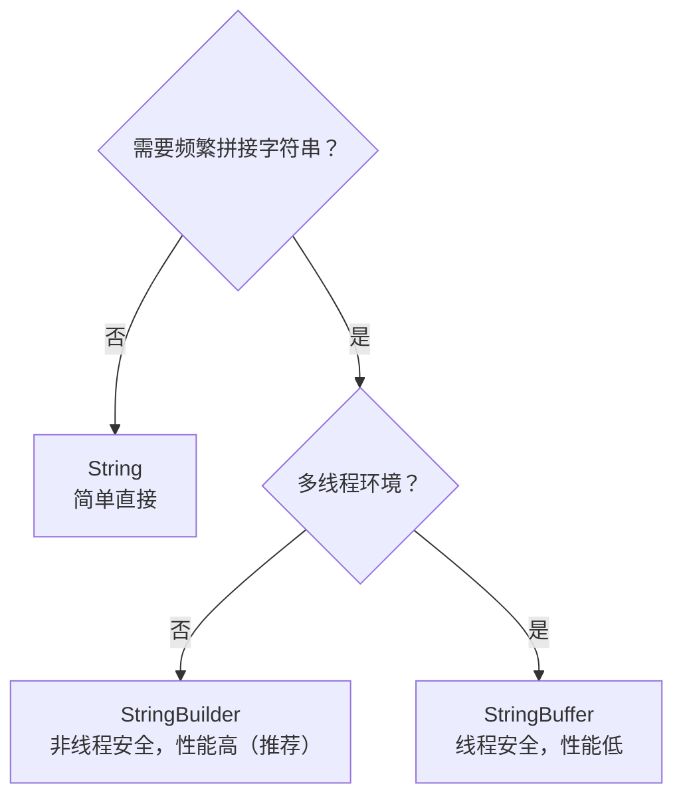

# 字符串生成器

## 学习目标

- 掌握 `StringBuilder` 的 append/insert/delete/reverse 等核心方法与扩容机制
- 区分 `StringBuilder`（非线程安全、快）与 `StringBuffer`（线程安全、synchronized）
- 理解容量(capacity)与长度(length)的区别及 ensureCapacity/trimToSize
- 对比 String 拼接 `+` 与 StringBuilder 在循环中的性能差异
- 识别 toString 中间对象、频繁扩容等性能注意点

## 概述

在 Java 中，**字符串生成器**是用于高效构建和操作字符串的工具类。由于 `String` 是不可变的，每次对字符串进行修改（如拼接、替换等）都会创建一个新的字符串对象，这在频繁操作字符串时会导致性能问题。为了解决这个问题，Java 提供了两种字符串生成器类：



1. **`StringBuilder`**：非线程安全，性能较高（**推荐使用**）
2. **`StringBuffer`**：线程安全，性能较低

### 为什么需要字符串生成器？

当使用 `String` 进行频繁的字符串拼接操作时，会产生大量的临时对象，导致内存浪费和性能下降：

```java
// 低效的方式：每次拼接都创建新对象
String result = "";
for (int i = 0; i < 1000; i++) {
    result += i; // 每次都会创建新的 String 对象
}

// 高效的方式：使用 StringBuilder
StringBuilder sb = new StringBuilder();
for (int i = 0; i < 1000; i++) {
    sb.append(i); // 在同一个对象上操作
}
String result = sb.toString();
```

## StringBuilder 和 StringBuffer

### 对比表

| 特性           | `StringBuilder` | `StringBuffer`                            |
| -------------- | --------------- | ----------------------------------------- |
| **线程安全性** | 非线程安全      | 线程安全（所有方法都使用 `synchronized`） |
| **性能**       | 较高            | 较低（同步操作带来开销）                  |
| **适用场景**   | 单线程环境      | 多线程环境                                |
| **方法同步**   | 无同步          | 方法同步                                  |
| **推荐使用**   | √ 大多数情况   |  仅在需要线程安全时使用                 |

### 何时使用哪个？

- **优先使用 `StringBuilder`**：在单线程环境下，`StringBuilder` 性能更好，是首选
- **使用 `StringBuffer`**：只有在多线程环境下需要共享同一个字符串生成器时才使用 `StringBuffer`
- **注意**：即使是在多线程环境下，如果每个线程都有自己的字符串生成器实例，也应该使用 `StringBuilder`

### 常用方法

`StringBuilder` 和 `StringBuffer` 提供类似的方法，用于操作字符串。以下是常用的方法及其功能：

#### 创建字符串生成器

- `StringBuilder()`：创建一个空的 `StringBuilder` 对象
- `StringBuilder(int capacity)`：创建一个指定初始容量的 `StringBuilder` 对象
- `StringBuilder(String str)`：创建一个包含指定字符串的 `StringBuilder` 对象

```java
StringBuilder sb1 = new StringBuilder(); // 空对象
StringBuilder sb2 = new StringBuilder(100); // 初始容量为 100
StringBuilder sb3 = new StringBuilder("Hello"); // 初始内容为 "Hello"
```

#### 追加字符串 append()

`append()` 方法有多个重载版本，可以将各种类型的数据追加到字符串生成器中。该方法返回 `StringBuilder` 对象本身，支持链式调用。

**常用重载版本：**

- `append(String str)`：追加字符串
- `append(char c)`：追加字符
- `append(int i)`：追加整数
- `append(long l)`：追加长整数
- `append(double d)`：追加双精度浮点数
- `append(boolean b)`：追加布尔值
- `append(Object obj)`：追加对象（调用 `toString()` 方法）
- `append(char[] str)`：追加字符数组
- `append(CharSequence s)`：追加字符序列

```java
StringBuilder sb = new StringBuilder("Hello");
sb.append(" World");
System.out.println(sb.toString()); // 输出: Hello World

// 链式调用
StringBuilder sb2 = new StringBuilder();
sb2.append("Name: ").append("张三").append(", Age: ").append(25);
System.out.println(sb2.toString()); // 输出: Name: 张三, Age: 25

// 追加不同类型的数据
StringBuilder sb3 = new StringBuilder();
sb3.append("数字: ").append(100)
   .append(", 字符: ").append('A')
   .append(", 布尔: ").append(true)
   .append(", 浮点: ").append(3.14);
System.out.println(sb3.toString());
// 输出: 数字: 100, 字符: A, 布尔: true, 浮点: 3.14
```

#### 插入字符串 insert()

`insert()` 方法在指定位置插入数据，也有多个重载版本，支持插入各种类型的数据。

**常用重载版本：**

- `insert(int offset, String str)`：在指定位置插入字符串
- `insert(int offset, char c)`：在指定位置插入字符
- `insert(int offset, int i)`：在指定位置插入整数
- `insert(int offset, Object obj)`：在指定位置插入对象

```java
StringBuilder sb = new StringBuilder("Hello World");
sb.insert(5, " Beautiful");
System.out.println(sb.toString()); // 输出: Hello Beautiful World

// 插入不同类型的数据
StringBuilder sb2 = new StringBuilder("Java");
sb2.insert(0, "Hello ");        // 在开头插入
sb2.insert(sb2.length(), "!");   // 在末尾插入
System.out.println(sb2.toString()); // 输出: Hello Java!

// 插入数字
StringBuilder sb3 = new StringBuilder("Year: ");
sb3.insert(6, 2024);
System.out.println(sb3.toString()); // 输出: Year: 2024
```

#### 删除字符串 delete()

`delete(int start, int end)`：删除从 `start` 到 `end`（不包括 `end`）之间的字符

```java
StringBuilder sb = new StringBuilder("Hello World");
sb.delete(5, 11); // 删除 " World"
System.out.println(sb.toString()); // 输出: Hello
```

#### 替换字符串 replace()

`replace(int start, int end, String str)`：用指定的字符串替换从 `start` 到 `end` 之间的字符

```java
StringBuilder sb = new StringBuilder("Hello World");
sb.replace(6, 11, "Java");
System.out.println(sb.toString()); // 输出: Hello Java
```

#### 反转字符串 reverse()

`reverse()`：反转字符串生成器中的字符

```java
StringBuilder sb = new StringBuilder("Hello");
sb.reverse();
System.out.println(sb.toString()); // 输出: olleH
```

#### 获取长度和容量

- **`length()`**：返回当前字符串的长度
- **`capacity()`**：返回当前字符串生成器的容量（内部缓冲区的大小）

```java
StringBuilder sb = new StringBuilder("Hello");
System.out.println(sb.length());    // 输出: 5
System.out.println(sb.capacity());  // 输出: 21（默认容量 16 + 初始字符串长度 5）
```

#### 设置长度和容量

- **`setLength(int newLength)`**：设置字符串生成器的长度
  - 如果 `newLength` 大于当前长度，会在末尾填充空字符（`\u0000`）
  - 如果 `newLength` 小于当前长度，会截断字符串
- **`ensureCapacity(int minimumCapacity)`**：确保字符串生成器的容量至少为指定值

```java
StringBuilder sb = new StringBuilder("Hello");
sb.setLength(10); // 设置长度为 10
System.out.println(sb.toString()); // 输出: Hello

sb.setLength(3); // 设置长度为 3
System.out.println(sb.toString()); // 输出: Hel
```

#### 字符操作

- **`charAt(int index)`**：返回指定索引处的字符
- **`setCharAt(int index, char ch)`**：将指定索引处的字符设置为 `ch`

```java
StringBuilder sb = new StringBuilder("Hello");
System.out.println(sb.charAt(1)); // 输出: e
sb.setCharAt(1, 'a');
System.out.println(sb.toString()); // 输出: Hallo
```

#### 查找和替换

- **`indexOf(String str)`**：返回指定子串第一次出现的索引，如果未找到返回 -1
- **`indexOf(String str, int fromIndex)`**：从指定位置开始查找子串第一次出现的索引
- **`lastIndexOf(String str)`**：返回指定子串最后一次出现的索引
- **`lastIndexOf(String str, int fromIndex)`**：从指定位置开始向前查找子串最后一次出现的索引

**注意：**

- `StringBuilder` 和 `StringBuffer` 没有直接的 `replaceAll` 方法，但可以通过循环和 `replace` 方法实现全局替换

```java
StringBuilder sb = new StringBuilder("Hello Hello World");
int index = sb.indexOf("Hello"); // 返回: 0
int lastIndex = sb.lastIndexOf("Hello"); // 返回: 6
System.out.println("First index: " + index); // 输出: First index: 0
System.out.println("Last index: " + lastIndex); // 输出: Last index: 6

// 替换第一个匹配的子串
sb.replace(0, 5, "Hi");
System.out.println(sb.toString()); // 输出: Hi Hello World

// 实现全局替换（替换所有匹配的子串）
StringBuilder sb2 = new StringBuilder("Hello Hello Hello");
String oldStr = "Hello";
String newStr = "Hi";
int pos = 0;
while ((pos = sb2.indexOf(oldStr, pos)) != -1) {
    sb2.replace(pos, pos + oldStr.length(), newStr);
    pos += newStr.length();
}
System.out.println(sb2.toString()); // 输出: Hi Hi Hi
```

#### 获取子串 substring()

- **`substring(int start)`**：返回从 `start` 开始到末尾的子串
- **`substring(int start, int end)`**：返回从 `start` 到 `end`（不包括 `end`）之间的子串

**注意：** `substring()` 方法返回的是一个新的 `String` 对象，不会修改原 `StringBuilder` 对象。

```java
StringBuilder sb = new StringBuilder("Hello World");
String sub1 = sb.substring(6); // 从索引 6 开始到末尾
System.out.println(sub1); // 输出: World

String sub2 = sb.substring(0, 5); // 从索引 0 到 5（不包括 5）
System.out.println(sub2); // 输出: Hello

// substring() 不会修改原对象
System.out.println(sb.toString()); // 输出: Hello World
```

### 性能对比

#### StringBuilder vs String

在频繁进行字符串拼接操作时，`StringBuilder` 的性能远优于 `String`：

```java
// 测试 String 拼接性能
long startTime = System.nanoTime();
String result = "";
for (int i = 0; i < 10000; i++) {
    result += i; // 每次拼接都创建新对象
}
long endTime = System.nanoTime();
System.out.println("String time: " + (endTime - startTime) / 1_000_000.0 + " ms");

// 测试 StringBuilder 性能
startTime = System.nanoTime();
StringBuilder sb = new StringBuilder();
for (int i = 0; i < 10000; i++) {
    sb.append(i); // 在同一个对象上操作
}
String result2 = sb.toString();
endTime = System.nanoTime();
System.out.println("StringBuilder time: " + (endTime - startTime) / 1_000_000.0 + " ms");
```

**典型输出：**

```text
String time: 150.5 ms
StringBuilder time: 2.3 ms
```

（数值为量级示意，实际因数据量与 JVM 环境而异，下同。）

**性能差异原因：**

- `String` 拼接：每次 `+=` 操作都会创建新的 `String` 对象，产生大量临时对象，导致频繁的垃圾回收
- `StringBuilder` 拼接：在同一个对象上操作，只在必要时扩容，避免了大量对象创建

#### StringBuilder vs StringBuffer（单线程环境）

在单线程环境中，`StringBuilder` 的性能优于 `StringBuffer`，因为 `StringBuilder` 不需要进行同步操作。

```java
long startTime = System.nanoTime();
StringBuilder sb = new StringBuilder();
for (int i = 0; i < 100000; i++) {
  sb.append("a");
}
long endTime = System.nanoTime();
System.out.println("StringBuilder time: " + (endTime - startTime) / 1_000_000.0 + " ms");

startTime = System.nanoTime();
StringBuffer sbf = new StringBuffer();
for (int i = 0; i < 100000; i++) {
  sbf.append("a");
}
endTime = System.nanoTime();
System.out.println("StringBuffer time: " + (endTime - startTime) / 1_000_000.0 + " ms");
```

**典型输出：**

```text
StringBuilder time: 3.5 ms
StringBuffer time: 5.2 ms
```

（量级示意,差距通常在 20%~50% 之间,实际因环境而异。）

**性能差异原因：**

- `StringBuffer` 的所有方法都使用 `synchronized` 关键字，在多线程环境下保证线程安全，但同步操作会带来性能开销
- 在单线程环境下，`StringBuilder` 避免了同步开销，性能更好

#### 多线程环境

- 在多线程环境中，`StringBuffer` 是线程安全的，适合用于共享的字符串操作
- `StringBuilder` 不是线程安全的，可能会导致数据不一致

```java
// 多线程环境下使用 StringBuffer
StringBuffer sbf = new StringBuffer();
Runnable task = () -> {
    for (int i = 0; i < 1000; i++) {
        sbf.append("a");
    }
};

Thread t1 = new Thread(task);
Thread t2 = new Thread(task);
t1.start();
t2.start();
try {
    t1.join();
    t2.join();
} catch (InterruptedException e) {
    e.printStackTrace();
}
System.out.println("StringBuffer length: " + sbf.length()); // 输出: 2000
```

### 底层实现

#### 内部数据结构

- `StringBuilder` 和 `StringBuffer` 内部使用一个 `char[]` 数组（在 Java 9+ 中改为 `byte[]`）来存储字符数据
- 初始容量为 **16**，当字符数量超过当前容量时，会自动扩容

#### 扩容机制

扩容规则：

1. **默认扩容策略**：当字符数量超过当前容量时，新容量 = `(当前容量 + 1) * 2`
2. **最小容量要求**：如果计算出的新容量小于所需的最小容量，则使用最小容量
3. **最大容量限制**：软上限为 `MAX_ARRAY_SIZE`（`Integer.MAX_VALUE - 8`），需求更大时最多到 `Integer.MAX_VALUE`（此时大概率抛出 `OutOfMemoryError`）

扩容过程：

1. 创建一个新的更大的数组
2. 将旧数组中的数据复制到新数组中
3. 更新容量引用

**性能影响：**

- 扩容操作会带来一定的性能开销（数组复制）
- 可以通过指定初始容量来减少扩容次数，提高性能

```java
// 如果知道大概的字符串长度，可以预先指定容量
StringBuilder sb = new StringBuilder(100); // 指定初始容量为 100

// 示例：减少扩容次数
StringBuilder sb1 = new StringBuilder(); // 默认容量 16，可能需要多次扩容
for (int i = 0; i < 1000; i++) {
    sb1.append("a");
}

StringBuilder sb2 = new StringBuilder(1000); // 预先指定容量，避免扩容
for (int i = 0; i < 1000; i++) {
    sb2.append("a");
}
// sb2 的性能通常更好，因为避免了扩容操作
```

#### 容量与长度的区别

- **`length()`**：返回当前字符串的实际长度（字符数量）
- **`capacity()`**：返回当前内部数组的容量（可以存储的字符数量，不包括扩容）

```java
StringBuilder sb = new StringBuilder("Hello");
System.out.println("Length: " + sb.length());     // 输出: Length: 5
System.out.println("Capacity: " + sb.capacity()); // 输出: Capacity: 21 (16 + 5)

// 容量会随着扩容而增加
for (int i = 0; i < 100; i++) {
    sb.append("a");
}
System.out.println("Length: " + sb.length());     // 输出: Length: 105
System.out.println("Capacity: " + sb.capacity()); // 输出: Capacity: 某个更大的值
```

### 最佳实践和注意事项

#### 1. 优先使用 StringBuilder

在单线程环境下，优先使用 `StringBuilder` 而不是 `StringBuffer`，除非确实需要线程安全。

```java
// √ 推荐
StringBuilder sb = new StringBuilder();

//  仅在需要线程安全时使用
StringBuffer sbf = new StringBuffer();
```

#### 2. 预估容量以减少扩容

如果能够预估字符串的大致长度，应该预先指定容量，以减少扩容次数，提高性能。

```java
// √ 推荐：预估容量
StringBuilder sb = new StringBuilder(estimatedSize);

// × 不推荐：频繁扩容
StringBuilder sb = new StringBuilder(); // 默认容量 16，可能需要多次扩容
```

#### 3. 避免在循环中使用 String 拼接

在循环中进行字符串拼接时，应该使用 `StringBuilder` 而不是 `String`。

```java
// × 不推荐：性能差
String result = "";
for (int i = 0; i < 1000; i++) {
    result += i;
}

// √ 推荐：性能好
StringBuilder sb = new StringBuilder();
for (int i = 0; i < 1000; i++) {
    sb.append(i);
}
String result = sb.toString();
```

#### 4. 利用链式调用

`StringBuilder` 的方法返回自身，可以利用链式调用使代码更简洁。

```java
// √ 推荐：链式调用
StringBuilder sb = new StringBuilder()
    .append("Name: ").append(name)
    .append(", Age: ").append(age)
    .append(", City: ").append(city);

// × 不推荐：冗长
StringBuilder sb = new StringBuilder();
sb.append("Name: ");
sb.append(name);
sb.append(", Age: ");
sb.append(age);
```

#### 5. 注意索引边界

使用 `insert()`、`delete()`、`replace()` 等方法时，要注意索引边界，避免 `StringIndexOutOfBoundsException`。

```java
StringBuilder sb = new StringBuilder("Hello");
// × 错误：索引越界
// sb.insert(10, "World"); // 抛出 StringIndexOutOfBoundsException

// √ 正确：检查索引
if (sb.length() >= 5) {
    sb.insert(5, " World");
}
```

#### 6. 线程安全注意事项

- `StringBuilder` 不是线程安全的，在多线程环境下共享同一个实例可能导致数据不一致
- 如果需要在多线程环境下使用，应该使用 `StringBuffer` 或者为每个线程创建独立的 `StringBuilder` 实例

```java
// × 错误：多线程共享 StringBuilder
StringBuilder sb = new StringBuilder();
// 多个线程同时操作 sb 会导致数据不一致

// √ 正确方式 1：使用 StringBuffer
StringBuffer sbf = new StringBuffer();
// 多个线程可以安全地操作 sbf

// √ 正确方式 2：每个线程使用独立的 StringBuilder
// 每个线程创建自己的 StringBuilder 实例
```

#### 7. 及时转换为 String

在不需要继续修改时，应该及时调用 `toString()` 转换为 `String`，释放 `StringBuilder` 占用的额外内存。

```java
StringBuilder sb = new StringBuilder();
sb.append("Hello").append(" World");
String result = sb.toString(); // 及时转换
// 之后如果不再需要修改，可以释放 sb 引用
```

## StringJoiner 类

`StringJoiner` 是 Java 8 引入的一个实用工具类，位于 `java.util` 包中。它用于更方便地拼接字符串，特别是在需要添加分隔符、前缀和后缀的情况下。

### 为什么需要 StringJoiner？

在 Java 8 之前，拼接带分隔符的字符串通常需要手动处理：

```java
// Java 8 之前的方式
StringBuilder sb = new StringBuilder();
String[] items = {"Apple", "Banana", "Cherry"};
for (int i = 0; i < items.length; i++) {
    if (i > 0) {
        sb.append(", ");
    }
    sb.append(items[i]);
}
String result = sb.toString(); // "Apple, Banana, Cherry"
```

使用 `StringJoiner` 可以简化这个过程：

```java
// 使用 StringJoiner
StringJoiner sj = new StringJoiner(", ");
sj.add("Apple");
sj.add("Banana");
sj.add("Cherry");
String result = sj.toString(); // "Apple, Banana, Cherry"
```

### 功能特点

- **分隔符支持**：自动处理元素之间的分隔符
- **前缀和后缀**：可以轻松添加前缀和后缀（如 `[item1, item2, item3]`）
- **空值处理**：可以灵活地处理空值（`null`）
- **简洁的 API**：比手动使用 `StringBuilder` 更简洁

### 与其他方法的对比

| 方法                   | 适用场景               | 优点                   | 缺点               |
| ---------------------- | ---------------------- | ---------------------- | ------------------ |
| `StringJoiner`         | 需要分隔符、前缀、后缀 | API 简洁，代码可读性好 | 需要逐个添加元素   |
| `String.join()`        | 已有数组或集合         | 一行代码完成           | 不支持前缀和后缀   |
| `Collectors.joining()` | 流操作中               | 与 Stream API 集成     | 仅适用于流操作     |
| `StringBuilder`        | 复杂字符串构建         | 灵活，性能好           | 需要手动处理分隔符 |

### 构造方法

`StringJoiner` 提供了以下几种构造方法：

1. 基本构造方法 `public StringJoiner(CharSequence delimiter)`。`delimiter`：分隔符，用于分隔拼接的字符串

   ```java
   StringJoiner sj = new StringJoiner(", ");
   sj.add("Apple");
   sj.add("Banana");
   sj.add("Cherry");
   System.out.println(sj.toString()); // 输出: Apple, Banana, Cherry
   ```

2. 带前缀和后缀的构造方法 `public StringJoiner(CharSequence delimiter, CharSequence prefix, CharSequence suffix)`

   1. `delimiter`：分隔符
   2. `prefix`：前缀，拼接结果的开头
   3. `suffix`：后缀，拼接结果的结尾

   ```java
   StringJoiner sj = new StringJoiner(", ", "[", "]");
   sj.add("Apple");
   sj.add("Banana");
   sj.add("Cherry");
   System.out.println(sj.toString()); // 输出: [Apple, Banana, Cherry]
   ```

### StringJoiner 常用方法

#### 添加字符串 add()

向 `StringJoiner` 中添加一个元素

```java
StringJoiner sj = new StringJoiner(", ");
sj.add("Apple");
sj.add("Banana");
sj.add("Cherry");
System.out.println(sj.toString()); // 输出: Apple, Banana, Cherry
```

#### 默认返回值 setEmptyValue()

`setEmptyValue(CharSequence emptyValue)` 设置当 `StringJoiner` 中没有元素时的返回值

```java
StringJoiner sj = new StringJoiner(", ", "[", "]");
sj.setEmptyValue("No elements");
System.out.println(sj.toString()); // 输出: No elements

sj.add("Apple");
System.out.println(sj.toString()); // 输出: [Apple]
```

#### 合并 merge()

将另一个 `StringJoiner` 的内容合并到当前 `StringJoiner` 中

- 只追加对方的内容（不含其前缀和后缀），结果使用当前 `StringJoiner` 的前缀、后缀和分隔符
- 若对方为空（未添加任何元素），本次合并无效果

```java
StringJoiner sj1 = new StringJoiner(", ");
sj1.add("Apple");
sj1.add("Banana");

StringJoiner sj2 = new StringJoiner(", ");
sj2.add("Cherry");
sj2.add("Date");

sj1.merge(sj2);
System.out.println(sj1.toString()); // 输出: Apple, Banana, Cherry, Date
```

#### toString()

返回拼接后的字符串

```java
StringJoiner sj = new StringJoiner(", ");
sj.add("Apple");
sj.add("Banana");
System.out.println(sj.toString()); // 输出: Apple, Banana
```

### 使用场景

#### 1. 拼接数组或集合

使用 `StringJoiner` 可以方便地将数组或集合中的元素拼接成一个字符串：

```java
import java.util.Arrays;
import java.util.StringJoiner;

public class Main {
  public static void main(String[] args) {
    String[] fruits = {"Apple", "Banana", "Cherry"};
    StringJoiner sj = new StringJoiner(", ");
    for (String fruit : fruits) {
      sj.add(fruit);
    }
    System.out.println(sj.toString()); // 输出: Apple, Banana, Cherry
  }
}
```

**对比：使用 `String.join()`（更简洁，但不支持前缀和后缀）**

```java
String[] fruits = {"Apple", "Banana", "Cherry"};
String result = String.join(", ", fruits);
System.out.println(result); // 输出: Apple, Banana, Cherry
```

#### 2. 带前缀和后缀的拼接

使用 `StringJoiner` 可以轻松添加前缀和后缀，这在生成 JSON、SQL 等格式的字符串时非常有用：

```java
// 生成类似 JSON 数组的格式
StringJoiner sj = new StringJoiner(", ", "[", "]");
sj.add("Apple");
sj.add("Banana");
sj.add("Cherry");
System.out.println(sj.toString()); // 输出: [Apple, Banana, Cherry]

// 生成 SQL IN 子句
StringJoiner sqlJoiner = new StringJoiner(", ", "SELECT * FROM users WHERE id IN (", ")");
sqlJoiner.add("1").add("2").add("3");
String sql = sqlJoiner.toString();
System.out.println(sql); // 输出: SELECT * FROM users WHERE id IN (1, 2, 3)
```

#### 3. 在 Stream 中使用

虽然 `Collectors.joining()` 更常用，但 `StringJoiner` 也可以与 Stream 结合使用：

```java
import java.util.Arrays;
import java.util.stream.Collectors;

// 使用 Collectors.joining()（推荐）
String result = Arrays.asList("Apple", "Banana", "Cherry")
    .stream()
    .collect(Collectors.joining(", ", "[", "]"));
System.out.println(result); // 输出: [Apple, Banana, Cherry]

// 使用 StringJoiner（较少使用）
StringJoiner sj = new StringJoiner(", ", "[", "]");
Arrays.asList("Apple", "Banana", "Cherry")
    .forEach(sj::add);
System.out.println(sj.toString()); // 输出: [Apple, Banana, Cherry]
```

#### 4. 处理空值和空集合

`StringJoiner` 提供了 `setEmptyValue()` 方法来处理空集合的情况：

```java
StringJoiner sj = new StringJoiner(", ", "[", "]");
sj.setEmptyValue("No elements");
System.out.println(sj.toString()); // 输出: No elements

sj.add("Apple");
System.out.println(sj.toString()); // 输出: [Apple]
```

#### 5. 处理 null 值

默认情况下，`StringJoiner` 会将 `null` 转换为字符串 `"null"`：

```java
StringJoiner sj = new StringJoiner(", ");
sj.add("Apple");
sj.add(null); // null 会被转换为 "null"
sj.add("Banana");
System.out.println(sj.toString()); // 输出: Apple, null, Banana
```

如果需要忽略 `null` 值，需要手动处理：

```java
StringJoiner sj = new StringJoiner(", ");
sj.add("Apple");
// 手动过滤 null
String value = null;
if (value != null) {
    sj.add(value);
}
sj.add("Banana");
System.out.println(sj.toString()); // 输出: Apple, Banana
```

#### 6. 合并多个 StringJoiner

使用 `merge()` 方法可以合并多个 `StringJoiner`：

```java
StringJoiner sj1 = new StringJoiner(", ", "[", "]");
sj1.add("Apple").add("Banana");

StringJoiner sj2 = new StringJoiner(", ", "[", "]");
sj2.add("Cherry").add("Date");

sj1.merge(sj2);
System.out.println(sj1.toString()); // 输出: [Apple, Banana, Cherry, Date]
```

### 选择建议

- **需要前缀和后缀**：使用 `StringJoiner`
- **已有数组/集合，不需要前缀后缀**：使用 `String.join()`
- **在 Stream 操作中**：使用 `Collectors.joining()`
- **复杂的字符串构建**：使用 `StringBuilder`

## 实战案例

### 案例 1：构建 SQL 查询语句

```java
public class SqlBuilder {
    
    /**
     * 构建 SELECT 语句
     */
    public static String buildSelectQuery(String table, List<String> columns, 
                                         String whereClause, String orderBy) {
        StringBuilder sql = new StringBuilder("SELECT ");
        
        // 添加列名
        if (columns == null || columns.isEmpty()) {
            sql.append("*");
        } else {
            for (int i = 0; i < columns.size(); i++) {
                if (i > 0) {
                    sql.append(", ");
                }
                sql.append(columns.get(i));
            }
        }
        
        sql.append(" FROM ").append(table);
        
        // 添加 WHERE 子句
        if (whereClause != null && !whereClause.isEmpty()) {
            sql.append(" WHERE ").append(whereClause);
        }
        
        // 添加 ORDER BY 子句
        if (orderBy != null && !orderBy.isEmpty()) {
            sql.append(" ORDER BY ").append(orderBy);
        }
        
        return sql.toString();
    }
    
    /**
     * 构建 IN 子句
     */
    public static String buildInClause(List<?> values) {
        if (values == null || values.isEmpty()) {
            return "()";
        }
        
        StringBuilder sb = new StringBuilder("(");
        for (int i = 0; i < values.size(); i++) {
            if (i > 0) {
                sb.append(", ");
            }
            Object value = values.get(i);
            if (value instanceof String) {
                sb.append("'").append(value).append("'");
            } else {
                sb.append(value);
            }
        }
        sb.append(")");
        return sb.toString();
    }
    
    public static void main(String[] args) {
        // 构建 SELECT 查询
        List<String> columns = Arrays.asList("id", "name", "email");
        String query = buildSelectQuery("users", columns, "status = 'ACTIVE'", "created_at DESC");
        System.out.println(query);
        // 输出: SELECT id, name, email FROM users WHERE status = 'ACTIVE' ORDER BY created_at DESC
        
        // 构建 IN 子句
        List<Integer> ids = Arrays.asList(1, 2, 3, 4, 5);
        String inClause = buildInClause(ids);
        System.out.println(inClause); // 输出: (1, 2, 3, 4, 5)
        
        List<String> names = Arrays.asList("Alice", "Bob", "Charlie");
        String inClause2 = buildInClause(names);
        System.out.println(inClause2); // 输出: ('Alice', 'Bob', 'Charlie')
    }
}
```

### 案例 2：日志格式化器

```java
public class LogFormatter {
    
    private static final String TIMESTAMP_FORMAT = "yyyy-MM-dd HH:mm:ss.SSS";
    private static final int MAX_MESSAGE_LENGTH = 1000;
    
    /**
     * 格式化日志消息
     * 格式: [时间戳] [日志级别] [类名] - 消息内容
     */
    public static String formatLog(String level, String className, String message) {
        StringBuilder log = new StringBuilder(256); // 预估容量
        
        // 时间戳
        String timestamp = LocalDateTime.now().format(DateTimeFormatter.ofPattern(TIMESTAMP_FORMAT));
        log.append("[").append(timestamp).append("] ");
        
        // 日志级别（固定宽度）
        log.append(String.format("[%-5s] ", level));
        
        // 类名（限制长度）
        String shortClassName = className.length() > 30 
            ? "..." + className.substring(className.length() - 27) 
            : className;
        log.append("[").append(shortClassName).append("] ");
        
        // 消息内容
        log.append("- ");
        if (message.length() > MAX_MESSAGE_LENGTH) {
            log.append(message.substring(0, MAX_MESSAGE_LENGTH)).append("...");
        } else {
            log.append(message);
        }
        
        return log.toString();
    }
    
    /**
     * 格式化异常堆栈
     */
    public static String formatException(Exception e) {
        StringBuilder sb = new StringBuilder(512);
        sb.append(e.getClass().getName()).append(": ").append(e.getMessage()).append("\n");
        
        for (StackTraceElement element : e.getStackTrace()) {
            sb.append("    at ").append(element.getClassName())
              .append(".").append(element.getMethodName())
              .append("(").append(element.getFileName())
              .append(":").append(element.getLineNumber()).append(")\n");
        }
        
        return sb.toString();
    }
    
    public static void main(String[] args) {
        String log = formatLog("INFO", "com.example.UserService", "用户登录成功");
        System.out.println(log);
        // 输出: [2024-01-15 10:30:45.123] [INFO ] [com.example.UserService] - 用户登录成功
        
        try {
            throw new RuntimeException("测试异常");
        } catch (Exception e) {
            System.out.println(formatException(e));
        }
    }
}
```

### 案例 3：CSV 文件生成器

```java
public class CsvBuilder {
    
    private static final String CSV_DELIMITER = ",";
    private static final String CSV_LINE_SEPARATOR = "\n";
    
    /**
     * 将数据转换为 CSV 格式
     */
    public static String toCsv(List<String[]> data) {
        if (data == null || data.isEmpty()) {
            return "";
        }
        
        StringBuilder csv = new StringBuilder(data.size() * 100); // 预估容量
        
        for (String[] row : data) {
            appendRow(csv, row);
            csv.append(CSV_LINE_SEPARATOR);
        }
        
        return csv.toString();
    }
    
    /**
     * 追加一行数据
     */
    private static void appendRow(StringBuilder csv, String[] row) {
        for (int i = 0; i < row.length; i++) {
            if (i > 0) {
                csv.append(CSV_DELIMITER);
            }
            appendField(csv, row[i]);
        }
    }
    
    /**
     * 追加一个字段（处理特殊字符）
     */
    private static void appendField(StringBuilder csv, String field) {
        if (field == null) {
            return;
        }
        
        // 如果字段包含逗号、引号或换行符，需要用引号包围并转义引号
        boolean needsQuotes = field.contains(CSV_DELIMITER) 
                           || field.contains("\"") 
                           || field.contains("\n");
        
        if (needsQuotes) {
            csv.append("\"");
            // 转义引号（" -> ""）
            for (int i = 0; i < field.length(); i++) {
                char c = field.charAt(i);
                if (c == '"') {
                    csv.append("\"\"");
                } else {
                    csv.append(c);
                }
            }
            csv.append("\"");
        } else {
            csv.append(field);
        }
    }
    
    public static void main(String[] args) {
        List<String[]> data = new ArrayList<>();
        data.add(new String[]{"姓名", "年龄", "城市"});
        data.add(new String[]{"张三", "25", "北京"});
        data.add(new String[]{"李四", "30", "上海,浦东"});
        data.add(new String[]{"王五", "28", "广州\"天河\""});
        
        String csv = toCsv(data);
        System.out.println(csv);
        // 输出:
        // 姓名,年龄,城市
        // 张三,25,北京
        // 李四,30,"上海,浦东"
        // 王五,28,"广州""天河"""
    }
}
```

### 案例 4：JSON 字符串构建器

```java
public class JsonBuilder {
    
    private StringBuilder json;
    private boolean firstElement;
    
    public JsonBuilder() {
        this.json = new StringBuilder(256);
        this.firstElement = true;
    }
    
    /**
     * 开始构建 JSON 对象
     */
    public JsonBuilder startObject() {
        json.append("{");
        firstElement = true;
        return this;
    }
    
    /**
     * 结束 JSON 对象
     */
    public JsonBuilder endObject() {
        json.append("}");
        return this;
    }
    
    /**
     * 开始构建 JSON 数组
     */
    public JsonBuilder startArray() {
        json.append("[");
        firstElement = true;
        return this;
    }
    
    /**
     * 结束 JSON 数组
     */
    public JsonBuilder endArray() {
        json.append("]");
        return this;
    }
    
    /**
     * 添加字符串属性
     */
    public JsonBuilder put(String key, String value) {
        addCommaIfNeeded();
        json.append("\"").append(key).append("\": ");
        if (value == null) {
            json.append("null");
        } else {
            json.append("\"").append(escapeJson(value)).append("\"");
        }
        return this;
    }
    
    /**
     * 添加数字属性
     */
    public JsonBuilder put(String key, Number value) {
        addCommaIfNeeded();
        json.append("\"").append(key).append("\": ");
        if (value == null) {
            json.append("null");
        } else {
            json.append(value);
        }
        return this;
    }
    
    /**
     * 添加布尔属性
     */
    public JsonBuilder put(String key, Boolean value) {
        addCommaIfNeeded();
        json.append("\"").append(key).append("\": ");
        if (value == null) {
            json.append("null");
        } else {
            json.append(value);
        }
        return this;
    }
    
    /**
     * 添加原始 JSON 值
     */
    public JsonBuilder putRaw(String key, String jsonValue) {
        addCommaIfNeeded();
        json.append("\"").append(key).append("\": ").append(jsonValue);
        return this;
    }
    
    private void addCommaIfNeeded() {
        if (!firstElement) {
            json.append(", ");
        }
        firstElement = false;
    }
    
    /**
     * 转义 JSON 特殊字符
     */
    private String escapeJson(String str) {
        StringBuilder escaped = new StringBuilder();
        for (int i = 0; i < str.length(); i++) {
            char c = str.charAt(i);
            switch (c) {
                case '"': escaped.append("\\\""); break;
                case '\\': escaped.append("\\\\"); break;
                case '\n': escaped.append("\\n"); break;
                case '\r': escaped.append("\\r"); break;
                case '\t': escaped.append("\\t"); break;
                default: escaped.append(c);
            }
        }
        return escaped.toString();
    }
    
    public String build() {
        return json.toString();
    }
    
    public static void main(String[] args) {
        // 构建复杂 JSON 对象
        String json = new JsonBuilder()
            .startObject()
                .put("id", 1001)
                .put("name", "张三")
                .put("age", 25)
                .put("active", true)
                .putRaw("tags", "[\"Java\", \"Python\", \"Go\"]")
                .put("address", "北京市\"海淀区\"")
            .endObject()
            .build();
        
        System.out.println(json);
        // 输出: {"id": 1001, "name": "张三", "age": 25, "active": true, "tags": ["Java", "Python", "Go"], "address": "北京市\"海淀区\""}
    }
}
```

### 案例 5：文本表格生成器

```java
public class TableBuilder {
    
    private List<String[]> rows;
    private int[] columnWidths;
    private String columnSeparator = " | ";
    private String rowSeparator = "-";
    
    public TableBuilder() {
        this.rows = new ArrayList<>();
    }
    
    /**
     * 添加行
     */
    public TableBuilder addRow(String... cells) {
        rows.add(cells);
        
        // 更新列宽
        if (columnWidths == null) {
            columnWidths = new int[cells.length];
        }
        
        for (int i = 0; i < cells.length; i++) {
            int width = cells[i] != null ? cells[i].length() : 0;
            columnWidths[i] = Math.max(columnWidths[i], width);
        }
        
        return this;
    }
    
    /**
     * 设置列分隔符
     */
    public TableBuilder setColumnSeparator(String separator) {
        this.columnSeparator = separator;
        return this;
    }
    
    /**
     * 构建表格字符串
     */
    public String build() {
        if (rows.isEmpty()) {
            return "";
        }
        
        StringBuilder table = new StringBuilder(rows.size() * 100);
        
        // 构建分隔线
        StringBuilder separatorLine = new StringBuilder();
        for (int width : columnWidths) {
            separatorLine.append("+");
            for (int i = 0; i < width; i++) {
                separatorLine.append(rowSeparator);
            }
        }
        separatorLine.append("+");
        
        // 添加表格行
        for (int i = 0; i < rows.size(); i++) {
            String[] row = rows.get(i);
            
            // 如果是表头，添加上分隔线
            if (i == 0) {
                table.append(separatorLine).append("\n");
            }
            
            // 添加行内容
            for (int j = 0; j < row.length; j++) {
                table.append("|");
                String cell = row[j] != null ? row[j] : "";
                // 左对齐
                table.append(String.format("%-" + columnWidths[j] + "s", cell));
            }
            table.append("|\n");
            
            // 如果是表头，添加下分隔线
            if (i == 0) {
                table.append(separatorLine).append("\n");
            }
        }
        
        // 添加底部分隔线
        table.append(separatorLine);
        
        return table.toString();
    }
    
    public static void main(String[] args) {
        String table = new TableBuilder()
            .addRow("姓名", "年龄", "城市", "职业")
            .addRow("张三", "25", "北京", "工程师")
            .addRow("李四", "30", "上海", "设计师")
            .addRow("王五", "28", "广州", "产品经理")
            .build();
        
        System.out.println(table);
        // 输出:
        // +--+--+--+----+
        // |姓名|年龄|城市|职业  |
        // +--+--+--+----+
        // |张三|25|北京|工程师 |
        // |李四|30|上海|设计师 |
        // |王五|28|广州|产品经理|
        // +--+--+--+----+
        // (注:%-Ns 按字符数而非显示宽度填充,汉字占 2 个显示列宽但按 1 个字符计)
    }
}
```

## 性能优化最佳实践

### 1. 预估容量避免扩容

```java
// × 不推荐：默认容量16，可能需要多次扩容
StringBuilder sb1 = new StringBuilder();
for (int i = 0; i < 10000; i++) {
    sb1.append(i);
}

// √ 推荐：预估容量，避免扩容
int estimatedSize = 10000 * 5; // 假设平均每个数字5个字符
StringBuilder sb2 = new StringBuilder(estimatedSize);
for (int i = 0; i < 10000; i++) {
    sb2.append(i);
}

// 性能对比（典型量级示意,实际因数据与 JVM 而异）：
// 未预分配容量: 约 5 ms
// 预分配容量: 约 4 ms（避免多次数组复制）
```

### 2. 使用链式调用简化代码

```java
// × 不推荐：冗长的代码
StringBuilder sb = new StringBuilder();
sb.append("用户: ");
sb.append(username);
sb.append(", 年龄: ");
sb.append(age);
sb.append(", 城市: ");
sb.append(city);

// √ 推荐：链式调用
StringBuilder sb = new StringBuilder()
    .append("用户: ").append(username)
    .append(", 年龄: ").append(age)
    .append(", 城市: ").append(city);
```

### 3. 及时转换为 String 释放内存

```java
// × 不推荐：StringBuilder 对象长期持有
public class User {
    private StringBuilder profile; // 不推荐
    
    public String getProfile() {
        return profile.toString();
    }
}

// √ 推荐：及时转换为 String
public class User {
    private String profile; // 推荐
    
    public void buildProfile(String name, int age, String city) {
        StringBuilder sb = new StringBuilder()
            .append(name).append(", ")
            .append(age).append(", ")
            .append(city);
        this.profile = sb.toString(); // 及时转换
    }
}
```

### 4. 避免不必要的字符串创建

```java
// × 不推荐：多次调用 toString()
StringBuilder sb = new StringBuilder("Hello");
processString(sb.toString());
processAnotherString(sb.toString());

// √ 推荐：复用字符串对象
StringBuilder sb = new StringBuilder("Hello");
String str = sb.toString();
processString(str);
processAnotherString(str);
```

### 5. 使用 StringJoiner 简化分隔符处理

```java
// × 不推荐：手动处理分隔符
StringBuilder sb = new StringBuilder();
for (int i = 0; i < list.size(); i++) {
    if (i > 0) {
        sb.append(", ");
    }
    sb.append(list.get(i));
}

// √ 推荐：使用 StringJoiner
StringJoiner joiner = new StringJoiner(", ");
list.forEach(joiner::add);
String result = joiner.toString();

// √ 更简洁：使用 String.join()
String result = String.join(", ", list);
```

## 常见误区与陷阱

### 误区 1：忽视线程安全问题

```java
// × 错误：多线程共享 StringBuilder
public class SharedBuilder {
    private StringBuilder sb = new StringBuilder(); // 线程不安全！
    
    public void append(String str) {
        sb.append(str);
    }
}

// √ 正确方式1：使用 StringBuffer
public class SharedBuilder {
    private StringBuffer sb = new StringBuffer(); // 线程安全
    
    public void append(String str) {
        sb.append(str);
    }
}

// √ 正确方式2：每个线程独立实例
public class ThreadLocalBuilder {
    private ThreadLocal<StringBuilder> threadLocalBuilder = 
        ThreadLocal.withInitial(StringBuilder::new);
    
    public void append(String str) {
        threadLocalBuilder.get().append(str);
    }
}
```

### 误区 2：StringBuilder 作为类成员变量

```java
// × 错误：StringBuilder 作为成员变量，可能导致线程安全和内存问题
public class MessageBuilder {
    private StringBuilder message = new StringBuilder();
    
    public void append(String part) {
        message.append(part);
    }
    
    public String build() {
        return message.toString();
    }
    
    // 问题：多次调用 build() 会累积内容
}

// √ 正确：每次构建创建新的 StringBuilder
public class MessageBuilder {
    public String build(List<String> parts) {
        StringBuilder sb = new StringBuilder();
        for (String part : parts) {
            sb.append(part);
        }
        return sb.toString();
    }
}
```

### 误区 3：混淆 length() 和 capacity()

```java
StringBuilder sb = new StringBuilder(100);
sb.append("Hello");

// × 误解：capacity() 返回字符串长度
System.out.println(sb.capacity()); // 输出: 100（实际容量）
System.out.println(sb.length());   // 输出: 5（字符串长度）

// 注意：
// - length(): 字符串的实际长度
// - capacity(): 内部数组的容量（包含未使用的空间）
```

### 误区 4：忽视 setLength() 的副作用

```java
StringBuilder sb = new StringBuilder("Hello World");

// × 错误理解：setLength() 只是截断字符串
sb.setLength(5);
System.out.println(sb); // 输出: Hello

// 但如果设置更大的长度：
sb.setLength(10);
System.out.println(sb); // 输出: Hello     （填充了空字符 \u0000）
System.out.println(Arrays.toString(sb.toString().getBytes()));
// 输出: [72, 101, 108, 108, 111, 0, 0, 0, 0, 0]
```

### 误区 5：误解 substring() 的行为

```java
StringBuilder sb = new StringBuilder("Hello World");

// × 误解：substring() 会修改原对象
String sub = sb.substring(0, 5);
System.out.println(sub);    // 输出: Hello
System.out.println(sb);     // 输出: Hello World（原对象未修改）

// 注意：substring() 返回新的 String 对象，不修改 StringBuilder
```

## 面试要点

### 1. StringBuilder 和 StringBuffer 的区别

**Q: StringBuilder 和 StringBuffer 的主要区别是什么？**

A:
- **线程安全性**：
  - `StringBuilder`：非线程安全，方法没有 `synchronized` 修饰
  - `StringBuffer`：线程安全，所有方法都用 `synchronized` 修饰
  
- **性能**：
  - `StringBuilder` 性能更高（无同步开销）
  - `StringBuffer` 性能较低（同步开销）
  
- **适用场景**：
  - 单线程环境优先使用 `StringBuilder`
  - 多线程共享实例时使用 `StringBuffer`
  
- **引入版本**：
  - `StringBuffer`：JDK 1.0
  - `StringBuilder`：JDK 5

### 2. 为什么 String 拼接性能差？

**Q: 为什么在循环中使用 String 拼接性能很差？**

A:
- **不可变性**：`String` 是不可变的，每次拼接都创建新对象
- **内存开销**：产生大量临时对象，增加垃圾回收压力
- **时间复杂度**：`O(n²)` 时间复杂度（n 次拼接，每次复制之前的内容）
- **StringBuilder 优势**：
  - 可变对象，在原对象上修改
  - `O(n)` 时间复杂度
  - 避免大量临时对象创建

```java
// String 拼接：O(n²) 时间复杂度
String result = "";
for (int i = 0; i < n; i++) {
    result += i; // 每次复制之前的内容 + 新内容
}

// StringBuilder：O(n) 时间复杂度
StringBuilder sb = new StringBuilder();
for (int i = 0; i < n; i++) {
    sb.append(i); // 直接追加，无需复制之前的内容
}
```

### 3. StringBuilder 的扩容机制

**Q: StringBuilder 的扩容机制是怎样的？**

A:
- **初始容量**：默认 16，可通过构造方法指定
- **扩容规则**：`(当前容量 + 1) * 2`
- **扩容过程**：
  1. 创建新的更大数组
  2. 复制旧数组内容到新数组
  3. 更新内部引用
  
- **性能影响**：扩容操作有性能开销（数组复制）
- **优化建议**：预估容量，避免频繁扩容

```java
// 扩容示例
StringBuilder sb = new StringBuilder(16); // 容量: 16
for (int i = 0; i < 20; i++) {
    sb.append('a');
    // 当字符数超过16时，扩容到 (16+1)*2 = 34
}
```
### 4. StringJoiner 的应用场景

**Q: StringJoiner 适合什么场景？**

A:
- **需要分隔符**：自动处理元素之间的分隔符
- **需要前缀后缀**：轻松添加前缀和后缀
- **代码简洁**：比手动使用 `StringBuilder` 更简洁
- **典型场景**：
  - 构建 SQL IN 子句
  - 构建 JSON 数组
  - 拼接带格式的字符串

```java
// 构建 SQL IN 子句
StringJoiner sj = new StringJoiner(", ", "IN (", ")");
sj.add("1").add("2").add("3");
// 结果: IN (1, 2, 3)
```

### 5. 如何选择字符串拼接方式？

**Q: 在不同场景下如何选择字符串拼接方式？**

A:
| 场景 | 推荐方式 | 原因 |
|------|---------|------|
| 少量拼接（<5次） | `String +` | 编译器优化，代码简洁 |
| 循环中拼接 | `StringBuilder` | 避免创建大量临时对象 |
| 集合拼接（无前缀后缀） | `String.join()` | 代码最简洁 |
| 集合拼接（有前缀后缀） | `StringJoiner` | 支持前缀后缀 |
| Stream 操作 | `Collectors.joining()` | 与 Stream API 集成 |
| 多线程环境 | `StringBuffer` | 线程安全 |

### 6. StringBuilder 和 String 的转换

**Q: StringBuilder 和 String 如何互相转换？**

A:
- **StringBuilder → String**：
  ```java
  StringBuilder sb = new StringBuilder("Hello");
  String str = sb.toString();
  ```
  
- **String → StringBuilder**：
  ```java
  String str = "Hello";
  StringBuilder sb1 = new StringBuilder(str);
  StringBuilder sb2 = new StringBuilder().append(str);
  ```

### 7. StringBuilder 的线程安全性

**Q: StringBuilder 为什么不是线程安全的？**

A:
- **无同步机制**：方法没有 `synchronized` 修饰
- **竞态条件**：多线程同时调用 `append()` 可能导致：
  - 数据覆盖
  - 数据丢失
  - 数组越界
  
- **解决方案**：
  1. 使用 `StringBuffer`（线程安全但性能低）
  2. 每个线程独立实例（推荐）
  3. 使用同步块（增加复杂度）

### 8. StringJoiner vs String.join()

**Q: StringJoiner 和 String.join() 有什么区别？**

A:
| 特性 | StringJoiner | String.join() |
|------|-------------|--------------|
| 前缀后缀 | 支持 | 不支持 |
| 参数类型 | 逐个添加 | 数组或集合 |
| 链式调用 | 支持 | 不支持 |
| 空值处理 | `setEmptyValue()` | 直接返回空字符串 |
| 适用场景 | 需要前缀后缀 | 简单的分隔符拼接 |

### 9. 性能优化技巧

**Q: 使用 StringBuilder 有哪些性能优化技巧？**

A:
1. **预估容量**：避免频繁扩容
2. **链式调用**：代码简洁，减少临时引用
3. **及时转换**：不再修改时调用 `toString()` 释放内存
4. **避免冗余**：避免不必要的 `toString()` 调用
5. **选择合适方法**：根据场景选择 `StringBuilder`、`StringJoiner` 或 `String.join()`

### 10. StringBuilder 源码分析

**Q: StringBuilder 的核心实现原理是什么？**

A:
- **继承关系**：继承 `AbstractStringBuilder`
- **数据结构**：
  - JDK 8：`char[] value` 数组
  - JDK 9+：`byte[] value` 数组（Compact Strings）
  
- **关键字段**：
  - `value`：存储字符数据
  - `count`：实际字符数量（长度）
  
- **扩容逻辑**（简化版,完整实现还含 `MAX_ARRAY_SIZE` 溢出检查）：
  ```java
  private int newCapacity(int minCapacity) {
      int oldCapacity = value.length >> coder;
      int newCapacity = (oldCapacity << 1) + 2;
      if (newCapacity - minCapacity < 0) {
          newCapacity = minCapacity;
      }
      return newCapacity;
  }
  ```

## 总结

### 核心要点

1. **StringBuilder vs StringBuffer**
   - `StringBuilder`：非线程安全，性能高，**推荐在单线程环境下使用**
   - `StringBuffer`：线程安全，性能较低，仅在多线程共享实例时使用

2. **性能优化**
   - 避免在循环中使用 `String` 拼接，使用 `StringBuilder`
   - 预估容量以减少扩容次数
   - 在单线程环境下优先使用 `StringBuilder`

3. **StringJoiner 适用场景**
   - 需要分隔符、前缀、后缀的字符串拼接
   - 代码简洁，可读性好
   - 适合简单的字符串拼接场景

4. **方法选择指南**
   - 简单拼接（无分隔符）：`StringBuilder`
   - 带分隔符的拼接：`String.join()` 或 `StringJoiner`
   - 带前缀后缀的拼接：`StringJoiner` 或 `Collectors.joining()`
   - 复杂字符串构建：`StringBuilder`

### 快速参考

| 场景                   | 推荐方法               | 示例                                       |
| ---------------------- | ---------------------- | ------------------------------------------ |
| 循环中拼接字符串       | `StringBuilder`        | `sb.append(item)`                          |
| 拼接数组（无前缀后缀） | `String.join()`        | `String.join(", ", array)`                 |
| 拼接数组（有前缀后缀） | `StringJoiner`         | `new StringJoiner(", ", "[", "]")`         |
| Stream 中拼接          | `Collectors.joining()` | `stream.collect(Collectors.joining(", "))` |
| 多线程共享             | `StringBuffer`         | `new StringBuffer()`                       |

### 最佳实践总结

1. **优先使用 StringBuilder**：单线程环境下首选
2. **预估容量**：避免频繁扩容，提高性能
3. **链式调用**：代码简洁，减少临时引用
4. **及时转换**：不再修改时调用 `toString()` 释放内存
5. **合理选择工具**：根据场景选择 `StringBuilder`、`StringJoiner` 或 `String.join()`
6. **注意线程安全**：多线程环境下使用 `StringBuffer` 或独立实例
7. **避免常见误区**：理解 `length()` vs `capacity()`、`substring()` 的行为等

## 版本差异(旧版 → Java 21)

| 特性 | 旧版(Java 8) | Java 11/21 |
|------|--------------|------------|
| 分隔符连接 | `StringJoiner`（Java 8）、`String.join`（Java 8） | `String.join` 增强；文本块（Java 15）简化多行拼接 |
| 字符串转换 | `String.format` | `formatted()` 实例方法（Java 15）配合文本块 |
| 构建效率 | 手动预估容量 | 不变；Java 9+ 编译器对 `+` 拼接改用 invokedynamic 动态生成 |
| 线程安全 | `StringBuffer` 同步 | 不变；单线程优先 `StringBuilder` |

## 继续阅读

- 上一章：[字符串](08-字符串)
- 下一章：[常用类](10-常用类)
