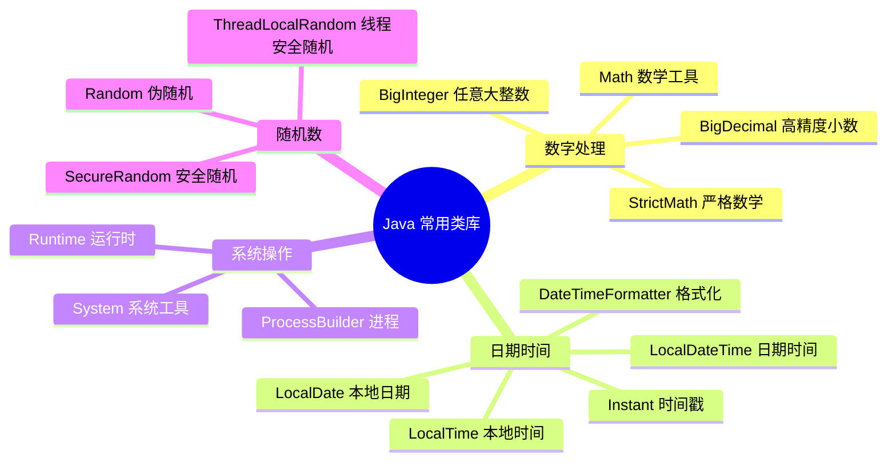

# 常用类库

## 学习目标

- 掌握 `Math`、`Random`、`System`、`Objects` 等常用工具类的典型方法
- 理解 `Number` 包装类体系与 `BigDecimal` 精确计算（避免浮点误差）
- 掌握 `Arrays`/`Collections` 工具类与对象比较、排序、填充操作
- 理解 `Optional` 的意图（规避 NPE）与反模式（不当作字段类型）
- 识别 `Random` 可预测、`BigDecimal(double)` 构造精度丢失等陷阱

Java 提供了丰富的标准类库，涵盖了数字处理、数学运算、随机数生成、日期时间处理、系统操作等各个方面。掌握这些常用类库能够大大提高开发效率。



## 数字处理

在 Java 中数字处理是非常常见的操作，包括基本的数学运算、随机数生成、大数处理、高精度计算等。Java 提供了丰富的类库来支持这些操作，涵盖了从基本数据类型到高级数学计算的各个方面。

### BigInteger 类

`BigInteger` 类位于 `java.math` 包中，用于表示任意大小的整数，适用于超出 `long` 范围（-2^63 到 2^63-1）的大整数运算。

**特点：**
- 不可变对象，所有运算都返回新的 `BigInteger` 对象
- 可以表示任意大小的整数（理论上只受内存限制）
- 适用于大数运算、密码学、科学计算等场景

**创建方式：**
- `new BigInteger(String val)`：通过字符串创建
- `BigInteger.valueOf(long val)`：将 `long` 值转换为 `BigInteger`
- `BigInteger.ONE`、`BigInteger.ZERO`、`BigInteger.TEN`：常用常量

| 方法名                           | 功能描述                     |
| -------------------------------- | ---------------------------- |
| `add(BigInteger val)`            | 加法运算                     |
| `subtract(BigInteger val)`       | 减法运算                     |
| `multiply(BigInteger val)`       | 乘法运算                     |
| `divide(BigInteger val)`         | 除法运算                     |
| `mod(BigInteger val)`            | 取模运算                     |
| `pow(int exponent)`              | 幂运算                       |
| `gcd(BigInteger val)`            | 返回两个数的最大公约数       |
| `isProbablePrime(int certainty)` | 判断是否为素数（概率性测试） |
| `abs()`                            | 返回绝对值                   |
| `negate()`                         | 返回相反数                   |
| `max(BigInteger val)`              | 返回两个数中的较大值         |
| `min(BigInteger val)`              | 返回两个数中的较小值         |
| `intValue()` / `longValue()`       | 转换为基本数据类型           |
| `toString()`                       | 转换为字符串                 |

**示例代码：**

```java
import java.math.BigInteger;

public class BigIntegerExample {
  public static void main(String[] args) {
    // 创建 BigInteger 对象
    BigInteger a = new BigInteger("12345678901234567890");
    BigInteger b = new BigInteger("98765432109876543210");
    
    // 使用常量
    BigInteger zero = BigInteger.ZERO;
    BigInteger one = BigInteger.ONE;
    BigInteger ten = BigInteger.TEN;

    // 基本运算
    System.out.println("加法: " + a.add(b)); 
    // 输出: 加法: 111111111011111111100

    System.out.println("减法: " + b.subtract(a)); 
    // 输出: 减法: 86419753208641975320

    System.out.println("乘法: " + a.multiply(b)); 
    // 输出: 乘法: 1219326311370217952237463801111263526900

    System.out.println("除法: " + b.divide(a)); 
    // 输出: 除法: 8

    System.out.println("取模: " + b.mod(a)); 
    // 输出: 取模: 900000000090

    // 幂运算
    System.out.println("幂运算: " + a.pow(2)); 
    // 输出: 幂运算: 152415787532388367501905199875019052100

    // 最大公约数
    BigInteger gcd = a.gcd(b);
    System.out.println("最大公约数: " + gcd);

    // 判断素数（概率性测试，certainty 越大越准确但越慢）
    boolean isPrime = new BigInteger("17").isProbablePrime(100);
    System.out.println("17 是否为素数: " + isPrime); // 输出: true

    // 比较大小
    int compare = a.compareTo(b);
    System.out.println("比较结果: " + compare); // 输出: -1 (a < b)

    // 转换为基本类型（注意可能溢出）
    long longValue = a.longValue();
    System.out.println("转换为 long: " + longValue);
  }
}
```

**注意事项：**
- `BigInteger` 是不可变的，所有运算都返回新对象
- 转换为基本类型时要注意溢出问题
- 大数运算性能较低，只在必要时使用

### BigDecimal 类

`BigDecimal` 类位于 `java.math` 包中，用于表示高精度的浮点数，适用于需要精确计算的场景（如金融计算、货币计算）。

**为什么需要 BigDecimal？**

`double` 和 `float` 类型使用二进制浮点数表示，无法精确表示某些十进制小数，会导致精度丢失：

```java
// 精度问题示例
double d1 = 0.1;
double d2 = 0.2;
System.out.println(d1 + d2); // 输出: 0.30000000000000004（精度丢失）

// 使用 BigDecimal 可以精确计算
BigDecimal bd1 = new BigDecimal("0.1");
BigDecimal bd2 = new BigDecimal("0.2");
System.out.println(bd1.add(bd2)); // 输出: 0.3（精确）
```

**特点：**
- 不可变对象，所有运算都返回新的 `BigDecimal` 对象
- 可以精确表示任意精度的十进制数
- 适用于金融、科学计算等需要精确计算的场景

**创建方式：**
- `new BigDecimal(String val)`：**推荐**，通过字符串创建（精确）
- `new BigDecimal(double val)`：不推荐，可能丢失精度
- `BigDecimal.valueOf(double val)`：将 `double` 值转换为 `BigDecimal`

| 方法名                                                         | 功能描述                         |
| -------------------------------------------------------------- | -------------------------------- |
| `add(BigDecimal val)`                                          | 加法运算                         |
| `subtract(BigDecimal val)`                                     | 减法运算                         |
| `multiply(BigDecimal val)`                                     | 乘法运算                         |
| `divide(BigDecimal val, int scale, RoundingMode roundingMode)` | 除法运算，指定小数位数和舍入模式 |
| `setScale(int newScale, RoundingMode roundingMode)`            | 设置小数位数和舍入模式           |
| `compareTo(BigDecimal val)`                                    | 比较两个 `BigDecimal` 的值       |
| `abs()`                                                        | 返回绝对值                       |
| `negate()`                                                     | 返回相反数                       |
| `max(BigDecimal val)` / `min(BigDecimal val)`                  | 返回较大/较小值                  |
| `doubleValue()` / `floatValue()`                               | 转换为基本数据类型               |

**舍入模式（RoundingMode）：**
- `HALF_UP`：四舍五入（最常用）
- `HALF_DOWN`：五舍六入
- `CEILING`：向上舍入（向正无穷方向）
- `FLOOR`：向下舍入（向负无穷方向）
- `UP`：远离零方向舍入
- `DOWN`：向零方向舍入

**示例代码：**

```java
import java.math.BigDecimal;
import java.math.RoundingMode;

public class BigDecimalExample {
  public static void main(String[] args) {
    // 创建 BigDecimal（推荐使用字符串构造）
    BigDecimal a = new BigDecimal("123.456");
    BigDecimal b = new BigDecimal("78.901");

    // 基本运算
    System.out.println("加法: " + a.add(b)); // 输出: 加法: 202.357
    System.out.println("减法: " + a.subtract(b)); // 输出: 减法: 44.555
    System.out.println("乘法: " + a.multiply(b)); // 输出: 乘法: 9741.699456

    // 除法（必须指定精度和舍入模式）
    System.out.println("除法: " + a.divide(b, 2, RoundingMode.HALF_UP)); 
    // 输出: 除法: 1.56

    // 设置小数位数
    BigDecimal result = a.setScale(2, RoundingMode.HALF_UP);
    System.out.println("设置小数位: " + result); // 输出: 设置小数位: 123.46

    // 比较（使用 compareTo，不要用 equals）
    int compare = a.compareTo(b);
    System.out.println("比较结果: " + compare); // 输出: 1（a > b）
    
    // equals 比较值和精度，compareTo 只比较值
    BigDecimal c = new BigDecimal("123.456");
    BigDecimal d = new BigDecimal("123.4560");
    System.out.println("equals: " + c.equals(d)); // false（精度不同）
    System.out.println("compareTo: " + c.compareTo(d)); // 0（值相同）

    // 金融计算示例：计算金额
    BigDecimal price = new BigDecimal("19.99");
    BigDecimal quantity = new BigDecimal("3");
    BigDecimal total = price.multiply(quantity).setScale(2, RoundingMode.HALF_UP);
    System.out.println("总金额: " + total); // 输出: 总金额: 59.97
  }
}
```

**注意事项：**
- **必须使用字符串构造**，避免使用 `double` 构造（会丢失精度）
- 除法运算必须指定精度和舍入模式，否则可能抛出 `ArithmeticException`
- 比较时使用 `compareTo()` 而不是 `equals()`（`equals()` 会比较精度）
- 性能比基本类型慢，只在需要精确计算时使用

### NumberFormat 类

`NumberFormat` 类位于 `java.text` 包中，用于格式化数字为字符串，或将字符串解析为数字。它支持本地化，可以根据不同的地区显示不同格式的数字。

**获取实例：**
- `NumberFormat.getInstance()`：获取默认地区的数字格式化器
- `NumberFormat.getInstance(Locale locale)`：获取指定地区的数字格式化器
- `NumberFormat.getCurrencyInstance(Locale locale)`：获取货币格式化器
- `NumberFormat.getPercentInstance(Locale locale)`：获取百分比格式化器

| 方法名                                     | 功能描述             |
| ------------------------------------------ | -------------------- |
| `format(double number)`                    | 将数字格式化为字符串 |
| `format(long number)`                      | 将长整数格式化为字符串 |
| `parse(String source)`                     | 将字符串解析为数字   |
| `setMinimumFractionDigits(int newMinimum)` | 设置最小小数位数     |
| `setMaximumFractionDigits(int newMaximum)` | 设置最大小数位数     |
| `setMinimumIntegerDigits(int newMinimum)`  | 设置最小整数位数     |
| `setMaximumIntegerDigits(int newMaximum)`  | 设置最大整数位数     |
| `setGroupingUsed(boolean newValue)`         | 设置是否使用分组（千位分隔符） |

**示例代码：**

```java
import java.text.NumberFormat;
import java.text.ParseException;
import java.util.Locale;

public class NumberFormatExample {
  public static void main(String[] args) {
    // 基本数字格式化
    NumberFormat nf = NumberFormat.getInstance(Locale.US);
    String formattedNumber = nf.format(1234567.89);
    System.out.println("格式化数字: " + formattedNumber); 
    // 输出: 格式化数字: 1,234,567.89

    // 设置小数位数
    nf.setMinimumFractionDigits(2);
    nf.setMaximumFractionDigits(4);
    System.out.println("小数位设置: " + nf.format(123.456)); 
    // 输出: 小数位设置: 123.456（3 位小数已满足最小 2 位的要求,不会强制补 0）

    // 不同地区的格式化
    NumberFormat nfCN = NumberFormat.getInstance(Locale.CHINA);
    System.out.println("中国格式: " + nfCN.format(1234567.89)); 
    // 输出: 中国格式: 1,234,567.89

    // 货币格式化
    NumberFormat currency = NumberFormat.getCurrencyInstance(Locale.US);
    System.out.println("货币格式: " + currency.format(1234.56)); 
    // 输出: 货币格式: $1,234.56

    NumberFormat currencyCN = NumberFormat.getCurrencyInstance(Locale.CHINA);
    System.out.println("人民币格式: " + currencyCN.format(1234.56)); 
    // 输出: 人民币格式: ¥1,234.56

    // 百分比格式化
    NumberFormat percent = NumberFormat.getPercentInstance(Locale.US);
    System.out.println("百分比格式: " + percent.format(0.1234)); 
    // 输出: 百分比格式: 12%

    // 解析字符串
    try {
      Number number = nf.parse("1,234,567.89");
      System.out.println("解析结果: " + number.doubleValue()); 
      // 输出: 解析结果: 1234567.89
    } catch (ParseException e) {
      e.printStackTrace();
    }
  }
}
```

### DecimalFormat 类

`DecimalFormat` 是 `NumberFormat` 的子类，提供了更灵活的数字格式化功能，可以使用模式字符串自定义格式。

**常用模式符号：**
- `0`：数字，不足位数补 0
- `#`：数字，不足位数不补 0
- `.`：小数点
- `,`：千位分隔符
- `%`：百分比
- `E`：科学计数法

**示例代码：**

```java
import java.text.DecimalFormat;

public class DecimalFormatExample {
  public static void main(String[] args) {
    double number = 1234.5678;

    // 保留两位小数
    DecimalFormat df1 = new DecimalFormat("#.00");
    System.out.println(df1.format(number)); // 输出: 1234.57

    // 千位分隔符，保留两位小数
    DecimalFormat df2 = new DecimalFormat("#,##0.00");
    System.out.println(df2.format(number)); // 输出: 1,234.57

    // 固定位数，不足补 0
    DecimalFormat df3 = new DecimalFormat("0000.00");
    System.out.println(df3.format(12.3)); // 输出: 0012.30

    // 百分比格式
    DecimalFormat df4 = new DecimalFormat("0.00%");
    System.out.println(df4.format(0.1234)); // 输出: 12.34%

    // 科学计数法
    DecimalFormat df5 = new DecimalFormat("0.00E0");
    System.out.println(df5.format(1234.56)); // 输出: 1.23E3
  }
}
```

## 数学运算

### Math 类

`Math` 类位于 `java.lang` 包中，提供了常用的数学运算方法。所有方法都是静态方法，可以直接通过类名调用。

**常用方法：**

| 方法名                    | 功能描述           |
| ------------------------- | ------------------ |
| `abs(double a)`           | 返回绝对值         |
| `max(double a, double b)` | 返回两个数中的较大值 |
| `min(double a, double b)` | 返回两个数中的较小值 |
| `pow(double a, double b)` | 返回 a 的 b 次幂   |
| `sqrt(double a)`          | 返回平方根         |
| `ceil(double a)`          | 向上取整           |
| `floor(double a)`         | 向下取整           |
| `round(double a)`         | 四舍五入           |
| `random()`                | 返回 [0.0, 1.0) 的随机数 |
| `sin/cos/tan(double a)`   | 三角函数（参数为弧度） |
| `log(double a)`           | 自然对数           |
| `exp(double a)`           | e 的 a 次幂        |

**示例代码：**

```java
public class MathExample {
  public static void main(String[] args) {
    // 绝对值
    System.out.println("绝对值: " + Math.abs(-10)); // 输出: 10

    // 最大值和最小值
    System.out.println("最大值: " + Math.max(10, 20)); // 输出: 20
    System.out.println("最小值: " + Math.min(10, 20)); // 输出: 10

    // 幂运算
    System.out.println("2的3次方: " + Math.pow(2, 3)); // 输出: 8.0

    // 平方根
    System.out.println("16的平方根: " + Math.sqrt(16)); // 输出: 4.0

    // 取整
    System.out.println("向上取整: " + Math.ceil(3.2)); // 输出: 4.0
    System.out.println("向下取整: " + Math.floor(3.8)); // 输出: 3.0
    System.out.println("四舍五入: " + Math.round(3.5)); // 输出: 4

    // 随机数（0.0 到 1.0 之间）
    System.out.println("随机数: " + Math.random());

    // 三角函数（注意参数是弧度）
    double radians = Math.PI / 4; // 45度
    System.out.println("sin(45°): " + Math.sin(radians)); // 输出: 0.707...
    System.out.println("cos(45°): " + Math.cos(radians)); // 输出: 0.707...

    // 角度和弧度转换
    double degrees = 90;
    double rad = Math.toRadians(degrees); // 角度转弧度
    double deg = Math.toDegrees(Math.PI / 2); // 弧度转角度

    // 常用常量
    System.out.println("π: " + Math.PI); // 输出: 3.141592653589793
    System.out.println("e: " + Math.E);  // 输出: 2.718281828459045
  }
}
```

## 随机数生成

### Random 类

`Random` 类位于 `java.util` 包中，用于生成随机数。可以生成各种类型的随机数，包括整数、浮点数、布尔值等。

**构造方法：**
- `Random()`：使用当前时间作为种子
- `Random(long seed)`：使用指定种子（相同种子产生相同序列）

**常用方法：**

| 方法名                    | 功能描述                           |
| ------------------------- | ---------------------------------- |
| `nextInt()`               | 返回随机整数（所有 int 值）        |
| `nextInt(int bound)`      | 返回 [0, bound) 的随机整数         |
| `nextLong()`              | 返回随机长整数                     |
| `nextDouble()`            | 返回 [0.0, 1.0) 的随机浮点数       |
| `nextFloat()`             | 返回 [0.0, 1.0) 的随机浮点数       |
| `nextBoolean()`           | 返回随机布尔值                     |
| `nextBytes(byte[] bytes)` | 生成随机字节数组                   |

**示例代码：**

```java
import java.util.Random;

public class RandomExample {
  public static void main(String[] args) {
    Random random = new Random();

    // 生成随机整数
    int randomInt = random.nextInt();
    System.out.println("随机整数: " + randomInt);

    // 生成 0 到 100 之间的随机整数
    int randomInRange = random.nextInt(101);
    System.out.println("0-100随机数: " + randomInRange);

    // 生成随机浮点数
    double randomDouble = random.nextDouble();
    System.out.println("随机浮点数: " + randomDouble);

    // 生成随机布尔值
    boolean randomBoolean = random.nextBoolean();
    System.out.println("随机布尔值: " + randomBoolean);

    // 生成指定范围的随机数（例如：10 到 20）
    int min = 10;
    int max = 20;
    int randomInRange2 = random.nextInt(max - min + 1) + min;
    System.out.println("10-20随机数: " + randomInRange2);

    // 使用种子（相同种子产生相同序列）
    Random seededRandom = new Random(12345);
    System.out.println("种子随机数1: " + seededRandom.nextInt(100));
    System.out.println("种子随机数2: " + seededRandom.nextInt(100));

    // 重新创建相同种子的 Random，序列相同
    Random seededRandom2 = new Random(12345);
    System.out.println("种子随机数1: " + seededRandom2.nextInt(100)); // 与上面相同
  }
}
```

**注意事项：**
- 如果需要可重现的随机序列，使用带种子的构造方法
- `nextInt(bound)` 的范围是 [0, bound)，不包括 bound
- 在 Java 7+ 中，也可以使用 `ThreadLocalRandom` 在多线程环境下生成随机数（性能更好）

## 系统操作

### System 类

`System` 类位于 `java.lang` 包中，提供了与系统相关的属性和方法。所有方法都是静态方法。

**常用方法：**

| 方法名                          | 功能描述                     |
| ------------------------------- | ---------------------------- |
| `currentTimeMillis()`           | 返回当前时间的毫秒数         |
| `nanoTime()`                    | 返回当前时间的纳秒数（高精度） |
| `exit(int status)`              | 终止当前运行的 Java 虚拟机   |
| `gc()`                          | 建议运行垃圾回收器           |
| `getProperty(String key)`       | 获取系统属性                 |
| `setProperty(String key, String val)` | 设置系统属性           |
| `arraycopy(...)`                | 复制数组                     |

**示例代码：**

```java
public class SystemExample {
  public static void main(String[] args) {
    // 获取当前时间（毫秒）
    long currentTime = System.currentTimeMillis();
    System.out.println("当前时间（毫秒）: " + currentTime);

    // 获取当前时间（纳秒，用于高精度计时）
    long startTime = System.nanoTime();
    // 执行一些操作...
    long endTime = System.nanoTime();
    System.out.println("耗时（纳秒）: " + (endTime - startTime));

    // 获取系统属性
    String osName = System.getProperty("os.name");
    String javaVersion = System.getProperty("java.version");
    String userHome = System.getProperty("user.home");
    System.out.println("操作系统: " + osName);
    System.out.println("Java版本: " + javaVersion);
    System.out.println("用户目录: " + userHome);

    // 设置系统属性
    System.setProperty("custom.property", "custom.value");
    System.out.println("自定义属性: " + System.getProperty("custom.property"));

    // 数组复制
    int[] source = {1, 2, 3, 4, 5};
    int[] dest = new int[5];
    System.arraycopy(source, 0, dest, 0, source.length);
    System.out.println("复制后的数组: " + java.util.Arrays.toString(dest));

    // 标准输入输出
    System.out.println("标准输出");
    System.err.println("标准错误输出");

    // 注意：System.exit() 会终止程序，谨慎使用
    // System.exit(0); // 正常退出
  }
}
```

### Runtime 类

`Runtime` 类提供了与 Java 运行时环境交互的接口，可以获取内存信息、执行系统命令等。

**获取实例：**
- `Runtime.getRuntime()`：获取当前运行时实例（单例）

**常用方法：**

| 方法名                    | 功能描述                     |
| ------------------------- | ---------------------------- |
| `totalMemory()`           | 返回 JVM 总内存（字节）      |
| `freeMemory()`            | 返回 JVM 空闲内存（字节）    |
| `maxMemory()`             | 返回 JVM 最大可用内存（字节） |
| `availableProcessors()`   | 返回可用处理器数量           |
| `gc()`                    | 建议运行垃圾回收器           |
| `exec(String command)`    | 执行系统命令                 |

**示例代码：**

```java
import java.io.IOException;

public class RuntimeExample {
  public static void main(String[] args) {
    Runtime runtime = Runtime.getRuntime();

    // 获取内存信息
    long totalMemory = runtime.totalMemory();
    long freeMemory = runtime.freeMemory();
    long maxMemory = runtime.maxMemory();
    long usedMemory = totalMemory - freeMemory;

    System.out.println("总内存: " + totalMemory / 1024 / 1024 + " MB");
    System.out.println("空闲内存: " + freeMemory / 1024 / 1024 + " MB");
    System.out.println("已用内存: " + usedMemory / 1024 / 1024 + " MB");
    System.out.println("最大内存: " + maxMemory / 1024 / 1024 + " MB");

    // 获取处理器数量
    int processors = runtime.availableProcessors();
    System.out.println("可用处理器: " + processors);

    // 执行系统命令（Windows 示例）
    try {
      Process process = runtime.exec("cmd /c dir");
      // 处理进程输出...
    } catch (IOException e) {
      e.printStackTrace();
    }

    // 建议运行垃圾回收
    runtime.gc();
  }
}
```

## 实战案例

### 案例 1：金融计算工具类

```java
import java.math.BigDecimal;
import java.math.RoundingMode;

/**
 * 金融计算工具类
 * 提供精确的货币计算功能
 */
public class FinancialCalculator {
    
    // 默认小数位数
    private static final int DEFAULT_SCALE = 2;
    // 默认舍入模式
    private static final RoundingMode DEFAULT_ROUNDING = RoundingMode.HALF_UP;
    
    /**
     * 计算利息
     * @param principal 本金
     * @param rate 年利率（如 0.05 表示 5%）
     * @param years 年数
     * @return 利息
     */
    public static BigDecimal calculateInterest(BigDecimal principal, 
                                               BigDecimal rate, int years) {
        return principal.multiply(rate)
                       .multiply(BigDecimal.valueOf(years))
                       .setScale(DEFAULT_SCALE, DEFAULT_ROUNDING);
    }
    
    /**
     * 计算复利
     * @param principal 本金
     * @param rate 年利率
     * @param years 年数
     * @return 复利后的总金额
     */
    public static BigDecimal calculateCompoundInterest(BigDecimal principal, 
                                                       BigDecimal rate, int years) {
        // 公式: P * (1 + r)^n
        BigDecimal one = BigDecimal.ONE;
        BigDecimal multiplier = one.add(rate);
        BigDecimal result = principal.multiply(multiplier.pow(years));
        return result.setScale(DEFAULT_SCALE, DEFAULT_ROUNDING);
    }
    
    /**
     * 分期付款计算
     * @param principal 贷款本金
     * @param annualRate 年利率
     * @param months 还款月数
     * @return 每月还款额
     */
    public static BigDecimal calculateMonthlyPayment(BigDecimal principal, 
                                                     BigDecimal annualRate, int months) {
        // 月利率
        BigDecimal monthlyRate = annualRate.divide(BigDecimal.valueOf(12), 
                                                   10, RoundingMode.HALF_UP);
        
        if (monthlyRate.compareTo(BigDecimal.ZERO) == 0) {
            // 无息贷款
            return principal.divide(BigDecimal.valueOf(months), 
                                   DEFAULT_SCALE, DEFAULT_ROUNDING);
        }
        
        // 等额本息公式: P * r * (1+r)^n / ((1+r)^n - 1)
        BigDecimal one = BigDecimal.ONE;
        BigDecimal temp = one.add(monthlyRate).pow(months);
        BigDecimal numerator = principal.multiply(monthlyRate).multiply(temp);
        BigDecimal denominator = temp.subtract(one);
        
        return numerator.divide(denominator, DEFAULT_SCALE, DEFAULT_ROUNDING);
    }
    
    /**
     * 货币转换（带汇率）
     */
    public static BigDecimal convertCurrency(BigDecimal amount, 
                                            BigDecimal exchangeRate) {
        return amount.multiply(exchangeRate)
                    .setScale(DEFAULT_SCALE, DEFAULT_ROUNDING);
    }
    
    /**
     * 计算折扣价格
     */
    public static BigDecimal calculateDiscount(BigDecimal originalPrice, 
                                               BigDecimal discountRate) {
        return originalPrice.multiply(BigDecimal.ONE.subtract(discountRate))
                           .setScale(DEFAULT_SCALE, DEFAULT_ROUNDING);
    }
    
    public static void main(String[] args) {
        BigDecimal principal = new BigDecimal("10000.00");
        BigDecimal rate = new BigDecimal("0.05");
        
        // 计算利息
        BigDecimal interest = calculateInterest(principal, rate, 1);
        System.out.println("年利息: " + interest); // 输出: 年利息: 500.00
        
        // 计算复利
        BigDecimal compound = calculateCompoundInterest(principal, rate, 3);
        System.out.println("3年复利: " + compound); // 输出: 3年复利: 11576.25
        
        // 计算月供
        BigDecimal loanAmount = new BigDecimal("500000.00");
        BigDecimal loanRate = new BigDecimal("0.049"); // 4.9%年利率
        BigDecimal monthlyPayment = calculateMonthlyPayment(loanAmount, loanRate, 360);
        System.out.println("月供: " + monthlyPayment); // 输出: 月供: 2653.63
        
        // 计算折扣
        BigDecimal price = new BigDecimal("199.99");
        BigDecimal discount = calculateDiscount(price, new BigDecimal("0.2"));
        System.out.println("折后价: " + discount); // 输出: 折后价: 159.99
    }
}
```

### 案例 2：大数计算器

```java
import java.math.BigInteger;
import java.math.BigDecimal;

/**
 * 大数计算器
 * 处理超大数字的计算
 */
public class BigNumberCalculator {
    
    /**
     * 计算阶乘
     */
    public static BigInteger factorial(int n) {
        if (n < 0) {
            throw new IllegalArgumentException("n must be non-negative");
        }
        
        BigInteger result = BigInteger.ONE;
        for (int i = 2; i <= n; i++) {
            result = result.multiply(BigInteger.valueOf(i));
        }
        return result;
    }
    
    /**
     * 计算斐波那契数列
     */
    public static BigInteger fibonacci(int n) {
        if (n < 0) {
            throw new IllegalArgumentException("n must be non-negative");
        }
        
        if (n == 0) return BigInteger.ZERO;
        if (n == 1) return BigInteger.ONE;
        
        BigInteger a = BigInteger.ZERO;
        BigInteger b = BigInteger.ONE;
        
        for (int i = 2; i <= n; i++) {
            BigInteger temp = a.add(b);
            a = b;
            b = temp;
        }
        
        return b;
    }
    
    /**
     * 计算 e 的 n 次幂（使用泰勒级数）
     */
    public static BigDecimal exp(BigDecimal x, int precision) {
        BigDecimal result = BigDecimal.ONE;
        BigDecimal term = BigDecimal.ONE;
        
        for (int n = 1; n <= 100; n++) {
            term = term.multiply(x).divide(
                BigDecimal.valueOf(n), 
                precision, 
                RoundingMode.HALF_UP
            );
            result = result.add(term);
            
            // 当项足够小时停止
            if (term.abs().compareTo(BigDecimal.valueOf(1, precision)) < 0) {
                break;
            }
        }
        
        return result.setScale(precision, RoundingMode.HALF_UP);
    }
    
    /**
     * 计算最大公约数
     */
    public static BigInteger gcd(BigInteger a, BigInteger b) {
        return a.gcd(b);
    }
    
    /**
     * 计算最小公倍数
     */
    public static BigInteger lcm(BigInteger a, BigInteger b) {
        return a.multiply(b).divide(a.gcd(b));
    }
    
    /**
     * 判断是否为质数
     */
    public static boolean isPrime(BigInteger n) {
        return n.isProbablePrime(100);
    }
    
    /**
     * 计算 a^b mod m（快速幂）
     */
    public static BigInteger modPow(BigInteger a, BigInteger b, BigInteger m) {
        return a.modPow(b, m);
    }
    
    public static void main(String[] args) {
        // 阶乘
        System.out.println("10! = " + factorial(10));
        System.out.println("100! 有 " + factorial(100).toString().length() + " 位数字");
        
        // 斐波那契
        System.out.println("Fibonacci(50) = " + fibonacci(50));
        
        // GCD 和 LCM
        BigInteger a = new BigInteger("123456789");
        BigInteger b = new BigInteger("987654321");
        System.out.println("GCD: " + gcd(a, b));
        System.out.println("LCM: " + lcm(a, b));
        
        // 判断质数
        BigInteger prime = new BigInteger("12345678901234567890123456789012345678901234567891");
        System.out.println("是否为质数: " + isPrime(prime));
    }
}
```

### 案例 3：数据格式化工具

```java
import java.text.DecimalFormat;
import java.text.NumberFormat;
import java.util.Locale;

/**
 * 数据格式化工具类
 */
public class DataFormatter {
    
    /**
     * 格式化货币
     */
    public static String formatCurrency(double amount, Locale locale) {
        NumberFormat currencyFormat = NumberFormat.getCurrencyInstance(locale);
        return currencyFormat.format(amount);
    }
    
    /**
     * 格式化百分比
     */
    public static String formatPercent(double value, int decimals) {
        NumberFormat percentFormat = NumberFormat.getPercentInstance();
        percentFormat.setMinimumFractionDigits(decimals);
        percentFormat.setMaximumFractionDigits(decimals);
        return percentFormat.format(value);
    }
    
    /**
     * 格式化文件大小
     */
    public static String formatFileSize(long bytes) {
        if (bytes < 1024) {
            return bytes + " B";
        }
        
        String[] units = {"B", "KB", "MB", "GB", "TB", "PB"};
        int unitIndex = 0;
        double size = bytes;
        
        while (size >= 1024 && unitIndex < units.length - 1) {
            size /= 1024;
            unitIndex++;
        }
        
        DecimalFormat df = new DecimalFormat("#,##0.##");
        return df.format(size) + " " + units[unitIndex];
    }
    
    /**
     * 格式化数字（带千位分隔符）
     */
    public static String formatNumber(long number) {
        NumberFormat numberFormat = NumberFormat.getNumberInstance();
        return numberFormat.format(number);
    }
    
    /**
     * 格式化科学计数
     */
    public static String formatScientific(double number, int decimals) {
        StringBuilder pattern = new StringBuilder("0.");
        for (int i = 0; i < decimals; i++) {
            pattern.append("#");
        }
        pattern.append("E0");
        
        DecimalFormat scientificFormat = new DecimalFormat(pattern.toString());
        return scientificFormat.format(number);
    }
    
    /**
     * 格式化手机号（隐藏中间四位）
     */
    public static String formatPhone(String phone) {
        if (phone == null || phone.length() != 11) {
            return phone;
        }
        return phone.substring(0, 3) + "****" + phone.substring(7);
    }
    
    /**
     * 格式化银行卡号（每四位一组）
     */
    public static String formatBankCard(String cardNo) {
        if (cardNo == null) {
            return null;
        }
        
        StringBuilder formatted = new StringBuilder();
        for (int i = 0; i < cardNo.length(); i++) {
            if (i > 0 && i % 4 == 0) {
                formatted.append(" ");
            }
            formatted.append(cardNo.charAt(i));
        }
        return formatted.toString();
    }
    
    public static void main(String[] args) {
        // 货币格式化
        System.out.println(formatCurrency(12345.67, Locale.CHINA));  // ¥12,345.67
        System.out.println(formatCurrency(12345.67, Locale.US));     // $12,345.67
        System.out.println(formatCurrency(12345.67, Locale.JAPAN));  // ¥12,346
        
        // 百分比
        System.out.println(formatPercent(0.1234, 2)); // 12.34%
        
        // 文件大小
        System.out.println(formatFileSize(1024));          // 1 KB
        System.out.println(formatFileSize(1536));          // 1.5 KB
        System.out.println(formatFileSize(1048576));       // 1 MB
        System.out.println(formatFileSize(1572864));       // 1.5 MB
        System.out.println(formatFileSize(1073741824L));   // 1 GB
        
        // 数字格式化
        System.out.println(formatNumber(1234567890)); // 1,234,567,890
        
        // 科学计数
        System.out.println(formatScientific(123456.789, 3)); // 1.235E5
        
        // 手机号和银行卡
        System.out.println(formatPhone("13812345678"));     // 138****5678
        System.out.println(formatBankCard("6222021234567890")); // 6222 0212 3456 7890
    }
}
```

### 案例 4：随机数生成工具

```java
import java.util.Random;
import java.util.concurrent.ThreadLocalRandom;
import java.security.SecureRandom;
import java.util.UUID;

/**
 * 随机数生成工具类
 */
public class RandomUtils {
    
    private static final String ALPHABET = "ABCDEFGHIJKLMNOPQRSTUVWXYZabcdefghijklmnopqrstuvwxyz";
    private static final String DIGITS = "0123456789";
    private static final String ALPHANUMERIC = ALPHABET + DIGITS;
    
    /**
     * 生成指定范围的随机整数 [min, max]
     */
    public static int randomInt(int min, int max) {
        return ThreadLocalRandom.current().nextInt(min, max + 1);
    }
    
    /**
     * 生成指定范围的随机长整数 [min, max]
     */
    public static long randomLong(long min, long max) {
        return ThreadLocalRandom.current().nextLong(min, max + 1);
    }
    
    /**
     * 生成随机浮点数 [min, max]
     */
    public static double randomDouble(double min, double max) {
        return ThreadLocalRandom.current().nextDouble(min, max);
    }
    
    /**
     * 生成随机字符串
     */
    public static String randomString(int length) {
        StringBuilder sb = new StringBuilder(length);
        Random random = ThreadLocalRandom.current();
        
        for (int i = 0; i < length; i++) {
            sb.append(ALPHANUMERIC.charAt(random.nextInt(ALPHANUMERIC.length())));
        }
        
        return sb.toString();
    }
    
    /**
     * 生成随机数字字符串
     */
    public static String randomDigits(int length) {
        StringBuilder sb = new StringBuilder(length);
        Random random = ThreadLocalRandom.current();
        
        for (int i = 0; i < length; i++) {
            sb.append(DIGITS.charAt(random.nextInt(DIGITS.length())));
        }
        
        return sb.toString();
    }
    
    /**
     * 从数组中随机选择一个元素
     */
    public static <T> T randomChoice(T[] array) {
        if (array == null || array.length == 0) {
            return null;
        }
        return array[ThreadLocalRandom.current().nextInt(array.length)];
    }
    
    /**
     * 打乱数组顺序
     */
    public static <T> void shuffle(T[] array) {
        Random random = ThreadLocalRandom.current();
        for (int i = array.length - 1; i > 0; i--) {
            int j = random.nextInt(i + 1);
            T temp = array[i];
            array[i] = array[j];
            array[j] = temp;
        }
    }
    
    /**
     * 生成安全的随机密码
     */
    public static String generatePassword(int length) {
        String chars = ALPHANUMERIC + "!@#$%^&*()_+-=[]{}|;:,.<>?";
        SecureRandom random = new SecureRandom();
        StringBuilder password = new StringBuilder(length);
        
        for (int i = 0; i < length; i++) {
            password.append(chars.charAt(random.nextInt(chars.length())));
        }
        
        return password.toString();
    }
    
    /**
     * 生成 UUID
     */
    public static String generateUUID() {
        return UUID.randomUUID().toString().replace("-", "");
    }
    
    /**
     * 生成验证码（6位数字）
     */
    public static String generateVerifyCode() {
        return randomDigits(6);
    }
    
    /**
     * 模拟掷骰子
     */
    public static int rollDice(int sides) {
        return randomInt(1, sides);
    }
    
    /**
     * 模拟抛硬币
     */
    public static boolean flipCoin() {
        return ThreadLocalRandom.current().nextBoolean();
    }
    
    public static void main(String[] args) {
        // 基本随机数
        System.out.println("随机整数 [1, 100]: " + randomInt(1, 100));
        System.out.println("随机浮点数 [0.0, 1.0]: " + randomDouble(0.0, 1.0));
        
        // 随机字符串
        System.out.println("随机字符串: " + randomString(10));
        System.out.println("随机数字: " + randomDigits(6));
        
        // 随机选择
        String[] fruits = {"苹果", "香蕉", "橙子", "葡萄"};
        System.out.println("随机选择: " + randomChoice(fruits));
        
        // 安全密码
        System.out.println("安全密码: " + generatePassword(12));
        
        // UUID
        System.out.println("UUID: " + generateUUID());
        
        // 验证码
        System.out.println("验证码: " + generateVerifyCode());
        
        // 模拟游戏
        System.out.println("掷骰子: " + rollDice(6));
        System.out.println("抛硬币: " + (flipCoin() ? "正面" : "反面"));
    }
}
```

### 案例 5：系统监控工具

```java
import java.lang.management.ManagementFactory;
import java.lang.management.MemoryMXBean;
import java.lang.management.OperatingSystemMXBean;
import java.lang.management.RuntimeMXBean;

/**
 * 系统监控工具
 */
public class SystemMonitor {
    
    /**
     * 获取 JVM 内存信息
     */
    public static String getMemoryInfo() {
        Runtime runtime = Runtime.getRuntime();
        
        long totalMemory = runtime.totalMemory();
        long freeMemory = runtime.freeMemory();
        long usedMemory = totalMemory - freeMemory;
        long maxMemory = runtime.maxMemory();
        
        StringBuilder sb = new StringBuilder();
        sb.append("=== JVM 内存信息 ===\n");
        sb.append(String.format("总内存: %s\n", formatBytes(totalMemory)));
        sb.append(String.format("已用内存: %s\n", formatBytes(usedMemory)));
        sb.append(String.format("空闲内存: %s\n", formatBytes(freeMemory)));
        sb.append(String.format("最大可用内存: %s\n", formatBytes(maxMemory)));
        sb.append(String.format("内存使用率: %.2f%%\n", 
            (double) usedMemory / totalMemory * 100));
        
        return sb.toString();
    }
    
    /**
     * 获取系统属性
     */
    public static String getSystemProperties() {
        StringBuilder sb = new StringBuilder();
        sb.append("=== 系统属性 ===\n");
        sb.append(String.format("操作系统: %s %s\n", 
            System.getProperty("os.name"), 
            System.getProperty("os.version")));
        sb.append(String.format("用户目录: %s\n", 
            System.getProperty("user.home")));
        sb.append(String.format("工作目录: %s\n", 
            System.getProperty("user.dir")));
        sb.append(String.format("Java 版本: %s\n", 
            System.getProperty("java.version")));
        sb.append(String.format("Java 主目录: %s\n", 
            System.getProperty("java.home")));
        sb.append(String.format("可用处理器: %d\n", 
            Runtime.getRuntime().availableProcessors()));
        
        return sb.toString();
    }
    
    /**
     * 获取运行时信息
     */
    public static String getRuntimeInfo() {
        RuntimeMXBean runtimeBean = ManagementFactory.getRuntimeMXBean();
        
        StringBuilder sb = new StringBuilder();
        sb.append("=== JVM 运行时信息 ===\n");
        sb.append(String.format("JVM 名称: %s\n", runtimeBean.getVmName()));
        sb.append(String.format("JVM 版本: %s\n", runtimeBean.getVmVersion()));
        sb.append(String.format("启动时间: %s\n", 
            new java.util.Date(runtimeBean.getStartTime())));
        sb.append(String.format("运行时长: %s\n", 
            formatDuration(runtimeBean.getUptime())));
        sb.append(String.format("输入参数: %s\n", 
            runtimeBean.getInputArguments()));
        
        return sb.toString();
    }
    
    /**
     * 执行垃圾回收
     */
    public static void performGC() {
        System.gc();
    }
    
    /**
     * 计算代码执行时间
     */
    public static <T> TimedResult<T> measureTime(Supplier<T> operation) {
        long startTime = System.nanoTime();
        T result = operation.get();
        long endTime = System.nanoTime();
        long duration = endTime - startTime;
        
        return new TimedResult<>(result, duration);
    }
    
    /**
     * 字节数格式化
     */
    private static String formatBytes(long bytes) {
        if (bytes < 1024) {
            return bytes + " B";
        }
        
        String[] units = {"B", "KB", "MB", "GB", "TB"};
        int unitIndex = 0;
        double size = bytes;
        
        while (size >= 1024 && unitIndex < units.length - 1) {
            size /= 1024;
            unitIndex++;
        }
        
        return String.format("%.2f %s", size, units[unitIndex]);
    }
    
    /**
     * 时间格式化
     */
    private static String formatDuration(long millis) {
        long seconds = millis / 1000;
        long minutes = seconds / 60;
        long hours = minutes / 60;
        long days = hours / 24;
        
        if (days > 0) {
            return String.format("%d天 %d小时 %d分钟", 
                days, hours % 24, minutes % 60);
        } else if (hours > 0) {
            return String.format("%d小时 %d分钟 %d秒", 
                hours, minutes % 60, seconds % 60);
        } else if (minutes > 0) {
            return String.format("%d分钟 %d秒", minutes, seconds % 60);
        } else {
            return String.format("%d秒", seconds);
        }
    }
    
    // 计时结果类
    public static class TimedResult<T> {
        private final T result;
        private final long durationNanos;
        
        public TimedResult(T result, long durationNanos) {
            this.result = result;
            this.durationNanos = durationNanos;
        }
        
        public T getResult() {
            return result;
        }
        
        public long getDurationNanos() {
            return durationNanos;
        }
        
        public double getDurationMillis() {
            return durationNanos / 1_000_000.0;
        }
        
        @Override
        public String toString() {
            return String.format("结果: %s, 耗时: %.3f ms", 
                result, getDurationMillis());
        }
    }
    
    @FunctionalInterface
    public interface Supplier<T> {
        T get();
    }
    
    public static void main(String[] args) {
        System.out.println(getMemoryInfo());
        System.out.println(getSystemProperties());
        System.out.println(getRuntimeInfo());
        
        // 计时示例
        TimedResult<String> result = measureTime(() -> {
            StringBuilder sb = new StringBuilder();
            for (int i = 0; i < 10000; i++) {
                sb.append(i);
            }
            return sb.toString();
        });
        System.out.println("执行结果: " + result);
    }
}
```

## 常见误区与陷阱

### 误区 1：使用 double 进行精确计算

```java
// × 错误：使用 double 进行货币计算
double price = 0.1;
double quantity = 3;
double total = price * quantity;
System.out.println(total); // 输出: 0.30000000000000004

// √ 正确：使用 BigDecimal 进行精确计算
BigDecimal priceBD = new BigDecimal("0.1");
BigDecimal quantityBD = new BigDecimal("3");
BigDecimal totalBD = priceBD.multiply(quantityBD);
System.out.println(totalBD); // 输出: 0.3
```

### 误区 2：BigDecimal 使用 double 构造

```java
// × 错误：使用 double 构造 BigDecimal
BigDecimal bd1 = new BigDecimal(0.1);
System.out.println(bd1); // 输出: 0.1000000000000000055511151231257827021181583404541015625

// √ 正确：使用字符串构造
BigDecimal bd2 = new BigDecimal("0.1");
System.out.println(bd2); // 输出: 0.1

// √ 也可以使用 valueOf
BigDecimal bd3 = BigDecimal.valueOf(0.1);
System.out.println(bd3); // 输出: 0.1
```

### 误区 3：BigDecimal 使用 equals 比较

```java
BigDecimal bd1 = new BigDecimal("1.0");
BigDecimal bd2 = new BigDecimal("1.00");

// × 错误：使用 equals 比较（会比较精度）
System.out.println(bd1.equals(bd2)); // false

// √ 正确：使用 compareTo 比较（只比较值）
System.out.println(bd1.compareTo(bd2) == 0); // true
```

### 误区 4：BigDecimal 除法不指定精度

```java
BigDecimal a = new BigDecimal("1");
BigDecimal b = new BigDecimal("3");

// × 错误：除法不指定精度（可能抛出 ArithmeticException）
// BigDecimal result = a.divide(b); // Non-terminating decimal expansion

// √ 正确：指定精度和舍入模式
BigDecimal result = a.divide(b, 2, RoundingMode.HALF_UP);
System.out.println(result); // 输出: 0.33
```

### 误区 5：Random 的种子问题

```java
// × 错误：相同种子产生相同序列
Random r1 = new Random(12345);
Random r2 = new Random(12345);
System.out.println(r1.nextInt(100)); // 输出：51
System.out.println(r2.nextInt(100)); // 一定是：51

// √ 正确：使用时间作为种子（默认行为）
Random r3 = new Random(); // 使用 System.nanoTime() 作为种子
```

### 误区 6：多线程使用 Random

```java
// × 不推荐：多线程共享 Random 实例
public class SharedRandom {
    private static final Random random = new Random(); // 线程竞争
    
    public static int nextInt() {
        return random.nextInt();
    }
}

// √ 推荐：使用 ThreadLocalRandom（Java 7+）
public class ConcurrentRandom {
    public static int nextInt() {
        return ThreadLocalRandom.current().nextInt();
    }
}
```

### 误区 7：BigInteger 转换为基本类型溢出

```java
BigInteger big = new BigInteger("12345678901234567890");

// × 错误：可能溢出
long value = big.longValue(); // 可能不准确
System.out.println(value); // 输出: -6101065172474983726（溢出）

// √ 正确：先检查范围
if (big.compareTo(BigInteger.valueOf(Long.MAX_VALUE)) > 0) {
    System.out.println("数值超出 long 范围");
} else {
    long value = big.longValue();
}
```

## 面试要点

### 1. BigDecimal 的应用场景

**Q: 什么时候应该使用 BigDecimal？**

A:
- **金融计算**：货币金额、利息、税率等
- **精确计算**：需要避免浮点数精度丢失
- **大数据计算**：超出 double 精度范围的计算
- **科学计算**：需要高精度的科学运算

**注意事项**：
- 必须使用字符串构造
- 除法必须指定精度和舍入模式
- 性能比基本类型低，只在必要时使用

### 2. BigInteger 的特点

**Q: BigInteger 有什么特点？**

A:
- **任意精度**：理论上可表示任意大小的整数
- **不可变性**：所有运算返回新对象
- **性能较低**：比基本类型慢很多
- **适用场景**：
  - 超出 long 范围的大整数
  - 密码学计算
  - 大数阶乘、斐波那契等

### 3. Random 和 ThreadLocalRandom

**Q: Random 和 ThreadLocalRandom 的区别？**

A:
| 特性 | Random | ThreadLocalRandom |
|------|--------|-------------------|
| 线程安全性 | 线程安全但有竞争 | 线程安全且无竞争 |
| 性能 | 多线程下较低 | 多线程下更高 |
| 使用方式 | 共享实例 | 每个线程独立实例 |
| 引入版本 | JDK 1.0 | JDK 7 |

**推荐**：单线程用 `Random`，多线程用 `ThreadLocalRandom`

### 4. Math 类的常用方法

**Q: Math 类有哪些常用方法？**

A:
- **基本运算**：`abs()`、`max()`、`min()`
- **幂运算**：`pow()`、`sqrt()`、`cbrt()`
- **取整**：`ceil()`、`floor()`、`round()`
- **三角函数**：`sin()`、`cos()`、`tan()`
- **对数**：`log()`、`log10()`
- **随机数**：`random()`
- **常量**：`Math.PI`、`Math.E`

### 5. System 类的常见用途

**Q: System 类有哪些常见用途？**

A:
- **时间测量**：
  - `currentTimeMillis()`：毫秒级
  - `nanoTime()`：纳秒级（高精度计时）
  
- **系统属性**：
  - `getProperty(key)`：获取系统属性
  - `setProperty(key, value)`：设置系统属性
  
- **数组操作**：
  - `arraycopy()`：高效复制数组
  
- **程序控制**：
  - `exit(status)`：终止程序
  - `gc()`：建议垃圾回收

### 6. 舍入模式的理解

**Q: BigDecimal 的舍入模式有哪些？**

A:
- **HALF_UP**：四舍五入（最常用）
- **HALF_DOWN**：五舍六入
- **HALF_EVEN**：银行家舍入法
- **CEILING**：向上舍入（向正无穷方向）
- **FLOOR**：向下舍入（向负无穷方向）
- **UP**：远离零方向舍入
- **DOWN**：向零方向舍入

### 7. DecimalFormat 的模式符号

**Q: DecimalFormat 的模式符号有哪些？**

A:
- `0`：数字，不足补 0
- `#`：数字，不足不补 0
- `.`：小数点
- `,`：千位分隔符
- `%`：百分比
- `E`：科学计数法
- `'`：转义字符

### 8. BigInteger 和 BigDecimal 的性能

**Q: BigInteger 和 BigDecimal 性能如何？**

A:
- **性能开销**：
  - 比 `int`/`long`/`double` 慢 10-100 倍
  - 创建对象开销大
  - 运算需要创建新对象
  
- **优化建议**：
  - 只在必要时使用
  - 避免频繁创建对象
  - 预先计算并缓存结果
  - 考虑使用基本类型替代

### 9. NumberFormat 的本地化

**Q: NumberFormat 如何处理本地化？**

A:
```java
// 不同地区的数字格式
NumberFormat usFormat = NumberFormat.getInstance(Locale.US);
NumberFormat cnFormat = NumberFormat.getInstance(Locale.CHINA);

// 货币格式
NumberFormat usCurrency = NumberFormat.getCurrencyInstance(Locale.US);  // $1,234.56
NumberFormat cnCurrency = NumberFormat.getCurrencyInstance(Locale.CHINA); // ¥1,234.56

// 百分比格式
NumberFormat usPercent = NumberFormat.getPercentInstance(Locale.US);   // 12.34%
```

### 10. 安全随机数

**Q: 如何生成安全的随机数？**

A:
```java
// × 不推荐：Random 不够安全（可预测）
Random random = new Random();
int insecureRandom = random.nextInt();

// √ 推荐：使用 SecureRandom
SecureRandom secureRandom = new SecureRandom();
int secureRandomInt = secureRandom.nextInt();
byte[] secureBytes = new byte[16];
secureRandom.nextBytes(secureBytes);

// 适用场景：
// - 密码生成
// - 加密密钥
// - 会话ID
// - 验证码
```

## 总结

### 类库选择指南

| 场景                 | 推荐类库           | 说明                           |
| -------------------- | ------------------ | ------------------------------ |
| 大整数运算           | `BigInteger`       | 超出 long 范围的整数           |
| 精确浮点数计算       | `BigDecimal`       | 金融、货币计算                 |
| 数字格式化           | `NumberFormat`     | 本地化数字格式化               |
| 自定义数字格式       | `DecimalFormat`    | 使用模式字符串自定义格式       |
| 数学运算             | `Math`             | 三角函数、对数、幂运算等       |
| 随机数生成           | `Random`           | 各种类型的随机数               |
| 系统属性、时间       | `System`           | 系统信息、时间戳               |
| 内存信息、系统命令   | `Runtime`          | JVM 内存、执行命令             |

### 最佳实践

1. **精确计算使用 BigDecimal**
   - 使用字符串构造，避免精度丢失
   - 除法必须指定精度和舍入模式
   - 使用 `compareTo()` 而不是 `equals()` 比较

2. **性能考虑**
   - `BigInteger` 和 `BigDecimal` 性能较低，只在必要时使用
   - 基本类型运算优先使用 `Math` 类
   - 预先计算并缓存结果

3. **随机数生成**
   - 单线程使用 `Random`
   - 多线程使用 `ThreadLocalRandom`（Java 7+）
   - 安全场景使用 `SecureRandom`

4. **时间测量**
   - 一般计时使用 `System.currentTimeMillis()`
   - 高精度计时使用 `System.nanoTime()`

5. **格式化选择**
   - 本地化格式：`NumberFormat`
   - 自定义格式：`DecimalFormat`
   - 简单格式：`String.format()`

6. **数值比较**
   - `BigInteger` 和 `BigDecimal` 使用 `compareTo()`
   - 不要使用 `equals()`（会比较精度）

7. **异常处理**
   - 除法运算指定舍入模式，避免 `ArithmeticException`
   - 类型转换前检查范围，避免溢出

## 包装类型

Java 的数据类型分**基本类型**和**引用类型**。基本类型不能赋值为 `null`，而引用类型可以。想要把基本类型变成引用类型，可以用对应的**包装类型（Wrapper Class）**。

Java 核心库为每种基本类型都提供了对应的包装类型：

| 基本类型 | 对应的包装类型 |
|---------|--------------|
| `boolean` | `java.lang.Boolean` |
| `byte` | `java.lang.Byte` |
| `short` | `java.lang.Short` |
| `int` | `java.lang.Integer` |
| `long` | `java.lang.Long` |
| `float` | `java.lang.Float` |
| `double` | `java.lang.Double` |
| `char` | `java.lang.Character` |

**基本类型与包装类型的转换**：装箱（`Integer.valueOf(n)`）与拆箱（`n.intValue()`），现代 Java 支持自动装箱/拆箱：

```java
Integer n = 99;          // 自动装箱
int m = n;               // 自动拆箱
```

**包装类型的注意点**：
- 包装类型是引用类型，`==` 比较的是引用而非值，应使用 `equals()` 比较数值。
- `Integer` 缓存了 -128~127 的值，`Integer.valueOf()` 在此范围内返回缓存对象。
- 包装类型可赋值为 `null`，拆箱时若为 `null` 会抛 `NullPointerException`。
- 所有包装类型都不可变（final）。

**包装类型与字符串转换**：
- `Integer.parseInt("123")` / `Long.parseLong("123")` 等：字符串 → 基本类型
- `String.valueOf(123)` / `Integer.toString(123)`：基本类型 → 字符串

## 枚举类

用 `static final` 定义整型常量来表示枚举值存在严重缺陷：编译器无法检查值是否在枚举范围内。更优雅的方式是用 **enum 枚举类型**：

```java
public enum Weekday {
  SUN, MON, TUE, WED, THU, FRI, SAT;
}

Weekday day = Weekday.SUN;
if (day == Weekday.SAT || day == Weekday.SUN) {
  // TODO: work at home
}
```

**enum 特点**：
- `enum` 是一个特殊的 `class`，所有枚举常量是该类型的实例，编译器会检查值的合法性。
- `enum` 继承自 `java.lang.Enum`，不是普通类，不能继承其他类。
- 引用比较用 `==` 即可（每个常量是单例）。
- `name()` 返回常量名，`ordinal()` 返回常量序号（从 0 开始）。
- 可带字段与构造器（构造器私有），常用于绑定业务含义（如错误码、状态值）。

```java
public enum Color {
  RED("红色", 1), GREEN("绿色", 2), BLUE("蓝色", 3);

  private final String name;
  private final int code;

  Color(String name, int code) {
    this.name = name;
    this.code = code;
  }

  public String getName() { return name; }
  public int getCode() { return code; }
}
```

## JavaBean

符合特定规范的 `class` 被称为 **JavaBean**：若干 `private` 实例字段 + 通过 `public` 的 getter/setter 方法读写字段。

```java
public class Person {
  private String name;
  private int age;

  public String getName() { return this.name; }
  public void setName(String name) { this.name = name; }

  public int getAge() { return this.age; }
  public void setAge(int age) { this.age = age; }
}
```

**JavaBean 命名规范**：
- 字段 `name` 的读方法为 `getName()`，写方法为 `setName()`。
- `boolean` 字段的读方法命名为 `isXxx()`（如 `isChild()`）。
- 通常配合 `equals()`、`hashCode()`、`toString()` 覆写，便于在集合中使用和调试。

## 记录类（record）

用 `record` 声明**不变类（immutable class）**可以极大简化样板代码。一个不变类要求：类用 `final`、字段用 `final`，创建后不可修改。

```java
// 传统不变类写法很繁琐
public record Point(int x, int y) { }
```

`record` 自动生成：构造方法、`x()`/`y()` 访问方法、`equals()`、`hashCode()`、`toString()`。它适合定义纯数据载体（DTO、值对象）。

### record 的完整能力（Java 16 正式 / JEP 395）

**① 紧凑构造方法与校验**：

```java
public record Range(int start, int end) {
    // 紧凑构造方法：自动接收组件参数，尾部自动完成字段赋值
    public Range {
        if (start > end) {
            throw new IllegalArgumentException("start 必须 <= end");
        }
    }
}
```

**② 静态成员与实例方法**：

```java
public record Color(int r, int g, int b) {
    public static final Color WHITE = new Color(255, 255, 255);  // 静态字段
    public static Color fromHex(String hex) { ... }              // 静态方法
    public String hex() { return "#" + ...; }                    // 实例方法
}
```

> 注意：record 不允许声明实例字段（组件外的非静态字段），但可以有静态字段与静态/实例方法。

**③ 泛型 record**：

```java
public record Pair<K, V>(K key, V value) { }
Pair<String, Integer> p = new Pair<>("age", 30);
```

**④ 与序列化**：record 的序列化基于组件（state descriptor）而非字段：反序列化时调用规范构造方法（紧凑构造方法中的校验逻辑不会失效），且 record 不能自定义 `readObject`/`writeObject`，伪造数据的攻击面比普通类小。

## 其他工具类

Java 核心库还提供大量现成工具类：
- **Math**：`abs()`、`max()`、`min()`、`pow()`、`sqrt()`、`exp()`、`log()`、`random()`（0~1 随机数）等。
- **HexFormat**：字节数组与十六进制字符串互转（Java 17+）。
- **格式化**：`String.format()`、`NumberFormat`、`DecimalFormat`。
- **系统**：`System`（环境变量、`currentTimeMillis()`、`nanoTime()`）、`Runtime`。
- **随机数**：`Random`（伪随机）、`ThreadLocalRandom`（线程安全，Java 7+）、`SecureRandom`（安全随机）、`RandomGenerator` 接口（Java 17+，统一随机源抽象）。

## 版本差异(旧版 → Java 21)

| 特性 | 旧版(Java 8/11) | Java 16/17/21 |
|------|----------------|---------------|
| 不可变数据类 | 手写 getter/setter/equals/hashCode/toString 样板 | `record` 自动生成（Java 16 正式），支持紧凑构造方法校验、泛型 |
| record 序列化 | 无 | record（Java 16 正式）序列化基于组件、反序列化调用规范构造方法 |
| 十六进制格式化 | 手写循环转换 | `HexFormat`（Java 17+） |
| 随机数 | Random / ThreadLocalRandom | `RandomGenerator` 统一接口（Java 17+），`RandomGenerator.getDefault()` 随机源选择 |
| 字节码生成 | 无专门 API | `ClassFile` API 预览（Java 22+） |

## 继续阅读

- 上一章：[字符串生成器](09-字符串生成器)
- 下一章：[集合框架](11-集合框架)
