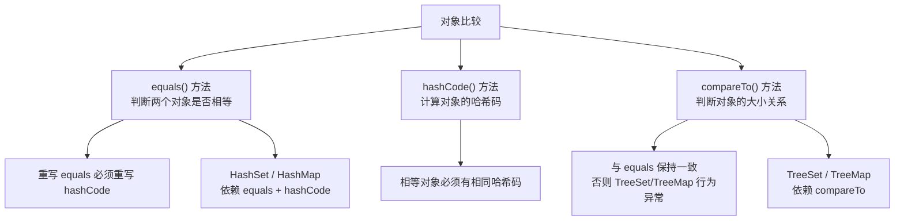

# 对象比较与排序

## 学习目标

- 掌握 `equals()` 的等价关系约定（自反/对称/传递/一致）与正确写法
- 理解 `equals` 与 `hashCode` 的协定：相等对象必须同哈希码，反之不要求
- 区分 `Comparable`（自然排序，内置于类）与 `Comparator`（外部比较器）的使用场景
- 保证 `compareTo` 与 `equals` 的一致性，避免放入有序集合时出现逻辑矛盾
- 识别浮点比较、null 安全、可变对象用作键等易错点

## 概述

在 Java 开发中,对象比较和集合边界问题是最容易被忽视却又最容易引发 bug 的领域。很多开发者能够熟练使用 `equals`、`hashCode`、`compareTo` 等方法,却并不真正理解它们的内在机制和设计原则。



常见的问题表现包括:
- `HashSet` 无法正确去重
- `HashMap` 的 `containsKey` 判断不准确  
- `TreeSet` 排序结果异常
- 对象作为 Map 的 key 时出现莫名其妙的 null 值

这些问题的根源通常在于:
- 混淆 `==` 和 `equals` 的使用场景
- 重写 `equals` 时忘记重写 `hashCode`
- 比较器设计与业务语义不一致
- 可变对象作为集合元素或 key

本文将深入剖析对象比较的底层机制、哈希集合的工作原理,以及有序集合的边界行为,帮助你彻底理解这些核心概念,避免在实际开发中踩坑。

---

## 一、对象比较的本质

### 1.1 `==` 与 `equals` 的本质区别

#### `==` 运算符

`==` 是 Java 的基本运算符,用于比较两个值是否相等。其行为取决于操作数的类型:

**对于基本类型**:比较的是值本身

```java
public class PrimitiveComparison {
    public static void main(String[] args) {
        // 基本类型比较的是值
        int a = 10;
        int b = 10;
        System.out.println(a == b);  // true
        
        double x = 3.14;
        double y = 3.14;
        System.out.println(x == y);  // true
        
        // 特殊情况：NaN
        double nan1 = Double.NaN;
        double nan2 = Double.NaN;
        System.out.println(nan1 == nan2);  // false！NaN 不等于任何值,包括它自己
        System.out.println(Double.isNaN(nan1) && Double.isNaN(nan2));  // true
    }
}
```

**对于引用类型**:比较的是内存地址(引用)

```java
public class ReferenceComparison {
    public static void main(String[] args) {
        // 引用类型比较的是地址
        String s1 = new String("hello");
        String s2 = new String("hello");
        String s3 = s1;
        
        System.out.println(s1 == s2);  // false（不同对象,地址不同）
        System.out.println(s1 == s3);  // true（同一个对象,地址相同）
        
        // 字符串池的特殊情况
        String s4 = "hello";
        String s5 = "hello";
        System.out.println(s4 == s5);  // true（字符串池中的同一个对象）
        
        // 演示对象地址
        System.out.println("s1 的地址: " + System.identityHashCode(s1));
        System.out.println("s2 的地址: " + System.identityHashCode(s2));
        System.out.println("s3 的地址: " + System.identityHashCode(s3));
    }
}
```

#### `equals` 方法

`equals` 是 `Object` 类定义的方法,默认实现也是比较地址,但可以被重写以定义"逻辑相等"。

```java
// Object 类中的默认实现
public boolean equals(Object obj) {
    return (this == obj);  // 默认比较地址
}
```

**重写 `equals` 的典型模式**:

```java
import java.util.Objects;

public class Person {
    private String name;
    private int age;
    private String idCard;
    
    public Person(String name, int age, String idCard) {
        this.name = name;
        this.age = age;
        this.idCard = idCard;
    }
    
    @Override
    public boolean equals(Object obj) {
        // 1. 自反性检查：自己和自己比较
        if (this == obj) return true;
        
        // 2. 空值检查：任何非空对象不等于 null
        if (obj == null) return false;
        
        // 3. 类型检查：确保是同一个类或其子类
        if (getClass() != obj.getClass()) return false;
        
        // 4. 类型转换
        Person other = (Person) obj;
        
        // 5. 字段比较：根据业务逻辑确定哪些字段决定相等性
        // 这里以身份证号作为唯一标识
        return Objects.equals(idCard, other.idCard);
    }
    
    // 演示：不同场景下的 equals 设计
    public static class Employee extends Person {
        private String employeeId;
        
        public Employee(String name, int age, String idCard, String employeeId) {
            super(name, age, idCard);
            this.employeeId = employeeId;
        }
        
        @Override
        public boolean equals(Object obj) {
            if (!super.equals(obj)) return false;
            Employee other = (Employee) obj;
            return Objects.equals(employeeId, other.employeeId);
        }
    }
    
    public static void main(String[] args) {
        Person p1 = new Person("张三", 25, "123456");
        Person p2 = new Person("李四", 30, "123456");
        Person p3 = new Person("张三", 25, "789012");
        
        System.out.println("p1 == p2: " + (p1 == p2));        // false
        System.out.println("p1.equals(p2): " + p1.equals(p2)); // true（身份证相同）
        System.out.println("p1.equals(p3): " + p1.equals(p3)); // false（身份证不同）
    }
}
```

### 1.2 `equals` 方法的契约(Contract)

重写 `equals` 方法必须遵守以下五条约定:

::::: info equals 方法的五大契约

1. **自反性(Reflexive)**: 对于任何非空引用 x,`x.equals(x)` 必须返回 true

```java
Person p = new Person("张三", 25, "123");
assertTrue(p.equals(p));  // 必须为 true
```

2. **对称性(Symmetric)**: 如果 `x.equals(y)` 返回 true,那么 `y.equals(x)` 也必须返回 true

```java
Person p1 = new Person("张三", 25, "123");
Person p2 = new Person("李四", 30, "123");
assertTrue(p1.equals(p2) == p2.equals(p1));  // 必须成立
```

3. **传递性(Transitive)**: 如果 `x.equals(y)` 为 true 且 `y.equals(z)` 为 true,那么 `x.equals(z)` 也必须为 true

```java
Person p1 = new Person("张三", 25, "123");
Person p2 = new Person("李四", 30, "123");
Person p3 = new Person("王五", 28, "123");
if (p1.equals(p2) && p2.equals(p3)) {
    assertTrue(p1.equals(p3));  // 必须为 true
}
```

4. **一致性(Consistent)**: 多次调用 `x.equals(y)` 应该返回相同的结果(前提是对象没有被修改)

```java
Person p1 = new Person("张三", 25, "123");
Person p2 = new Person("张三", 25, "123");
boolean first = p1.equals(p2);
boolean second = p1.equals(p2);
assertEquals(first, second);  // 必须相同
```

5. **非空性(Non-null)**: 对于任何非空引用 x,`x.equals(null)` 必须返回 false

```java
Person p = new Person("张三", 25, "123");
assertFalse(p.equals(null));  // 必须为 false
```

:::::

#### 违反契约的后果示例

```java
import java.util.*;

/**
 * 违反对称性的错误示例
 */
public class WrongEqualsExample {
    static class CaseInsensitiveString {
        private String value;
        
        public CaseInsensitiveString(String value) {
            this.value = value;
        }
        
        @Override
        public boolean equals(Object obj) {
            if (this == obj) return true;
            if (obj == null) return false;
            
            // × 错误：试图与普通 String 比较,破坏了对称性
            if (obj instanceof String) {
                return value.equalsIgnoreCase((String) obj);
            }
            
            if (obj instanceof CaseInsensitiveString) {
                return value.equalsIgnoreCase(((CaseInsensitiveString) obj).value);
            }
            
            return false;
        }
        
        public static void main(String[] args) {
            CaseInsensitiveString cis = new CaseInsensitiveString("hello");
            String s = "HELLO";
            
            System.out.println("cis.equals(s): " + cis.equals(s));  // true
            System.out.println("s.equals(cis): " + s.equals(cis));  // false！
            // 违反对称性！String 的 equals 不知道如何与 CaseInsensitiveString 比较
            
            // 这会导致在集合中出现异常行为
            List<CaseInsensitiveString> list = new ArrayList<>();
            list.add(cis);
            System.out.println("list contains s: " + list.contains(s));  // false
        }
    }
}
```

### 1.3 实际案例:自定义对象的正确比较

```java
import java.util.*;

/**
 * 完整示例：设计一个学生类,正确实现对象比较
 */
public class Student {
    private final String studentId;    // 学号（唯一标识）
    private String name;
    private int age;
    private String major;
    
    public Student(String studentId, String name, int age, String major) {
        this.studentId = Objects.requireNonNull(studentId, "学号不能为空");
        this.name = name;
        this.age = age;
        this.major = major;
    }
    
    // getter 方法
    public String getStudentId() { return studentId; }
    public String getName() { return name; }
    public int getAge() { return age; }
    public String getMajor() { return major; }
    
    // setter 方法（注意：studentId 是 final，不可修改）
    public void setName(String name) { this.name = name; }
    public void setAge(int age) { this.age = age; }
    public void setMajor(String major) { this.major = major; }
    
    @Override
    public boolean equals(Object obj) {
        if (this == obj) return true;
        if (obj == null || getClass() != obj.getClass()) return false;
        Student student = (Student) obj;
        return Objects.equals(studentId, student.studentId);
    }
    
    @Override
    public int hashCode() {
        return Objects.hash(studentId);
    }
    
    @Override
    public String toString() {
        return String.format("Student{id='%s', name='%s', age=%d, major='%s'}",
                           studentId, name, age, major);
    }
    
    public static void main(String[] args) {
        Student s1 = new Student("2023001", "张三", 20, "计算机");
        Student s2 = new Student("2023001", "李四", 21, "数学");
        Student s3 = new Student("2023002", "张三", 20, "计算机");
        
        // 比较示例
        System.out.println("s1.equals(s2): " + s1.equals(s2));  // true（学号相同）
        System.out.println("s1.equals(s3): " + s1.equals(s3));  // false（学号不同）
        System.out.println("s1 == s2: " + (s1 == s2));          // false（不同对象）
        
        // 集合中的应用
        Set<Student> students = new HashSet<>();
        students.add(s1);
        students.add(s2);  // 不会被添加（equals 判断相同）
        students.add(s3);
        
        System.out.println("学生数量: " + students.size());  // 2
        System.out.println("学生列表:");
        students.forEach(System.out::println);
    }
}
```

---

## 二、hashCode 的契约与集合行为

### 2.1 为什么 `hashCode` 必须和 `equals` 配套

`hashCode` 方法和 `equals` 方法之间存在强关联,这个关联来自于哈希集合(HashSet、HashMap等)的工作原理。

#### 哈希集合的工作机制

```
┌─────────────────────────────────────────────────────┐
│                  HashMap 存储结构                     │
├─────────────────────────────────────────────────────┤
│                                                     │
│  数组(桶)                                            │
│  ┌─────┐                                            │
│  │  0  │ → null                                     │
│  ├─────┤                                            │
│  │  1  │ → Node(key1, value1) → Node(key4, value4) │
│  ├─────┤                                            │
│  │  2  │ → null                                     │
│  ├─────┤                                            │
│  │  3  │ → Node(key2, value2)                      │
│  ├─────┤                                            │
│  │... │                                             │
│  └─────┘                                            │
│                                                     │
│  查找过程:                                            │
│  1. 计算 hashCode                                    │
│  2. 定位桶的位置                                      │
│  3. 遍历链表用 equals 比较                            │
└─────────────────────────────────────────────────────┘
```

#### hashCode 的查找流程

```java
public class HashMapLookupDemo {
    public static void main(String[] args) {
        Map<String, Integer> map = new HashMap<>();
        map.put("apple", 1);
        map.put("banana", 2);
        
        // 查找 "apple" 的过程:
        // 1. 计算 "apple".hashCode() = 93029210
        // 2. 扰动后计算桶的索引：(h ^ (h >>> 16)) & (n-1)，n=16 时结果为 1
        // 3. 在桶 1 的链表中查找
        // 4. 用 equals 比较每个节点的 key
        // 5. 找到匹配的节点，返回 value
        
        Integer value = map.get("apple");
        System.out.println("apple: " + value);
    }
}
```

### 2.2 hashCode 的契约

::::: info hashCode 方法的三大契约

1. **一致性**: 在对象未被修改的情况下,多次调用 `hashCode` 应该返回相同的值

```java
Person p = new Person("张三", 25, "123");
int code1 = p.hashCode();
int code2 = p.hashCode();
assertEquals(code1, code2);  // 必须相同
```

2. **相等对象的 hashCode 必须相同**: 如果 `a.equals(b)` 为 true,那么 `a.hashCode() == b.hashCode()` 必须为 true

```java
Person p1 = new Person("张三", 25, "123");
Person p2 = new Person("李四", 30, "123");
if (p1.equals(p2)) {
    assertEquals(p1.hashCode(), p2.hashCode());  // 必须成立
}
```

3. **不相等对象的 hashCode 可以相同**: 如果 `a.equals(b)` 为 false,`a.hashCode()` 和 `b.hashCode()` 可以相同(哈希冲突)

```java
String s1 = "Aa";
String s2 = "BB";
System.out.println(s1.equals(s2));  // false
System.out.println(s1.hashCode());  // 2112
System.out.println(s2.hashCode());  // 2112（哈希冲突）
```

:::::

### 2.3 只重写 equals 不重写 hashCode 的后果

#### 错误示例

```java
import java.util.*;

/**
 * × 错误示例：只重写 equals，不重写 hashCode
 */
public class WrongHashCodeExample {
    static class User {
        private String id;
        private String name;
        
        public User(String id, String name) {
            this.id = id;
            this.name = name;
        }
        
        @Override
        public boolean equals(Object obj) {
            if (this == obj) return true;
            if (obj == null || getClass() != obj.getClass()) return false;
            User user = (User) obj;
            return Objects.equals(id, user.id);
        }
        
        // × 没有重写 hashCode！使用 Object 默认实现（基于地址）
        
        public static void main(String[] args) {
            User u1 = new User("001", "张三");
            User u2 = new User("001", "李四");
            
            System.out.println("u1.equals(u2): " + u1.equals(u2));  // true
            System.out.println("u1.hashCode: " + u1.hashCode());    // 不同的值
            System.out.println("u2.hashCode: " + u2.hashCode());    // 不同的值
            
            // HashSet 去重失败
            Set<User> users = new HashSet<>();
            users.add(u1);
            users.add(u2);
            System.out.println("HashSet 大小: " + users.size());  // 2（期望是 1）
            
            // HashMap 查找失败
            Map<User, String> map = new HashMap<>();
            map.put(u1, "管理员");
            System.out.println("通过 u1 查找: " + map.get(u1));     // "管理员"
            System.out.println("通过 u2 查找: " + map.get(u2));     // null（找不到！）
        }
    }
}
```

#### 正确示例

```java
import java.util.*;

/**
 * √ 正确示例：同时重写 equals 和 hashCode
 */
public class CorrectHashCodeExample {
    static class User {
        private String id;
        private String name;
        
        public User(String id, String name) {
            this.id = id;
            this.name = name;
        }
        
        @Override
        public boolean equals(Object obj) {
            if (this == obj) return true;
            if (obj == null || getClass() != obj.getClass()) return false;
            User user = (User) obj;
            return Objects.equals(id, user.id);
        }
        
        @Override
        public int hashCode() {
            // 使用与 equals 相同的字段计算 hashCode
            return Objects.hash(id);
        }
        
        public static void main(String[] args) {
            User u1 = new User("001", "张三");
            User u2 = new User("001", "李四");
            
            System.out.println("u1.equals(u2): " + u1.equals(u2));  // true
            System.out.println("u1.hashCode: " + u1.hashCode());    // 相同的值
            System.out.println("u2.hashCode: " + u2.hashCode());    // 相同的值
            
            // HashSet 正确去重
            Set<User> users = new HashSet<>();
            users.add(u1);
            users.add(u2);
            System.out.println("HashSet 大小: " + users.size());  // 1（正确）
            
            // HashMap 正确查找
            Map<User, String> map = new HashMap<>();
            map.put(u1, "管理员");
            System.out.println("通过 u1 查找: " + map.get(u1));     // "管理员"
            System.out.println("通过 u2 查找: " + map.get(u2));     // "管理员"（正确）
        }
    }
}
```

### 2.4 hashCode 的最佳实践

#### 如何选择参与 hashCode 计算的字段

```java
import java.util.*;

public class HashCodeBestPractices {
    
    /**
     * 规则：只使用 equals 中参与比较的字段
     */
    static class Product {
        private String productId;      // 唯一标识
        private String name;           // 名称（可能修改）
        private double price;          // 价格（可能修改）
        private String category;       // 类别
        
        public Product(String productId, String name, double price, String category) {
            this.productId = productId;
            this.name = name;
            this.price = price;
            this.category = category;
        }
        
        @Override
        public boolean equals(Object obj) {
            if (this == obj) return true;
            if (obj == null || getClass() != obj.getClass()) return false;
            Product product = (Product) obj;
            return Objects.equals(productId, product.productId);
        }
        
        @Override
        public int hashCode() {
            // √ 只使用 productId，与 equals 保持一致
            return Objects.hash(productId);
            
            // × 错误：使用了可变字段
            // return Objects.hash(productId, name, price);
            // 如果 name 或 price 修改了，hashCode 会变化，导致集合行为异常
        }
    }
    
    /**
     * 多字段共同决定相等性
     */
    static class Order {
        private String orderNo;
        private String customerId;
        private Date createTime;
        
        public Order(String orderNo, String customerId, Date createTime) {
            this.orderNo = orderNo;
            this.customerId = customerId;
            this.createTime = createTime;
        }
        
        @Override
        public boolean equals(Object obj) {
            if (this == obj) return true;
            if (obj == null || getClass() != obj.getClass()) return false;
            Order order = (Order) obj;
            return Objects.equals(orderNo, order.orderNo) &&
                   Objects.equals(customerId, order.customerId);
        }
        
        @Override
        public int hashCode() {
            // 使用所有参与 equals 的字段
            return Objects.hash(orderNo, customerId);
        }
    }
}
```

#### 使用 IDE 生成 hashCode

现代 IDE(IntelliJ IDEA、Eclipse)可以自动生成规范的 equals 和 hashCode 方法:

```java
// IntelliJ IDEA 生成的代码示例
@Override
public boolean equals(Object o) {
    if (this == o) return true;
    if (o == null || getClass() != o.getClass()) return false;
    User user = (User) o;
    return Objects.equals(id, user.id) &&
           Objects.equals(name, user.name);
}

@Override
public int hashCode() {
    return Objects.hash(id, name);
}
```

---

## 三、有序集合与比较器

### 3.1 TreeSet 和 TreeMap 的排序机制

TreeSet 和 TreeMap 是基于红黑树实现的有序集合,它们依赖元素的自然顺序或自定义比较器。

#### 自然顺序(Natural Ordering)

```java
import java.util.*;

public class NaturalOrderingDemo {
    public static void main(String[] args) {
        // TreeSet 使用自然顺序排序
        TreeSet<Integer> numbers = new TreeSet<>();
        numbers.add(5);
        numbers.add(1);
        numbers.add(3);
        numbers.add(2);
        numbers.add(4);
        
        System.out.println("排序后: " + numbers);  // [1, 2, 3, 4, 5]
        
        // TreeSet 按字符串字典序排序
        TreeSet<String> words = new TreeSet<>();
        words.add("banana");
        words.add("apple");
        words.add("cherry");
        
        System.out.println("字典序: " + words);  // [apple, banana, cherry]
        
        // 自定义对象必须实现 Comparable 接口
        TreeSet<Person> people = new TreeSet<>();
        people.add(new Person("张三", 25));
        people.add(new Person("李四", 20));
        people.add(new Person("王五", 30));
        
        System.out.println("按年龄排序:");
        people.forEach(System.out::println);
    }
    
    static class Person implements Comparable<Person> {
        String name;
        int age;
        
        Person(String name, int age) {
            this.name = name;
            this.age = age;
        }
        
        @Override
        public int compareTo(Person other) {
            // 按年龄排序
            return Integer.compare(this.age, other.age);
        }
        
        @Override
        public String toString() {
            return name + "(" + age + ")";
        }
    }
}
```

#### 自定义比较器(Comparator)

```java
import java.util.*;

public class ComparatorDemo {
    public static void main(String[] args) {
        // 使用 Comparator 定义多种排序规则
        List<Student> students = Arrays.asList(
            new Student("张三", 20, 85),
            new Student("李四", 22, 90),
            new Student("王五", 20, 88),
            new Student("赵六", 21, 85)
        );
        
        // 1. 按年龄排序
        students.stream()
                .sorted(Comparator.comparing(Student::getAge))
                .forEach(System.out::println);
        
        System.out.println("\n--- 按成绩降序 ---");
        // 2. 按成绩降序
        students.stream()
                .sorted(Comparator.comparing(Student::getScore).reversed())
                .forEach(System.out::println);
        
        System.out.println("\n--- 按年龄和成绩排序 ---");
        // 3. 多级排序：先按年龄，再按成绩
        students.stream()
                .sorted(Comparator.comparing(Student::getAge)
                                  .thenComparing(Student::getScore))
                .forEach(System.out::println);
        
        System.out.println("\n--- 自定义比较器 ---");
        // 4. 自定义复杂比较器
        TreeSet<Student> studentSet = new TreeSet<>((s1, s2) -> {
            int ageCompare = Integer.compare(s1.getAge(), s2.getAge());
            if (ageCompare != 0) return ageCompare;
            return Integer.compare(s1.getScore(), s2.getScore());
        });
        
        studentSet.addAll(students);
        studentSet.forEach(System.out::println);
    }
    
    static class Student {
        private String name;
        private int age;
        private int score;
        
        public Student(String name, int age, int score) {
            this.name = name;
            this.age = age;
            this.score = score;
        }
        
        public String getName() { return name; }
        public int getAge() { return age; }
        public int getScore() { return score; }
        
        @Override
        public String toString() {
            return name + "(年龄:" + age + ", 成绩:" + score + ")";
        }
    }
}
```

### 3.2 compareTo 与 equals 的一致性问题

#### 问题示例:compareTo 与 equals 不一致

```java
import java.util.*;

/**
 * 危险示例：compareTo 与 equals 不一致
 */
public class InconsistentCompareTo {
    static class Student implements Comparable<Student> {
        private String name;
        private int score;
        
        public Student(String name, int score) {
            this.name = name;
            this.score = score;
        }
        
        // equals 比较姓名和成绩
        @Override
        public boolean equals(Object obj) {
            if (this == obj) return true;
            if (obj == null || getClass() != obj.getClass()) return false;
            Student student = (Student) obj;
            return score == student.score && Objects.equals(name, student.name);
        }
        
        @Override
        public int hashCode() {
            return Objects.hash(name, score);
        }
        
        // compareTo 只比较成绩
        @Override
        public int compareTo(Student other) {
            return Integer.compare(this.score, other.score);
        }
        
        @Override
        public String toString() {
            return name + "(" + score + ")";
        }
        
        public static void main(String[] args) {
            Student s1 = new Student("张三", 85);
            Student s2 = new Student("李四", 85);
            
            System.out.println("s1.equals(s2): " + s1.equals(s2));  // false
            System.out.println("s1.compareTo(s2) == 0: " + (s1.compareTo(s2) == 0));  // true
            
            // TreeSet 行为异常
            TreeSet<Student> set = new TreeSet<>();
            set.add(s1);
            set.add(s2);
            
            System.out.println("TreeSet 大小: " + set.size());  // 1（期望是 2）
            System.out.println("TreeSet 内容: " + set);          // 只有一个元素
            
            // HashSet 行为正常
            Set<Student> hashSet = new HashSet<>();
            hashSet.add(s1);
            hashSet.add(s2);
            System.out.println("HashSet 大小: " + hashSet.size());  // 2（正确）
        }
    }
}
```

#### 正确的做法

```java
import java.util.*;

/**
 * √ 正确示例：compareTo 与 equals 保持一致
 */
public class ConsistentCompareTo {
    static class Student implements Comparable<Student> {
        private String name;
        private int score;
        
        public Student(String name, int score) {
            this.name = name;
            this.score = score;
        }
        
        // equals 比较姓名和成绩
        @Override
        public boolean equals(Object obj) {
            if (this == obj) return true;
            if (obj == null || getClass() != obj.getClass()) return false;
            Student student = (Student) obj;
            return score == student.score && Objects.equals(name, student.name);
        }
        
        @Override
        public int hashCode() {
            return Objects.hash(name, score);
        }
        
        // compareTo 也比较姓名和成绩
        @Override
        public int compareTo(Student other) {
            int scoreCompare = Integer.compare(this.score, other.score);
            if (scoreCompare != 0) return scoreCompare;
            return this.name.compareTo(other.name);
        }
        
        @Override
        public String toString() {
            return name + "(" + score + ")";
        }
        
        public static void main(String[] args) {
            Student s1 = new Student("张三", 85);
            Student s2 = new Student("李四", 85);
            
            System.out.println("s1.equals(s2): " + s1.equals(s2));  // false
            System.out.println("s1.compareTo(s2) == 0: " + (s1.compareTo(s2) == 0));  // false
            
            // TreeSet 行为正确
            TreeSet<Student> set = new TreeSet<>();
            set.add(s1);
            set.add(s2);
            
            System.out.println("TreeSet 大小: " + set.size());  // 2（正确）
            System.out.println("TreeSet 内容: " + set);          // [张三(85), 李四(85)]
        }
    }
}
```

### 3.3 TreeSet 和 HashSet 的去重机制对比

```java
import java.util.*;

/**
 * 对比 TreeSet 和 HashSet 的去重机制
 */
public class SetComparison {
    static class Person implements Comparable<Person> {
        private String name;
        private int age;
        
        public Person(String name, int age) {
            this.name = name;
            this.age = age;
        }
        
        @Override
        public boolean equals(Object obj) {
            if (this == obj) return true;
            if (obj == null || getClass() != obj.getClass()) return false;
            Person person = (Person) obj;
            return age == person.age && Objects.equals(name, person.name);
        }
        
        @Override
        public int hashCode() {
            return Objects.hash(name, age);
        }
        
        // 只比较年龄
        @Override
        public int compareTo(Person other) {
            return Integer.compare(this.age, other.age);
        }
        
        @Override
        public String toString() {
            return name + "(" + age + ")";
        }
        
        public static void main(String[] args) {
            Person p1 = new Person("张三", 20);
            Person p2 = new Person("李四", 20);
            Person p3 = new Person("王五", 25);
            
            System.out.println("=== HashSet (基于 equals 和 hashCode) ===");
            Set<Person> hashSet = new HashSet<>();
            hashSet.add(p1);
            hashSet.add(p2);
            hashSet.add(p3);
            System.out.println("大小: " + hashSet.size());  // 3
            System.out.println("内容: " + hashSet);
            
            System.out.println("\n=== TreeSet (基于 compareTo) ===");
            Set<Person> treeSet = new TreeSet<>();
            treeSet.add(p1);
            treeSet.add(p2);  // 不会被添加（compareTo 返回 0）
            treeSet.add(p3);
            System.out.println("大小: " + treeSet.size());  // 2
            System.out.println("内容: " + treeSet);
        }
    }
}
```

::::: warning TreeSet 去重规则

TreeSet 使用 `compareTo` 方法判断元素是否相等,而不是 `equals` 方法:
- 如果 `compareTo` 返回 0,TreeSet 认为两个元素相等,不会添加
- 这可能导致与 HashSet 不同的去重行为

**建议**:
- 实现 `Comparable` 时,确保 `compareTo` 与 `equals` 保持一致
- 或者明确文档说明 TreeSet 的行为与 HashSet 不同

:::::

---

## 四、可变对象作为集合元素的风险

### 4.1 可变对象作为 Map key 的问题

```java
import java.util.*;

/**
 * 危险示例：可变对象作为 Map key
 */
public class MutableKeyProblem {
    static class Student {
        private String id;
        private String name;
        
        public Student(String id, String name) {
            this.id = id;
            this.name = name;
        }
        
        public void setName(String name) {
            this.name = name;
        }
        
        // × 危险：使用了可变字段 name
        @Override
        public boolean equals(Object obj) {
            if (this == obj) return true;
            if (obj == null || getClass() != obj.getClass()) return false;
            Student student = (Student) obj;
            return Objects.equals(id, student.id) && Objects.equals(name, student.name);
        }
        
        @Override
        public int hashCode() {
            return Objects.hash(id, name);
        }
        
        @Override
        public String toString() {
            return name + "(" + id + ")";
        }
        
        public static void main(String[] args) {
            Map<Student, String> map = new HashMap<>();
            
            Student student = new Student("001", "张三");
            map.put(student, "计算机专业");
            
            System.out.println("修改前: " + map.get(student));  // "计算机专业"
            
            // × 危险：修改了参与 hashCode 计算的字段
            student.setName("李四");
            
            System.out.println("修改后: " + map.get(student));  // null！
            // hashCode 已经变化,找不到原来的桶了
            
            // 遍历仍然可以找到（但这是一个 bug）
            map.forEach((k, v) -> System.out.println(k + " -> " + v));
            // 输出: 李四(001) -> 计算机专业
        }
    }
}
```

### 4.2 正确的做法:使用不可变对象

```java
import java.util.*;

/**
 * √ 正确示例：使用不可变对象作为 key
 */
public class ImmutableKeySolution {
    static final class StudentKey {
        private final String id;    // final 确保不可变
        private final String name;  // final 确保不可变
        
        public StudentKey(String id, String name) {
            this.id = Objects.requireNonNull(id);
            this.name = Objects.requireNonNull(name);
        }
        
        public String getId() { return id; }
        public String getName() { return name; }
        
        @Override
        public boolean equals(Object obj) {
            if (this == obj) return true;
            if (obj == null || getClass() != obj.getClass()) return false;
            StudentKey that = (StudentKey) obj;
            return id.equals(that.id) && name.equals(that.name);
        }
        
        @Override
        public int hashCode() {
            return Objects.hash(id, name);
        }
        
        @Override
        public String toString() {
            return name + "(" + id + ")";
        }
    }
    
    public static void main(String[] args) {
        Map<StudentKey, String> map = new HashMap<>();
        
        StudentKey key = new StudentKey("001", "张三");
        map.put(key, "计算机专业");
        
        System.out.println("查找结果: " + map.get(key));  // "计算机专业"
        
        // 无法修改 key 的字段,保证了安全性
        // key.setName("李四");  // 编译错误,没有 setter
    }
}
```

---

## 五、实战案例与排查思路

### 5.1 案例 1: HashSet 去重失败

#### 问题代码

```java
import java.util.*;

public class HashSetDuplicateProblem {
    static class User {
        private String id;
        private String name;
        
        public User(String id, String name) {
            this.id = id;
            this.name = name;
        }
        
        // 只重写了 equals
        @Override
        public boolean equals(Object obj) {
            if (this == obj) return true;
            if (obj == null || getClass() != obj.getClass()) return false;
            User user = (User) obj;
            return Objects.equals(id, user.id);
        }
        
        // 没有重写 hashCode
        
        public static void main(String[] args) {
            Set<User> users = new HashSet<>();
            users.add(new User("001", "张三"));
            users.add(new User("001", "李四"));
            
            System.out.println("用户数量: " + users.size());  // 2（期望 1）
        }
    }
}
```

#### 排查步骤

1. 检查是否重写了 `equals` 方法
2. 检查是否同时重写了 `hashCode` 方法
3. 确认 `hashCode` 使用的字段与 `equals` 一致

#### 修复方案

```java
@Override
public int hashCode() {
    return Objects.hash(id);  // 使用与 equals 相同的字段
}
```

### 5.2 案例 2: TreeMap 排序异常

#### 问题代码

```java
import java.util.*;

public class TreeMapSortProblem {
    static class Product implements Comparable<Product> {
        private String name;
        private double price;
        
        public Product(String name, double price) {
            this.name = name;
            this.price = price;
        }
        
        // equals 比较名称和价格
        @Override
        public boolean equals(Object obj) {
            if (this == obj) return true;
            if (obj == null || getClass() != obj.getClass()) return false;
            Product product = (Product) obj;
            return Double.compare(product.price, price) == 0 &&
                   Objects.equals(name, product.name);
        }
        
        // compareTo 只比较价格
        @Override
        public int compareTo(Product other) {
            return Double.compare(this.price, other.price);
        }
        
        public static void main(String[] args) {
            TreeMap<Product, Integer> inventory = new TreeMap<>();
            inventory.put(new Product("苹果", 5.0), 100);
            inventory.put(new Product("香蕉", 5.0), 200);  // 价格相同,被判定为相同 key
            
            System.out.println("商品数量: " + inventory.size());  // 1（期望 2）
        }
    }
}
```

#### 排查步骤

1. 检查 `compareTo` 方法是否与 `equals` 一致
2. 确认排序规则是否符合业务需求
3. 考虑是否应该使用 Comparator 而不是 Comparable

#### 修复方案

```java
@Override
public int compareTo(Product other) {
    int priceCompare = Double.compare(this.price, other.price);
    if (priceCompare != 0) return priceCompare;
    return this.name.compareTo(other.name);  // 增加名称比较
}
```

### 5.3 案例 3: HashMap 查找失败

#### 问题代码

```java
import java.util.*;

public class HashMapLookupProblem {
    static class Key {
        private String value;
        
        public Key(String value) {
            this.value = value;
        }
        
        public void setValue(String value) {
            this.value = value;
        }
        
        @Override
        public boolean equals(Object obj) {
            if (this == obj) return true;
            if (obj == null || getClass() != obj.getClass()) return false;
            Key key = (Key) obj;
            return Objects.equals(value, key.value);
        }
        
        @Override
        public int hashCode() {
            return Objects.hash(value);
        }
        
        public static void main(String[] args) {
            Map<Key, String> map = new HashMap<>();
            Key key = new Key("abc");
            map.put(key, "数据");
            
            System.out.println("修改前: " + map.get(key));  // "数据"
            
            // 修改 key 的字段
            key.setValue("xyz");
            
            System.out.println("修改后: " + map.get(key));  // null
        }
    }
}
```

#### 排查步骤

1. 确认 key 对象是否可变
2. 检查 key 是否在放入 Map 后被修改
3. 检查参与 hashCode 计算的字段是否发生变化

#### 修复方案

```java
// 方案 1: 使用不可变对象
static final class Key {
    private final String value;  // final
    
    public Key(String value) {
        this.value = value;
    }
    
    // 移除 setter
}
```

---

## 六、最佳实践总结

### 6.1 equals 和 hashCode 的设计原则

::::: tip 核心原则

1. **成对重写**: 重写 `equals` 必须同时重写 `hashCode`
2. **字段一致**: 两个方法使用相同的字段
3. **不可变字段**: 优先使用不可变字段参与计算
4. **IDE 生成**: 使用 IDE 自动生成,避免手写错误
5. **单元测试**: 编写单元测试验证契约

:::::

### 6.2 集合选择的指导原则

| 需求 | 推荐集合 | 去重依据 | 排序依据 |
|------|---------|---------|---------|
| 去重,不关心顺序 | HashSet | equals + hashCode | - |
| 去重 + 排序 | TreeSet | compareTo | compareTo |
| 快速查找 | HashMap | equals + hashCode | - |
| 排序 Map | TreeMap | compareTo | compareTo |
| 并发安全 | ConcurrentHashMap | equals + hashCode | - |

### 6.3 对象比较的完整示例

```java
import java.util.*;

/**
 * 完整示例：设计一个规范的实体类
 */
public final class Product implements Comparable<Product> {
    // 1. 使用 final 字段确保不可变
    private final String productId;
    private final String name;
    private final double price;
    private final String category;
    
    public Product(String productId, String name, double price, String category) {
        this.productId = Objects.requireNonNull(productId, "商品ID不能为空");
        this.name = Objects.requireNonNull(name, "商品名称不能为空");
        this.price = price;
        this.category = Objects.requireNonNull(category, "商品类别不能为空");
    }
    
    // 只提供 getter,不提供 setter
    public String getProductId() { return productId; }
    public String getName() { return name; }
    public double getPrice() { return price; }
    public String getCategory() { return category; }
    
    // 2. equals 方法
    @Override
    public boolean equals(Object obj) {
        if (this == obj) return true;
        if (obj == null || getClass() != obj.getClass()) return false;
        Product product = (Product) obj;
        return productId.equals(product.productId);
    }
    
    // 3. hashCode 方法
    @Override
    public int hashCode() {
        return productId.hashCode();  // 只使用 productId
    }
    
    // 4. compareTo 方法（与 equals 一致）
    @Override
    public int compareTo(Product other) {
        return this.productId.compareTo(other.productId);
    }
    
    @Override
    public String toString() {
        return String.format("Product{id='%s', name='%s', price=%.2f, category='%s'}",
                           productId, name, price, category);
    }
    
    public static void main(String[] args) {
        // 测试 HashSet
        Set<Product> hashSet = new HashSet<>();
        hashSet.add(new Product("P001", "苹果", 5.0, "水果"));
        hashSet.add(new Product("P001", "红富士", 6.0, "水果"));  // 不会被添加
        hashSet.add(new Product("P002", "香蕉", 3.0, "水果"));
        
        System.out.println("HashSet 大小: " + hashSet.size());  // 2
        
        // 测试 TreeSet
        Set<Product> treeSet = new TreeSet<>();
        treeSet.addAll(hashSet);
        System.out.println("TreeSet 大小: " + treeSet.size());  // 2
        
        // 测试 HashMap
        Map<Product, Integer> inventory = new HashMap<>();
        inventory.put(new Product("P001", "苹果", 5.0, "水果"), 100);
        inventory.put(new Product("P001", "红富士", 6.0, "水果"), 200);  // 覆盖
        
        System.out.println("库存数量: " + inventory.size());  // 1
        System.out.println("P001 库存: " + inventory.get(new Product("P001", "任意", 0, "任意")));  // 200
    }
}
```

---

## 七、常见问题与面试要点

### 7.1 常见问题

#### 问题 1: 为什么重写 equals 必须重写 hashCode?

**回答**: 因为 Java 规定,如果两个对象 equals 相等,它们的 hashCode 必须相等。如果只重写 equals 而不重写 hashCode,会导致两个"相等"的对象有不同的 hashCode,破坏了哈希集合(HashSet、HashMap)的工作机制。

#### 问题 2: hashCode 相等的对象一定 equals 吗?

**回答**: 不一定。hashCode 相等只说明两个对象在同一个桶中,还需要用 equals 进一步比较。这叫"哈希冲突"。

#### 问题 3: TreeSet 和 HashSet 的去重机制有什么不同?

**回答**: 
- HashSet 使用 equals 和 hashCode 判断相等
- TreeSet 使用 compareTo 判断相等
- 如果 compareTo 与 equals 不一致,会导致两个集合的去重行为不同

#### 问题 4: 为什么不可变对象更适合作为 Map 的 key?

**回答**: 
1. 防止在放入 Map 后修改字段,导致 hashCode 变化
2. 确保多次获取同一个 key 的值
3. 线程安全
4. 避免内存泄漏

### 7.2 面试题精选

#### 题目 1: 实现一个 Student 类

```java
/**
 * 面试题:实现一个 Student 类,要求:
 * 1. 学号相同即视为同一个学生
 * 2. 可以放入 HashSet 和 TreeSet
 * 3. 按学号排序
 */
public final class Student implements Comparable<Student> {
    private final String studentId;
    private String name;
    private int age;
    
    public Student(String studentId, String name, int age) {
        this.studentId = Objects.requireNonNull(studentId);
        this.name = name;
        this.age = age;
    }
    
    @Override
    public boolean equals(Object obj) {
        if (this == obj) return true;
        if (obj == null || getClass() != obj.getClass()) return false;
        Student student = (Student) obj;
        return studentId.equals(student.studentId);
    }
    
    @Override
    public int hashCode() {
        return studentId.hashCode();
    }
    
    @Override
    public int compareTo(Student other) {
        return this.studentId.compareTo(other.studentId);
    }
    
    // getter 和 setter...
}
```

#### 题目 2: 判断以下代码的输出

```java
Set<String> set = new HashSet<>();
String s1 = new String("hello");
String s2 = new String("hello");
set.add(s1);
set.add(s2);
System.out.println(set.size());  // 输出: ?

// 答案: 1
// 原因: String 重写了 equals 和 hashCode,内容相同则相等
```

#### 题目 3: 设计一个缓存 key

```java
/**
 * 需求:设计一个缓存 key,包含 userId 和 timestamp
 * 要求:两个 key 相同当且仅当 userId 相同
 */
public final class CacheKey {
    private final String userId;
    private final long timestamp;
    
    public CacheKey(String userId) {
        this.userId = Objects.requireNonNull(userId);
        this.timestamp = System.currentTimeMillis();
    }
    
    @Override
    public boolean equals(Object obj) {
        if (this == obj) return true;
        if (obj == null || getClass() != obj.getClass()) return false;
        CacheKey cacheKey = (CacheKey) obj;
        return userId.equals(cacheKey.userId);
    }
    
    @Override
    public int hashCode() {
        return userId.hashCode();
    }
}
```

---

## 总结

对象比较和集合边界是 Java 开发中的核心基础,掌握这些知识对于编写高质量的代码至关重要:

**核心要点**:
1. 理解 `==` 和 `equals` 的本质区别
2. 掌握 `hashCode` 与 `equals` 的契约关系
3. 了解不同集合的去重机制
4. 避免可变对象作为集合元素或 Map key
5. 保持 `compareTo` 与 `equals` 的一致性

**最佳实践**:
1. 成对重写 `equals` 和 `hashCode`
2. 使用不可变对象作为集合元素
3. 优先使用 IDE 生成的方法
4. 编写单元测试验证行为
5. 根据业务需求选择合适的集合类型

通过深入理解这些机制,你将能够避免常见的 bug,编写出更加健壮和可维护的代码。

---

**参考资源**:
- [Effective Java (Joshua Bloch) - 第3章](https://www.oreilly.com/library/view/effective-java/9780134686097/)
- [Java Platform Standard Edition Documentation](https://docs.oracle.com/javase/10/docs/api/java/lang/Object.html)
- [Java 集合框架源码](https://github.com/openjdk/jdk)

## 面试要点

1. **equals 与 hashCode 的协定？** 相等对象必须 hashCode 相等；hashCode 相等对象未必 equals（哈希冲突）。
2. **只重写 equals 不重写 hashCode 会怎样？** 对象放入 HashSet/HashMap 时按 hashCode 分桶，相等对象可能落入不同桶，导致集合出现重复元素。
3. **Comparable 与 Comparator 区别？** Comparable 是类的自然排序（内部实现 compareTo）；Comparator 是外部比较器，可灵活切换多种排序规则。
4. **compareTo 与 equals 不一致的后果？** 有序集合（TreeSet）以 compareTo==0 判定重复，若与 equals 矛盾，会出现 equals 不等却被视为同一元素。
5. **重写 equals 的注意点？** 遵守自反/对称/传递/一致，且 `equals(null)` 返回 false；建议用 `Objects.equals` 避免 NPE。

## 版本差异(旧版 → Java 21)

| 特性 | 旧版(Java 8) | Java 16/21 |
|------|--------------|------------|
| 值对象 equals/hashCode | 手写样板代码，易出错 | `record`（Java 16 正式）自动基于组件生成，天然一致 |
| 空安全比较 | `Objects.equals`（Java 7） | 不变；record 组件的 equals 同样空安全 |
| 排序比较 | `Comparator.comparing` 链式（Java 8） | 不变（`Comparator.naturalOrder`、`Objects.compare` 均为 Java 8 已有） |
| 最佳实践 | 手动实现契约 | 优先 record 承载值对象，模式匹配（Java 21）简化判型分发 |

## 继续阅读

- 上一章：[Set 与 Map](12-Set与Map)
- 下一章：[泛型与枚举](14-泛型与枚举)
