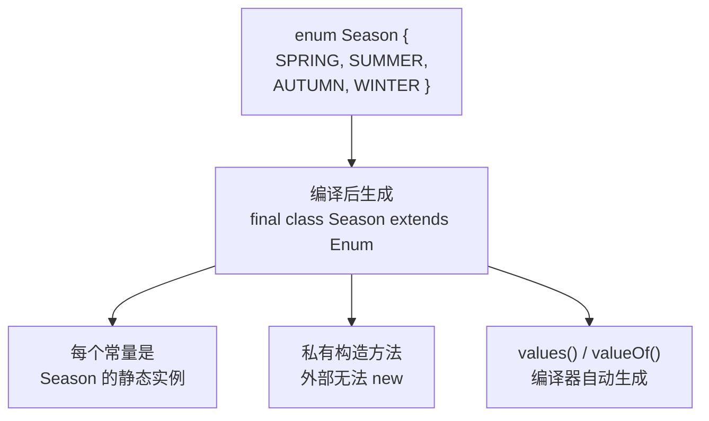

# 枚举类型和泛型

## 学习目标

- 理解泛型的目的（编译期类型安全、消除强制转换）与类型擦除机制
- 掌握泛型类/方法/接口的定义与边界通配符 extend/super（PECS）
- 区分枚举的本质（final 类 + 私有构造 + 静态实例）与枚举的高级用法
- 理解桥接方法(bridge method)与擦除后类型强转的代价
- 识别泛型不可用于基本类型、不能 new T[]、异常类不能泛型等约束

::: tip 核心概念
枚举类型为常量定义提供类型安全,泛型为代码重用提供类型参数化机制。两者都是 Java 类型系统的重要组成部分,掌握它们能显著提升代码质量。
:::

## 一、枚举类型

### 1.1 什么是枚举



枚举(Enumeration)是一种特殊的数据类型,用于定义一组固定的命名常量。Java 在 Java 5 中引入了 `enum` 关键字,使枚举成为一等公民。

**为什么需要枚举?**

在枚举出现之前,开发者常用以下方式定义常量:

```java
// 传统常量定义方式(不推荐)
public class WeekDay {
    public static final int MONDAY = 1;
    public static final int TUESDAY = 2;
    public static final int WEDNESDAY = 3;
    // ...
}

// 使用时的问题
int day = 1;
if (day == WeekDay.MONDAY) {
    System.out.println("星期一");
}

// 问题1: 类型不安全 - 可以传入任意值
int day = 100; // 编译通过,但逻辑错误

// 问题2: 可读性差 - 输出的是数字,不直观
System.out.println(day); // 输出: 1
```

**枚举的优势:**

```java
// 使用枚举定义
public enum Day {
    MONDAY, TUESDAY, WEDNESDAY, THURSDAY, FRIDAY, SATURDAY, SUNDAY
}

// 使用枚举
Day day = Day.MONDAY;
System.out.println(day); // 输出: MONDAY

// 编译时类型检查,防止错误
// Day wrongDay = 100; // 编译错误
// Day wrongDay = "MONDAY"; // 编译错误
```

**枚举的核心作用:**

| 作用 | 说明 | 示例 |
|------|------|------|
| 类型安全 | 编译时检查类型,防止非法值 | `Day day = Day.MONDAY;` |
| 可读性强 | 常量有明确的名称 | `if (status == OrderStatus.PENDING)` |
| 功能丰富 | 可包含字段、方法、构造器 | 带属性的枚举常量 |
| 单例保证 | JVM 保证每个枚举常量唯一实例 | 可用于实现单例模式 |

### 1.2 枚举的定义与使用

#### 基本语法

```java
// 最简单的枚举定义
public enum Season {
    SPRING, SUMMER, AUTUMN, WINTER
}

// 使用枚举
public class EnumBasic {
    public static void main(String[] args) {
        Season season = Season.SPRING;
        System.out.println("当前季节: " + season);
        System.out.println("枚举名称: " + season.name());      // SPRING
        System.out.println("枚举序号: " + season.ordinal());   // 0
    }
}
```

#### 枚举的本质

枚举本质上是一个继承自 `java.lang.Enum` 的类:

```java
// 编译器将枚举转换为类似以下形式
public final class Season extends Enum<Season> {
    public static final Season SPRING = new Season("SPRING", 0);
    public static final Season SUMMER = new Season("SUMMER", 1);
    public static final Season AUTUMN = new Season("AUTUMN", 2);
    public static final Season WINTER = new Season("WINTER", 3);
    
    private Season(String name, int ordinal) {
        super(name, ordinal);
    }
    
    public static Season[] values() {
        return new Season[] {SPRING, SUMMER, AUTUMN, WINTER};
    }
    
    public static Season valueOf(String name) {
        // 根据名称返回对应的枚举常量
    }
}
```

**重要结论:**
- 枚举不能继承其他类(已隐式继承 `Enum`)
- 枚举可以实现接口
- 枚举常量在 JVM 中是单例的,可以用 `==` 比较

### 1.3 枚举的构造器与字段

枚举可以包含字段、构造器和方法,使每个枚举常量拥有不同的属性和行为。

#### 带属性的枚举

```java
public enum Planet {
    // 枚举常量(必须最先定义,用分号结束)
    MERCURY(3.303e+23, 2.4397e6),
    VENUS(4.869e+24, 6.0518e6),
    EARTH(5.976e+24, 6.37814e6),
    MARS(6.421e+23, 3.3972e6),
    JUPITER(1.9e+27, 7.1492e7);
    
    // 实例字段
    private final double mass;   // 质量(kg)
    private final double radius; // 半径(m)
    
    // 构造器(默认为 private,只能由枚举常量调用)
    Planet(double mass, double radius) {
        this.mass = mass;
        this.radius = radius;
    }
    
    // 实例方法
    public double getMass() { return mass; }
    public double getRadius() { return radius; }
    
    // 计算表面重力
    public double surfaceGravity() {
        final double G = 6.67300E-11;
        return G * mass / (radius * radius);
    }
    
    // 计算物体在该行星上的重量
    public double surfaceWeight(double otherMass) {
        return otherMass * surfaceGravity();
    }
}

// 使用示例
public class PlanetTest {
    public static void main(String[] args) {
        double earthWeight = 75.0; // 地球上的体重(kg)
        
        for (Planet planet : Planet.values()) {
            System.out.printf("在%s上的体重: %.2f kg%n",
                planet, planet.surfaceWeight(earthWeight));
        }
    }
}
```

#### 枚举构造器的规则

```java
public enum Color {
    RED("红色", 1),
    GREEN("绿色", 2),
    BLUE("蓝色", 3);
    
    private String name;
    private int code;
    
    // 规则1: 构造器默认且必须是 private
    // 规则2: 构造器在枚举常量创建时自动调用
    // 规则3: 不能使用 new 创建枚举实例
    Color(String name, int code) {
        this.name = name;
        this.code = code;
    }
    
    // 错误示例: 不能在外部创建枚举实例
    // Color c = new Color("紫色", 4); // 编译错误
}
```

### 1.4 枚举的方法

#### 内置方法

```java
public class EnumMethods {
    public static void main(String[] args) {
        // 1. values() - 获取所有枚举常量
        Day[] days = Day.values();
        System.out.println("所有枚举常量:");
        for (Day day : days) {
            System.out.println("  " + day);
        }
        
        // 2. valueOf(String) - 根据名称获取枚举常量
        Day monday = Day.valueOf("MONDAY");
        System.out.println("\nvalueOf结果: " + monday);
        
        // 3. name() - 获取枚举常量的名称
        System.out.println("name(): " + monday.name()); // MONDAY
        
        // 4. ordinal() - 获取枚举常量的序号(从0开始)
        System.out.println("ordinal(): " + monday.ordinal()); // 0
        
        // 5. compareTo() - 比较两个枚举常量的顺序
        Day friday = Day.FRIDAY;
        System.out.println("MONDAY.compareTo(FRIDAY): " + 
            monday.compareTo(friday)); // -4
        
        // 6. toString() - 返回枚举常量的字符串表示(默认与name()相同)
        System.out.println("toString(): " + monday.toString());
    }
}
```

#### 自定义方法

```java
public enum Operation {
    PLUS("+") {
        @Override
        public double apply(double x, double y) {
            return x + y;
        }
    },
    MINUS("-") {
        @Override
        public double apply(double x, double y) {
            return x - y;
        }
    },
    TIMES("*") {
        @Override
        public double apply(double x, double y) {
            return x * y;
        }
    },
    DIVIDE("/") {
        @Override
        public double apply(double x, double y) {
            return x / y;
        }
    };
    
    private String symbol;
    
    Operation(String symbol) {
        this.symbol = symbol;
    }
    
    public String getSymbol() {
        return symbol;
    }
    
    // 抽象方法 - 每个枚举常量必须实现
    public abstract double apply(double x, double y);
    
    // 实例方法 - 所有枚举常量共享
    public void printExpression(double x, double y, double result) {
        System.out.printf("%.2f %s %.2f = %.2f%n", 
            x, symbol, y, result);
    }
}

// 使用示例
public class OperationTest {
    public static void main(String[] args) {
        double x = 10.0, y = 5.0;
        
        for (Operation op : Operation.values()) {
            double result = op.apply(x, y);
            op.printExpression(x, y, result);
        }
    }
}

// 输出:
// 10.00 + 5.00 = 15.00
// 10.00 - 5.00 = 5.00
// 10.00 * 5.00 = 50.00
// 10.00 / 5.00 = 2.00
```

### 1.5 枚举实现接口

枚举可以实现一个或多个接口,为不同的枚举常量提供不同的行为实现。

#### 统一实现

```java
interface Printable {
    void print();
}

enum Color implements Printable {
    RED, GREEN, BLUE;
    
    @Override
    public void print() {
        System.out.println("颜色: " + name());
    }
}
```

#### 常量特定实现

```java
interface Activity {
    void perform();
}

public enum DayWithActivity implements Activity {
    MONDAY {
        @Override
        public void perform() {
            System.out.println("星期一: 开始新的一周工作");
        }
    },
    FRIDAY {
        @Override
        public void perform() {
            System.out.println("星期五: 准备周末活动");
        }
    },
    SATURDAY, SUNDAY {
        @Override
        public void perform() {
            System.out.println("周末: 休息放松");
        }
    };
    
    // 可以为某些常量提供默认实现
    @Override
    public void perform() {
        System.out.println(name() + ": 普通的一天");
    }
}

// 使用示例
public class ActivityTest {
    public static void main(String[] args) {
        for (DayWithActivity day : DayWithActivity.values()) {
            System.out.print(day.name() + " - ");
            day.perform();
        }
    }
}
```

### 1.6 EnumSet 和 EnumMap

Java 为枚举提供了专用的集合类,性能优于通用集合。

#### EnumSet - 枚举集合

```java
import java.util.EnumSet;

public class EnumSetDemo {
    public static void main(String[] args) {
        // 1. 创建包含所有枚举常量的集合
        EnumSet<Day> allDays = EnumSet.allOf(Day.class);
        System.out.println("所有天: " + allDays);
        
        // 2. 创建空集合
        EnumSet<Day> none = EnumSet.noneOf(Day.class);
        System.out.println("空集合: " + none);
        
        // 3. 创建包含指定枚举常量的集合
        EnumSet<Day> weekend = EnumSet.of(Day.SATURDAY, Day.SUNDAY);
        System.out.println("周末: " + weekend);
        
        // 4. 创建范围内的集合
        EnumSet<Day> workdays = EnumSet.range(Day.MONDAY, Day.FRIDAY);
        System.out.println("工作日: " + workdays);
        
        // 5. 创建补集
        EnumSet<Day> complement = EnumSet.complementOf(weekend);
        System.out.println("非周末: " + complement);
        
        // 6. 性能优势 - 内部使用位向量存储
        System.out.println("\nEnumSet性能优势:");
        System.out.println("- 内部使用位向量(bit vector)存储");
        System.out.println("- 所有操作都是常数时间 O(1)");
        System.out.println("- 批量操作也是 O(1)");
    }
}
```

#### EnumMap - 枚举映射

```java
import java.util.EnumMap;

public class EnumMapDemo {
    enum Priority {
        HIGH, MEDIUM, LOW
    }
    
    public static void main(String[] args) {
        // 创建 EnumMap
        EnumMap<Priority, String> descriptions = new EnumMap<>(Priority.class);
        
        // 添加映射
        descriptions.put(Priority.HIGH, "紧急任务,立即处理");
        descriptions.put(Priority.MEDIUM, "普通任务,按计划处理");
        descriptions.put(Priority.LOW, "低优先级,有空时处理");
        
        // 遍历
        for (Priority p : Priority.values()) {
            System.out.println(p + ": " + descriptions.get(p));
        }
        
        // 性能优势
        System.out.println("\nEnumMap性能优势:");
        System.out.println("- 内部使用数组存储,索引直接计算");
        System.out.println("- 查找、插入、删除都是 O(1)");
        System.out.println("- 比 HashMap 更快且更节省内存");
    }
}
```

### 1.7 枚举的应用场景

#### 状态管理

```java
// 订单状态管理
public enum OrderStatus {
    CREATED("已创建", "订单已创建,等待支付"),
    PAID("已支付", "订单已支付,等待发货"),
    SHIPPED("已发货", "商品已发货,运输中"),
    DELIVERED("已送达", "商品已送达,等待确认"),
    COMPLETED("已完成", "订单已完成"),
    CANCELLED("已取消", "订单已取消");
    
    private final String name;
    private final String description;
    
    OrderStatus(String name, String description) {
        this.name = name;
        this.description = description;
    }
    
    public String getName() { return name; }
    public String getDescription() { return description; }
    
    // 判断是否可以转换到目标状态
    public boolean canTransitionTo(OrderStatus target) {
        switch (this) {
            case CREATED:
                return target == PAID || target == CANCELLED;
            case PAID:
                return target == SHIPPED || target == CANCELLED;
            case SHIPPED:
                return target == DELIVERED;
            case DELIVERED:
                return target == COMPLETED;
            default:
                return false; // COMPLETED 和 CANCELLED 是终态
        }
    }
}

// 使用示例
public class Order {
    private OrderStatus status;
    
    public Order() {
        this.status = OrderStatus.CREATED;
    }
    
    public void updateStatus(OrderStatus newStatus) {
        if (status.canTransitionTo(newStatus)) {
            this.status = newStatus;
            System.out.println("订单状态更新: " + status.getName());
        } else {
            System.out.println("状态转换失败: " + 
                status.getName() + " -> " + newStatus.getName());
        }
    }
    
    public static void main(String[] args) {
        Order order = new Order();
        order.updateStatus(OrderStatus.PAID);    // 成功
        order.updateStatus(OrderStatus.SHIPPED); // 成功
        order.updateStatus(OrderStatus.CREATED); // 失败,不能逆向转换
    }
}
```

#### 策略模式

```java
// 使用枚举实现策略模式
public enum Calculator {
    ADDITION {
        @Override
        public double calculate(double a, double b) {
            return a + b;
        }
    },
    SUBTRACTION {
        @Override
        public double calculate(double a, double b) {
            return a - b;
        }
    },
    MULTIPLICATION {
        @Override
        public double calculate(double a, double b) {
            return a * b;
        }
    },
    DIVISION {
        @Override
        public double calculate(double a, double b) {
            if (b == 0) {
                throw new ArithmeticException("除数不能为零");
            }
            return a / b;
        }
    };
    
    public abstract double calculate(double a, double b);
    
    // 计算
    public static void main(String[] args) {
        double a = 10, b = 5;
        
        for (Calculator calc : Calculator.values()) {
            try {
                double result = calc.calculate(a, b);
                System.out.printf("%s: %.2f%n", calc.name(), result);
            } catch (Exception e) {
                System.out.println(calc.name() + ": " + e.getMessage());
            }
        }
    }
}
```

#### 单例模式

```java
// 使用枚举实现单例模式(推荐方式)
public enum Singleton {
    INSTANCE;
    
    private int counter = 0;
    
    public void increment() {
        counter++;
    }
    
    public int getCounter() {
        return counter;
    }
    
    public void doSomething() {
        System.out.println("单例执行操作,计数器: " + counter);
    }
}

// 使用示例
public class SingletonTest {
    public static void main(String[] args) {
        Singleton instance1 = Singleton.INSTANCE;
        Singleton instance2 = Singleton.INSTANCE;
        
        // 同一个实例
        System.out.println(instance1 == instance2); // true
        
        instance1.increment();
        System.out.println(instance2.getCounter()); // 1
    }
}
```

**枚举单例的优势:**

1. **线程安全**: JVM 保证枚举常量的唯一性
2. **防止反射攻击**: 反射无法创建枚举实例
3. **防止序列化破坏**: 枚举的序列化机制保证单例
4. **代码简洁**: 一行代码实现单例

---

## 二、泛型

### 2.1 什么是泛型

泛型(Generics)是 Java 5 引入的重要特性,允许在定义类、接口和方法时使用类型参数,实现代码的通用性和类型安全。

#### 为什么需要泛型

```java
// 没有泛型的问题(Java 5 之前)
public class Box {
    private Object content;
    
    public void setContent(Object content) {
        this.content = content;
    }
    
    public Object getContent() {
        return content;
    }
}

public class NoGenericsExample {
    public static void main(String[] args) {
        Box box = new Box();
        box.setContent("Hello");
        
        // 问题1: 需要强制类型转换
        String str = (String) box.getContent();
        
        // 问题2: 类型不安全 - 编译通过,运行时出错
        box.setContent(123);
        // String error = (String) box.getContent(); // 运行时 ClassCastException
        
        // 问题3: 无法在编译时发现类型错误
    }
}
```

#### 使用泛型

```java
// 使用泛型
public class Box<T> {
    private T content;
    
    public void setContent(T content) {
        this.content = content;
    }
    
    public T getContent() {
        return content;
    }
}

public class GenericsExample {
    public static void main(String[] args) {
        // 优势1: 编译时类型检查
        Box<String> stringBox = new Box<>();
        stringBox.setContent("Hello");
        // stringBox.setContent(123); // 编译错误
        
        // 优势2: 无需类型转换
        String str = stringBox.getContent(); // 自动推断类型
        
        // 优势3: 代码重用
        Box<Integer> intBox = new Box<>();
        intBox.setContent(123);
        int num = intBox.getContent();
    }
}
```

### 2.2 泛型的核心概念

#### 类型参数命名约定

虽然可以使用任意标识符,但 Java 社区有统一的命名约定:

| 类型参数 | 含义 | 常见用途 |
|----------|------|----------|
| `T` | Type | 任意类型 |
| `E` | Element | 集合元素类型 |
| `K` | Key | 映射的键类型 |
| `V` | Value | 映射的值类型 |
| `N` | Number | 数值类型 |
| `R` | Result | 返回值类型 |

#### 泛型的三个层次

```java
// 1. 泛型类 - 类级别的类型参数
public class Container<T> {
    private T item;
    
    public void set(T item) { this.item = item; }
    public T get() { return item; }
}

// 2. 泛型接口 - 接口级别的类型参数
public interface Processor<T, R> {
    R process(T input);
}

// 3. 泛型方法 - 方法级别的类型参数
public class Utils {
    // 泛型方法 - <T> 在返回类型前声明
    public static <T> void printArray(T[] array) {
        for (T element : array) {
            System.out.println(element);
        }
    }
}
```

### 2.3 泛型类

#### 基本语法

```java
// 单个类型参数
public class Box<T> {
    private T content;
    
    public void setContent(T content) {
        this.content = content;
    }
    
    public T getContent() {
        return content;
    }
    
    public boolean isEmpty() {
        return content == null;
    }
}

// 使用示例
public class BoxTest {
    public static void main(String[] args) {
        Box<String> stringBox = new Box<>();
        stringBox.setContent("Hello Generics");
        System.out.println(stringBox.getContent());
        
        Box<Integer> intBox = new Box<>();
        intBox.setContent(123);
        System.out.println(intBox.getContent());
        
        // 钻石操作符(Java 7+) - 编译器推断类型
        Box<Double> doubleBox = new Box<>();
        doubleBox.setContent(3.14);
    }
}
```

#### 多个类型参数

```java
// 键值对容器
public class Pair<K, V> {
    private K key;
    private V value;
    
    public Pair(K key, V value) {
        this.key = key;
        this.value = value;
    }
    
    public K getKey() { return key; }
    public V getValue() { return value; }
    
    @Override
    public String toString() {
        return "(" + key + ", " + value + ")";
    }
}

// 使用示例
public class PairTest {
    public static void main(String[] args) {
        Pair<String, Integer> nameAge = new Pair<>("张三", 25);
        System.out.println("姓名: " + nameAge.getKey());
        System.out.println("年龄: " + nameAge.getValue());
        
        Pair<String, String> capital = new Pair<>("中国", "北京");
        System.out.println(capital);
    }
}
```

### 2.4 泛型接口

#### 实现方式

```java
// 泛型接口
public interface Repository<T> {
    void save(T entity);
    T findById(Long id);
    List<T> findAll();
    void delete(Long id);
}

// 方式1: 指定具体类型
public class UserRepository implements Repository<User> {
    @Override
    public void save(User user) {
        System.out.println("保存用户: " + user.getName());
    }
    
    @Override
    public User findById(Long id) {
        return new User(id, "用户" + id);
    }
    
    @Override
    public List<User> findAll() {
        return Arrays.asList(new User(1L, "张三"), new User(2L, "李四"));
    }
    
    @Override
    public void delete(Long id) {
        System.out.println("删除用户: " + id);
    }
}

// 方式2: 保留类型参数
public class GenericRepository<T> implements Repository<T> {
    private List<T> storage = new ArrayList<>();
    
    @Override
    public void save(T entity) {
        storage.add(entity);
        System.out.println("保存实体: " + entity);
    }
    
    @Override
    public T findById(Long id) {
        // 实际实现会更复杂
        return null;
    }
    
    @Override
    public List<T> findAll() {
        return new ArrayList<>(storage);
    }
    
    @Override
    public void delete(Long id) {
        System.out.println("删除实体: " + id);
    }
}
```

### 2.5 泛型方法

泛型方法可以在普通类或泛型类中定义,类型参数的作用域限于方法内部。

#### 基本语法

```java
public class GenericMethodDemo {
    
    // 泛型方法 - <T> 在返回类型前声明
    public static <T> void print(T item) {
        System.out.println("打印: " + item);
    }
    
    // 泛型方法返回泛型类型
    public static <T> T getFirst(List<T> list) {
        if (list == null || list.isEmpty()) {
            return null;
        }
        return list.get(0);
    }
    
    // 多个类型参数
    public static <K, V> void printPair(K key, V value) {
        System.out.println("Key: " + key + ", Value: " + value);
    }
    
    // 使用示例
    public static void main(String[] args) {
        // 类型推断
        print("Hello");
        print(123);
        
        // 泛型方法获取列表元素
        List<String> names = Arrays.asList("张三", "李四", "王五");
        String firstName = getFirst(names);
        System.out.println("第一个名字: " + firstName);
        
        // 多类型参数
        printPair("年龄", 25);
    }
}
```

#### 实用泛型方法示例

```java
import java.util.*;

public class CollectionUtils {
    
    // 交换数组元素
    public static <T> void swap(T[] array, int i, int j) {
        T temp = array[i];
        array[i] = array[j];
        array[j] = temp;
    }
    
    // 查找元素索引
    public static <T> int indexOf(T[] array, T target) {
        for (int i = 0; i < array.length; i++) {
            if (array[i].equals(target)) {
                return i;
            }
        }
        return -1;
    }
    
    // 过滤列表
    public static <T> List<T> filter(List<T> list, Predicate<T> predicate) {
        List<T> result = new ArrayList<>();
        for (T item : list) {
            if (predicate.test(item)) {
                result.add(item);
            }
        }
        return result;
    }
    
    // 转换列表
    public static <T, R> List<R> map(List<T> list, Function<T, R> mapper) {
        List<R> result = new ArrayList<>();
        for (T item : list) {
            result.add(mapper.apply(item));
        }
        return result;
    }
    
    // 使用示例
    public static void main(String[] args) {
        // 交换数组元素
        String[] arr = {"A", "B", "C"};
        swap(arr, 0, 2);
        System.out.println("交换后: " + Arrays.toString(arr));
        
        // 查找索引
        Integer[] nums = {1, 2, 3, 4, 5};
        int index = indexOf(nums, 3);
        System.out.println("索引: " + index);
        
        // 过滤
        List<Integer> numbers = Arrays.asList(1, 2, 3, 4, 5, 6, 7, 8, 9, 10);
        List<Integer> evens = filter(numbers, n -> n % 2 == 0);
        System.out.println("偶数: " + evens);
        
        // 转换
        List<String> names = Arrays.asList("zhang", "li", "wang");
        List<String> upperNames = map(names, String::toUpperCase);
        System.out.println("大写: " + upperNames);
    }
}

// 简化的函数式接口
@FunctionalInterface
interface Predicate<T> {
    boolean test(T t);
}

@FunctionalInterface
interface Function<T, R> {
    R apply(T t);
}
```

### 2.6 类型通配符

通配符用于表示未知类型,提供灵活的类型参数表示。

#### 无界通配符 <?>

```java
import java.util.List;

public class WildcardDemo {
    
    // 使用无界通配符
    public static void printList(List<?> list) {
        for (Object elem : list) {
            System.out.print(elem + " ");
        }
        System.out.println();
    }
    
    // 无界通配符的限制
    public static void demo(List<?> list) {
        // 可以读取(作为 Object)
        Object obj = list.get(0);
        
        // 不能添加非 null 元素(编译错误)
        // list.add("string"); // 编译错误
        // list.add(123);      // 编译错误
        
        // 只能添加 null
        list.add(null); // 合法但无意义
    }
    
    public static void main(String[] args) {
        List<String> strings = Arrays.asList("A", "B", "C");
        List<Integer> integers = Arrays.asList(1, 2, 3);
        
        printList(strings);
        printList(integers);
    }
}
```

**使用场景:** 当只需要读取元素而不关心具体类型时。

#### 上界通配符 <? extends T>

```java
import java.util.List;

public class UpperBoundedWildcard {
    
    // 接受 Number 或其子类的列表
    public static double sum(List<? extends Number> list) {
        double total = 0;
        for (Number num : list) {
            total += num.doubleValue();
        }
        return total;
    }
    
    // 上界通配符的限制
    public static void demo(List<? extends Number> list) {
        // 可以读取(作为 Number)
        Number num = list.get(0);
        double value = num.doubleValue();
        
        // 不能添加元素(编译错误)
        // list.add(123);    // 编译错误
        // list.add(3.14);   // 编译错误
        // list.add(null);   // 只能添加 null
    }
    
    public static void main(String[] args) {
        List<Integer> integers = Arrays.asList(1, 2, 3);
        List<Double> doubles = Arrays.asList(1.5, 2.5, 3.5);
        
        System.out.println("Integer sum: " + sum(integers)); // 6.0
        System.out.println("Double sum: " + sum(doubles));   // 7.5
    }
}
```

**PECS原则:** Producer Extends, Consumer Super
- 从集合**读取**数据时,使用 `? extends T` (生产者)
- 向集合**写入**数据时,使用 `? super T` (消费者)

#### 下界通配符 <? super T>

```java
import java.util.List;

public class LowerBoundedWildcard {
    
    // 接受 Integer 或其父类的列表
    public static void addNumbers(List<? super Integer> list) {
        for (int i = 1; i <= 5; i++) {
            list.add(i); // 可以添加 Integer 及其子类
        }
    }
    
    // 下界通配符的限制
    public static void demo(List<? super Integer> list) {
        // 可以写入 Integer 及其子类
        list.add(123);
        list.add(Integer.valueOf(456));
        
        // 读取时只能作为 Object
        Object obj = list.get(0);
        
        // 不能确定具体类型
        // Integer num = list.get(0); // 编译错误
    }
    
    public static void main(String[] args) {
        List<Integer> integers = new ArrayList<>();
        List<Number> numbers = new ArrayList<>();
        List<Object> objects = new ArrayList<>();
        
        addNumbers(integers);
        addNumbers(numbers);
        addNumbers(objects);
        
        System.out.println("Integers: " + integers);
        System.out.println("Numbers: " + numbers);
        System.out.println("Objects: " + objects);
    }
}
```

#### PECS 实战示例

```java
import java.util.*;

public class PECSDemo {
    
    // 从源集合复制到目标集合
    public static <T> void copy(List<? super T> dest, List<? extends T> src) {
        for (int i = 0; i < src.size(); i++) {
            dest.set(i, src.get(i));
        }
    }
    
    // 查找最大值(上界通配符)
    public static <T extends Comparable<? super T>> T max(List<? extends T> list) {
        if (list.isEmpty()) {
            throw new IllegalArgumentException("列表不能为空");
        }
        
        T max = list.get(0);
        for (T item : list) {
            if (item.compareTo(max) > 0) {
                max = item;
            }
        }
        return max;
    }
    
    public static void main(String[] args) {
        // 复制示例
        List<Integer> source = Arrays.asList(1, 2, 3, 4, 5);
        List<Object> dest = new ArrayList<>(Arrays.asList(0, 0, 0, 0, 0));
        
        copy(dest, source);
        System.out.println("复制后: " + dest);
        
        // 最大值示例
        List<Integer> numbers = Arrays.asList(3, 1, 4, 1, 5, 9, 2, 6);
        System.out.println("最大值: " + max(numbers));
    }
}
```

### 2.7 泛型的上下界限制

#### 上界限制 (extends)

```java
// 类型参数必须是 Number 或其子类
public class NumberBox<T extends Number> {
    private T value;
    
    public void set(T value) {
        this.value = value;
    }
    
    public T get() {
        return value;
    }
    
    // 使用 Number 的方法
    public double doubleValue() {
        return value.doubleValue();
    }
    
    public static void main(String[] args) {
        NumberBox<Integer> intBox = new NumberBox<>();
        intBox.set(123);
        System.out.println(intBox.doubleValue());
        
        NumberBox<Double> doubleBox = new NumberBox<>();
        doubleBox.set(3.14);
        System.out.println(doubleBox.doubleValue());
        
        // NumberBox<String> strBox = new NumberBox<>(); // 编译错误
    }
}
```

#### 多重边界 (Multiple Bounds)

```java
// 多重边界: T 必须同时满足多个条件
// 注意: 类必须放在第一个,接口在后
public class Calculator<T extends Number & Comparable<T>> {
    
    // 找最大值
    public T max(T a, T b) {
        return a.compareTo(b) > 0 ? a : b;
    }
    
    // 找最小值
    public T min(T a, T b) {
        return a.compareTo(b) < 0 ? a : b;
    }
    
    // 求和
    public double sum(T a, T b) {
        return a.doubleValue() + b.doubleValue();
    }
    
    public static void main(String[] args) {
        Calculator<Integer> intCalc = new Calculator<>();
        System.out.println("Max(5, 3): " + intCalc.max(5, 3));
        System.out.println("Sum(5, 3): " + intCalc.sum(5, 3));
        
        Calculator<Double> doubleCalc = new Calculator<>();
        System.out.println("Max(5.5, 3.7): " + doubleCalc.max(5.5, 3.7));
        System.out.println("Sum(5.5, 3.7): " + doubleCalc.sum(5.5, 3.7));
    }
}
```

### 2.8 类型擦除

Java 泛型使用类型擦除(Type Erasure)机制实现,理解这一点很重要。

#### 擦除过程

```java
// 源代码
public class Box<T> {
    private T content;
    
    public void setContent(T content) {
        this.content = content;
    }
    
    public T getContent() {
        return content;
    }
}

// 编译后(类型擦除)
public class Box {
    private Object content;  // T 被擦除为 Object
    
    public void setContent(Object content) {
        this.content = content;
    }
    
    public Object getContent() {
        return content;
    }
}
```

#### 有界类型的擦除

```java
// 源代码
public class NumberBox<T extends Number> {
    private T value;
    
    public T getValue() {
        return value;
    }
}

// 编译后
public class NumberBox {
    private Number value;  // T 被擦除为上界 Number
    
    public Number getValue() {
        return value;
    }
}
```

#### 桥方法(Bridge Method)

```java
// 源代码
public class StringBox extends Box<String> {
    @Override
    public void setContent(String content) {
        super.setContent(content);
    }
    
    @Override
    public String getContent() {
        return super.getContent();
    }
}

// 编译器生成桥方法(简化版)
public class StringBox extends Box {
    @Override
    public void setContent(String content) {
        super.setContent(content);
    }
    
    // 桥方法 - 保持多态性
    @Override
    public void setContent(Object content) {
        setContent((String) content);
    }
    
    @Override
    public String getContent() {
        return (String) super.getContent();
    }
    
    // 桥方法
    @Override
    public Object getContent() {
        return getContent();
    }
}
```

#### 类型擦除的影响

```java
public class TypeErasureDemo {
    
    public static void main(String[] args) {
        // 1. 不能用基本类型作为类型参数
        // List<int> intList = new ArrayList<>(); // 编译错误
        List<Integer> intList = new ArrayList<>(); // 使用包装类
        
        // 2. 运行时类型检查
        List<String> strings = new ArrayList<>();
        List<Integer> integers = new ArrayList<>();
        
        // 擦除后类型相同
        System.out.println(strings.getClass() == integers.getClass()); // true
        
        // 3. 不能创建泛型数组
        // T[] array = new T[10]; // 编译错误
        
        // 4. 不能实例化类型参数
        // T obj = new T(); // 编译错误
        
        // 5. 不能重载仅有泛型类型不同的方法
        // public void print(List<String> list) { }
        // public void print(List<Integer> list) { } // 编译错误
    }
}
```

### 2.9 泛型的限制与解决方案

#### 限制一: 不能实例化类型参数

```java
public class Factory<T> {
    // 错误: 不能直接实例化 T
    // public T create() {
    //     return new T(); // 编译错误
    // }
    
    // 解决方案1: 使用 Class 对象(反射)
    private Class<T> type;
    
    public Factory(Class<T> type) {
        this.type = type;
    }
    
    public T create() {
        try {
            return type.getDeclaredConstructor().newInstance();
        } catch (Exception e) {
            throw new RuntimeException(e);
        }
    }
    
    // 解决方案2: 使用 Supplier
    public T create(java.util.function.Supplier<T> supplier) {
        return supplier.get();
    }
    
    public static void main(String[] args) {
        Factory<String> stringFactory = new Factory<>(String.class);
        String str = stringFactory.create();
        System.out.println(str);
        
        String str2 = stringFactory.create(String::new);
    }
}
```

#### 限制二: 不能创建泛型数组

```java
import java.lang.reflect.Array;

public class GenericArrayDemo<T> {
    private T[] array;
    
    // 错误: 不能直接创建泛型数组
    // public GenericArray(int size) {
    //     array = new T[size]; // 编译错误
    // }
    
    // 解决方案1: 使用 Object 数组 + 类型转换
    @SuppressWarnings("unchecked")
    public GenericArray(int size) {
        array = (T[]) new Object[size];
    }
    
    // 解决方案2: 使用反射
    @SuppressWarnings("unchecked")
    public GenericArray(Class<T> type, int size) {
        array = (T[]) Array.newInstance(type, size);
    }
    
    public void set(int index, T value) {
        array[index] = value;
    }
    
    public T get(int index) {
        return array[index];
    }
    
    // 解决方案3: 优先使用集合
    private java.util.List<T> list = new java.util.ArrayList<>();
    
    public void add(T value) {
        list.add(value);
    }
    
    public T getFromList(int index) {
        return list.get(index);
    }
}
```

#### 限制三: 不能使用静态字段

```java
public class StaticFieldDemo<T> {
    // 错误: 静态字段不能使用类型参数
    // private static T staticField; // 编译错误
    
    // 原因: 类型参数与实例相关,静态成员属于类本身
    // Box<String> 和 Box<Integer> 共享同一个类,无法区分静态字段类型
    
    // 解决方案: 使用具体类型
    private static Object staticField;
    
    // 或使用单独的泛型类管理
    public static class StaticHelper<T> {
        private T value;
        
        public void set(T value) {
            this.value = value;
        }
    }
}
```

### 2.10 实战案例

#### 类型安全的异构容器

```java
import java.util.HashMap;
import java.util.Map;

public class TypeSafeContainer {
    private Map<Class<?>, Object> container = new HashMap<>();
    
    // 存储任意类型的对象
    public <T> void put(Class<T> type, T instance) {
        if (type == null) {
            throw new NullPointerException("类型不能为空");
        }
        container.put(type, instance);
    }
    
    // 获取对象,无需类型转换
    @SuppressWarnings("unchecked")
    public <T> T get(Class<T> type) {
        return (T) container.get(type);
    }
    
    // 检查是否包含某类型
    public boolean contains(Class<?> type) {
        return container.containsKey(type);
    }
    
    // 使用示例
    public static void main(String[] args) {
        TypeSafeContainer container = new TypeSafeContainer();
        
        // 存储不同类型的对象
        container.put(String.class, "Hello World");
        container.put(Integer.class, 42);
        container.put(Double.class, 3.14159);
        
        // 获取对象,类型安全
        String str = container.get(String.class);
        Integer num = container.get(Integer.class);
        Double pi = container.get(Double.class);
        
        System.out.println("String: " + str);
        System.out.println("Integer: " + num);
        System.out.println("Double: " + pi);
    }
}
```

#### 泛型 DAO 模式

```java
import java.util.*;

// 泛型 DAO 接口
interface BaseDao<T, ID> {
    void save(T entity);
    Optional<T> findById(ID id);
    List<T> findAll();
    void update(T entity);
    void delete(ID id);
}

// 泛型 DAO 实现基类
abstract class GenericDao<T, ID> implements BaseDao<T, ID> {
    protected Map<ID, T> storage = new HashMap<>();
    
    @Override
    public void save(T entity) {
        ID id = extractId(entity);
        storage.put(id, entity);
        System.out.println("保存实体: " + entity);
    }
    
    @Override
    public Optional<T> findById(ID id) {
        return Optional.ofNullable(storage.get(id));
    }
    
    @Override
    public List<T> findAll() {
        return new ArrayList<>(storage.values());
    }
    
    @Override
    public void update(T entity) {
        ID id = extractId(entity);
        storage.put(id, entity);
        System.out.println("更新实体: " + entity);
    }
    
    @Override
    public void delete(ID id) {
        storage.remove(id);
        System.out.println("删除实体: " + id);
    }
    
    // 子类实现: 从实体中提取 ID
    protected abstract ID extractId(T entity);
}

// 用户实体
class User {
    private Long id;
    private String name;
    private String email;
    
    public User(Long id, String name, String email) {
        this.id = id;
        this.name = name;
        this.email = email;
    }
    
    public Long getId() { return id; }
    public String getName() { return name; }
    public String getEmail() { return email; }
    
    @Override
    public String toString() {
        return "User{id=" + id + ", name='" + name + "', email='" + email + "'}";
    }
}

// 用户 DAO 实现
class UserDao extends GenericDao<User, Long> {
    @Override
    protected Long extractId(User user) {
        return user.getId();
    }
}

// 使用示例
public class DaoDemo {
    public static void main(String[] args) {
        UserDao userDao = new UserDao();
        
        // 保存用户
        userDao.save(new User(1L, "张三", "zhangsan@example.com"));
        userDao.save(new User(2L, "李四", "lisi@example.com"));
        
        // 查询
        userDao.findById(1L).ifPresent(System.out::println);
        
        // 查询所有
        System.out.println("所有用户: " + userDao.findAll());
    }
}
```

---

## 三、常见误区与陷阱

### 3.1 枚举的常见误区

#### 误区1: 枚举可以继承其他类

```java
// 错误示例
// public class MyEnum extends SomeClass { } // 编译错误

// 正确理解: 枚举隐式继承 java.lang.Enum
// 解决方案: 枚举可以实现接口
public interface Behavior {
    void act();
}

public enum MyEnum implements Behavior {
    OPTION_A {
        @Override
        public void act() {
            System.out.println("A 的行为");
        }
    },
    OPTION_B {
        @Override
        public void act() {
            System.out.println("B 的行为");
        }
    }
}
```

#### 误区2: 使用 ordinal 作为常量值

```java
// 错误示例 - ordinal 可能变化
public enum Status {
    PENDING,    // ordinal = 0
    APPROVED,   // ordinal = 1
    REJECTED    // ordinal = 2
}

// 如果后来在 APPROVED 前插入新常量:
public enum Status {
    PENDING,    // ordinal = 0
    PROCESSING, // ordinal = 1 (新插入)
    APPROVED,   // ordinal = 2 (变了!)
    REJECTED    // ordinal = 3
}

// 正确做法: 显式定义值
public enum Status {
    PENDING(1),
    APPROVED(2),
    REJECTED(3);
    
    private final int code;
    
    Status(int code) {
        this.code = code;
    }
    
    public int getCode() { return code; }
}
```

### 3.2 泛型的常见陷阱

#### 陷阱1: 原始类型(Raw Type)

```java
import java.util.*;

public class RawTypeDemo {
    public static void main(String[] args) {
        // 原始类型 - 丧失类型安全
        List rawList = new ArrayList();
        rawList.add("String");
        rawList.add(123); // 编译通过!
        
        // 运行时错误
        // String str = (String) rawList.get(1); // ClassCastException
        
        // 正确做法: 使用泛型
        List<String> genericList = new ArrayList<>();
        genericList.add("String");
        // genericList.add(123); // 编译错误
    }
}
```

#### 陷阱2: 堆污染(Heap Pollution)

```java
import java.util.*;

public class HeapPollutionDemo {
    // 可能导致堆污染的方法
    @SuppressWarnings({"unchecked", "varargs"})
    public static void addToFirst(List<String>... lists) {
        // 编译警告: Possible heap pollution
        Object[] array = lists;
        array[0] = Arrays.asList(1, 2, 3); // 堆污染!
        
        // 运行时错误
        String first = lists[0].get(0); // ClassCastException
    }
    
    public static void main(String[] args) {
        List<String> list1 = new ArrayList<>();
        list1.add("Hello");
        
        // 触发堆污染
        addToFirst(list1);
    }
}
```

#### 陷阱3: 类型参数的继承关系

```java
// 错误理解: Box<Integer> 是 Box<Number> 的子类型
public class InheritanceDemo {
    public static void main(String[] args) {
        // Integer 是 Number 的子类型
        Number num = new Integer(123); // 合法
        
        // 但 Box<Integer> 不是 Box<Number> 的子类型
        // Box<Number> box = new Box<Integer>(); // 编译错误
        
        // 解决方案: 使用通配符
        Box<? extends Number> box = new Box<Integer>(); // 合法
    }
}
```

---

## 四、面试要点

### 4.1 枚举相关面试题

**Q1: 枚举可以继承吗?**
- 枚举隐式继承 `java.lang.Enum`,不能继承其他类
- 但可以实现一个或多个接口

**Q2: 枚举实现单例的优势?**
1. 线程安全: JVM 保证枚举常量唯一性
2. 防止反射攻击: `Constructor#newInstance` 对枚举抛异常
3. 防止序列化破坏: 枚举的序列化机制特殊
4. 代码简洁: 一行代码实现

**Q3: EnumSet 和 HashSet 的区别?**
- EnumSet 内部使用位向量(bit vector),所有操作 O(1)
- EnumSet 只能存储枚举类型
- HashSet 使用哈希表,操作平均 O(1)

### 4.2 泛型相关面试题

**Q1: 什么是类型擦除?有什么影响?**
- 编译时将泛型类型参数替换为上界(Object 或指定类型)
- 影响:
  - 不能用基本类型作为类型参数
  - 不能创建泛型数组
  - 不能实例化类型参数
  - 运行时无法获取泛型类型信息

**Q2: <? extends T> 和 <? super T> 的区别?**

| 特性 | <? extends T> | <? super T> |
|------|---------------|-------------|
| 含义 | T 或 T 的子类 | T 或 T 的父类 |
| 读取 | 可以读为 T | 只能读为 Object |
| 写入 | 只能写 null | 可以写 T 或 T 的子类 |
| 场景 | 生产者(读取) | 消费者(写入) |

**Q3: List<?> 和 List<Object> 的区别?**
- `List<?>` 是未知类型的列表,只能读不能写(除 null)
- `List<Object>` 是 Object 类型的列表,可以读写任意对象
- `List<?>` 可以接受任何泛型 List,`List<Object>` 不能

**Q4: 泛型方法与泛型类的区别?**
- 泛型类: 类型参数在整个类中有效
- 泛型方法: 类型参数只在方法内有效,调用时指定类型
- 泛型方法可以在普通类中定义

---

## 五、最佳实践总结

### 5.1 枚举最佳实践

1. **优先使用枚举代替常量**
   ```java
   // 推荐
   public enum Status { ACTIVE, INACTIVE, DELETED }
   
   // 不推荐
   public static final int ACTIVE = 1;
   public static final int INACTIVE = 2;
   ```

2. **为枚举添加字段和方法**
   ```java
   public enum HttpStatusCode {
       OK(200, "成功"),
       NOT_FOUND(404, "未找到"),
       SERVER_ERROR(500, "服务器错误");
       
       private final int code;
       private final String message;
       
       HttpStatusCode(int code, String message) {
           this.code = code;
           this.message = message;
       }
   }
   ```

3. **使用 EnumSet 和 EnumMap**
   ```java
   // 批量操作时优先使用 EnumSet
   EnumSet<Permission> adminPermissions = 
       EnumSet.of(Permission.READ, Permission.WRITE, Permission.DELETE);
   ```

### 5.2 泛型最佳实践

1. **消除未检查警告**
   ```java
   // 确保类型安全后使用 @SuppressWarnings("unchecked")
   @SuppressWarnings("unchecked")
   public T[] toArray(T[] a) {
       // 实现代码
   }
   ```

2. **列表优先于数组**
   ```java
   // 推荐
   List<String> list = new ArrayList<>();
   
   // 不推荐
   String[] array = new String[10];
   ```

3. **利用 PECS 原则**
   ```java
   // 生产者使用 extends
   public void process(List<? extends Number> numbers);
   
   // 消费者使用 super
   public void addAll(List<? super Integer> target);
   ```

4. **使用钻石操作符**
   ```java
   // 推荐
   Map<String, List<Integer>> map = new HashMap<>();
   
   // 不推荐
   Map<String, List<Integer>> map = new HashMap<String, List<Integer>>();
   ```

---

## 总结

枚举和泛型是 Java 类型系统的两大支柱:

| 特性 | 枚举 | 泛型 |
|------|------|------|
| 引入版本 | Java 5 | Java 5 |
| 核心作用 | 类型安全的常量定义 | 类型参数化 |
| 主要优势 | 编译时检查、单例保证、功能丰富 | 类型安全、代码重用、消除转换 |
| 关键技术 | Enum 类、EnumSet/EnumMap | 类型擦除、通配符、边界 |
| 典型应用 | 状态机、策略模式、单例模式 | 集合框架、DAO 模式、工具类 |

掌握这两个特性,能够编写出更加类型安全、可读性强、易维护的 Java 代码。

## 泛型进阶：擦拭法与通配符

### 类型擦拭（Type Erasure）

Java 泛型采用**擦拭法**实现：虚拟机对泛型一无所知，所有工作都由编译器完成。编写泛型类 `Pair<T>` 时，编译器把它视为 `Object` 并实现安全的强制转型，虚拟机实际执行的是无泛型版本：

```java
// 编译器看到的代码
public class Pair<T> {
  private T first;
  public T getFirst() { return first; }
  public void setFirst(T first) { this.first = first; }
}

// 虚拟机实际执行的代码（擦拭后）
public class Pair {
  private Object first;
  public Object getFirst() { return first; }
}
```

**擦拭法带来的限制**：
- `<T>` 不能是基本类型，如 `Pair<int>` 无法编译（应为 `Pair<Integer>`）。
- 无法取得带泛型的 `Class`，如 `Pair<String>.class` 不存在。
- 无法判断带泛型的类型，如 `x instanceof Pair<String>` 编译错误。
- 不能实例化 `T` 类型，如 `new T()` 编译错误。

### extends 通配符

假设方法接收 `Pair<Number>` 参数，但实际想传入 `Pair<Integer>` 就不行（`Pair<Integer>` 不是 `Pair<Number>` 的子类型）。此时使用 **`? extends`** 通配符：

```java
static int add(Pair<? extends Number> p) {
  Number first = p.getFirst();  // 可以安全读取
  return first.intValue();
}
```

`Pair<? extends Number>` 方法参数接受所有泛型类型为 `Number` 或 `Number` 子类的 `Pair`。

**重要限制**：使用 `? extends` 通配符时，因为不确定传入的是哪种子类型，只能读（get）不能写（set）——`p.setFirst()` 编译错误。

### super 通配符

与 `extends` 相反，**`? super`** 通配符希望接受 `Integer` 及其父类 `Number`、`Object` 的 `Pair`，此时可以安全写入：

```java
static void setSame(Pair<? super Integer> p, Integer n) {
  p.setFirst(n);  // 可以安全写入
  p.setLast(n);
}
```

**`? super Integer`** 接受所有泛型类型为 `Integer` 或 `Integer` 父类的 `Pair`。此时只能写（set）不能读（get）到具体类型。

### 通配符小结

| 通配符 | 方向 | 能读 | 能写 | 典型场景 |
|--------|------|------|------|---------|
| `? extends T` | 上界（T 或子类） | √（读为 T） | × | 读取集合、PECS 的 Producer |
| `? super T` | 下界（T 或父类） | 只能读为 Object | √ | 写入集合、PECS 的 Consumer |

> **PECS 原则（Producer Extends, Consumer Super）**：如果只读（生产者）用 `? extends`，如果只写（消费者）用 `? super`。

### 泛型与反射

由于擦拭法，运行时无法通过反射直接获取泛型参数的具体类型。但通过 `Type`、`ParameterizedType` 可以在某些场景（如方法返回值、字段泛型声明）间接获取泛型信息，用于编写通用框架。

## 面试要点

1. **什么是类型擦除？** 编译后泛型参数被替换为上界（无界为 Object），字节码中无泛型信息，运行时无法获取 T 的真实类型。
2. **extends 与 super 通配符如何选择（PECS）？** 生产者(producer)用 extends 读，消费者(consumer)用 super 写；Producer Extends, Consumer Super。
3. **枚举本质是类吗？** 是，编译器生成 final 继承自 Enum 的类，每个枚举常量是其静态实例，可用 == 比较。
4. **为什么不能 new T[]？** 擦除后 T 未知，无法在运行时创建具体数组；可用 (T[]) new Object[n] 并加注解抑制警告。

## 版本差异(旧版 → Java 21)

| 特性 | 旧版(Java 8) | Java 16/17/21 |
|------|--------------|----------------|
| 泛型与 record | 无 | 泛型 record（Java 16 正式）：`record Pair<K,V>(K k, V v){}` |
| 泛型与密封类 | 无 | 密封类/接口可带类型参数，与模式匹配组合（Java 17+） |
| 枚举增强 | 枚举基本能力 | 枚举可实现接口、带抽象方法；switch 模式匹配对枚举穷尽（Java 21） |
| 类型测试 | instanceof + 强转 | switch 模式匹配（Java 21）支持泛型类型模式：`case List<String> l`（`instanceof` 模式仍不允许泛型类型） |

## 继续阅读

- 上一章：[对象比较与排序](13-对象比较与排序)
- 下一章：[Lambda 表达式与函数式接口](15-Lambda表达式与函数式接口)
