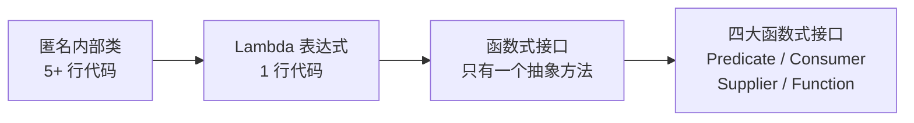

# Lambda 表达式完整指南

## 学习目标

- 掌握 Lambda 表达式语法与函数式接口（@FunctionalInterface，单一抽象方法）
- 理解变量捕获(lambda 只能引用 final 或事实上 final 的局部变量)
- 区分方法引用(::)的四种形式（静态/实例/特定对象/构造器）
- 理解 Lambda 的延迟执行与流式编程的结合
- 识别 Lambda 与匿名内部类在 this 语义、作用域上的差异

## 一、Lambda 表达式概述

### 1.1 什么是 Lambda 表达式



Lambda 表达式是 Java 8 引入的一项革命性特性,它允许我们将**函数作为参数传递给方法**,或者将**代码块作为数据进行处理**。本质上,Lambda 表达式是一个**匿名函数**,它实现了函数式接口中的抽象方法。

### 1.2 Lambda 表达式的作用

```java
// 传统方式:使用匿名内部类
Runnable r1 = new Runnable() {
    @Override
    public void run() {
        System.out.println("Hello World");
    }
};

// Lambda方式:简洁明了
Runnable r2 = () -> System.out.println("Hello World");
```

Lambda 表达式的核心价值:

1. **代码简洁**:大大减少模板代码,让代码更加简洁易读
2. **函数式编程**:支持函数式编程范式,可以将行为参数化
3. **集合操作优化**:配合 Stream API,极大简化集合处理
4. **并行处理**:更容易编写并行代码,充分利用多核 CPU

### 1.3 Lambda 表达式的本质

Lambda 表达式实际上是**函数式接口的实例**:

```java
// Lambda表达式是函数式接口的实现
Comparator<Integer> comparator = (a, b) -> a - b;

// 等价于创建了一个实现了Comparator接口的类的实例
```

编译器会推断 Lambda 表达式对应的函数式接口类型,并将其转换为该接口的实例。

## 二、Lambda 表达式语法详解

### 2.1 基本语法格式

```java
(parameters) -> expression
或
(parameters) -> { statements; }
```

语法组成:

- **parameters**: 参数列表,可以省略参数类型
- **`->`**: 箭头操作符,将参数与方法体分隔
- **expression 或 statements**: 方法体,可以是表达式或代码块

### 2.2 各种语法形式详解

#### 形式一:无参数,无返回值

```java
Runnable r = () -> System.out.println("Hello Lambda!");
r.run(); // 输出: Hello Lambda!

// 等价于
Runnable r2 = new Runnable() {
    @Override
    public void run() {
        System.out.println("Hello Lambda!");
    }
};
```

#### 形式二:一个参数,无返回值

```java
// 参数类型可以省略
Consumer<String> con = (s) -> System.out.println(s);
con.accept("Hello"); // 输出: Hello

// 一个参数时,小括号可以省略
Consumer<String> con2 = s -> System.out.println(s);
con2.accept("World"); // 输出: World
```

#### 形式三:多个参数,有返回值

```java
// 多个参数必须用小括号
Comparator<Integer> com = (x, y) -> {
    System.out.println("比较两个数");
    return Integer.compare(x, y);
};

// 简化形式:当方法体只有一条return语句时,可以省略大括号和return
Comparator<Integer> com2 = (x, y) -> Integer.compare(x, y);

// 使用示例
int result = com.compare(5, 3);
System.out.println(result); // 输出: 1 (5 > 3)
```

#### 形式四:指定参数类型

```java
// 可以显式指定参数类型,但通常不需要(编译器会自动推断)
BinaryOperator<Long> add = (Long x, Long y) -> x + y;
System.out.println(add.apply(10L, 20L)); // 输出: 30
```

### 2.3 语法规则总结

| 情况 | 语法格式 | 示例 |
|------|---------|------|
| 无参数 | `() -> expression` | `() -> System.out.println("Hello")` |
| 一个参数 | `x -> expression` 或 `(x) -> expression` | `x -> x * 2` |
| 多个参数 | `(x, y) -> expression` | `(x, y) -> x + y` |
| 代码块 | `(x) -> { statements; }` | `(x) -> { System.out.println(x); return x; }` |

**省略规则:**

1. 参数类型可以省略(编译器自动推断)
2. 一个参数时,小括号可以省略
3. 方法体只有一条语句时,大括号可以省略
4. 方法体只有一条return语句时,return关键字可以省略

## 三、函数式接口详解

### 3.1 什么是函数式接口

**函数式接口(Functional Interface)**是指**只有一个抽象方法**的接口。Lambda 表达式本质上就是函数式接口的实现。

```java
// 函数式接口示例
@FunctionalInterface
public interface MyInterface {
    void execute(); // 只有一个抽象方法
    
    // 可以包含默认方法和静态方法
    default void defaultMethod() {
        System.out.println("默认方法");
    }
    
    static void staticMethod() {
        System.out.println("静态方法");
    }
}
```

**`@FunctionalInterface` 注解的作用:**

- 编译时检查,确保接口只有一个抽象方法
- 不是必须的,但建议使用,提高代码可读性

### 3.2 自定义函数式接口

```java
@FunctionalInterface
public interface Calculator {
    int calculate(int a, int b);
}

// 使用自定义函数式接口
public class CustomFunctionalInterfaceDemo {
    public static void main(String[] args) {
        // 使用Lambda表达式实现
        Calculator add = (a, b) -> a + b;
        Calculator multiply = (a, b) -> a * b;
        
        System.out.println(add.calculate(5, 3));      // 输出: 8
        System.out.println(multiply.calculate(5, 3)); // 输出: 15
        
        // 作为方法参数传递
        int result = compute(10, 5, (a, b) -> a - b);
        System.out.println(result); // 输出: 5
    }
    
    public static int compute(int a, int b, Calculator calculator) {
        return calculator.calculate(a, b);
    }
}
```

### 3.3 Java 内置四大核心函数式接口

Java 8 在 `java.util.function` 包中提供了大量预定义的函数式接口,最核心的有四个:

#### 3.3.1 Consumer<T> - 消费型接口

**作用:** 接收一个参数进行处理,无返回值

```java
@FunctionalInterface
public interface Consumer<T> {
    void accept(T t); // 抽象方法
    
    default Consumer<T> andThen(Consumer<? super T> after) {
        // 可以链式调用多个Consumer
    }
}
```

**使用示例:**

```java
import java.util.function.Consumer;

public class ConsumerDemo {
    public static void main(String[] args) {
        // 示例1:简单消费
        Consumer<String> printUpperCase = s -> System.out.println(s.toUpperCase());
        printUpperCase.accept("hello"); // 输出: HELLO
        
        // 示例2:链式调用
        Consumer<String> print = s -> System.out.print("姓名: " + s);
        Consumer<String> printLength = s -> System.out.println(", 长度: " + s.length());
        
        print.andThen(printLength).accept("张三"); // 输出: 姓名: 张三, 长度: 2
        
        // 示例3:实际应用 - 修改对象属性
        Consumer<Employee> setName = e -> e.setName("李四");
        Consumer<Employee> setAge = e -> e.setAge(30);
        
        Employee emp = new Employee();
        setName.andThen(setAge).accept(emp);
        System.out.println(emp); // Employee{name='李四', age=30}
        
        // 示例4:集合遍历
        List<Integer> numbers = Arrays.asList(1, 2, 3, 4, 5);
        numbers.forEach(n -> System.out.print(n + " ")); // 输出: 1 2 3 4 5
    }
}

class Employee {
    private String name;
    private int age;
    
    // getter/setter/toString省略
}
```

**实际应用场景:**

- 集合的 `forEach()` 方法
- 数据打印、日志记录
- 修改对象属性

#### 3.3.2 Supplier<T> - 供给型接口

**作用:** 无参数,返回一个结果

```java
@FunctionalInterface
public interface Supplier<T> {
    T get(); // 抽象方法
}
```

**使用示例:**

```java
import java.util.function.Supplier;

public class SupplierDemo {
    public static void main(String[] args) {
        // 示例1:生成随机数
        Supplier<Double> randomSupplier = () -> Math.random();
        System.out.println(randomSupplier.get()); // 输出随机数
        
        // 示例2:生成固定字符串
        Supplier<String> stringSupplier = () -> "Hello World";
        System.out.println(stringSupplier.get()); // 输出: Hello World
        
        // 示例3:生成对象
        Supplier<Employee> empSupplier = () -> new Employee("王五", 25);
        Employee emp = empSupplier.get();
        System.out.println(emp); // Employee{name='王五', age=25}
        
        // 示例4:实际应用 - 延迟加载
        String name = getName();
        // 只有在需要时才调用Supplier
        System.out.println(processData(() -> expensiveOperation()));
        
        // 示例5:工厂模式
        Supplier<List<String>> listSupplier = ArrayList::new;
        List<String> list = listSupplier.get();
        list.add("元素1");
        System.out.println(list); // 输出: [元素1]
    }
    
    // 模拟耗时操作
    private static String expensiveOperation() {
        System.out.println("执行耗时操作...");
        return "耗时操作结果";
    }
    
    private static String processData(Supplier<String> supplier) {
        // 只有真正需要数据时才调用
        return "处理结果: " + supplier.get();
    }
}
```

**实际应用场景:**

- 延迟加载(Lazy Evaluation)
- 对象工厂
- 生成随机数、UUID等

#### 3.3.3 Function<T, R> - 函数型接口

**作用:** 接收一个参数,返回一个结果

```java
@FunctionalInterface
public interface Function<T, R> {
    R apply(T t); // 抽象方法
    
    default <V> Function<V, R> compose(Function<? super V, ? extends T> before) {
        // 先执行before,再执行当前Function
    }
    
    default <V> Function<T, V> andThen(Function<? super R, ? extends V> after) {
        // 先执行当前Function,再执行after
    }
}
```

**使用示例:**

```java
import java.util.function.Function;
import java.util.function.UnaryOperator;

public class FunctionDemo {
    public static void main(String[] args) {
        // 示例1:基本使用
        Function<String, Integer> lengthFunction = s -> s.length();
        System.out.println(lengthFunction.apply("Hello")); // 输出: 5
        
        // 示例2:类型转换
        Function<String, Integer> parseFunction = s -> Integer.parseInt(s);
        System.out.println(parseFunction.apply("123") + 10); // 输出: 133
        
        // 示例3:compose - 先执行参数函数
        Function<Integer, Integer> multiply = x -> x * 2;
        Function<Integer, Integer> add = x -> x + 3;
        
        Function<Integer, Integer> compose = multiply.compose(add);
        System.out.println(compose.apply(5)); // (5+3)*2 = 16
        
        // 示例4:andThen - 后执行参数函数
        Function<Integer, Integer> andThen = multiply.andThen(add);
        System.out.println(andThen.apply(5)); // (5*2)+3 = 13
        
        // 示例5:链式调用
        Function<String, String> trim = s -> s.trim();
        Function<String, String> toUpper = s -> s.toUpperCase();
        Function<String, String> addSuffix = s -> s + "!!!";
        
        String result = trim.andThen(toUpper).andThen(addSuffix).apply("  hello  ");
        System.out.println(result); // 输出: HELLO!!!
        
        // 示例6:实际应用 - 数据处理管道
        String processed = processData("  123  ",
            String::trim,                                  // 去空格 -> "123"
            s -> String.valueOf(Integer.parseInt(s) * 2)   // 转数字×2 -> "246"
        );
        System.out.println(processed); // 输出: 246
    }
    
    @SafeVarargs
    public static String processData(String input, UnaryOperator<String>... functions) {
        Function<String, String> chain = functions[0];
        for (int i = 1; i < functions.length; i++) {
            chain = chain.andThen(functions[i]);
        }
        return chain.apply(input);
    }
}
```

**实际应用场景:**

- 数据转换和处理
- 类型转换
- 构建数据处理管道

#### 3.3.4 Predicate<T> - 断言型接口

**作用:** 接收一个参数,返回布尔值

```java
@FunctionalInterface
public interface Predicate<T> {
    boolean test(T t); // 抽象方法
    
    default Predicate<T> and(Predicate<? super T> other) {
        // 逻辑与
    }
    
    default Predicate<T> or(Predicate<? super T> other) {
        // 逻辑或
    }
    
    default Predicate<T> negate() {
        // 逻辑非
    }
}
```

**使用示例:**

```java
import java.util.function.Predicate;

public class PredicateDemo {
    public static void main(String[] args) {
        // 示例1:基本使用
        Predicate<Integer> isEven = n -> n % 2 == 0;
        System.out.println(isEven.test(4)); // 输出: true
        System.out.println(isEven.test(5)); // 输出: false
        
        // 示例2:字符串判断
        Predicate<String> isEmpty = s -> s.isEmpty();
        Predicate<String> isNotEmpty = isEmpty.negate();
        
        System.out.println(isEmpty.test(""));       // 输出: true
        System.out.println(isNotEmpty.test("hello")); // 输出: true
        
        // 示例3:组合条件 - and
        Predicate<Integer> isPositive = n -> n > 0;
        Predicate<Integer> isLessThan100 = n -> n < 100;
        Predicate<Integer> isValid = isPositive.and(isLessThan100);
        
        System.out.println(isValid.test(50));  // 输出: true
        System.out.println(isValid.test(-5));  // 输出: false
        System.out.println(isValid.test(150)); // 输出: false
        
        // 示例4:组合条件 - or
        Predicate<String> startsWithA = s -> s.startsWith("A");
        Predicate<String> startsWithB = s -> s.startsWith("B");
        Predicate<String> startsWithAOrB = startsWithA.or(startsWithB);
        
        System.out.println(startsWithAOrB.test("Apple"));  // 输出: true
        System.out.println(startsWithAOrB.test("Banana")); // 输出: true
        System.out.println(startsWithAOrB.test("Cherry")); // 输出: false
        
        // 示例5:实际应用 - 数据过滤
        List<Employee> employees = Arrays.asList(
            new Employee("张三", 25, 5000),
            new Employee("李四", 35, 8000),
            new Employee("王五", 28, 6000),
            new Employee("赵六", 40, 10000)
        );
        
        // 过滤年龄大于30且薪资大于7000的员工
        Predicate<Employee> ageFilter = e -> e.getAge() > 30;
        Predicate<Employee> salaryFilter = e -> e.getSalary() > 7000;
        
        employees.stream()
                 .filter(ageFilter.and(salaryFilter))
                 .forEach(System.out::println);
        // 输出: Employee{name='李四', age=35, salary=8000}
        //      Employee{name='赵六', age=40, salary=10000}
        
        // 示例6:复杂组合条件
        Predicate<Integer> isEven = n -> n % 2 == 0;
        Predicate<Integer> isPositive = n -> n > 0;
        Predicate<Integer> isLessThan10 = n -> n < 10;
        
        // 偶数 且 (正数 且 小于10)
        Predicate<Integer> complexCondition = isEven.and(isPositive.and(isLessThan10));
        
        IntStream.range(-5, 15)
                 .filter(complexCondition::test)
                 .forEach(System.out::println); // 输出: 2 4 6 8
    }
}

class Employee {
    private String name;
    private int age;
    private double salary;
    
    // 构造方法、getter、toString省略
}
```

**实际应用场景:**

- 数据过滤和筛选
- 条件判断
- 参数校验

### 3.4 其他常用函数式接口

| 接口名 | 描述 | 方法签名 |
|--------|------|----------|
| `UnaryOperator<T>` | 一元操作,输入输出同类型 | `T apply(T t)` |
| `BinaryOperator<T>` | 二元操作,输入输出同类型 | `T apply(T t1, T t2)` |
| `BiFunction<T, U, R>` | 接收两个参数,返回一个结果 | `R apply(T t, U u)` |
| `BiConsumer<T, U>` | 接收两个参数,无返回值 | `void accept(T t, U u)` |
| `BiPredicate<T, U>` | 接收两个参数,返回布尔值 | `boolean test(T t, U u)` |

**基本类型特化接口:**

为了避免自动装箱的性能损耗,Java 提供了基本类型特化的函数式接口:

```java
// Int类型示例
IntPredicate intPredicate = n -> n > 0;
IntFunction<String> intFunction = n -> "数字: " + n;
IntSupplier intSupplier = () -> (int)(Math.random() * 100);
IntConsumer intConsumer = n -> System.out.println(n);
ToIntFunction<String> toIntFunction = s -> s.length();

// Long和Double类型类似
LongPredicate, LongFunction, LongSupplier, LongConsumer...
DoublePredicate, DoubleFunction, DoubleSupplier, DoubleConsumer...
```

## 四、方法引用与构造器引用

### 4.1 方法引用概述

方法引用是 Lambda 表达式的简化形式,当 Lambda 表达式只是调用一个已存在的方法时,可以使用方法引用。

**语法格式:** `类名::方法名` 或 `对象名::方法名`

### 4.2 方法引用的四种形式

#### 4.2.1 静态方法引用

**语法:** `ClassName::staticMethodName`

```java
import java.util.function.Function;
import java.util.function.Supplier;

public class StaticMethodRef {
    public static void main(String[] args) {
        // Lambda形式
        Function<String, Integer> parseLambda = s -> Integer.parseInt(s);
        
        // 方法引用形式
        Function<String, Integer> parseRef = Integer::parseInt;
        
        System.out.println(parseRef.apply("123")); // 输出: 123
        
        // 更多示例
        Supplier<Double> randomSupplier = Math::random;
        System.out.println(randomSupplier.get()); // 输出随机数
        
        // 自定义静态方法引用
        Function<String, String> toUpper = StringUtils::toUpperCase;
        System.out.println(toUpper.apply("hello")); // 输出: HELLO
    }
}

class StringUtils {
    public static String toUpperCase(String s) {
        return s.toUpperCase();
    }
}
```

#### 4.2.2 实例方法引用

**语法:** `instance::instanceMethodName`

```java
import java.util.function.Consumer;
import java.util.function.Supplier;

public class InstanceMethodRef {
    public static void main(String[] args) {
        // 实例方法引用
        Person person = new Person("张三", 25);
        
        // Lambda形式
        Supplier<String> nameSupplier1 = () -> person.getName();
        
        // 方法引用形式
        Supplier<String> nameSupplier2 = person::getName;
        System.out.println(nameSupplier2.get()); // 输出: 张三
        
        Consumer<String> printConsumer = System.out::println;
        printConsumer.accept("Hello World"); // 输出: Hello World
        
        // 集合方法引用
        List<String> list = new ArrayList<>();
        Consumer<String> addConsumer = list::add;
        addConsumer.accept("元素1");
        addConsumer.accept("元素2");
        System.out.println(list); // 输出: [元素1, 元素2]
    }
}

class Person {
    private String name;
    private int age;
    
    public Person(String name, int age) {
        this.name = name;
        this.age = age;
    }
    
    public String getName() { return name; }
    public int getAge() { return age; }
}
```

#### 4.2.3 特定类型的任意对象的实例方法引用

**语法:** `ClassName::instanceMethodName`

这种引用方式比较特殊,第一个参数作为方法的调用者:

```java
import java.util.function.BiFunction;
import java.util.function.Function;

public class TypeMethodRef {
    public static void main(String[] args) {
        // Lambda形式: (s) -> s.toUpperCase()
        Function<String, String> toUpper1 = s -> s.toUpperCase();
        
        // 方法引用形式: String::toUpperCase
        // 编译器会自动将第一个参数作为toUpperCase的调用者
        Function<String, String> toUpper2 = String::toUpperCase;
        
        System.out.println(toUpper2.apply("hello")); // 输出: HELLO
        
        // 更多示例
        // Lambda: (s1, s2) -> s1.compareTo(s2)
        BiFunction<String, String, Integer> compareFunc = String::compareTo;
        System.out.println(compareFunc.apply("apple", "banana")); // 输出: -1
        
        // 实际应用:集合排序
        List<String> names = Arrays.asList("Charlie", "Alice", "Bob");
        
        // Lambda形式
        names.sort((s1, s2) -> s1.compareToIgnoreCase(s2));
        
        // 方法引用形式
        names.sort(String::compareToIgnoreCase);
        System.out.println(names); // 输出: [Alice, Bob, Charlie]
        
        // 更实用的例子
        List<Person> people = Arrays.asList(
            new Person("张三", 25),
            new Person("李四", 30),
            new Person("王五", 20)
        );
        
        // 按年龄排序
        people.sort(Comparator.comparing(Person::getAge));
        people.forEach(p -> System.out.println(p.getName() + ": " + p.getAge()));
        // 输出: 王五: 20, 张三: 25, 李四: 30
    }
}
```

#### 4.2.4 构造方法引用

**语法:** `ClassName::new`

```java
import java.util.function.Function;
import java.util.function.Supplier;
import java.util.function.BiFunction;

public class ConstructorRef {
    public static void main(String[] args) {
        // 无参构造方法引用
        // Lambda: () -> new Person()
        Supplier<Person> supplier1 = () -> new Person();
        Supplier<Person> supplier2 = Person::new;
        Person p1 = supplier2.get();
        System.out.println(p1); // Person{name='null', age=0}
        
        // 带参构造方法引用
        // Lambda: (name) -> new Person(name)
        Function<String, Person> function1 = name -> new Person(name);
        Function<String, Person> function2 = Person::new;
        Person p2 = function2.apply("张三");
        System.out.println(p2); // Person{name='张三', age=0}
        
        // 多个参数的构造方法引用
        // Lambda: (name, age) -> new Person(name, age)
        BiFunction<String, Integer, Person> biFunction1 = (name, age) -> new Person(name, age);
        BiFunction<String, Integer, Person> biFunction2 = Person::new;
        Person p3 = biFunction2.apply("李四", 25);
        System.out.println(p3); // Person{name='李四', age=25}
        
        // 数组构造方法引用
        Function<Integer, String[]> arrayFunction = String[]::new;
        String[] array = arrayFunction.apply(5);
        System.out.println(array.length); // 输出: 5
        
        // 实际应用:将字符串列表转换为Person列表
        List<String> names = Arrays.asList("张三", "李四", "王五");
        List<Person> people = names.stream()
                                   .map(Person::new)
                                   .collect(Collectors.toList());
        people.forEach(System.out::println);
    }
}

class Person {
    private String name;
    private int age;
    
    public Person() { }
    public Person(String name) { this.name = name; }
    public Person(String name, int age) {
        this.name = name;
        this.age = age;
    }
    
    @Override
    public String toString() {
        return "Person{name='" + name + "', age=" + age + "}";
    }
}
```

### 4.3 方法引用使用场景总结

| 类型 | 语法 | Lambda 等价形式 | 示例 |
|------|------|----------------|------|
| 静态方法引用 | `ClassName::staticMethod` | `(args) -> ClassName.staticMethod(args)` | `Integer::parseInt` |
| 实例方法引用 | `instance::instanceMethod` | `(args) -> instance.instanceMethod(args)` | `System.out::println` |
| 类型方法引用 | `ClassName::instanceMethod` | `(obj, args) -> obj.instanceMethod(args)` | `String::toUpperCase` |
| 构造方法引用 | `ClassName::new` | `(args) -> new ClassName(args)` | `Person::new` |

## 五、Lambda 表达式与匿名内部类对比

### 5.1 语法对比

```java
// 使用匿名内部类
Runnable r1 = new Runnable() {
    @Override
    public void run() {
        System.out.println("匿名内部类实现");
    }
};

// 使用Lambda表达式
Runnable r2 = () -> System.out.println("Lambda表达式实现");
```

### 5.2 关键区别详解

#### 区别一:简洁性

```java
// 匿名内部类:代码冗长
Comparator<Integer> comparator1 = new Comparator<Integer>() {
    @Override
    public int compare(Integer o1, Integer o2) {
        return o1.compareTo(o2);
    }
};

// Lambda表达式:简洁明了
Comparator<Integer> comparator2 = (o1, o2) -> o1.compareTo(o2);

// 方法引用:更加简洁
Comparator<Integer> comparator3 = Integer::compareTo;
```

#### 区别二:this 关键字的指向

```java
public class ThisReferenceDemo {
    private String name = "外部类";
    
    public void testAnonymous() {
        // 匿名内部类中的this指向匿名内部类本身
        Runnable r = new Runnable() {
            private String name = "匿名内部类";
            
            @Override
            public void run() {
                System.out.println(this.name); // 输出: 匿名内部类
                System.out.println(ThisReferenceDemo.this.name); // 输出: 外部类
            }
        };
        r.run();
    }
    
    public void testLambda() {
        // Lambda表达式中的this指向外部类
        Runnable r = () -> {
            // 编译错误:Lambda表达式没有自己的this
            // System.out.println(this.name); // 这里this指的是外部类
            
            // Lambda表达式不会引入新的作用域
            System.out.println(this.name); // 输出: 外部类
        };
        r.run();
    }
    
    public static void main(String[] args) {
        ThisReferenceDemo demo = new ThisReferenceDemo();
        demo.testAnonymous();
        System.out.println("---");
        demo.testLambda();
    }
}
```

**输出:**
```
匿名内部类
外部类
---
外部类
```

#### 区别三:作用域

```java
public class ScopeDemo {
    private int num = 10;
    
    public void testAnonymous() {
        int localNum = 20;
        
        Runnable r = new Runnable() {
            private int num = 30; // 可以定义同名字段
            
            @Override
            public void run() {
                // 匿名内部类可以定义自己的字段
                System.out.println("匿名内部类的num: " + num); // 输出: 30
                System.out.println("局部变量localNum: " + localNum);
                
                // 不能修改捕获的局部变量(与 Lambda 一致)
                // localNum = 100; // 编译错误,必须是final或effectively final
            }
        };
        r.run();
    }
    
    public void testLambda() {
        int localNum = 20;
        
        Runnable r = () -> {
            // Lambda表达式不能定义同名字段(会直接引用外部字段)
            // int num = 30; // 编译错误:无法重新定义
            
            System.out.println("Lambda访问外部num: " + num); // 输出: 10
            System.out.println("局部变量localNum: " + localNum);
            
            // localNum = 100; // 编译错误
        };
        r.run();
    }
}
```

#### 区别四:类型系统

```java
public class TypeSystemDemo {
    public static void main(String[] args) {
        // 匿名内部类:创建了一个新的类型
        Runnable r1 = new Runnable() {
            @Override
            public void run() {
                System.out.println("匿名内部类");
            }
        };
        System.out.println(r1.getClass().getName()); 
        // 输出: TypeSystemDemo$1 (生成新的类)
        
        // Lambda表达式:不创建新的类型
        Runnable r2 = () -> System.out.println("Lambda表达式");
        System.out.println(r2.getClass().getName()); 
        // 输出: TypeSystemDemo$$Lambda$1/... (使用invokedynamic指令)
    }
}
```

#### 区别五:支持的接口类型

```java
// Lambda表达式只能用于函数式接口
@FunctionalInterface
interface MyFunctionalInterface {
    void execute();
}

// 可以使用Lambda
MyFunctionalInterface mfi1 = () -> System.out.println("Lambda");
MyFunctionalInterface mfi2 = new MyFunctionalInterface() {
    @Override
    public void execute() {
        System.out.println("匿名内部类");
    }
};

// 抽象类,不能使用Lambda
abstract class MyAbstractClass {
    abstract void execute();
}

// 编译错误:Lambda表达式只能用于函数式接口
// MyAbstractClass mac = () -> System.out.println("Lambda");

// 只能使用匿名内部类
MyAbstractClass mac = new MyAbstractClass() {
    @Override
    void execute() {
        System.out.println("匿名内部类");
    }
};
```

### 5.3 对比总结表

| 对比项 | 匿名内部类 | Lambda 表达式 |
|--------|-----------|--------------|
| 代码简洁性 | 冗长,需要完整的类结构 | 简洁,只需要方法体 |
| this 指向 | 指向匿名内部类实例 | 指向外部类实例 |
| 作用域 | 可以定义新字段,有独立作用域 | 不引入新作用域,直接访问外部变量 |
| 类型系统 | 生成新的 `.class` 文件 | 使用 `invokedynamic` 指令,不生成新类 |
| 适用范围 | 接口、抽象类、普通类 | 仅适用于函数式接口 |
| 性能 | 每次创建新对象 | 可能重用实例(由 JVM 优化) |
| 变量捕获 | 必须是 final 或 effectively final | 必须是 final 或 effectively final |

### 5.4 使用建议

**优先使用 Lambda 表达式的场景:**

- 函数式接口的实现
- 简单的逻辑处理
- 集合的遍历和操作
- Stream API 配合使用

**必须使用匿名内部类的场景:**

- 抽象类的实例化
- 包含多个抽象方法的接口
- 需要访问 `this` 指向自身
- 需要定义额外的字段或方法

## 六、Lambda 表达式的变量作用域

### 6.1 变量捕获规则

Lambda 表达式可以访问外部的局部变量,但有以下限制:

**规则一:捕获的变量必须是 final 或 effectively final**

```java
public class VariableCapture {
    public static void main(String[] args) {
        // 正确示例:effectively final
        String message = "Hello";
        Runnable r = () -> System.out.println(message);
        r.run(); // 输出: Hello
        
        // 编译错误:message被修改,不再是effectively final
        // message = "World"; // 取消注释会报错
        
        // 正确示例:显式final
        final int num = 10;
        Consumer<Integer> consumer = n -> System.out.println(n + num);
        consumer.accept(5); // 输出: 15
    }
}
```

**规则二:不能修改捕获的局部变量**

```java
public class VariableModify {
    public static void main(String[] args) {
        int counter = 0;
        
        // 编译错误:不能在Lambda内部修改外部局部变量
        Runnable r = () -> {
            // counter++; // 编译错误
            System.out.println(counter);
        };
        
        // 解决方案1:使用数组(不推荐)
        int[] counterArray = {0};
        Runnable r1 = () -> {
            counterArray[0]++;
            System.out.println("Counter: " + counterArray[0]);
        };
        r1.run(); // 输出: Counter: 1
        
        // 解决方案2:使用AtomicInteger(推荐)
        AtomicInteger atomicCounter = new AtomicInteger(0);
        Runnable r2 = () -> {
            atomicCounter.incrementAndGet();
            System.out.println("Atomic Counter: " + atomicCounter.get());
        };
        r2.run(); // 输出: Atomic Counter: 1
        
        // 解决方案3:使用成员变量
        VariableModify demo = new VariableModify();
        demo.counter = 0;
        Runnable r3 = () -> {
            demo.counter++;
            System.out.println("Member Counter: " + demo.counter);
        };
        r3.run(); // 输出: Member Counter: 1
    }
    
    private int counter; // 成员变量可以被Lambda修改
}
```

### 6.2 变量作用域详解

```java
public class LambdaScope {
    private int instanceVar = 10;
    private static int staticVar = 20;
    
    public void testScope() {
        int localVar = 30;
        
        // 1. 访问成员变量
        Runnable r1 = () -> {
            System.out.println("实例变量: " + instanceVar); // 可以访问
            System.out.println("静态变量: " + staticVar);   // 可以访问
            System.out.println("局部变量: " + localVar);    // 可以访问
            
            // 修改成员变量
            instanceVar = 100; // 允许
            staticVar = 200;   // 允许
            // localVar = 40;  // 编译错误
        };
        
        // 2. 变量遮蔽问题
        int num = 50;
        Runnable r2 = () -> {
            // int num = 60; // 编译错误:不能定义同名变量
            System.out.println(num); // 输出: 50
        };
        
        // 3. Lambda中的this
        Runnable r3 = () -> {
            System.out.println(this.instanceVar); // 10
            // this指向外部类实例,不是Lambda本身
        };
        
        r1.run();
        r2.run();
        r3.run();
    }
    
    public static void main(String[] args) {
        new LambdaScope().testScope();
    }
}
```

### 6.3 为什么有这些限制?

**原因一:线程安全**

Lambda 表达式可能在其他线程中执行,如果允许修改局部变量,会导致数据竞争问题。

**原因二:实现机制**

Lambda 表达式捕获的是变量的**值拷贝**,而不是引用。如果变量可以被修改,拷贝的值就会过时。

```java
public class WhyRestriction {
    public static void main(String[] args) {
        int x = 10;
        
        // Lambda捕获的是x的副本
        Runnable r = () -> {
            // 实际上Lambda持有的是x的一个拷贝值10
            System.out.println(x);
        };
        
        // 如果允许修改x,Lambda中的值就过时了
        // x = 20; // 编译错误,防止这种问题
        
        r.run();
    }
}
```

### 6.4 成员变量与局部变量的区别

```java
public class VariableDifference {
    private List<String> items = new ArrayList<>();
    
    public void test() {
        // 成员变量:可以被Lambda修改
        Runnable r1 = () -> {
            items.add("元素1"); // 允许,因为items是引用,引用本身没变
            System.out.println(items);
        };
        
        // 局部变量:不能被修改
        List<String> localItems = new ArrayList<>();
        Runnable r2 = () -> {
            localItems.add("元素2"); // 允许,引用没变,只是修改了对象内容
            // localItems = new ArrayList<>(); // 编译错误,引用被修改
            System.out.println(localItems);
        };
        
        r1.run();
        r2.run();
    }
}
```

**总结:**

- **局部变量**:捕获的是值的拷贝,不能重新赋值,但如果变量是对象引用,可以修改对象内容
- **成员变量**:可以直接访问和修改,因为 Lambda 持有的是外部类实例的引用

## 七、Lambda 表达式实战案例

### 7.1 集合处理实战

#### 案例一:员工数据处理

```java
import java.util.*;
import java.util.stream.Collectors;

class Employee {
    private String name;
    private String department;
    private int age;
    private double salary;
    
    public Employee(String name, String department, int age, double salary) {
        this.name = name;
        this.department = department;
        this.age = age;
        this.salary = salary;
    }
    
    // getter方法省略
    @Override
    public String toString() {
        return String.format("%s(部门:%s, 年龄:%d, 薪资:%.0f)", 
                           name, department, age, salary);
    }
}

public class EmployeeProcessing {
    public static void main(String[] args) {
        List<Employee> employees = Arrays.asList(
            new Employee("张三", "技术部", 28, 8000),
            new Employee("李四", "销售部", 32, 7500),
            new Employee("王五", "技术部", 26, 9000),
            new Employee("赵六", "人事部", 35, 8500),
            new Employee("钱七", "技术部", 30, 10000),
            new Employee("孙八", "销售部", 29, 7000)
        );
        
        // 需求1:查询技术部员工
        System.out.println("=== 技术部员工 ===");
        employees.stream()
                 .filter(e -> "技术部".equals(e.getDepartment()))
                 .forEach(System.out::println);
        
        // 需求2:薪资大于8000的员工姓名
        System.out.println("\n=== 薪资>8000的员工 ===");
        List<String> highSalaryNames = employees.stream()
                                                 .filter(e -> e.getSalary() > 8000)
                                                 .map(Employee::getName)
                                                 .collect(Collectors.toList());
        System.out.println(highSalaryNames);
        
        // 需求3:按部门分组
        System.out.println("\n=== 按部门分组 ===");
        Map<String, List<Employee>> deptMap = employees.stream()
                                                       .collect(Collectors.groupingBy(Employee::getDepartment));
        deptMap.forEach((dept, empList) -> {
            System.out.println(dept + ":");
            empList.forEach(e -> System.out.println("  " + e));
        });
        
        // 需求4:每个部门的平均薪资
        System.out.println("\n=== 部门平均薪资 ===");
        Map<String, Double> avgSalaryByDept = employees.stream()
                                                        .collect(Collectors.groupingBy(
                                                            Employee::getDepartment,
                                                            Collectors.averagingDouble(Employee::getSalary)
                                                        ));
        avgSalaryByDept.forEach((dept, avg) -> 
            System.out.printf("%s: %.2f\n", dept, avg));
        
        // 需求5:按薪资降序排序
        System.out.println("\n=== 按薪资降序 ===");
        employees.stream()
                 .sorted((e1, e2) -> Double.compare(e2.getSalary(), e1.getSalary()))
                 .forEach(System.out::println);
        
        // 需求6:统计信息
        System.out.println("\n=== 统计信息 ===");
        DoubleSummaryStatistics stats = employees.stream()
                                                  .mapToDouble(Employee::getSalary)
                                                  .summaryStatistics();
        System.out.println("员工数量: " + stats.getCount());
        System.out.println("平均薪资: " + stats.getAverage());
        System.out.println("最高薪资: " + stats.getMax());
        System.out.println("最低薪资: " + stats.getMin());
        System.out.println("薪资总和: " + stats.getSum());
        
        // 需求7:是否存在薪资超过10000的员工
        boolean hasHighSalary = employees.stream()
                                          .anyMatch(e -> e.getSalary() > 10000);
        System.out.println("\n是否存在薪资>10000的员工: " + hasHighSalary);
        
        // 需求8:获取薪资最高的员工
        Optional<Employee> maxSalaryEmp = employees.stream()
                                                    .max(Comparator.comparingDouble(Employee::getSalary));
        maxSalaryEmp.ifPresent(e -> System.out.println("薪资最高: " + e));
    }
}
```

#### 案例二:字符串处理

```java
import java.util.*;
import java.util.stream.Collectors;

public class StringProcessing {
    public static void main(String[] args) {
        List<String> words = Arrays.asList(
            "Java", "Python", "JavaScript", "Go", "Rust",
            "C++", "Ruby", "Swift", "Kotlin", "Scala"
        );
        
        // 需求1:过滤长度大于4的单词
        System.out.println("=== 长度>4的单词 ===");
        words.stream()
             .filter(s -> s.length() > 4)
             .forEach(System.out::println);
        
        // 需求2:所有单词转大写并用逗号连接
        System.out.println("\n=== 大写连接 ===");
        String upperCaseWords = words.stream()
                                      .map(String::toUpperCase)
                                      .collect(Collectors.joining(", "));
        System.out.println(upperCaseWords);
        
        // 需求3:按首字母分组
        System.out.println("\n=== 按首字母分组 ===");
        Map<Character, List<String>> groupedByFirstLetter = words.stream()
                                                                   .collect(Collectors.groupingBy(s -> s.charAt(0)));
        groupedByFirstLetter.forEach((letter, wordList) -> 
            System.out.println(letter + ": " + wordList));
        
        // 需求4:去重并排序
        List<String> duplicateWords = Arrays.asList("Java", "Python", "Java", "Go", "Python");
        System.out.println("\n=== 去重排序 ===");
        List<String> distinctSorted = duplicateWords.stream()
                                                     .distinct()
                                                     .sorted()
                                                     .collect(Collectors.toList());
        System.out.println(distinctSorted);
        
        // 需求5:统计每个单词长度
        System.out.println("\n=== 单词长度统计 ===");
        Map<String, Integer> wordLengths = words.stream()
                                                 .collect(Collectors.toMap(
                                                     word -> word,
                                                     String::length
                                                 ));
        wordLengths.forEach((word, length) -> 
            System.out.println(word + ": " + length));
        
        // 需求6:扁平化处理 - 获取所有单词的所有字符
        System.out.println("\n=== 所有字符(去重) ===");
        List<Character> allChars = words.stream()
                                         .flatMap(s -> s.chars().mapToObj(c -> (char) c))
                                         .distinct()
                                         .sorted()
                                         .collect(Collectors.toList());
        System.out.println(allChars);
    }
}
```

### 7.2 文件处理实战

```java
import java.io.*;
import java.nio.file.*;
import java.util.*;
import java.util.stream.*;

public class FileProcessing {
    public static void main(String[] args) throws IOException {
        // 读取文件
        Path filePath = Paths.get("data.txt");
        
        // 需求1:读取文件所有行
        System.out.println("=== 读取文件 ===");
        try (Stream<String> lines = Files.lines(filePath)) {
            lines.filter(line -> !line.trim().isEmpty())
                 .forEach(System.out::println);
        }
        
        // 需求2:统计单词频率
        System.out.println("\n=== 单词频率 ===");
        try (Stream<String> lines = Files.lines(filePath)) {
            Map<String, Long> wordFrequency = lines
                .flatMap(line -> Arrays.stream(line.toLowerCase().split("\\W+")))
                .filter(word -> word.length() > 0)
                .collect(Collectors.groupingBy(word -> word, Collectors.counting()));
            
            wordFrequency.entrySet().stream()
                         .sorted(Map.Entry.<String, Long>comparingByValue().reversed())
                         .limit(10)
                         .forEach(entry -> System.out.println(entry.getKey() + ": " + entry.getValue()));
        }
        
        // 需求3:查找包含特定关键词的行
        System.out.println("\n=== 包含'Java'的行 ===");
        try (Stream<String> lines = Files.lines(filePath)) {
            lines.filter(line -> line.contains("Java"))
                 .forEach(System.out::println);
        }
        
        // 需求4:将处理后的数据写入新文件
        Path outputPath = Paths.get("output.txt");
        try (Stream<String> lines = Files.lines(filePath)) {
            List<String> processedLines = lines
                .map(String::trim)
                .filter(line -> !line.isEmpty())
                .map(line -> line.toUpperCase())
                .collect(Collectors.toList());
            Files.write(outputPath, processedLines);
        }
        
        System.out.println("\n文件处理完成!");
    }
}
```

### 7.3 异常处理实战

```java
import java.util.*;
import java.util.function.*;

public class ExceptionHandling {
    
    // 包装Lambda表达式处理受检异常
    public static <T, R> Function<T, R> wrapException(ThrowingFunction<T, R> function) {
        return t -> {
            try {
                return function.apply(t);
            } catch (Exception e) {
                throw new RuntimeException(e);
            }
        };
    }
    
    @FunctionalInterface
    interface ThrowingFunction<T, R> {
        R apply(T t) throws Exception;
    }
    
    public static void main(String[] args) {
        List<String> numbers = Arrays.asList("1", "2", "abc", "4", "5");
        
        // 方式1:在Lambda内部捕获异常
        System.out.println("=== 方式1:内部捕获 ===");
        numbers.forEach(s -> {
            try {
                System.out.println(Integer.parseInt(s));
            } catch (NumberFormatException e) {
                System.err.println("无法解析: " + s);
            }
        });
        
        // 方式2:使用包装方法(把异常包装成 RuntimeException)
        System.out.println("\n=== 方式2:包装方法 ===");
        List<Integer> parsedNumbers = numbers.stream()
                                             .map(wrapException(Integer::parseInt))
                                             .collect(Collectors.toList());
        // 注意:执行到 "abc" 时会抛出 RuntimeException(cause 为 NumberFormatException)并终止流,
        // 如需跳过失败项,请使用方式3的 Optional 写法
        
        // 方式3:使用Optional处理可能失败的操作
        System.out.println("\n=== 方式3:Optional处理 ===");
        List<Optional<Integer>> optionals = numbers.stream()
                                                    .map(s -> {
                                                        try {
                                                            return Optional.of(Integer.parseInt(s));
                                                        } catch (NumberFormatException e) {
                                                            return Optional.<Integer>empty();
                                                        }
                                                    })
                                                    .collect(Collectors.toList());
        
        optionals.forEach(opt -> 
            opt.ifPresentOrElse(
                System.out::println,
                () -> System.err.println("解析失败")
            )
        );
    }
}
```

## 八、常见误区与陷阱

### 8.1 误区一:误解 Lambda 的执行时机

```java
public class ExecutionTiming {
    public static void main(String[] args) {
        List<String> names = Arrays.asList("Alice", "Bob", "Charlie");
        
        // 错误理解:以为这段代码会立即执行
        Stream<String> stream = names.stream()
                                      .filter(name -> {
                                          System.out.println("过滤: " + name);
                                          return name.length() > 3;
                                      });
        
        System.out.println("Stream创建完成");
        
        // 实际上,上面的filter不会执行,直到遇到终端操作
        stream.forEach(name -> System.out.println("输出: " + name));
        
        // Stream已经被消费,不能再次使用
        // stream.count(); // 运行时抛 IllegalStateException: stream has already been operated upon or closed
    }
}
```

**要点:** Lambda 表达式只有在终端操作执行时才会真正执行,中间操作是惰性的。

### 8.2 误区二:修改外部集合

```java
public class ModifyCollection {
    public static void main(String[] args) {
        List<Integer> numbers = new ArrayList<>(Arrays.asList(1, 2, 3, 4, 5));
        
        // 错误:在Stream操作中修改源集合
        try {
            numbers.stream().forEach(n -> {
                if (n == 3) {
                    numbers.add(6); // ConcurrentModificationException
                }
            });
        } catch (ConcurrentModificationException e) {
            System.err.println("异常:不能在遍历时修改集合");
        }
        
        // 正确方式1:使用filter过滤不需要的元素
        numbers.stream()
               .filter(n -> n != 3)
               .forEach(System.out::println);
        
        // 正确方式2:收集到新集合
        List<Integer> newNumbers = numbers.stream()
                                           .filter(n -> n != 3)
                                           .collect(Collectors.toList());
        
        // 正确方式3:使用removeIf修改原集合
        numbers.removeIf(n -> n == 3);
        System.out.println(numbers);
    }
}
```

### 8.3 误区三:过度使用并行流

```java
import java.util.*;
import java.util.stream.*;

public class ParallelStreamMisuse {
    public static void main(String[] args) {
        List<Integer> smallList = Arrays.asList(1, 2, 3, 4, 5);
        
        // 错误:小数据集使用并行流,反而降低性能
        long start1 = System.nanoTime();
        int sum1 = smallList.parallelStream()
                             .mapToInt(n -> n * 2)
                             .sum();
        long time1 = System.nanoTime() - start1;
        
        long start2 = System.nanoTime();
        int sum2 = smallList.stream()
                             .mapToInt(n -> n * 2)
                             .sum();
        long time2 = System.nanoTime() - start2;
        
        System.out.println("并行流时间: " + time1 + " ns");
        System.out.println("顺序流时间: " + time2 + " ns");
        // 小数据集时,顺序流通常更快
        
        // 错误:并行流中的操作有共享状态
        List<Integer> unsafeList = new ArrayList<>();
        IntStream.range(0, 1000).parallel().forEach(i -> {
            // 线程不安全:ArrayList不是线程安全的
            // unsafeList.add(i); // 可能导致数据丢失或异常
        });
        
        // 正确方式:使用线程安全的集合或collect
        List<Integer> safeList = IntStream.range(0, 1000)
                                          .parallel()
                                          .boxed()
                                          .collect(Collectors.toList());
        
        System.out.println("安全收集大小: " + safeList.size());
    }
}
```

**并行流使用原则:**

1. 数据量大(通常 > 10000 元素)
2. 计算密集型操作
3. 操作无共享状态
4. 数据源易于拆分(如 ArrayList)

### 8.4 误区四:忽略 Optional 的空值处理

```java
import java.util.*;
import java.util.stream.*;

public class OptionalMisuse {
    public static void main(String[] args) {
        List<String> names = Arrays.asList("Alice", "Bob", "Charlie");
        
        // 错误:直接调用get()可能导致NoSuchElementException
        try {
            String name = names.stream()
                               .filter(s -> s.startsWith("Z"))
                               .findFirst()
                               .get(); // 没有元素时抛出异常
        } catch (NoSuchElementException e) {
            System.err.println("错误:直接调用get()");
        }
        
        // 正确方式1:使用isPresent判断
        Optional<String> optName = names.stream()
                                         .filter(s -> s.startsWith("Z"))
                                         .findFirst();
        if (optName.isPresent()) {
            System.out.println(optName.get());
        }
        
        // 正确方式2:使用orElse提供默认值
        String name2 = names.stream()
                             .filter(s -> s.startsWith("Z"))
                             .findFirst()
                             .orElse("默认值");
        System.out.println(name2);
        
        // 正确方式3:使用ifPresent
        names.stream()
             .filter(s -> s.startsWith("A"))
             .findFirst()
             .ifPresent(name -> System.out.println("找到: " + name));
        
        // 正确方式4:使用orElseThrow自定义异常
        try {
            String name3 = names.stream()
                                 .filter(s -> s.startsWith("Z"))
                                 .findFirst()
                                 .orElseThrow(() -> new RuntimeException("未找到"));
        } catch (RuntimeException e) {
            System.err.println("自定义异常: " + e.getMessage());
        }
    }
}
```

### 8.5 误区五:不理解装箱性能问题

```java
import java.util.*;
import java.util.stream.*;
import java.util.function.*;

public class BoxingPerformance {
    public static void main(String[] args) {
        // 性能问题:使用泛型导致自动装箱
        long start1 = System.nanoTime();
        long sum1 = LongStream.range(0, 10_000_000)
                               .boxed()
                               .mapToLong(Long::longValue)
                               .sum();
        long time1 = System.nanoTime() - start1;
        
        // 优化:使用原始类型流
        long start2 = System.nanoTime();
        long sum2 = LongStream.range(0, 10_000_000)
                               .sum();
        long time2 = System.nanoTime() - start2;
        
        System.out.println("装箱时间: " + time1 / 1_000_000 + " ms");
        System.out.println("原始类型时间: " + time2 / 1_000_000 + " ms");
        // 原始类型流性能更好
        
        // 常见错误:使用Predicate<Integer>处理int
        // 错误方式
        Predicate<Integer> isEven1 = n -> n % 2 == 0; // 每次都有装箱
        
        // 正确方式:使用IntPredicate
        IntPredicate isEven2 = n -> n % 2 == 0; // 无装箱
        
        long count = IntStream.range(0, 1000)
                               .filter(isEven2)
                               .count();
        System.out.println("偶数数量: " + count);
    }
}
```

### 8.6 常见误区总结

| 误区 | 问题 | 正确做法 |
|------|------|----------|
| 误解执行时机 | 以为中间操作立即执行 | 理解惰性求值,终端操作才触发执行 |
| 修改外部集合 | 在 Stream 中修改源集合 | 使用 filter、collect 或 removeIf |
| 过度使用并行流 | 小数据集或简单操作使用并行流 | 根据数据量和计算复杂度决定 |
| 忽略 Optional | 直接调用 get() | 使用 isPresent、orElse、ifPresent 等 |
| 装箱性能问题 | 使用泛型函数式接口处理基本类型 | 使用基本类型特化的接口和流 |

## 九、面试要点

### 9.1 基础概念题

#### Q1:什么是 Lambda 表达式?它有什么优点?

**答案:**

Lambda 表达式是 Java 8 引入的一种匿名函数,它允许将函数作为参数传递给方法。优点包括:

1. **代码简洁**:减少模板代码,提高可读性
2. **函数式编程**:支持行为参数化
3. **集合操作简化**:配合 Stream API 简化集合处理
4. **并行处理**:更容易编写并行代码

```java
// 传统方式
Runnable r1 = new Runnable() {
    @Override
    public void run() {
        System.out.println("Hello");
    }
};

// Lambda方式
Runnable r2 = () -> System.out.println("Hello");
```

#### Q2:什么是函数式接口?有哪些常用的函数式接口?

**答案:**

函数式接口是指**只有一个抽象方法**的接口。可以用 `@FunctionalInterface` 注解标注。

**四大核心函数式接口:**

1. **Consumer**:消费型接口,接收参数无返回值
2. **Supplier**:供给型接口,无参数有返回值
3. **Function<T, R>**:函数型接口,接收参数并返回结果
4. **Predicate**:断言型接口,接收参数返回布尔值

```java
@FunctionalInterface
public interface MyFunction {
    int calculate(int a, int b);
}

// 使用
MyFunction add = (a, b) -> a + b;
```

#### Q3:Lambda 表达式和匿名内部类的区别?

**答案:**

| 对比项 | Lambda 表达式 | 匿名内部类 |
|--------|--------------|-----------|
| this 指向 | 外部类实例 | 匿名内部类实例 |
| 作用域 | 不引入新作用域 | 有独立作用域 |
| 类型系统 | 使用 invokedynamic | 生成新 class 文件 |
| 适用范围 | 仅函数式接口 | 接口、抽象类、普通类 |
| 代码简洁性 | 简洁 | 冗长 |

### 9.2 进阶概念题

#### Q4:Lambda 表达式的变量作用域有什么限制?为什么?

**答案:**

**限制:** Lambda 表达式捕获的局部变量必须是 final 或 effectively final。

**原因:**

1. **线程安全**:Lambda 可能在其他线程执行,变量可变会导致竞态条件
2. **实现机制**:Lambda 捕获的是变量的值拷贝,而非引用

```java
int x = 10;
// x = 20; // 编译错误,不再是effectively final
Consumer<Integer> c = n -> System.out.println(n + x);
```

#### Q5:什么是方法引用?有哪些形式?

**答案:**

方法引用是 Lambda 的简化形式,当 Lambda 只调用一个已存在方法时使用。

**四种形式:**

1. **静态方法引用**: `ClassName::staticMethod`
2. **实例方法引用**: `instance::instanceMethod`
3. **类型方法引用**: `ClassName::instanceMethod`
4. **构造方法引用**: `ClassName::new`

```java
// Lambda
Function<String, Integer> f1 = s -> Integer.parseInt(s);
// 方法引用
Function<String, Integer> f2 = Integer::parseInt;
```

#### Q6:Stream 的中间操作和终端操作有什么区别?

**答案:**

**中间操作:** 返回新的 Stream,可以链式调用,**惰性求值**。

```java
Stream<T> filter(Predicate<? super T> predicate);
<R> Stream<R> map(Function<? super T, ? extends R> mapper);
```

**终端操作:** 产生结果或副作用,**立即执行**,Stream 被消费后不能再次使用。

```java
void forEach(Consumer<? super T> action);
<R, A> R collect(Collector<? super T, A, R> collector);
long count();
```

### 9.3 实战编程题

#### Q7:使用 Lambda 和 Stream 实现以下需求

给定员工列表,实现:
1. 筛选年龄大于 25 的员工
2. 按薪资降序排序
3. 获取前 3 名员工姓名
4. 计算平均薪资

**答案:**

```java
List<Employee> employees = Arrays.asList(
    new Employee("张三", 28, 8000),
    new Employee("李四", 32, 9000),
    new Employee("王五", 26, 7500),
    new Employee("赵六", 35, 10000),
    new Employee("钱七", 30, 8500)
);

// 1. 筛选年龄>25
// 2. 按薪资降序排序
// 3. 获取前3名姓名
List<String> top3Names = employees.stream()
    .filter(e -> e.getAge() > 25)
    .sorted((e1, e2) -> Double.compare(e2.getSalary(), e1.getSalary()))
    .limit(3)
    .map(Employee::getName)
    .collect(Collectors.toList());
System.out.println("前3名: " + top3Names);

// 4. 计算平均薪资
double avgSalary = employees.stream()
    .filter(e -> e.getAge() > 25)
    .mapToDouble(Employee::getSalary)
    .average()
    .orElse(0.0);
System.out.println("平均薪资: " + avgSalary);
```

#### Q8:如何优雅地处理 Stream 中的异常?

**答案:**

```java
// 方式1:在 Lambda 内部捕获
list.forEach(item -> {
    try {
        process(item);
    } catch (Exception e) {
        log.error("处理失败: " + item, e);
    }
});

// 方式2:使用包装方法
public static <T> Function<T, Optional<T>> wrap(Function<T, T> function) {
    return t -> {
        try {
            return Optional.of(function.apply(t));
        } catch (Exception e) {
            return Optional.empty();
        }
    };
}

// 方式3:使用工具库如Vavr
List<Integer> result = list.stream()
    .map(VavrWrapper.of(Integer::parseInt))
    .filter(Try::isSuccess)
    .map(Try::get)
    .collect(Collectors.toList());
```

### 9.4 深度理解题

#### Q9:Lambda 表达式是如何实现的?

**答案:**

Lambda 表达式的实现使用了 Java 7 引入的 `invokedynamic` 字节码指令:

1. **编译阶段**:编译器将 Lambda 表达式转换为 `invokedynamic` 指令
2. **运行时**:JVM 使用 `LambdaMetafactory` 动态生成实现类
3. **性能优化**:JVM 可能重用 Lambda 实例,避免重复创建对象

```java
// 源码
Runnable r = () -> System.out.println("Hello");

// 字节码(简化)
invokedynamic #42, 0  // Run
Method arguments:
  ()Ljava/lang/Runnable;
  ()V
  java/lang/invoke/LambdaMetafactory.metafactory
```

**与匿名内部类的区别:**

- 匿名内部类生成独立的 `.class` 文件
- Lambda 使用 `invokedynamic`,在运行时动态生成,性能更好

#### Q10:并行流(Parallel Stream)的使用场景和注意事项?

**答案:**

**使用场景:**

1. 数据量大(通常 > 10000 元素)
2. 计算密集型操作
3. 无共享状态的操作
4. 数据源易于拆分(ArrayList、数组等)

**注意事项:**

```java
// 1. 避免共享状态
List<Integer> unsafeList = new ArrayList<>();
IntStream.range(0, 1000).parallel().forEach(i -> {
    // unsafeList.add(i); // 线程不安全!
});

// 2. 注意顺序问题
List<Integer> ordered = IntStream.range(0, 10)
    .parallel()
    .boxed()
    .collect(Collectors.toList());
// 结果可能乱序

// 3. 小数据集不要用
List<Integer> small = Arrays.asList(1, 2, 3);
small.parallelStream().forEach(System.out::println); // 性能反而更差

// 4. 正确使用场景
long sum = LongStream.range(0, 10_000_000L)
    .parallel()
    .filter(n -> n % 2 == 0)
    .sum(); // 大数据集,计算密集,无共享状态
```

## 十、Lambda 表达式与 Stream API 配合使用

### 10.1 Stream API 简介

Stream API 是 Java 8 引入的处理集合的强大工具,配合 Lambda 表达式可以极大简化代码。

**Stream 特点:**

1. **不存储数据**:Stream 不是数据结构
2. **不可变性**:操作不会修改源数据
3. **惰性求值**:中间操作延迟执行
4. **一次性**:Stream 只能消费一次

### 10.2 常用操作示例

```java
import java.util.*;
import java.util.stream.*;

public class StreamOperations {
    public static void main(String[] args) {
        List<Integer> numbers = Arrays.asList(1, 2, 3, 4, 5, 6, 7, 8, 9, 10);
        
        // 中间操作
        // filter: 过滤
        List<Integer> evens = numbers.stream()
                                      .filter(n -> n % 2 == 0)
                                      .collect(Collectors.toList());
        System.out.println("偶数: " + evens);
        
        // map: 转换
        List<Integer> squares = numbers.stream()
                                        .map(n -> n * n)
                                        .collect(Collectors.toList());
        System.out.println("平方: " + squares);
        
        // flatMap: 扁平化
        List<List<Integer>> nestedLists = Arrays.asList(
            Arrays.asList(1, 2),
            Arrays.asList(3, 4),
            Arrays.asList(5, 6)
        );
        List<Integer> flatList = nestedLists.stream()
                                             .flatMap(Collection::stream)
                                             .collect(Collectors.toList());
        System.out.println("扁平化: " + flatList);
        
        // sorted: 排序
        List<Integer> sorted = numbers.stream()
                                        .sorted(Comparator.reverseOrder())
                                        .collect(Collectors.toList());
        System.out.println("降序: " + sorted);
        
        // distinct: 去重
        List<Integer> distinct = Arrays.asList(1, 1, 2, 2, 3, 3).stream()
                                         .distinct()
                                         .collect(Collectors.toList());
        System.out.println("去重: " + distinct);
        
        // limit & skip: 分页
        List<Integer> page = numbers.stream()
                                     .skip(2)
                                     .limit(3)
                                     .collect(Collectors.toList());
        System.out.println("分页(跳过2,取3个): " + page);
        
        // 终端操作
        // forEach: 遍历
        System.out.println("遍历:");
        numbers.stream().forEach(n -> System.out.print(n + " "));
        System.out.println();
        
        // reduce: 归约
        int sum = numbers.stream()
                         .reduce(0, (a, b) -> a + b);
        System.out.println("求和: " + sum);
        
        // collect: 收集
        String joined = numbers.stream()
                                .map(String::valueOf)
                                .collect(Collectors.joining(", "));
        System.out.println("连接: " + joined);
        
        // 统计
        IntSummaryStatistics stats = numbers.stream()
                                             .mapToInt(Integer::intValue)
                                             .summaryStatistics();
        System.out.println("统计: " + stats);
        
        // 分组
        Map<Boolean, List<Integer>> partitioned = numbers.stream()
                                                           .collect(Collectors.partitioningBy(n -> n % 2 == 0));
        System.out.println("分区: " + partitioned);
    }
}
```

## 十一、总结

### 11.1 Lambda 表达式核心要点

1. **语法简洁**: `(parameters) -> expression` 或 `(parameters) -> { statements; }`
2. **函数式接口**: Lambda 是函数式接口的实例
3. **方法引用**: 四种形式简化 Lambda 表达式
4. **变量捕获**: 捕获的变量必须是 final 或 effectively final
5. **类型推断**: 编译器自动推断参数类型

### 11.2 函数式接口核心要点

1. **四大核心接口**: Consumer、Supplier、Function、Predicate
2. **基本类型特化**: IntPredicate、LongFunction 等避免装箱
3. **组合使用**: and、or、negate、andThen、compose 等方法
4. **自定义接口**: 可以创建自己的函数式接口

### 11.3 最佳实践

1. **优先使用 Lambda**: 对于函数式接口,优先使用 Lambda 而非匿名内部类
2. **使用方法引用**: 当 Lambda 只是调用一个已存在方法时,使用方法引用
3. **选择合适的接口**: 根据需求选择合适的函数式接口
4. **避免副作用**: Lambda 和 Stream 操作应该是无状态的
5. **注意性能**: 使用基本类型特化接口,避免自动装箱
6. **正确处理异常**: 使用 try-catch 或包装方法处理受检异常

### 11.4 学习路径建议

1. **掌握基础语法**: 熟练使用各种形式的 Lambda 表达式
2. **理解函数式接口**: 深入理解四大核心函数式接口及其变体
3. **熟练方法引用**: 掌握四种方法引用形式
4. **掌握 Stream API**: 熟练使用 Stream 进行集合操作
5. **实战应用**: 在实际项目中应用 Lambda 和 Stream
6. **性能优化**: 理解性能影响,正确使用并行流

Lambda 表达式是 Java 函数式编程的基础,掌握好 Lambda 表达式对于学习 Java 8 及以上版本的新特性至关重要。通过不断练习和实践,可以编写出更加简洁、高效、可维护的 Java 代码。

## 面试要点

1. **Lambda 与匿名内部类的 this 区别？** 匿名类的 this 指向匿名类自身；Lambda 的 this 指向包围它的外部实例。
2. **函数式接口的约定？** 有且仅有 1 个抽象方法，可用 @FunctionalInterface 校验；default/static 方法不计入。
3. **Lambda 捕获局部变量为何要求 final 或事实上 final？** Lambda 可能在变量生命周期结束后执行，JVM 需拷贝值，若可变将产生不一致。
4. **方法引用的四种形式？** 类::静态方法、类::实例方法、实例::实例方法、类::new。

## 版本差异(旧版 → Java 21)

| 特性 | 旧版(Java 8) | Java 11/21 |
|------|--------------|------------|
| Lambda 参数类型推断 | `var` 不可用于 Lambda 参数 | Java 11+ 允许 `(var x, var y) -> ...`（需显式标注或全不标） |
| 函数式接口 | 核心四个 + 扩展 | 不变；`java.util.function` 稳定 |
| 与 Stream 配合 | Stream API 基础 | `toList()`（Java 16）、`mapMulti`（Java 16） |
| 与模式匹配配合 | 无 | Lambda 与 switch 模式匹配（Java 21）可组合出函数式分支逻辑 |

## 继续阅读

- 上一章：[泛型与枚举](14-泛型与枚举)
- 下一章：[Stream 流处理](16-Stream流处理)
