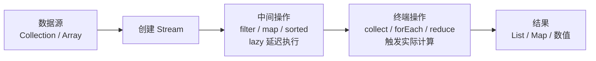

# Stream 流处理

## 学习目标

- 理解 Stream 并非数据结构，而是惰性求值与流水线(Pipeline)模型
- 区分中间操作(惰性：map/filter/sorted)与终结操作(触发：collect/forEach/count)
- 掌握常用操作：map/flatMap/filter/distinct/sorted/reduce/collect
- 理解并行流 parallelStream 的 fork-join 机制与线程安全前提
- 识别流只能消费一次、无状态/有状态操作、装箱开销等陷阱

## 核心概念

### 什么是 Stream?



Stream 是 Java 8 引入的一种用于处理数据序列的抽象概念。它**不是数据结构,不存储数据**,而是按需计算数据,类似于数据库查询操作的流水线。

### Stream vs Collection

| 特性 | Collection | Stream |
|------|-----------|--------|
| 存储 | 存储数据 | 不存储数据,按需计算 |
| 迭代 | 外部迭代(for-each) | 内部迭代(自动优化) |
| 复用 | 可多次遍历 | 只能消费一次 |
| 操作 | 修改数据源 | 不修改数据源(生成新流) |
| 惰性 | 立即执行 | 中间操作惰性求值 |

### Stream 的核心特性

1. **声明式编程**: 告诉"做什么",而非"怎么做"
   ```java
   // 命令式编程
   List<String> names = new ArrayList<>();
   for (String s : list) {
       if (s.length() > 5) {
           names.add(s.toUpperCase());
       }
   }
   
   // 声明式编程 (Stream)
   List<String> names = list.stream()
       .filter(s -> s.length() > 5)
       .map(String::toUpperCase)
       .collect(Collectors.toList());
   ```

2. **链式操作**: 多个操作串联形成流水线
   ```java
   list.stream()
       .filter(x -> x > 0)      // 过滤
       .map(x -> x * x)         // 映射
       .sorted()                // 排序
       .limit(10)               // 限制
       .collect(toList());      // 收集
   ```

3. **惰性求值**: 中间操作不立即执行,遇到终端操作才执行
   ```java
   Stream<Integer> stream = list.stream()
       .filter(x -> {
           System.out.println("过滤: " + x); // 不会打印
           return x > 0;
       }); // 没有终端操作,不会执行
   
   stream.collect(toList()); // 此时会执行
   ```

4. **并行处理**: 自动利用多核 CPU 提升性能
   ```java
   long count = list.parallelStream()
       .filter(x -> x > 0)
       .count();
   ```

## Stream 的创建方式

### 1. 从集合创建

最常用的创建方式,所有实现了 `Collection` 接口的类都有 `stream()` 方法。

```java
List<String> list = Arrays.asList("a", "b", "c");

// 创建顺序流
Stream<String> stream = list.stream();

// 创建并行流
Stream<String> parallelStream = list.parallelStream();
```

### 2. 从数组创建

使用 `Arrays.stream()` 方法。

```java
String[] array = {"a", "b", "c"};
Stream<String> stream = Arrays.stream(array);

// 基本类型数组
int[] intArray = {1, 2, 3, 4, 5};
IntStream intStream = Arrays.stream(intArray);
```

### 3. 使用 Stream.of()

直接创建包含指定元素的流。

```java
Stream<String> stream = Stream.of("a", "b", "c");

// 创建空流
Stream<String> emptyStream = Stream.empty();
```

### 4. 无限流

使用 `Stream.generate()` 和 `Stream.iterate()` 创建无限流,**必须配合 limit 使用**。

```java
// generate: 通过 Supplier 生成元素
Stream<Double> randoms = Stream.generate(Math::random)
    .limit(5); // 生成 5 个随机数

// iterate: 通过迭代函数生成元素
Stream<Integer> numbers = Stream.iterate(0, n -> n + 2)
    .limit(5); // 0, 2, 4, 6, 8

// Java 9+ 增强版 iterate (带终止条件)
Stream<Integer> evenBelow10 = Stream.iterate(0, n -> n < 10, n -> n + 2); // 0, 2, 4, 6, 8
```

### 5. 其他创建方式

```java
// 文件行流
Stream<String> lines = Files.lines(Paths.get("file.txt"));

// 字符串字符流
IntStream chars = "abc".chars();

// 数值范围
IntStream range = IntStream.range(1, 10);     // [1, 10)
IntStream rangeClosed = IntStream.rangeClosed(1, 10); // [1, 10]
```

## Stream 的操作分类

Stream 操作分为两大类:

- **中间操作 (Intermediate Operations)**: 返回新的 Stream,可链式调用,惰性求值
- **终端操作 (Terminal Operations)**: 触发执行,产生结果或副作用,消费 Stream

```
数据源 → 中间操作1 → 中间操作2 → ... → 终端操作 → 结果
         (惰性)       (惰性)         (立即执行)
```

### 中间操作 vs 终端操作

| 类型 | 中间操作 | 终端操作 |
|------|---------|---------|
| 返回值 | Stream | 非Stream(值/集合/void) |
| 执行时机 | 惰性求值 | 立即执行 |
| 可链式 | 可以 | 不可以 |
| 示例 | filter, map, sorted | collect, forEach, count |

## 中间操作详解

### 1. filter - 过滤

保留满足条件的元素。

```java
List<Integer> numbers = Arrays.asList(1, 2, 3, 4, 5, 6);

List<Integer> evens = numbers.stream()
    .filter(n -> n % 2 == 0)
    .collect(Collectors.toList());
// [2, 4, 6]

// 多个 filter 等价于 && 条件
List<Integer> result = numbers.stream()
    .filter(n -> n > 2)
    .filter(n -> n < 6)
    .collect(Collectors.toList());
// [3, 4, 5]
```

**性能提示**: filter 只决定保留哪些元素,不改变元素本身。

### 2. map - 映射转换

将每个元素转换为新形式。

```java
List<String> names = Arrays.asList("Alice", "Bob", "Charlie");

// 转换为大写
List<String> upperNames = names.stream()
    .map(String::toUpperCase)
    .collect(Collectors.toList());
// ["ALICE", "BOB", "CHARLIE"]

// 提取长度
List<Integer> lengths = names.stream()
    .map(String::length)
    .collect(Collectors.toList());
// [5, 3, 7]
```

### 3. flatMap - 扁平化映射

将每个元素映射为流,然后将所有流合并为一个流。**用于处理嵌套结构**。

```java
List<List<Integer>> nested = Arrays.asList(
    Arrays.asList(1, 2),
    Arrays.asList(3, 4, 5),
    Arrays.asList(6)
);

// 扁平化为一维列表
List<Integer> flattened = nested.stream()
    .flatMap(List::stream)
    .collect(Collectors.toList());
// [1, 2, 3, 4, 5, 6]

// 字符串拆分为字符
List<String> words = Arrays.asList("Hello", "World");
List<String> chars = words.stream()
    .flatMap(word -> Arrays.stream(word.split("")))
    .distinct()
    .collect(Collectors.toList());
// ["H", "e", "l", "o", "W", "r", "d"]
```

**map vs flatMap**:
```java
// map: Stream<List<Integer>> → Stream<Stream<Integer>>
Stream<Stream<Integer>> result = nested.stream().map(List::stream);

// flatMap: Stream<List<Integer>> → Stream<Integer>
Stream<Integer> result = nested.stream().flatMap(List::stream);
```

### 4. distinct - 去重

去除重复元素(根据 equals 判断)。

```java
List<Integer> numbers = Arrays.asList(1, 2, 2, 3, 3, 3, 4);

List<Integer> distinct = numbers.stream()
    .distinct()
    .collect(Collectors.toList());
// [1, 2, 3, 4]
```

**性能注意**: distinct 需要维护一个 Set 来判断重复,对大数据集有内存开销。

### 5. sorted - 排序

对流元素排序。

```java
List<Integer> numbers = Arrays.asList(5, 3, 8, 1, 2);

// 自然排序
List<Integer> sorted = numbers.stream()
    .sorted()
    .collect(Collectors.toList());
// [1, 2, 3, 5, 8]

// 自定义排序
List<Integer> reverseSorted = numbers.stream()
    .sorted(Comparator.reverseOrder())
    .collect(Collectors.toList());
// [8, 5, 3, 2, 1]

// 对象排序
List<Person> people = Arrays.asList(
    new Person("Alice", 30),
    new Person("Bob", 25),
    new Person("Charlie", 35)
);

List<Person> byAge = people.stream()
    .sorted(Comparator.comparing(Person::getAge))
    .collect(Collectors.toList());

// 多条件排序
List<Person> sorted = people.stream()
    .sorted(Comparator.comparing(Person::getAge)
        .thenComparing(Person::getName))
    .collect(Collectors.toList());
```

**性能注意**: sorted 是有状态操作,需要遍历所有元素后才能排序。

### 6. limit 和 skip - 限制和跳过

- `limit(n)`: 保留前 n 个元素
- `skip(n)`: 跳过前 n 个元素

```java
List<Integer> numbers = Arrays.asList(1, 2, 3, 4, 5, 6, 7, 8, 9, 10);

// 保留前 3 个
List<Integer> first3 = numbers.stream()
    .limit(3)
    .collect(Collectors.toList());
// [1, 2, 3]

// 跳过前 3 个
List<Integer> skip3 = numbers.stream()
    .skip(3)
    .collect(Collectors.toList());
// [4, 5, 6, 7, 8, 9, 10]

// 分页: 第 2 页,每页 3 条
List<Integer> page2 = numbers.stream()
    .skip(3)  // 跳过第 1 页
    .limit(3) // 取 3 条
    .collect(Collectors.toList());
// [4, 5, 6]
```

**性能优势**: limit 是短路操作,无需处理所有元素;skip 需要先跳过 n 个元素,不属于短路操作。

### 7. peek - 查看元素

主要用于调试,查看流中的元素而不修改。

```java
List<Integer> result = numbers.stream()
    .filter(n -> n % 2 == 0)
    .peek(n -> System.out.println("过滤后: " + n))
    .map(n -> n * n)
    .peek(n -> System.out.println("映射后: " + n))
    .collect(Collectors.toList());
```

### 8. takeWhile / dropWhile - 条件截取（Java 9+）

`takeWhile` 从头部开始**持续取满足条件的元素，遇到第一个不满足即停止**；`dropWhile` 相反，**跳过开头满足条件的元素，遇到第一个不满足后保留余下全部**。二者均要求流有序。

```java
List<Integer> numbers = Arrays.asList(1, 2, 3, 4, 5, 1, 2);

// takeWhile: 取 [1, 2, 3]，遇到 4（不满足 <4）即停
List<Integer> taken = numbers.stream()
    .takeWhile(n -> n < 4)
    .collect(Collectors.toList());
// [1, 2, 3]

// dropWhile: 跳过 [1, 2, 3]，保留 [4, 5, 1, 2]
List<Integer> dropped = numbers.stream()
    .dropWhile(n -> n < 4)
    .collect(Collectors.toList());
// [4, 5, 1, 2]

// 与 filter 的区别：filter 会遍历全部元素
List<Integer> filtered = numbers.stream()
    .filter(n -> n < 4)
    .collect(Collectors.toList());
// [1, 2, 3, 1, 2]
```

> **适用场景**：处理已排序/有序数据（如日志时间序列、按序递增的数据），可在不遍历完整流的情况下提前终止（短路）。

### 9. 其他 Java 9+ 增强

- `Stream.ofNullable(T)`：包装可能为 null 的元素，避免 NPE（Java 9）
- `Stream.iterate(seed, hasNext, next)`：带终止条件的迭代（Java 9）
- `Stream.toList()`：不可变列表收集（Java 16）

```java
// ofNullable 示例
Stream.ofNullable(null).count();   // 0
Stream.ofNullable("a").count();   // 1

// toList 示例（Java 16+，返回不可变 List；与 Collectors.toUnmodifiableList 不同,允许 null 元素）
List<String> immutable = stream.toList();
```

## 终端操作详解

### 1. collect - 收集器

最强大的终端操作,将流元素收集到各种数据结构。

详见 [Collectors 收集器详解](#collectors-收集器详解) 章节。

### 2. forEach - 遍历

对每个元素执行操作,无返回值。

```java
List<String> names = Arrays.asList("Alice", "Bob", "Charlie");

// 遍历打印
names.stream().forEach(System.out::println);

// 等价于
names.forEach(System.out::println);

// 并行流遍历 (顺序不保证)
names.parallelStream().forEach(System.out::println);

// 并行流保持顺序遍历
names.parallelStream().forEachOrdered(System.out::println);
```

### 3. count - 计数

返回元素数量。

```java
long count = list.stream()
    .filter(s -> s.length() > 5)
    .count();
```

### 4. reduce - 归约

将流元素组合成单个结果。

```java
List<Integer> numbers = Arrays.asList(1, 2, 3, 4, 5);

// 形式1: 无初始值,返回 Optional
Optional<Integer> sum = numbers.stream()
    .reduce((a, b) -> a + b);
// Optional[15]

// 形式2: 有初始值
Integer sum = numbers.stream()
    .reduce(0, (a, b) -> a + b);
// 15

// 求最大值
Optional<Integer> max = numbers.stream()
    .reduce(Integer::max);

// 字符串拼接
String result = Stream.of("a", "b", "c")
    .reduce("", (s1, s2) -> s1 + s2);
// "abc"
```

**reduce 工作原理**:
```
初始值: 0
元素: [1, 2, 3, 4, 5]

计算过程:
0 + 1 = 1
1 + 2 = 3
3 + 3 = 6
6 + 4 = 10
10 + 5 = 15
结果: 15
```

### 5. 匹配操作

- `anyMatch`: 任意一个匹配返回 true
- `allMatch`: 全部匹配返回 true
- `noneMatch`: 全部不匹配返回 true

```java
List<Integer> numbers = Arrays.asList(1, 2, 3, 4, 5);

// 是否存在偶数
boolean hasEven = numbers.stream()
    .anyMatch(n -> n % 2 == 0);
// true

// 是否全是正数
boolean allPositive = numbers.stream()
    .allMatch(n -> n > 0);
// true

// 是否没有负数
boolean noNegative = numbers.stream()
    .noneMatch(n -> n < 0);
// true
```

**性能优势**: 匹配操作是短路操作,找到结果立即返回。

### 6. 查找操作

- `findFirst`: 返回第一个元素
- `findAny`: 返回任意一个元素(并行流中更快)

```java
List<Integer> numbers = Arrays.asList(1, 2, 3, 4, 5);

// 找到第一个偶数
Optional<Integer> firstEven = numbers.stream()
    .filter(n -> n % 2 == 0)
    .findFirst();
// Optional[2]

// 找到任意偶数 (并行流推荐)
Optional<Integer> anyEven = numbers.parallelStream()
    .filter(n -> n % 2 == 0)
    .findAny();
```

**findFirst vs findAny**:
- 顺序流: 两者结果相同
- 并行流: `findAny` 性能更好,不保证顺序

### 7. 最值操作

```java
List<Integer> numbers = Arrays.asList(3, 1, 4, 1, 5, 9);

Optional<Integer> max = numbers.stream().max(Integer::compare);
// Optional[9]

Optional<Integer> min = numbers.stream().min(Integer::compare);
// Optional[1]

// 对象最值
Optional<Person> oldest = people.stream()
    .max(Comparator.comparing(Person::getAge));
```

### 8. 数组转换

```java
List<String> list = Arrays.asList("a", "b", "c");

// 转为 Object 数组
Object[] array = list.stream().toArray();

// 转为指定类型数组
String[] strArray = list.stream().toArray(String[]::new);
```

## Collectors 收集器详解

`Collectors` 工具类提供了丰富的收集器实现。

### 1. 转换为集合

```java
List<String> names = Arrays.asList("Alice", "Bob", "Charlie");

// List
List<String> list = names.stream().collect(Collectors.toList());

// Set (去重)
Set<String> set = names.stream().collect(Collectors.toSet());

// 指定集合类型
LinkedList<String> linkedList = names.stream()
    .collect(Collectors.toCollection(LinkedList::new));

TreeSet<String> treeSet = names.stream()
    .collect(Collectors.toCollection(TreeSet::new));
```

### 2. 转换为 Map

```java
List<Person> people = Arrays.asList(
    new Person("Alice", 30),
    new Person("Bob", 25)
);

// 基本转换: name -> age
Map<String, Integer> nameToAge = people.stream()
    .collect(Collectors.toMap(
        Person::getName,  // key mapper
        Person::getAge    // value mapper
    ));
// {Alice=30, Bob=25}

// 处理 key 冲突
List<Person> people = Arrays.asList(
    new Person("Alice", 30),
    new Person("Alice", 25) // 重复 name
);

Map<String, Integer> nameToAge = people.stream()
    .collect(Collectors.toMap(
        Person::getName,
        Person::getAge,
        (oldVal, newVal) -> newVal  // 保留新值
    ));
// {Alice=25}

// 指定 Map 类型
TreeMap<String, Integer> treeMap = people.stream()
    .collect(Collectors.toMap(
        Person::getName,
        Person::getAge,
        (old, newVal) -> newVal,
        TreeMap::new
    ));
```

### 3. 字符串拼接

```java
List<String> names = Arrays.asList("Alice", "Bob", "Charlie");

// 直接拼接
String joined = names.stream()
    .collect(Collectors.joining());
// "AliceBobCharlie"

// 指定分隔符
String joined = names.stream()
    .collect(Collectors.joining(", "));
// "Alice, Bob, Charlie"

// 指定前后缀
String joined = names.stream()
    .collect(Collectors.joining(", ", "[", "]"));
// "[Alice, Bob, Charlie]"
```

### 4. 分组 (groupingBy)

根据分类函数对元素分组。

```java
List<Person> people = Arrays.asList(
    new Person("Alice", 30, "IT"),
    new Person("Bob", 25, "HR"),
    new Person("Charlie", 30, "IT"),
    new Person("David", 25, "HR")
);

// 基本分组: 年龄 -> 人员列表
Map<Integer, List<Person>> byAge = people.stream()
    .collect(Collectors.groupingBy(Person::getAge));
// {
//   25: [Bob, David],
//   30: [Alice, Charlie]
// }

// 分组后统计数量
Map<Integer, Long> countByAge = people.stream()
    .collect(Collectors.groupingBy(
        Person::getAge,
        Collectors.counting()
    ));
// {25: 2, 30: 2}

// 多级分组: 部门 -> 年龄 -> 人员
Map<String, Map<Integer, List<Person>>> byDeptAndAge = people.stream()
    .collect(Collectors.groupingBy(
        Person::getDepartment,
        Collectors.groupingBy(Person::getAge)
    ));

// 分组后求平均值
Map<Integer, Double> avgSalaryByAge = people.stream()
    .collect(Collectors.groupingBy(
        Person::getAge,
        Collectors.averagingDouble(Person::getSalary)
    ));
```

### 5. 分区 (partitioningBy)

根据谓词将元素分为两组: true 和 false。

```java
List<Integer> numbers = Arrays.asList(1, 2, 3, 4, 5, 6);

// 奇偶分区
Map<Boolean, List<Integer>> byEven = numbers.stream()
    .collect(Collectors.partitioningBy(n -> n % 2 == 0));
// {
//   false: [1, 3, 5],
//   true: [2, 4, 6]
// }

// 分区后统计
Map<Boolean, Long> countByEven = numbers.stream()
    .collect(Collectors.partitioningBy(
        n -> n % 2 == 0,
        Collectors.counting()
    ));
// {false: 3, true: 3}
```

**groupingBy vs partitioningBy**:
- `groupingBy`: 可以分为多组
- `partitioningBy`: 只能分为两组 (true/false)

### 6. 聚合统计

```java
List<Integer> numbers = Arrays.asList(1, 2, 3, 4, 5);

// 求和
Integer sum = numbers.stream()
    .collect(Collectors.summingInt(Integer::intValue));
// 15

// 平均值
Double avg = numbers.stream()
    .collect(Collectors.averagingInt(Integer::intValue));
// 3.0

// 统计摘要 (一次性获取多个统计值)
IntSummaryStatistics stats = numbers.stream()
    .collect(Collectors.summarizingInt(Integer::intValue));
// stats.getCount() = 5
// stats.getSum() = 15
// stats.getAverage() = 3.0
// stats.getMax() = 5
// stats.getMin() = 1
```

### 7. 自定义收集器

```java
// 使用 Collector.of 创建自定义收集器
Collector<String, StringBuilder, String> collector = Collector.of(
    StringBuilder::new,              // 供应器
    (sb, s) -> sb.append(s).append(" "), // 累加器
    (sb1, sb2) -> sb1.append(sb2),   // 组合器 (并行)
    StringBuilder::toString          // 完成器
);

String result = Stream.of("a", "b", "c").collect(collector);
// "a b c "
```

## Stream 与 Lambda 的配合使用

Stream API 与 Lambda 表达式天然契合,是函数式编程的最佳实践。

### 1. 方法引用简化

```java
List<String> names = Arrays.asList("Alice", "bob", "charlie");

// Lambda 表达式
List<String> upper1 = names.stream()
    .map(s -> s.toUpperCase())
    .collect(Collectors.toList());

// 方法引用 (更简洁)
List<String> upper2 = names.stream()
    .map(String::toUpperCase)
    .collect(Collectors.toList());

// 静态方法引用
List<Integer> parsed = Stream.of("1", "2", "3")
    .map(Integer::parseInt)
    .collect(Collectors.toList());

// 构造方法引用
List<Person> persons = names.stream()
    .map(Person::new)
    .collect(Collectors.toList());
```

### 2. 复合 Lambda 表达式

```java
// Predicate 复合
Predicate<Person> adult = p -> p.getAge() >= 18;
Predicate<Person> male = p -> p.getGender() == Gender.MALE;
Predicate<Person> adultMale = adult.and(male);

List<Person> result = people.stream()
    .filter(adultMale)
    .collect(Collectors.toList());

// Comparator 复合
Comparator<Person> byAge = Comparator.comparing(Person::getAge);
Comparator<Person> byName = Comparator.comparing(Person::getName);

List<Person> sorted = people.stream()
    .sorted(byAge.thenComparing(byName.reversed()))
    .collect(Collectors.toList());

// Function 复合
Function<String, Integer> toInt = Integer::parseInt;
Function<Integer, Integer> square = x -> x * x;
Function<String, Integer> toIntAndSquare = toInt.andThen(square);

List<Integer> result = Stream.of("1", "2", "3")
    .map(toIntAndSquare)
    .collect(Collectors.toList());
// [1, 4, 9]
```

### 3. 实用 Lambda 模式

```java
// 模式1: 提取方法引用
public class Utils {
    public static boolean isValid(String s) {
        return s != null && !s.isEmpty();
    }
}

List<String> valid = strings.stream()
    .filter(Utils::isValid)
    .collect(Collectors.toList());

// 模式2: 使用 Predicate 组合
public class PersonPredicates {
    public static Predicate<Person> isAdult() {
        return p -> p.getAge() >= 18;
    }
    
    public static Predicate<Person> hasName(String name) {
        return p -> p.getName().equals(name);
    }
}

List<Person> result = people.stream()
    .filter(PersonPredicates.isAdult()
        .and(PersonPredicates.hasName("Alice")))
    .collect(Collectors.toList());

// 模式3: 使用 Function 转换链
Function<Person, String> getName = Person::getName;
Function<String, String> toUpper = String::toUpperCase;
Function<Person, String> getUpperName = getName.andThen(toUpper);

List<String> names = people.stream()
    .map(getUpperName)
    .collect(Collectors.toList());
```

## 并行流 (Parallel Stream)

### 什么是并行流?

并行流利用 Fork/Join 框架,将数据拆分成多个部分,在多个线程上并行处理,最后合并结果。

```java
List<Integer> numbers = IntStream.rangeClosed(1, 100)
    .boxed()
    .collect(Collectors.toList());

// 顺序流
long sum1 = numbers.stream()
    .mapToLong(Integer::longValue)
    .sum();

// 并行流
long sum2 = numbers.parallelStream()
    .mapToLong(Integer::longValue)
    .sum();

// 或: stream().parallel()
long sum3 = numbers.stream()
    .parallel()
    .mapToLong(Integer::longValue)
    .sum();
```

### 并行流原理

```
原始数据: [1, 2, 3, 4, 5, 6, 7, 8]
          ↓
      Fork (拆分)
          ↓
[1,2,3,4]    [5,6,7,8]
    ↓             ↓
线程1处理     线程2处理
    ↓             ↓
  结果1         结果2
          ↓
      Join (合并)
          ↓
    最终结果
```

### 何时使用并行流?

**适合场景**:
- 数据量大 (建议 > 10000)
- 计算密集型操作
- 无状态操作 (filter, map)
- 无顺序要求

**不适合场景**:
- 数据量小 (线程开销 > 性能提升)
- I/O 密集型操作
- 有状态操作 (sorted, distinct, limit)
- 需要顺序保证的操作

### 并行流性能测试

```java
public class ParallelStreamBenchmark {
    public static void main(String[] args) {
        List<Integer> numbers = IntStream.rangeClosed(1, 10_000_000)
            .boxed()
            .collect(Collectors.toList());
        
        // 顺序流
        long start = System.currentTimeMillis();
        long sum1 = numbers.stream()
            .mapToLong(Integer::longValue)
            .sum();
        long time1 = System.currentTimeMillis() - start;
        
        // 并行流
        start = System.currentTimeMillis();
        long sum2 = numbers.parallelStream()
            .mapToLong(Integer::longValue)
            .sum();
        long time2 = System.currentTimeMillis() - start;
        
        System.out.println("顺序流: " + time1 + "ms");
        System.out.println("并行流: " + time2 + "ms");
        System.out.println("加速比: " + (double)time1/time2);
    }
}
```

### 并行流注意事项

#### 1. 线程安全问题

```java
// 错误示例: 共享可变状态
List<Integer> results = new ArrayList<>();
IntStream.range(0, 1000)
    .parallel()
    .forEach(i -> results.add(i)); // 线程不安全!

// 正确示例: 使用线程安全集合
List<Integer> results = IntStream.range(0, 1000)
    .parallel()
    .boxed()
    .collect(Collectors.toList());
```

#### 2. 顺序问题

```java
List<Integer> list = Arrays.asList(1, 2, 3, 4, 5);

// forEach 顺序不保证
list.parallelStream().forEach(System.out::println);
// 可能输出: 3 1 4 2 5

// forEachOrdered 保证顺序
list.parallelStream().forEachOrdered(System.out::println);
// 输出: 1 2 3 4 5

// findAny 不保证找到第一个
Optional<Integer> any = list.parallelStream()
    .filter(n -> n > 0)
    .findAny(); // 可能返回任意元素
```

#### 3. 自定义线程池

```java
// 默认使用公共 ForkJoinPool
// 可以自定义线程池
ForkJoinPool customPool = new ForkJoinPool(4);

List<Integer> list = IntStream.range(0, 100).boxed()
    .collect(Collectors.toList());

Future<Long> future = customPool.submit(() ->
    list.parallelStream()
        .mapToLong(Integer::longValue)
        .sum()
);

Long sum = future.get();
customPool.shutdown();
```

## 实战案例

### 案例1: 数据处理管道

```java
public class DataPipeline {
    public static void main(String[] args) {
        List<Order> orders = Arrays.asList(
            new Order("A001", 100.0, "NEW"),
            new Order("A002", 200.0, "PROCESSING"),
            new Order("A003", 150.0, "NEW"),
            new Order("A004", 300.0, "COMPLETED"),
            new Order("A005", 250.0, "NEW")
        );
        
        // 需求: 找出所有 NEW 状态的订单,按金额降序,取前3个
        List<Order> result = orders.stream()
            .filter(order -> "NEW".equals(order.getStatus()))
            .sorted(Comparator.comparing(Order::getAmount).reversed())
            .limit(3)
            .collect(Collectors.toList());
        
        // 需求: 计算所有 NEW 状态订单的总金额
        double totalAmount = orders.stream()
            .filter(order -> "NEW".equals(order.getStatus()))
            .mapToDouble(Order::getAmount)
            .sum();
        
        // 需求: 按状态分组,统计每个状态的订单数量
        Map<String, Long> countByStatus = orders.stream()
            .collect(Collectors.groupingBy(
                Order::getStatus,
                Collectors.counting()
            ));
        
        // 需求: 按状态分组,计算每个状态的总金额
        Map<String, Double> amountByStatus = orders.stream()
            .collect(Collectors.groupingBy(
                Order::getStatus,
                Collectors.summingDouble(Order::getAmount)
            ));
    }
}
```

### 案例2: 文本分析

```java
public class TextAnalysis {
    public static void main(String[] args) throws IOException {
        String text = "Hello World! Java Stream API is powerful. " +
                     "Stream processing is declarative.";
        
        // 统计单词频率
        Map<String, Long> wordFrequency = Arrays.stream(text.split("\\s+"))
            .map(String::toLowerCase)
            .map(word -> word.replaceAll("[^a-z]", ""))
            .filter(word -> !word.isEmpty())
            .collect(Collectors.groupingBy(
                Function.identity(),
                Collectors.counting()
            ));
        
        // 找出频率最高的3个单词
        List<Map.Entry<String, Long>> top3 = wordFrequency.entrySet().stream()
            .sorted(Map.Entry.<String, Long>comparingByValue().reversed())
            .limit(3)
            .collect(Collectors.toList());
        
        System.out.println("Top 3 words: " + top3);
    }
}
```

### 案例3: 数据库查询结果处理

```java
public class DatabaseResultProcessing {
    public static void main(String[] args) {
        // 模拟数据库查询结果
        List<Employee> employees = Arrays.asList(
            new Employee("Alice", "IT", 80000),
            new Employee("Bob", "IT", 75000),
            new Employee("Charlie", "HR", 65000),
            new Employee("David", "HR", 70000),
            new Employee("Eve", "IT", 90000)
        );
        
        // 需求: 按部门分组,找出每个部门薪资最高的员工
        Map<String, Optional<Employee>> topPaidByDept = employees.stream()
            .collect(Collectors.groupingBy(
                Employee::getDepartment,
                Collectors.maxBy(Comparator.comparing(Employee::getSalary))
            ));
        
        // 需求: 按部门分组,计算每个部门的平均薪资
        Map<String, Double> avgSalaryByDept = employees.stream()
            .collect(Collectors.groupingBy(
                Employee::getDepartment,
                Collectors.averagingDouble(Employee::getSalary)
            ));
        
        // 需求: 找出薪资高于平均值的员工
        double avgSalary = employees.stream()
            .mapToDouble(Employee::getSalary)
            .average()
            .orElse(0.0);
        
        List<Employee> aboveAvg = employees.stream()
            .filter(e -> e.getSalary() > avgSalary)
            .collect(Collectors.toList());
        
        // 需求: 生成部门员工名单字符串
        Map<String, String> deptEmployeeList = employees.stream()
            .collect(Collectors.groupingBy(
                Employee::getDepartment,
                Collectors.mapping(
                    Employee::getName,
                    Collectors.joining(", ")
                )
            ));
        // {HR=Charlie, David, IT=Alice, Bob, Eve}（HashMap 迭代顺序取决于哈希）
    }
}
```

### 案例4: 文件处理

```java
public class FileProcessing {
    public static void main(String[] args) throws IOException {
        // 读取文件,处理每一行
        Path path = Paths.get("data.txt");
        
        // 统计文件行数
        long lineCount = Files.lines(path).count();
        
        // 查找包含特定单词的行
        List<String> matchingLines = Files.lines(path)
            .filter(line -> line.contains("Java"))
            .collect(Collectors.toList());
        
        // 提取所有单词并去重
        Set<String> uniqueWords = Files.lines(path)
            .flatMap(line -> Arrays.stream(line.split("\\s+")))
            .map(String::toLowerCase)
            .collect(Collectors.toSet());
        
        // 按行长度分组
        Map<Integer, List<String>> linesByLength = Files.lines(path)
            .collect(Collectors.groupingBy(String::length));
    }
}
```

### 案例5: 复杂对象转换

```java
public class ComplexTransformation {
    public static void main(String[] args) {
        List<Department> departments = Arrays.asList(
            new Department("IT", Arrays.asList(
                new Employee("Alice", 80000),
                new Employee("Bob", 75000)
            )),
            new Department("HR", Arrays.asList(
                new Employee("Charlie", 65000),
                new Employee("David", 70000)
            ))
        );
        
        // 需求: 获取所有员工名单
        List<Employee> allEmployees = departments.stream()
            .flatMap(dept -> dept.getEmployees().stream())
            .collect(Collectors.toList());
        
        // 需求: 计算公司总薪资
        double totalSalary = departments.stream()
            .flatMap(dept -> dept.getEmployees().stream())
            .mapToDouble(Employee::getSalary)
            .sum();
        
        // 需求: 找出薪资最高的员工
        Optional<Employee> highestPaid = departments.stream()
            .flatMap(dept -> dept.getEmployees().stream())
            .max(Comparator.comparing(Employee::getSalary));
        
        // 需求: 按部门统计员工数量
        Map<String, Integer> employeeCountByDept = departments.stream()
            .collect(Collectors.toMap(
                Department::getName,
                dept -> dept.getEmployees().size()
            ));
    }
}
```

## 性能优化技巧

### 1. 使用原始类型流

对于基本类型,使用 `IntStream`、`LongStream`、`DoubleStream` 避免装箱拆箱开销。

```java
// 慢: 使用 Integer
int sum1 = numbers.stream()
    .mapToInt(Integer::intValue)
    .sum();

// 快: 使用 IntStream
int sum2 = numbers.stream()
    .mapToInt(n -> n)
    .sum();

// 更快: 直接使用 IntStream
int sum3 = IntStream.of(intArray).sum();
```

### 2. 合理使用短路操作

短路操作可以在找到结果后立即停止。

```java
// 短路操作: anyMatch, allMatch, noneMatch, findFirst, findAny, limit

// 非短路: 需要处理所有元素
boolean hasEven = numbers.stream()
    .filter(n -> n % 2 == 0)
    .count() > 0; // 遍历所有元素

// 短路: 找到就停止
boolean hasEven = numbers.stream()
    .anyMatch(n -> n % 2 == 0); // 找到第一个就返回
```

### 3. 避免有状态操作

有状态操作会影响并行性能。

```java
// 有状态操作 (性能影响大)
List<Integer> result = numbers.parallelStream()
    .distinct()    // 需要维护 Set
    .sorted()      // 需要排序所有元素
    .collect(Collectors.toList());

// 无状态操作 (性能好)
List<Integer> result = numbers.parallelStream()
    .filter(n -> n > 0)  // 无状态
    .map(n -> n * 2)     // 无状态
    .collect(Collectors.toList());
```

### 4. 减少操作链长度

将多个操作合并为单个操作。

```java
// 慢: 多个 map 操作
List<String> result = names.stream()
    .map(String::trim)
    .map(String::toLowerCase)
    .map(s -> s.substring(0, 3))
    .collect(Collectors.toList());

// 快: 合并为一个 map
List<String> result = names.stream()
    .map(s -> s.trim().toLowerCase().substring(0, 3))
    .collect(Collectors.toList());
```

### 5. 使用合适的收集器

```java
// 慢: 先转 List 再转 Set
Set<String> set = stream.collect(Collectors.toList())
    .stream()
    .collect(Collectors.toSet());

// 快: 直接转 Set
Set<String> set = stream.collect(Collectors.toSet());
```

## 常见误区与陷阱

### 陷阱1: 流只能消费一次

```java
Stream<String> stream = Stream.of("a", "b", "c");

// 第一次消费
stream.forEach(System.out::println); // OK

// 第二次消费
stream.forEach(System.out::println); // IllegalStateException: 流已被操作或关闭

// 解决方案: 重新创建流
Stream<String> stream2 = Stream.of("a", "b", "c");
```

### 陷阱2: 修改数据源

```java
List<String> list = new ArrayList<>(Arrays.asList("a", "b", "c"));

// 错误: 在流操作中修改数据源
list.stream().forEach(s -> {
    if (s.equals("b")) {
        list.remove(s); // ConcurrentModificationException
    }
});

// 正确: 使用 removeIf
list.removeIf(s -> s.equals("b"));
```

### 陷阱3: 忽略返回值

```java
// 错误: filter 返回新流,丢弃返回值等于什么都没做
Stream<String> stream = Stream.of("a", "b", "c");
stream.filter(s -> s.startsWith("a")); // 新流被丢弃,过滤不生效
// 此后再对原流做终端操作会抛 IllegalStateException(流已被使用)
// System.out.println(stream.count());

// 正确: 使用返回值
long count = Stream.of("a", "b", "c")
    .filter(s -> s.startsWith("a"))
    .count();
System.out.println(count); // 1
```

### 陷阱4: 并行流顺序问题

```java
List<Integer> list = Arrays.asList(1, 2, 3, 4, 5);

// forEach 不保证顺序
list.parallelStream()
    .forEach(System.out::print); // 可能: 35124

// 需要顺序时使用 forEachOrdered
list.parallelStream()
    .forEachOrdered(System.out::print); // 12345

// limit 在并行流中性能差
list.parallelStream()
    .limit(2) // 需要等待前面的元素处理完
    .collect(Collectors.toList());
```

### 陷阱5: 自动装箱陷阱

```java
// 慢: 自动装箱
int sum1 = IntStream.range(0, 1000)
    .boxed()
    .mapToInt(Integer::intValue)
    .sum();

// 快: 直接使用原始类型流
int sum2 = IntStream.range(0, 1000)
    .sum();
```

### 陷阱6: Optional 误用

```java
// 错误: 不检查 Optional 是否存在
Person person = people.stream()
    .filter(p -> p.getName().equals("Unknown"))
    .findFirst()
    .get(); // NoSuchElementException!

// 正确: 使用 orElse 或 ifPresent
Person person = people.stream()
    .filter(p -> p.getName().equals("Unknown"))
    .findFirst()
    .orElse(null);

people.stream()
    .filter(p -> p.getName().equals("Unknown"))
    .findFirst()
    .ifPresent(p -> System.out.println(p.getName()));
```

### 陷阱7: NullPointerException

```java
List<String> list = Arrays.asList("a", null, "b");

// 可能 NPE
List<String> upper = list.stream()
    .map(String::toUpperCase) // null.toUpperCase() 抛 NPE
    .collect(Collectors.toList());

// 正确: 过滤 null
List<String> upper = list.stream()
    .filter(Objects::nonNull)
    .map(String::toUpperCase)
    .collect(Collectors.toList());

// 或使用 Optional
List<String> upper = list.stream()
    .map(Optional::ofNullable)
    .filter(Optional::isPresent)
    .map(Optional::get)
    .map(String::toUpperCase)
    .collect(Collectors.toList());
```

## Stream vs 传统循环对比

### 代码可读性

```java
// 传统循环
List<String> result = new ArrayList<>();
for (String s : list) {
    if (s.length() > 5) {
        String upper = s.toUpperCase();
        if (!result.contains(upper)) {
            result.add(upper);
        }
    }
}

// Stream (更清晰)
List<String> result = list.stream()
    .filter(s -> s.length() > 5)
    .map(String::toUpperCase)
    .distinct()
    .collect(Collectors.toList());
```

### 性能对比

```java
// 小数据集 (< 1000): 传统循环更快
List<String> result = new ArrayList<>();
for (String s : list) {
    if (s.length() > 5) {
        result.add(s);
    }
}

// 大数据集 (> 10000): 并行流更快
List<String> result = list.parallelStream()
    .filter(s -> s.length() > 5)
    .collect(Collectors.toList());

// 中等数据集: Stream 更易读,性能相当
```

**何时使用 Stream?**
- √ 数据转换和聚合操作
- √ 需要代码简洁性和可读性
- √ 大数据集并行处理
- × 需要修改元素的索引
- × 需要提前终止循环 (break)
- × 需要访问前一个/后一个元素

## 面试要点

### 1. Stream 的核心概念

**Q: 什么是 Stream? 它与 Collection 有什么区别?**

A: Stream 是 Java 8 引入的数据处理抽象,不是数据结构,不存储数据。区别:
- Stream 不存储数据,Collection 存储
- Stream 只能消费一次,Collection 可多次遍历
- Stream 使用内部迭代,Collection 使用外部迭代
- Stream 支持并行处理,Collection 不支持

### 2. Stream 操作分类

**Q: Stream 的操作分为哪几类? 有什么区别?**

A: 分为中间操作和终端操作:
- 中间操作: 返回新 Stream,可链式调用,惰性求值 (filter, map, sorted)
- 终端操作: 触发执行,产生结果,消费 Stream (collect, forEach, count)

### 3. 惰性求值

**Q: 什么是惰性求值? 有什么好处?**

A: 中间操作不会立即执行,只有在终端操作时才执行。好处:
1. 性能优化: 可能不需要处理所有元素
2. 短路操作: findFirst 找到就停止
3. 优化机会: 编译器可以优化操作链

### 4. 并行流

**Q: 什么时候应该使用并行流?**

A: 适合场景:
- 数据量大 (> 10000)
- 计算密集型
- 无状态操作
- 无顺序要求

不适合场景:
- 数据量小
- I/O 密集型
- 有状态操作
- 需要顺序保证

### 5. map vs flatMap

**Q: map 和 flatMap 有什么区别?**

A:
- map: 一对一映射,`Stream<T> → Stream<R>`
- flatMap: 一对多映射并扁平化,`Stream<T> → Stream<Stream<R>> → Stream<R>`

```java
// map: [1, 2, 3] → [1, 4, 9]
Stream.of(1, 2, 3).map(x -> x * x);

// flatMap: [[1,2], [3,4]] → [1, 2, 3, 4]
Stream.of(Arrays.asList(1, 2), Arrays.asList(3, 4))
    .flatMap(List::stream);
```

### 6. 常见面试题

**Q: 如何使用 Stream 去重?**

```java
// distinct
List<Integer> distinct = list.stream()
    .distinct()
    .collect(Collectors.toList());

// 根据属性去重
List<Person> distinctByName = people.stream()
    .collect(Collectors.toMap(
        Person::getName,
        Function.identity(),
        (old, newVal) -> old
    ))
    .values()
    .stream()
    .collect(Collectors.toList());
```

**Q: 如何使用 Stream 实现分页?**

```java
List<Integer> page = list.stream()
    .skip((pageNum - 1) * pageSize)
    .limit(pageSize)
    .collect(Collectors.toList());
```

**Q: 如何使用 Stream 统计单词频率?**

```java
Map<String, Long> frequency = text.lines()
    .flatMap(line -> Arrays.stream(line.split("\\s+")))
    .collect(Collectors.groupingBy(
        Function.identity(),
        Collectors.counting()
    ));
```

**Q: Stream 如何处理异常?**

A: Stream 的 Lambda 不能抛出受检异常,解决方案:
1. 在 Lambda 内部 try-catch
2. 包装方法
3. 使用工具类

```java
// 包装方法
public static Integer safeParse(String s) {
    try {
        return Integer.parseInt(s);
    } catch (NumberFormatException e) {
        return 0;
    }
}

List<Integer> numbers = strings.stream()
    .map(s -> safeParse(s))  // safeParse 为上方定义的静态方法
    .collect(Collectors.toList());
```

## 最佳实践总结

1. **优先使用方法引用**: 代码更简洁,可读性更好
   ```java
   .map(String::toUpperCase)  // 优于 .map(s -> s.toUpperCase())
   ```

2. **合理使用并行流**: 大数据集 + 计算密集型 + 无状态操作

3. **使用原始类型流**: 避免装箱拆箱开销

4. **避免副作用**: 不要在 Lambda 中修改外部状态

5. **使用短路操作**: 提前终止,提高性能

6. **注意 Optional**: 使用 `orElse`, `ifPresent` 而非 `get()`

7. **重构长操作链**: 将复杂操作提取为方法引用

8. **性能测试**: 在关键路径进行基准测试,选择最优方案

## 参考资料

- [Java Stream 官方文档](https://docs.oracle.com/javase/8/docs/api/java/util/stream/Stream.html)
- [Java 8 Stream 教程](https://www.baeldung.com/java-8-streams)
- [Java Stream 性能优化](https://www.baeldung.com/java-stream-performance)

## 总结

Stream API 是 Java 函数式编程的核心,掌握 Stream 能够:
- 编写简洁、易读的数据处理代码
- 利用并行流提升性能
- 使用丰富的操作符处理复杂数据转换

**关键点**:
1. 理解惰性求值机制
2. 掌握常用中间和终端操作
3. 熟练使用 Collectors
4. 了解并行流原理和适用场景
5. 避免常见陷阱

通过大量实践,逐步掌握 Stream 的精髓,写出优雅的函数式代码!

## 版本差异(旧版 → Java 21)

| 特性 | 旧版(Java 8) | Java 9/16/21 |
|------|--------------|--------------|
| 条件截取 | 只能 filter 全遍历 | `takeWhile`/`dropWhile`（Java 9）短路截取 |
| 空元素流 | 需手动判空 | `Stream.ofNullable()`（Java 9） |
| 迭代 | `iterate(seed, f)` 无限流 | `iterate(seed, hasNext, f)` 带终止条件（Java 9） |
| 收集为 List | `collect(Collectors.toList())` 可变 | `stream.toList()` 不可变（Java 16） |
| map 折叠 | `flatMap` 嵌套 | `mapMulti`（Java 16）减少中间集合创建 |

## 继续阅读

- 上一章：[Lambda 表达式与函数式接口](15-Lambda表达式与函数式接口)
- 下一章：[反射与注解](17-反射与注解)
