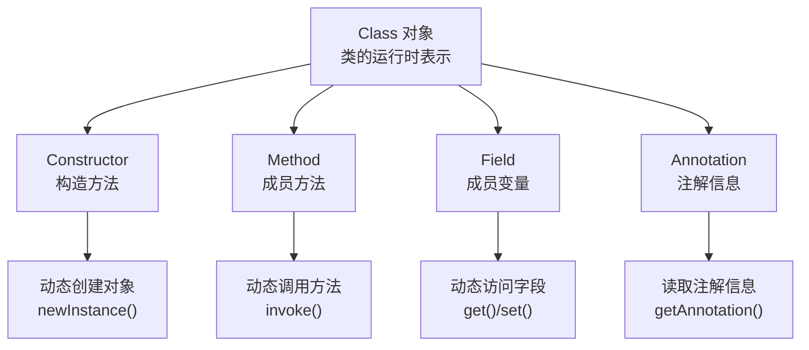
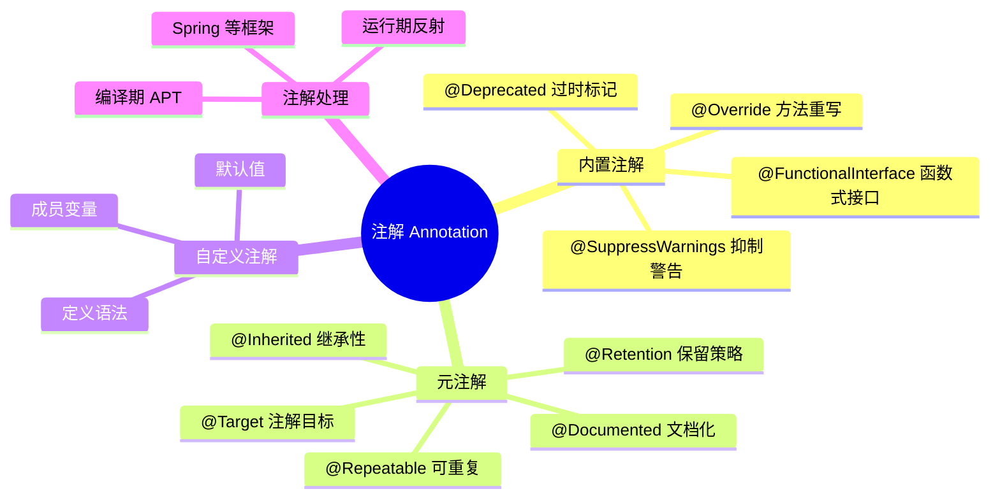
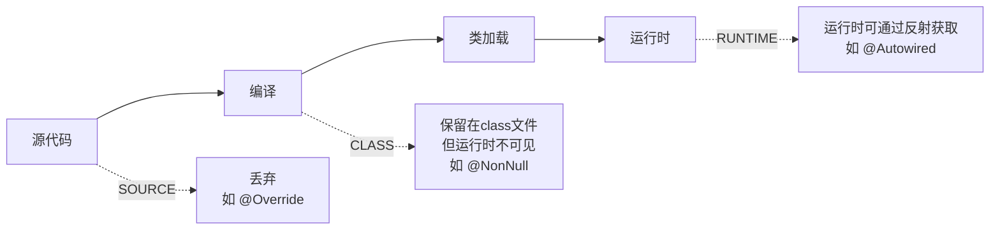

# 反射与注解

## 学习目标

- 理解 Class 对象的获取方式（.class / getClass / Class.forName）与类加载时机
- 掌握反射核心 API：Field/Method/Constructor 的获取与 setAccessible 绕过私有
- 区分内置注解(@Override/@Deprecated/@SuppressWarnings)与元注解(@Target/@Retention)
- 理解注解的本质（继承 Annotation 的接口）与运行时/编译期/源码期保留策略
- 识别反射破坏封装、性能开销、模块系统对反射的限制等注意点

反射（Reflection）和注解（Annotation）是 Java 语言中两个强大的高级特性。反射允许程序在运行时检查和操作类、方法、字段等结构信息；注解则提供了一种声明式的元数据标记机制。两者结合使用，构成了 Spring、JUnit、MyBatis 等框架的基石。

::: tip 学习目标
- 理解反射的核心概念和作用
- 掌握获取 Class 对象的三种方式及其区别
- 熟练使用 Constructor、Method、Field 等 API
- 理解动态代理的原理和应用
- 掌握反射的性能优化策略
- 了解反射的安全问题和最佳实践
- 理解注解的定义、分类和元注解
- 掌握自定义注解并通过反射读取注解信息
:::

::: warning 前置知识
在学习本章前,你应该掌握:
- Java 面向对象编程基础
- 类和对象的概念
- 访问修饰符(public、private、protected)
- 异常处理机制
- 泛型基础知识
:::

## 反射概述

### 什么是反射



**反射(Reflection)**是 Java 提供的一种强大机制,允许程序在**运行时**检查、分析和修改类、接口、字段和方法的行为。通过反射,我们可以在运行时动态地创建对象、调用方法、访问字段,而不需要在编译时知道这些类的具体信息。

::: info 核心概念
反射的核心在于:**将类的各个组成部分封装为其他对象**,这就是**反射机制**。

- **编译期**:代码编写阶段,检查语法错误
- **运行期**:程序执行阶段,JVM 加载类并执行
- **反射期**:运行时动态获取类信息和操作类成员
:::

### 为什么需要反射

考虑以下场景:

```java
// 场景1: 不使用反射 - 编译时必须知道具体类
Person person = new Person();
person.sayHello();

// 场景2: 使用反射 - 运行时动态决定使用哪个类
String className = "com.example.Person"; // 可以从配置文件读取
Class<?> clazz = Class.forName(className);
Object instance = clazz.getDeclaredConstructor().newInstance();
Method method = clazz.getMethod("sayHello");
method.invoke(instance);
```

**反射的价值**:

1. **框架开发**:框架需要处理未知的类,反射提供了这种能力
2. **配置驱动**:通过配置文件决定加载哪些类,实现灵活配置
3. **插件机制**:运行时动态加载插件类,实现可扩展架构
4. **工具开发**:IDE、调试工具需要分析代码结构

### 反射的核心功能

Java 反射机制主要包含以下核心功能:

| 功能 | 说明 | 典型应用 |
|------|------|----------|
| 运行时判断对象所属的类 | `obj.getClass()` | 类型检查、序列化 |
| 运行时构造任意类的对象 | `Constructor.newInstance()` | 依赖注入、工厂模式 |
| 运行时判断类的成员变量和方法 | `getDeclaredFields/Methods()` | ORM映射、工具类 |
| 运行时调用任意对象的方法 | `method.invoke()` | 动态代理、AOP |
| 生成动态代理 | `Proxy.newProxyInstance()` | AOP、RPC框架 |

### 反射的优缺点

**优点**:

- **灵活性**:可以在运行时动态地操作类和对象,无需编译时确定
- **可扩展性**:支持插件式架构,动态加载类实现功能扩展
- **解耦**:减少代码间的硬编码依赖,提高系统灵活性
- **框架基础**:是 Spring、Hibernate 等框架的核心技术

**缺点**:

- **性能开销**:反射操作比直接调用慢 10-100 倍
- **安全性问题**:可以绕过访问控制,破坏封装性
- **代码可读性差**:反射代码通常更难理解和维护
- **类型安全**:编译时无法进行类型检查,运行时可能抛出异常

::: danger 重要提示
反射是一把双刃剑。在框架开发中,反射提供了强大的灵活性;但在业务代码中滥用反射会导致性能问题、安全隐患和可维护性下降。**应该优先使用常规方式,只在必要时才使用反射**。
:::

## Class 类详解

### Class 类的作用

`Class` 类是反射的入口点,每个类在 JVM 中都有且仅有一个对应的 `Class` 对象。`Class` 对象包含了类的完整结构信息。

**Class 对象的存储位置**:

- 类加载时,JVM 将类的字节码文件(.class)读入内存
- JVM 为每个类创建唯一的 `Class` 对象,存储在方法区
- `Class` 对象包含了类的所有信息(字段、方法、构造器等)

### 获取 Class 对象的三种方式

```java
import java.lang.reflect.*;

public class GetClassExample {
    public static void main(String[] args) throws ClassNotFoundException {
        // 方式1: 通过对象的 getClass() 方法
        // 适用场景: 已有对象实例,需要获取其类信息
        String str = "Hello";
        Class<?> class1 = str.getClass();
        System.out.println("方式1: " + class1.getName());

        // 方式2: 通过类名.class 属性
        // 适用场景: 编译时已知类名,需要获取类信息
        Class<?> class2 = String.class;
        System.out.println("方式2: " + class2.getName());

        // 方式3: 通过 Class.forName() 静态方法
        // 适用场景: 运行时动态加载类(配置文件、反射框架)
        Class<?> class3 = Class.forName("java.lang.String");
        System.out.println("方式3: " + class3.getName());

        // 验证: 三种方式获取的是同一个 Class 对象
        System.out.println("\n三种方式获取的是同一个对象:");
        System.out.println("class1 == class2: " + (class1 == class2));
        System.out.println("class2 == class3: " + (class2 == class3));
    }
}
```

### 三种获取方式的对比

| 获取方式 | 适用场景 | 加载时机 | 是否需要对象 | 是否抛出异常 | 性能 |
|---------|---------|---------|------------|------------|------|
| `对象.getClass()` | 已有对象实例 | 对象已存在 | 是 | 否 | 最好 |
| `类名.class` | 编译时已知类名 | 类加载时 | 否 | 否 | 较好 |
| `Class.forName()` | 动态加载类 | 调用时 | 否 | 是(ClassNotFoundException) | 最差 |

**选择建议**:

- **优先使用 `类名.class`**:编译时检查,性能好,不抛异常
- **动态加载时使用 `Class.forName()`**:框架开发、配置驱动
- **已有对象时使用 `getClass()`**:类型检查、运行时判断

### Class 类的常用方法

```java
import java.lang.reflect.*;
import java.lang.annotation.*;

public class ClassMethodsExample {
    public static void main(String[] args) {
        Class<?> stringClass = String.class;

        System.out.println("=== 类的基本信息 ===");
        // 获取类名
        System.out.println("完整类名: " + stringClass.getName());
        System.out.println("简单类名: " + stringClass.getSimpleName());
        System.out.println("规范类名: " + stringClass.getCanonicalName());
        System.out.println("包名: " + stringClass.getPackage().getName());

        System.out.println("\n=== 类的修饰符 ===");
        // 获取修饰符
        int modifiers = stringClass.getModifiers();
        System.out.println("修饰符: " + Modifier.toString(modifiers));
        System.out.println("是否为 public: " + Modifier.isPublic(modifiers));
        System.out.println("是否为 final: " + Modifier.isFinal(modifiers));
        System.out.println("是否为 abstract: " + Modifier.isAbstract(modifiers));

        System.out.println("\n=== 类的继承关系 ===");
        // 获取父类
        Class<?> superClass = stringClass.getSuperclass();
        System.out.println("父类: " + superClass.getName());

        // 获取实现的接口
        Class<?>[] interfaces = stringClass.getInterfaces();
        System.out.println("实现的接口:");
        for (Class<?> iface : interfaces) {
            System.out.println("  " + iface.getName());
        }

        System.out.println("\n=== 类的类型判断 ===");
        System.out.println("是否为数组: " + stringClass.isArray());
        System.out.println("是否为接口: " + stringClass.isInterface());
        System.out.println("是否为基本类型: " + stringClass.isPrimitive());
        System.out.println("是否为枚举: " + stringClass.isEnum());
        System.out.println("是否为注解: " + stringClass.isAnnotation());
        System.out.println("是否为匿名类: " + stringClass.isAnonymousClass());
        System.out.println("是否为成员类: " + stringClass.isMemberClass());
        System.out.println("是否为本地类: " + stringClass.isLocalClass());
    }
}
```

### 基本类型和数组的 Class 对象

```java
import java.lang.reflect.*;

public class SpecialClassExample {
    public static void main(String[] args) {
        System.out.println("=== 基本类型的 Class 对象 ===");
        // 基本类型有对应的 Class 对象
        Class<?> intClass = int.class;
        Class<?> doubleClass = double.class;
        Class<?> booleanClass = boolean.class;
        Class<?> voidClass = void.class;

        System.out.println("int.class: " + intClass);
        System.out.println("double.class: " + doubleClass);
        System.out.println("boolean.class: " + booleanClass);
        System.out.println("void.class: " + voidClass);

        // 基本类型对应的包装类
        System.out.println("\n=== 包装类的 Class 对象 ===");
        Class<?> integerClass = Integer.class;
        Class<?> doubleWrapperClass = Double.class;

        System.out.println("Integer.class: " + integerClass);
        System.out.println("Double.class: " + doubleWrapperClass);
        System.out.println("Integer.TYPE == int.class: " + (Integer.TYPE == intClass));
        System.out.println("Double.TYPE == double.class: " + (Double.TYPE == doubleClass));

        System.out.println("\n=== 数组的 Class 对象 ===");
        // 一维数组
        Class<?> intArrayClass = int[].class;
        Class<?> stringArrayClass = String[].class;

        System.out.println("int[].class: " + intArrayClass);
        System.out.println("String[].class: " + stringArrayClass);

        // 多维数组
        Class<?> int2DArrayClass = int[][].class;
        Class<?> string2DArrayClass = String[][].class;

        System.out.println("int[][].class: " + int2DArrayClass);
        System.out.println("String[][].class: " + string2DArrayClass);

        System.out.println("\n=== 数组类型判断 ===");
        System.out.println("int[].isArray(): " + intArrayClass.isArray());
        System.out.println("int[].getComponentType(): " + intArrayClass.getComponentType());
        System.out.println("int[][].getComponentType(): " + int2DArrayClass.getComponentType());
    }
}
```

## Constructor 类详解

### Constructor 类的作用

`Constructor` 类表示类的构造方法,用于创建类的实例。通过反射,我们可以:

- 获取类的所有构造方法
- 获取指定参数的构造方法
- 通过构造方法创建对象
- 访问私有构造方法

### 获取构造方法

```java
import java.lang.reflect.*;

class Person {
    private String name;
    private int age;

    // 无参构造方法
    public Person() {
        this.name = "Unknown";
        this.age = 0;
        System.out.println("调用无参构造方法");
    }

    // 单参数构造方法
    public Person(String name) {
        this.name = name;
        this.age = 0;
        System.out.println("调用单参数构造方法: name=" + name);
    }

    // 双参数构造方法
    public Person(String name, int age) {
        this.name = name;
        this.age = age;
        System.out.println("调用双参数构造方法: name=" + name + ", age=" + age);
    }

    // 私有构造方法
    private Person(String name, int age, String secret) {
        this.name = name;
        this.age = age;
        System.out.println("调用私有构造方法: " + secret);
    }

    @Override
    public String toString() {
        return "Person{name='" + name + "', age=" + age + "}";
    }
}

public class ConstructorExample {
    public static void main(String[] args) throws Exception {
        Class<?> personClass = Person.class;

        System.out.println("=== 获取所有公共构造方法 ===");
        Constructor<?>[] publicConstructors = personClass.getConstructors();
        for (Constructor<?> constructor : publicConstructors) {
            System.out.println(constructor);
        }

        System.out.println("\n=== 获取所有声明的构造方法(包括私有) ===");
        Constructor<?>[] allConstructors = personClass.getDeclaredConstructors();
        for (Constructor<?> constructor : allConstructors) {
            System.out.println(constructor);
        }

        System.out.println("\n=== 获取指定参数的构造方法 ===");
        Constructor<?> constructor1 = personClass.getConstructor();
        System.out.println("无参构造方法: " + constructor1);

        Constructor<?> constructor2 = personClass.getConstructor(String.class);
        System.out.println("单参数构造方法: " + constructor2);

        Constructor<?> constructor3 = personClass.getConstructor(String.class, int.class);
        System.out.println("双参数构造方法: " + constructor3);

        Constructor<?> privateConstructor = personClass.getDeclaredConstructor(
            String.class, int.class, String.class);
        System.out.println("私有构造方法: " + privateConstructor);
    }
}
```

### 使用构造方法创建对象

```java
import java.lang.reflect.*;

public class CreateObjectExample {
    public static void main(String[] args) throws Exception {
        Class<?> personClass = Person.class;

        System.out.println("=== 方式1: 使用无参构造方法 ===");
        Constructor<?> constructor1 = personClass.getConstructor();
        Object person1 = constructor1.newInstance();
        System.out.println("创建的对象: " + person1);

        System.out.println("\n=== 方式2: 使用有参构造方法 ===");
        Constructor<?> constructor2 = personClass.getConstructor(String.class, int.class);
        Object person2 = constructor2.newInstance("Alice", 30);
        System.out.println("创建的对象: " + person2);

        System.out.println("\n=== 方式3: 调用私有构造方法 ===");
        Constructor<?> privateConstructor = personClass.getDeclaredConstructor(
            String.class, int.class, String.class);
        privateConstructor.setAccessible(true); // 绕过访问控制检查
        Object person3 = privateConstructor.newInstance("Bob", 25, "Secret");
        System.out.println("创建的对象: " + person3);

        System.out.println("\n=== 方式4: 使用 Class.newInstance() (已过时) ===");
        // 注意: Class.newInstance() 只能调用无参构造方法,且已过时
        // 推荐使用 Constructor.newInstance()
        try {
            Object person4 = personClass.newInstance();
            System.out.println("创建的对象: " + person4);
        } catch (Exception e) {
            System.out.println("创建失败: " + e.getMessage());
        }
    }
}
```

### Constructor 常用方法

```java
import java.lang.reflect.*;

public class ConstructorMethodsExample {
    public static void main(String[] args) throws Exception {
        Class<?> personClass = Person.class;
        Constructor<?> constructor = personClass.getConstructor(String.class, int.class);

        System.out.println("=== 构造方法的基本信息 ===");
        System.out.println("构造方法名称: " + constructor.getName());
        System.out.println("声明类: " + constructor.getDeclaringClass());
        System.out.println("修饰符: " + Modifier.toString(constructor.getModifiers()));
        System.out.println("参数个数: " + constructor.getParameterCount());

        System.out.println("\n=== 构造方法的参数信息 ===");
        Class<?>[] parameterTypes = constructor.getParameterTypes();
        System.out.println("参数类型:");
        for (int i = 0; i < parameterTypes.length; i++) {
            System.out.println("  参数" + (i + 1) + ": " + parameterTypes[i].getName());
        }

        System.out.println("\n=== 构造方法的异常信息 ===");
        Class<?>[] exceptionTypes = constructor.getExceptionTypes();
        System.out.println("抛出的异常:");
        for (Class<?> exceptionType : exceptionTypes) {
            System.out.println("  " + exceptionType.getName());
        }

        System.out.println("\n=== 构造方法的注解信息 ===");
        Annotation[] annotations = constructor.getAnnotations();
        System.out.println("注解:");
        for (Annotation annotation : annotations) {
            System.out.println("  " + annotation);
        }
    }
}
```

## Field 类详解

### Field 类的作用

`Field` 类表示类的字段(成员变量),用于获取和设置对象的字段值。通过反射,我们可以:

- 获取类的所有字段(包括私有字段)
- 获取和设置字段值
- 访问静态字段
- 绕过访问控制检查

### 获取字段

```java
import java.lang.reflect.*;

class Student {
    private String name;      // 私有字段
    public int age;           // 公共字段
    protected double score;   // 受保护字段
    String grade;             // 包访问权限字段
    private static int count = 0; // 私有静态字段

    public Student(String name, int age, double score, String grade) {
        this.name = name;
        this.age = age;
        this.score = score;
        this.grade = grade;
        count++;
    }

    @Override
    public String toString() {
        return "Student{name='" + name + "', age=" + age + 
               ", score=" + score + ", grade='" + grade + "'}";
    }

    public static int getCount() {
        return count;
    }
}

public class FieldExample {
    public static void main(String[] args) {
        Class<?> studentClass = Student.class;

        System.out.println("=== 获取所有公共字段 ===");
        Field[] publicFields = studentClass.getFields();
        for (Field field : publicFields) {
            System.out.println(field.getName() + " (" + field.getType().getName() + ")");
        }

        System.out.println("\n=== 获取所有声明的字段(包括私有) ===");
        Field[] allFields = studentClass.getDeclaredFields();
        for (Field field : allFields) {
            String modifiers = Modifier.toString(field.getModifiers());
            System.out.println(modifiers + " " + field.getType().getSimpleName() + " " + field.getName());
        }

        System.out.println("\n=== 获取指定字段 ===");
        try {
            Field nameField = studentClass.getDeclaredField("name");
            System.out.println("name 字段: " + nameField);

            Field ageField = studentClass.getField("age");
            System.out.println("age 字段: " + ageField);

            Field countField = studentClass.getDeclaredField("count");
            System.out.println("count 字段: " + countField);
        } catch (NoSuchFieldException e) {
            e.printStackTrace();
        }
    }
}
```

### 访问和修改字段值

```java
import java.lang.reflect.*;

public class FieldAccessExample {
    public static void main(String[] args) throws Exception {
        Class<?> studentClass = Student.class;
        Student student = new Student("Alice", 20, 95.5, "A");

        System.out.println("原始学生: " + student);

        System.out.println("\n=== 访问公共字段 ===");
        Field ageField = studentClass.getField("age");
        int age = ageField.getInt(student);
        System.out.println("原始年龄: " + age);

        ageField.setInt(student, 21);
        System.out.println("修改后年龄: " + student.age);

        System.out.println("\n=== 访问私有字段 ===");
        Field nameField = studentClass.getDeclaredField("name");
        nameField.setAccessible(true); // 绕过访问控制检查

        String name = (String) nameField.get(student);
        System.out.println("原始姓名: " + name);

        nameField.set(student, "Bob");
        System.out.println("修改后姓名: " + student);

        System.out.println("\n=== 访问静态字段 ===");
        Field countField = studentClass.getDeclaredField("count");
        countField.setAccessible(true);

        int count = countField.getInt(null); // 静态字段,对象参数传 null
        System.out.println("当前学生数量: " + count);

        countField.setInt(null, 100);
        System.out.println("修改后学生数量: " + Student.getCount());
    }
}
```

### Field 常用方法

```java
import java.lang.reflect.*;

public class FieldMethodsExample {
    public static void main(String[] args) throws Exception {
        Class<?> studentClass = Student.class;
        Field nameField = studentClass.getDeclaredField("name");

        System.out.println("=== 字段的基本信息 ===");
        System.out.println("字段名称: " + nameField.getName());
        System.out.println("字段类型: " + nameField.getType());
        System.out.println("声明类: " + nameField.getDeclaringClass());
        System.out.println("修饰符: " + Modifier.toString(nameField.getModifiers()));

        System.out.println("\n=== 字段的类型信息 ===");
        System.out.println("是否为枚举类型: " + nameField.isEnumConstant());
        System.out.println("是否为合成字段: " + nameField.isSynthetic());

        System.out.println("\n=== 字段的泛型信息 ===");
        Type genericType = nameField.getGenericType();
        System.out.println("泛型类型: " + genericType);
        System.out.println("是否为参数化类型: " + (genericType instanceof ParameterizedType));

        System.out.println("\n=== 字段的注解信息 ===");
        Annotation[] annotations = nameField.getAnnotations();
        System.out.println("注解数量: " + annotations.length);
    }
}
```

## Method 类详解

### Method 类的作用

`Method` 类表示类的方法,用于调用对象的方法。通过反射,我们可以:

- 获取类的所有方法(包括私有方法)
- 调用任意对象的方法
- 调用静态方法
- 调用可变参数方法

### 获取方法

```java
import java.lang.reflect.*;
import java.util.Arrays;

class Calculator {
    private int result;

    public Calculator() {
        this.result = 0;
    }

    // 公共实例方法
    public int add(int a, int b) {
        result = a + b;
        return result;
    }

    public int subtract(int a, int b) {
        result = a - b;
        return result;
    }

    // 私有方法
    private int multiply(int a, int b) {
        result = a * b;
        return result;
    }

    // 公共静态方法
    public static double divide(double a, double b) {
        return a / b;
    }

    // 可变参数方法
    public int sum(int... numbers) {
        int total = 0;
        for (int num : numbers) {
            total += num;
        }
        result = total;
        return total;
    }

    // 方法重载
    public void print() {
        System.out.println("Result: " + result);
    }

    public void print(String prefix) {
        System.out.println(prefix + result);
    }

    public int getResult() {
        return result;
    }

    @Override
    public String toString() {
        return "Calculator{result=" + result + "}";
    }
}

public class MethodExample {
    public static void main(String[] args) {
        Class<?> calculatorClass = Calculator.class;

        System.out.println("=== 获取所有公共方法(包括继承的方法) ===");
        Method[] publicMethods = calculatorClass.getMethods();
        System.out.println("公共方法数量: " + publicMethods.length);
        // 只显示 Calculator 类中声明的方法
        System.out.println("Calculator 类声明的公共方法:");
        for (Method method : publicMethods) {
            if (method.getDeclaringClass() == calculatorClass) {
                System.out.println("  " + method.getName());
            }
        }

        System.out.println("\n=== 获取所有声明的方法(包括私有) ===");
        Method[] allMethods = calculatorClass.getDeclaredMethods();
        System.out.println("声明的方法数量: " + allMethods.length);
        for (Method method : allMethods) {
            String modifiers = Modifier.toString(method.getModifiers());
            System.out.println("  " + modifiers + " " + 
                             method.getReturnType().getSimpleName() + " " + 
                             method.getName() + 
                             Arrays.toString(method.getParameterTypes()));
        }

        System.out.println("\n=== 获取指定方法 ===");
        try {
            Method addMethod = calculatorClass.getMethod("add", int.class, int.class);
            System.out.println("add(int, int) 方法: " + addMethod);

            Method divideMethod = calculatorClass.getMethod("divide", double.class, double.class);
            System.out.println("divide(double, double) 方法: " + divideMethod);

            Method multiplyMethod = calculatorClass.getDeclaredMethod("multiply", int.class, int.class);
            System.out.println("multiply(int, int) 方法: " + multiplyMethod);

            Method sumMethod = calculatorClass.getMethod("sum", int[].class);
            System.out.println("sum(int...) 方法: " + sumMethod);
        } catch (NoSuchMethodException e) {
            e.printStackTrace();
        }
    }
}
```

### 调用方法

```java
import java.lang.reflect.*;

public class MethodInvokeExample {
    public static void main(String[] args) throws Exception {
        Class<?> calculatorClass = Calculator.class;
        Calculator calculator = new Calculator();

        System.out.println("=== 调用公共实例方法 ===");
        Method addMethod = calculatorClass.getMethod("add", int.class, int.class);
        int sum = (int) addMethod.invoke(calculator, 10, 20);
        System.out.println("10 + 20 = " + sum);
        System.out.println("计算器状态: " + calculator);

        System.out.println("\n=== 调用私有方法 ===");
        Method multiplyMethod = calculatorClass.getDeclaredMethod("multiply", int.class, int.class);
        multiplyMethod.setAccessible(true); // 绕过访问控制检查
        int product = (int) multiplyMethod.invoke(calculator, 5, 6);
        System.out.println("5 * 6 = " + product);
        System.out.println("计算器状态: " + calculator);

        System.out.println("\n=== 调用静态方法 ===");
        Method divideMethod = calculatorClass.getMethod("divide", double.class, double.class);
        double quotient = (double) divideMethod.invoke(null, 10.0, 3.0);
        System.out.println("10.0 / 3.0 = " + quotient);

        System.out.println("\n=== 调用可变参数方法 ===");
        Method sumMethod = calculatorClass.getMethod("sum", int[].class);
        // 可变参数需要传数组
        int total = (int) sumMethod.invoke(calculator, new int[]{1, 2, 3, 4, 5});
        System.out.println("1 + 2 + 3 + 4 + 5 = " + total);

        System.out.println("\n=== 调用重载方法 ===");
        Method printMethod1 = calculatorClass.getMethod("print");
        printMethod1.invoke(calculator);

        Method printMethod2 = calculatorClass.getMethod("print", String.class);
        printMethod2.invoke(calculator, "计算结果: ");

        System.out.println("\n=== 方法调用异常处理 ===");
        try {
            Method method = calculatorClass.getMethod("divide", double.class, double.class);
            // 传入错误类型的参数
            method.invoke(null, "not a number", 3.0);
        } catch (IllegalArgumentException e) {
            System.out.println("参数类型错误: " + e.getMessage());
        } catch (InvocationTargetException e) {
            System.out.println("方法执行异常: " + e.getTargetException().getMessage());
        }
    }
}
```

### Method 常用方法

```java
import java.lang.reflect.*;
import java.util.Arrays;

public class MethodMethodsExample {
    public static void main(String[] args) throws Exception {
        Class<?> calculatorClass = Calculator.class;
        Method addMethod = calculatorClass.getMethod("add", int.class, int.class);

        System.out.println("=== 方法的基本信息 ===");
        System.out.println("方法名称: " + addMethod.getName());
        System.out.println("声明类: " + addMethod.getDeclaringClass());
        System.out.println("修饰符: " + Modifier.toString(addMethod.getModifiers()));
        System.out.println("返回类型: " + addMethod.getReturnType());
        System.out.println("参数个数: " + addMethod.getParameterCount());

        System.out.println("\n=== 方法的参数信息 ===");
        Class<?>[] parameterTypes = addMethod.getParameterTypes();
        System.out.println("参数类型: " + Arrays.toString(parameterTypes));

        Parameter[] parameters = addMethod.getParameters();
        System.out.println("参数详细信息:");
        for (Parameter param : parameters) {
            System.out.println("  " + param.getType().getSimpleName() + " " + param.getName());
        }

        System.out.println("\n=== 方法的异常信息 ===");
        Class<?>[] exceptionTypes = addMethod.getExceptionTypes();
        System.out.println("抛出的异常: " + Arrays.toString(exceptionTypes));

        System.out.println("\n=== 方法的其他信息 ===");
        System.out.println("是否为可变参数方法: " + addMethod.isVarArgs());
        System.out.println("是否为桥接方法: " + addMethod.isBridge());
        System.out.println("是否为合成方法: " + addMethod.isSynthetic());
        System.out.println("是否为默认方法: " + addMethod.isDefault());

        System.out.println("\n=== 方法的泛型信息 ===");
        Type genericReturnType = addMethod.getGenericReturnType();
        System.out.println("泛型返回类型: " + genericReturnType);

        Type[] genericParameterTypes = addMethod.getGenericParameterTypes();
        System.out.println("泛型参数类型: " + Arrays.toString(genericParameterTypes));
    }
}
```

## 反射与泛型

### 类型擦除与反射

Java 的泛型在编译时会进行类型擦除,但反射仍然可以获取部分泛型信息。

::: info 类型擦除
Java 泛型是在编译期实现的,运行时泛型信息会被擦除。例如:
- `List<String>` 在运行时变成 `List`
- `Map<String, Integer>` 在运行时变成 `Map`
:::

### 获取泛型信息

```java
import java.lang.reflect.*;
import java.util.*;

class GenericClass<T> {
    private T value;
    private List<T> list;
    private Map<String, T> map;

    public GenericClass(T value) {
        this.value = value;
    }

    public T getValue() {
        return value;
    }

    public void setValue(T value) {
        this.value = value;
    }

    public List<T> getList() {
        return list;
    }

    public void setList(List<T> list) {
        this.list = list;
    }

    public Map<String, T> getMap() {
        return map;
    }

    public void setMap(Map<String, T> map) {
        this.map = map;
    }
}

// 泛型子类 - 可以保留泛型信息
class StringGenericClass extends GenericClass<String> {
    public StringGenericClass(String value) {
        super(value);
    }
}

public class GenericReflectionExample {
    public static void main(String[] args) throws Exception {
        System.out.println("=== 获取字段的泛型类型 ===");
        Class<?> genericClass = GenericClass.class;

        Field valueField = genericClass.getDeclaredField("value");
        Type valueFieldType = valueField.getGenericType();
        System.out.println("value 字段类型: " + valueFieldType);
        System.out.println("是否为类型变量: " + (valueFieldType instanceof TypeVariable));

        Field listField = genericClass.getDeclaredField("list");
        Type listFieldType = listField.getGenericType();
        System.out.println("list 字段类型: " + listFieldType);
        System.out.println("是否为参数化类型: " + (listFieldType instanceof ParameterizedType));

        if (listFieldType instanceof ParameterizedType) {
            ParameterizedType paramType = (ParameterizedType) listFieldType;
            System.out.println("原始类型: " + paramType.getRawType());
            System.out.println("实际类型参数: " + Arrays.toString(paramType.getActualTypeArguments()));
        }

        System.out.println("\n=== 获取方法的泛型信息 ===");
        Method getValueMethod = genericClass.getMethod("getValue");
        Type returnType = getValueMethod.getGenericReturnType();
        System.out.println("getValue 返回类型: " + returnType);

        Method setListMethod = genericClass.getMethod("setList", List.class);
        Type[] parameterTypes = setListMethod.getGenericParameterTypes();
        System.out.println("setList 参数类型: " + Arrays.toString(parameterTypes));

        System.out.println("\n=== 通过子类获取泛型信息 ===");
        Class<?> stringGenericClass = StringGenericClass.class;
        Type genericSuperclass = stringGenericClass.getGenericSuperclass();
        System.out.println("父类泛型类型: " + genericSuperclass);

        if (genericSuperclass instanceof ParameterizedType) {
            ParameterizedType paramType = (ParameterizedType) genericSuperclass;
            System.out.println("实际类型参数: " + Arrays.toString(paramType.getActualTypeArguments()));
        }
    }
}
```

### Type 接口体系

```java
import java.lang.reflect.*;
import java.util.*;

public class TypeHierarchyExample {
    public static void main(String[] args) throws Exception {
        System.out.println("=== Type 接口的子接口 ===");
        System.out.println("1. Class: 表示原始类型");
        System.out.println("2. ParameterizedType: 表示参数化类型(如 List<String>)");
        System.out.println("3. TypeVariable: 表示类型变量(如 T)");
        System.out.println("4. GenericArrayType: 表示泛型数组类型(如 T[])");
        System.out.println("5. WildcardType: 表示通配符类型(如 ? extends Number)");

        System.out.println("\n=== 示例: 各种 Type 的实例 ===");
        Class<?> clazz = GenericClass.class;

        // Class 类型
        Field valueField = clazz.getDeclaredField("value");
        Type valueType = valueField.getGenericType();
        System.out.println("TypeVariable 示例: " + valueType + " -> " + valueType.getClass().getSimpleName());

        // ParameterizedType 类型
        Field listField = clazz.getDeclaredField("list");
        Type listType = listField.getGenericType();
        System.out.println("ParameterizedType 示例: " + listType + " -> " + listType.getClass().getSimpleName());

        // 演示 WildcardType
        Method wildcardMethod = WildcardExample.class.getMethod("test", List.class);
        Type[] paramTypes = wildcardMethod.getGenericParameterTypes();
        ParameterizedType pType = (ParameterizedType) paramTypes[0];
        Type[] actualTypes = pType.getActualTypeArguments();
        System.out.println("WildcardType 示例: " + actualTypes[0] + " -> " + actualTypes[0].getClass().getSimpleName());
    }
}

class WildcardExample {
    public void test(List<? extends Number> list) {}
}
```

## 反射性能优化

### 反射性能测试

```java
import java.lang.reflect.*;

class PerformanceTest {
    public void testMethod() {
        // 空方法,用于性能测试
    }
}

public class ReflectionPerformanceTest {
    private static final int ITERATIONS = 1_000_000;

    public static void main(String[] args) throws Exception {
        PerformanceTest test = new PerformanceTest();
        Class<?> testClass = PerformanceTest.class;

        // 测试直接调用
        long startTime = System.nanoTime();
        for (int i = 0; i < ITERATIONS; i++) {
            test.testMethod();
        }
        long directTime = System.nanoTime() - startTime;
        System.out.println("直接调用耗时: " + directTime / 1_000_000 + " ms");

        // 测试不使用缓存的反射调用
        startTime = System.nanoTime();
        for (int i = 0; i < ITERATIONS; i++) {
            Method method = testClass.getMethod("testMethod");
            method.invoke(test);
        }
        long reflectionTime = System.nanoTime() - startTime;
        System.out.println("反射调用(不缓存)耗时: " + reflectionTime / 1_000_000 + " ms");

        // 测试使用缓存的反射调用
        Method cachedMethod = testClass.getMethod("testMethod");
        startTime = System.nanoTime();
        for (int i = 0; i < ITERATIONS; i++) {
            cachedMethod.invoke(test);
        }
        long cachedReflectionTime = System.nanoTime() - startTime;
        System.out.println("反射调用(缓存Method)耗时: " + cachedReflectionTime / 1_000_000 + " ms");

        // 性能对比
        System.out.println("\n=== 性能对比 ===");
        System.out.println("反射(不缓存) / 直接调用: " + (reflectionTime * 1.0 / directTime) + " 倍");
        System.out.println("反射(缓存) / 直接调用: " + (cachedReflectionTime * 1.0 / directTime) + " 倍");
        System.out.println("缓存优化效果: " + ((reflectionTime - cachedReflectionTime) * 100.0 / reflectionTime) + "%");
    }
}
```

### 优化策略一: 缓存反射对象

```java
import java.lang.reflect.*;
import java.util.*;
import java.util.concurrent.ConcurrentHashMap;

/**
 * 反射缓存工具类
 * 用于缓存 Method、Field、Constructor 对象,避免重复查找
 */
class ReflectionCache {
    private static final Map<String, Method> methodCache = new ConcurrentHashMap<>();
    private static final Map<String, Field> fieldCache = new ConcurrentHashMap<>();
    private static final Map<String, Constructor<?>> constructorCache = new ConcurrentHashMap<>();

    /**
     * 获取缓存的方法
     */
    public static Method getCachedMethod(Class<?> clazz, String methodName, Class<?>... parameterTypes)
            throws NoSuchMethodException {
        String key = clazz.getName() + "." + methodName + Arrays.toString(parameterTypes);

        return methodCache.computeIfAbsent(key, k -> {
            try {
                Method method = clazz.getMethod(methodName, parameterTypes);
                method.setAccessible(true);
                return method;
            } catch (NoSuchMethodException e) {
                throw new RuntimeException(e);
            }
        });
    }

    /**
     * 获取缓存的字段
     */
    public static Field getCachedField(Class<?> clazz, String fieldName) throws NoSuchFieldException {
        String key = clazz.getName() + "." + fieldName;

        return fieldCache.computeIfAbsent(key, k -> {
            try {
                Field field = clazz.getDeclaredField(fieldName);
                field.setAccessible(true);
                return field;
            } catch (NoSuchFieldException e) {
                throw new RuntimeException(e);
            }
        });
    }

    /**
     * 获取缓存的构造方法
     */
    public static Constructor<?> getCachedConstructor(Class<?> clazz, Class<?>... parameterTypes)
            throws NoSuchMethodException {
        String key = clazz.getName() + "." + Arrays.toString(parameterTypes);

        return constructorCache.computeIfAbsent(key, k -> {
            try {
                Constructor<?> constructor = clazz.getDeclaredConstructor(parameterTypes);
                constructor.setAccessible(true);
                return constructor;
            } catch (NoSuchMethodException e) {
                throw new RuntimeException(e);
            }
        });
    }

    /**
     * 清空缓存
     */
    public static void clearCache() {
        methodCache.clear();
        fieldCache.clear();
        constructorCache.clear();
    }
}

public class CacheOptimizationExample {
    public static void main(String[] args) throws Exception {
        PerformanceTest test = new PerformanceTest();
        Class<?> testClass = PerformanceTest.class;

        // 不使用缓存的反射调用
        long startTime = System.nanoTime();
        for (int i = 0; i < 100000; i++) {
            Method method = testClass.getMethod("testMethod");
            method.invoke(test);
        }
        long noCacheTime = System.nanoTime() - startTime;
        System.out.println("不使用缓存耗时: " + noCacheTime / 1_000_000 + " ms");

        // 使用缓存的反射调用
        startTime = System.nanoTime();
        for (int i = 0; i < 100000; i++) {
            Method method = ReflectionCache.getCachedMethod(testClass, "testMethod");
            method.invoke(test);
        }
        long cacheTime = System.nanoTime() - startTime;
        System.out.println("使用缓存耗时: " + cacheTime / 1_000_000 + " ms");

        System.out.println("性能提升: " + ((noCacheTime - cacheTime) * 100.0 / noCacheTime) + "%");
    }
}
```

### 优化策略二: 使用 MethodHandle

```java
import java.lang.invoke.*;
import java.lang.reflect.*;

class MethodHandleTest {
    public void testMethod(String message) {
        // 空方法,用于性能测试
    }
}

public class MethodHandleExample {
    private static final int ITERATIONS = 1_000_000;

    public static void main(String[] args) throws Throwable {
        MethodHandleTest test = new MethodHandleTest();

        // 测试传统反射
        long startTime = System.nanoTime();
        for (int i = 0; i < ITERATIONS; i++) {
            Method method = MethodHandleTest.class.getMethod("testMethod", String.class);
            method.invoke(test, "test");
        }
        long reflectionTime = System.nanoTime() - startTime;
        System.out.println("传统反射耗时: " + reflectionTime / 1_000_000 + " ms");

        // 测试 MethodHandle
        MethodHandles.Lookup lookup = MethodHandles.lookup();
        MethodType methodType = MethodType.methodType(void.class, String.class);
        MethodHandle methodHandle = lookup.findVirtual(MethodHandleTest.class, "testMethod", methodType);

        startTime = System.nanoTime();
        for (int i = 0; i < ITERATIONS; i++) {
            methodHandle.invoke(test, "test");
        }
        long methodHandleTime = System.nanoTime() - startTime;
        System.out.println("MethodHandle 耗时: " + methodHandleTime / 1_000_000 + " ms");

        // 测试直接调用
        startTime = System.nanoTime();
        for (int i = 0; i < ITERATIONS; i++) {
            test.testMethod("test");
        }
        long directTime = System.nanoTime() - startTime;
        System.out.println("直接调用耗时: " + directTime / 1_000_000 + " ms");

        System.out.println("\n性能对比:");
        System.out.println("传统反射 / 直接调用: " + (reflectionTime * 1.0 / directTime) + " 倍");
        System.out.println("MethodHandle / 直接调用: " + (methodHandleTime * 1.0 / directTime) + " 倍");
    }
}
```

### 性能优化总结

| 优化策略 | 性能提升 | 适用场景 | 优点 | 缺点 |
|---------|---------|---------|------|------|
| 缓存反射对象 | 10-50倍 | 频繁反射调用同一方法/字段 | 实现简单,效果显著 | 需要管理缓存 |
| MethodHandle | 2-5倍 | 性能敏感场景 | 接近直接调用性能 | API复杂,需要学习成本 |
| 代码生成(CGLIB) | 10-100倍 | 极致性能要求 | 性能最优 | 增加复杂度,调试困难 |

## 反射的实际应用

### 应用一: 简单的依赖注入容器

```java
import java.lang.reflect.*;
import java.util.*;

// 自定义注解
@Retention(RetentionPolicy.RUNTIME)
@Target(ElementType.FIELD)
@interface Autowired {
    String value() default "";
}

// 自定义注解
@Retention(RetentionPolicy.RUNTIME)
@Target(ElementType.TYPE)
@interface Component {
    String value() default "";
}

// 服务类
@Component("userService")
class UserService {
    public void serve() {
        System.out.println("用户服务正在运行");
    }
}

@Component("orderService")
class OrderService {
    public void process() {
        System.out.println("订单服务正在处理");
    }
}

// 控制器类
@Component
class UserController {
    @Autowired
    private UserService userService;

    @Autowired
    private OrderService orderService;

    public void handleRequest() {
        userService.serve();
        orderService.process();
    }
}

/**
 * 简单的依赖注入容器
 * 使用反射实现自动装配
 */
class SimpleDIContainer {
    private Map<String, Object> beans = new HashMap<>();
    private Map<Class<?>, Object> beansByType = new HashMap<>();

    /**
     * 注册 Bean
     */
    public void registerBean(String name, Object bean) {
        beans.put(name, bean);
        beansByType.put(bean.getClass(), bean);
    }

    /**
     * 获取 Bean
     */
    public Object getBean(String name) {
        return beans.get(name);
    }

    @SuppressWarnings("unchecked")
    public <T> T getBean(Class<T> clazz) {
        return (T) beansByType.get(clazz);
    }

    /**
     * 自动装配依赖
     */
    public void autowire(Object target) {
        Class<?> targetClass = target.getClass();

        // 遍历所有字段
        for (Field field : targetClass.getDeclaredFields()) {
            // 检查是否有 @Autowired 注解
            if (field.isAnnotationPresent(Autowired.class)) {
                Autowired autowired = field.getAnnotation(Autowired.class);
                String beanName = autowired.value();

                Object bean = null;
                if (!beanName.isEmpty()) {
                    // 按名称查找
                    bean = beans.get(beanName);
                } else {
                    // 按类型查找
                    bean = beansByType.get(field.getType());
                }

                if (bean != null) {
                    field.setAccessible(true);
                    try {
                        field.set(target, bean);
                        System.out.println("注入 " + field.getName() + " 到 " + targetClass.getSimpleName());
                    } catch (IllegalAccessException e) {
                        e.printStackTrace();
                    }
                } else {
                    System.out.println("未找到 " + field.getName() + " 对应的 Bean");
                }
            }
        }
    }

    /**
     * 扫描并注册组件
     */
    public void scanAndRegister(String packageName) throws Exception {
        // 这里简化处理,实际需要扫描包下的所有类
        // 演示:手动注册几个组件
        UserService userService = new UserService();
        registerBean("userService", userService);

        OrderService orderService = new OrderService();
        registerBean("orderService", orderService);
    }
}

public class DIExample {
    public static void main(String[] args) throws Exception {
        // 创建容器
        SimpleDIContainer container = new SimpleDIContainer();

        // 扫描并注册组件
        container.scanAndRegister("com.example");

        // 创建控制器并自动装配依赖
        UserController controller = new UserController();
        container.autowire(controller);

        // 使用控制器
        controller.handleRequest();
    }
}
```

### 应用二: 简单的 ORM 框架

```java
import java.lang.reflect.*;
import java.sql.*;
import java.util.*;

// 表名注解
@Retention(RetentionPolicy.RUNTIME)
@Target(ElementType.TYPE)
@interface Table {
    String name();
}

// 列名注解
@Retention(RetentionPolicy.RUNTIME)
@Target(ElementType.FIELD)
@interface Column {
    String name();
    String type() default "VARCHAR(255)";
    boolean primaryKey() default false;
    boolean nullable() default true;
}

// 实体类
@Table(name = "users")
class User {
    @Column(name = "id", type = "INT", primaryKey = true, nullable = false)
    private int id;

    @Column(name = "username", type = "VARCHAR(50)", nullable = false)
    private String username;

    @Column(name = "email", type = "VARCHAR(100)")
    private String email;

    @Column(name = "age", type = "INT", nullable = true)
    private Integer age;

    // 构造方法、getter、setter 省略
    public User() {}

    public User(int id, String username, String email, Integer age) {
        this.id = id;
        this.username = username;
        this.email = email;
        this.age = age;
    }

    // Getter 和 Setter
    public int getId() { return id; }
    public void setId(int id) { this.id = id; }
    public String getUsername() { return username; }
    public void setUsername(String username) { this.username = username; }
    public String getEmail() { return email; }
    public void setEmail(String email) { this.email = email; }
    public Integer getAge() { return age; }
    public void setAge(Integer age) { this.age = age; }

    @Override
    public String toString() {
        return "User{id=" + id + ", username='" + username + "', email='" + email + "', age=" + age + "}";
    }
}

/**
 * 简单的 ORM 框架
 * 使用反射实现对象关系映射
 */
class SimpleORM {
    /**
     * 生成建表 SQL
     */
    public static String generateCreateTableSQL(Class<?> entityClass) {
        StringBuilder sql = new StringBuilder();

        // 获取表名
        Table tableAnnotation = entityClass.getAnnotation(Table.class);
        String tableName = tableAnnotation != null ? tableAnnotation.name() : entityClass.getSimpleName().toLowerCase();

        sql.append("CREATE TABLE ").append(tableName).append(" (\n");

        // 获取所有字段
        Field[] fields = entityClass.getDeclaredFields();
        List<String> primaryKeys = new ArrayList<>();

        for (int i = 0; i < fields.length; i++) {
            Field field = fields[i];
            Column columnAnnotation = field.getAnnotation(Column.class);

            if (columnAnnotation != null) {
                String columnName = columnAnnotation.name();
                String columnType = columnAnnotation.type();
                boolean nullable = columnAnnotation.nullable();
                boolean primaryKey = columnAnnotation.primaryKey();

                sql.append("  ").append(columnName).append(" ").append(columnType);

                if (primaryKey) {
                    primaryKeys.add(columnName);
                } else if (!nullable) {
                    sql.append(" NOT NULL");
                }

                if (i < fields.length - 1 || !primaryKeys.isEmpty()) {
                    sql.append(",");
                }
                sql.append("\n");
            }
        }

        // 添加主键约束
        if (!primaryKeys.isEmpty()) {
            sql.append("  PRIMARY KEY (");
            for (int i = 0; i < primaryKeys.size(); i++) {
                sql.append(primaryKeys.get(i));
                if (i < primaryKeys.size() - 1) {
                    sql.append(", ");
                }
            }
            sql.append(")\n");
        }

        sql.append(")");

        return sql.toString();
    }

    /**
     * 生成插入 SQL
     */
    public static String generateInsertSQL(Object entity) throws Exception {
        Class<?> entityClass = entity.getClass();

        // 获取表名
        Table tableAnnotation = entityClass.getAnnotation(Table.class);
        String tableName = tableAnnotation != null ? tableAnnotation.name() : entityClass.getSimpleName().toLowerCase();

        StringBuilder columns = new StringBuilder();
        StringBuilder values = new StringBuilder();
        List<Object> valueList = new ArrayList<>();

        // 获取所有字段
        Field[] fields = entityClass.getDeclaredFields();

        for (Field field : fields) {
            Column columnAnnotation = field.getAnnotation(Column.class);
            if (columnAnnotation != null) {
                field.setAccessible(true);
                Object value = field.get(entity);

                if (value != null) {
                    if (columns.length() > 0) {
                        columns.append(", ");
                        values.append(", ");
                    }

                    columns.append(columnAnnotation.name());
                    values.append("?");

                    if (value instanceof String) {
                        valueList.add(value);
                    } else {
                        valueList.add(value);
                    }
                }
            }
        }

        String sql = "INSERT INTO " + tableName + " (" + columns + ") VALUES (" + values + ")";
        System.out.println("SQL: " + sql);
        System.out.println("参数: " + valueList);

        return sql;
    }

    /**
     * 将 ResultSet 映射为对象
     */
    public static <T> T mapResultSetToObject(ResultSet rs, Class<T> entityClass) throws Exception {
        T entity = entityClass.getDeclaredConstructor().newInstance();

        Field[] fields = entityClass.getDeclaredFields();
        for (Field field : fields) {
            Column columnAnnotation = field.getAnnotation(Column.class);
            if (columnAnnotation != null) {
                String columnName = columnAnnotation.name();
                Object value = rs.getObject(columnName);

                field.setAccessible(true);
                field.set(entity, value);
            }
        }

        return entity;
    }
}

public class ORMExample {
    public static void main(String[] args) throws Exception {
        // 生成建表 SQL
        String createTableSQL = SimpleORM.generateCreateTableSQL(User.class);
        System.out.println("=== 建表 SQL ===");
        System.out.println(createTableSQL);

        // 生成插入 SQL
        System.out.println("\n=== 插入 SQL ===");
        User user = new User(1, "Alice", "alice@example.com", 25);
        SimpleORM.generateInsertSQL(user);
    }
}
```

### 应用三: 动态代理实现 AOP

```java
import java.lang.reflect.*;

// 定义接口
interface UserService {
    void addUser(String username, String password);
    void deleteUser(String username);
    boolean checkUser(String username);
}

// 实现接口的真实类
class UserServiceImpl implements UserService {
    @Override
    public void addUser(String username, String password) {
        System.out.println("添加用户: " + username);
    }

    @Override
    public void deleteUser(String username) {
        System.out.println("删除用户: " + username);
    }

    @Override
    public boolean checkUser(String username) {
        System.out.println("检查用户: " + username);
        return true;
    }
}

/**
 * 日志切面
 */
class LoggingAspect {
    public void before(Method method, Object[] args) {
        System.out.println("[日志] 准备执行方法: " + method.getName());
        System.out.println("[日志] 参数: " + Arrays.toString(args));
    }

    public void after(Method method, Object result) {
        System.out.println("[日志] 方法执行完成: " + method.getName());
        System.out.println("[日志] 返回值: " + result);
    }

    public void afterThrowing(Method method, Exception e) {
        System.err.println("[日志] 方法执行异常: " + method.getName());
        System.err.println("[日志] 异常: " + e.getMessage());
    }
}

/**
 * 性能监控切面
 */
class PerformanceAspect {
    private long startTime;

    public void before(Method method, Object[] args) {
        startTime = System.currentTimeMillis();
        System.out.println("[性能] 开始执行: " + method.getName());
    }

    public void after(Method method, Object result) {
        long endTime = System.currentTimeMillis();
        System.out.println("[性能] 执行耗时: " + (endTime - startTime) + " ms");
    }
}

/**
 * AOP 代理处理器
 */
class AOPInvocationHandler implements InvocationHandler {
    private Object target;
    private List<Object> aspects = new ArrayList<>();

    public AOPInvocationHandler(Object target) {
        this.target = target;
    }

    public void addAspect(Object aspect) {
        aspects.add(aspect);
    }

    @Override
    public Object invoke(Object proxy, Method method, Object[] args) throws Throwable {
        // 执行前置通知
        for (Object aspect : aspects) {
            try {
                Method beforeMethod = aspect.getClass().getMethod("before", Method.class, Object[].class);
                beforeMethod.invoke(aspect, method, args);
            } catch (NoSuchMethodException ignored) {
            }
        }

        Object result = null;
        try {
            // 调用真实对象的方法
            result = method.invoke(target, args);

            // 执行后置通知
            for (Object aspect : aspects) {
                try {
                    Method afterMethod = aspect.getClass().getMethod("after", Method.class, Object.class);
                    afterMethod.invoke(aspect, method, result);
                } catch (NoSuchMethodException ignored) {
                }
            }
        } catch (Exception e) {
            // 执行异常通知
            for (Object aspect : aspects) {
                try {
                    Method afterThrowingMethod = aspect.getClass().getMethod("afterThrowing", Method.class, Exception.class);
                    afterThrowingMethod.invoke(aspect, method, e.getCause());
                } catch (NoSuchMethodException ignored) {
                }
            }
            throw e;
        }

        return result;
    }
}

public class AOPExample {
    public static void main(String[] args) {
        // 创建真实对象
        UserService userService = new UserServiceImpl();

        // 创建代理处理器
        AOPInvocationHandler handler = new AOPInvocationHandler(userService);
        handler.addAspect(new LoggingAspect());
        handler.addAspect(new PerformanceAspect());

        // 创建代理对象
        UserService proxy = (UserService) Proxy.newProxyInstance(
            userService.getClass().getClassLoader(),
            userService.getClass().getInterfaces(),
            handler
        );

        // 使用代理对象
        System.out.println("=== 测试 AOP 代理 ===\n");
        proxy.addUser("Alice", "123456");
        System.out.println();

        proxy.deleteUser("Bob");
        System.out.println();

        boolean exists = proxy.checkUser("Charlie");
        System.out.println("\n用户是否存在: " + exists);
    }
}
```

## 反射的常见误区与安全问题

### 常见误区

#### 误区一: 反射可以访问所有私有成员

```java
import java.lang.reflect.*;

class SecureClass {
    private String secret = "这是一个秘密";

    private void secretMethod() {
        System.out.println("这是一个秘密方法");
    }
}

public class ReflectionMyth1 {
    public static void main(String[] args) {
        try {
            SecureClass secure = new SecureClass();
            Class<?> secureClass = SecureClass.class;

            System.out.println("=== 尝试访问私有字段 ===");
            Field secretField = secureClass.getDeclaredField("secret");
            secretField.setAccessible(true); // 绕过访问控制检查
            String value = (String) secretField.get(secure);
            System.out.println("成功读取私有字段: " + value);

            System.out.println("\n=== 尝试调用私有方法 ===");
            Method secretMethod = secureClass.getDeclaredMethod("secretMethod");
            secretMethod.setAccessible(true);
            secretMethod.invoke(secure);
            System.out.println("成功调用私有方法");

        } catch (Exception e) {
            System.err.println("访问失败: " + e.getMessage());
        }
    }
}
```

**注意**: 虽然 `setAccessible(true)` 可以绕过访问控制,但在有安全管理器的环境下会被阻止。

#### 误区二: 反射性能总是很慢

```java
import java.lang.reflect.*;

public class ReflectionMyth2 {
    public static void main(String[] args) throws Exception {
        String str = "Hello";
        Class<?> stringClass = String.class;
        Method lengthMethod = stringClass.getMethod("length");

        // 测试直接调用
        long startTime = System.nanoTime();
        for (int i = 0; i < 1_000_000; i++) {
            str.length();
        }
        long directTime = System.nanoTime() - startTime;

        // 测试反射调用(缓存 Method)
        startTime = System.nanoTime();
        for (int i = 0; i < 1_000_000; i++) {
            lengthMethod.invoke(str);
        }
        long reflectionTime = System.nanoTime() - startTime;

        System.out.println("直接调用: " + directTime / 1_000_000 + " ms");
        System.out.println("反射调用: " + reflectionTime / 1_000_000 + " ms");
        System.out.println("性能差异: " + (reflectionTime * 1.0 / directTime) + " 倍");

        System.out.println("\n结论: 反射性能确实较慢,但通过缓存可以显著提升");
    }
}
```

#### 误区三: 反射可以绕过所有安全限制

```java
import java.lang.reflect.*;

public class ReflectionMyth3 {
    public static void main(String[] args) {
        // 注意: Java 9+ 模块系统引入了更强的封装
        // 某些内部 API 无法通过反射访问

        try {
            // 尝试访问 Java 内部类
            Class<?> unsafeClass = Class.forName("sun.misc.Unsafe");
            System.out.println("成功加载 Unsafe 类");
        } catch (ClassNotFoundException e) {
            System.out.println("无法加载 Unsafe 类: " + e.getMessage());
        } catch (Exception e) {
            System.out.println("访问被拒绝: " + e.getMessage());
        }

        System.out.println("\n结论: Java 9+ 的模块系统限制了反射的访问范围");
    }
}
```

### 安全问题

#### 问题一: 破坏封装性

```java
import java.lang.reflect.*;

class BankAccount {
    private double balance = 1000.0;

    public double getBalance() {
        return balance;
    }

    public void deposit(double amount) {
        if (amount > 0) {
            balance += amount;
        }
    }
}

public class SecurityIssue1 {
    public static void main(String[] args) throws Exception {
        BankAccount account = new BankAccount();
        System.out.println("初始余额: " + account.getBalance());

        // 正常方式:通过公共方法操作
        account.deposit(100);
        System.out.println("存款后余额: " + account.getBalance());

        // 反射方式:直接修改私有字段
        Field balanceField = BankAccount.class.getDeclaredField("balance");
        balanceField.setAccessible(true);
        balanceField.setDouble(account, 1000000.0);
        System.out.println("反射修改后余额: " + account.getBalance());

        System.out.println("\n安全问题: 反射可以绕过业务逻辑,直接修改数据");
    }
}
```

#### 问题二: 安全管理器绕过

```java
import java.lang.reflect.*;

public class SecurityIssue2 {
    public static void main(String[] args) {
        // 注意:安全管理器在 Java 17+ 已被弃用
        // 这里仅作演示

        System.out.println("=== 安全管理器示例 ===");
        System.out.println("安全管理器可以限制反射的使用");
        System.out.println("但需要注意:");
        System.out.println("1. 安全管理器在 Java 17+ 已被弃用");
        System.out.println("2. 需要在启动时启用安全管理器");
        System.out.println("3. 正确配置安全策略文件");

        System.out.println("\n最佳实践:");
        System.out.println("1. 不要依赖安全管理器保护敏感数据");
        System.out.println("2. 使用加密和访问控制");
        System.out.println("3. 遵循最小权限原则");
    }
}
```

### 安全最佳实践

```java
import java.lang.reflect.*;

public class SecurityBestPractices {
    public static void main(String[] args) {
        System.out.println("=== 反射安全最佳实践 ===\n");

        System.out.println("1. 限制反射的使用范围");
        System.out.println("   - 只在必要时使用反射");
        System.out.println("   - 避免在业务代码中滥用反射");
        System.out.println();

        System.out.println("2. 验证输入和权限");
        System.out.println("   - 验证反射操作的类名、方法名");
        System.out.println("   - 检查调用者是否有足够权限");
        System.out.println();

        System.out.println("3. 使用安全管理器(Java 8-16)");
        System.out.println("   - 配置安全策略文件");
        System.out.println("   - 限制反射访问敏感成员");
        System.out.println();

        System.out.println("4. 敏感数据保护");
        System.out.println("   - 不要将敏感数据存储在字段中");
        System.out.println("   - 使用加密和访问控制");
        System.out.println();

        System.out.println("5. 代码审计");
        System.out.println("   - 审查所有使用反射的代码");
        System.out.println("   - 记录反射操作的日志");
        System.out.println();

        System.out.println("6. 替代方案");
        System.out.println("   - 使用接口和设计模式");
        System.out.println("   - 考虑使用 MethodHandle");
        System.out.println("   - 使用代码生成技术");
    }
}
```

## 面试要点

### 基础问题

1. **什么是反射?反射的作用是什么?**

   **答案**: 反射是 Java 在运行时检查、分析和修改类、接口、字段和方法行为的能力。主要作用包括:
   - 运行时动态创建对象
   - 运行时调用方法
   - 运行时访问和修改字段
   - 实现动态代理
   - 框架开发(如 Spring、Hibernate)

2. **获取 Class 对象的三种方式及其区别?**

   **答案**:
   - `对象.getClass()`: 需要已有对象实例,运行时获取
   - `类名.class`: 编译时确定,不需要对象实例,性能最好
   - `Class.forName()`: 动态加载类,需要类全名,会抛出 ClassNotFoundException

3. **反射的优缺点?**

   **答案**:
   - **优点**: 灵活性高、支持动态加载、框架基础
   - **缺点**: 性能开销大、破坏封装性、代码可读性差、编译时无法检查类型安全

### 进阶问题

4. **如何通过反射创建对象?**

   **答案**:
   - `Class.newInstance()`: 只能调用无参构造方法(已过时)
   - `Constructor.newInstance()`: 可以调用任意构造方法,推荐使用

5. **如何通过反射调用私有方法?**

   **答案**:
   ```java
   Method method = clazz.getDeclaredMethod("methodName", parameterTypes);
   method.setAccessible(true); // 绕过访问控制检查
   method.invoke(object, args);
   ```

6. **什么是动态代理?如何实现?**

   **答案**: 动态代理是在运行时创建实现一组接口的代理类。实现方式:
   - 使用 `Proxy.newProxyInstance()` 创建代理对象
   - 实现 `InvocationHandler` 接口处理方法调用
   - 在 `invoke()` 方法中添加横切逻辑

### 高级问题

7. **反射的性能优化策略?**

   **答案**:
   - 缓存反射对象(Method、Field、Constructor)
   - 使用 MethodHandle 替代传统反射
   - 使用代码生成技术(CGLIB、Byte Buddy)
   - 避免频繁调用 `setAccessible()`

8. **反射与泛型的关系?**

   **答案**:
   - Java 泛型在编译时进行类型擦除
   - 反射可以通过 `getGenericReturnType()`、`getGenericParameterTypes()` 等方法获取泛型信息
   - 子类继承泛型父类时,可以保留泛型信息

9. **反射在 Spring 框架中的应用?**

   **答案**:
   - **IoC 容器**: 通过反射创建 Bean 实例
   - **依赖注入**: 通过反射注入依赖
   - **AOP**: 使用动态代理实现方法拦截
   - **注解处理**: 通过反射读取注解信息
   - **事务管理**: 通过反射处理事务注解

### 代码题

10. **实现一个简单的 BeanUtils,通过反射复制对象属性?**

```java
import java.lang.reflect.*;

/**
 * 简单的 BeanUtils 工具类
 * 通过反射复制对象属性
 */
class SimpleBeanUtils {
    /**
     * 复制源对象的属性到目标对象
     */
    public static void copyProperties(Object source, Object target) throws Exception {
        Class<?> sourceClass = source.getClass();
        Class<?> targetClass = target.getClass();

        // 获取源对象的所有字段
        Field[] sourceFields = sourceClass.getDeclaredFields();

        for (Field sourceField : sourceFields) {
            String fieldName = sourceField.getName();

            try {
                // 获取目标对象的对应字段
                Field targetField = targetClass.getDeclaredField(fieldName);

                // 检查类型是否匹配
                if (sourceField.getType().equals(targetField.getType())) {
                    sourceField.setAccessible(true);
                    targetField.setAccessible(true);

                    // 复制属性值
                    Object value = sourceField.get(source);
                    targetField.set(target, value);
                }
            } catch (NoSuchFieldException e) {
                // 目标对象没有该字段,跳过
            }
        }
    }
}

// 测试类
class Person {
    private String name;
    private int age;

    public Person() {}

    public Person(String name, int age) {
        this.name = name;
        this.age = age;
    }

    @Override
    public String toString() {
        return "Person{name='" + name + "', age=" + age + "}";
    }
}

class Employee {
    private String name;
    private int age;
    private String department;

    public Employee() {}

    @Override
    public String toString() {
        return "Employee{name='" + name + "', age=" + age + ", department='" + department + "'}";
    }
}

public class BeanUtilsExample {
    public static void main(String[] args) throws Exception {
        Person person = new Person("Alice", 30);
        Employee employee = new Employee();

        System.out.println("复制前:");
        System.out.println("Person: " + person);
        System.out.println("Employee: " + employee);

        SimpleBeanUtils.copyProperties(person, employee);

        System.out.println("\n复制后:");
        System.out.println("Person: " + person);
        System.out.println("Employee: " + employee);
    }
}
```

## 注解（Annotation）

注解是 Java 5 引入的一种元数据机制，用于在代码中添加声明式标记。注解本身不直接影响代码逻辑，但可以通过反射在编译时或运行时被读取和处理。



### 注解的分类

| 分类 | 说明 | 典型例子 |
|------|------|----------|
| **内置注解** | Java 语言自带的注解 | `@Override`, `@Deprecated`, `@SuppressWarnings` |
| **元注解** | 用于定义注解的注解 | `@Target`, `@Retention`, `@Documented` |
| **自定义注解** | 开发者自己定义的注解 | `@Autowired`, `@GetMapping`, `@Test` |

### 内置注解

#### @Override

标识方法重写，编译器会检查是否正确重写了父类方法：

```java
class Animal {
    public void makeSound() {
        System.out.println("动物发出声音");
    }
}

class Dog extends Animal {
    @Override  // 编译器检查：是否正确重写了父类方法
    public void makeSound() {
        System.out.println("汪汪叫");
    }
    
    // @Override
    // public void makeSoud() { }  // 编译错误：拼写错误，方法未重写
}
```

#### @Deprecated

标记过时的程序元素，编译器会产生警告：

```java
public class LegacyCode {
    @Deprecated  // 标记过时方法
    public void oldMethod() {
        System.out.println("旧方法，不建议使用");
    }
    
    // Java 9+ 可以说明原因和替代方案
    @Deprecated(since = "9", forRemoval = true)
    public void removedMethod() {
        System.out.println("将在未来版本中移除");
    }
}
```

#### @SuppressWarnings

抑制编译器警告：

```java
public class SuppressWarningsDemo {
    @SuppressWarnings("unchecked")  // 抑制未检查类型转换警告
    public void process() {
        List rawList = new ArrayList();
        List<String> list = rawList;  // 未检查转换
    }
    
    @SuppressWarnings({"unchecked", "deprecation"})  // 抑制多种警告
    public void multiSuppress() {
        // ...
    }
}
```

#### @FunctionalInterface

标记函数式接口（只有一个抽象方法的接口）：

```java
@FunctionalInterface  // 编译器检查：是否只有一个抽象方法
public interface Calculator {
    int calculate(int a, int b);
    
    // 如果添加第二个抽象方法，编译错误
    // int add(int a, int b);  // 编译错误：不是函数式接口
    
    // default 方法和 static 方法不影响
    default void printResult(int result) {
        System.out.println("结果: " + result);
    }
}
```

### 元注解详解

元注解是用于定义注解的注解，决定了自定义注解的行为。

#### @Target — 注解的目标

指定注解可以用在哪些程序元素上：

```java
import java.lang.annotation.*;

@Target(ElementType.METHOD)  // 只能用于方法
public @interface MyMethodAnnotation { }

@Target({ElementType.TYPE, ElementType.METHOD})  // 可用于类和方法
public @interface MyTypeOrMethodAnnotation { }

// ElementType 取值：
// TYPE: 类、接口、枚举
// FIELD: 字段
// METHOD: 方法
// PARAMETER: 方法参数
// CONSTRUCTOR: 构造方法
// LOCAL_VARIABLE: 局部变量
// ANNOTATION_TYPE: 注解类型
// PACKAGE: 包
// TYPE_PARAMETER: 类型参数（Java 8+）
// TYPE_USE: 类型使用（Java 8+）
```

#### @Retention — 注解的保留策略

指定注解在什么阶段保留：



```java
@Retention(RetentionPolicy.SOURCE)  // 仅源码保留，编译后丢弃
public @interface SourceAnnotation { }

@Retention(RetentionPolicy.CLASS)  // 保留到class文件，运行时不可见（默认值）
public @interface ClassAnnotation { }

@Retention(RetentionPolicy.RUNTIME)  // 运行时可通过反射获取
public @interface RuntimeAnnotation { }
```

::: tip 保留策略选择
- **SOURCE**：仅用于编译期检查（如 `@Override`），不需要运行时信息
- **CLASS**：编译期和字节码工具使用（如 Lombok、Checkstyle），运行时不需要
- **RUNTIME**：框架在运行时通过反射读取（如 Spring `@Autowired`），**这是最常用的策略**
:::

### 自定义注解

#### 定义语法

```java
// 自定义注解
@Target(ElementType.METHOD)
@Retention(RetentionPolicy.RUNTIME)
public @interface MyAnnotation {
    // 注解成员：以无参方法的形式定义
    String value() default "";           // 带默认值的成员
    int priority() default 0;            // 带默认值的成员
    String[] tags() default {};          // 数组类型成员
}
```

#### 使用自定义注解

```java
public class AnnotationUsage {
    // 使用注解，可以省略有默认值的成员
    @MyAnnotation(value = "处理数据", priority = 1, tags = {"core", "data"})
    public void processData() { }
    
    // value 是特殊成员名，当只有 value 需要指定时可以省略名字
    @MyAnnotation("简单标记")
    public void simpleMethod() { }
    
    // 使用所有默认值
    @MyAnnotation
    public void defaultMethod() { }
}
```

### 通过反射读取注解

这是注解最核心的应用场景——在运行时通过反射读取注解信息并执行相应逻辑：

```java
// 自定义注解
@Target(ElementType.METHOD)
@Retention(RetentionPolicy.RUNTIME)
public @interface PermissionCheck {
    String value();          // 权限标识
    String description() default "";
}

// 使用注解
class UserService {
    @PermissionCheck(value = "user:delete", description = "删除用户需要管理员权限")
    public void deleteUser(Long userId) {
        System.out.println("删除用户: " + userId);
    }
    
    @PermissionCheck("user:view")
    public void viewUser(Long userId) {
        System.out.println("查看用户: " + userId);
    }
}

// 通过反射读取注解
public class AnnotationReflectionDemo {
    public static void main(String[] args) throws Exception {
        Class<?> clazz = UserService.class;
        
        // 获取类上的注解
        // Annotation[] classAnnotations = clazz.getAnnotations();
        
        // 获取方法上的注解
        for (Method method : clazz.getDeclaredMethods()) {
            // 检查方法是否有特定注解
            if (method.isAnnotationPresent(PermissionCheck.class)) {
                // 获取注解实例
                PermissionCheck annotation = method.getAnnotation(PermissionCheck.class);
                
                System.out.println("方法: " + method.getName());
                System.out.println("  权限: " + annotation.value());
                System.out.println("  描述: " + annotation.description());
                
                // 在实际框架中，这里会执行权限检查逻辑
                // if (!currentUser.hasPermission(annotation.value())) {
                //     throw new AccessDeniedException(annotation.description());
                // }
            }
        }
    }
}
```

**输出：**

（`getDeclaredMethods()` 不保证返回顺序,实际输出顺序以运行结果为准。）

```
方法: deleteUser
  权限: user:delete
  描述: 删除用户需要管理员权限
方法: viewUser
  权限: user:view
  描述: 
```

### 注解实战：简易测试框架

通过注解 + 反射，可以实现类似 JUnit 的测试框架：

```java
// 自定义测试注解
@Target(ElementType.METHOD)
@Retention(RetentionPolicy.RUNTIME)
public @interface Test {
    String description() default "";
}

// 自定义 Before 注解
@Target(ElementType.METHOD)
@Retention(RetentionPolicy.RUNTIME)
public @interface Before { }

// 简易测试运行器
public class SimpleTestRunner {
    public static void run(Class<?> testClass) throws Exception {
        Object instance = testClass.getDeclaredConstructor().newInstance();
        
        int passed = 0, failed = 0;
        
        // 找到 @Before 方法
        Method beforeMethod = null;
        for (Method method : testClass.getDeclaredMethods()) {
            if (method.isAnnotationPresent(Before.class)) {
                beforeMethod = method;
                break;
            }
        }
        
        // 执行 @Test 方法
        for (Method method : testClass.getDeclaredMethods()) {
            if (method.isAnnotationPresent(Test.class)) {
                Test testAnnotation = method.getAnnotation(Test.class);
                System.out.printf("运行测试: %s (%s)%n", 
                    method.getName(), testAnnotation.description());
                
                try {
                    // 执行 Before
                    if (beforeMethod != null) {
                        beforeMethod.setAccessible(true);
                        beforeMethod.invoke(instance);
                    }
                    
                    // 执行测试
                    method.setAccessible(true);
                    method.invoke(instance);
                    passed++;
                    System.out.println("  √ 通过");
                } catch (Exception e) {
                    failed++;
                    System.out.println("  × 失败: " + e.getCause().getMessage());
                }
            }
        }
        
        System.out.printf("%n测试结果: %d 通过, %d 失败%n", passed, failed);
    }
}

// 使用示例
class CalculatorTest {
    private Calculator calculator;
    
    @Before
    public void setUp() {
        calculator = new Calculator();
    }
    
    @Test(description = "测试加法")
    public void testAdd() {
        assert calculator.add(2, 3) == 5 : "2+3应等于5";
    }
    
    @Test(description = "测试除法")
    public void testDivide() {
        assert calculator.divide(10, 2) == 5 : "10/2应等于5";
    }
}

// 运行测试
public class Main {
    public static void main(String[] args) throws Exception {
        // 注意:断言语句需以 -ea(启用断言)参数运行才会生效
        SimpleTestRunner.run(CalculatorTest.class);
    }
}
```

### 注解的局限性

::: warning 注解的注意事项
1. **不能继承**：注解不能继承另一个注解（但可以通过元注解组合实现类似效果）
2. **成员类型有限**：只能是基本类型、String、Class、枚举、注解及其数组
3. **不能为 null**：注解成员不能设为 null，但可以用默认值模拟
4. **运行时性能**：RUNTIME 保留策略的注解通过反射读取，有性能开销
5. **重复标注需 @Repeatable**：同一位置重复标注需用 `@Repeatable` 声明容器注解
:::

## 总结

反射是 Java 语言的一个强大特性,它提供了在运行时检查和修改类行为的能力。通过反射,我们可以实现动态创建对象、调用方法、访问字段等操作,这为框架开发、工具构建和动态代理等场景提供了基础支持。

### 关键要点

1. **反射核心 API**: `Class`、`Field`、`Method`、`Constructor` 等类提供了反射的基本功能
2. **获取 Class 对象**: 三种方式各有适用场景,应根据实际情况选择
3. **动态代理**: 使用 `Proxy` 类和 `InvocationHandler` 接口可以创建动态代理
4. **泛型与反射**: 反射可以获取部分泛型信息,但受类型擦除影响
5. **性能优化**: 缓存反射对象、使用 MethodHandle 可以显著提升性能
6. **安全问题**: 反射可以绕过访问控制,需要谨慎使用

### 最佳实践

1. **谨慎使用**: 只在必要时使用反射,避免滥用
2. **缓存反射对象**: 缓存频繁使用的反射对象以提高性能
3. **考虑替代方案**: 对于性能敏感的代码,考虑使用 `MethodHandle` 或代码生成技术
4. **异常处理**: 妥善处理反射操作中可能出现的各种异常
5. **安全性考虑**: 注意反射可能带来的安全风险,特别是在处理不受信任的代码时

### 学习建议

1. **理解原理**: 不仅要知道如何使用反射,还要理解其底层原理
2. **阅读框架源码**: 通过阅读 Spring、Hibernate 等框架的源码,学习反射的实际应用
3. **实践项目**: 动手实现简单的框架或工具,加深对反射的理解
4. **关注性能**: 注意反射的性能开销,学会性能优化技巧
5. **安全意识**: 始终保持安全意识,避免反射带来的安全风险

反射是 Java 高级编程的重要组成部分,掌握反射机制对于理解 Java 框架和开发灵活的应用程序至关重要。虽然反射有一定的性能开销和安全风险,但合理使用可以大大提高代码的灵活性和可扩展性。

## 版本差异(旧版 → Java 21)

| 特性 | 旧版(Java 8) | Java 21 |
|------|--------------|---------|
| 模块化访问 | 无模块概念 | 模块系统（Java 9+），跨模块反射需 `opens`/`exports` 声明 |
| record 反射 | 无 | `Class.isRecord()`、`getRecordComponents()`（Java 16+）访问 record 组件 |
| 隐藏类 | 无 | `MethodHandles.Lookup.defineHiddenClass`（Java 15+）供框架生成运行时类 |
| 强封装 | 可 `setAccessible(true)` 绕过限制 | Java 17+ 默认强封装，内部 API 反射受限，需 `--add-opens` |
| 注解类型限制 | 目标类型有限 | `TYPE_USE`/`TYPE_PARAMETER`（Java 8）、`MODULE`（Java 9） |
| 重复注解 | 无 | `@Repeatable` 容器注解（Java 8） |

## 继续阅读

- 上一章：[Stream 流处理](16-Stream流处理)
- 下一章：[输入与输出](18-输入与输出)
