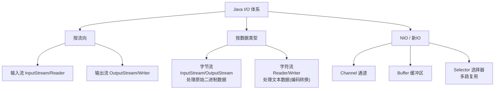

# 输入和输出

## 学习目标

- 理解 Java IO 的流式模型（InputStream/OutputStream 字节流，Reader/Writer 字符流）
- 掌握文件读写（FileInputStream/FileReader、Buffered 缓冲流性能提升）
- 区分字节流与字符流、理解编码(Charset)转换与乱码根因
- 掌握 NIO 的核心概念：Channel/Buffer/Selector 与非阻塞多路复用
- 识别资源未关闭泄漏、缓冲未 flush、大文件内存溢出等陷阱

## 概述

I/O（Input/Output）是 Java 中用于处理数据输入和输出的核心机制。Java 的 I/O 系统基于"流"的概念，提供了一套完整的 API 来处理文件、网络、内存等不同数据源的读写操作。

## IO 流的分类

Java IO 流可以从不同维度进行分类:



### 1. 按数据流向分类

- **输入流（Input Stream）**: 从数据源读取数据到程序中
- **输出流（Output Stream）**: 从程序写出数据到目标位置

### 2. 按数据单位分类

- **字节流**: 以字节（8位）为单位读写数据，适合处理二进制数据（图片、音频、视频等）
- **字符流**: 以字符（16位）为单位读写数据，适合处理文本数据

### 3. 按功能角色分类

- **节点流（Node Stream）**: 直接连接数据源的流，如 FileInputStream、FileReader
- **处理流（Processing Stream）**: 包装在其他流之上，提供额外功能，如 BufferedInputStream、BufferedReader

### IO 流常用类体系

（注:图中纵向链表示"包装/装饰"关系而非继承——`BufferedInputStream`、`DataInputStream` 等处理流均直接继承 `FilterInputStream`,并非继承 `FileInputStream`。）

```
                    字节流                              字符流
                     ↓                                   ↓
输入流    InputStream(抽象基类)              Reader(抽象基类)
              ↓         ↓                      ↓         ↓
         FileInputStream  ByteArrayInputStream   FileReader  StringReader
              ↓                                   ↓
         BufferedInputStream                 BufferedReader
              ↓                                   ↓
         DataInputStream                     InputStreamReader(转换流)
              ↓
         ObjectInputStream

输出流    OutputStream(抽象基类)             Writer(抽象基类)
              ↓         ↓                      ↓         ↓
        FileOutputStream  ByteArrayOutputStream  FileWriter  StringWriter
              ↓                                   ↓
         BufferedOutputStream                BufferedWriter
              ↓                                   ↓
         DataOutputStream                    OutputStreamWriter(转换流)
              ↓
         ObjectOutputStream
```

## 字节流

字节流是处理二进制数据的基础流，所有字节流类都继承自 `InputStream` 和 `OutputStream`。

### FileInputStream 和 FileOutputStream

`FileInputStream` 用于从文件读取字节数据，`FileOutputStream` 用于向文件写入字节数据。

**常用构造方法:**

```java
// FileInputStream 构造方法
FileInputStream(String name)          // 通过文件路径创建
FileInputStream(File file)            // 通过 File 对象创建

// FileOutputStream 构造方法
FileOutputStream(String name)         // 覆盖模式
FileOutputStream(String name, boolean append)  // append=true 为追加模式
FileOutputStream(File file)
FileOutputStream(File file, boolean append)
```

**示例: 文件复制（逐字节读写）**

```java
import java.io.FileInputStream;
import java.io.FileOutputStream;
import java.io.IOException;

public class FileCopyByteByByte {
    public static void main(String[] args) {
        String sourceFile = "source.txt";
        String destFile = "dest.txt";

        try (FileInputStream fis = new FileInputStream(sourceFile);
             FileOutputStream fos = new FileOutputStream(destFile)) {

            int byteData;
            while ((byteData = fis.read()) != -1) {
                fos.write(byteData);
            }
            System.out.println("文件复制完成");
        } catch (IOException e) {
            e.printStackTrace();
        }
    }
}
```

**示例: 文件复制（使用缓冲区）**

```java
import java.io.FileInputStream;
import java.io.FileOutputStream;
import java.io.IOException;

public class FileCopyWithBuffer {
    public static void main(String[] args) {
        String sourceFile = "source.jpg";
        String destFile = "dest.jpg";

        try (FileInputStream fis = new FileInputStream(sourceFile);
             FileOutputStream fos = new FileOutputStream(destFile)) {

            byte[] buffer = new byte[1024];  // 1KB 缓冲区
            int bytesRead;

            while ((bytesRead = fis.read(buffer)) != -1) {
                fos.write(buffer, 0, bytesRead);
            }
            System.out.println("文件复制完成");
        } catch (IOException e) {
            e.printStackTrace();
        }
    }
}
```

::: tip 性能建议
使用缓冲区可以显著提高 I/O 性能。推荐缓冲区大小为 4KB-64KB，通常 8KB 是一个较好的默认值。
:::

### BufferedInputStream 和 BufferedOutputStream

缓冲流是处理流，在节点流之上增加缓冲功能，减少实际的 I/O 操作次数。

**构造方法:**

```java
BufferedInputStream(InputStream in)          // 默认缓冲区大小 8KB
BufferedInputStream(InputStream in, int size)

BufferedOutputStream(OutputStream out)
BufferedOutputStream(OutputStream out, int size)
```

**示例: 使用缓冲流复制文件**

```java
import java.io.*;

public class BufferedStreamCopy {
    public static void main(String[] args) {
        try (BufferedInputStream bis = new BufferedInputStream(
                new FileInputStream("source.mp4"));
             BufferedOutputStream bos = new BufferedOutputStream(
                new FileOutputStream("dest.mp4"))) {

            byte[] buffer = new byte[8192];
            int bytesRead;

            while ((bytesRead = bis.read(buffer)) != -1) {
                bos.write(buffer, 0, bytesRead);
            }
            // 注意: 缓冲流需要 flush 或 close 才能确保数据写入
            bos.flush();
            System.out.println("大文件复制完成");
        } catch (IOException e) {
            e.printStackTrace();
        }
    }
}
```

::: warning 注意事项
- 缓冲输出流需要调用 `flush()` 或 `close()` 才能将缓冲区数据写入目标
- 使用 try-with-resources 会自动调用 `close()`，确保数据写入
:::

### DataInputStream 和 DataOutputStream

数据流允许以平台无关的方式读写 Java 基本数据类型。

**常用方法:**

```java
// DataOutputStream 写入方法
writeInt(int v)
writeLong(long v)
writeDouble(double v)
writeBoolean(boolean v)
writeUTF(String str)    // 写入 Java 修改版 UTF-8 编码(含 2 字节长度前缀,非标准 UTF-8)

// DataInputStream 读取方法
readInt()
readLong()
readDouble()
readBoolean()
readUTF()
```

**示例: 读写基本数据类型**

```java
import java.io.*;

public class DataStreamDemo {
    public static void main(String[] args) {
        String file = "data.bin";

        // 写入数据
        try (DataOutputStream dos = new DataOutputStream(
                new FileOutputStream(file))) {

            dos.writeInt(100);
            dos.writeDouble(3.14);
            dos.writeBoolean(true);
            dos.writeUTF("Hello, 数据流!");
            System.out.println("数据写入完成");

        } catch (IOException e) {
            e.printStackTrace();
        }

        // 读取数据（必须按写入顺序读取）
        try (DataInputStream dis = new DataInputStream(
                new FileInputStream(file))) {

            int i = dis.readInt();
            double d = dis.readDouble();
            boolean b = dis.readBoolean();
            String s = dis.readUTF();

            System.out.println("读取的数据:");
            System.out.println("int: " + i);
            System.out.println("double: " + d);
            System.out.println("boolean: " + b);
            System.out.println("String: " + s);

        } catch (IOException e) {
            e.printStackTrace();
        }
    }
}
```

## 字符流

字符流专门用于处理文本数据，自动处理字符编码问题。所有字符流类都继承自 `Reader` 和 `Writer`。

### FileReader 和 FileWriter

`FileReader` 和 `FileWriter` 用于读写文本文件，使用系统默认编码。

**示例: 复制文本文件**

```java
import java.io.FileReader;
import java.io.FileWriter;
import java.io.IOException;

public class CharStreamCopy {
    public static void main(String[] args) {
        try (FileReader fr = new FileReader("input.txt");
             FileWriter fw = new FileWriter("output.txt")) {

            char[] buffer = new char[1024];
            int charsRead;

            while ((charsRead = fr.read(buffer)) != -1) {
                fw.write(buffer, 0, charsRead);
            }
            System.out.println("文本文件复制完成");

        } catch (IOException e) {
            e.printStackTrace();
        }
    }
}
```

**示例: FileWriter 追加模式**

```java
import java.io.FileWriter;
import java.io.IOException;

public class FileWriterAppend {
    public static void main(String[] args) {
        // true 表示追加模式
        try (FileWriter fw = new FileWriter("log.txt", true)) {
            fw.write("新的日志记录\n");
            System.out.println("日志追加成功");
        } catch (IOException e) {
            e.printStackTrace();
        }
    }
}
```

### BufferedReader 和 BufferedWriter

缓冲字符流提供按行读写的能力，是处理文本文件的首选。

**常用方法:**

```java
// BufferedReader
String readLine()    // 读取一行，返回 null 表示文件结束

// BufferedWriter
void newLine()       // 写入换行符（跨平台）
```

**示例: 按行读取文件**

```java
import java.io.*;

public class BufferedReaderDemo {
    public static void main(String[] args) {
        try (BufferedReader br = new BufferedReader(
                new FileReader("test.txt"))) {

            String line;
            int lineNum = 0;

            while ((line = br.readLine()) != null) {
                System.out.println(++lineNum + ": " + line);
            }

        } catch (IOException e) {
            e.printStackTrace();
        }
    }
}
```

**示例: 写入文本文件**

```java
import java.io.*;

public class BufferedWriterDemo {
    public static void main(String[] args) {
        try (BufferedWriter bw = new BufferedWriter(
                new FileWriter("output.txt"))) {

            bw.write("第一行");
            bw.newLine();
            bw.write("第二行");
            bw.newLine();
            bw.write("第三行");

            System.out.println("文件写入完成");

        } catch (IOException e) {
            e.printStackTrace();
        }
    }
}
```

## 转换流

转换流用于在字节流和字符流之间转换，可以指定字符编码。

### InputStreamReader

`InputStreamReader` 将字节输入流转换为字符输入流。

**构造方法:**

```java
InputStreamReader(InputStream in)                    // 使用默认编码
InputStreamReader(InputStream in, String charsetName) // 指定编码
InputStreamReader(InputStream in, Charset cs)
```

**示例: 指定编码读取文件**

```java
import java.io.*;

public class InputStreamReaderDemo {
    public static void main(String[] args) {
        try (BufferedReader br = new BufferedReader(
                new InputStreamReader(
                    new FileInputStream("utf8.txt"), "UTF-8"))) {

            String line;
            while ((line = br.readLine()) != null) {
                System.out.println(line);
            }

        } catch (IOException e) {
            e.printStackTrace();
        }
    }
}
```

### OutputStreamWriter

`OutputStreamWriter` 将字符输出流转换为字节输出流。

**示例: 指定编码写入文件**

```java
import java.io.*;

public class OutputStreamWriterDemo {
    public static void main(String[] args) {
        try (BufferedWriter bw = new BufferedWriter(
                new OutputStreamWriter(
                    new FileOutputStream("gbk.txt"), "GBK"))) {

            bw.write("你好，世界！");
            bw.newLine();
            bw.write("使用 GBK 编码");

            System.out.println("文件写入完成");

        } catch (IOException e) {
            e.printStackTrace();
        }
    }
}
```

::: tip 编码问题
处理中文文本时，务必注意文件编码。使用转换流可以明确指定编码，避免乱码问题。常见编码:
- UTF-8: 国际通用编码，推荐使用
- GBK: 中文编码
- ISO-8859-1: 西欧编码
:::

## 对象流与序列化

### 序列化概念

**序列化（Serialization）**: 将对象转换为字节序列，便于存储或传输  
**反序列化（Deserialization）**: 将字节序列恢复为对象

### Serializable 接口

要序列化的类必须实现 `java.io.Serializable` 接口。这是一个标记接口，没有方法需要实现。

```java
import java.io.Serializable;

public class Person implements Serializable {
    // 序列化版本号，用于版本控制
    private static final long serialVersionUID = 1L;
    
    private String name;
    private int age;
    // transient 关键字表示该字段不参与序列化
    private transient String password;
    
    public Person(String name, int age) {
        this.name = name;
        this.age = age;
    }
    
    @Override
    public String toString() {
        return "Person{name='" + name + "', age=" + age + "}";
    }
}
```

::: warning serialVersionUID
建议显式声明 `serialVersionUID`。如果不声明，JVM 会根据类结构自动生成，类结构变化后可能导致反序列化失败。
:::

### ObjectOutputStream 和 ObjectInputStream

**示例: 对象序列化与反序列化**

```java
import java.io.*;

public class ObjectStreamDemo {
    public static void main(String[] args) {
        String file = "person.ser";
        Person person = new Person("张三", 25);

        // 序列化对象
        try (ObjectOutputStream oos = new ObjectOutputStream(
                new FileOutputStream(file))) {

            oos.writeObject(person);
            System.out.println("对象序列化成功: " + person);

        } catch (IOException e) {
            e.printStackTrace();
        }

        // 反序列化对象
        try (ObjectInputStream ois = new ObjectInputStream(
                new FileInputStream(file))) {

            Person restored = (Person) ois.readObject();
            System.out.println("对象反序列化成功: " + restored);

        } catch (IOException | ClassNotFoundException e) {
            e.printStackTrace();
        }
    }
}
```

**示例: 序列化集合**

```java
import java.io.*;
import java.util.ArrayList;
import java.util.List;

public class ListSerializationDemo {
    public static void main(String[] args) {
        List<Person> persons = new ArrayList<>();
        persons.add(new Person("张三", 25));
        persons.add(new Person("李四", 30));
        persons.add(new Person("王五", 28));

        // 序列化集合
        try (ObjectOutputStream oos = new ObjectOutputStream(
                new FileOutputStream("persons.ser"))) {

            oos.writeObject(persons);
            System.out.println("集合序列化成功");

        } catch (IOException e) {
            e.printStackTrace();
        }

        // 反序列化集合
        try (ObjectInputStream ois = new ObjectInputStream(
                new FileInputStream("persons.ser"))) {

            @SuppressWarnings("unchecked")
            List<Person> restored = (List<Person>) ois.readObject();
            
            System.out.println("集合反序列化成功:");
            for (Person p : restored) {
                System.out.println("  " + p);
            }

        } catch (IOException | ClassNotFoundException e) {
            e.printStackTrace();
        }
    }
}
```

### 序列化注意事项

1. **static 字段不参与序列化**: 静态字段属于类，不属于对象
2. **transient 关键字**: 临时字段不参与序列化
3. **引用类型**: 被引用的对象也必须实现 Serializable
4. **安全性**: 敏感数据（如密码）应使用 transient 或加密处理

## 标准输入输出

Java 提供三个标准流，定义在 `System` 类中:

```java
System.in   // 标准输入流（键盘输入），类型: InputStream
System.out  // 标准输出流（控制台输出），类型: PrintStream
System.err  // 标准错误流（错误输出），类型: PrintStream
```

### System.in 标准输入

**示例: 读取键盘输入**

```java
import java.io.*;

public class StandardInputDemo {
    public static void main(String[] args) {
        System.out.print("请输入内容: ");

        try (BufferedReader br = new BufferedReader(
                new InputStreamReader(System.in))) {

            String input = br.readLine();
            System.out.println("你输入的是: " + input);

        } catch (IOException e) {
            e.printStackTrace();
        }
    }
}
```

### Scanner 类

`Scanner` 是一个简单的文本扫描器，常用于解析基本类型和字符串。

**常用方法:**

```java
next()           // 读取下一个字符串（以空白符分隔）
nextLine()       // 读取一行
nextInt()        // 读取 int
nextDouble()     // 读取 double
hasNext()        // 是否还有输入
hasNextInt()     // 下一个是否是 int
```

**示例: Scanner 基本用法**

```java
import java.util.Scanner;

public class ScannerDemo {
    public static void main(String[] args) {
        Scanner scanner = new Scanner(System.in);

        System.out.print("请输入姓名: ");
        String name = scanner.nextLine();

        System.out.print("请输入年龄: ");
        int age = scanner.nextInt();

        System.out.print("请输入分数: ");
        double score = scanner.nextDouble();

        System.out.println("\n录入信息:");
        System.out.println("姓名: " + name);
        System.out.println("年龄: " + age);
        System.out.println("分数: " + score);

        scanner.close();
    }
}
```

**示例: Scanner 读取文件**

```java
import java.io.File;
import java.io.FileNotFoundException;
import java.util.Scanner;

public class ScannerFileDemo {
    public static void main(String[] args) {
        try (Scanner scanner = new Scanner(new File("data.txt"))) {
            
            while (scanner.hasNextLine()) {
                String line = scanner.nextLine();
                System.out.println(line);
            }

        } catch (FileNotFoundException e) {
            System.out.println("文件不存在");
        }
    }
}
```

### PrintStream 和 PrintWriter

`PrintStream` 和 `PrintWriter` 提供方便的打印方法，不会抛出 IOException。

**PrintStream 常用方法:**

```java
print(Object obj)
println(Object obj)
printf(String format, Object... args)
format(String format, Object... args)
```

**示例: PrintStream**

```java
import java.io.*;

public class PrintStreamDemo {
    public static void main(String[] args) {
        // System.out 就是 PrintStream
        System.out.println("标准输出");
        System.out.printf("格式化输出: %d, %.2f%n", 100, 3.14159);

        // 输出到文件
        try (PrintStream ps = new PrintStream(
                new FileOutputStream("output.txt"))) {

            ps.println("写入文件");
            ps.printf("姓名: %s, 年龄: %d%n", "张三", 25);

        } catch (FileNotFoundException e) {
            e.printStackTrace();
        }
    }
}
```

**示例: PrintWriter**

```java
import java.io.*;

public class PrintWriterDemo {
    public static void main(String[] args) {
        try (PrintWriter pw = new PrintWriter(
                new BufferedWriter(
                    new FileWriter("report.txt")))) {

            pw.println("======== 报告 ========");
            pw.printf("日期: %tF%n", System.currentTimeMillis());
            pw.println("内容: 示例文本");
            pw.println("=====================");

            System.out.println("报告生成完成");

        } catch (IOException e) {
            e.printStackTrace();
        }
    }
}
```

## File 类

`java.io.File` 类表示文件和目录路径，提供文件属性查询和操作方法。

### 构造方法

```java
File(String pathname)              // 通过路径字符串创建
File(String parent, String child)  // 父路径 + 子路径
File(File parent, String child)    // 父File对象 + 子路径
```

### 常用方法

#### 文件属性查询

```java
exists()          // 文件或目录是否存在
isFile()          // 是否是文件
isDirectory()     // 是否是目录
isHidden()        // 是否是隐藏文件
canRead()         // 是否可读
canWrite()        // 是否可写
canExecute()      // 是否可执行
length()          // 文件大小（字节）
lastModified()    // 最后修改时间（毫秒）
getName()         // 文件名
getParent()       // 父目录路径
getAbsolutePath() // 绝对路径
getCanonicalPath()// 规范路径（解析 . 和 ..）
```

#### 文件操作

```java
createNewFile()   // 创建新文件
delete()          // 删除文件或空目录
renameTo(File dest) // 重命名或移动
mkdir()           // 创建单级目录
mkdirs()          // 创建多级目录
```

#### 目录遍历

```java
String[] list()                        // 列出文件名
File[] listFiles()                     // 列出File对象
File[] listFiles(FileFilter filter)    // 按过滤器列出
```

**示例: 文件操作**

```java
import java.io.File;
import java.io.IOException;
import java.util.Date;

public class FileDemo {
    public static void main(String[] args) {
        File file = new File("test.txt");

        // 创建文件
        try {
            if (file.createNewFile()) {
                System.out.println("文件创建成功");
            }
        } catch (IOException e) {
            e.printStackTrace();
        }

        // 查询属性
        System.out.println("文件名: " + file.getName());
        System.out.println("绝对路径: " + file.getAbsolutePath());
        System.out.println("文件大小: " + file.length() + " 字节");
        System.out.println("最后修改: " + new Date(file.lastModified()));

        // 删除文件
        // file.delete();
    }
}
```

**示例: 目录遍历**

```java
import java.io.File;

public class DirectoryDemo {
    public static void main(String[] args) {
        File dir = new File(".");

        // 列出所有文件和目录
        File[] files = dir.listFiles();

        if (files != null) {
            for (File f : files) {
                String type = f.isDirectory() ? "[目录]" : "[文件]";
                System.out.println(type + " " + f.getName());
            }
        }

        // 使用过滤器
        File[] javaFiles = dir.listFiles((d, name) -> name.endsWith(".java"));

        if (javaFiles != null) {
            System.out.println("\nJava 文件:");
            for (File f : javaFiles) {
                System.out.println("  " + f.getName());
            }
        }
    }
}
```

**示例: 递归遍历目录**

```java
import java.io.File;

public class RecursiveDirectoryDemo {
    public static void main(String[] args) {
        File dir = new File("src");
        traverse(dir, 0);
    }

    public static void traverse(File dir, int level) {
        File[] files = dir.listFiles();
        if (files == null) return;

        for (File file : files) {
            // 打印缩进
            for (int i = 0; i < level; i++) {
                System.out.print("  ");
            }

            if (file.isDirectory()) {
                System.out.println(" " + file.getName() + "/");
                traverse(file, level + 1);
            } else {
                System.out.println(" " + file.getName() + " (" + file.length() + " bytes)");
            }
        }
    }
}
```

## 综合案例

### 案例1: 文件复制工具

```java
import java.io.*;

public class FileCopyUtil {
    
    /**
     * 复制文件（带缓冲）
     */
    public static void copyFile(String src, String dest) throws IOException {
        try (BufferedInputStream bis = new BufferedInputStream(
                new FileInputStream(src));
             BufferedOutputStream bos = new BufferedOutputStream(
                new FileOutputStream(dest))) {

            byte[] buffer = new byte[8192];
            int bytesRead;

            while ((bytesRead = bis.read(buffer)) != -1) {
                bos.write(buffer, 0, bytesRead);
            }
        }
    }

    /**
     * 复制目录
     */
    public static void copyDirectory(File srcDir, File destDir) throws IOException {
        if (!srcDir.isDirectory()) {
            throw new IllegalArgumentException("源路径不是目录");
        }

        if (!destDir.exists()) {
            destDir.mkdirs();
        }

        File[] files = srcDir.listFiles();
        if (files == null) return;

        for (File file : files) {
            File destFile = new File(destDir, file.getName());

            if (file.isDirectory()) {
                copyDirectory(file, destFile);
            } else {
                copyFile(file.getAbsolutePath(), destFile.getAbsolutePath());
            }
        }
    }

    public static void main(String[] args) {
        try {
            copyFile("source.txt", "backup/source.txt");
            System.out.println("文件复制完成");
        } catch (IOException e) {
            e.printStackTrace();
        }
    }
}
```

### 案例2: 日志工具

```java
import java.io.*;
import java.time.LocalDateTime;
import java.time.format.DateTimeFormatter;

public class LogUtil {
    private static final String LOG_FILE = "app.log";
    private static final DateTimeFormatter formatter = 
        DateTimeFormatter.ofPattern("yyyy-MM-dd HH:mm:ss");

    /**
     * 写入日志
     */
    public static void log(String level, String message) {
        String timestamp = LocalDateTime.now().format(formatter);
        String logLine = String.format("[%s] [%s] %s%n", timestamp, level, message);

        // 输出到控制台
        System.out.print(logLine);

        // 输出到文件（追加模式）
        try (PrintWriter pw = new PrintWriter(
                new FileWriter(LOG_FILE, true))) {
            pw.print(logLine);
        } catch (IOException e) {
            System.err.println("日志写入失败: " + e.getMessage());
        }
    }

    public static void info(String message) {
        log("INFO", message);
    }

    public static void error(String message) {
        log("ERROR", message);
    }

    public static void main(String[] args) {
        info("应用程序启动");
        info("加载配置文件");
        error("连接数据库失败");
        info("应用程序关闭");
    }
}
```

### 案例3: 配置文件读取

```java
import java.io.*;
import java.util.*;

public class ConfigReader {
    private Properties properties = new Properties();

    /**
     * 加载配置文件
     */
    public void load(String configFile) throws IOException {
        try (BufferedReader reader = new BufferedReader(
                new InputStreamReader(
                    new FileInputStream(configFile), "UTF-8"))) {

            String line;
            while ((line = reader.readLine()) != null) {
                line = line.trim();
                // 跳过空行和注释
                if (line.isEmpty() || line.startsWith("#") || line.startsWith("//")) {
                    continue;
                }

                // 解析 key=value
                int pos = line.indexOf('=');
                if (pos > 0) {
                    String key = line.substring(0, pos).trim();
                    String value = line.substring(pos + 1).trim();
                    properties.setProperty(key, value);
                }
            }
        }
    }

    public String get(String key) {
        return properties.getProperty(key);
    }

    public String get(String key, String defaultValue) {
        return properties.getProperty(key, defaultValue);
    }

    public static void main(String[] args) {
        ConfigReader config = new ConfigReader();
        
        try {
            config.load("config.properties");
            System.out.println("数据库URL: " + config.get("db.url"));
            System.out.println("超时时间: " + config.get("timeout", "30"));
        } catch (IOException e) {
            e.printStackTrace();
        }
    }
}
```

## NIO 简介

Java NIO（New I/O）从 Java 4 引入，Java 7 又引入了 NIO.2，提供了更高效的 I/O 操作。

### NIO vs 传统 IO

| 特性 | 传统 IO | NIO |
|-----|---------|-----|
| 方式 | 面向流 | 面向缓冲区 |
| 阻塞 | 阻塞式 | 支持非阻塞 |
| 选择器 | 无 | Selector 支持多路复用 |

### Path 和 Files

`Path` 替代 `File`，`Files` 提供静态工具方法。

```java
import java.nio.file.*;
import java.io.IOException;
import java.util.List;

public class NIODemo {
    public static void main(String[] args) throws IOException {
        Path path = Paths.get("test.txt");

        // 创建文件
        if (!Files.exists(path)) {
            Files.createFile(path);
        }

        // 写入内容
        Files.write(path, "Hello, NIO!".getBytes());

        // 读取所有内容
        String content = new String(Files.readAllBytes(path));
        System.out.println("内容: " + content);

        // 按行读取
        List<String> lines = Files.readAllLines(path);
        lines.forEach(System.out::println);

        // 复制文件
        Files.copy(path, Paths.get("test_copy.txt"), 
            StandardCopyOption.REPLACE_EXISTING);

        // 获取文件属性
        System.out.println("文件大小: " + Files.size(path));
        System.out.println("是否可读: " + Files.isReadable(path));
    }
}
```

### 文件遍历

```java
import java.nio.file.*;
import java.io.IOException;
import java.util.stream.Stream;

public class NIODirectoryDemo {
    public static void main(String[] args) throws IOException {
        Path dir = Paths.get(".");

        // 列出直接子项
        try (Stream<Path> stream = Files.list(dir)) {
            stream.forEach(System.out::println);
        }

        // 遍历整个目录树
        try (Stream<Path> stream = Files.walk(dir, 2)) {
            stream.filter(Files::isRegularFile)
                  .filter(p -> p.toString().endsWith(".java"))
                  .forEach(System.out::println);
        }
    }
}
```

## 常见误区与性能考虑

### 常见误区

#### 1. 不关闭流导致资源泄漏

```java
// × 错误：不关闭流
FileInputStream fis = new FileInputStream("test.txt");
int data = fis.read();
// 忘记关闭，导致文件句柄泄漏

// √ 正确：使用 try-with-resources
try (FileInputStream fis = new FileInputStream("test.txt")) {
    int data = fis.read();
}
```

#### 2. 字节流读取文本导致乱码

```java
// × 错误：字节流读取中文文本
try (FileInputStream fis = new FileInputStream("chinese.txt")) {
    byte[] bytes = new byte[1024];
    int len = fis.read(bytes);
    String content = new String(bytes, 0, len); // 可能乱码
}

// √ 正确：使用字符流并指定编码
try (BufferedReader br = new BufferedReader(
        new InputStreamReader(
            new FileInputStream("chinese.txt"), "UTF-8"))) {
    String line;
    while ((line = br.readLine()) != null) {
        System.out.println(line);
    }
}
```

#### 3. 序列化版本号问题

```java
// × 不指定版本号
public class User implements Serializable {
    private String name;
    // 类结构变化后，可能无法反序列化旧数据
}

// √ 指定版本号
public class User implements Serializable {
    private static final long serialVersionUID = 1L;
    private String name;
}
```

#### 4. 忽略缓冲流的 flush

```java
// × 可能丢失数据
BufferedOutputStream bos = new BufferedOutputStream(
    new FileOutputStream("test.txt"));
bos.write("Hello".getBytes());
// 如果程序异常终止，缓冲区数据可能丢失

// √ 正确使用 try-with-resources 自动 flush
try (BufferedOutputStream bos = new BufferedOutputStream(
        new FileOutputStream("test.txt"))) {
    bos.write("Hello".getBytes());
}
```

### 性能考虑

#### 1. 使用合适的缓冲区大小

```java
// × 缓冲区太小，频繁 I/O
byte[] buffer = new byte[10];

// √ 推荐大小 4KB - 64KB
byte[] buffer = new byte[8192]; // 8KB
```

#### 2. 选择合适的流

| 场景 | 推荐流 |
|-----|-------|
| 文本文件读写 | BufferedReader/BufferedWriter |
| 二进制文件复制 | BufferedInputStream/BufferedOutputStream |
| 大文件处理 | NIO FileChannel 或 内存映射 |
| 需要指定编码 | InputStreamReader/OutputStreamWriter |

#### 3. 避免频繁创建流对象

```java
// × 循环中创建流
for (String file : files) {
    try (FileInputStream fis = new FileInputStream(file)) {
        // 每次循环都创建新流
    }
}

// √ 复用逻辑，减少开销
public void processFiles(List<String> files) throws IOException {
    for (String file : files) {
        processOneFile(file);
    }
}
```

## 面试要点

### 1. 字节流与字符流的区别

- **处理单位**: 字节流以字节为单位，字符流以字符为单位
- **编码处理**: 字符流自动处理编码转换，字节流不处理
- **适用场景**: 字节流适合二进制文件，字符流适合文本文件

### 2. 什么是节点流和处理流？

- **节点流**: 直接连接数据源，如 FileInputStream、FileReader
- **处理流**: 包装在其他流上，提供增强功能，如 BufferedInputStream

### 3. BufferedReader 为什么比 FileReader 快？

BufferedReader 内部有缓冲区（默认 8KB），一次读取多个字节到内存，减少实际 I/O 操作次数。

### 4. 序列化和反序列化的过程？

序列化: 对象 → ObjectOutputStream → 字节序列 → 存储  
反序列化: 存储 → 字节序列 → ObjectInputStream → 对象

### 5. transient 关键字的作用？

被 transient 修饰的字段不参与序列化，反序列化后为默认值（null、0、false）。

### 6. NIO 的核心组件？

- **Buffer**: 缓冲区，存储数据
- **Channel**: 通道，双向数据传输
- **Selector**: 选择器，实现多路复用

### 7. Files 类的常用方法？

```java
Files.exists(Path)          // 判断文件是否存在
Files.createFile(Path)      // 创建文件
Files.createDirectory(Path) // 创建目录
Files.copy(Path, Path)      // 复制文件
Files.move(Path, Path)      // 移动文件
Files.delete(Path)          // 删除文件
Files.readAllLines(Path)    // 读取所有行
Files.write(Path, byte[])   // 写入内容
```

### 8. try-with-resources 的原理？

实现了 `AutoCloseable` 接口的资源，在 try 块结束时自动调用 `close()` 方法，编译器会生成 finally 块来关闭资源。

## 总结

Java I/O 体系提供了完整的输入输出解决方案:

| 分类 | 字节流 | 字符流 |
|-----|-------|-------|
| 文件流 | FileInputStream/FileOutputStream | FileReader/FileWriter |
| 缓冲流 | BufferedInputStream/BufferedOutputStream | BufferedReader/BufferedWriter |
| 转换流 | - | InputStreamReader/OutputStreamWriter |
| 数据流 | DataInputStream/DataOutputStream | - |
| 对象流 | ObjectInputStream/ObjectOutputStream | - |
| 打印流 | PrintStream | PrintWriter |

**使用建议:**

1. 处理文本文件使用字符流，二进制文件使用字节流
2. 始终使用缓冲流提高性能
3. 使用 try-with-resources 确保资源关闭
4. 注意字符编码，使用转换流指定编码
5. 新项目优先考虑 NIO.2 API

## 版本差异(旧版 → Java 21)

| 特性 | 旧版(Java 8) | Java 11/21 |
|------|--------------|------------|
| 文件读写 | 手写流循环 | `Files.readString`/`writeString`（Java 11） |
| 路径创建 | `Paths.get` | `Path.of`（Java 11） |
| 文件比较 | 逐字节比较 | `Files.mismatch`（Java 12） |
| 文本块 | 无 | 文本块（Java 15）简化多行文件内容拼接 |
| 资源管理 | try-with-resources（Java 7） | 可直接使用有效 final 变量（Java 9） |

## 继续阅读

- 上一章：[反射与注解](17-反射与注解)
- 下一章：[包与命名空间](19-包与命名空间)
