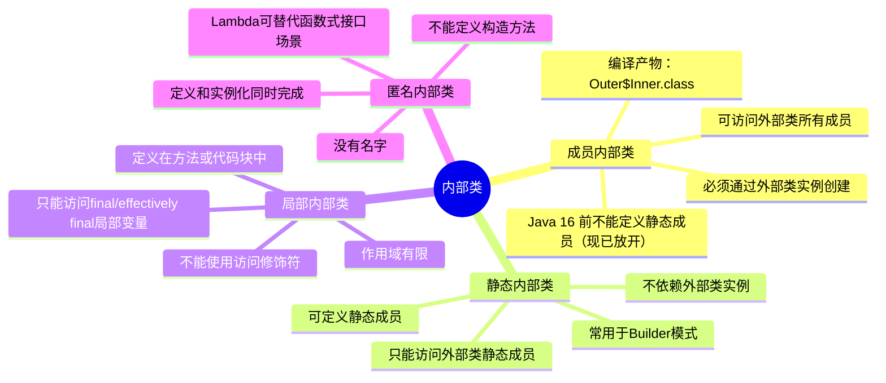
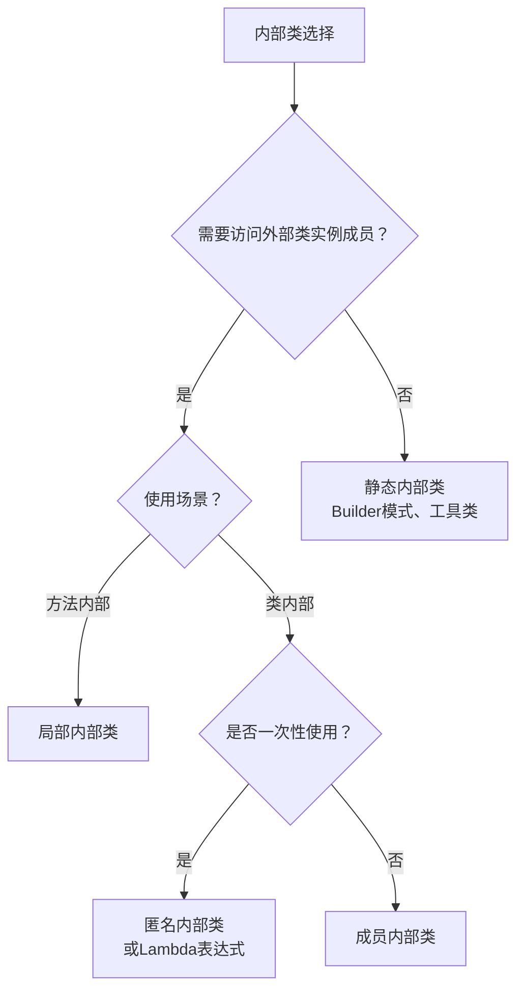

# 包和内部类

## 学习目标

- 理解 package 的命名空间作用与目录结构、反向域名约定
- 掌握 import 静态导入、通配符导入与同名类冲突消解
- 区分内部类（成员/局部/匿名）与外部类的持有关系
- 理解 classpath 与 JAR 打包运行（manifest Main-Class）
- 识别包级私有访问、拆包(split package)与模块化的演进

## Java 类包

在 Java 中 **类包（Package）** 是一种用于组织和管理类、接口、枚举和注解的机制。包的主要目的是将相关的类和接口组织在一起，避免命名冲突，并提供一种层次化的命名空间。

- **避免命名冲突**：不同的包中可以有相同名称的类，因为包名是唯一的
- **组织代码**：将相关的类和接口放在同一个包中，便于管理和维护
- **访问控制**：包可以控制类、方法和变量的可见性（如 `default` 访问修饰符只能在同一个包内访问）
- **导入和使用**：通过 `import` 语句可以方便地使用其他包中的类

在 Java 中包通过 `package` 关键字定义。包的声明必须是 `Java` 文件中的第一条语句（除了注释和空行）

```java
// 定义一个包
package com.example.myapp;

// 定义一个类
public class MyClass {
  // 类的内容
}
```

Java 标准库提供了许多预定义的包，例如：

- `java.lang`：包含 Java 核心类（如 `String`、`Object` 等），默认导入。
- `java.util`：包含集合框架、日期时间工具等
- `java.io`：包含输入输出相关的类
- `java.net`：包含网络编程相关的类

### 包的创建

在文件系统中，包对应的目录结构必须与包名一致。如果包名是 `com.example.myapp`，则类文件必须放在 `com/example/myapp` 目录下。

**包命名规范**：

- 包名通常使用小写字母
- 包名可以包含多个层次，用 `.` 分隔（如 `com.example.myapp`）
- 包名通常与目录结构对应，例如 `com.example.myapp` 对应的文件路径是 `com/example/myapp`
- 包名通常使用反向域名（如 `com.example.myapp`），这是 Java 的命名约定
- 包名不能使用 Java 关键字（如 `class`、`public` 等）
- 包名不能以数字开头

**目录结构示例**：

```
项目根目录/
├── com/
│   └── example/
│       └── myapp/
│           ├── MyClass.java
│           └── Utils.java
└── Main.java
```

**默认包**：

如果类文件没有声明 `package` 语句，则该类属于默认包（default package）。默认包中的类可以直接访问，但通常不推荐使用默认包，因为：

- 无法从其他包中导入默认包中的类
- 不利于代码组织和维护
- 可能导致命名冲突

::: warning

**注意事项**：
- 一个 Java 源文件中只能有一个 `package` 声明
- `package` 声明必须是文件的第一条语句（注释和空行除外）
- 包名区分大小写，`com.example` 和 `com.Example` 是不同的包

:::

### 导入包

要使用其他包中的类，可以使用 `import` 语句。`import` 语句必须放在 `package` 声明之后，类声明之前。

**导入方式**：

```java
// 1. 导入单个类
import com.example.myapp.MyClass;

// 2. 导入整个包（不推荐，可能导致命名冲突）
import com.example.myapp.*;

// 3. 静态导入（导入静态成员）
import static java.lang.Math.PI;
import static java.lang.Math.sqrt;
import static java.lang.System.out;

// 4. 静态导入整个类的静态成员
import static java.lang.Math.*;
```

**使用示例**：

```java
package com.example.test;

import com.example.myapp.MyClass;
import static java.lang.Math.PI;
import static java.lang.System.out;

public class Test {
    public static void main(String[] args) {
        MyClass obj = new MyClass();
        out.println("PI = " + PI); // 使用静态导入，无需 Math.PI
    }
}
```

**完全限定名**：

如果没有使用 `import`，可以通过完全限定名（Fully Qualified Name）来使用类：

```java
com.example.myapp.MyClass obj = new com.example.myapp.MyClass();
```

**导入冲突处理**：

当导入的类名冲突时，可以使用完全限定名来区分：

```java
import java.util.Date;
import java.sql.Date; // 编译错误：类名冲突

// 解决方法：使用完全限定名
java.util.Date utilDate = new java.util.Date();
java.sql.Date sqlDate = new java.sql.Date(System.currentTimeMillis());
```

::: tip

**导入最佳实践**：
- 优先使用导入单个类，而不是导入整个包（`import package.*`）
- 使用静态导入要谨慎，避免代码可读性降低
- `java.lang` 包中的类会自动导入，无需显式导入
- 同一个包中的类无需导入，可以直接使用

:::

### 包访问权限

Java 中有四种访问修饰符，其中 `default`（包访问权限）与包密切相关：

| 访问修饰符 | 同一类 | 同一包 | 子类 | 不同包 |
|-----------|--------|--------|------|--------|
| `private` | √ | × | × | × |
| `default` | √ | √ | × | × |
| `protected` | √ | √ | √ | × |
| `public` | √ | √ | √ | √ |

**包访问权限示例**：

```java
package com.example.package1;

public class ClassA {
    private int privateField = 1;        // 仅本类可访问
    int defaultField = 2;                 // 同一包可访问
    protected int protectedField = 3;     // 同一包和子类可访问
    public int publicField = 4;           // 所有地方可访问
}

class ClassB { // 同一包中的类
    void test() {
        ClassA a = new ClassA();
        // a.privateField;    // 错误：无法访问
        // a.defaultField;    // 正确：同一包可访问
        // a.protectedField;  // 正确：同一包可访问
        // a.publicField;     // 正确：所有地方可访问
    }
}
```

### JAR 文件与包

为了方便分发和复用，可以将多个类文件打包成 JAR（Java Archive）文件。JAR 文件可以包含多个包，并且可以通过 `CLASSPATH` 环境变量或构建工具（如 Maven、Gradle）来管理依赖。

**JAR 文件特点**：
- JAR 文件本质上是 ZIP 格式的压缩文件
- 可以包含多个 `.class` 文件和资源文件
- 可以包含 `META-INF/MANIFEST.MF` 清单文件
- 可以通过 `java -jar` 命令直接运行（如果指定了主类）

**使用 JAR 文件**：

```bash
# 创建 JAR 文件
jar cvf myapp.jar com/example/myapp/*.class

# 运行 JAR 文件
java -jar myapp.jar

# 将 JAR 文件添加到类路径
java -cp myapp.jar com.example.myapp.Main
```

## 内部类

在 Java 中**内部类（Inner Class）** 是定义在另一个类内部的类。内部类提供了一种更紧密的关联方式，允许一个类访问另一个类的成员（包括私有成员）。



内部类可以分为以下几种类型：

1. 成员内部类（Member Inner Class）
2. 静态内部类（Static Nested Class）
3. 局部内部类（Local Inner Class）
4. 匿名内部类（Anonymous Inner Class）

### 成员内部类

成员内部类（Member Inner Class）是定义在另一个类的内部，但不在任何方法或代码块中的类。

**特点**：
- 定义在另一个类的内部，但不在任何方法或代码块中
- 可以访问外部类的所有成员（包括私有成员）
- 必须通过外部类的实例来创建内部类的对象
- Java 16 之前不能定义静态成员（仅编译时常量例外），Java 16 起已放开（JEP 395）
- 外部类可以访问内部类的私有成员

**基本示例**：

```java
class Outer {
    private String outerMessage = "Message from Outer class";
    private int outerValue = 100;

    // 成员内部类
    class Inner {
        private String innerMessage = "Message from Inner class";

        void display() {
            // 可以访问外部类的私有成员
            System.out.println("Inner class: " + outerMessage);
            System.out.println("Outer value: " + outerValue);
            
            // 可以调用外部类的方法
            outerMethod();
        }

        void innerMethod() {
            System.out.println("Inner method called");
        }
    }

    void outerMethod() {
        System.out.println("Outer method called");
        
        // 外部类可以访问内部类的私有成员
        Inner inner = new Inner();
        System.out.println("Access inner private: " + inner.innerMessage);
    }
}

public class Main {
    public static void main(String[] args) {
        Outer outer = new Outer(); // 创建外部类对象
        Outer.Inner inner = outer.new Inner(); // 创建内部类对象
        inner.display(); // 调用内部类的方法
        
        outer.outerMethod();
    }
}
```

**内部类访问外部类的方式**：

```java
class Outer {
    private String name = "Outer";

    class Inner {
        private String name = "Inner";

        void display() {
            System.out.println(name);              // Inner（内部类的成员）
            System.out.println(this.name);         // Inner（显式指定）
            System.out.println(Outer.this.name);  // Outer（外部类的成员）
        }
    }
}
```

::: tip

**成员内部类的编译**：
- 成员内部类会被编译成独立的 `.class` 文件
- 文件名格式：`外部类名$内部类名.class`
- 例如：`Outer$Inner.class`

:::

### 静态内部类

静态内部类（Static Nested Class）是使用 `static` 关键字定义的内部类。

**特点**：
- 不依赖于外部类的实例，可以直接通过外部类名访问
- 只能访问外部类的静态成员（不能直接访问非静态成员）
- 可以定义静态成员和方法
- 可以独立存在，不需要外部类实例

**基本示例**：

```java
class Outer {
    private static String staticMessage = "Static message from Outer class";
    private String instanceMessage = "Instance message from Outer class";

    // 静态内部类
    static class StaticNested {
        private static String nestedStatic = "Nested static field";

        void display() {
            System.out.println("Static Nested class: " + staticMessage); // 可以访问静态成员
            System.out.println("Nested static: " + nestedStatic);
            // System.out.println(instanceMessage); // 错误：无法访问非静态成员
        }

        static void staticMethod() {
            System.out.println("Static method in nested class");
        }
    }
}

public class Main {
    public static void main(String[] args) {
        // 直接创建静态内部类对象，无需外部类实例
        Outer.StaticNested nested = new Outer.StaticNested();
        nested.display();
        
        // 调用静态内部类的静态方法
        Outer.StaticNested.staticMethod();
    }
}
```

**访问外部类非静态成员**：

如果需要访问外部类的非静态成员，需要传入外部类实例：

```java
class Outer {
    private String instanceMessage = "Instance message";

    static class StaticNested {
        void display(Outer outer) {
            System.out.println("Accessing: " + outer.instanceMessage);
        }
    }
}
```

::: tip

**静态内部类的优势**：
- 不持有外部类实例的引用，内存开销更小
- 可以独立使用，更加灵活
- 常用于工具类、Builder 模式等场景

:::

### 局部内部类

局部内部类（Local Inner Class）是定义在方法或代码块中的类。

**特点**：
- 只能在该方法或代码块中使用
- 可以访问外部类的成员，但只能访问方法中的 `final` 或有效 `final`（effectively final）的局部变量
- 不能使用访问修饰符（`public`、`private` 等）
- Java 16 之前不能定义静态成员，Java 16 起已放开

**基本示例**：

```java
class Outer {
    private String outerMessage = "Message from Outer class";

    void display() {
        final String localMessage = "Message from method"; // 必须是 final 或有效 final
        int localValue = 10; // 有效 final（赋值后不再修改）

        // 局部内部类
        class LocalInner {
            void printMessages() {
                System.out.println("Local Inner class: " + outerMessage);
                System.out.println("Local variable: " + localMessage);
                System.out.println("Local value: " + localValue);
            }
        }

        LocalInner inner = new LocalInner(); // 创建局部内部类对象
        inner.printMessages();
    }

    void displayWithParameter(final int param) {
        // 局部内部类可以访问方法参数（必须是 final 或有效 final）
        class LocalInner {
            void show() {
                System.out.println("Parameter: " + param);
            }
        }
        new LocalInner().show();
    }
}

public class Main {
    public static void main(String[] args) {
        Outer outer = new Outer();
        outer.display();
        outer.displayWithParameter(100);
    }
}
```

**有效 final（Effectively Final）**：

从 Java 8 开始，局部内部类可以访问"有效 final"的变量，即变量在初始化后不再被修改：

```java
void method() {
    int value = 10; // 有效 final
    // value = 20; // 如果取消注释，value 不再是有效 final，编译错误

    class LocalInner {
        void display() {
            System.out.println(value); // 可以访问有效 final 变量
        }
    }
}
```

**输出：**
```
Local Inner class: Message from Outer class
Local variable: Message from method
Local value: 10
Parameter: 100
```

### 匿名内部类

匿名内部类（Anonymous Inner Class）是没有名字的内部类，通常用于实现接口或继承类。

**特点**：
- 适合一次性使用的场景
- 定义和实例化同时完成
- 不能定义构造方法
- 可以访问外部类的成员和 `final`/有效 `final` 的局部变量
- 从 Java 8 开始，可以使用 Lambda 表达式替代部分匿名内部类

**示例 1：实现接口**

```java
interface Greeting {
    void sayHello();
}

public class Main {
    public static void main(String[] args) {
        // 匿名内部类实现接口
        Greeting greeting = new Greeting() {
            @Override
            public void sayHello() {
                System.out.println("Hello from Anonymous Inner Class!");
            }
        };

        greeting.sayHello();
    }
}
```

**输出：**
```
Hello from Anonymous Inner Class!
```

**示例 2：继承类**

```java
class Animal {
    void makeSound() {
        System.out.println("Animal sound");
    }
}

public class Main {
    public static void main(String[] args) {
        // 匿名内部类继承类
        Animal dog = new Animal() {
            @Override
            void makeSound() {
                System.out.println("Woof! Woof!");
            }
        };

        dog.makeSound();
    }
}
```

**示例 3：作为方法参数**

```java
import java.util.ArrayList;
import java.util.List;

public class Main {
    public static void main(String[] args) {
        List<String> list = new ArrayList<>();
        list.add("Apple");
        list.add("Banana");

        // 匿名内部类作为方法参数
        list.forEach(new java.util.function.Consumer<String>() {
            @Override
            public void accept(String s) {
                System.out.println("Item: " + s);
            }
        });
    }
}
```

**示例 4：访问局部变量**

```java
public class Main {
    public static void main(String[] args) {
        final String message = "Hello"; // 必须是 final 或有效 final

        Runnable task = new Runnable() {
            @Override
            public void run() {
                System.out.println(message); // 可以访问 final 局部变量
            }
        };

        new Thread(task).start();
    }
}
```

### Lambda 表达式与匿名内部类

从 Java 8 开始，对于函数式接口（只有一个抽象方法的接口），可以使用 Lambda 表达式替代匿名内部类，代码更简洁：

```java
// 使用匿名内部类
Runnable task1 = new Runnable() {
    @Override
    public void run() {
        System.out.println("Task 1");
    }
};

// 使用 Lambda 表达式（更简洁）
Runnable task2 = () -> System.out.println("Task 2");

// 使用匿名内部类
java.util.function.Consumer<String> consumer1 = new java.util.function.Consumer<String>() {
    @Override
    public void accept(String s) {
        System.out.println(s);
    }
};

// 使用 Lambda 表达式
java.util.function.Consumer<String> consumer2 = s -> System.out.println(s);
```

::: tip

**何时使用匿名内部类 vs Lambda 表达式**：
- **匿名内部类**：适用于需要实现多个方法的接口、继承类、需要访问外部类的实例变量等场景
- **Lambda 表达式**：适用于函数式接口（只有一个抽象方法），代码更简洁

:::

**内部类的特点总结**：



| 类型       | 是否依赖外部类实例       | 是否可以访问外部类成员      | 是否有名字 | 是否可以定义静态成员 | 使用场景                 |
| ---------- | ------------------------ | --------------------------- | ---------- | -------------------- | ------------------------ |
| 成员内部类 | 是                       | 是（包括私有成员）          | 有         | Java 16 起可（此前仅编译时常量） | 需要与外部类紧密关联时   |
| 静态内部类 | 否                       | 只能访问静态成员            | 有         | 是                   | 不需要外部类实例时       |
| 局部内部类 | 是                       | 是（仅限 `final` 局部变量） | 有         | Java 16 起可         | 方法内部需要定义类时     |
| 匿名内部类 | 是（通常是静态方法除外） | 是（仅限外部类的成员）      | 无         | 否                   | 一次性实现接口或继承类时 |

### 内部类的优缺点

**优点**：

- **封装性**：内部类可以访问外部类的私有成员，增强了封装性
- **代码组织**：将相关的类放在一起，代码更清晰，逻辑更内聚
- **灵活性**：匿名内部类适合一次性使用的场景
- **多重继承的替代**：Java 不支持多重继承，但可以通过内部类实现类似效果
- **回调机制**：内部类常用于实现回调接口

**缺点**：

- **复杂性**：过多的内部类可能使代码难以理解，增加维护成本
- **内存开销**：每个非静态内部类对象都会隐式持有对外部类对象的引用，可能导致内存泄漏
- **编译产物**：每个内部类都会生成独立的 `.class` 文件，增加编译产物数量

### 内部类的实际应用场景

**1. 事件监听器（GUI 编程）**

```java
import javax.swing.*;
import java.awt.event.ActionEvent;
import java.awt.event.ActionListener;

public class ButtonExample {
    private JButton button;

    public ButtonExample() {
        button = new JButton("Click me");
        
        // 使用匿名内部类实现事件监听
        button.addActionListener(new ActionListener() {
            @Override
            public void actionPerformed(ActionEvent e) {
                System.out.println("Button clicked!");
            }
        });
    }
}
```

**2. 迭代器模式**

```java
class Container {
    private String[] items = {"A", "B", "C"};

    // 成员内部类实现迭代器
    class Iterator {
        private int index = 0;

        boolean hasNext() {
            return index < items.length;
        }

        String next() {
            return items[index++];
        }
    }

    Iterator getIterator() {
        return new Iterator();
    }
}
```

**3. Builder 模式（静态内部类）**

```java
class Person {
    private String name;
    private int age;

    private Person(Builder builder) {
        this.name = builder.name;
        this.age = builder.age;
    }

    // 静态内部类实现 Builder
    static class Builder {
        private String name;
        private int age;

        Builder name(String name) {
            this.name = name;
            return this;
        }

        Builder age(int age) {
            this.age = age;
            return this;
        }

        Person build() {
            return new Person(this);
        }
    }
}

// 使用
Person person = new Person.Builder()
    .name("John")
    .age(30)
    .build();
```

**4. 回调接口**

```java
interface Callback {
    void onComplete(String result);
}

class Task {
    void execute(Callback callback) {
        // 执行任务
        String result = "Task completed";
        callback.onComplete(result);
    }
}

// 使用匿名内部类实现回调
new Task().execute(new Callback() {
    @Override
    public void onComplete(String result) {
        System.out.println(result);
    }
});
```

### 综合示例
```java
class Outer {
  private String message = "Hello from Outer";

  // 成员内部类
  class Inner {
    void display() {
      System.out.println("Inner class: " + message);
    }
  }

  // 静态内部类
  static class StaticNested {
    void display() {
      System.out.println("Static Nested class: Cannot access Outer's instance members");
    }
  }

  // 方法中的局部内部类
  void localInnerClassExample() {
    final String localMessage = "Hello from method";

    class LocalInner {
      void display() {
        System.out.println("Local Inner class: " + message + ", " + localMessage);
      }
    }

    LocalInner inner = new LocalInner();
    inner.display();
  }
}

public class Main {
  public static void main(String[] args) {
    // 成员内部类
    Outer outer = new Outer();
    Outer.Inner inner = outer.new Inner();
    inner.display();

    // 静态内部类
    Outer.StaticNested nested = new Outer.StaticNested();
    nested.display();

    // 局部内部类
    outer.localInnerClassExample();

    // 匿名内部类
    Runnable task = new Runnable() {
      @Override
      public void run() {
        System.out.println("Anonymous Inner Class: Task executed");
      }
    };
    new Thread(task).start();
  }
}
```

**输出：**
```
Inner class: Hello from Outer
Static Nested class: Cannot access Outer's instance members
Local Inner class: Hello from Outer, Hello from method
Anonymous Inner Class: Task executed
```

## 常见错误和注意事项

### 1. 包名与目录结构不匹配

```java
// 错误：包名是 com.example，但文件不在 com/example/ 目录下
package com.example;
public class MyClass { }
```

**解决方法**：确保包名与目录结构一致。

### 2. 导入冲突

```java
import java.util.Date;
import java.sql.Date; // 编译错误：类名冲突
```

**解决方法**：使用完全限定名或只导入需要的类。

### 3. 内部类访问外部类成员的限制

```java
class Outer {
    private String message = "Hello";

    static class StaticNested {
        void display() {
            // System.out.println(message); // 错误：无法访问非静态成员
        }
    }
}
```

**解决方法**：静态内部类只能访问外部类的静态成员，或通过参数传入外部类实例。

### 4. 局部内部类访问局部变量的限制

```java
void method() {
    int value = 10;
    // value = 20; // 如果取消注释，value 不再是有效 final

    class LocalInner {
        void display() {
            System.out.println(value); // 只能访问 final 或有效 final 变量
        }
    }
}
```

**解决方法**：确保局部变量是 `final` 或有效 `final` 的。

### 5. 内存泄漏风险

```java
class Outer {
    class Inner {
        // 内部类持有外部类引用
    }
}

// 如果内部类对象生命周期长于外部类对象，可能导致内存泄漏
```

**解决方法**：
- 如果不需要访问外部类实例，使用静态内部类
- 及时释放不需要的内部类对象引用

### 6. 匿名内部类不能定义构造方法

```java
// 错误：匿名内部类不能定义构造方法
Runnable task = new Runnable() {
    public Runnable() { // 编译错误
        // ...
    }
    
    @Override
    public void run() {
        // ...
    }
};
```

**解决方法**：使用初始化块或工厂方法。

## 最佳实践

### 包的最佳实践

1. **包命名规范**
   - 使用反向域名，全小写，避免使用 Java 关键字
   - 示例：`com.company.project.module`
   - 避免使用保留字或特殊字符

2. **导入语句**
   - 优先导入单个类，避免使用 `import package.*`
   - 使用 IDE 的自动导入和优化功能

3. **包的组织结构**
   
   ```text
   com.company.project/
   ├── config/          # 配置类
   ├── controller/      # 控制器层
   ├── service/         # 服务层
   │   └── impl/       # 服务实现
   ├── repository/      # 数据访问层
   ├── model/           # 数据模型
   │   ├── entity/     # 实体类
   │   ├── dto/        # 数据传输对象
   │   └── vo/         # 视图对象
   ├── util/            # 工具类
   └── exception/       # 自定义异常
   ```

### 内部类选择指南

| 需求 | 推荐方案 | 说明 |
|------|---------|------|
| 需要访问外部类实例成员 | 成员内部类 | 可以访问外部类的所有成员 |
| 不需要外部类实例 | 静态内部类 | 不持有外部类引用，内存更优 |
| 方法内部使用 | 局部内部类 | 作用域限制在方法内 |
| 一次性使用 | 匿名内部类或 Lambda | Lambda 更简洁（函数式接口） |
| Builder 模式 | 静态内部类 | 链式调用，构建复杂对象 |

### 代码组织建议

1. **避免过度使用内部类**
   - 内部类数量过多会增加代码复杂度
   - 如果内部类逻辑复杂，考虑提取为独立类

2. **内存管理**
   - 非静态内部类持有外部类引用，可能导致内存泄漏
   - 长生命周期的对象避免使用非静态内部类

3. **可读性优先**
   - 内部类命名要清晰，体现其用途
   - 添加必要的注释说明内部类的作用

### Java 9 模块化系统与包

从 Java 9 开始，引入了模块化系统（JPMS，Java Platform Module System），包可以被组织在模块中。

**模块的关键概念**：
- **模块（Module）**：一组包的集合，通过 `module-info.java` 定义
- **模块描述符**：`module-info.java` 文件，声明模块的名称、导出的包、依赖的模块等
- **模块路径**：类似于类路径，但用于模块

**模块声明示例**：

```java
// module-info.java
module com.example.myapp {
    // 导出的包（其他模块可以使用）
    exports com.example.myapp.api;
    exports com.example.myapp.model;
    
    // 依赖的模块
    requires java.sql;           // 依赖 java.sql 模块
    requires java.logging;       // 依赖 java.logging 模块
    requires transitive java.base; // 传递依赖
    
    // 使用的服务
    uses com.example.myapp.spi.Service;
    
    // 提供的服务实现
    provides com.example.myapp.spi.Service 
        with com.example.myapp.impl.ServiceImpl;
}
```

**模块与包的关系**：
- 模块是包的容器，一个模块可以包含多个包
- 模块可以控制哪些包对外可见（通过 `exports`）
- 模块可以声明对其他模块的依赖（通过 `requires`）
- 未导出的包对外部模块不可见，增强了封装性

**模块化的优势**：
1. **强封装**：模块可以隐藏内部实现细节
2. **可靠配置**：显式声明依赖关系，避免类路径冲突
3. **可扩展性**：模块化的 JDK 本身更易于维护和扩展

**使用建议**：
- 大型项目可以考虑使用模块化
- 库和框架开发者应考虑模块化支持
- 现有项目可以逐步迁移到模块化

### 内部类的高级应用

#### 1. 闭包与回调

```java
public class Calculator {
    private int result;
    
    // 使用内部类实现闭包
    public Runnable createAdder(int value) {
        // 匿名内部类捕获了外部变量 value
        return new Runnable() {
            @Override
            public void run() {
                result += value; // 访问外部类的实例变量
                System.out.println("Result: " + result);
            }
        };
    }
    
    public int getResult() {
        return result;
    }
}

// 使用示例
Calculator calc = new Calculator();
Runnable add5 = calc.createAdder(5);
Runnable add10 = calc.createAdder(10);

add5.run();  // Result: 5
add10.run(); // Result: 15
add5.run();  // Result: 20
```

#### 2. 双重分发（Double Dispatch）

```java
interface Visitor {
    void visit(Book book);
    void visit(Fruit fruit);
}

abstract class Item {
    abstract void accept(Visitor visitor);
}

class Book extends Item {
    private String title;
    private double price;
    
    Book(String title, double price) {
        this.title = title;
        this.price = price;
    }
    
    public String getTitle() { return title; }
    public double getPrice() { return price; }
    
    @Override
    void accept(Visitor visitor) {
        visitor.visit(this);
    }
}

class Fruit extends Item {
    private String name;
    private double weight;
    
    Fruit(String name, double weight) {
        this.name = name;
        this.weight = weight;
    }
    
    public String getName() { return name; }
    public double getWeight() { return weight; }
    
    @Override
    void accept(Visitor visitor) {
        visitor.visit(this);
    }
}

// 使用匿名内部类实现不同的访问者
public class ShoppingCart {
    private List<Item> items = new ArrayList<>();
    
    public void addItem(Item item) {
        items.add(item);
    }
    
    public double calculateTotal() {
        final double[] total = {0.0};
        
        Visitor priceVisitor = new Visitor() {
            @Override
            public void visit(Book book) {
                total[0] += book.getPrice();
            }
            
            @Override
            public void visit(Fruit fruit) {
                total[0] += fruit.getWeight() * 2.5; // 假设每千克 2.5 元
            }
        };
        
        for (Item item : items) {
            item.accept(priceVisitor);
        }
        
        return total[0];
    }
}

// 使用示例
ShoppingCart cart = new ShoppingCart();
cart.addItem(new Book("Java Programming", 59.99));
cart.addItem(new Fruit("Apple", 1.5));
cart.addItem(new Fruit("Banana", 2.0));

System.out.println("Total: $" + cart.calculateTotal());
```

#### 3. 状态模式

```java
class Order {
    private OrderState state;
    
    // 使用内部类实现状态模式
    interface OrderState {
        void handle(Order order);
    }
    
    // 新订单状态
    class NewOrderState implements OrderState {
        @Override
        public void handle(Order order) {
            System.out.println("Processing new order");
            order.state = new ProcessingState();
        }
    }
    
    // 处理中状态
    class ProcessingState implements OrderState {
        @Override
        public void handle(Order order) {
            System.out.println("Order is being processed");
            order.state = new ShippedState();
        }
    }
    
    // 已发货状态
    class ShippedState implements OrderState {
        @Override
        public void handle(Order order) {
            System.out.println("Order has been shipped");
            order.state = new DeliveredState();
        }
    }
    
    // 已送达状态
    class DeliveredState implements OrderState {
        @Override
        public void handle(Order order) {
            System.out.println("Order has been delivered");
        }
    }
    
    public Order() {
        this.state = new NewOrderState();
    }
    
    public void process() {
        state.handle(this);
    }
}

// 使用示例
Order order = new Order();
order.process(); // Processing new order
order.process(); // Order is being processed
order.process(); // Order has been shipped
order.process(); // Order has been delivered
```

### 性能优化建议

1. **减少内部类实例创建**
   - 频繁创建内部类对象会有性能开销
   - 考虑重用或使用对象池

2. **避免不必要的内部类**
   - 简单的接口实现可以使用 Lambda 表达式
   - 不需要访问外部类成员时，使用静态内部类

3. **内存泄漏预防**
   ```java
   public class Outer {
       private List<Inner> inners = new ArrayList<>();
       
       class Inner {
           // 持有外部类引用
       }
       
       // 错误：可能导致内存泄漏
       public void createInner() {
           inners.add(new Inner()); // 持续累积内部类对象
       }
       
       // 正确：及时清理
       public void cleanup() {
           inners.clear();
       }
   }
   ```

### 调试技巧

1. **查看编译后的内部类**
   ```bash
   # 编译后，内部类会生成独立的 .class 文件
   # 成员内部类：Outer$Inner.class
   # 静态内部类：Outer$StaticNested.class
   # 匿名内部类：Outer$1.class, Outer$2.class, ...
   # 局部内部类：Outer$1LocalInner.class
   ```

2. **使用 javap 反编译查看内部类结构**
   ```bash
   javap -p Outer\$Inner.class
   ```

3. **在 IDE 中查看内部类**
   - 大多数 IDE 都支持快速跳转到内部类定义
   - 使用结构视图查看类的内部结构

## 面试要点

1. **package 的作用？** 提供命名空间避免类名冲突，并决定类的访问域（包级私有）；目录结构须与包名一致。
2. **内部类如何访问外部实例？** 内部类隐式持有外部类引用（Outer.this），局部/匿名类只能访问 final 或事实上 final 局部变量。
3. **为什么不建议通配符 import？** 两个包存在同名类时产生歧义，且可读性与重构追踪变差。
4. **JAR 如何指定入口？** MANIFEST.MF 中 Main-Class 字段，`java -jar xxx.jar` 启动。

## 版本差异(旧版 → Java 21)

| 特性 | 旧版(Java 8) | Java 9/21 |
|------|--------------|-----------|
| 模块化 | 无（classpath 时代） | JPMS 模块（Java 9）：`module-info.java` 声明依赖与导出 |
| JAR 运行 | `java -jar` | `jlink` 自定义运行时镜像（Java 9）、未命名模块兼容旧 classpath |
| 反射访问 | 无限制 | 模块封装：跨模块反射需 `opens`（Java 9+，17 默认强封装） |
| 内部类捕获 | final/事实上 final | 不变；record（Java 16）与密封类（Java 17）丰富嵌套场景 |

## 继续阅读

- 上一章：[输入与输出](18-输入与输出)
- 下一章：[日期与时间](20-日期与时间)
