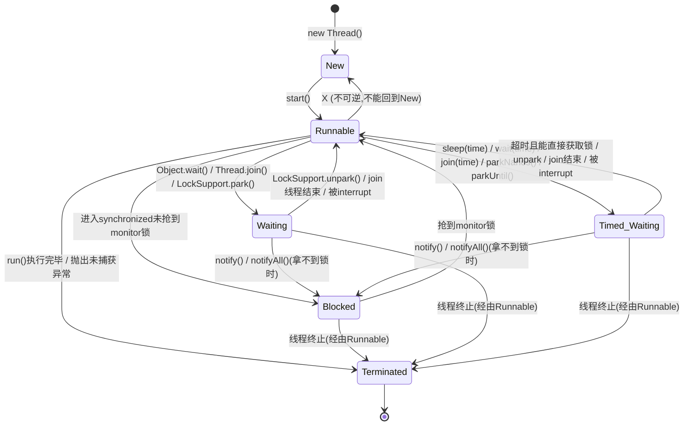

# 并发基础与线程

## Java 并发编程知识体系

**扎实的理论基础，宝贵的并发实践经验**

并发业务场景中的大量需求围绕 Java 并发知识展开。实践路径包括：从线程池引发的 OOM 问题出发，剖析 JUC 源码，定位、复现并修复线上并发问题，到应对千万级流量业务场景、预判并发现其中隐藏的线程安全隐患，逐步积累并发调优经验。

在解决问题及系统设计与实施过程中，需研读大量经典并发书籍与资料，将代码逐一落实、验证并应用到实际业务，逐步建立完善的 Java 并发知识体系。


**为什么并发编程如此重要**

随着系统复杂度提升，并发编程是优秀系统设计与程序员职业发展的必要门槛，掌握并发编程有助于职业发展进阶。


- **并发已经成为基本技能**

流量较大的系统中，随数据和用户量增加，并发量易过万；若不使用并发编程，性能会迅速成为瓶颈。服务器 CPU 性能与核心数不断提升，为并发编程提供了需求与资源双重保障。

- **并发是 Java 面试必考的内容**

互联网行业岗位描述中并发几乎是必备考核点，以下为招聘网站 JD 实例。


Java 高级工程师岗位要求中，并发编程已成为必须掌握的技能点，各章节知识点也是高频面试考点。

**如何学好并发编程**

目录中的问题涵盖并发编程各核心环节，需能全面、清晰、准确地作答。


- **Java 编程是众多框架的原理和基础**

Spring、Tomcat 中的线程池应用、数据库乐观锁思想、Log4j2 对阻塞队列的应用等均体现并发编程思想。并发编程应用广泛，与各大框架联系密切，掌握后可一通百通。

**学好并发编程的难点**

- **并发的知识太多、太杂**


常见并发工具类包括线程池、各种 Lock、synchronized 关键字、ConcurrentHashMap、CopyOnWriteArrayList、ArrayBlockingQueue、ThreadLocal、原子类、CountDownLatch、Semaphore 等；其原理涉及 CAS、AQS、Java 内存模型等。


并发工具数量多、功能各异，知识点琐碎，难以形成体系。学习底层原理还涉及 JVM、JMM、操作系统、内存、CPU 指令等内容，较为庞杂。

- **不容易找到清晰易懂的学习资料**

较少资料能清晰讲解 Java 并发编程。学习一个工具类需掌握其诞生背景、使用场景、用法、注意点，最终理解原理及其与其他工具类的联系。网络资料水平参差、真伪难辨，先入为主的错误观点会得不偿失。


**学习本文的收获**

- **建立完整的 Java 并发知识网**

可系统学习 Java 并发编程知识，摆脱碎片化获取。建立知识脉络后，每个工具类都是知识体系中的"拼图"，对并发的理解会更深入。遇到新工具类时，可迅速定位其位置并结合已有知识掌握它。


- **掌握常用的并发工具类**

内容覆盖实际生产中常用的大多数并发工具类相关知识，包括线程池、synchronized、Lock 锁、悲观锁与乐观锁、可重入锁、公平锁与非公平锁、读写锁、ConcurrentHashMap、CopyOnWriteArrayList、ThreadLocal、原子类、CAS 原理、CountDownLatch、CyclicBarrier、Semaphore、AQS 框架、Java 内存模型、happens-before 原则、volatile 关键字、线程创建与停止的正确方法、线程的 6 种状态、死锁的解决等。从用法到原理，再到常见面试问题，可一次性掌握透彻。

- **面试中的高效准备**

各小节从高频常考面试问题出发，先给出参考解答，再引申出关联知识。既可解答常见面试问题，也可在问题基础上延伸，加深对知识体系的整体理解。

并发编程是成为 Java 高级、资深工程师的必经之路。几乎所有程序都或多或少需要用到并发和多线程。对于仅接触 CRUD 项目、长期处于一线、或面试屡屡碰壁的开发者，学习并发可帮助突破瓶颈、进阶到下一层级。

本文参考了前辈们的优秀作品，在此致以敬意和感谢。

---

## 实现线程的方法


实现线程是并发编程的基础。本质上，Java 中只有一种实现线程的方式。常见的实现方式有 2 种、3 种或 4 种之说，但它们在本质上都归于同一种方式。

### 实现 Runnable 接口

```java
public class RunnableThread implements Runnable {

@Override
    public void run() {
        System.out.println("用实现Runnable接口实现线程");
    }
}

```

第 1 种方式是通过实现 Runnable 接口实现多线程：`RunnableThread` 实现 `Runnable` 接口并重写 `run()` 方法，将实例传入 `Thread` 类即可实现多线程。

### 继承 Thread 类

```java
public class ExtendsThread extends Thread {

@Override
    public void run() {
        System.out.println("用Thread类实现线程");
    }
}

```

第 2 种方式是继承 `Thread` 类：不实现接口，而是继承 `Thread` 类并重写其中的 `run()` 方法。这两种方式在实践中非常常用。

### 线程池创建线程

第 3 种方式是通过线程池创建线程。线程池可创建指定数量的子线程执行任务，例如设置线程数量为 10，会有 10 个子线程执行任务。

```java
static class DefaultThreadFactory implements ThreadFactory {

DefaultThreadFactory() {
        SecurityManager s = System.getSecurityManager();
        group = (s != null) ? s.getThreadGroup() :
            Thread.currentThread().getThreadGroup();
        namePrefix = "pool-" +
            poolNumber.getAndIncrement() +
            "-thread-";
    }

public Thread newThread(Runnable r) {
        Thread t = new Thread(group, r,
                    namePrefix + threadNumber.getAndIncrement(),
0);

if (t.isDaemon())
            t.setDaemon(false);
        if (t.getPriority() != Thread.NORM_PRIORITY)
            t.setPriority(Thread.NORM_PRIORITY);
        return t;
    }
}

```

线程池本质上通过线程工厂创建线程，默认采用 `DefaultThreadFactory`，为线程设置名称、是否守护线程、优先级等默认值。无论设置哪些属性，最终都是通过 `new Thread()` 创建线程，只是构造函数参数更多。因此线程池创建线程并未脱离前两种基本方式，本质上仍是 `new Thread()`。

回答线程实现问题时，在描述前两种方式后可引申："线程池和 Callable 也可以创建线程，但本质上是通过前两种基本方式实现的"。面试官可能追问线程池构成及原理，这部分在后续章节详细分析。

### 有返回值的 Callable 创建线程

```java
class CallableTask implements Callable<Integer> {

@Override
    public Integer call() throws Exception {
        return new Random().nextInt();
    }
}

//创建线程池
ExecutorService service = Executors.newFixedThreadPool(10);
//提交任务，并用 Future提交返回结果
Future<Integer> future = service.submit(new CallableTask());

```

第 4 种方式是通过有返回值的 `Callable` 创建线程。`Runnable` 创建线程无返回值，而 `Callable` 及相关的 `Future`、`FutureTask` 可将线程执行结果作为返回值。示例实现了 `Callable<Integer>` 接口，返回一个随机数。

`Callable` 和 `FutureTask` 与 `Runnable` 一样，都是需要被执行的任务，本身不是线程。它们可放入线程池执行，`submit()` 将任务放入线程池并由线程池创建线程。无论何种方式，最终都靠线程执行，子线程的创建方式仍脱离不了实现 `Runnable` 接口和继承 `Thread` 类这两种基本方式。

### 其他创建方式

#### 定时器 Timer

```java
class TimerThread extends Thread {
//具体实现
}

```

定时器也可实现线程。新建 `Timer` 令其在指定时间后执行任务时，确实会创建线程并执行任务。但分析定时器源码，其内部存在继承自 `Thread` 类的 `TimerThread`，因此定时器创建线程又绕回最开始的那两种方式。

#### 其他方法

```java
/**
 *描述：匿名内部类创建线程
 */
new Thread(new Runnable() {
    @Override
    public void run() {
        System.out.println(Thread.currentThread().getName());
    }
}).start();

```

匿名内部类或 lambda 表达式创建线程仅是在语法层面实现线程，不能归结为实现多线程的方式。匿名内部类仅是把需要传入的 `Runnable` 实例化出来。

```java
new Thread(() -> System.out.println(Thread.currentThread().getName())).start();

```

lambda 表达式方式同样符合最开始所说的那两种实现线程的方式。

### 实现线程只有一种方式

创建线程的方式可先认为有两种，其他方式（线程池、定时器等）仅是 `new Thread()` 外层的一层封装。若把封装都视为新方式，则创建方式会层出不穷。打开封装后可见它们最终都基于 `Runnable` 接口或继承 `Thread` 类实现。

更深层次看，这两种方式本质上是一种。

```java
@Override
public void run() {
    if (target != null) {
        target.run();
    }
}

```

启动线程需调用 `start()` 方法，`start()` 最终调用 `run()`。第一种方式中 `run()` 方法第 1 行 `if (target != null)` 判断 target 是否为空，不为空则执行 `target.run()`，target 即为实现 `Runnable` 接口时传给 `Thread` 类的对象。第二种方式（继承 `Thread`）会重写上述 `run()` 方法，`run()` 中直接执行所需任务，但最终仍需调用 `thread.start()` 启动线程。结论：创建线程只有一种方式，即构造一个 `Thread` 类。

两种创建方式的区别仅在于**实现线程运行内容的不同**。运行内容要么来自 `target`，要么来自重写的 `run()` 方法。因此：本质上实现线程只有一种方式，而实现线程执行的内容有两种方式——实现 `Runnable` 接口，或继承 `Thread` 类重写 `run()` 方法。在此基础上，线程池和 `Timer` 定时器只是对这两种方式的封装。

### 实现 Runnable 接口比继承 Thread 类实现线程要好

- **架构解耦**：`Runnable` 中只有一个 `run()` 方法定义执行内容，实现了与 `Thread` 类的解耦。`Thread` 类负责线程启动和属性设置，权责分明。

- **提高性能**：继承 `Thread` 方式每次执行任务需新建独立线程，执行完销毁；再次执行需重新新建类。实现 `Runnable` 接口方式可将任务直接传入线程池，用固定线程完成任务，无需反复新建、销毁线程，降低性能开销。

- **避免单继承限制**：Java 不支持多继承。类一旦继承 `Thread` 类，后续无法再继承其他类，限制了代码的可拓展性。

综上，应优先选择通过实现 `Runnable` 接口的方式创建线程。

---

## 停止线程的正确方式


启动线程需调用 `Thread` 类的 `start()` 方法，并在 `run()` 方法中定义任务。启动简单，正确停止则较难。

### 原理介绍

通常情况下不手动停止线程，而是允许线程运行到结束自然停止。特殊情况下需提前停止线程，如用户突然关闭程序、程序运行出错重启等。即将停止的线程在很多业务场景下仍有价值，程序需要具备良好的健壮性时，正确停止线程格外重要。Java 没有提供简单易用、能直接安全停止线程的能力。

### 为什么不强制停止？而是通知、协作

Java 中正确的停止线程方式是使用 `interrupt`。`interrupt` 仅起到通知被停止线程的作用，被停止的线程拥有完全自主权，可选择立即停止、一段时间后停止或根本不停止。

Java 不提供强制停止线程的能力，是因为它希望程序间能相互通知、相互协作地管理线程。在不了解对方工作的情况下贸然强制停止可能造成安全问题，因此需要给对方时间整理收尾工作。例如线程正在写文件时收到终止信号，需根据业务判断立即停止还是写入成功后再停止；立即停止可能造成数据不完整。中断命令发起方和接收方都不希望数据出问题。

### 如何用 interrupt 停止线程

```java
while (!Thread.currentThread().isInterrupted() && more work to do) {
    do more work
}

```

调用某线程的 `interrupt()` 后，该线程的中断标记位会被置为 true。每个线程都有该标记位，线程执行时应定期检查；标记位为 true 说明有程序想终止该线程。`while` 循环中首先通过 `Thread.currentThread().isInterrupted()` 判断是否被中断，再检查是否还有工作要做，`&&` 表示两个条件同时满足时才继续执行工作。

```java
public class StopThread implements Runnable {

@Override
    public void run() {
        int count = 0;
        while (!Thread.currentThread().isInterrupted() && count < 1000) {
            System.out.println("count = " + count++);
        }
    }

public static void main(String[] args) throws InterruptedException {
        Thread thread = new Thread(new StopThread());
        thread.start();
        Thread.sleep(5);
        thread.interrupt();
    }
}

```

`StopThread` 的 `run()` 中先判断线程是否被中断，再判断 count 是否小于 1000，线程打印 0~999，每次循环开始前检查是否被中断。`main` 中启动线程，休眠 5 毫秒后中断线程，线程检测到中断信号后未打印完 1000 个数便停下，属于通过 `interrupt` 正确停止线程的情况。

### sleep 期间能否感受到中断

```java
Runnable runnable = () -> {
    int num = 0;
    try {
        while (!Thread.currentThread().isInterrupted() &&
        num <= 1000) {
            System.out.println(num);
            num++;
            Thread.sleep(1000000);
        }
    } catch (InterruptedException e) {
        e.printStackTrace();
    }
};

```

改写代码：线程执行任务期间每打印一个数字就 `sleep`，将休眠时间设为 1000 秒。

```java
public class StopDuringSleep {

public static void main(String[] args) throws InterruptedException {
        Runnable runnable = () -> {
            int num = 0;
            try {
                while (!Thread.currentThread().isInterrupted() && num <= 1000) {
                    System.out.println(num);
                    num++;
                    Thread.sleep(1000000);
                }
            } catch (InterruptedException e) {
                e.printStackTrace();
            }
        };
        Thread thread = new Thread(runnable);
        thread.start();
        Thread.sleep(5);
        thread.interrupt();
    }
}

```

主线程休眠 5 毫秒后通知子线程中断，此时子线程仍在 `sleep` 中。处于休眠中的线程能够感受到中断通知，无需等休眠结束。若需等待休眠结束才响应中断，会造成响应不及时的严重问题。

`sleep`、`wait` 等使线程进入阻塞的方法使线程休眠后被中断，线程能感受到中断信号，并抛出 `InterruptedException` 异常，同时清除中断信号、将中断标记位置为 false。即使线程仍在休眠，也能响应中断通知并抛出异常。

### 两种最佳处理方式

实际开发通常是团队协作，不同人负责编写不同方法并相互调用。若编写的方法需要被调用，且方法内调用了 `sleep` 或 `wait` 等能响应中断的方法时，仅 `catch` 住异常不够。

```java
void subTask() {
    try {
        Thread.sleep(1000);
    } catch (InterruptedException e) {
        // 在这里不处理该异常是非常不好的
    }
}

```

可在方法中使用 `try/catch` 或在方法签名中声明 `throws InterruptedException`。

### 方法签名抛异常，run() 强制 try/catch

`catch` 语句块为空、不做任何处理时，线程 `sleep` 期间收到 interrupt 通知会立即抛出异常并清除中断信号，异常被 `catch` 捕获。但 `catch` 不处理相当于把中断信号隐藏，不合理。

处理方式一：在方法签名中抛出异常。

```java
void subTask2() throws InterruptedException {
    Thread.sleep(1000);
}

```

要求每个方法的调用方有义务处理异常：调用方用 `try/catch` 在 catch 中正确处理异常，或将异常声明到方法签名。每层逻辑遵守规范，即可将中断信号层层传递到顶层，最终让 `run()` 捕获到异常。`run()` 本身没有抛出 checkedException 的能力，只能通过 `try/catch` 处理异常。层层传递保障异常不被遗漏，`run()` 可根据业务逻辑做相应处理。

### 再次中断

```java
private void reInterrupt() {
    try {
        Thread.sleep(2000);
    } catch (InterruptedException e) {
        Thread.currentThread().interrupt();
        e.printStackTrace();
    }
}

```

处理方式二：在 `catch` 语句中再次中断线程。线程休眠期间被中断会自动清除中断信号，在 `catch` 中手动调用 `Thread.currentThread().interrupt()` 可恢复中断信号，后续执行的方法仍能检测到中断，可做相应处理，线程正常退出。

实际开发中不能盲目吞掉中断。若既不在方法签名中声明、也不在 catch 中恢复中断，而在 catch 中不作处理，称为"屏蔽了中断请求"。盲目屏蔽中断会导致中断信号被完全忽略，最终线程无法正确停止。

### 为什么用 volatile 标记位的停止方法是错误的

#### 错误的停止方法

`stop()`、`suspend()` 和 `resume()` 已被 Java 标记为 `@Deprecated`，调用时 IDE 会提示不应使用。`stop()` 会直接停止线程，不给线程处理停止前保存数据的逻辑时间，导致数据完整性问题。`suspend()` 与 `resume()` 的问题在于：`suspend()` 不释放锁就进入休眠，此时可能仍持有锁，容易导致死锁——这把锁在线程被 `resume()` 之前不会被释放。

例如线程 A 调用 `suspend()` 让线程 B 挂起，线程 B 休眠但仍持有一把锁；线程 A 想访问该锁却拿不到，陷入阻塞，线程 A、B 都无法继续执行。因此 `suspend()` 和 `resume()` 组合使用的方式也被废弃。

#### volatile 修饰标记位适用的场景

```java
public class VolatileCanStop implements Runnable {

private volatile boolean canceled = false;

@Override
    public void run() {
        int num = 0;
        try {
            while (!canceled && num <= 1000000) {
                if (num % 10 == 0) {
                    System.out.println(num + "是10的倍数。");
                }
                num++;
                Thread.sleep(1);
            }
        } catch (InterruptedException e) {
            e.printStackTrace();
        }
    }

public static void main(String[] args) throws InterruptedException {
        VolatileCanStop r = new VolatileCanStop();
        Thread thread = new Thread(r);
        thread.start();
        Thread.sleep(3000);
        r.canceled = true;
    }
}

```

`volatile` 修饰标记位可正常停止线程的场景：`run()` 中 `while` 循环做两层判断，先判断 `volatile` 修饰的初始值为 false 的 `canceled` 变量，为 true 时跳出循环；再判断 num 小于 1000000。循环体内打印 10 的倍数并 num++。启动线程 3 秒后将 `canceled` 置为 true，线程在下一次循环中判断出条件不满足，跳出循环停止。此场景 `volatile` 标记位可正常工作。但一个正确的方法不应仅适用于一种情况。

#### volatile 修饰标记位不适用的场景

用生产者/消费者案例演示 `volatile` 标记位停止方法的不完美之处。

```java
class Producer implements Runnable {
    public volatile boolean canceled = false;
    BlockingQueue storage;
    public Producer(BlockingQueue storage) {
        this.storage = storage;
    }

@Override
    public void run() {
        int num = 0;
        try {
            while (num <= 100000 && !canceled) {
                if (num % 50 == 0) {
                    storage.put(num);
                    System.out.println(num + "是50的倍数,被放到仓库中了。");
                }
                num++;
            }
        } catch (InterruptedException e) {
            e.printStackTrace();
        } finally {
            System.out.println("生产者结束运行");
        }
    }
}

```

生产者 `Producer` 通过 `volatile` 标记的初始值为 false 的布尔值 `canceled` 停止线程。`run()` 中 `while` 判断 num 小于 100000 及 `canceled` 是否被标记，循环体内 num 为 50 的倍数时放入 `storage` 仓库。当 num 大于 100000 或被通知停止时跳出循环，执行 finally 输出"生产者结束运行"。

```java
class Consumer {
    BlockingQueue storage;
    public Consumer(BlockingQueue storage) {
        this.storage = storage;
    }
    public boolean needMoreNums() {
        if (Math.random() > 0.97) {
            return false;
        }
        return true;
    }
}

```

消费者 `Consumer` 与生产者共用同一仓库 `storage`，通过 `needMoreNums()` 判断是否需要继续使用数字：产生随机数并与 0.97 比较，大于 0.97 则不再使用。

```java
public static void main(String[] args) throws InterruptedException {
        ArrayBlockingQueue storage = new ArrayBlockingQueue(8);

Producer producer = new Producer(storage);
        Thread producerThread = new Thread(producer);
        producerThread.start();
        Thread.sleep(500);

Consumer consumer = new Consumer(storage);
        while (consumer.needMoreNums()) {
            System.out.println(consumer.storage.take() + "被消费了");
            Thread.sleep(100);
        }
        System.out.println("消费者不需要更多数据了。");

//一旦消费不需要更多数据了，我们应该让生产者也停下来，但是实际情况却停不下来
        producer.canceled = true;
        System.out.println(producer.canceled);
    }
}

```

`main` 中创建生产者/消费者共用仓库 `BlockingQueue storage`（容量 8），启动生产者线程后休眠 500 毫秒，保证生产者有足够时间塞满仓库；仓库满后生产者不再塞入并阻塞。500 毫秒后创建消费者，判断是否需要更多数字，每次消费后休眠 100 毫秒。此业务逻辑可能出现在实际生产中。

消费者不再需要数据时，将 `canceled` 置为 true，理论上生产者会跳出 `while` 循环并输出"生产者运行结束"。

实际结果并非预期：尽管 `canceled` 已置为 true，生产者仍未停止。原因在于生产者执行 `storage.put(num)` 时发生阻塞，在它被叫醒前无法进入下一次循环判断 `canceled` 的值。此场景下 `volatile` 无法让生产者停下。改用 `interrupt` 中断，即使生产者处于阻塞状态，仍能感受到中断信号并做出响应处理。

### 总结

正确停止线程应使用 `interrupt` 请求中断，而非强制停止，这样可避免数据错乱，并给线程时间结束收尾工作。

子方法编写者遇到 `InterruptedException` 的处理方式：将异常声明在方法中，以便顶层方法感知捕获；或在 catch 中再次声明中断，使下次循环感知中断。正确停止线程要求停止方、被停止方、子方法编写者相互配合，按规范编写代码。

不够好的方法包括：`stop()`、`suspend()`、`resume()` 因安全风险（如死锁）被舍弃；`volatile` 在特殊情况下（如线程长时间阻塞）无法及时感受中断，是不全面的停止线程方法。

---

## 线程的 6 种状态与转换


### 线程的 6 种状态

线程有自身的生命周期，Java 中线程的生命周期共有 6 种状态。

- New（新创建）

- Runnable（可运行）

- Blocked（被阻塞）

- Waiting（等待）

- Timed Waiting（计时等待）

- Terminated（被终止）

可通过 `getState()` 方法确定线程当前状态，线程在任何时刻只可能处于 1 种状态。

线程 6 种状态的完整转换关系如下图所示：



### New 新创建

New 表示线程被创建但尚未启动的状态。用 `new Thread()` 新建线程时，若线程未运行 `start()` 方法、也未执行 `run()` 中的代码，状态即为 New。一旦线程调用 `start()`，状态从 New 变为 Runnable。

### Runnable 可运行

Java 的 Runnable 状态对应操作系统线程状态中的 Running 和 Ready 两种状态。处于 Runnable 的线程可能正在执行，也可能没有执行、正在等待被分配 CPU 资源。

若一个正在运行的 Runnable 状态线程运行到一半时，CPU 被调度去做其他事情导致线程暂时不运行，其状态依然不变、仍为 Runnable，因为它可能随时被调度回来继续执行。

### 阻塞状态

Java 中阻塞状态通常不只是 Blocked，而是包括三种状态：Blocked（被阻塞）、Waiting（等待）、Timed Waiting（计时等待），三者统称为阻塞状态。

### Blocked 被阻塞

从 Runnable 进入 Blocked 状态只有一种可能：进入 `synchronized` 保护的代码时未抢到 monitor 锁，进入 `synchronized` 代码块或 `synchronized` 方法均如此。当处于 Blocked 的线程抢到 monitor 锁，就会从 Blocked 回到 Runnable 状态。

### Waiting 等待

线程进入 Waiting 状态有三种可能性。

- 没有设置 Timeout 参数的 `Object.wait()` 方法。

- 没有设置 Timeout 参数的 `Thread.join()` 方法。

- `LockSupport.park()` 方法。

Blocked 仅针对 synchronized monitor 锁，但 Java 中还有其他锁（如 ReentrantLock）。线程获取这类锁未抢到时进入 Waiting 状态，因为本质上执行了 `LockSupport.park()` 方法。`Object.wait()` 和 `Thread.join()` 也会让线程进入 Waiting 状态。

Blocked 与 Waiting 的区别：Blocked 在等待其他线程释放 monitor 锁，Waiting 则在等待某个条件（如 join 的线程执行完毕，或 `notify()`/`notifyAll()`）。

### Timed Waiting 计时等待

Timed Waiting 与 Waiting 状态非常相似，区别仅在于有无时间限制。Timed Waiting 会等待超时，由系统自动唤醒，或在超时前被唤醒信号唤醒。

以下情况会让线程进入 Timed Waiting 状态。

- 设置了时间参数的 `Thread.sleep(long millis)` 方法；

- 设置了时间参数的 `Object.wait(long timeout)` 方法；

- 设置了时间参数的 `Thread.join(long millis)` 方法；

- 设置了时间参数的 `LockSupport.parkNanos(long nanos)` 方法和 `LockSupport.parkUntil(long deadline)` 方法。

从 Blocked 进入 Runnable 状态需线程获取 monitor 锁。从 Waiting 流转到其他状态较特殊：Waiting 不限时，无论过多久都不会主动恢复。只有执行了 `LockSupport.unpark()`，或 join 的线程运行结束，或被中断时，才可进入 Runnable 状态。

若其他线程调用 `notify()` 或 `notifyAll()` 唤醒 Waiting 线程，该线程会直接进入 Blocked 状态。因为调用 `notify()`/`notifyAll()` 的线程必须首先持有 monitor 锁，Waiting 线程被唤醒时拿不到该锁，故进入 Blocked 状态；直到唤醒线程释放 monitor 锁后，才可能轮到它抢锁，抢到后从 Blocked 回到 Runnable。

在 Timed Waiting 中执行 `notify()` 和 `notifyAll()` 同理，先进入 Blocked 状态，抢锁成功后回到 Runnable 状态。

对 Timed Waiting，若超时时间到了且能直接获取锁、join 的线程运行结束、被中断或调用了 `LockSupport.unpark()`，会直接恢复为 Runnable 状态，无需经历 Blocked 状态。

### Terminated 终止

进入 Terminated 状态有两种可能。

- `run()` 方法执行完毕，线程正常退出。

- 出现一个未捕获的异常，终止了 `run()` 方法，导致意外终止。

### 注意点

- 线程状态需按箭头方向流转。例如线程从 New 状态不能直接进入 Blocked 状态，需先经历 Runnable 状态。

- 线程生命周期不可逆：一旦进入 Runnable 状态就不能回到 New 状态；一旦终止就不可能再有任何状态变化。一个线程只能有一次 New 和 Terminated 状态，只有处于中间状态才能相互转换。

---

## wait、notify、notifyAll 的使用


- 为什么 wait 方法必须在 synchronized 保护的同步代码中使用？

- 为什么 wait/notify/notifyAll 被定义在 Object 类中，而 sleep 定义在 Thread 类中？

- wait/notify 和 sleep 方法的异同？

### 为什么 wait 必须在 synchronized 保护的同步代码中使用？

wait 方法的源码注释：

"wait method should always be used in a loop:

```java
 synchronized (obj) {
     while (condition does not hold)
         obj.wait();
     ... // Perform action appropriate to condition
}

```

This method should only be called by a thread that is the owner of this object's monitor."

使用 wait 方法时，必须把 wait 写在 synchronized 保护的 while 代码块中，并始终判断执行条件是否满足：满足则继续执行，不满足则执行 wait。执行 wait 之前必须先持有对象的 monitor 锁（synchronized 锁）。

若 wait 方法不要求放在 synchronized 保护中而可随意调用，可能写出如下代码：

```java
class BlockingQueue {
    Queue<String> buffer = new LinkedList<String>();
    public void give(String data) {
        buffer.add(data);
        notify();  // Since someone may be waiting in take
    }
    public String take() throws InterruptedException {
        while (buffer.isEmpty()) {
            wait();
        }
        return buffer.remove();
    }
}

```

`give` 方法往 buffer 中添加数据后执行 notify 唤醒等待的线程，`take` 方法检查 buffer 是否为空：为空则等待，不为空则取出数据。这是典型的生产者消费者思想。

这段代码未受 synchronized 保护，可能发生以下场景：

- 消费者调用 `take` 判断 `buffer.isEmpty` 返回 true，希望进入等待，但在调用 wait 之前被调度器暂停，尚未执行 wait。

- 生产者运行并执行完 `give`，往 buffer 添加数据并执行 notify；但消费者线程的 wait 未及执行，没有线程在等待，notify 无效果。

- 被暂停的消费者回来继续执行 wait 并进入等待。

消费者判断了 buffer.isEmpty 条件，但真正执行 wait 时该结果已过期，不符合最新场景。"判断-执行"不是原子操作，中途被打断，线程不安全。若没有更多生产者生产，消费者可能陷入无穷等待，因为它错过了 give 内 notify 的唤醒。

因为 `take` 未被 synchronized 保护，其 while 判断和 wait 无法构成原子操作，程序容易出错。

改写为 synchronized 保护的同步代码块：

```java
public void give(String data) {
   synchronized (this) {
      buffer.add(data);
      notify();
  }
}

public String take() throws InterruptedException {
   synchronized (this) {
    while (buffer.isEmpty()) {
         wait();
       }
     return buffer.remove();
  }
}

```

这样可确保 notify 永远不会在 `buffer.isEmpty` 和 wait 之间被调用，提升程序安全性。

wait 方法会释放 monitor 锁，这也要求必须首先进入 synchronized 持有该锁。

还存在"虚假唤醒"（spurious wakeup）问题：线程可能在既未被 notify/notifyAll、也未中断或超时的情况下被唤醒。实际生产中虚假唤醒概率很小，但程序需保证发生虚假唤醒时仍正确，因此采用 while 循环结构。

```java
while (condition does not hold)
    obj.wait();

```

即便被虚假唤醒，也会再次检查 while 条件，不满足则继续 wait，消除虚假唤醒风险。

### 为什么 wait/notify/notifyAll 被定义在 Object 类中，而 sleep 定义在 Thread 类中？

- Java 中每个对象都有一把 monitor 监视器锁，每个对象都可上锁，要求在对象头中有保存锁信息的位置。该锁是对象级别的，而非线程级别。wait/notify/notifyAll 都是锁级别的操作，锁属于对象，把它们定义在 Object 类中最合适，因为 Object 是所有对象的父类。

- 若把 wait/notify/notifyAll 定义在 Thread 类中，会带来局限性。一个线程可能持有多把锁以配合复杂逻辑。若 wait 定义在 Thread 类中，难以实现让线程持有多把锁，也难以明确线程等待的是哪把锁。等待某对象的锁，应通过操作对象实现，而非操作线程。

### wait/notify 和 sleep 方法的异同？

相同点：

- 都可以让线程阻塞。

- 都可以响应 interrupt 中断：等待过程中收到中断信号时，都能响应并抛出 InterruptedException 异常。

不同点：

- wait 必须在 synchronized 保护的代码中使用，sleep 无此要求。

- 同步代码中执行 sleep 时不释放 monitor 锁；执行 wait 时会主动释放 monitor 锁。

- sleep 必须定义时间，时间到期后主动恢复；无参数的 wait 意味着永久等待，直到被中断或被唤醒才能恢复，不会主动恢复。

- wait/notify 是 Object 类的方法，sleep 是 Thread 类的方法。

---

## 生产者消费者模式的实现


### 生产者消费者模式

生产者消费者模式是程序设计中常见的设计模式，广泛运用于解耦、消息队列等场景。生产商品的一方为生产者，消费商品的一方为消费者。生产者生产速度过快而消费者消费速度跟不上（"产能过剩"），或多个生产者对应多个消费者时配合易混乱，因此需要在生产者和消费者之间增加一个中介进行调度，由此产生生产者消费者模式。


实现生产者消费者模式通常需在两者间增加一个阻塞队列作为媒介，形成缓冲以平衡两者的能力。整体结构：阻塞队列位于中间，生产者线程生产数据后存入阻塞队列，消费者线程从阻塞队列获取数据，二者通过阻塞队列完成通信。阻塞队列满或空都可能产生阻塞，阻塞后需在合适时机唤醒被阻塞线程。

阻塞线程需被唤醒的两种情况：

- 消费者发现阻塞队列为空时进入等待，生产者一旦放入数据就通知所有消费者，唤醒阻塞的消费者线程。

- 生产者发现队列已满时被阻塞，消费者获取数据后队列空出一个位置，消费者通知所有阻塞的生产者进行生产。

### 如何用 BlockingQueue 实现生产者消费者模式

```java
public static void main(String[] args) {

BlockingQueue<Object> queue = new ArrayBlockingQueue<>(10);

Runnable producer = () -> {
    while (true) {
          queue.put(new Object());
  }
   };

new Thread(producer).start();
new Thread(producer).start();

Runnable consumer = () -> {
      while (true) {
           queue.take();
}
   };
new Thread(consumer).start();
new Thread(consumer).start();
}

```

创建容量为 10 的 `ArrayBlockingQueue`，命名为 queue；创建生产者，`while(true)` 循环中 `queue.put()` 负责添加数据；创建两个生产者线程并启动。消费者中 `while(true)` 循环的 `queue.take()` 负责消费数据，创建两个消费者线程并启动。代码省略了 try/catch 以突出设计思想——注意 `put`/`take` 声明抛出 `InterruptedException`，而 `Runnable.run()` 不允许抛出受检异常，实际使用时必须在 lambda 内捕获处理。`ArrayBlockingQueue` 在背后完成大量工作：队列满时阻塞生产者线程，队列有空时唤醒生产者线程等。

### 如何用 Condition 实现生产者消费者模式

利用 Condition 实现生产者消费者模式相当于自己实现一个简易版 BlockingQueue，其背后原理与 BlockingQueue 非常相似。

```java
public class MyBlockingQueueForCondition {

private Queue queue;
   private int max = 16;
   private ReentrantLock lock = new ReentrantLock();
   private Condition notEmpty = lock.newCondition();
   private Condition notFull = lock.newCondition();

public MyBlockingQueueForCondition(int size) {
       this.max = size;
       queue = new LinkedList();
   }

public void put(Object o) throws InterruptedException {
       lock.lock();
       try {
           while (queue.size() == max) {
               notFull.await();
           }
           queue.add(o);
           notEmpty.signalAll();
       } finally {
           lock.unlock();
       }
   }

public Object take() throws InterruptedException {
       lock.lock();
       try {
           while (queue.size() == 0) {
               notEmpty.await();
           }
           Object item = queue.remove();
           notFull.signalAll();
           return item;
       } finally {
           lock.unlock();
       }
   }
}

```

定义队列变量 queue 并设最大容量 16；定义 `ReentrantLock` 锁，并基于该锁创建两个 Condition：`notEmpty`（队列非空）和 `notFull`（队列非满）；声明 put 和 take 两个核心方法。

`put` 方法：先加锁，`while` 中检测 queue 是否已满。已满则调用 `notFull.await()` 阻塞生产者线程并释放 Lock；未满则放入数据，用 `notEmpty.signalAll()` 唤醒所有等待的消费者。`finally` 中 `lock.unlock()` 解锁——把 unlock 放在 finally 是基本原则，否则可能无法释放锁。

`take` 方法与 `put` 对应：`while` 检查队列是否为空，为空则消费者等待；不为空则获取数据并通知生产者队列有空余位置，最后在 finally 中解锁。

`take()` 必须用 `while( queue.size() == 0 )` 检查队列状态，不能用 `if( queue.size() == 0 )`。原因：假设有两个消费者，第一个获取数据时发现队列为空进入等待并释放锁，第二个可进入并执行 `if( queue.size() == 0 )` 也发现为空进入等待。生产者生产一个数据后唤醒两个消费者，只有一个能拿到锁执行 `queue.remove`，另一个卡在被唤醒处；第一个执行完在 finally 中解锁，第二个拿到锁后也执行 `queue.remove`，但此时队列已空，抛出 `NoSuchElementException`。用 `while` 检查时，第二个消费者在 remove 前仍会检查 `queue.size() == 0`，满足则继续 `await`，避免获取 null 或抛异常。

### 如何用 wait/notify 实现生产者消费者模式

wait/notify 与 Condition 的实现原理类似，属于"兄弟"关系。

```java
class MyBlockingQueue {

private int maxSize;
   private LinkedList<Object> storage;

public MyBlockingQueue(int size) {
       this.maxSize = size;
       storage = new LinkedList<>();
   }

public synchronized void put() throws InterruptedException {
       while (storage.size() == maxSize) {
           wait();
       }
       storage.add(new Object());
       notifyAll();
   }

public synchronized void take() throws InterruptedException {
       while (storage.size() == 0) {
           wait();
       }
       System.out.println(storage.remove());
       notifyAll();
   }
}

```

`put` 方法被 synchronized 保护，`while` 检查队列是否满，不满则放入数据并用 `notifyAll()` 唤醒其他线程。`take` 方法也被 synchronized 修饰，`while` 检查队列是否为空，不为空则获取数据并唤醒其他线程。

```java
/**
* 描述：     wait形式实现生产者消费者模式
*/
public class WaitStyle {

public static void main(String[] args) {
       MyBlockingQueue myBlockingQueue = new MyBlockingQueue(10);
       Producer producer = new Producer(myBlockingQueue);
       Consumer consumer = new Consumer(myBlockingQueue);
       new Thread(producer).start();
       new Thread(consumer).start();
   }
}

class Producer implements Runnable {

private MyBlockingQueue storage;

public Producer(MyBlockingQueue storage) {
       this.storage = storage;
   }

@Override
   public void run() {
       for (int i = 0; i < 100; i++) {
           try {
               storage.put();
           } catch (InterruptedException e) {
               e.printStackTrace();
           }
       }
   }
}

class Consumer implements Runnable {

private MyBlockingQueue storage;

public Consumer(MyBlockingQueue storage) {
       this.storage = storage;
   }

@Override
   public void run() {
       for (int i = 0; i < 100; i++) {
           try {
               storage.take();
           } catch (InterruptedException e) {
               e.printStackTrace();
           }
       }
   }
}

```

三种实现方式中，第一种 BlockingQueue 实现较简单，但其背后原理在第二种、第三种方法中得以体现。第二种、第三种方法本质上是自己实现了 BlockingQueue 的部分核心逻辑，供生产者与消费者使用。

---

## 线程安全问题分类


### 什么是线程安全

《Java Concurrency In Practice》作者 Brian Goetz 对线程安全的定义：当多个线程访问一个对象时，如果不用考虑这些线程在运行时环境下的调度和交替执行问题，也不需要额外同步，而调用这个对象的行为都能获得正确结果，那么该对象便是线程安全的。

即：若某个对象是线程安全的，使用者在使用时无需考虑方法间的协调问题（如不能同时写入、读写不能并行），也无需任何额外同步（如自己加 synchronized 锁）。该定义非常苛刻。

实际开发中常遇到线程不安全的情况，有 3 种典型线程安全问题：

- 运行结果错误；

- 发布和初始化导致线程安全问题；

- 活跃性问题。

### 运行结果错误

多线程同时操作一个变量导致的运行结果错误。

```java
public class WrongResult {

volatile static int i;

public static void main(String[] args) throws InterruptedException {
       Runnable r = new Runnable() {
           @Override
           public void run() {
               for (int j = 0; j < 10000; j++) {
                   i++;
               }
           }
       };
       Thread thread1 = new Thread(r);
       thread1.start();
       Thread thread2 = new Thread(r);
       thread2.start();
       thread1.join();
       thread2.join();
       System.out.println(i);
    }
}

```

定义 int 类型静态变量 i，启动两个线程分别对 i 执行 10000 次 `i++`。理论结果应为 20000，实际结果远小于理论值（如 12996 或 13323），且每次结果不同。

原因：多线程下 CPU 以时间片为单位分配调度，线程时间片耗尽会被暂停并让出 CPU。`i++` 表面是一行代码，实际不是原子操作，执行分为三步，每步之间都可能被打断。

- 第一步是读取；

- 第二步是增加；

- 第三步是保存。


线程不安全发生过程：线程 1 拿到 i=1 后进行 i+1 操作，但结果未保存即被切换走，CPU 执行线程 2。线程 2 执行同样的 i++，拿到的 i 仍是 1（线程 1 的 +1 结果未保存，线程 2 看不到）。线程 2 对 i +1 后切换到线程 1，线程 1 保存 i+1=2，又切回线程 2 保存 i=2。虽然两个线程都执行了 i+1，最终却保存为 i=2 而非期望的 i=3，发生线程安全问题、导致数据错误。这是最典型的线程安全问题。

### 发布和初始化导致线程安全问题

第二种是对象发布和初始化时导致的线程安全问题。创建对象并进行发布和初始化供其他类或对象使用是常见操作，但操作的时间或地点不对就可能导致线程安全问题。

```java
public class WrongInit {

private Map<Integer, String> students;

public WrongInit() {
        new Thread(new Runnable() {
            @Override
            public void run() {
                students = new HashMap<>();
                students.put(1, "王小美");
                students.put(2, "钱二宝");
                students.put(3, "周三");
                students.put(4, "赵四");
            }
        }).start();
     }

public Map<Integer, String> getStudents() {
        return students;
    }

public static void main(String[] args) throws InterruptedException {
        WrongInit multiThreadsError6 = new WrongInit();
        System.out.println(multiThreadsError6.getStudents().get(1));

}
}

```

类中定义 Map 类型成员变量 students（Integer 为学号，String 为姓名），构造函数中启动新线程并在线程中为 students 赋值。

- 学号：1，姓名：王小美；

- 学号：2，姓名：钱二宝；

- 学号：3，姓名：周三；

- 学号：4，姓名：赵四。

线程运行完 `run()` 中全部赋值后，4 名同学信息才初始化完毕。但 `main()` 中初始化 `WrongInit` 后未等待就打印 1 号同学信息，会发生空指针异常。

```java
Exception in thread "main" java.lang.NullPointerException
at lesson6.WrongInit.main(WrongInit.java:32)

```

原因：students 成员变量在构造函数新建的线程中初始化和赋值，线程启动需要时间，而 main 函数未等待就获取数据，导致 `getStudents` 结果为 null。这是在错误的时间或地点发布或初始化造成的线程安全问题。

### 活跃性问题

第三种线程安全问题统称为活跃性问题，最典型的有三种：死锁、活锁和饥饿。

活跃性问题即程序始终得不到运行的最终结果。相比前两种线程安全问题带来的数据错误或报错，活跃性问题后果可能更严重，如死锁会导致程序完全卡死。

#### 死锁

最常见的活跃性问题是死锁。死锁指两个线程之间相互等待对方资源、互不相让、都想自己先执行。

```java
 public class MayDeadLock {

Object o1 = new Object();
    Object o2 = new Object();

public void thread1() throws InterruptedException {
        synchronized (o1) {
            Thread.sleep(500);
            synchronized (o2) {
                System.out.println("线程1成功拿到两把锁");
           }
        }
    }

public void thread2() throws InterruptedException {
        synchronized (o2) {
            Thread.sleep(500);
            synchronized (o1) {
                System.out.println("线程2成功拿到两把锁");
            }
        }
    }

public static void main(String[] args) {
        MayDeadLock mayDeadLock = new MayDeadLock();
        new Thread(new Runnable() {
            @Override
            public void run() {
                try {
                    mayDeadLock.thread1();
                } catch (InterruptedException e) {
                    e.printStackTrace();
                }
            }
        }).start();
        new Thread(new Runnable() {
            @Override
            public void run() {
                try {
                    mayDeadLock.thread2();
                } catch (InterruptedException e) {
                    e.printStackTrace();
                }
            }
        }).start();
    }
}

```

创建两个 Object 作为 synchronized 锁对象。线程 1 先获取 o1 锁，sleep(500) 后获取 o2 锁；线程 2 顺序相反，先获取 o2 锁再获取 o1 锁。两个线程几乎同时进入休息，休息完后线程 1 想获取 o2 锁、线程 2 想获取 o1 锁，便发生死锁。两个线程不主动调和也不退出，互相等待对方释放资源，程序得不到结果也无法停止。

#### 活锁

第二种活跃性问题是活锁。活锁与死锁相似，也是程序一直等不到结果。但活锁是"活的"——正在运行的线程没有阻塞，始终在运行中，却一直得不到结果。

示例：消息队列中某个消息因被写错而无法被正确处理，执行时报错；但队列的重试机制会重新把它放到队列头优先重试。该消息无论执行多少次都无法被正确处理，每次报错后又放回队列头重试，周而复始，导致线程一直忙碌但程序始终得不到结果，即发生活锁。

#### 饥饿

第三个典型活跃性问题是饥饿。饥饿指线程需要某些资源（尤其是 CPU 资源）时始终得不到，导致线程一直不能运行。Java 中线程优先级为 1 到 10（1 最低，10 最高）。若某线程优先级设为 1，可能始终分配不到 CPU 资源而长时间无法运行。或某线程始终持有某文件锁，其他线程需先获取锁才能修改文件，则想修改文件的线程陷入饥饿。


---

## 需要注意线程安全的场景


### 访问共享变量或资源

第一种场景是访问共享变量或共享资源时，典型场景包括访问共享对象的属性、访问 static 静态变量、访问共享缓存等。这些信息不仅会被一个线程访问，还可能被多个线程同时访问，并发读写下可能发生线程安全问题。例如多线程同时 i++：

```java
/**
 * 描述：     共享的变量或资源带来的线程安全问题
 */
public class ThreadNotSafe1 {

static int i;

public static void main(String[] args) throws InterruptedException {
        Runnable r = new Runnable() {
            @Override
            public void run() {
                for (int j = 0; j < 10000; j++) {
                    i++;
                }
            }
        };
        Thread thread1 = new Thread(r);
        Thread thread2 = new Thread(r);
        thread1.start();
        thread2.start();
        thread1.join();
        thread2.join();
        System.out.println(i);
    }
}

```

两个线程同时对 i 执行 `i++`，最后输出可能为 15875 等小于 20000 的数，而非期待的 20000。这是典型的共享变量带来的线程安全问题。

### 依赖时序的操作

第二种场景是依赖时序的操作。若操作的正确性依赖时序，而多线程下无法保障执行顺序与预想一致，就会发生线程安全问题：

```java
if (map.containsKey(key)) {
    map.remove(obj)
}

```

代码先检查 map 中是否有 key 对应元素，有则执行 remove。该组合操作危险，因为它是先检查后操作，执行过程中可能被打断。若两个线程同时进入 if 语句，都检查到存在 key 对应元素，都希望执行 remove。一个线程率先删除 obj，另一个线程此前已检查存在 key 元素、if 条件成立，也会继续执行删除 obj，但集合中 obj 已被删除，可能造成线程安全问题。

类似的场景：先检查 x=1，若成立则修改 x 的值：

```java
if (x == 1) {
    x = 7 * x;
}

```

此类场景同理，"检查与执行"并非原子性操作，中间可能被打断，检查后的结果在执行时可能已过期、无效。正确结果取决于时序是否幸运。此时需加锁等保护措施保障操作原子性。

### 不同数据之间存在绑定关系

第三种场景是不同数据之间存在相互绑定关系。有些数据成组出现、相互对应或绑定，最典型的是 IP 和端口号：更换 IP 往往需同时更换端口号。若未把两个操作绑定在一起，可能出现单独更换 IP 或端口号的情况，信息已对外发布时，获取方可能获取错误的 IP 与端口绑定情况，发生线程安全问题。此场景同样需保障操作原子性。

### 对方没有声明自己是线程安全的

第四种场景是在使用其他类时，若对方未声明自己是线程安全的，多线程并发操作该类可能发生线程安全问题。例如定义 `ArrayList`，它本身不是线程安全的。多个线程同时对 ArrayList 并发读/写，可能产生线程安全问题、造成数据出错。责任不在 ArrayList 本身，因为它并非并发安全，如源码注释所写：

```java
Note that this implementation is not synchronized. If multiple threads
access an ArrayList instance concurrently, and at least one of the threads
modifies the list structurally, it must be synchronized externally.

```

若把 ArrayList 用于多线程场景，需在外部手动用 synchronized 等方式保证并发安全。ArrayList 默认不适合并发读写，线程安全问题源于错误使用。

使用其他类时若涉及并发场景，需先确认对方是否支持并发操作。四种需额外注意线程安全问题的场景：访问共享变量或资源、依赖时序的操作、不同数据之间存在绑定关系，以及对方没有声明自己是线程安全的。

---

## 多线程带来的性能问题


### 什么是性能问题

多线程不仅可能带来线程安全问题，还可能带来性能问题。使用多线程的目的是提高性能，让多个线程同时工作、加快程序运行速度。单线程程序独立工作，无需与其他线程交互；多线程之间则需调度与合作，调度与合作会带来性能开销，从而产生性能问题。

性能问题有多种表现形式，如服务器响应慢、吞吐量低、内存占用过多等。设计优秀系统架构、购置 CDN 服务器、购买更大带宽等都是为提高性能与用户体验。运行速度慢虽无严重后果（通常只需多等几秒），但严重影响用户体验。有研究表明，页面每多响应 1 秒会流失至少 7% 的用户，超过 8 秒无法返回结果时几乎所有用户都不愿继续等待。引入多线程的重要原因就是提高性能，不能因引入多线程反而使程序更慢，因此必须解决多线程带来的性能问题。

### 为什么多线程会带来性能问题

多线程编程带来性能问题主要有两方面：线程调度与线程协作。

### 调度开销

#### 上下文切换

实际开发中线程数往往大于 CPU 核心数（CPU 核心数可能是 8 核、16 核，线程数可达成百上千）。操作系统按调度算法为每个线程分配时间片，让每个线程都有机会运行。调度时会引起上下文切换：挂起当前执行线程并保存状态，寻找下一处即将恢复执行的代码，唤醒下一个线程，如此反复。上下文切换开销较大。若任务内容很短（如简单计算），上下文切换带来的性能开销可能比执行线程内容本身的开销还大。

#### 缓存失效

缓存失效也可能带来性能问题。程序有很大概率再次访问刚访问过的数据，为加速程序运行会使用缓存，使相同数据可被快速获取。但进行线程调度切换到其他线程后，CPU 执行不同代码，原有缓存很可能失效，需重新缓存新数据，造成额外开销。为避免频繁上下文切换，线程调度器通常给被调度线程设置最小执行时间，执行完这段时间后才可能进行下一次调度，从而减少上下文切换次数。

导致密集上下文切换的情况：程序频繁竞争锁，或由于 IO 读写等原因频繁阻塞。此类程序需要更多上下文切换，产生更大开销，应尽量避免。

### 协作开销

线程协作也可能带来性能问题。线程间存在共享数据时，为避免数据错乱、保证线程安全，可能禁止编译器和 CPU 对其重排序等优化；也可能出于同步目的，反复把线程工作内存的数据 flush 到主存，再从主内存 refresh 到其他线程的工作内存等。这些问题在单线程中不存在，但多线程中为确保数据正确性必须采取上述方法，因为线程安全的优先级高于性能优先级，间接降低了性能。

## 虚拟线程（Java 21 正式，JEP 444）

虚拟线程（Virtual Threads）是 Java 21 正式发布（JEP 444）的轻量级线程，由 JVM 调度而非操作系统，是应对**高吞吐 IO 密集**任务的核心武器。

### 虚拟线程 vs 平台线程

| 维度 | 平台线程（传统） | 虚拟线程 |
|------|----------------|----------|
| 调度者 | 操作系统（OS） | JVM |
| 创建成本 | 高（依赖 OS 资源） | 极低（百万级轻松创建） |
| 栈大小 | 默认 1MB，受限于 OS | 动态，可小至数 KB |
| 阻塞影响 | 阻塞会占用 OS 线程 | 阻塞时自动释放底层载体线程 |
| 适用场景 | CPU 密集、长时间计算 | IO 密集（网络、数据库、文件） |

```java
// 创建虚拟线程的三种方式（Java 21）

// 1. Thread.ofVirtual()
Thread vThread = Thread.ofVirtual().start(() -> System.out.println("虚拟线程运行"));

// 2. 命名虚拟线程
Thread named = Thread.ofVirtual().name("worker-1").start(runnable);

// 3. 虚拟线程 ExecutorService（推荐）
try (var executor = Executors.newVirtualThreadPerTaskExecutor()) {
    executor.submit(() -> System.out.println("任务在虚拟线程中执行"));
}
```

### 工作原理：挂载与卸载


- **载体线程（Carrier Thread）**：虚拟线程运行的底层平台线程
- **挂载（Mount）/卸载（Unmount）**：阻塞时虚拟线程自动从载体线程卸下，载体线程转而服务其他虚拟线程
- 由于卸载/挂载开销极小，即使阻塞频繁也能维持高吞吐

### 最佳实践

1. **IO 密集任务**：每个请求/连接一个虚拟线程，无需线程池复用
2. **不建议**：CPU 密集或长期持有 `synchronized` 的任务（JDK 21–23 中，虚拟线程在 `synchronized` 块内阻塞时无法卸载载体线程，称为 pinning；JDK 24 起 JEP 491 已消除该限制，`synchronized` 不再导致 pinning）
3. 默认不限制栈大小，但可通过 `-Djdk.virtualThreadScheduler.parallelism` 调节调度器
4. 与 `StructuredTaskScope`（结构化并发，Java 21 起以预览特性引入，截至 JDK 25 仍处于预览）配合实现任务生命周期管理

> **对比**：传统线程池通过复用线程减少创建开销，虚拟线程通过极低创建成本直接按任务创建，两者思路相反。高并发 IO 场景优先虚拟线程，CPU 密集场景仍用固定大小线程池。

## 版本差异(旧版 → Java 21)

| 特性 | 旧版(Java 8/11) | Java 21 |
|------|----------------|---------|
| 轻量级线程 | 无（只能平台线程） | 虚拟线程（JEP 444）正式，百万级并发 |
| 线程创建 | new Thread / 线程池 | `Thread.ofVirtual()`、`Executors.newVirtualThreadPerTaskExecutor()` |
| 线程本地变量 | ThreadLocal | 虚拟线程支持 ThreadLocal，但推荐 ScopedValue（JDK 25 转正，JEP 506） |
| 阻塞模型 | 阻塞占用 OS 线程 | 阻塞自动卸载，载体线程复用 |
| 线程中断 | interrupt 协作 | 不变；虚拟线程同样支持中断协作 |