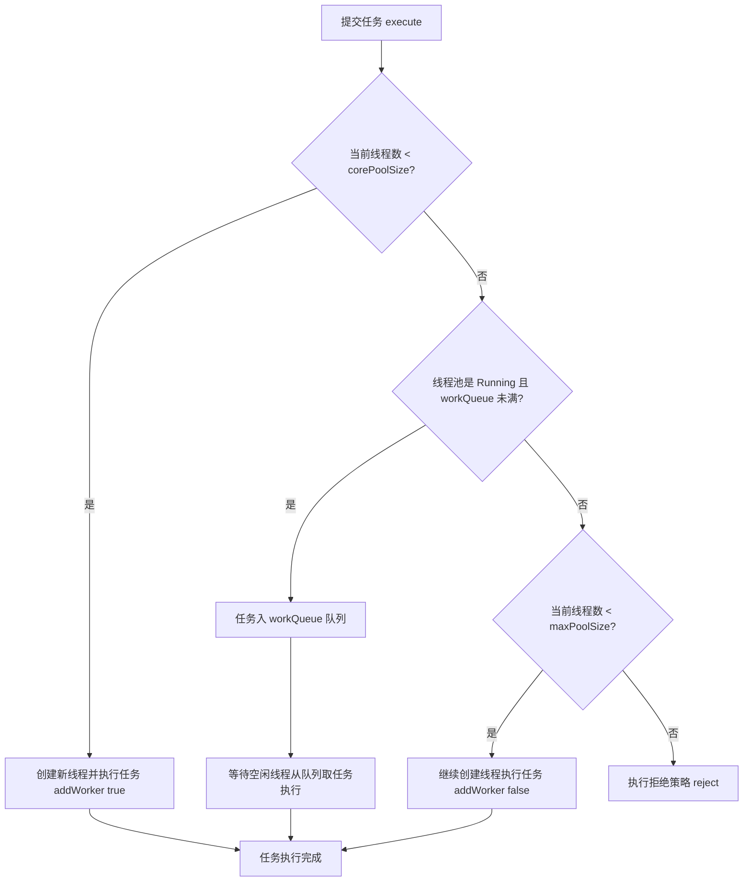

# 线程池

## 线程池与手动创建线程的对比


### 为什么要使用线程池

Java 诞生之初没有线程池概念，而是先有线程。随着线程数不断增加，人们发现需要一个专门类来管理线程，于是诞生了线程池。没有线程池时，每发布一个任务就需创建一个新线程，任务少时没有问题：

```java
/**
* 描述：     单个任务的时候，新建线程来执行
*/
public class OneTask {

public static void main(String[] args) {
        Thread thread0 = new Thread(new Task());
        thread0.start();
    }

static class Task implements Runnable {

public void run() {
           System.out.println("Thread Name: " + Thread.currentThread().getName());
        }
    }
}

```

发布一个新任务并放入子线程启动执行，任务简单，只打印当前线程名。打印结果显示 `Thread Name: Thread-0`（当前子线程默认名）。


任务执行流程：主线程调用 `start()` 启动 t0 子线程，这是单任务场景。任务增多时（如 10 个任务），可用 for 循环新建 10 个子线程：

```java
/**
* 描述：     for循环新建10个线程
*/
public class TenTask {

public static void main(String[] args) {
        for (int i = 0; i < 10; i++) {
            Thread thread = new Thread(new Task());
            thread.start();
        }
    }

static class Task implements Runnable {

public void run() {
            System.out.println("Thread Name: " + Thread.currentThread().getName());
        }
    }
}

```

执行结果：

```java
Thread Name: Thread-1
Thread Name: Thread-4
Thread Name: Thread-3
Thread Name: Thread-2
Thread Name: Thread-0
Thread Name: Thread-5
Thread Name: Thread-6
Thread Name: Thread-7
Thread Name: Thread-8
Thread Name: Thread-9

```

打印顺序错乱（如 Thread-4 打印在 Thread-3 之前）。虽然 Thread-3 比 Thread-4 先执行 start，但不代表 Thread-3 先运行。运行顺序取决于线程调度器，有很大随机性。


主线程通过 for 循环创建 t0~t9 共 10 个子线程，都能正常执行任务。但任务量突然飙升到 10000 时，若仍用 for 循环：

```java
for (int i = 0; i < 10000; i++) {
    Thread thread = new Thread(new Task());
    thread.start();
}

```

创建 10000 个子线程，而 Java 程序中的线程与操作系统线程一一对应。若任务需一定耗时才能完成，会产生很大系统开销与资源浪费。


创建线程会产生系统开销，每个线程还占用一定内存等资源。创建过多线程会危害稳定性，因为每个系统可创建线程数量有上限，不能无限创建。线程执行完需回收，大量线程会给垃圾回收带来压力。但任务确实很多，若都在主线程串行执行效率太低。因此诞生线程池来平衡线程与系统资源的关系。

每个任务创建一个线程带来的问题：

- 第一点，反复创建线程系统开销较大，每个线程创建和销毁都需要时间。若任务简单，创建和销毁线程消耗的资源可能比线程执行任务本身还大。

- 第二点，过多线程占用过多内存等资源，带来过多上下文切换，还导致系统不稳定。

### 线程池解决问题思路

针对上述两点问题，线程池有两个解决思路。

首先，针对反复创建线程开销大的问题，线程池用一些固定线程保持工作状态并反复执行任务。

其次，针对过多线程占用太多内存资源的问题，线程池根据需要创建线程，控制线程总数量，避免占用过多内存资源。

### 如何使用线程池

线程池好比一个池塘，池水有限且可控。例如选择固定线程数量的线程池，假设线程池有 5 个线程但任务大于 5 个，线程池会让余下任务排队，而非无限扩张线程数量，保障资源不被过度消耗。

```java
/**
* 描述：     用固定线程数的线程池执行10000个任务
*/
public class ThreadPoolDemo {

public static void main(String[] args) {
        ExecutorService service = Executors.newFixedThreadPool(5);
        for (int i = 0; i < 10000; i++) {
            service.execute(new Task());
        }
    System.out.println(Thread.currentThread().getName());
    }

static class Task implements Runnable {

public void run() {
            System.out.println("Thread Name: " + Thread.currentThread().getName());
        }
    }
}

```

执行效果：

```java
Thread Name: pool-1-thread-1
Thread Name: pool-1-thread-2
Thread Name: pool-1-thread-3
Thread Name: pool-1-thread-4
Thread Name: pool-1-thread-5
Thread Name: pool-1-thread-5
Thread Name: pool-1-thread-5
Thread Name: pool-1-thread-5
Thread Name: pool-1-thread-5
Thread Name: pool-1-thread-2
Thread Name: pool-1-thread-1
Thread Name: pool-1-thread-5
Thread Name: pool-1-thread-3
Thread Name: pool-1-thread-5

...

```

打印结果中线程名始终在 `pool-1-thread-1~5` 之间变化，未超过该范围，证明线程池不会无限制扩张线程数量，始终是这 5 个线程在工作。


执行流程：创建含 5 个线程的线程池，线程池将 10000 个任务分配给这 5 个线程，这 5 个线程反复领取任务并执行，直到所有任务执行完毕，这就是线程池的思想。

### 使用线程池的好处

使用线程池比手动创建线程主要有三点好处。

- **解决线程生命周期开销、加快响应速度**：线程池中的线程可复用，用少量线程执行大量任务，大幅减小线程生命周期开销。线程通常已创建好、时刻准备执行任务，而非接任务后临时创建，消除了线程创建延迟，提升响应速度、增强用户体验。

- **统筹内存和 CPU 使用、避免资源不当**：线程池根据配置和任务数量灵活控制线程数量，不够时创建、太多时回收，避免线程过多导致内存溢出，或线程太少导致 CPU 资源浪费，达到平衡。

- **统一管理资源**：线程池可统一管理任务队列和线程，统一开始或结束任务，比单个线程逐一处理更方便、易管理，也有利于数据统计（如方便统计已执行任务数量）。

---

## 线程池参数详解


### 线程池的参数


线程池主要有 6 个参数，其中第 3 个参数由 keepAliveTime + 时间单位组成。`corePoolSize` 是核心线程数，即常驻线程池的线程数量。与之对应的是 `maximumPoolSize`，表示线程池最大线程数量。当任务特别多、corePoolSize 核心线程数无法满足需求时，会向线程池增加线程以应对任务突增。

### 线程创建的时机


提交任务后，线程池先检查当前线程数。若线程数小于核心线程数（如初始为 0），则新建线程并执行任务。随着任务不断增加，线程数逐渐增加并达到核心线程数。此时若仍有任务被提交，会被放入 workQueue 任务队列等待，核心线程执行完当前任务后从 workQueue 中提取等待的任务。

若任务特别多，达到 workQueue 容量上限，线程池会启动后备力量（maximumPoolSize 最大线程数），在 corePoolSize 基础上继续创建线程执行任务。线程池持续创建线程直到线程数达到 maximumPoolSize。若仍有任务提交，则超出线程池最大处理能力，线程池会拒绝这些任务。任务进入后，线程池逐一判断 corePoolSize、workQueue、maximumPoolSize，若仍不能满足需求则拒绝任务。

### corePoolSize 与 maximumPoolSize

`corePoolSize` 指核心线程数。线程池初始化时线程数默认为 0，有新任务提交后创建新线程执行任务。不做特殊设置时，此后线程数通常不会再小于 corePoolSize，因为核心线程即便未来无可执行任务也不会被销毁。任务队列满后线程池进一步创建新线程，最多可达 maximumPoolSize。未来线程空闲时，大于 corePoolSize 的线程会被合理回收。正常情况下，线程池中线程数量处于 corePoolSize 与 maximumPoolSize 的闭区间内。

### "长工"与"临时工"

可将 corePoolSize 与 maximumPoolSize 比喻为长工与临时工。假设长工数量（corePoolSize）为 5，无论忙碌或空闲都常驻。农忙或春节时人手不足，需雇佣临时工（在 corePoolSize 基础上继续创建新线程），临时工有上限（maximumPoolSize）。农忙结束后解约临时工，工人数量从 maximumPoolSize 降到 corePoolSize。因此工人数量保持在 corePoolSize 和 maximumPoolSize 区间。


动画演示线程池变化过程：corePoolSize 为 5、maximumPoolSize 为 10、任务队列容量为 100。任务被提交时线程数量从 0 增长到 5 后不再增长，新任务放入队列直至塞满，然后在 corePoolSize 基础上继续创建新线程执行队列中的任务，线程逐渐增至 maximumPoolSize 后不再增加。若仍有任务提交，线程池拒绝任务。队列任务执行完后，10 个线程无事可做，线程池根据 keepAliveTime 销毁线程以减少内存占用。

线程池的特点：

- 希望保持较少的线程数，只在负载变得很大时才增加线程。

- 只在任务队列填满时才创建多于 corePoolSize 的线程。若使用无界队列（如 LinkedBlockingQueue），队列不会满，线程数不会超过 corePoolSize。

- 将 corePoolSize 与 maximumPoolSize 设为相同值，可创建固定大小的线程池。

- 将 maximumPoolSize 设为很高的值（如 Integer.MAX_VALUE），可允许线程池创建任意多的线程。

### keepAliveTime+时间单位

第三个参数是 keepAliveTime + 时间单位。当线程池中线程数量多于核心线程数且无任务可做时，线程池检测线程的 keepAliveTime；超过规定时间后，无事可做的线程会被销毁，以减少内存占用和资源消耗。后期任务增多时，线程池也会根据规则重新创建线程，这是一个可伸缩、较灵活的过程。可用 `setKeepAliveTime` 方法动态改变 keepAliveTime 的值。

### ThreadFactory

第四个参数是 ThreadFactory，是生产线程以便执行任务的线程工厂。默认线程工厂创建的线程都在同一线程组、拥有一样优先级、都不是守护线程。也可定制线程工厂，便于给线程自定义命名，不同线程池内的线程通常根据具体业务定制不同线程名。

### workQueue 和 Handler

最后两个参数是 workQueue 和 Handler，分别对应阻塞队列和任务拒绝策略，将在后续章节展开讲解。


---

## 线程池的拒绝策略


### 拒绝时机

新建线程池时可指定任务拒绝策略：

```java
new ThreadPoolExecutor(5, 10, 5, TimeUnit.SECONDS, new LinkedBlockingQueue<>(),
   new ThreadPoolExecutor.DiscardOldestPolicy());

```

线程池在以下两种情况下拒绝新提交的任务。

- 调用 shutdown 等方法关闭线程池后。即使线程池内部仍有未执行完的任务，由于线程池已关闭，此时再提交任务会遭到拒绝。

- 线程池没有能力继续处理新提交的任务，即工作已非常饱和时。

第二种情况（工作饱和导致拒绝）的示例：新建线程池，使用容量上限为 10 的 `ArrayBlockingQueue` 作为任务队列，核心线程数为 5，最大线程数为 10。有 20 个耗时任务被提交时，线程池先创建 5 个核心线程执行任务，往队列放任务，队列 10 个容量放满后继续创建新线程直到最大线程数 10。此时线程池共有 20 个任务，其中 10 个正在被 10 个线程执行，10 个在队列中等待。由于最大线程数为 10，不能再增加线程，线程池工作饱和，此时提交新任务会被拒绝。


图中队列已满，队列下方每个线程都在工作且线程数已达最大值 10。若再有新任务提交，线程池没有能力继续处理，会拒绝。

Java 在 `ThreadPoolExecutor` 类中提供 4 种默认拒绝策略，均实现 `RejectedExecutionHandler` 接口：


### 拒绝策略

- **AbortPolicy**：拒绝任务时直接抛出类型为 `RejectedExecutionException` 的 RuntimeException，让调用方感知任务被拒绝，可根据业务逻辑选择重试或放弃提交。

- **DiscardPolicy**：新任务被提交后直接丢弃，不给调用方任何通知。存在一定风险，因为提交时不知道任务会被丢弃，可能造成数据丢失。

- **DiscardOldestPolicy**：若线程池未关闭且无能力执行，则丢弃任务队列中的头结点（通常是存活时间最长的任务）。与 DiscardPolicy 不同，它丢弃的不是最新提交的，而是队列中存活时间最长的，以腾出空间给新提交任务。同样存在数据丢失风险。

- **CallerRunsPolicy**：较为完善。新任务提交后若线程池未关闭且无能力执行，则把任务交给提交任务的线程执行（谁提交谁负责执行）。有两点好处。

  - 新提交任务不会被丢弃，不会造成业务损失。

  - 提交任务的线程负责执行任务，执行耗时期间该线程被占用、不再提交新任务，减缓任务提交速度（负反馈）。期间线程池中的线程可充分利用时间执行掉部分任务、腾出空间，相当于给线程池一定缓冲期。

---

## 常见的线程池与 ForkJoinPool


- FixedThreadPool

- CachedThreadPool

- ScheduledThreadPool

- SingleThreadExecutor

- SingleThreadScheduledExecutor

- ForkJoinPool

### FixedThreadPool

`FixedThreadPool` 的核心线程数和最大线程数一样，可视为固定线程数的线程池。其线程数除初始阶段从 0 开始增加外，之后保持固定。即使任务数超过线程数，线程池也不会再创建更多线程处理任务，而是把超出线程处理能力的任务放到任务队列中等待。即使任务队列满了，因最大线程数与核心线程数相同，也无法再增加新线程。


线程池有 t0~t9 共 10 个线程，不停执行任务。某线程任务执行完就从任务队列获取新任务继续执行，期间线程数量不增不减，始终为 10。

### CachedThreadPool

`CachedThreadPool`（可缓存线程池）的线程数几乎可无限增加（实际最大可达 `Integer.MAX_VALUE`，即 2^31-1，基本不可能达到），线程闲置时还可回收。其线程数量不固定。它用于存储任务的队列是 `SynchronousQueue`，容量为 0，实际不存储任务，只负责任务中转和传递，效率较高。

提交任务后，线程池判断已创建线程中是否有空闲线程：有空闲则将任务直接指派给空闲线程；无空闲则新建线程执行任务，实现动态新增线程。

```java
ExecutorService service = Executors.newCachedThreadPool();
    for (int i = 0; i < 1000; i++) {
        service.execute(new Task() {
    });
 }

```

用 for 循环提交 1000 个任务给 CachedThreadPool，若任务处理时间很长：for 循环提交任务很快但执行耗时，可能 1000 个任务都提交完了第一个任务还未执行完。此时 CachedThreadPool 动态伸缩线程数量，随任务提交不停创建线程执行任务。任务执行完后若无新任务，大量闲置线程会造成内存资源浪费，线程池检测线程在 60 秒内有无可执行任务，没有则销毁，最终线程数量减为 0。

### ScheduledThreadPool

`ScheduledThreadPool` 支持定时或周期性执行任务，如每隔 10 秒执行一次。实现方法主要有 3 种：

```java
ScheduledExecutorService service = Executors.newScheduledThreadPool(10);

service.schedule(new Task(), 10, TimeUnit.SECONDS);

service.scheduleAtFixedRate(new Task(), 10, 10, TimeUnit.SECONDS);

service.scheduleWithFixedDelay(new Task(), 10, 10, TimeUnit.SECONDS);

```

3 种方法的区别：

- `schedule`：延迟指定时间后执行一次任务。参数设为 10 秒，即 10 秒后执行一次任务后结束。

- `scheduleAtFixedRate`：以固定频率执行任务。第二个参数 initialDelay 表示第一次延时时间，第三个参数 period 表示周期（第一次延时后每次延时多长时间执行一次任务）。

- `scheduleWithFixedDelay`：与第二种类似，也是周期执行任务，区别在于对周期的定义。`scheduleAtFixedRate` 以任务开始时间为时间起点计时，时间到就执行第二次任务，不管任务耗时多久；`scheduleWithFixedDelay` 以任务结束时间为下一次循环的时间起点计时。

示例：每次喝咖啡需 10 分钟。采用 `scheduleAtFixedRate`（间隔 1 小时）时每个整点喝一杯咖啡：

- 00:00: 开始喝咖啡

- 00:10: 喝完了

- 01:00: 开始喝咖啡

- 01:10: 喝完了

- 02:00: 开始喝咖啡

- 02:10: 喝完了

采用 `scheduleWithFixedDelay`（间隔同为 1 小时）时，因每次喝咖啡需 10 分钟，且以任务完成时间为计时起点，第 2 次喝咖啡时间在 1:10 而非 1:00：

- 00:00: 开始喝咖啡

- 00:10: 喝完了

- 01:10: 开始喝咖啡

- 01:20: 喝完了

- 02:20: 开始喝咖啡

- 02:30: 喝完了

### SingleThreadExecutor

`SingleThreadExecutor` 使用唯一线程执行任务，原理与 FixedThreadPool 相同，只是线程只有一个。线程执行任务过程中发生异常时，线程池会重新创建线程执行后续任务。因只有一个线程，适合所有任务都需按提交顺序依次执行的场景；前几种线程池是多线程并行执行，不一定能保障任务执行顺序等于提交顺序。

### SingleThreadScheduledExecutor

`SingleThreadScheduledExecutor` 与 `ScheduledThreadPool` 非常相似，只是 ScheduledThreadPool 的一个特例，内部只有一个线程：

```java
new ScheduledThreadPoolExecutor(1)

```

它只是将 `ScheduledThreadPool` 的核心线程数设为 1。


从核心线程数、最大线程数、线程存活时间三个维度对比上述五种线程池。

- **FixedThreadPool**：核心线程数和最大线程数都由构造函数直接传参且值相等，最大线程数不会超过核心线程数，无需考虑线程回收。没有任务可执行时，线程仍在线程池中存活并等待任务。

- **CachedThreadPool**：核心线程数为 0，最大线程数为 Integer 最大值，线程数一般达不到这么多。任务特别多且耗时时会创建非常多线程应对。

可按照同样方法分析后面三种线程池的参数。

### ForkJoinPool


第六种线程池 ForkJoinPool 在 JDK 7 加入，名字 ForkJoin 描述了其执行机制。主要用法与之前线程池相同（把任务交给线程池执行，池中有任务队列存放任务）。与之前线程池有两点非常大的不同。第一点：非常适合执行可以产生子任务的任务。

Task 可产生三个子任务，三个子任务并行执行完毕后将结果汇总给 Result。若主任务需执行繁重计算，可把计算拆分成三个互不影响、相互独立的部分，利用 CPU 多核优势并行计算再汇总结果。涉及两步：拆分（Fork）与汇总（Join），这也是 ForkJoinPool 名字的由来。

示例：斐波那契数列（后一项等于前两项之和，第 0 项为 0，第 1 项为 1）。写代码时应首选效率更高的迭代形式或更高级的乘方、矩阵公式法等写法，但若写成递归形式，伪代码如下：

```java
if (n <= 1) {
    return n;
 } else {
    Fib f1 = new Fib(n - 1);
    Fib f2 = new Fib(n - 2);
    f1.solve();
    f2.solve();
    number = f1.number + f2.number;
    return number;
 }

```

n<=1 直接返回 n；n>1 先计算前一项 f1，再往前推两项求 f2，相加得结果。求和运算中产生了两个子任务。


计算 f(4) 需先计算 f(2) 和 f(3)，计算 f(3) 又需计算 f(1) 和 f(2)，以此类推。


这是典型的递归问题。对应 ForkJoin 模式，子任务同样产生子子任务，最后逐层汇总得到最终结果。

ForkJoinPool 有多种方法实现任务分裂和汇总，其中一种用法：

```java
class Fibonacci extends RecursiveTask<Integer> {

int n;

public Fibonacci(int n) {
        this.n = n;
    }

@Override
    public Integer compute() {
        if (n <= 1) {
            return n;
        }
    Fibonacci f1 = new Fibonacci(n - 1);
    f1.fork();
    Fibonacci f2 = new Fibonacci(n - 2);
    f2.fork();
    return f1.join() + f2.join();
    }
 }

```

继承 `RecursiveTask`（`RecursiveTask` 类是对 `ForkJoinTask` 的简单包装），重写 `compute()` 方法：n<=1 时直接返回，n>1 时创建递归任务 f1 和 f2，用 `fork()` 分裂任务并分别执行，最后 `return` 用 `join()` 汇总结果，实现任务的分裂和汇总。

```java
public static void main(String[] args) throws ExecutionException, InterruptedException {
    ForkJoinPool forkJoinPool = new ForkJoinPool();
    for (int i = 0; i < 10; i++) {
        ForkJoinTask task = forkJoinPool.submit(new Fibonacci(i));
        System.out.println(task.get());
    }
 }

```

上述代码打印斐波那契数列第 0 到 9 项的值：

```java
0
1
1
2
3
5
8
13
21
34

```

这就是 ForkJoinPool 与其他线程池的第一点不同。

第二点不同在于内部结构。之前线程池所有线程共用一个队列，而 ForkJoinPool 中每个线程都有自己独立的任务队列。


ForkJoinPool 内部除有一个共用任务队列外，每个线程还有一个对应的双端队列 deque。线程中的任务被 Fork 分裂后，分裂出的子任务放入线程自己的 deque，而非公共任务队列。若三个子任务放入线程 t1 的 deque，线程 t1 获取任务成本降低，可直接从自己队列获取而不必到公共队列争抢，也不会发生阻塞（除后面提到的 steal 情况外），减少线程间竞争和切换，效率很高。


若线程 t1 任务特别繁重、分裂数十个子任务，而 t0 无事可做、其 deque 队列为空，t0 会想办法帮助 t1 执行任务，这就是 "work-stealing" 的含义。

双端队列 deque 中，线程 t1 获取任务的逻辑是后进先出（LIFO，Last In First Out）；线程 t0 "steal" 偷取 t1 的 deque 中任务的逻辑是先进先出（FIFO，First In First Out）。使用 "work-stealing" 算法和双端队列可很好平衡各线程负载。


ForkJoinPool 与其他线程池很多地方一样，重点区别在于每个线程都有各自的双端队列存储分裂出的子任务。ForkJoinPool 非常适合递归场景，如树的遍历、最优路径搜索等。

---

## 线程池常用的阻塞队列


### 线程池内部结构


线程池内部结构主要由四部分组成：

- **线程池管理器**：负责管理线程池的创建、销毁、添加任务等管理操作，是整个线程池的管家。

- **工作线程**：即图中的线程 t0~t9，从任务队列中获取任务并执行。

- **任务队列**：作为一种缓冲机制，线程池把当下未处理的任务放入任务队列。多线程同时从任务队列获取任务属于并发场景，任务队列需满足线程安全要求，因此线程池采用 `BlockingQueue` 保障线程安全。

- **任务**：要求实现统一接口，以便工作线程处理和执行。

### 阻塞队列


线程池四个主要组成部分中最值得关注的是阻塞队列。不同的线程池会选用不同的阻塞队列，5 种线程池对应了 3 种阻塞队列。

### LinkedBlockingQueue

FixedThreadPool 和 SingleThreadExecutor 使用的阻塞队列是容量为 `Integer.MAX_VALUE` 的 `LinkedBlockingQueue`，可认为是无界队列。FixedThreadPool 的线程数固定，无法增加特别多线程处理任务，因此需要 `LinkedBlockingQueue` 这样一个无容量限制的阻塞队列存放任务。由于任务队列永远不会放满，线程池只会创建核心线程数量的线程，此时最大线程数对线程池没有意义，不会触发生成多于核心线程数的线程。

### SynchronousQueue

`SynchronousQueue` 对应的线程池是 CachedThreadPool。CachedThreadPool 的最大线程数为 Integer 最大值，可理解为线程数可无限扩展。CachedThreadPool 与 FixedThreadPool 情况相反：FixedThreadPool 是阻塞队列容量无限，CachedThreadPool 是线程数无限扩展。因此 CachedThreadPool 不需要任务队列存储任务，一旦有任务提交就直接转发给线程或创建新线程执行，无需另外保存。

自己创建使用 `SynchronousQueue` 的线程池时，若不想任务被拒绝，需设置尽可能大的最大线程数，以免发生任务数大于最大线程数时，既无法把任务放入队列也没有足够线程执行任务的情况。

### DelayedWorkQueue

`DelayedWorkQueue` 对应的线程池是 ScheduledThreadPool 和 SingleThreadScheduledExecutor。这两种线程池的最大特点是可延迟执行任务（如一定时间后执行或每隔一定时间执行一次）。DelayedWorkQueue 内部元素不按放入时间排序，而是按延迟时间长短排序，内部采用"堆"的数据结构。ScheduledThreadPool 和 SingleThreadScheduledExecutor 选择 DelayedWorkQueue，是因为它们本身基于时间执行任务，延迟队列可把任务按时间排序，方便任务执行。

---

## 为何不应自动创建线程池

自动创建线程池是指直接调用 Executors 的各种方法生成常见线程池，如 `Executors.newCachedThreadPool()`。这类线程池存在资源耗尽风险，逐一分析如下。

### FixedThreadPool

`newFixedThreadPool` 内部实际调用 `ThreadPoolExecutor` 构造函数，核心线程数与最大线程数相等。

```java
public static ExecutorService newFixedThreadPool(int nThreads) {
    return new ThreadPoolExecutor(nThreads, nThreads,0L, TimeUnit.MILLISECONDS,new LinkedBlockingQueue<Runnable>());
}

```

任务队列使用无容量上限的 `LinkedBlockingQueue`。若任务处理速度慢，请求增多会导致队列堆积大量任务，占用大量内存并触发 `OutOfMemoryError`（OOM），影响整个程序。

### SingleThreadExecutor

`newSingleThreadExecutor` 与 `newFixedThreadPool` 原理相同，仅将核心线程数与最大线程数固定为 1，任务队列仍是无界 `LinkedBlockingQueue`。

```java
public static ExecutorService newSingleThreadExecutor() {
    return new FinalizableDelegatedExecutorService (new ThreadPoolExecutor(1, 1,0L, TimeUnit.MILLISECONDS,new LinkedBlockingQueue<Runnable>()));
}

```

任务堆积时同样可能占用大量内存并导致 OOM。

### CachedThreadPool

`newCachedThreadPool` 与前述线程池的区别在于任务队列使用 `SynchronousQueue`，该队列不存储任务而是直接转发。

```java
public static ExecutorService newCachedThreadPool() {
    return new ThreadPoolExecutor(0, Integer.MAX_VALUE,60L, TimeUnit.SECONDS,new SynchronousQueue<Runnable>());
}

```

最大线程数被设置为 `Integer.MAX_VALUE`，线程数量不受限制。任务过多时会创建大量线程，超过操作系统上限而无法创建新线程，或导致内存不足。

### ScheduledThreadPool 和 SingleThreadScheduledExecutor

`ScheduledThreadPool` 与 `SingleThreadScheduledExecutor` 原理相同。创建 `ScheduledThreadPool` 的源码如下。

```java
public static ScheduledExecutorService newScheduledThreadPool(int corePoolSize) {
    return new ScheduledThreadPoolExecutor(corePoolSize);
}

```

`ScheduledThreadPoolExecutor` 是 `ThreadPoolExecutor` 的子类，其构造方法如下。

```java
public ScheduledThreadPoolExecutor(int corePoolSize) {
    super(corePoolSize, Integer.MAX_VALUE, 0, NANOSECONDS,new DelayedWorkQueue());
}

```

任务队列采用 `DelayedWorkQueue`，是延迟队列且无界，与 `LinkedBlockingQueue` 一样，任务过多时可能导致 OOM。

综上，自动创建的线程池均存在资源耗尽风险。手动创建线程池更优：可明确线程池运行规则，选择合适的线程数量，并在必要时拒绝新任务提交，避免资源耗尽。

---

## 线程数量的确定与 CPU 核心数

调整线程池线程数量的目的是充分合理地使用 CPU 和内存资源，最大化程序性能。需根据任务类型选择对应策略。

### CPU 密集型任务

适用于加密、解密、压缩、计算等大量耗费 CPU 资源的任务。

- 最佳线程数为 CPU 核心数的 1~2 倍。
- 线程数超过 CPU 核心数 2 倍时，各核心满负荷工作，过多线程争用 CPU 造成不必要的上下文切换，性能反而下降。
- 需同时考虑同一机器上其他占用 CPU 资源的程序，对整体资源做平衡。

### 耗时 IO 型任务

适用于数据库、文件读写、网络通信等任务。此类任务不特别消耗 CPU，但 IO 耗时多。

- 最大线程数一般远大于 CPU 核心数。
- IO 读写速度慢于 CPU，线程数过少会浪费 CPU 资源；线程数较多时，等待 IO 的线程不占用 CPU，其他线程可利用 CPU 执行任务，减少队列中等待任务，更好利用资源。

### 线程数计算公式

《Java并发编程实战》作者 Brian Goetz 推荐：

```
线程数 = CPU 核心数 *（1+平均等待时间/平均工作时间）
```

- 平均等待时间长，线程数增加。
- 平均工作时间长（CPU 密集型任务），线程数减少。

线程数过少降低整体性能，过多消耗内存等资源。更精确的做法是压测，监控 JVM 线程情况及 CPU 负载，按实际情况确定线程数。

### 结论

- 线程平均工作时间占比越高，所需线程越少。
- 线程平均等待时间占比越高，所需线程越多。
- 针对不同程序做实际测试，可获得最合适的选择。

---

## 自定义线程池

根据业务需求设置线程池各参数以定制线程池。

### 核心线程数

合理线程数量与任务类型及 CPU 核心数相关：线程平均工作时间占比越高需越少线程，平均等待时间占比越高需越多线程。

- 任务类型不固定（CPU 密集与 IO 密集混搭）时，可将最大线程数设为核心线程数的数倍以应对突发。
- 更优做法是用不同线程池执行不同类型任务，按任务类型区分，再按估算或压测结果设置线程数。

### 阻塞队列

可选 `LinkedBlockingQueue`、`SynchronousQueue`、`DelayedWorkQueue`，以及常用且由数组实现、需指定容量且不可扩容的 `ArrayBlockingQueue`。

- `ArrayBlockingQueue` 容量有限，队列放满且线程数达最大值时，线程池按规则拒绝新任务，可能造成数据丢失。
- 数据丢失优于无限增加任务或线程导致内存不足、程序崩溃。配合限制最大线程数，可有效防止资源耗尽。
- 队列容量与 `maximumPoolSize` 存在 trade-off：
  - 更大队列 + 更小最大线程数：减少上下文切换开销，但可能降低吞吐量。
  - IO 密集型任务：可选稍小容量队列 + 更大最大线程数，效率更高，但上下文切换更多。

### 线程工厂

`threadFactory` 可使用默认的 `defaultThreadFactory`，或传入自定义、可按业务信息命名的线程工厂。多线程池场景下可用不同名称区分线程，便于按线程名定位问题代码。

可通过 `com.google.common.util.concurrent.ThreadFactoryBuilder` 实现：

```java
ThreadFactoryBuilder builder = new ThreadFactoryBuilder();
ThreadFactory rpcFactory = builder.setNameFormat("rpc-pool-%d").build();

```

生成的线程名格式固定，依次为 `"rpc-pool-0"`、`"rpc-pool-1"` 等（Guava 的 `ThreadFactoryBuilder` 中 `%d` 从 0 开始计数）。

### 拒绝策略

可选择四种内置拒绝策略之一：`AbortPolicy`、`DiscardPolicy`、`DiscardOldestPolicy`、`CallerRunsPolicy`。也可实现 `RejectedExecutionHandler` 接口自定义拒绝策略，在 `rejectedExecution` 方法中执行打印日志、暂存任务、重新执行等操作。

```java
private static class CustomRejectionHandler implements RejectedExecutionHandler {
    @Override
    public void rejectedExecution(Runnable r, ThreadPoolExecutor executor) {
        //打印日志、暂存任务、重新执行等拒绝策略
    }
}

```

### 总结

定制线程池与业务强相关。需掌握各参数含义及常见选项，根据并发量、内存大小、是否接受任务被拒绝等因素定制线程池：既不导致内存不足，又能以合适线程数保障任务执行效率，并在拒绝任务时留痕以便追溯。

---

## 线程池的关闭

创建线程数固定为 10 的线程池，并提交 100 个任务：

```java
ExecutorService service = Executors.newFixedThreadPool(10);
 for (int i = 0; i < 100; i++) {
    service.execute(new Task());
 }

```

`ThreadPoolExecutor` 中涉及关闭线程池的方法共 5 种：

- `void shutdown()`
- `boolean isShutdown()`
- `boolean isTerminated()`
- `boolean awaitTermination(long timeout, TimeUnit unit) throws InterruptedException`
- `List<Runnable> shutdownNow()`

### shutdown()

安全关闭线程池。调用后线程池不会立刻关闭，会在执行完正在执行的任务和队列中等待的任务后才彻底关闭。此后新提交的任务会被拒绝策略直接拒绝。

### isShutdown()

返回线程池是否已开始关闭工作，即是否执行了 `shutdown()` 或 `shutdownNow()`。返回 `true` 不代表线程池已彻底关闭，仅表示已开始关闭流程，此时可能仍有线程在执行任务、队列中仍有等待任务。

### isTerminated()

检测线程池是否真正"终结"，即已关闭且所有任务（含正在执行和队列等待的）都执行完毕。调用 `shutdown()` 后若仍有线程在执行任务，`isShutdown()` 返回 `true` 而 `isTerminated()` 返回 `false`。所有任务执行完毕后才返回 `true`。

### awaitTermination()

用于判断线程池状态而非关闭线程池。传入超时时间后进入等待，满足以下任一情况结束：

- 等待期间线程池已关闭且所有已提交任务执行完毕（"终结"），返回 `true`。
- 等待超时，上述情况未发生，返回 `false`。
- 等待期间线程被中断，抛出 `InterruptedException`。

可根据返回值决定下一步操作。

### shutdownNow()

功能最强，表示立刻关闭。执行后：

1. 给线程池中所有线程发送 `interrupt` 中断信号，尝试中断任务执行。
2. 将任务队列中等待的任务转移到 `List` 并返回，可用于记录在案并在后期重试。

源码如下：

```java
public List<Runnable> shutdownNow() {
    List<Runnable> tasks;
    final ReentrantLock mainLock = this.mainLock;
    mainLock.lock();

try {
        checkShutdownAccess();
        advanceRunState(STOP);
        interruptWorkers();
        tasks = drainQueue();
    } finally {
        mainLock.unlock();
    }

tryTerminate();
    return tasks;
 }

```

其中 `interruptWorkers()` 让每个已启动的线程中断，线程可在执行任务期间检测中断信号提前结束。由于 Java 不推荐强行停止线程，若被中断线程不响应中断信号，任务仍可能不停止。线程应具备响应中断信号的能力，利用中断信号协同工作（参见《并发基础与线程》中正确停止线程的方法）。

一般可用 `shutdown()` 让已提交任务执行完毕；情况紧急时用 `shutdownNow()` 加快线程池"终结"。

---

## 线程池的线程复用原理

介绍线程复用的原理，并对线程池的 `execute` 方法进行源码解析。

### 线程复用原理

线程池线程数量远小于任务数量，通过线程复用让同一线程执行不同任务。

线程池将线程与任务解耦，摆脱了 `Thread` 创建线程时一个线程对应一个任务的限制。同一线程从 `BlockingQueue` 中不断提取新任务执行。核心原理在于线程池对 `Thread` 封装，并非每次执行任务都调用 `Thread.start()` 创建新线程，而是让每个线程执行一个"循环任务"，不断检查是否有待执行任务，有则直接调用任务的 `run()` 方法，将各任务的 `run()` 串联执行，线程数量不增加。

线程池创建新线程的时机和规则：



流程：提交任务后先检查当前线程数，小于核心线程数则新建线程执行任务；随任务增多线程数增至核心线程数后，新任务放入 `workQueue` 等待核心线程处理完再提取。任务超多达到队列容量上限时，启用 `maximumPoolSize`，在核心线程基础上继续创建线程，直到线程数达最大线程数；仍无法满足则拒绝任务。线程池依次判断 `corePoolSize`、`workQueue`、`maximumPoolSize`，均不能满足时拒绝任务。

从 `execute` 方法开始分析源码：

```java
public void execute(Runnable command) {
    if (command == null)
        throw new NullPointerException();
    int c = ctl.get();
    if (workerCountOf(c) < corePoolSize) {
        if (addWorker(command, true))
            return;
        c = ctl.get();
    }
    if (isRunning(c) && workQueue.offer(command)) {
        int recheck = ctl.get();
        if (! isRunning(recheck) && remove(command))
            reject(command);
        else if (workerCountOf(recheck) == 0)
            addWorker(null, false);
    }
    else if (!addWorker(command, false))
        reject(command);
}

```

### 线程复用源码解析

先看前几行：

```java
//如果传入的Runnable的空，就抛出异常
if (command == null)
    throw new NullPointerException();

```

通过 if 判断 `command`（Runnable 任务）是否为空，为 null 则抛异常。

再判断当前线程数是否小于核心线程数，小于则调用 `addWorker()` 增加一个 Worker（可理解为线程）：

```java
if (workerCountOf(c) < corePoolSize) {
    if (addWorker(command, true))
        return;
        c = ctl.get();
}

```

`addWorker` 在池中创建线程并执行第一个参数传入的任务。第二个参数为布尔值：`true` 表示按核心线程数为界判断是否新增（线程数小于 `corePoolSize` 才增加），`false` 表示按最大线程数为界判断。返回 `true` 添加成功，`false` 添加失败。

下一部分代码：

```java
if (isRunning(c) && workQueue.offer(command)) {
    int recheck = ctl.get();
    if (! isRunning(recheck) && remove(command))
        reject(command);
    else if (workerCountOf(recheck) == 0)
        addWorker(null, false);
}

```

执行到这里说明当前线程数大于或等于核心线程数或 `addWorker` 失败。通过 `isRunning(c) && workQueue.offer(command)` 检查线程池状态是否为 Running，是则把任务放入 `workQueue`；若池不处于 Running（已被关闭），则移除刚加入的任务并执行拒绝策略：

```java
if (! isRunning(recheck) && remove(command))
    reject(command);

```

后一个 else 分支：

```java
else if (workerCountOf(recheck) == 0)
    addWorker(null, false);

```

进入此分支说明池状态为 Running。任务加入后需防止无可执行线程（如线程被回收或意外终止），故当线程数为 0（`workerCountOf(recheck) == 0`）时调用 `addWorker()` 新建线程。

最后一部分代码：

```java
else if (!addWorker(command, false))
    reject(command);

```

执行到这里说明池不是 Running 状态，或线程数大于等于核心线程数且队列已满。需添加新线程直到线程数达最大线程数，故再次调用 `addWorker` 并传入 `false`（以 `maximumPoolSize` 为上限创建新 Worker）。若返回 `false` 说明线程数已达 `maximumPoolSize`，或池状态非 Running，执行拒绝策略 `reject`。

`execute` 中多次调用 `addWorker` 传入任务，其添加并启动一个 Worker。Worker 是对 `Thread` 的包装，内部含 `Thread` 对象即真正执行任务的线程，一个 Worker 对应池中一个线程，`addWorker` 即增加线程。线程复用逻辑主要在 Worker 类的 `runWorker` 方法中，简化代码如下：

```java
runWorker(Worker w) {
    Runnable task = w.firstTask;
    while (task != null || (task = getTask()) != null) {
        try {
            task.run();
        } finally {
            task = null;
        }
    }
}

```

线程复用逻辑在一个不停循环的 while 循环体中实现：

- 通过取 Worker 的 `firstTask` 或 `getTask` 方法从 `workQueue` 获取待执行任务。
- 直接调用 task 的 `run()` 方法执行具体任务（而非新建线程）。

每个线程始终处于大循环中，反复获取任务并执行，从而实现线程复用。

## 虚拟线程执行器（Java 21）

Java 21 引入 `Executors.newVirtualThreadPerTaskExecutor()`，每个任务创建**一个全新虚拟线程**执行，无需复用。它与传统线程池构成互补：

| 维度 | 传统线程池 | 虚拟线程执行器（21） |
|------|-----------|---------------------|
| 线程来源 | 复用平台线程 | 每次任务新建虚拟线程 |
| 池化本质 | 避免线程创建开销 | 虚拟线程创建成本极低，无需池化 |
| 适用负载 | CPU 密集、任务可控 | IO 密集、任务量大（万级+） |
| 队列 | workQueue 排队 | 无队列，任务直接调度 |
| 限制 | corePoolSize 等参数 | 无池参数，天然弹性 |

```java
// Java 21：虚拟线程执行器（try-with-resources 自动关闭）
try (var executor = Executors.newVirtualThreadPerTaskExecutor()) {
    // 并发发起 1000 个 IO 请求，每个请求一个虚拟线程
    IntStream.range(0, 1000).forEach(i -> executor.submit(() -> fetchRemote(i)));
}
```

**选型建议**：

- 仅 IO 密集（HTTP 调用、DB 访问、文件读写）且并发量高 → 虚拟线程执行器
- CPU 密集 / 需要控制并发上限 / 需要任务排队 → 传统线程池（可结合信号量限流）
- 两者可共存：CPU 密集任务用固定线程池，IO 密集任务用虚拟线程执行器

> 注意：虚拟线程执行器**没有拒绝策略与队列**，突发流量会直接创建大量虚拟线程，需搭配信号量或限流器使用。

## 版本差异(旧版 → Java 21)

| 特性 | 旧版(Java 8/11) | Java 21 |
|------|----------------|---------|
| 创建线程池 | Executors.newFixedThreadPool 等 | 不变；新增 `newVirtualThreadPerTaskExecutor()` |
| 高并发 IO 方案 | 线程池 + 队列 + 异步回调 | 虚拟线程（JEP 444）直接每个任务一线程 |
| 线程工厂 | ThreadFactory 自定义 | 新增 `Thread.ofVirtual().name(...)` 工厂 |
| 拒绝策略 | AbortPolicy 等 4 种 | 不变；虚拟线程执行器无拒绝策略 |
| 线程数估算 | CPU 密集/IO 密集公式 | IO 密集场景可改用虚拟线程，无需估算 |