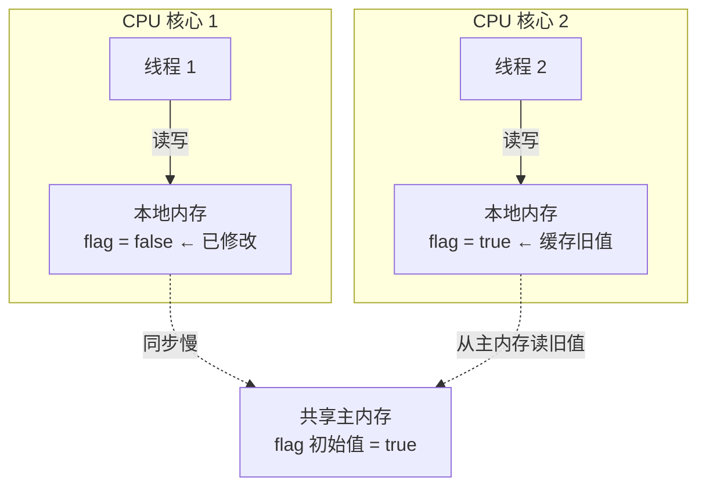
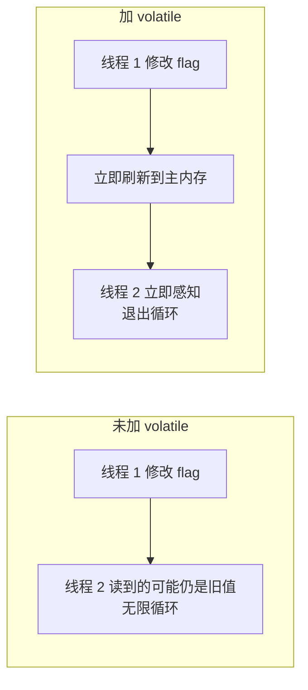

# 原子类与 ThreadLocal

## 原子类与 CAS

### 什么是原子类？原子类有什么作用？

原子性指"一组操作要么全都操作成功，要么全都失败，不能只操作成功其中的一部分"。`java.util.concurrent.atomic` 下的类是具有原子性的类，可原子性地执行添加、递增、递减等操作。如多线程下线程不安全的 i++ 问题，可用功能相同且线程安全的 getAndIncrement 方法解决。

**原子类的作用**与锁类似，是保证并发情况下线程安全。原子类相比锁有一定优势：

- 粒度更细：原子变量可把竞争范围缩小到变量级别，锁的粒度通常大于原子变量的粒度。
- 效率更高：除高度竞争情况外，原子类效率通常比同步互斥锁更高，因为原子类底层利用 CAS 操作，不阻塞线程。

### 6 类原子类纵览

原子类共分为 6 类：

| 类型 | 具体类 |
| --- | --- |
| Atomic\* 基本类型原子类 | AtomicInteger、AtomicLong、AtomicBoolean |
| Atomic\*Array 数组类型原子类 | AtomicIntegerArray、AtomicLongArray、AtomicReferenceArray |
| Atomic\*Reference 引用类型原子类 | AtomicReference、AtomicStampedReference、AtomicMarkableReference |
| Atomic\*FieldUpdater 升级类型原子类 | AtomicIntegerFieldUpdater、AtomicLongFieldUpdater、AtomicReferenceFieldUpdater |
| Adder 累加器 | LongAdder、DoubleAdder |
| Accumulator 积累器 | LongAccumulator、DoubleAccumulator |

### Atomic\* 基本类型原子类

Atomic\* 基本类型原子类包括 AtomicInteger、AtomicLong、AtomicBoolean。

以 AtomicInteger 为例：它是 int 类型的封装，提供原子性的访问和更新。若需要整型变量且用于并发场景，可直接使用 AtomicInteger 而不使用基本类型 int 或包装类型 Integer，自动具备原子能力。

#### AtomicInteger 类常用方法

- `public final int get()`：获取当前的值。因它是 Java 类而非基本类型，获取值需通过 get 方法。

- `public final int getAndSet(int newValue)`：获取当前的值，并设置新的值。

- `public final int getAndIncrement()`：获取当前的值，并自增。

- `public final int getAndDecrement()`：获取当前的值，并自减。

- `public final int getAndAdd(int delta)`：获取当前的值，并加上预期的值。参数为想改变多少值，可正可负，正数增加、负数减少。getAndIncrement 和 getAndDecrement 修改数值默认为 +1 或 -1，getAndAdd 可一次性地加减任意数值。

- `boolean compareAndSet(int expect, int update)`：若输入的数值等于预期值，则以原子方式将该值更新为输入值（update）。此方法是 CAS 的一个重要体现。

### Atomic\*Array 数组类型原子类

Atomic\*Array 数组类型原子类可保证数组里的每个元素原子性。AtomicIntegerArray 相当于把 AtomicInteger 聚合成一个数组。共 3 种：

- AtomicIntegerArray：整形数组原子类。
- AtomicLongArray：长整形数组原子类。
- AtomicReferenceArray：引用类型数组原子类。

### Atomic\*Reference 引用类型原子类

AtomicReference 与 AtomicInteger 无本质区别：AtomicInteger 让整数保证原子性，AtomicReference 让对象保证原子性。AtomicReference 能力明显比 AtomicInteger 强，因为一个对象可包含很多属性。

此类别下除 AtomicReference 外还有：

- AtomicStampedReference：对 AtomicReference 的升级，加了时间戳，用于解决 CAS 的 ABA 问题。
- AtomicMarkableReference：与 AtomicReference 类似，多一个绑定的布尔值，可用于表示该对象已删除等场景。

### Atomic\*FieldUpdater 原子更新器

Atomic\*FieldUpdater 原子更新器共 3 种：

- AtomicIntegerFieldUpdater：原子更新整形的更新器。
- AtomicLongFieldUpdater：原子更新长整形的更新器。
- AtomicReferenceFieldUpdater：原子更新引用的更新器。

若已有变量（如整型 int）并不具备原子性，但已被定义，可用 Atomic\*FieldUpdater 让已声明变量拥有 CAS 操作能力。这是非互斥同步手段，对已声明变量进行 CAS 操作达到同步目的。

既然想让变量具备原子性，为何不一开始就声明为 AtomicInteger？有以下情况：

- **历史原因**：变量已被声明并广泛使用，修改成本高，可用升级的原子类。
- **使用频率低**：大部分情况不需要原子性，仅在少数情况（如每天定时一两次需要原子操作），不必把变量声明为原子类型。AtomicInteger 比普通变量更耗费资源，成千上万个原子类实例占用内存远超同数量普通类型。此时用 AtomicIntegerFieldUpdater 合理升级，节约内存。

代码示例：

```java
public class AtomicIntegerFieldUpdaterDemo implements Runnable{

static Score math;
   static Score computer;

public static AtomicIntegerFieldUpdater<Score> scoreUpdater = AtomicIntegerFieldUpdater
           .newUpdater(Score.class, "score");

@Override
   public void run() {
       for (int i = 0; i < 1000; i++) {
           computer.score++;
           scoreUpdater.getAndIncrement(math);
       }
   }

public static class Score {
       volatile int score;
   }

public static void main(String[] args) throws InterruptedException {
       math =new Score();
       computer =new Score();
       AtomicIntegerFieldUpdaterDemo r = new AtomicIntegerFieldUpdaterDemo();
       Thread t1 = new Thread(r);
       Thread t2 = new Thread(r);
       t1.start();
       t2.start();
       t1.join();
       t2.join();
       System.out.println("普通变量的结果："+ computer.score);
       System.out.println("升级后的结果："+ math.score);
   }
}

```

代码演示类的用法：两个 Score 类型的实例 math 和 computer，Score 内部有分数 score；声明 AtomicIntegerFieldUpdater，构造时传入两个参数 Score.class（类名）和 "score"（属性名）。

run 方法对两个实例分别自加：

- computer 调用内部 score（int 变量自加），多线程下线程非安全。
- math 用 scoreUpdater.getAndIncrement 自加，是正确使用 AtomicIntegerFieldUpdater 的线程安全自加。

main 函数定义 math 和 computer，启动两个线程各执行 run 方法，两个 score 各被加 2000 次，join 等待后打印结果：

```
普通变量的结果：1942
升级后的结果：2000
```

普通变量因不具备线程安全性，多线程操作时部分操作被冲突抵消，最终结果小于 2000；使用 AtomicIntegerFieldUpdater 可对普通类型 score 进行原子自加，结果与加的次数一致（2000）。

### Adder 加法器

Adder 加法器有两种：LongAdder 和 DoubleAdder。

### Accumulator 积累器

Accumulator 积累器有两种：LongAccumulator 和 DoubleAccumulator。这两种原子类会在后续节中展开介绍。

### 以 AtomicInteger 为例，分析在 Java 中如何利用 CAS 实现原子操作？

以 AtomicInteger 的 getAndAdd 方法为突破口，分析如何通过 CAS 操作实现并发下的累加操作。

#### getAndAdd方法

该方法在 Java 1.8 中的实现：

```java
//JDK 1.8实现
public final int getAndAdd(int delta) {
   return unsafe.getAndAddInt(this, valueOffset, delta);
}

```

里面使用 Unsafe 类，调用 unsafe.getAndAddInt 方法。

#### Unsafe 类

Unsafe 类主要用于和操作系统打交道，大部分 Java 代码无法直接操作内存，必要时可利用 Unsafe 类与操作系统交互，CAS 正是利用到 Unsafe 类。

AtomicInteger 的重要代码：

```java
public class AtomicInteger extends Number implements java.io.Serializable {
   // setup to use Unsafe.compareAndSwapInt for updates
   private static final Unsafe unsafe = Unsafe.getUnsafe();
   private static final long valueOffset;

static {
       try {
           valueOffset = unsafe.objectFieldOffset
               (AtomicInteger.class.getDeclaredField("value"));
       } catch (Exception ex) { throw new Error(ex); }
   }

private volatile int value;
   public final int get() {return value;}
   ...
}

```

数据定义部分获取 Unsafe 实例，定义 valueOffset。static 代码块在类加载时执行，调用 Unsafe 的 objectFieldOffset 方法得到当前原子类 value 的偏移量并赋给 valueOffset。valueOffset 含义是 value 在内存中的偏移地址，Unsafe 根据内存偏移地址获取数据原值，从而通过 Unsafe 实现 CAS。

value 用 volatile 修饰，是原子类存储值的变量，保证多线程间看到同一份 value，保证可见性。

Unsafe 的 getAndAddInt 方法实现：

```java
public final int getAndAddInt(Object var1, long var2, int var4) {
   int var5;
   do {
       var5 = this.getIntVolatile(var1, var2);
   } while(!this.compareAndSwapInt(var1, var2, var5, var5 + var4));
   return var5;
}

```

结构是 do-while 循环（死循环），直到满足退出条件才退出。

- `var5 = this.getIntVolatile(var1, var2)`：native 方法，获取 var1 中 var2 偏移处的值。传入两个参数：第一个是当前原子类，第二个是最初获取到的 offset，从而获取当前内存中偏移量的值并保存到 var5。此时 var5 代表当前时刻原子类的数值。

- while 退出条件 compareAndSwapInt，传入 4 个参数 var1、var2、var5、var5 + var4，对应含义分别为 object、offset、expectedValue、newValue：
  - object：将要操作的对象，传入 this（atomicInteger 对象本身）；
  - offset：偏移量，借此获取 value 数值；
  - expectedValue：期望值，传入刚才获取到的 var5；
  - newValue：希望修改的数值，等于 var5 + var4（var4 是传入的 delta，可为 +1 或 -1）。

compareAndSwapInt 的作用：判断当前原子类 value 是否等于之前获取的 var5，相等则把 var5 + var4 更新上去，实现 CAS 过程。

CAS 操作成功则退出 while 循环；失败说明获取 var5 之后、CAS 操作之前 value 数值已变化，有其他线程修改过变量。此时再次执行循环体，重新获取 var5（最新原子变量数值），再次用 CAS 尝试更新，直到成功，故为死循环。

总结：Unsafe 的 getAndAddInt 通过循环 + CAS 实现，用 compareAndSwapInt 尝试更新 value，失败则重新获取再尝试，直到更新成功。

### 总结

6 类原子类：Atomic\* 基本类型、Atomic\*Array 数组类型、Atomic\*Reference 引用类型、Atomic\*FieldUpdater 升级类型、Adder 加法器、Accumulator 积累器。已逐一介绍基本作用和用法，并以 AtomicInteger 为例分析利用 CAS 实现原子操作。从 getAndAdd 方法出发深入至 Unsafe 的 getAndAddInt 方法，其原理是利用自旋不停尝试直到成功。

参考：占小狼https://www.jianshu.com/p/fb6e91b013cc

---

## AtomicInteger 的高并发优化

JDK 1.5 新增并发情况下使用的 Integer/Long 对应原子类 AtomicInteger 和 AtomicLong。

并发场景实现计数器时，利用 AtomicInteger 和 AtomicLong 可避免加锁和复杂代码逻辑，只需执行封装好的方法（原子增、原子减）即可满足大部分业务场景需求。

但业务场景并发量很大时，这两个原子类存在较大性能问题。

### AtomicLong 存在的问题

示例代码：

```java
/**
* 描述：     在16个线程下使用AtomicLong
*/
public class AtomicLongDemo {

public static void main(String[] args) throws InterruptedException {
       AtomicLong counter = new AtomicLong(0);
       ExecutorService service = Executors.newFixedThreadPool(16);
       for (int i = 0; i < 100; i++) {
           service.submit(new Task(counter));
       }
       service.shutdown();

Thread.sleep(2000);
       System.out.println(counter.get());
   }

static class Task implements Runnable {

private final AtomicLong counter;

public Task(AtomicLong counter) {
           this.counter = counter;
       }

@Override
       public void run() {
           counter.incrementAndGet();
       }
   }
}

```

代码新建原始值 0 的 AtomicLong，线程数为 16 的线程池，添加 100 次相同任务。Task 类每次调用 AtomicLong 的 incrementAndGet 方法（一次自加），作用是把原子类从 0 开始、100 个任务各自加一次。

运行结果毫无疑问是 100。虽多线程并发访问，AtomicLong 仍可保证 incrementAndGet 操作的原子性，不会发生线程安全问题。

深入看内部情景，简化成两个线程同时工作的并发场景（两个线程与更多线程本质上一样），如图所示：


图中每个线程运行在自己 core 中，各有独用的本地内存；本地内存下方是两个 CPU 核心共享的共享内存。

AtomicLong 内部的 value 属性（保存当前数值）被 volatile 修饰，需保证自身可见性。因此每次数值变化都需 flush 和 refresh：例如 ctr 初始为 0，core 1 改成 1 后，先把结果 flush 到下方共享内存，再 refresh 到 core 2 的本地内存，core 2 才能感知变化。

竞争激烈时，flush 和 refresh 耗费很多资源，且 CAS 经常失败。

### LongAdder 带来的改进和原理

JDK 8 新增 LongAdder，是针对 Long 类型的操作工具类。

示例（与上例类似，工具类从 AtomicLong 变为 LongAdder，打印方法从 get 变为 sum，其余逻辑相同）：

```java
/**
* 描述：     在16个线程下使用LongAdder
*/
public class LongAdderDemo {

public static void main(String[] args) throws InterruptedException {
       LongAdder counter = new LongAdder();
       ExecutorService service = Executors.newFixedThreadPool(16);
       for (int i = 0; i < 100; i++) {
           service.submit(new Task(counter));
       }
       service.shutdown();

Thread.sleep(2000);
       System.out.println(counter.sum());
   }
   static class Task implements Runnable {

private final LongAdder counter;

public Task(LongAdder counter) {
           this.counter = counter;
       }

@Override
       public void run() {
           counter.increment();
       }
   }
}

```

运行结果同样是 100，但速度比 AtomicLong 实现更快。高并发下 LongAdder 比 AtomicLong 效率更高的原因：

LongAdder 引入分段累加概念，内部有两个参数参与计数：base（变量）和 Cell[]（数组）。

- base 用于竞争不激烈的情况，可直接把累加结果改到 base 变量上。
- 竞争激烈时使用 Cell[] 数组，各线程分散累加到对应的 Cell 对象，而非多个线程共用同一对象。

LongAdder 把不同线程对应到不同 Cell 上修改，降低冲突概率，是分段理念，提高并发性，与 Java 7 ConcurrentHashMap 的 16 个 Segment 思想类似。

竞争激烈时，LongAdder 通过计算每个线程的 hash 值把线程分配到不同 Cell，每个 Cell 相当于独立计数器，Cell 之间不存在竞争关系。自加过程中大幅减少 flush、refresh，降低冲突概率，故吞吐量比 AtomicLong 大。本质是空间换时间，因有多个计数器同时工作，占用内存相对更大。

LongAdder 最终通过 sum 方法实现多线程计数，把各线程 Cell 累计求和并加 base 形成总和：

```java
public long sum() {
   Cell[] as = cells; Cell a;
   long sum = base;
   if (as != null) {
       for (int i = 0; i < as.length; ++i) {
           if ((a = as[i]) != null)
               sum += a.value;
       }
   }
   return sum;
}

```

sum 方法先取 base 值，再遍历所有 Cell，把每个 Cell 值相加形成总和。因统计时未加锁，sum 不一定完全准确（计算过程中 Cell 值可能被修改）。

### 如何选择

低竞争情况下，AtomicLong 和 LongAdder 吞吐量相似。竞争激烈时 LongAdder 预期吞吐量高得多，实验约为 AtomicLong 的十倍。代价是 LongAdder 高效的同时消耗更多空间。

### AtomicLong 可否被 LongAdder 替代？

不可完全替代，需区分场景。

LongAdder 只提供 add、increment 等简单方法，适合统计求和计数场景（场景单一）；AtomicLong 还具有 compareAndSet 等高级方法，可应对除加减外更复杂的需 CAS 的场景。

结论：若场景仅需加减操作，可直接用更高效的 LongAdder；若需利用 CAS（如 compareAndSet）等操作，则需使用 AtomicLong。

疑问：LongAdder 最后相加时可能不准确，不也是线程不安全么，为何还要使用？

答案：https://www.cnblogs.com/thisiswhy/p/13176237.html 。简答：`sum()` 无锁地读取 base 与各 Cell 的瞬时快照，属于"弱一致性"设计——统计计数类场景通常不要求精确的瞬时值，牺牲强一致换来无锁高吞吐；若业务需要精确读数，应改用 AtomicLong 或加锁。

---

## 原子类与 volatile 的对比

### volatile 与原子类的异同：案例说明

案例中有两个线程：


左上角有一个公共的 boolean flag 标记位，初始赋值为 true。线程 2 进入 while 循环，根据 flag 值决定是否继续执行或退出。

最初 flag 为 true，先执行一定时期循环。某时刻线程 1 把 flag 改为 false，期望线程 2 看到变化后停止运行。

这样做有风险：线程 2 可能不能立刻停止，也可能过一段时间才停止，极端情况下可能永远不停止。

理解原因需看 CPU 内存结构（双核 CPU 简单示意图）：


线程 1 和线程 2 分别在不同 CPU 核心上运行，每个核心有自己的本地内存，下方有共享内存。最初都能读到 flag 为 true，但线程 1 改为 false 后线程 2 不能及时看到（线程 2 不能直接访问线程 1 的本地内存），这是典型的可见性问题。



> **可见性问题**：线程 2 无法直接访问线程 1 的本地内存，若 flag 变化没有及时同步，线程 2 会一直读到旧值（缓存 stale 值），导致无法感知更新。

### volatile 如何解决可见性



> 给变量加上 `volatile` 后，每次修改都会**立即刷新到主内存**，且**禁用指令重排序**，保证其他线程立即可见。

在变量前加 volatile 关键字即可解决。加上该关键字后，每次变量被修改时其他线程对此都可见，线程 1 改变值后线程 2 可立刻看到，从而退出 while 循环。


加关键字后可拥有可见性，原因：线程 1 的更改会 flush 到共享内存，再 refresh 到线程 2 的本地内存，线程 2 能感受到变化。volatile 关键字最主要用来解决可见性问题，可一定程度上保证线程安全。

回顾多线程同时进行 value++ 的场景：


若初始化为每个线程加 1000 次，最终结果很可能不是 2000。value++ 不是原子的，多线程下会出现线程安全问题。使用 volatile 能否解决？


即便使用 volatile 也不能保证线程安全，因为这里的问题不单是可见性问题，还包含原子性问题。

有多种解决方法：

第 1 种是使用 synchronized 关键字：


两个线程不能同时更改 value 数值，保证 value++ 语句的原子性，且 synchronized 同样保证可见性：第 1 个线程修改 value 后，第 2 个线程可立刻看见本次修改。

第 2 种是使用原子类：


用 AtomicInteger，每个线程调用它的 incrementAndGet 方法。利用原子变量后无需加锁，该操作底层由 CPU 指令保证原子性，多线程同时运行也不会发生线程安全问题。

### volatile 与原子类的使用场景

volatile 和原子类使用场景不同。若只有可见性问题，可用 volatile 关键字；若是组合操作、需用同步解决原子性问题，则用原子变量，不能使用 volatile 关键字。

- volatile 可修饰 boolean 类型的标记位：标记位的直接赋值操作本身具备原子性，加 volatile 保证可见性后即线程安全。
- 会被多个线程同时操作的计数器 Counter 场景：不仅是简单赋值，还需先读取当前值、在此基础上修改、再赋值回去。volatile 不足以保证这种场景线程安全，需用原子类保证。

---

## AtomicInteger 与 synchronized 的对比

原子类和 synchronized 关键字都可保证线程安全，但实现原理、使用范围、粒度、性能不同。通过经典自增案例代码对比说明。

### 代码对比

原始的线程不安全代码：两个线程对共享 `value` 各自加 10000 次，`join` 确保执行完毕。因 `value++` 非原子操作，结果小于 20000（如 14611）。

```java
public class Lesson42 implements Runnable {

static int value = 0;

public static void main(String[] args) throws InterruptedException {
        Runnable runnable = new Lesson42();
        Thread thread1 = new Thread(runnable);
        Thread thread2 = new Thread(runnable);
        thread1.start();
        thread2.start();
        thread1.join();
        thread2.join();
        System.out.println(value);
    }

@Override
    public void run() {
        for (int i = 0; i < 10000; i++) {
            value++;
        }
    }
}

```

**方法一：原子类解决**

```java
public class Lesson42Atomic implements Runnable {

static AtomicInteger atomicInteger = new AtomicInteger();

public static void main(String[] args) throws InterruptedException {
        Runnable runnable = new Lesson42Atomic();
        Thread thread1 = new Thread(runnable);
        Thread thread2 = new Thread(runnable);
        thread1.start();
        thread2.start();
        thread1.join();
        thread2.join();
        System.out.println(atomicInteger.get());
    }

@Override
    public void run() {
        for (int i = 0; i < 10000; i++) {
            atomicInteger.incrementAndGet();
        }
    }
}

```

计数变量改用 `AtomicInteger`，自加操作用 `incrementAndGet()`。原子类保证自加原子性，结果恒等于 20000。

**方法二：synchronized 解决**

```java
public class Lesson42Syn implements Runnable {

static int value = 0;

public static void main(String[] args) throws InterruptedException {
        Runnable runnable = new Lesson42Syn();
        Thread thread1 = new Thread(runnable);
        Thread thread2 = new Thread(runnable);
        thread1.start();
        thread2.start();
        thread1.join();
        thread2.join();
        System.out.println(value);
    }

@Override
    public void run() {
        for (int i = 0; i < 10000; i++) {
            synchronized (this) {
                value++;
            }
        }
    }
}

```

在 `run` 方法中加入 `synchronized` 代码块，保证代码块内部原子性，结果恒等于 20000。

### 方案对比

两者在四方面存在差异：

- **原理不同**：`synchronized` 基于 monitor 锁，执行同步代码前获取 monitor 锁、执行后释放；原子类基于 CAS 操作。
- **使用范围不同**：原子类是单一对象，不够灵活，仅适用于计数器等少量场景；`synchronized` 可修饰方法或代码块，控制范围灵活，适用场景更广。
- **粒度不同**：原子变量竞争范围可缩小到变量级别，粒度小于 `synchronized` 锁。
- **性能不同（即悲观锁与乐观锁的区别）**：
  - `synchronized` 是悲观锁，竞争激烈时拿不到锁的线程会阻塞；悲观锁开销固定，不随竞争时间线性增长。
  - 原子类是乐观锁，永不让线程阻塞；短期内开销不大，但开销随时间增长逐步上涨。
  - 竞争激烈时推荐 `synchronized`，竞争不激烈时原子类效果更好。
  - `synchronized` 随 JDK 升级不断优化，从无锁升级为偏向锁、轻量级锁，最后才升级为阻塞的重量级锁，竞争不激烈时性能也可接受。

---

## LongAdder 与 LongAccumulator

Adder 和 Accumulator 均为 Java 8 引入的类，Accumulator 是更通用版本的 Adder。

### Adder 的介绍

典型代表 `LongAdder`（见前文《AtomicInteger 的高并发优化》一节）：**高并发下 `LongAdder` 比 `AtomicLong` 效率更高**。`AtomicLong` 仅适合低并发场景，高并发下 CAS 冲突概率大，导致频繁自旋、影响效率。

`LongAdder` 引入分段锁思想：竞争不激烈时所有线程通过 CAS 修改同一个 `Base` 变量；竞争激烈时，不同线程对应到不同 `Cell` 上修改，降低冲突概率、提高并发性。

### Accumulator 的介绍

`LongAccumulator` 是 `LongAdder` 的功能增强版：`LongAdder` 的 API 仅支持数值加减，而 `LongAccumulator` 提供自定义函数操作。

```java
public class LongAccumulatorDemo {

public static void main(String[] args) throws InterruptedException {
        LongAccumulator accumulator = new LongAccumulator((x, y) -> x + y, 0);
        ExecutorService executor = Executors.newFixedThreadPool(8);
        IntStream.range(1, 10).forEach(i -> executor.submit(() -> accumulator.accumulate(i)));
        executor.shutdown();

Thread.sleep(2000);
        System.out.println(accumulator.getThenReset());
    }
}

```

执行过程：

1. 新建 `LongAccumulator`，传入两个参数。
2. 新建 8 线程线程池，通过 `IntStream` 提交 1~9 九个任务。
3. 等待 2 秒使任务执行完毕。
4. 打印 `accumulator` 值。

运行结果为 45，即 `0+1+2+...+8+9`。

`LongAccumulator` 构造参数：第一个是二元表达式，第二个是 `x` 的初始值（示例为 0）。二元表达式中，`x` 是上一次计算结果（首次为初始值），`y` 是本次新传入值。

```java
LongAccumulator accumulator = new LongAccumulator((x, y) -> x + y, 0);

```

`accumulate(1)` 首次执行时 `x=0`（初始值）、`y=1`，结果 `0+1=1` 赋给下次 `x`，后续依次累加：

```java
0+1=1;
1+2=3;
3+3=6;
6+4=10;
10+5=15;
15+6=21;
21+7=28;
28+8=36;
36+9=45;

```

加的顺序不固定（可能先加 5、再加 3、再加 6），但加法满足交换律，最终结果恒为 45。

### 拓展功能

二元表达式可替换为任意函数，如乘法、求最大/最小值：

```java
LongAccumulator counter = new LongAccumulator((x, y) -> x + y, 0);
LongAccumulator result = new LongAccumulator((x, y) -> x * y, 1); //乘法初始值须为 1，若为 0 结果恒为 0
LongAccumulator min = new LongAccumulator((x, y) -> Math.min(x, y), 0);
LongAccumulator max = new LongAccumulator((x, y) -> Math.max(x, y), 0);

```

`for` 循环为串行计算，按固定顺序累加；`LongAccumulator` 可利用线程池并行计算，效率远高于串行。各线程执行顺序不可控，但最终结果确定。

### 适用场景

- **计算量大且需要并行**：计算量小时可用 `for` 循环；计算量大、需提升效率时，用线程池配合 `LongAccumulator` 实现并行。
- **不要求执行顺序**：如加法、乘法（满足交换律）、求最大/最小值——无论提交顺序如何，最终结果不变。

---

## ThreadLocal 的应用场景

ThreadLocal 在业务开发中有两种典型使用场景：

- **场景1**：用作**保存每个线程独享的对象**，为每个线程创建副本，各线程修改自己的副本而不影响其他线程，确保线程安全。
- **场景2**：用作**每个线程内独立保存信息**，供其他方法更方便获取该信息，避免传参，类似全局变量。

### 典型场景1

用于保存线程不安全的工具类，典型代表是 `SimpleDateFormat`。

#### 场景介绍

每个 `Thread` 内都有自己的实例副本，副本只能由当前 `Thread` 访问使用，相当于线程内部本地变量（ThreadLocal 命名含义）。因各线程独享副本而非公用，**不存在多线程间共享问题**。

#### SimpleDateFormat 的进化之路

**1. 2 个线程都要用到 SimpleDateFormat**

```java
public class ThreadLocalDemo01 {

public static void main(String[] args) throws InterruptedException {
        new Thread(() -> {
            String date = new ThreadLocalDemo01().date(1);
            System.out.println(date);
        }).start();
        Thread.sleep(100);
        new Thread(() -> {
            String date = new ThreadLocalDemo01().date(2);
            System.out.println(date);
        }).start();
    }

public String date(int seconds) {
        Date date = new Date(1000 * seconds);
        SimpleDateFormat simpleDateFormat = new SimpleDateFormat("mm:ss");
        return simpleDateFormat.format(date);
    }
}

```

两个线程分别创建自己的 `SimpleDateFormat` 对象，互不干扰：


运行结果：

```java
  00:01
  00:02

```

**2. 10 个线程都要用到 SimpleDateFormat**

```java
public class ThreadLocalDemo02 {

public static void main(String[] args) throws InterruptedException {
        for (int i = 0; i < 10; i++) {
            int finalI = i;
            new Thread(() -> {
                String date = new ThreadLocalDemo02().date(finalI);
                System.out.println(date);
            }).start();
            Thread.sleep(100);
        }
    }

public String date(int seconds) {
        Date date = new Date(1000 * seconds);
        SimpleDateFormat simpleDateFormat = new SimpleDateFormat("mm:ss");
        return simpleDateFormat.format(date);
    }
}

```

for 循环 10 次，每次新建线程并在 `date` 方法中创建 `SimpleDateFormat` 对象，共 10 个对象：


运行结果：

```java
00:00
00:01
00:02
00:03
00:04
00:05
00:06
00:07
00:08
00:09

```

**3. 需求变成 1000 个线程**

线程不能无限创建（占用资源多），需用线程池复用线程：

```java
public class ThreadLocalDemo03 {

public static ExecutorService threadPool = Executors.newFixedThreadPool(16);

public static void main(String[] args) throws InterruptedException {
        for (int i = 0; i < 1000; i++) {
            int finalI = i;
            threadPool.submit(new Runnable() {
                @Override
                public void run() {
                    String date = new ThreadLocalDemo03().date(finalI);
                    System.out.println(date);
                }
            });
        }
        threadPool.shutdown();
    }

public String date(int seconds) {
        Date date = new Date(1000 * seconds);
        SimpleDateFormat dateFormat = new SimpleDateFormat("mm:ss");
        return dateFormat.format(date);
    }
}

```

用 16 线程线程池提交 1000 次任务，每个任务在 `date` 方法中创建 `SimpleDateFormat` 对象。运行结果（多线程下不唯一）能正确打印 00:00~16:39，无重复：

```java
00:00
00:07
00:04
00:02
...
16:29
16:28
16:27
16:26
16:39

```


左侧线程池、右侧 1000 个任务，即 1000 个任务对应 1000 个 `simpleDateFormat` 对象。对象创建与销毁均有开销，同时存在内存中属内存浪费，需优化。

**4. 所有线程共用一个 simpleDateFormat 对象**

```java
public class ThreadLocalDemo04 {

public static ExecutorService threadPool = Executors.newFixedThreadPool(16);
    static SimpleDateFormat dateFormat = new SimpleDateFormat("mm:ss");

public static void main(String[] args) throws InterruptedException {
        for (int i = 0; i < 1000; i++) {
            int finalI = i;
            threadPool.submit(new Runnable() {
                @Override
                public void run() {
                    String date = new ThreadLocalDemo04().date(finalI);
                    System.out.println(date);
                }
            });
        }
        threadPool.shutdown();
    }

public String date(int seconds) {
        Date date = new Date(1000 * seconds);
        return dateFormat.format(date);
    }
}

```

把 `simpleDateFormat` 提取为 static 静态变量，省略创建 1000 个对象的开销：


多个线程执行任务，但调用的 `simpleDateFormat` 是同一个对象，导致线程不安全。

**5. 线程不安全，出现并发安全问题**

运行结果（多线程下不唯一）出现时间重复：

```java
00:04
00:04
00:05
00:04
...
16:15
16:14
16:13

```

第一行、第二行均为 04 秒，说明内部已出错。

**6. 加锁**

出错原因：`simpleDateFormat` 对象本身不是线程安全的，不应被多线程同时访问。用 `synchronized` 加锁：

```java
public class ThreadLocalDemo05 {

public static ExecutorService threadPool = Executors.newFixedThreadPool(16);
    static SimpleDateFormat dateFormat = new SimpleDateFormat("mm:ss");

public static void main(String[] args) throws InterruptedException {
        for (int i = 0; i < 1000; i++) {
            int finalI = i;
            threadPool.submit(new Runnable() {
                @Override
                public void run() {
                    String date = new ThreadLocalDemo05().date(finalI);
                    System.out.println(date);
                }
            });
        }
        threadPool.shutdown();
    }

public String date(int seconds) {
        Date date = new Date(1000 * seconds);
        String s = null;
        synchronized (ThreadLocalDemo05.class) {
            s = dateFormat.format(date);
        }
        return s;
    }
}

```

在 `date` 方法中对 `simpleDateFormat` 调用加锁。运行结果（多线程下不唯一）无重复时间：

```java
00:00
00:01
00:06
...
15:56
16:37
16:36

```

但 `synchronized` 使多个线程排队等待，无法同时工作，整体效率降低。

**7. 使用 ThreadLocal**

目标：既不过度浪费内存，又保证线程安全——让每个线程拥有自己的 `simpleDateFormat` 对象：

```java
public class ThreadLocalDemo06 {

public static ExecutorService threadPool = Executors.newFixedThreadPool(16);

public static void main(String[] args) throws InterruptedException {
        for (int i = 0; i < 1000; i++) {
            int finalI = i;
            threadPool.submit(new Runnable() {
                @Override
                public void run() {
                    String date = new ThreadLocalDemo06().date(finalI);
                    System.out.println(date);
                }
            });
        }
        threadPool.shutdown();
    }

public String date(int seconds) {
        Date date = new Date(1000 * seconds);
        SimpleDateFormat dateFormat = ThreadSafeFormatter.dateFormatThreadLocal.get();
        return dateFormat.format(date);
    }
}

class ThreadSafeFormatter {
    public static ThreadLocal<SimpleDateFormat> dateFormatThreadLocal = new ThreadLocal<SimpleDateFormat>() {
        @Override
        protected SimpleDateFormat initialValue() {
            return new SimpleDateFormat("mm:ss");
        }
    };
}

```

ThreadLocal 为每个线程生成独有的 `simpleDateFormat` 对象。因线程池只有 16 个线程，故最多只有 16 个对象，不会过多创建。运行结果（多线程下不唯一）正确、无重复：

```java
00:05
00:04
00:01
...
16:37
16:36
16:32

```


左侧线程池 16 个线程对应 16 个 `simpleDateFormat` 对象，右侧 1000 个任务。任务虽多，但 `simpleDateFormat` 对象数量仅与线程数相同，既高效利用内存，又保证线程安全。

### 典型场景2

每个线程内保存类似全局变量的信息（如拦截器获取的用户信息），供不同方法直接使用，避免参数传递，且不被多线程共享（不同线程获取到的用户信息不同）。

例如用 ThreadLocal 保存业务内容（用户权限信息、用户名、用户 ID 等），同一线程内相同、不同线程不同。在线程生命周期内，通过静态 ThreadLocal 的 `get()` 获取自己 `set` 过的对象，避免将 user 对象作为参数层层传递：


假设用户系统：一个请求由一个线程执行，依次调用分布在不同类中的 `service-1()~service-4()`。`service-1()` 创建 user 对象，后续 `service-2()`（下订单）、`service-3()`（发货）、`service-4()`（完结订单）都需要用户信息，需将 user 对象层层传递，导致代码冗余。

用 HashMap 解决：在 `service-1()` 时把用户信息 `put` 进去，后续直接从静态 User map `get`：


但 web 服务器多为多线程，需保证线程安全。HashMap 线程不安全，可改用 `synchronized` 或 `ConcurrentHashMap`：


两个线程同时访问 service-1/2/3/4()，需 User map 线程安全。但无论 `synchronized` 还是 `ConcurrentHashMap`（含少量同步或 CAS 过程）都有性能损耗。

更优方案是使用 ThreadLocal，无需层层传参、不影响性能即可保存当前线程对应的用户信息：


多个线程同时访问 ThreadLocal，各取只属于自己的独享对象，无需额外措施即保证线程安全：

```java
public class ThreadLocalDemo07 {

public static void main(String[] args) {
        new Service1().service1();

}
}

class Service1 {

public void service1() {
        User user = new User("示例用户");
        UserContextHolder.holder.set(user);
        new Service2().service2();
    }
}

class Service2 {

public void service2() {
        User user = UserContextHolder.holder.get();
        System.out.println("Service2拿到用户名：" + user.name);
        new Service3().service3();
    }
}

class Service3 {

public void service3() {
        User user = UserContextHolder.holder.get();
        System.out.println("Service3拿到用户名：" + user.name);
        UserContextHolder.holder.remove();
    }
}

class UserContextHolder {

public static ThreadLocal<User> holder = new ThreadLocal<>();
}

class User {

String name;

public User(String name) {
        this.name = name;
    }
}

```

`UserContextHolder` 保存 ThreadLocal，`Service1` 中存入 user 对象，后续方法用 `get` 直接取出，无参数层层传递。

运行结果：

```java
Service2拿到用户名：示例用户
Service3拿到用户名：示例用户

```

### 总结

ThreadLocal 的两个典型使用场景：

- **场景1**：用作**保存每个线程独享的对象**，为每个线程创建副本，各线程只修改自己的副本，将并发下线程不安全变为线程安全。
- **场景2**：用作**每个线程内独立保存信息**，供其他方法更方便获取，各线程获取的信息可能不同，前面方法设置的信息可被后续方法直接获取，避免传参。

---

## ThreadLocal 与共享资源访问

常见面试问题。答案：**不是**，ThreadLocal 并不是用来解决共享资源问题的。

### 面试时被问到应如何回答

ThreadLocal 虽可解决多线程情况下的线程安全问题，但其资源并非共享，而是每个线程独享。这道题存在陷阱。

ThreadLocal 解决线程安全问题，相比"锁"换了一个思路：把资源变成各线程独享的资源，避免同步操作。可在 `initialValue` 中 `new` 出线程独享的资源，多个线程访问的对象本身不共享，不存在并发问题。

如果把放进 ThreadLocal 的资源用 `static` 修饰变成共享资源，即使使用 ThreadLocal 也会产生线程安全问题。对前文 SimpleDateFormat 例子改造，在 `SimpleDateFormat` 前加 `static` 并放入 ThreadLocal：

```java
public class ThreadLocalStatic {

public static ExecutorService threadPool = Executors.newFixedThreadPool(16);
    static SimpleDateFormat dateFormat = new SimpleDateFormat("mm:ss");

public static void main(String[] args) throws InterruptedException {
        for (int i = 0; i < 1000; i++) {
            int finalI = i;
            threadPool.submit(new Runnable() {
                @Override
                public void run() {
                    String date = new ThreadLocalStatic().date(finalI);
                    System.out.println(date);
                }
            });
        }
        threadPool.shutdown();
    }

public String date(int seconds) {
        Date date = new Date(1000 * seconds);
        SimpleDateFormat dateFormat = ThreadSafeFormatter.dateFormatThreadLocal.get();
        return dateFormat.format(date);
    }
}

class ThreadSafeFormatter {

public static ThreadLocal<SimpleDateFormat> dateFormatThreadLocal = new ThreadLocal<SimpleDateFormat>() {
        @Override
        protected SimpleDateFormat initialValue() {
            return ThreadLocalStatic.dateFormat;
        }
    }
}

```

多线程同时获取并使用时仍出现时间重复：

```java
00:15
00:15
00:05
00:16
...

```

`00:15` 被多次打印，发生线程安全问题。若放进 ThreadLocal 的对象是共享的（被 `static` 修饰），则本就不需要 ThreadLocal，用了也不能解决线程安全问题。对于共享变量，应使用 `synchronized` 或加锁等方法保证线程安全。

#### ThreadLocal 和 synchronized 是什么关系

两者都能解决线程安全问题。当 ThreadLocal 用于把对象给每个线程生成独享副本时，它与 `synchronized` 都是保证线程安全的手段（如前文 SimpleDateFormat 例子），但效果和实现原理不同：

- ThreadLocal 通过让每个线程独享副本，避免资源竞争。
- synchronized 主要用于临界资源分配，同一时刻最多只有一个线程访问该资源。

`synchronized` 效率更低、但内存占用更少。此时两者效果不同但均可达线程安全目的。

当 ThreadLocal 用于让多个类更方便地获取每个线程独立保存的信息（如每个线程对应一个 user 对象）时，侧重点是避免传参，此时与 `synchronized` 属于两个不同维度的工具。

总结：ThreadLocal 不是用来解决共享资源多线程访问的，因为每个线程中的资源并不共享。

---

## ThreadLocal 的存储结构

### Thread、 ThreadLocal 及 ThreadLocalMap 三者之间的关系


- 每个 `Thread` 对象持有 `ThreadLocalMap` 类型的成员变量（图中 Thread 1 拥有 ThreadLocalMap 1）。
- `ThreadLocalMap` 类似 Map，含 key-value 键值对：key 是 `ThreadLocal` 引用（ThreadLocal 1、2...n），value 是希望存储的内容（如 user 对象）。
- 数量关系：一个 `Thread` 只有一个 `ThreadLocalMap`，一个 `ThreadLocalMap` 内可有很多 `ThreadLocal`，每个 `ThreadLocal` 对应一个 value。因一个线程可调用多个 ThreadLocal，故采用 Map 结构存放。

### 源码分析

#### get 方法

```java
public T get() {
    //获取到当前线程
    Thread t = Thread.currentThread();
    //获取到当前线程内的 ThreadLocalMap 对象，每个线程内都有一个 ThreadLocalMap 对象
    ThreadLocalMap map = getMap(t);
    if (map != null) {
        //获取 ThreadLocalMap 中的 Entry 对象并拿到 Value
        ThreadLocalMap.Entry e = map.getEntry(this);
        if (e != null) {
            @SuppressWarnings("unchecked")
            T result = (T)e.value;
            return result;
        }
    }
    //如果线程内之前没创建过 ThreadLocalMap，就创建
    return setInitialValue();
}

```

- 通过 `Thread.currentThread()` 获取当前线程引用，传入 `getMap` 拿到当前线程的 `ThreadLocalMap`。
- `map == null` 时，说明该线程未创建过 `ThreadLocalMap`，调用 `setInitialValue` 创建。
- `map != null` 时，通过 `this`（当前 ThreadLocal 对象引用）获取对应 Entry，再通过 Entry 拿到 value 返回。
- 关键：`ThreadLocalMap` 保存在线程 `Thread` 类中，而非 ThreadLocal 中。

#### getMap 方法

```java
ThreadLocalMap getMap(Thread t) {
    return t.threadLocals;
}

```

`ThreadLocalMap` 是线程的成员变量，名为 `threadLocals`，初始值为 null：

```java
ThreadLocal.ThreadLocalMap threadLocals = null;

```

#### set 方法

```java
public void set(T value) {
    Thread t = Thread.currentThread();
    ThreadLocalMap map = getMap(t);
    if (map != null)
        map.set(this, value);
    else
        createMap(t, value);
}

```

- 获取当前线程引用及其 `ThreadLocalMap`。
- `map == null` 时创建 map，否则调用 `map.set` 保存 value。
- `map.set(this, value)` 中：第一个参数 `this` 是当前 ThreadLocal 引用（再次印证 key 类型为 ThreadLocal），第二个是传入的 value。

#### ThreadLocalMap 类，也就是 Thread.threadLocals

```java
static class ThreadLocalMap {

static class Entry extends WeakReference<ThreadLocal<?>> {
        /** The value associated with this ThreadLocal. */
        Object value;

Entry(ThreadLocal<?> k, Object v) {
            super(k);
            value = v;
        }
    }
   private Entry[] table;
//...
}

```

`ThreadLocalMap` 是每个 `Thread` 类的成员变量，核心是 `Entry` 内部类。其中有一个 `Entry` 类型的数组 `table`。Entry 的键值对为：

- 键：当前的 ThreadLocal。
- 值：实际需要存储的变量（user 对象、simpleDateFormat 对象等）。

`ThreadLocalMap` 类似 HashMap，同样具备 set、get、rehash、resize 等标准操作，但实现有差异：

- HashMap 处理 hash 冲突用**拉链法**（对象 hash 到格子，冲突用链表向下链）：


- ThreadLocalMap 处理冲突用**线性探测法**（冲突时继续寻找下一个空格子）。

注：第一张图片来自网络，未能找到原始出处，原作者若看到，欢迎联系，将进行标注。

---

## ThreadLocal 内存泄漏与 remove

### 什么是内存泄漏

**内存泄漏**：对象不再有用时，其占用内存却无法被回收。正常情况下 GC 应清理无用对象，使内存可重新分配；若垃圾对象持续积累，可用内存越来越少，最终触发 OOM 错误。

### Key 的泄漏

每个 `Thread` 都有一个 `ThreadLocal.ThreadLocalMap` 类型变量 `threadLocals`，线程访问 ThreadLocal 后会在其 Entry 中维护 ThreadLocal 与具体实例的映射。

若业务代码执行 `ThreadLocal instance = null` 想清理实例，但 ThreadLocalMap 的 Entry 强引用该实例，则在 `Thread` 类中仍存在引用链。GC 可达性分析发现 ThreadLocal 对象仍可达，故不回收，造成内存泄漏。

JDK 已处理此问题：`ThreadLocalMap` 的 Entry 继承 `WeakReference` 弱引用：

```java
static class Entry extends WeakReference<ThreadLocal<?>> {
    /** The value associated with this ThreadLocal. */
    Object value;

Entry(ThreadLocal<?> k, Object v) {
        super(k);
        value = v;
    }
}

```

弱引用的特点：对象若只被弱引用关联而无强引用，则可被回收，弱引用不阻止 GC。因此该机制避免了 ThreadLocal（key）的内存泄漏——这是 Entry 的 key 使用弱引用的原因。

### Value 的泄漏

虽然 Entry 对 key 是弱引用，但其对 value 是强引用（`value = v`）：

```java
static class Entry extends WeakReference<ThreadLocal<?>> {
    /** The value associated with this ThreadLocal. */
    Object value;

Entry(ThreadLocal<?> k, Object v) {
        super(k);
        value = v;
    }
}

```

`value = v` 即发生强引用。正常情况下线程终止时 value 可被回收（无强引用）；但线程生命周期可能很长，迟迟不终止，此时 ThreadLocal 及其 value 可能早已无用，应保证它们能被回收。

引用链路（实线为强引用，虚线为弱引用）：


左侧引用栈含 ThreadLocal 引用和线程引用，右侧堆为对象实例。重点链路：`Thread Ref → Current Thread → ThreadLocalMap → Entry → Value → 可能泄漏的value实例`。

该链路随线程存在而一直存在。若线程执行耗时任务不停止，GC 可达性分析时 Value 仍可达、不被回收，但业务逻辑可能已完成、不再需要该 Value，即发生内存泄漏。

JDK 的应对：执行 ThreadLocal 的 `set`、`remove`、`rehash` 等方法时，会扫描 key 为 null 的 Entry，若发现则将其 value 置为 null，使 value 对象可被正常回收。

但若 ThreadLocal 已不被使用，则 `set`、`remove`、`rehash` 也不会被调用，同时线程一直存活不终止，调用链一直存在，导致 value 内存泄漏。

#### 如何避免内存泄露

解决方法是调用 `remove()` 方法，删除对应 value 对象：

```java
public void remove() {
    ThreadLocalMap m = getMap(Thread.currentThread());
    if (m != null)
        m.remove(this);
}

```

先获取 `ThreadLocalMap` 引用并调用其 `remove` 方法，清理 key 对应的 value，使 value 可被 GC 回收。

使用完 ThreadLocal 后应手动调用 `remove()` 防止内存泄漏。

## 版本差异(旧版 → Java 21)

| 特性 | 旧版(Java 8/11) | Java 21 |
|------|----------------|---------|
| 原子类 | CAS + Unsafe | 不变；`AtomicInteger` 等仍适用 |
| 高性能计数 | LongAdder（8+） | 不变 |
| ThreadLocal | 需手动 remove | 不变；虚拟线程中需警惕 ThreadLocal 膨胀 |
| ScopedValue | 无 | Java 21 预览（JEP 446）引入，JDK 25 转正（JEP 506），替代线程内传参 |
| 虚拟线程适配 | 无 | 每任务一个虚拟线程时 ThreadLocal 按任务隔离 |

> **虚拟线程中的 ThreadLocal 注意点**：虚拟线程数量可达百万级，若每个虚拟线程都写入 ThreadLocal 且不清理，内存占用会线性增长。优先使用 `ScopedValue`（JDK 25 转正，JEP 506）或显式 `remove()`。

注：第一张图片和引用链相关内容，参考自 https://blog.csdn.net/zhongxiangbo/article/details/70859181，但未能找到更原始的出处，原作者若看到，欢迎联系，将进行标注。