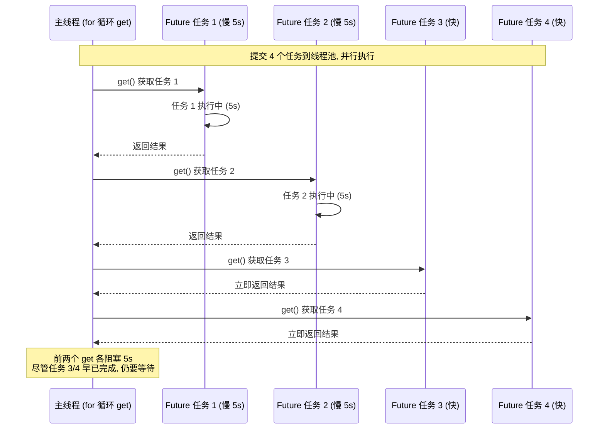
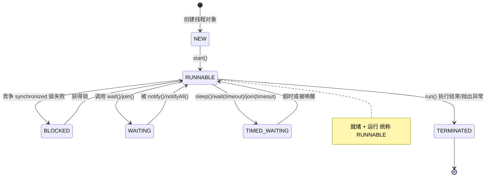
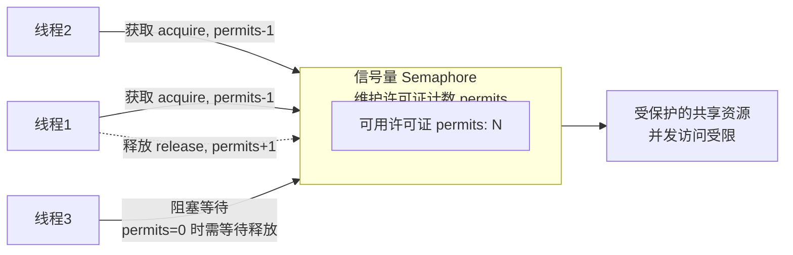

# Callable 与同步工具

## Callable 与 Runnable 的对比

### 为什么需要 Callable？Runnable 的缺陷

#### 不能返回一个返回值

Runnable 不能返回返回值。虽可借助写日志文件或修改共享对象等办法保存执行结果，但效率不高。实际执行子线程时常需得到任务结果（如请求网络、查询数据库），Runnable 无法返回返回值是其首要缺陷。

#### 不能抛出 checked Exception

```java
public class RunThrowException {

/**
    * 普通方法内可以 throw 异常，并在方法签名上声明 throws
    */
   public void normalMethod() throws Exception {
       throw new IOException();
   }

Runnable runnable = new Runnable() {
       /**
        *  run方法上无法声明 throws 异常，且run方法内无法 throw 出 checked Exception，除非使用try catch进行处理
        */
       @Override
       public void run() {
           try {
               throw new IOException();
           } catch (IOException e) {
               e.printStackTrace();
           }
       }
   }
}

```

普通方法 `normalMethod` 可在签名声明 `throws Exception` 并 `throw new IOException()`。但重写 `run` 方法时无法在签名声明 throws，方法内也不能抛出 checked Exception，除非用 `try catch` 包裹。

#### 为什么有这样的缺陷

```java
public interface Runnable {
   public abstract void run();
}

```

Runnable 是 interface，仅有 `public abstract void run()`。该方法返回类型为 `void` 且未声明抛出异常。实现并重写时，语法规定不允许修改返回值类型和异常抛出描述，故无法返回或抛异常。

#### Runnable 为什么设计成这样

即使 `run()` 可返回或抛异常也无效，因为调用 `run()` 的类（Thread 类、线程池）由 Java 提供而非自定义，外层无法捕获并处理。弥补 Runnable 缺陷的补救措施是使用 Callable。

### Callable 接口

Callable 是类似 Runnable 的接口，实现两者的类都可作为任务被其他线程执行：

```java
public interface Callable<V> {
     V call() throws Exception;
}

```

`call` 方法声明了 `throws Exception`，且有泛型 `V` 返回值，与 Runnable 明显不同。实现 `call` 方法并将计算结果放入对象，即可通过返回值获得子线程执行结果。

### Callable 和 Runnable 的不同之处

- **方法名**：Callable 的执行方法是 `call()`，Runnable 的是 `run()`。
- **返回值**：Callable 任务执行后有返回值，Runnable 没有。
- **抛出异常**：`call()` 可抛异常，`run()` 不能抛出受检查异常。
- **配合 Future**：与 Callable 配合的 Future 类可了解任务执行情况、取消任务、获取执行结果，这些功能 Runnable 无法实现。Callable 功能强于 Runnable。

---

## Future 的主要功能

### Future 类

#### Future 的作用

运算过程可能耗时（查数据库、繁重计算、压缩、加密等），原地等待方法返回会降低整体运行效率。可把运算放到子线程执行，通过 Future 控制子线程的计算过程并获取结果，属异步思想，可提高程序运行效率。

#### Callable 和 Future 的关系

Callable 相对 Runnable 的优势是可返回结果，用 Future 的 `get` 方法获取。Future 相当于存储 Callable 的 `call` 方法任务结果的存储器；还可通过 `isDone` 判断任务是否执行完毕、`cancel` 取消任务、限时获取结果。

#### Future 的方法和用法

Future 接口共 5 个方法：

```java
public interface Future<V> {

boolean cancel(boolean mayInterruptIfRunning);

boolean isCancelled();

boolean isDone();

V get() throws InterruptedException, ExecutionException;

V get(long timeout, TimeUnit unit)
        throws InterruptedException, ExecutionException, TimeoutException;
}

```

第 5 个方法是第 4 个方法的重载（方法名相同、参数不同）。

#### get() 方法：获取结果

`get` 用于获取任务执行结果，行为取决于 Callable 任务状态，有 5 种情况：

1. **任务已执行完毕**：立即返回结果。
2. **任务尚未有结果**：任务未开始（线程池积压未轮到）或正在执行，调用 get 会阻塞当前线程直到任务完成再返回。
3. **任务执行中抛异常**：调用 get 抛 `ExecutionException`（无论 call 内抛何种异常，get 时一律为 ExecutionException）。
4. **任务被取消**：调用 get 抛 `CancellationException`。
5. **任务超时**：带延迟参数的重载 get，规定时间内完成任务则正常返回，超时则抛 `TimeoutException`。


右侧为线程池，左侧 `submit` 提交实现 Callable 的 Task 后立即返回一个 Future 对象 `f`（此时内容为空，计算未完成）。计算完成后，线程池把结果填入之前返回的 `f`（而非新建 Future），即可用 get 获取结果。

代码示例：

```java
/**
 * 描述：     演示一个 Future 的使用方法
 */
public class OneFuture {

public static void main(String[] args) {
        ExecutorService service = Executors.newFixedThreadPool(10);
        Future<Integer> future = service.submit(new CallableTask());
        try {
            System.out.println(future.get());
        } catch (InterruptedException e) {
            e.printStackTrace();
        } catch (ExecutionException e) {
            e.printStackTrace();
        }
        service.shutdown();
    }

static class CallableTask implements Callable<Integer> {

@Override
        public Integer call() throws Exception {
            Thread.sleep(3000);
            return new Random().nextInt();
        }
    }
}

```

`main` 新建 10 线程线程池并 submit 任务；任务实现 Callable，休眠 3 秒后返回随机数；打印 `future.get()` 得到随机数（如 100192）。

#### isDone() 方法：判断是否执行完毕

用于判断任务是否执行完毕。返回 true 代表执行完成、false 代表未完成。**但返回 true 不代表任务成功执行**——若任务执行中抛异常，isDone 同样返回 true（任务已不会再执行，确实执行完毕）。故 isDone 返回 true 只代表执行完毕，不代表成功。

代码示例：

```java
public class GetException {

public static void main(String[] args) {
        ExecutorService service = Executors.newFixedThreadPool(20);
        Future<Integer> future = service.submit(new CallableTask());

try {
            for (int i = 0; i < 5; i++) {
                System.out.println(i);
                Thread.sleep(500);
            }
            System.out.println(future.isDone());
            future.get();
        } catch (InterruptedException e) {
            e.printStackTrace();
        } catch (ExecutionException e) {
            e.printStackTrace();
        }
    }

static class CallableTask implements Callable<Integer> {

@Override
        public Integer call() throws Exception {
            throw new IllegalArgumentException("Callable抛出异常");
        }
    }
}

```

任务直接抛异常；for 循环休眠并打印 0~4 起到延迟作用，之后再调用 isDone 和 get。运行结果：

```java
0
1
2
3
4
true
java.util.concurrent.ExecutionException: java.lang.IllegalArgumentException: Callable抛出异常
...

```

异常在任务刚执行时即抛出，但异常信息在 `true` 打印完毕、调用 get 时才打印。这段代码证明：

- 即便任务抛异常，isDone 仍返回 true。
- 虽然实际抛出的是 IllegalArgumentException，get 抛出的仍是 ExecutionException。
- 任务一开始就抛异常，但真正看到异常是在执行 get 时。

#### cancel 方法：取消任务的执行

不想执行某任务时可调用 cancel，有三种情况：

1. **任务未开始**：调用 cancel 正常取消，未来不执行，返回 true。
2. **任务已完成或已被取消**：cancel 取消失败，返回 false（已完成或已取消的任务不能再次取消）。
3. **任务正在执行**：不会直接取消，而是根据参数 `mayInterruptIfRunning` 判断：
   - `true`：执行任务的线程收到中断信号，正在执行的任务若有处理中断的逻辑则会停止。
   - `false`：不中断正在运行的任务，本次 cancel 无效，返回 false。

`mayInterruptIfRunning` 选择：
- 传 `true`：明确知道任务能处理中断。
- 传 `false`：明确知道线程不能处理中断；不知道任务是否支持取消（多人协作下不确定是否响应中断）；希望任务开始后完全执行完毕。

#### isCancelled() 方法：判断是否被取消

判断任务是否被取消，与 cancel 方法配合使用。

#### 用 FutureTask 来创建 Future

除线程池 `submit` 返回 future 外，也可用 FutureTask 获取 Future 和任务结果。FutureTask 既是任务（Task），又具 Future 接口语义（可在将来得到执行结果）：

```java
public class FutureTask<V> implements RunnableFuture<V>{
 ...
}

```

```java
public interface RunnableFuture<V> extends Runnable, Future<V> {
    void run();
}

```

RunnableFuture 继承 Runnable 和 Future 两个接口，FutureTask 实现 RunnableFuture，故 FutureTask 既可作 Runnable 被线程执行，又可作 Future 得到 Callable 返回值。关系图：


典型用法：把 Callable 实例作为 FutureTask 构造参数生成对象，再作为 Runnable 放入线程池或另起线程执行，最后通过 FutureTask 获取结果：

```java
/**
 * 描述：     演示 FutureTask 的用法
 */
public class FutureTaskDemo {

public static void main(String[] args) {
        Task task = new Task();
        FutureTask<Integer> integerFutureTask = new FutureTask<>(task);
        new Thread(integerFutureTask).start();

try {
            System.out.println("task运行结果："+integerFutureTask.get());
        } catch (InterruptedException e) {
            e.printStackTrace();
        } catch (ExecutionException e) {
            e.printStackTrace();
        }
    }
}

class Task implements Callable<Integer> {

@Override
    public Integer call() throws Exception {
        System.out.println("子线程正在计算");
        int sum = 0;
        for (int i = 0; i < 100; i++) {
            sum += i;
        }
        return sum;
    }
}

```

创建实现 Callable 的 Task，传入 FutureTask 构造创建实例，作为 Runnable 放入 `new Thread()` 执行，再用 `get` 获取结果。执行结果为 4950，即 `0+1+2+...+99` 的和。

### 总结

宏观上讲解了 Future 的作用，介绍了 Callable 与 Future 的关系，详解了 Future 各方法，并给出用 FutureTask 创建 Future 的用法。

---

## 使用 Future 的注意点

### Future 的注意点

**1. for 循环批量获取 Future 结果时容易 block，get 方法调用时应使用 timeout 限制**

将 4 个任务放入线程池，前两个为慢任务（需 5 秒），后两个为快任务，按 1~4 顺序调用 `get()`：

```java
public class FutureDemo {

public static void main(String[] args) {
        //创建线程池
        ExecutorService service = Executors.newFixedThreadPool(10);
        //提交任务，并用 Future 接收返回结果
        ArrayList<Future> allFutures = new ArrayList<>();
        for (int i = 0; i < 4; i++) {
            Future<String> future;
            if (i == 0 || i == 1) {
                future = service.submit(new SlowTask());
            } else {
                future = service.submit(new FastTask());
            }
            allFutures.add(future);
        }

for (int i = 0; i < 4; i++) {
            Future<String> future = allFutures.get(i);
            try {
                String result = future.get();
                System.out.println(result);
            } catch (InterruptedException e) {
                e.printStackTrace();
            } catch (ExecutionException e) {
                e.printStackTrace();
            }
        }
        service.shutdown();
    }

static class SlowTask implements Callable<String> {

@Override
        public String call() throws Exception {
            Thread.sleep(5000);
            return "速度慢的任务";
        }
    }

static class FastTask implements Callable<String> {

@Override
        public String call() throws Exception {
            return "速度快的任务";
        }
    }
}

```

前两个 Future 对应慢任务（SlowTask 需 5 秒），后两个对应快任务（几乎不耗时）。提交后 for 循环依次 get 获取结果。运行结果：

```java
速度慢的任务
速度慢的任务
速度快的任务
速度快的任务

```

结果正确，但执行时先等待 5 秒，再一次性打印 4 行。



> **for 循环按序 get 的阻塞问题**：主线程按任务 1→4 顺序调用 `get()`，任务 1、2 各阻塞 5 秒，导致即使快的任务 3、4 已完成，也要等慢任务先返回。**应使用 `get(timeout)` 限制等待时间**，避免无限阻塞。

任务 3、4 很快完成，但 get 卡在第一个慢任务上，无法及时获取后续结果；直到 5 秒后任务 1 出结果，才能依次获取 2、3、4。若任务 1 因网络原因长达 1 分钟不返回，主线程会一直卡住，影响运行效率。

用带超时参数的 `get(long timeout, TimeUnit unit)` 解决：限定时间内未返回则抛 `TimeoutException`，可捕获或上抛，不会一直阻塞。

**2. Future 的生命周期不能后退**

Future 一旦完成任务便永久停在"已完成"状态，不能从头再来，也不能让已完成的 Future 再次执行。这与线程、线程池状态一致（线程状态流转见《并发基础与线程》）：



> **线程状态不能后退**：NEW → RUNNABLE → BLOCKED/WAITING/TIMED_WAITING → TERMINATED，状态只能向前流转，`TERMINATED` 是终态。

### Future 产生新的线程了吗

说法：除继承 Thread 类、实现 Runnable 接口外，还有第三种产生新线程的方式——采用 Callable 和 Future（有返回值的创建线程方式）。**此说法不正确。**

Callable 和 Future 本身不能产生新线程，需借助 Thread 类或线程池执行任务。把 Callable 提交到线程池后，真正执行 Callable 的是线程池中的线程（由 ThreadFactory 产生），与 Callable、Future 无关。故 Future 不产生新线程。

---

## 利用 CompletableFuture 实现并发任务


### 旅游平台问题

什么是旅游平台问题呢？如果想要搭建一个旅游平台，经常会有这样的需求，那就是用户想同时获取多家航空公司的航班信息。比如，从北京到上海的机票钱是多少？有很多家航空公司都有这样的航班信息，所以应该把所有航空公司的航班、票价等信息都获取到，然后再聚合。由于每个航空公司都有自己的服务器，所以分别去请求它们的服务器就可以了，比如请求国航、海航、东航等，如下图所示：


### 串行

一种比较原始的方式是用串行的方式来解决这个问题。


比如想获取价格，要先去访问国航，在这里叫作 website 1，然后再去访问海航 website 2，以此类推。当每一个请求发出去之后，等它响应回来以后，才能去请求下一个网站，这就是串行的方式。

这样做的效率非常低下，比如航空公司比较多，假设每个航空公司都需要 1 秒钟的话，那么用户肯定等不及，所以这种方式是不可取的。

### 并行

接下来就对刚才的思路进行改进，最主要的思路就是把串行改成并行，如下图所示：


可以并行地去获取这些机票信息，然后再把机票信息给聚合起来，这样的话，效率会成倍的提高。

这种并行虽然提高了效率，但也有一个缺点，那就是会"一直等到所有请求都返回"。如果有一个网站特别慢，那么不应该被那个网站拖累，比如说某个网站打开需要二十秒，那肯定是等不了这么长时间的，所以需要一个功能，那就是有超时的获取。

### 有超时的并行获取

下面就来看着下面这种有超时的并行获取的情况。


在这种情况下，就属于有超时的并行获取，同样也在并行的去请求各个网站信息。但是规定了一个时间的超时，比如 3 秒钟，那么到 3 秒钟的时候如果都已经返回了那当然最好，把它们收集起来即可；但是如果还有些网站没能及时返回，就把这些请求给忽略掉，这样一来用户体验就比较好了，它最多只需要等固定的 3 秒钟就能拿到信息，虽然拿到的可能不是最全的，但是总比一直等更好。

想要实现这个目标有几种实现方案，一个一个的来看看。

### 线程池的实现

第一个实现方案是用线程池，来看一下代码。

```java
public class ThreadPoolDemo {

ExecutorService threadPool = Executors.newFixedThreadPool(3);

public static void main(String[] args) throws InterruptedException {
        ThreadPoolDemo threadPoolDemo = new ThreadPoolDemo();
        System.out.println(threadPoolDemo.getPrices());
    }

private Set<Integer> getPrices() throws InterruptedException {
        Set<Integer> prices = Collections.synchronizedSet(new HashSet<Integer>());
        threadPool.submit(new Task(123, prices));
        threadPool.submit(new Task(456, prices));
        threadPool.submit(new Task(789, prices));
        threadPool.shutdown();
        Thread.sleep(3000);
        return prices;
    }

private class Task implements Runnable {

Integer productId;
        Set<Integer> prices;

public Task(Integer productId, Set<Integer> prices) {
            this.productId = productId;
            this.prices = prices;
        }

@Override
        public void run() {
            int price=0;
            try {
                Thread.sleep((long) (Math.random() * 4000));
                price= (int) (Math.random() * 4000);
            } catch (InterruptedException e) {
                e.printStackTrace();
            }
            prices.add(price);
        }
    }
}

```

在代码中，新建了一个线程安全的 Set，它是用来存储各个价格信息的，把它命名为 Prices，然后往线程池中去放任务。线程池是在类的最开始时创建的，是一个固定 3 线程的线程池。而这个任务在下方的 Task 类中进行了描述，在这个 Task 中看到有 run 方法，在该方法里面，用一个随机的时间去模拟各个航空网站的响应时间，然后再去返回一个随机的价格来表示票价，最后把这个票价放到 Set 中。这就是 run 方法所做的事情。

再回到 getPrices 函数中，新建了三个任务，productId 分别是 123、456、789，这里的 productId 并不重要，因为返回的价格是随机的，为了实现超时等待的功能，在这里调用了 Thread 的 sleep 方法来休眠 3 秒钟，这样做的话，它就会在这里等待 3 秒，之后直接返回 prices。

此时，如果前面响应速度快的话，prices 里面最多会有三个值，但是如果每一个响应时间都很慢，那么可能 prices 里面一个值都没有。不论有多少个，它都会在休眠结束之后，也就是执行完 Thread 的 sleep 之后直接把 prices 返回，并且最终在 main 函数中把这个结果给打印出来。

来看一下可能的执行结果，一种可能性就是有 3 个值，即 [3815, 3609, 3819]（数字是随机的）；有可能是 1 个 [3496]、或 2 个 [1701, 2730]，如果每一个响应速度都特别慢，可能一个值都没有。

这就是用线程池去实现的最基础的方案。

### CountDownLatch

在这里会有一个优化的空间，比如说网络特别好时，每个航空公司响应速度都特别快，根本不需要等三秒，有的航空公司可能几百毫秒就返回了，那么也不应该让用户等 3 秒。所以需要进行一下这样的改进，看下面这段代码：

```java
public class CountDownLatchDemo {

ExecutorService threadPool = Executors.newFixedThreadPool(3);

public static void main(String[] args) throws InterruptedException {
        CountDownLatchDemo countDownLatchDemo = new CountDownLatchDemo();
        System.out.println(countDownLatchDemo.getPrices());
    }

private Set<Integer> getPrices() throws InterruptedException {
        Set<Integer> prices = Collections.synchronizedSet(new HashSet<Integer>());
        CountDownLatch countDownLatch = new CountDownLatch(3);

        threadPool.submit(new Task(123, prices, countDownLatch));
        threadPool.submit(new Task(456, prices, countDownLatch));
        threadPool.submit(new Task(789, prices, countDownLatch));
        threadPool.shutdown();

countDownLatch.await(3, TimeUnit.SECONDS);
        return prices;
    }

private class Task implements Runnable {

Integer productId;
        Set<Integer> prices;
        CountDownLatch countDownLatch;

public Task(Integer productId, Set<Integer> prices,
                CountDownLatch countDownLatch) {
            this.productId = productId;
            this.prices = prices;
            this.countDownLatch = countDownLatch;
        }

@Override
        public void run() {
            int price = 0;
            try {
                Thread.sleep((long) (Math.random() * 4000));
                price = (int) (Math.random() * 4000);
            } catch (InterruptedException e) {
                e.printStackTrace();
            }
            prices.add(price);
            countDownLatch.countDown();
        }
    }
}

```

这段代码使用 CountDownLatch 实现了这个功能，整体思路和之前是一致的，不同点在于新增了一个 CountDownLatch，并且把它传入到了 Task 中。在 Task 中，获取完机票信息并且把它添加到 Set 之后，会调用 countDown 方法，相当于把计数减 1。

这样一来，在执行 countDownLatch.await(3,
TimeUnit.SECONDS) 这个函数进行等待时，如果三个任务都非常快速地执行完毕了，那么三个线程都已经执行了 countDown 方法，那么这个 await 方法就会立刻返回，不需要傻等到 3 秒钟。

如果有一个请求特别慢，相当于有一个线程没有执行 countDown 方法，来不及在 3 秒钟之内执行完毕，那么这个带超时参数的 await 方法也会在 3 秒钟到了以后，及时地放弃这一次等待，于是就把 prices 给返回了。所以这样一来，就利用 CountDownLatch 实现了这个需求，也就是说最多等 3 秒钟，但如果在 3 秒之内全都返回了，也可以快速地去返回，不会傻等，提高了效率。

### CompletableFuture

再来看一下用 CompletableFuture 来实现这个功能的用法，代码如下所示：

```java
public class CompletableFutureDemo {

public static void main(String[] args)
            throws Exception {
        CompletableFutureDemo completableFutureDemo = new CompletableFutureDemo();
        System.out.println(completableFutureDemo.getPrices());
    }

private Set<Integer> getPrices() {
        Set<Integer> prices = Collections.synchronizedSet(new HashSet<Integer>());
        CompletableFuture<Void> task1 = CompletableFuture.runAsync(new Task(123, prices));
        CompletableFuture<Void> task2 = CompletableFuture.runAsync(new Task(456, prices));
        CompletableFuture<Void> task3 = CompletableFuture.runAsync(new Task(789, prices));

CompletableFuture<Void> allTasks = CompletableFuture.allOf(task1, task2, task3);
        try {
            allTasks.get(3, TimeUnit.SECONDS);
        } catch (InterruptedException e) {
        } catch (ExecutionException e) {
        } catch (TimeoutException e) {
        }
        return prices;
    }

private class Task implements Runnable {

Integer productId;
        Set<Integer> prices;

public Task(Integer productId, Set<Integer> prices) {
            this.productId = productId;
            this.prices = prices;
        }

@Override
        public void run() {
            int price = 0;
            try {
                Thread.sleep((long) (Math.random() * 4000));
                price = (int) (Math.random() * 4000);
            } catch (InterruptedException e) {
                e.printStackTrace();
            }
            prices.add(price);
        }
    }
}

```

这里不再使用线程池了，看到 getPrices 方法，在这个方法中，用了 CompletableFuture 的 runAsync 方法，这个方法会异步的去执行任务。

有三个任务，并且在执行这个代码之后会分别返回一个 CompletableFuture 对象，把它们命名为 task 1、task 2、task 3，然后执行 CompletableFuture 的 allOf 方法，并且把 task 1、task 2、task 3 传入。这个方法的作用是把多个 task 汇总，然后可以根据需要去获取到传入参数的这些 task 的返回结果，或者等待它们都执行完毕等。把这个返回值叫作 allTasks，并且在下面调用它的带超时时间的 get 方法，同时传入 3 秒钟的超时参数。

这样一来它的效果就是，如果在 3 秒钟之内这 3 个任务都可以顺利返回，也就是这个任务包括的那三个任务，每一个都执行完毕的话，则这个 get 方法就可以及时正常返回，并且往下执行，相当于执行到 return prices。在下面的这个 Task 的 run 方法中，该方法如果执行完毕的话，对于 CompletableFuture 而言就意味着这个任务结束，它是以这个作为标记来判断任务是不是执行完毕的。但是如果有某一个任务没能来得及在 3 秒钟之内返回，那么这个带超时参数的 get 方法便会抛出 TimeoutException 异常，同样会被 catch 住。这样一来它就实现了这样的效果：会尝试等待所有的任务完成，但是最多只会等 3 秒钟，在此之间，如及时完成则及时返回。所以利用 CompletableFuture，同样也可以解决旅游平台的问题。它的运行结果也和之前是一样的，有多种可能性。

最后做一下总结。在本文中，先给出了一个旅游平台问题，它需要获取各航空公司的机票信息，随后进行了代码演进，从串行到并行，再到有超时的并行，最后到不仅有超时的并行，而且如果大家速度都很快，那么也不需要一直等到超时时间到，进行了这样的一步一步的迭代。

当然除了这几种实现方案之外，还会有其他的实现方案，例如可以把多个请求聚合后的结果进一步做异步编排，也可以结合 CompletableFuture 的 thenApply、thenCombine 等方法实现更复杂的流程。

---

## 信号量与 FixedThreadPool 的对比

### Semaphore 信号量

#### 介绍



信号量用于控制需要限制并发访问量的资源。信号量维护"许可证"计数，线程访问共享资源前必须先拿到许可证：

- 线程"获取"（acquire）一个许可证后，许可证转移给线程，信号量剩余许可证减一。
- 线程"释放"（release）一个许可证，相当于归还给信号量，可用数量加一。
- 许可证数量减到 0 时，想获取许可证的线程必须等待，直到之前拿到许可证的线程释放。

线程未获取许可证前不能访问被保护的共享资源，从而控制资源并发访问量。

#### 应用实例、使用场景

**背景**


服务是中间方块，左侧是请求，右侧是所依赖的慢服务。因计算量大、依赖下游服务多等原因，慢服务处理慢、可承受请求有限，太多请求同时到达会压垮它。必须保护它，不让太多线程同时访问。

普通线程池能否做到？以下代码用固定 50 线程线程池提交 1000 个任务，每个任务休眠 3 秒模拟调用慢服务：

```java
public class SemaphoreDemo1 {

public static void main(String[] args) {
        ExecutorService service = Executors.newFixedThreadPool(50);
        for (int i = 0; i < 1000; i++) {
            service.submit(new Task());
        }
        service.shutdown();
    }

static class Task implements Runnable {

@Override
        public void run() {
            System.out.println(Thread.currentThread().getName() + "调用了慢服务");
            try {
                //模拟慢服务
                Thread.sleep(3000);
            } catch (InterruptedException e) {
                e.printStackTrace();
            }
        }
    }
}

```

运行结果：

```java
pool-1-thread-2调用了慢服务
pool-1-thread-4调用了慢服务
pool-1-thread-3调用了慢服务
pool-1-thread-1调用了慢服务
pool-1-thread-5调用了慢服务
pool-1-thread-6调用了慢服务
...
（包含了pool-1-thread-1到pool-1-thread-50这50个线程）

```

50 个线程都会几乎同时调用慢服务（调用顺序每次不同），导致慢服务崩溃。

需严格限制同时到达该服务的请求数。前提：线程池有 50 个线程（超过 3 个），要控制不超 3 个线程同时访问，可通过信号量实现。

**正常情况下获取许可证**


方框代表许可证为 3 的信号量，绿色长条代表许可证（permit）。信号量持有许可证时"慷慨"分发。Thread 1 请求获得许可证：


Thread 1 拿到许可证后访问慢服务，信号量许可证减为 2。慢服务返回前 Thread 1 不释放许可证，期间 Thread 2 来请求：


信号量持有 2 个许可证，满足 Thread 2，Thread 2 拿到许可证访问慢服务：


前两个线程返回前，Thread 3 同样获得许可证并访问慢服务：


**没许可证时，会阻塞前来请求的线程**

3 个许可证已全部分发。Thread 4 再来请求时，线程 1/2/3 仍在访问慢服务未归还许可证，信号量无多余许可证：


Thread 4 调用 `acquire` 请求许可证时被阻塞，未被允许访问慢服务。此时慢服务仍只能被前 3 个线程访问，实现"限制同时最多 3 个线程调用慢服务"。

**有线程释放信号量后**

线程 1 最早完成任务，返回时调用 `release` 归还许可证，信号量许可证从 0 回到 1：


线程 4 顺利拿到刚释放的许可证，获得访问慢服务权限。此时同时访问慢服务的仍是 3 个线程（线程 2、3、4），线程 1 已完成离开：


**如果有两个线程释放许可证**

线程 2、3 同时执行完毕释放许可证，信号量重新拥有 2 个许可证，发放给需要许可证的线程 5、6：


此时访问慢服务的是线程 4、5、6，总数量始终不超过 3。

线程 4 初始获取许可证被阻塞时，即使线程 5、6 甚至线程 100 都执行 `acquire`，信号量也会全部阻塞，体现信号量控制并发量的核心作用。

#### 总结

通过控制许可证发放和归还，实现同一时刻最多 3 个线程执行某任务。

### 用法

#### 使用流程

使用流程分三步：

1. 初始化信号量并传入许可证数量，构造函数 `public Semaphore(int permits, boolean fair)`：
   - 第二个参数 `true` 为公平策略：把已等待线程放入队列，新许可证按顺序发放给等待线程。
   - `false` 为非公平策略，可能插队（后请求的线程可能先获得许可证）。
2. 调用慢服务前，用 `acquire()` 或 `acquireUninterruptibly()` 获取许可证。只有此方法顺利执行，才能进一步访问慢服务代码；信号量无剩余许可证时线程会等在 `acquire` 这一行，保护慢服务。
   - `acquire()` 支持中断：获取信号量期间线程被中断会跳出该方法，不再继续获取。
   - `acquireUninterruptibly()` 不可中断。
3. 任务执行完毕后调用 `release()` 释放许可证（如执行完慢服务后），许可证归还信号量。

### 其他主要方法介绍

**（1）public boolean tryAcquire()**

尝试获取许可证，与锁的 `tryLock` 思路一致：有空闲许可证则获取，获取不到不必阻塞，可做其他事。

**（2）public boolean tryAcquire(long timeout, TimeUnit unit)**

重载方法，传入超时时间（如 3 秒）：等待期间获取到许可证则继续执行；超时仍获取不到则获取失败，返回 false。

**（3）availablePermits()**

查询可用许可证数量，返回整型。

#### 示例代码

```java
public class SemaphoreDemo2 {

static Semaphore semaphore = new Semaphore(3);

public static void main(String[] args) {
        ExecutorService service = Executors.newFixedThreadPool(50);
        for (int i = 0; i < 1000; i++) {
            service.submit(new Task());
        }
        service.shutdown();
    }

static class Task implements Runnable {

@Override
        public void run() {
            try {
                semaphore.acquire();
            } catch (InterruptedException e) {
                e.printStackTrace();
            }
            System.out.println(Thread.currentThread().getName() + "拿到了许可证，花费2秒执行慢服务");
            try {
                Thread.sleep(2000);
            } catch (InterruptedException e) {
                e.printStackTrace();
            }
            System.out.println("慢服务执行完毕，" + Thread.currentThread().getName() + "释放了许可证");
            semaphore.release();
        }
    }
}

```

新建数量为 3 的信号量 + 固定 50 线程线程池，放入 1000 个任务。每任务执行慢服务前用 `acquire` 获取信号量，执行 2 秒慢服务后 `release` 释放许可证。运行结果：

```java
pool-1-thread-1拿到了许可证，花费2秒执行慢服务
pool-1-thread-2拿到了许可证，花费2秒执行慢服务
pool-1-thread-3拿到了许可证，花费2秒执行慢服务
慢服务执行完毕，pool-1-thread-1释放了许可证
慢服务执行完毕，pool-1-thread-2释放了许可证
慢服务执行完毕，pool-1-thread-3释放了许可证
pool-1-thread-4拿到了许可证，花费2秒执行慢服务
pool-1-thread-5拿到了许可证，花费2秒执行慢服务
pool-1-thread-6拿到了许可证，花费2秒执行慢服务
慢服务执行完毕，pool-1-thread-4释放了许可证
慢服务执行完毕，pool-1-thread-5释放了许可证
慢服务执行完毕，pool-1-thread-6释放了许可证
...

```

线程 1、2、3 先拿到许可证执行慢服务，执行完毕释放后后续线程才能获得许可证。前 3 个线程未释放时，后续线程调 `acquire` 会被阻塞。同时最多 3 个线程访问慢服务。

#### 特殊用法：一次性获取或释放多个许可证

可一次性获取/释放多个许可证：`semaphore.acquire(2)` 一次性获取 2 个，`semaphore.release(3)` 一次性释放 3 个。

应用场景：任务 A 调用耗资源的方法一 `method1()`，任务 B 调用不耗资源的方法二 `method2()`。假设共 5 个许可证，允许同时最多 1 个线程调用方法一，或最多 5 个线程调用方法二，但二者不能同时调用。故 Task A 执行前需一次性获取 5 个许可证，Task B 只需获取 1 个，既避免 A/B 同时运行，又兼顾效率（不至于只允许 1 个线程访问方法二造成资源浪费）。

#### 注意点

- 获取和释放的许可证数量尽量保持一致。若每次获取 2 个但只释放 1 个或不释放，许可证会被慢慢消耗完，导致其他线程无法访问。
- 初始化时可设置公平性：`true` 更公平，`false` 总吞吐量更高。
- 信号量支持跨线程、跨线程池，且不要求获取线程必须由同一线程释放。线程 A 获取、线程 B 释放是允许的，只要逻辑合理。

### 信号量能被 FixedThreadPool 替代吗？

不能。信号量可限制同时访问的线程数，固定线程池也能限制（如 3 个线程最多 3 个同时访问），但实际业务中常需更灵活的控制：

- **需要条件限制**：如只在每天零点附近限制访问慢服务线程数为 3，其他时间允许更多线程访问。此时线程池线程数设为 50 甚至更多，执行前用 if 判断，符合时间限制时再用信号量额外限制。
- **跨线程池限制**：大型应用中不同类型任务通过不同线程池调用慢服务，调用方不止一处（Tomcat 服务器、网关），无法限制各线程池大小。但可在执行任务前用信号量限制同时访问数——信号量具跨线程、跨线程池特性，即使请求来自不同线程池也可统一限制；用 FixedThreadPool 无法跨线程池限制。

综上，限制并发访问线程数时，用信号量更合适。

---

## CountDownLatch 控制线程顺序

CountDownLatch 是 JDK 提供的**并发流程控制**工具类，位于 `java.util.concurrent` 包，JDK1.5 以后加入。

核心思想：像游乐园激流勇进，等人坐满才开船（座位有多少就等多少人），即等到设定的数值达到之后才出发。

### 流程图


CountDownLatch 初始值设为 3。T0 线程调用 `await` 开始等待，T1、T2、T3 每次调用 `countDown` 使数值减 1（3→2→1→0）。减到 0 后，T0 达到触发条件，恢复运行。

### 主要方法介绍

**（1）构造函数**：`public CountDownLatch(int count)`，参数 `count` 是需要倒数的数值。

**（2）await()**：调用线程开始等待，直到倒数结束（count 为 0）才继续执行。

**（3）await(long timeout, TimeUnit unit)**：await 的重载，可设置超时时间，超时则不再等待。

**（4）countDown()**：将 count 减 1，直到减为 0 时唤醒之前等待的线程。

### 用法

#### 用法一：一个线程等待其他多个线程都执行完毕，再继续自己的工作

需初始化一系列前置条件（建立连接、准备数据），条件未完成前不能进行下一步。可用 CountDownLatch 让主线程在其他线程准备完毕后继续执行。

运动员跑步场景：5 个运动员参赛，终点裁判等待所有人到达终点后宣布比赛结束：

```java
public class RunDemo1 {

public static void main(String[] args) throws InterruptedException {
        CountDownLatch latch = new CountDownLatch(5);
        ExecutorService service = Executors.newFixedThreadPool(5);
        for (int i = 0; i < 5; i++) {
            final int no = i + 1;
            Runnable runnable = new Runnable() {

@Override
                public void run() {
                    try {
                        Thread.sleep((long) (Math.random() * 10000));
                        System.out.println(no + "号运动员完成了比赛。");
                    } catch (InterruptedException e) {
                        e.printStackTrace();
                    } finally {
                        latch.countDown();
                    }
                }
            };
            service.submit(runnable);
        }
        service.shutdown();
        System.out.println("等待5个运动员都跑完.....");
        latch.await();
        System.out.println("所有人都跑完了，比赛结束。");
    }
}

```

新建初始值 5 的 CountDownLatch，固定 5 线程线程池，for 循环提交 5 个任务（每个代表一个运动员）。运动员随机等待一段时间代表跑步，完成后打印并调用 `countDown` 计数减 1。主线程打印"等待 5 个运动员都跑完"后调用 `await`，等待所有子线程执行完毕。运行结果：

```java
等待5个运动员都跑完.....
4号运动员完成了比赛。
3号运动员完成了比赛。
1号运动员完成了比赛。
5号运动员完成了比赛。
2号运动员完成了比赛。
所有人都跑完了，比赛结束。

```

直到 5 个运动员都完成比赛，主线程才继续；因子线程随机等待，完成次序随机。

#### 用法二：多个线程等待某一个线程的信号，同时开始执行

与用法一相反：运动员等裁判员。运动员起跑前等待裁判发令，一声令下统一出发：

```java
public class RunDemo2 {

public static void main(String[] args) throws InterruptedException {
        System.out.println("运动员有5秒的准备时间");
        CountDownLatch countDownLatch = new CountDownLatch(1);
        ExecutorService service = Executors.newFixedThreadPool(5);
        for (int i = 0; i < 5; i++) {
            final int no = i + 1;
            Runnable runnable = new Runnable() {
                @Override
                public void run() {
                    System.out.println(no + "号运动员准备完毕，等待裁判员的发令枪");
                    try {
                        countDownLatch.await();
                        System.out.println(no + "号运动员开始跑步了");
                    } catch (InterruptedException e) {
                        e.printStackTrace();
                    }
                }
            };
            service.submit(runnable);
        }
        service.shutdown();
        Thread.sleep(5000);
        System.out.println("5秒准备时间已过，发令枪响，比赛开始！");
        countDownLatch.countDown();
    }
}

```

- 新建倒数值为 1 的 CountDownLatch。
- 5 线程线程池提交 5 个任务，各任务一开始就调用 `await` 等待。
- 主线程等待 5 秒（裁判准备工作），打印信号后调用 `countDown`，唤醒 5 个已 `await` 的线程。

运行结果：

```java
运动员有5秒的准备时间
2号运动员准备完毕，等待裁判员的发令枪
1号运动员准备完毕，等待裁判员的发令枪
3号运动员准备完毕，等待裁判员的发令枪
4号运动员准备完毕，等待裁判员的发令枪
5号运动员准备完毕，等待裁判员的发令枪
5秒准备时间已过，发令枪响，比赛开始！
2号运动员开始跑步了
1号运动员开始跑步了
5号运动员开始跑步了
4号运动员开始跑步了
3号运动员开始跑步了

```

5 个运动员准备完毕后等待发令枪响，5 秒后发令枪响、比赛开始，5 个子线程几乎同时开始跑步。

### 注意点

- 两种用法并不孤立，可结合：用两个 CountDownLatch（第一个初始值多个、第二个初始值 1）应对更复杂业务场景。
- CountDownLatch **不能重用**：完成倒数后不能再次倒数。有该需求时可使用 CyclicBarrier 或创建新的 CountDownLatch 实例。

### 总结

创建实例时在构造函数传入倒数次数，需要等待的线程调用 `await` 开始等待，其他线程每次调用 `countDown` 计数减 1，减到 0 时等待的线程继续运行。

---

## CyclicBarrier 与 CountDownLatch 的对比

### CyclicBarrier

#### 作用

CyclicBarrier 和 CountDownLatch 都能阻塞一个或一组线程，直到预定条件达到后统一出发继续执行。二者相似，但作用并不完全相同。

CyclicBarrier 可构造一个集结点：某线程执行 `await()` 时到集结点等待栅栏被撤销，直到预定数量的线程都到达后栅栏撤销，等待的线程统一出发执行剩余任务。

三人自行车场景：3 人才能骑一辆，从大门到自行车驿站需一段时间：

```java
public class CyclicBarrierDemo {

public static void main(String[] args) {
        CyclicBarrier cyclicBarrier = new CyclicBarrier(3);
        for (int i = 0; i < 6; i++) {
            new Thread(new Task(i + 1, cyclicBarrier)).start();
        }
    }

static class Task implements Runnable {

private int id;
        private CyclicBarrier cyclicBarrier;

public Task(int id, CyclicBarrier cyclicBarrier) {
            this.id = id;
            this.cyclicBarrier = cyclicBarrier;
        }

@Override
        public void run() {
            System.out.println("同学" + id + "现在从大门出发，前往自行车驿站");
            try {
                Thread.sleep((long) (Math.random() * 10000));
                System.out.println("同学" + id + "到了自行车驿站，开始等待其他人到达");
                cyclicBarrier.await();
                System.out.println("同学" + id + "开始骑车");
            } catch (InterruptedException e) {
                e.printStackTrace();
            } catch (BrokenBarrierException e) {
                e.printStackTrace();
            }
        }
    }
}

```

- 参数为 3 的 CyclicBarrier，表示需 3 个线程到达集结点才统一放行。
- for 循环开启 6 个线程。run 方法先打印出发，随机时间睡眠模拟步行（速度不同）；到达后打印等待消息并调用 `await()`，凑齐 3 人后才继续执行（一起骑车，打印"开始骑车"）。

运行结果：

```java
同学1现在从大门出发，前往自行车驿站
同学3现在从大门出发，前往自行车驿站
同学2现在从大门出发，前往自行车驿站
同学4现在从大门出发，前往自行车驿站
同学5现在从大门出发，前往自行车驿站
同学6现在从大门出发，前往自行车驿站
同学5到了自行车驿站，开始等待其他人到达
同学2到了自行车驿站，开始等待其他人到达
同学3到了自行车驿站，开始等待其他人到达
同学3开始骑车
同学5开始骑车
同学2开始骑车
同学6到了自行车驿站，开始等待其他人到达
同学4到了自行车驿站，开始等待其他人到达
同学1到了自行车驿站，开始等待其他人到达
同学1开始骑车
同学6开始骑车
同学4开始骑车

```

6 个同学从大门出发，速度不同故有 3 个先到驿站。先到的 2 个需等第 3 个到齐后才能骑车；第一辆车被骑走后，第二辆车同样要凑齐 3 人才能发车。

不用 CyclicBarrier 实现此逻辑会非常复杂（不确定谁先到谁后到）；用 CyclicBarrier 可简洁优雅实现，是典型应用场景。

#### 执行动作 barrierAction

`public CyclicBarrier(int parties, Runnable barrierAction)`：当 parties 个线程到达集结点、继续执行前，会执行一次传入的 Runnable 动作。构造函数第二个参数即 barrierAction。

把上面代码的构造函数改为：

```java
CyclicBarrier cyclicBarrier = new CyclicBarrier(3, new Runnable() {
    @Override
    public void run() {
        System.out.println("凑齐3人了，出发！");
    }
});

```

到齐时打印"凑齐3人了，出发！"。执行结果：

```java
同学1现在从大门出发，前往自行车驿站
同学3现在从大门出发，前往自行车驿站
同学2现在从大门出发，前往自行车驿站
同学4现在从大门出发，前往自行车驿站
同学5现在从大门出发，前往自行车驿站
同学6现在从大门出发，前往自行车驿站
同学2到了自行车驿站，开始等待其他人到达
同学4到了自行车驿站，开始等待其他人到达
同学6到了自行车驿站，开始等待其他人到达
凑齐3人了，出发！
同学6开始骑车
同学2开始骑车
同学4开始骑车
同学1到了自行车驿站，开始等待其他人到达
同学3到了自行车驿站，开始等待其他人到达
同学5到了自行车驿站，开始等待其他人到达
凑齐3人了，出发！
同学5开始骑车
同学1开始骑车
同学3开始骑车

```

三人凑齐一组后打印"凑齐 3 人了，出发！"。该语句每个周期只打印一次（只在"开闸"时执行一次），不是有几个线程等待就打印几次。

### CyclicBarrier 和 CountDownLatch 的异同

**相同点**：都能阻塞一个或一组线程，直到某个预设条件达成再统一出发。

**不同点**：

- **作用对象不同**：CyclicBarrier 要等固定数量的线程都到达栅栏位置才能继续执行；CountDownLatch 只需等数字倒数到 0。即 CountDownLatch 作用于事件，CyclicBarrier 作用于线程。CountDownLatch 在调用 `countDown` 后数字减 1，CyclicBarrier 在某线程开始等待后计数减 1。
- **可重用性不同**：CountDownLatch 倒数到 0 并触发门闩打开后不能再次使用，除非新建实例；CyclicBarrier 可重复使用（上述代码每 3 人到达都能出发，无需新建实例）。CyclicBarrier 可用 `reset` 方法重置，若重置时有线程已调用 `await` 开始等待，这些线程会抛出 `BrokenBarrierException`。
- **执行动作不同**：CyclicBarrier 有执行动作 barrierAction，CountDownLatch 无此功能。

### 总结

介绍了 CyclicBarrier 的作用、代码示例和执行动作，并总结 CyclicBarrier 与 CountDownLatch 的异同。

---

## Condition 与 wait、notify

### Condition接口

#### 作用

线程 1 需等待某些条件满足后才能继续运行（如等待某个时间点到达或某些任务处理完毕）。此时执行 Condition 的 `await` 方法，线程进入 WAITING 状态。

线程 2 达成对应条件后，调用 Condition 的 `signal` 方法（或 `signalAll` 方法），表示"条件已达成，等待该条件的线程可以苏醒"。JVM 找到等待该 Condition 的线程并唤醒（signal 唤醒 1 个，signalAll 唤醒全部）。线程 1 被唤醒后回到 RUNNABLE 可执行状态。

#### 代码案例

```java
public class ConditionDemo {
    private ReentrantLock lock = new ReentrantLock();
    private Condition condition = lock.newCondition();

void method1() throws InterruptedException {
        lock.lock();
        try{
            System.out.println(Thread.currentThread().getName()+":条件不满足，开始await");
            condition.await();
            System.out.println(Thread.currentThread().getName()+":条件满足了，开始执行后续的任务");
        }finally {
            lock.unlock();
        }
    }

void method2() throws InterruptedException {
        lock.lock();
        try{
            System.out.println(Thread.currentThread().getName()+":需要5秒钟的准备时间");
            Thread.sleep(5000);
            System.out.println(Thread.currentThread().getName()+":准备工作完成，唤醒其他的线程");
            condition.signal();
        }finally {
            lock.unlock();
        }
    }

public static void main(String[] args) throws InterruptedException {
        ConditionDemo conditionDemo = new ConditionDemo();
        new Thread(new Runnable() {
            @Override
            public void run() {
                try {
                    conditionDemo.method2();
                } catch (InterruptedException e) {
                    e.printStackTrace();
                }
            }
        }).start();
        conditionDemo.method1();
    }
}

```

三个方法：

- **method1**（主线程执行）：获取锁，打印"条件不满足，开始 await"，调用 `condition.await()`，条件满足后继续执行并打印"条件满足了，开始执行后续的任务"，finally 中解锁。
- **method2**（子线程执行）：获取锁，打印"需要 5 秒钟的准备时间"，用 sleep 模拟准备；时间到后打印"准备工作完成"，调用 `condition.signal()` 唤醒等待线程。
- **main**：实例化类，用子线程调用 method2，主线程调用 method1。

运行结果：

```java
main:条件不满足，开始await
Thread-0:需要 5 秒钟的准备时间
Thread-0:准备工作完成，唤醒其他的线程
main:条件满足了，开始执行后续的任务

```

第一、四行在 main 线程打印，第二、三行在子线程打印。

#### 注意点

- **线程 2 解锁后，线程 1 才能获得锁并继续执行**：子线程调用 `signal` 后，主线程不会立刻被唤醒执行，而需等子线程完全退出锁（执行 `unlock`）后，主线程才可能获取锁并继续。刚被唤醒时主线程未拿到锁，无法继续执行。
- **signalAll() 和 signal() 区别**：`signalAll()` 唤醒所有等待线程，`signal()` 只唤醒一个。

### 用 Condition 和 wait/notify 实现简易版阻塞队列

《并发基础与线程》中用 Condition 和 wait/notify 实现生产者/消费者模式，精髓即实现简易版阻塞队列。

#### 用 Condition 实现简易版阻塞队列

```java
public class MyBlockingQueueForCondition {

private Queue queue;
   private int max = 16;
   private ReentrantLock lock = new ReentrantLock();
   private Condition notEmpty = lock.newCondition();
   private Condition notFull = lock.newCondition();

public MyBlockingQueueForCondition(int size) {
       this.max = size;
       queue = new LinkedList();
   }

public void put(Object o) throws InterruptedException {
       lock.lock();
       try {
           while (queue.size() == max) {
               notFull.await();
           }
           queue.add(o);
           notEmpty.signalAll();
       } finally {
           lock.unlock();
       }
   }

public Object take() throws InterruptedException {
       lock.lock();
       try {
           while (queue.size() == 0) {
               notEmpty.await();
           }
           Object item = queue.remove();
           notFull.signalAll();
           return item;
       } finally {
           lock.unlock();
       }
   }
}

```

队列最大容量 16；基于 ReentrantLock 创建两个 Condition（`notEmpty`、`notFull`，分别表示队列不为空、不为满）；核心方法为 `put` 和 `take`。

#### 用 wait/notify 实现简易版阻塞队列

```java
class MyBlockingQueueForWaitNotify {

private int maxSize;
   private LinkedList<Object> storage;

public MyBlockingQueueForWaitNotify (int size) {
       this.maxSize = size;
       storage = new LinkedList<>();
   }

public synchronized void put() throws InterruptedException {
       while (storage.size() == maxSize) {
           this.wait();
       }
       storage.add(new Object());
       this.notifyAll();
   }

public synchronized void take() throws InterruptedException {
       while (storage.size() == 0) {
           this.wait();
       }
       System.out.println(storage.remove());
       this.notifyAll();
   }
}

```

核心是 put 与 take 方法。`put` 被 `synchronized` 保护，while 检查 List 是否已满，不满则放入数据并用 `notifyAll()` 唤醒其他线程。`take` 被 `synchronized` 修饰，while 检查 List 是否为空，非空则获取数据并唤醒其他线程。

#### Condition 和 wait/notify的关系

对比两种实现的 put 方法（左为 Condition，右为 wait/notify）：

```java
public void put(Object o) throws InterruptedException {
   lock.lock();
   try {
      while (queue.size() == max) {
         condition1.await();
      }
      queue.add(o);
      condition2.signalAll();
   } finally {
      lock.unlock();
   }
}

```

```java
public synchronized void put() throws InterruptedException {
   while (storage.size() == maxSize) {
      this.wait();
   }
   storage.add(new Object());
   this.notifyAll();
}

```

对应关系：

```java
lock.lock() 对应进入 synchronized 方法
condition.await() 对应 Object.wait()
condition.signalAll() 对应 Object.notifyAll()
lock.unlock() 对应退出 synchronized 方法

```

Lock 用来代替 synchronized，Condition 用来代替 Object 的 wait/notify/notifyAll，用法和性质几乎一样。Condition 把 wait/notify/notifyAll 转化为相应对象，实现效果基本一样，但把复杂用法变成更直观可控的对象方法，是一种升级。

- `await` 方法会自动释放持有的 Lock 锁（与 Object 的 wait 一样，无需手动释放锁）。
- 调用 `await` 时必须持有锁，否则抛异常（与 Object 的 wait 一样）。

### 总结

介绍了 Condition 接口的作用和基本用法，讲解了注意点，复习了 Condition 和 wait/notify 实现简易版阻塞队列的代码并对比差异，最后分析了两者关系。

## 版本差异(旧版 → Java 21)

| 特性 | 旧版(Java 8/11) | Java 21 |
|------|----------------|---------|
| Callable/Future | FutureTask + 线程池 | 不变；新增 `Future.get` 超时语义不变 |
| CountDownLatch | await 阻塞 | 不变；虚拟线程下 await 更廉价 |
| CyclicBarrier | 可重用屏障 | 不变 |
| Semaphore | 限流 | 不变；常与虚拟线程执行器配合限流 |
| 结构化并发 | 无 | `StructuredTaskScope` 预览（JEP 453） |

> **结构化并发**：Java 21 起以预览特性（JEP 453，截至 JDK 25 仍处于预览）提供 `StructuredTaskScope`，将子任务生命周期与作用域绑定，省去手动 CountDownLatch/join 编排，异常时自动取消未完成子任务。

```java
// Java 21 预览：结构化任务作用域
try (var scope = new StructuredTaskScope.ShutdownOnFailure()) {
    Future<String> user = scope.fork(() -> fetchUser(id));
    Future<String> order = scope.fork(() -> fetchOrder(id));
    scope.join().throwIfFailed();   // 任一失败则快速失败
    return user.resultNow() + order.resultNow();
}
```

---