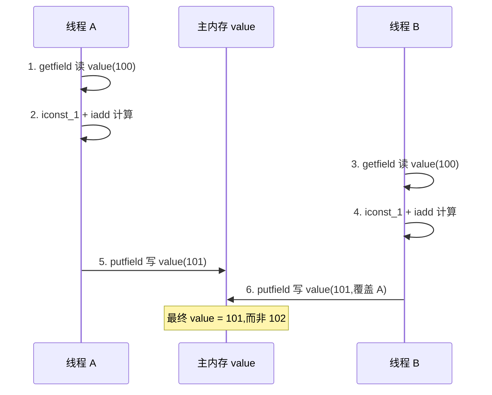
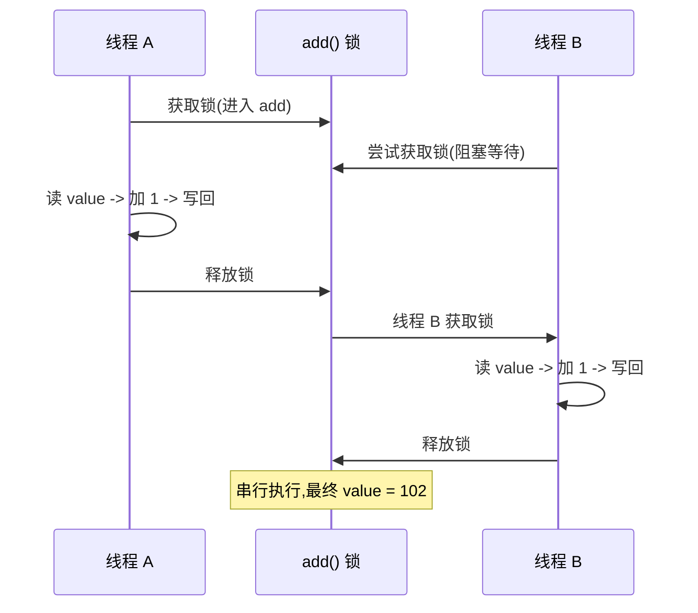

# Java内存模型

## 什么是 Java 内存模型

理解 Java 并发的底层原理依赖 Java 内存模型（JMM）知识，它是区分仅停留在并发工具使用层面与进一步知其所以然的分水岭。

## 容易混淆：JVM 内存结构 VS Java 内存模型

JVM 内存结构与 Java 内存模型是两个截然不同的概念，但名称相似容易混淆：

- **JVM 内存结构**：与 Java 虚拟机的运行时区域有关；
- **Java 内存模型**：与 Java 的并发编程有关。

### JVM 内存结构

Java 虚拟机在执行 Java 程序的过程中会把所管理的内存划分为若干个不同的数据区域。根据《Java 虚拟机规范（Java SE 8）》，JVM 运行时内存区域结构分为以下 6 个区：

- **堆区（Heap）**：存储类实例和数组，通常是内存中最大的一块。`new Object()` 生成实例，数组也是对象，同样保存在堆上。
- **虚拟机栈（Java Virtual Machine Stacks）**：保存局部变量和部分结果，在方法调用和返回中起作用。
- **方法区（Method Area）**：存储每个类的结构，如运行时常量池、字段和方法数据，以及方法和构造函数的代码，包括用于类初始化及接口初始化的特殊方法。
- **本地方法栈（Native Method Stacks）**：与虚拟机栈基本类似，区别在于本地方法栈为 Native 方法服务，而虚拟机栈为虚拟机执行的 Java 方法服务。
- **程序计数器（The PC Register）**：最小的一块内存区域，用于保存当前正在执行的 JVM 指令地址。
- **运行时常量池（Run-Time Constant Pool）**：方法区的一部分，包含多种常量，范围从编译时已知的数字到必须在运行时解析的方法和字段引用。

以上为 Java 虚拟机规范定义，不同虚拟机实现会各有不同，一般会遵守规范。

JVM 内存结构由 Java 虚拟机规范定义，描述的是 Java 程序执行过程中由 JVM 管理的不同数据区域，各区域有特定功能。

## 从 Java 代码到 CPU 指令

Java 代码最终要转化为 CPU 指令才能执行，大致流程如下：

- 编写的 Java 代码为 `*.java` 文件；
- 编译（含词法分析、语义分析等步骤）后，产生新的 Java 字节码文件（`*.class`）；
- JVM 分析字节码文件，并根据平台等因素转化为具体平台上的**机器指令**；
- 机器指令在 CPU 上运行，即最终的程序执行。

## 为什么需要 JMM

早期语言不存在内存模型概念。程序最终执行效果依赖具体处理器，而不同处理器规则不同、差异可能很大，同一段代码可能在处理器 A 上运行正常、在处理器 B 上结果却不一致。同理，没有 JMM 之前，不同 JVM 实现会带来不同的"翻译"结果。

Java 需要一个标准，让开发者、编译器工程师和 JVM 工程师达成一致，从而清楚知道什么样的代码能达到什么样的运行效果，使多线程运行结果可预期。这个标准就是 JMM。

JMM 的核心是研究从 Java 代码到 CPU 指令的转化过程需要遵守哪些与并发相关的原则和规范。如果不加规范，同样的 Java 代码可能产生不一样的执行效果，违背 Java"书写一次、到处运行"的特点。

## JMM 是什么

### JMM 是规范

JMM 是和多线程相关的**一组规范**，各 JVM 实现需遵守，以便开发者能更方便地开发多线程程序。这样即便同一个程序在不同虚拟机上运行，结果也是一致的。

JMM 与处理器、缓存、并发、编译器有关，解决了 CPU 多级缓存、处理器优化、指令重排等导致的结果不可预期问题。

### JMM 是工具类和关键字的原理

volatile、synchronized、Lock 等同步工具和关键字的原理都涉及 JMM。正是 JMM 的参与，各同步工具和关键字才能发挥作用。

例如写 synchronized，JVM 会在 JMM 规则下"翻译"出合适的指令，包括限制指令之间的顺序，以便即使在发生重排序的情况下也能保证必要的"可见性"，使不同 JVM 对相同代码的执行结果可预期。

JMM 里最重要的 3 点内容是：**重排序、原子性、内存可见性**。

---

## 指令重排序

### 什么是重排序

编写 Java 程序默认期望语句的实际运行顺序与代码顺序一致。但实际上，编译器、JVM 或 CPU 都可能出于优化目的，调整实际指令的执行顺序，这就是**重排序**。

## 重排序的好处：提高处理速度

以下面的代码为例，左侧是 3 行 Java 代码，右侧是这 3 行代码可能被转化成的指令：


`a = 100` 对应 `Load a`、`Set to 100`、`Store a`（从主存读取 a 的值、设为 100、存回）；`b = 5` 对应 `Load b`、`Set to 5`、`Store b`；`a = a + 10` 对应 `Load a`、`Set to 110`、`Store a`。存在两次 `Load a` 和两次 `Store a`，说明存在重排序的优化空间。

经过重排序后情况如下：


重排序后 a 的两次操作被放到一起，指令执行情况变为 `Load a`、`Set to 100`、`Set to 110`、`Store a`；与 b 相关的指令不变。这节省了一次 `Load a` 和一次 `Store a`。

重排序通过减少执行指令来提高整体运行速度，这就是重排序带来的优化和好处。

## 重排序的 3 种情况

（1）**编译器优化**：编译器（包括 JVM、JIT 编译器等）出于优化目的，把对同一数据的操作放到一起以提升效率、避免时间开销。重排序并非任意排序，需保证重排序后不改变单线程内的语义。

（2）**CPU 重排序**：CPU 通过乱序执行技术提高整体执行效率，优化方式与编译器类似。即使编译器不发生重排，CPU 也可能进行重排，开发时需考虑重排序的后果。

（3）**内存的"重排序"**：内存系统内不存在真正的重排序，但因缓存的存在（JMM 里表现为主存和本地内存），主存和本地内存内容可能不一致，导致程序表现出乱序行为。例如线程 1 修改 a 后未及时写回主存，或线程 2 未及时读到最新值，线程 2 看到 a 仍为初始值，却可能看到修改 a 之后代码的执行效果，表面看起来像发生了重排序。

参考：程晓明《深入理解 Java 内存模型》
 https://www.infoq.cn/article/java-memory-model-1/

---

## 原子操作的注意事项

### 什么是原子性和原子操作

具备原子性的操作称为原子操作。原子操作是一系列操作，要么全部发生，要么全部不发生，不会出现执行一半就终止的情况。

例如转账行为就是原子操作，包含扣除余额、银行系统生成转账记录、对方余额增加等一系列操作，这些操作被合并成一个原子操作，要么全部执行成功，要么全部不执行。不会出现"余额已扣除但对方余额不增加"的情况。具有原子性的原子操作天然具备线程安全特性。

`i++` 是不具备原子性的例子，这一行代码在 CPU 中可能变为以下 3 个指令：

- 第一步是读取；
- 第二步是增加；
- 第三步是保存。

这说明 `i++` 不具备原子性，也证明 `i++` 不是线程安全的。线程不安全的发生过程如下：


线程 1 先拿到 `i=1`，进行 `i+1`，但结果尚未保存就被切换走；CPU 执行线程 2 做同样的 `i++`，它拿到的 i 仍是 1（因为线程 1 的结果未保存）。随后线程 1 完成 `i+1` 的保存（结果为 2），线程 2 再保存 `i=2`。虽然两个线程都执行了 `i+1`，最终却保存了 `i=2` 而非期望的 `i=3`，发生线程安全问题，这是最典型的线程安全问题。

## Java 中的原子操作有哪些

Java 中具备原子性的操作如下：

- 除 `long` 和 `double` 之外的基本类型（`int`、`byte`、`boolean`、`short`、`char`、`float`）的读/写操作天然具备原子性；
- 所有引用 `reference` 的读/写操作；
- 加了 `volatile` 后，所有变量的读/写操作（包含 `long` 和 `double`）；
- `java.concurrent.Atomic` 包中一部分类的一部分方法具备原子性，如 `AtomicInteger` 的 `incrementAndGet` 方法。

## long 和 double 的原子性

`long` 和 `double` 与其他基本类型不同，可能不具备原子性。官方文档对此的描述如下：

**Non-Atomic Treatment of double and long**

For the purposes of the Java programming language memory model, a single write to a non-volatile long or double value is treated as two separate writes: one to each 32-bit half. This can result in a situation where a thread sees the first 32 bits of a 64-bit value from one write, and the second 32 bits from another write.

Writes and reads of volatile long and double values are always atomic.

Writes to and reads of references are always atomic, regardless of whether they are implemented as 32-bit or 64-bit values.

Some implementations may find it convenient to divide a single write action on a 64-bit long or double value into two write actions on adjacent 32-bit values. For efficiency's sake, this behavior is implementation-specific; an implementation of the Java Virtual Machine is free to perform writes to long and double values atomically or in two parts.

Implementations of the Java Virtual Machine are encouraged to avoid splitting 64-bit values where possible. Programmers are encouraged to declare shared 64-bit values as volatile or synchronize their programs correctly to avoid possible complications.

根据 JVM 规范，`long` 和 `double` 需占用 64 位内存空间，对 64 位值的写入可以分为两个 32 位的操作。一个整体的赋值操作可能被拆分为低 32 位和高 32 位两个操作，若在这两个操作之间发生其他线程对该值的读操作，就可能读到一个错误、不完整的值。

JVM 开发者可自由选择是否把 64 位 `long` 和 `double` 的读写操作作为原子操作实现，规范推荐 JVM 将其实现为原子操作。

规范规定，如果使用 `volatile` 修饰 `long` 和 `double`，其读写操作必须具备原子性。规范鼓励程序员使用 `volatile` 关键字控制这一问题。

## 实际开发中

实际开发中读取到"半个变量"的情况非常罕见，在目前主流的 Java 虚拟机中不会出现。JVM 规范虽不强制，但"强烈建议"虚拟机将 `long` 和 `double` 的写操作作为原子操作实现。目前各平台主流的虚拟机实现几乎都把 64 位数据的读写操作作为原子操作对待，因此编写代码时一般不需要为避免读到"半个变量"而把 `long` 和 `double` 声明为 `volatile`。

## 原子操作 + 原子操作 != 原子操作

简单地把原子操作组合在一起，并不能保证整体依然具备原子性。例如连续转账两次的操作，不能合并当做一个原子操作。虽然每次转账操作都具备原子性，但两次转账合为一次的组合不具备原子性，因为在两次转账之间可能插入其他操作（如系统自动扣费），导致第二次转账失败，且第二次失败不影响第一次成功。

---

## 内存可见性问题

### 案例一

```java
public class Visibility {

int x = 0;

public void write() {
        x = 1;
    }

public void read() {
        int y = x;
    }
}

```

类中有两个方法：

- `write`：给 x 赋值，将 x 赋值为 1，执行后改变 x 的值（初始为 0）；
- `read`：读取 x 的值，用新的 int 变量 y 接收。

假设两个线程分别执行 write 和 read 方法。由于 x 初始值为 0，两个线程都可从主内存获取到该信息：


当线程 1 先执行 write 方法，它把 x 从 0 改为 1，但该改动发生在线程 1 的工作内存中，而非主内存：


若线程 1 的工作内存尚未同步给主内存，此时线程 2 开始读取，读到的是 0 而非 1。线程 1 已改动 x，但线程 2 感知不到这个变化，这就产生了可见性问题。

### 案例二

```java
/**
 * 描述：     演示可见性带来的问题
 */
public class VisibilityProblem {

int a = 10;
    int b = 20;

private void change() {
        a = 30;
        b = a;
    }

private void print() {
        System.out.println("b=" + b + ";a=" + a);
    }

public static void main(String[] args) {
        while (true) {
            VisibilityProblem problem = new VisibilityProblem();
            new Thread(new Runnable() {
                @Override
                public void run() {
                    try {
                        Thread.sleep(1);
                    } catch (InterruptedException e) {
                        e.printStackTrace();
                    }
                    problem.change();
                }
            }).start();

new Thread(new Runnable() {
                @Override
                public void run() {
                    try {
                        Thread.sleep(1);
                    } catch (InterruptedException e) {
                        e.printStackTrace();
                    }
                    problem.print();
                }
            }).start();
        }
    }
}

```

类中有两个方法：

- `change`：把 a 改成 30，然后把 b 赋值为 a 的值；
- `print`：先打印 b 的值，再打印 a 的值。

main 中是一个 while 死循环，新建两个线程并让其先休眠 1 毫秒（使执行时间尽量靠近），再分别执行 change 和 print。

运行结果可能出现的情况：

- 第 1 种：执行 change 的线程先运行完毕，然后 print 线程运行，打印 `b=30;a=30`；
- 第 2 种：线程先 start 不代表先执行，print 线程先打印，此时打印初始值 `b=20;a=10`；
- 第 3 种：两线程几乎同时运行出现交叉。change 执行到一半，a 已改为 30、b 尚未修改时，print 线程开始打印，结果为 `b=20;a=30`。

有一种不易理解的情况是打印结果为 `b=30;a=10`，分析如下：

- 打印出 `b=30`，说明 `b = a` 已执行；
- `b = a` 执行要求 `a = 30` 也执行，b 才能等于 30；
- 这意味着 change 方法已执行完毕。

但此时打印 a 应为 30 而不应是 10。出现 `b=30;a=10` 意味着发生了**可见性问题：a 的值已被线程 1 修改，但其他线程看不到**，因 a 的最新值未能及时同步，所以打印出 a 的旧值。该情况发生几率不高，发生时的截屏如下：


## 解决问题

案例一可用 `volatile` 解决：给 x 加 volatile 修饰，其余代码不变。加了 volatile 后，只要线程 1 修改完 x 的值，线程 2 读取 x 时一定能读到最新值。

案例二同样可用 volatile 解决：给 a 和 b 加 volatile 后，无论运行多久都不会出现 `b=30;a=10`，因为 volatile 保证了只要 a、b 的值发生变化，读取的线程一定能感知到。

## 能够保证可见性的措施

除 volatile 外，synchronized、Lock、并发集合等工具都能在一定程度上保证可见性。保证可见性的时机和手段将在后文 happens-before 规则中详细展开。

### synchronized 不仅保证原子性，还保证可见性

synchronized 的完整保证是：不仅保证临界区内最多同时只有一个线程执行操作，还保证在前一个线程释放锁之后，之前所做的所有修改都能被获得同一个锁的下一个线程看到（读取到最新值）。若其他线程看不到之前所做的修改，依然会发生线程安全问题。

---

## 主内存与工作内存

### CPU 有多级缓存，导致读的数据过期

CPU 处理速度快，内存速度相对很慢。为提高 CPU 运行效率、减少空闲时间，CPU 与内存之间有 cache 层（缓存层）。缓存容量比内存小，但速度比内存快得多，其中 L1 缓存速度仅次于寄存器。结构示意图如下：


从下往上依次是内存、L3 缓存、L2 缓存、L1 缓存、寄存器，最上层是 CPU 的 4 个核心。越靠近核心，容量越小、速度越快。

线程间共享变量的可见性问题不是由多核直接引起，而是由 L3/L2/L1 等多级缓存引起：每个核心获取数据时从内存一层层向上读取，对数据的修改先写入自己的 L1 缓存，再等待时机逐层向下同步，最终刷回内存。

假设 core 1 修改变量 a 并写入其 L1 缓存，但未继续向下同步。core 1 有自己的 L1 缓存，core 4 无法直接读取 core 1 的 L1 缓存，此时 core 4 读取的 a 不是最新值，而是**过期**的值，从而引起多线程可见性问题。

## JMM 的抽象：主内存和工作内存

### 什么是主内存和工作内存

Java 作为高级语言，屏蔽了 L1/L2/L3 多层缓存的底层细节，用 JMM 定义了一套读写数据规范，只关心 JMM 抽象出的主内存和工作内存概念。可参考下图（来自程晓明《深入理解 Java 内存模型》https://www.infoq.cn/article/java-memory-model-1/）：


每个线程只能直接接触工作内存，无法直接操作主内存。工作内存中保存的是主内存共享变量的副本，主内存与工作内存之间的通信由 JMM 控制。

### 主内存和工作内存的关系

JMM 有以下规定：

（1）所有变量都存储在主内存中，每个线程拥有自己独立的工作内存，工作内存中的变量内容是主内存中该变量的拷贝；

（2）线程不能直接读/写主内存中的变量，但可以操作自己工作内存中的变量，再同步到主内存中，这样其他线程就可以看到本次修改；

（3）主内存由多个线程共享，线程间不共享各自的工作内存。线程间通信必须借助主内存中转来完成。

每个工作内存中的变量都是主内存变量的拷贝（副本），图中没有一条线可直接连接各工作内存，因为工作内存之间的通信都需要通过主内存中转。

由于所有共享变量都存在于主内存中，每个线程的工作内存存储的是变量副本，这个副本可能是过期的。例如变量 x 被线程 A 修改后，只要未同步到主内存，线程 B 就看不到，线程 B 读取到的 x 值就是过期值，导致可见性问题。

---

## happen-before 规则

### 什么是 happens-before 关系

Happens-before 关系用来描述与可见性相关的问题：如果第一个操作 happens-before 第二个操作（即二者之间满足 happens-before 关系），那么第一个操作对第二个操作一定是可见的，第二个操作执行时一定能看到第一个操作的执行结果。

### 不具备 happens-before 关系的例子

```java
public class Visibility {

int x = 0;

public void write() {
        x = 1;
    }

public void read() {
        int y = x;
    }
}

```

类中有 int x 变量（初始值 0），`write` 把 x 改写为 1，`read` 读取 x 的值。

两个线程分别执行 write 和 read 方法。由于两线程之间没有相互配合机制，write 和 read 内的代码不具备 happens-before 关系，可见性无法保证。例如线程 1 先执行 write 修改了 x，线程 2 再执行 read 读取 x 时，不确定能否读到线程 1 的修改：可能看到修改（读到 1），也可能看不到（读到 0）。既然存在不确定性，write 和 read 内的代码就不具备 happens-before 关系。

### Happens-before 关系的规则有哪些

用 `hb(x, y)` 表示 x happens-before y。

**（1）单线程规则**：在单独线程中，按程序代码顺序，先执行的操作 happen-before 后执行的操作。若操作 x 和 y 是同一线程内两个操作，且代码里 x 先于 y 出现，则 `hb(x, y)`：


该规则很重要，若同一线程内部后面语句都不能保证看见前面语句的执行结果，程序逻辑性就无法保证。

该规则与重排序不冲突。只要重排序后的结果依然符合 happens-before 关系（能保证可见性），就不限制重排序发生。例如单线程内语句 1 在语句 2 前，根据单线程规则语句 1 happens-before 语句 2，但语句 1 不一定在语句 2 前执行：若语句 1 修改变量 a、语句 2 与 a 无关，二者仍可能被重排序；若语句 2 正好读取 a，则语句 1 一定在语句 2 前执行。

**（2）锁操作规则（synchronized 和 Lock 接口等）**：若操作 A 是解锁，操作 B 是对同一个锁的加锁，则 `hb(A, B)`：


线程 A 解锁前的所有操作，对线程 B 对同一个锁加锁后的所有操作都是可见的。

**（3）volatile 变量规则**：对一个 volatile 变量的写操作 happen-before 后面对该变量的读操作。变量被 volatile 修饰后，每次修改后其他线程读取时一定能读到最新值。volatile 保证可见性正是由本条规则规定。

**（4）线程启动规则**：Thread 对象的 start 方法 happen-before 此线程 run 方法中的每一个操作：


子线程 B 在执行 run 方法内语句时，一定能看到父线程在执行 `threadB.start()` 前的所有操作的结果。

**（5）线程 join 规则**：线程 A 通过 `threadB.start()` 启动线程 B，再调用 `threadB.join()`，线程 A 将一直等待到线程 B 的 run 方法结束（不考虑中断等特殊情况），join 才返回。join 返回后，线程 A 中所有后续操作都能看到线程 B 的 run 方法中所有操作的结果，即线程 B 的 run 方法内操作 happens-before 线程 A 的 join 之后的语句：


**（6）中断规则**：对线程 interrupt 方法的调用 happens-before 检测该线程的中断事件。若一个线程被其他线程 interrupt，在检测中断时（如调用 `Thread.interrupted` 或 `Thread.isInterrupted`）一定能看到此次中断的发生，不会出现检测结果不准的情况。

**（7）并发工具类的规则**：

- 线程安全的并发容器（如 Hashtable）在 get 某个值时一定能看到在此之前发生的 put 等存入操作结果，即存入操作 happens-before 读取操作。
- 信号量（Semaphore）：释放许可证的操作 happens-before 获取许可证的操作，在获取前若有释放操作，获取时一定可以看到。
- Future：`get` 方法得到结果时，一定可以看到之前任务中所有操作的结果，即 Future 任务中的所有操作 happens-before Future 的 get 操作。
- 线程池：提交任务的操作 happens-before 任务的执行。

需要重点记忆的规则是**锁操作的 happens-before 规则**和 **volatile 的 happens-before 规则**，它们与 synchronized 和 volatile 的使用紧密相关。线程启动、线程 join、线程中断及并发工具类的 happens-before 规则可作一般了解，通常默认作为已知条件使用。

---

## volatile 与 synchronized 的对比

### volatile 是什么

volatile 是 Java 中的一个关键字，是一种同步机制。当共享变量被 volatile 修饰后，修改该变量值后再读取，能保证获取到修改后的最新值，而非过期值。

相比 synchronized 或 Lock，volatile 更轻量，使用 volatile 不会发生上下文切换等开销大的情况，不会让线程阻塞。但因其开销较小，能力也相对较小。

volatile 用于保证线程安全，但做不到 synchronized 那样的同步保护，仅在很有限的场景中发挥作用。

## volatile 的适用场合

### 不适用：a++

volatile 不适用于需要保证原子性的场景，如更新时依赖原来的值，最典型的是 `a++`，仅靠 volatile 不能保证其线程安全。代码如下：

```java
public class DontVolatile implements Runnable {

volatile int a;
    AtomicInteger realA = new AtomicInteger();

public static void main(String[] args) throws InterruptedException {
        Runnable r =  new DontVolatile();
        Thread thread1 = new Thread(r);
        Thread thread2 = new Thread(r);
        thread1.start();
        thread2.start();
        thread1.join();
        thread2.join();
        System.out.println(((DontVolatile) r).a);
        System.out.println(((DontVolatile) r).realA.get());
    }
    @Override
    public void run() {
        for (int i = 0; i < 1000; i++) {
            a++;
            realA.incrementAndGet();
        }
    }
}

```

代码中 volatile 修饰的 int a 与原子类 realA 做对比。两个线程各执行 1000 次累加，对 volatile a 和原子类 realA 都自加。一种运行结果：

```java
1988
2000

```

最终 a 和 realA 分别为 1988 和 2000。即使 a 被 volatile 修饰、共执行 2000 次自加（由原子类结果印证），仍有部分自加失效，结果不到 2000。这证明 volatile 不能保证原子性。

### 适用场合 1：布尔标记位

若共享变量自始至终只被各线程赋值或读取，而无复合操作（如读取并在此基础上修改），就可使用 volatile 代替 synchronized 或原子类。因为赋值操作本身具备原子性，volatile 又保证可见性，足以保证线程安全。

典型场景是布尔标记位，如 `volatile boolean flag`。boolean 标记位通常被直接赋值，不存在复合操作（如 a++），只有改变 flag 值的单一操作。flag 被 volatile 修饰后可保证可见性，一旦值变化所有线程立刻可见。

代码示例：

```java
public class YesVolatile1 implements Runnable {

volatile boolean done = false;
    AtomicInteger realA = new AtomicInteger();

public static void main(String[] args) throws InterruptedException {
        Runnable r =  new YesVolatile1();
        Thread thread1 = new Thread(r);
        Thread thread2 = new Thread(r);
        thread1.start();
        thread2.start();
        thread1.join();
        thread2.join();
        System.out.println(((YesVolatile1) r).done);
        System.out.println(((YesVolatile1) r).realA.get());
    }
    @Override
    public void run() {
        for (int i = 0; i < 1000; i++) {
            setDone();
            realA.incrementAndGet();
        }
    }

private void setDone() {
        done = true;
    }
}

```

与前一例不同处在于把 `volatile int a` 改为 `volatile boolean done`，循环中调用 `setDone()` 直接将 done 设为 true，而非根据原值做判断。运行结果：

```java
true
2000

```

无论运行多少次都打印 true 和 2000。2000 印证执行了 2000 次操作，true 证明该场景下 volatile 起到保证线程安全的作用。关键差异在于前一例是 `a++` 复合操作（不具备原子性），本例只是把 done 设为 true（赋值操作本身具备原子性）。

### 适用场合 2：作为触发器

用 volatile 作为触发器，保证其他变量的可见性。Brian Goetz 提供的经典例子：

```java
Map configOptions;
char[] configText;
volatile boolean initialized = false;

. . .

// In thread A

configOptions = new HashMap();
configText = readConfigFile(fileName);
processConfigOptions(configText, configOptions);
initialized = true;

. . .

// In thread B

while (!initialized)
  sleep();
// use configOptions

```

configOptions 为 map，configText 为 char 数组，initialized 是被 volatile 修饰的 boolean（初始 false）。线程 A 执行的四行代码代表初始化行为，完成后把 initialized 设为 true。线程 B 在 while 循环中反复 sleep，直到 initialized 变 true 才跳过并继续执行，随后立刻使用 configOptions，因此要求 configOptions 初始化完毕且初始化结果对线程 B 可见，否则可能报错。

若不使用 volatile，线程 B 读取 configOptions 时可能发生可见性问题。使用 volatile 修饰的 initialized 作为触发器可解决：

- 单线程规则：线程 A 中 configOptions 的初始化 happens-before 对 initialized 的写入；线程 B 中对 initialized 的读取 happens-before 对 configOptions 的使用。
- volatile 规则：线程 A 中对 initialized 写为 true happens-before 线程 B 随后对 initialized 的读取。
- happens-before 有可传递性：若 `hb(A, B)` 且 `hb(B, C)`，则可推出 `hb(A, C)`。

由此推出线程 A 中 configOptions 的初始化 happens-before 线程 B 中 configOptions 的使用。线程 B 既然看到 initialized 最新值，就能看到包括 configOptions 在内的变量初始化后的状态，使用 configOptions 是线程安全的。这就是把 volatile 变量作为触发器、保证其他变量可见性的用法。

## volatile 的作用

volatile 有两层作用。

**第一层：保证可见性**。happens-before 关系对 volatile 的描述是：对一个 volatile 变量的写操作 happen-before 后面对该变量的读操作。变量被 volatile 修饰后，每次修改后读取时一定能读到最新值。

**第二层：禁止重排序**。as-if-serial 语义：不管怎么重排序，（单线程）程序的执行结果不会改变。在满足 as-if-serial 语义前提下，由于编译器或 CPU 优化，代码实际执行顺序可能与编写顺序不同，单线程下没问题，但引入多线程后这种乱序可能导致严重线程安全问题。用 volatile 可在一定程度上禁止这种重排序。

## volatile 和 synchronized 的关系

- **相似性**：volatile 可看作轻量版 synchronized。若共享变量自始至终只被各线程赋值和读取、无其他操作，可用 volatile 代替 synchronized 或原子变量保证线程安全。对 volatile 字段的每次读取或写入类似于"半同步"——读取 volatile 与获取 synchronized 锁有相同内存语义，写入 volatile 与释放 synchronized 锁有相同语义。
- **不可代替**：多数情况下 volatile 不能代替 synchronized，volatile 没有提供原子性和互斥性。
- **性能方面**：volatile 属性的读写操作都是无锁的，无需花费时间在获取和释放锁上，因此性能更高，比 synchronized 性能更好。

---

## 双重检查锁模式与 volatile

### 什么是单例模式

单例模式保证一个类只有一个实例，并提供全局访问的入口。

### 为什么需要使用单例模式

**理由一：节省内存、节省计算。**很多情况下只需要一个实例，出现更多实例反而浪费。以初始化耗时的类为例：

```java
public class ExpensiveResource {
    public ExpensiveResource() {
        field1 = // 查询数据库
        field2 = // 然后对查到的数据做大量计算
        field3 = // 加密、压缩等耗时操作
    }
}

```

该类构造时需查询数据库并做大量计算。若数据库数据不变，可将对象保存在内存中直接复用，避免每次重新生成新实例造成浪费。

**理由二：保证结果的正确。**例如全局计数器统计人数，多个实例会造成混乱。

**理由三：方便管理。**工具类通常只需一个实例，通过统一入口（如 getInstance 方法）获取单例很方便。

一般单例模式的类结构如下：有一个私有的 Singleton 类型的 singleton 对象；构造方法为私有，防止他人调用构造函数生成实例；有一个 public 的 getInstance 方法用于获取单例：


### 双重检查锁模式的写法

单例模式有多种写法，与 volatile 强相关的是双重检查锁模式：

```java
public class Singleton {

private static volatile Singleton singleton;

private Singleton() {
    }

public static Singleton getInstance() {
        if (singleton == null) {
            synchronized (Singleton.class) {
                if (singleton == null) {
                    singleton = new Singleton();
                }
            }
        }
        return singleton;
    }
}

```

getInstance 方法首先进行 `if (singleton == null)` 检查，然后是 synchronized 同步块，再进行一次 `if (singleton == null)` 检查，最后执行 `singleton = new Singleton()`。

进行两次 `if (singleton == null)` 检查，故称"双重检查锁"。该写法可保证线程安全：两个线程同时到达 synchronized 语句块时，实例化代码只由先抢到锁的线程执行一次，后抢到锁的线程在第二个 if 中发现 singleton 不为 null，跳过创建实例。后续线程调用 getInstance 时只需判断第一次 if，跳过整个 if 块，直接返回实例。

优点：不仅线程安全，而且延迟加载、效率更高。

**为什么需要 double-check？去掉任何一次 check 行不行？**

- **第二次 check**：两个线程同时调用 getInstance，因 singleton 为空，两线程都通过第一重 if；由于锁机制，一个线程先进入同步语句并进入第二重 if，另一个线程在外面等待。当第一个线程执行完 `new Singleton()` 后退出 synchronized 区域，若没有第二重 `if (singleton == null)` 判断，第二个线程也会创建实例，破坏单例。
- **第一次 check**：若去掉它，所有线程都会串行执行，效率低下。

两个 check 都需要保留。

### 在双重检查锁模式中为什么需要使用 volatile

给 singleton 加 volatile 的原因在于 `singleton = new Singleton()` 并非原子操作，在 JVM 中至少做了以下 3 件事：


- 第一步：给 singleton 分配内存空间；
- 第二步：调用 Singleton 的构造函数等，初始化 singleton；
- 第三步：将 singleton 对象指向分配的内存空间（执行完这步 singleton 就不为 null）。

由于存在指令重排序优化，第 2 步和第 3 步的顺序不能保证，最终执行顺序可能是 1-2-3，也可能是 1-3-2。

如果是 1-3-2，则第 3 步执行完后 singleton 已不为 null，但第 2 步未执行，对象未完成初始化，属性值可能非预期值。此时线程 2 进入 getInstance 方法，因 singleton 已不为 null 会通过第一重检查并直接返回，但此时对象未完成初始化，使用该实例时会报错。流程如下：


线程 1 先执行分配内存空间（第一步），因被重排序执行了第三步（把 singleton 指向分配的内存地址），此后 singleton 不再为 null。线程 2 进入 getInstance 判断 singleton 不为 null，返回并直接使用未初始化对象，因此报错。最后线程 1 才执行第二步初始化对象，但为时已晚。

使用 volatile 后，表明该字段的更新可能在其他线程发生，应确保在读取另一个线程写入的值时可顺利执行所需操作。在 JDK 5 及后续版本使用的 JMM 中，使用 volatile 会在一定程度上禁止相关语句的重排序，避免因重排序导致读取到不完整对象的问题。

使用 volatile 的意义在于防止拿到未完成初始化的对象，从而保证线程安全。

参考：
小宝马的爸爸 - 梦想的家园《单例模式（Singleton）》：https://www.cnblogs.com/BoyXiao/archive/2010/05/07/1729376.html
Jark's Blog《如何正确地写出单例模式》：http://wuchong.me/blog/2014/08/28/how-to-correctly-write-singleton-pattern/
Hollis Chuang《为什么我墙裂建议大家使用枚举来实现单例》：https://www.hollischuang.com/archives/2498
Hollis Chuang《深度分析Java的枚举类型—-枚举的线程安全性及序列化问题》：https://www.hollischuang.com/archives/197

---

## 什么是 CAS

### CAS 简介

CAS 是原子类的底层原理，同时也是乐观锁的原理，面试常会考察乐观锁原理（即 CAS 相关问题）以及 CAS 的应用场景或缺点。

CAS 的英文全称是 **Compare-And-Swap**，中文叫"比较并交换"，是一种思想、一种算法。

多线程下各代码执行顺序不能确定，为保证并发安全可使用互斥锁。CAS 的特点在于避免使用互斥锁：多个线程同时用 CAS 更新同一变量时，只有一个线程能操作成功，其他线程更新失败。与同步互斥锁不同的是，更新失败的线程**不会被阻塞**，而是被告知因竞争导致操作失败，但可再次尝试。

CAS 广泛应用于并发编程领域，实现不会被打断的数据交换操作，从而实现无锁的线程安全。

## CAS 的思路

大多数处理器的指令中都实现了 CAS 相关的指令，一条指令即可完成"比较并交换"操作。因为是一条（而非多条）CPU 指令，CAS 相关指令具备原子性，组合操作在执行期间不会被打断，从而保证并发安全。该原子性由 CPU 保证，无需程序员操心。

CAS 有三个操作数：内存值 V、预期值 A、要修改的值 B。CAS 最核心的思路是：**仅当预期值 A 与当前内存值 V 相同时，才将内存值修改为 B**。

CAS 会提前假定当前内存值 V 等于 A（A 往往是之前读取到的 V 值）。执行 CAS 时，若发现当前内存值 V 恰好等于 A，则将内存值改成 B（B 通常是在拿到 A 后经计算得到的值）。若发现 V 不等于 A，说明在计算 B 的期间内存值已被其他线程修改，本次 CAS 不应再修改，可避免多人同时修改导致出错。

JDK 利用这些 CAS 指令实现并发的数据结构，如 AtomicInteger 等原子类。

利用 CAS 的无锁算法与互斥锁是两种完全不同的思路：CAS 采用乐观协商方式，此次没谈成可以重试；互斥锁不存在协商机制，线程抢占资源后会在操作完成前一直持有。二者都能保证并发安全，是实现同一目标的不同手段。

## 例子

用图解和例子使 CAS 过程更清晰：


两个线程分别使用两个 CPU 想改变变量的值。线程 1 使用 CPU 1 先执行，期望当前值是 100 并想改成 150。执行时检查当前值是否 100，发现确实是 100，改动成功，值从 100 变为 150：


线程 2 使用 CPU 2 执行，想把值从 100 改成 200，希望当前值为 100，但实际当前值是 150。它发现当前值不是期望值，不会真正把 100 改成 200，此次修改失败，CAS 操作失败。

线程 2 后续可根据业务需求决定操作，如重试、报错或跳过执行。例如秒杀场景，多个线程同时秒杀，只要一个执行成功即可，其他线程发现 CAS 失败说明已有线程成功，无需继续执行，这是跳过操作。

## CAS 的语义

CAS 的等价语义代码如下：

```java
/**
 * 描述：     模拟CAS操作，等价代码
 */

public class SimulatedCAS {

private int value;

public synchronized int compareAndSwap(int expectedValue, int newValue) {
        int oldValue = value;
        if (oldValue == expectedValue) {
            value = newValue;
        }
        return oldValue;
    }
}

```

compareAndSwap 方法有两个入参：**第 1 个是期望值 expectedValue，第 2 个是 newValue**（计算好的新值，希望更新到变量上）。

方法被 **synchronized** 修饰，用同步方法为 CAS 的等价代码保证原子性。方法内先通过 `int oldValue = value` 拿到当前值，然后用 `if (oldValue == expectedValue)` 比较当前值与期望值：若相等，说明当前值正是期望值，可进行 swap，把 value 改为 newValue，最后返回 oldValue。

CAS 的核心思想体现在该流程中：compare 指 if 里的比较（oldValue 是否等于 expectedValue），swap 指把 value 改成 newValue 并返回 oldValue。整个 compareAndSwap 方法还原了 CAS 的语义，象征 CAS 指令在背后的工作。

## 案例演示：两个线程竞争 CAS，其中一个落败

以下代码演示 CAS 在两个线程竞争时的情况：

```java
public class DebugCAS implements Runnable {

private volatile int value;

public synchronized int compareAndSwap(int expectedValue, int newValue) {
        int oldValue = value;
        if (oldValue == expectedValue) {
            value = newValue;
            System.out.println("线程"+Thread.currentThread().getName()+"执行成功");
        }
        return oldValue;
    }

public static void main(String[] args) throws InterruptedException {
        DebugCAS r = new DebugCAS();
        r.value = 100;
        Thread t1 = new Thread(r,"Thread 1");
        Thread t2 = new Thread(r,"Thread 2");
        t1.start();
        t2.start();
        t1.join();
        t2.join();
        System.out.println(r.value);
    }

@Override
    public void run() {
        compareAndSwap(100, 150);
    }
}

```

compareAndSwap 是 CAS 等价语义的代码，并增加了一行打印（执行成功时打印哪个线程成功）。main 中把 value 设为 100，新建 t1、t2 两个线程并启动，主线程等待后打印最终 value。两个线程 run 中都执行 compareAndSwap，期望值 100、目标值 150。可预见只有一个线程执行成功，另一个不打印"执行成功"，因为它执行时发现值已被修改、不再是 100。

不打断点直接执行的运行结果：

```java
线程Thread 1执行成功
150

```

Thread 1 执行成功，最终结果为 150。打印"Thread 1 执行成功"的概率比打印"Thread 2 执行成功"大，因为 Thread 1 先 start。

用 debug 观察内部执行。在 `if (oldValue == expectedValue){` 行打断点并 Debug 运行：


程序停留在断点处，当前是 Thread 1（Debugger 中可看到当前线程名和状态），Thread 2 的状态是 Monitor（对应 Java 线程的 Blocked 状态），表示未拿到 synchronized 锁，正在外面等待。

Thread 1 进入 compareAndSwap 方法，oldValue 为 100，expectedValue 也为 100，二者相等。继续单步运行，满足 if 条件进入 if 语句，把 value 改为 newValue（150）：


修改完成后打印"线程Thread 1执行成功"：


继续执行轮到 Thread 2：


**oldValue 拿到的是 150**（value 已被 Thread 1 修改），150 与 Thread 2 期望的 100 不相等，跳过整个 if 语句，不打印"Thread 2 执行成功"，返回 oldValue 且未做任何修改。

两个线程执行完毕，控制台只打印"Thread 1 执行成功"：


以上通过 debug 展示了两个线程竞争 CAS 时一个成功、另一个失败的情况。

---

## CAS 与乐观锁

### 并发容器

Doug Lea 在 **JUC** 包中大量使用 CAS 技术，既能保证安全性，又无需互斥锁，能大幅提升工具类性能。以下两个例子展示 CAS 在并发容器中的使用。

### 案例一：ConcurrentHashMap

截取 ConcurrentHashMap 的部分 putVal 方法代码：

```java
final V putVal(K key, V value, boolean onlyIfAbsent) {
    if (key == null || value == null) throw new NullPointerException();
    int hash = spread(key.hashCode());
    int binCount = 0;
    for (Node<K,V>[] tab = table;;) {
        Node<K,V> f; int n, i, fh;
        if (tab == null || (n = tab.length) == 0)
            tab = initTable();
        else if ((f = tabAt(tab, i = (n - 1) & hash)) == null) {
            if (casTabAt(tab, i, null,
                         new Node<K,V>(hash, key, value, null)))
                break;                   // no lock when adding to empty bin
        }
    //以下部分省略
    ...
}

```

casTabAt 方法名带 "CAS"，其代码实现：

```java
static final <K,V> boolean casTabAt(Node<K,V>[] tab, int i,
                                    Node<K,V> c, Node<K,V> v) {
    return U.compareAndSwapObject(tab, ((long)i << ASHIFT) + ABASE, c, v);
}

```

方法内只有一行代码，调用变量 U 的 **compareAndSwapObject** 方法。U 的定义：

```java
private static final sun.misc.Unsafe U
```

U 是 **Unsafe** 类型，Unsafe 类包含 compareAndSwapInt、compareAndSwapLong、compareAndSwapObject 等与 CAS 密切相关的 native 层方法，底层正是利用 CPU 对 CAS 指令的支持实现。

casTabAt 方法不仅用于 ConcurrentHashMap 的 putVal 方法，还用于 merge、compute、computeIfAbsent、transfer 等重要方法，ConcurrentHashMap 对 CAS 的应用较为广泛。

### 案例二：ConcurrentLinkedQueue

非阻塞并发队列 ConcurrentLinkedQueue 的 offer 方法中也有 CAS 的使用：

```java
public boolean offer(E e) {
    checkNotNull(e);
    final Node<E> newNode = new Node<E>(e);

for (Node<E> t = tail, p = t;;) {
        Node<E> q = p.next;
        if (q == null) {
            if (p.casNext(null, newNode)) {
                if (p != t)
                    casTail(t, newNode);
                return true;
            }
        }
        else if (p == q)
            p = (t != (t = tail)) ? t : head;
        else
            p = (p != t && t != (t = tail)) ? t : q;
    }
}

```

offer 方法中有一个 for 死循环，其中 casNext 方法用于更新节点。若 p 的 casNext 执行失败，casNext 返回 false，代码会在 for 循环中进行下一次尝试。可见 ConcurrentLinkedQueue 的 offer 方法使用了 CAS。

## 数据库

数据库中也存在对乐观锁和 CAS 思想的应用。更新数据时可用 version 字段实现乐观锁和 CAS 操作，获取和修改数据时都不需加悲观锁。

**具体思路**：获取完数据并计算完毕后准备更新时，检查当前版本号与之前获取时的版本号是否一致。若一致，说明计算期间数据未被更新，可直接更新；若不一致，说明计算期间已有其他线程修改过数据，可重新获取、重新计算，再次尝试更新。

假设取出数据时 version 为 1，相应 SQL 语句示例如下：

```sql
UPDATE student SET name = '小王', version = 2 WHERE id = 10 AND version = 1
```

用 CAS 思想实现更新操作：先比较 version 是否仍为最初获取的 1，若相同才修改 name 字段，同时把 version 加 1。

## 原子类

原子类（如 AtomicInteger）也使用了 CAS。AtomicInteger 的 getAndAdd 方法：

```java
public final int getAndAdd(int delta) {
    return unsafe.getAndAddInt(this, valueOffset, delta);
}

```

return 的是 Unsafe 的 getAndAddInt 方法的执行结果。getAndAddInt 的具体实现：

```java
public final int getAndAddInt(Object var1, long var2, int var4) {
    int var5;
    do {
        var5 = this.getIntVolatile(var1, var2);
    } while(!this.compareAndSwapInt(var1, var2, var5, var5 + var4));
    return var5;
}

```

方法中 `getIntVolatile(var1, var2)` 是 native 方法，作用是获取变量 var1 中偏移量 var2 处的值。var1 传入 AtomicInteger 对象引用，var2 是 value 的偏移量 valueOffset，因此 var5 代表当前时刻原子类中存储的数值。

**compareAndSwapInt** 传入的多个参数分别代表 object、offset、expectedValue 和 newValue：

- 第一个参数 object 是将要修改的对象，传入 this（AtomicInteger 对象本身）；
- 第二个参数是 offset（偏移量），借助它获取 value 的数值；
- 第三个参数 expectedValue（"期望值"），传入刚才获取的 var5；
- 最后一个参数 newValue 是希望修改的新值，等于 var5 加上 var4，而 var4 是传入的 delta（如 +1 或 -1）。

compareAndSwapInt 的作用是：若原子类中 value 的值与之前获取的 var5 相等，就把计算出的 `var5 + var4` 更新上去，这行代码实现了 CAS 过程。

CAS 成功则退出 while 循环；若失败，说明获取 var5 之后、CAS 之前 value 已发生变化，证明有其他线程修改过该变量。此时再次执行循环体，重新获取 var5（最新原子变量值）并再次用 CAS 尝试更新，直到成功为止，因此这是一个死循环。

总结：Unsafe 的 getAndAddInt 方法通过**循环 + CAS** 实现，用 compareAndSwapInt 尝试更新 value，失败则重新获取再次尝试，直到更新成功。

---

## CAS 的缺点

CAS 有优点（避免加互斥锁、提高运行效率），也有明显缺点。使用 CAS 时应同时考虑其优缺点，合理进行技术选型。

## ABA 问题

CAS 最大的缺点是 ABA 问题。

CAS 决定是否 swap 的判断标准是"当前的值和预期的值是否一致"，若一致就认为期间数值没有变动，这在多数情况下没问题。

但在某些业务场景下，需要确切知道**从上一次看到这个值以来至今，这个值是否发生过变化**。例如值从 A 变成 B，再由 B 变回 A，此时不仅发生了变化，而且变化了两次。

在这种场景下使用 CAS 看不到这两次变化，因为 CAS 只比较当前值与预期值是否相等：如果值从旧值 A 变成新值 B 再变回旧值 A，因最初的值 A 和现在的值 A 相等，CAS 会认为期间**没有发生变化**。**CAS 并不能检测出期间值是否被修改过，它只能检查出现在值和最初值是否一样。**

举例：第一个线程拿到的初始值是 100 并开始计算，计算过程中第二个线程把值改为 200，随后第三个线程把 200 改回 100。第一个线程计算完毕执行 CAS 时比较当前值是否等于初始值 100，发现确实等于 100，便认为期间值未被修改，把 100 改成计算出的新值。但实际上期间已有其他线程修改过该值，这就发生了 **ABA 问题**。

发生 ABA 问题后，线程一无法知晓计算过程中是否有其他线程修改过值，它会按"期间值未被修改过"的逻辑处理（例如打印"本次修改十分顺利"），而它本应触发其他逻辑（如打印"本次修改过程受到了干扰"）。

**解决方式：添加版本号。**在变量值自身之外再添加一个版本号，值的变化路径从 `A→B→A` 变成 `1A→2B→3A`，通过对比版本号判断值是否变化过，比直接对比两个值更可靠。

atomic 包提供了 **AtomicStampedReference** 类专门解决 ABA 问题，思路正是利用版本号。AtomicStampedReference 维护类似 `<Object,int>` 的数据结构，int 用于计数（版本号），可对对象和 int 版本号同时进行原子更新。判断是否被修改过以版本号是否变化为标准，即使值一样，版本号也不同。

## 自旋时间过长

CAS 的第二个缺点是自旋时间过长。

由于单次 CAS 不一定能执行成功，**CAS 往往配合循环实现**，有时甚至是死循环不停重试，直到线程竞争不激烈时才能修改成功。

若应用场景本身是高并发，CAS 可能一直操作不成功，导致**循环时间越来越长**，期间 CPU 资源持续被消耗，对性能产生很大影响。因此需根据实际情况选择是否使用 CAS，在高并发场景下 CAS 效率通常不高。

## 范围不能灵活控制

CAS 的第三个缺点是不能灵活控制线程安全的范围。

通常执行 CAS 是针对某一个共享变量（Integer、Long、对象类型等），不能同时对多个共享变量进行 CAS 操作，因为多个变量之间是独立的，简单把原子操作组合起来并不具备原子性。若想对多个对象同时进行 CAS 操作并保证线程安全，比较困难。

**解决方案**：利用一个新的类整合这一组共享变量（类的多个成员变量就是那多个共享变量），再通过 atomic 包的 AtomicReference 把新对象整体进行 CAS 操作，从而保证线程安全。

相比之下，使用其他线程安全技术调整线程安全范围可能更容易，例如用 synchronized 时，只需把更多代码放进同步代码块即可加锁。

## JMM 与 JVM 的区别（深入）

### JMM 概念

JVM 的内存布局（见《JVM内存区域与垃圾回收》）是 JVM 的**数据存储模型**；

在 JVM 的内存布局中，Java 的虚拟机栈与线程相关，字节码指令靠操作栈完成。

```java
import java.util.stream.IntStream;

public class JMMDemo {
    int value = 0;

void add() {
        value++;
    }

public static void main(String[] args) throws Exception {
        final int count = 100000;
        final JMMDemo demo = new JMMDemo();
        Thread t1 = new Thread(() -> IntStream.range(0, count).forEach((i) -> demo.add()));
        Thread t2 = new Thread(() -> IntStream.range(0, count).forEach((i) -> demo.add()));

t1.start();
        t2.start();
        t1.join();
        t2.join();

        System.out.println(demo.value);
    }
}
```

上面的代码没有任何同步块，每个线程单独运行后，都会对 value 加 10 万，但执行之后，大概率不会输出 20 万。深层次的原因，将使用 javap 命令从字节码层面找一下。

```
void add();
    descriptor: ()V
    flags:
    Code:
      stack=3, locals=1, args_size=1
         0: aload_0
         1: dup
         2: getfield      #2                  // Field value:I
         5: iconst_1
         6: iadd
         7: putfield      #2                  // Field value:I
        10: return
      LineNumberTable:
        line 7: 0
        line 8: 10
      LocalVariableTable:
        Start  Length  Slot  Name   Signature
            0      11     0  this   LJMMDemo;
```

着重看一下 **add** 方法，可以看到一个简单的 **i++** 操作，竟然有这么多的字节码，而它们都是按照"顺序执行"的。当它自己执行的时候不会有什么问题，但是如果放在多线程环境中，执行顺序就变得不可预料了。



上图展示了这个乱序的过程。线程 A 和线程 B"并发"执行相同的代码块 add，执行的顺序如图中的标号，它们在线程中是有序的（1、2、5 或者 3、4、6），但整体顺序是不可预测的。

线程 A 和 B 各自执行了一次加 1 操作，但在这种场景中，线程 B 的 putfield 指令直接**覆盖**了线程 A 的值，最终 value 的结果是 101。

上面的示例仅仅是字节码层面上的，更加复杂的是，CPU 和内存之间同样存在一致性问题。很多人认为 CPU 是一个计算组件，并没有数据一致性的问题。但事实上，由于内存的发展速度跟不上 CPU 的更新，在 CPU 和内存之间，存在着多层的高速缓存。

原因就是由于多核所引起的，这些高速缓存往往会有多层。如果一个线程的时间片跨越了多个 CPU，那么同样存在同步的问题。

另外，在执行过程中，CPU 可能也会对输入的代码进行乱序执行优化，Java 虚拟机的即时编译器也有类似的指令重排序优化。整个函数的执行步骤就分的更加细致，看起来非常的**碎片化**（比字节码指令要细很多）。


**不管是字节码的原因，还是硬件的原因，在粗粒度上简化来看，比较浅显且明显的因素，那就是线程 add 方法的操作并不是原子性的。**

为了解决这个问题，可以在 add 方法上添加 synchronized 关键字，它不仅保证了内存上的同步，而且还保证了 CPU 的同步。这个时候，各个线程只能排队进入 add 方法，也能够得到期望的结果 102。

```
synchronized void add() {
    value++;
}
```



到这里，Java 的内存模型就呼之欲出了。JMM 是一个抽象的概念，它描述了一系列的规则或者规范，用来解决多线程的共享变量问题，比如 volatile、synchronized 等关键字就是围绕 JMM 的语法。这里所说的变量，包括实例字段、静态字段，但不包括局部变量和方法参数，因为后者是线程私有的，不存在竞争问题。

JVM 试图定义一种统一的内存模型，能将各种底层硬件，以及操作系统的内存访问差异进行封装，使 Java 程序在不同硬件及操作系统上都能达到相同的并发效果。

## JMM 的结构

JMM 分为主存储器（Main Memory）和工作存储器（Working Memory）两种。

- 主存储器是实例位置所在的区域，所有的实例都存在于主存储器内。比如，实例所拥有的字段即位于主存储器内，主存储器是所有的线程所共享的。

- 工作存储器是线程所拥有的作业区，每个线程都有其专用的工作存储器。工作存储器存有**主存储器**中必要部分的拷贝，称之为工作拷贝（Working Copy）。

在这个模型中，线程无法对主存储器**直接**进行操作。如下图，线程 A 想要和线程 B 通信，只能通过主存进行交换。

```mermaid
flowchart LR
  subgraph Main[主存储器 Main Memory]
    Shared[共享变量(如 value)]
  end
  subgraph TA[线程 A 工作内存]
    copyA[工作拷贝 valueA]
  end
  subgraph TB[线程 B 工作内存]
    copyB[工作拷贝 valueB]
  end
  TA -->|读/写 read-load| Shared
  TB -->|读/写 read-load| Shared
  Shared -->|store-write| TA
  Shared -->|store-write| TB
```

**通信方式**：线程 A 与线程 B 不能直接通信，只能各自把共享变量拷贝到自己的工作内存，操作后再写回主存，通过主存完成间接通信（即 JMM 规定的 read/load/use/assign/store/write 操作）。

那这些内存区域都是在哪存储的呢？如果非要有个对应的话，可以认为主存中的内容是 Java 堆中的对象，而工作内存对应的是虚拟机栈中的内容。但实际上，主内存也可能存在于高速缓存，或者 CPU 的寄存器上；工作内存也可能存在于硬件内存中，不用太纠结具体的存储位置。

## 8 个 Action

### 操作类型

为了支持 JMM，Java 定义了 8 种原子操作（Action），用来控制主存与工作内存之间的交互（该 8 操作模型源自早期 JLS 对内存模型的定义，JSR 133 之后的现行 JMM 表述更为抽象，但主存/工作内存的交互仍沿用这一模型讲解）。

（1）**read**（读取）作用于主内存，它把变量从主内存传动到线程的工作内存中，供后面的 load 动作使用。

（2）**load**（载入）作用于工作内存，它把 read 操作的值放入到工作内存中的变量副本中。

（3）**store**（存储）作用于工作内存，它把工作内存中的一个变量传送给主内存中，以备随后的 write 操作使用。

（4）**write** （写入）作用于主内存，它把 store 传送值放到主内存中的变量中。

（5）**use**（使用）作用于工作内存，它把工作内存中的值传递给执行引擎，每当虚拟机遇到一个需要使用这个变量的指令时，将会执行这个动作。

（6）**assign**（赋值）作用于工作内存，它把从执行引擎获取的值赋值给工作内存中的变量，每当虚拟机遇到一个给变量赋值的指令时，执行该操作。

（7）**lock**（锁定）作用于主内存，把变量标记为线程独占状态。

（8）**unlock**（解锁）作用于主内存，它将释放独占状态。


如上图所示，把一个变量从主内存复制到工作内存，就要顺序执行 read 和 load；而把变量从工作内存同步回主内存，就要顺序执行 store 和 write 操作。

## 三大特征

**（1）原子性**

JMM 保证了 read、load、assign、use、store 和 write 六个操作具有原子性，可以认为除了 long 和 double 类型以外，对其他基本数据类型所对应的内存单元的访问读写都是原子的。

如果想要一个颗粒度更大的原子性保证，就可以使用 lock 和 unlock 这两个操作。

**（2）可见性**

可见性是指当一个线程修改了共享变量的值，其他线程也能立即感知到这种变化。

从前面的图中可以看到，要保证这种效果，需要经历多次操作。一个线程对变量的修改，需要先同步给主内存，赶在另外一个线程的读取之前刷新变量值。

volatile、synchronized、final 和锁，都是保证可见性的方式。

这里要着重提一下 volatile，因为它的特点最显著。使用了 volatile 关键字的变量，每当变量的值有变动时，都会把更改立即同步到主内存中；而如果某个线程想要使用这个变量，则先要从主存中刷新到工作内存上，这样就确保了变量的可见性。

而锁和同步关键字就比较好理解一些，它是把更多个操作强制转化为原子化的过程。由于只有一把锁，变量的可见性就更容易保证。

**（3）有序性**

Java 程序很有意思，从上面的 add 操作可以看出，如果在线程中观察，则所有的操作都是有序的；而如果在另一个线程中观察，则所有的操作都是无序的。

除了多线程这种无序性的观测，无序的产生还来源于**指令重排**。

指令重排序是 JVM 为了优化指令，来提高程序运行效率的，在不影响单线程程序执行结果的前提下，按照一定的规则进行指令优化。在某些情况下，这种优化会带来一些执行的逻辑问题，在并发执行的情况下，按照不同的逻辑会得到不同的结果。

可以看一下 Java 语言中默认的一些"有序"行为，也就是**先行发生**（**happens-before）**原则，这些可能在写代码的时候没有感知，因为它是一种默认行为。

先行发生是一个非常重要的概念，如果操作 A 先行发生于操作 B，那么操作 A 产生的影响能够被操作 B 感知到。

下面的原则是**《Java 并发编程实践》**这本书中对一些法则的描述。

- **程序次序：**一个线程内，按照代码顺序，写在前面的操作先行发生于写在后面的操作。

- **监视器锁定：**unLock 操作先行发生于后面对同一个锁的 lock 操作。

- **volatile：**对一个变量的写操作先行发生于后面对这个变量的读操作。

- **传递规则：**如果操作 A 先行发生于操作 B，而操作 B 又先行发生于操作 C，则可以得出操作 A 先行发生于操作 C。

- **线程启动：**对线程 start() 的操作先行发生于线程内的任何操作。

- **线程中断：**对线程 interrupt() 的调用先行发生于线程代码中检测到中断事件的发生，可以通过 Thread.interrupted() 方法检测是否发生中断。

- **线程终结规则：**线程中的所有操作先行发生于检测到线程终止，可以通过 Thread.join()、Thread.isAlive() 的返回值检测线程是否已经终止。

- **对象终结规则：**一个对象的初始化完成先行发生于它的 finalize() 方法的开始。

## 内存屏障

上面提到的这么多规则和特性，是靠什么保证的呢？

内存屏障（Memory Barrier）用于控制在特定条件下的重排序和内存可见性问题。JMM 内存屏障可分为读屏障和写屏障，Java 的内存屏障实际上也是上述两种的组合，完成一系列的屏障和数据同步功能。Java 编译器在生成字节码时，会在执行指令序列的适当位置插入内存屏障来限制处理器的重排序。

下面介绍一下这些组合。

**Load-Load Barriers**

保证 load1 数据的装载优先于 load2 以及所有后续装载指令的装载。对于 Load Barrier 来说，在指令前插入 Load Barrier，可以让高速缓存中的数据失效，强制重新从主内存加载数据。

```
load1
LoadLoad
load2
```

**Load-Store Barriers**

保证 load1 数据装载优先于 store2 以及后续的存储指令刷新到内存。

```
load1
LoadStore
store2
```

**Store-Store Barriers**

保证 store1 数据对其他处理器可见，优先于 store2 以及所有后续存储指令的存储。对于 Store Barrier 来说，在指令后插入 Store Barrier，能让写入缓存中的最新数据更新写入主内存，让其他线程可见。

```
store1
StoreStore
store
```

**Store-Load Barriers**

在 Load2 及后续所有读取操作执行前，保证 Store1 的写入对所有处理器可见。这条内存屏障指令是一个全能型的屏障，它同时具有其他 3 条屏障的效果，而且它的开销也是四种屏障中最大的一个。

```
store1
StoreLoad
load2
```

## 版本差异(旧版 → Java 21)

| 特性 | 旧版(Java 8/11) | Java 21 |
|------|----------------|---------|
| JMM 规范 | JSR 133（Java 5+） | 不变；JMM 核心语义在 Java 21 依然成立 |
| volatile | 可见性 + 有序性 | 不变；虚拟线程同样遵循 JMM |
| 内存屏障 | 编译器插入 | 不变；JVM 层面对虚拟线程同样生效 |
| 虚拟线程可见性 | 无 | 虚拟线程与平台线程共享同一 JMM 规则 |

> **说明**：JMM（Java 内存模型）是语言规范，不随 JDK 版本频繁变化。Java 21 引入的虚拟线程仍运行在普通 JVM 内存模型之上，volatile/synchronized/内存屏障规则完全适用。
