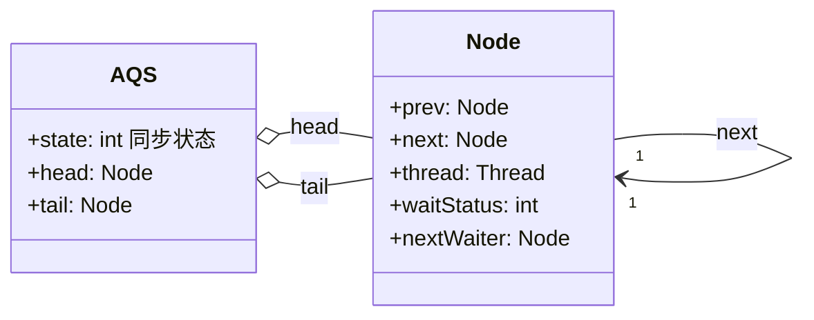

# AQS与并发工具总结

## AQS 的作用与重要性

### AQS 的重要性

AQS（AbstractQueuedSynchronizer）被广泛应用在 JUC 工具类中：


AQS 在 **ReentrantLock、ReentrantReadWriteLock、Semaphore、CountDownLatch、ThreadPoolExecutor 的 Worker** 中都有运用（JDK 1.8），是这些类的底层原理。JUC 包中很多重要工具类背后都离不开 AQS 框架。

### 学习 AQS 的思路

AQS 内部结构比一般类**复杂得多**，直接读源码容易陷入细节。业务开发者通常**不会直接使用 AQS 开发**——JDK 已提供封装好的线程协作工具类（如 ReentrantLock、Semaphore，内部用到 AQS），基本覆盖大部分业务场景。学习 AQS 的目的是理解其背后的**原理**、学习**设计思想**，**提高技术并应对面试**。应从宏观角度解读 AQS（为什么需要、有什么作用），再分析内部结构。

### 锁和协作类有共同点：阀门功能

ReentrantLock 和 Semaphore 有共同点，都可当作阀门使用。把 Semaphore 许可证数量设为 1，只能允许一个线程通过，前一个线程归还后允许其他线程获取；这与 ReentrantLock 只有单线程能获得锁、释放后允许其他线程获得一致。当线程发现没有额外许可证或得不到锁时会被阻塞，等到有许可证或锁释放后被唤醒。CountDownLatch、ReentrantReadWriteLock 等工具类也有类似的线程"协作"功能，背后都利用 AQS 实现。

### 为什么需要 AQS

这些协作类有很多类似工作。把实现类似工作的代码提取为底层工具类（框架），即可直接用它构建上层代码，这个工具类就是 AQS。有了 AQS，ReentrantLock 和 Semaphore 等工具类**不需关心线程调度细节**，只需实现各自的设计逻辑。

### 如果没有 AQS

若没有 AQS，每个线程协作工具类需自己实现：

- **状态的原子性管理**（不同工具类含义不同，如 ReentrantLock 维护**锁被重入的次数**，该变量被多线程同时操作需保证线程安全）；
- **线程的阻塞与解除阻塞**（未抢到锁的线程需阻塞排队，在合适时机唤醒）；
- **队列的管理**。

让每个工具类自己正确高效实现这些内容相当有难度。AQS 统一封装这类通用且复杂的逻辑，ReentrantLock 和 Semaphore 等只需关注自己特有的业务逻辑。

### AQS 与工具类的分工：HR 与面试官类比

将 **AQS 和线程协作工具类比作 HR 和面试官**。面试有群面（多人一起，如凑齐 10 人再面试）和单面（流水线一对一，5 个面试官并行，候选人排队、面试完跟进）。

群面和单面有很多相同流程（签到、就坐等待、排队、按序叫号、确保所有人被叫到），这些都由 HR 负责，可**比作 AQS 承担的工作**；具体面试规则（群面人数、单面或群面）由面试官安排。

- **面试官**对应利用 AQS 实现具体协作逻辑的工具类；
- **HR** 代表 AQS。让候选人休息即把线程阻塞、不持续耗费 CPU；叫号面试即唤醒线程。

群面流程类似 CountDownLatch（设置初始倒数次数，每来一个计数减 1，凑齐后开始面试）；单面可理解为 Semaphore 信号量（N 个许可证，线程先获取再归还）。CountDownLatch 和 Semaphore 只需确定自己的"要人"规则，剩下调度线程等工作交给 AQS，**各自职责独立分明**。

### AQS 的作用

**AQS 是一个用于构建锁、同步器等线程协作工具类的框架**。有了 AQS，很多线程协作工具类可方便写出，让上层开发极大减少工作量、避免重复造轮子，也避免上层处理不当导致的线程安全问题。

### 总结

利用 AQS 可方便实现线程协作工具类，AQS 被广泛应用在 JUC 包中。

---

## AQS 的内部原理

### AQS 内部原理解析

AQS 内部复杂、代码很长，需抓住重点。其最核心的三大部分为**状态**、**队列**和**期望协作工具类去实现的获取/释放等重要方法**。

### state 状态

AQS 用 `state` 变量管理状态：

```java
/**
 * The synchronization state.
 */
private volatile int state;
```

`state` 的含义**根据具体实现类的作用不同而表示不同含义**：

- **信号量**：表示剩余**许可证的数量**。初始 `state=10` 代表 10 个许可证，取走一个变为 9，相当于内部计数器。
- **CountDownLatch**：表示需要"倒数"的数量。初始设 5，每次调用 `countDown` 减 1，减到 0 表示门闩放开。
- **ReentrantLock**：表示**锁的占有情况**。初始 0 表示无线程占有；变为 1 表示被某线程持有。ReentrantLock 可重入，同一线程多次获取时 `state` 递增，表示重入次数；释放时逐步递减，只有减到 0 才表示无线程持有、锁处于释放状态。

未来新工具利用 AQS 时，也需利用 `state` 表示所需业务逻辑和状态。

`state` 会被并发修改，须保证线程安全。`volatile` 本身不足以保证线程安全。AQS 提供两个已实现的方法对 `state` 做线程安全修改：

- `compareAndSetState`：CAS 操作：

```java
protected final boolean compareAndSetState(int expect, int update) {
    return unsafe.compareAndSwapInt(this, stateOffset, expect, update);
}
```

利用 `Unsafe` 的 CAS 操作，借助 CPU 指令的原子性保证原子性，与原子类保证线程安全的原理一致。

- `setState`：直接赋值：

```java
protected final void setState(int newState) {
    state = newState;
}
```

未加锁、未用 CAS，靠 `volatile` 保证线程安全。`state` 是 int 基本类型，`setState` 是直接赋值，不读取先前值、不在原值基础上修改，符合 `volatile` 的典型使用场景（对基本类型变量直接赋值时保证线程安全）。

### FIFO 队列

FIFO（先进先出）队列主要用于**存储等待的线程**。多个线程抢锁时，多数抢不到，需队列存放管理它们。AQS 充当线程的"**排队管理器**"：维护队列，把未拿到锁的线程串在一起；前面的线程释放锁后，管理器挑选合适线程尝试抢锁。

队列内部是双向链表形式，维护成线程安全的双向队列需考虑很多多线程并发问题。AQS 作者 Doug Lea 的图示：



**CLH 双向队列结构**：队列由 `Node` 节点构成双向链表，`head` 指向队首（哨兵/占位节点），`tail` 指向队尾。每个 `Node` 通过 `prev`/`next` 连接，记录等待的 `thread`、`waitStatus` 状态，以及用于条件队列的 `nextWaiter`。

`head` 和 `tail` 初始化时都指向空节点。头节点可理解为"当前持有锁的线程"，头节点之后的线程被阻塞，等待被 AQS 唤醒。

### 获取/释放方法

获取和释放相关方法是协作工具类**逻辑的具体体现**，需要每个工具类**自己实现**，在不同工具类中实现和含义各不相同。

**获取方法**：通常依赖 `state` 值，获取时经常阻塞。示例：

- ReentrantLock 的 `lock`：若 `state != 0` 且当前线程不是持有锁的线程，说明锁被其他线程持有，该线程进入阻塞状态。
- Semaphore 的 `acquire`：`state` 为正数且数量足够则获取成功；`state=0` 表示无剩余许可证，线程获取不到，进入阻塞。
- CountDownLatch 的 `await`（含重载）：`state != 0` 时线程阻塞，直到其他线程把 `state` 减为 0 后唤醒。

**释放方法**：与获取方法对立，通常配合使用。获取可能阻塞，**释放方法通常不会阻塞线程**。示例：Semaphore 的 `release` 使 `state` 加 1；CountDownLatch 的 `countDown` 使 `state` 减 1。不同实现类对 `state` 的操作截然不同，由各协作类按自身逻辑实现。

## 拓展阅读

了解 AQS 核心结构有益，但不足以覆盖 AQS 全貌。深入理解的资源：

- AQS 作者 Doug Lea 的论文（重要学习资料）；
- Javadoop 博客对 AQS 的源码分析文章。

## 总结

AQS 最重要的三个部分：一是 `state`，一个数值，在不同类中表示不同含义，往往代表一种状态；二是一个队列，用于存放线程；三是"获取/释放"的相关方法，需利用 AQS 的工具类按自身逻辑实现。

---

## AQS 在并发工具中的应用

### AQS 用法

用 AQS 编写线程协作工具类通常分三步（也是 JDK 里**利用 AQS 类的主要步骤**）：

- **第一步**：新建自己的线程协作工具类，内部写一个 `Sync` 类，继承 `AbstractQueuedSynchronizer`（AQS）。
- **第二步**：设计协作逻辑，在 `Sync` 里根据是否独占重写对应方法。独占则重写 `tryAcquire`、`tryRelease`；非独占则重写 `tryAcquireShared`、`tryReleaseShared`。
- **第三步**：在自己的工具类中实现获取/释放方法并调用 AQS 对应方法。独占调用 `acquire`、`release` 等；非独占调用 `acquireShared`、`releaseShared`、`acquireSharedInterruptibly` 等。

第二步采用继承类并重写方法而非实现接口，是因为接口的**每个抽象方法都需要实现**；若把 AQS 作为接口，`tryAcquire`、`tryRelease`、`tryAcquireShared`、`tryReleaseShared` 等都需要实现，而实际并非每个方法都要重写，按需求有选择地实现一部分即可。

继承类后若不重写相关方法会抛异常，看 AQS 这些方法的默认实现：

```java
protected boolean tryAcquire(int arg) {
    throw new UnsupportedOperationException();
}

protected boolean tryRelease(int arg) {
    throw new UnsupportedOperationException();
}

protected int tryAcquireShared(int arg) {
  throw new UnsupportedOperationException();
}

protected boolean tryReleaseShared(int arg) {
    throw new UnsupportedOperationException();
}
```

四个方法内部只有一行，直接抛异常。因此继承 AQS 后必须把相关方法重写、覆盖，工具类才能正常运行。

### AQS 在 CountDownLatch 的应用

CountDownLatch 内部有一个子类 **Sync，继承自 AQS**：

```java
public class CountDownLatch {
    /**
     * Synchronization control For CountDownLatch.
     * Uses AQS state to represent count.
     */

private static final class Sync extends AbstractQueuedSynchronizer {
        private static final long serialVersionUID = 4982264981922014374L;
        Sync(int count) {
            setState(count);
        }
        int getCount() {
            return getState();
        }
        protected int tryAcquireShared(int acquires) {
            return (getState() == 0) ? 1 : -1;
        }
        protected boolean tryReleaseShared(int releases) {
            // Decrement count; signal when transition to zero
            for (;;) {
                int c = getState();
                if (c == 0)
                    return false;
                int nextc = c-1;
                if (compareAndSetState(c, nextc))
                    return nextc == 0;
            }
        }
    }
    private final Sync sync;
   //省略其他代码...
}
```

`Sync` 继承 AQS（对应第一步），且**重写了 `tryAcquireShared` 和 `tryReleaseShared`**（对应第二步）。CountDownLatch 属于非独占类型，故重写共享方法。下面分析 CountDownLatch 中最重要的 4 个方法。

### 构造函数

`CountDownLatch` 只有一个构造方法，传入需要"倒数"的次数，每次调用 `countDown` 倒数 1，达到初始次数后"打开门闩"，等待线程继续工作：

```java
public CountDownLatch(int count) {
    if (count < 0) throw new IllegalArgumentException("count < 0");
    this.sync = new Sync(count);
}
```

`count < 0` 时抛异常；否则传入 `count` 创建 `Sync`：

```java
Sync(int count) {
     setState(count);
}
```

`Sync` 构造调用 AQS 的 `setState` 把 `count` 赋给 `state`：

```java
protected final void setState(int newState) {
    state = newState;
}
```

通过构造函数把传入的 `count` **最终传递到 AQS 内部的 `state` 变量**，`state` 代表还需倒数的次数。

### getCount

获取当前剩余需要"倒数"的数量：

```java
public long getCount() {
     return sync.getCount();
}
```

调用 `sync.getCount`：

```java
int getCount() {
     return getState();
}
```

最终调用 AQS 的 `getState`：

```java
protected final int getState() {
    return state;
}
```

`getState` 直接返回 `state` 值。

### countDown

`countDown` 是 CountDownLatch 的"**释放**"方法：

```java
public void countDown() {
    sync.releaseShared(1);
}
```

调用 `sync.releaseShared`：

```java
public final boolean releaseShared(int arg) {
    if (tryReleaseShared(arg)) {
        doReleaseShared();
        return true;
    }
    return false;
}
```

`releaseShared` 先判断 `tryReleaseShared` 的返回结果。`tryReleaseShared` 源码：

```java
protected boolean tryReleaseShared(int releases) {
    // Decrement count; signal when transition to zero
    for (;;) {
        int c = getState();
        if (c == 0)
            return false;
        int nextc = c-1;
        if (compareAndSetState(c, nextc))
            return nextc == 0;
    }
}
```

方法内是 `for` 死循环：`getState` 取当前值赋给 `c`（count 的缩写）。

- 若 `c == 0`，已倒数为零，`return false`。上层 `releaseShared` 跳过 `if (tryReleaseShared(arg))` 直接返回 false，`countDown` 不产生效果。
- 若 `c != 0`，计算 `nextc = c-1`，用 CAS 把 `nextc` 赋给 `state`（把 AQS 内部 `state` 减 1），最后 `return nextc == 0`：
  - `nextc != 0`：返回 false，仅成功修改 `state`，不唤醒线程。如 `c=2` 时 `nextc=1`，`countDown` 成功把 state 减 1，但不唤醒。
  - `nextc == 0`：本次倒数恰好达到规定次数，门闩应打开，返回 true。上层 `releaseShared` 调用 `doReleaseShared`，**对之前阻塞的线程进行唤醒**，让它们继续执行。如 `c=1` 时 `nextc=0`，`tryReleaseShared` 返回 true，唤醒所有阻塞线程。

### await

`await` 是 CountDownLatch 的"**获取**"方法，调用会把线程阻塞直到倒数为 0，与 `countDown` 配对：

```java
public void await() throws InterruptedException {
    sync.acquireSharedInterruptibly(1);
}
```

调用 `sync.acquireSharedInterruptibly(1)`：

```java
 public final void acquireSharedInterruptibly(int arg)
        throws InterruptedException {
    if (Thread.interrupted())
        throw new InterruptedException();
    if (tryAcquireShared(arg) < 0)
        doAcquireSharedInterruptibly(arg);
}
```

除中断处理外，关键是 `tryAcquireShared`：

```java
protected int tryAcquireShared(int acquires) {
    return (getState() == 0) ? 1 : -1;
}
```

`getState` 是剩余需要倒数的次数：

- 剩余次数大于 0 时，`getState != 0`，`tryAcquireShared` 返回 -1，满足 `if (tryAcquireShared(arg) < 0)`，执行 `doAcquireSharedInterruptibly`，**让线程进入阻塞状态**。
- `state == 0` 时倒数结束、门闩打开，`tryAcquireShared` 返回 1，`acquireSharedInterruptibly` 立刻返回，`await` 立刻返回，**线程不进入阻塞**，相当于放行。

`await` 和 `countDown` 对应第三步：工具类实现获取/释放方法，非独占调用 `acquireShared`、`releaseShared`、`acquireSharedInterruptibly` 等。

### AQS 在 CountDownLatch 的应用总结

线程调用 `await` 时尝试获取"共享锁"，通常一开始获取不到而阻塞。"共享锁"可获取条件是"锁计数器"的值为 0；"锁计数器"初始值为 `count`，每次调用 `countDown` 减 1。调用 `count` 次 `countDown` 后计数器为 0，之前等待的线程继续运行；此后线程调用 `await` 也会被立刻放行，不再阻塞。

### 总结

AQS 用法通常分三步，以 CountDownLatch 为例介绍了如何利用 AQS 实现自己的业务逻辑（含源码分析）。

下一节将对整篇内容进行回顾，即一份 Java 并发工具图谱。

---

## Java 并发工具图谱

本文对前面各篇（并发基础、线程池、锁、并发容器、原子类与 ThreadLocal、同步工具、JMM、死锁与 AQS）的内容进行整理和梳理，提纲挈领地提炼重点，帮助建立完整的 Java 并发知识体系。若准备面试且时间有限，可通过本文快速建立 Java 并发知识体系，针对薄弱环节再回到相应章节详细阅读。

本文总共分为 3 个大模块，分别是模块一：夯实并发基础，模块二：玩转 JUC 并发工具，模块三：深入浅出底层原理。下面从模块一讲起。

### 模块一：夯实并发基础

#### 线程基础升华

在多线程实现上，讲解了为何本质只有 1 种**实现线程**的方法，并对传统的 2 种或 3 种说法进行了辨析；同时讲解了应该如何正确地**停止线程**，用 volatile 标记位的停止方法不够全面。

随后介绍了线程的 **6 种状态**，即 NEW、RUNNABLE、BLOCKED、WAITING、TIMED_WAITING、TERMINATED，以及转换路径。之后聚焦于 **wait、notify/notifyAll、sleep** 相关的方法，这也是面试中常考的内容，讲解了它们的注意事项，包括：

- 为什么 wait 方法必须在 synchronized 保护的同步代码中使用？

- 为什么 wait / notify / notifyAll 被定义在 Object 类中，而 sleep 定义在 Thread 类中？

同时把 wait / notify 和 sleep 进行了比较，并分析它们的异同。之后用三种方式实现了**生产者和消费者模式**，分别是 wait / notify、Condition、BlockingQueue 的方式，并对它们进行了对比。

#### 线程安全

在线程安全相关章节中，首先讲解了**什么是线程安全**，线程**不安全的场景**包括运行结果错误、发布或初始化错误以及活跃性问题，而活跃性问题又包括死锁、活锁和饥饿。

随后总结了 4 种特别需要**注意线程安全的情况**，分别是：

- 有操作共享资源或变量的时候；

- 依赖时序的操作；

- 不同数据之间存在绑定关系；

- 使用的类没有声明自己是线程安全的。

之后，讲解了多线程所带来的**性能问题**，包括线程调度所产生的上下文切换和缓存失效，以及线程协作带来的开销。

### 模块二：玩转 JUC 并发工具

#### 线程池

在线程池部分中首先给出了 3 点使用**线程池**的原因，也就是说，使用线程池比手动创建线程好的地方在于：

- 可以解决线程生命周期的系统开销问题，同时还可以加快响应速度；

- 可以统筹内存和 CPU 的使用，避免资源使用不当；

- 可以统一管理资源。

在了解线程池的好处之后，需要掌握线程池的**各个参数**的含义，即 corePoolSize、maximumPoolSize、keepAliveTime、workQueue、ThreadFactory、Handler，这也是**面试中非常常见的考点**，需要知道每个参数代表什么含义。

线程池也可能会**拒绝**提交的任务，讲解了 2 种拒绝的时机以及 4 种拒绝的策略，分别是 AbortPolicy、DiscardPolicy、DiscardOldestPolicy、CallerRunsPolicy，可以根据业务需求选择合适的拒绝策略。

之后介绍了 **6 种常见的线程池**，即 FixedThreadPool、CachedThreadPool、ScheduledThreadPool、SingleThreadExecutor、SingleThreadScheduledExecutor 和 ForkJoinPool，这 6 种线程池各有特点，所采用的参数也各不相同。

接下来介绍了**阻塞队列**，在线程池中比较常用的是 3 种阻塞队列，即 LinkedBlockingQueue、SynchronousQueue、DelayedWorkQueue。然后讲解了为什么不应该自动创建线程池，主要原因是自动创建的线程池可能会发生 OOM 等风险。**手动创建线程池**可以更明确其运行规则，也可以在必要的时候拒绝新的任务提交，所以更加安全。

既然要手动创建线程池，那怎么设置线程池的参数呢？这里需要考虑到**合适的线程数量**是多少，给出了一个通用的建议：

- 线程的平均工作时间所占比例越高，则需要越少的线程；

- 线程的平均等待时间所占比例越高，则需要越多的线程；

- 针对不同的程序，进行对应的压力测试就可以得到最合适的线程数。

最后讲解了如何**关闭线程池**，介绍了和关闭线程池相关的 5 个方法，即 shutdown()、isShutdown()、isTerminated()、awaitTermination()、shutdownNow()。其中的重点是 **shutdown() 和 shutdownNow()** 这两个方法的区别，前者是优雅关闭，后者则是立刻关闭。接着还对线程池实现“线程复用”的原理进行了讲解，同时分析了 **execute 方法的源码，这是线程池中一个非常重要的方法**。

#### 各种各样的“锁”

在 Java 中，锁有很多种类，比如**悲观锁和乐观锁、共享锁和独占锁、公平锁和非公平锁、可重入锁和非可重入锁、可中断锁和不可中断锁、自旋锁和非自旋锁、偏向锁/轻量级锁/重量级锁**等。关于悲观锁和乐观锁，分析了它们各自的使用场景，还对 synchronized 这种悲观锁分析了原理，看到了其背后的 monitor 锁，然后对 synchronized 和 Lock 进行了比较，并给出了选择建议：

如果可以，最好既不使用 Lock 也不使用 synchronized，而是优先使用 JUC 包中其他的成熟工具，因为它们通常会帮自动处理所有的加锁和解锁操作；如果必须使用锁，则优先使用 synchronized，因为它可以减少代码编写数量以及降低出错的概率，因为一旦使用 Lock，就必须在 finally 中写上 unlock，不然代码可能会出很大的问题，而使用 synchronized 就不必考虑这些问题，因为它会自动解锁。当然如果 synchronized 不能满足需求，就得考虑使用 Lock。

接下来是 Lock 相关的内容，它有很多强大的功能，比如尝试获取锁、有超时的获取等。介绍了 lock()、tryLock()、tryLock(long time, TimeUnit unit)、lockInterruptibly()、unlock() 这几个常用的方法，并讲解了它们的作用。然后讲解了**公平锁和非公平锁**，其中公平锁会按照线程申请锁的顺序依次获取锁，而非公平锁存在插队的情况，这在一定情况下可以提高整体的效率，通常默认也是非公平的。

接着是读写锁内容。ReadWriteLock 适用于读多写少的情况，合理使用可以进一步提高并发效率，它的规则是：**要么是一个或多个线程同时持有读锁，要么是一个线程持有写锁**，但两者不会同时出现。也可以总结为读读共享、其他都互斥（包括写写互斥、读写互斥、写读互斥）。之后还讲解了读写锁的升降级和插队策略。

对于自旋锁而言，首先介绍了什么是自旋锁，然后对比了自旋和非自旋锁的获取锁过程，讲解了自旋锁的好处，然后自己实现了一个可重入的自旋锁，最后分析了自旋锁的缺点和适用场景。

在锁的内容中，最后还讲解了 **JVM 对锁进行的优化**，包括自适应的自旋锁、锁消除、锁粗化、偏向锁、轻量级锁、重量级锁等。有了这些优化点之后，synchronized 的性能并不比其他的锁差，所以使用 synchronized 来满足业务条件在性能方面是完全可行的。

#### 并发容器面面观

并发容器是一个重点。在并发容器的章节中，首先讲解了 HashMap 为什么是线程不安全的，然后对比了 **ConcurrentHashMap** 在 Java 7 和 8 中的区别，包括数据结构、并发度、保证并发安全的原理、遇到 Hash 碰撞、查询时间复杂度方面的区别。随后分析了在 Map 桶中为什么超过 8 个才转为红黑树，这是一种时间和空间上的平衡，以及对比了 ConcurrentHashMap 和 Hashtable，虽然它们都是线程安全的，但在出现版本上、实现线程安全的方式上、性能上、迭代时修改上都是不同的。

接着介绍了 CopyOnWriteArrayList，它的适用场景是读操作可以尽可能快，而写即使慢一些也没关系，以及读多写少的场景。CopyOnWriteArrayList 的读写规则是读取完全不用加锁，而写入也不会阻塞读取操作，也就是可以在写入的同时进行读取，只有写入和写入之间需要进行同步，不允许多个写入同时发生。之后还介绍了它允许迭代时修改集合内容的特点以及 3 个缺点，分别是内存占用问题、在元素较多或者复杂的情况下复制开销大的问题以及数据一致性问题，最后还对它的源码进行了分析。

#### 阻塞队列

在并发容器里还有一个重点，那就是**阻塞队列**。首先介绍了什么是阻塞队列以及对阻塞队列中的 3 组方法进行了辨析，同时还给出了代码演示。然后分别介绍了常见的 5 种阻塞队列及其特点，分别是 ArrayBlockingQueue、LinkedBlockingQueue、SynchronousQueue、PriorityBlockingQueue 和 DelayQueue。

之后对比了阻塞和非阻塞队列的并发安全原理，其中阻塞队列主要利用了 ReentrantLock 以及它的 Condition 来实现的，而非阻塞队列则是利用了 CAS 保证线程安全。

最后，讲解了如何选择适合自己的阻塞队列，需要从功能、容量、能否扩容、内存结构及性能这些方面去综合考虑。

#### 原子类

原子类是 JUC 包中的一个重要组成部分。首先介绍了 6 种原子类型，即基本类型原子类、数组类型原子类、引用类型原子类、升级类型原子类、Adder 和 Accumulator。

接下来分析了 **AtomicInteger** 在高并发下性能不好以及如何解决的问题。性能不好的主要原因是高并发下碰撞和冲突会比较多，可以使用 LongAdder 来解决这个问题；同时分析了 **LongAdder** 内部的原理。然后对比了原子类和 volatile，如果只是有可见性问题，那么可以使用 volatile 来解决，但如果需要保证原子性，就需要使用原子类或其他工具来解决，而不应使用 volatile。

之后，把原子类和 synchronized 进行了对比，它们在功能上相似，但是在原理上、适用范围上、粒度上、性能上都有区别。最后还介绍了 Java 8 加入的 Accumulator，它是一个更通用版本的 Adder。

#### ThreadLocal

首先讲解了两种场景是适合于 ThreadLocal 的：

- 第一种是用作每个线程保存独享的对象，比如日期工具类；

- 第二种是 ThreadLocal 给每个线程保存场景、上下文信息，以便后续的方法更方便获取其信息，避免传参。

ThreadLocal 并不是用来解决共享资源的多线程访问问题的，因为它设计的本意是，资源并不是共享的，只是在每个线程内有个资源的副本而已，而每个副本都是各线程独享的。

接下来还分析了 ThreadLocal 的内部结构，需要掌握 **Thread、ThreadLocal 及 ThreadLocalMap 三者之间的关系**，同时还介绍了使用 ThreadLocal 之后要使用 remove 方法来防止内存泄漏。

#### Future

接下来是 Future 相关的内容。首先对比了 Callable 和 Runnable 的不同，它们在方法名、返回值、抛出异常上，以及和 Future 类的关系上都有所不同。然后介绍了 Future 类的主要功能，即把运算的过程放到子线程去执行，再通过 Future 去控制执行过程，最后获取到计算结果。这样一来就可以把整个程序的运行效率提高，是一种**异步**的思想。

还对 Future 的 get、get(long timeout, TimeUnit unit)、isDone()、cancel()、isCancelled() 这 5 种方法进行了详细讲解。在使用 Future 的时候要注意，比如用 for 循环批量获取 Future 的结果时容易阻塞，应该使用超时限制，并且 Future 的生命周期不能后退，而且 Future 本身并不能产生新的线程，它需要借助 Thread 类或者线程池才能用子线程执行任务。

之后讲解了一个“旅游平台”的问题，它希望高效获取各航空公司的机票信息，对代码进行了演进：从最开始的串行，到并行，然后到有超时的并行，最后如果航空公司的响应速度都很快的话，也不需要一直等到超时的时间到了，而是可以提前结束等待。通过一步一步的迭代升级代码，该“旅游平台”问题也是平时工作中经常会遇到的问题，因为经常需要并行获取和处理数据。

#### 线程协作

在线程协作相关的类中，讲解了 **Semaphore 信号量、CountDownLatch、CyclicBarrier 和 Condition**。

在信号量的章节中，首先介绍了它的使用场景、用法及注意点，其中注意点包括获取和释放的许可证数量尽量保持一致，在初始化的时候可以设置公平性以及信号量是支持跨线程、跨线程池的。

对于 CountDownLatch 而言，在创建类的时候，需要在构造函数中传入“倒数”次数，然后由需要等待的线程去调用 await 方法来等待，而每一次其他线程调用了 countDown 方法之后，计数便会减 1，直到减为 0 时，之前等待的线程便会继续运行。

接下来介绍了 CyclicBarrier，它和 CountDownLatch 在用法上是有些相似的，即都能阻塞一个或一组线程，直到某个预设的条件达成，再统一出发，但它们也有很多的不同点：作用对象不同、可重用性不同及执行动作的能力不同。

最后介绍了 Condition 和 wait / notify / notifyAll 的关系。如果说 Lock 是用来代替 synchronized 的，那么 Condition 就是用来代替相对应的 Object 的 wait / notify / notifyAll 的，所以它们在用法和性质上都是非常相似的。

### 模块三：深入浅出底层原理

#### Java 内存模型

第一个重点是 **Java 内存模型**。首先介绍了为什么需要 Java 内存模型，然后介绍了什么是 Java 内存模型，重点包括重排序、原子性、可见性。

接着首先介绍了**重排序**的相关内容，其好处是可以提高处理速度。

接着介绍了**原子性**，包括什么是原子性、Java 中的原子操作有哪些、long 和 double 原子性的特殊性以及简单地把原子操作组合在一起并不能保证整体依然具备原子性。

之后讲解了**可见性**，需要知道主内存和工作内存之间的关系，还需要知道 **happens-before** 关系：如果第一个操作 happens-before 第二个操作（也可以描述为第一个操作和第二个操作之间满足 happens-before 关系），那么第一个操作对于第二个操作一定是可见的，也就是第二个操作在执行时就一定能保证看见第一个操作执行的结果。**这个关系非常重要，也是可见性内容的一个重点。**

最后介绍了 volatile 的两个作用，分别是保证可见性以及一定程度上禁止重排序，还分析了在单例模式的双重检查锁模式为什么必须加 volatile，主要是为了保证线程安全。

#### CAS 原理

在 CAS（Compare-And-Swap）相关章节中，首先介绍了 CAS 的核心思想，是通过将内存中的值与指定数据进行比较，当这两个数值一样时，才将内存中的数据替换为新的值，整个过程具备原子性。

然后介绍了 CAS 的应用，包括在并发容器、数据库以及原子类中都有很多对 CAS 的应用；之后介绍了 CAS 的三个缺点，即 ABA 问题、自旋时间过长问题，以及线程安全的范围不能灵活控制问题。

#### 死锁问题

在死锁的相关章节中，首先介绍了什么是死锁：两个或多个线程（或进程）被无限期地阻塞，相互等待对方手中资源的状态就是死锁。写了必然死锁的例子，介绍了发生死锁必须满足的互斥条件、请求与保持条件、不剥夺条件和循环等待条件这 4 个必要条件，还分别用命令行和代码定位死锁并且给出了 3 种解决死锁问题的策略，分别是避免策略、检测与恢复策略、鸵鸟策略。最后分析了经典的哲学家就餐问题。

#### final 关键字和“不变性”

首先介绍了 final 分别作用在**变量上、方法上和类上**的不同作用，以及分析了为什么加了 final 却依然无法拥有“不变性”，主要原因是 final 修饰的对象内容依然可以变。然后分析了为什么 String 被设计为是不可变的，主要分析了这样设计的好处分别是可以利用字符串常量池、用作 HashMap 的 key、缓存 HashCode 以及保证线程安全。

#### AQS 框架

最后是 AQS 的内容，介绍了为什么需要 AQS 以及它内部的原理；还对 AQS 在 CountDownLatch 类中的应用进行了源码分析。

### 总结

以上内容涵盖了 Java 并发编程的大部分重点知识。在写作过程中难免会有遗漏的知识点，可结合文中章节索引在相应位置查阅细节，并欢迎交流讨论。

## 版本差异(旧版 → Java 21)

| 特性 | 旧版(Java 8/11) | Java 21 |
|------|----------------|---------|
| AQS 核心 | state + CLH 队列 | 不变；ReentrantLock/Semaphore 等仍基于 AQS |
| Lock 接口 | ReentrantLock 等 | 不变 |
| 同步工具 | CountDownLatch/CyclicBarrier/Semaphore | 不变；新增 StructuredTaskScope 预览 |
| 虚拟线程适配 | 无 | 虚拟线程阻塞在 AQS 锁上是可卸载的（优于 synchronized） |

> **AQS 与虚拟线程**：`ReentrantLock`/`Semaphore` 等 AQS 同步器在虚拟线程中阻塞时，会正确释放载体线程（可卸载），因此虚拟线程内优先使用 AQS 系锁而非 `synchronized`。