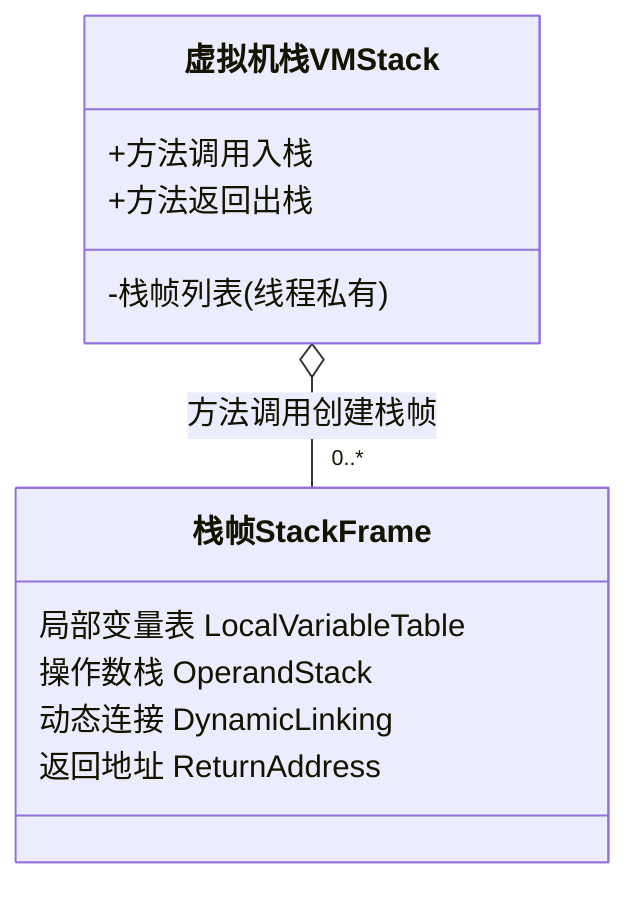
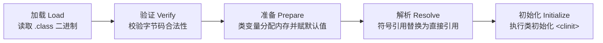
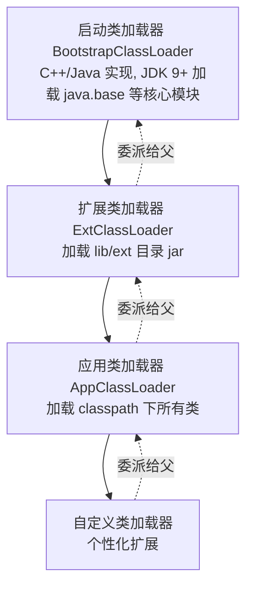
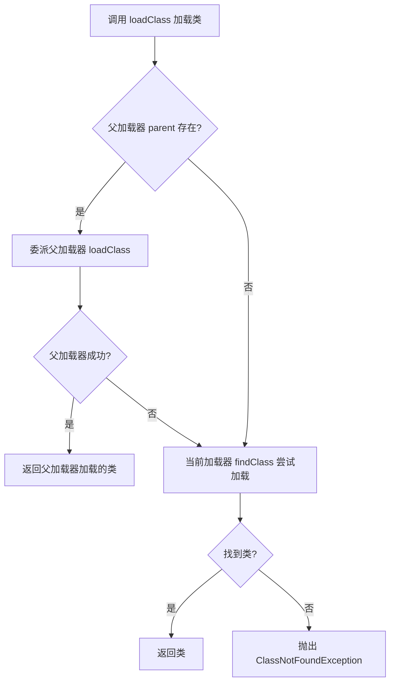
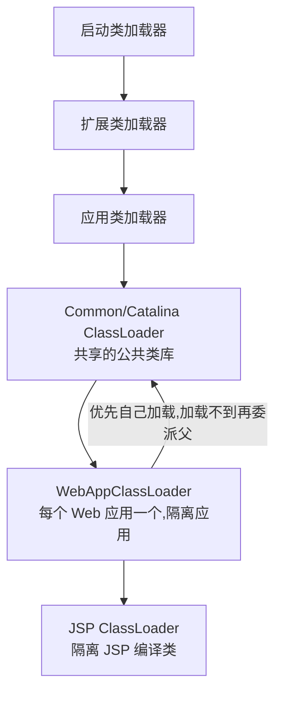

# 类加载机制

## JVM 内存区域划分

#### JVM 内存布局

程序想要运行就需要数据，有了数据就需要在内存上存储。Java 程序的数据结构非常丰富，举一些例子：

- 静态成员变量
- 动态成员变量
- 区域变量
- 短小紧凑的对象声明
- 庞大复杂的内存申请

这么多不同的数据结构，到底存储在什么地方，它们之间又是怎么进行交互的，这些问题经常在面试中被问到。

先看 JVM 的内存布局。随着 Java 的发展，内存布局一直在调整。比如，Java 8 及之后的版本彻底移除了永久代，使用 Metaspace 来替代，这也表示着 -XX:PermSize 和 -XX:MaxPermSize 等参数调优已经没有了意义。但大体上，比较重要的内存区域是固定的。

```mermaid
flowchart TB
  subgraph 线程共享
    Heap[堆 Heap<br/>对象实例/数组,占用最大,GC 主战场]
    Meta[元空间 Metaspace<br/>类元数据(Java8 替代永久代)]
    Direct[直接内存 Direct Memory<br/>本地内存,NIO DirectBuffer]
  end
  subgraph 线程私有
    VMS[虚拟机栈 VM Stack<br/>栈帧:局部变量表/操作数栈/动态链接/返回地址]
    Native[本地方法栈 Native Method Stack<br/>服务 native 方法]
    PC[程序计数器 Program Counter<br/>记录字节码执行位置,线程切换恢复]
  end
  Exec[执行引擎 Execution Engine<br/>解释/编译字节码]
  VMS --> Exec
  Exec --> PC
```

JVM 内存区域划分主要包括以下几个部分：

- JVM 堆中的数据是共享的，是占用内存最大的一块区域。
- 可以执行字节码的模块叫作执行引擎。
- 执行引擎在线程切换时靠程序计数器恢复。
- JVM 的内存划分与多线程息息相关。像程序中运行时用到的栈，以及本地方法栈，它们的维度都是线程。
- 本地内存包含元数据区和一些直接内存。

一般情况下，能答出上面这些主要的区域就够了。但如果深挖下去，可能就比较棘手。下面详细看这个过程。

#### 虚拟机栈


栈是先进后出的数据结构，可以想象子弹上膛的过程，后进的子弹最先射出，最上面的子弹就相当于栈顶。

Java 虚拟机栈是基于线程的。哪怕只有一个 main() 方法，也是以线程的方式运行的。在线程的生命周期中，参与计算的数据会频繁地入栈和出栈，栈的生命周期和线程一样。

栈里的每条数据就是栈帧。在每个 Java 方法被调用的时候，都会创建一个栈帧并入栈；一旦完成相应的调用则出栈。所有的栈帧都出栈后，线程也就结束了。每个栈帧都包含四个区域：

- 局部变量表
- 操作数栈
- 动态链接
- 返回地址

应用程序就是在不断操作这些内存空间中完成的。



本地方法栈是和虚拟机栈非常相似的一个区域，它服务的对象是 native 方法。甚至可以认为虚拟机栈和本地方法栈是同一个区域，这并不影响对 JVM 的了解。

这里有一个比较特殊的数据类型叫作 returnAddress。因为这种类型只存在于字节码层面，平常接触的比较少。对于 JVM 来说，程序就是存储在方法区的字节码指令，而 returnAddress 类型的值就是指向特定指令内存地址的指针。


这部分有两个比较有意思的内容：

- 这里有一个两层的栈。第一层是栈帧，对应着方法；第二层是方法的执行，对应着操作数。注意不要搞混。
- 所有的字节码指令，其实都会抽象成对栈的入栈出栈操作。执行引擎只需要按顺序执行，就可以保证它的正确性。

这是基础，接下来从线程角度看一下里面的内容。

#### 程序计数器

如果程序在线程之间进行切换，凭什么能够知道线程已经执行到什么地方呢？

线程在获取 CPU 时间片上是不可预知的，需要有一个地方对线程正在运行的点位进行缓冲记录，以便在获取 CPU 时间片时能够快速恢复。

程序计数器是一块较小的内存空间，它的作用可以看作是当前线程所执行的字节码的行号指示器。这里面存的，就是当前线程执行的进度。下面这张图能够加深对这个过程的理解。


程序计数器也是因为线程而产生的，与虚拟机栈配合完成计算操作。程序计数器还存储了当前正在运行的流程，包括正在执行的指令、跳转、分支、循环、异常处理等。

程序计数器里面的具体内容，可以使用 javap 命令输出字节码。在每个 opcode 前面都有一个序号，就是图中红框中的偏移地址，可以认为它们是程序计数器的内容。


#### 堆


堆是 JVM 上最大的内存区域，申请的几乎所有的对象都是在这里存储的。常说的垃圾回收，操作的对象就是堆。

堆空间一般在程序启动时就申请了，但并不一定会全部使用。

随着对象的频繁创建，堆空间占用越来越多，就需要不定期对不再使用的对象进行回收。这个在 Java 中叫作 GC（Garbage Collection）。

由于对象的大小不一，在长时间运行后，堆空间会被许多细小的碎片占满，造成空间浪费。所以仅仅销毁对象是不够的，还需要堆空间整理。这个过程非常复杂，在后面的节有专门介绍。

一个对象创建的时候，到底是在堆上分配还是在栈上分配呢？这和两个方面有关：对象的类型和在 Java 类中存在的位置。

Java 的对象可以分为基本数据类型和普通对象。

对于普通对象来说，JVM 会首先在堆上创建对象，然后在其他地方使用的其实是它的引用，比如把这个引用保存在虚拟机栈的局部变量表中。

对于基本数据类型来说（byte、short、int、long、float、double、char)，有两种情况。

每个线程拥有一个虚拟机栈。在方法体内声明的基本数据类型的对象，会在栈上直接分配。其他情况，都是在堆上分配。

注意，像 int[] 数组这样的内容是在堆上分配的，数组并不是基本数据类型。

这就是 JVM 的基本内存分配策略。堆是所有线程共享的，如果是多个线程访问，会涉及数据同步问题，这同样是个大话题。

#### 元空间

关于元空间，以一个非常高频问题开始："为什么有 Metaspace 区域？它有什么问题？"

先回想类与对象的区别。对象是一个活生生的个体，可以参与到程序的运行中；类更像是一个模版，定义了一系列属性和操作。前面生成的 A.class，是放在 JVM 的哪个区域？

要回答这个问题，不得不提 Java 的历史。在 Java 8 之前，这些类的信息放在一个叫 Perm 区的内存里面。更早版本，甚至 String.intern 相关的运行时常量池也放在这里。这个区域有大小限制，很容易造成 JVM 内存溢出，从而造成 JVM 崩溃。

Perm 区在 Java 8 中已经被彻底废除，取而代之的是 Metaspace。原来的 Perm 区是在堆上的，现在的元空间是在非堆上的，这是背景。关于它们的对比，可以看这张图。

```mermaid
flowchart LR
  subgraph Java8前
    Perm[永久代 Perm Gen<br/>在堆上,存储类元数据<br/>有大小限制,易 OOM<br/>-XX:PermSize 调优]
  end
  subgraph Java8及之后
    Meta[元空间 Metaspace<br/>在本地内存(非堆)<br/>默认使用本地内存,不易 OOM<br/>-XX:MaxMetaspaceSize 调优]
  end
  Perm -.Java8 彻底废除.-> Meta
```

元空间的好处也是它的坏处。使用非堆可以使用操作系统的内存，JVM 不会再出现方法区的内存溢出；但是无限制的使用会造成操作系统的死亡。所以一般也会使用参数 -XX:MaxMetaspaceSize 来控制大小。

方法区作为一个概念依然存在，它的物理存储的容器就是 Metaspace。这个区域存储的内容包括：类的信息、常量池、方法数据、方法代码。

## 类加载机制与双亲委派

### 一、为什么需要深入理解类加载机制?

类加载机制不仅决定了 Java 程序如何运行,还直接影响到:

- **框架设计**: Spring、Tomcat 等框架的核心机制都依赖于类加载
- **插件架构**: Eclipse、IntelliJ IDEA 等插件化系统的实现基础
- **热部署**: JRebel、Spring Boot DevTools 等热部署工具的原理
- **性能优化**: 类加载优化是应用启动优化的重要环节
- **问题排查**: ClassNotFoundException、NoClassDefFoundError 等常见问题的根源

#### 真实案例:类冲突导致的线上故障

```java
// 案例:一个看似简单的类冲突问题
public class OrderService {
    private static final Logger logger = LoggerFactory.getLogger(OrderService.class);
    
    public void createOrder(Order order) {
        logger.info("Creating order: {}", order.getId());
        // 业务逻辑...
    }
}

// 问题现象:
// - 本地运行正常
// - 线上环境报错: java.lang.NoSuchMethodError: org.slf4j.Logger.info(Ljava/lang/String;Ljava/lang/Object;)V

// 排查过程:
// 1. 使用 jcmd <pid> VM.system_properties | grep class.path 查看类路径
// 2. 使用 jcmd <pid> VM.classloader_stats 查看类加载器统计
// 3. 使用 arthas 的 sc -d org.slf4j.Logger 查看类来源
// 4. 发现问题: classpath 中存在两个版本的 slf4j-api.jar

// 根本原因:
// - 应用依赖 slf4j-api-1.7.30.jar (支持 info(String, Object) 方法)
// - 某个依赖传递引入 slf4j-api-1.7.25.jar (不支持该方法)
// - 类加载器加载了错误版本的 Logger 类

// 解决方案:
// 1. 使用 mvn dependency:tree 排查依赖树
// 2. 使用 <exclusion> 排除冲突依赖
// 3. 使用 maven-enforcer-plugin 强制统一版本
```

这个案例说明,**理解类加载机制对于排查线上问题至关重要**。

---

### 二、类加载的完整生命周期

一个类从字节码到可用,会经历以下七个阶段:

```
┌─────────────┐
│   加载      │ ──→ 读取 .class 文件,生成 Class 对象
└──────┬──────┘
       │
       ↓
┌─────────────┐
│   验证      │ ──→ 确保字节码符合规范,安全可靠
└──────┬──────┘
       │
       ↓
┌─────────────┐
│   准备      │ ──→ 为类变量分配内存,设置初始值
└──────┬──────┘
       │
       ↓
┌─────────────┐
│   解析      │ ──→ 符号引用替换为直接引用
└──────┬──────┘
       │
       ↓
┌─────────────┐
│   初始化    │ ──→ 执行类初始化代码 <clinit>()
└──────┬──────┘
       │
       ↓
┌─────────────┐
│   使用      │ ──→ 类被程序使用
└──────┬──────┘
       │
       ↓
┌─────────────┐
│   卸载      │ ──→ 类被垃圾回收
└─────────────┘
```

其中,**加载、验证、准备、解析、初始化**这五个阶段构成了类加载的核心流程。

#### 2.1 加载阶段(Loading)

#### 2.1.1 加载阶段的核心工作

加载阶段主要完成三件事:

1. **通过类的全限定名获取定义此类的二进制字节流**
   - 来源非常灵活:本地文件、ZIP 包(JAR/WAR)、网络、动态生成、数据库等

```java
// 动态代理示例:运行时生成类
public class DynamicProxyDemo {
    public static void main(String[] args) {
        // 动态代理会在运行时生成 $Proxy0 类
        // 这个类的字节码是在运行时计算生成的,不会保存到文件中
        Runnable target = () -> System.out.println("目标逻辑执行");

        Runnable proxy = (Runnable) Proxy.newProxyInstance(
            DynamicProxyDemo.class.getClassLoader(),
            new Class<?>[] { Runnable.class },
            (proxyObj, method, args1) -> {
                System.out.println("Before method: " + method.getName());
                // 注意:必须调用目标对象的方法;若在此处调用 method.invoke(proxyObj, args1)
                // 会再次进入 InvocationHandler,造成无限递归
                Object result = method.invoke(target, args1);
                System.out.println("After method: " + method.getName());
                return result;
            }
        );
        
        proxy.run();
    }
}
```

2. **将字节流代表的静态存储结构转化为方法区的运行时数据结构**

```
┌────────────────────────────────────────┐
│            方法区存储结构               │
├────────────────────────────────────────┤
│  类信息                                │
│  ├─ 类名、父类名、接口列表             │
│  ├─ 访问标志(public/final/abstract等) │
│  └─ 类索引、父类索引、接口索引         │
├────────────────────────────────────────┤
│  字段信息                              │
│  ├─ 字段名、类型、访问标志             │
│  └─ 属性表(常量值、注解等)            │
├────────────────────────────────────────┤
│  方法信息                              │
│  ├─ 方法名、返回类型、参数列表         │
│  ├─ 访问标志、异常表                   │
│  └─ Code 属性(字节码指令)             │
├────────────────────────────────────────┤
│  运行时常量池                          │
│  ├─ 字面量(字符串、数值)              │
│  └─ 符号引用(类、字段、方法引用)      │
└────────────────────────────────────────┘
```

3. **在内存中生成代表这个类的 java.lang.Class 对象**

```java
public class ClassObjectDemo {
    public static void main(String[] args) throws Exception {
        // 三种获取 Class 对象的方式
        
        // 1. 类名.class (最常用)
        Class<?> clazz1 = String.class;
        
        // 2. 对象.getClass()
        String str = "hello";
        Class<?> clazz2 = str.getClass();
        
        // 3. Class.forName() (动态加载)
        Class<?> clazz3 = Class.forName("java.lang.String");
        
        // 验证:同一个类只有一个 Class 对象
        System.out.println(clazz1 == clazz2);  // true
        System.out.println(clazz2 == clazz3);  // true
    }
}
```

#### 2.1.2 数组类的特殊性

数组类本身不通过类加载器创建,而是由 JVM 直接创建:

```java
public class ArrayClassDemo {
    public static void main(String[] args) {
        // 引用类型数组:加载器与元素类型一致
        String[] stringArray = new String[10];
        System.out.println("String[] 的类加载器: " + 
            stringArray.getClass().getClassLoader()); 
        // 输出: null (与 String 类的加载器一致,即 Bootstrap ClassLoader)
        
        // 基本类型数组:标记为与引导类加载器关联
        int[] intArray = new int[10];
        System.out.println("int[] 的类加载器: " + 
            intArray.getClass().getClassLoader()); 
        // 输出: null
        
        // 自定义类数组:加载器与自定义类一致
        MyClass[] myClassArray = new MyClass[10];
        System.out.println("MyClass[] 的类加载器: " + 
            myClassArray.getClass().getClassLoader()); 
        // 输出: JDK 8 为 sun.misc.Launcher$AppClassLoader@xxx；JDK 9+ 为 jdk.internal.loader.ClassLoaders$AppClassLoader@xxx
    }
}
```

#### 2.2 验证阶段(Verification)

#### 2.2.1 为什么需要验证?

Java 语言本身是相对安全的语言,但 Class 文件并不一定只能由 Java 代码编译而来。它可以用十六进制编辑器直接编写,甚至可能包含恶意代码。验证阶段是虚拟机保护自己的一项重要工作。

```java
// 恶意 Class 文件示例(概念演示)
// 一个正常编译的类不应该有以下行为:
public class MaliciousClass {
    static {
        try {
            // 尝试绕过安全检查
            System.setSecurityManager(null);
            
            // 执行系统命令(危险!)
            Runtime.getRuntime().exec("rm -rf /");
        } catch (Exception e) {
            e.printStackTrace();
        }
    }
}
```

如果验证阶段能够正确工作,这样的恶意类在加载时就会被拒绝。

#### 2.2.2 验证的四个阶段

**1. 文件格式验证**

确保输入的字节流能正确解析:

- 是否以魔数 `0xCAFEBABE` 开头
- 主、次版本号是否在当前虚拟机接受范围之内
- 常量池的常量中是否有不被支持的常量类型

```java
// 查看魔数和版本号
public class MagicNumberDemo {
    public static void main(String[] args) throws Exception {
        String classFile = "target/classes/com/example/MyClass.class";
        
        try (FileInputStream fis = new FileInputStream(classFile)) {
            byte[] magic = new byte[4];
            fis.read(magic);
            
            // 转换为十六进制字符串
            System.out.printf("魔数: %02X %02X %02X %02X%n",
                magic[0] & 0xFF, magic[1] & 0xFF,
                magic[2] & 0xFF, magic[3] & 0xFF);
            // 输出: 魔数: CA FE BA BE
            
            // 读取版本号
            byte[] version = new byte[4];
            fis.read(version);
            int minorVersion = ((version[0] & 0xFF) << 8) | (version[1] & 0xFF);
            int majorVersion = ((version[2] & 0xFF) << 8) | (version[3] & 0xFF);
            System.out.printf("版本: %d.%d (JDK %d)%n", 
                minorVersion, majorVersion, majorVersion - 44);
        }
    }
}
```

**JDK 版本对照表**:

| JDK 版本 | 主版本号(十进制) | 十六进制 |
|----------|------------------|----------|
| JDK 8 | 52 | 0x0034 |
| JDK 11 | 55 | 0x0037 |
| JDK 17 | 61 | 0x003D |
| JDK 21 | 65 | 0x0041 |

**2. 元数据验证**

对字节码描述的信息进行语义分析:

- 这个类是否有父类(除了 java.lang.Object)
- 这个类的父类是否继承了不允许被继承的类(final 类)
- 如果不是抽象类,是否实现了所有抽象方法

```java
// 编译时检查的示例
// 错误示例 1: 继承 final 类
// 编译错误: Cannot inherit from final 'java.lang.String'
// public class MyString extends String { }  

// 错误示例 2: 未实现抽象方法
abstract class AbstractParent {
    public abstract void doSomething();
}

// 编译错误: MyChild is not abstract and does not override abstract method
// class MyChild extends AbstractParent { }
```

**3. 字节码验证**

通过数据流分析和控制流分析,确保程序语义合法:

```java
// 正常代码
public void validMethod() {
    int a = 1;
    int b = 2;
    int c = a + b;
    System.out.println(c);
}

// 对应的字节码(简化)
// 0: iconst_1        // 将常量 1 压入操作数栈
// 1: istore_1        // 将栈顶 int 值存入局部变量表索引 1
// 2: iconst_2        // 将常量 2 压入操作数栈
// 3: istore_2        // 将栈顶 int 值存入局部变量表索引 2
// 4: iload_1         // 从局部变量表索引 1 加载 int 值
// 5: iload_2         // 从局部变量表索引 2 加载 int 值
// 6: iadd            // 执行 int 加法
// 7: istore_3        // 将结果存入局部变量表索引 3
```

**4. 符号引用验证**

对类自身以外的各类信息进行匹配性校验:

```java
// 引用不存在的类
public class InvalidReference {
    public static void main(String[] args) {
        // 编译时存在,运行时不存在
        NonExistentClass obj = new NonExistentClass();
        // NoClassDefFoundError: NonExistentClass
    }
}
```

#### 2.2.3 验证阶段的性能考量

验证阶段会消耗约 40% 的类加载时间。如果代码已经反复验证过,可以关闭验证以提升启动速度:

```bash
## 启动时关闭验证(仅用于受信任的代码)
java -Xverify:none -jar app.jar

## 注意:
## - -Xverify:none 自 JDK 13 起已被废弃(JEP 416 重构了验证器),使用时会打印警告,新代码不建议依赖
## - 确保代码来源可信
## - 可能影响安全性
```

#### 2.3 准备阶段(Preparation)

#### 2.3.1 准备阶段的核心工作

为类变量分配内存并设置初始值:

```java
public class PreparationDemo {
    // 准备阶段分配内存并设置零值
    public static int intValue;           // 0
    public static long longValue;         // 0L
    public static float floatValue;       // 0.0f
    public static double doubleValue;     // 0.0d
    public static boolean booleanValue;   // false
    public static char charValue;         // '\u0000'
    public static String referenceValue;  // null
    
    public static void main(String[] args) {
        System.out.println("int: " + intValue);           // 0
        System.out.println("long: " + longValue);         // 0
        System.out.println("float: " + floatValue);       // 0.0
        System.out.println("double: " + doubleValue);     // 0.0
        System.out.println("boolean: " + booleanValue);   // false
        System.out.println("char: [" + charValue + "]");  // []
        System.out.println("reference: " + referenceValue); // null
    }
}
```

**数据类型零值表**:

| 数据类型 | 零值 | 说明 |
|---------|------|------|
| int | 0 | 32位整数 |
| long | 0L | 64位整数 |
| short | (short)0 | 16位整数 |
| char | '\u0000' | Unicode 字符 |
| byte | (byte)0 | 8位整数 |
| boolean | false | 布尔值 |
| float | 0.0f | 32位浮点 |
| double | 0.0d | 64位浮点 |
| reference | null | 对象引用 |

#### 2.3.2 重要区别:普通静态变量 vs 常量

```java
public class ConstantValueDemo {
    // 普通 static 变量
    public static int normalStatic = 100;
    
    // static final 常量(基本类型或 String)
    public static final int FINAL_INT = 200;
    public static final String FINAL_STRING = "Hello";
    
    // static final 但不是编译时常量
    public static final int NOT_CONSTANT = new Random().nextInt();
    
    public static void main(String[] args) {
        // 准备阶段:
        // - normalStatic = 0 (零值)
        // - FINAL_INT = 200 (ConstantValue 属性)
        // - FINAL_STRING = "Hello" (ConstantValue 属性)
        // - NOT_CONSTANT = 0 (零值)
        
        // 初始化阶段:
        // - normalStatic = 100
        // - NOT_CONSTANT = 随机值
        
        System.out.println("normalStatic: " + normalStatic);  // 100
        System.out.println("FINAL_INT: " + FINAL_INT);        // 200
        System.out.println("FINAL_STRING: " + FINAL_STRING);  // Hello
        System.out.println("NOT_CONSTANT: " + NOT_CONSTANT);  // 随机值
    }
}
```

**关键区别**:

| 类型 | 准备阶段 | 初始化阶段 |
|------|----------|------------|
| `static int value = 100;` | value = 0 | value = 100 |
| `static final int value = 100;` | value = 100 | 无需赋值 |

::: warning 注意事项
准备阶段**不执行 Java 代码**,只设置零值或 ConstantValue。真正的赋值操作在初始化阶段完成。
:::

#### 2.4 解析阶段(Resolution)

#### 2.4.1 符号引用 vs 直接引用

**符号引用(Symbolic Reference)**:
- 用一组符号描述所引用的目标
- 与虚拟机实现的内存布局无关
- 引用的目标不一定已经加载到虚拟机内存中

**直接引用(Direct Reference)**:
- 可以直接指向目标的指针、相对偏移量或句柄
- 与虚拟机实现的内存布局直接相关
- 引用的目标必定已经在虚拟机的内存中存在

```
┌─────────────────────────────────────────────┐
│            直接引用的实现方式               │
├─────────────────────────────────────────────┤
│                                             │
│  1. 直接指针(HotSpot 使用)                 │
│     ┌───────┐                              │
│     │引用   │ ─────────────→ [对象内存地址] │
│     └───────┘                              │
│                                             │
│  2. 句柄                                   │
│     ┌───────┐    ┌──────────┐              │
│     │引用   │ →  │ 句柄池   │ → [对象]     │
│     └───────┘    └──────────┘              │
│                       ↓                    │
│                   [类型数据]               │
│                                             │
│  3. 偏移量                                 │
│     ┌───────┐                              │
│     │引用   │ → [基地址 + 偏移量]          │
│     └───────┘                              │
│                                             │
└─────────────────────────────────────────────┘
```

#### 2.4.2 解析的时机

解析可以在初始化之前,也可以在初始化之后:

```java
public class ResolutionTimingDemo {
    public static void main(String[] args) {
        // 静态解析:编译期可知,运行期不变
        // private、static、final 方法
        StaticClass.staticMethod();
        
        // 动态解析:运行期才能确定
        // 虚方法(override 方法)
        Parent obj = new Child();
        obj.virtualMethod();  // 运行时解析
    }
}

class StaticClass {
    public static void staticMethod() { }
}

class Parent {
    public void virtualMethod() { }
}

class Child extends Parent {
    @Override
    public void virtualMethod() { }
}
```

#### 2.5 初始化阶段(Initialization)

#### 2.5.1 `<clinit>()` 方法的特点

`<clinit>()` 方法是由编译器自动收集类中的所有类变量的赋值动作和静态语句块合并产生的:

```java
public class ClinitDemo {
    static int a = 1;
    static {
        a = 2;
        b = 3; // 可以赋值,但不能访问
    }
    static int b = 4;
    
    public static void main(String[] args) {
        System.out.println(a); // 输出: 2
        System.out.println(b); // 输出: 4
    }
}

// 编译器生成的 <clinit>() 方法(伪代码):
// void <clinit>() {
//     a = 1;        // 第一个赋值
//     a = 2;        // 静态块中的赋值
//     b = 3;        // 静态块中的赋值
//     b = 4;        // 最后的赋值
// }
```

**关键规则**:
- 编译器收集的顺序由语句在源文件中出现的顺序决定
- 静态语句块只能访问定义在它之前的变量
- 定义在它之后的变量,可以赋值,但不能访问

```java
public class IllegalForwardRef {
    static {
        // i = 1;  // 合法:可以赋值
        // System.out.println(i);  // 非法:不能访问
        // 编译错误:Illegal forward reference
    }
    static int i;
}
```

#### 2.5.2 父类优先原则

父类的 `<clinit>()` 方法先于子类执行:

```java
public class Parent {
    public static int A = 1;
    static {
        A = 2;
    }
}

public class Child extends Parent {
    public static int B = A;
}

public class Test {
    public static void main(String[] args) {
        System.out.println(Child.B); // 输出: 2
    }
}
```

**执行过程**:
1. 触发 Child 类的初始化
2. 检测到父类 Parent 未初始化
3. 初始化 Parent 类: A = 1 → A = 2
4. 初始化 Child 类: B = A = 2

#### 2.5.3 线程安全保证

虚拟机会保证一个类的 `<clinit>()` 方法在多线程环境中被正确地加锁和同步:

```java
// 利用 <clinit>() 实现线程安全的单例
public class Singleton {
    // 方式1: 静态常量(简单)
    private static final Singleton INSTANCE = new Singleton();
    
    private Singleton() {}
    
    public static Singleton getInstance() {
        return INSTANCE;
    }
}

// 或方式2: 静态内部类(延迟加载)
public class Singleton {
    private Singleton() {}
    
    private static class Holder {
        private static final Singleton INSTANCE = new Singleton();
    }
    
    public static Singleton getInstance() {
        return Holder.INSTANCE;
    }
}
```

**为什么静态内部类方式是线程安全的**:

```
线程1 调用 getInstance():
  ↓
访问 Holder.INSTANCE
  ↓
触发 Holder 类的初始化
  ↓
JVM 加锁执行 Holder 的 <clinit>()
  ↓
创建 Singleton 实例
  ↓
其他线程访问时,Holder 已初始化,直接返回实例
```

#### 2.5.4 类初始化的时机

**主动引用(一定会初始化)**:

1. 遇到 `new`、`getstatic`、`putstatic`、`invokestatic` 这四条字节码指令

```java
public class InitDemo {
    public static void main(String[] args) {
        new MyClass();           // new 指令
        int value = MyClass.a;   // getstatic 指令
        MyClass.a = 2;           // putstatic 指令
        MyClass.method();        // invokestatic 指令
    }
}

class MyClass {
    static int a = 1;
    static {
        System.out.println("MyClass 初始化");
    }
    public static void method() {}
}
```

2. 使用 `java.lang.reflect` 包的方法对类型进行反射调用

```java
// Class.forName() 会触发初始化
Class<?> clazz = Class.forName("com.example.MyClass");

// ClassLoader.loadClass() 不会触发初始化
ClassLoader loader = ClassLoader.getSystemClassLoader();
Class<?> clazz2 = loader.loadClass("com.example.MyClass");
// 此时不会触发初始化,只有真正使用时才会初始化
```

3. 初始化类时,如果父类未初始化,则先触发父类初始化

4. 虚拟机启动时,先初始化主类(包含 main() 方法的类)

**被动引用(不会初始化)**:

```java
// 示例1: 通过子类引用父类的静态字段,不会导致子类初始化
public class PassiveReference1 {
    public static void main(String[] args) {
        System.out.println(ChildClass.value);
        // 输出:
        // ParentClass 初始化
        // 123
        // 注意:ChildClass 不会初始化
    }
}

class ParentClass {
    static int value = 123;
    static {
        System.out.println("ParentClass 初始化");
    }
}

class ChildClass extends ParentClass {
    static {
        System.out.println("ChildClass 初始化");
    }
}
```

```java
// 示例2: 通过数组定义引用类,不会触发此类的初始化
ParentClass[] array = new ParentClass[10];
// 不会初始化 ParentClass
```

```java
// 示例3: 常量在编译阶段会存入调用类的常量池
public class PassiveReference3 {
    public static void main(String[] args) {
        System.out.println(ConstClass.HELLO);
        // 输出: Hello World
        // 不会输出 "ConstClass 初始化"
    }
}

class ConstClass {
    static final String HELLO = "Hello World";
    static {
        System.out.println("ConstClass 初始化");
    }
}
```

---

### 三、类加载器分类与作用

#### 3.1 类加载器的唯一性

对于任意一个类,都必须由加载它的类加载器和这个类本身一同确立其在 Java 虚拟机中的唯一性。

```java
public class ClassUniquenessDemo {
    public static void main(String[] args) throws Exception {
        // 同一个 Class 文件,不同的类加载器
        CustomClassLoader loader1 = new CustomClassLoader("/tmp/classes");
        CustomClassLoader loader2 = new CustomClassLoader("/tmp/classes");
        
        Class<?> class1 = loader1.loadClass("com.example.Test");
        Class<?> class2 = loader2.loadClass("com.example.Test");
        
        System.out.println(class1 == class2);  // false
        
        // 即使类名相同,但加载器不同,它们就是不同的类
        System.out.println(class1.getClassLoader());  // CustomClassLoader@xxx1
        System.out.println(class2.getClassLoader());  // CustomClassLoader@xxx2
    }
}
```

#### 3.2 类加载器的层次结构

```
Bootstrap ClassLoader (启动类加载器)
        ↑ parent
    Extension/Platform ClassLoader (扩展/平台类加载器)
        ↑ parent
    Application ClassLoader (应用程序类加载器)
        ↑ parent
    Custom ClassLoader (自定义类加载器)
```

#### 3.2.1 启动类加载器(Bootstrap ClassLoader)

- **实现方式**: C++ 实现(HotSpot 虚拟机)
- **加载范围**: `<JAVA_HOME>/lib` 目录下的类库
- **特点**: 程序无法直接获取其引用,返回 null

```java
// 启动类加载器加载的类
String.class.getClassLoader();  // 返回 null

// 查看启动类加载器加载的类库路径
String bootClassPath = System.getProperty("sun.boot.class.path");
System.out.println("启动类加载器路径:");
for (String path : bootClassPath.split(";")) {
    System.out.println("  " + path);
}
```

#### 3.2.2 扩展类加载器(Extension ClassLoader) / 平台类加载器(Platform ClassLoader)

**JDK 8 及之前**: 扩展类加载器
- 实现方式: Java 实现,位于 `sun.misc.Launcher$ExtClassLoader`
- 加载范围: `<JAVA_HOME>/lib/ext` 目录

**JDK 9 及之后**: 平台类加载器
- 加载范围: Java 平台模块

```java
// JDK 9+ 获取平台类加载器
ClassLoader platformLoader = ClassLoader.getPlatformClassLoader();
System.out.println("平台类加载器: " + platformLoader);
```

#### 3.2.3 应用程序类加载器(Application ClassLoader)

- **实现方式**: Java 实现,JDK 8 中位于 `sun.misc.Launcher$AppClassLoader`（JDK 9+ 为 `jdk.internal.loader.ClassLoaders$AppClassLoader`）
- **加载范围**: 用户类路径(ClassPath)上的类库
- **特点**: 程序中默认的类加载器

```java
// 获取应用程序类加载器
ClassLoader appLoader = ClassLoader.getSystemClassLoader();
System.out.println("应用程序类加载器: " + appLoader);
// 输出: sun.misc.Launcher$AppClassLoader@18b4aac2

// 用户类由应用程序类加载器加载
System.out.println("当前类的加载器: " + 
    ClassUniquenessDemo.class.getClassLoader());
// 输出: sun.misc.Launcher$AppClassLoader@18b4aac2
```

#### 3.2.4 自定义类加载器

**实现方式**: 继承 `java.lang.ClassLoader` 类

```java
import java.io.*;

public class CustomClassLoader extends ClassLoader {
    private String classPath;
    
    public CustomClassLoader(String classPath) {
        this.classPath = classPath;
    }
    
    @Override
    protected Class<?> findClass(String name) throws ClassNotFoundException {
        try {
            byte[] data = loadClassData(name);
            return defineClass(name, data, 0, data.length);
        } catch (IOException e) {
            throw new ClassNotFoundException(name, e);
        }
    }
    
    private byte[] loadClassData(String className) throws IOException {
        String fileName = classPath + File.separatorChar 
            + className.replace('.', File.separatorChar) + ".class";
        
        try (InputStream is = new FileInputStream(fileName);
             ByteArrayOutputStream baos = new ByteArrayOutputStream()) {
            
            int bytesRead;
            byte[] buffer = new byte[4096];
            while ((bytesRead = is.read(buffer)) != -1) {
                baos.write(buffer, 0, bytesRead);
            }
            
            return baos.toByteArray();
        }
    }
}
```

#### 3.3 ClassLoader 核心方法

```java
public abstract class ClassLoader {
    
    // 加载类(双亲委派入口)
    public Class<?> loadClass(String name) throws ClassNotFoundException { }
    
    // 加载类(可控制是否解析)
    protected Class<?> loadClass(String name, boolean resolve) 
        throws ClassNotFoundException { }
    
    // 查找类(子类实现)
    protected Class<?> findClass(String name) throws ClassNotFoundException { }
    
    // 定义类(将字节码转为 Class 对象)
    protected final Class<?> defineClass(String name, byte[] b, int off, int len) { }
    
    // 解析类
    protected final void resolveClass(Class<?> c) { }
    
    // 查找已加载的类
    protected final Class<?> findLoadedClass(String name) { }
    
    // 获取系统类加载器
    public static ClassLoader getSystemClassLoader() { }
    
    // 获取父加载器
    public final ClassLoader getParent() { }
}
```

---

### 四、双亲委派模型

#### 4.1 双亲委派模型的工作原理

**工作流程**:

```
1. 收到类加载请求
2. 判断是否已加载过该类
   - 如果已加载,直接返回
   - 如果未加载,委托父加载器加载
3. 父加载器无法加载,子加载器尝试加载
4. 如果子加载器也无法加载,抛出 ClassNotFoundException
```

**图解**:

```
                    加载请求
                       ↓
┌──────────────────────────────────────────────┐
│         Application ClassLoader              │
│                                              │
│  1. 检查是否已加载 → 否                       │
│  2. 委托父加载器                              │
└──────────────────────────────────────────────┘
                       ↓
┌──────────────────────────────────────────────┐
│         Extension ClassLoader                │
│                                              │
│  1. 检查是否已加载 → 否                       │
│  2. 委托父加载器                              │
└──────────────────────────────────────────────┘
                       ↓
┌──────────────────────────────────────────────┐
│         Bootstrap ClassLoader                │
│                                              │
│  1. 检查是否已加载 → 否                       │
│  2. 尝试加载 → 成功/失败                      │
└──────────────────────────────────────────────┘
                       ↓
               成功: 返回 Class
               失败: 返回子加载器继续
```

**伪代码描述**:

```java
protected Class<?> loadClass(String name, boolean resolve) {
    synchronized (getClassLoadingLock(name)) {
        // 1. 检查该类是否已经加载过
        Class<?> c = findLoadedClass(name);
        
        if (c == null) {
            try {
                if (parent != null) {
                    // 2. 有父加载器,委托给父加载器
                    c = parent.loadClass(name, false);
                } else {
                    // 3. 无父加载器,委托给启动类加载器
                    c = findBootstrapClassOrNull(name);
                }
            } catch (ClassNotFoundException e) {
                // 父类加载器无法完成加载请求
            }
            
            if (c == null) {
                // 4. 父加载器无法加载,调用自身的 findClass 方法
                c = findClass(name);
            }
        }
        
        if (resolve) {
            resolveClass(c);
        }
        
        return c;
    }
}
```

#### 4.2 双亲委派模型的作用

#### 4.2.1 保护核心类的安全性

```java
// 尝试定义 java.lang 包下的类
package java.lang;

public class Evil {
    static {
        System.out.println("恶意代码执行");
    }
}

// 结果: 编译成功,但运行时无法加载
// SecurityException: Prohibited package name: java.lang
```

即使定义了一个 `java.lang.String` 类,由于双亲委派模型的存在,启动类加载器会先加载 JDK 自带的 `java.lang.String` 类,而不是用户自定义的类。

#### 4.2.2 避免类的重复加载

```java
public class AvoidDuplicateDemo {
    public static void main(String[] args) throws Exception {
        // 多次加载同一个类
        Class<?> clazz1 = ArrayList.class;
        Class<?> clazz2 = ArrayList.class;
        Class<?> clazz3 = ClassLoader.getSystemClassLoader().loadClass("java.util.ArrayList");
        
        System.out.println(clazz1 == clazz2);  // true
        System.out.println(clazz2 == clazz3);  // true
    }
}
```

#### 4.2.3 保证类的唯一性

在双亲委派模型下,类加载器 + 类全限定名共同确定类的唯一性。

#### 4.3 双亲委派模型的优势

| 优势 | 说明 |
|------|------|
| **安全性** | 避免 Java 核心 API 被篡改 |
| **稳定性** | 同一个类只会被加载一次,避免重复加载带来的混乱 |
| **一致性** | 所有的类加载都遵循相同的规则,保证行为一致性 |
| **可维护性** | 类加载的层次结构清晰,便于问题排查 |

---

### 五、打破双亲委派模型

#### 5.1 为什么要打破双亲委派模型?

双亲委派模型虽然很好地解决了 Java 基础类的一致性问题,但在某些场景下会带来限制:

| 场景 | 原因 |
|------|------|
| **SPI 机制** | Java 提供的接口需要由第三方实现,启动类加载器无法加载第三方 jar 包 |
| **Web 容器** | Tomcat 等容器需要隔离不同应用的类,避免冲突 |
| **热部署** | 需要在不重启应用的情况下替换类的实现 |
| **模块化系统** | OSGi 等模块化系统需要更灵活的类加载策略 |

#### 5.2 打破双亲委派的方式

#### 方式1: 自定义类加载器,重写 `loadClass` 方法

```java
public class CustomClassLoader extends ClassLoader {
    private String classPath;
    
    public CustomClassLoader(String classPath) {
        this.classPath = classPath;
    }
    
    @Override
    protected Class<?> loadClass(String name, boolean resolve) 
            throws ClassNotFoundException {
        // 1. 检查是否已加载
        Class<?> c = findLoadedClass(name);
        
        if (c == null) {
            // 2. 核心类还是委托给父加载器
            if (name.startsWith("java.")) {
                c = super.loadClass(name, resolve);
            } else {
                // 3. 非核心类自己加载
                c = findClass(name);
            }
        }
        
        if (resolve) {
            resolveClass(c);
        }
        
        return c;
    }
    
    @Override
    protected Class<?> findClass(String name) throws ClassNotFoundException {
        try {
            byte[] data = loadClassData(name);
            return defineClass(name, data, 0, data.length);
        } catch (Exception e) {
            throw new ClassNotFoundException(name);
        }
    }
    
    private byte[] loadClassData(String className) throws IOException {
        String fileName = classPath + File.separatorChar 
            + className.replace('.', File.separatorChar) + ".class";
        
        try (InputStream is = new FileInputStream(fileName);
             ByteArrayOutputStream baos = new ByteArrayOutputStream()) {
            
            int bytesRead;
            byte[] buffer = new byte[4096];
            while ((bytesRead = is.read(buffer)) != -1) {
                baos.write(buffer, 0, bytesRead);
            }
            
            return baos.toByteArray();
        }
    }
}
```

#### 方式2: 使用线程上下文类加载器

**SPI 机制示例**: JDBC 驱动加载

```java
// JDK 中 DriverManager 的实现
public class DriverManager {
    static {
        // 使用线程上下文类加载器加载驱动
        AccessController.doPrivileged(new PrivilegedAction<Void>() {
            public Void run() {
                // 关键:使用线程上下文类加载器
                ServiceLoader<Driver> loadedDrivers = ServiceLoader.load(Driver.class);
                Iterator<Driver> driversIterator = loadedDrivers.iterator();
                try {
                    while (driversIterator.hasNext()) {
                        driversIterator.next();
                    }
                } catch (Throwable t) {
                    // Do nothing
                }
                return null;
            }
        });
    }
}

// ServiceLoader 使用线程上下文类加载器
public static <S> ServiceLoader<S> load(Class<S> service) {
    ClassLoader cl = Thread.currentThread().getContextClassLoader();
    return ServiceLoader.load(service, cl);
}
```

**SPI 工作流程**:

```
┌─────────────────────────────────────────────────┐
│ DriverManager (Bootstrap ClassLoader 加载)     │
│                                                 │
│   static {                                      │
│     ServiceLoader.load(Driver.class)           │
│   }                                             │
│         ↓                                       │
│   Thread.currentThread().getContextClassLoader()│
│         ↓                                       │
│   Application ClassLoader                       │
│         ↓                                       │
│   加载 META-INF/services/java.sql.Driver       │
│         ↓                                       │
│   加载 com.mysql.cj.jdbc.Driver                │
│                                                 │
└─────────────────────────────────────────────────┘
```

**SPI 使用示例**:

```java
// 1. 定义服务接口
package com.example.spi;

public interface DataService {
    void execute();
}

// 2. 实现服务接口
package com.example.spi.impl;

public class DataServiceImpl implements DataService {
    @Override
    public void execute() {
        System.out.println("DataServiceImpl execute");
    }
}

// 3. 配置 SPI
// 在 META-INF/services/com.example.spi.DataService 文件中:
// com.example.spi.impl.DataServiceImpl

// 4. 使用 ServiceLoader 加载服务
public class SpiDemo {
    public static void main(String[] args) {
        ServiceLoader<DataService> services = ServiceLoader.load(DataService.class);
        
        for (DataService service : services) {
            System.out.println("实现类: " + service.getClass().getName());
            service.execute();
        }
    }
}
```

#### 5.3 Tomcat 类加载机制

Tomcat 作为 Web 容器,需要解决以下问题:

1. 一个 Web 容器可能需要部署两个应用程序,不同的应用程序可能会依赖同一个第三方类库的不同版本
2. 部署在同一个 Web 容器中相同的类库相同的版本不能重复加载
3. Web 容器也有自己依赖的类库,不能与应用程序的类库混淆

**Tomcat 的类加载器结构**:

```
        Bootstrap ClassLoader
                ↑
        Extension ClassLoader
                ↑
        Application ClassLoader
                ↑
        Common ClassLoader (加载 Tomcat 和 WebApp 共享的类)
         ↙          ↘
Catalina ClassLoader   Shared ClassLoader
(加载 Tomcat 内部类)    (加载 WebApp 共享的类)
                              ↑
                        WebApp ClassLoader
                        (每个 WebApp 独立的类加载器)
                              ↑
                        JspClassLoader
                        (每个 JSP 文件的类加载器)
```

**Tomcat 类加载顺序**(与双亲委派相反):

```
1. Cache 缓存
2. JVM Bootstrap 类(防止覆盖核心类)
3. Web 应用类路径(/WEB-INF/classes)
4. Web 应用类库(/WEB-INF/lib/*.jar)
5. Common 类加载器
6. Shared 类加载器
```

**对比双亲委派**:

```
双亲委派:  子 → 父 → 爷爷 (向上委托)
Tomcat:   自己 → 本地 → 父 (先自己加载)
```

#### 5.4 OSGi 类加载机制

OSGi 实现了模块化、热部署,但代价是放弃了双亲委派模型:

```
Bundle A ClassLoader ←→ Bundle B ClassLoader ←→ Bundle C ClassLoader
        ↓                      ↓                       ↓
    Bundle A                 Bundle B               Bundle C
    (v1.0)                   (v2.0)                 (v3.0)

每个 Bundle 可以定义自己的导入导出策略,形成网状的类加载结构。
```

---

### 六、自定义类加载器实战

#### 6.1 加密类加载器

**场景**: 类文件加密后,需要在加载时解密

```java
import java.io.*;

public class EncryptedClassLoader extends ClassLoader {
    private String rootDir;
    private static final int KEY = 0xFF;
    
    public EncryptedClassLoader(String rootDir) {
        this.rootDir = rootDir;
    }
    
    @Override
    protected Class<?> findClass(String name) throws ClassNotFoundException {
        byte[] classData = loadClassData(name);
        if (classData == null) {
            throw new ClassNotFoundException();
        }
        return defineClass(name, classData, 0, classData.length);
    }
    
    private byte[] loadClassData(String className) {
        String fileName = rootDir + File.separatorChar 
            + className.replace('.', File.separatorChar) + ".class";
        
        try (InputStream is = new FileInputStream(fileName);
             ByteArrayOutputStream baos = new ByteArrayOutputStream()) {
            
            int bytesRead;
            byte[] buffer = new byte[4096];
            while ((bytesRead = is.read(buffer)) != -1) {
                // 解密
                for (int i = 0; i < bytesRead; i++) {
                    buffer[i] = (byte) (buffer[i] ^ KEY);
                }
                baos.write(buffer, 0, bytesRead);
            }
            
            return baos.toByteArray();
        } catch (IOException e) {
            e.printStackTrace();
            return null;
        }
    }
    
    // 加密工具方法
    public static void encryptClass(String inputFile, String outputFile) 
            throws IOException {
        try (FileInputStream fis = new FileInputStream(inputFile);
             FileOutputStream fos = new FileOutputStream(outputFile)) {
            
            int bytesRead;
            byte[] buffer = new byte[4096];
            while ((bytesRead = fis.read(buffer)) != -1) {
                // 加密
                for (int i = 0; i < bytesRead; i++) {
                    buffer[i] = (byte) (buffer[i] ^ KEY);
                }
                fos.write(buffer, 0, bytesRead);
            }
        }
    }
}
```

#### 6.2 热部署类加载器

**场景**: 动态加载更新后的类文件

```java
import java.io.*;
import java.util.*;

public class HotDeployClassLoader extends ClassLoader {
    private String classDir;
    private Map<String, Long> classLoadTime = new HashMap<>();
    
    public HotDeployClassLoader(String classDir) {
        this.classDir = classDir;
    }
    
    @Override
    protected Class<?> loadClass(String name, boolean resolve) 
            throws ClassNotFoundException {
        // 核心类走双亲委派
        if (name.startsWith("java.") || name.startsWith("javax.")) {
            return super.loadClass(name, resolve);
        }
        
        // 检查是否需要重新加载
        File classFile = getClassFile(name);
        if (classFile != null && needReload(name, classFile)) {
            // 重新加载
            byte[] data = loadClassData(classFile);
            Class<?> clazz = defineClass(name, data, 0, data.length);
            classLoadTime.put(name, classFile.lastModified());
            
            if (resolve) {
                resolveClass(clazz);
            }
            
            return clazz;
        }
        
        return super.loadClass(name, resolve);
    }
    
    private boolean needReload(String name, File classFile) {
        Long lastLoadTime = classLoadTime.get(name);
        return lastLoadTime == null 
            || classFile.lastModified() > lastLoadTime;
    }
    
    private File getClassFile(String name) {
        String fileName = classDir + File.separatorChar 
            + name.replace('.', File.separatorChar) + ".class";
        File file = new File(fileName);
        return file.exists() ? file : null;
    }
    
    private byte[] loadClassData(File file) throws IOException {
        try (InputStream is = new FileInputStream(file);
             ByteArrayOutputStream baos = new ByteArrayOutputStream()) {
            
            int bytesRead;
            byte[] buffer = new byte[4096];
            while ((bytesRead = is.read(buffer)) != -1) {
                baos.write(buffer, 0, bytesRead);
            }
            
            return baos.toByteArray();
        }
    }
}
```

---

### 七、最佳实践

#### 8.1 类路径管理

```bash
## 检查类路径
java -verbose:class -jar app.jar

## 查看类加载情况
-XX:+TraceClassLoading
-XX:+TraceClassUnloading

## 使用 jcmd 查看类加载统计
jcmd <pid> VM.classloader_stats
```

#### 8.2 排查类冲突

```java
// 查看类由哪个加载器加载
public class ClassLoaderUtil {
    public static void printClassLoader(Class<?> clazz) {
        ClassLoader loader = clazz.getClassLoader();
        if (loader == null) {
            System.out.println(clazz.getName() + " 由 Bootstrap ClassLoader 加载");
        } else {
            System.out.println(clazz.getName() + " 由 " + loader + " 加载");
        }
    }
    
    public static void printClassLoaderHierarchy(Class<?> clazz) {
        ClassLoader loader = clazz.getClassLoader();
        System.out.println("类加载器层次:");
        while (loader != null) {
            System.out.println("  " + loader);
            loader = loader.getParent();
        }
        System.out.println("  Bootstrap ClassLoader");
    }
}
```

**排查类冲突的步骤**:

```bash
## 1. 找到类所在的位置
find . -name "*.jar" -exec jar -tf {} \; | grep "TargetClass.class"

## 2. 查看类加载信息
java -verbose:class -jar app.jar 2>&1 | grep "TargetClass"

## 3. 使用 arthas 查看类信息
sc -d com.example.TargetClass
```

#### 8.3 自定义类加载器注意事项

1. **不要破坏核心类的加载**: 核心类(java.*、javax.*)应该委托给父加载器
2. **遵循双亲委派模型**(除非有特殊需求): 大多数场景下,双亲委派模型是合适的
3. **注意线程安全**: 类加载器应该是线程安全的,使用同步或并发集合
4. **合理管理类缓存**: 避免内存泄漏,及时清理不需要的类

---

### 参考资料

1. **官方规范**
   - 《Java 虚拟机规范》(Java SE 8 Edition)
   - 《Java 语言规范》(Java SE 8 Edition)

2. **经典书籍**
   - 《深入理解 Java 虚拟机》- 周志明
   - 《Java 核心技术》- Cay S. Horstmann

3. **源码分析**
   - JDK 源码: `java.lang.ClassLoader`
   - Tomcat 源码: `WebappClassLoader`
   - OSGi 规范文档

4. **在线资源**
   - OpenJDK 官网: https://openjdk.org/
   - Java 文档: https://docs.oracle.com/javase/

## 类的加载过程

#### 类加载过程

并不是把一个文件修改成 .class 后缀，就能够被 JVM 识别。类的加载过程非常复杂，主要有这几个过程：加载、验证、准备、解析、初始化。这些术语很多地方都出现过，不需要死记硬背，而要了解它背后的原理和要做的事情。



**大多数情况下**，类会按照下文介绍的顺序进行加载。下面分别介绍这个过程。

#### 加载

加载的主要作用是将外部的 .class 文件加载到 Java 的方法区内，可以回顾上一节讲的内存区域图。加载阶段主要是找到并加载类的二进制数据，比如从 jar 包里或者 war 包里找到它们。

#### 验证

不能任何 .class 文件都能加载，否则太不安全，容易受到恶意代码的攻击。验证阶段在虚拟机整个类加载过程中占了很大一部分，不符合规范的将抛出 java.lang.VerifyError 错误。一些低版本的 JVM 无法加载高版本的类库，就是在这个阶段完成的。

#### 准备

从这部分开始，将为一些类变量分配内存，并将其初始化为默认值。此时实例对象还没有分配内存，所以这些动作是在方法区上进行的。

下面两段代码，code-snippet 1 将会输出 0，而 code-snippet 2 将无法通过编译。

```
code-snippet 1：
     public class A {
         static int a ;
         public static void main(String[] args) {
             System.out.println(a);
         }
     }
 code-snippet 2：
 public class A {
     public static void main(String[] args) {
         int a ;
         System.out.println(a);
     }
 }

```

为什么会有这种区别呢？

这是因为局部变量不像类变量那样存在准备阶段。类变量有两次赋初始值的过程，一次在准备阶段，赋予初始值（也可以是指定值）；另外一次在初始化阶段，赋予程序员定义的值。

因此，即使程序员没有为类变量赋值也没有关系，它仍然有一个默认的初始值。但局部变量就不一样了，如果没有给它赋初始值，是不能使用的。

#### 解析

解析在类加载中是非常重要的一环，是将符号引用替换为直接引用的过程。

符号引用是一种定义，可以是任何字面上的含义，而直接引用就是直接指向目标的指针、相对偏移量。

直接引用的对象都存在于内存中。可以把通讯录里的女友手机号码类比为符号引用，把面对面吃饭的人类比为直接引用。

解析阶段负责把整个类激活，串成一个可以找到彼此的网。这个阶段都做了哪些工作呢？大体可以分为：

- 类或接口的解析
- 类方法解析
- 接口方法解析
- 字段解析

经常发生的几个异常就与这个阶段有关。

- java.lang.NoSuchFieldError 根据继承关系从下往上，找不到相关字段时的报错。
- java.lang.IllegalAccessError 字段或者方法，访问权限不具备时的错误。
- java.lang.NoSuchMethodError 找不到相关方法时的错误。

解析过程保证了相互引用的完整性，把继承与组合推进到运行时。

#### 初始化

如果前面的流程一切顺利，接下来该初始化成员变量了，到了这一步才真正开始执行一些字节码。

下面的代码会输出什么？

```
public class A {
     static int a = 0 ;
     static {
         a = 1;
         b = 1;
     }
     static int b = 0;

     public static void main(String[] args) {
         System.out.println(a);
         System.out.println(b);
     }
 }

```

结果是 1 0。a 和 b 唯一的区别就是它们的 static 代码块的位置。

这就引出一个规则：static 语句块只能访问到定义在 static 语句块之前的变量。所以下面的代码是无法通过编译的。

```
static {
         b = b + 1;
 }
 static int b = 0;

```

再来看第二个规则：JVM 会保证在子类的初始化方法执行之前，父类的初始化方法已经执行完毕。

所以 JVM 第一个被执行的类初始化方法一定是 java.lang.Object。另外，也意味着父类中定义的 static 语句块要优先于子类的。

#### <clinit>与<init>

<clinit> 方法和 <init> 方法有什么区别？

主要是为了弄明白类的初始化和对象的初始化之间的差别。

```
public class A {
     static {
         System.out.println("1");
     }
     public A(){
         System.out.println("2");
         }
     }

public class B extends A {
         static{
         System.out.println("a");
     }
     public B(){
         System.out.println("b");
     }

     public static void main(String[] args){
         A ab = new B();
         ab = new B();
     }
 }

```

答案如下：

```
1
a
2
b
2
b

```

可以看这张图。其中 static 字段和 static 代码块属于类，在类的加载的初始化阶段就已经被执行。类信息会被存放在方法区，在同一个类加载器下这些信息有一份就够了，所以上面的 static 代码块只会执行一次，它对应的是 <clinit> 方法。

而对象初始化就不一样了。通常，在 new 一个新对象的时候，都会调用它的构造方法，就是 <init>，用来初始化对象的属性。每次新建对象的时候都会执行。


所以上面代码的 static 代码块只会执行一次，对象的构造方法执行两次。再加上继承关系的先后原则，不难分析出正确结果。

#### 类加载器

整个类加载过程任务非常繁重，类加载器做的就是上面 5 个步骤的事。

如果在项目代码里写一个 java.lang 的包，然后改写 String 类的一些行为，编译后发现并不能生效。JRE 的类当然不能轻易被覆盖，否则会被别有用心的人利用，这就太危险了。

类加载器是如何保证这个过程的安全性呢？其实它有着严格的等级制度。

#### 几个类加载器

下面介绍几个不同等级的类加载器。

- Bootstrap ClassLoader
这是加载器中的大 Boss，任何类的加载行为都要经它过问。在 JDK 8 及以前，它加载核心类库（rt.jar、resources.jar、charsets.jar 等），路径可通过 `-Xbootclasspath` 指定。**JDK 9 起模块化后，核心类库按模块加载（java.base 等），rt.jar 已不存在**，Bootstrap ClassLoader 仍负责加载核心模块。

这个加载器是 C++ 编写的，随着 JVM 启动。

- Extension ClassLoader
扩展类加载器，主要用于加载 lib/ext 目录下的 jar 包和 .class 文件。同样的，通过系统变量 java.ext.dirs 可以指定这个目录。

这个加载器是个 Java 类，继承自 URLClassLoader。

- App ClassLoader
这是 Java 类的默认加载器，有时候也叫作 System ClassLoader。一般用来加载 classpath 下的其他所有 jar 包和 .class 文件，代码会首先尝试使用这个类加载器进行加载。

- Custom ClassLoader
自定义加载器，支持一些个性化的扩展功能。

#### 双亲委派机制

关于双亲委派机制的问题面试中经常会被问到。

双亲委派机制的意思是，除了顶层的启动类加载器以外，其余的类加载器在加载之前，都会委派给它的父加载器进行加载。这样一层层向上传递，直到祖先们都无法胜任，它才会真正的加载。

但"类加载的双亲委派机制，双亲在哪里？明明都是单亲？"下面用一张图来讲解。可以看到，除了启动类加载器，每一个加载器都有一个 parent，并没有所谓的双亲。但是由于翻译的问题，这个叫法已经非常普遍了，一定要注意背后的差别。



翻阅 JDK 代码的 ClassLoader#loadClass 方法，可以看到具体的加载过程。它首先使用 parent 尝试进行类加载，parent 失败后才轮到自己。同时这个方法是可以被覆盖的，也就是双亲委派机制并不一定生效。



这个模型的好处在于 Java 类有了一种优先级的层次划分关系。比如 Object 类，毫无疑问应该交给最上层的加载器进行加载，即使覆盖了它，最终也是由系统默认的加载器进行加载。

如果没有双亲委派模型，就会出现很多个不同的 Object 类，应用程序会一片混乱。

#### 一些自定义加载器

下面介绍一些可以打破双亲委派机制的案例。为了支持一些自定义加载类多功能的需求，Java 设计者已经作出了一些妥协。

#### 案例一：tomcat

tomcat 通过 war 包进行应用的发布，它其实是违反了双亲委派机制原则的。简单看一下 tomcat 类加载器的层次结构。



对于一些需要加载的非基础类，会由一个叫作 WebAppClassLoader 的类加载器优先加载。等它加载不到的时候，再交给上层的 ClassLoader 进行加载。这个加载器用来隔绝不同应用的 .class 文件，比如两个应用可能依赖同一个第三方的不同版本，它们是相互没有影响的。

如何在同一个 JVM 里运行着不兼容的两个版本，当然需要自定义加载器才能完成。

tomcat 是怎么打破双亲委派机制的呢？看图中的 WebAppClassLoader，它加载自己目录下的 .class 文件，并不会传递给父类的加载器。但是，它却可以使用 SharedClassLoader 所加载的类，实现了共享和分离的功能。

但是自己写一个 ArrayList 放在应用目录里，tomcat 依然不会加载。它只是自定义的加载器顺序不同，但对于顶层来说还是一样的。

#### 案例二：SPI

Java 中有一个 SPI 机制，全称是 Service Provider Interface，是 Java 提供的一套用来被第三方实现或者扩展的 API，它可以用来启用框架扩展和替换组件。

这个说法可能比较晦涩，拿常用的数据库驱动加载来说就比较好理解了。在使用 JDBC 写程序之前，通常会调用下面这行代码，用于加载所需要的驱动类。

```
Class.forName("com.mysql.jdbc.Driver")

```

（上行为 MySQL 5.x 老驱动类名；MySQL 8.x 驱动类为 `com.mysql.cj.jdbc.Driver`，即下文 SPI 配置文件中的实现类。）

这只是一种初始化模式，通过 static 代码块显式地声明了驱动对象，然后把这些信息保存到底层的一个 List 中。这种方式不做过多的介绍，因为这明显就是一个接口编程的思路。

**但是会发现，即使删除了 Class.forName 这一行代码，也能加载到正确的驱动类，什么都不需要做，它是怎么做到的呢？**

翻开 MySQL 的驱动代码，发现了一个奇怪的文件。之所以能够发生这样神奇的事情，就是在这里实现的。

路径：

```
mysql-connector-java-8.0.15.jar!/META-INF/services/java.sql.Driver

```

里面的内容是：

```
com.mysql.cj.jdbc.Driver

```

通过在 META-INF/services 目录下创建一个以接口全限定名为命名的文件（内容为实现类的全限定名），即可自动加载这一种实现，这就是 SPI。

SPI 实际上是"基于接口的编程＋策略模式＋配置文件"组合实现的动态加载机制，主要使用 java.util.ServiceLoader 类进行动态装载。


这种方式同样打破了双亲委派的机制。

DriverManager 类和 ServiceLoader 类都是属于核心模块（JDK 8 中是 rt.jar）的。它们的类加载器是 Bootstrap ClassLoader，也就是最上层的那个。而具体的数据库驱动却属于业务代码，这个启动类加载器是无法加载的。虽然凡事都要祖先过问，但祖先没有能力去做这件事情，怎么办？

可以一步步跟踪代码来看这个过程。

```
//part1:DriverManager::loadInitialDrivers
  //jdk1.8 之后，变成了lazy的ensureDriversInitialized
  ...
  ServiceLoader <Driver> loadedDrivers = ServiceLoader.load(Driver.class);
  Iterator<Driver> driversIterator = loadedDrivers.iterator();
  ...

  //part2:ServiceLoader::load
  public static <T> ServiceLoader<T> load(Class<T> service) {
      ClassLoader cl = Thread.currentThread().getContextClassLoader();
      return ServiceLoader.load(service, cl);
  }

```

通过代码可以发现，Java 把当前的类加载器设置成了线程的上下文类加载器。那么对于一个刚刚启动的应用程序来说，它当前的加载器是谁呢？也就是说启动 main 方法的那个加载器到底是哪一个？

继续跟踪代码。找到 Launcher 类，就是 jre 中用于启动入口函数 main 的类。在 Launcher 中找到以下代码。

```
public Launcher() {
 Launcher.ExtClassLoader var1;
 try {
     var1 = Launcher.ExtClassLoader.getExtClassLoader();
 } catch (IOException var10) {
     throw new InternalError("Could not create extension class loader", var10);
 }

 try {
     this.loader = Launcher.AppClassLoader.getAppClassLoader(var1);
 } catch (IOException var9) {
     throw new InternalError("Could not create application class loader", var9);
 }
 Thread.currentThread().setContextClassLoader(this.loader);
 ...
 }

```

到此为止事情就比较明朗了，当前线程上下文的类加载器是应用程序类加载器，使用它来加载第三方驱动是没有什么问题的。

之所以花大量的篇幅来介绍这个过程：第一，可以更好的看到一个打破规则的案例；第二，这个问题面试时出现的几率也比较高。

#### 案例三：OSGi

OSGi 曾经非常流行，Eclipse 就使用 OSGi 作为插件系统的基础。OSGi 是服务平台的规范，旨在用于需要长运行时间、动态更新和对运行环境破坏最小的系统。

OSGi 规范定义了很多关于包生命周期，以及基础架构和绑定包的交互方式。这些规则通过使用特殊 Java 类加载器来强制执行。

比如，在一般 Java 应用程序中，classpath 中的所有类都对所有其他类可见，这是毋庸置疑的。但是，OSGi 类加载器基于 OSGi 规范和每个绑定包的 manifest.mf 文件中指定的选项来限制这些类的交互，这就让编程风格变得非常怪异。这种与直觉相违背的加载方式，肯定是由专用的类加载器来实现的。

随着 jigsaw 的发展（旨在为 Java SE 平台设计、实现一个标准的模块系统），现在的 OSGi 意义已经不是很大了。OSGi 是一个庞大的话题，只需要知道有这么一个复杂的东西实现了模块化，每个模块可以独立安装、启动、停止、卸载就可以了。

#### 如何替换 JDK 的类

回到本文开始的问题，如何替换 JDK 中的类？比如，以 HashMap 为例。

**JDK 8 时期（历史方案）**：使用 endorsed 技术。将自定义的 HashMap 类打包成 jar，放到 `-Djava.endorsed.dirs` 指定目录，该目录下的 jar 优先级高于 `rt.jar`，可被最先加载。但 `java.lang` 包下的类受特殊保护，无法替换。

**JDK 9+（Java 21 现行方案）**：endorsed 机制与 `rt.jar` 已在 JDK 9 模块化（JEP 261）时移除，替换核心类改用 `--patch-module` 参数：

```bash
# 将补丁 jar 打入 java.base 模块，可替换/增强核心类（须保留签名与包结构）
java --patch-module java.base=/path/to/patch.jar -jar app.jar
```

> **版本更正**：文中 `rt.jar`、`-Xbootclasspath`、endorsed 机制仅在 JDK 8 及以前有效。Java 9 起核心类库打成模块（`java.base` 等），`-Xbootclasspath` 已移除，`-Xbootclasspath/a` 仍可用；替换 JDK 类统一使用 `--patch-module`，且仅用于调试/增强，生产环境高风险。

## 版本差异(旧版 → Java 21)

| 特性 | 旧版(JDK 8) | Java 9/21 |
|------|-------------|-----------|
| 核心类库 | rt.jar + -Xbootclasspath | 模块化（JEP 261），java.base 等模块 |
| 扩展类加载器 | ExtClassLoader（lib/ext） | JDK 9 改为 PlatformClassLoader（平台类加载器） |
| 替换核心类 | endorsed 机制 | `--patch-module` |
| 模块系统 | 无 | JPMS（JEP 261），模块描述符 module-info.java |
| 类加载机制 | 双亲委派 | 不变；模块化后仍遵循双亲委派 |
