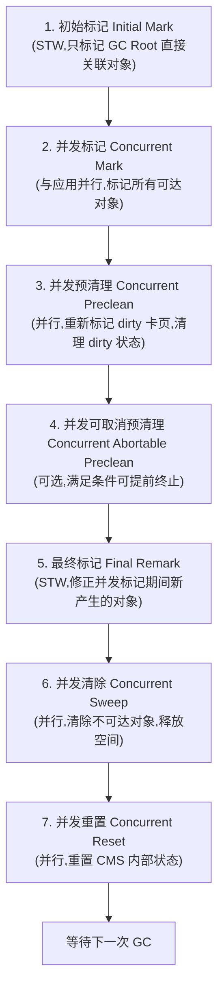
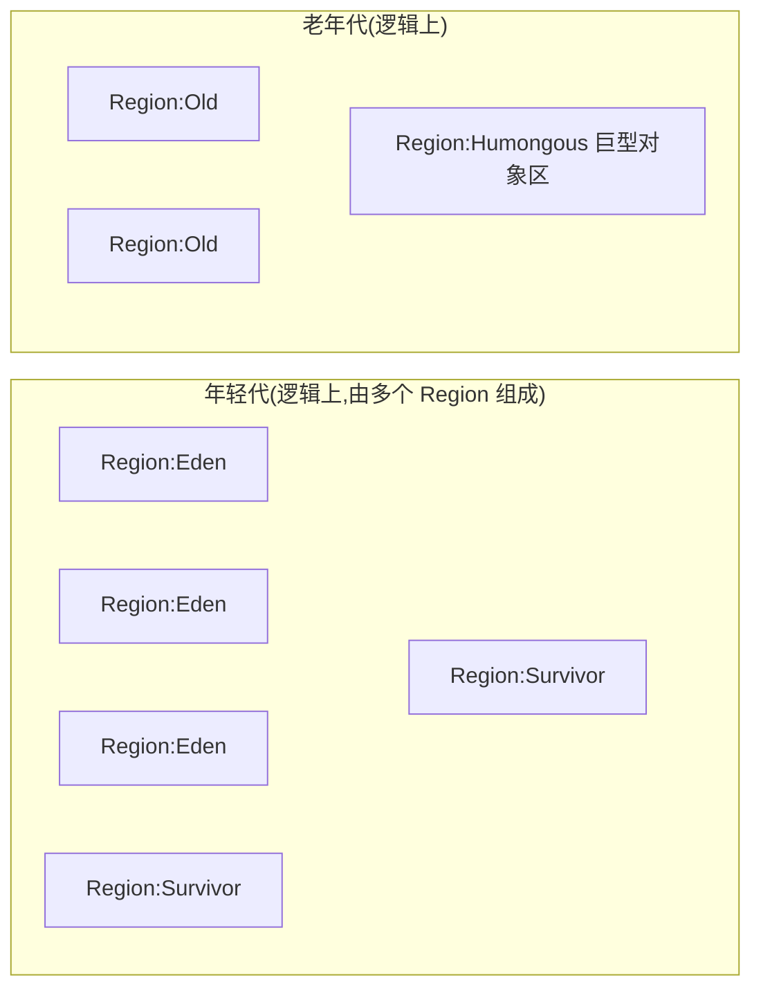
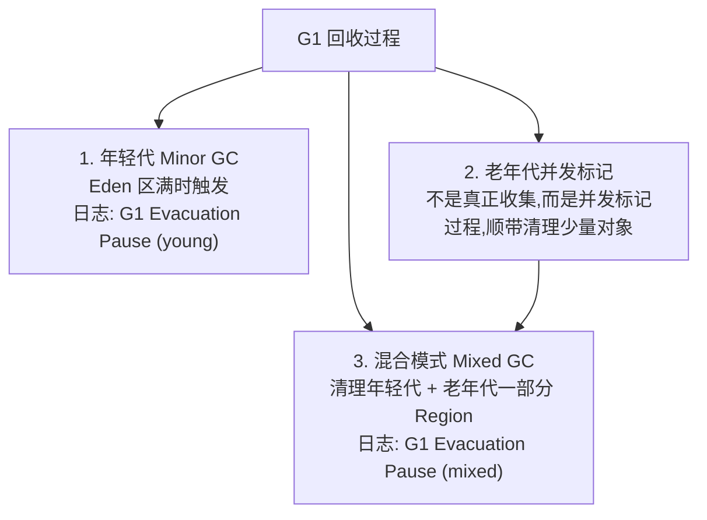

# JVM 垃圾回收与调优

## 垃圾回收机制

### 标记（Mark）
垃圾回收的第一步就是找出活跃的对象。GC 过程是逆向的。

在前面的节谈到 GC Roots。根据 GC Roots 遍历所有的可达对象，这个过程就叫作标记。


圆圈代表的是对象。绿色的代表 GC Roots，红色的代表可以追溯到的对象。可以看到标记之后，仍然有多个灰色的圆圈，它们都是被回收的对象。

### 清除（Sweep）
清除阶段就是把未被标记的对象回收掉。


但是这种简单的清除方式有一个明显的弊端，那就是碎片问题。

比如申请了 1k、2k、3k、4k、5k 的内存。


由于某种原因，2k 和 4k 的内存不再使用，就需要交给垃圾回收器回收。


这个时候应该有足足 6k 的空闲空间。接下来打算申请另外一个 5k 的空间，结果系统告诉内存不足了。系统运行时间越长，这种碎片就越多。

在很久之前使用 Windows 系统时，有一个非常有用的功能，就是内存整理和磁盘整理，运行之后有可能会显著提高系统性能。这个出发点是一样的。

### 复制（Copy）
解决碎片问题没有银弹，只有老老实实的进行内存整理。

有一个比较好的思路可以完成这个整理过程，就是提供一个对等的内存空间，将存活的对象复制过去，然后清除原内存空间。

在程序设计中，一般遇到扩缩容或者碎片整理问题时，复制算法都是非常有效的。比如：HashMap 的扩容也是使用同样的思路，Redis 的 rehash 也是类似的。

整个过程如图所示：


这种方式看似非常完美，解决了碎片问题。但是它的弊端也非常明显。它浪费了几乎一半的内存空间来做这个事情，如果资源本来就很有限，这就是一种无法容忍的浪费。

### 整理（Compact）
其实，不用分配一个对等的额外空间，也是可以完成内存的整理工作的。

可以把内存想象成一个非常大的数组，根据随机的 index 删除了一些数据。那么对整个数组的清理，其实是不需要另外一个数组来进行支持的，使用程序就可以实现。

它的主要思路就是移动所有存活的对象，且按照内存地址顺序依次排列，然后将末端内存地址以后的内存全部回收。


可以用一个理想的算法来看一下这个过程。

```
last = 0
for(i=0;i<mems.length;i++){
  if(mems[i] != null){
      mems[last++] = mems[i]
      changeReference(mems[last])
  }
}
clear(mems,last,mems.length)
```

但是需要注意，这只是一个理想状态。对象的引用关系一般都是非常复杂的，这里不对具体的算法进行描述。从效率上来说，一般整理算法是要低于复制算法的。

### 分代
上面简要介绍了一些常见的内存回收算法，目前 JVM 的垃圾回收器都是对几种朴素算法的发扬光大。简单看一下它们的特点：

- **复制算法（Copy）**

复制算法是所有算法里面效率最高的，缺点是会造成一定的空间浪费。

- **标记-清除（Mark-Sweep）**

效率一般，缺点是会造成内存碎片问题。

- **标记-整理（Mark-Compact）**

效率比前两者要差，但没有空间浪费，也消除了内存碎片问题。

所以，没有最优的算法，只有最合适的算法。

JVM 是计算节点，而不是存储节点。最理想的情况就是对象在用完之后，它的生命周期立马就结束了。而那些被频繁访问的资源，希望它能够常驻在内存里。

研究表明，大部分对象可以分为两类：

- 大部分对象的生命周期都很短；
- 其他对象则很可能会存活很长时间。

**大部分死的快，其他的活的长。** 这个假设称之为**弱代假设**（weak generational hypothesis）。


从图中可以看到，大部分对象是朝生夕灭的，其他的则活得很久。

现在的垃圾回收器都会在物理上或者逻辑上，把这两类对象进行区分。把死的快的对象所占的区域叫作年轻代（Young generation），把其他活的长的对象所占的区域叫作老年代（Old generation）。

老年代在有些地方也会叫作 Tenured Generation，看到时明白它的意思即可。


### 年轻代
年轻代使用的垃圾回收算法是复制算法。因为年轻代发生 GC 后只会有非常少的对象存活，复制这部分对象是非常高效的。

前面了解到复制算法会造成一定的空间浪费，所以年轻代中间也会分很多区域。


年轻代分为：一个伊甸园空间（Eden），两个幸存者空间（Survivor）。

当年轻代中的 Eden 区分配满的时候，就会触发年轻代的 GC（Minor GC）。具体过程如下：

- 在 Eden 区执行了第一次 GC 之后，存活的对象会被移动到其中一个 Survivor 分区（以下简称 from）；
- Eden 区再次 GC，这时会采用复制算法，将 Eden 和 from 区一起清理。存活的对象会被复制到 to 区；接下来只需要清空 from 区就可以了。

所以在这个过程中，总会有一个 Survivor 分区是空置的。Eden、from、to 的默认比例是 8:1:1，所以只会造成 10% 的空间浪费。

这个比例是由参数 **-XX:SurvivorRatio** 进行配置的（默认为 8）。

一般情况下，只需要了解到这一层面即可。但是在平常的面试中还有一个点会经常提到，虽然频率不太高，它就是 TLAB，在这里也简单介绍一下。

TLAB 的全称是 **Thread Local Allocation Buffer**，JVM 默认给每个线程开辟一个 buffer 区域，用来加速对象分配。这个 buffer 就放在 Eden 区中。

这个道理和 Java 语言中的 ThreadLocal 类似，避免了对公共区的操作，以及一些锁竞争。


对象的分配优先在 TLAB 上分配，但 TLAB 通常都很小，所以对象相对比较大的时候，会在 Eden 区的共享区域进行分配。

TLAB 是一种优化技术，类似的优化还有对象的栈上分配（这可以引出逃逸分析的话题，默认开启）。这属于非常细节的优化，不做过多介绍，但偶尔面试也会被问到。

### 老年代
老年代一般使用"标记-清除"、"标记-整理"算法，因为老年代的对象存活率一般是比较高的，空间又比较大，拷贝起来并不划算，还不如采取就地收集的方式。

那么，对象是怎么进入老年代的呢？有多种途径。

**（1）提升（Promotion）**

如果对象够老，会通过"提升"进入老年代。

关于对象老不老，是通过它的年龄（age）来判断的。每当发生一次 Minor GC，存活下来的对象年龄都会加 1。直到达到一定的阈值，就会把这些对象提升到老年代。

这些对象如果变的不可达，直到老年代发生 GC 的时候才会被清理掉。

这个阈值可以通过参数 **-XX:MaxTenuringThreshold** 进行配置，最大值是 15，因为它是用 4bit 存储的（所以网络上那些要把这个值调得很大的文章，是没有什么根据的）。

**（2）分配担保**

看一下年轻代的图，每次存活的对象都会放入其中一个幸存区，这个区域默认的比例是 10%。但是无法保证每次存活的对象都小于 10%，当 Survivor 空间不够，就需要依赖其他内存（指老年代）进行分配担保。这个时候，对象也会直接在老年代上分配。

**（3）大对象直接在老年代分配**

超出某个大小的对象将直接在老年代分配。这个值是通过参数 -XX:PretenureSizeThreshold 进行配置的。默认为 0，意思是全部首选 Eden 区进行分配。

**（4）动态对象年龄判定**

有的垃圾回收算法并不要求 age 必须达到 15 才能晋升到老年代，它会使用一些动态的计算方法。比如，如果幸存区中相同年龄对象大小的和大于幸存区的一半，大于或等于 age 的对象将会直接进入老年代。

这些动态判定一般不受外部控制，知道有这么回事就可以了。通过下图可以看一下一个对象的分配逻辑。


### 卡片标记（card marking）
对象的引用关系是一个巨大的网状。有的对象可能在 Eden 区，有的可能在老年代，那么这种跨代的引用是如何处理的呢？由于 Minor GC 是单独发生的，如果一个老年代的对象引用了它，如何确保能够让年轻代的对象存活呢？

对于是、否的判断，通常都会用 Bitmap（位图）和布隆过滤器来加快搜索的速度。

JVM 也是用了类似的方法。其实，老年代被分成众多的卡页（card page）（一般数量是 2 的次幂）。

卡表（Card Table）就是用于标记卡页状态的一个集合，每个卡表项对应一个卡页。

如果年轻代有对象分配，而且老年代有对象指向这个新对象，那么这个老年代对象所对应内存的卡页就会标识为 dirty，卡表只需要非常小的存储空间就可以保留这些状态。

垃圾回收时，就可以先读这个卡表，进行快速判断。

### HotSpot 垃圾回收器
下面介绍 HotSpot 的几个垃圾回收器，每种回收器都有各自的特点。在平常的 GC 优化时，一定要搞清楚现在用的是哪种垃圾回收器。

在此之前，把上面的分代垃圾回收整理成一张大图，在介绍下面的收集器时可以对应一下它们的位置。


#### 年轻代垃圾回收器
**（1）Serial 垃圾收集器**

处理 GC 的只有一条线程，并且在垃圾回收的过程中暂停一切用户线程。

这可以说是最简单的垃圾回收器，但千万别以为它没有用武之地。因为简单所以高效，它通常用在客户端应用上。因为客户端应用不会频繁创建很多对象，用户也不会感觉出明显的卡顿。相反，它使用的资源更少，也更轻量级。

**（2）ParNew 垃圾收集器**

ParNew 是 Serial 的多线程版本。由多条 GC 线程并行地进行垃圾清理。清理过程依然要停止用户线程。

ParNew 追求"低停顿时间"，与 Serial 唯一区别就是使用了多线程进行垃圾收集，在多 CPU 环境下性能比 Serial 会有一定程度的提升；但线程切换需要额外的开销，因此在单 CPU 环境中表现不如 Serial。

**（3）Parallel Scavenge 垃圾收集器**

另一个多线程版本的垃圾回收器。它与 ParNew 的主要区别是：

- Parallel Scavenge：追求 CPU 吞吐量，能够在较短时间内完成指定任务，适合没有交互的后台计算。弱交互强计算。
- ParNew：追求降低用户停顿时间，适合交互式应用。强交互弱计算。

#### 老年代垃圾收集器
**（1）Serial Old 垃圾收集器**

与年轻代的 Serial 垃圾收集器对应，都是单线程版本，同样适合客户端使用。

年轻代的 Serial 使用复制算法。

老年代的 Old Serial 使用标记-整理算法。

**（2）Parallel Old**

Parallel Old 收集器是 Parallel Scavenge 的老年代版本，追求 CPU 吞吐量。

**（3）CMS 垃圾收集器**

CMS（Concurrent Mark Sweep）收集器是以获取最短 GC 停顿时间为目标的收集器，它在垃圾收集时使得用户线程和 GC 线程能够并发执行，因此在垃圾收集过程中用户也不会感到明显的卡顿。在后面的节详细介绍它。

长期来看，CMS 垃圾回收器是要被 G1 等垃圾回收器替换掉的。在 Java8 之后，使用它将会抛出一个警告。

Java HotSpot(TM) 64-Bit Server VM warning: Option UseConcMarkSweepGC was deprecated in version 9.0 and will likely be removed in a future release.

（这一警告已成现实：CMS 已于 JDK 14 被彻底移除（JEP 363），配套的 ParNew 亦不可用。现代 JDK（17/21/25）中 `-XX:+UseConcMarkSweepGC` 会直接报错。）

#### 配置参数
除了上面几个垃圾回收器，还有 G1、ZGC 等更加高级的垃圾回收器，它们都有专门的配置参数来使其生效。

通过 -XX:+PrintCommandLineFlags 参数，可以查看当前 Java 版本默认使用的垃圾回收器。Java13 默认的收集器就是 G1。

java  -XX:+PrintCommandLineFlags  -version

-XX:G1ConcRefinementThreads=4 -XX:GCDrainStackTargetSize=64 -XX:InitialHeapSize=134217728 -XX:MaxHeapSize=2147483648 -XX:MinHeapSize=6815736 -XX:+PrintCommandLineFlags -XX:ReservedCodeCacheSize=251658240 -XX:+SegmentedCodeCache -XX:+UseCompressedClassPointers -XX:+UseCompressedOops -XX:+UseG1GC

java version "13.0.1" 2019-10-15

Java(TM) SE Runtime Environment (build 13.0.1+9)

Java HotSpot(TM) 64-Bit Server VM (build 13.0.1+9, mixed mode, sharing)

以下是一些配置参数：

- **-XX:+UseSerialGC** 年轻代和老年代都用串行收集器
- **-XX:+UseParNewGC** 年轻代使用 ParNew，老年代使用 Serial Old
- **-XX:+UseParallelGC** 年轻代使用 ParallelGC，老年代使用 Serial Old
- **-XX:+UseParallelOldGC** 新生代和老年代都使用并行收集器
- **-XX:+UseConcMarkSweepGC**，表示年轻代使用 ParNew，老年代的用 CMS
- **-XX:+UseG1GC** 使用 G1 垃圾回收器
- **-XX:+UseZGC** 使用 ZGC 垃圾回收器

为了有个更好的印象，请看下图。它们的关系还是比较复杂的。尤其注意 -XX:+UseParNewGC 这个参数，已经在 Java9 中被抛弃了。很多程序（比如 ES）会报这个错误，不要感到奇怪。


有这么多垃圾回收器和参数，那到底用什么？在什么地方优化呢？

目前，虽然 Java 的版本比较高，但是使用最多的还是 Java8。从 Java8 升级到高版本的 Java 体系是有一定成本的，所以 CMS 垃圾回收器还会持续一段时间。

线上使用最多的垃圾回收器就有 CMS 和 G1，以及 Java8 默认的 Parallel Scavenge。

- CMS 的设置参数：-XX:+UseConcMarkSweepGC。
- Java8 的默认参数：-XX:+UseParallelGC。
- Java13 的默认参数：-XX:+UseG1GC。

> **现状注记（2026-09）**：G1 自 JDK 9 起就是 HotSpot 默认收集器，新项目不应再选用 CMS（JDK 14 已移除）。主线 LTS（17/21/25）的生产环境以 G1 为主，超大堆低延迟场景可用分代 ZGC 或 Shenandoah。

实战练习的节中就集中会使用这几个参数。

### STW
如果在垃圾回收的时候（不管是标记还是整理复制），又有新的对象进入怎么办？

为了保证程序不会乱套，最好的办法就是暂停用户的一切线程。也就是在这段时间不能 new 对象，只能等待。表现在 JVM 上就是短暂的卡顿，什么都干不了。这个现象就叫作 Stop the world，简称 STW。

标记阶段大多数是要 STW 的。如果不暂停用户进程，在标记对象的时候，有可能有其他用户线程会产生一些新的对象和引用，造成混乱。

现在的垃圾回收器都会尽量去减少这个过程。但即使是最先进的 ZGC 也会有短暂的 STW 过程。要做的就是在现有基础设施上尽量减少 GC 停顿。

STW 的影响可以用一个例子说明。

某个高并发服务的峰值流量是 10 万次/秒，后面有 10 台负载均衡的机器，那么每台机器平均下来需要 1w/s。假如某台机器在这段时间内发生了 STW，持续了 1 秒，那么本来需要 10ms 就可以返回的 1 万个请求，需要至少等待 1 秒钟。


在用户那里的表现就是系统发生了卡顿。如果 GC 非常的频繁，这种卡顿就会特别的明显，严重影响用户体验。

虽然说 Java 提供了非常棒的自动内存管理机制，但也不能滥用，因为它是有 STW 硬伤的。

### CMS 回收过程


#### 初始标记（Initial Mark）
初始标记阶段只标记直接关联 GC root 的对象，不用向下追溯。因为最耗时的就在 tracing 阶段，这样就极大地缩短了初始标记时间。

这个过程是 STW 的，但由于只是标记第一层，所以速度是很快的。

注意，这里除了要标记相关的 GC Roots 之外，还要标记年轻代中对象的引用，这也是 CMS 老年代回收依然要扫描新生代的原因。

#### 并发标记（Concurrent Mark）
在初始标记的基础上进行并发标记。这一步骤主要是 tracing 的过程，用于标记所有可达的对象。

这个过程会持续比较长的时间，但却可以和用户线程并行。在这个阶段的执行过程中，可能会产生很多变化：

- 有些对象从新生代晋升到了老年代；
- 有些对象直接分配到了老年代；
- 老年代或者新生代的对象引用发生了变化。

还记得上一节提到的卡片标记么？在这个阶段受到影响的老年代对象所对应的卡页会被标记为 dirty，用于后续重新标记阶段的扫描。

#### 并发预清理（Concurrent Preclean）
并发预清理也是不需要 STW 的，目的是为了让重新标记阶段的 STW 尽可能短。这个时候，老年代中被标记为 dirty 的卡页中的对象就会被重新标记，然后清除掉 dirty 的状态。

由于这个阶段也是可以并发的，在执行过程中引用关系依然会发生一些变化。可以假定这个清理动作是第一次清理。

所以重新标记阶段有可能还会有处于 dirty 状态的卡页。

#### 并发可取消的预清理（Concurrent Abortable Preclean）
因为重新标记是需要 STW 的，所以会有很多次预清理动作。并发可取消的预清理，顾名思义，在满足某些条件的时候可以终止，比如迭代次数、有用工作量、消耗的系统时间等。

这个阶段是可选的。换句话说，这个阶段是"并发预清理"阶段的一种优化。

这个阶段的第一个意图是避免回扫年轻代的大量对象；另外一个意图是当满足最终标记的条件时自动退出。

前面说过，标记动作是需要扫描年轻代的。如果年轻代的对象太多，肯定会严重影响标记的时间。如果在此之前能够进行一次 Minor GC，情况会不会变得好了许多？

CMS 提供了参数 CMSScavengeBeforeRemark，可以在进入重新标记之前强制进行一次 Minor GC。

GC 的停顿是不分什么年轻代老年代的。设置了上面的参数，可能会在一个比较长的 Minor GC 之后紧跟着一个 CMS 的 Remark，它们都是 STW 的。

这部分有非常多的配置参数，但一般都不会去改动。

#### 最终标记（Final Remark）
通常 CMS 会尝试在年轻代尽可能空的情况下运行 Final Remark 阶段，以免接连多次发生 STW 事件。

这是 CMS 垃圾回收阶段的第二次 STW 阶段，目标是完成老年代中所有存活对象的标记。前几轮的 preclean 阶段一直在和应用线程追赶引用的变化速度，有可能跟不上。本轮的标记动作就需要 STW 来处理这些情况。

如果预处理阶段做的不够好，会显著增加本阶段的 STW 时间。可以看到，CMS 垃圾回收器把回收过程分了多个部分，而影响最大的不是 STW 阶段本身，而是它之前的预处理动作。

#### 并发清除（Concurrent Sweep）
此阶段用户线程被重新激活，目标是删掉不可达的对象，并回收它们的空间。

由于 CMS 并发清理阶段用户线程还在运行中，伴随程序运行自然就还会有新的垃圾不断产生，这一部分垃圾出现在标记过程之后，CMS 无法在当次 GC 中处理掉它们，只好留待下一次 GC 时再清理掉。这一部分垃圾就称为"浮动垃圾"。

#### 并发重置（Concurrent Reset）
此阶段与应用程序并发执行，重置 CMS 算法相关的内部数据，为下一次 GC 循环做准备。

### 内存碎片
由于 CMS 在执行过程中用户线程还需要运行，那就需要保证有充足的内存空间供用户使用。如果等到老年代空间快满了再开启这个回收过程，用户线程可能会产生"Concurrent Mode Failure"的错误，这时会临时启用 Serial Old 收集器来重新进行老年代的垃圾收集，这样停顿时间就很长了（STW）。

这部分空间预留一般在 30% 左右即可，那么能用的大概只有 70%。参数 -XX:CMSInitiatingOccupancyFraction 用来配置这个比例（记得要首先开启参数 UseCMSInitiatingOccupancyOnly）。也就是说，当老年代的使用率达到 70% 就会触发 GC 了。如果系统老年代增长不是太快，可以调高这个参数，降低内存回收的次数。

其实，这个比率非常不好设置。一般在堆大小小于 2GB 的时候，都不会考虑 CMS 垃圾回收器。

另外，CMS 对老年代回收的时候并没有内存的整理阶段。这就造成程序在长时间运行之后碎片太多。如果申请一个稍大的对象，就会引起分配失败。

CMS 提供了两个参数来解决这个问题：

（1）UseCMSCompactAtFullCollection（默认开启），表示在要进行 Full GC 的时候进行内存碎片整理。内存整理的过程是无法并发的，所以停顿时间会变长。

（2）CMSFullGCsBeforeCompaction，每隔多少次不压缩的 Full GC 后执行一次带压缩的 Full GC。默认值为 0，表示每次进入 Full GC 时都进行碎片整理。

所以，预留空间加上内存的碎片，使用 CMS 垃圾回收器的老年代留给我们的空间就不是太多，这也是 CMS 的一个弱点。

## G1 与回收器选择

### 为什么叫 G1
G1 的目标是用来干掉 CMS 的，它同样是一款软实时垃圾回收器。相比 CMS，G1 的使用更加人性化。比如 CMS 垃圾回收器的相关参数有 72 个，而 G1 的参数只有 26 个（此为原文写作时的粗略统计，仅作量级参考）。

G1 的全称是 Garbage­First GC，为了达成上面制定的 KPI，它和前面介绍的垃圾回收器在对堆的划分上有一些不同。

其他的回收器都是对某个年代的整体收集，收集时间上自然不好控制。G1 把堆切成了很多份，把每一份当作一个小目标，目标很容易达成。

G1 有年轻代和老年代的区分吗？



G1 也是有 Eden 区和 Survivor 区的概念的，只不过它们在内存上不是连续的，而是由一小份一小份组成的。

这一小份区域的大小是固定的，名字叫作小堆区（Region）。小堆区可以是 Eden 区，也可以是 Survivor 区，还可以是 Old 区。所以 G1 的年轻代和老年代的概念都是逻辑上的。

每一块 Region 大小都是一致的，它的数值是在 1M 到 32M 字节之间的一个 2 的幂值数。

但假如对象太大，一个 Region 放不下了怎么办？注意图中有一块面积很大的黄色区域，它的名字叫作 Humongous Region，大小超过 Region 50% 的对象将会在这里分配。

Region 的大小可以通过参数进行设置：

-XX:G1HeapRegionSize=<N>M

那么，回收的时候到底回收哪些小堆区呢？是随机的么？

这当然不是。事实上，垃圾最多的小堆区会被优先收集。这就是 G1 名字的由来。

### G1 的垃圾回收过程
在逻辑上 G1 分为年轻代和老年代，但它的年轻代和老年代比例并不是那么"固定"，为了达到 MaxGCPauseMillis 所规定的效果，G1 会自动调整两者之间的比例。

如果强行使用 -Xmn 或者 -XX:NewRatio 去设定它们的比例的话，给 G1 设定的这个目标将会失效。

G1 的回收过程主要分为 3 类：

（1）G1"年轻代"的垃圾回收同样叫 Minor GC，这个过程和前面描述的类似，发生时机就是 Eden 区满的时候。

（2）老年代的垃圾收集严格上来说其实不算是收集，它是一个"并发标记"的过程，顺便清理了一点点对象。

（3）真正的清理发生在"混合模式"，它不止清理年轻代，还会将老年代的一部分区域进行清理。



在 GC 日志里这个过程描述特别有意思，（1）的过程叫作 [GC pause (G1 Evacuation Pause) (young)，而（2）的过程叫作 [GC pause (G1 Evacuation Pause) (mixed)。Evacuation 是转移的意思，和 Copy 的意思有点类似。

这三种模式之间的间隔也是不固定的。比如，1 次 Minor GC 后发生了一次并发标记，接着发生了 9 次 Mixed GC。

### RSet
RSet 是一个空间换时间的数据结构。

在第 6 节中提到过一个叫作卡表（Card Table）的数据结构，用来解决跨代引用的问题。RSet 的功能与此类似，它的全称是 Remembered Set，用于记录和维护 Region 之间的对象引用关系。

但 RSet 与 Card Table 有些不同的地方。Card Table 是一种 points-out（我引用了谁的对象）的结构。而 RSet 记录了其他 Region 中的对象引用本 Region 中对象的关系，属于 points-into 结构（谁引用了我的对象），有点倒排索引的味道。

可以把 RSet 理解成一个 Hash，key 是引用的 Region 地址，value 是引用它的对象的卡页集合。


有了这个数据结构，在回收某个 Region 的时候就不必对整个堆内存的对象进行扫描了。它使得部分收集成为了可能。

对于年轻代的 Region，它的 RSet 只保存了来自老年代的引用，这是因为年轻代的回收是针对所有年轻代 Region 的，没必要画蛇添足。所以说年轻代 Region 的 RSet 有可能是空的。

而对于老年代的 Region 来说，它的 RSet 也只会保存老年代对它的引用。这是因为老年代回收之前会先对年轻代进行回收。这时 Eden 区变空了，而在回收过程中会扫描 Survivor 分区，所以也没必要保存来自年轻代的引用。

RSet 通常会占用很大的空间，大约 5% 或者更高。不仅仅是空间方面，很多计算开销也是比较大的。

事实上，为了维护 RSet，程序运行的过程中写入某个字段就会产生一个 post-write barrier。为了减少这个开销，将内容放入 RSet 的过程是异步的，而且经过了很多优化：Write Barrier 把脏卡信息存放到本地缓冲区（local buffer），有专门的 GC 线程负责收集，并将相关信息传给被引用 Region 的 RSet。

参数 -XX:G1ConcRefinementThreads 或者 -XX:ParallelGCThreads 可以控制这个异步的过程。如果并发优化线程跟不上缓冲区的速度，就会在用户进程上完成。

### 具体回收过程
G1 还有一个 CSet 的概念。它的全称是 Collection Set，即收集集合，保存一次 GC 中将执行垃圾回收的区间（Region）。GC 是在 CSet 中的所有存活数据（Live Data）都会被转移。

了解了上面的数据结构，再简要看一下回收过程。

#### 年轻代回收
年轻代回收是一个 STW 的过程，它的跨代引用使用 RSet 数据结构来追溯，会一次性回收掉年轻代的所有 Region。

JVM 启动时，G1 会先准备好 Eden 区，程序在运行过程中不断创建对象到 Eden 区，当所有的 Eden 区都满了，G1 会启动一次年轻代垃圾回收过程。

```mermaid
flowchart TD
  A[Eden 区满了,触发年轻代回收(STW)] --> B["1. 扫描根<br/>扫描 GC Roots + RSet 记录的外部引用"]
  B --> C["2. 更新 RS<br/>处理 dirty 卡页,更新 RSet"]
  C --> D["3. 处理 RS<br/>扫描 RSet 中引用年轻代的老年代对象"]
  D --> E["4. 复制对象<br/>存活对象复制到 Survivor/晋升老年代"]
  E --> F["5. 处理引用<br/>处理软/弱/虚/强引用队列"]
  F --> G[回收完成,释放 Eden 与部分 Survivor]
```

年轻代的收集包括下面的回收阶段：

（1）扫描根

根可以看作前面介绍的 GC Roots，加上 RSet 记录的其他 Region 的外部引用。

（2）更新 RS

处理 dirty card queue 中的卡页，更新 RSet。此阶段完成后，RSet 可以准确地反映老年代对所在的内存分段中对象的引用。可以看作是第一步的补充。

（3）处理 RS

识别被老年代对象指向的 Eden 中的对象，这些被指向的 Eden 中的对象被认为是存活的对象。

（4）复制对象

收集算法依然使用的是 Copy 算法。

在这个阶段，对象树被遍历，Eden 区内存段中存活的对象会被复制到 Survivor 区中空的 Region。这个过程和其他垃圾回收算法一样，包括对象的年龄和晋升，无需做过多介绍。

（5）处理引用

处理 Soft、Weak、Phantom、Final、JNI Weak 等引用。结束收集。


#### 并发标记（Concurrent Marking）
当整个堆内存使用达到一定比例（默认是 45%），并发标记阶段就会被启动。这个比例也是可以调整的，通过参数 -XX:InitiatingHeapOccupancyPercent 进行配置。

Concurrent Marking 是为 Mixed GC 提供标记服务的，并不是一次 GC 过程的一个必须环节。这个过程和 CMS 垃圾回收器的回收过程非常类似，可以类比 CMS 的回收过程看一下。具体标记过程如下：

（1）初始标记（Initial Mark）

这个过程共用了 Minor GC 的暂停，这是因为它们可以复用 root scan 操作。虽然是 STW 的，但是时间通常非常短。

（2）Root 区扫描（Root Region Scan）

（3）并发标记（ Concurrent Mark）

这个阶段从 GC Roots 开始对 heap 中的对象标记，标记线程与应用程序线程并行执行，并且收集各个 Region 的存活对象信息。

（4）重新标记（Remaking）

和 CMS 类似，也是 STW 的。标记那些在并发标记阶段发生变化的对象。

（5）清理阶段（Cleanup）

这个过程不需要 STW。如果发现 Region 里全是垃圾，在这个阶段会立马被清除掉。不全是垃圾的 Region 并不会被立马处理，它会在 Mixed GC 阶段进行收集。

了解 CMS 垃圾回收器后，上面这个过程就比较好理解。但是还有一个疑问需要稍微提一下。

如果在并发标记阶段又有新的对象变化，该怎么办？

这是由算法 SATB 保证的。SATB 的全称是 Snapshot At The Beginning，它的作用是保证在并发标记阶段的正确性。


这个快照是逻辑上的，主要是几个指针将 Region 分成多个区段。并发标记期间分配的对象都会在 next TAMS 和 top 之间。

#### 混合回收（Mixed GC）
能并发清理老年代中的整个整个的小堆区是一种最优情形。混合收集过程不只清理年轻代，还会将一部分老年代区域也加入到 CSet 中。

通过 Concurrent Marking 阶段，已经统计了老年代的垃圾占比。在 Minor GC 之后，如果判断这个占比达到了某个阈值，下次就会触发 Mixed GC。这个阈值由 -XX:G1HeapWastePercent 参数进行设置（默认是堆大小的 5%）。因为这种情况下，GC 会花费很多的时间但是回收到的内存却很少。所以这个参数也是可以调整 Mixed GC 的频率的。

还有参数 G1MixedGCCountTarget，用于控制一次并发标记之后最多执行 Mixed GC 的次数。

### ZGC
在系统切换到 G1 垃圾回收器之后，线上发生的严重 GC 问题已经非常少了。

这归功于 G1 的预测模型和它创新的分区模式。但预测模型也会有失效的时候，它并不是总如期望的那样运行，尤其是给它定下一个苛刻的目标之后。

另外，如果应用的内存非常吃紧，对内存进行部分回收根本不够，始终要进行整个 Heap 的回收，那么 G1 要做的工作量就一点也不会比其他垃圾回收器少，而且因为本身算法复杂了，还可能比其他回收器要差。

所以垃圾回收器本身的优化和升级从来都没有停止过。最新的 ZGC 垃圾回收器就有 3 个令人振奋的 Flag：

- 停顿时间不会超过 10ms；
- 停顿时间不会随着堆的增大而增大（不管多大的堆都能保持在 10ms 以下）；
- 可支持几百 M，甚至几 T 的堆大小（最大支持 4T）。


在早期 ZGC（JDK 11 预览 ~ JDK 15 正式）中，连逻辑上的年轻代和老年代也去掉了，只分为一块块的 page，每次进行 GC 时都会对 page 进行压缩操作，所以没有碎片问题。ZGC 还能感知 NUMA 架构，提高内存的访问速度。与传统的收集算法相比，ZGC 直接在对象的引用指针上做文章用来标识对象的状态，所以它只能用在 64 位的机器上。

> **版本更新（JEP 439，JDK 21）**：JDK 21 引入**分代 ZGC（Generational ZGC）**——重新划分年轻代/老年代，年轻对象高频回收，显著降低 CPU 与内存开销，整体性能优于非分代版本。JDK 21+ 推荐直接使用分代模式（`-XX:+UseZGC` 默认启用分代，JDK 24 起非分代模式已移除）。

现在在线上使用 ZGC 的已经比较普遍（JDK 17/21 的 Linux 生产环境）。ZGC 优先在 Linux 平台使用，适合大堆（几百 MB 到几 TB）且要求低延迟（<10ms）的场景，例如交易系统、在线广告、网关等。

## 容量估算与调优

### 考量指标


#### 系统容量
系统容量非常好理解。比如，运维费用有限制，就决定了机器最多是 2C4G 的。

举个比较极端的例子。假如内存是无限大的，那么无论是存活对象还是垃圾对象，都不需要额外的计算和回收，只需要往里放就可以了。这样就没有什么吞吐量和延迟的概念了。

但这毕竟是一厢情愿。越是资源限制比较严格的系统，对它的优化就会越明显。通常在一个资源相对宽松的环境下优化的参数，平移到另外一个限制资源的环境下，并不是最优解。

#### 吞吐量-延迟
下面看一下吞吐量和延迟方面的概念。

以一家面包店为例。首要目标是卖出更多的面包，因为赚钱是最要紧的。

为了让客人更快买到面包，引进了很多先进的设备，使得制作面包的间隔减少到 30 分钟，一批面包可以有 100 个。

工人按照一天 8 小时工作制，每天就可以制作 8x2x100=1600 个面包。

但是每天的需求大约是 2000 个面包。

只好再引进更加先进的设备，这种设备可以一次做出 200 个面包，一天可以做 2000~3000 个面包，但是每运行一段时间就需要冷却一会儿。

原来每个客人最多等 30 分钟就可以拿到面包，现在有的客人需要等待 40 分钟。客人通常受不了这么长的等待时间，第二天就不来了。

考虑到营业目标，就可以抽象出两个概念。

- 吞吐量，也就是每天制作的面包数量。
- 延迟，也就是等待的时间，涉及影响顾客的满意度。


吞吐量大不代表响应能力高，吞吐量一般这么描述：在一个时间段内完成了多少个事务操作；在一个小时之内完成了多少批量操作。

响应能力是以最大的延迟时间来判断的，比如：一个桌面按钮对一个触发事件响应有多快；需要多长时间返回一个网页；查询一行 SQL 需要多长时间，等等。

这两个目标在有限的资源下通常不能够同时达到，需要做一些权衡。

#### 选择垃圾回收器
回顾一下前面介绍的垃圾回收器，简单看一下它们的应用场景。

- 如果堆大小不是很大（比如 100MB），选择串行收集器一般是效率最高的。参数：-XX:+UseSerialGC。
- 如果应用运行在单核的机器上，或者虚拟机核数只有 1C，选择串行收集器依然是合适的，这时候启用一些并行收集器没有任何收益。参数：-XX:+UseSerialGC。
- 如果应用是"吞吐量"优先的，并且对较长时间的停顿没有什么特别的要求，选择并行收集器是比较好的。参数：-XX:+UseParallelGC。
- 如果应用对响应时间要求较高，想要较少的停顿。甚至 1 秒的停顿都会引起大量的请求失败，那么选择 G1、ZGC、CMS 都是合理的（CMS 仅适用于 JDK 13 及以前的旧版本，现代 JDK 请使用 G1 或 ZGC）。虽然这些收集器的 GC 停顿通常都比较短，但它需要一些额外的资源去处理这些工作，通常吞吐量会低一些。参数：-XX:+UseG1GC、-XX:+UseZGC 等（旧版本可用 -XX:+UseConcMarkSweepGC）。

从上面这些出发点来看，平常的 Web 服务器都是对响应性要求非常高的，选择性其实就集中在 CMS、G1、ZGC 上。

平常的 Web 服务器都是对响应性要求非常高的，选择性其实就集中在 G1、ZGC 上；而对于某些定时任务，使用并行收集器是一个比较好的选择。

### 大流量应用特点
这是一类对延迟非常敏感的系统。吞吐量一般可以通过堆机器解决。

如果一项业务有价值，客户很喜欢，那亿级流量很容易就能达到。假如某个接口一天有 10 亿次请求，每秒的峰值大概也就 5~6 w/秒，虽然不算是很大，但也不算小。最直接的影响就是：可能发个版，几万用户的请求就抖一抖。

一般达到这种量级的系统，承接请求的都不是一台服务器，接口都会要求快速响应，一般不会超过 100ms。

这种系统一般都是社交、电商、游戏、支付场景等，要求的是短、平、快。长时间停顿会堆积海量的请求，所以在停顿发生的时候表现会特别明显。要考量这些系统，有很多指标。

- 每秒处理的事务数量（TPS）；
- 平均响应时间（AVG）；
- TP 值，比如 TP90 代表有 90% 的请求响应时间小于 x 毫秒。

可以看出，它和 JVM 的某些指标很像。

尤其是 TP 值，最能代表系统中到底有多少长尾请求，这部分请求才是影响系统稳定性的元凶。大多数情况下，GC 增加，长尾请求的数量也会增加。

目标就是减少这些停顿。本案例假定使用的是 CMS 垃圾回收器（为 CMS 时代的实战记录，思路可迁移到 G1）。

### 估算
在《编程珠玑》第七章里，将估算看作程序员的一项非常重要的技能。这是一种化繁为简的能力，不要求极度精确，但对问题的分析有着巨大的帮助。

拿一个简单的 Feed 业务来说。查询用户在社交网站上发送的帖子，还需要查询第一页的留言（大概是 15 条），它们共同组成了每次查询后的实体。

```
class Feed{
   private User user;
   private List<Comment> commentList;
   private String content;
}
```

这种类型的数据结构一般返回体都比较大，大概会有几 KB 到几十 KB 不等。就可以对这些数据进行大体估算。具体的数据来源可以看日志，也可以分析线上的请求。


这个接口每天有 10 亿次请求，假如每次请求的大小有 20KB（很容易达到），那么一天的流量就有 18TB 之巨。假如高峰请求 6w/s，部署了 10 台机器，那么每个 JVM 的流量就可以达到 120MB/s，这个速度算是比较快的了。

如果实在不知道怎么去算这个数字，那就按照峰值的 2 倍进行准备，一般都是 OK 的。

### 调优
问题是这样的，机器是 4C8GB 的，分配给了 JVM 1024*8GB/3*2= 5460MB 的空间。那么年轻代大小就有 5460MB/3=1820MB。进而可以推断出，Eden 区的大小约 1456MB，那么大约只需要 12 秒就会发生一次 Minor GC。不仅如此，每隔半个小时会发生一次 Major GC。

不管是年轻代还是老年代，这个 GC 频率都有点频繁了。

可以算一下 Survivor 区大小，大约是 182MB 左右，如果稍微有点流量偏移，或者流量突增，再或者和其他接口共用了 JVM，那么这个 Survivor 区就已经装不下 Minor GC 后的内容了。总有一部分超出的容量需要老年代来补齐。这些垃圾信息就要保存更长时间，直到老年代空间不足。


用户请求完这些信息之后，很快它们就会变成垃圾。所以每次 Minor GC 之后剩下的对象都很少。

也就是说，流量虽然很多，但大多数都在年轻代就销毁了。如果加大年轻代的大小，由于 GC 的时间受到活跃对象数的影响，回收时间并不会增加太多。

如果把一半空间给年轻代，也就是下面的配置：

-XX:+UseConcMarkSweepGC -Xmx5460M -Xms5460M -Xmn2730M

重新估算一下，发现 Minor GC 的间隔由 12 秒提高到了 18 秒。

线上观察：

[ParNew: 2292326K‐>243160K(2795520K), 0.1021743 secs]

3264966K‐>10880154K(1215800K), 0.1021417 secs]

[Times: user=0.52 sys=0.02, real=0.2 secs]

Minor GC 有所改善，但是并没有显著的提升。相比较而言，Major GC 的间隔却增加到了 3 小时，是一个非常大的性能优化。这就是在容量限制下的初步调优方案。

此种场景可以更加激进一些，调大年轻代（顺便调大了幸存区），让对象在年轻代停留的时间更长一些，有更多的 buffer 空间。这样 Minor GC 间隔又可以提高到 23 秒。参数配置：

-XX:+UseConcMarkSweepGC -Xmx5460M -Xms5460M -Xmn3460M

一切看起来很美好，但还是有一个瑕疵。

问题如下：由于每秒的请求都非常大，如果应用重启或者更新，流量瞬间打过来，JVM 还没预热完毕，这时候就会有大量的用户请求超时、失败。

为了解决这种问题，通常会逐步地把新发布的机器进行放量预热。比如第一秒 100 请求，第二秒 200 请求，第三秒 5000 请求。大型的应用都会有这个预热过程。


负载均衡器负责服务的放量，server4 将在 6 秒之后流量正常流通。但是奇怪的是，每次重启大约 20 多秒以后，就会发生一次诡异的 Full GC。

注意是 Full GC，而不是老年代的 Major GC，也不是年轻代的 Minor GC。

事实上，经过观察，此时年轻代和老年代的空间还有很大一部分，那 Full GC 是怎么产生的呢？

一般 Full GC 都是在老年代空间不足的时候执行。但不要忘了，还有一个区域叫作 Metaspace，它的容量是没有上限的，但是每当它扩容时就会发生 Full GC。

使用下面的命令可以看到它的默认值：

java -XX:+PrintFlagsFinal 2>&1 | grep Meta

默认值如下：

size_t MetaspaceSize = 21807104      {pd product} {default}

size_t MaxMetaspaceSize = 18446744073709547520      {product} {default}

可以看到 MetaspaceSize 的大小大约是 20MB。这个初始值太小了。

现在很多类库，包括 Spring，都会大量生成一些动态类，20MB 很容易就超了，可以试着调大这个数值。

按照经验，一般调整成 256MB 就足够了。同时，为了避免无限制使用造成操作系统内存溢出，同时设置它的上限。配置参数如下：

-XX:+UseConcMarkSweepGC -Xmx5460M -Xms5460M -Xmn3460M -XX:MetaspaceSize=256M -XX:MaxMetaspaceSize=256M

经观察，启动后停顿消失。

这种方式通常是行之有效的，但也可以通过扩容机器内存或者扩容机器数量的办法显著地降低 GC 频率。这些都是在估算容量后的优化手段。

把部分机器升级到 8C16GB 的机器，使用如下的参数：

-XX:+UseConcMarkSweepGC -Xmx10920M -Xms10920M -Xmn5460M -XX:MetaspaceSize=256M -XX:MaxMetaspaceSize=256M

相比较其他实例，系统运行得特别好，系统平均 1 分钟左右发生一次 Minor GC，老年代观察了一天才发生 GC，响应水平明显提高。

这是一种非常简单粗暴的手段，但是有效。可以看到，对 JVM 的优化不仅仅是优化参数本身。目的是解决问题，寻求多种**有用手段**。

## GC 监控与调优

### 监控指标

在前面的一些示例代码中会看到如下的 JMX 代码片段：

```
static void memPrint() {
        for (MemoryPoolMXBean memoryPoolMXBean : ManagementFactory.getMemoryPoolMXBeans()) {
            System.out.println(memoryPoolMXBean.getName() +
                    "  committed:" + memoryPoolMXBean.getUsage().getCommitted() +
                    "  used:" + memoryPoolMXBean.getUsage().getUsed());
        }
    }
```

这就是 JMX 的作用。除了使用代码，通过 **jmc** 工具也可以简单地看一下它们的值（前面提到的 VisualVM 通过安装插件也可以看到这些信息）。

新版本的 JDK 不再包含 jmc 这个工具，可自行下载。


下图是切换到 MBean 选项卡之后的截图，可以看到图中展示的 Metaspace 详细信息。


jmc 还是一个性能分析平台，可以录制、收集正在运行的 Java 程序的诊断数据和概要分析数据。但线上环境可能没有条件使用一些图形化分析工具，相对比 **Arthas** 这样的命令行工具就比较吃香。

比如下图就是一个典型的互联网架构图，真正的服务器可能是一群 docker 实例，如果自己的机器想要访问 JVM 的宿主机器，则需要配置一些复杂的安全策略和权限开通。图形化的工具在平常的工作中**不是非常有用**，而且由于性能损耗和安全性的考虑，也不会让研发主动去通过 JMX 连接这些机器。


在必要的情况下，JMX 还可以通过加上一些参数进行远程访问。

```
-Djava.rmi.server.hostname=127.0.0.1
-Dcom.sun.management.jmxremote 
-Dcom.sun.management.jmxremote.port=14000 
-Dcom.sun.management.jmxremote.ssl=false 
-Dcom.sun.management.jmxremote.authenticate=false
```

无论是哪种方式，会发现每个内存区域都有四个值：init、used、committed 和 max，下图展示了它们之间的大小关系。


以堆内存大小来说：

- -Xmx 就是 max
- -Xms 就是 init
- committed 指的是当前可用的内存大小，它的大小包括已经使用的内存
- used 指的是实际被使用的内存大小，它的值总是小于 committed

如果在启动的时候指定了 -Xmx = -Xms，也就是初始值和最大值一样，可以看到这四个值只有 used 是变动的。

### Jolokia

单独看这些 JMX 的瞬时监控值没有什么用，需要使用程序收集起来并进行分析。

但是 JMX 的客户端 API 使用起来非常不方便，Jolokia 就是一个将 JMX 转换成 HTTP 的适配器，方便了 JMX 的使用。


Jolokia 可以通过 jar 包和 agent 的方式启动，在一些框架中比如 Spring Boot 中很容易进行集成。

访问 **http://start.spring.io**，生成一个普通的 Spring Boot 项目。


直接在 pom 文件里加入 jolokia 的依赖。

```
<dependency>
        <groupId>org.springframework.boot</groupId>
        <artifactId>spring-boot-starter-actuator</artifactId>
</dependency>
<dependency>
        <groupId>org.jolokia</groupId>
        <artifactId>jolokia-core</artifactId>
</dependency>
```

在 **application.yml** 中简单地加入一点配置，就可以通过 HTTP 接口访问 JMX 的内容了。

```
management:
  endpoints:
    web:
      exposure:
        include: jolokia
```

也可以直接下载仓库中的 **monitor-demo** 项目，启动后访问 8084 端口即可获取 JMX 的 json 数据。访问链接 /demo 之后会使用 guava 持续产生内存缓存。

接下来将收集这个项目的 JMX 数据。


```
http://localhost:8084/actuator/jolokia/list
```

附上仓库地址：https://gitee.com/xjjdog/jvm-lagou-res。

### JVM 监控搭建

先简单看一下 JVM 监控的整体架构图：


JVM 的各种内存信息会通过 JMX 接口进行暴露；Jolokia 组件负责把 JMX 信息翻译成容易读取的 HTTP 请求。

telegraf 组件作为一个通用的监控 agent，和 JVM 进程部署在同一台机器上，通过访问转化后的 HTTP 接口以固定的频率拉取监控信息；然后把这些信息存放到 influxdb 时序数据库中；最后通过 Grafana 展示组件设计 JVM 监控图表。

整个监控组件是可以热拔插的，并不会影响原有服务。监控部分也是可以复用的，比如 telegraf 就可以很容易地进行操作系统监控。

#### influxdb

influxdb 是一个性能和压缩比非常高的时序数据库，在中小型公司非常流行。

在 CentOS 环境中可以使用下面的命令下载。

```
wget -c https://dl.influxdata.com/influxdb/releases/influxdb-1.7.9_linux_amd64.tar.gz
tar xvfz influxdb-1.7.9_linux_amd64.tar.gz
```

解压后使用 nohup 进行启动。

```
nohup ./influxd &
```

InfluxDB 将在 8086 端口进行监听。

#### Telegraf

Telegraf 是一个监控数据收集工具，支持非常丰富的监控类型，其中就包含内置的 Jolokia 收集器。

接下来下载并安装 Telegraf：

```
wget -c https://dl.influxdata.com/telegraf/releases/telegraf-1.13.1-1.x86_64.rpm
sudo yum localinstall telegraf-1.13.1-1.x86_64.rpm
```

Telegraf 通过 jolokia 配置收集数据相对简单，比如下面就是收集堆内存使用状况的一段配置。

```
[[inputs.jolokia2_agent.metric]]
    name  = "jvm"
    field_prefix = "Memory_"
    mbean = "java.lang:type=Memory"
    paths = ["HeapMemoryUsage", "NonHeapMemoryUsage", "ObjectPendingFinalizationCount"]
```

设计这个配置文件的主要难点在于对 JVM 各个内存分区的理解。由于配置文件比较长，可以参考仓库中的 jvm.conf 和 sys.conf，可以把这两个文件复制到 **/etc/telegraf/telegraf.d/** 目录下面，然后执行 systemctl restart telegraf 重启 telegraf。

#### grafana

grafana 是一个颜值非常高的监控展示组件，支持非常多的数据源类型，对 influxdb 的集成度也比较高，可通过以下地址进行下载：https://grafana.com/grafana/download

```
wget -c https://dl.grafana.com/oss/release/grafana-6.5.3.linux-amd64.tar.gz
tar -zxvf grafana-6.5.3.linux-amd64.tar.gz
```

下面是一张针对 CMS 垃圾回收器的监控图，可以导入 grafana-jvm-influxdb.json 文件进行测试。


在导入之前还需要创建一个数据源，选择 influxdb，填入 db 的地址即可。


#### 集成

把 Spring Boot 项目打包（见仓库），然后上传到服务器上去执行。

打包方式：

```
mvn package -Dmaven.test.skip=true
```

执行方式（自行替换日志方面配置）：

```
mkdir /tmp/logs

nohup java -XX:+UseConcMarkSweepGC -Xmx512M -Xms512M \
  -Djava.rmi.server.hostname=192.168.99.101 \
  -Dcom.sun.management.jmxremote \
  -Dcom.sun.management.jmxremote.port=14000 \
  -Dcom.sun.management.jmxremote.ssl=false \
  -Dcom.sun.management.jmxremote.authenticate=false \
  -verbose:gc -XX:+PrintGCDetails -XX:+PrintGCDateStamps \
  -XX:+PrintGCApplicationStoppedTime -XX:+PrintTenuringDistribution \
  -Xloggc:/tmp/logs/gc_%p.log -XX:+HeapDumpOnOutOfMemoryError \
  -XX:HeapDumpPath=/tmp/logs -XX:ErrorFile=/tmp/logs/hs_error_pid%p.log \
  -XX:-OmitStackTraceInFastThrow \
  -jar monitor-demo-0.0.1-SNAPSHOT.jar 2>&1 &
```

请将 IP 地址改成实际 IP 地址，这样就可以使用 jmc 或者 VisualVM 等工具进行连接了。

确保 Telegraf、InfluxDB、Grafana 已经启动，这样 Java 进程的 JVM 相关数据将会以 10 秒一次的频率进行收集，可以选择 Grafana 的时间轴来查看实时的或者历史的监控曲线。

这类监控信息可以保存长达 1 ~ 2 年，也就是说非常久远的问题也依然能够被追溯到。如果想要对 JVM 尽可能地进行调优，就要时刻关注这些监控图。

举一个例子：有一个线上服务运行一段时间以后 CPU 升高、程序执行变慢，登录相应的服务器进行分析，发现 C2 编译线程一直处在高耗 CPU 的情况。

但是无法解决这个问题，一度以为是 JVM 的 Bug。

通过分析 CPU 的监控图和 JVM 每个内存分区的曲线，发现 CodeCache 相应的曲线在增加到 32MB 之后就变成了一条直线，同时 CPU 的使用也开始增加。

通过检查启动参数和其他配置，最终发现一个开发环境的 JVM 参数被修改了，本意是想要通过参数 "-XX:ReservedCodeCacheSize" 来限制 CodeCache 的大小，这个参数被误推送到了线上环境。

JVM 通过 JIT 编译器来增加程序的执行效率，JIT 编译后的代码都会放在 CodeCache 里。如果这个空间不足，JIT 则无法继续编译，编译执行会变成解释执行，性能会降低一个数量级。同时，JIT 编译器会一直尝试去优化代码，造成了 CPU 的占用上升。

由于收集了这些分区的监控信息，所以很容易就发现了问题的相关性，这些判断也会反向支持分析，而不仅仅是靠猜测。

## JIT 与编译优化

### JITWatch

在开始之前，首先介绍一个观察 JIT 执行过程的图形化工具：JITWatch，这个工具非常好用，可以解析 JIT 的日志并友好地展示出来。项目地址：https://github.com/AdoptOpenJDK/jitwatch。

下载之后，进入解压目录，执行 ant 即可编译出执行文件。

#### 产生 JIT 日志

观察下面的一段代码，这段代码没有什么意义，而且写得很烂。在 test 函数中循环 cal 函数 1 千万次，在 cal 函数中还有一些冗余的上锁操作和赋值操作，这些操作在解释执行的时候会加重 JVM 的负担。

```
public class JITDemo {
    Integer a = 1000;

public void setA(Integer a) {
        this.a = a;    }

public Integer getA() {
        return this.a;
    }

public Integer cal(int num) {
        synchronized (new Object()) {
            Integer a = getA();
            int b = a * 10;
            b = a * 100;
            return b + num;
        }
    }

public int test() {
        synchronized (new Object()) {
            int total = 0;
            int count = 100_000_00;
            for (int i = 0; i < count; i++) {
                total += cal(i);
                if (i % 1000 == 0) {
                    System.out.println(i * 1000);
                }
            }
            return total;
        }
    }

    public static void main(String[] args) {
        JITDemo demo = new JITDemo();
        int total = demo.test();
        System.out.println(total);
    }
}
```

在方法执行的时候，加上一系列参数，用来打印 JIT 最终生成的机器码，执行命令如下所示：

```
$JAVA_HOME_13/bin/java -server -XX:+UnlockDiagnosticVMOptions -XX:+TraceClassLoading  -XX:+PrintAssembly -XX:+LogCompilation -XX:LogFile=jitdemo.log JITDemo
```

执行的过程，会输入到 jitdemo.log 文件里，接下来分析这个文件。

#### 使用


单击 open log 按钮，打开生成的日志文件。


单击 config 按钮，加入要分析的源代码目录和字节码目录。确认后，单击 start 按钮进行分析。

在右侧找到 test 方法，聚焦光标后，将弹出要分析的主要界面。


在同一个界面上，能够看到源代码、字节码、机器码的对应关系。在右上角，还有 C2/OSR/Level4 这样的字样，可以单击切换。

单击上图中的 Chain 按钮，还会弹出一个依赖链界面，该界面显示了哪些方法已经被编译了、哪些被内联、哪些是通过普通的方法调用运行的。


使用 JITWatch 可以看到，调用了 1 千万次的 for 循环代码已经被 C2 进行编译了。


### 编译层次

HotSpot 虚拟机包含多个即时编译器，有 C1、C2 和 Graal，采用的是分层编译的模式。使用 jstack 获得的线程信息，经常能看到它们的身影。

实验性质的 Graal 可以通过追加 JVM 参数进行开启（Graal 编译器已随 JDK 17 从 JDK 中移除，如需使用可选择 GraalVM），命令行如下：

```
$JAVA_HOME_13/bin/java -server -XX:+UnlockDiagnosticVMOptions -XX:+TraceClassLoading
  -XX:+PrintAssembly -XX:+LogCompilation -XX:+UnlockExperimentalVMOptions
   -XX:+UseJVMCICompiler -XX:LogFile=jitdemo.log JITDemo
```

不同层次的编译器会产生不一样的效果，机器码也会不同，仅看 C1、C2 的一些特点。

JIT 编译方式有两种：一种是编译方法，另一种是编译循环。分层编译将 JVM 的执行状态分为了五个层次：

- 字节码的解释执行；

- 执行不带 profiling 的 C1 代码；

- 执行仅带方法调用次数，以及循环执行次数 profiling 的 C1 代码；

- 执行带所有 profiling 的 C1 代码；

- 执行 C2 代码。

其中，profiling 指的是运行时的程序执行状态数据，比如循环调用的次数、方法调用的次数、分支跳转次数、类型转换次数等。JDK 8 中的 hprof 工具就是一种 profiler（JDK 9 起已移除）。

在不启用分层编译的情况下，当方法的调用次数和循环回边的次数总和，超过由参数 -XX:CompileThreshold 指定的阈值时，便会触发即时编译；当启用分层编译时，这个参数将会失效，会采用动态调整的方式进行。

常见的优化方法有以下几种：

- 公共子表达式消除

- 数组范围检查消除

- 方法内联

- 逃逸分析

重点看一下方法内联和逃逸分析。

### 方法内联

前文介绍方法调用底层实现时可以看到，方法调用的开销是比较大的，尤其是在调用量非常大的情况下。拿简单的 getter/setter 方法来说，这种方法在 Java 代码中大量存在，在访问的时候需要创建相应的栈帧，访问到需要的字段后，再弹出栈帧，恢复原程序的执行。

如果能够把这些对象的访问和操作纳入到目标方法的调用范围之内，就少了一次方法调用，速度就能得到提升，这就是方法内联的概念。

C2 编译器会在解析字节码的过程中完成方法内联。内联后的代码和调用方法的代码会组成新的机器码，存放在 CodeCache 区域里。

在 JDK 的源码里，有很多被 **@ForceInline** 注解的方法，这些方法会在执行的时候被强制进行内联；而被 **@DontInline** 注解的方法则始终不会被内联，比如下面的一段代码。

java.lang.ClassLoader 的 getClassLoader 方法将会被强制内联。

```
@CallerSensitive
    @ForceInline // to ensure Reflection.getCallerClass optimization
    public ClassLoader getClassLoader() {
        ClassLoader cl = getClassLoader0();
        if (cl == null)
            return null;
        SecurityManager sm = System.getSecurityManager();
        if (sm != null) {
            ClassLoader.checkClassLoaderPermission(cl, Reflection.getCallerClass());
        }
        return cl;
}
```

方法内联的过程是非常智能的，内联后的代码会按照一定规则进行再次优化。最终的机器码，在保证逻辑正确的前提下，可能和推理的完全不一样。在非常小的概率下，JIT 会出现 Bug，这时候可以关闭问题方法的内联，或者直接关闭 JIT 的优化，保持解释执行。实际上，这种 Bug 几乎不会碰到。

```
-XX:CompileCommand=exclude,com/lagou/Test,test
```

上面的参数表示 com.lagou.Test 的 test 方法将不会进行 JIT 编译，一直解释执行。

另外，C2 支持的内联层次不超过 9 层，太高的话，CodeCache 区域会被挤爆，这个阈值可以通过 -XX:MaxInlineLevel 进行调整。相似的，编译后的代码超过一定大小也不会再内联，这个参数由 -XX:InlineSmallCode 进行调整。

有非常多的参数被用来控制对内联方法的选择，整体来说，短小精悍的小方法更容易被优化。

这和日常中的编码要求是一致的：代码块精简，逻辑清晰的代码，更容易获得优化的空间。


使用 JITWatch 再看一下对于 getA() 方法的调用，将鼠标悬浮在字节码指令上，可以看到方法已经被内联了。

### 逃逸分析

逃逸分析（Escape Analysis）是目前 JVM 中比较前沿的优化技术。通过逃逸分析，JVM 能够分析出一个新的对象使用范围，从而决定是否要将这个对象分配到堆上。

使用 -XX:+DoEscapeAnalysis 参数可以开启逃逸分析，逃逸分析现在是 JVM 的默认行为，这个参数可以忽略。

JVM 判断新创建的对象是否逃逸的依据有：

- 对象被赋值给堆中对象的字段和类的静态变量；

- 对象被传进了不确定的代码中去运行。

举个例子，在代码 1 中，虽然 map 是一个局部变量，但是它通过 return 语句返回，其他外部方法可能会使用它，这就是方法逃逸。另外，如果被其他线程引用或者赋值，则成为线程逃逸。

代码 2，用完 Map 之后就直接销毁了，就可以说 map 对象没有逃逸。

代码1：

```
public Map fig(){
    Map map = new HashMap();
    ...
    return map;
}
```

代码2：

```
public void fig(){
    Map map = new HashMap();
    ...
}
```

那逃逸分析有什么好处呢？

- **同步省略**，如果一个对象被发现只能从一个线程被访问到，那么对于这个对象的操作可以不考虑同步。

- **栈上分配**，如果一个对象在子程序中被分配，那么指向该对象的指针永远不会逃逸，对象有可能会被优化为栈分配。

- **分离对象或标量替换**，有的对象可能不需要作为一个连续的内存结构存在也可以被访问到，那么对象的部分（或全部）可以不存储在内存，而是存储在 CPU 寄存器中。标量是指无法再分解的数据类型，比如原始数据类型及 reference 类型。


再来看一下 JITWatch 对 synchronized 代码块的分析。根据提示，由于逃逸分析了解到新建的锁对象 Object 并没有逃逸出方法 cal，它将会在栈上直接分配。

查看 C2 编译后的机器码，发现并没有同步代码相关的生成。这是因为 JIT 在分析之后，发现针对 new Object() 这个对象并没有发生线程竞争的情况，则会把这部分的同步直接给优化掉。在代码层次做了一些无用功，字节码无法发现它，而 JIT 智能地找到了它并进行了优化。

因此，并不是所有的对象或者数组都会在堆上分配。由于 JIT 的存在，如果发现某些对象没有逃逸出方法，那么就有可能被优化成栈分配。

### intrinsic

另外一个不得不提的技术点那就是 intrinsic，这来源于一道为什么 String 类的 indexOf 方法，比使用相同代码实现的方法执行效率要高得多？

在翻看 JDK 的源码时，能够看到很多地方使用了 **@HotSpotIntrinsicCandidate** 注解。比如 StringBuffer 的 append 方法：

```
 @Override
@HotSpotIntrinsicCandidate
public synchronized StringBuffer append(char c) {
        toStringCache = null;
        super.append(c);
        return this;
}
```

被 @HotSpotIntrinsicCandidate 标注的方法，在 HotSpot 中都有一套高效的实现，该高效实现基于 CPU 指令，运行时，HotSpot 维护的高效实现会替代 JDK 的源码实现，从而获得更高的效率。

上面的问题中，往下跟踪实现，可以发现 StringLatin1 类中的 indexOf 方法同样适用了 HotSpotIntrinsicCandidate 注解，原因也就在于此。

```
@HotSpotIntrinsicCandidate
    public static int indexOf(byte[] value, byte[] str) {
        if (str.length == 0) {
            return 0;
        }
        if (value.length == 0) {
            return -1;
        }
        return indexOf(value, value.length, str, str.length, 0);
    }

    @HotSpotIntrinsicCandidate
    public static int indexOf(byte[] value, int valueCount, byte[] str, int strCount, int fromIndex) {
        byte first = str[0];
```


JDK 中这种方法有接近 400 个，可以在 IDEA 中使用 **Find Usages** 找到它们。

## 大型项目性能瓶颈调优

### 优化层次

下面是一张关于优化层次的图，箭头表示优化时需考虑的路径，但也不总是这样。当一个系统出现问题的时候，研发一般不会想要立刻优化 JVM，或者优化操作系统，会尝试从最高层次上进行问题的解决：解决最主要的瓶颈点。


**数据库优化**：数据库是最容易成为瓶颈的组件，研发会从 SQL 优化或者数据库本身去提高它的性能。如果瓶颈依然存在，则会考虑分库分表将数据打散，如果这样也没能解决问题，则可能会选择缓存组件进行优化。这个过程与本文相关的知识点，可以使用 jstack 获取阻塞的执行栈，进行辅助分析。

**集群最优**：存储节点的问题解决后，计算节点也有可能发生问题。一个集群系统如果获得了水平扩容的能力，就会给下层的优化提供非常大的时间空间，这也是弹性扩容的魅力所在。有的服务由最初的 3 个节点扩容到最后的 200 多个节点，但由于人力问题，服务又没有什么新的需求，下层的优化就一直被搁置着。

**硬件升级**：水平扩容不总是有效的，原因在于单节点的计算量比较集中，或者 JVM 对内存的使用超出了宿主机的承载范围。在动手进行代码优化之前，会对节点的硬件配置进行升级。升级容易，降级难，降级需要依赖代码和调优层面的优化。

**代码优化**：出于成本的考虑，上面的这些问题，研发团队并不总是坐视不管。代码优化是提高性能最有效的方式，但需要收集一些数据，这个过程可能是服务治理，也有可能是代码流程优化。前文《字节码与 Java Agent》介绍的 JavaAgent 技术，会无侵入的收集一些 profile 信息，供进行决策。像 Sonar 这种质量监控工具，也可以在此过程中提供帮助。

**并行优化**：并行优化的对象是这样一种接口，它占用的资源不多，计算量也不大，就是速度太慢。所以通常使用 CountDownLatch 对需要获取的数据进行并行处理，效果非常不错，比如在 200ms 内返回对 50 个耗时 100ms 的下层接口的调用。

**JVM 优化**：虽然对 JVM 进行优化，有时候会获得巨大的性能提升，但在 JVM 不发生问题时，一般不会想到它。原因就在于，相较于上面 5 层所达到的效果来说，它的优化效果有限。但在代码优化、并行优化、JVM 优化的过程中，JVM 的知识却起到了关键性的作用，是一些根本性的影响因素。

**操作系统优化**：操作系统优化是解决问题的杀手锏，比如像 HugePage、Luma、"CPU 亲和性"这种比较底层的优化。但就计算节点来说，对操作系统进行优化并不是很常见。运维在背后会做一些诸如文件句柄的调整、网络参数的修改，这对于应用来说就已经够用了。

虽然本文是针对比较底层的 JVM，但还是要谈一下一个研发对技术体系的整体演进方向。

首先，掌握了比较底层、基础的东西后，在了解一些比较高层的设计时，就能花更少的时间，这方面的知识有：操作系统、网络、多线程、编译原理，以及一门感兴趣的开发语言。对 Java 体系来说，毫无疑问就是 Java 语言和 JVM。

其次，知识体系还要看实用性，比如熟知编译原理，虽然 JIT 很容易入门，但如果不做相关的开发，这并没有什么实际作用。

最后，现代分布式系统在技术上总是一个权衡的结果（比如 CAP）。在分析一些知识点和面试题的时候，也要看一下哪些是权衡的结果，哪些务必是准确的。整体上达到次优，局部上达到最优，就是追寻的结果。

代码优化、JVM 的调优，以及单机的故障排查，就是一种局部上的寻优过程，也是一个合格的程序员必须要掌握的技能。

### JVM 调优

由于 JVM 一直处在变化之中，所以一些参数的配置并不总是有效的，有时候加入一个参数，"感觉上"运行速度加快了，但通过

-XX:+PrintFlagsFinal 来查看，却发现这个参数默认就是这样，比如前文提到的 UseAdaptiveSizePolicy。所以，在不同的 JVM 版本上，不同的垃圾回收器上，要先看一下这个参数默认是什么，不要轻信他人的建议。

```
java -XX:+PrintFlagsFinal -XX:+UseG1GC  2>&1 | grep UseAdaptiveSizePolicy
```

#### 内存区域大小

首先要调整的，就是各个分区的大小，不过这也要分垃圾回收器，来看一些全局参数及含义。

- **-XX:+UseG1GC**：用于指定 JVM 使用的垃圾回收器为 G1，尽量不要靠默认值去保证，要显式的指定一个。

- **-Xmx**：设置堆的最大值，一般为操作系统的 2/3 大小。

- **-Xms**：设置堆的初始值，一般设置成和 Xmx 一样的大小来避免动态扩容。

- **-Xmn**：表示年轻代的大小，默认新生代占堆大小的 1/3。高并发、对象快消亡场景可适当加大这个区域，对半，或者更多，都是可以的。但是在 G1 下，就不用再设置这个值了，它会自动调整。

- **-XX:MaxMetaspaceSize**：用于限制元空间的大小，一般 256M 足够了，这一般和初始大小 **-XX:MetaspaceSize** 设置成一样的。

- **-XX:MaxDirectMemorySize**：用于设置直接内存的最大值，限制通过 DirectByteBuffer 申请的内存。

- **-XX:ReservedCodeCacheSize**：用于设置 JIT 编译后的代码存放区大小，如果观察到这个值有限制，可以适当调大，一般够用即可。

- **-Xss**：用于设置栈的大小，默认为 1M，已经足够用了。

#### 内存调优

- **-XX:+AlwaysPreTouch**：表示在启动时就把参数里指定的内存全部初始化，启动时间会慢一些，但运行速度会增加。

- **-XX:SurvivorRatio**：默认值为 8，表示伊甸区和幸存区的比例。

- **-XX:MaxTenuringThreshold**：这个值在 CMS 下默认为 6，G1 下默认为 15，这个值与前面提到的对象提升有关，改动效果会比较明显。对象的年龄分布可以使用 **-XX:+PrintTenuringDistribution** 打印，如果后面几代的大小总是差不多，证明过了某个年龄后的对象总能晋升到老生代，就可以把晋升阈值设小。

- **PretenureSizeThreshold**：表示超过一定大小的对象，将直接在老年代分配，不过这个参数用的不是很多。

其他容量的相关参数可以参考其他节，但不建议随便更改。

#### 垃圾回收器优化

接下来看一下主要的垃圾回收器。

**CMS 垃圾回收器**

- **-XX:+UseCMSInitiatingOccupancyOnly**：这个参数需要加上 **-XX:CMSInitiatingOccupancyFraction**，注意后者需要和前者一块配合才能完成工作，它们指定了 MajorGC 的发生时机。

- **-XX:ExplicitGCInvokesConcurrent**：当代码里显示调用了 System.gc()，实际上是想让回收器进行 FullGC，如果发生这种情况，则使用这个参数开始并行 FullGC，建议加上这个参数。

- **-XX:CMSFullGCsBeforeCompaction**：这个参数的默认值为 0，代表每次 FullGC 都对老生代进行碎片整理压缩，建议保持默认。

- **-XX:CMSScavengeBeforeRemark**：表示开启或关闭在 CMS 重新标记阶段之前的清除（YGC）尝试，它可以降低 remark 时间，建议加上。

- **-XX:+ParallelRefProcEnabled**：可以用来并行处理 Reference，以加快处理速度，缩短耗时。

**G1 垃圾回收器**

- **-XX:MaxGCPauseMillis**：用于设置目标停顿时间，G1 会尽力达成。

- **-XX:G1HeapRegionSize**：用于设置小堆区大小，这个值为 2 的次幂，不要太大，也不要太小，如果实在不知道如何设置，建议保持默认。

- **-XX:InitiatingHeapOccupancyPercent**：表示当整个堆内存使用达到一定比例（默认是 45%），并发标记阶段 就会被启动。

- **-XX:ConcGCThreads**：表示并发垃圾收集器使用的线程数量，默认值随 JVM 运行的平台不同而变动，不建议修改。

#### 其他参数优化

- **-XX:AutoBoxCacheMax**：用于加大 IntegerCache，具体原因可参考前文对 IntegerCache 的介绍。

- **-Djava.security.egd=file:/dev/./urandom**：这个参数使用 urandom 随机生成器，在进行随机数获取时，速度会更快。

- **-XX:-OmitStackTraceInFastThrow**：用于减少异常栈的输出，并进行合并。虽然会对调试有一定的困扰，但能在发生异常时显著增加性能。

#### 存疑优化

- **-XX:-UseBiasedLocking**：用于取消偏向锁（JDK 15 起已默认禁用、JDK 18 起彻底移除，现代版本无需配置），理论上在高并发下会增加效率，这个需要实际进行观察，在无法判断的情况下，不需要配置。

- **JIT 参数：**这是前文多次提到的 JIT 编译参数，这部分最好不要乱改，会产生意想不到的问题。

#### GC 日志

这部分在前文进行了详细的介绍，在此不再重复。

下面来看一个在 G1 垃圾回收器运行的 JVM 启动命令。

```
java \
  -XX:+UseG1GC \
  -XX:MaxGCPauseMillis=100 \
  -XX:InitiatingHeapOccupancyPercent=45 \
  -XX:G1HeapRegionSize=16m \
  -XX:+ParallelRefProcEnabled \
  -XX:MaxTenuringThreshold=3 \
  -XX:+AlwaysPreTouch \
  -Xmx5440M \
  -Xms5440M \
  -XX:MaxMetaspaceSize=256M \
  -XX:MetaspaceSize=256M \
  -XX:MaxDirectMemorySize=100M \
  -XX:ReservedCodeCacheSize=268435456 \
  -XX:-OmitStackTraceInFastThrow \
  -Djava.security.egd=file:/dev/./urandom \
  -verbose:gc \
  -XX:+PrintGCDetails \
  -XX:+PrintGCDateStamps \
  -XX:+PrintGCApplicationStoppedTime \
  -XX:+PrintGCApplicationConcurrentTime  \
  -XX:+PrintTenuringDistribution \
  -XX:+PrintClassHistogramBeforeFullGC \
  -XX:+PrintClassHistogramAfterFullGC \
  -Xloggc:/tmp/logs/gc_%p.log \
  -XX:+HeapDumpOnOutOfMemoryError \
  -XX:HeapDumpPath=/tmp/logs \
  -XX:ErrorFile=/tmp/logs/hs_error_pid%p.log \
  -Djava.rmi.server.hostname=127.0.0.1 \
  -Dcom.sun.management.jmxremote \
  -Dcom.sun.management.jmxremote.port=14000 \
  -Dcom.sun.management.jmxremote.ssl=false \
  -Dcom.sun.management.jmxremote.authenticate=false \
  -javaagent:/opt/test.jar \
  MainRun
```

### 故障排查

有需求才需要优化，不要为了优化而优化。一般来说，上面提到的这些 JVM 参数基本能够保证应用的安全，如果想要更进一步、更专业的性能提升，就没有什么通用的法则了。

打印详细的 GCLog，能够帮助了解到底是在哪一步骤发生了问题，然后才能对症下药。使用 gceasy.io 这样的线上工具，能够方便的分析到结果，但一些偏门的 JVM 参数修改，还是需要进行详细的验证。

一次或者多次模拟性的压力测试是必要的，能够提前发现这些优化点。

本文花了非常大的篇幅来讲解 JVM 中故障排查的问题，这也是和工作中联系最紧密的话题。

JVM 故障会涉及到内存问题和计算问题，其中内存问题占多数。除了程序计数器，JVM 内存里划分每一个区域都有溢出的可能，最常见的就是堆溢出。使用 jmap 可以 dump 一份内存，然后使用 MAT 工具进行具体原因的分析。

对堆外内存的排查需要较高的技术水平，这在前文进行了详细的讲解。当发现进程占用的内存资源比使用 Xmx 设置得要多，那么不要忘了这一环。

使用 jstack 可以获取 JVM 的执行栈，并且能够看到线程的一些阻塞状态，这部分可以使用 arthas 进行瞬时态的获取，定位到瞬时故障。另外，一个完善的监控系统能够帮助快速定位问题，包括操作系统的监控、JVM 的监控等。

代码、JVM 优化和故障排查是一个持续优化的过程，只有更优、没有最优。如何在有限的项目时间内最高效的完成工作，才是所需要的。

## GC 问题排查

### GC 日志输出

近几年 Java 的版本更新速度很快，JVM 的参数配置其实变化也很大。就拿 GC 日志这一块来说，Java 9 几乎是推翻重来。网络上的一些文章把这些参数写得乱七八糟，根本不能投入生产。如果碰到不能被识别的参数，先确认一下自己的 Java 版本。

在事故出现的时候通常并不是那么温柔，可能半夜里就能接到报警电话，这是因为很多定时任务都设定在夜深人静的时候执行。

这个时候再去看 jstat 已经来不及了，需要保留现场。这便是看门狗的工作，看门狗可以通过设置一些 JVM 参数进行配置。

在实践中要怎么用呢？请看下面命令行。

#### Java 8

先看一下 JDK8 中的使用。

```
#!/bin/sh
LOG_DIR="/tmp/logs"
JAVA_OPT_LOG=" -verbose:gc"
JAVA_OPT_LOG="${JAVA_OPT_LOG} -XX:+PrintGCDetails"
JAVA_OPT_LOG="${JAVA_OPT_LOG} -XX:+PrintGCDateStamps"
JAVA_OPT_LOG="${JAVA_OPT_LOG} -XX:+PrintGCApplicationStoppedTime"
JAVA_OPT_LOG="${JAVA_OPT_LOG} -XX:+PrintTenuringDistribution"
JAVA_OPT_LOG="${JAVA_OPT_LOG} -Xloggc:${LOG_DIR}/gc_%p.log"
JAVA_OPT_OOM=" -XX:+HeapDumpOnOutOfMemoryError -XX:HeapDumpPath=${LOG_DIR} -XX:ErrorFile=${LOG_DIR}/hs_error_pid%p.log "
JAVA_OPT="${JAVA_OPT_LOG} ${JAVA_OPT_OOM}"
JAVA_OPT="${JAVA_OPT} -XX:-OmitStackTraceInFastThrow"
```

合成一行。

```
-verbose:gc -XX:+PrintGCDetails -XX:+PrintGCDateStamps -XX:+PrintGCApplicationStoppedTime -XX:+PrintTenuringDistribution -Xloggc:/tmp/logs/gc_%p.log -XX:+HeapDumpOnOutOfMemoryError -XX:HeapDumpPath=/tmp/logs -XX:ErrorFile=/tmp/logs/hs_error_pid%p.log -XX:-OmitStackTraceInFastThrow
```

然后来解释一下这些参数：

参数

意义

-verbose:gc

打印 GC 日志

PrintGCDetails

打印详细 GC 日志

PrintGCDateStamps

系统时间，更加可读，PrintGCTimeStamps 是 JVM 启动时间

PrintGCApplicationStoppedTime

打印 STW 时间

PrintTenuringDistribution

打印对象年龄分布，对调优 MaxTenuringThreshold 参数帮助很大

loggc

将以上 GC 内容输出到文件中

再来看下 OOM 时的参数：

参数

意义

HeapDumpOnOutOfMemoryError

OOM 时 Dump 信息，非常有用

HeapDumpPath

Dump 文件保存路径

ErrorFile

错误日志存放路径

注意到还设置了一个参数 OmitStackTraceInFastThrow，这是 JVM 用来缩简日志输出的。

开启这个参数之后，如果多次发生了空指针异常，将会打印以下信息。

```
java.lang.NullPointerException
java.lang.NullPointerException
java.lang.NullPointerException
java.lang.NullPointerException
```

在实际生产中这个参数是默认开启的，这样就导致有时候排查问题非常不方便（很多研发对此无能为力），这里把它关闭，但这样它会输出所有的异常堆栈，日志会多很多。

#### Java 13

再看下 JDK 13 中的使用。

从 Java 9 开始，移除了 40 多个 GC 日志相关的参数，具体参见 JEP 158。所以这部分的日志配置有很大的变化。

同样看一下它的生成脚本。

```
#!/bin/sh
LOG_DIR="/tmp/logs"
JAVA_OPT_LOG=" -verbose:gc"
JAVA_OPT_LOG="${JAVA_OPT_LOG} -Xlog:gc,gc+ref=debug,gc+heap=debug,gc+age=trace:file=${LOG_DIR}/gc_%p.log:tags,uptime,time,level"
JAVA_OPT_LOG="${JAVA_OPT_LOG} -Xlog:safepoint:file=${LOG_DIR}/safepoint_%p.log:tags,uptime,time,level"
JAVA_OPT_OOM=" -XX:+HeapDumpOnOutOfMemoryError -XX:HeapDumpPath=${LOG_DIR} -XX:ErrorFile=${LOG_DIR}/hs_error_pid%p.log "
JAVA_OPT="${JAVA_OPT_LOG} ${JAVA_OPT_OOM}"
JAVA_OPT="${JAVA_OPT} -XX:-OmitStackTraceInFastThrow"
echo $JAVA_OPT
```

合成一行展示。

```
-verbose:gc -Xlog:gc,gc+ref=debug,gc+heap=debug,gc+age=trace:file=/tmp/logs/gc_%p.log:tags,uptime,time,level -Xlog:safepoint:file=/tmp/logs/safepoint_%p.log:tags,uptime,time,level -XX:+HeapDumpOnOutOfMemoryError -XX:HeapDumpPath=/tmp/logs -XX:ErrorFile=/tmp/logs/hs_error_pid%p.log -XX:-OmitStackTraceInFastThrow
```

可以看到 GC 日志的打印方式已经完全不一样，但是比以前的日志参数规整了许多。

除了输出 GC 日志，还输出了 safepoint 的日志。这个日志对分析问题也很重要，那什么叫 safepoint 呢？

safepoint 是 JVM 中非常重要的一个概念，指的是可以安全地暂停线程的点。

当发生 GC 时，用户线程必须全部停下来，才可以进行垃圾回收，这个状态可以认为 JVM 是安全的（safe），整个堆的状态是稳定的。


如果在 GC 前有线程迟迟进入不了 safepoint，那么整个 JVM 都在等待这个阻塞的线程，会造成整体 GC 的时间变长。

所以，并不是只有 GC 会挂起 JVM，进入 safepoint 的过程也会。

比如：

"一般在项目中输出详细的 GC 日志，并加上可读性强的 GC 日志的时间戳。特别情况下还会追加一些反映对象晋升情况和堆详细信息的日志用来排查问题。另外，OOM 时自动 Dump 堆栈一般也会进行配置。"

### GC 日志的意义

首先看一段日志，然后简要看一下各个阶段的意义。


- 1 表示 GC 发生的时间，一般使用可读的方式打印；
- 2 表示日志表明是 G1 的"转移暂停: 混合模式"，停顿了约 223ms；
- 3 表明由 8 个 Worker 线程并行执行，消耗了 214ms；
- 4 表示 Diff 越小越好，说明每个工作线程的速度都很均匀；
- 5 表示外部根区扫描，外部根是堆外区。JNI 引用，JVM 系统目录，Classloaders 等；
- 6 表示更新 RSet 的时间信息；
- 7 表示该任务主要是对 CSet 中存活对象进行转移（复制）；
- 8 表示花在 GC 之外的工作线程的时间；
- 9 表示并行阶段的 GC 总时间；
- 10 表示其他清理活动；
- 11 表示收集结果统计；
- 12 表示时间花费统计。

可以看到 GC 日志描述了垃圾回收器过程中的几乎每一个阶段。但即使了解了这些数值的意义，在分析问题时也会感到吃力，一般使用图形化的分析工具进行分析。

尤其注意的是最后一行日志，需要详细描述。可以看到 GC 花费的时间竟然有 3 个数值。这个数值可能在多个地方见过。如果有 Linux 机器，可以执行以下命令：

time ls /


可以看到一段命令的执行同样有三种维度的时间统计。接下来解释一下这三个字段的意思。

- real 实际花费的时间，指的是从开始到结束所花费的时间。比如进程在等待 I/O 完成，这个阻塞时间也会被计算在内；
- user 指的是进程在用户态（User Mode）所花费的时间，只统计本进程所使用的时间，注意是指多核；
- sys 指的是进程在核心态（Kernel Mode）花费的 CPU 时间量，指的是内核中的系统调用所花费的时间，只统计本进程所使用的时间。

在上面的 GC 日志中，real < user + sys，因为使用了多核进行垃圾收集，所以实际发生的时间比 (user + sys) 少很多。在多核机器上这很常见。

[Times: user=1.64 sys=0.00, real=0.23 secs]

下面是一个串行垃圾收集器收集的 GC 时间的示例。由于串行垃圾收集器始终仅使用一个线程，因此实际使用的时间等于用户和系统时间的总和：

[Times: user=0.29 sys=0.00, real=0.29 secs]

那统计 GC 以哪个时间为准呢？一般来说，用户只关心系统停顿了多少秒，对实际的影响时间非常感兴趣。至于背后是怎么实现的，是多核还是单核，是用户态还是内核态，都不关心。所以直接使用 real 字段。

### GC日志可视化

肉眼可见的这些日志信息让人非常头晕，尤其是日志文件特别大的时候。所幸现在有一些在线分析平台可以帮助分析这个过程。下面拿常用的 gceasy 来看一下。

以下是一个使用了 G1 垃圾回收器、堆内存为 6GB 的服务运行 5 天的 GC 日志。

（1）堆信息


可以从图中看到堆的使用情况。

（2）关键信息

从图中可以看到一些性能的关键信息。

吞吐量：98.6%（一般超过 95% 就 ok 了）；

最大延迟：230ms，平均延迟：42.8ms；

延迟要看服务的接受程度，比如 SLA 定义 50ms 返回数据，上面的最大延迟就会有一点问题。本服务接近 99% 的停顿在 100ms 以下，可以说算是非常优秀了。


在看这些信息的时候一定要结合宿主服务器的监控去看。比如 GC 发生期间 CPU 会突然出现尖峰，就证明 GC 对 CPU 资源使用得有点多。但多数情况下，如果吞吐量和延迟在可接受的范围内，这些对 CPU 的超额使用是可以忍受的。

（3）交互式图表


可以对有问题的区域进行放大查看，图中表示垃圾回收后的空间释放，可以看到效果是比较好的。

（4）G1 的时间耗时


如图展示了 GC 的每个阶段花费的时间。可以看到平均耗时最长的阶段就是 Concurrent Mark 阶段，但由于是并发的，影响并不大。随着时间的推移，YoungGC 竟然达到了 136485 次。运行 5 天，光花在 GC 上的时间就有 2 个多小时，还是比较可观的。

（5）其他


整个 JVM 创建了 100 多 T 的数据，其中有 2.4TB 被 promoted 到老年代。

另外还有一些 safepoint 的信息等。

那到底什么样的数据才是有问题的呢？gceasy 提供了几个案例。比如下面这个就是停顿时间明显超长的 GC 问题。


下面这个是典型的内存泄漏。


上面这些问题都是非常明显的。但大多数情况下问题是偶发的。从基本的衡量指标就能考量到整体的服务水准。如果这些都没有问题，就要看曲线的尖峰。

一般来说，任何不平滑的曲线都是值得怀疑的，那就需要看一下当时的业务情况具体是什么样子的。是用户请求突增引起的，还是执行了一个批量的定时任务，再或者查询了大批量的数据，这要和一些服务的监控一起看才能定位出根本问题。

只靠 GC 来定位问题是比较困难的，只需要知道它有问题就可以了。后面会介绍更多的支持工具进行问题的排解。

为了方便调试使用，仓库中上传了两个 GC 日志。其中 gc01.tar.gz 就是现在正在看的，解压后有 200 多兆；另外一个 gc02.tar.gz 是一个堆空间为 1GB 的日志文件。

仓库地址（Gitee）：

https://gitee.com/xjjdog/jvm-lagou-res

另外，GCViewer 这个工具也是常用的，可以下载到本地，以 jar 包的方式运行。

在一些极端情况下也可以使用脚本简单过滤一下。比如下面行命令就是筛选停顿超过 100ms 的 GC 日志和它的行数（G1）。

```
## GC 问题排查
1975: [Times: user=2.03 sys=0.93, real=0.75 secs]
2915: [Times: user=1.82 sys=0.65, real=0.64 secs]
16492: [Times: user=0.47 sys=0.89, real=0.35 secs]
16627: [Times: user=0.71 sys=0.76, real=0.39 secs]
16801: [Times: user=1.41 sys=0.48, real=0.49 secs]
17045: [Times: user=0.35 sys=1.25, real=0.41 secs]
```

### jstat

上面的可视化工具必须经历导出、上传、分析三个阶段，这种速度太慢了。有没有可以实时看堆内存的工具？

可能会第一时间想到 jstat 命令。第一次接触这个命令会很迷惑，主要是输出的字段太多，不了解什么意义。

但其实了解前几节所讲到的内存区域划分和堆划分之后，再看这些名词就非常简单了。


拿 -gcutil 参数来说明一下。

jstat -gcutil $pid 1000

只需要提供一个 Java 进程的 ID，然后指定间隔时间（毫秒）即可。

```
S0 S1 E O M CCS YGC YGCT FGC FGCT GCT
0.00 0.00 72.03 0.35 54.12 55.72 11122 16.019 0 0.000 16.019
0.00 0.00 95.39 0.35 54.12 55.72 11123 16.024 0 0.000 16.024
0.00 0.00 25.32 0.35 54.12 55.72 11125 16.025 0 0.000 16.025
0.00 0.00 37.00 0.35 54.12 55.72 11126 16.028 0 0.000 16.028
0.00 0.00 60.35 0.35 54.12 55.72 11127 16.028 0 0.000 16.028
```

可以看到，E 其实是 Eden 的缩写，S0 对应的是 Survivor0，S1 对应的是 Survivor1，O 代表的是 Old，而 M 代表的是 Metaspace。

YGC 代表的是年轻代的回收次数，YGCT 对应的是年轻代的回收耗时。那么 FGC 肯定代表的是 Full GC 的次数。

在看日志的时候一定要注意其中的规律。-gcutil 位置的参数可以有很多种。最常用的有 gc、gcutil、gccause、gcnew 等，其他的了解一下即可。

- gc: 显示和 GC 相关的 **堆信息**；
- gcutil: 显示 **垃圾回收信息**；
- gccause: 显示**垃圾回收** 的相关信息（同 -gcutil），同时显示 **最后一次** 或 **当前** 正在发生的垃圾回收的 **诱因**；
- gcnew: 显示 **新生代** 信息；
- gccapacity: 显示 **各个代** 的 **容量** 以及 **使用情况**；
- gcmetacapacity: 显示 **元空间** metaspace 的大小；
- gcnewcapacity: 显示 **新生代大小** 和 **使用情况**；
- gcold: 显示 **老年代** 和 **永久代** 的信息；
- gcoldcapacity: 显示 **老年代** 的大小；
- printcompilation: 输出 JIT **编译** 的方法信息；
- class: 显示 **类加载** ClassLoader 的相关信息；
- compiler: 显示 JIT **编译** 的相关信息；

如果 GC 问题特别明显，通过 jstat 可以快速发现。在启动命令行中加上参数 -t，可以输出从程序启动到现在的时间。如果 FGC 和启动时间的比值太大，就证明系统的吞吐量比较小，GC 花费的时间太多了。另外，如果老年代在 Full GC 之后没有明显的下降，那可能内存已经达到了瓶颈，或者有内存泄漏问题。

下面这行命令就追加了 GC 时间的增量和 GC 时间比率两列。

```
jstat -gcutil -t 90542 1000 | awk 'BEGIN{pre=0}{if(NR>1) {print $0 "\t" ($12-pre) "\t" $12*100/$1 ; pre=$12 } else { print $0 "\tGCT_INC\tRate"} }'

Timestamp         S0     S1     E      O      M     CCS    YGC     YGCT    FGC    FGCT     GCT    GCT_INC Rate
           18.7   0.00 100.00   6.02   1.45  84.81  76.09      1    0.002     0    0.000    0.002 0.002 0.0106952
           19.7   0.00 100.00   6.02   1.45  84.81  76.09      1    0.002     0    0.000    0.002 0 0.0101523
```

### GC 日志也会搞鬼

顺便介绍一个实际发生的故障。

ElasticSearch 的速度非常快，为了压榨它的性能，对磁盘的读写几乎是全速的。它在后台做了很多 Merge 动作，将小块的索引合并成大块的索引。还有 TransLog 等预写动作，都是 I/O 大户。

使用 iostat -x 1 可以看到具体的 I/O 使用状况。

问题是，有一套 ES 集群，在访问高峰时有多个 ES 节点发生了严重的 STW 问题。有的节点竟停顿了足足有 7~8 秒。

[Times: user=0.42 sys=0.03, real=7.62 secs]

从日志可以看到在 GC 时用户态只停顿了 420ms，但真实的停顿时间却有 7.62 秒。

盘点一下资源，唯一超额利用的可能就是 I/O 资源了（%util 保持在 90 以上），GC 可能在等待 I/O。

通过搜索发现已经有人出现过这个问题，这里直接说原因和结果。

原因就在于，写 GC 日志的 write 动作是统计在 STW 的时间里的。在当前的场景中，由于 ES 的索引数据和 GC 日志放在了一个磁盘，GC 时写日志的动作就和写数据文件的动作产生了资源争用。


解决方式也比较容易，把 ES 的日志文件单独放在一块普通 HDD 磁盘上就可以了。

## 版本差异(旧版 → Java 21)

| 特性 | 旧版(JDK 8/11) | Java 21 |
|------|----------------|---------|
| 默认收集器 | G1（JDK 9+） | G1（不变） |
| CMS | 可用 | 已移除（JDK 14，JEP 363） |
| ZGC | JDK 11 预览/15 正式，非分代 | 分代 ZGC（JEP 439），性能更优 |
| Shenandoah | 可选（JDK 12+） | 可选，低延迟 |
| GC 日志参数 | -Xloggc（8）/ -Xlog（9+） | `-Xlog:gc*`（不变） |
| 大堆低延迟 | G1 或 CMS | 分代 ZGC 首选 |
