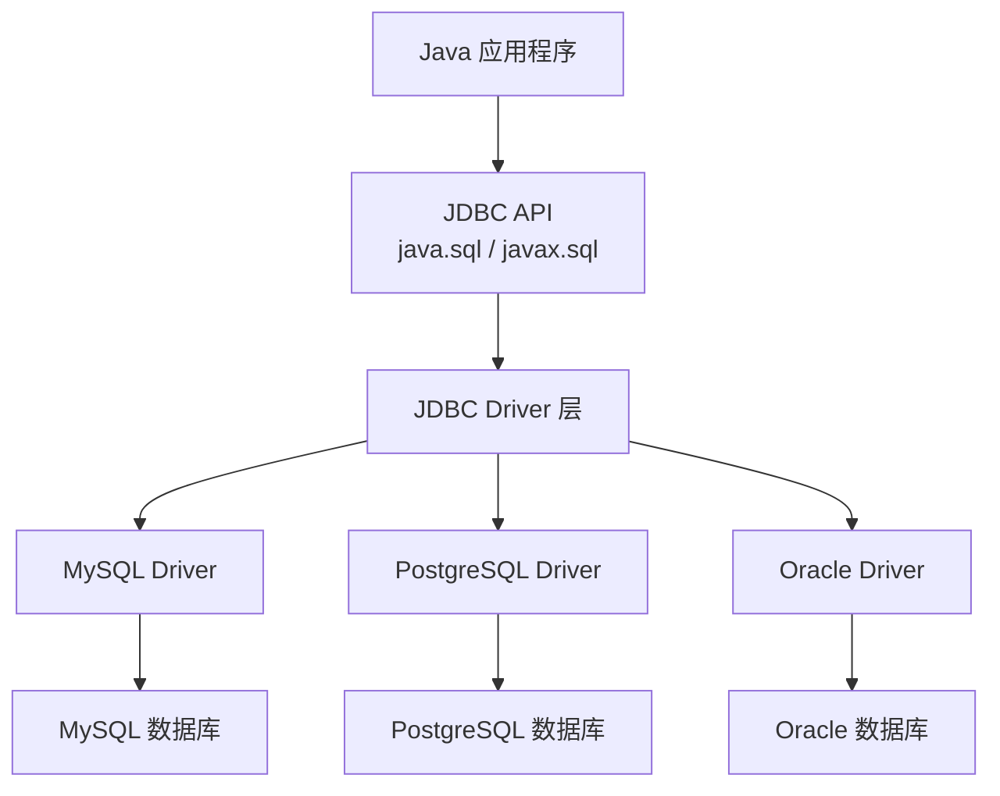
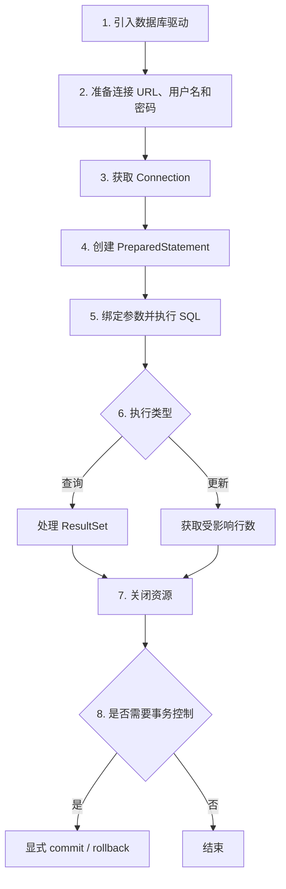
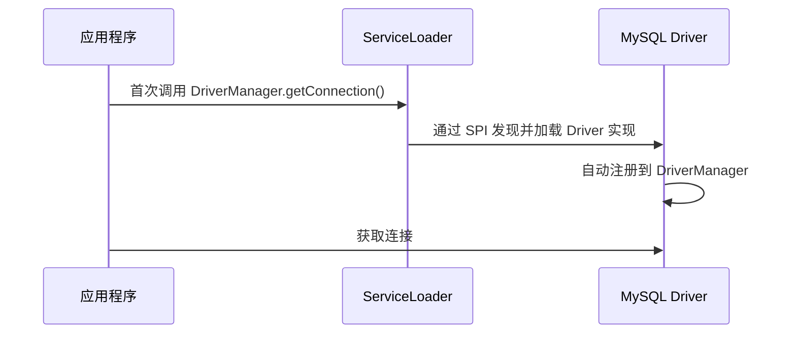
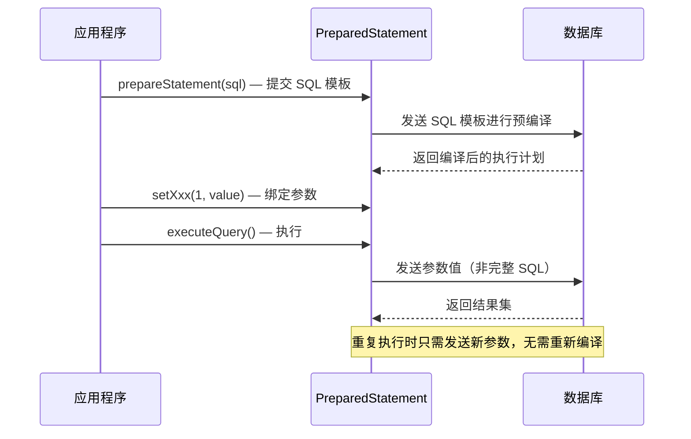
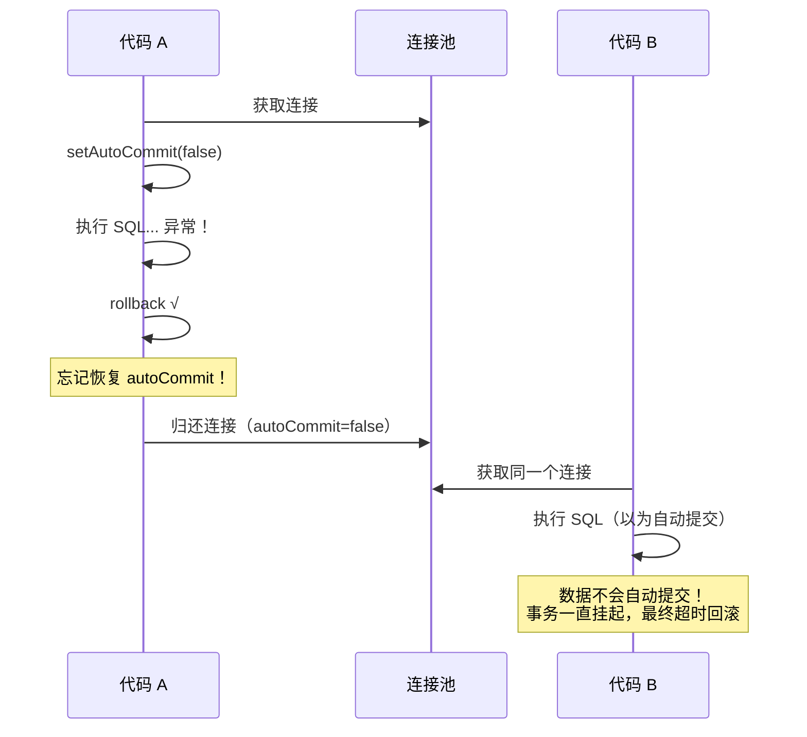
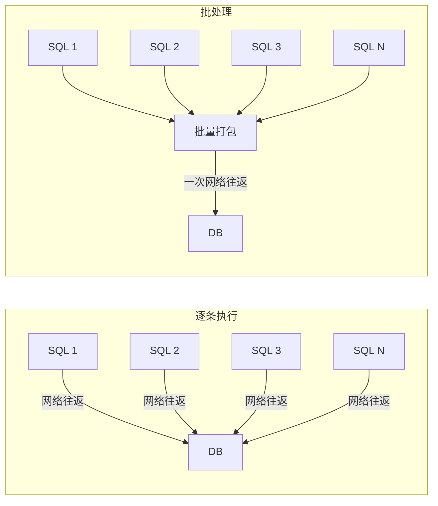
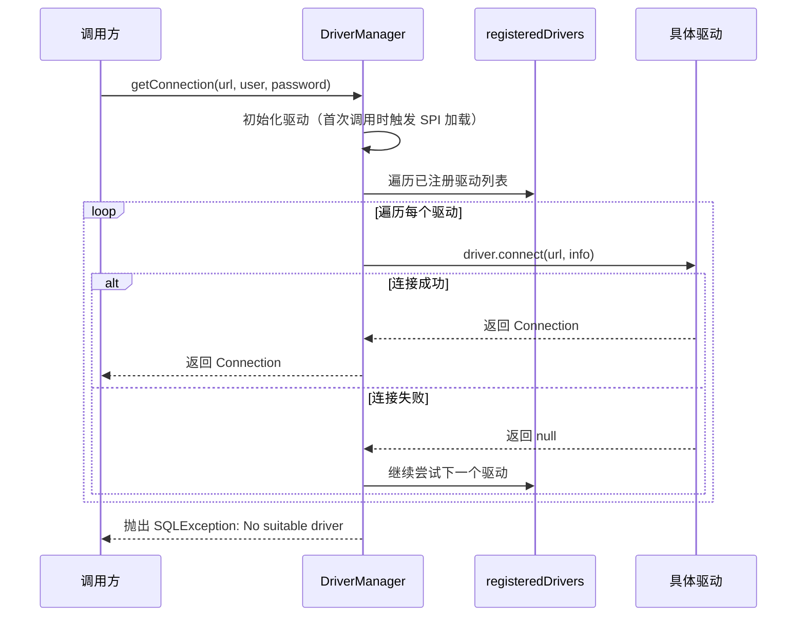
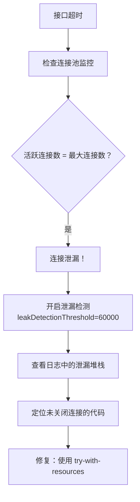

# JDBC 入门

JDBC（Java Database Connectivity）是 Java 访问关系型数据库的标准 API。无论你后面使用的是 MyBatis、JPA、Spring JDBC 还是其他数据访问框架，底层都离不开 JDBC。

## 为什么要学 JDBC

很多开发者平时直接使用 ORM 或数据访问框架，但如果 JDBC 基础不清楚，遇到下面这些问题时就容易停留在"会用框架，不知道底层发生了什么"的阶段：

- 连接为什么会被占满
- SQL 注入为什么会发生
- 为什么事务在某些场景下没有生效
- 为什么慢查询、锁等待和连接池耗尽会相互影响

::: tip 核心价值
JDBC 是 Java 数据访问的基础抽象层，框架只是帮你封装了 JDBC 的繁琐细节，而不是绕开了它。理解 JDBC 才能在遇到连接泄漏、事务失效、性能瓶颈时快速定位根因。
:::

## JDBC 解决了什么问题

JDBC 的核心价值在于：

- 提供统一的数据库访问接口
- 让 Java 程序可以通过同一套 API 操作不同数据库
- 把"连接数据库、执行 SQL、处理结果集、控制事务"这些动作标准化

JDBC 本身只是一套规范。真正负责和数据库通信的是具体数据库厂商提供的驱动：



## JDBC 核心接口

| 接口 / 类 | 作用 | 生命周期 |
|---|---|---|
| `DriverManager` | 管理驱动并创建数据库连接 | 应用级 |
| `Connection` | 表示一次数据库连接，也是事务控制的入口 | 请求级 |
| `Statement` | 执行静态 SQL，不推荐用于带参数的业务 SQL | 语句级 |
| `PreparedStatement` | 执行预编译 SQL，支持参数绑定，实际开发更常用 | 语句级，可复用 |
| `CallableStatement` | 调用存储过程 | 语句级 |
| `ResultSet` | 表示查询结果集 | 语句级 |
| `DatabaseMetaData` | 获取数据库、驱动、表等元数据 | 语句级 |
| `ResultSetMetaData` | 获取结果集列信息 | 语句级 |

::: warning 优先掌握
最需要优先掌握的是：`Connection`、`PreparedStatement`、`ResultSet`。这三个接口覆盖了 90% 的日常数据库操作。
:::

## JDBC 基本工作流程

一次典型的 JDBC 操作，通常包含以下步骤：



## 引入 MySQL 驱动

### Maven 依赖

```xml
<dependency>
    <groupId>com.mysql</groupId>
    <artifactId>mysql-connector-j</artifactId>
    <version>8.0.33</version>
</dependency>
```

::: tip Java 17+ 注意事项
从 MySQL Connector/J 8.0 开始，驱动类名从 `com.mysql.jdbc.Driver` 变更为 `com.mysql.cj.jdbc.Driver`。如果你使用 Java 17+，务必使用 8.x 版本的驱动。
:::

### 关于 Class.forName() 的说明

很多旧教程会写：

```java
Class.forName("com.mysql.cj.jdbc.Driver");
```

这在早期 JDBC 中很常见，但在 **JDBC 4.0+** 和现代驱动里通常已经不需要手动调用，因为驱动会通过 SPI 机制（`java.sql.Driver` 文件放在 `META-INF/services/` 下）自动注册。



::: warning 何时仍需手动加载
以下场景可能仍需 `Class.forName()`：
- 使用老版本驱动（5.x 及以下）
- 自定义 ClassLoader 环境（如 OSGi）
- 某些应用服务器的特殊类加载机制
:::

## 连接 URL 格式

一个常见的 MySQL 连接 URL 示例：

```text
jdbc:mysql://localhost:3306/learnjdbc?useSSL=false&serverTimezone=Asia/Shanghai&characterEncoding=UTF-8
```

| 参数 | 说明 |
|------|------|
| `jdbc:mysql://` | 表示使用 MySQL JDBC 驱动 |
| `localhost` | 数据库主机地址 |
| `3306` | 数据库端口 |
| `learnjdbc` | 数据库名 |
| `useSSL=false` | 关闭 SSL（本地学习用） |
| `serverTimezone=Asia/Shanghai` | 显式指定时区 |
| `characterEncoding=UTF-8` | 指定字符编码 |

::: danger 生产环境注意
生产环境中的连接参数要以实际基础设施要求为准。`useSSL=false` 仅适用于本地开发，生产环境应启用 SSL 加密传输。
:::

## 准备测试数据

```sql
DROP DATABASE IF EXISTS learnjdbc;
CREATE DATABASE learnjdbc DEFAULT CHARACTER SET utf8mb4;

USE learnjdbc;

CREATE TABLE students (
    id BIGINT PRIMARY KEY AUTO_INCREMENT,
    name VARCHAR(50) NOT NULL,
    gender TINYINT NOT NULL,
    grade INT NOT NULL,
    score INT NOT NULL
);

INSERT INTO students (name, gender, grade, score) VALUES
('小明', 1, 1, 88),
('小红', 0, 1, 95),
('小军', 1, 1, 93),
('小白', 0, 1, 100),
('小牛', 1, 2, 96),
('小兵', 1, 2, 99),
('小强', 1, 2, 86),
('小乔', 0, 2, 79);
```

## 基础查询示例

下面是一个最推荐的 JDBC 入门写法：

- 使用 `PreparedStatement`
- 使用 `try-with-resources`
- 不手写繁琐的 `finally close`

```java
import java.sql.Connection;
import java.sql.DriverManager;
import java.sql.PreparedStatement;
import java.sql.ResultSet;

public class JdbcQueryExample {

    private static final String URL =
        "jdbc:mysql://localhost:3306/learnjdbc?useSSL=false&serverTimezone=Asia/Shanghai&characterEncoding=UTF-8";
    private static final String USERNAME = "root";
    private static final String PASSWORD = "root1234";

    public static void main(String[] args) throws Exception {
        String sql = "SELECT id, name, gender, grade, score FROM students WHERE grade = ? AND score >= ?";

        try (
            Connection connection = DriverManager.getConnection(URL, USERNAME, PASSWORD);
            PreparedStatement preparedStatement = connection.prepareStatement(sql)
        ) {
            preparedStatement.setInt(1, 1);
            preparedStatement.setInt(2, 90);

            try (ResultSet resultSet = preparedStatement.executeQuery()) {
                while (resultSet.next()) {
                    long id = resultSet.getLong("id");
                    String name = resultSet.getString("name");
                    int gender = resultSet.getInt("gender");
                    int grade = resultSet.getInt("grade");
                    int score = resultSet.getInt("score");

                    System.out.println(id + " | " + name + " | " + gender + " | " + grade + " | " + score);
                }
            }
        }
    }
}
```

## CRUD 操作

### 查询操作

查询使用 `executeQuery()`，返回 `ResultSet`：

```java
public List<Student> queryStudents(int minScore) throws SQLException {
    String sql = "SELECT id, name, gender, grade, score FROM students WHERE score >= ?";
    List<Student> students = new ArrayList<>();

    try (
        Connection connection = DriverManager.getConnection(URL, USERNAME, PASSWORD);
        PreparedStatement preparedStatement = connection.prepareStatement(sql)
    ) {
        preparedStatement.setInt(1, minScore);

        try (ResultSet resultSet = preparedStatement.executeQuery()) {
            while (resultSet.next()) {
                Student student = new Student();
                student.setId(resultSet.getLong("id"));
                student.setName(resultSet.getString("name"));
                student.setGender(resultSet.getInt("gender"));
                student.setGrade(resultSet.getInt("grade"));
                student.setScore(resultSet.getInt("score"));
                students.add(student);
            }
        }
    }
    return students;
}
```

### 插入操作

插入使用 `executeUpdate()`，返回受影响的行数：

```java
public int insertStudent(Student student) throws SQLException {
    String sql = "INSERT INTO students(name, gender, grade, score) VALUES (?, ?, ?, ?)";

    try (
        Connection connection = DriverManager.getConnection(URL, USERNAME, PASSWORD);
        PreparedStatement preparedStatement = connection.prepareStatement(sql)
    ) {
        preparedStatement.setString(1, student.getName());
        preparedStatement.setInt(2, student.getGender());
        preparedStatement.setInt(3, student.getGrade());
        preparedStatement.setInt(4, student.getScore());

        return preparedStatement.executeUpdate();
    }
}
```

### 更新操作

```java
public int updateStudentScore(long id, int newScore) throws SQLException {
    String sql = "UPDATE students SET score = ? WHERE id = ?";

    try (
        Connection connection = DriverManager.getConnection(URL, USERNAME, PASSWORD);
        PreparedStatement preparedStatement = connection.prepareStatement(sql)
    ) {
        preparedStatement.setInt(1, newScore);
        preparedStatement.setLong(2, id);

        return preparedStatement.executeUpdate();
    }
}
```

### 删除操作

```java
public int deleteStudent(long id) throws SQLException {
    String sql = "DELETE FROM students WHERE id = ?";

    try (
        Connection connection = DriverManager.getConnection(URL, USERNAME, PASSWORD);
        PreparedStatement preparedStatement = connection.prepareStatement(sql)
    ) {
        preparedStatement.setLong(1, id);

        return preparedStatement.executeUpdate();
    }
}
```

## 获取自增主键

插入数据后，如果想拿到数据库生成的主键：

```java
public long insertAndGetId(Student student) throws SQLException {
    String sql = "INSERT INTO students(name, gender, grade, score) VALUES (?, ?, ?, ?)";

    try (
        Connection connection = DriverManager.getConnection(URL, USERNAME, PASSWORD);
        PreparedStatement preparedStatement =
            connection.prepareStatement(sql, Statement.RETURN_GENERATED_KEYS)
    ) {
        preparedStatement.setString(1, student.getName());
        preparedStatement.setInt(2, student.getGender());
        preparedStatement.setInt(3, student.getGrade());
        preparedStatement.setInt(4, student.getScore());

        preparedStatement.executeUpdate();

        try (ResultSet generatedKeys = preparedStatement.getGeneratedKeys()) {
            if (generatedKeys.next()) {
                return generatedKeys.getLong(1);
            }
        }
    }
    return -1;
}
```

::: tip 批量获取自增主键
`getGeneratedKeys()` 返回的 ResultSet 包含所有批量插入行的自增 ID，可以用 `while (generatedKeys.next())` 逐行获取。
:::

## PreparedStatement vs Statement

### Statement 的问题

```java
String sql = "SELECT * FROM users WHERE username = '" + username + "'";
statement.executeQuery(sql);
```

这会带来两个明显问题：

1. **SQL 注入风险**：用户输入可能篡改 SQL 语义
2. **可维护性差**：SQL 结构和参数混在一起

### PreparedStatement 的优势

| 对比项 | PreparedStatement | Statement |
|--------|-------------------|-----------|
| **安全性** | 更高，防止 SQL 注入 | 较低，容易误拼接 SQL |
| **性能** | 更适合重复执行（预编译缓存） | 每次都以完整 SQL 形式执行 |
| **可读性** | SQL 模板和参数分离 | 容易出现字符串拼接噪音 |
| **适用场景** | 业务开发默认首选 | 简单无参 SQL / DDL |

### 执行原理



::: warning 预编译缓存的条件
MySQL 默认**不缓存** PreparedStatement 的执行计划（需设置 `cachePrepStmts=true`）。PostgreSQL 和 Oracle 默认启用服务端预编译缓存。在连接池配置中建议显式开启：
```properties
cachePrepStmts=true
prepStmtCacheSize=250
prepStmtCacheSqlLimit=2048
```
:::

## SQL 注入防护

### 错误示例

```java
String sql = "SELECT * FROM users WHERE login_name = '" + name + "' AND password = '" + password + "'";
```

如果用户输入 `name = "' OR '1'='1' -- "`（`-- ` 为 SQL 注释，其后内容被忽略），SQL 变成：

```sql
SELECT * FROM users WHERE login_name = '' OR '1'='1' -- ' AND password = 'xxx'
```

`'1'='1'` 恒为真，密码校验又被注释掉，这将返回所有用户数据！

### 正确示例

```java
String sql = "SELECT id, login_name FROM users WHERE login_name = ? AND password = ?";

try (
    Connection connection = DriverManager.getConnection(url, username, passwordValue);
    PreparedStatement preparedStatement = connection.prepareStatement(sql)
) {
    preparedStatement.setString(1, name);
    preparedStatement.setString(2, password);

    try (ResultSet resultSet = preparedStatement.executeQuery()) {
        if (resultSet.next()) {
            System.out.println("登录成功");
        } else {
            System.out.println("用户名或密码错误");
        }
    }
}
```

::: danger 安全铁律
只要 SQL 中存在外部输入参数，就应优先使用 `PreparedStatement`，不要手工拼接字符串。即使参数来源看似可信（如内部系统调用），也应坚持参数化查询——防御性编程的成本远低于安全事件的损失。
:::

## 事务控制

### 为什么事务很重要

事务要解决的是：**多条 SQL 要么都成功，要么都失败**。

例如转账场景：
- A 账户扣款
- B 账户加款

如果只执行成功一半，数据就会不一致。

### JDBC 事务 API

| 方法 | 作用 |
|---|---|
| `setAutoCommit(false)` | 关闭自动提交，开始手动控制事务 |
| `commit()` | 提交事务 |
| `rollback()` | 回滚事务 |
| `setTransactionIsolation(...)` | 设置事务隔离级别 |
| `setSavepoint()` | 设置保存点，支持部分回滚 |
| `releaseSavepoint()` | 释放保存点 |

默认情况下，JDBC 连接处于**自动提交模式**，每执行一条 SQL，数据库都会自动提交一次。

### 转账事务示例

```sql
CREATE TABLE account (
    id INT PRIMARY KEY AUTO_INCREMENT,
    name VARCHAR(20) NOT NULL,
    money DECIMAL(10, 2) NOT NULL
);

INSERT INTO account(name, money) VALUES ('tom', 1000.00), ('jack', 1000.00);
```

```java
public void transfer(String fromUser, String toUser, BigDecimal amount) throws SQLException {
    String debitSql = "UPDATE account SET money = money - ? WHERE name = ?";
    String creditSql = "UPDATE account SET money = money + ? WHERE name = ?";

    try (Connection connection = DriverManager.getConnection(url, username, password)) {
        try {
            connection.setAutoCommit(false);

            try (
                PreparedStatement debitStatement = connection.prepareStatement(debitSql);
                PreparedStatement creditStatement = connection.prepareStatement(creditSql)
            ) {
                debitStatement.setBigDecimal(1, amount);
                debitStatement.setString(2, fromUser);
                debitStatement.executeUpdate();

                creditStatement.setBigDecimal(1, amount);
                creditStatement.setString(2, toUser);
                creditStatement.executeUpdate();
            }

            connection.commit();
            System.out.println("转账成功");
        } catch (Exception ex) {
            connection.rollback();
            System.out.println("转账失败，事务已回滚");
            throw ex;
        } finally {
            connection.setAutoCommit(true);
        }
    }
}
```

### 为什么要在 finally 中恢复 autoCommit

因为连接对象在真实项目里通常来自连接池。如果你修改了连接状态却没有恢复，就可能把"关闭自动提交"的状态带给下一个使用这个连接的代码，导致非常隐蔽的问题。



::: danger 连接状态污染
从连接池获取的连接，使用后必须恢复原始状态（autoCommit、隔离级别、holdability 等），否则会"污染"后续使用该连接的代码。这是生产环境中最常见的隐蔽 Bug 之一。
:::

### 事务隔离级别

```java
connection.setTransactionIsolation(Connection.TRANSACTION_READ_COMMITTED);
```

| 隔离级别 | 脏读 | 不可重复读 | 幻读 | 适用场景 |
|----------|------|------------|------|----------|
| READ_UNCOMMITTED | √ | √ | √ | 极少使用 |
| READ_COMMITTED | × | √ | √ | 大多数场景（Oracle 默认） |
| REPEATABLE_READ | × | × | √ | MySQL 默认 |
| SERIALIZABLE | × | × | × | 严格一致性场景 |

### Savepoint 部分回滚

```java
try (Connection conn = dataSource.getConnection()) {
    conn.setAutoCommit(false);

    Savepoint sp1 = conn.setSavepoint("after_step1");

    // 第一步操作
    ps1.executeUpdate();

    Savepoint sp2 = conn.setSavepoint("after_step2");

    // 第二步操作
    ps2.executeUpdate();

    // 第三步操作失败，只需回滚到 sp2
    conn.rollback(sp2);

    // 提交第一步和第二步的结果
    conn.commit();
}
```

## 批处理

### 为什么批处理更高效

如果要插入成千上万条数据，一条一条执行 SQL 会带来很多额外开销：

- Java 到数据库的网络往返次数多
- SQL 执行次数多
- 整体吞吐较低

批处理的目标是：**把多次执行合并，减少交互成本**。



### 常用方法

| 方法 | 作用 |
|---|---|
| `addBatch()` | 把当前参数组加入批处理队列 |
| `executeBatch()` | 执行整批 SQL |
| `clearBatch()` | 清空当前批处理队列 |

### 批量插入示例

```java
public void batchInsert(List<Student> students) throws SQLException {
    String sql = "INSERT INTO students(name, gender, grade, score) VALUES (?, ?, ?, ?)";

    try (
        Connection connection = DriverManager.getConnection(url, username, password);
        PreparedStatement preparedStatement = connection.prepareStatement(sql)
    ) {
        int count = 0;
        int batchSize = 200;

        for (Student student : students) {
            preparedStatement.setString(1, student.getName());
            preparedStatement.setInt(2, student.getGender());
            preparedStatement.setInt(3, student.getGrade());
            preparedStatement.setInt(4, student.getScore());
            preparedStatement.addBatch();

            if (++count % batchSize == 0) {
                preparedStatement.executeBatch();
                preparedStatement.clearBatch();
            }
        }

        // 执行剩余的批次
        preparedStatement.executeBatch();
        System.out.println("批量插入完成，共 " + students.size() + " 条");
    }
}
```

::: tip 批处理优化要点
- **分批执行**：不要一次性 `addBatch` 几万条，建议每 200-1000 条执行一次，避免 OOM
- **配合事务**：批处理 + 事务（`setAutoCommit(false)`）性能提升显著
- **MySQL 特殊参数**：连接 URL 加 `rewriteBatchedStatements=true`，MySQL 驱动会将批处理重写为多值 INSERT，性能可提升 10 倍以上
:::

## 元数据

### DatabaseMetaData

获取数据库本身的信息：

```java
try (Connection connection = DriverManager.getConnection(url, username, password)) {
    DatabaseMetaData metaData = connection.getMetaData();

    System.out.println("URL: " + metaData.getURL());
    System.out.println("用户: " + metaData.getUserName());
    System.out.println("数据库产品: " + metaData.getDatabaseProductName());
    System.out.println("数据库版本: " + metaData.getDatabaseProductVersion());
    System.out.println("驱动名称: " + metaData.getDriverName());
    System.out.println("驱动版本: " + metaData.getDriverVersion());
    System.out.println("支持事务: " + metaData.supportsTransactions());
    System.out.println("JDBC 主版本: " + metaData.getJDBCMajorVersion());
    System.out.println("JDBC 次版本: " + metaData.getJDBCMinorVersion());
}
```

### ResultSetMetaData

获取查询结果列的信息：

```java
String sql = "SELECT * FROM students WHERE id = ?";

try (
    Connection connection = DriverManager.getConnection(url, username, password);
    PreparedStatement preparedStatement = connection.prepareStatement(sql)
) {
    preparedStatement.setLong(1, 1L);

    try (ResultSet resultSet = preparedStatement.executeQuery()) {
        ResultSetMetaData metaData = resultSet.getMetaData();

        int columnCount = metaData.getColumnCount();
        System.out.println("列数: " + columnCount);

        for (int i = 1; i <= columnCount; i++) {
            System.out.println("列名: " + metaData.getColumnName(i));
            System.out.println("列类型: " + metaData.getColumnTypeName(i));
            System.out.println("列大小: " + metaData.getColumnDisplaySize(i));
            System.out.println("是否可为空: " + metaData.isNullable(i));
        }
    }
}
```

::: tip 元数据的实际用途
- **通用 DAO 框架**：通过 `ResultSetMetaData` 自动完成结果集到 JavaBean 的映射（MyBatis 底层就是这么做的）
- **数据库兼容性检测**：启动时检查数据库版本、驱动版本是否满足要求
- **动态 SQL 构建**：根据表结构动态生成查询语句
:::

## 资源释放最佳实践

### try-with-resources（推荐）

```java
try (
    Connection connection = DriverManager.getConnection(url, username, password);
    PreparedStatement preparedStatement = connection.prepareStatement(sql);
    ResultSet resultSet = preparedStatement.executeQuery()
) {
    // 处理结果
}
// 自动关闭，顺序：ResultSet → PreparedStatement → Connection
```

### 手动释放（不推荐）

```java
Connection connection = null;
PreparedStatement preparedStatement = null;
ResultSet resultSet = null;

try {
    connection = DriverManager.getConnection(url, username, password);
    preparedStatement = connection.prepareStatement(sql);
    resultSet = preparedStatement.executeQuery();
    // 处理结果
} finally {
    // 释放顺序：先创建的后关闭
    if (resultSet != null) {
        try {
            resultSet.close();
        } catch (SQLException e) {
            // 记录日志，不要吞掉异常
        }
    }
    if (preparedStatement != null) {
        try {
            preparedStatement.close();
        } catch (SQLException e) {
            // 记录日志
        }
    }
    if (connection != null) {
        try {
            connection.close();
        } catch (SQLException e) {
            // 记录日志
        }
    }
}
```

::: danger 资源关闭顺序
关闭顺序必须是 **ResultSet → Statement → Connection**（先创建的后关闭）。如果先关闭 Connection，ResultSet 和 Statement 可能无法正常关闭，导致资源泄漏。
:::

## 常见问题

### 1. 连接泄漏

**问题**：获取连接后没有正确关闭，导致连接池耗尽。

**解决**：始终使用 `try-with-resources` 确保资源释放。

### 2. SQL 注入

**问题**：使用字符串拼接构建 SQL。

**解决**：始终使用 `PreparedStatement`。

### 3. 事务不生效

**问题**：忘记调用 `setAutoCommit(false)` 或在异常时没有回滚。

**解决**：确保事务边界清晰，异常时正确回滚。

### 4. 批处理性能差

**问题**：没有正确使用批处理或批量大小不合适。

**解决**：合理设置批量大小（通常 100-1000），结合事务使用。

## 横向对比：JDBC 与其他数据访问技术

| 特性 | 原生 JDBC | Spring JdbcTemplate | MyBatis | MyBatis-Plus | JPA/Hibernate |
|------|-----------|---------------------|---------|--------------|---------------|
| **SQL 控制** | 完全手写 | 手写 | 手写 + 动态 SQL | 自动生成 + 手写 | 自动生成 |
| **结果映射** | 手动 | 自动（RowMapper） | 自动（XML/注解） | 自动 | 自动（实体映射） |
| **样板代码** | 最多 | 较少 | 少 | 最少 | 最少 |
| **学习曲线** | 低 | 低 | 中 | 中 | 高 |
| **灵活性** | 最高 | 高 | 高 | 中 | 低 |
| **适用场景** | 学习/底层理解 | 简单查询 | 复杂 SQL | CRUD 为主 | 领域模型驱动 |

::: tip 选型建议
- **学习阶段**：先掌握原生 JDBC，理解底层原理
- **简单项目**：Spring JdbcTemplate 足够
- **企业级项目**：MyBatis-Plus（国内主流）或 JPA（国外主流）
- **复杂报表/统计**：MyBatis + 手写 SQL
:::

## 源码剖析：DriverManager 核心流程

`DriverManager.getConnection()` 是 JDBC 的入口，其核心流程如下：



**关键源码片段**（JDK 17，`java.sql.DriverManager`）：

```java
// 简化版 DriverManager.getConnection 核心逻辑
public class DriverManager {

    // 已注册的驱动列表
    private static final List<DriverInfo> registeredDrivers = new CopyOnWriteArrayList<>();

    // 通过 SPI 机制自动加载驱动
    static {
        loadInitialDrivers();
    }

    public static Connection getConnection(String url, String user, String password)
            throws SQLException {
        // 组装连接属性
        Properties info = new Properties();
        if (user != null) {
            info.put("user", user);
        }
        if (password != null) {
            info.put("password", password);
        }

        // 遍历所有已注册驱动，尝试建立连接
        for (DriverInfo di : registeredDrivers) {
            Connection result = di.driver.connect(url, info);
            if (result != null) {
                return result; // 第一个成功连接的驱动
            }
        }
        throw new SQLException("No suitable driver found for " + url);
    }
}
```

::: details SPI 加载机制详解
`loadInitialDrivers()` 方法通过 `ServiceLoader.load(Driver.class)` 扫描 classpath 下所有 JAR 包的 `META-INF/services/java.sql.Driver` 文件，自动实例化并注册驱动。这就是为什么 JDBC 4.0+ 不再需要手动 `Class.forName()` 的原因。
:::

## 生产实践案例

### 案例 1：连接泄漏排查

**现象**：线上系统运行一段时间后，接口响应变慢，最终报 `Could not get JDBC Connection`。

**排查过程**：



**根因**：某处代码在异常分支未关闭 Connection，导致连接被占用不归还。

**修复**：

```java
// 修复前：异常时连接未关闭
public User findUser(String id) {
    Connection conn = dataSource.getConnection();
    // 如果下面抛异常，conn 永远不会关闭！
    return queryUser(conn, id);
}

// 修复后：try-with-resources 保证关闭
public User findUser(String id) {
    try (Connection conn = dataSource.getConnection()) {
        return queryUser(conn, id);
    }
}
```

### 案例 2：批量导入优化

**需求**：将 10 万条数据导入数据库，要求在 30 秒内完成。

**优化步骤**（耗时为示意数据，实际因硬件、网络与数据类型而异）：

| 优化手段 | 耗时 | 提升倍数 |
|----------|------|----------|
| 逐条 INSERT（无事务） | ~300s | 基准 |
| 逐条 INSERT + 事务 | ~30s | 10x |
| 批处理 addBatch（batchSize=500） | ~8s | 37x |
| 批处理 + rewriteBatchedStatements | ~3s | 100x |

```java
// 最终优化方案
public void bulkInsert(List<Student> students) throws SQLException {
    String sql = "INSERT INTO students(name, gender, grade, score) VALUES (?, ?, ?, ?)";

    try (Connection conn = dataSource.getConnection()) {
        conn.setAutoCommit(false);  // 开启事务

        try (PreparedStatement ps = conn.prepareStatement(sql)) {
            for (int i = 0; i < students.size(); i++) {
                Student s = students.get(i);
                ps.setString(1, s.getName());
                ps.setInt(2, s.getGender());
                ps.setInt(3, s.getGrade());
                ps.setInt(4, s.getScore());
                ps.addBatch();

                if ((i + 1) % 500 == 0) {
                    ps.executeBatch();
                    ps.clearBatch();
                }
            }
            ps.executeBatch(); // 执行剩余批次
        }
        conn.commit();
    }
}
```

## 总结

JDBC 是 Java 数据访问的基础，掌握它有助于理解：

1. **连接管理**：如何获取和释放数据库连接
2. **SQL 执行**：如何安全地执行 SQL 并处理结果
3. **事务控制**：如何保证数据一致性
4. **性能优化**：批处理、预编译等优化手段

虽然实际项目中更多使用 ORM 框架，但理解 JDBC 底层原理对于排查问题、优化性能至关重要。

**下一步**：学习 [JDBC 连接池](01-JDBC连接池.md)，了解如何通过连接池提升数据库访问性能。

## 版本差异(旧版 → JDBC/Java 21)

| 特性 | 旧版（Java 8 时代） | 当前（Java 17/21） |
|------|---------------------|-------------------|
| MySQL 驱动 | com.mysql.jdbc.Driver（已移除） | com.mysql.cj.jdbc.Driver（mysql-connector-j 8.x/9.x） |
| JDBC 版本 | JDBC 4.0/4.1 | JDBC 4.3（Java 9+），DriverManager 自动加载驱动 |
| Java 版本 | Java 8 | JDK 17/21 LTS |
| 批处理/预编译 | addBatch/executeBatch/PreparedStatement | 用法不变 |
| 虚拟线程 | 无 | JDK 21 虚拟线程下 JDBC 阻塞 IO 可正常使用（注意连接池大小与虚拟线程数量匹配） |

> JDBC 规范本身高度稳定，本文的 Connection/Statement/ResultSet 核心流程在 Java 21 中完全适用；升级时只需改用新驱动类名与 JDK 17+。
