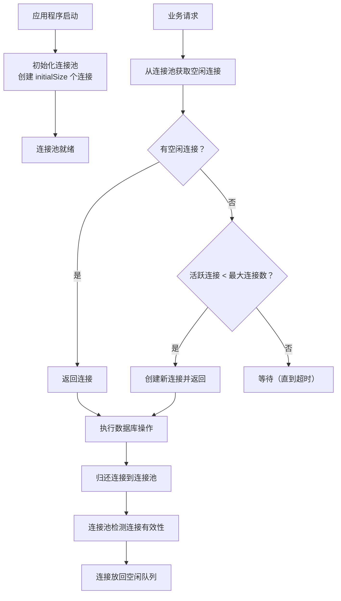
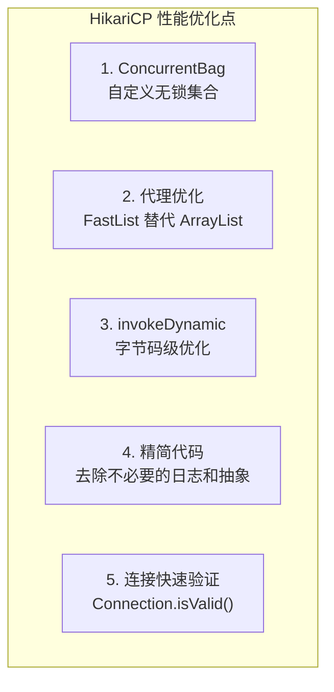
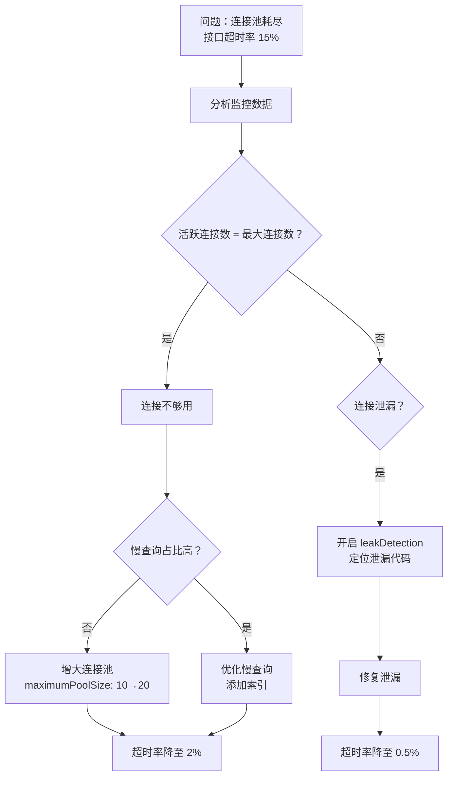

# JDBC 连接池

在执行 JDBC 的增删改查操作时，频繁地创建和关闭数据库连接会带来较大的性能开销，因为数据库连接的创建和销毁是非常耗时的操作。为避免频繁地创建和销毁 JDBC 连接，可以通过连接池复用已经创建好的连接。

## 连接池核心概念

### 工作原理



**工作流程**：

1. **初始化连接池**：应用程序启动时，预先创建一定数量的数据库连接
2. **获取连接**：应用程序从连接池中获取空闲连接
3. **使用连接**：执行数据库操作
4. **归还连接**：操作完成后，将连接归还到连接池，而不是关闭
5. **连接管理**：连接池监控连接状态，定期检查并清理无效连接

### 核心配置参数

| 参数名 | 含义 | HikariCP 默认值 | Druid 默认值 |
|--------|------|-----------------|--------------|
| `jdbcUrl` | 数据库连接 URL | 无 | 无 |
| `username` | 数据库用户名 | 无 | 无 |
| `password` | 数据库密码 | 无 | 无 |
| `maximumPoolSize` / `maxActive` | 连接池中允许的最大连接数 | 10 | 8 |
| `minimumIdle` / `minIdle` | 连接池中保持的最小空闲连接数 | 与 max 相同 | 0 |
| `idleTimeout` / `minEvictableIdleTimeMillis` | 空闲连接的超时时间 | 600000（10 分钟） | 1800000（30 分钟） |
| `maxLifetime` / `phyTimeoutMillis` | 连接的最大存活时间 | 1800000（30 分钟） | 无限制（-1） |
| `connectionTimeout` / `maxWait` | 获取连接的超时时间 | 30000（30 秒） | 无限制（-1） |
| `leakDetectionThreshold` | 连接泄漏检测阈值 | 无 | 无 |

### 连接池的优势

| 优势 | 说明 |
|------|------|
| **性能提升** | 避免频繁创建和销毁连接的开销（TCP 三次握手 + 认证） |
| **资源管理** | 通过限制最大连接数，防止资源耗尽 |
| **高并发支持** | 在高并发场景下快速提供可用连接 |
| **连接监控** | 提供连接状态监控，帮助发现连接泄漏 |
| **连接验证** | 自动检测并剔除失效连接 |

::: warning 连接创建的真实开销
一次数据库连接创建包含：TCP 三次握手 → 数据库认证 → 会话初始化 → 设置字符集/时区等，整个过程通常需要 **50-200ms**。在高并发场景下，这个开销会被放大数百倍。
:::

## 数据准备

```sql
USE learnjdbc;

CREATE TABLE employee (
    eid INT PRIMARY KEY AUTO_INCREMENT,
    ename VARCHAR(20),
    age INT,
    sex VARCHAR(6),
    salary DOUBLE,
    empdate DATE
);

INSERT INTO employee (eid, ename, age, sex, salary, empdate) VALUES
(NULL, '李清照', 22, '女', 4000, '2018-11-12'),
(NULL, '林黛玉', 20, '女', 5000, '2019-03-14'),
(NULL, '杜甫', 40, '男', 6000, '2020-01-01'),
(NULL, '李白', 25, '男', 3000, '2017-10-01');
```

## DBCP 连接池

DBCP（Database Connection Pool）是 Apache 提供的数据库连接池实现。

::: warning DBCP 现状
DBCP2 仍在维护，但社区活跃度低，新项目不推荐使用。仅在对老项目做兼容维护时考虑。
:::

### Maven 依赖

```xml
<dependency>
    <groupId>org.apache.commons</groupId>
    <artifactId>commons-dbcp2</artifactId>
    <version>2.9.0</version>
</dependency>
```

### 基本使用

```java
import org.apache.commons.dbcp2.BasicDataSource;
import java.sql.Connection;
import java.sql.PreparedStatement;
import java.sql.ResultSet;

public class DBCPExample {
    public static void main(String[] args) {
        BasicDataSource dataSource = new BasicDataSource();

        dataSource.setUrl("jdbc:mysql://localhost:3306/learnjdbc?characterEncoding=UTF-8");
        dataSource.setUsername("root");
        dataSource.setPassword("root1234");
        dataSource.setDriverClassName("com.mysql.cj.jdbc.Driver");

        dataSource.setInitialSize(5);
        dataSource.setMaxTotal(10);
        dataSource.setMinIdle(2);
        dataSource.setMaxIdle(5);
        dataSource.setMaxWaitMillis(30000);

        try (
            Connection connection = dataSource.getConnection();
            PreparedStatement pstmt = connection.prepareStatement("SELECT * FROM employee");
            ResultSet rs = pstmt.executeQuery()
        ) {
            while (rs.next()) {
                int id = rs.getInt("eid");
                String name = rs.getString("ename");
                int age = rs.getInt("age");
                System.out.println("ID: " + id + ", 姓名: " + name + ", 年龄: " + age);
            }
        } catch (Exception e) {
            e.printStackTrace();
        } finally {
            try {
                dataSource.close();
            } catch (Exception e) {
                e.printStackTrace();
            }
        }
    }
}
```

### 工具类封装

```java
package jdbc.jdbcpool.DBCP;

import org.apache.commons.dbcp2.BasicDataSource;
import java.sql.Connection;
import java.sql.ResultSet;
import java.sql.SQLException;
import java.sql.Statement;

public class DBCPUtils {

    public static final String DRIVERNAME = "com.mysql.cj.jdbc.Driver";
    public static final String URL = "jdbc:mysql://localhost:3306/learnjdbc?characterEncoding=UTF-8";
    public static final String USERNAME = "root";
    public static final String PASSWORD = "root1234";

    public static BasicDataSource dataSource = new BasicDataSource();

    static {
        dataSource.setDriverClassName(DRIVERNAME);
        dataSource.setUrl(URL);
        dataSource.setUsername(USERNAME);
        dataSource.setPassword(PASSWORD);
        dataSource.setMaxTotal(20);
    }

    public static Connection getConnection() throws SQLException {
        return dataSource.getConnection();
    }

    public static void close(Connection con, Statement statement) {
        if (con != null && statement != null) {
            try {
                statement.close();
                con.close();
            } catch (SQLException e) {
                e.printStackTrace();
            }
        }
    }

    public static void close(Connection con, Statement statement, ResultSet resultSet) {
        if (con != null && statement != null && resultSet != null) {
            try {
                resultSet.close();
                statement.close();
                con.close();
            } catch (SQLException e) {
                e.printStackTrace();
            }
        }
    }
}
```

## C3P0 连接池

C3P0 是一个开源的 JDBC 连接池，它实现了数据源和 JNDI 绑定，支持 JDBC3 规范和 JDBC2 的标准扩展。

::: warning C3P0 现状
C3P0 已基本停止维护（最后发布于 2019 年），存在已知的死锁问题。**新项目不推荐使用**，仅用于老项目兼容。
:::

### Maven 依赖

```xml
<dependency>
    <groupId>com.mchange</groupId>
    <artifactId>c3p0</artifactId>
    <version>0.9.5.5</version>
</dependency>
<dependency>
    <groupId>org.slf4j</groupId>
    <artifactId>slf4j-api</artifactId>
    <version>1.7.36</version>
</dependency>
```

### 核心配置参数

| 参数名 | 含义 | 默认值 |
|--------|------|--------|
| `driverClass` | 数据库驱动类名 | 无 |
| `jdbcUrl` | 数据库连接 URL | 无 |
| `user` | 数据库用户名 | 无 |
| `password` | 数据库密码 | 无 |
| `initialPoolSize` | 初始连接数 | 3 |
| `minPoolSize` | 最小连接数 | 3 |
| `maxPoolSize` | 最大连接数 | 15 |
| `acquireIncrement` | 连接耗尽时一次创建的新连接数 | 3 |
| `maxIdleTime` | 连接的最大空闲时间（秒） | 0 |
| `checkoutTimeout` | 获取连接的超时时间（毫秒） | 无限制 |

### 基本使用

```java
import com.mchange.v2.c3p0.ComboPooledDataSource;
import java.beans.PropertyVetoException;
import java.sql.Connection;
import java.sql.PreparedStatement;
import java.sql.ResultSet;
import java.sql.SQLException;

public class C3P0Example {
    private static ComboPooledDataSource dataSource;

    static {
        try {
            dataSource = new ComboPooledDataSource();
            dataSource.setDriverClass("com.mysql.cj.jdbc.Driver");
            dataSource.setJdbcUrl("jdbc:mysql://localhost:3306/learnjdbc");
            dataSource.setUser("root");
            dataSource.setPassword("root1234");

            dataSource.setInitialPoolSize(5);
            dataSource.setMaxPoolSize(10);
            dataSource.setMinPoolSize(2);
            dataSource.setMaxIdleTime(30);
            dataSource.setMaxStatements(100);
        } catch (PropertyVetoException e) {
            e.printStackTrace();
        }
    }

    public static Connection getConnection() throws SQLException {
        return dataSource.getConnection();
    }

    public static void closeDataSource() {
        if (dataSource != null) {
            dataSource.close();
        }
    }

    public static void main(String[] args) {
        try (
            Connection connection = getConnection();
            PreparedStatement pstmt = connection.prepareStatement("SELECT * FROM employee");
            ResultSet rs = pstmt.executeQuery()
        ) {
            while (rs.next()) {
                int id = rs.getInt("eid");
                String name = rs.getString("ename");
                System.out.println("ID: " + id + ", 姓名: " + name);
            }
        } catch (SQLException e) {
            e.printStackTrace();
        }

        closeDataSource();
    }
}
```

## Druid 连接池

Druid 是阿里巴巴开源的数据库连接池，被认为是 Java 语言中功能最丰富的数据库连接池之一。

### Maven 依赖

```xml
<dependency>
    <groupId>com.alibaba</groupId>
    <artifactId>druid</artifactId>
    <version>1.2.20</version>
</dependency>
```

### 核心特性

| 特性 | 说明 |
|------|------|
| **监控统计** | 提供 SQL 执行监控、慢查询日志、Web 监控页面等功能 |
| **防 SQL 注入** | 内置 WallFilter，可防止 SQL 注入 |
| **扩展性好** | 支持自定义 Filter，可扩展日志、审计等功能 |
| **性能优异** | 经过阿里巴巴大规模生产验证 |
| **SQL 解析** | 内置 SQL Parser，支持多种数据库方言 |

### 配置文件方式

**druid.properties**：

```properties
driverClassName=com.mysql.cj.jdbc.Driver
url=jdbc:mysql://127.0.0.1:3306/learnjdbc?characterEncoding=UTF-8&rewriteBatchedStatements=true
username=root
password=root1234
initialSize=5
maxActive=10
maxWait=3000

# 连接有效性检测
validationQuery=SELECT 1
testOnBorrow=false
testOnReturn=false
testWhileIdle=true

# 监控配置
filters=stat,wall,log4j2
```

::: tip Druid 监控页面
Druid 内置了 Web 监控页面，可以在 Spring Boot 中通过配置开启：
```yaml
spring:
  datasource:
    druid:
      stat-view-servlet:
        enabled: true
        url-pattern: /druid/*
```
访问 `/druid/` 即可查看连接池状态、SQL 执行统计、慢查询等信息。
:::

### 工具类封装

```java
package jdbc.jdbcpool.druid;

import com.alibaba.druid.pool.DruidDataSourceFactory;
import javax.sql.DataSource;
import java.io.InputStream;
import java.sql.Connection;
import java.sql.ResultSet;
import java.sql.SQLException;
import java.sql.Statement;
import java.util.Properties;

public class DruidUtils {

    private static DataSource dataSource;

    static {
        try {
            Properties p = new Properties();
            InputStream inputStream = DruidUtils.class.getClassLoader()
                .getResourceAsStream("druid.properties");
            p.load(inputStream);
            dataSource = DruidDataSourceFactory.createDataSource(p);
        } catch (Exception e) {
            e.printStackTrace();
        }
    }

    public static DataSource getDataSource() {
        return dataSource;
    }

    public static Connection getConnection() {
        try {
            return dataSource.getConnection();
        } catch (SQLException e) {
            e.printStackTrace();
            return null;
        }
    }

    public static void close(Connection con, Statement statement) {
        if (con != null && statement != null) {
            try {
                statement.close();
                con.close();
            } catch (SQLException e) {
                e.printStackTrace();
            }
        }
    }

    public static void close(Connection con, Statement statement, ResultSet resultSet) {
        if (con != null && statement != null && resultSet != null) {
            try {
                resultSet.close();
                statement.close();
                con.close();
            } catch (SQLException e) {
                e.printStackTrace();
            }
        }
    }
}
```

### 使用示例

```java
import jdbc.jdbcpool.druid.DruidUtils;
import java.sql.Connection;
import java.sql.PreparedStatement;
import java.sql.ResultSet;

public class DruidExample {
    public static void main(String[] args) {
        try (
            Connection connection = DruidUtils.getConnection();
            PreparedStatement pstmt = connection.prepareStatement("SELECT * FROM employee");
            ResultSet rs = pstmt.executeQuery()
        ) {
            while (rs.next()) {
                int id = rs.getInt("eid");
                String name = rs.getString("ename");
                System.out.println("ID: " + id + ", 姓名: " + name);
            }
        } catch (Exception e) {
            e.printStackTrace();
        }
    }
}
```

## HikariCP 连接池

HikariCP 是一个高性能的 JDBC 连接池，Spring Boot 2.x+ 默认使用 HikariCP 作为连接池。

### Maven 依赖

```xml
<dependency>
    <groupId>com.zaxxer</groupId>
    <artifactId>HikariCP</artifactId>
    <version>5.0.1</version>
</dependency>
```

### 配置示例

```java
import com.zaxxer.hikari.HikariConfig;
import com.zaxxer.hikari.HikariDataSource;
import java.sql.Connection;
import java.sql.PreparedStatement;
import java.sql.ResultSet;

public class HikariCPExample {
    private static HikariDataSource dataSource;

    static {
        HikariConfig config = new HikariConfig();
        config.setJdbcUrl("jdbc:mysql://localhost:3306/learnjdbc");
        config.setUsername("root");
        config.setPassword("root1234");
        config.setDriverClassName("com.mysql.cj.jdbc.Driver");

        config.setMaximumPoolSize(10);
        config.setMinimumIdle(5);
        config.setIdleTimeout(600000);
        config.setMaxLifetime(1800000);
        config.setConnectionTimeout(30000);
        config.setPoolName("MyHikariCP");

        // 性能优化参数
        config.addDataSourceProperty("cachePrepStmts", "true");
        config.addDataSourceProperty("prepStmtCacheSize", "250");
        config.addDataSourceProperty("prepStmtCacheSqlLimit", "2048");
        config.addDataSourceProperty("useServerPrepStmts", "true");

        dataSource = new HikariDataSource(config);
    }

    public static Connection getConnection() throws Exception {
        return dataSource.getConnection();
    }

    public static void main(String[] args) {
        try (
            Connection connection = getConnection();
            PreparedStatement pstmt = connection.prepareStatement("SELECT * FROM employee");
            ResultSet rs = pstmt.executeQuery()
        ) {
            while (rs.next()) {
                int id = rs.getInt("eid");
                String name = rs.getString("ename");
                System.out.println("ID: " + id + ", 姓名: " + name);
            }
        } catch (Exception e) {
            e.printStackTrace();
        }
    }
}
```

### Spring Boot 配置

```yaml
spring:
  datasource:
    url: jdbc:mysql://localhost:3306/mydb?useSSL=false&serverTimezone=Asia/Shanghai&characterEncoding=UTF-8
    username: root
    password: root1234
    driver-class-name: com.mysql.cj.jdbc.Driver
    hikari:
      maximum-pool-size: 10
      minimum-idle: 5
      idle-timeout: 600000
      max-lifetime: 1800000
      connection-timeout: 30000
      pool-name: MyHikariCP
      leak-detection-threshold: 60000
```

## 连接池对比

| 特性 | DBCP2 | C3P0 | Druid | HikariCP |
|------|-------|------|-------|----------|
| **性能** | 中等 | 中等 | 优秀 | 最佳 |
| **监控** | 基础 | 基础 | 强大（Web 页面） | 基础（Micrometer 集成） |
| **稳定性** | 稳定 | 有死锁风险 | 稳定 | 稳定 |
| **SQL 防火墙** | 无 | 无 | 有（WallFilter） | 无 |
| **Spring Boot 集成** | 需手动 | 需手动 | 需 starter（druid-spring-boot-starter） | 默认 |
| **社区活跃度** | 低 | 停止维护 | 活跃 | 非常活跃 |
| **适用场景** | 老项目维护 | 老项目维护 | 企业级应用 | 高性能应用 |

::: tip 选型建议
- **新项目默认选择**：HikariCP（Spring Boot 默认，性能最优）
- **需要监控和 SQL 防火墙**：Druid
- **老项目兼容**：DBCP2 / C3P0（仅维护，不推荐新项目使用）
:::

## 源码剖析：HikariCP 为什么快

HikariCP 的性能优势来自多个层面的优化：



### ConcurrentBag：无锁连接获取

HikariCP 自定义了 `ConcurrentBag` 数据结构，核心思路是：

- 每个线程本地缓存一个连接列表（`ThreadLocal`），获取连接时先从本地列表取
- 本地没有时才去全局列表偷（steal），减少锁竞争
- 使用 `AtomicLong` 记数，避免 `ReentrantLock` 的开销

```java
// ConcurrentBag 核心逻辑（简化版）
public class ConcurrentBag<T extends IConcurrentBagEntry> {

    // 线程本地缓存
    private final ThreadLocal<List<T>> threadList;

    // 共享队列（无锁）
    private final CopyOnWriteArrayList<T> sharedList;

    public T borrow(long timeout, TimeUnit timeUnit) {
        // 1. 先从 ThreadLocal 取（最快路径，无锁）
        List<T> list = threadList.get();
        for (int i = list.size() - 1; i >= 0; i--) {
            T entry = list.remove(i);
            // CAS 标记为使用中
            if (entry.compareAndSet(STATE_NOT_IN_USE, STATE_IN_USE)) {
                return entry;
            }
        }

        // 2. 从共享列表偷（慢路径）
        for (T entry : sharedList) {
            if (entry.compareAndSet(STATE_NOT_IN_USE, STATE_IN_USE)) {
                return entry;
            }
        }

        // 3. 等待新连接
        return waitForKey(timeout);
    }
}
```

::: details FastList vs ArrayList
HikariCP 用自定义 `FastList` 替代 `ArrayList` 来管理 Statement 列表，优化点：
- 去掉 `rangeCheck` 检查（内部使用，保证不越界）
- `remove()` 从尾部扫描（Statement 使用后关闭，尾部最可能匹配）
- 这些微优化在每次数据库操作都会执行，累积效果显著
:::

## 最佳实践

### 1. 合理配置连接池大小

```java
// 经验公式（来自 HikariCP 作者的推荐）
// 最大连接数 = (核心数 * 2) + 有效磁盘数
// 例如：8 核 CPU + 1 块磁盘 = 17 个连接

config.setMaximumPoolSize(17);
config.setMinimumIdle(5);
```

::: warning 连接数不是越多越好
数据库连接是昂贵资源。过多的连接会导致：
- 数据库 CPU 上下文切换增加
- 锁竞争加剧
- 查询性能反而下降

HikariCP 作者建议：**连接数 ≈ CPU 核心数 × 2 + 磁盘数**，而非按并发用户数配置。
:::

### 2. 设置合理的超时时间

```java
// 获取连接超时：30 秒
config.setConnectionTimeout(30000);

// 空闲连接超时：10 分钟
config.setIdleTimeout(600000);

// 连接最大存活时间：30 分钟
config.setMaxLifetime(1800000);
```

::: tip maxLifetime 与数据库端配置
MySQL 的 `wait_timeout` 默认 8 小时，如果连接池的 `maxLifetime` 大于此值，可能出现"连接已被数据库关闭但连接池不知道"的情况。建议 `maxLifetime` 小于数据库端的 `wait_timeout`。
:::

### 3. 启用连接泄漏检测

```java
// Druid 配置
config.setRemoveAbandoned(true);
config.setRemoveAbandonedTimeout(300);

// HikariCP 配置
config.setLeakDetectionThreshold(60000); // 60 秒未归还则记录堆栈
```

### 4. 使用 try-with-resources

```java
try (Connection connection = dataSource.getConnection()) {
    // 执行数据库操作
}
// 归还连接到连接池（不是真正关闭）
```

## 常见问题

### 1. 连接泄漏

**问题**：获取连接后没有正确关闭，导致连接池耗尽。

**解决**：
- 使用 `try-with-resources`
- 启用连接泄漏检测
- 监控活跃连接数

### 2. 连接超时

**问题**：获取连接超时，抛出异常。

**解决**：
- 增加最大连接数
- 检查是否有慢查询
- 优化 SQL 性能

### 3. 连接池耗尽

**问题**：所有连接都在使用中，无法获取新连接。

**解决**：
- 检查是否有连接泄漏
- 增加连接池大小
- 优化数据库操作

### 4. 连接已失效

**问题**：从连接池获取的连接已被数据库关闭（如 MySQL 8 小时超时）。

**解决**：
- 配置连接有效性检测（`validationQuery` + `testWhileIdle=true`）
- 设置 `maxLifetime` 小于数据库端超时时间

## 生产实践案例

### 案例：连接池参数调优实战

**场景**：某电商系统在促销期间，数据库连接池频繁耗尽，接口超时率飙升。

**调优过程**：



**最终配置**：

```yaml
spring:
  datasource:
    hikari:
      maximum-pool-size: 20
      minimum-idle: 10
      idle-timeout: 600000
      max-lifetime: 1800000
      connection-timeout: 30000
      leak-detection-threshold: 60000
      validation-timeout: 5000
      connection-test-query: SELECT 1
```

## 总结

连接池是数据库访问优化的关键组件：

1. **减少开销**：避免频繁创建和销毁连接
2. **资源管理**：控制连接数量，防止资源耗尽
3. **性能提升**：提供快速获取连接的能力
4. **监控诊断**：帮助发现连接泄漏等问题

选择合适的连接池（推荐 HikariCP 或 Druid），合理配置参数，是构建高性能数据库应用的基础。

**下一步**：学习 [DBUtils 工具](02-DbUtils.md)，了解如何简化 JDBC 操作。

## 版本差异(旧版 → 当前)

| 特性 | 旧版 | 当前（Spring Boot 3.5.x 时代） |
|------|------|------------------------------|
| HikariCP | Spring Boot 2.x+ 默认连接池 | Boot 3.5.x 仍默认 HikariCP，参数体系不变 |
| Druid | 1.2.x 持续维护 | 1.2.20+ 支持 JDK 17/21，功能最丰富 |
| c3p0 | 早期常用 | 已过时，新项目不推荐 |
| 驱动类 | com.mysql.jdbc.Driver | com.mysql.cj.jdbc.Driver（mysql-connector-j 8.x/9.x） |
| 虚拟线程 | 无 | 虚拟线程下建议关注连接获取超时与池大小配置 |

> 连接池选型建议：Spring Boot 项目直接用默认 HikariCP 即可；需要监控/防 SQL 注入/慢 SQL 拦截时选 Druid。本文 HikariCP 与 Druid 的配置参数在 1.2.x 中保持兼容。
