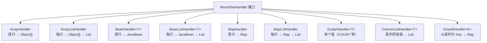
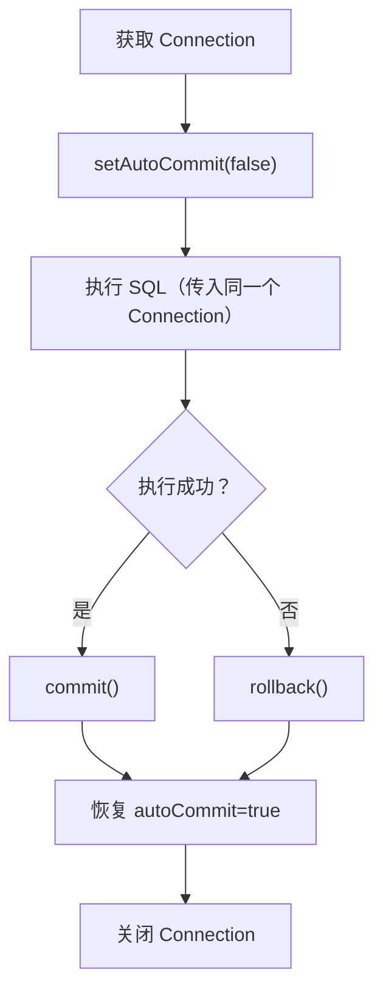
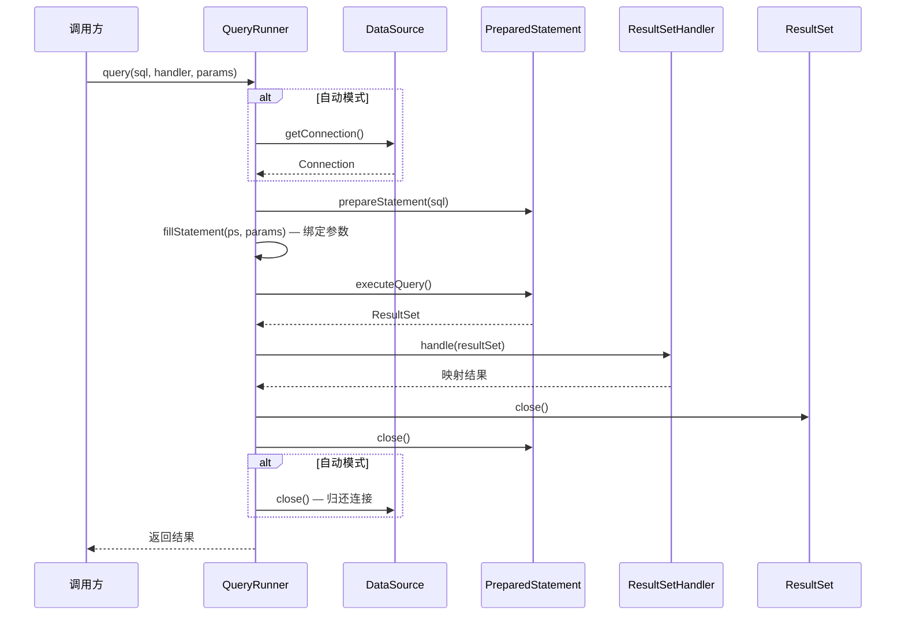

# DBUtils 工具

[Apache Commons DBUtils](https://commons.apache.org/proper/commons-dbutils/) 是 Apache 提供的轻量级 Java 数据库操作工具库。它是对 JDBC 的简单封装，旨在简化数据库操作，同时保持代码的清晰性和可维护性。

## 核心特性

| 特性 | 说明 |
|------|------|
| **轻量级** | 依赖少，易于集成 |
| **简化 JDBC** | 封装 Connection、Statement、ResultSet 操作 |
| **多种结果处理** | 提供 BeanHandler、BeanListHandler 等 |
| **线程安全** | 不维护共享状态 |
| **兼容性强** | 可与任何 JDBC 驱动一起使用 |

::: tip DBUtils 的定位
DBUtils 不是 ORM 框架，而是轻量级工具库，适合需要直接使用 SQL 的场景。它在 JDBC 和 ORM 框架之间提供了一个中间层——比原生 JDBC 简洁，比 MyBatis 轻量。
:::

## Maven 依赖

```xml
<dependency>
    <groupId>commons-dbutils</groupId>
    <artifactId>commons-dbutils</artifactId>
    <version>1.8.1</version>
</dependency>
```

## 核心类

### QueryRunner

`QueryRunner` 是 DBUtils 的核心类，用于执行 SQL 查询和更新操作。

**构造方法**：

| 方法 | 说明 |
|------|------|
| `QueryRunner()` | 手动模式，需要传入 Connection |
| `QueryRunner(DataSource ds)` | 自动模式，DBUtils 自动维护连接 |

**常用方法**：

| 方法 | 说明 |
|------|------|
| `update(Connection conn, String sql, Object... params)` | 增删改操作 |
| `query(Connection conn, String sql, ResultSetHandler<T> rsh, Object... params)` | 查询操作 |
| `insert(Connection conn, String sql, ResultSetHandler<T> rsh, Object... params)` | 插入并返回结果 |
| `batch(Connection conn, String sql, Object[][] params)` | 批处理操作 |

### ResultSetHandler 接口

DBUtils 提供多种结果处理器，用于将查询结果映射为 Java 对象：



**Handler 选用指南**：

| 场景 | 推荐 Handler | 说明 |
|------|-------------|------|
| 查询单个对象 | `BeanHandler` | 如根据 ID 查用户 |
| 查询对象列表 | `BeanListHandler` | 如查询所有用户 |
| 统计查询 | `ScalarHandler` | 如 COUNT、SUM |
| 查询单行任意列 | `MapHandler` | 如查询配置项 |
| 查询某列所有值 | `ColumnListHandler` | 如查询所有用户名 |

## 基本使用

### 创建 QueryRunner

```java
import org.apache.commons.dbutils.QueryRunner;
import javax.sql.DataSource;

public class DBUtilsDemo {
    public static void main(String[] args) {
        DataSource dataSource = DruidUtils.getDataSource();

        // 自动模式：QueryRunner 自动管理连接
        QueryRunner qr = new QueryRunner(dataSource);
    }
}
```

### 增删改操作

```java
import org.apache.commons.dbutils.QueryRunner;
import java.sql.SQLException;

public class CRUDExample {
    private QueryRunner qr = new QueryRunner(DruidUtils.getDataSource());

    public int insert(Employee emp) throws SQLException {
        String sql = "INSERT INTO employee(ename, age, sex, salary, empdate) VALUES(?,?,?,?,?)";
        return qr.update(sql, emp.getEname(), emp.getAge(), emp.getSex(), emp.getSalary(), emp.getEmpdate());
    }

    public int update(Employee emp) throws SQLException {
        String sql = "UPDATE employee SET ename=?, age=?, sex=?, salary=? WHERE eid=?";
        return qr.update(sql, emp.getEname(), emp.getAge(), emp.getSex(), emp.getSalary(), emp.getEid());
    }

    public int delete(int eid) throws SQLException {
        String sql = "DELETE FROM employee WHERE eid=?";
        return qr.update(sql, eid);
    }
}
```

### 查询操作

#### BeanHandler - 查询单个对象

```java
public Employee findById(int eid) throws SQLException {
    String sql = "SELECT * FROM employee WHERE eid=?";
    return qr.query(sql, new BeanHandler<>(Employee.class), eid);
}
```

#### BeanListHandler - 查询列表

```java
public List<Employee> findAll() throws SQLException {
    String sql = "SELECT * FROM employee";
    return qr.query(sql, new BeanListHandler<>(Employee.class));
}
```

#### ScalarHandler - 查询单个值

```java
public long count() throws SQLException {
    String sql = "SELECT COUNT(*) FROM employee";
    return qr.query(sql, new ScalarHandler<Long>());
}

public double sumSalary() throws SQLException {
    String sql = "SELECT SUM(salary) FROM employee";
    return qr.query(sql, new ScalarHandler<Double>());
}
```

#### MapHandler - 查询返回 Map

```java
public Map<String, Object> findByIdAsMap(int eid) throws SQLException {
    String sql = "SELECT * FROM employee WHERE eid=?";
    return qr.query(sql, new MapHandler(), eid);
}
```

#### MapListHandler - 查询返回 Map 列表

```java
public List<Map<String, Object>> findAllAsMap() throws SQLException {
    String sql = "SELECT * FROM employee";
    return qr.query(sql, new MapListHandler());
}
```

## 完整示例

### 实体类

```java
package jdbc.dbutils.entity;

import lombok.Data;
import java.util.Date;

@Data
public class Employee {
    private Integer eid;
    private String ename;
    private Integer age;
    private String sex;
    private Double salary;
    private Date empdate;
}
```

### DAO 层

```java
package jdbc.dbutils.dao;

import jdbc.dbutils.entity.Employee;
import jdbc.jdbcpool.druid.DruidUtils;
import org.apache.commons.dbutils.QueryRunner;
import org.apache.commons.dbutils.handlers.BeanHandler;
import org.apache.commons.dbutils.handlers.BeanListHandler;
import org.apache.commons.dbutils.handlers.ScalarHandler;

import java.sql.SQLException;
import java.util.List;

public class EmployeeDao {
    private QueryRunner qr = new QueryRunner(DruidUtils.getDataSource());

    public int insert(Employee emp) throws SQLException {
        String sql = "INSERT INTO employee(ename, age, sex, salary, empdate) VALUES(?,?,?,?,?)";
        return qr.update(sql, emp.getEname(), emp.getAge(), emp.getSex(), emp.getSalary(), emp.getEmpdate());
    }

    public int update(Employee emp) throws SQLException {
        String sql = "UPDATE employee SET ename=?, age=?, sex=?, salary=? WHERE eid=?";
        return qr.update(sql, emp.getEname(), emp.getAge(), emp.getSex(), emp.getSalary(), emp.getEid());
    }

    public int delete(int eid) throws SQLException {
        String sql = "DELETE FROM employee WHERE eid=?";
        return qr.update(sql, eid);
    }

    public Employee findById(int eid) throws SQLException {
        String sql = "SELECT * FROM employee WHERE eid=?";
        return qr.query(sql, new BeanHandler<>(Employee.class), eid);
    }

    public List<Employee> findAll() throws SQLException {
        String sql = "SELECT * FROM employee";
        return qr.query(sql, new BeanListHandler<>(Employee.class));
    }

    public List<Employee> findBySalary(double minSalary) throws SQLException {
        String sql = "SELECT * FROM employee WHERE salary >= ?";
        return qr.query(sql, new BeanListHandler<>(Employee.class), minSalary);
    }

    public long count() throws SQLException {
        String sql = "SELECT COUNT(*) FROM employee";
        return qr.query(sql, new ScalarHandler<Long>());
    }
}
```

### 测试类

```java
package jdbc.dbutils;

import jdbc.dbutils.dao.EmployeeDao;
import jdbc.dbutils.entity.Employee;
import org.junit.Test;

import java.sql.SQLException;
import java.util.List;

public class EmployeeDaoTest {
    private EmployeeDao employeeDao = new EmployeeDao();

    @Test
    public void testInsert() throws SQLException {
        Employee emp = new Employee();
        emp.setEname("张三");
        emp.setAge(25);
        emp.setSex("男");
        emp.setSalary(8000.0);
        emp.setEmpdate(new java.util.Date());

        int rows = employeeDao.insert(emp);
        System.out.println("插入行数: " + rows);
    }

    @Test
    public void testUpdate() throws SQLException {
        Employee emp = new Employee();
        emp.setEid(1);
        emp.setEname("李四");
        emp.setAge(30);
        emp.setSex("男");
        emp.setSalary(10000.0);

        int rows = employeeDao.update(emp);
        System.out.println("更新行数: " + rows);
    }

    @Test
    public void testDelete() throws SQLException {
        int rows = employeeDao.delete(1);
        System.out.println("删除行数: " + rows);
    }

    @Test
    public void testFindById() throws SQLException {
        Employee emp = employeeDao.findById(2);
        System.out.println(emp);
    }

    @Test
    public void testFindAll() throws SQLException {
        List<Employee> list = employeeDao.findAll();
        list.forEach(System.out::println);
    }

    @Test
    public void testCount() throws SQLException {
        long count = employeeDao.count();
        System.out.println("员工总数: " + count);
    }
}
```

## 事务处理

DBUtils 支持手动事务控制。使用事务时，必须使用**手动模式**（`new QueryRunner()`），将 Connection 显式传入：



```java
import org.apache.commons.dbutils.QueryRunner;
import java.sql.Connection;
import java.sql.SQLException;

public class TransactionExample {
    // 手动模式：不传入 DataSource
    private QueryRunner qr = new QueryRunner();

    public void transfer(String fromUser, String toUser, double amount) throws SQLException {
        Connection connection = null;
        try {
            connection = DruidUtils.getConnection();
            connection.setAutoCommit(false);

            String debitSql = "UPDATE account SET money = money - ? WHERE name = ?";
            String creditSql = "UPDATE account SET money = money + ? WHERE name = ?";

            // 同一个 Connection 保证事务一致性
            qr.update(connection, debitSql, amount, fromUser);
            qr.update(connection, creditSql, amount, toUser);

            connection.commit();
            System.out.println("转账成功");
        } catch (Exception e) {
            if (connection != null) {
                connection.rollback();
            }
            System.out.println("转账失败，事务已回滚");
            throw e;
        } finally {
            if (connection != null) {
                connection.setAutoCommit(true);
                connection.close();
            }
        }
    }
}
```

::: warning 自动模式 vs 手动模式
- **自动模式**（`QueryRunner(DataSource)`）：每次操作自动获取和关闭连接，**不支持跨操作事务**
- **手动模式**（`QueryRunner()`）：需手动传入 Connection，**支持事务控制**

需要事务时，必须使用手动模式并传入同一个 Connection！
:::

## 批处理操作

```java
public void batchInsert(List<Employee> employees) throws SQLException {
    String sql = "INSERT INTO employee(ename, age, sex, salary, empdate) VALUES(?,?,?,?,?)";

    Object[][] params = new Object[employees.size()][5];
    for (int i = 0; i < employees.size(); i++) {
        Employee emp = employees.get(i);
        params[i][0] = emp.getEname();
        params[i][1] = emp.getAge();
        params[i][2] = emp.getSex();
        params[i][3] = emp.getSalary();
        params[i][4] = emp.getEmpdate();
    }

    qr.batch(sql, params);
    System.out.println("批量插入完成");
}
```

## 自定义 ResultSetHandler

当内置 Handler 无法满足需求时，可以实现自定义的 `ResultSetHandler`：

```java
import org.apache.commons.dbutils.ResultSetHandler;
import java.sql.ResultSet;
import java.sql.SQLException;
import java.util.ArrayList;
import java.util.List;

// 自定义：只提取姓名列表
public class EmployeeNameHandler implements ResultSetHandler<List<String>> {
    @Override
    public List<String> handle(ResultSet rs) throws SQLException {
        List<String> names = new ArrayList<>();
        while (rs.next()) {
            names.add(rs.getString("ename"));
        }
        return names;
    }
}

// 使用
List<String> names = qr.query("SELECT ename FROM employee", new EmployeeNameHandler());
```

::: tip BeanProcessor 自定义映射
如果数据库列名和 Java 属性名不一致，可以通过自定义 `BeanProcessor` 解决，而不需要写完整的 ResultSetHandler：

```java
// 数据库列名：e_name → Java 属性名：ename
Map<String, String> columnToProperty = new HashMap<>();
columnToProperty.put("e_name", "ename");

BeanProcessor bp = new BeanProcessor(columnToProperty);
ResultSetHandler<Employee> handler = new BeanHandler<>(Employee.class, new BasicRowProcessor(bp));
```
:::

## 源码剖析：QueryRunner 核心流程

`QueryRunner.query()` 的核心执行流程：



**关键源码片段**（简化版）：

```java
public class QueryRunner {

    // query 方法核心逻辑
    public <T> T query(Connection conn, String sql, ResultSetHandler<T> rsh, Object... params)
            throws SQLException {
        PreparedStatement stmt = null;
        ResultSet rs = null;
        T result = null;

        try {
            stmt = conn.prepareStatement(sql);
            fillStatement(stmt, params);  // 绑定参数
            rs = stmt.executeQuery();     // 执行查询
            result = rsh.handle(rs);      // 结果映射
        } finally {
            closeQuietly(rs);             // 安静关闭 ResultSet
            closeQuietly(stmt);           // 安静关闭 Statement
        }
        return result;
    }

    // 参数绑定
    private void fillStatement(PreparedStatement stmt, Object... params) throws SQLException {
        if (params != null) {
            for (int i = 0; i < params.length; i++) {
                stmt.setObject(i + 1, params[i]);  // JDBC 参数从 1 开始
            }
        }
    }
}
```

::: details BeanHandler 如何实现自动映射
`BeanHandler` 内部使用 `BasicRowProcessor` → `BeanProcessor` 实现自动映射：

1. 通过反射获取 JavaBean 的所有属性
2. 将数据库列名转换为驼峰命名（如 `user_name` → `userName`）
3. 匹配列名与属性名
4. 通过 `PropertyDescriptor` 调用 setter 方法赋值

这就是为什么 DBUtils 要求**数据库列名与 Java 属性名一致**（或符合下划线转驼峰规则）。
:::

## 横向对比：DBUtils vs 其他数据访问方案

| 特性 | DBUtils | Spring JdbcTemplate | MyBatis | MyBatis-Plus |
|------|---------|---------------------|---------|--------------|
| **学习曲线** | 低 | 低 | 中 | 中 |
| **代码量** | 较少 | 中等 | 较少 | 最少 |
| **灵活性** | 高（直接 SQL） | 中 | 高（动态 SQL） | 中 |
| **ORM 能力** | 弱 | 弱 | 强 | 最强 |
| **事务管理** | 手动 | 声明式 | 声明式 | 声明式 |
| **结果映射** | BeanHandler | RowMapper | XML/注解 | 自动 |
| **动态 SQL** | 不支持 | 不支持 | 支持 | 支持（Wrapper） |
| **适用场景** | 简单项目/教学 | Spring 项目 | 企业级项目 | 企业级项目 |

::: tip 技术演进路线
DBUtils → Spring JdbcTemplate → MyBatis → MyBatis-Plus

DBUtils 适合学习 JDBC 封装思想，但生产项目中推荐使用 MyBatis-Plus（国内主流）或 JPA（国外主流）。
:::

## 最佳实践

### 1. 使用连接池

```java
// 推荐：配合连接池使用
QueryRunner qr = new QueryRunner(DruidUtils.getDataSource());
```

### 2. 合理选择 Handler

- 单条记录：`BeanHandler`
- 多条记录：`BeanListHandler`
- 统计查询：`ScalarHandler`
- 灵活映射：`MapHandler` / `MapListHandler`

### 3. 异常处理

```java
try {
    int rows = qr.update(sql, params);
} catch (SQLException e) {
    log.error("数据库操作失败", e);
    throw new RuntimeException("操作失败", e);
}
```

### 4. 资源释放

使用自动模式的 QueryRunner 时，DBUtils 会自动关闭资源。手动模式需要确保资源释放。

## 总结

DBUtils 是一个轻量级的 JDBC 工具库：

1. **简化代码**：减少 JDBC 样板代码
2. **自动映射**：将结果集自动映射为 JavaBean
3. **灵活使用**：支持自定义 ResultSetHandler
4. **事务支持**：支持手动事务控制

对于简单的数据库操作，DBUtils 是一个不错的选择。但对于复杂的企业级应用，建议使用 MyBatis 或 Spring Data JPA。

**下一步**：学习 [XML 可扩展标记语言](03-XML.md)，了解 Java 中 XML 解析技术。

## 版本差异(旧版 → 当前)

| 特性 | 旧版 | 当前 |
|------|------|------|
| DbUtils 版本 | 1.6/1.7 早期 | 1.8.x 持续维护（QueryRunner/ResultSetHandler 用法不变） |
| 适用场景 | 简单 JDBC 操作 | 仍适用；复杂企业应用建议 MyBatis/Spring Data JPA |
| JDK 支持 | JDK 8 | 兼容 JDK 17/21（纯 JDBC 封装，无兼容问题） |
| 事务 | 手动控制 | 用法不变 |

> DbUtils 是轻量 JDBC 封装工具，API 多年保持稳定，本文示例在 JDK 17/21 下可直接运行。
