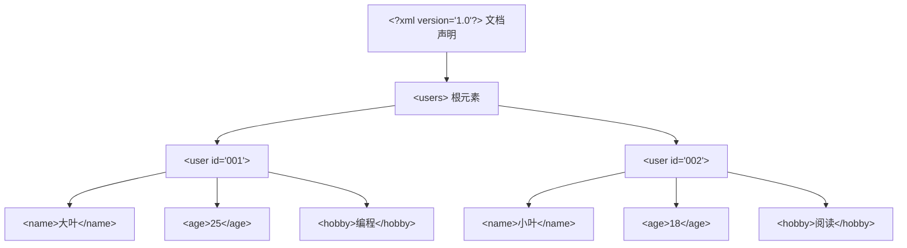
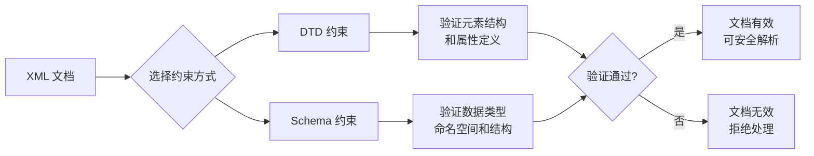
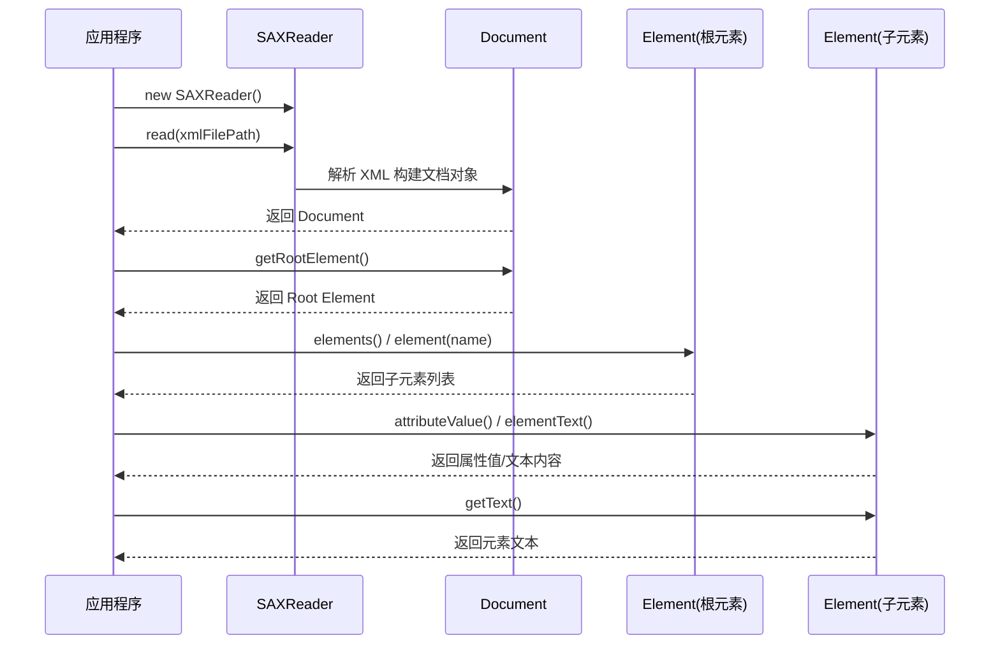
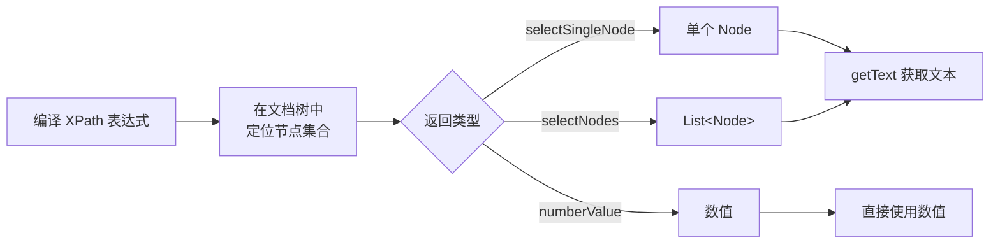
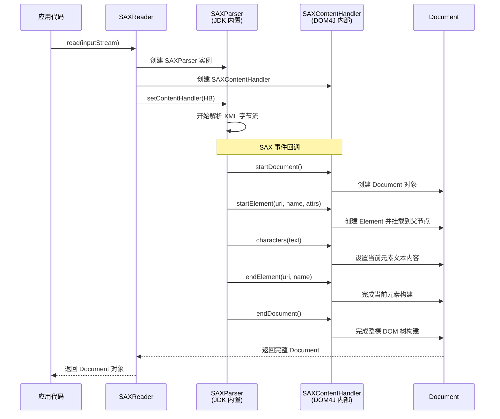
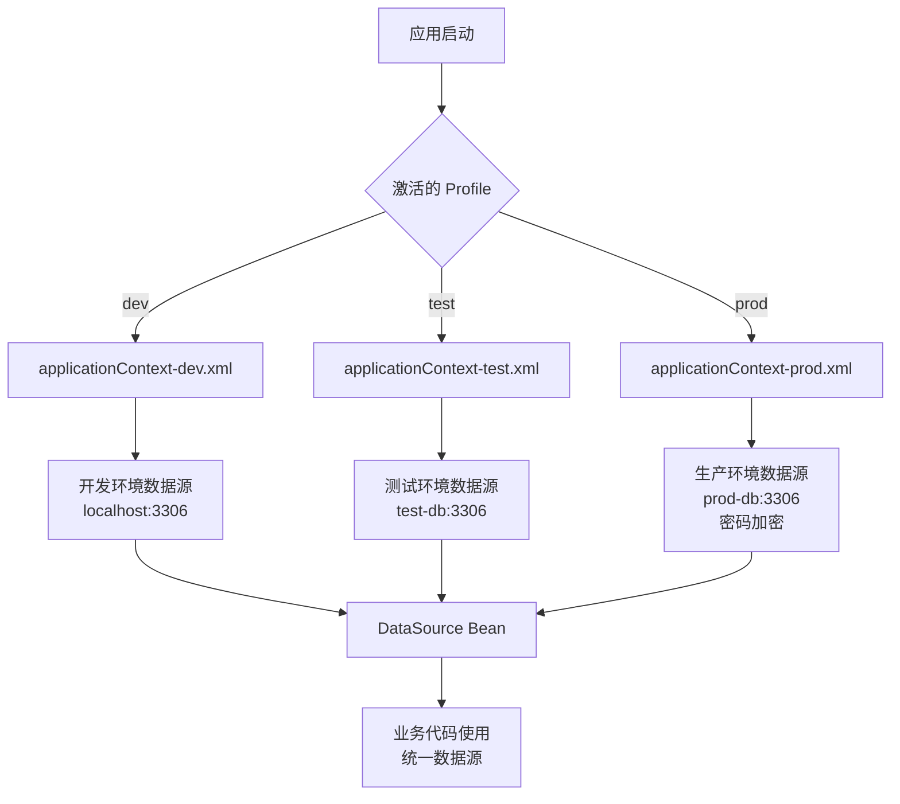

# XML 可扩展标记语言

XML（Extensible Markup Language，可扩展标记语言）是一种用于存储和传输数据的标记语言。W3C 于 1998 年发布 1.0 版本，2004 年发布 1.1 版本，但由于 1.1 版本不能向下兼容 1.0，因此实际开发中主要使用 1.0 版本。

::: tip XML 的历史地位
虽然 JSON 和 YAML 在数据交换领域已大量替代 XML，但 XML 在配置文件（Spring、Maven、Tomcat）、文档标记（XHTML、SVG、MathML）和遗留系统集成中仍然不可替代。理解 XML 是 Java 后端工程师的基本功。
:::

## XML 核心特性

| 特性         | 说明                                         |
| ------------ | -------------------------------------------- |
| **可扩展性** | 标签都是自定义的，可以根据需求定义合适的标签 |
| **严格语法** | 必须遵循严格的语法规则，保证文档结构清晰     |
| **平台无关** | 纯文本格式，跨平台、跨语言使用               |
| **结构化**   | 层次分明，便于解析和处理                     |

## XML 主要用途

| 用途         | 说明                     | 应用场景                            |
| ------------ | ------------------------ | ----------------------------------- |
| **配置文件** | 作为框架和应用的配置文件 | Spring 配置、Maven POM、Tomcat 配置 |
| **数据存储** | 存储结构化数据           | 数据交换、离线数据存储              |
| **数据传输** | 网络中传输结构化数据     | WebService、SOAP 协议、API 响应     |
| **文档标记** | 标记文档结构和内容       | XHTML、SVG、MathML                  |

## XML 文档结构

XML 文档本质是一棵由节点构成的树，理解其树形结构是掌握解析技术的基础。



::: warning 根元素唯一性
每个格式良好的 XML 文档有且仅有一个根元素。所有其他元素都必须嵌套在根元素内部。缺少根元素或存在多个根元素都会导致解析失败。
:::

## XML 语法

### 文档声明

文档声明必须位于文档第一行，用于声明 XML 版本和编码。

```xml
<?xml version="1.0" encoding="UTF-8"?>
```

| 属性         | 是否必须 | 说明                            |
| ------------ | -------- | ------------------------------- |
| `version`    | 必须     | 指定 XML 文档版本，通常为 `1.0` |
| `encoding`   | 可选     | 指定文档编码，默认 `UTF-8`      |
| `standalone` | 可选     | 是否独立文档，`yes` 或 `no`     |

### 元素（Element）

元素是 XML 文档中最重要的组成部分。

**命名规则**：

- 不能以数字或标点符号开头
- 不能包含空格
- 不能以 `xml`（任何大小写形式）开头
- 不能包含冒号（`:` 保留给命名空间使用）
- 区分大小写

**元素结构**：

```xml
<!-- 普通元素：开始标签 + 内容 + 结束标签 -->
<hello>大家好</hello>

<!-- 嵌套元素 -->
<user>
    <name>张三</name>
    <age>25</age>
</user>

<!-- 空元素：自闭合形式 -->
<br/>
<close/>
```

**重要规则**：

- XML 文档必须有且只有一个根元素
- 所有元素必须正确闭合
- 元素必须正确嵌套，不能交叉

```xml
<?xml version="1.0" encoding="UTF-8"?>
<users>
    <user id="001">
        <name>张百万</name>
        <age>25</age>
    </user>
    <user id="002">
        <name>小斌</name>
        <age>18</age>
        <hobby>
            <sport>乒乓球</sport>
        </hobby>
    </user>
    <empty/>
</users>
```

### 属性（Attribute）

属性提供元素的附加信息，必须定义在开始标签中。

**语法规则**：

- 格式：`属性名="属性值"` 或 `属性名='属性值'`
- 属性值必须使用引号包围
- 同一元素不能有同名属性
- 属性名遵循元素命名规则

```xml
<bean id="userService" class="com.example.UserService">
    <property name="dataSource" ref="dataSource"/>
</bean>
```

**元素内容 vs 属性**：

```xml
<!-- 使用属性 -->
<person name="张三" age="25"/>

<!-- 使用子元素 -->
<person>
    <name>张三</name>
    <age>25</age>
</person>
```

| 比较项   | 属性               | 子元素             |
| -------- | ------------------ | ------------------ |
| 适用场景 | 简单、短小的元数据 | 复杂、结构化的数据 |
| 可扩展性 | 较差               | 好，可以添加子元素 |
| 可读性   | 紧凑               | 清晰               |
| 顺序     | 无序               | 有序               |

::: tip 属性 vs 子元素的选择原则
经验法则：如果数据是元数据（如 ID、类型标识、引用关系），用属性；如果数据是业务内容（如姓名、价格、描述），用子元素。Spring 的 XML 配置就是典型范例——`id`、`class` 用属性，`property` 用子元素。
:::

### 注释

```xml
<!-- 这是单行注释 -->

<!--
  这是多行注释
  可以跨越多行
-->
```

::: danger 注释注意事项
- 注释不能出现在 XML 声明之前
- 注释不能嵌套使用
- 注释内容中不能包含连续的两个连字符（`--`）
- 注释不能出现在标签内部
:::

### 特殊字符与 CDATA

**转义字符**：

| 字符 | 转义符   | 说明   |
| ---- | -------- | ------ |
| `<`  | `&lt;`   | 小于号 |
| `>`  | `&gt;`   | 大于号 |
| `&`  | `&amp;`  | 和号   |
| `"`  | `&quot;` | 双引号 |
| `'`  | `&apos;` | 单引号 |

**CDATA 区段**：用于包含大量特殊字符的文本，无需转义。

```xml
<script>
    <![CDATA[
        if (a < b && b > c) {
            console.log("条件成立");
        }
    ]]>
</script>
```

::: warning CDATA 不是注释
CDATA 区段中的内容是文档的原始数据，解析器会原样保留，不会忽略。不要把 CDATA 当作注释使用——它只是告诉解析器"这段文本不需要解析特殊字符"。
:::

### 完整示例：描述数据表

```xml
<?xml version="1.0" encoding="UTF-8"?>
<employees>
    <employee eid="1">
        <ename>韩梅梅</ename>
        <age>20</age>
        <sex>女</sex>
        <salary>5000</salary>
        <hiredate>2019-03-14</hiredate>
    </employee>
    <employee eid="2">
        <ename>光明顶</ename>
        <age>40</age>
        <sex>男</sex>
        <salary>15000</salary>
        <hiredate>2010-01-01</hiredate>
    </employee>
</employees>
```

## XML 约束

XML 约束用于规定 XML 文档的结构，确保文档符合预定义的规范。常见的约束技术有 DTD 和 Schema。

### XML 验证流程



### DTD 约束

DTD（Document Type Definition，文档类型定义）是一种较简单的约束方式。

**DTD 能约束的内容**：

- 元素名称和层级结构
- 元素出现的顺序和次数
- 属性的类型和约束

**DTD 定义语法**：

```xml
<!ELEMENT students (student+)>           <!-- 根元素，至少包含一个 student -->
<!ELEMENT student (name, age, sex)>     <!-- 子元素必须按顺序出现 -->
<!ELEMENT name (#PCDATA)>               <!-- 普通文本内容 -->
<!ELEMENT age (#PCDATA)>
<!ELEMENT sex (#PCDATA)>
<!ATTLIST student number ID #REQUIRED>  <!-- 定义属性：ID 类型，必须填写 -->
```

**元素出现次数**：

| 符号   | 含义                 |
| ------ | -------------------- |
| 无符号 | 必须出现且仅出现一次 |
| `+`    | 至少出现一次         |
| `*`    | 出现零次或多次       |
| `?`    | 出现零次或一次       |
| `|`    | 选择其一             |
| `,`    | 按顺序出现           |

**引入 DTD 约束**：

```xml
<?xml version="1.0" encoding="UTF-8"?>
<!DOCTYPE students SYSTEM "student.dtd">
<students>
    <student number="S001">
        <name>光明顶</name>
        <age>20</age>
        <sex>男</sex>
    </student>
    <student number="S002">
        <name>韩梅梅</name>
        <age>18</age>
        <sex>女</sex>
    </student>
</students>
```

::: details DTD 的局限性
- DTD 自身不是 XML 格式，无法用 XML 工具验证和解析
- 不支持数据类型，所有内容都是 `#PCDATA`（纯文本）
- 不支持命名空间，在复杂文档中容易产生命名冲突
- 扩展性差，难以表达复杂的约束关系（如"年龄必须是 0-150 的整数"）
- 实际项目中，DTD 已逐渐被 Schema 替代，但遗留系统仍大量使用
:::

### Schema 约束

XML Schema 是 DTD 的替代者，功能更强大，支持数据类型和命名空间。

**Schema 优势**：

| 特性     | DTD    | Schema                           |
| -------- | ------ | -------------------------------- |
| 文档格式 | 非 XML | XML 格式                         |
| 数据类型 | 有限   | 丰富（string、integer、date 等） |
| 命名空间 | 不支持 | 支持                             |
| 可扩展性 | 较差   | 好                               |

**Schema 定义示例**：

```xml
<?xml version="1.0" encoding="UTF-8"?>
<xsd:schema xmlns="http://www.example.com/xml"
            xmlns:xsd="http://www.w3.org/2001/XMLSchema"
            targetNamespace="http://www.example.com/xml"
            elementFormDefault="qualified">

    <!-- 定义根元素 -->
    <xsd:element name="students" type="studentsType"/>

    <!-- 复杂类型：包含子元素 -->
    <xsd:complexType name="studentsType">
        <xsd:sequence>
            <xsd:element name="student" type="studentType"
                         minOccurs="0" maxOccurs="unbounded"/>
        </xsd:sequence>
    </xsd:complexType>

    <!-- 学生类型 -->
    <xsd:complexType name="studentType">
        <xsd:sequence>
            <xsd:element name="name" type="xsd:string"/>
            <xsd:element name="age" type="ageType"/>
            <xsd:element name="sex" type="sexType"/>
        </xsd:sequence>
        <xsd:attribute name="number" type="numberType" use="required"/>
    </xsd:complexType>

    <!-- 简单类型：性别枚举 -->
    <xsd:simpleType name="sexType">
        <xsd:restriction base="xsd:string">
            <xsd:enumeration value="male"/>
            <xsd:enumeration value="female"/>
        </xsd:restriction>
    </xsd:simpleType>

    <!-- 简单类型：年龄范围 -->
    <xsd:simpleType name="ageType">
        <xsd:restriction base="xsd:integer">
            <xsd:minInclusive value="0"/>
            <xsd:maxInclusive value="150"/>
        </xsd:restriction>
    </xsd:simpleType>

    <!-- 简单类型：学号格式 -->
    <xsd:simpleType name="numberType">
        <xsd:restriction base="xsd:string">
            <xsd:pattern value="S_\d{4}"/>
        </xsd:restriction>
    </xsd:simpleType>
</xsd:schema>
```

**引入 Schema 约束**：

```xml
<?xml version="1.0" encoding="UTF-8"?>
<students xmlns="http://www.example.com/xml"
          xmlns:xsi="http://www.w3.org/2001/XMLSchema-instance"
          xsi:schemaLocation="http://www.example.com/xml student.xsd">
    <student number="S_0001">
        <name>张三</name>
        <age>20</age>
        <sex>male</sex>
    </student>
    <student number="S_0002">
        <name>李四</name>
        <age>22</age>
        <sex>female</sex>
    </student>
</students>
```

**命名空间说明**：

| 属性                 | 说明                           |
| -------------------- | ------------------------------ |
| `xmlns`              | 默认命名空间                   |
| `xmlns:xsi`          | W3C 实例命名空间（固定写法）   |
| `xsi:schemaLocation` | 指定命名空间和 Schema 文件位置 |

## XML 解析方式

### 解析方式对比

| 方式     | 原理                                | 优点                 | 缺点                       | 适用场景               |
| -------- | ----------------------------------- | -------------------- | -------------------------- | ---------------------- |
| **DOM**  | 将整个 XML 加载到内存，构建树形结构 | 可增删改查，操作灵活 | 内存占用大，大文件可能溢出 | 小文件、需要修改的场景 |
| **SAX**  | 逐行扫描，事件驱动                  | 内存占用小，速度快   | 只读，无法修改             | 大文件、只读场景       |
| **StAX** | 拉取式流解析，游标模型              | 内存小，可控制解析进度 | 只读，API 较复杂          | 大文件、按需读取场景   |

### DOM vs SAX vs StAX 解析流程对比

```mermaid
flowchart TB
    subgraph DOM["DOM 解析（一次性加载）"]
        D1[读取整个 XML 文件] --> D2[在内存中构建<br/>完整 DOM 树]
        D2 --> D3[通过树节点<br/>随机访问/修改]
        D3 --> D4[写回修改后的文档]
    end

    subgraph SAX["SAX 解析（事件驱动）"]
        S1[逐行扫描 XML] --> S2[触发事件回调<br/>startElement / endElement]
        S2 --> S3[应用程序处理事件]
        S3 --> S4[解析完成<br/>无法回溯]
    end

    subgraph StAX["StAX 解析（拉取式）"]
        T1[应用程序主动调用<br/>next() 推进游标] --> T2[按需获取当前事件]
        T2 --> T3[处理当前节点数据]
        T3 --> T4[继续推进或停止<br/>完全可控]
    end

```

::: tip StAX —— Java 6+ 推荐的流式解析
StAX（Streaming API for XML）从 Java 6 开始成为 JDK 标准API（`javax.xml.stream` 包），相比 SAX 的"推"模式，StAX 采用"拉"模式——由应用程序控制解析进度，可以随时停止，更灵活。Java 17+ 中 StAX 没有重大 API 变化，但底层实现性能持续优化。
:::

### 常见解析器

| 解析器    | 说明                                  |
| --------- | ------------------------------------- |
| **DOM4J** | 优秀的开源解析器，功能强大，使用广泛  |
| **JAXP**  | Sun 提供的标准解析器，支持 DOM 和 SAX |
| **Jsoup** | 主要用于 HTML 解析，也可解析 XML      |
| **PULL**  | Android 内置解析器，类似 SAX          |

## DOM4J 解析

DOM4J 是 Java 中最流行的 XML 解析库之一，简单易用且功能强大。Hibernate 等框架内部就使用 DOM4J 处理 XML 映射配置。

### Maven 依赖

```xml
<dependency>
    <groupId>org.dom4j</groupId>
    <artifactId>dom4j</artifactId>
    <version>2.1.4</version>
</dependency>
```

::: warning DOM4J 2.x 与 Java 版本兼容性
DOM4J 2.1.x 支持 Java 8+。如果你使用 Java 17+，需要注意 DOM4J 2.1.4 在模块化系统（JPMS）下可能需要添加 `--add-opens` 参数来反射访问 JDK 内部类。DOM4J 3.x 版本正在开发中，将更好地支持 Java 9+ 模块系统。
:::

### DOM4J 解析工作流程



### 核心 API

| 类/方法            | 说明                          |
| ------------------ | ----------------------------- |
| `SAXReader`        | XML 解析器，用于读取 XML 文档 |
| `Document`         | 文档对象，代表整个 XML 文档   |
| `Element`          | 元素对象，代表 XML 元素       |
| `getName()`        | 获取元素名称                  |
| `getText()`        | 获取元素文本内容              |
| `attributeValue()` | 获取属性值                    |
| `elementText()`    | 获取子元素文本                |
| `elements()`       | 获取所有子元素                |
| `element()`        | 获取指定名称的第一个子元素    |

### 准备测试文件

```xml
<?xml version="1.0" encoding="UTF-8"?>
<users>
    <user id="001">
        <name>大叶</name>
        <age>25</age>
        <hobby>编程</hobby>
    </user>
    <user id="002">
        <name>小叶</name>
        <age>18</age>
        <hobby>阅读</hobby>
    </user>
</users>
```

### 基本读取操作

```java
import org.dom4j.Document;
import org.dom4j.DocumentException;
import org.dom4j.Element;
import org.dom4j.io.SAXReader;
import org.junit.Test;

import java.util.List;

public class Dom4jDemo {

    @Test
    public void testParseElements() throws DocumentException {
        // 创建 SAX 读取器
        SAXReader reader = new SAXReader();
        // 读取 XML 文件并构建文档对象
        Document document = reader.read("src/main/resources/user.xml");
        // 获取根元素
        Element rootElement = document.getRootElement();

        System.out.println("根元素: " + rootElement.getName());

        // 遍历根元素下的所有子元素
        List<Element> users = rootElement.elements();
        for (Element user : users) {
            System.out.println("子元素: " + user.getName());

            // 遍历每个 user 元素下的子元素
            List<Element> children = user.elements();
            for (Element child : children) {
                System.out.println("  - " + child.getName());
            }
        }
    }

    @Test
    public void testParseData() throws DocumentException {
        SAXReader reader = new SAXReader();
        Document document = reader.read("src/main/resources/user.xml");
        Element rootElement = document.getRootElement();

        List<Element> users = rootElement.elements();

        for (Element user : users) {
            // 获取属性值
            String id = user.attributeValue("id");
            // 获取子元素文本（两种方式）
            String name = user.elementText("name");       // 方式一：直接获取文本
            String age = user.elementText("age");
            String hobby = user.element("hobby").getText(); // 方式二：先获取元素再取文本

            System.out.printf("ID: %s, 姓名: %s, 年龄: %s, 爱好: %s%n",
                              id, name, age, hobby);
        }
    }
}
```

### 写入 XML 文件

```java
import org.dom4j.Document;
import org.dom4j.DocumentHelper;
import org.dom4j.Element;
import org.dom4j.io.OutputFormat;
import org.dom4j.io.XMLWriter;

import java.io.FileOutputStream;
import java.io.IOException;
import java.nio.charset.StandardCharsets;

public class Dom4jWriteDemo {

    public static void main(String[] args) throws IOException {
        // 创建空文档
        Document document = DocumentHelper.createDocument();
        // 添加根元素
        Element root = document.addElement("users");

        // 方式一：链式调用添加元素（注意链式调用会返回最后添加的元素）
        root.addElement("user")
            .addAttribute("id", "001")
            .addElement("name").addText("张三");

        // 链式调用后需要回到 user 元素继续添加子元素
        root.element("user").addElement("age").addText("25");

        // 方式二：分步添加，更清晰可控
        Element user2 = root.addElement("user");
        user2.addAttribute("id", "002");
        user2.addElement("name").addText("李四");
        user2.addElement("age").addText("30");

        // 设置输出格式（美化缩进）
        OutputFormat format = OutputFormat.createPrettyPrint();
        format.setEncoding("UTF-8");

        // 写入文件（Java 7+ 推荐使用 try-with-resources）
        try (XMLWriter writer = new XMLWriter(
                new FileOutputStream("output.xml"), format)) {
            writer.write(document);
            System.out.println("XML 文件写入成功");
        }
    }
}
```

::: danger 链式调用的陷阱
DOM4J 的 `addElement()` 返回的是新创建的子元素，而不是父元素。因此 `root.addElement("user").addElement("name")` 会在 `user` 下创建 `name`，但后续如果想给 `user` 添加 `age`，需要先通过 `root.element("user")` 回到 `user` 元素。推荐使用"分步添加"方式，代码更清晰。
:::

## XPath 解析

XPath 是在 XML 文档中查找信息的语言，可以快速定位元素，无需逐层遍历。

### Maven 依赖

```xml
<dependency>
    <groupId>jaxen</groupId>
    <artifactId>jaxen</artifactId>
    <version>1.2.0</version>
</dependency>
```

### XPath 查询执行流程



### XPath 语法

| 表达式 | 说明             | 示例              |
| ------ | ---------------- | ----------------- |
| `/`    | 从根节点选取     | `/bookstore/book` |
| `//`   | 从任意位置选取   | `//book`          |
| `.`    | 当前节点         | `./title`         |
| `..`   | 父节点           | `../price`        |
| `@`    | 选取属性         | `@id`             |
| `*`    | 匹配任意元素节点 | `/bookstore/*`    |
| `@*`   | 匹配任意属性节点 | `//@*`            |

**谓语（筛选条件）**：

| 谓语             | 说明                         |
| ---------------- | ---------------------------- |
| `[1]`            | 第一个元素                   |
| `[last()]`       | 最后一个元素                 |
| `[position()<3]` | 前两个元素                   |
| `[@id='book1']`  | id 属性为 book1 的元素       |
| `[price>35]`     | price 子元素值大于 35 的元素 |

### XPath 示例

**测试数据**：

```xml
<?xml version="1.0" encoding="UTF-8"?>
<bookstore>
    <book id="book1">
        <name>金瓶梅</name>
        <author>金圣叹</author>
        <price>99</price>
    </book>
    <book id="book2">
        <name>红楼梦</name>
        <author>曹雪芹</author>
        <price>69</price>
    </book>
    <book id="book3">
        <name>Java编程思想</name>
        <author>埃克尔</author>
        <price>59</price>
    </book>
</bookstore>
```

**代码示例**：

```java
import org.dom4j.Document;
import org.dom4j.Node;
import org.dom4j.io.SAXReader;
import org.junit.Test;

import java.util.List;

public class XPathDemo {

    @Test
    public void testSelectSingleNode() throws Exception {
        SAXReader reader = new SAXReader();
        Document document = reader.read("src/main/resources/book.xml");

        // 绝对路径：获取第一本书的书名
        Node node1 = document.selectSingleNode("/bookstore/book/name");
        System.out.println("第一本书名: " + node1.getText());

        // 索引定位：获取第二本书的书名（XPath 索引从 1 开始）
        Node node2 = document.selectSingleNode("/bookstore/book[2]/name");
        System.out.println("第二本书名: " + node2.getText());

        // last() 函数：获取最后一本书的书名
        Node node3 = document.selectSingleNode("/bookstore/book[last()]/name");
        System.out.println("最后一本书名: " + node3.getText());
    }

    @Test
    public void testSelectByAttribute() throws Exception {
        SAXReader reader = new SAXReader();
        Document document = reader.read("src/main/resources/book.xml");

        // 获取属性值
        Node attr = document.selectSingleNode("/bookstore/book/@id");
        System.out.println("第一个 book 的 id: " + attr.getText());

        // 根据属性值筛选元素
        Node book = document.selectSingleNode("/bookstore/book[@id='book2']");
        String name = book.selectSingleNode("name").getText();
        System.out.println("id=book2 的书名: " + name);
    }

    @Test
    public void testSelectNodes() throws Exception {
        SAXReader reader = new SAXReader();
        Document document = reader.read("src/main/resources/book.xml");

        // 获取所有节点
        List<Node> allNodes = document.selectNodes("//*");
        System.out.println("所有节点数量: " + allNodes.size());

        // 获取所有指定名称的节点
        List<Node> names = document.selectNodes("//name");
        System.out.println("所有书名:");
        for (Node node : names) {
            System.out.println("  - " + node.getText());
        }

        // 组合条件：获取指定属性值元素下的所有内容
        List<Node> book1Content = document.selectNodes(
            "/bookstore/book[@id='book1']//*");
        System.out.println("book1 的所有内容:");
        for (Node node : book1Content) {
            if (!node.getText().trim().isEmpty()) {
                System.out.println("  " + node.getName() + ": " + node.getText());
            }
        }
    }
}
```

## 实战：XML 配置数据库连接

### 配置文件

```xml
<?xml version="1.0" encoding="UTF-8"?>
<jdbc>
    <property name="driverClass">com.mysql.cj.jdbc.Driver</property>
    <property name="jdbcUrl">jdbc:mysql://localhost:3306/mydb?useSSL=false&amp;serverTimezone=UTC&amp;characterEncoding=UTF-8</property>
    <property name="user">root</property>
    <property name="password">123456</property>
    <property name="initialSize">5</property>
    <property name="maxTotal">20</property>
</jdbc>
```

::: warning 注意 URL 中的特殊字符
XML 中 `&` 必须转义为 `&amp;`。JDBC URL 中的参数分隔符 `&` 在 XML 中必须写成 `&amp;`，否则解析会报错。这是实际开发中最常见的 XML 陷阱之一。
:::

### 工具类实现

```java
import org.dom4j.Document;
import org.dom4j.Node;
import org.dom4j.io.SAXReader;

import java.sql.Connection;
import java.sql.DriverManager;
import java.sql.SQLException;
import java.util.HashMap;
import java.util.Map;

public class XmlJdbcUtils {

    private static final Map<String, String> CONFIG = new HashMap<>();

    // 静态初始化块：类加载时读取配置并注册驱动
    static {
        try {
            loadConfig();
            Class.forName(CONFIG.get("driverClass"));
        } catch (Exception e) {
            throw new RuntimeException("初始化 JDBC 配置失败", e);
        }
    }

    /**
     * 从 XML 配置文件中加载数据库连接参数
     * 使用 XPath 精确定位每个 property 元素
     */
    private static void loadConfig() throws Exception {
        SAXReader reader = new SAXReader();
        Document document = reader.read(
            XmlJdbcUtils.class.getResourceAsStream("/jdbc-config.xml"));

        String[] keys = {"driverClass", "jdbcUrl", "user", "password",
                         "initialSize", "maxTotal"};

        for (String key : keys) {
            // 通过 XPath 按属性名定位元素
            Node node = document.selectSingleNode(
                "/jdbc/property[@name='" + key + "']");
            if (node != null) {
                CONFIG.put(key, node.getText());
            }
        }
    }

    /**
     * 获取数据库连接
     */
    public static Connection getConnection() throws SQLException {
        return DriverManager.getConnection(
            CONFIG.get("jdbcUrl"),
            CONFIG.get("user"),
            CONFIG.get("password")
        );
    }

    /**
     * 获取指定配置项的值
     */
    public static String getConfig(String key) {
        return CONFIG.get(key);
    }
}
```

### 测试使用

```java
import java.sql.Connection;
import java.sql.PreparedStatement;
import java.sql.ResultSet;

public class XmlJdbcTest {

    public static void main(String[] args) {
        // 使用 try-with-resources 自动关闭资源
        try (Connection connection = XmlJdbcUtils.getConnection()) {
            String sql = "SELECT id, name, age FROM user LIMIT 5";

            try (PreparedStatement ps = connection.prepareStatement(sql);
                 ResultSet rs = ps.executeQuery()) {

                System.out.println("数据库连接成功，查询结果：");
                while (rs.next()) {
                    System.out.printf("ID: %d, 姓名: %s, 年龄: %d%n",
                        rs.getInt("id"),
                        rs.getString("name"),
                        rs.getInt("age"));
                }
            }
        } catch (Exception e) {
            e.printStackTrace();
        }
    }
}
```

## 源码剖析：DOM4J 核心解析机制

DOM4J 底层使用 SAX 解析器读取 XML，然后在内存中构建 DOM 树。理解这一机制有助于排查性能问题和选择正确的解析策略。

### DOM4J 解析链路



### 关键源码分析

DOM4J 的 `SAXReader.read()` 方法核心流程如下：

```java
// SAXReader 核心方法（简化版，基于 DOM4J 2.1.4 源码）
public Document read(InputSource inputSource) throws DocumentException {
    try {
        // 1. 获取 JDK 内置的 SAXParserFactory
        SAXParserFactory factory = SAXParserFactory.newInstance();
        // 2. 配置解析器特性（命名空间、验证等）
        configureParserFactory(factory);
        // 3. 创建 SAXParser
        SAXParser parser = factory.newSAXParser();
        // 4. 创建 DOM4J 自定义的 ContentHandler
        //    SAXContentHandler 是核心：它将 SAX 事件转换为 DOM4J 的 Element 树
        SAXContentHandler contentHandler = new SAXContentHandler(
            getDocumentFactory(),  // 文档工厂，创建 Element/Attribute 对象
            getElementHandler()    // 元素处理器，可自定义扩展
        );
        // 5. 将 ContentHandler 注册到 SAXParser
        parser.getXMLReader().setContentHandler(contentHandler);
        // 6. 开始解析，SAX 事件驱动 contentHandler 构建文档树
        parser.parse(inputSource);
        // 7. 返回构建完成的 Document
        return contentHandler.getDocument();
    } catch (Exception e) {
        throw new DocumentException("解析 XML 失败", e);
    }
}
```

::: details SAXContentHandler 的内部栈结构
`SAXContentHandler` 内部维护一个 `Stack<Element>` 来跟踪当前解析路径：

1. 遇到 `startElement` 事件时，创建新 Element 并压栈，同时挂载到栈顶元素的子节点列表
2. 遇到 `characters` 事件时，将文本追加到栈顶 Element
3. 遇到 `endElement` 事件时，弹出栈顶 Element

这个栈结构保证了 XML 的嵌套层级关系被正确映射为 DOM 树的父子关系。栈的深度等于当前 XML 元素的嵌套深度，因此极端深层的 XML 会导致栈内存压力增大。
:::

::: details DOM4J 的内存模型
DOM4J 的 Document 对象在内存中保存了完整的 XML 树结构，每个 Element、Attribute、Text 都是一个 Java 对象。对于一个 100MB 的 XML 文件，DOM4J 解析后可能占用 300-500MB 的 JVM 堆内存（约 3-5 倍膨胀）。这就是为什么大文件场景推荐使用 SAX 或 StAX 的根本原因——它们不需要在内存中构建完整的对象树。
:::

## 横向对比：XML vs JSON vs YAML vs Properties

在 Java 后端开发中，配置和数据序列化有多种格式可选，各有适用场景。

| 维度         | XML                    | JSON                   | YAML                   | Properties          |
| ------------ | ---------------------- | ---------------------- | ---------------------- | ------------------- |
| **数据结构** | 树形，支持属性和命名空间 | 树形，键值对/数组      | 树形，缩进表示层级     | 扁平键值对          |
| **可读性**   | 冗长，标签重复多       | 简洁，结构清晰         | 极简，缩进敏感         | 最简单，无层级      |
| **数据类型** | 无原生类型（均为文本） | string/number/boolean/null | 丰富，支持日期/集合 | 仅字符串            |
| **注释支持** | 支持 `<!-- -->`        | 不支持（JSON5 支持）   | 支持 `#`               | 支持 `#` 和 `!`     |
| **命名空间** | 支持                   | 不支持                 | 不支持                 | 不支持              |
| **验证机制** | DTD / Schema           | JSON Schema            | 无标准验证             | 无                  |
| **解析效率** | 较低（标签冗余）       | 高                     | 较低（缩进解析复杂）   | 最高                |
| **Java 生态** | DOM4J / JAXB / StAX    | Jackson / Gson / Fastjson | SnakeYAML             | JDK 内置            |
| **典型场景** | Spring 配置、SOAP、SVG | REST API、微服务通信   | Docker Compose、CI 配置 | 简单配置项          |

::: tip 格式选择建议
- **Spring Boot 配置**：优先用 YAML（层级清晰），简单配置可用 Properties，遗留项目用 XML
- **REST API 数据交换**：JSON 是事实标准，不要用 XML
- **跨系统/跨语言集成**：XML + Schema 提供最强的约束验证能力
- **简单键值配置**：Properties 足够，无需引入更复杂的格式
- **Java 17+ 新项目**：优先考虑 JSON（Jackson）或 YAML（SnakeYAML），XML 仅在需要强约束验证时使用
:::

::: details Java 17+ 中的 XML 相关变化
- **JAXB 模块化**：JAXB 从 Java 9 开始移出 JDK，Java 11+ 需要单独引入 `jakarta.xml.bind:jakarta.xml.bind-api` 和 `org.glassfish.jaxb:jaxb-runtime`
- **StAX 性能优化**：JDK 内置的 StAX 实现（`javax.xml.stream`）在后续 JDK 版本中持续优化，大文件解析性能稳步提升
- **安全默认值**：Java 17 默认禁用外部实体引用（XXE 防护），DOM4J 也需要显式配置才能加载外部 DTD
- **记录类（Record）与 XML**：Java 14+ 引入的 Record 类可以与 JAXB 配合使用，简化 XML 绑定代码
:::

## 生产实践案例：Spring Boot 多环境 XML 配置管理

在实际项目中，不同环境（开发、测试、生产）的数据库配置不同，使用 XML 配合 Spring 的 Profile 机制可以实现灵活的多环境管理。

### 场景描述

一个 Spring Boot 项目需要管理三个环境的数据库连接配置，要求：
1. 各环境配置独立，互不干扰
2. 敏感信息（密码）不能明文存储
3. 配置变更不需要重新编译代码

### 架构设计



### 公共配置（applicationContext.xml）

```xml
<?xml version="1.0" encoding="UTF-8"?>
<beans xmlns="http://www.springframework.org/schema/beans"
       xmlns:xsi="http://www.w3.org/2001/XMLSchema-instance"
       xsi:schemaLocation="http://www.springframework.org/schema/beans
       http://www.springframework.org/schema/beans/spring-beans.xsd">

    <!-- 公共配置：所有环境共享 -->
    <bean id="jdbcTemplate" class="org.springframework.jdbc.core.JdbcTemplate">
        <property name="dataSource" ref="dataSource"/>
    </bean>

    <!-- 数据源定义由各环境配置文件覆盖 -->
</beans>
```

### 开发环境配置（applicationContext-dev.xml）

```xml
<?xml version="1.0" encoding="UTF-8"?>
<beans xmlns="http://www.springframework.org/schema/beans"
       xmlns:xsi="http://www.w3.org/2001/XMLSchema-instance"
       xsi:schemaLocation="http://www.springframework.org/schema/beans
       http://www.springframework.org/schema/beans/spring-beans.xsd">

    <!-- 开发环境数据源：本地 MySQL -->
    <bean id="dataSource" class="com.alibaba.druid.pool.DruidDataSource"
          destroy-method="close">
        <property name="driverClassName" value="com.mysql.cj.jdbc.Driver"/>
        <property name="url" value="jdbc:mysql://localhost:3306/mydb_dev?useSSL=false&amp;serverTimezone=UTC"/>
        <property name="username" value="root"/>
        <property name="password" value="123456"/>
        <property name="initialSize" value="5"/>
        <property name="maxActive" value="20"/>
    </bean>
</beans>
```

### 生产环境配置（applicationContext-prod.xml）

```xml
<?xml version="1.0" encoding="UTF-8"?>
<beans xmlns="http://www.springframework.org/schema/beans"
       xmlns:xsi="http://www.w3.org/2001/XMLSchema-instance"
       xsi:schemaLocation="http://www.springframework.org/schema/beans
       http://www.springframework.org/schema/beans/spring-beans.xsd">

    <!-- 生产环境数据源：使用加密密码 -->
    <bean id="dataSource" class="com.alibaba.druid.pool.DruidDataSource"
          destroy-method="close">
        <property name="driverClassName" value="com.mysql.cj.jdbc.Driver"/>
        <property name="url" value="jdbc:mysql://prod-db-master:3306/mydb?useSSL=true&amp;serverTimezone=UTC"/>
        <property name="username" value="app_user"/>
        <!-- 使用 Druid 内置加密，密码为加密后的密文 -->
        <property name="password" value="加密后的密文"/>
        <property name="connectionProperties" value="config.decrypt=true"/>
        <property name="initialSize" value="10"/>
        <property name="maxActive" value="100"/>
        <property name="minIdle" value="10"/>
        <property name="maxWait" value="60000"/>
        <!-- 连接有效性检测 -->
        <property name="validationQuery" value="SELECT 1"/>
        <property name="testWhileIdle" value="true"/>
    </bean>
</beans>
```

::: danger 生产环境 XML 配置安全要点
1. **密码不能明文**：使用 Druid 的 `ConfigFilter` 或 Jasypt 对密码加密
2. **文件权限控制**：生产配置文件应设置严格的文件系统权限（如 `chmod 600`）
3. **不要提交密文密钥**：加密密钥应通过环境变量或密钥管理系统注入，不要写在代码或配置文件中
4. **XXE 防护**：如果应用接受外部 XML 输入，务必禁用外部实体引用
:::

## 最佳实践

### XML 设计原则

1. **合理使用元素和属性**
   - 元数据用属性（如 id、type）
   - 业务数据用元素

2. **保持结构清晰**
   - 嵌套层次不宜过深（建议不超过 5 层）
   - 元素命名要有意义

3. **统一编码格式**
   - 推荐使用 UTF-8 编码
   - 声明编码与文件实际编码一致

### 解析器选择建议

| 场景           | 推荐方案        |
| -------------- | --------------- |
| 配置文件解析   | DOM4J + XPath   |
| 大文件只读解析 | SAX 或 StAX     |
| Web 应用配置   | Spring 内置解析 |
| Android 应用   | PULL 解析器     |

### 性能优化

```java
import org.dom4j.Document;
import org.dom4j.DocumentException;
import org.dom4j.io.SAXReader;

import java.io.InputStream;
import java.io.FileInputStream;

public class XmlParserOptimization {

    // SAXReader 创建成本低且非线程安全，
    // 多线程环境下应使用 ThreadLocal 或每次创建新实例
    private static final ThreadLocal<SAXReader> READER_POOL =
        ThreadLocal.withInitial(SAXReader::new);

    /**
     * 解析文档（ThreadLocal 保证每个线程拿到独立实例）
     */
    public static Document parseDocument(String filePath) throws DocumentException {
        SAXReader reader = READER_POOL.get();
        try {
            return reader.read(filePath);
        } finally {
            READER_POOL.remove(); // 线程池环境下及时清理，避免 ThreadLocal 内存泄漏
        }
    }

    /**
     * 解析大文件：使用 InputStream 并指定编码
     * 确保流资源被正确关闭
     */
    public static void parseLargeFile(String filePath) throws Exception {
        try (InputStream is = new FileInputStream(filePath)) {
            SAXReader reader = new SAXReader();
            reader.setEncoding("UTF-8");
            Document document = reader.read(is);
            // 处理文档...
        }
    }
}
```

::: tip XXE 防护配置
如果解析来自不可信来源的 XML，必须禁用外部实体引用以防止 XXE（XML External Entity）攻击：

```java
SAXReader reader = new SAXReader();
// 禁用 DTD 加载
reader.setFeature("http://apache.org/xml/features/disallow-doctype-decl", true);
// 禁用外部实体
reader.setFeature("http://xml.org/sax/features/external-general-entities", false);
reader.setFeature("http://xml.org/sax/features/external-parameter-entities", false);
```
:::

## 常见问题

### 1. 中文乱码问题

```java
// 解决方案：确保编码一致
// 1. XML 声明指定 UTF-8
// 2. 文件保存为 UTF-8 编码
// 3. 读取时指定编码

SAXReader reader = new SAXReader();
reader.setEncoding("UTF-8");
Document document = reader.read(new InputStreamReader(
    new FileInputStream("file.xml"), StandardCharsets.UTF_8));
```

### 2. 命名空间问题

```java
// 使用命名空间时，XPath 需要特殊处理
Map<String, String> namespaceMap = new HashMap<>();
namespaceMap.put("ns", "http://www.example.com/xml");

XPath xpath = document.createXPath("//ns:user");
xpath.setNamespaceURIs(namespaceMap);
List<Node> nodes = xpath.selectNodes(document);
```

::: warning 命名空间是 XPath 的常见坑
当 XML 文档使用了默认命名空间（`xmlns="..."`）时，即使没有前缀，XPath 也必须通过命名空间前缀来定位元素。这是因为 XPath 规范中"无前缀的元素名"表示"无命名空间"，而不是"默认命名空间"。这是初学者最常遇到的 XPath 问题。
:::

### 3. 特殊字符处理

```xml
<!-- 使用 CDATA 包含特殊字符 -->
<sql>
    <![CDATA[
        SELECT * FROM user WHERE age < 18 AND status = 'active'
    ]]>
</sql>
```

### 4. Java 17+ 模块系统兼容问题

```java
// Java 17+ 使用 DOM4J 可能遇到的模块访问问题
// 启动参数添加：
// --add-opens java.base/java.lang=ALL-UNNAMED
// --add-opens java.base/java.lang.reflect=ALL-UNNAMED

// 或者升级到 DOM4J 3.x（开发中），原生支持模块系统
```

## 总结

本章介绍了 XML 的核心概念和 Java 解析技术：

| 知识点   | 核心内容                          |
| -------- | --------------------------------- |
| XML 语法 | 文档声明、元素、属性、注释、CDATA |
| XML 约束 | DTD 约束、Schema 约束             |
| 解析方式 | DOM（内存树）、SAX（事件驱动）、StAX（拉取式流） |
| DOM4J    | SAXReader、Document、Element      |
| XPath    | 路径表达式、谓语、属性选择        |
| 横向对比 | XML vs JSON vs YAML vs Properties |
| 安全     | XXE 防护、密码加密、命名空间处理  |

**下一步**：学习综合案例，将 JDBC、连接池、DBUtils 和 XML 结合使用

## 版本差异(旧版 → 当前)

| 特性 | 旧版 | 当前 |
|------|------|------|
| XML 解析技术 | DOM/SAX/DOM4J | 用法稳定不变 |
| XXE 防护 | 需显式关闭外部实体 | JDK 内置解析器默认限制增强，但显式防护仍是推荐做法 |
| 数据格式选型 | XML 为主 | 新项目多选 JSON/YAML，XML 用于配置/报文等场景 |
| JDK 支持 | JDK 8 | JDK 17/21 完全兼容（注意模块化下 JAXP 默认实现） |

> XML 技术栈十余年保持稳定，本文 DOM4J/XPath 示例在 JDK 17/21 下可直接运行；重点仍是做好 XXE 等安全防护。
