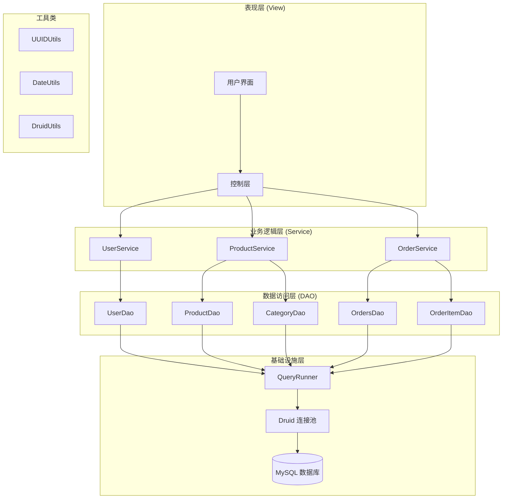
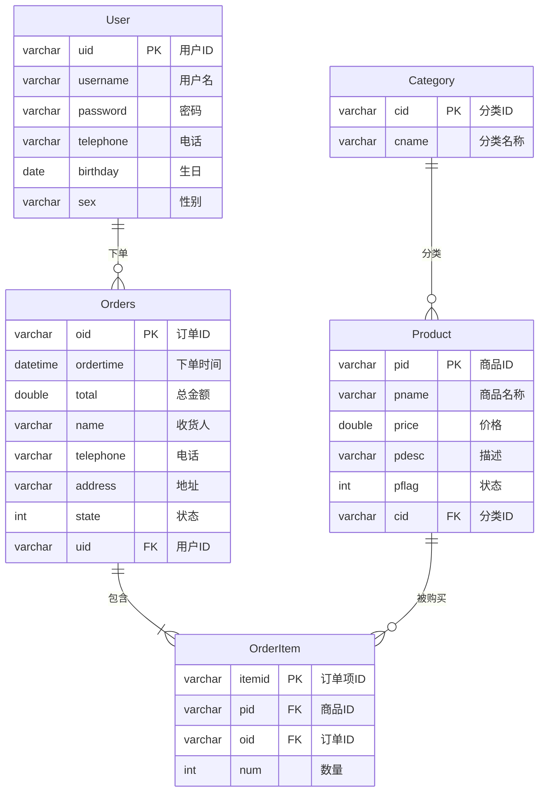
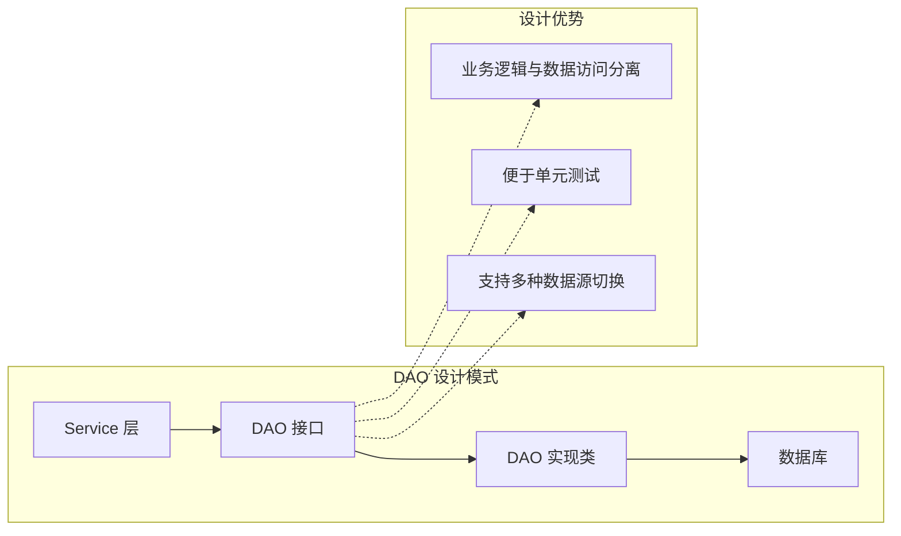
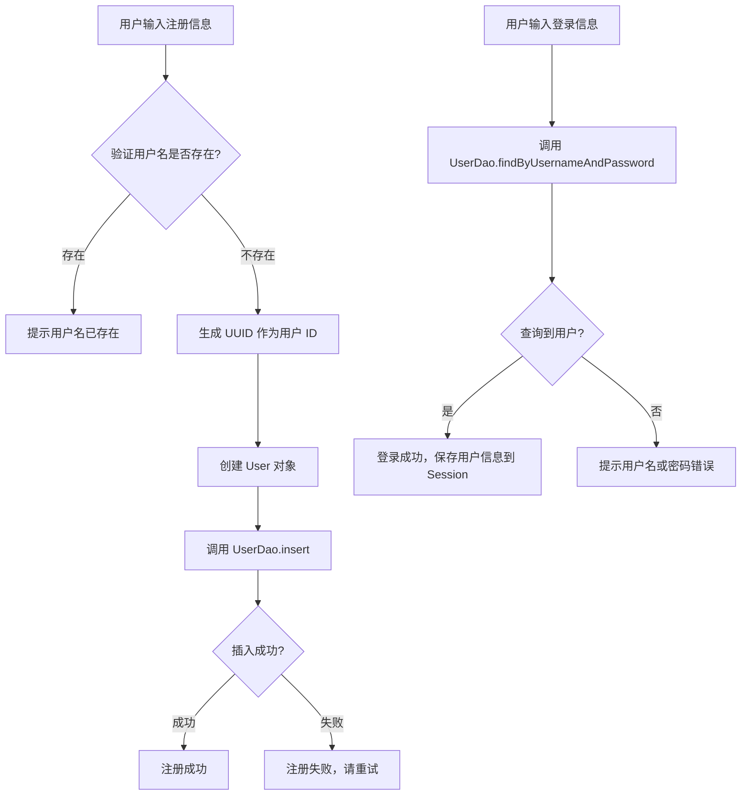
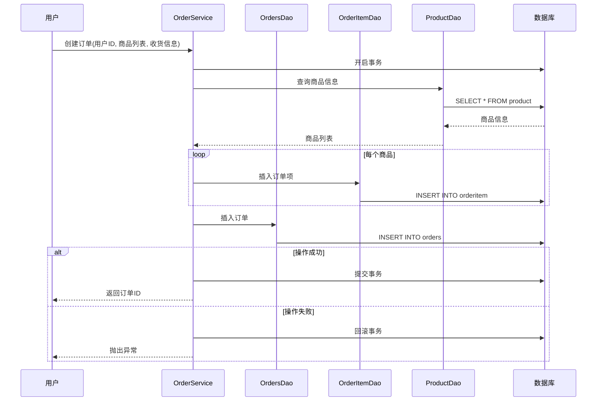
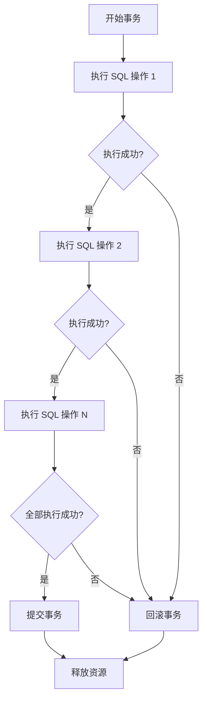
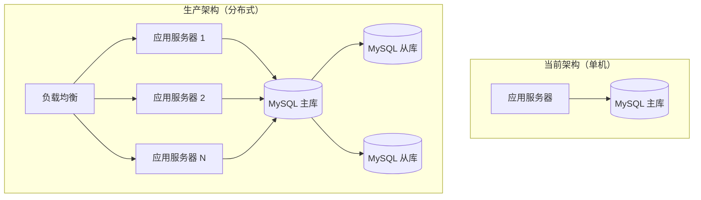
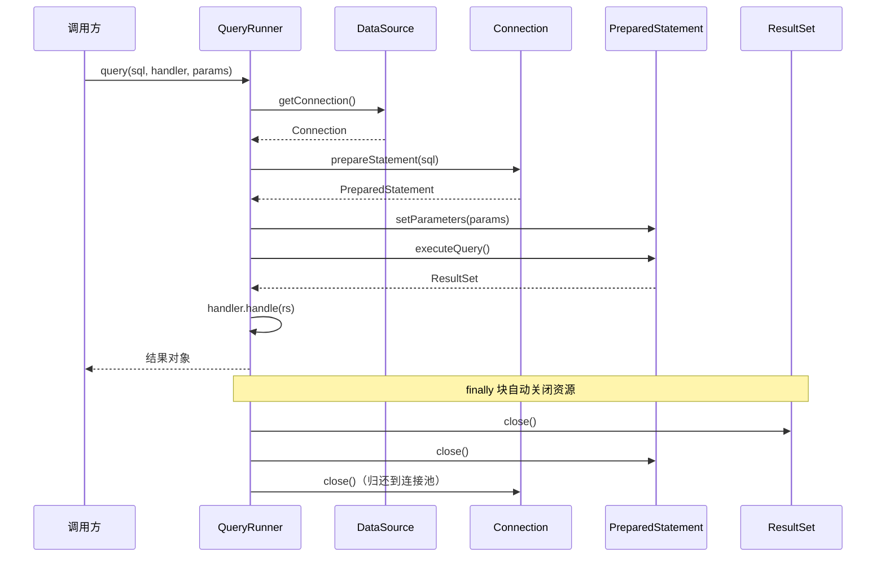

# JDBC 综合案例：商城订单系统

本章通过一个完整的商城订单系统案例，综合运用 JDBC、数据库连接池、DBUtils 等技术，展示实际项目开发中的数据访问层设计与实现。

## 项目概述

### 功能模块

| 模块     | 功能               |
| -------- | ------------------ |
| 用户管理 | 用户注册、用户登录 |
| 商品管理 | 商品查询、分类查询 |
| 订单管理 | 订单查询、订单详情 |

### 技术栈

| 技术    | 说明           |
| ------- | -------------- |
| JDBC    | 数据库访问基础 |
| Druid   | 数据库连接池   |
| DBUtils | 简化 JDBC 操作 |
| MySQL   | 数据库         |
| Lombok  | 简化实体类代码 |

### 项目架构图



::: tip 架构设计要点
本项目采用经典的三层架构：表现层负责与用户交互，业务层处理业务逻辑，数据层负责数据库操作。这种分层设计使得各层职责清晰，便于维护和扩展。
:::

## 数据库设计

### ER 图



### 表关系说明

| 关系               | 类型   | 说明                      |
| ------------------ | ------ | ------------------------- |
| User - Orders      | 一对多 | 一个用户可以有多个订单    |
| Category - Product | 一对多 | 一个分类下有多个商品      |
| Orders - Product   | 多对多 | 通过 OrderItem 中间表关联 |

::: warning 表设计注意事项
- 主键使用 `VARCHAR(32)` 类型，通过 UUID 生成，避免分布式环境下的主键冲突
- 外键约束在生产环境中可能被移除，改由应用层维护数据一致性，以提升性能
- 订单状态字段使用 `INT` 类型，便于后续扩展更多状态（如已发货、已完成、已退款等）
:::

### 建表 SQL

```sql
CREATE DATABASE order_demo CHARACTER SET utf8mb4;
USE order_demo;

-- 用户表
CREATE TABLE user (
    uid VARCHAR(32) PRIMARY KEY COMMENT '用户ID',
    username VARCHAR(20) NOT NULL COMMENT '用户名',
    password VARCHAR(100) NOT NULL COMMENT '密码',
    telephone VARCHAR(20) COMMENT '电话',
    birthday DATE COMMENT '生日',
    sex VARCHAR(10) COMMENT '性别'
) COMMENT '用户表';

INSERT INTO user VALUES
('001', '渣渣辉', '123456', '13511112222', '2015-11-04', '男'),
('002', '药水哥', '123456', '13533334444', '1990-02-01', '男'),
('003', '大明白', '123456', '13544445555', '2015-11-03', '男'),
('004', '长海', '123456', '13566667777', '2000-02-01', '男'),
('005', '乔杉', '123456', '13588889999', '2000-02-01', '男');

-- 商品分类表
CREATE TABLE category (
    cid VARCHAR(32) PRIMARY KEY COMMENT '分类ID',
    cname VARCHAR(20) NOT NULL COMMENT '分类名称'
) COMMENT '商品分类表';

INSERT INTO category VALUES
('1', '手机数码'), ('2', '电脑办公'), ('3', '运动鞋服'), ('4', '图书音像');

-- 商品表
CREATE TABLE product (
    pid VARCHAR(32) PRIMARY KEY COMMENT '商品ID',
    pname VARCHAR(50) NOT NULL COMMENT '商品名称',
    price DOUBLE COMMENT '商品价格',
    pdesc VARCHAR(255) COMMENT '商品描述',
    pflag INT DEFAULT 0 COMMENT '商品状态: 1上架, 0下架',
    cid VARCHAR(32) COMMENT '分类ID',
    CONSTRAINT fk_product_category FOREIGN KEY (cid) REFERENCES category(cid)
) COMMENT '商品表';

INSERT INTO product VALUES
('1', '小米6', 2200, '小米 移动联通电信4G手机 双卡双待', 0, '1'),
('2', '华为Mate9', 2599, '华为 双卡双待 高清大屏', 0, '1'),
('3', 'OPPO11', 3000, '移动联通 双4G手机', 0, '1'),
('4', '华为荣耀', 1499, '3GB内存标准版 黑色 移动4G手机', 0, '1'),
('5', '华硕台式电脑', 5000, '爆款直降，满千减百', 0, '2'),
('6', 'MacBook', 6688, '128GB 闪存', 0, '2'),
('7', 'ThinkPad', 4199, '轻薄系列1)', 0, '2'),
('8', '联想小新', 4499, '14英寸超薄笔记本电脑', 0, '2'),
('9', '李宁音速6', 500, '实战篮球鞋', 0, '3'),
('10', 'AJ11', 3300, '乔丹实战系列', 0, '3'),
('11', 'AJ1', 5800, '精神小伙系列', 0, '3');

-- 订单表
CREATE TABLE orders (
    oid VARCHAR(32) PRIMARY KEY COMMENT '订单ID',
    ordertime DATETIME COMMENT '下单时间',
    total DOUBLE COMMENT '总金额',
    name VARCHAR(20) COMMENT '收货人姓名',
    telephone VARCHAR(20) COMMENT '收货人电话',
    address VARCHAR(100) COMMENT '收货地址',
    state INT DEFAULT 0 COMMENT '订单状态: 1已支付, 0未支付',
    uid VARCHAR(32) COMMENT '用户ID',
    CONSTRAINT fk_orders_user FOREIGN KEY (uid) REFERENCES user(uid)
) COMMENT '订单表';

INSERT INTO orders VALUES
('order001', '2019-10-11 10:30:00', 5500, '乔杉', '15512342345', '皇家洗浴', 0, '001');

-- 订单项表（中间表）
CREATE TABLE orderitem (
    itemid VARCHAR(32) PRIMARY KEY COMMENT '订单项ID',
    pid VARCHAR(32) COMMENT '商品ID',
    oid VARCHAR(32) COMMENT '订单ID',
    num INT DEFAULT 1 COMMENT '商品数量',
    CONSTRAINT fk_orderitem_product FOREIGN KEY (pid) REFERENCES product(pid),
    CONSTRAINT fk_orderitem_orders FOREIGN KEY (oid) REFERENCES orders(oid)
) COMMENT '订单项表';

INSERT INTO orderitem VALUES
('item001', '1', 'order001', 1),
('item002', '11', 'order001', 1);
```

## 项目结构

```
src/main/java/
├── jdbc/democase/
│   ├── entity/          # 实体类
│   │   ├── User.java
│   │   ├── Orders.java
│   │   ├── Product.java
│   │   ├── Category.java
│   │   └── OrderItem.java
│   ├── dao/             # 数据访问层
│   │   ├── UserDao.java
│   │   ├── ProductDao.java
│   │   └── OrdersDao.java
│   ├── service/         # 业务逻辑层
│   └── utils/           # 工具类
│       ├── DruidUtils.java
│       ├── DateUtils.java
│       └── UUIDUtils.java
└── resources/
    └── druid.properties # 数据库配置
```

### DAO 层设计模式



::: tip DAO 模式的核心思想
DAO（Data Access Object）模式将数据访问逻辑从业务逻辑中分离出来，每个 DAO 类负责一张表的所有数据库操作。这种设计使得业务层不需要关心数据如何存储，只需要调用 DAO 的方法即可。
:::

## 工具类实现

### Maven 依赖

```xml
<dependencies>
    <!-- MySQL 驱动 -->
    <dependency>
        <groupId>com.mysql</groupId>
        <artifactId>mysql-connector-j</artifactId>
        <version>8.0.33</version>
    </dependency>

    <!-- Druid 连接池 -->
    <dependency>
        <groupId>com.alibaba</groupId>
        <artifactId>druid</artifactId>
        <version>1.2.20</version>
    </dependency>

    <!-- DBUtils -->
    <dependency>
        <groupId>commons-dbutils</groupId>
        <artifactId>commons-dbutils</artifactId>
        <version>1.8.1</version>
    </dependency>

    <!-- Lombok -->
    <dependency>
        <groupId>org.projectlombok</groupId>
        <artifactId>lombok</artifactId>
        <version>1.18.30</version>
        <scope>provided</scope>
    </dependency>

    <!-- JUnit -->
    <dependency>
        <groupId>junit</groupId>
        <artifactId>junit</artifactId>
        <version>4.13.2</version>
        <scope>test</scope>
    </dependency>
</dependencies>
```

::: warning MySQL 驱动版本选择
MySQL Connector/J 8.0.x 版本需要 JDK 8+，且驱动类名改为 `com.mysql.cj.jdbc.Driver`（注意多了 `.cj`）。如果使用旧版 MySQL 5.x，请使用 `mysql-connector-java` 5.1.x 版本。
:::

### 数据库配置文件

`resources/druid.properties`:

```properties
driverClassName=com.mysql.cj.jdbc.Driver
url=jdbc:mysql://127.0.0.1:3306/order_demo?useSSL=false&serverTimezone=Asia/Shanghai&characterEncoding=UTF-8&rewriteBatchedStatements=true
username=root
password=root1234

initialSize=5
maxActive=20
maxWait=3000
minIdle=5

validationQuery=SELECT 1
testOnBorrow=true
testOnReturn=false
testWhileIdle=true
```

::: details 连接池参数详解
| 参数 | 说明 | 推荐值 |
| --- | --- | --- |
| `initialSize` | 初始化连接数 | 5-10 |
| `maxActive` | 最大连接数 | 根据数据库配置，通常 20-100 |
| `maxWait` | 获取连接最大等待时间（毫秒） | 3000-5000 |
| `minIdle` | 最小空闲连接数 | 与 initialSize 相同 |
| `validationQuery` | 连接有效性检测 SQL | `SELECT 1` |
| `testOnBorrow` | 获取连接时检测 | true（生产环境可设为 false 提升性能） |
| `testWhileIdle` | 空闲时检测 | true |
:::

### DruidUtils 工具类

```java
package jdbc.democase.utils;

import com.alibaba.druid.pool.DruidDataSourceFactory;
import lombok.Getter;

import javax.sql.DataSource;
import java.io.InputStream;
import java.sql.Connection;
import java.sql.ResultSet;
import java.sql.SQLException;
import java.sql.Statement;
import java.util.Properties;

/**
 * Druid 连接池工具类
 * 负责管理数据库连接的获取和释放
 */
public class DruidUtils {

    @Getter
    private static final DataSource dataSource;

    // 静态代码块：类加载时初始化连接池
    static {
        try {
            Properties props = new Properties();
            // 从类路径加载配置文件
            InputStream is = DruidUtils.class.getClassLoader()
                .getResourceAsStream("druid.properties");
            props.load(is);
            // 创建 Druid 数据源
            dataSource = DruidDataSourceFactory.createDataSource(props);
        } catch (Exception e) {
            // 初始化失败时抛出运行时异常，阻止程序继续运行
            throw new RuntimeException("初始化连接池失败", e);
        }
    }

    /**
     * 获取数据库连接
     * @return 数据库连接对象
     */
    public static Connection getConnection() {
        try {
            return dataSource.getConnection();
        } catch (SQLException e) {
            throw new RuntimeException("获取连接失败", e);
        }
    }

    /**
     * 关闭资源（无 ResultSet）
     */
    public static void close(Connection conn, Statement stmt) {
        close(conn, stmt, null);
    }

    /**
     * 关闭资源（含 ResultSet）
     * 注意：连接池中的 close() 实际上是将连接归还到池中
     */
    public static void close(Connection conn, Statement stmt, ResultSet rs) {
        try {
            if (rs != null) rs.close();
            if (stmt != null) stmt.close();
            if (conn != null) conn.close(); // 归还连接到池中
        } catch (SQLException e) {
            e.printStackTrace();
        }
    }
}
```

::: danger 连接泄漏警告
使用连接池时，务必确保在 `finally` 块中关闭连接。如果连接未正确关闭，会导致连接池耗尽，最终应用无法获取新连接。建议使用 try-with-resources 语法或模板方法模式来保证资源释放。
:::

### UUIDUtils 工具类

```java
package jdbc.democase.utils;

import java.util.UUID;

/**
 * UUID 生成工具类
 * 用于生成唯一的主键 ID
 */
public class UUIDUtils {

    /**
     * 获取 32 位 UUID（去除横线）
     * @return 32 位唯一字符串
     */
    public static String getUUID() {
        // UUID 格式：xxxxxxxx-xxxx-xxxx-xxxx-xxxxxxxxxxxx
        // 去除横线后得到 32 位字符串
        return UUID.randomUUID().toString().replace("-", "");
    }
}
```

### DateUtils 工具类

```java
package jdbc.democase.utils;

import java.text.SimpleDateFormat;
import java.util.Date;

/**
 * 日期格式化工具类
 */
public class DateUtils {

    private static final SimpleDateFormat SDF =
        new SimpleDateFormat("yyyy-MM-dd HH:mm:ss");

    /**
     * 格式化日期
     * @param date 日期对象
     * @return 格式化后的字符串
     */
    public static String formatDate(Date date) {
        return SDF.format(date);
    }

    /**
     * 获取当前时间字符串
     */
    public static String getCurrentTime() {
        return formatDate(new Date());
    }
}
```

::: warning SimpleDateFormat 线程安全问题
`SimpleDateFormat` 是线程不安全的类。在多线程环境下，应该使用 `ThreadLocal` 包装或使用 Java 8 的 `DateTimeFormatter`。生产环境推荐使用以下方式：

```java
// Java 8+ 推荐方式
private static final DateTimeFormatter FORMATTER = 
    DateTimeFormatter.ofPattern("yyyy-MM-dd HH:mm:ss");

public static String getCurrentTime() {
    return LocalDateTime.now().format(FORMATTER);
}
```
:::

## 实体类设计

### 实体类与表关系

| 实体类    | 对应表    | 关系描述                             |
| --------- | --------- | ------------------------------------ |
| User      | user      | 一个用户有多个订单                   |
| Orders    | orders    | 一个订单属于一个用户，包含多个订单项 |
| Product   | product   | 一个商品属于一个分类                 |
| Category  | category  | 一个分类包含多个商品                 |
| OrderItem | orderitem | 订单项关联订单和商品                 |

### User 实体类

```java
package jdbc.democase.entity;

import lombok.Data;
import java.util.List;

/**
 * 用户实体类
 * 对应数据库 user 表
 */
@Data
public class User {
    private String uid;        // 用户ID（主键）
    private String username;   // 用户名
    private String password;   // 密码
    private String telephone;  // 电话
    private String birthday;   // 生日
    private String sex;        // 性别

    // 关联属性：一个用户有多个订单
    private List<Orders> ordersList;
}
```

### Orders 实体类

```java
package jdbc.democase.entity;

import lombok.Data;
import java.util.ArrayList;
import java.util.List;

/**
 * 订单实体类
 * 对应数据库 orders 表
 */
@Data
public class Orders {
    private String oid;        // 订单ID（主键）
    private String ordertime;  // 下单时间
    private double total;      // 总金额
    private String name;       // 收货人姓名
    private String telephone;  // 收货人电话
    private String address;    // 收货地址
    private int state;         // 订单状态：1已支付，0未支付
    private String uid;        // 用户ID（外键）

    // 关联属性：订单所属用户
    private User user;
    // 关联属性：订单包含的订单项
    private List<OrderItem> orderItems = new ArrayList<>();
}
```

### Product 实体类

```java
package jdbc.democase.entity;

import lombok.Data;

/**
 * 商品实体类
 * 对应数据库 product 表
 */
@Data
public class Product {
    private String pid;      // 商品ID（主键）
    private String pname;    // 商品名称
    private double price;    // 商品价格
    private String pdesc;    // 商品描述
    private int pflag;       // 商品状态：1上架，0下架
    private String cid;      // 分类ID（外键）

    // 关联属性：商品所属分类
    private Category category;
}
```

### Category 实体类

```java
package jdbc.democase.entity;

import lombok.Data;
import java.util.List;

/**
 * 商品分类实体类
 * 对应数据库 category 表
 */
@Data
public class Category {
    private String cid;    // 分类ID（主键）
    private String cname;  // 分类名称

    // 关联属性：分类下的所有商品
    private List<Product> products;
}
```

### OrderItem 实体类

```java
package jdbc.democase.entity;

import lombok.Data;

/**
 * 订单项实体类
 * 对应数据库 orderitem 表（中间表）
 */
@Data
public class OrderItem {
    private String itemid;  // 订单项ID（主键）
    private String pid;     // 商品ID（外键）
    private String oid;     // 订单ID（外键）
    private int num;        // 商品数量

    // 关联属性：订单项对应的商品
    private Product product;
    // 关联属性：订单项所属订单
    private Orders orders;
}
```

::: details Java 17+ Record 实体类
如果你使用 Java 17+，可以使用 `record` 关键字简化实体类定义：

```java
// Java 17+ Record 示例（适用于简单的 DTO）
public record UserDTO(
    String uid,
    String username,
    String telephone
) {
    // 自动生成构造器、getter、equals、hashCode、toString
}

// 注意：Record 适合不可变对象，对于需要关联属性的实体类，仍建议使用传统类
```
:::

## DAO 层实现

### UserDao

```java
package jdbc.democase.dao;

import jdbc.democase.entity.User;
import jdbc.democase.utils.DruidUtils;
import org.apache.commons.dbutils.QueryRunner;
import org.apache.commons.dbutils.handlers.BeanHandler;

import java.sql.SQLException;

/**
 * 用户数据访问层
 * 负责用户表的 CRUD 操作
 */
public class UserDao {

    // QueryRunner 是 DBUtils 提供的查询执行器
    private final QueryRunner qr = new QueryRunner(DruidUtils.getDataSource());

    /**
     * 插入新用户
     * @param user 用户实体
     * @return 影响行数
     */
    public int insert(User user) throws SQLException {
        String sql = "INSERT INTO user(uid, username, password, telephone, birthday, sex) VALUES(?,?,?,?,?,?)";
        return qr.update(sql,
            user.getUid(),
            user.getUsername(),
            user.getPassword(),
            user.getTelephone(),
            user.getBirthday(),
            user.getSex());
    }

    /**
     * 根据用户名和密码查询用户（登录验证）
     * @param username 用户名
     * @param password 密码
     * @return 用户对象，不存在则返回 null
     */
    public User findByUsernameAndPassword(String username, String password) throws SQLException {
        String sql = "SELECT * FROM user WHERE username = ? AND password = ?";
        // BeanHandler 将结果集第一行映射为指定类型的 JavaBean
        return qr.query(sql, new BeanHandler<>(User.class), username, password);
    }

    /**
     * 根据用户ID查询用户
     */
    public User findById(String uid) throws SQLException {
        String sql = "SELECT * FROM user WHERE uid = ?";
        return qr.query(sql, new BeanHandler<>(User.class), uid);
    }

    /**
     * 更新用户密码
     */
    public int updatePassword(String uid, String newPassword) throws SQLException {
        String sql = "UPDATE user SET password = ? WHERE uid = ?";
        return qr.update(sql, newPassword, uid);
    }
}
```

### ProductDao

```java
package jdbc.democase.dao;

import jdbc.democase.entity.Category;
import jdbc.democase.entity.Product;
import jdbc.democase.utils.DruidUtils;
import org.apache.commons.dbutils.QueryRunner;
import org.apache.commons.dbutils.handlers.BeanHandler;
import org.apache.commons.dbutils.handlers.BeanListHandler;
import org.apache.commons.dbutils.handlers.ScalarHandler;

import java.sql.SQLException;
import java.util.List;

/**
 * 商品数据访问层
 */
public class ProductDao {

    private final QueryRunner qr = new QueryRunner(DruidUtils.getDataSource());
    private final CategoryDao categoryDao = new CategoryDao();

    /**
     * 根据商品ID查询商品（含分类信息）
     */
    public Product findById(String pid) throws SQLException {
        String sql = "SELECT * FROM product WHERE pid = ?";
        Product product = qr.query(sql, new BeanHandler<>(Product.class), pid);

        // 查询关联的分类信息
        if (product != null) {
            Category category = categoryDao.findById(product.getCid());
            product.setCategory(category);
        }
        return product;
    }

    /**
     * 根据分类ID查询商品列表
     */
    public List<Product> findByCategoryId(String cid) throws SQLException {
        String sql = "SELECT * FROM product WHERE cid = ?";
        List<Product> products = qr.query(sql, new BeanListHandler<>(Product.class), cid);

        // 为每个商品设置分类信息（避免 N+1 问题，这里复用同一个分类对象）
        Category category = categoryDao.findById(cid);
        for (Product product : products) {
            product.setCategory(category);
        }
        return products;
    }

    /**
     * 查询所有商品
     */
    public List<Product> findAll() throws SQLException {
        String sql = "SELECT * FROM product";
        return qr.query(sql, new BeanListHandler<>(Product.class));
    }

    /**
     * 统计某分类下的商品数量
     */
    public int countByCategoryId(String cid) throws SQLException {
        String sql = "SELECT COUNT(*) FROM product WHERE cid = ?";
        // ScalarHandler 用于获取单值结果（如 COUNT、SUM 等）
        Long count = qr.query(sql, new ScalarHandler<>(), cid);
        return count.intValue();
    }

    /**
     * 按价格区间查询商品
     */
    public List<Product> findByPriceRange(double minPrice, double maxPrice) throws SQLException {
        String sql = "SELECT * FROM product WHERE price BETWEEN ? AND ? ORDER BY price";
        return qr.query(sql, new BeanListHandler<>(Product.class), minPrice, maxPrice);
    }
}
```

### CategoryDao

```java
package jdbc.democase.dao;

import jdbc.democase.entity.Category;
import jdbc.democase.utils.DruidUtils;
import org.apache.commons.dbutils.QueryRunner;
import org.apache.commons.dbutils.handlers.BeanHandler;
import org.apache.commons.dbutils.handlers.BeanListHandler;

import java.sql.SQLException;
import java.util.List;

/**
 * 商品分类数据访问层
 */
public class CategoryDao {

    private final QueryRunner qr = new QueryRunner(DruidUtils.getDataSource());

    /**
     * 根据分类ID查询分类
     */
    public Category findById(String cid) throws SQLException {
        String sql = "SELECT * FROM category WHERE cid = ?";
        return qr.query(sql, new BeanHandler<>(Category.class), cid);
    }

    /**
     * 查询所有分类
     */
    public List<Category> findAll() throws SQLException {
        String sql = "SELECT * FROM category";
        return qr.query(sql, new BeanListHandler<>(Category.class));
    }
}
```

### OrdersDao

```java
package jdbc.democase.dao;

import jdbc.democase.entity.OrderItem;
import jdbc.democase.entity.Orders;
import jdbc.democase.entity.Product;
import jdbc.democase.utils.DruidUtils;
import org.apache.commons.dbutils.QueryRunner;
import org.apache.commons.dbutils.handlers.BeanHandler;
import org.apache.commons.dbutils.handlers.BeanListHandler;

import java.sql.SQLException;
import java.util.ArrayList;
import java.util.List;

/**
 * 订单数据访问层
 */
public class OrdersDao {

    private final QueryRunner qr = new QueryRunner(DruidUtils.getDataSource());
    private final UserDao userDao = new UserDao();
    private final ProductDao productDao = new ProductDao();
    private final OrderItemDao orderItemDao = new OrderItemDao();

    /**
     * 插入新订单
     */
    public int insert(Orders orders) throws SQLException {
        String sql = "INSERT INTO orders(oid, ordertime, total, name, telephone, address, state, uid) VALUES(?,?,?,?,?,?,?,?)";
        return qr.update(sql,
            orders.getOid(),
            orders.getOrdertime(),
            orders.getTotal(),
            orders.getName(),
            orders.getTelephone(),
            orders.getAddress(),
            orders.getState(),
            orders.getUid());
    }

    /**
     * 根据订单ID查询订单详情（含用户和订单项）
     */
    public Orders findById(String oid) throws SQLException {
        String sql = "SELECT * FROM orders WHERE oid = ?";
        Orders orders = qr.query(sql, new BeanHandler<>(Orders.class), oid);

        if (orders != null) {
            // 设置订单所属用户
            orders.setUser(userDao.findById(orders.getUid()));
            // 设置订单包含的订单项
            orders.setOrderItems(orderItemDao.findByOrderId(oid));
        }
        return orders;
    }

    /**
     * 根据用户ID查询订单列表
     */
    public List<Orders> findByUserId(String uid) throws SQLException {
        String sql = "SELECT * FROM orders WHERE uid = ? ORDER BY ordertime DESC";
        List<Orders> ordersList = qr.query(sql, new BeanListHandler<>(Orders.class), uid);

        // 为每个订单设置用户和订单项信息
        for (Orders orders : ordersList) {
            orders.setUser(userDao.findById(uid));
            orders.setOrderItems(orderItemDao.findByOrderId(orders.getOid()));
        }
        return ordersList;
    }

    /**
     * 更新订单状态
     */
    public int updateState(String oid, int state) throws SQLException {
        String sql = "UPDATE orders SET state = ? WHERE oid = ?";
        return qr.update(sql, state, oid);
    }
}
```

### OrderItemDao

```java
package jdbc.democase.dao;

import jdbc.democase.entity.OrderItem;
import jdbc.democase.utils.DruidUtils;
import org.apache.commons.dbutils.QueryRunner;
import org.apache.commons.dbutils.handlers.BeanListHandler;

import java.sql.SQLException;
import java.util.List;

/**
 * 订单项数据访问层
 */
public class OrderItemDao {

    private final QueryRunner qr = new QueryRunner(DruidUtils.getDataSource());
    private final ProductDao productDao = new ProductDao();

    /**
     * 插入订单项
     */
    public int insert(OrderItem item) throws SQLException {
        String sql = "INSERT INTO orderitem(itemid, pid, oid, num) VALUES(?,?,?,?)";
        return qr.update(sql, item.getItemid(), item.getPid(), item.getOid(), item.getNum());
    }

    /**
     * 根据订单ID查询订单项（含商品信息）
     */
    public List<OrderItem> findByOrderId(String oid) throws SQLException {
        String sql = "SELECT * FROM orderitem WHERE oid = ?";
        List<OrderItem> items = qr.query(sql, new BeanListHandler<>(OrderItem.class), oid);

        // 为每个订单项设置商品信息
        for (OrderItem item : items) {
            item.setProduct(productDao.findById(item.getPid()));
        }
        return items;
    }

    /**
     * 删除订单的所有订单项
     */
    public int deleteByOrderId(String oid) throws SQLException {
        String sql = "DELETE FROM orderitem WHERE oid = ?";
        return qr.update(sql, oid);
    }
}
```

## 测试类

### UserDao 测试

```java
package jdbc.democase.test;

import jdbc.democase.dao.UserDao;
import jdbc.democase.entity.User;
import jdbc.democase.utils.DateUtils;
import jdbc.democase.utils.UUIDUtils;
import org.junit.Before;
import org.junit.Test;

import java.sql.SQLException;

import static org.junit.Assert.*;

/**
 * UserDao 单元测试
 */
public class UserDaoTest {

    private UserDao userDao;

    @Before
    public void setUp() {
        userDao = new UserDao();
    }

    @Test
    public void testRegister() throws SQLException {
        User user = new User();
        user.setUid(UUIDUtils.getUUID());
        user.setUsername("测试用户");
        user.setPassword("test123");
        user.setTelephone("13800138000");
        user.setBirthday("2000-01-01");
        user.setSex("男");

        int result = userDao.insert(user);
        assertEquals(1, result);
        System.out.println("注册成功: " + user.getUsername());
    }

    @Test
    public void testLogin() throws SQLException {
        User user = userDao.findByUsernameAndPassword("渣渣辉", "123456");

        assertNotNull("登录成功", user);
        System.out.println("登录成功: " + user.getUsername());
    }

    @Test
    public void testLoginFailed() throws SQLException {
        User user = userDao.findByUsernameAndPassword("渣渣辉", "wrong_password");

        assertNull("密码错误，登录失败", user);
        System.out.println("登录失败: 用户名或密码错误");
    }
}
```

### ProductDao 测试

```java
package jdbc.democase.test;

import jdbc.democase.dao.ProductDao;
import jdbc.democase.entity.Product;
import org.junit.Before;
import org.junit.Test;

import java.sql.SQLException;
import java.util.List;

import static org.junit.Assert.*;

/**
 * ProductDao 单元测试
 */
public class ProductDaoTest {

    private ProductDao productDao;

    @Before
    public void setUp() {
        productDao = new ProductDao();
    }

    @Test
    public void testFindById() throws SQLException {
        Product product = productDao.findById("1");

        assertNotNull(product);
        assertEquals("小米6", product.getPname());
        assertNotNull(product.getCategory());
        assertEquals("手机数码", product.getCategory().getCname());

        System.out.printf("商品: %s, 价格: %.2f, 分类: %s%n",
            product.getPname(), product.getPrice(), product.getCategory().getCname());
    }

    @Test
    public void testFindByCategoryId() throws SQLException {
        List<Product> products = productDao.findByCategoryId("2");

        assertFalse(products.isEmpty());
        System.out.println("电脑办公分类下的商品:");
        for (Product p : products) {
            System.out.printf("  - %s: ¥%.2f%n", p.getPname(), p.getPrice());
        }
    }

    @Test
    public void testCountByCategoryId() throws SQLException {
        int count = productDao.countByCategoryId("1");

        assertTrue(count > 0);
        System.out.println("手机数码分类下商品数量: " + count);
    }

    @Test
    public void testFindByPriceRange() throws SQLException {
        List<Product> products = productDao.findByPriceRange(2000, 5000);

        assertFalse(products.isEmpty());
        System.out.println("价格区间 2000-5000 的商品:");
        for (Product p : products) {
            System.out.printf("  - %s: ¥%.2f%n", p.getPname(), p.getPrice());
        }
    }
}
```

### OrdersDao 测试

```java
package jdbc.democase.test;

import jdbc.democase.dao.OrdersDao;
import jdbc.democase.entity.OrderItem;
import jdbc.democase.entity.Orders;
import jdbc.democase.entity.Product;
import org.junit.Before;
import org.junit.Test;

import java.sql.SQLException;
import java.util.List;

import static org.junit.Assert.*;

/**
 * OrdersDao 单元测试
 */
public class OrdersDaoTest {

    private OrdersDao ordersDao;

    @Before
    public void setUp() {
        ordersDao = new OrdersDao();
    }

    @Test
    public void testFindByUserId() throws SQLException {
        List<Orders> ordersList = ordersDao.findByUserId("001");

        assertFalse(ordersList.isEmpty());
        System.out.println("用户 001 的订单列表:");
        for (Orders order : ordersList) {
            System.out.printf("订单号: %s, 总金额: %.2f, 状态: %s%n",
                order.getOid(), order.getTotal(),
                order.getState() == 1 ? "已支付" : "未支付");

            System.out.println("  订单商品:");
            for (OrderItem item : order.getOrderItems()) {
                Product p = item.getProduct();
                System.out.printf("    - %s: ¥%.2f%n", p.getPname(), p.getPrice());
            }
        }
    }

    @Test
    public void testFindById() throws SQLException {
        Orders order = ordersDao.findById("order001");

        assertNotNull(order);
        assertNotNull(order.getUser());
        assertFalse(order.getOrderItems().isEmpty());

        System.out.println("订单详情:");
        System.out.printf("订单号: %s%n", order.getOid());
        System.out.printf("用户: %s%n", order.getUser().getUsername());
        System.out.printf("总金额: %.2f%n", order.getTotal());
        System.out.printf("收货地址: %s%n", order.getAddress());
        System.out.println("商品列表:");

        for (OrderItem item : order.getOrderItems()) {
            Product p = item.getProduct();
            System.out.printf("  - %s (%s): ¥%.2f%n",
                p.getPname(), p.getCategory().getCname(), p.getPrice());
        }
    }
}
```

## 业务场景示例

### 用户注册登录流程



```java
package jdbc.democase.service;

import jdbc.democase.dao.UserDao;
import jdbc.democase.entity.User;
import jdbc.democase.utils.UUIDUtils;

import java.sql.SQLException;

/**
 * 用户业务逻辑层
 */
public class UserService {

    private final UserDao userDao = new UserDao();

    /**
     * 用户注册
     * @return 注册是否成功
     */
    public boolean register(String username, String password, String telephone, String sex) {
        try {
            User user = new User();
            user.setUid(UUIDUtils.getUUID());
            user.setUsername(username);
            user.setPassword(password);
            user.setTelephone(telephone);
            user.setSex(sex);
            user.setBirthday(null);

            return userDao.insert(user) > 0;
        } catch (SQLException e) {
            e.printStackTrace();
            return false;
        }
    }

    /**
     * 用户登录
     * @return 登录成功返回用户对象，失败返回 null
     */
    public User login(String username, String password) {
        try {
            return userDao.findByUsernameAndPassword(username, password);
        } catch (SQLException e) {
            e.printStackTrace();
            return null;
        }
    }
}
```

### 创建订单流程



```java
package jdbc.democase.service;

import jdbc.democase.dao.OrderItemDao;
import jdbc.democase.dao.OrdersDao;
import jdbc.democase.dao.ProductDao;
import jdbc.democase.entity.OrderItem;
import jdbc.democase.entity.Orders;
import jdbc.democase.entity.Product;
import jdbc.democase.utils.DateUtils;
import jdbc.democase.utils.DruidUtils;
import jdbc.democase.utils.UUIDUtils;

import java.sql.Connection;
import java.sql.SQLException;
import java.util.List;

/**
 * 订单业务逻辑层
 * 包含事务管理
 */
public class OrderService {

    private final OrdersDao ordersDao = new OrdersDao();
    private final OrderItemDao orderItemDao = new OrderItemDao();
    private final ProductDao productDao = new ProductDao();

    /**
     * 创建订单（带事务管理）
     * @return 订单ID
     */
    public String createOrder(String uid, String name, String telephone,
                              String address, List<String> productIds) throws SQLException {

        Connection conn = null;
        try {
            // 获取连接并开启事务
            conn = DruidUtils.getConnection();
            conn.setAutoCommit(false);

            // 创建订单对象
            Orders order = new Orders();
            order.setOid(UUIDUtils.getUUID());
            order.setOrdertime(DateUtils.getCurrentTime());
            order.setUid(uid);
            order.setName(name);
            order.setTelephone(telephone);
            order.setAddress(address);
            order.setState(0); // 未支付状态

            // 计算总金额并创建订单项
            double total = 0;
            for (String pid : productIds) {
                Product product = productDao.findById(pid);
                total += product.getPrice();

                // 创建订单项
                OrderItem item = new OrderItem();
                item.setItemid(UUIDUtils.getUUID());
                item.setPid(pid);
                item.setOid(order.getOid());
                item.setNum(1);
                orderItemDao.insert(item);
            }

            // 设置总金额并保存订单
            order.setTotal(total);
            ordersDao.insert(order);

            // 提交事务
            conn.commit();
            return order.getOid();

        } catch (SQLException e) {
            // 发生异常时回滚事务
            if (conn != null) {
                conn.rollback();
            }
            throw e;
        } finally {
            // 恢复自动提交并关闭连接
            if (conn != null) {
                conn.setAutoCommit(true);
                conn.close();
            }
        }
    }
}
```

::: danger 事务管理注意事项
上述代码存在一个严重问题：`QueryRunner` 使用的是从连接池获取的新连接，而不是我们手动获取的 `conn`。这意味着事务管理无效！正确的做法是使用带 `Connection` 参数的 `QueryRunner` 方法。详见下文"生产实践案例"章节。
:::

### 事务管理流程



## 最佳实践

### 1. DAO 层设计原则

- 每个 DAO 类对应一张表
- DAO 类只负责数据访问，不包含业务逻辑
- 使用接口定义 DAO 契约，便于扩展和测试

### 2. 异常处理

```java
public class ExceptionHandling {

    public User safeLogin(String username, String password) {
        try {
            return userDao.findByUsernameAndPassword(username, password);
        } catch (SQLException e) {
            log.error("登录失败: username={}", username, e);
            throw new BusinessException("登录失败，请稍后重试");
        }
    }
}
```

### 3. 连接管理

```java
public class ConnectionManager {

    /**
     * 事务模板方法
     * 封装事务管理逻辑，业务代码只需关注业务逻辑
     */
    public static <T> T execute(TransactionCallback<T> callback) {
        Connection conn = null;
        try {
            conn = DruidUtils.getConnection();
            conn.setAutoCommit(false);
            T result = callback.doInTransaction(conn);
            conn.commit();
            return result;
        } catch (Exception e) {
            if (conn != null) {
                try {
                    conn.rollback();
                } catch (SQLException ex) {
                    ex.printStackTrace();
                }
            }
            throw new RuntimeException(e);
        } finally {
            DruidUtils.close(conn, null);
        }
    }
}

@FunctionalInterface
public interface TransactionCallback<T> {
    T doInTransaction(Connection conn) throws SQLException;
}
```

### 4. 分页查询

```java
/**
 * 分页结果封装类
 */
public class PageBean<T> {
    private int currentPage;   // 当前页码
    private int pageSize;      // 每页记录数
    private int totalCount;    // 总记录数
    private int totalPage;     // 总页数
    private List<T> list;      // 当前页数据

    public PageBean(int currentPage, int pageSize, int totalCount, List<T> list) {
        this.currentPage = currentPage;
        this.pageSize = pageSize;
        this.totalCount = totalCount;
        this.totalPage = (totalCount + pageSize - 1) / pageSize;
        this.list = list;
    }

    // getters...
}

/**
 * 分页查询商品
 */
public PageBean<Product> findProductByPage(int currentPage, int pageSize) throws SQLException {
    // 查询总记录数
    String countSql = "SELECT COUNT(*) FROM product";
    Long total = qr.query(countSql, new ScalarHandler<>());

    // 查询当前页数据
    String sql = "SELECT * FROM product LIMIT ?, ?";
    int start = (currentPage - 1) * pageSize;
    List<Product> list = qr.query(sql, new BeanListHandler<>(Product.class), start, pageSize);

    return new PageBean<>(currentPage, pageSize, total.intValue(), list);
}
```

## 生产实践案例

### 项目扩展性设计

在实际生产环境中，本项目需要考虑以下扩展点：



::: tip 生产环境关键考量
1. **读写分离**：主库负责写操作，从库负责读操作
2. **分库分表**：订单表按用户 ID 分片，商品表按分类分片
3. **缓存层**：热点数据（如商品信息）使用 Redis 缓存
4. **消息队列**：订单创建异步处理，削峰填谷
:::

### 连接池生产配置

```properties
# 生产环境 Druid 配置
driverClassName=com.mysql.cj.jdbc.Driver
url=jdbc:mysql://prod-db-master:3306/order_demo?useSSL=true&serverTimezone=Asia/Shanghai&characterEncoding=UTF-8&rewriteBatchedStatements=true&autoReconnect=true

# 连接池大小配置（根据数据库最大连接数调整）
initialSize=10
maxActive=100
minIdle=10
maxWait=5000

# 连接有效性检测
validationQuery=SELECT 1
testOnBorrow=false        # 获取连接时不检测（提升性能）
testOnReturn=false
testWhileIdle=true        # 空闲时检测
timeBetweenEvictionRunsMillis=60000   # 检测间隔 60 秒
minEvictableIdleTimeMillis=300000     # 最小空闲时间 5 分钟

# 连接保活（防止防火墙断开空闲连接）
keepAlive=true
keepAliveBetweenTimeMillis=30000

# 慢 SQL 监控
filter.stat.enabled=true
filter.stat.slowSqlMillis=3000
filter.stat.logSlowSql=true

# 监控页面（生产环境需要限制访问）
stat-view-servlet.enabled=true
stat-view-servlet.url-pattern=/druid/*
stat-view-servlet.login-username=admin
stat-view-servlet.login-password=admin123
```

::: warning 连接池大小计算公式
连接池大小 = (核心数 * 2) + 有效磁盘数

例如：8 核 CPU + 1 块 SSD = (8 * 2) + 1 = 17 个连接

这只是起始值，实际需要通过压测调整。连接数过多反而会增加数据库负担。
:::

### N+1 查询问题及解决方案

::: danger N+1 问题
在 `OrdersDao.findByUserId` 方法中，查询 N 个订单后，又为每个订单单独查询用户信息和订单项，导致 1 + N 次数据库查询。当订单数量大时，性能急剧下降。
:::

**问题代码示例：**

```java
// 问题代码：N+1 查询
public List<Orders> findByUserId(String uid) throws SQLException {
    String sql = "SELECT * FROM orders WHERE uid = ?";
    List<Orders> ordersList = qr.query(sql, new BeanListHandler<>(Orders.class), uid);
    
    // 问题：为每个订单单独查询用户和订单项
    for (Orders orders : ordersList) {
        orders.setUser(userDao.findById(uid));           // N 次查询
        orders.setOrderItems(orderItemDao.findByOrderId(orders.getOid())); // N 次查询
    }
    return ordersList;
}
```

**解决方案：使用 JOIN 一次性查询**

```java
// 解决方案：使用 JOIN 查询
public List<Orders> findByUserIdOptimized(String uid) throws SQLException {
    // 使用 JOIN 一次性查询订单和用户信息
    String sql = """
        SELECT o.*, u.username, u.telephone as user_telephone
        FROM orders o
        LEFT JOIN user u ON o.uid = u.uid
        WHERE o.uid = ?
        ORDER BY o.ordertime DESC
        """;
    
    List<Orders> ordersList = qr.query(sql, new BeanListHandler<>(Orders.class), uid);
    
    // 批量查询所有订单项（IN 查询）
    if (!ordersList.isEmpty()) {
        List<String> orderIds = ordersList.stream()
            .map(Orders::getOid)
            .collect(Collectors.toList());
        
        String itemSql = "SELECT oi.*, p.pname, p.price FROM orderitem oi " +
            "LEFT JOIN product p ON oi.pid = p.pid WHERE oi.oid IN (" +
            String.join(",", Collections.nCopies(orderIds.size(), "?")) + ")";
        
        List<OrderItem> allItems = qr.query(itemSql, 
            new BeanListHandler<>(OrderItem.class), 
            orderIds.toArray());
        
        // 在内存中组装数据
        Map<String, List<OrderItem>> itemMap = allItems.stream()
            .collect(Collectors.groupingBy(OrderItem::getOid));
        
        for (Orders orders : ordersList) {
            orders.setOrderItems(itemMap.getOrDefault(orders.getOid(), new ArrayList<>()));
        }
    }
    return ordersList;
}
```

### DAO 层演进路线


| 阶段 | 技术 | 特点 | 适用场景 |
| --- | --- | --- | --- |
| 原生 JDBC | JDBC API | 代码冗长，手动管理资源 | 学习基础，简单项目 |
| 工具封装 | DBUtils | 简化代码，自动映射结果集 | 小型项目，快速开发 |
| Spring 集成 | JdbcTemplate | 与 Spring 事务无缝集成 | Spring 项目 |
| ORM 框架 | MyBatis | SQL 灵活，支持动态 SQL | 中大型项目 |
| 增强工具 | MyBatis-Plus | 零 SQL CRUD，代码生成 | 快速开发企业应用 |

## 源码剖析

### DBUtils QueryRunner 资源管理机制

`QueryRunner` 是 Apache Commons DBUtils 的核心类，它封装了 JDBC 的繁琐操作，自动管理资源。



**QueryRunner 核心源码分析：**

```java
// QueryRunner.query 方法简化版源码
public <T> T query(String sql, ResultSetHandler<T> rsh, Object... params) throws SQLException {
    Connection conn = this.getDataSource().getConnection();
    try {
        return this.query(conn, sql, rsh, params);
    } finally {
        // 关键：在 finally 块中关闭连接
        DbUtils.close(conn);
    }
}

// 内部 query 方法
public <T> T query(Connection conn, String sql, ResultSetHandler<T> rsh, Object... params) 
    throws SQLException {
    
    PreparedStatement stmt = null;
    ResultSet rs = null;
    try {
        stmt = this.prepareStatement(conn, sql);
        this.fillStatement(stmt, params);
        rs = stmt.executeQuery();
        // 由 ResultSetHandler 处理结果集
        return rsh.handle(rs);
    } finally {
        // 关键：在 finally 块中关闭 Statement 和 ResultSet
        DbUtils.close(rs);
        DbUtils.close(stmt);
    }
}
```

::: tip QueryRunner 资源管理要点
1. **自动关闭 Connection**：当使用 `QueryRunner(DataSource)` 构造器时，每次操作后自动关闭连接
2. **自动关闭 Statement 和 ResultSet**：无论是否发生异常，都会在 finally 块中关闭
3. **连接池友好**：`close()` 实际上是将连接归还到池中，而非真正关闭
4. **事务场景**：需要手动获取 Connection 并使用 `QueryRunner.query(Connection, ...)` 方法
:::

### BeanHandler 映射原理

`BeanHandler` 将 ResultSet 的列映射到 JavaBean 的属性：

```java
// BeanHandler 核心逻辑
public T handle(ResultSet rs) throws SQLException {
    if (rs.next()) {
        // 使用 BeanProcessor 进行映射
        return this.getBeanProcessor().toBean(rs, this.type);
    }
    return null;
}

// BeanProcessor.toBean 核心逻辑
public <T> T toBean(ResultSet rs, Class<T> type) throws SQLException {
    // 1. 获取结果集元数据
    ResultSetMetaData meta = rs.getMetaData();
    
    // 2. 创建目标类的实例
    T bean = type.newInstance();
    
    // 3. 遍历列，通过反射设置属性值
    for (int i = 1; i <= meta.getColumnCount(); i++) {
        String columnName = meta.getColumnLabel(i);
        PropertyDescriptor prop = this.propertyDescriptors.get(columnName.toLowerCase());
        if (prop != null) {
            Object value = rs.getObject(i);
            prop.getWriteMethod().invoke(bean, value);
        }
    }
    return bean;
}
```

::: details 列名与属性名映射规则
1. 数据库列名 `user_name` 会自动映射到 Java 属性 `userName`（下划线转驼峰）
2. 数据库列名 `uid` 映射到 Java 属性 `uid`（完全匹配）
3. 如果列名与属性名不匹配，该列的值会被忽略
4. 可以通过自定义 `BeanProcessor` 修改映射规则
:::

## 横向对比

### 同一操作在不同框架中的实现

以"根据 ID 查询用户"为例，对比各框架的实现方式：

#### 1. 原生 JDBC

```java
public User findById(String uid) throws SQLException {
    String sql = "SELECT * FROM user WHERE uid = ?";
    Connection conn = null;
    PreparedStatement stmt = null;
    ResultSet rs = null;
    try {
        conn = DruidUtils.getConnection();
        stmt = conn.prepareStatement(sql);
        stmt.setString(1, uid);
        rs = stmt.executeQuery();
        if (rs.next()) {
            User user = new User();
            user.setUid(rs.getString("uid"));
            user.setUsername(rs.getString("username"));
            user.setPassword(rs.getString("password"));
            user.setTelephone(rs.getString("telephone"));
            user.setBirthday(rs.getString("birthday"));
            user.setSex(rs.getString("sex"));
            return user;
        }
        return null;
    } finally {
        DruidUtils.close(conn, stmt, rs);
    }
}
```

#### 2. DBUtils（本项目使用）

```java
public User findById(String uid) throws SQLException {
    String sql = "SELECT * FROM user WHERE uid = ?";
    return qr.query(sql, new BeanHandler<>(User.class), uid);
}
```

#### 3. Spring JdbcTemplate

```java
@Repository
public class UserDaoImpl implements UserDao {
    
    @Autowired
    private JdbcTemplate jdbcTemplate;
    
    @Override
    public User findById(String uid) {
        String sql = "SELECT * FROM user WHERE uid = ?";
        // 使用 RowMapper 手动映射（或使用 BeanPropertyRowMapper）
        return jdbcTemplate.queryForObject(sql, 
            new BeanPropertyRowMapper<>(User.class), uid);
    }
}
```

#### 4. MyBatis

```java
// UserMapper.java 接口
public interface UserMapper {
    User findById(@Param("uid") String uid);
}

// UserMapper.xml 映射文件
<select id="findById" resultType="User">
    SELECT * FROM user WHERE uid = #{uid}
</select>

// 使用方式
@Autowired
private UserMapper userMapper;

public User findById(String uid) {
    return userMapper.findById(uid);
}
```

#### 5. MyBatis-Plus

```java
// User 实体类
@TableName("user")
public class User {
    @TableId
    private String uid;
    private String username;
    private String password;
    // ...
}

// UserMapper 接口（继承 BaseMapper 即可获得 CRUD 方法）
public interface UserMapper extends BaseMapper<User> {
    // 无需编写任何代码，已自动拥有 selectById 等方法
}

// 使用方式
@Autowired
private UserMapper userMapper;

public User findById(String uid) {
    return userMapper.selectById(uid);  // 零 SQL 实现
}
```

### 框架对比总结

| 特性 | 原生 JDBC | DBUtils | JdbcTemplate | MyBatis | MyBatis-Plus |
| --- | --- | --- | --- | --- | --- |
| 代码量 | 最多 | 较少 | 较少 | 中等 | 最少 |
| SQL 控制 | 完全控制 | 完全控制 | 完全控制 | 完全控制 | 可选控制 |
| 结果映射 | 手动映射 | 自动映射 | 自动/手动 | 自动映射 | 自动映射 |
| 动态 SQL | 手动拼接 | 手动拼接 | 手动拼接 | XML/注解 | 内置 Wrapper |
| 事务管理 | 手动管理 | 手动管理 | Spring 管理 | Spring 管理 | Spring 管理 |
| 学习曲线 | 低 | 低 | 中 | 中 | 低 |
| 适用场景 | 学习基础 | 小型项目 | Spring 项目 | 中大型项目 | 企业快速开发 |

::: tip 框架选择建议
- **学习阶段**：从原生 JDBC 开始，理解底层原理
- **小型项目**：DBUtils 足够，简单易用
- **Spring 项目**：JdbcTemplate 是最自然的选择
- **中大型项目**：MyBatis 提供更好的 SQL 控制和动态 SQL 支持
- **快速开发**：MyBatis-Plus 大幅减少 CRUD 代码，提高开发效率
:::

## 总结

本章通过商城订单系统案例，综合运用了以下技术：

| 技术     | 应用场景             |
| -------- | -------------------- |
| JDBC     | 数据库基础操作       |
| Druid    | 连接池管理，提升性能 |
| DBUtils  | 简化 JDBC 代码       |
| 事务管理 | 保证数据一致性       |
| 实体设计 | 表关系映射           |

**关键要点**：

- 合理设计数据库表结构和实体类关系
- DAO 层职责单一，只负责数据访问
- 使用连接池提升数据库访问性能
- 事务管理保证数据一致性
- 异常处理要完善，提供友好提示
- 注意 N+1 查询问题，使用 JOIN 或批量查询优化

**下一步**：学习 MyBatis 框架，进一步简化数据访问层开发，体验更强大的 ORM 映射和动态 SQL 功能。

## 版本差异(旧版 → 当前)

| 特性 | 旧版 | 当前（Spring Boot 3.5.x 时代） |
|------|------|------------------------------|
| 数据访问层 | JDBC + 连接池 + DBUtils | 新项目推荐 MyBatis/MyBatis-Plus/Spring Data JPA |
| MySQL 驱动 | com.mysql.jdbc.Driver | com.mysql.cj.jdbc.Driver（mysql-connector-j 8.x/9.x） |
| 连接池 | HikariCP/Druid | 不变；Boot 3 默认 HikariCP |
| 事务管理 | 手动 begin/commit | Spring @Transactional 声明式事务为主流 |
| N+1 查询 | JOIN/批量查询优化 | 优化原则不变 |

> 本案例的 JDBC 全流程（连接、事务、批处理）在 Java 21 下依然成立，是理解 ORM 底层原理的基础；实际开发中建议在 Spring Boot 3.5.x 中通过自动配置 + MyBatis 组合使用。
