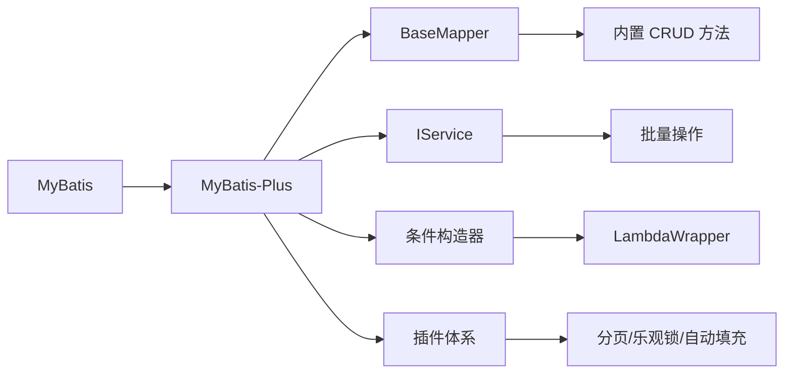

# MyBatis-Plus 快速入门与核心注解

MyBatis-Plus（简称 MP）是一个 MyBatis 的增强工具，在 MyBatis 的基础上只做增强不做改变，为简化开发、提高效率而生。本章介绍如何快速接入 MyBatis-Plus，以及核心注解的用法。

## 为什么选择 MyBatis-Plus

| 优势 | 说明 |
|------|------|
| **无侵入** | 只做增强不做改变，引入它不会对现有工程产生影响 |
| **强大的 CRUD** | 内置通用 Mapper、Service，少量配置即可实现单表大部分 CRUD 操作 |
| **Lambda 表达式** | 通过 Lambda 表达式方便编写各类查询条件，无需担心字段写错 |
| **插件丰富** | 分页、逻辑删除、乐观锁、自动填充等开箱即用 |



## 项目接入（Spring Boot 3.x + JDK 17）

### Maven 依赖

```xml
<properties>
    <java.version>17</java.version>
    <mybatis-plus.version>3.5.12</mybatis-plus.version>
</properties>

<dependencies>
    <!-- Spring Boot Web -->
    <dependency>
        <groupId>org.springframework.boot</groupId>
        <artifactId>spring-boot-starter-web</artifactId>
    </dependency>

    <!-- MyBatis-Plus（注意：Spring Boot 3.x 使用 mybatis-plus-spring-boot3-starter） -->
    <dependency>
        <groupId>com.baomidou</groupId>
        <artifactId>mybatis-plus-spring-boot3-starter</artifactId>
        <version>${mybatis-plus.version}</version>
    </dependency>

    <!-- MySQL Driver -->
    <dependency>
        <groupId>com.mysql</groupId>
        <artifactId>mysql-connector-j</artifactId>
        <scope>runtime</scope>
    </dependency>

    <!-- Lombok -->
    <dependency>
        <groupId>org.projectlombok</groupId>
        <artifactId>lombok</artifactId>
        <optional>true</optional>
    </dependency>
</dependencies>
```

::: warning Spring Boot 版本对应
- **Spring Boot 2.x**：使用 `mybatis-plus-boot-starter`
- **Spring Boot 3.x**：使用 `mybatis-plus-spring-boot3-starter`（包命名空间已切换为 `jakarta.*`）

引入 MyBatis-Plus 后**不要再次引入 MyBatis**，以避免版本冲突。
:::

### 配置文件

```yaml
server:
  port: 8080

spring:
  datasource:
    driver-class-name: com.mysql.cj.jdbc.Driver
    url: jdbc:mysql://localhost:3306/mybatis_plus?useUnicode=true&characterEncoding=utf-8&useSSL=false&serverTimezone=Asia/Shanghai&allowPublicKeyRetrieval=true
    username: root
    password: root1234

mybatis-plus:
  configuration:
    log-impl: org.apache.ibatis.logging.stdout.StdOutImpl  # 开发环境打印 SQL
    map-underscore-to-camel-case: true                      # 驼峰命名转换
  global-config:
    db-config:
      id-type: assign_id         # 全局主键策略：雪花算法
      logic-delete-field: deleted  # 逻辑删除字段
      logic-delete-value: 1        # 逻辑已删除值
      logic-not-delete-value: 0    # 逻辑未删除值
  mapper-locations: classpath:mapper/*.xml
```

| 配置项 | 说明 |
|--------|------|
| `log-impl` | SQL 日志输出实现（开发环境使用 StdOut，生产环境关闭） |
| `map-underscore-to-camel-case` | 开启驼峰命名转换（`user_name` → `userName`） |
| `id-type` | 全局主键策略（`assign_id` = 雪花算法） |
| `logic-delete-field` | 逻辑删除全局字段名 |

### 启动类

```java
package com.xiaoye.mybatisplus;

import org.mybatis.spring.annotation.MapperScan;
import org.springframework.boot.SpringApplication;
import org.springframework.boot.autoconfigure.SpringBootApplication;

@SpringBootApplication
@MapperScan("com.xiaoye.mybatisplus.mapper")
public class MybatisPlusDemoApplication {
    public static void main(String[] args) {
        SpringApplication.run(MybatisPlusDemoApplication.class, args);
    }
}
```

### 数据库初始化

```sql
CREATE DATABASE mybatis_plus DEFAULT CHARACTER SET utf8mb4 COLLATE utf8mb4_general_ci;

USE mybatis_plus;

CREATE TABLE user (
    id BIGINT NOT NULL COMMENT '主键ID',
    name VARCHAR(30) DEFAULT NULL COMMENT '姓名',
    age INT DEFAULT NULL COMMENT '年龄',
    email VARCHAR(50) DEFAULT NULL COMMENT '邮箱',
    create_time DATETIME DEFAULT NULL COMMENT '创建时间',
    update_time DATETIME DEFAULT NULL COMMENT '更新时间',
    version INT DEFAULT 1 COMMENT '版本号（乐观锁）',
    deleted INT DEFAULT 0 COMMENT '逻辑删除标记（0未删除，1已删除）',
    PRIMARY KEY (id)
) ENGINE=InnoDB DEFAULT CHARSET=utf8mb4 COMMENT='用户表';
```

## 核心注解详解

MyBatis-Plus 通过注解将实体类与数据库表进行映射。

### 注解一览表

| 注解 | 作用 | 常用属性 | 示例 |
|------|------|---------|------|
| `@TableName` | 指定表名 | `value`、`autoResultMap` | `@TableName("sys_user")` |
| `@TableId` | 指定主键 | `type`、`value` | `@TableId(type = IdType.ASSIGN_ID)` |
| `@TableField` | 指定字段映射 | `value`、`fill`、`exist` | `@TableField(fill = FieldFill.INSERT)` |
| `@TableLogic` | 逻辑删除 | `value`、`delval` | `@TableLogic` |
| `@Version` | 乐观锁 | 无 | `@Version` |

### 实体类完整示例

```java
package com.xiaoye.mybatisplus.entity;

import com.baomidou.mybatisplus.annotation.*;
import lombok.Data;
import java.io.Serializable;
import java.time.LocalDateTime;

@Data
@TableName("user")
public class User implements Serializable {

    @TableId(type = IdType.ASSIGN_ID)   // 主键：雪花算法
    private Long id;

    private String name;                  // 无需注解，字段名与列名一致（驼峰不一致时才需要转换，如 user_name → userName）

    private Integer age;

    private String email;

    @TableField(fill = FieldFill.INSERT)        // 创建时自动填充
    private LocalDateTime createTime;

    @TableField(fill = FieldFill.INSERT_UPDATE)  // 创建和更新时自动填充
    private LocalDateTime updateTime;

    @Version                                    // 乐观锁版本号
    @TableField(fill = FieldFill.INSERT)        // 创建时自动填充初始值 1
    private Integer version;

    @TableLogic                                 // 逻辑删除标记
    @TableField(fill = FieldFill.INSERT)        // 创建时自动填充初始值 0
    private Integer deleted;
}
```

::: tip @TableField 高级用法
- `exist = false`：表示该字段不存在于数据库表中（用于 DTO 中额外的计算字段）
- `select = false`：查询时不返回该字段（如密码字段）
- `update = "%s+1"`：更新时使用表达式（如 `UPDATE SET read_count = read_count + 1`）
:::

## Mapper 和 Service 层

### Mapper 接口

```java
package com.xiaoye.mybatisplus.mapper;

import com.baomidou.mybatisplus.core.mapper.BaseMapper;
import com.xiaoye.mybatisplus.entity.User;

@Mapper
public interface UserMapper extends BaseMapper<User> {
    // 继承 BaseMapper 后，无需编写 XML 即可使用以下内置方法：
    // insert、deleteById、updateById、selectById、selectList、selectPage 等
}
```

### Service 层

```java
// Service 接口
public interface UserService extends IService<User> {
    // IService 提供批量操作、Lambda 查询等高级能力
}

// Service 实现
@Service
public class UserServiceImpl extends ServiceImpl<UserMapper, User>
    implements UserService {
    // ServiceImpl 内置了 saveBatch、updateBatchById、removeBatchByIds 等批量方法
}
```

### BaseMapper vs IService 对比

| 能力 | BaseMapper | IService |
|------|-----------|---------|
| 单条 CRUD | √ | √ |
| 批量操作 | × 需手动循环 | √ `saveBatch`、`updateBatchById` |
| Lambda 查询 | × 需构造 Wrapper | √ `lambdaQuery()`、`lambdaUpdate()` |
| 链式查询 | × | √ `query().eq(...).list()` |
| 分页查询 | √ 需手动 | √ `page()` |

## 基础 CRUD 测试

```java
@SpringBootTest
class MybatisPlusDemoApplicationTests {

    @Autowired
    private UserMapper userMapper;

    // 插入
    @Test
    void testInsert() {
        User user = new User();
        user.setName("张三");
        user.setAge(25);
        user.setEmail("zhangsan@example.com");

        int rows = userMapper.insert(user);
        System.out.println("影响行数：" + rows);
        System.out.println("自动生成的ID：" + user.getId());  // 雪花算法生成的 Long 型 ID
    }

    // 根据 ID 查询
    @Test
    void testSelectById() {
        User user = userMapper.selectById(1L);
        System.out.println(user);
    }

    // 查询所有
    @Test
    void testSelectAll() {
        List<User> users = userMapper.selectList(null);
        // 注意：逻辑删除的记录会被自动过滤
        // 生成的 SQL: SELECT ... FROM user WHERE deleted=0
        users.forEach(System.out::println);
    }

    // 根据 ID 更新
    @Test
    void testUpdateById() {
        User user = userMapper.selectById(1L);
        user.setName("李四");
        user.setAge(30);

        int rows = userMapper.updateById(user);
        System.out.println("影响行数：" + rows);
    }

    // 根据 ID 删除（逻辑删除）
    @Test
    void testDeleteById() {
        int rows = userMapper.deleteById(1L);
        // 逻辑删除：UPDATE user SET deleted=1 WHERE id=1 AND deleted=0
        System.out.println("影响行数：" + rows);
    }
}
```

## 主键策略

MyBatis-Plus 提供多种主键生成策略，通过 `@TableId` 注解的 `type` 属性指定。

### 策略对比

| 策略 | 说明 | 适用场景 |
|------|------|---------|
| `ASSIGN_ID` | 雪花算法生成 Long 型 ID（**默认**） | 分布式系统、单机系统 |
| `ASSIGN_UUID` | 生成 UUID（32位字符串，无中划线） | 需要字符串主键 |
| `AUTO` | 数据库自增 | 单机系统、数据库支持自增 |
| `INPUT` | 用户手动输入 | 自定义主键场景 |
| `NONE` | 跟随全局配置 | 使用全局配置 |

### 雪花算法原理

```
雪花算法结构（64位 Long）:
┌─────────────────────────────────────────────────────────────┐
│ 1位 │      41位时间戳       │  10位机器ID  │   12位序列号   │
│符号位│  （毫秒级时间戳）     │（5位数据中心+5位机器）│（毫秒内计数）│
└─────────────────────────────────────────────────────────────┘
```

**特点**：
- 全局唯一、趋势递增
- 高性能（单机每秒可生成 400 万个 ID）
- 不依赖数据库
- 41 位时间戳可使用约 69 年

::: warning 雪花算法注意事项
1. `ASSIGN_ID` 策略要求实体类主键类型为 `Long` 或 `String`
2. 雪花算法依赖机器时钟，时钟回拨会导致 ID 重复
3. 优先级：局部注解 > 全局配置 > 默认策略
:::

### 使用示例

```java
// 雪花算法（Long 型 ID）
@TableId(type = IdType.ASSIGN_ID)
private Long id;

// UUID（String 型 ID）
@TableId(type = IdType.ASSIGN_UUID)
private String id;

// 数据库自增
@TableId(type = IdType.AUTO)
private Long id;
```

**全局配置**：

```yaml
mybatis-plus:
  global-config:
    db-config:
      id-type: assign_id  # 全局默认使用雪花算法
```

## 下一步

掌握了基础接入和核心注解后，接下来学习：

- [条件构造器与 CRUD 进阶](01-条件构造器与CRUD进阶.md)：Wrapper 体系、Lambda 条件、复杂查询
- [插件与高级特性](02-插件与高级特性.md)：分页、逻辑删除、自动填充、乐观锁
- [代码生成与性能优化](03-代码生成与性能优化.md)：代码生成器、批量操作、SQL 分析

## 版本差异(旧版 3.5.5 → 3.5.x)

| 特性 | 旧版（3.5.5 时期） | 当前 3.5.x（如 3.5.12） |
|------|--------------------|------------------------|
| Boot 3 依赖坐标 | mybatis-plus-spring-boot3-starter | 不变，Boot 3 必须使用 boot3-starter |
| JDK 21 支持 | 以 JDK 17 为目标 | 3.5.6+ 完整支持 JDK 21（record、虚拟线程） |
| 虚拟线程 | 无特殊处理 | 3.5.9+ 优化虚拟线程环境兼容（配合 Boot 3.2+ spring.threads.virtual.enabled） |
| 主键策略 | IdType.ASSIGN_ID 雪花算法 | 不变，仍为默认推荐 |
| 核心注解 | @TableName/@TableId/@TableField | 用法不变，无破坏性变更 |

> 本文示例基于 JDK 17 + Spring Boot 3.x 编写，依赖坐标已按 3.5.x 最新维护版本对齐；升级到 JDK 21 时无需修改任何注解或配置。