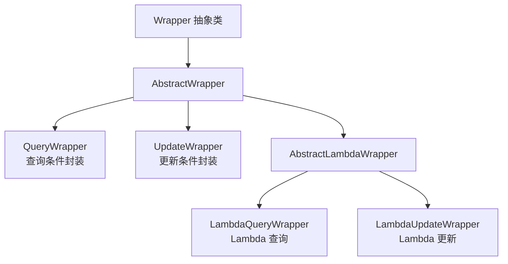

# 条件构造器与 CRUD 进阶

条件构造器是 MyBatis-Plus 的核心能力之一，它让你能用 Java 代码而非手写 SQL 来构建各种查询和更新条件。本章详细介绍 Wrapper 体系、Lambda 条件构造器和 CRUD 进阶用法。

## Wrapper 继承体系



**选择建议**：

| 场景 | 推荐 Wrapper | 原因 |
|------|-------------|------|
| 简单查询 | `LambdaQueryWrapper` | 避免字段名硬编码，编译期检查 |
| 复杂更新 | `LambdaUpdateWrapper` | 可用 `set()` 灵活设置更新字段 |
| 动态条件 | `QueryWrapper` | 字段名可动态拼接 |
| 自定义 SQL | 不使用 Wrapper | 复杂查询直接写 SQL |

## QueryWrapper 常用方法

### 比较操作

```java
@SpringBootTest
class QueryWrapperTest {

    @Autowired
    private UserMapper userMapper;

    @Test
    void testComparison() {
        QueryWrapper<User> wrapper = new QueryWrapper<>();

        wrapper.ge("age", 18)      // age >= 18
               .lt("age", 30)      // age < 30
               .isNotNull("email"); // email IS NOT NULL

        List<User> users = userMapper.selectList(wrapper);
    }
}
```

| 方法 | SQL | 说明 |
|------|-----|------|
| `eq` | `=` | 等于 |
| `ne` | `<>` | 不等于 |
| `gt` | `>` | 大于 |
| `ge` | `>=` | 大于等于 |
| `lt` | `<` | 小于 |
| `le` | `<=` | 小于等于 |
| `between` | `BETWEEN` | 区间 |
| `notBetween` | `NOT BETWEEN` | 不在区间 |
| `isNull` | `IS NULL` | 为空 |
| `isNotNull` | `IS NOT NULL` | 不为空 |

### 模糊查询

```java
@Test
void testLike() {
    QueryWrapper<User> wrapper = new QueryWrapper<>();

    wrapper.like("name", "张")          // LIKE '%张%'
           .likeRight("email", "test")   // LIKE 'test%'
           .notLike("name", "admin");    // NOT LIKE '%admin%'

    List<User> users = userMapper.selectList(wrapper);
}
```

| 方法 | SQL | 示例 |
|------|-----|------|
| `like` | `LIKE '%值%'` | `like("name", "张")` → `%张%` |
| `notLike` | `NOT LIKE '%值%'` | `notLike("name", "张")` |
| `likeLeft` | `LIKE '%值'` | `likeLeft("name", "张")` → `%张` |
| `likeRight` | `LIKE '值%'` | `likeRight("name", "张")` → `张%` |

### 范围查询

```java
@Test
void testIn() {
    QueryWrapper<User> wrapper = new QueryWrapper<>();

    wrapper.in("age", Arrays.asList(18, 20, 22))           // IN (18, 20, 22)
           .notIn("id", 1, 2, 3)                            // NOT IN (1, 2, 3)
           .inSql("id", "SELECT id FROM user WHERE age > 25"); // IN (子查询)

    List<User> users = userMapper.selectList(wrapper);
}
```

### 排序

```java
@Test
void testOrderBy() {
    QueryWrapper<User> wrapper = new QueryWrapper<>();

    wrapper.orderByDesc("age")   // ORDER BY age DESC
           .orderByAsc("id")     // ORDER BY id ASC
           .last("LIMIT 10");    // LIMIT 10（拼接 SQL 片段，有 SQL 注入风险！）

    List<User> users = userMapper.selectList(wrapper);
}
```

::: danger `last()` 方法风险
`last()` 直接拼接 SQL 片段到 SQL 末尾，存在 **SQL 注入风险**。仅在内部系统且参数可控时使用，**生产环境不建议使用**。
:::

### 逻辑组合（AND / OR）

```java
@Test
void testLogic() {
    QueryWrapper<User> wrapper = new QueryWrapper<>();

    wrapper.eq("name", "张三")
           .and(w -> w.gt("age", 20).or().isNotNull("email"));

    // 生成 SQL: WHERE name = '张三' AND (age > 20 OR email IS NOT NULL)
    List<User> users = userMapper.selectList(wrapper);
}
```

### 指定查询字段

```java
@Test
void testSelect() {
    QueryWrapper<User> wrapper = new QueryWrapper<>();

    wrapper.select("id", "name", "age")  // 只查这三个字段
           .gt("age", 18);

    List<User> users = userMapper.selectList(wrapper);
}
```

## LambdaWrapper（推荐）

使用 Lambda 表达式避免字段名硬编码，编译期即可检查字段是否存在。

### LambdaQueryWrapper

```java
@Test
void testLambdaQueryWrapper() {
    LambdaQueryWrapper<User> wrapper = new LambdaQueryWrapper<>();

    wrapper.eq(User::getName, "张三")         // name = '张三'
           .gt(User::getAge, 20)              // age > 20
           .likeRight(User::getEmail, "test") // email LIKE 'test%'
           .orderByDesc(User::getCreateTime); // ORDER BY create_time DESC

    List<User> users = userMapper.selectList(wrapper);
}
```

::: tip 为什么推荐 LambdaWrapper
1. **编译期检查**：字段名写错会直接报错，而不是等到运行时才发现
2. **重构友好**：修改字段名时 IDE 会自动同步更新所有引用
3. **可读性好**：`User::getName` 比 `"name"` 更明确
:::

### LambdaUpdateWrapper

```java
@Test
void testLambdaUpdateWrapper() {
    LambdaUpdateWrapper<User> wrapper = new LambdaUpdateWrapper<>();

    wrapper.eq(User::getName, "张三")           // WHERE name = '张三'
           .set(User::getAge, 25)               // SET age = 25
           .set(User::getEmail, "zs@test.com"); // SET email = 'zs@test.com'

    int rows = userMapper.update(null, wrapper);
    // 注意：第一个参数 null 表示不传实体对象，更新字段由 wrapper.set() 决定
}
```

**生成的 SQL**：

```sql
UPDATE user SET age = 25, email = 'zs@test.com', update_time = NOW()
WHERE name = '张三' AND deleted = 0
```

## BaseMapper 常用方法速查

### 查询方法

| 方法 | 说明 | 参数 |
|------|------|------|
| `selectById(id)` | 根据 ID 查询 | 主键 ID |
| `selectBatchIds(idList)` | 批量 ID 查询 | ID 集合 |
| `selectByMap(columnMap)` | 根据 map 条件查询 | 字段条件 map |
| `selectOne(wrapper)` | 查询一条记录（多条会报错） | 条件构造器 |
| `selectList(wrapper)` | 查询列表 | 条件构造器 |
| `selectCount(wrapper)` | 查询总数 | 条件构造器 |
| `selectMaps(wrapper)` | 查询返回 Map | 条件构造器 |
| `selectPage(page, wrapper)` | 分页查询 | 分页对象 + 条件 |

### 插入/更新/删除方法

| 方法 | 说明 | 参数 |
|------|------|------|
| `insert(entity)` | 插入一条记录 | 实体对象 |
| `updateById(entity)` | 根据 ID 更新（null 字段不更新） | 实体对象 |
| `update(entity, wrapper)` | 根据条件更新 | 实体 + 条件 |
| `deleteById(id)` | 根据 ID 删除 | 主键 ID |
| `deleteBatchIds(idList)` | 批量 ID 删除 | ID 集合 |
| `deleteByMap(columnMap)` | 根据 map 条件删除 | 字段条件 map |
| `delete(wrapper)` | 根据条件删除 | 条件构造器 |

### IService 批量方法

| 方法 | 说明 |
|------|------|
| `saveBatch(entityList)` | 批量插入（默认 1000 条一批） |
| `saveBatch(entityList, batchSize)` | 批量插入（自定义批次大小） |
| `saveOrUpdateBatch(entityList)` | 批量插入或更新 |
| `updateBatchById(entityList)` | 批量根据 ID 更新 |
| `removeBatchByIds(idList)` | 批量根据 ID 删除 |

```java
@Service
public class UserServiceImpl extends ServiceImpl<UserMapper, User>
    implements UserService {

    // 批量插入示例
    public void batchInsertUsers(List<User> users) {
        saveBatch(users, 500);  // 每批 500 条
    }

    // 批量更新示例
    public void batchUpdateUsers(List<User> users) {
        updateBatchById(users, 500);
    }
}
```

## 动态条件查询

实际业务中，查询条件往往不是固定的，需要根据前端传入参数动态拼接：

```java
@Service
public class UserServiceImpl extends ServiceImpl<UserMapper, User>
    implements UserService {

    public IPage<User> searchUsers(UserQueryRequest request) {
        LambdaQueryWrapper<User> wrapper = new LambdaQueryWrapper<>();

        // 动态拼接条件：只有传入的参数才会加入查询
        wrapper.like(StringUtils.isNotBlank(request.getName()),
                     User::getName, request.getName())
               .eq(request.getAge() != null,
                    User::getAge, request.getAge())
               .between(request.getMinAge() != null && request.getMaxAge() != null,
                        User::getAge, request.getMinAge(), request.getMaxAge())
               .orderByDesc(User::getCreateTime);

        Page<User> page = new Page<>(request.getPageNum(), request.getPageSize());
        return userMapper.selectPage(page, wrapper);
    }
}
```

::: tip 条件方法的三参数版本
`eq(condition, column, value)` 的第一个参数 `condition` 是布尔值，只有 `true` 时才会拼接该条件。这是实现动态查询的标准方式。
:::

## 自定义 SQL

当 Wrapper 无法满足复杂查询需求时，使用自定义 SQL：

```java
@Mapper
public interface UserMapper extends BaseMapper<User> {

    // 简单自定义 SQL
    @Select("SELECT * FROM user WHERE age > #{minAge} AND deleted = 0")
    List<User> selectByMinAge(@Param("minAge") Integer minAge);

    // 多表关联查询
    @Select("SELECT u.*, d.name as dept_name " +
            "FROM user u LEFT JOIN dept d ON u.dept_id = d.id " +
            "WHERE u.status = #{status} AND u.deleted = 0")
    @Results({
        @Result(property = "id", column = "id"),
        @Result(property = "deptName", column = "dept_name")
    })
    List<UserVO> selectUserWithDept(@Param("status") Integer status);

    // XML 映射文件中的复杂查询
    IPage<UserVO> selectUserPage(Page<UserVO> page, @Param("query") UserQueryRequest query);
}
```

对应的 XML 文件（`mapper/UserMapper.xml`）：

```xml
<?xml version="1.0" encoding="UTF-8"?>
<!DOCTYPE mapper PUBLIC "-//mybatis.org//DTD Mapper 3.0//EN"
    "http://mybatis.org/dtd/mybatis-3-mapper.dtd">
<mapper namespace="com.xiaoye.mybatisplus.mapper.UserMapper">

    <select id="selectUserPage" resultType="com.xiaoye.mybatisplus.vo.UserVO">
        SELECT u.*, d.name as dept_name
        FROM user u
        LEFT JOIN dept d ON u.dept_id = d.id
        WHERE u.deleted = 0
        <if test="query.name != null and query.name != ''">
            AND u.name LIKE CONCAT('%', #{query.name}, '%')
        </if>
        <if test="query.minAge != null">
            AND u.age >= #{query.minAge}
        </if>
        <if test="query.maxAge != null">
            AND u.age &lt;= #{query.maxAge}
        </if>
        ORDER BY u.create_time DESC
    </select>
</mapper>
```

## 下一步

- [插件与高级特性](02-插件与高级特性.md)：分页、逻辑删除、自动填充、乐观锁
- [代码生成与性能优化](03-代码生成与性能优化.md)：代码生成器、批量操作优化、SQL 分析

## 版本差异(旧版 3.5.5 → 3.5.x)

| 特性 | 旧版（3.5.5 时期） | 当前 3.5.x（如 3.5.12） |
|------|--------------------|------------------------|
| Wrapper 体系 | QueryWrapper/LambdaQueryWrapper/LambdaUpdateWrapper | 用法不变，无破坏性变更 |
| Lambda 引用 | 基于 lambda 元数据解析列名 | 不变；3.5.6+ 对 record 类型支持更完善 |
| 条件方法与组合 | eq/ne/like/in/and/or 等 | 完全兼容，可直接升级 |
| 虚拟线程 | 无特殊处理 | 3.5.9+ 优化虚拟线程环境兼容 |

> Wrapper 体系是 MyBatis-Plus 最稳定的 API 之一，从 3.5.5 升级到最新 3.5.x 不需要修改任何 Wrapper 代码。
