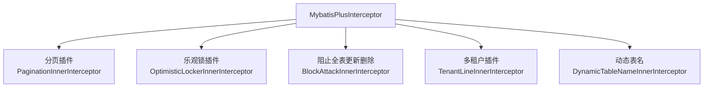

# 插件与高级特性

MyBatis-Plus 的插件体系提供了分页、乐观锁、自动填充等开箱即用的能力，而逻辑删除和多租户等特性则解决了企业项目中的常见需求。本章详细介绍这些插件和高级特性的配置与使用。

## 插件体系总览



### 插件注册方式

所有插件统一注册到 `MybatisPlusInterceptor`：

```java
@Configuration
public class MybatisPlusConfig {

    @Bean
    public MybatisPlusInterceptor mybatisPlusInterceptor() {
        MybatisPlusInterceptor interceptor = new MybatisPlusInterceptor();

        // 分页插件（必须配置，否则分页不生效）
        interceptor.addInnerInterceptor(new PaginationInnerInterceptor(DbType.MYSQL));

        // 乐观锁插件
        interceptor.addInnerInterceptor(new OptimisticLockerInnerInterceptor());

        // 阻止全表更新和删除（防止误操作）
        interceptor.addInnerInterceptor(new BlockAttackInnerInterceptor());

        return interceptor;
    }
}
```

::: warning 插件注册顺序
多个插件的注册顺序很重要。**分页插件建议放在最前面**，因为它需要最先拦截 SQL 来计算总数和分页参数。
:::

## 分页查询

### 配置分页插件

```java
@Bean
public MybatisPlusInterceptor mybatisPlusInterceptor() {
    MybatisPlusInterceptor interceptor = new MybatisPlusInterceptor();
    interceptor.addInnerInterceptor(new PaginationInnerInterceptor(DbType.MYSQL));
    return interceptor;
}
```

### 基础分页查询

```java
@Test
void testPage() {
    Page<User> page = new Page<>(1, 3);  // 第1页，每页3条

    LambdaQueryWrapper<User> wrapper = new LambdaQueryWrapper<>();
    wrapper.gt(User::getAge, 18)
           .orderByDesc(User::getCreateTime);

    Page<User> userPage = userMapper.selectPage(page, wrapper);

    System.out.println("当前页码：" + userPage.getCurrent());
    System.out.println("每页大小：" + userPage.getSize());
    System.out.println("总记录数：" + userPage.getTotal());
    System.out.println("总页数：" + userPage.getPages());
    System.out.println("当前页数据：" + userPage.getRecords());
}
```

**生成的 SQL**：

```sql
-- 查询总数
SELECT COUNT(*) FROM user WHERE age > 18 AND deleted = 0

-- 查询数据
SELECT * FROM user WHERE age > 18 AND deleted = 0 ORDER BY create_time DESC LIMIT 3
```

### 自定义分页

```java
// Mapper 接口
@Mapper
public interface UserMapper extends BaseMapper<User> {

    @Select("SELECT * FROM user WHERE age > #{minAge} AND deleted = 0")
    IPage<User> selectPageByMinAge(Page<User> page, @Param("minAge") Integer minAge);
}

// 测试
@Test
void testCustomPage() {
    Page<User> page = new Page<>(1, 3);
    IPage<User> userPage = userMapper.selectPageByMinAge(page, 18);

    System.out.println("总记录数：" + userPage.getTotal());
    System.out.println("当前页数据：" + userPage.getRecords());
}
```

### Service 层分页

```java
@Service
public class UserServiceImpl extends ServiceImpl<UserMapper, User>
    implements UserService {

    public IPage<User> searchUsers(UserQueryRequest request) {
        LambdaQueryWrapper<User> wrapper = new LambdaQueryWrapper<>();
        wrapper.like(StringUtils.isNotBlank(request.getName()),
                     User::getName, request.getName())
               .orderByDesc(User::getCreateTime);

        Page<User> page = new Page<>(request.getPageNum(), request.getPageSize());
        return userMapper.selectPage(page, wrapper);
    }
}
```

### 分页参数优化

```java
@Bean
public MybatisPlusInterceptor mybatisPlusInterceptor() {
    MybatisPlusInterceptor interceptor = new MybatisPlusInterceptor();
    PaginationInnerInterceptor pagination = new PaginationInnerInterceptor(DbType.MYSQL);
    // 分页合理化：请求页超过总页数时自动回到第一页（默认 false 不处理）
    pagination.setOverflow(true);
    // 单页最大条数限制：防止前端传超大 pageSize 导致慢查询
    pagination.setMaxLimit(500L);
    interceptor.addInnerInterceptor(pagination);
    return interceptor;
}
```

## 逻辑删除

逻辑删除将记录标记为"已删除"状态，而不是真正从数据库中删除。这是企业项目的基本要求。

### 配置

```yaml
mybatis-plus:
  global-config:
    db-config:
      logic-delete-field: deleted    # 逻辑删除全局字段名
      logic-delete-value: 1          # 逻辑已删除值
      logic-not-delete-value: 0      # 逻辑未删除值
```

### 实体类

```java
@Data
public class User {
    @TableId(type = IdType.ASSIGN_ID)
    private Long id;

    private String name;

    @TableLogic     // 标记逻辑删除字段
    private Integer deleted;
}
```

### 测试

```java
@Test
void testLogicDelete() {
    // 逻辑删除：不是 DELETE，而是 UPDATE
    int rows = userMapper.deleteById(1L);

    // 生成 SQL: UPDATE user SET deleted = 1 WHERE id = 1 AND deleted = 0
    System.out.println("影响行数：" + rows);
}

@Test
void testSelectAfterDelete() {
    // 查询自动过滤已删除记录
    List<User> users = userMapper.selectList(null);

    // 生成 SQL: SELECT * FROM user WHERE deleted = 0
}
```

::: tip 逻辑删除的影响范围
逻辑删除会影响所有查询操作——`selectList`、`selectById`、`selectPage` 等都会自动追加 `WHERE deleted = 0` 条件。这是 MyBatis-Plus 自动完成的，不需要手动写。
:::

### 如何查询包含已删除的数据

```java
// 方式一：在 Mapper 接口中使用自定义 SQL，绕过逻辑删除过滤
public interface UserMapper extends BaseMapper<User> {

    @Select("SELECT * FROM user")
    List<User> selectAllIncludingDeleted();
}

// 测试
@Test
void testSelectAllIncludingDeleted() {
    // 自定义 SQL 不经过 MP 的逻辑删除改写，会返回包含已删除的全部数据
    List<User> users = userMapper.selectAllIncludingDeleted();
}
```

## 自动填充

自动填充用于自动设置 `createTime`、`updateTime` 等字段，避免每次手动赋值。

### 实现元对象处理器

```java
package com.xiaoye.mybatisplus.handler;

import com.baomidou.mybatisplus.core.handlers.MetaObjectHandler;
import org.apache.ibatis.reflection.MetaObject;
import org.springframework.stereotype.Component;

import java.time.LocalDateTime;

@Component
public class MyMetaObjectHandler implements MetaObjectHandler {

    @Override
    public void insertFill(MetaObject metaObject) {
        // 插入时自动填充
        this.strictInsertFill(metaObject, "createTime", LocalDateTime.class, LocalDateTime.now());
        this.strictInsertFill(metaObject, "updateTime", LocalDateTime.class, LocalDateTime.now());
        this.strictInsertFill(metaObject, "version", Integer.class, 1);
        this.strictInsertFill(metaObject, "deleted", Integer.class, 0);
    }

    @Override
    public void updateFill(MetaObject metaObject) {
        // 更新时自动填充
        this.strictUpdateFill(metaObject, "updateTime", LocalDateTime.class, LocalDateTime.now());
    }
}
```

### 实体类配置

```java
@Data
public class User {
    @TableId(type = IdType.ASSIGN_ID)
    private Long id;

    private String name;

    @TableField(fill = FieldFill.INSERT)        // 仅插入时填充
    private LocalDateTime createTime;

    @TableField(fill = FieldFill.INSERT_UPDATE)  // 插入和更新时都填充
    private LocalDateTime updateTime;

    @Version
    @TableField(fill = FieldFill.INSERT)        // 仅插入时填充初始值
    private Integer version;

    @TableLogic
    @TableField(fill = FieldFill.INSERT)        // 仅插入时填充初始值
    private Integer deleted;
}
```

| FieldFill 策略 | 说明 |
|----------------|------|
| `DEFAULT` | 不填充 |
| `INSERT` | 插入时填充 |
| `UPDATE` | 更新时填充 |
| `INSERT_UPDATE` | 插入和更新时都填充 |

::: warning `strictInsertFill` vs `fillStrategy`
- `strictInsertFill`：仅在字段值为 null 时填充（**推荐**）
- `fillStrategy`（旧方法）：无论字段是否有值都填充（可能导致覆盖手动设置的值）

推荐使用 `strictInsertFill` / `strictUpdateFill`。
:::

## 乐观锁

乐观锁通过版本号机制解决并发更新问题。核心思想：读取时记录版本号，更新时校验版本号是否变化。

### 配置插件

```java
@Bean
public MybatisPlusInterceptor mybatisPlusInterceptor() {
    MybatisPlusInterceptor interceptor = new MybatisPlusInterceptor();
    interceptor.addInnerInterceptor(new PaginationInnerInterceptor(DbType.MYSQL));
    interceptor.addInnerInterceptor(new OptimisticLockerInnerInterceptor());
    return interceptor;
}
```

### 实体类

```java
@Data
public class User {
    @TableId(type = IdType.ASSIGN_ID)
    private Long id;

    private String name;

    @Version   // 乐观锁注解
    private Integer version;
}
```

### 基本使用

```java
@Test
void testOptimisticLock() {
    // 1. 先查询，获取当前版本号
    User user = userMapper.selectById(1L);  // version = 1

    // 2. 修改数据
    user.setName("张三");

    // 3. 更新时自动校验版本号
    int rows = userMapper.updateById(user);

    // 生成 SQL: UPDATE user SET name='张三', version=2 WHERE id=1 AND version=1 AND deleted=0
    System.out.println("更新结果：" + (rows > 0 ? "成功" : "失败"));
}
```

### 并发冲突测试

```java
@Test
void testConcurrentUpdate() {
    // 两个线程同时读取同一用户（version = 1）
    User user1 = userMapper.selectById(1L);  // version = 1
    User user2 = userMapper.selectById(1L);  // version = 1

    user1.setName("张三");
    user2.setName("李四");

    // 第一个更新成功（version 从 1 → 2）
    int rows1 = userMapper.updateById(user1);  // 成功：WHERE version = 1

    // 第二个更新失败（version 已变为 2，不匹配 WHERE version = 1）
    int rows2 = userMapper.updateById(user2);  // 失败：影响行数 = 0

    System.out.println("用户1更新：" + (rows1 > 0 ? "成功" : "失败"));
    System.out.println("用户2更新：" + (rows2 > 0 ? "成功" : "失败"));
}
```

::: tip 乐观锁失效场景
乐观锁仅在 `updateById` 和 `update(entity, wrapper)` 时生效。以下场景**不会触发乐观锁**：

1. `update(null, wrapper)` —— 不传实体对象时
2. 自定义 SQL 的更新操作
3. 批量更新操作

生产环境中，如果乐观锁更新失败，应该做以下处理：
- 揔回业务异常，提示用户"数据已被其他人修改，请重新操作"
- 或者自动重试（最多 3 次）
:::

## 阻止全表更新和删除

防止误操作导致全表数据被修改或删除：

```java
@Bean
public MybatisPlusInterceptor mybatisPlusInterceptor() {
    MybatisPlusInterceptor interceptor = new MybatisPlusInterceptor();
    interceptor.addInnerInterceptor(new PaginationInnerInterceptor(DbType.MYSQL));
    interceptor.addInnerInterceptor(new OptimisticLockerInnerInterceptor());
    // 阻止全表更新和删除
    interceptor.addInnerInterceptor(new BlockAttackInnerInterceptor());
    return interceptor;
}
```

```java
// × 以下操作会被阻止：
userMapper.delete(null);                    // 全表删除 → 抛出异常
userMapper.update(null, new QueryWrapper<>());  // 全表更新 → 抛出异常

// √ 以下操作正常：
userMapper.deleteById(1L);                  // 指定 ID 删除
userMapper.update(user, wrapper);           // 有条件的更新
```

::: danger 生产环境必配
`BlockAttackInnerInterceptor` 在生产环境中几乎是必配的。它能在代码层面防止 `DELETE FROM user` 或 `UPDATE user SET ...` 这种没有 WHERE 条件的误操作。
:::

## 多租户与动态表名

插件体系总览中提到的多租户（`TenantLineInnerInterceptor`）与动态表名（`DynamicTableNameInnerInterceptor`）插件，通过改写 SQL 自动实现数据隔离与表名切换。完整讲解见「[多租户与动态表名](04-多租户与动态表名)」章节。

## 下一步

- [多租户与动态表名](04-多租户与动态表名.md)：租户字段自动注入、SQL 改写原理、动态分表
- [代码生成与性能优化](03-代码生成与性能优化.md)：代码生成器、批量操作优化、SQL 分析

## 版本差异(旧版 3.5.5 → 3.5.x)

| 特性 | 旧版（3.5.5 时期） | 当前 3.5.x（如 3.5.12） |
|------|--------------------|------------------------|
| 分页插件 | PaginationInnerInterceptor | 机制不变；3.5.9+ 优化虚拟线程环境下的分页性能 |
| 逻辑删除 | @TableLogic + 全局配置 | 用法不变，无破坏性变更 |
| 自动填充 | MetaObjectHandler | 用法不变 |
| 乐观锁 | OptimisticLockerInnerInterceptor | 用法不变 |
| 防全表更新 | BlockAttackInnerInterceptor | 用法不变，仍为生产环境必配 |

> 插件体系（InnerInterceptor 链）从 3.5.5 到最新 3.5.x 保持完全兼容，升级时无需修改插件配置；注意各插件顺序与 SQL 改写顺序的配合即可。
