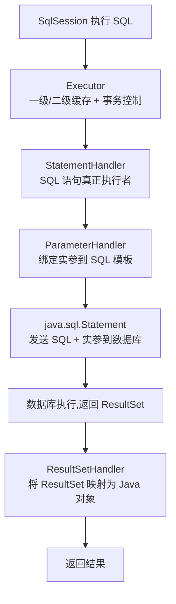

# 快速上手与整体架构

在深入 MyBatis 核心架构以及具体代码实现之前，先快速了解 MyBatis 中的常见概念及其基础使用方法。

下面以**一个简易订单系统的持久化层**为例进行讲解：

订单系统 domain 层的设计，了解如何将业务概念抽象成 Java 类；

介绍数据库表的设计，同时说明关系型的数据库表与面向对象模型的类之间的映射关系；

介绍订单系统的 DAO 接口层，DAO 接口层是操作数据的最小化单元，也是读写数据库的地基；

一个 Service 层和测试用例，前面的代码实现是否能正常工作。

本章示例都会使用 Maven 来管理 jar 包依赖，所以我们首先创建一个 Maven 项目，然后在 pom.xml 中添加如下 jar 依赖，这些 jar 包都是订单示例系统必不可少的依赖：

```
<dependencies>
  <!--MyBatis依赖-->
  <dependency>
      <groupId>org.mybatis</groupId>
      <artifactId>mybatis</artifactId>
      <version>3.5.6</version>
  </dependency>
  <!--MySQL JDBC依赖，用来连接数据库-->
  <dependency>
      <groupId>mysql</groupId>
      <artifactId>mysql-connector-java</artifactId>
      <version>8.0.15</version>
  </dependency>
  <!--Guava依赖-->
  <dependency>
      <groupId>com.google.guava</groupId>
      <artifactId>guava</artifactId>
      <version>19.0</version>
  </dependency>
  <!--Junit依赖，用来执行单元测试-->
  <dependency>
      <groupId>junit</groupId>
      <artifactId>junit</artifactId>
      <version>4.10</version>
      <scope>test</scope>
  </dependency>
</dependencies>

```

## domain 设计

在业务系统的开发中，**domain 层的主要目的就是将业务上的概念抽象成面向对象模型中的类**，这些类是业务系统运作的基础。在我们的简易订单系统中，有用户、地址、订单、订单条目和商品这五个核心的概念。

订单系统中 domain 层的设计，如下图所示：


在上图中，**Customer 类抽象的是电商平台中的用户**，其中记录了用户的唯一标识（id 字段）、姓名（name 字段）以及手机号（phone 字段），另外，还记录了当前用户添加的全部送货地址。

**Address 类抽象了用户的送货地址**，其中记录了街道（street 字段）、城市（city 字段）、国家（country 字段）等信息，还维护了一个 Customer 类型的引用，指向所属的用户。

**Order 类抽象的是电商平台中的订单**，记录了订单的唯一标识（id 字段）、订单创建时间（createTime 字段），其中通过 customer 字段（Customer 类型）指向了订单关联的用户，通过 deliveryAddress 字段（Address 类型）指向了该订单的送货地址。另外，还可以通过 orderItems 集合（List 集合）记录订单内的具体条目。

**OrderItem 类抽象了订单中的购物条目**，记录了购物条目的唯一标识（id 字段），其中 product 字段（Product 类型）指向了该购物条目中具体购买的商品，amount 字段记录购买商品的个数，price 字段则是该 OrderItem 的总金额（即 Product.price * amount），Order 订单的总价格（totalPrice 字段）则是由其中全部 OrderItem 的 price 累加得到的。注意，这里的 OrderItem 总金额以及 Order 总金额，都不会持久化到数据，而是实时计算得到的。

**Product 类抽象了电商平台中商品的概念**，其中记录了商品的唯一标识（id 字段）、商品名称（name 字段）、商品描述（description 字段）以及商品价格（price 字段）。

结合前面的介绍以及类图分析，你可以看到：

通过 Customer.addresses 以及 Address.customer 这两个属性，维护了 Customer 与 Address 之间**一对多**关系；

通过 Order.customer 属性，维护了 Customer 与 Order 之间的**一对多**关系；

通过 Order.deliveryAddress 属性，维护了 Order 与 Address 之间的**一对一**关系；

通过 OrderItem.orderId 属性，维护了 Order 与 OrderItem 之间的**一对多**关系；

通过 OrderItem.product 属性，维护了 OrderItem 与 Product 之间的**一对一**关系。

## 数据库表设计

介绍完 domain 层的设计，再来看对应的数据库表设计，如下图所示：


简易订单系统数据库表设计

与前面的domain 层设计图相比，其中的各项是可以一一对应起来的。

t_customer 表对应 Customer 类，t_product 表对应 Product 类。

t_address 表对应 Address 类，其中 customer_id 列作为外键指向 t_customer.id，实现了 Customer 与 Address 的一对多关系。

t_order_item 表对应 OrderItem 类，其中 product_id 列作为外键指向 t_product.id，实现了 OrderItem 与 Product 的一对一关系；order_id 列作为外键指向 t_order.id，实现了 Order 与 OrderItem 的一对多关系。

t_order 表对应 Order 类，其中的 customer_id 列指向 t_customer.id，实现了 Customer 与 Order 的一对多关系；address_id 列指向 t_address.id，实现了 Order 与 Address 的一对一关系。

上述表中的其他字段与 domain 层中对应类中的字段也是一一对应，这里就不再重复了。

## DAO 层

**DAO 层主要是负责与持久化存储进行交互，完成数据持久化的相关工作**，这里我们就介绍一下 如何使用 MyBatis 来开发 Java 应用中的持久层。

在 DAO 层中，需要先根据需求确定 DAO 层的基本能力，一般情况下，是针对每个 domain 类提供最基础的 CRUD 操作，之后在 DAO 层之上的 Service 层，就可以直接使用 DAO 层的接口，而无须关心底层使用的是数据库还是其他存储，也无须关心读写数据使用的是 SQL 语句还是其他查询语句，这就能够实现业务逻辑和存储的解耦。

### 1. DAO 接口与实现

下面，我们开始介绍简易订单系统中 DAO 接口的内容。

首先是 CustomerMapper 接口，其定义如下：

```java
public interface CustomerMapper {
    // 根据用户Id查询Customer(不查询Address)
    Customer find(long id);
    // 根据用户Id查询Customer(同时查询Address)
    Customer findWithAddress(long id);
    // 根据orderId查询Customer
    Customer findByOrderId(long orderId);
    // 持久化Customer对象
    int save(Customer customer);
}

```

定义完 CustomerMapper 接口之后，我们**无须真正实现 CustomerMapper 接口，而是在 /resources/mapper 目录下配置相应的配置文件—— CustomerMapper.xml，在该文件中定义需要执行的 SQL 语句以及查询结果集的映射规则**。MyBatis 底层会生成一个实现了 CustomerMapper 接口的代理对象来执行 CustomerMapper.xml 配置文件中的 SQL 语句，实现 DAO 层的功能（MyBatis 如何生成代理对象等底层原理在本文后面会深入分析，这里就先介绍该示例系统的相关内容）。

CustomerMapper.xml 的具体定义如下：

```
<mapper namespace="org.example.dao.CustomerMapper">
    <!-- 定义映射规则 -->
    <resultMap id="customerSimpleMap" type="Customer">
        <!--  主键映射 -->
        <id property="id" column="id"/>
        <!--  属性映射 -->
        <result property="name" column="name"/>
        <result property="phone" column="phone"/>
    </resultMap>
    <!-- 定义映射规则 -->
    <resultMap id="customerMap" type="Customer">
        <!--  主键映射 -->
        <id property="id" column="id"/>
        <!--  属性映射 -->
        <result property="name" column="name"/>
        <result property="phone" column="phone"/>
        <!-- 映射addresses集合，<collection>标签用于映射集合类的属性，实现一对多的关联关系 -->
        <collection property="addresses" javaType="list" ofType="Address">
            <id property="id" column="address_id"/>
            <result property="street" column="street"/>
            <result property="city" column="city"/>
            <result property="country" column="country"/>
        </collection>
    </resultMap>
    <!-- 定义select语句，CustomerMapper接口中的find()方法会执行该SQL，
        查询结果通过customerSimpleMap这个映射生成Customer对象-->
    <select id="find" resultMap="customerSimpleMap">
        SELECT * FROM t_customer WHERE id = #{id:INTEGER}
    </select>
    <!-- 定义select语句，CustomerMapper接口中的findWithAddress()方法会执行该SQL，
        查询结果通过customerMap这个映射生成Customer对象-->
    <select id="findWithAddress" resultMap="customerMap">
        SELECT c.*,a.id as address_id, a.* FROM t_customer as c join t_address as a
        on c.id = a.customer_id
        WHERE c.id = #{id:INTEGER}
    </select>
    <!-- CustomerMapper接口中的findByOrderId()方法会执行该SQL，
        查询结果通过customerSimpleMap这个映射生成Customer对象-->
    <select id="findByOrderId" resultMap="customerSimpleMap">
        SELECT * FROM t_customer as c join t_order as t
        on c.id = t.customer_id
        WHERE t.customer_id = #{id:INTEGER}
    </select>
    <!-- 定义insert语句，CustomerMapper接口中的save()方法会执行该SQL，
        数据库生成的自增id会自动填充到传入的Customer对象的id字段中-->
    <insert id="save" keyProperty="id" useGeneratedKeys="true">
      insert into t_customer (id, name, phone)
      values (#{id},#{name},#{phone})
    </insert>
</mapper>

```

接下来，我们看一下 AddressMapper 接口的定义，它主要是针对 Address 对象的 CRUD：


```java
public interface AddressMapper {
    // 根据id查询Address对象
    Address find(long id);
    // 查询一个用户的全部地址信息
    List<Address> findAll(long customerId);
    // 查询指定订单的送货地址
    Address findByOrderId(long orderId);
    // 存储Address对象，同时会记录关联的Customer
    int save(@Param("address") Address address,
              @Param("customerId") long customerId);
}

```

AddressMapper 接口对应的 AddressMapper.xml 配置文件中，同样定义了每个方法要执行的 SQL 语句以及查询结果与 Address 对象之间的映射关系，具体定义如下：

```
<mapper namespace="org.example.dao.AddressMapper">
    <!-- find()、findAll()方法对应的<select>标签以及<resultMap>映射比较简单，这里不再展示，感兴趣的同学可以参考代码进行学习 -->
    <!-- 定义select语句，AddressMapper接口中的findByOrderId()方法会执行该SQL，
    查询结果通过addressMap这个映射生成Address对象-->
    <select id="findByOrderId" resultMap="addressMap">
        SELECT a.* FROM t_address as a join t_order as o
        on a.id = o.address_id
        WHERE o.address_id = #{id}
    </select>
    <!-- 定义insert语句，AddressMapper接口中的save()方法会执行该SQL，
        数据库生成的自增id会自动填充到传入的Address对象的id字段中-->
    <insert id="save" keyProperty="address.id" useGeneratedKeys="true">
      insert into t_address (street, city, country, customer_id)
      values (#{address.street},#{address.city},#{address.country},#{customerId})
    </insert>
</mapper>

```

下面来看 ProductMapper 接口，其中**除了根据 id 查询 Product 之外，还可以通过 name 进行模糊查询**，具体定义如下：

```java
public interface ProductMapper {
    // 根据id查询商品信息
    Product find(long id);
    // 根据名称搜索商品信息
    List<Product> findByName(String name);
    // 保存商品信息
    long save(Product product);
}

```

ProductMapper 接口对应的 ProductMapper.xml 配置文件中，定义了 Product 相关的 SQL 语句以及查询结果与 Product 对象之间的映射关系。ProductMapper.xml 配置文件中定义的 SQL 语句以及 ResultMap 映射比较简单，这里不再展示，你若感兴趣的话可以参考源码进行学习。

紧接着，我们再来看 OrderItemMapper 接口的定义，其中定义了 OrderItem 对象的操作，如下所示：

```java
public interface OrderItemMapper {
    // 根据id查询OrderItem对象
    OrderItem find(long id);
    // 查询指定的订单中的全部OrderItem
    List<OrderItem> findByOrderId(long orderId);
    // 保存一个OrderItem信息
    long save(@Param("orderItem")OrderItem orderItem,
              @Param("orderId") long orderId);
}

```

与之对应的 OrderItemMapper.xml 配置文件的定义如下：

```
<mapper namespace="org.example.dao.OrderItemMapper">
    <!-- 定义t_order_item与OrderItem对象之间的映射关系-->
    <resultMap id="orderItemtMap" type="OrderItem">
        <id property="id" column="id"/>
        <result property="amount" column="amount"/>
        <result property="orderId" column="order_id"/>
        <!--映射OrderItem关联的Product对象，<association>标签用于实现一对一的关联关系-->
        <association property="product" javaType="Product">
            <id property="id" column="product_id"/>
            <result property="name" column="name"/>
            <result property="description" column="description"/>
            <result property="price" column="price"/>
        </association>
    </resultMap>
    <!-- 定义select语句，OrderItemMapper接口中的find()方法会执行该SQL，
        查询结果通过orderItemtMap这个映射生成OrderItem对象-->
    <select id="find" resultMap="orderItemtMap">
        SELECT i.*,p.*,p.id as product_id FROM t_order_item as i join t_product as p
        on i.product_id = p.id WHERE i.id = #{id:INTEGER}
    </select>
    <!-- 定义select语句，OrderItemMapper接口中的findAll()方法会执行该SQL，
        查询结果通过orderItemtMap这个映射生成OrderItem对象-->
    <select id="findByOrderId" resultMap="orderItemtMap">
        SELECT i.*,p.* FROM t_order_item as i join t_product as p
        on i.product_id = p.id WHERE i.order_id = #{order_id:INTEGER}
    </select>
    <!-- 定义insert语句，OrderItemMapper接口中的save()方法会执行该SQL，
        数据库生成的自增id会自动填充到传入的OrderItem对象的id字段中-->
    <insert id="save" keyProperty="orderItem.id" useGeneratedKeys="true">
      insert into t_order_item (amount, product_id, order_id)
      values (#{orderItem.amount}, #{orderItem.product.id}, #{orderId})
    </insert>
</mapper>

```

最后来看 OrderMapper 接口的定义，其中定义了查询、存储 Order 对象的相关方法，具体如下所示：

```java
public interface OrderMapper {
    // 根据订单Id查询
    Order find(long id);
    // 查询一个用户一段时间段内的订单列表
    List<Order> findByCustomerId(long customerId, long startTime, long endTime);
    // 保存一个订单
    long save(Order order);
}

```

与 OrderMapper 接口对应的 SQL 语句定义在 OrderMapper.xml 配置文件中，如下所示：

```
<mapper namespace="org.example.dao.OrderMapper">
    <!-- 定义t_order表查询记录与Order对象之间映射 -->
    <resultMap id="orderMap" type="Order">
        <!-- 主键映射 -->
        <id property="id" column="id"/>
        <!-- 属性映射 -->
        <result property="createTime" column="create_time"/>
        <!-- 映射customer字段 -->
        <association property="customer" javaType="Customer">
            <id property="id" column="customer_id"/>
        </association>
        <!-- 映射deliveryAddress字段 -->
        <association property="deliveryAddress" javaType="Address">
            <id property="id" column="address_id"/>
        </association>
        <!-- 这里并没有映射orderItems集合-->
    </resultMap>
    <!-- 定义select语句，OrderMapper接口中的find()方法会执行该SQL，
        查询结果通过orderMap这个映射生成Order对象-->
    <select id="find" resultMap="orderMap">
        SELECT * FROM t_order WHERE id = #{id:INTEGER}
    </select>
    <!-- 定义select语句，OrderMapper接口中的findByCustomerId()方法会执行该SQL，
        查询结果通过orderMap这个映射生成Order对象。注意这里大于号、小于号在XML中的写法-->
    <select id="findByCustomerId" resultMap="orderMap">
        SELECT * FROM t_order WHERE customer_id = #{customerId}
        and create_time <![CDATA[ >= ]]> #{startTime}
        and  create_time <![CDATA[ <= ]]> #{endTime}
    </select>
    <!-- 定义insert语句，OrderMapper接口中的save()方法会执行该SQL，
        数据库生成的自增id会自动填充到传入的Order对象的id字段中-->
    <insert id="save" keyProperty="id" useGeneratedKeys="true">
      insert into t_order (customer_id, address_id, create_time)
      values (#{customer.id}, #{deliveryAddress.id}, #{createTime})
    </insert>
</mapper>

```

### 2. DaoUtils 工具类

在 DAO 层中，除了定义上述接口和相关实现之外，还需要管理数据库连接和事务。在订单系统中，我们**使用 DaoUtils 工具类来完成 MyBatis 中 SqlSession 以及事务的相关操作**，这个实现非常简单，在实践中，一般会使用专门的事务管理器来管理事务。

下面是 DaoUtils 工具类的核心实现：

```java
public class DaoUtils {
    private static SqlSessionFactory factory;
    static { // 在静态代码块中直接读取MyBatis的mybatis-config.xml配置文件
        String resource = "mybatis-config.xml";
        InputStream inputStream = null;
        try {
            inputStream = Resources.getResourceAsStream(resource);
        } catch (IOException e) {
            System.err.println("read mybatis-config.xml fail");
            e.printStackTrace();
            System.exit(1);
        }
        // 加载完mybatis-config.xml配置文件之后，会根据其中的配置信息创建SqlSessionFactory对象
        factory = new SqlSessionFactoryBuilder()
                .build(inputStream);
    }
    public static <R> R execute(Function<SqlSession, R> function) {
        // 创建SqlSession
        SqlSession session = factory.openSession();
        try {
            R apply = function.apply(session);
            // 提交事务
            session.commit();
            return apply;
        } catch (Throwable t) {
            // 出现异常的时候，回滚事务
            session.rollback();
            System.out.println("execute error");
            throw t;
        } finally {
            // 关闭SqlSession
            session.close();
        }
    }
}

```

在 DaoUtils 中加载的 mybatis-config.xml 配置文件位于 /resource 目录下，**是 MyBatis 框架配置的入口**，其中配置了要连接的数据库地址、Mapper.xml 文件的位置以及一些自定义变量和别名，具体定义如下所示：

```
<configuration>
    <properties> <!-- 定义属性值 -->
        <property name="username" value="root"/>
        <property name="id" value="xxx"/>
    </properties>
    <settings><!-- 全局配置信息 -->
        <setting name="cacheEnabled" value="true"/>
    </settings>
    <typeAliases>
        <!-- 配置别名信息，在映射配置文件中可以直接使用Customer这个别名
            代替org.example.domain.Customer这个类 -->
        <typeAlias type="org.example.domain.Customer" alias="Customer"/>
        <typeAlias type="org.example.domain.Address" alias="Address"/>
        <typeAlias type="org.example.domain.Order" alias="Order"/>
        <typeAlias type="org.example.domain.OrderItem" alias="OrderItem"/>
        <typeAlias type="org.example.domain.Product" alias="Product"/>
    </typeAliases>
    <environments default="development">
        <environment id="development">
            <!-- 配置事务管理器的类型 -->
            <transactionManager type="JDBC"/>
            <!-- 配置数据源的类型，以及数据库连接的相关信息 -->
            <dataSource type="POOLED">
                <property name="driver" value="com.mysql.cj.jdbc.Driver"/>
                <property name="url" value="jdbc:mysql://localhost:3306/test"/>
                <property name="username" value="root"/>
                <property name="password" value="xxx"/>
            </dataSource>
        </environment>
    </environments>
    <!-- 配置映射配置文件的位置 -->
    <mappers>
        <mapper resource="mapper/CustomerMapper.xml"/>
        <mapper resource="mapper/AddressMapper.xml"/>
        <mapper resource="mapper/OrderItemMapper.xml"/>
        <mapper resource="mapper/OrderMapper.xml"/>
        <mapper resource="mapper/ProductMapper.xml"/>
    </mappers>
</configuration>

```

## Service 层

介绍完 DAO 层之后，我们再来聊聊 Service 层。

**Service 层的核心职责是实现业务逻辑**。在 Service 层实现的业务逻辑一般要依赖到前面介绍的 DAO 层的能力，**将业务逻辑封装到 Service 层可以更方便地复用业务逻辑实现，代码会显得非常简洁，系统也会更加稳定**。

我们先来看 CustomerService 实现，其中提供了注册用户、添加送货地址、查询用户基本信息、查询用户全部送货地址等基本功能，具体实现如下所示：

```java
public class CustomerService {
    // 创建一个新用户
    public long register(String name, String phone) {
        // 检查传入的name参数以及phone参数是否合法
        Preconditions.checkArgument(!Strings.isNullOrEmpty(name), "name is empty");
        Preconditions.checkArgument(!Strings.isNullOrEmpty(phone), "phone is empty");
        // 我们还可以完成其他业务逻辑，例如检查用户名是否重复、手机号是否重复等，这里不再展示
        return DaoUtils.execute(sqlSession -> {
            // 创建Customer对象，并通过CustomerMapper.save()方法完成持久化
            CustomerMapper mapper = sqlSession.getMapper(CustomerMapper.class);
            Customer customer = new Customer();
            customer.setName(name);
            customer.setPhone(phone);
            int affected = mapper.save(customer);
            if (affected <= 0) {
                throw new RuntimeException("Save Customer fail...");
            }
            return customer.getId();
        });
    }
    // 用户添加一个新的送货地址
    public long addAddress(long customerId, String street, String city, String country) {
        // 检查传入参数是否合法
        Preconditions.checkArgument(customerId > 0, "customerId is empty");
        Preconditions.checkArgument(!Strings.isNullOrEmpty(street), "street is empty");
        Preconditions.checkArgument(!Strings.isNullOrEmpty(city), "city is empty");
        Preconditions.checkArgument(!Strings.isNullOrEmpty(country), "country is empty");
        // 我们还可以完成其他业务逻辑，例如检查该地址是否超出了送货范围等，这里不再展示
        return DaoUtils.execute(sqlSession -> {
            // 创建Address对象并调用AddressMapper.save()方法完成持久化
            AddressMapper mapper = sqlSession.getMapper(AddressMapper.class);
            Address address = new Address();
            address.setStreet(street);
            address.setCity(city);
            address.setCountry(country);
            int affected = mapper.save(address, customerId);
            if (affected <= 0) {
                throw new RuntimeException("Save Customer fail...");
            }
            return address.getId();
        });
    }
    public List<Address> findAllAddress(long customerId) {
        // 检查用户id参数是否合法
        Preconditions.checkArgument(customerId > 0, "id error");
        return DaoUtils.execute(sqlSession -> {
            // 执行AddressMapper.find()方法完成查询
            AddressMapper mapper = sqlSession.getMapper(AddressMapper.class);
            return mapper.findAll(customerId);
        });
    }
    public Customer find(long id) {
        // 检查用户id参数是否合法
        Preconditions.checkArgument(id > 0, "id error");
        return DaoUtils.execute(sqlSession -> {
            // 执行CustomerMapper.find()方法完成查询
            CustomerMapper mapper = sqlSession.getMapper(CustomerMapper.class);
            return mapper.find(id);
        });
    }
    public Customer findWithAddress(long id) {
        // 检查用户id参数是否合法
        Preconditions.checkArgument(id > 0, "id error");
        return DaoUtils.execute(sqlSession -> {
            // 执行CustomerMapper.findWithAddress()方法完成查询
            CustomerMapper mapper = sqlSession.getMapper(CustomerMapper.class);
            return mapper.findWithAddress(id);
        });
    }
}

```

看 ProductService 实现，其中提供了新增商品、根据 id 精确查询商品以及根据名称模糊查询商品的基础功能，具体实现如下：

```java
public class ProductService {
    // 创建商品
    public long createProduct(Product product) {
        // 检查product中的各个字段是否合法
        Preconditions.checkArgument(product != null, "product is null");
        Preconditions.checkArgument(!Strings.isNullOrEmpty(product.getName()), "product name is empty");
        Preconditions.checkArgument(!Strings.isNullOrEmpty(product.getDescription()), "description name is empty");
        Preconditions.checkArgument(product.getPrice().compareTo(new BigDecimal(0)) > 0,
                "price<=0 error");
        return DaoUtils.execute(sqlSession -> {
            // 通过ProductMapper中的save()方法完成持久化
            ProductMapper productMapper = sqlSession.getMapper(ProductMapper.class);
            return productMapper.save(product);
        });
    }
    public Product find(long productId) {
        // 检查productId参数是否合法
        Preconditions.checkArgument(productId > 0, "product id error");
        return DaoUtils.execute(sqlSession -> {
            // 通过ProductMapper中的find()方法精确查询Product
            ProductMapper productMapper = sqlSession.getMapper(ProductMapper.class);
            return productMapper.find(productId);
        });
    }
    public List<Product> find(String productName) {
        // 检查productName参数是否合法
        Preconditions.checkArgument(!Strings.isNullOrEmpty(productName), "product name is empty");
        return DaoUtils.execute(sqlSession -> {
            // 根据productName模糊查询Product
            ProductMapper productMapper = sqlSession.getMapper(ProductMapper.class);
            return productMapper.findByName(productName);
        });
    }
}

```

最后，再来看 OrderService 对 Order 订单业务的封装，其中封装了创建订单和查询订单的逻辑，另外，还提供了实时计算订单总价的功能，具体实现如下所示：

```java
public class OrderService {
    // 创建订单
    public long createOrder(Order order) {
        Preconditions.checkArgument(order != null, "order is null");
        Preconditions.checkArgument(order.getOrderItems() != null
                        && order.getOrderItems().size() > 0,
                "orderItems is empty");
        return DaoUtils.execute(sqlSession -> {
            OrderMapper orderMapper = sqlSession.getMapper(OrderMapper.class);
            OrderItemMapper orderItemMapper = sqlSession.getMapper(OrderItemMapper.class);
            // 调用OrderMapper.save()方法完成订单的持久化
            long affected = orderMapper.save(order);
            if (affected <= 0) {
                throw new RuntimeException("Save Order fail...");
            }
            long orderId = order.getId();
            for (OrderItem orderItem : order.getOrderItems()) {
                // 通过OrderItemMapper完成OrderItem的持久化
                orderItemMapper.save(orderItem, orderId);
            }
            return orderId;
        });
    }
    // 根据订单id查询订单的全部信息
    public Order find(long orderId) {
        // 检查orderId参数是否合法
        Preconditions.checkArgument(orderId > 0, "orderId error");
        return DaoUtils.execute(sqlSession -> {
            // 查询该订单关联的全部OrderItem
            OrderItemMapper orderItemMapper = sqlSession.getMapper(OrderItemMapper.class);
            List<OrderItem> orderItems = orderItemMapper.findByOrderId(orderId);
            // 查询订单本身的信息
            OrderMapper orderMapper = sqlSession.getMapper(OrderMapper.class);
            Order order = orderMapper.find(orderId);
            order.setOrderItems(orderItems);
            // 计算订单总额
            order.setTotalPrice(calculateTotalPrice(order));
            // 查询订单关联的Address
            AddressMapper addressMapper = sqlSession.getMapper(AddressMapper.class);
            Address address = addressMapper.find(order.getDeliveryAddress().getId());
            order.setDeliveryAddress(address);
            return order;
        });
    }
    private BigDecimal calculateTotalPrice(Order order) {
        List<OrderItem> orderItems = order.getOrderItems();
        BigDecimal totalPrice = new BigDecimal(0);
        for (OrderItem orderItem : orderItems) {
            BigDecimal itemPrice = orderItem.getProduct().getPrice()
                    .multiply(new BigDecimal(orderItem.getAmount()));
            orderItem.setPrice(itemPrice);
            totalPrice = totalPrice.add(itemPrice);
        }
        return totalPrice;
    }
}

```

## 测试用例

介绍完 Service 之后，就来编写一个简单的测试用例，测试一下 Service 层和 DAO 层的实现是否正确，具体的测试用例如下所示：

```java
public class CustomerServiceTest {
    private static CustomerService customerService;
    private static OrderService orderService;
    private static ProductService productService;
    @Before
    public void init() { // 执行测试用例之前，初始化Service层的各个实现
        customerService = new CustomerService();
        orderService = new OrderService();
        productService = new ProductService();
    }
    @Test
    public void test01() {
        // 创建一个用户
        long customerId = customerService.register("杨四正", "12345654321");
        // 为用户添加一个配送地址
        long addressId = customerService.addAddress(customerId,
                "牛栏村", "牛栏市", "矮人国");
        System.out.println(addressId);
        // 查询用户信息以及地址信息
        Customer customer = customerService.find(customerId);
        System.out.println(customer);
        Customer customer2 = customerService.findWithAddress(customerId);
        System.out.println(customer2);
        List<Address> addressList = customerService.findAllAddress(customerId);
        addressList.stream().forEach(System.out::println);
        // 入库一些商品
        Product product = new Product();
        product.setName("MyBatis课程");
        product.setDescription("深入MyBatis源码的视频教程");
        product.setPrice(new BigDecimal(99));
        long productId = productService.createProduct(product);
        System.out.println("create productId:" + productId);
        // 创建一个订单
        Order order = new Order();
        order.setCustomer(customer); // 买家
        order.setDeliveryAddress(addressList.get(0)); // 配送地址
        // 生成购买条目
        OrderItem orderItem = new OrderItem();
        orderItem.setAmount(20);
        orderItem.setProduct(product);
        order.setOrderItems(Lists.newArrayList(orderItem));
        long orderId = orderService.createOrder(order);
        System.out.println("create orderId:" + orderId);
        Order order2 = orderService.find(orderId);
        System.out.println(order2);
    }
}

```

在前面的示例中，我通过一个订单系统的示例，展示了 MyBatis 在实践项目中的基本使用，以帮助你快速上手使用 MyBatis 框架。本文我们来搭建 MyBatis 源码调试的环境，并解析 MyBatis 的源码结构，这些都是在为后面的源码分析做铺垫。

## MySQL 安装与启动

**安装并启动一个关系型数据库是调试 MyBatis 源码的基础**。目前很多互联网公司都将 MySQL 作为首选数据库，所以这里我也就选用 MySQL 数据库来配合调试 MyBatis 源码。

### 1. 下载 MySQL

首先，从 MySQL 官网下载最新版本的 MySQL Community Server。MySQL Community Server 是社区版本的 MySQL 服务端，可以免费使用。这里我选择使用 tar.gz 的方式进行安装，所以需要下载对应的 tar.gz 安装包，如下图红框所示：


MySQL 下载界面

### 2. 配置 MySQL

下载完 tar.gz 安装包后，我执行如下命令，就可以解压缩该 tar.gz 包，得到 mysql-8.0.22-macos10.15-x86_64 目录。

```
tar -zxf mysql-8.0.22-macos10.15-x86_64.tar.gz

```

紧接着执行如下命令进入 support-files 目录：

```
cd ./mysql-8.0.22-macos10.15-x86_64/support-files

```

执行如下命令打开 mysql.server 文件进行编辑：

```
vim mysql.server

```

这里我需要将 basedir 和 datadir 变量分别设置为 MySQL 所在根目录以及 MySQL 目录下的 data 目录（如下图所示），最后再执行 :wq 命令保存 mysql.server 的修改并退出。


mysql.server 文件修改示例图

### 3. 启动 MySQL

接着我执行了如下命令，进入 MySQL 的 bin 目录：

```
cd ../bin/

```

并执行如下的 mysqld 命令，初始化 MySQL，但需要注意这里添加的参数信息，可以通过 basedir 和 datadir 参数指定根目录和 data 目录。

```
./mysqld --initialize --user=root --basedir=/Users/xxx/Downloads/mysql-8.0.22-macos10.15-x86_64 --datadir=/Users/xxx/Downloads/mysql-8.0.22-macos10.15-x86_64/data

```

正常完成初始化过程之后，就可以在命令行中得到 MySQL 的初始默认密码，如下图所示：


成功初始化 MySQL 示例图

通过该默认密码，我就可以启动并登录 MySQL 服务了，首先需要跳转到 support-files 目录中：

```
cd ../support-files/

```

然后执行如下命令，启动 MySQL 服务：

```
./mysql.server start

```

MySQL 服务正常启动之后，就可以看到如下图所示的输出：


成功启动 MySQL 示例图

### 4. 登录 MySQL

跳转到 bin 目录：

```
cd ../bin/

```

并执行如下命令，即可使用前面获得的默认密码登录到 MySQL。

```
./mysql -uroot -p'rAUhw9e&VPCs'

```

登录之后即可进入 MySQL Shell 中，如下图所示：


成功登录 MySQL 示例图

然后我就可以在 MySQL Shell 中修改密码，具体命令如下所示：

```
ALTER USER 'root'@'localhost' IDENTIFIED BY '新密码';

```

执行成功之后，下次再使用 MySQL Shell 连接的时候，就需要使用新密码进行登录了。

最后，如果要关闭 MySQL 服务，可以跳转到 support-files 目录下，执行如下命令即可：

```
cd ../support-files/
./mysql.server stop

```

得到如下输出，即表示 MySQL 服务成功关闭：


成功关闭 MySQL 示例图

这里还需要说明的是，在实际开发过程中，一般会使用到 MySQL 的图形界面客户端，例如 Navicat、MySQL Workbench Community Edition 等，一般只会在线上机器的 Linux 命令行中，才会直接使用 MySQL Shell 执行一些操作。

当然，我个人也很推荐你使用这些图形界面客户端，它可以提高你日常的开发效率。

## MyBatis 源码环境搭建

完成 MySQL 的安装和启动之后，就可以开始搭建 MyBatis 的源码环境了。

首先，需要安装 JDK、Maven、Git 等 Java 开发的基础环境，这些软件的安装这里我就不再展开介绍了，你应该已经都非常熟悉了。

环境就绪后，执行下面的命令，即可从 GitHub 下载 MyBatis 的源码：

```
git clone https://github.com/mybatis/mybatis-3.git

```

网速不同，这个下载过程的耗时也会有所不同。下载完成后，可得到如下输出：


MyBatis 下载示例图

此时，在本地我就得到了一个 mybatis-3 目录，执行如下 cd 命令即可进入该目录：

```
cd ./mybatis-3/

```

然后执行如下 git 命令就可以切换分支（本文是以 MyBatis 3.5.6 版本的代码为基础进行分析）：

```
git checkout -b mybatis-3.5.6 mybatis-3.5.6

```

切换完成之后，我还可以通过如下 git 命令查看分支切换是否成功：

```
git branch -vv

```

这里我得到了如下图所示的输出，这表示我已经切换到了 mybatis-3.5.6 这个 tag 上了。


git 分支示例图

最后，我打开 IDEA ，选择 Open or Import，导入 MyBatis 源码，如下图所示：


IDEA 导入选项图

导入完成之后，就可以看到 MyBatis 的源码结构，如下图所示：


## MyBatis 架构简介

完成 MyBatis 源码环境搭建之后，分析一下 MyBatis 的架构。

MyBatis 分为三层架构，分别是**基础支撑层、核心处理层**和**接口层**，如下图所示：


### 1. 基础支撑层

**基础支撑层是整个 MyBatis 框架的地基，为整个 MyBatis 框架提供了非常基础的功能**，其中每个模块都提供了一个内聚的、单一的能力，MyBatis 基础支撑层按照这些单一的能力可以划分为上图所示的九个基础模块。

由于资源加载模块的功能非常简单，使用频率也不高，这里就不介绍了，你若感兴趣可以自行查阅相关资料去了解和学习。下面来简单描述这剩下的八个模块的基本功能，后续还会详细分析这些基础模块的具体实现。

**第一个，类型转换模块。** 在前文展示的订单系统实现中，我们可以在 mybatis-config.xml 配置文件中通过 <typeAlias> 标签为一个类定义一个别名，这里用到的“别名机制”就是由 MyBatis 基础支撑层中的类型转换模块实现的。

除了“别名机制”，类型转换模块还**实现了 MyBatis 中 JDBC 类型与 Java 类型之间的相互转换**，这一功能在绑定实参、映射 ResultSet 场景中都有所体现：

在 SQL 模板绑定用户传入实参的场景中，类型转换模块会将 Java 类型数据转换成 JDBC 类型数据；

在将 ResultSet 映射成结果对象的时候，类型转换模块会将 JDBC 类型数据转换成 Java 类型数据。

具体情况如下图所示：


**第二个，日志模块。** 日志是我们生产实践中排查问题、定位 Bug、锁定性能瓶颈的主要线索来源，在任何一个成熟系统中都会有级别合理、信息翔实的日志模块，MyBatis 也不例外。MyBatis 提供了日志模块来集成 Java 生态中的第三方日志框架，该模块目前可以集成 Log4j、Log4j2、slf4j 等优秀的日志框架。

**第三个，反射工具模块。** Java 中的反射功能非常强大，许多开源框架都会依赖反射实现一些相对灵活的需求，但是大多数 Java 程序员在实际工作中很少会直接使用到反射技术。MyBatis 的反射工具箱是在 Java 反射的基础之上进行的一层封装，为上层使用方提供更加灵活、方便的 API 接口，同时缓存 Java 的原生反射相关的元数据，提升了反射代码执行的效率，优化了反射操作的性能。

**第四个，Binding 模块。** 在前文介绍的订单系统示例中，我们可以通过 SqlSession 获取 Mapper 接口的代理，然后通过这个代理执行关联 Mapper.xml 文件中的数据库操作。通过这种方式，可以将一些错误提前到编译期，该功能就是通过 Binding 模块完成的。

这里特别说明的是，在使用 MyBatis 的时候，我们无须编写 Mapper 接口的具体实现，而是利用 Binding 模块自动生成 Mapper 接口的动态代理对象。有些简单的数据操作，我们还可以直接在 Mapper 接口中使用注解完成，连 Mapper.xml 配置文件都无须编写，但如果 ResultSet 映射以及动态 SQL 非常复杂，还是建议在 Mapper.xml 配置文件中维护会比较方便。

**第五个，数据源模块。** 持久层框架核心组件之一就是数据源，一款性能出众的数据源可以成倍提升系统的性能。MyBatis 自身提供了一套不错的数据源实现，也是 MyBatis 的默认实现。另外，在 Java 生态中，就有很多优异开源的数据源可供选择，MyBatis 的数据源模块中也提供了与第三方数据源集成的相关接口，这也为用户提供了更多的选择空间，提升了数据源切换的灵活性。

**第六个，缓存模块。** 数据库是实践生成中非常核心的存储，很多业务数据都会落地到数据库，所以数据库性能的优劣直接影响了上层业务系统的优劣。我们很多线上业务都是读多写少的场景，在数据库遇到瓶颈时，缓存是最有效、最常用的手段之一（如下图所示），正确使用缓存可以将一部分数据库请求拦截在缓存这一层，这就能够减少一部分数据库的压力，提高系统性能。


除了使用 Redis、Memcached 等外置的第三方缓存以外，持久化框架一般也会自带内置的缓存，例如，MyBatis 就提供了一级缓存和二级缓存，具体实现位于基础支撑层的缓存模块中。

**第七个，解析器模块**。在前文的订单系统示例中，我们可以看到 MyBatis 中有两大部分配置文件需要解析，一个是 mybatis-config.xml 配置文件，另一个是 Mapper.xml 配置文件。这两个文件都是由 MyBatis 的解析器模块进行解析的，其中主要是依赖 XPath 实现 XML 配置文件以及各类表达式的高效解析。

**第八个，事务管理模块。** 持久层框架一般都会提供一套事务管理机制实现数据库的事务控制，MyBatis 对数据库中的事务进行了一层简单的抽象，提供了简单易用的事务接口和实现。一般情况下，Java 项目都会集成 Spring，并由 Spring 框架管理事务。后续，我还会深入讲解 MyBatis 与 Spring 集成的原理，其中就包括事务管理相关的集成。

### 2. 核心处理层

介绍完 MyBatis 的基础支撑层之后，我们再来分析 MyBatis 的核心处理层。

**核心处理层是 MyBatis 核心实现所在，其中涉及 MyBatis 的初始化以及执行一条 SQL 语句的全流程**。下面我就针对核心处理层中的各部分实现进行介绍。

**第一个，配置解析。** 我们知道，MyBatis 有三处可以添加配置信息的地方，分别是：mybatis-config.xml 配置文件、Mapper.xml 配置文件以及 Mapper 接口中的注解信息。在 MyBatis 初始化过程中，会加载这些配置信息，并将解析之后得到的配置对象保存到 Configuration 对象中。

例如，在订单系统示例中使用的 <resultMap> 标签（也就是自定义的查询结果集映射规则）会被解析成 ResultMap 对象。我们可以利用得到的 Configuration 对象创建 SqlSessionFactory 对象（也就是创建 SqlSession 对象的工厂对象），之后即可创建 SqlSession 对象执行数据库操作了。

**第二个，SQL 解析与 scripting 模块。** MyBatis 的最大亮点应该要数其动态 SQL 功能了，只需要通过 MyBatis 提供的标签即可根据实际的运行条件动态生成实际执行的 SQL 语句。MyBatis 提供的动态 SQL 标签非常丰富，包括 <where> 标签、<if> 标签、<foreach> 标签、<set> 标签等。

**MyBatis 中的 scripting 模块就是负责动态生成 SQL 的核心模块**。它会根据运行时用户传入的实参，解析动态 SQL 中的标签，并形成 SQL 模板，然后处理 SQL 模板中的占位符，用运行时的实参填充占位符，得到数据库真正可执行的 SQL 语句。

**第三个，SQL 执行。** 在 MyBatis 中，要执行一条 SQL 语句，会涉及非常多的组件，比较核心的有：Executor、StatementHandler、ParameterHandler 和 ResultSetHandler。

其中，Executor 会调用事务管理模块实现事务的相关控制，同时会通过缓存模块管理一级缓存和二级缓存。SQL 语句的真正执行将会由 StatementHandler 实现。那具体是怎么完成的呢？StatementHandler 会先依赖 ParameterHandler 进行 SQL 模板的实参绑定，然后由 java.sql.Statement 对象将 SQL 语句以及绑定好的实参传到数据库执行，从数据库中拿到 ResultSet，最后，由 ResultSetHandler 将 ResultSet 映射成 Java 对象返回给调用方，这就是 SQL 执行模块的核心。

下图展示了 MyBatis 执行一条 SQL 语句的核心过程：



执行 SQL 语句的核心流程图

**第四个，插件。** 很多成熟的开源框架，都会以各种方式提供扩展能力。当框架原生能力不能满足某些场景的时候，就可以针对这些场景实现一些插件来满足需求，这样的框架才能有足够的生命力。这也是 MyBatis 插件接口存在的意义。

与此同时，在实际应用的时候，你也可以通过自定义插件来扩展 MyBatis，或者改变 MyBatis 的默认行为。因为插件会影响 MyBatis 内核的行为，所以在自定义插件之前，你必须非常了解 MyBatis 内部的运行原理，以避免写出不符合预期的插件，引入一些诡异的功能 Bug 或性能问题。

### 3. 接口层

**接口层是 MyBatis 暴露给调用的接口集合**，这些接口都是使用 MyBatis 时最常用的一些接口，例如，SqlSession 接口、SqlSessionFactory 接口等。其中，最核心的是 SqlSession 接口，你可以通过它实现很多功能，例如，获取 Mapper 代理、执行 SQL 语句、控制事务开关等。

## 版本差异(旧版 → MyBatis 3.5.x)

| 特性 | 旧版(MyBatis 3.4.x) | MyBatis 3.5.x |
|------|--------------------|---------------|
| 整体架构 | 三层架构（基础支撑层/核心处理层/接口层） | 不变；核心分层稳定 |
| SqlSession | 默认实现 | 不变 |
| 虚拟线程 | 无 | 阻塞式 JDBC 调用可直接运行于虚拟线程，无需框架特殊适配 |
| 与 Boot 3 集成 | 不支持 jakarta | mybatis-spring-boot-starter 3.x |
