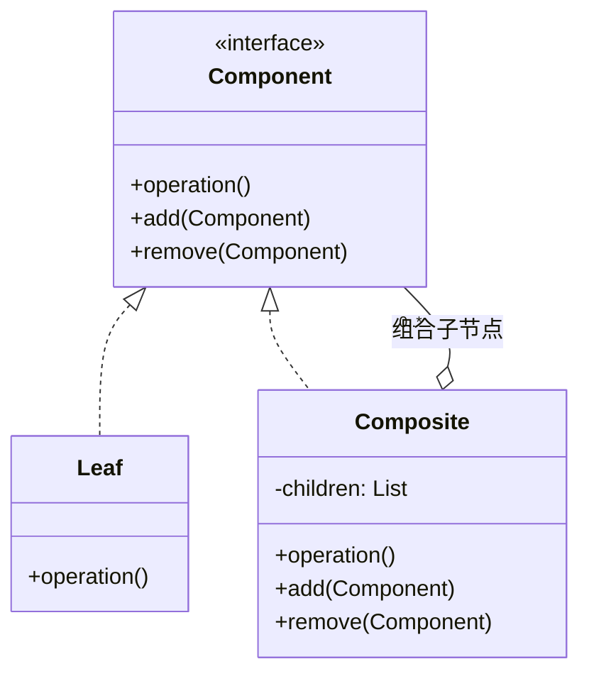
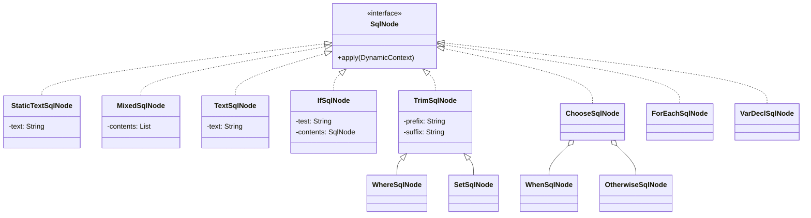

# 动态 SQL 解析流程

在前面两篇中，我们详细介绍了 mybatis-config.xml 全局配置文件以及 Mapper.xml 映射文件的解析流程，MyBatis 会将 Mapper 映射文件中定义的 SQL 语句解析成 SqlSource 对象，其中的动态标签、SQL 语句文本等，会解析成对应类型的 SqlNode 对象。

在开始介绍 SqlSource 接口、SqlNode 接口等核心接口的相关内容之前，我们需要先来了解一下动态 SQL 中使用到的基础知识和基础组件。

## OGNL 表达式语言

**OGNL 表达式语言是一款成熟的、面向对象的表达式语言**。在动态 SQL 语句中使用到了 OGNL 表达式读写 JavaBean 属性值、执行 JavaBean 方法这两个基础功能。

OGNL 表达式是相对完备的一门表达式语言，我们可以通过“对象变量名称.方法名称（或属性名称）”调用一个 JavaBean 对象的方法（或访问其属性），还可以通过“@[类的完全限定名]@[静态方法（或静态字段）]”调用一个 Java 类的静态方法（或访问静态字段）。OGNL 表达式还支持很多更复杂、更强大的功能，这里不再一一介绍。

下面我就通过一个示例来帮助你快速了解 OGNL 表达式的基础使用：

```java
public class OGNLDemo {
    private static Customer customer;
    private static OgnlContext context;
    private static Customer createCustomer() {
        customer = new Customer();
        customer.setId(1);
        customer.setName("Test Customer");
        customer.setPhone("1234567");
        Address address = new Address();
        address.setCity("city-001");
        address.setId(1);
        address.setCountry("country-001");
        address.setStreet("street-001");
        ArrayList<Address> addresses = new ArrayList<>();
        addresses.add(address);
        customer.setAddresses(addresses);
        return customer;
    }
    public static void main(String[] args) throws Exception {
        customer = createCustomer(); // 创建Customer对象以及Address对象
        // 创建OgnlContext上下文对象
        context = new OgnlContext(new DefaultClassResolver(),
                new DefaultTypeConverter(),
                new OgnlMemberAccess());
        // 设置root以及address这个key，默认从root开始查找属性或方法
        context.setRoot(customer);
        context.put("address", customer.getAddresses().get(0));
        // Ognl.parseExpression()方法负责解析OGNL表达式，获取Customer的addresses属性
        Object obj = Ognl.getValue(Ognl.parseExpression("addresses"),
                context, context.getRoot());
        System.out.println(obj);
        // 输出是[Address{id=1, street='street-001', city='city-001', country='country-001'}]
        // 获取city属性
        obj = Ognl.getValue(Ognl.parseExpression("addresses[0].city"),
                context, context.getRoot());
        System.out.println(obj); // 输出是city-001
        // #address表示访问的不是root对象，而是OgnlContext中key为address的对象
        obj = Ognl.getValue(Ognl.parseExpression("#address.city"), context,
                context.getRoot());
        System.out.println(obj); // 输出是city-001
        // 执行Customer的getName()方法
        obj = Ognl.getValue(Ognl.parseExpression("getName()"), context,
                context.getRoot());
        System.out.println(obj);
        // 输出是Test Customer
    }
}

```

MyBatis 为了提高 OGNL 表达式的工作效率，添加了一层 OgnlCache 来**缓存**表达式编译之后的结果（不是表达式的执行结果），OgnlCache 通过一个 ConcurrentHashMap<String, Object> 类型的集合（expressionCache 字段，静态字段）来**记录**OGNL 表达式编译之后的结果。通过缓存拿到表达式编译的结果之后，OgnlCache 底层还会依赖上述示例中的 OGNL 工具类以及 OgnlContext 完成表达式的执行。

## DynamicContext 上下文

在 MyBatis 解析一条动态 SQL 语句的时候，可能整个流程非常长，其中涉及多层方法的调用、方法的递归、复杂的循环等，其中**产生的中间结果需要有一个地方进行存储，那就是 DynamicContext 上下文对象**。

DynamicContext 中有两个核心属性：一个是 sqlBuilder 字段（StringJoiner 类型），用来记录解析之后的 SQL 语句；另一个是 bindings 字段，用来记录上下文中的一些 KV 信息。

DynamicContext 定义了一个 ContextMap 内部类，ContextMap 用来记录运行时用户传入的、用来替换“#{}”占位符的实参。在 DynamicContext 构造方法中，会**根据传入的实参类型决定如何创建对应的 ContextMap 对象**，核心代码如下：

```java
public DynamicContext(Configuration configuration, Object parameterObject) {
    if (parameterObject != null && !(parameterObject instanceof Map)) {
        // 对于非Map类型的实参，会创建对应的MetaObject对象，并封装成ContextMap对象
        MetaObject metaObject = configuration.newMetaObject(parameterObject);
        boolean existsTypeHandler = configuration.getTypeHandlerRegistry().hasTypeHandler(parameterObject.getClass());
        bindings = new ContextMap(metaObject, existsTypeHandler);
    } else {
        // 对于Map类型的实参，这里会创建一个空的ContextMap对象
        bindings = new ContextMap(null, false);
    }
    // 这里实参对应的Key是_parameter
    bindings.put(PARAMETER_OBJECT_KEY, parameterObject);
    bindings.put(DATABASE_ID_KEY, configuration.getDatabaseId());
}

```

ContextMap 继承了 HashMap 并覆盖了 get() 方法，在 get() 方法中有一个简单的降级逻辑：

首先，尝试按照 Map 的规则查找 Key，如果查找成功直接返回；

然后，再尝试检查 parameterObject 这个实参对象是否包含 Key 这个属性，如果包含的话，则直接读取该属性值返回；

最后，根据当前是否包含 parameterObject 相应的 TypeHandler 决定是返回整个 parameterObject 对象，还是返回 null。

后面在介绍 <foreach>、<trim> 等标签的处理逻辑中，你可以看到向 DynamicContext.bindings 集合中写入 KV 数据的操作，但是读取这个 ContextMap 的地方主要是在 OGNL 表达式中，也就是在 DynamicContext 中定义了一个静态代码块，指定了 OGNL 表达式读写 ContextMap 集合的逻辑，这部分读取逻辑封装在 ContextAccessor 中。除此之外，你还可以看到 ContextAccessor 中的 getProperty() 方法会将传入的 target 参数（实际上就是 ContextMap）转换为 Map，并先尝试按照 Map 规则进行查找；查找失败之后，会尝试获取“_parameter”对应的 parameterObject 对象，从 parameterObject 中获取指定的 Value 值。

## 组合模式

**组合模式（有时候也被称为“部分-整体”模式）是将同一类型的多个对象组合成一个树形结构。在使用这个树形结构的时候，我们可以像处理一个对象那样进行处理，而不用关心其复杂的树形结构。**

组合模式的核心结构如下图所示：



从上图中，我们可以看出组合模式的核心组件有下面三个。

**Component 接口：定义了整个树形结构中每个节点的基础行为**。一般情况下会定义两类方法，一类是真正的业务行为，另一类是管理子节点的行为，例如 addChild()、removeChild()、getChildren() 等方法。

**Leaf 类：抽象的是树形结构中的叶子节点**。Leaf 类只实现了 Component 接口中的业务方法，而管理子节点的方法是空实现或直接抛出异常。

**Composite 类：抽象了树形结构中的树枝节点（非叶子节点）**。Composite 类不仅要实现 Component 接口的业务方法，而且还需要实现子节点管理的相关方法，并在内部维护一个集合类来管理这些子节点。Composite 实现的业务方法一般逻辑比较简单，大都是直接循环调用所有子节点的业务方法。

通过以上对组合模式的介绍，你可以看出组合模式有以下两个优势：

由于使用方并不关心自己使用的是树形 Component 结构还是单个 Component 对象，所以可以帮助上层使用方屏蔽复杂的树形结构，将使用方的逻辑与树形结构解耦；

如果要在树形结构中添加新的功能，只需要增加树形结构中的节点即可，也就是提供新的 Component 接口实现并添加到树中，这符合“开放-封闭”原则。

## SqlNode

在 MyBatis 处理动态 SQL 语句的时候，会将动态 SQL 标签解析为 SqlNode 对象，**多个 SqlNode 对象就是通过组合模式组成树形结构供上层使用的**。

下面来讲解一下 SqlNode 的相关实现。首先，介绍一下 SqlNode 接口的定义，如下所示：

```
public interface SqlNode {
    // apply()方法会根据用户传入的实参，解析该SqlNode所表示的动态SQL内容并
    // 将解析之后的SQL片段追加到DynamicContext.sqlBuilder字段中暂存。
    // 当SQL语句中全部的动态SQL片段都解析完成之后，就可以从DynamicContext.sqlBuilder字段中
    // 得到一条完整的、可用的SQL语句了
    boolean apply(DynamicContext context);
}

```

MyBatis 为 SqlNode 接口提供了非常多的实现类（如下图），其中很多实现类都对应一个动态 SQL 标签，但是也有 SqlNode 实现扮演了组合模式中 Composite 的角色，例如，MixedSqlNode 实现类。



SqlNode 继承关系图

下面逐一介绍每个 SqlNode 实现类的功能和核心实现。

### 1. StaticTextSqlNode 和 MixedSqlNode

**StaticTextSqlNode 用于表示非动态的 SQL 片段**，其中维护了一个 text 字段（String 类型），用于记录非动态 SQL 片段的文本内容，其 apply() 方法会直接将 text 字段值追加到 DynamicContext.sqlBuilder 的最末尾。

**MixedSqlNode 在整个 SqlNode 树中充当了树枝节点，也就是扮演了组合模式中 Composite 的角色**，其中维护了一个 List<SqlNode> 集合用于记录 MixedSqlNode 下所有的子 SqlNode 对象。MixedSqlNode 对于 apply() 方法的实现也相对比较简单，核心逻辑就是遍历 List<SqlNode> 集合中全部的子 SqlNode 对象并调用 apply() 方法，由子 SqlNode 对象完成真正的动态 SQL 处理逻辑。

### 2. TextSqlNode

**TextSqlNode 实现抽象了包含 “${}”占位符的动态 SQL 片段**。TextSqlNode 通过一个 text 字段（String 类型）记录了包含“${}”占位符的 SQL 文本内容，在 apply() 方法实现中会结合用户给定的实参解析“${}”占位符，核心代码片段如下：

```
public boolean apply(DynamicContext context) {
    // 创建GenericTokenParser解析器，这里指定的占位符的起止符号分别是"${"和"}"
    GenericTokenParser parser = createParser(
            new BindingTokenParser(context, injectionFilter));
    // 将解析之后的SQL片段追加到DynamicContext暂存
    context.appendSql(parser.parse(text));
    return true;
}

```

这里**使用 GenericTokenParser 识别“${}”占位符**，在识别到占位符之后，会**通过 BindingTokenParser 将“${}”占位符替换为用户传入的实参**。BindingTokenParser 继承了TokenHandler 接口，在其 handleToken() 方法实现中，会根据 DynamicContext.bindings 这个 ContextMap 中的 KV 数据替换 SQL 语句中的“${}”占位符，相关的代码片段如下：

```
public String handleToken(String content) {
    // 获取用户提供的实参数据
    Object parameter = context.getBindings().get("_parameter");
    if (parameter == null) { // 通过value占位符，也可以查找到parameter对象
        context.getBindings().put("value", null);
    } else if (SimpleTypeRegistry.isSimpleType(parameter.getClass())) {
        context.getBindings().put("value", parameter);
    }
    // 通过Ognl解析"${}"占位符中的表达式，解析失败的话会返回空字符串
    Object value = OgnlCache.getValue(content, context.getBindings());
    String srtValue = value == null ? "" : String.valueOf(value);
    checkInjection(srtValue); // 对解析后的值进行过滤
    return srtValue; // 通过过滤的值才能正常返回
}

```

### 3. IfSqlNode

**IfSqlNode 实现类对应了动态 SQL 语句中的 <if> 标签**，在 MyBatis 的 <if> 标签中可以通过 test 属性指定一个表达式，当表达式成立时，<if> 标签内的 SQL 片段才会出现在完整的 SQL 语句中。

在 IfSqlNode 中，通过 test 字段（String 类型）记录了 <if> 标签中的 test 表达式，通过 contents 字段（SqlNode 类型）维护了 <if> 标签下的子 SqlNode 对象。在 IfSqlNode 的 apply() 方法实现中，会依赖 ExpressionEvaluator 工具类解析 test 表达式，只有 test 表达式为 true，才会调用子 SqlNode 对象（即 contents 字段）的 apply() 方法。需要说明的是：这里使用到的 ExpressionEvaluator 工具类底层也是依赖 OGNL 表达式实现 test 表达式解析的。

### 4. TrimSqlNode

**TrimSqlNode 对应 MyBatis 动态 SQL 语句中的 <trim> 标签**。

在使用 <trim> 标签的时候，我们可以指定 prefix 和 suffix 属性添加前缀和后缀，也可以指定 prefixOverrides 和 suffixOverrides 属性来删除多个前缀和后缀（使用“|”分割不同字符串）。在 TrimSqlNode 中维护了同名的四个字段值，即 prefix 字段、suffix 字段（这两个是 String 类型）以及 prefixesToOverride 字段、suffixesToOverride 字段（这两个是 List<String> 类型）。

下面先来看一下 TrimSqlNode 的 apply() 方法的实现：

```
public boolean apply(DynamicContext context) {
    FilteredDynamicContext filteredDynamicContext = new FilteredDynamicContext(context);
    // 首先执行子SqlNode对象的apply()方法完成对应动态SQL片段的解析
    boolean result = contents.apply(filteredDynamicContext);
    // 使用FilteredDynamicContext.applyAll()方法完成前后缀的处理操作
    filteredDynamicContext.applyAll();
    return result;
}

```

从 apply() 方法的实现可以看出，TrimSqlNode 处理前后缀的核心逻辑是在 FilteredDynamicContext 中完成的。**FilteredDynamicContext 可以看作是 DynamicContext 的装饰器**。除了 DynamicContext 本身临时存储解析结果和参数的功能之外，FilteredDynamicContext 还通过其 applyAll() 方法实现了前后缀的处理，其中会判断 TrimSqlNode 下子 SqlNode 的解析结果的长度，然后执行 applyPrefix() 方法处理前缀，执行 applySuffix() 方法处理后缀。

applyPrefix() 方法在处理前缀的时候，首先会遍历 prefixesToOverride 集合，从 SQL 片段的**头部**逐个尝试进行删除，之后在 SQL 片段的头部插入一个空格以及 prefix 字段指定的前缀字符串。

applySuffix() 方法在处理后缀的时候，首先会遍历 suffixesToOverride 集合，从 SQL 片段的**尾部**逐个尝试进行删除，之后在 SQL 片段的尾部插入一个空格以及 suffix 字段指定的后缀字符串。

另外，从前面的 SqlNode 继承关系图中还可以看出，WhereSqlNode 和 SetSqlNode 是 TrimSqlNode 的子类。

在 WhereSqlNode 中将 prefix 设置为“WHERE”字符串，prefixesToOverride 集合包含 “OR”“AND”“OR\n”“AND\n”“OR\r”“AND\r” 等字符串，这样就实现了删除 SQL 片段开头多余的 “AND”“OR” 关键字，并添加“WHERE”关键字的效果。

在 SetSqlNode 中将 prefix 设置为“SET”关键字，prefixesToOverride 集合和 suffixesToOverride 集合只包含“，”（逗号）字符串，这样就实现了删除 SQL 片段开头和结尾多余的逗号，并添加“SET”关键字的效果。

在前文，我们讲解了 MyBatis 中动态 SQL 语句的相关内容，重点介绍了 MyBatis 使用到的 OGNL 表达式、组合模式、DynamicContext 上下文以及多个动态 SQL 标签对应的 SqlNode 实现。本文我们就紧接着前文，继续介绍剩余 SqlNode 实现以及 SqlSource 的相关内容。

## SqlNode 剩余实现类

在前文我们已经介绍了 StaticTextSqlNode、MixedSqlNode、TextSqlNode、IfSqlNode、TrimSqlNode 这几个 SqlNode 的实现，再把剩下的三个 SqlNode 实现类也说明下。

### 1. ForEachSqlNode

在动态 SQL 语句中，我们可以**使用 <foreach> 标签对一个集合进行迭代**。在迭代过程中，我们可以通过 index 属性值指定的变量作为元素的下标索引（迭代 Map 集合的话，就是 Key 值），使用 item 属性值指定的变量作为集合元素（迭代 Map 集合的话，就是 Value 值）。另外，我们还可以通过 open 和 close 属性在迭代开始前和结束后添加相应的字符串，也允许使用 separator 属性自定义分隔符。这里要介绍的 ForEachSqlNode 就是 <foreach> 标签的抽象。

下面来分析一下 ForEachSqlNode 的 apply() 方法是如何实现循环的。

首先，向 DynamicContext.sqlBuilder 中追加 open 属性值指定的字符串，然后通过 ExpressionEvaluator 工具类解析 <foreach> 标签中 collection 属性指定的表达式，得到一个集合对象，并遍历这个集合。

接着，为每个元素创建一个 PrefixedContext 对象。PrefixedContext 是 DynamicContext 的一个装饰器，其中记录了一个 prefix 前缀信息（其实就是 <foreach> 标签中的 separator 属性值），在其 apply() 方法中会先追加 prefix 前缀（迭代第一个元素的时候，prefix 为空字符串），然后追加 SQL 片段。

如果传入的集合是 Map 类型，则通过 applyIndex() 方法和 applyItem() 方法将 Map 中的 Key 和 Value 记录到 PrefixedContext 中，示例如下：

```
private void applyIndex(DynamicContext context, Object o, int i) {
    if (index != null) {
        // Key值与index属性值指定的变量名称绑定
        context.bind(index, o);
        // Key值还会与"__frch_"+index属性值+ "_" + i 这个变量绑定
        // 这里传入的 i 是一个自增序列，由底层的 DynamicContext 统一维护。
        context.bind(itemizeItem(index, i), o);
    }
}
private void applyItem(DynamicContext context, Object o, int i) {
    if (item != null) {
        // Value值与item属性值指定的变量名称绑定
        context.bind(item, o);
        // Value值还会与"__frch_"+item属性值+ "_" + i 这个变量绑定
        context.bind(itemizeItem(item, i), o);
    }
}

```

但如果传入的集合不是 Map 类型，则通过 applyIndex() 方法和 applyItem() 方法将集合元素的下标索引和元素值本身绑定到 PrefixedContext 中。

完成 PrefixedContext 的绑定之后，会调用 <foreach> 标签下子 SqlNode 的 apply() 方法，其中传入的 DynamicContext 实际上是 ForEachSqlNode$FilteredDynamicContext 这个内部类，它也是 DynamicContext 的装饰器，核心功能是：根据前面在 PrefixedContext 中绑定的各种变量，处理 SQL 片段中的“#{}”占位符。FilteredDynamicContext 在多次循环中的处理效果如下图所示：


FilteredDynamicContext 变化过程示意图

下面是 FilteredDynamicContext.appendSql() 方法的核心实现：

```
public void appendSql(String sql) {
    // 创建识别"#{}"的GenericTokenParser解析器
    GenericTokenParser parser = new GenericTokenParser("#{", "}", content -> {
        // 这个TokenHandler实现会将#{i}替换成#{__frch_i_0}、#{__frch_i_1}...
        String newContent = content.replaceFirst("^\\s*" + item + "(?![^.,:\\s])", itemizeItem(item, index));
        if (itemIndex != null && newContent.equals(content)) {
            // 这里会将#{j}替换成#{__frch_j_0}、#{__frch_j_1}...
            newContent = content.replaceFirst("^\\s*" + itemIndex + "(?![^.,:\\s])", itemizeItem(itemIndex, index));
        }
        return "#{" + newContent + "}";
    });
    // 保存解析后的SQL片段
    delegate.appendSql(parser.parse(sql));
}

```

完成集合中全部元素的迭代处理之后，ForEachSqlNode.apply() 方法还会调用 applyClose() 方法追加 close 属性指定的后缀。最后，从 DynamicContext 上下文中删除 index 属性值和 item 属性值指定的变量。

### 2. ChooseSqlNode

在有的业务场景中，可能会碰到非常多的分支判断，在 Java 中，我们可以通过 switch...case...default 的方式来编写这段代码；在 MyBatis 的动态 SQL 语句中，我们可以使用 <choose>、<when> 和 <otherwise> 三个标签来实现类似的效果。

**<choose> 标签会被 MyBatis 解析成 ChooseSqlNode 对象，<when> 标签会被解析成 IfSqlNode 对象，<otherwise> 标签会被解析成 MixedSqlNode 对象。**

IfSqlNode 和 MixedSqlNode 的核心实现在前文中我们已经分析过了，这里不再重复。ChooseSqlNode 的实现也比较简单，其中维护了一个 List<SqlNode> 集合（ifSqlNodes 字段）用来记录所有 <when> 子标签对应的 IfSqlNode 对象，同时还维护了一个 SqlNode 类型字段（defaultSqlNode 字段）用来记录 <otherwise> 子标签生成的 MixedSqlNode 对象，该字段可以为 null。

在 ChooseSqlNode 的 apply() 方法中，首先会尝试迭代全部 IfSqlNode 节点并执行 apply() 方法，我们知道任意一个 IfSqlNode.apply() 方法返回 true，即表示命中该分支，此时整个 ChooseSqlNode.apply() 返回 true，否则尝试执行 defaultSqlNode.apply() 方法并返回 true，即进入默认分支。如果 defaultSqlNode 字段为 null，则返回 false。

### 3. VarDeclSqlNode

VarDeclSqlNode 抽象了 <bind> 标签，其**核心功能是将一个 OGNL 表达式的值绑定到一个指定的变量名上，并记录到 DynamicContext 上下文中**。

VarDeclSqlNode 中的 name 字段维护了 <bind> 标签中 name 属性的值，expression 字段记录了 <bind> 标签中 value 属性的值（一般是一个 OGNL 表达式）。

在 apply() 方法中，VarDeclSqlNode 首先会通过 OGNL 工具类解析 expression 这个表达式的值，然后将解析结果与 name 字段的值一起绑定到 DynamicContext 上下文中，这样后面就可以通过 name 字段值获取这个表达式的值了。

## SqlSourceBuilder

动态 SQL 语句经过上述 SqlNode 的解析之后，接着会由 SqlSourceBuilder 进行下一步处理。

SqlSourceBuilder 的核心操作主要有两个：

**解析“#{}”占位符中携带的各种属性**，例如，“#{id, javaType=int, jdbcType=NUMERIC, typeHandler=MyTypeHandler}”这个占位符，指定了 javaType、jdbcType、typeHandler 等配置；

**将 SQL 语句中的“#{}”占位符替换成“?”占位符**，替换之后的 SQL 语句就可以提交给数据库进行编译了。

SqlSourceBuilder 的入口是 parse() 方法，这里首先会创建一个识别“#{}”占位符的 GenericTokenParser 解析器，当识别到“#{}”占位符的时候，就**由 ParameterMappingTokenHandler 这个 TokenHandler 实现完成上述两个核心步骤**。

ParameterMappingTokenHandler 中维护了一个 List<ParameterMapping> 类型的集合（parameterMappings 字段），用来记录每个占位符参数解析后的结果，ParameterMapping 记录了占位符名称（property 字段）、jdbcType 属性值（jdbcType 字段）、javaType 属性值（javaType 字段）、typeHandler 属性值（typeHandler 字段）等。

在 buildParameterMapping() 方法中会通过 ParameterExpression 工具类解析“#{}”占位符，然后通过 ParameterMapping.Builder 创建对应的 ParameterMapping 对象。这里得到的 ParameterMapping 就会被记录到 parameterMappings 集合中。

ParameterMappingTokenHandler.handleToken() 方法的核心逻辑如下：

```
public String handleToken(String content) {
    // content是前面通过GenericTokenParser识别到的#{}占位符，
    // 这里通过buildParameterMapping()方法进行解析，得到ParameterMapping对象
    parameterMappings.add(buildParameterMapping(content));
    // 直接返回"?"占位符，替换原有的#{}占位符
    return "?";
}

```

SqlSourceBuilder 完成了“#{}”占位符的解析和替换之后，会将最终的 SQL 语句以及得到的 ParameterMapping 集合封装成一个 StaticSqlSource 对象并返回。

## SqlSource

经过上述一系列处理之后，SQL 语句最终会由 SqlSource 进行最后的处理。

**在 SqlSource 接口中只定义了一个 getBoundSql() 方法，它控制着动态 SQL 语句解析的整个流程**，它会根据从 Mapper.xml 映射文件（或注解）解析到的 SQL 语句以及执行 SQL 时传入的实参，返回一条可执行的 SQL。

下图展示了 SqlSource 接口的核心实现：


SqlSource 接口继承图

下面来看一下这三个核心实现类的具体含义。

DynamicSqlSource：当 SQL 语句中包含动态 SQL 的时候，会使用 DynamicSqlSource 对象。

RawSqlSource：当 SQL 语句中只包含静态 SQL 的时候，会使用 RawSqlSource 对象。

StaticSqlSource：DynamicSqlSource 和 RawSqlSource 经过一系列解析之后，会得到最终可提交到数据库的 SQL 语句，这个时候就可以通过 StaticSqlSource 进行封装了。

### 1. DynamicSqlSource

DynamicSqlSource 作为最常用的 SqlSource 实现，**主要负责解析动态 SQL 语句**。

DynamicSqlSource 中维护了一个 SqlNode 类型的字段（rootSqlNode 字段），用于记录整个 SqlNode 树形结构的根节点。在 DynamicSqlSource 的 getBoundSql() 方法实现中，会使用前面介绍的 SqlNode、SqlSourceBuilder 等组件，完成动态 SQL 语句以及“#{}”占位符的解析，具体的实现如下：

```
public BoundSql getBoundSql(Object parameterObject) {
    // 创建DynamicContext对象，parameterObject是用户传入的实参
    DynamicContext context = new DynamicContext(configuration, parameterObject);
    // 调用rootSqlNode.apply()方法，完成整个树形结构中全部SqlNode对象对SQL片段的解析
    // 这里无须关心rootSqlNode这棵树中到底有多少SqlNode对象，每个SqlNode对象的行为都是一致的，
    // 都会将解析之后的SQL语句片段追加到DynamicContext中，形成最终的、完整的SQL语句
    // 这是使用组合设计模式的好处
    rootSqlNode.apply(context);
    // 通过SqlSourceBuilder解析"#{}"占位符中的属性，并将SQL语句中的"#{}"占位符替换成"?"占位符
    SqlSourceBuilder sqlSourceParser = new SqlSourceBuilder(configuration);
    Class<?> parameterType = parameterObject == null ? Object.class : parameterObject.getClass();
    SqlSource sqlSource = sqlSourceParser.parse(context.getSql(), parameterType, context.getBindings());

// 创建BoundSql对象
    BoundSql boundSql = sqlSource.getBoundSql(parameterObject);
    context.getBindings().forEach(boundSql::setAdditionalParameter);
    return boundSql;
}

```

这里最终返回的 BoundSql 对象，包含了解析之后的 SQL 语句（sql 字段）、每个“#{}”占位符的属性信息（parameterMappings 字段 ，List<ParameterMapping> 类型）、实参信息（parameterObject 字段）以及 DynamicContext 中记录的 KV 信息（additionalParameters 集合，Map<String, Object> 类型）。

后面在讲解 StatementHandler、Executor 如何执行 SQL 语句的时候，我们还会继续介绍 BoundSql 的相关内容，到时候你可以跟这里联系起来学习。

### 2. RawSqlSource

我们看 SqlSource 的第二个实现—— RawSqlSource，它与 DynamicSqlSource 有两个不同之处：

RawSqlSource 处理的是非动态 SQL 语句，DynamicSqlSource 处理的是动态 SQL 语句；

RawSqlSource 解析 SQL 语句的时机是在初始化流程中，而 DynamicSqlSource 解析动态 SQL 的时机是在程序运行过程中，也就是运行时解析。

这里我们需要先来回顾一下前面介绍的 XMLScriptBuilder.parseDynamicTags() 方法，其中会**判断一个 SQL 片段**是否为动态 SQL，判断的标准是：**如果这个 SQL 片段包含了未解析的“${}”占位符或动态 SQL 标签，则为动态 SQL 语句**。但注意，如果是只包含了“#{}”占位符，也不是动态 SQL。

XMLScriptBuilder.parseScriptNode() 方法则会**判断整个 SQL 语句**是否为动态 SQL，判断的依据是：**如果 SQL 语句中包含任意一个动态 SQL 片段，那么整个 SQL 即为动态 SQL 语句**。

总结来说，对于动态 SQL 语句，MyBatis 会创建 DynamicSqlSource 对象进行处理，而对于非动态 SQL 语句，则会创建 RawSqlSource 对象进行处理。

RawSqlSource 在构造方法中，会调用 SqlNode.apply() 方法将 SQL 片段组装成完整 SQL，然后通过 SqlSourceBuilder 处理“#{}”占位符，得到 StaticSqlSource 对象。这两步处理与 DynamicSqlSource 完全一样，只不过执行的时机是在 RawSqlSource 对象的初始化过程中（即 MyBatis 框架初始化流程中），而不是在 getBoundSql() 方法被调用时（即运行时）。

最后，RawSqlSource.getBoundSql() 方法实现是直接调用 StaticSqlSource.getBoundSql() 方法返回一个 BoundSql 对象。

通过前面的介绍我们知道，无论是 DynamicSqlSource 还是 RawSqlSource，底层都依赖 SqlSourceBuilder 解析之后得到的 StaticSqlSource 对象。StaticSqlSource 中维护了解析之后的 SQL 语句以及“#{}”占位符的属性信息（List<ParameterMapping> 集合），其 getBoundSql() 方法是真正创建 BoundSql 对象的地方，这个 BoundSql 对象包含了上述 StaticSqlSource 的两个字段以及实参的信息。

## 版本差异(旧版 → MyBatis 3.5.x)

| 特性 | 旧版(MyBatis 3.4.x) | MyBatis 3.5.x |
|------|--------------------|---------------|
| 动态 SQL | XMLScriptBuilder | 不变；核心实现稳定 |
| 标签 | if/choose/foreach | 3.5.x 持续完善（`<script>` 注解 SQL 用法不变） |
| 性能 | 无 | 3.5.x 动态 SQL 解析缓存优化 |
