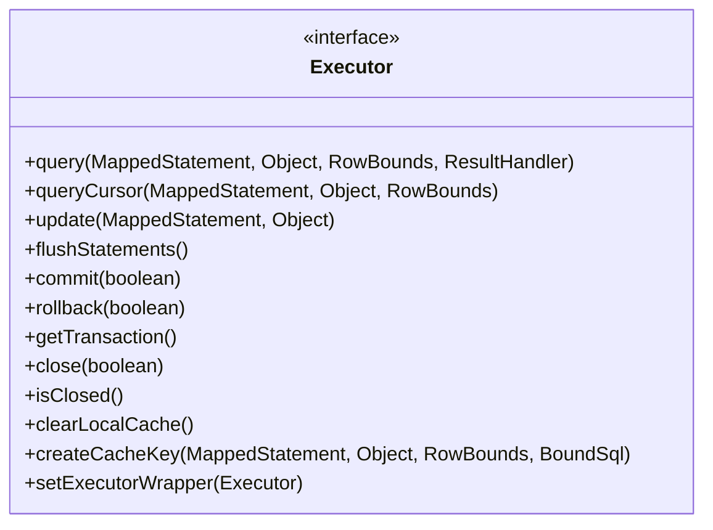
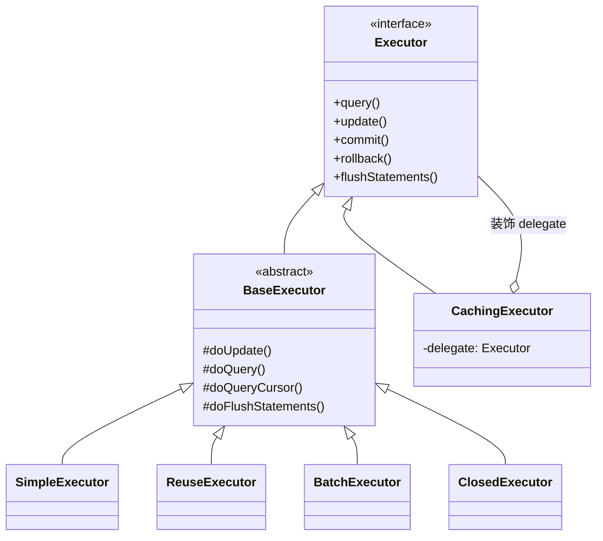

# Executor 与 SqlSession 接口层

## 模板方法模式

在我们开发业务逻辑的时候，可能会遇到流程复杂的逻辑，而这个复杂逻辑本身是可以拆解成多个小的行为，这些小的行为本身可能根据业务场景的不同而有所变化。

这里我们以转账流程为例，如下图所示，整个转账流程是固定的，但是“验证密码”“验证余额”和“扣除金额”这三步针对不同的银行卡，要调用不同银行的接口去完成。


为了让整个复杂流程的代码具有更好的扩展性，我们一般会使用模板方法模式来处理。

在模板方法模式中，我们可以将复杂流程中每个步骤的边界确定下来，然后由一个“模板方法”定义每个步骤的执行流程，每个步骤对应着一个方法，这些方法也被称为“基本方法”。模板方法按照业务逻辑依次调用上述基本方法，来实现完整的复杂流程。

**模板方法模式会将模板方法以及不需要随业务场景变化的基本方法放到父类中实现，随业务场景变化的基本方法会被定义为抽象方法，由子类提供真正的实现。**

下图展示了模板方法模式的核心类，其中 template() 方法是我们上面描述的模板方法，part1() 方法和 part3() 方法是逻辑不变的基本方法实现，而 part2()、part4() 方法是两个随场景变化的基本方法。


我们可以**通过模板方法控制整个流程的走向以及其中固定不变的步骤，子类来实现流程的某些变化细节**，这就实现了“变化与不变”的解耦，也实现了“整个流程与单个步骤”的解耦。当业务需要改变流程中某些步骤的具体行为时，直接添加新的子类即可实现，这也非常符合“开放-封闭”原则。另外，模板方法模式能够充分利用面向对象的多态特性，在系统运行时再选择一种具体子类来执行完整的流程，这也从另一个角度提高了系统的灵活性。

## Executor 接口

介绍完模板方法模式之后，我们开始介绍 Executor 这个核心接口。

首先来看 Executor 接口定义的核心方法，如下图所示，Executor 接口定义了数据库操作的基本方法，其中 query*() 方法、update() 方法、flushStatement() 方法是执行 SQL 语句的基础方法，commit() 方法、rollback() 方法以及 getTransaction() 方法与事务的提交/回滚相关，clearLocalCache() 方法、createCacheKey() 方法与缓存有关。



Executor 接口结构图

MyBatis 中有多个 Executor 接口的实现类，如下图所示：



该图中的 CachingExecutor 是 Executor 的装饰器实现，在其他 Executor 实现的基础上添加了缓存的功能；BaseExecutor 实现了 Executor 接口的全部方法，主要定义了这些方法的核心流程（也就是模板方法），然后由子类进行具体实现。

## BaseExecutor

BaseExecutor 使用模板方法模式实现了 Executor 接口中的方法，其中，不变的部分是事务管理和缓存管理两部分的内容，由 BaseExecutor 实现；变化的部分则是具体的数据库操作，由 BaseExecutor 子类实现，涉及 doUpdate()、doQuery()、doQueryCursor() 和 doFlushStatement() 这四个方法。

下面会从缓存和事务两个角度来讲解 BaseExecutor 的核心实现。

### 1. 一级缓存

数据库作为 OLTP 系统中的核心资源之一，是性能优化的重点关注对象，在设计、开发以及后期运维时，我们都会采取多种手段减少数据库压力，其中**使用缓存是一种比较常用且有效的优化数据库读写效率的手段**。

缓存方案之所以备受开发者青睐，主要是因为多数缓存都是基于内存或“内存+磁盘”的存储结构，数据读取效率远远高于数据库，在缓存有效的时候，能够帮助数据库分担大量读压力，从而降低数据库 QPS，提高整个系统性能。从可用性的角度来看，当数据库发生故障的时候，缓存因为保存全部或部分数据，可以继续响应部分读请求，这在某种意义上就提高了程序的可用性。

很多持久层框架默认都提供了基于 JVM 堆内存的缓存实现，MyBatis 也不例外。MyBatis 缓存分为一级缓存和二级缓存，这里我们先重点来看一级缓存的内容。

**MyBatis 中的一级缓存是会话级缓存**，创建一个 SqlSession 对象就表示开启一次与数据库的会话，会话生命周期与 SqlSession 的生命周期一致。在一次会话中，我们可能多次执行相同的查询语句，如果没有缓存，每次查询都会请求到数据库，这样就会浪费数据库资源。

为了避免上述资源浪费问题，BaseExecutor 会给每个 SqlSession 对象关联一个 Cache 对象，也就是“一级缓存”。在使用 SqlSession 对象进行查询的时候，会先访问一级缓存，看看是否已经缓存了结果对象，如果存在，则直接返回一级缓存中的结果对象，“命中缓存”。如果未命中缓存，则会击穿到数据库，一级缓存会将数据库返回的查询结果对象缓存起来，等待后续请求使用。MyBatis 中的一级缓存默认处于开启状态，也推荐用户开启一级缓存。

下面来看 BaseExecutor 与一级缓存的相关实现。在 BaseExecutor 中维护了两个 PerpetualCache 对象，分别是 localCache 字段和 localOutputParameterCache 字段，其中 localOutputParameterCache 只用来缓存存储过程的输出参数，localCache 会用来缓存其他查询方式的结果对象。

在 BaseExecutor.query() 方法中，定义了**查询操作**的核心流程，其中也包含了查询一级缓存和填充一级缓存的操作，其具体核心步骤如下。

创建 CacheKey 对象，该部分逻辑在 createCacheKey() 方法中实现。这里创建的 CacheKey 对象主要包含五个部分：MappedStatement 的 id、RowBounds 中的 offset 和 limit 信息、SQL 语句（包含“?”占位符）、用户传递的实参信息以及 Environment ID。

使用 CacheKey 查询一级缓存。如果缓存命中，则直接返回缓存的结果对象；如果缓存未命中，则调用 doQuery() 方法完成数据库查询操作，同时将结果对象记录到一级缓存中。

除了上述查询缓存、数据库等操作之外，query() 方法最后还会处理嵌套查询的缓存。在这一步中，BaseExecutor 会遍历全部嵌套查询对应的 DeferredLoad 对象，并通过 load() 方法从 localCache 中获取嵌套查询的对象，填充到外层对象的相应属性中。

下面来看 query() 方法的核心逻辑：

```
public <E> List<E> query(MappedStatement ms, Object parameter, RowBounds rowBounds, ResultHandler resultHandler, CacheKey key, BoundSql boundSql) throws SQLException {
if (queryStack == 0 && ms.isFlushCacheRequired()) {
// 非嵌套查询，并且<select>标签配置的flushCache属性为true时，才会清空一级缓存
// 注意：flushCache配置项会影响一级缓存中结果对象存活时长
clearLocalCache();
}
List<E> list;
try {
queryStack++; // 增加查询层数
// 查询一级缓存
list = resultHandler == null ? (List<E>) localCache.getObject(key) : null;
if (list != null) {
// 对存储过程出参的处理：如果命中一级缓存，则获取缓存中保存的输出参数，
// 然后记录到用户传入的实参对象中
handleLocallyCachedOutputParameters(ms, key, parameter, boundSql);
} else {
// queryFromDatabase()方法内部首先会在localCache中设置一个占位符，然后调用doQuery()方法完成数据库查询，并得到映射后的结果对象, doQuery()方法是
// 一个抽象方法，由BaseExecutor的子类具体实现
list = queryFromDatabase(ms, parameter, rowBounds, resultHandler, key, boundSql);
}
} finally {
queryStack--; // 当前查询完成，查询层数减少
}
if (queryStack == 0) {  // 完成嵌套查询的填充
for (DeferredLoad deferredLoad : deferredLoads) {
deferredLoad.load();
}
deferredLoads.clear(); // 清空deferredLoads集合
if (configuration.getLocalCacheScope() == LocalCacheScope.STATEMENT) {
// 根据配置决定是否清空localCache
clearLocalCache();
}
}
return list;
}

```

通过对 query() 这个核心方法的分析，我们可以看到其中有两处影响一级缓存中结果对象生命周期的配置：一个是 <select> 标签的 flushCache 配置，它决定了一条 select 语句执行之前是否会清除一级缓存；另一个是全局的 localCacheScope 配置，它决定了一级缓存的生命周期是语句级别的（STATEMENT）还是 SqlSession 级别的（SESSION），默认值是 SqlSession 级别的。

除了上述两个配置会影响缓存数据的生命周期之外，修改操作也会清空缓存，涉及以下展示的 commit()、rollback()、update() 方法：


clearLocalCache() 方法调用位置

为了保持一级缓存与数据库的一致性，这些修改数据的操作需要清空一级缓存，因为执行修改操作之后，数据库中存储的数据已更新，如果一级缓存的内容不更新的话，就会与数据库中的数据不一致，成为“脏数据”。

### 2. 事务管理

现在我们知道 commit()、rollback() 方法在提交和回滚事务之前会清空一级缓存，那 BaseExecutor 是如何管理事务的呢？这里我们就来看一下事务管理相关的内容。

在 BaseExecutor 中维护了一个 Transaction 对象（transaction 字段）来**控制事务**。首先来看 getConnection() 方法，它底层会通过 Transaction.getConnection() 方法获取数据库连接，用于创建 Statement、PreparedStatement 等对象。

再来看 commit() 方法和 rollback() 方法，分别依赖 Transaction.commit() 方法和 Transaction.rollback() 方法来**提交和回滚事务**。从 commit() 方法和 rollback() 方法中我们可以看到，在清理一级缓存和提交/回滚事务之间，BaseExecutor 还会执行 flushStatements() 方法，这个方法主要是处理批处理场景，其中会调用 doFlushStatements() 来处理通过 batch() 写入的多条 SQL 语句。

在前文中，我们介绍了模板方法模式的相关知识，然后介绍了 Executor 接口的核心方法，最后分析了 BaseExecutor 抽象类是如何利用模板方法模式为其他 Executor 抽象了一级缓存和事务管理的能力。本文，我们再来介绍剩余的四个重点 Executor 实现。


Executor 接口继承关系图

## SimpleExecutor

我们来看 BaseExecutor 的第一个子类—— SimpleExecutor，同时**它也是 Executor 接口最简单的实现**。

正如前文中分析的那样，BaseExecutor 通过模板方法模式实现了读写一级缓存、事务管理等不随场景变化的基础方法，在 SimpleExecutor、ReuseExecutor、BatchExecutor 等实现类中，不再处理这些不变的逻辑，而只要关注 4 个 do*() 方法的实现即可。

这里我们重点来看 SimpleExecutor 中 doQuery() 方法的实现逻辑。

通过 newStatementHandler() 方法创建 StatementHandler 对象，其中会根据 MappedStatement.statementType 配置创建相应的 StatementHandler 实现对象，并添加 RoutingStatementHandler 装饰器。

通过 prepareStatement() 方法初始化 Statement 对象，其中还依赖 ParameterHandler 填充 SQL 语句中的占位符。

通过 StatementHandler.query() 方法执行 SQL 语句，并通过前面介绍的 DefaultResultSetHandler 将 ResultSet 映射成结果对象并返回。

doQuery() 方法的核心代码实现如下所示：

```
public <E> List<E> doQuery(MappedStatement ms, Object parameter, RowBounds rowBounds, ResultHandler resultHandler, BoundSql boundSql) throws SQLException {
    Statement stmt = null;
    try {
        Configuration configuration = ms.getConfiguration();
        // 创建StatementHandler对象，实际返回的是RoutingStatementHandler对象（我们在前面介绍过）
        // 其中根据MappedStatement.statementType选择具体的StatementHandler实现
        StatementHandler handler = configuration.newStatementHandler(wrapper, ms, parameter, rowBounds, resultHandler, boundSql);
        // 完成StatementHandler的创建和初始化，该方法会调用StatementHandler.prepare()方法创建
        // Statement对象，然后调用StatementHandler.parameterize()方法处理占位符
        stmt = prepareStatement(handler, ms.getStatementLog());
        // 调用StatementHandler.query()方法，执行SQL语句，并通过ResultSetHandler完成结果集的映射
        return handler.query(stmt, resultHandler);
    } finally {
        closeStatement(stmt);
    }
}

```

SimpleExecutor 中的 doQueryCursor()、update() 等方法实现与 doQuery() 方法的实现基本类似，这里不再展开介绍，你若感兴趣的话可以参考源码进行分析。

## ReuseExecutor

你如果有过 JDBC 优化经验的话，可能会知道重用 Statement 对象是一种常见的优化手段，主要目的是减少 SQL 预编译开销，同时还会降低 Statement 对象的创建和销毁频率，这在一定程度上可以提升系统性能。

ReuseExecutor 这个 BaseExecutor 实现就**实现了重用 Statement 的优化**，ReuseExecutor 维护了一个 statementMap 字段（HashMap<String, Statement>类型）来缓存已有的 Statement 对象，该缓存的 Key 是 SQL 模板，Value 是 SQL 模板对应的 Statement 对象。这样在执行相同 SQL 模板时，我们就可以复用 Statement 对象了。

ReuseExecutor 中的 do*() 方法实现与前面介绍的 SimpleExecutor 实现完全一样，两者唯一的**区别在于其中依赖的 prepareStatement() 方法**：SimpleExecutor 每次都会创建全新的 Statement 对象，ReuseExecutor 则是先尝试查询 statementMap 缓存，如果缓存命中，则会重用其中的 Statement 对象。

另外，在事务提交/回滚以及 Executor 关闭的时候，需要同时关闭 statementMap 集合中缓存的全部 Statement 对象，这部分逻辑是在 doFlushStatements() 方法中实现的，核心代码如下：

```
public List<BatchResult> doFlushStatements(boolean isRollback) {
        // 关闭statementMap集合中缓存的全部Statement对象
        for (Statement stmt : statementMap.values()) {
            closeStatement(stmt);
        }
        // 清空statementMap集合
        statementMap.clear();
        return Collections.emptyList();
    }

```

## BatchExecutor

批处理是 JDBC 编程中的另一种优化手段。

JDBC 在执行 SQL 语句时，会将 SQL 语句以及实参通过网络请求的方式发送到数据库，一次执行一条 SQL 语句，一方面会减小请求包的有效负载，另一个方面会增加耗费在网络通信上的时间。通过批处理的方式，我们就可以在 JDBC 客户端缓存多条 SQL 语句，然后在 flush 或缓存满的时候，将多条 SQL 语句打包发送到数据库执行，这样就可以有效地降低上述两方面的损耗，从而提高系统性能。

不过，有一点需要特别注意：每次向数据库发送的 SQL 语句的条数是有上限的，如果批量执行的时候超过这个上限值，数据库就会抛出异常，拒绝执行这一批 SQL 语句，所以我们**需要控制批量发送 SQL 语句的条数和频率**。

**BatchExecutor 是用于实现批处理的 Executor 实现**，其中维护了一个 List<Statement> 集合（statementList 字段）用来缓存一批 SQL，每个 Statement 可以写入多条 SQL。

我们知道 JDBC 的批处理操作只支持 insert、update、delete 等修改操作，也就是说 BatchExecutor 对批处理的实现集中在 doUpdate() 方法中。在 doUpdate() 方法中追加一条待执行的 SQL 语句时，BatchExecutor 会先将该条 SQL 语句与最近一次追加的 SQL 语句进行比较，如果相同，则追加到最近一次使用的 Statement 对象中；如果不同，则追加到一个全新的 Statement 对象，同时会将新建的 Statement 对象放入 statementList 缓存中。

下面是 BatchExecutor.doUpdate() 方法的核心逻辑：

```
public int doUpdate(MappedStatement ms, Object parameterObject) throws SQLException {
  final Configuration configuration = ms.getConfiguration();
  // 创建StatementHandler对象
  final StatementHandler handler = configuration.newStatementHandler(this, ms, parameterObject, RowBounds.DEFAULT, null, null);
  final BoundSql boundSql = handler.getBoundSql();
    // 获取此次追加的SQL模板
    final String sql = boundSql.getSql();
    final Statement stmt;
    // 比较此次追加的SQL模板与最近一次追加的SQL模板，以及两个MappedStatement对象
    if (sql.equals(currentSql) && ms.equals(currentStatement)) {
        // 两者相同，则获取statementList集合中最后一个Statement对象
        int last = statementList.size() - 1;
        stmt = statementList.get(last);
        applyTransactionTimeout(stmt);
        handler.parameterize(stmt); // 设置实参
        // 查找该Statement对象对应的BatchResult对象，并记录用户传入的实参
        BatchResult batchResult = batchResultList.get(last);
        batchResult.addParameterObject(parameterObject);
    } else {
        Connection connection = getConnection(ms.getStatementLog());
        // 创建新的Statement对象
        stmt = handler.prepare(connection, transaction.getTimeout());
        handler.parameterize(stmt);// 设置实参
        // 更新currentSql和currentStatement
        currentSql = sql;
        currentStatement = ms;
        // 将新创建的Statement对象添加到statementList集合中
        statementList.add(stmt);
        // 为新Statement对象添加新的BatchResult对象
        batchResultList.add(new BatchResult(ms, sql, parameterObject));
    }
    handler.batch(stmt);
    return BATCH_UPDATE_RETURN_VALUE;
}

```

这里使用到的 BatchResult 用于记录批处理的结果，一个 BatchResult 对象与一个 Statement 对象对应，BatchResult 中维护了一个 updateCounts 字段（int[] 数组类型）来记录关联 Statement 对象执行批处理的结果。

添加完待执行的 SQL 语句之后，我们再来看一下 doFlushStatements() 方法，其中会通过 Statement.executeBatch() 方法批量执行 SQL，然后 SQL 语句影响行数以及数据库生成的主键填充到相应的 BatchResult 对象中返回。下面是其核心实现：

```
public List<BatchResult> doFlushStatements(boolean isRollback) throws SQLException {
    try {
        // 用于储存批处理的结果
        List<BatchResult> results = new ArrayList<>();
        // 如果明确指定了要回滚事务，则直接返回空集合，忽略statementList集合中记录的SQL语句
        if (isRollback) {
            return Collections.emptyList();
        }
        for (int i = 0, n = statementList.size(); i < n; i++) { // 遍历statementList集合
            Statement stmt = statementList.get(i);// 获取Statement对象
            applyTransactionTimeout(stmt);
            BatchResult batchResult = batchResultList.get(i); // 获取对应BatchResult对象
            try {
                // 调用Statement.executeBatch()方法批量执行其中记录的SQL语句，并使用返回的int数组
                // 更新BatchResult.updateCounts字段，其中每一个元素都表示一条SQL语句影响的记录条数
                batchResult.setUpdateCounts(stmt.executeBatch());
                MappedStatement ms = batchResult.getMappedStatement();
                List<Object> parameterObjects = batchResult.getParameterObjects();
                // 获取配置的KeyGenerator对象
                KeyGenerator keyGenerator = ms.getKeyGenerator();
                if (Jdbc3KeyGenerator.class.equals(keyGenerator.getClass())) {
                    // 获取数据库生成的主键，并记录到实参中对应的字段
                    Jdbc3KeyGenerator jdbc3KeyGenerator = (Jdbc3KeyGenerator) keyGenerator;
                    jdbc3KeyGenerator.processBatch(ms, stmt, parameterObjects);
                } else if (!NoKeyGenerator.class.equals(keyGenerator.getClass())) {
                    // 其他类型的KeyGenerator，会调用其processAfter()方法
                    for (Object parameter : parameterObjects) {
                        keyGenerator.processAfter(this, ms, stmt, parameter);
                    }
                }
                closeStatement(stmt);
            } catch (BatchUpdateException e) {
                // 异常处理逻辑
            }
            // 添加BatchResult到results集合
            results.add(batchResult);
        }
        return results;
    } finally {
        // 释放资源
    }
}

```

## CachingExecutor

CachingExecutor 是我们最后一个要介绍的 Executor 接口实现类，它是**一个 Executor 装饰器实现，会在其他 Executor 的基础之上添加二级缓存的相关功能**。在前文中，我们已经介绍过了一级缓存，下面就接着讲解二级缓存相关的内容。

### 1. 二级缓存

我们知道一级缓存的生命周期默认与 SqlSession 相同，而这里介绍的 MyBatis 中的二级缓存则与应用程序的生命周期相同。与二级缓存相关的配置主要有下面三项。

**第一项，二级缓存全局开关**。这个全局开关是 mybatis-config.xml 配置文件中的 cacheEnabled 配置项。当 cacheEnabled 被设置为 true 时，才会开启二级缓存功能，开启二级缓存功能之后，下面两项的配置才会控制二级缓存的行为。

**第二项，命名空间级别开关**。在 Mapper 配置文件中，可以通过配置 <cache> 标签或 <cache-ref> 标签开启二级缓存功能。

在解析到 <cache> 标签时，MyBatis 会为当前 Mapper.xml 文件对应的命名空间创建一个关联的 Cache 对象（默认为 PerpetualCache 类型的对象），作为其二级缓存的实现。此外，<cache> 标签中还提供了一个 type 属性，我们可以通过该属性使用自定义的 Cache 类型。

在解析到 <cache-ref> 标签时，MyBatis 并不会创建新的 Cache 对象，而是根据 <cache-ref> 标签的 namespace 属性查找指定命名空间对应的 Cache 对象，然后让当前命名空间与指定命名空间共享同一个 Cache 对象。

**第三项，语句级别开关**。我们可以通过 <select> 标签中的 useCache 属性，控制该 select 语句查询到的结果对象是否保存到二级缓存中，useCache 属性默认值为 true。

### 2. TransactionalCache

了解了二级缓存的生命周期、基本概念以及相关配置之后，我们开始介绍 CachingExecutor 依赖的底层组件。

CachingExecutor 底层除了依赖 PerpetualCache 实现来缓存数据之外，还会**依赖 TransactionalCache 和 TransactionalCacheManager 两个组件**，下面一一详细介绍。

TransactionalCache 是 Cache 接口众多实现之一，它也是一个装饰器，用来记录一个事务中添加到二级缓存中的缓存。

TransactionalCache 中的 entriesToAddOnCommit 字段（Map<Object, Object> 类型）用来暂存当前事务中添加到二级缓存中的数据，这些数据在事务提交时才会真正添加到底层的 Cache 对象（也就是二级缓存）中。这一点我们可以从 TransactionalCache 的 putObject() 方法以及 flushPendingEntries() 方法（commit() 方法会调用该方法）中看到相关代码实现：

```
public void putObject(Object key, Object object) {
    // 将数据暂存到entriesToAddOnCommit集合
    entriesToAddOnCommit.put(key, object);
}
private void flushPendingEntries() {
    for (Map.Entry<Object, Object> entry : entriesToAddOnCommit.entrySet()) {
        // 将entriesToAddOnCommit集合中的数据添加到二级缓存
        delegate.putObject(entry.getKey(), entry.getValue());
    }
    ... // 其他逻辑
}

```

那为什么要在事务提交时才将 entriesToAddOnCommit 集合中的缓存数据写入底层真正的二级缓存中，而不是像操作一级缓存那样，每次查询都直接写入缓存呢？其实这是**为了防止出现“脏读”**。

我们假设当前数据库的隔离级别是“不可重复读”，两个业务线程分别开启了 T1、T2 两个事务：

在事务 T1 中添加了记录 A，之后查询记录 A；

事务 T2 会查询记录 A。


如果事务 T1 查询记录 A 时，就将 A 对应的结果对象写入二级缓存，那在事务 T2 查询记录 A 时，会从二级缓存中直接拿到结果对象。此时的事务 T1 仍然未提交，也就出现了“脏读”。

我们按照 TransactionalCache 的实现再来分析下，事务 T1 查询 A 数据的时候，未命中二级缓存，就会击穿到数据库，因为写入和读取 A 都是在事务 T1 中，所以能够查询成功，同时更新 entriesToAddOnCommit 集合。事务 T2 查询记录 A 时，同样也会击穿二级缓存，访问数据库，因为此时写入和读取 A 是不同的事务，且数据库的事务隔离级别为“不可重复读”，这就导致事务 T2 无法查询到记录 A，也就避免了“脏读”。

如上图所示，事务 T1 在提交时，会将 entriesToAddOnCommit 中的数据添加到二级缓存中，所以事务 T2 第二次查询记录 A 时，会命中二级缓存，也就出现了同一事务中多次读取的结果不同的现象，也就是我们说的“不可重复读”。

TransactionalCache 中的另一个核心字段是 entriesMissedInCache，它用来记录未命中的 CacheKey 对象。在 getObject() 方法中，我们可以看到写入 entriesMissedInCache 集合的相关代码片段：

```
public Object getObject(Object key) {
    Object object = delegate.getObject(key);
    if (object == null) {
        entriesMissedInCache.add(key);
    }
    ... // 其他逻辑
}

```

在事务提交的时候，会将 entriesMissedInCache 集合中的 CacheKey 写入底层的二级缓存（写入时的 Value 为 null）。在事务回滚时，会调用底层二级缓存的 removeObject() 方法，删除 entriesMissedInCache 集合中 CacheKey。

你可能会问，为什么要用 entriesMissedInCache 集合记录未命中缓存的 CacheKey 呢？为什么还要在缓存结束时处理这些 CacheKey 呢？这主要是与 BlockingCache 装饰器相关。当 <cache> 标签配置了 blocking=true 时，CacheBuilder 会为二级缓存添加 BlockingCache 这个装饰器，而 BlockingCache 的 getObject() 方法会有给 CacheKey 加锁的逻辑，需要在 putObject() 方法或 removeObject() 方法中解锁，**否则这个 CacheKey 会被一直锁住，无法使用**。

看完 TransactionalCache 的核心实现之后，我们再来看 TransactionalCache 的管理者—— TransactionalCacheManager，其中定义了一个 transactionalCaches 字段（HashMap<Cache, TransactionalCache>类型）维护当前 CachingExecutor 使用到的二级缓存，该集合的 Key 是二级缓存对象，Value 是装饰二级缓存的 TransactionalCache 对象。

TransactionalCacheManager 中的方法实现都比较简单，都是基于 transactionalCaches 集合以及 TransactionalCache 的同名方法实现的，这里不再展开介绍，你若感兴趣的话可以参考源码进行分析。

### 3. 核心实现

了解了二级缓存基本概念以及 TransactionalCache 核心实现之后，我们再来看 CachingExecutor 的核心实现。

CachingExecutor 作为一个装饰器，其中自然会维护一个 Executor 类型字段指向被装饰的 Executor 对象，同时它还创建了一个 TransactionalCacheManager 对象来管理使用到的二级缓存。

**CachingExecutor 的核心在于 query() 方法**，其核心操作大致可总结为如下。

获取 BoundSql 对象，创建查询语句对应的 CacheKey 对象。

尝试获取当前命名空间使用的二级缓存，如果没有指定二级缓存，则表示未开启二级缓存功能。如果未开启二级缓存功能，则直接使用被装饰的 Executor 对象进行数据库查询操作。如果开启了二级缓存功能，则继续后面的步骤。

查询二级缓存，这里使用到 TransactionalCacheManager.getObject() 方法，如果二级缓存命中，则直接将该结果对象返回。

如果二级缓存未命中，则通过被装饰的 Executor 对象进行查询。正如前面介绍的那样，BaseExecutor 会先查询一级缓存，如果一级缓存未命中时，才会真正查询数据库。最后，会将查询到的结果对象放入 TransactionalCache.entriesToAddOnCommit 集合中暂存，等待事务提交时再写入二级缓存。

下面是 CachingExecutor.query() 方法的核心代码片段：

```
public <E> List<E> query(MappedStatement ms, Object parameterObject, RowBounds rowBounds, ResultHandler resultHandler) throws SQLException {
    // 获取BoundSql对象
    BoundSql boundSql = ms.getBoundSql(parameterObject);
    // 创建相应的CacheKey
    CacheKey key = createCacheKey(ms, parameterObject, rowBounds, boundSql);
    // 调用下面的query()方法重载
    return query(ms, parameterObject, rowBounds, resultHandler, key, boundSql);
}
public <E> List<E> query(MappedStatement ms, Object parameterObject, RowBounds rowBounds, ResultHandler resultHandler, CacheKey key, BoundSql boundSql)
        throws SQLException {
    Cache cache = ms.getCache(); // 获取该命名空间使用的二级缓存
    if (cache != null) { // 是否开启了二级缓存功能
        flushCacheIfRequired(ms); // 根据<select>标签配置决定是否需要清空二级缓存
        // 检测useCache配置以及是否使用了resultHandler配置
        if (ms.isUseCache() && resultHandler == null) {
            ensureNoOutParams(ms, boundSql); // 是否包含输出参数
            // 查询二级缓存
            List<E> list = (List<E>) tcm.getObject(cache, key);
            if (list == null) {
                // 二级缓存未命中，通过被装饰的Executor对象查询结果对象
                list = delegate.query(ms, parameterObject, rowBounds, resultHandler, key, boundSql);
                // 将查询结果放入TransactionalCache.entriesToAddOnCommit集合中暂存
                tcm.putObject(cache, key, list);
            }
            return list;
        }
    }
    // 如果未开启二级缓存，直接通过被装饰的Executor对象查询结果对象
    return delegate.query(ms, parameterObject, rowBounds, resultHandler, key, boundSql);
}

```

在前面的内容中，我们已经详细介绍了 MyBatis 的内核，其中涉及了 MyBatis 的初始化、SQL 参数的绑定、SQL 语句的执行、各类结果集的映射等，MyBatis 为了简化业务代码调用内核功能的成本，就为我们封装了一个接口层。

本文就来重点看一下 MyBatis 接口层的实现以及其中涉及的设计模式。

## 策略模式

在 MyBatis 接口层中用到了经典设计模式中的策略模式，所以这里我们就先来介绍一下策略模式相关的知识点。

我们在编写业务逻辑的时候，可能有很多方式都可以实现某个具体的功能。例如，按照购买次数对一个用户购买的全部商品进行排序，从而粗略地得知该用户复购率最高的商品，我们可以使用多种排序算法来实现这个功能，例如，归并排序、插入排序、选择排序等。在不同的场景中，我们需要根据不同的输入条件、数据量以及运行时环境，选择不同的排序算法来完成这一个功能。很多同学可能在实现这个逻辑的时候，会用 if...else... 的硬编码方式来选择不同的算法，但这显然是不符合“开放-封闭”原则的，当需要添加新的算法时，只能修改这个 if...else...代码块，添加新的分支，这就破坏了代码原有的稳定性。

在策略模式中，我们会**将每个算法单独封装成不同的算法实现类**（这些算法实现类都实现了相同的接口），每个算法实现类就可以被认为是一种策略实现，我们只需选择不同的策略实现来解决业务问题即可，这样每种算法相对独立，算法内的变化边界也就明确了，新增或减少算法实现也不会影响其他算法。

如下是策略模式的核心类图，其中 StrategyUser 是算法的调用方，维护了一个 Strategy 对象的引用，用来选择具体的算法实现。


## SqlSession

**SqlSession是MyBatis对外提供的一个 API 接口，整个MyBatis 接口层也是围绕 SqlSession接口展开的**，SqlSession 接口中定义了下面几类方法。

select*() 方法：用来执行查询操作的方法，SqlSession 会将结果集映射成不同类型的结果对象，例如，selectOne() 方法返回单个 Java 对象，selectList()、selectMap() 方法返回集合对象。

insert()、update()、delete() 方法：用来执行 DML 语句。

commit()、rollback() 方法：用来控制事务。

getMapper()、getConnection()、getConfiguration() 方法：分别用来获取接口对应的 Mapper 对象、底层的数据库连接和全局的 Configuration 配置对象。

如下图所示，MyBatis 提供了两个 SqlSession接口的实现类，同时提供了SqlSessionFactory 工厂类来创建 SqlSession 对象。


SqlSessionFactory 接口与 SqlSession 接口的实现类

默认情况下，**我们在使用 MyBatis 的时候用的都是 DefaultSqlSession 这个默认的 SqlSession 实现**。DefaultSqlSession 中维护了一个 Executor 对象，通过它来完成数据库操作以及事务管理。DefaultSqlSession 在选择使用哪种 Executor 实现的时候，使用到了策略模式：DefaultSqlSession 扮演了策略模式中的 StrategyUser 角色，Executor 接口扮演的是 Strategy 角色，Executor 接口的不同实现则对应 StrategyImpl 的角色。

另外，DefaultSqlSession 还维护了一个 dirty 字段来标识缓存中是否有脏数据，它在执行 update() 方法修改数据时会被设置为 true，并在后续参与事务控制，决定当前事务是否需要提交或回滚。

下面接着来看 DefaultSqlSession 对 SqlSession 接口的实现。DefaultSqlSession 为每一类数据操作方法提供了多个重载，尤其是 select*() 操作，而且这些 select*() 方法的重载之间有相互依赖的关系，如下图所示：


select() 方法之间的调用关系

通过上图我们可以清晰地看到，所有 select*() 方法最终都是通过调用 Executor.query() 方法执行 select 语句、完成数据查询操作的，之所以有不同的 select*() 重载，主要是对结果对象的需求不同。例如，我们使用 selectList() 重载时，希望返回的结果对象是一个 List集合；使用 selectMap() 重载时，希望查询到的结果集被转换成 Map 类型集合返回；至于select() 重载，则会由 ResultHandler 来处理结果对象。

DefaultSqlSession 中的 insert()、update()、delete() 等修改数据的方法以及 commit()、rollback() 等事务管理的方法，同样也有多个重载，它们最终也是委托到Executor 中的同名方法，完成数据修改操作以及事务管理操作的。

在事务管理的相关方法中，DefaultSqlSession 会根据 dirty 字段以及 autoCommit 字段（是否自动提交事务）、用户传入的 force参数（是否强制提交事务）共同决定是否提交/回滚事务，这部分逻辑位于 isCommitOrRollbackRequired() 方法中，具体实现如下：

```
private boolean isCommitOrRollbackRequired(boolean force) {
    return (!autoCommit && dirty) || force;
}

```

## DefaultSqlSessionFactory

**DefaultSqlSessionFactory 是MyBatis中用来创建DefaultSqlSession 的具体工厂实现**。通过 DefaultSqlSessionFactory 工厂类，我们可以有两种方式拿到 DefaultSqlSession对象。

第一种方式是通过数据源获取数据库连接，然后在其基础上创建 DefaultSqlSession 对象，其核心实现位于 openSessionFromDataSource() 方法，具体实现如下：

```
// 获取Environment对象
final Environment environment = configuration.getEnvironment();
// 获取TransactionFactory对象
final TransactionFactory transactionFactory = getTransactionFactoryFromEnvironment(environment);
// 从数据源中创建Transaction
tx = transactionFactory.newTransaction(environment.getDataSource(), level, autoCommit);
// 根据配置创建Executor对象
final Executor executor = configuration.newExecutor(tx, execType);
// 在Executor的基础上创建DefaultSqlSession对象
return new DefaultSqlSession(configuration, executor, autoCommit);

```

第二种方式是上层调用方直接提供数据库连接，并在该数据库连接之上创建 DefaultSqlSession 对象，这种创建方式的核心逻辑位于 openSessionFromConnection() 方法中，核心实现如下：

```
boolean autoCommit;
try {
    // 获取事务提交方式
    autoCommit = connection.getAutoCommit();
} catch (SQLException e) {
    autoCommit = true;
}
// 获取Environment对象、TransactionFactory
final Environment environment = configuration.getEnvironment();
final TransactionFactory transactionFactory = getTransactionFactoryFromEnvironment(environment);
// 通过Connection对象创建Transaction
final Transaction tx = transactionFactory.newTransaction(connection);
// 创建Executor对象
final Executor executor = configuration.newExecutor(tx, execType);
// 创建DefaultSqlSession对象
return new DefaultSqlSession(configuration, executor, autoCommit);

```

## SqlSessionManager

通过前面的 SqlSession 继承关系图我们可以看到，SqlSessionManager 同时实现了 SqlSession 和 SqlSessionFactory 两个接口，也就是说，它**同时具备操作数据库的能力和创建SqlSession的能力**。

首先来看 SqlSessionManager **创建SqlSession的实现**。它与 DefaultSqlSessionFactory 的主要区别是：DefaultSqlSessionFactory 在一个线程多次获取 SqlSession 的时候，都会创建不同的 SqlSession对象；SqlSessionManager 则有**两种模式**，一种模式与 DefaultSqlSessionFactory 相同，另一种模式是 SqlSessionManager 在内部维护了一个 ThreadLocal 类型的字段（localSqlSession）来记录与当前线程绑定的 SqlSession 对象，同一线程从 SqlSessionManager 中获取的 SqlSession 对象始终是同一个，这样就减少了创建 SqlSession 对象的开销。

无论哪种模式，SqlSessionManager 都可以看作是 SqlSessionFactory 的装饰器，我们可以在 SqlSessionManager 的构造方法中看到，其中会传入一个 SqlSessionFactory 对象。

如果使用第一种模式，我们可以直接调用 SqlSessionManager.openSession() 方法，其底层直接调用被装饰的 SqlSessionFactory 对象创建 SqlSession 对象并返回。如果使用第二种模式，则需要调用 startManagedSession() 方法为当前线程绑定 SqlSession 对象，这里的 SqlSession 对象也是由被装饰的SqlSessionFactory 创建的，该模式的核心实现位于 startManagedSession() 方法中，具体实现如下：

```
public void startManagedSession() {
    // 调用底层被装饰的SqlSessionFactory创建SqlSession对象，并绑定到localSqlSession字段中
    localSqlSession.set(openSession());
}

```

与当前线程绑定完成之后，我们就可以**通过SqlSessionManager实现的SqlSession接口方法进行数据库操作**了，这些数据操作底层都是调用 sqlSessionProxy 这个 SqlSession 代理实现的。

SqlSessionManager 中的 sqlSessionProxy 字段指向了一个通过 JDK 动态代理创建的代理类，其中使用的 InvocationHandler 实现是 SqlSessionManager 的内部类 SqlSessionInterceptor。SqlSessionInterceptor 在成功拦截目标方法之后，会首先通过 localSqlSession 字段检查当前线程是否已经绑定了 SqlSession，如果绑定了，则直接使用绑定的 SqlSession；如果没有绑定，则通过 openSession() 方法创建新 SqlSession 完成数据库操作。具体实现如下：

```
public Object invoke(Object proxy, Method method, Object[] args) throws Throwable {
    // 尝试从localSqlSession变量中获取当前线程绑定的SqlSession对象
    final SqlSession sqlSession = SqlSessionManager.this.localSqlSession.get();
    if (sqlSession != null) {
        try {
            // 当前线程已经绑定了SqlSession，直接使用即可
            return method.invoke(sqlSession, args);
        } catch (Throwable t) {
            throw ExceptionUtil.unwrapThrowable(t);
        }
    } else {
        // 通过openSession()方法创建新SqlSession对象
        try (SqlSession autoSqlSession = openSession()) {
            try {
                // 通过新建的SqlSession对象完成数据库操作
                final Object result = method.invoke(autoSqlSession, args);
                autoSqlSession.commit();
                return result;
            } catch (Throwable t) {
                autoSqlSession.rollback();
                throw ExceptionUtil.unwrapThrowable(t);
            }
        }
    }
}

```

SqlSessionManager中的 select*()、insert()、update() 等数据操作都依赖于 sqlSessionProxy 代理对象，而 commit()、rollback()、close() 方法等事务相关的操作，都是直接通过 localSqlSession 字段判断当前线程使用哪个 SqlSession。这里以 commit() 方法简单说明一下：

```
public void commit() {
  // 获取当前线程绑定的SqlSession对象
  final SqlSession sqlSession = localSqlSession.get();
  if (sqlSession == null) { // 如果当前未绑定SqlSession对象，则不能用SqlSessionManager来控制事务
      throw new SqlSessionException("Error:  Cannot commit.  No managed session is started.");
  }
  // 如果当前线程绑定了SqlSession，则可以通过SqlSessionManager来提交事务
  sqlSession.commit();
}

```

## 版本差异(旧版 → MyBatis 3.5.x)

| 特性 | 旧版(MyBatis 3.4.x) | MyBatis 3.5.x |
|------|--------------------|---------------|
| Executor | 三类实现 | 不变；CachingExecutor 装饰器 |
| SqlSessionManager | 线程绑定 SqlSession | 不变；虚拟线程下按虚拟线程隔离 |
| 虚拟线程 | 无 | SqlSession 本身不绑定线程，阻塞式调用可直接运行于虚拟线程 |
