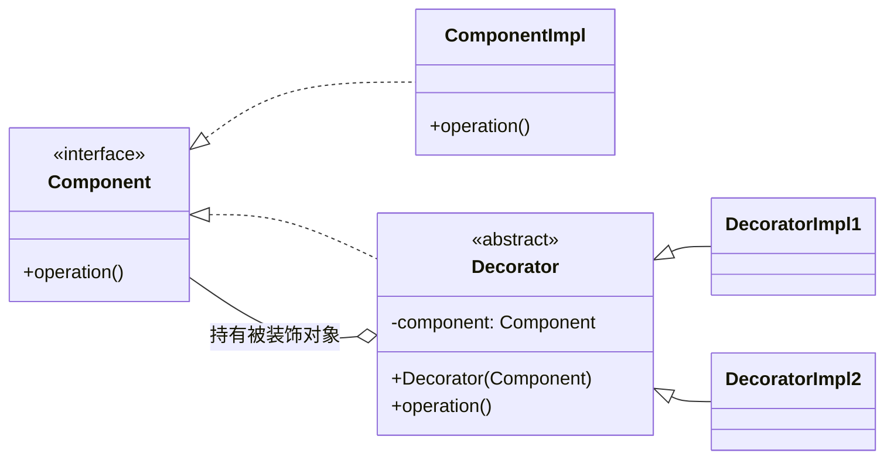
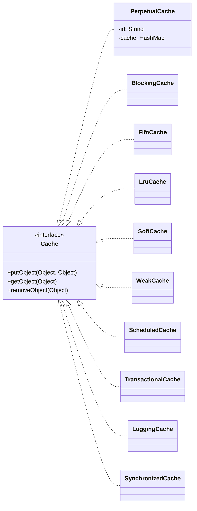

# 缓存机制与插件体系

缓存是优化数据库性能的常用手段之一，我们在实践中经常使用的是 Memcached、Redis 等外部缓存组件，很多持久化框架提供了集成这些外部缓存的功能，同时自身也提供了内存级别的缓存，MyBatis 作为持久化框架中的佼佼者，自然也提供了这些功能。

MyBatis 的缓存分为一级缓存、二级缓存两个级别，并且都实现了 Cache 接口，所以本文就重点来介绍 Cache 接口及其核心实现类，这也是一级缓存和二级缓存依赖的基础实现。

不过在讲解这些内容之前，我先来介绍下装饰器模式，因为 Cache 模块除了提供基础的缓存功能外，还提供了多种扩展功能，而这些功能都是通过装饰器的形式提供的。

## 装饰器模式

我们在做一个产品的时候，需求会以多期的方式执行，随着产品的不断迭代，新需求也会不断出现，我们开始设计一个类的时候，可能并没有考虑到新需求的场景，此时就需要为某些组件添加新的功能来满足这些需求。

如果要符合开放-封闭的原则，我们最好不要直接修改已有的具体实现类，因为会破坏其已有的稳定性，在自测、集成测试以及线上回测的时候，除了要验证新需求外，还要回归测试波及的历史功能，这是让开发人员和测试人员都非常痛苦的地方，也是违反开放-封闭原则带来的最严重的问题之一。

除了修改原有实现之外，还有一种修改方案，那就是**继承，也就是需要创建一个新的子类，然后在子类中覆盖父类的相关方法，并添加实现新需求的扩展**。

但继承在某些场景下是不可行的，例如，要覆盖的方法被 final 关键字修饰了，那么在 Java 的语法中就无法被覆盖。使用继承方案的另一个缺点就是整个继承树的膨胀，例如，当新需求存在多种排列组合或是复杂的判断时，那就需要写非常多的子类实现。

正是由于这些缺点的存在，所以应该尽量多地使用组合方式进行扩展，尽量少使用继承方式进行扩展，除非迫不得已。

**装饰器模式就是一种通过组合方式实现扩展的设计模式**，它可以完美地解决上述功能增强的问题。装饰器的核心思想是为已有实现类创建多个包装类，由这些新增的包装类完成新需求的扩展。

**装饰器模式使用的是组合方式，相较于继承这种静态的扩展方式，装饰器模式可以在运行时根据系统状态，动态决定为一个实现类添加哪些扩展功能。**

装饰器模式的核心类图，如下所示：


从图中可以看到，装饰器模式中的核心类主要有下面四个。

Component 接口：已有的业务接口，是**整个功能的核心抽象**，定义了 Decorator 和 ComponentImpl 这些实现类的核心行为。JDK 中的 IO 流体系就使用了装饰器模式，其中的 InputStream 接口就扮演了 Component 接口的角色。

ComponentImpl 实现类：实现了上面介绍的 Component 接口，其中**实现了 Component 接口最基础、最核心的功能**，也就是被装饰的、原始的基础类。在 JDK IO 流体系之中的 FileInputStream 就扮演了 ComponentImpl 的角色，它实现了读取文件的基本能力，例如，读取单个 byte、读取 byte[] 数组。

Decorator 抽象类：所有装饰器的父类，实现了 Component 接口，**其核心不是提供新的扩展能力，而是封装一个 Component 类型的字段，也就是被装饰的目标对象**。需要注意的是，这个被装饰的对象可以是 ComponentImpl 对象，也可以是 Decorator 实现类的对象，之所以这么设计，就是为了实现下图的装饰器嵌套。这里的 DecoratorImpl1 装饰了 DecoratorImpl2，DecoratorImpl2 装饰了 ComponentImpl，经过了这一系列装饰之后得到的 Component 对象，除了具有 ComponentImpl 的基础能力之外，还拥有了 DecoratorImpl1 和 DecoratorImpl2 的扩展能力。JDK IO 流体系中的 FilterInputStream 就扮演了 Decorator 的角色。



Decorator 与 Component 的引用关系

DecoratorImpl1、DecoratorImpl2：Decorator 的具体实现类，它们的**核心就是在被装饰对象的基础之上添加新的扩展功能**。在 JDK IO 流体系中的 BufferedInputStream 就扮演了 DecoratorImpl 的角色，它在原有的 InputStream 基础上，添加了一个 byte[] 缓冲区，提供了更加高效的读文件操作。

## Cache 接口及核心实现

Cache 接口是 MyBatis 缓存中**最顶层的抽象接口**，位于 org.apache.ibatis.cache 包中，**定义了 MyBatis 缓存最核心、最基础的行为**。

**Cache 接口中的核心方法主要是 putObject()、getObject() 和 removeObject() 三个方法，分别用来写入、查询和删除缓存数据。**

Cache 接口有非常多的实现类（如下图），**其中的 PerpetualCache 扮演了装饰器模式中 ComponentImpl 这个角色**，实现了 Cache 接口缓存数据的基本能力。



Cache 接口实现关系图

PerpetualCache 中有两个核心字段：一个是 id 字段（String 类型），记录了缓存对象的唯一标识；另一个是 cache 字段（HashMap 类型），真正实现 Cache 存储的数据结构，对 Cache 接口的实现也会直接委托给这个 HashMap 对象的相关方法，例如，PerpetualCache 中 putObject() 方法就是调用 cache 的 put() 方法写入缓存数据的。

## Cache 接口装饰器

**除了 PerpetualCache 之外的其他所有 Cache 接口实现类，都是装饰器实现，也就是 DecoratorImpl 的角色**（各自持有一个 delegate 字段指向被装饰的 Cache 对象）。下面逐个分析这些 Cache 接口的装饰器都提供了哪些功能上的扩展。

### 1. BlockingCache

顾名思义，BlockingCache 是**在原有 Cache 实现之上添加了阻塞线程的特性**。

对于一个 Key 来说，同一时刻，BlockingCache 只会让一个业务线程到数据库中去查找，查找到结果之后，会添加到 BlockingCache 中缓存。

作为一个装饰器，BlockingCache 自然会包含一个 Cache 类型的字段，也就是 delegate 字段。除此之外，BlockingCache 还包含了一个 locks 集合（ConcurrentHashMap<Object, CountDownLatch> 类型）和一个 timeout 字段（long 类型），其中 locks 为每个 Key 分配了一个 CountDownLatch 用来控制并发访问，timeout 指定了一个线程在 BlockingCache 上阻塞的最长时间。

在 acquireLock() 方法中，通过 locks 这个 ConcurrentHashMap 集合以及其中各个 Key 关联的 CountDownLatch 对象，实现了锁的效果，具体实现如下：

```
private void acquireLock(Object key) {
    // 初始化一个全新的CountDownLatch对象
    CountDownLatch newLatch = new CountDownLatch(1);
    while (true) {
        // 尝试将key与newLatch这个CountDownLatch对象关联起来
        // 如果没有其他线程并发，则返回的latch为null
        CountDownLatch latch = locks.putIfAbsent(key, newLatch);
        if (latch == null) {
            // 如果当前key未关联CountDownLatch，
            // 则无其他线程并发，当前线程获取锁成功
            break;
        }
        // 当前key已关联CountDownLatch对象，则表示有其他线程并发操作当前key，
        // 当前线程需要阻塞在并发线程留下的CountDownLatch对象(latch)之上，
        // 直至并发线程调用latch.countDown()唤醒该线程
        if (timeout > 0) { // 根据timeout的值，决定阻塞超时时间
            boolean acquired = latch.await(timeout, TimeUnit.MILLISECONDS);
            if (!acquired) { // 超时未获取到锁，则抛出异常
                throw new CacheException("...");
            }
        } else { // 死等
            latch.await();
        }
    }
}

```

在 releaseLock() 方法中，会从 locks 集合中删除 Key 关联的 CountDownLatch 对象，并唤醒阻塞在这个 CountDownLatch 对象上的业务线程。

看到这里，你可能会问：假设业务线程 1、2 并发访问某个 Key，线程 1 查询 delegate 缓存失败，不释放锁，timeout <=0 的时候，线程 2 就会阻塞吗？是的，但是线程 2 不会永久阻塞，因为我们需要保证线程 1 会查询数据库，并调用 putObject() 方法或 removeObject() 方法，其中会通过 releaseLock() 方法释放锁。

最终，我们得到 BlockingCache 的核心原理如下图所示：


BlockingCache 核心原理图

### 2. FifoCache

MyBatis 中的缓存本质上就是 JVM 堆中的一块内存，我们需要严格控制 Cache 的大小，防止 Cache 占用内存过大而影响程序的性能。操作系统有很多缓存淘汰规则，MyBatis 也提供了类似的规则来清理缓存。

这就引出了 FifoCache 装饰器，它是 FIFO（先入先出）策略的装饰器。在系统运行过程中，我们会不断向 Cache 中增加缓存条目，**当 Cache 中的缓存条目达到上限的时候，则会将 Cache 中最早写入的缓存条目清理掉，这也就是先入先出的基本原理**。

FifoCache 作为一个 Cache 装饰器，自然也会包含一个指向 Cache 的字段（也就是 delegate 字段），同时它还维护了两个与 FIFO 相关的字段：一个是 keyList 队列（LinkedList），主要利用 LinkedList 集合有序性，记录缓存条目写入 Cache 的先后顺序；另一个是当前 Cache 的大小上限（size 字段），当 Cache 大小超过该值时，就会从 keyList 集合中查找最早的缓存条目并进行清理。

FifoCache 的 getObject() 方法和 removeObject() 方法实现非常简单，都是直接委托给底层 delegate 这个被装饰的 Cache 对象的同名方法。FifoCache 的关键实现在 putObject() 方法中，在将数据写入被装饰的 Cache 对象之前，FifoCache 会通过 cycleKeyList() 方法执行 FIFO 策略清理缓存，然后才会调用 delegate.putObject() 方法完成数据写入。

### 3. LruCache

除了 FIFO 策略之外，MyBatis 还支持 LRU（Least Recently Used，近期最少使用算法）策略来清理缓存。LruCache 就是使用 LRU 策略清理缓存的装饰器实现，如果 LruCache 发现缓存需要清理，它会**清除最近最少使用的缓存条目**。

LruCache 中除了有一个 delegate 字段指向被装饰 Cache 对象之外，还维护了一个 LinkedHashMap 集合（keyMap 字段），用来记录各个缓存条目最近的使用情况，以及一个 eldestKey 字段（Object 类型），用来指向最近最少使用的 Key。

LinkedHashMap 继承了 HashMap，底层使用数组来存储 KV 数据，数组中存储的是 LinkedHashMap.Entry 类型的元素。在 LinkedHashMap.Entry 中除了存储 KV 数据之外，还维护了 before、after 两个字段分别指向当前 Entry 前后的两个 Entry 节点。在 LinkedHashMap 中维护了 head、tail 两个指针，分别指向了第一个和最后一个 Entry 节点。LinkedHashMap 的原理如下图所示：


LinkedHashMap 原理图

在上图（1）中，通过 Entry 中的 before 和 after 指针形成了一个链表，当我们调用 get() 方法访问 Key 4 时，LinkedHashMap 除了返回 Value 4 之外，还会默默修改 Entry 链表，将 Key 4 项移动到链表的尾部，得到上图（2）中的结构。

LruCache 中的 keyMap 覆盖了 LinkedHashMap 默认的 removeEldestEntry() 方法实现，当 LruCache 中缓存条目达到上限的时候，返回 true，即删除 Entry 链表中 head 指向的 Entry。LruCache 就是依赖 LinkedHashMap 上述的这些特点来确定最久未使用的缓存条目并完成删除的。

下面是 LruCache 初始化过程中，keyMap 对 LinkedHashMap.removeEldestEntry() 方法的覆盖：

```
keyMap = new LinkedHashMap<Object, Object>(size, .75F, true) {
    // 调用LinkedHashMap.put()方法时，会调用removeEldestEntry()方法
    // 决定是否删除head指向的Entry数据
    protected boolean removeEldestEntry(Map.Entry<Object, Object> eldest) {
        boolean tooBig = size() > size;
        if (tooBig) { // 已到达缓存上限，更新eldestKey字段，并返回true，LinkedHashMap会删除该Key
            eldestKey = eldest.getKey();
        }
        return tooBig;
    }
};

```

了解了 LruCache 核心原理之后，我们再来看 getObject()、putObject() 等 Cache 接口方法的实现。

首先是 getObject() 方法，除了委托给底层被装饰的 Cache 对象获取缓存数据之外，还会执行 keyMap.get() 方法更新 Key 在这个 LinkedHashMap 集合中的顺序。

在 putObject() 方法中，除了将 KV 数据写入底层被装饰的 Cache 对象中，还会调用 cycleKeyList() 方法将 KV 数据写入 keyMap 集合中，此时可能会触发 eldestKey 数据的清理，具体实现如下：

```
private void cycleKeyList(Object key) {
    keyMap.put(key, key); // 将KV数据写入keyMap集合
    if (eldestKey != null) {
        // 如果eldestKey不为空，则将从底层Cache中删除
        delegate.removeObject(eldestKey);
        eldestKey = null;
    }
}

```

### 4. SoftCache

看到 SoftCache 这个名字，有一定 Java 经验的同学可能会立刻联想到 Java 中的软引用（Soft Reference），所以这里我们就先来简单回顾一下什么是强引用和软引用，以及这些引用的相关机制。

**强引用是 JVM 中最普遍的引用，我们常用的赋值操作就是强引用**，例如，Person p = new Person();  这条语句会将新创建的 Person 对象赋给 p 这个变量，p 这个变量指向这个 Person 对象的引用，就是强引用。这个 Person 对象被引用的时候，即使是 JVM 内存空间不足触发 GC，甚至是内存溢出（OutOfMemoryError），也不会回收这个 Person 对象。

软引用比强引用稍微弱一些。当 JVM 内存不足时，GC 才会回收那些只被软引用指向的对象，从而避免 OutOfMemoryError。当 GC 将只被软引用指向的对象全部回收之后，内存依然不足时，JVM 才会抛出 OutOfMemoryError。根据软引用的这一特性，我们会发现**软引用特别适合做缓存，因为缓存中的数据可以从数据库中恢复，所以即使因为 JVM 内存不足而被回收掉，也可以通过数据库恢复缓存中的对象**。

在使用软引用的时候，需要注意一点：**当拿到一个软引用的时候，我们需要先判断其 get() 方法返回值是否为 null**。如果为 null，则表示这个软引用指向的对象在之前的某个时刻，已经被 GC 掉了；如果不为 null，则表示这个软引用指向的对象还存活着。

在有的场景中，我们可能需要在一个对象的可达性（是否已经被回收）发生变化时，得到相应的通知，**引用队列（Reference Queue）** 就是用来实现这个需求的。在创建 SoftReference 对象的时候，我们可以为其关联一个引用队列，当这个 SoftReference 指向的对象被回收的时候，JVM 就会将这个 SoftReference 作为通知，添加到与其关联的引用队列，之后我们就可以从引用队列中，获取这些通知信息，也就是 SoftReference 对象。

正式开始介绍 SoftCache。SoftCache 中的 value 是 SoftEntry 类型的对象，这里的 SoftEntry 是 SoftCache 的内部类，继承了 SoftReference，**其中指向 key 的引用是强引用，指向 value 的引用是软引用**，具体实现如下：

```
private static class SoftEntry extends SoftReference<Object> {
    private final Object key;
    SoftEntry(Object key, Object value, ReferenceQueue<Object> garbageCollectionQueue) {
        // 指向value的是软引用，并且关联了引用队列
        super(value, garbageCollectionQueue);
        // 指向key的是强引用
        this.key = key;
    }
}

```

了解了 SoftCache 存储的对象类型之后，再来看它的核心字段。

delegate（Cache 类型）：SoftCache 装饰的底层 Cache 对象。

queueOfGarbageCollectedEntries（ReferenceQueue<Object> 类型）：该引用队列会与每个 SoftEntry 对象关联，用于记录已经被回收的缓存条目，即 SoftEntry 对象，SoftEntry 又通过 key 这个强引用指向缓存的 Key 值，这样我们就可以知道哪个 Key 被回收了。

hardLinksToAvoidGarbageCollection（LinkedList<Object>类型）：在 SoftCache 中，最近经常使用的一部分缓存条目（也就是热点数据）会被添加到这个集合中，正如其名称的含义，该集合会使用强引用指向其中的每个缓存 Value，防止它被 GC 回收。

numberOfHardLinks（int 类型）：指定了强引用的个数，默认值是 256，也就是最近访问的 256 个 Value 无法直接被 GC 回收。

了解了核心字段的含义之后，我们再来看 SoftCache 对 Cache 接口中核心方法的实现。

首先是 putObject() 方法，它除了将 KV 数据放入底层被装饰的 Cache 对象中保存之外，还会调用 removeGarbageCollectedItems() 方法，根据 queueOfGarbageCollectedEntries 集合，清理已被 GC 回收的缓存条目，具体实现如下：

```
private void removeGarbageCollectedItems() {
    SoftEntry sv;
    // 遍历queueOfGarbageCollectedEntries集合，其中记录了被GC回收的Key
    while ((sv = (SoftEntry) queueOfGarbageCollectedEntries.poll()) != null) {
        delegate.removeObject(sv.key); // 清理被回收的Key
    }
}

```

看 getObject() 方法，在查询缓存的同时，如果发现 Value 已被 GC 回收，则同步进行清理；如果查询到缓存的 Value 值，则会同步调整 hardLinksToAvoidGarbageCollection 集合的顺序，具体实现如下：

```
public Object getObject(Object key) {
    Object result = null;
    // 从底层被装饰的缓存中查找数据
    SoftReference<Object> softReference = (SoftReference<Object>) delegate.getObject(key);
    if (softReference != null) {
        result = softReference.get();
        if (result == null) {
            // Value为null，则已被GC回收，直接从缓存删除该Key
            delegate.removeObject(key);
        } else { // 未被GC回收
            // 将Value添加到hardLinksToAvoidGarbageCollection集合中，防止被GC回收
            synchronized (hardLinksToAvoidGarbageCollection) {
                hardLinksToAvoidGarbageCollection.addFirst(result);
                // 检查hardLinksToAvoidGarbageCollection长度，超过上限，则清理最早添加的Value
                if (hardLinksToAvoidGarbageCollection.size() > numberOfHardLinks) {
                    hardLinksToAvoidGarbageCollection.removeLast();
                }
            }
        }
    }
    return result;
}

```

最后来看 removeObject() 和 clear() 这两个清理方法，它们除了清理被装饰的 Cache 对象之外，还会清理 hardLinksToAvoidGarbageCollection 集合，具体实现比较简单，这里就不再展示，你若感兴趣的话可以参考源码进行学习。

### 5. WeakCache

WeakCache 涉及 Java 的弱引用概念，所以这里先回顾一下弱引用（WeakReference）的一些特性。

**弱引用比软引用的引用强度还要弱**。弱引用可以引用一个对象，但无法阻止这个对象被 GC 回收，也就是说，在 JVM 进行垃圾回收的时候，若发现某个对象只有一个弱引用指向它，那么这个对象会被 GC 立刻回收。

从这个特性我们可以得到一个结论：**只被弱引用指向的对象只在两次 GC 之间存活**。而只被软引用指向的对象是在 JVM 内存紧张的时候才被回收，它是可以经历多次 GC 的，这就是两者最大的区别。在 WeakReference 指向的对象被回收时，也会将 WeakReference 对象添加到关联的队列中。

JDK 提供了一个基于弱引用实现的 HashMap 集合—— WeakHashMap，其中的 Entry 继承了 WeakReference，Entry 中使用弱引用指向 Key，使用强引用指向 Value。当没有强引用指向 Key 的时候，Key 可以被 GC 回收。当再次操作 WeakHashMap 的时候，就会遍历关联的引用队列，从 WeakHashMap 中清理掉相应的 Entry。

回到 WeakCache，它的实现与 SoftCache 十分类似，两者的唯一区别在于：WeakCache 中存储的是 WeakEntry 对象，它继承了 WeakReference，通过 WeakReference 指向 Value 对象。具体的实现与 SoftCache 基本相同，这里就不再展示，你若感兴趣的话可以参考源码进行学习。

至于剩下的 Cache 装饰器，理解起来就比较简单了，这里我就不赘述了，如有需要你同样可以参考源码来理解和学习。

插件是应用程序中最常见的一种扩展方式，比如，在Chrome 浏览器上我们可以安装各种插件来增强浏览器自身的功能。在 Java 世界中，很多开源框架也使用了插件扩展方式，例如，Dubbo 通过 SPI 方式实现了插件化的效果，SkyWalking 依赖“微内核+插件”的架构轻松加载插件，实现扩展效果。

MyBatis 作为持久层框架中的佼佼者，也提供了类似的插件扩展机制。MyBatis 将插件单独分离出一个模块，位于 org.apache.ibatis.plugin 包中，在该模块中主要使用了两种设计模式：**代理模式**和**责任链模式**。

插件模块使用的代理模式是通过 JDK 动态代理实现的，代理模式的基础知识以及 JDK 动态代理的核心原理我们已经在前面[日志适配、数据源与事务](04-日志适配与数据源事务.md)中介绍过了。下面重点来看一下责任链模式的基础知识。

## 责任链模式

我们在写业务系统的时候，最常用的协议就是 HTTP 协议，最常用的 HTTP Server 是 Tomcat，所以这里我们就结合 Tomcat 处理 HTTP 请求的场景来说明责任链模式的核心思想。

HTTP 协议可简单分为请求头和请求体两部分，Tomcat 在收到一条完整的 HTTP 请求时，也会将其分为请求头和请求体两部分进行处理的。不过在真正的 Tomcat 实现中，会将 HTTP 请求细分为更多部分，然后逐步进行处理，整个 Tomcat 代码处理 HTTP 请求的实现也更为复杂。

试想一下，Tomcat 将处理请求的各个细节的实现代码都堆到一个类中，那这个类的代码会非常长，维护起来也非常痛苦，是“牵一发而动全身”。如果 HTTP 请求升级，那就需要修改这个臃肿的类，显然是不符合“开放-封闭”原则的。

为了实现像 HTTP 这种多部分构成的协议的处理逻辑，我们可以使用责任链模式来划分协议中各个部分的处理逻辑，将那些臃肿实现类**拆分成多个 Handler（或 Interceptor）处理器，在每个 Handler（或 Interceptor）处理器中只专注于 HTTP 协议中一部分数据的处理**。我们可以开发多个 Handler 处理器，然后按照业务需求将多个 Handler 对象组合成一个链条，从而实现整个 HTTP 请求的处理。

这样做既可以将复杂、臃肿的逻辑拆分，便于维护，又能将不同的 Handler 处理器分配给不同的程序员开发，提高开发效率。

**在责任链模式中，Handler 处理器会持有对下一个 Handler 处理器的引用**，也就是说当一个 Handler 处理器完成对关注部分的处理之后，会将请求通过这个引用传递给下一个 Handler 处理器，如此往复，直到整个责任链中全部的 Handler 处理器完成处理。责任链模式的核心类图如下所示：


再从复用的角度看一下责任链模式带来的好处。

假设我们自定义了一套协议，其请求中包含 A、B、C 三个核心部分，业务系统使用 Handler A、Handler B、Handler C 三个处理器来处理这三部分的数据。如果业务变化导致我们的自定义协议也发生了变化，协议中的数据变成了 A、C、D 这三部分，那么我们只需要动态调整构成责任链的 Handler 处理器即可，最新的责任链变为 Handler A、Handler C、Handler D。如下图所示：


由此可见，**责任链模式可以帮助我们复用 Handler 处理器的实现逻辑，提高系统的可维护性和灵活性**，很好地符合了“开放-封闭”原则。

## Interceptor

介绍完责任链模式的基础知识之后，我们接着就来讲解MyBatis 中插件的相关内容。

**MyBatis 插件模块中最核心的接口就是 Interceptor 接口，它是所有 MyBatis 插件必须要实现的接口**，其核心定义如下：

```
public interface Interceptor {
  // 插件实现类中需要实现的拦截逻辑
  Object intercept(Invocation invocation) throws Throwable;
  // 在该方法中会决定是否触发intercept()方法
  default Object plugin(Object target) {
    return Plugin.wrap(target, this);
  }
  default void setProperties(Properties properties) {
    // 在整个MyBatis初始化过程中用来初始化该插件的方法
  }
}

```

MyBatis允许我们自定义 Interceptor 拦截 SQL 语句执行过程中的某些关键逻辑，允许拦截的方法有：Executor 类中的 update()、query()、flushStatements()、commit()、rollback()、getTransaction()、close()、isClosed()方法，ParameterHandler 中的 setParameters()、getParameterObject() 方法，ResultSetHandler中的 handleOutputParameters()、handleResultSets()方法，以及StatementHandler 中的parameterize()、prepare()、batch()、update()、query()方法。

通过前面内容的介绍我们知道，上述方法都是 MyBatis 执行 SQL 语句的核心组件，所以在使用自定义 Interceptor 拦截这些方法之前，我们需要非常了解 MyBatis 的核心原理以及 Interceptor 的拦截行为。

下面结合一个 MyBatis 插件示例，介绍一下 MyBatis 中 Interceptor 接口的具体使用方式。这里我们首先定义一个DemoPlugin 类，定义如下：

```
@Intercepts({
        @Signature(type = Executor.class, method = "query", args = {
                MappedStatement.class, Object.class, RowBounds.class,
                ResultHandler.class}),
        @Signature(type = Executor.class, method = "close", args = {boolean.class})
})
public class DemoPlugin implements Interceptor {
    private int logLevel;
    ... // 省略其他方法的实现
}

```

我们看到 DemoPlugin 这个示例类除了实现 Interceptor 接口外，还被标注了 @Intercepts 和 @Signature 两个注解。@Intercepts 注解中可以配置多个 @Signature 注解，**@Signature 注解用来指定 DemoPlugin 插件实现类要拦截的目标方法信息**，其中的 type 属性指定了要拦截的类，method 属性指定了要拦截的目标方法名称，args 属性指定了要拦截的目标方法的参数列表。通过 @Signature 注解中的这三个配置，DemoPlugin 就可以确定要拦截的目标方法的方法签名。在上面的示例中，DemoPlugin 会拦截 Executor 接口中的 query(MappedStatement, Object, RowBounds, ResultHandler) 方法和 close(boolean) 方法。

完成 DemoPlugin 实现类的编写之后，为了让 MyBatis 知道这个类的存在，我们要在 mybatis-config.xml 全局配置文件中对 DemoPlugin 进行配置，相关配置片段如下：

```
<plugins>
    <plugin interceptor="design.Interceptor.DemoPlugin">
        <!-- 对拦截器中的属性进行初始化 -->
        <property name="logLevel" value="1"/>
    </plugin>
</plugins>

```

通过前面[初始化与配置解析](06-初始化与配置解析.md)对初始化流程的介绍我们知道，MyBatis 会在初始化流程中解析 mybatis-config.xml 全局配置文件，其中的 <plugin> 节点就会被处理成相应的 Interceptor 对象，同时调用 setProperties() 方法完成配置的初始化，最后MyBatis 会将 Interceptor 对象添加到Configuration.interceptorChain 这个全局的 Interceptor 列表中保存。

介绍完 Interceptor 的加载和初始化原理之后，我们再来看 Interceptor 是如何拦截目标类中的目标方法的。前面已经介绍过，MyBatis 中 Executor、ParameterHandler、ResultSetHandler、StatementHandler 等与 SQL 执行相关的核心组件都是通过 Configuration.new*() 方法生成的。以 newExecutor() 方法为例，我们会看到下面这行代码，InterceptorChain.pluginAll() 方法会为目标对象（也就是这里的 Executor 对象）创建代理对象并返回。

```
executor = (Executor) interceptorChain.pluginAll(executor);

```

从名字就可以看出，**InterceptorChain 是 Interceptor 构成的责任链**，在其 interceptors 字段（ArrayList<Interceptor>类型）中维护了 MyBatis 初始化过程中加载到的全部 Interceptor 对象，在其 pluginAll() 方法中，会调用每个 Interceptor 的 plugin() 方法创建目标类的代理对象，核心实现如下：

```
public Object pluginAll(Object target) {
  for (Interceptor interceptor : interceptors) {
    // 遍历interceptors集合，调用每个Interceptor对象的plugin()方法
    target = interceptor.plugin(target);
  }
  return target;
}

```

## Plugin

了解了 Interceptor 的加载流程和基本工作原理之后，我们再来介绍一下自定义 Interceptor 的实现。我们首先回到 DemoPlugin 这个示例，关注其中 plugin() 方法的实现：

```
@Override
public Object plugin(Object target) {
    // 依赖Plugin工具类创建代理对象
    return Plugin.wrap(target, this);
}

```

从 DemoPlugin 示例中，我们**可以看到 plugin() 方法依赖 MyBatis 提供的 Plugin.wrap() 工具方法创建代理对象，这也是我们推荐的实现方式**。

MyBatis 提供的 Plugin 工具类实现了 JDK 动态代理中的 InvocationHandler 接口，同时维护了下面三个关键字段。

target（Object 类型）：要拦截的目标对象。

signatureMap（Map<Class<?>, Set<Method>> 类型）：记录了 @Signature 注解中配置的方法信息，也就是代理要拦截的目标方法信息。

interceptor（Interceptor 类型）：目标方法被拦截后，要执行的逻辑就写在了该 Interceptor 对象的 intercept() 方法中。

既然 Plugin 实现了 InvocationHandler 接口，我们自然需要关注其 invoke() 方法实现。在 invoke() 方法中，Plugin 会检查当前要执行的方法是否在 signatureMap 集合中，如果在其中的话，表示当前待执行的方法是我们要拦截的目标方法之一，也就会调用 intercept() 方法执行代理逻辑；如果未在其中的话，则表示当前方法不应被代理，直接执行当前的方法即可。下面就是 Plugin.invoke() 方法的核心实现：

```
public Object invoke(Object proxy, Method method, Object[] args) throws Throwable {
    try {
        // 获取当前待执行方法所属的类
        Set<Method> methods = signatureMap.get(method.getDeclaringClass());
        // 如果当前方法需要被代理，则执行intercept()方法进行拦截处理
        if (methods != null && methods.contains(method)) {
            return interceptor.intercept(new Invocation(target, method, args));
        }
        // 如果当前方法不需要被代理，则调用target对象的相应方法
        return method.invoke(target, args);
    } catch (Exception e) {
        throw ExceptionUtil.unwrapThrowable(e);
    }
}

```

这里传入 Interceptor.intercept() 方法的是一个 Invocation 对象，其中封装了目标对象、目标方法以及目标方法的相关参数，在插件实现类的 intercept() 方法实现中，就是通过调用 Invocation.proceed() 方法完成目标方法的执行。当然，我们自定义的 Interceptor 实现并不一定必须调用目标方法。这样，经过插件的拦截之后，也就改变了 MyBatis 核心组件的行为。

最后，我们来看一下 Plugin 工具类对外提供的 wrap() 方法是如何创建 JDK 动态代理的。在 wrap() 方法中，Plugin 工具类会解析传入的 Interceptor 实现的 @Signature 注解信息，并与当前传入的目标对象类型进行匹配，**只有在匹配的情况下，才会生成代理对象，否则直接返回目标对象**。具体的代码实现以及注释说明如下所示：

```
public static Object wrap(Object target, Interceptor interceptor) {
    // 获取自定义Interceptor实现类上的@Signature注解信息，
    // 这里的getSignatureMap()方法会解析@Signature注解，得到要拦截的类以及要拦截的方法集合
    Map<Class<?>, Set<Method>> signatureMap = getSignatureMap(interceptor);
    Class<?> type = target.getClass();
    // 检查当前传入的target对象是否为@Signature注解要拦截的类型，如果是的话，就
    // 使用JDK动态代理的方式创建代理对象
    Class<?>[] interfaces = getAllInterfaces(type, signatureMap);
    if (interfaces.length > 0) {
        // 创建JDK动态代理
        return Proxy.newProxyInstance(
                type.getClassLoader(),
                interfaces,
                // 这里使用的InvocationHandler就是Plugin本身
                new Plugin(target, interceptor, signatureMap));
    }
    return target;
}

```

## 版本差异(旧版 → MyBatis 3.5.x)

| 特性 | 旧版（MyBatis 3.x 早期） | MyBatis 3.5.x |
|------|--------------------------|---------------|
| 一级缓存 | SqlSession 级别，默认开启 | 机制不变，作用域/生命周期规则保持稳定 |
| 二级缓存 | namespace 级别，默认关闭，装饰器链扩展 | 机制不变；3.5.x 持续建议生产环境改用外部缓存（Redis 等） |
| 插件体系 | @Intercepts/@Signature 注解 + Plugin.wrap() JDK 动态代理 | 核心机制完全兼容，无破坏性变更 |
| 构造器自动映射 | 支持 <constructor> 标签 | 3.5.10+ 新增 argNameBasedConstructorAutoMapping（更好支持 record） |
| 虚拟线程兼容 | 无 | 阻塞式实现可直接运行于 Java 21 虚拟线程环境 |
| 运行时要求 | JDK 8+ | 3.5.x 仍支持 JDK 8+，但推荐 JDK 17/21 |

> 缓存与插件是 MyBatis 最稳定的扩展点之一，本文介绍的 Cache 装饰器链（SynchronizedCache、LoggingCache、LruCache、FifoCache 等）与 Interceptor 责任链机制在 3.5.x 中保持完全兼容，无需修改任何自定义插件代码即可平滑升级。
