# Spring 框架深度解析

## 一、Spring 框架概述

### 1.1 什么是 Spring

Spring 是一个支持快速开发 Java EE 应用程序的轻量级框架。它提供一系列底层容器和基础设施，并可以和大量常用的开源框架无缝集成，可以说是开发 Java EE 应用程序的必备。

Spring 的核心思想是 **简化企业级开发**，通过 IoC（控制反转，Inversion of Control）和 AOP（面向切面编程，Aspect-Oriented Programming）两大核心特性，解决了传统 Java EE 开发中的复杂性问题。

**Spring 的核心价值**：

- **降低耦合度**：通过 IoC 容器管理依赖，对象间解耦
- **提高开发效率**：提供大量模板类和工具类
- **统一编程模型**：对不同技术提供一致的抽象
- **增强可测试性**：依赖注入使单元测试更容易
- **简化企业级开发**：声明式事务、AOP 等减少样板代码

### 1.2 Spring 的诞生背景

Spring 最早是由 Rod Johnson 在他的《[Expert One-on-One J2EE Development without EJB](https://book.douban.com/subject/1426848/)》一书中提出的用来取代 EJB 的轻量级框架。当时的 J2EE 开发存在诸多问题：

- **EJB 过于复杂**：EJB 2.x 的开发需要大量冗余代码和配置，开发效率低下
- **测试困难**：EJB 组件严重依赖容器，单元测试几乎不可能
- **部署繁琐**：需要重型应用服务器，开发周期长
- **学习曲线陡峭**：开发者需要掌握大量 J2EE 规范

Rod Johnson 提出了一个革命性的观点：**大多数企业应用并不需要 EJB 提供的分布式能力**，应该用更简单的 POJO（Plain Old Java Object，普通 Java 对象）来构建应用。这个理念催生了 Spring 框架。

**Spring 与 EJB 的对比**：

| 特性 | EJB 2.x | Spring |
|-----|---------|--------|
| 组件模型 | 必须实现 EJB 接口 | 普通 POJO |
| 依赖管理 | JNDI 查找 | 依赖注入 |
| 测试 | 需要容器支持 | 可直接单元测试 |
| 配置 | 复杂的 XML 配置 | 注解或简洁配置 |
| 部署 | 需要应用服务器 | 可独立运行 |

### 1.3 Spring 的设计理念

Spring 框架的设计遵循以下核心原则：

#### 1.3.1 轻量级与最小侵入性

Spring 不会强迫应用代码依赖 Spring 的 API，应用中的类可以保持为简单的 POJO：

```java
// 这是一个标准的 POJO，没有任何 Spring 依赖
public class UserService {
    private UserRepository userRepository;

    public User findById(Long id) {
        return userRepository.findById(id);
    }

    // getter and setter
    public void setUserRepository(UserRepository userRepository) {
        this.userRepository = userRepository;
    }
}
```

**最小侵入性的好处**：
- 业务代码不依赖框架，易于迁移
- 可以脱离容器进行单元测试
- 代码更清晰，职责单一

#### 1.3.2 控制反转（IoC）

**传统方式的依赖管理**：

```java
// 传统方式：对象自己创建和管理依赖
public class OrderService {
    private OrderRepository orderRepository;
    private PaymentService paymentService;

    public OrderService() {
        // 硬编码依赖关系，难以测试和修改
        this.orderRepository = new OrderRepositoryImpl();
        this.paymentService = new AlipayService();
    }
}
```

**问题分析**：
1. **紧耦合**：OrderService 直接依赖具体实现类
2. **难以测试**：无法替换为 Mock 对象
3. **违反开闭原则**：修改实现需要改动代码
4. **职责混乱**：既要处理业务逻辑又要管理依赖

**Spring 方式的依赖管理**：

```java
// Spring 方式：依赖由容器注入
@Component
public class OrderService {
    private final OrderRepository orderRepository;
    private final PaymentService paymentService;

    // 通过构造器注入，Spring 容器负责创建和注入依赖
    public OrderService(
            OrderRepository orderRepository,
            PaymentService paymentService) {
        this.orderRepository = orderRepository;
        this.paymentService = paymentService;
    }
}
```

::: tip IoC 的核心
控制反转的核心是"谁来创建和管理对象"。传统方式中对象自己创建依赖，IoC 模式中由容器统一管理。详细内容见 [IoC 容器](01-IoC容器.md)。
:::

#### 1.3.3 面向切面编程（AOP）

将业务逻辑与系统服务分离，如日志、事务、安全等：

```java
// 业务逻辑纯粹，不混杂系统服务
@Service
public class AccountService {

    @Transactional  // 事务管理通过 AOP 实现
    @Loggable       // 日志记录通过 AOP 实现
    @PreAuthorize("hasRole('ADMIN')")  // 权限检查通过 AOP 实现
    public void transferMoney(Long fromId, Long toId, BigDecimal amount) {
        Account from = accountRepository.findById(fromId);
        Account to = accountRepository.findById(toId);

        from.debit(amount);
        to.credit(amount);

        accountRepository.save(from);
        accountRepository.save(to);
    }
}
```

::: tip AOP 的边界
AOP 适合处理与业务主流程无强耦合的横切关注点，不适合将复杂业务流程本身塞进切面。详细内容见 [AOP](02-AOP.md)。
:::

#### 1.3.4 框架整合能力

Spring 提供了对主流框架的无缝集成：

| 技术领域 | 支持的框架/技术 |
|---------|---------------|
| ORM 框架 | Hibernate、MyBatis、JPA、JDO |
| Web 框架 | Struts、JSF、Vaadin |
| 模板引擎 | Thymeleaf、FreeMarker、Velocity |
| 任务调度 | Quartz、Timer |
| 消息队列 | ActiveMQ、RabbitMQ、Kafka |
| 缓存 | EhCache、Redis、Hazelcast |

### 1.4 Spring 的历史演进

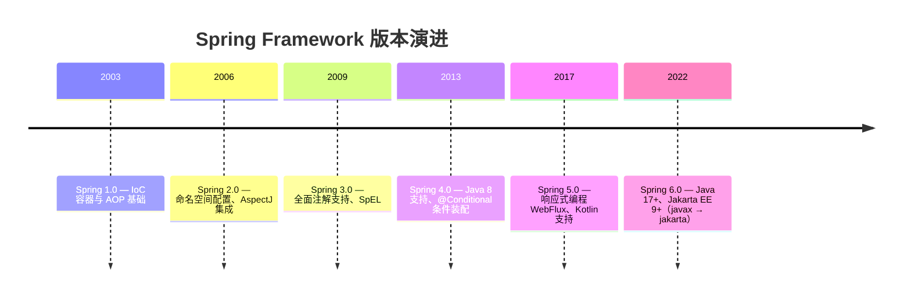

**版本演进的关键特性**：

| 版本 | 关键特性 | Java 版本要求 |
|------|---------|-------------|
| Spring 1.x | 奠定 IoC 和 AOP 基础 | Java 1.3+ |
| Spring 2.x | 简化 XML 配置，引入命名空间 | Java 1.4+ |
| Spring 3.x | 全面拥抱注解，SpEL 表达式 | Java 5+ |
| Spring 4.x | Java 8 支持，条件装配 | Java 6+ |
| Spring 5.x | 响应式编程，Kotlin 支持 | Java 8+ |
| Spring 6.x | Jakarta EE，虚拟线程支持 | Java 17+ |

### 1.5 Spring 技术栈架构

Spring 框架采用分层架构，包含约 20 个模块：

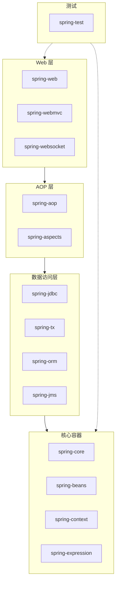

**核心模块说明**：

- **Core Container**：核心容器，包含 Beans、Core、Context、Expression Language 模块
  - `spring-core`：核心工具类
  - `spring-beans`：Bean 相关的类，包括依赖注入
  - `spring-context`：应用上下文，提供国际化、事件传播等
  - `spring-expression`：SpEL 表达式语言

- **AOP & Aspects**：面向切面编程支持
  - `spring-aop`：AOP 核心实现
  - `spring-aspects`：AspectJ 集成

- **Data Access**：数据访问层，包含 JDBC、ORM、事务管理等
  - `spring-jdbc`：JDBC 抽象层
  - `spring-tx`：事务管理
  - `spring-orm`：ORM 框架集成
  - `spring-jms`：JMS 支持

- **Web**：Web 层，包含 Spring MVC、WebSocket 等
  - `spring-web`：Web 集成支持
  - `spring-webmvc`：Spring MVC
  - `spring-websocket`：WebSocket 支持

- **Test**：测试支持模块
  - `spring-test`：测试框架集成

---

## 二、Spring 家族主要成员

Spring 生态非常大，通常说的"Spring 家族"是指围绕 Spring Framework 构建的一系列项目，它们覆盖了从应用快速启动、数据访问，到安全、分布式与集成等常见问题。

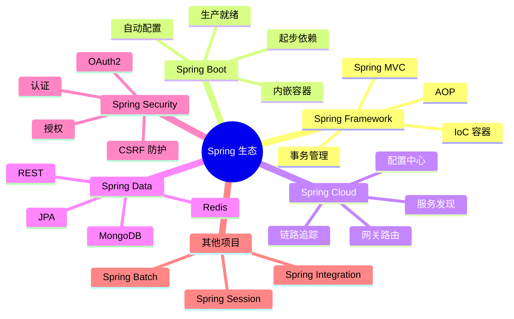

### 2.1 Spring Framework

[Spring Framework](https://spring.io/projects/spring-framework) 为现代 Java 企业应用提供一整套完整的开发与配置模型。Spring Framework 除了核心的依赖注入、AOP、资源管理等特性，还有完善的数据访问能力，在事务管理、ORM 框架支持等方面都有不错的表现。在 Web 开发方面，Spring MVC 早已取代了 Struts，成为 Java Web 的主流框架；Spring Framework 5 推出的响应式 Web 框架 Spring WebFlux 也逐步崭露头角。除此之外，Spring Framework 中还有很多非常实用的功能，例如调度任务支持、缓存抽象等。

|               | Spring 5.x       | Spring 6.x         |
| ------------- | ---------------- | ------------------ |
| JDK 版本      | >= 1.8           | >= 17              |
| Tomcat 版本   | 9.x              | 10.x               |
| Annotation 包 | javax.annotation | jakarta.annotation |
| Servlet 包    | javax.servlet    | jakarta.servlet    |
| JMS 包        | javax.jms        | jakarta.jms        |
| JavaMail 包   | javax.mail       | jakarta.mail       |

**版本选择建议**：
- **新项目**：优先选择 Spring 6.x（需 Java 17+）
- **遗留系统**：可继续使用 Spring 5.x（支持 Java 8）
- **生产环境**：建议使用稳定的 GA 版本，避免 SNAPSHOT 版本

### 2.2 Spring Boot

[Spring Boot](https://spring.io/projects/spring-boot) 降低开发生产级 Spring 应用的门槛。只需轻松几步就能构建可以投产的应用，其中包含健康检查、监控、度量指标、外化配置等生产所需的功能。Spring Boot 提供的 **起步依赖**（Starter Dependency）解决了 Spring 应用的依赖管理困境——按功能组织依赖。并且提供的依赖经过严格的兼容性测试。

Spring Boot 的 **自动配置** 功能减少了 Spring 应用的配置量，甚至可以做到零配置。Spring Boot 可以根据多种条件自动判断是否需要做相应的配置，开发者也可以自行进行微调。

> Spring 团队曾开发过名为 Spring Roo 的项目，其目的就是帮助开发者生成所需的代码和配置。如果一段配置可以生成，那为什么还要让开发者来配置呢？这就是 Spring Boot 自动配置功能背后的哲学。

**Spring Boot 的核心特性**：

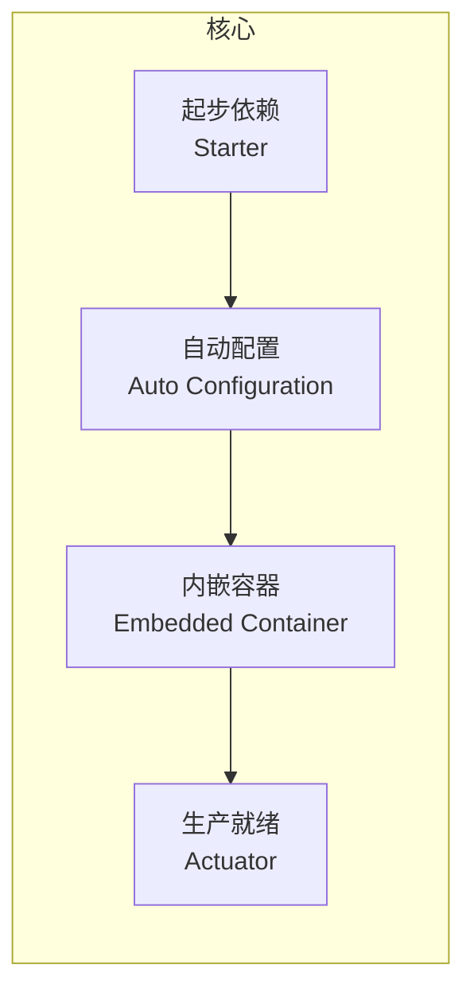

1. **起步依赖**：按功能组织依赖，避免版本冲突
2. **自动配置**：根据类路径自动配置 Spring 应用
3. **内嵌容器**：内嵌 Tomcat、Jetty 等，无需部署 WAR 文件
4. **生产就绪**：提供健康检查、指标监控等功能
5. **无代码生成**：无需生成代码，也无需 XML 配置

### 2.3 Spring Cloud

[Spring Cloud](https://spring.io/projects/spring-cloud) 用简单的代码就可以实现高可靠的分布式系统。Spring Cloud 构建在 Spring Boot 提供的各种功能之上，例如用到起步依赖与自动配置。

Spring Cloud 并不是一个模块，而是一系列模块的集合，它们分别实现了服务发现、配置管理、服务路由、服务熔断、链路追踪等具体的功能。

| 项目名                 | 功能                                                                                                           |
| :--------------------- | :------------------------------------------------------------------------------------------------------------- |
| Spring Cloud Bus       | 提供基于分布式消息的事件总线，可以方便地在集群中传播状态变更                                                   |
| Spring Cloud Config    | 提供基于 Git 仓库的集中式配置中心                                                                              |
| Spring Cloud Consul    | 基于 Hashicorp Consul 实现服务发现与服务配置能力                                                               |
| Spring Cloud Data Flow | 提供一套完整的云原生服务编排功能，包含简单易用的 DSL、拖曳式的 GUI 和 REST-API，支持海量数据的批处理和流式处理 |
| Spring Cloud Gateway   | 提供基于 Project Reactor 的智能服务路由的能力                                                                  |
| Spring Cloud Netflix   | 整合大量 Netflix 的开源设施，比如 Eureka、Hystrix、Zuul 等                                                     |
| Spring Cloud OpenFeign | 基于 OpenFeign，通过声明式 REST 客户端来访问分布式系统中的服务                                                 |
| Spring Cloud Sleuth    | 提供分布式服务请求链路分析的能力                                                                               |
| Spring Cloud Stream    | 提供轻量级的事件驱动能力，通过声明式的方式来使用 Apache Kafka 或者 RabbitMQ 收发消息                           |
| Spring Cloud Zookeeper | 基于 Apache Zookeeper 实现服务发现与服务配置能力                                                               |

**Spring Cloud 版本对应关系**：

| Spring Cloud | Spring Boot |
|-------------|-------------|
| 2022.x (Kilburn) | 3.0.x |
| 2021.x (Jubilee) | 2.6.x - 2.7.x |
| 2020.x (Ilford) | 2.4.x - 2.5.x |
| Hoxton | 2.2.x - 2.3.x |

### 2.4 Spring Data

[Spring Data](https://spring.io/projects/spring-data) 包含很多子模块，囊括了 JDBC 增强功能、JPA 支持、不同类型的 NoSQL 支持以及对 REST 资源的支持。虽然底层的数据库种类繁多，但 Spring Data 还是在此之上提供了诸如仓库（Repository）和模板（Template）这样的统一抽象。

```java
// Repository 接口 - 统一的数据访问抽象
public interface UserRepository extends Repository<User, Long> {
    User findById(Long id);
    List<User> findByLastName(String lastName);
    List<User> findByAgeGreaterThan(Integer age);
}
```

### 2.5 Spring Security

[Spring Security](https://spring.io/projects/spring-security) 用来解决认证与授权问题，即"谁、能做什么"，同时也提供常见 Web 安全能力：

- 支持多种登录方式（表单登录、HTTP Basic、记住我等）
- 提供 URL 级权限控制（例如 `/admin/**` 仅允许管理员访问）
- 提供方法级权限控制（如 `@PreAuthorize("hasRole('ADMIN')")` 等）
- 内置 CSRF 防护、会话管理能力，减少常见 Web 漏洞风险
- 能与 OAuth2 / OpenID Connect 集成，支持第三方登录、单点登录（SSO）

### 2.6 Spring Batch

[Spring Batch](https://spring.io/projects/spring-batch) 是用来做批处理任务的框架，专门解决大批量、离线、定时任务等场景：

- 定义 Job、Step、Chunk、Reader/Processor/Writer 等批处理模型
- 支持大数据量分块处理（chunk），可流式读写数据库或文件
- 完善的重试、跳过（skip）、失败恢复、断点续跑机制
- 提供任务执行历史和统计信息，便于监控与追踪

### 2.7 Spring Integration

[Spring Integration](https://spring.io/projects/spring-integration) 面向企业应用集成（EAI）场景，用"消息 + 通道"的方式在多个系统之间解耦通信：

- 支持消息通道、消息路由器、过滤器、转换器、聚合器等模式
- 适配多种中间件与协议（MQ、HTTP、TCP/UDP、JMS、Mail、FTP 等）

### 2.8 Spring Session

[Spring Session](https://spring.io/projects/spring-session) 将原本由 Servlet 容器维护的 HTTP Session 抽象并外置到统一存储（如 Redis），从而为分布式应用提供一致的会话管理能力：

- 将 `HttpSession` 存储在 Redis、数据库等外部介质，实现多实例之间的会话共享
- 提供统一的会话过期策略与并发会话控制能力
- 可以与 Spring Security 协同工作

---

## 三、IoC 容器原理概述

::: info 深入阅读
本节是 IoC 容器的概述。完整的 IoC 原理、Bean 定义、注册方式、容器启动流程等内容，请阅读 [IoC 容器](01-IoC容器.md)。
:::

### 3.1 什么是 IoC（控制反转）

**IoC（Inversion of Control，控制反转）** 是一种设计思想，而不是具体的技术实现。它的核心是将对象的创建和依赖关系的管理交给容器来处理，而不是由对象自己来管理。

**控制反转了什么？**

- **创建对象的控制权**：从对象本身转移到容器
- **依赖关系的控制权**：从调用者转移到容器
- **对象生命周期的控制权**：从对象本身转移到容器

**IoC 与 DI 的关系**：

- **IoC 是目标**：实现对象间解耦
- **DI 是手段**：通过注入依赖实现 IoC
- **关系**：IoC 容器通过依赖注入将依赖关系从硬编码变为容器管理

### 3.2 Spring IoC 容器架构

Spring 提供了两种主要的 IoC 容器实现：

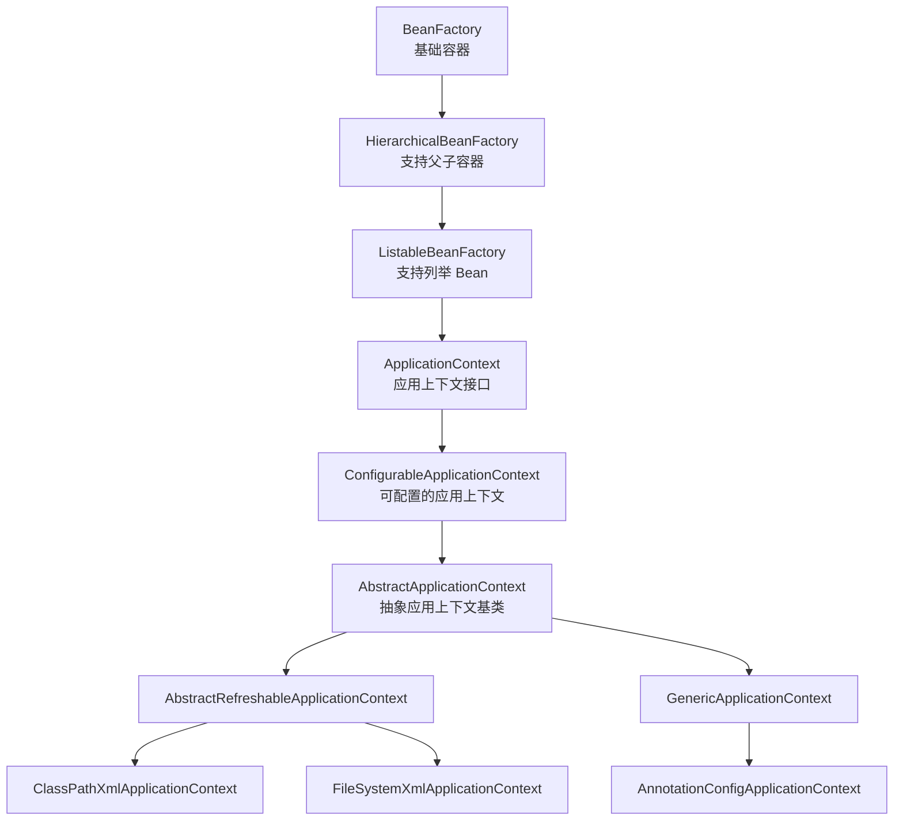

**BeanFactory vs ApplicationContext**：

| 特性 | BeanFactory | ApplicationContext |
|-----|------------|-------------------|
| Bean 初始化时机 | 延迟初始化（懒加载） | 容器启动时预初始化 |
| 国际化支持 | × | √ (MessageSource) |
| 事件发布机制 | × | √ (ApplicationEventPublisher) |
| 资源加载 | × | √ (ResourcePatternResolver) |
| AOP 支持 | × | √ |
| 自动后处理器注册 | × | √ |

### 3.3 容器启动核心流程

`ApplicationContext.refresh()` 是容器启动的核心方法：

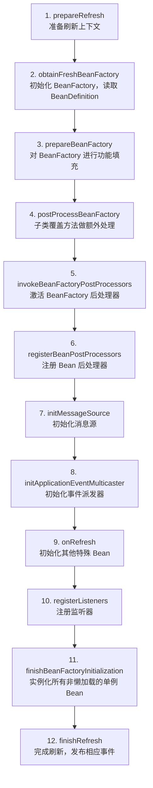

::: details 容器启动源码（AbstractApplicationContext.refresh()）

```java
public void refresh() throws BeansException, IllegalStateException {
    synchronized (this.startupShutdownMonitor) {
        // 1. 准备刷新上下文环境
        prepareRefresh();
        // 2. 初始化 BeanFactory，读取 BeanDefinition
        ConfigurableListableBeanFactory beanFactory = obtainFreshBeanFactory();
        // 3. 对 BeanFactory 进行功能填充
        prepareBeanFactory(beanFactory);
        try {
            // 4. 子类覆盖方法做额外处理
            postProcessBeanFactory(beanFactory);
            // 5. 激活各种 BeanFactory 处理器
            invokeBeanFactoryPostProcessors(beanFactory);
            // 6. 注册 Bean 后置处理器
            registerBeanPostProcessors(beanFactory);
            // 7. 初始化消息源
            initMessageSource();
            // 8. 初始化事件派发器
            initApplicationEventMulticaster();
            // 9. 初始化其他特殊 bean
            onRefresh();
            // 10. 注册监听器
            registerListeners();
            // 11. 实例化所有非懒加载的单例 Bean
            finishBeanFactoryInitialization(beanFactory);
            // 12. 完成刷新过程，发布相应事件
            finishRefresh();
        } catch (BeansException ex) {
            destroyBeans();
            cancelRefresh(ex);
            throw ex;
        }
    }
}
```
:::

---

## 四、依赖注入概述

::: info 深入阅读
本节是依赖注入的概述。完整的注入方式、自动装配、循环依赖等内容，请阅读 [IoC 容器](01-IoC容器.md)。
:::

### 4.1 三种依赖注入方式

Spring 支持三种主要的依赖注入方式：

| 特性 | 构造器注入 | Setter 方法注入 | 字段注入 |
|-----|----------|---------------|---------|
| 不可变性 | √ final 字段 | × 无法 final | × 无法 final |
| 可测试性 | √ 容易测试 | √ 可测试 | × 需要 Mockito |
| 依赖明确性 | √ 构造器可见 | △ 需查看 setter | × 隐藏依赖 |
| 可选依赖 | × 不支持 | √ 支持 | √ 支持 |
| Spring 官方推荐度 | √ 官方推荐 | △ 可用 | × 不推荐 |

**最佳实践建议**：
- **必需依赖**：使用构造器注入
- **可选依赖**：使用 Setter 方法注入
- **避免使用**：字段注入

```java
@Service
public class UserService {
    private final UserRepository userRepository;   // 必需依赖
    private EmailService emailService;              // 可选依赖

    // 构造器注入（推荐）：必需依赖
    public UserService(UserRepository userRepository) {
        this.userRepository = userRepository;
    }

    // Setter 注入：可选依赖
    @Autowired(required = false)
    public void setEmailService(EmailService emailService) {
        this.emailService = emailService;
    }
}
```

### 4.2 自动装配注解对比

| 特性 | @Autowired | @Resource | @Inject |
|-----|-----------|-----------|---------|
| 来源 | Spring 特有 | JSR-250 标准 | JSR-330 标准 |
| 默认装配方式 | 按类型 | 按名称 | 按类型 |
| 指定 Bean 名称 | 配合 @Qualifier | name 属性 | 配合 @Named |
| 必需性控制 | required 属性 | 不支持 | 不支持 |

**使用建议**：
- **Spring 项目**：优先使用 @Autowired
- **跨框架兼容**：使用 @Resource
- **按名称装配**：使用 @Resource 更简洁

### 4.3 循环依赖与三级缓存

Spring 通过 **三级缓存** 解决单例 Bean 的 Setter/字段注入循环依赖：

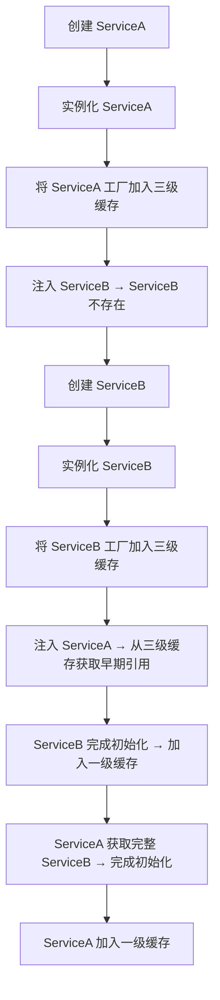

| 缓存级别 | 名称 | 存放内容 |
|---------|------|---------|
| 一级缓存 | singletonObjects | 完整的单例 Bean |
| 二级缓存 | earlySingletonObjects | 早期的单例 Bean（未完成属性填充） |
| 三级缓存 | singletonFactories | 单例工厂（用于创建代理对象） |

::: warning 无法解决的循环依赖
- **构造器注入**的循环依赖：无法解决，可使用 `@Lazy` 延迟加载
- **原型作用域**的循环依赖：Spring 不缓存原型 Bean，无法解决
- 详细分析见 [Bean 生命周期与循环依赖](04-Bean生命周期与循环依赖.md)
:::

---

## 五、AOP 概述

::: info 深入阅读
本节是 AOP 的概述。完整的 AOP 原理、代理机制、切点表达式、实战案例等内容，请阅读 [AOP](02-AOP.md)。
:::

### 5.1 AOP 核心概念

| 概念 | 说明 | 示例 |
|-----|------|------|
| **切面（Aspect）** | 横切关注点的模块化 | 日志切面、事务切面 |
| **连接点（Join Point）** | 程序执行的特定点 | 方法调用、异常抛出 |
| **切点（Pointcut）** | 匹配连接点的表达式 | `execution(* com.example.service.*.*(..))` |
| **通知（Advice）** | 在切点执行的动作 | @Before、@After、@Around |
| **目标对象（Target）** | 被通知的对象 | UserService 实例 |
| **代理（Proxy）** | AOP 框架创建的对象 | JDK 动态代理或 CGLIB 代理 |
| **织入（Weaving）** | 将切面应用到目标对象 | 编译期、类加载期、运行期 |

### 5.2 代理选择机制

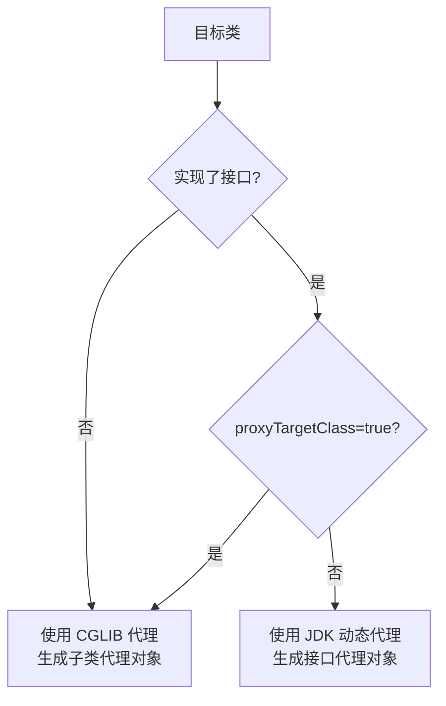

| 特性 | JDK 动态代理 | CGLIB 代理 |
|-----|-------------|-----------|
| 实现方式 | 基于接口 | 基于继承 |
| 要求 | 目标类必须实现接口 | 目标类不能是 final |
| 方法限制 | 只能代理接口方法 | 不能代理 final 和 static 方法 |
| 默认选择 | 目标类实现了接口时默认（Framework） | 目标类无接口时默认（Framework）；Spring Boot 2.x+ 默认 |

> 注意：Spring Framework 本身始终按"目标类是否实现接口"选择代理，与版本无关；"Boot 2.x 起默认 CGLIB"是 `spring.aop.proxy-target-class=true` 的自动配置行为，并非 Framework 在 5.x 切换了默认值。

### 5.3 五种通知类型

| 通知类型 | 注解 | 执行时机 | 能否阻止方法执行 | 能否获取返回值 |
|---------|-----|---------|---------------|--------------|
| 前置通知 | @Before | 方法执行前 | × | × |
| 后置通知 | @After | 方法执行后（无论是否异常） | × | × |
| 返回通知 | @AfterReturning | 方法成功返回后 | × | √ |
| 异常通知 | @AfterThrowing | 方法抛出异常后 | × | √（异常） |
| 环绕通知 | @Around | 包裹整个方法执行 | √ | √ |

**执行顺序**（Spring 5.2.7+ 统一后的顺序，同一 @Aspect 内）：

```
正常执行流程：
Around(前) → Before → 方法执行 → AfterReturning → After → Around(后)

异常执行流程：
Around(前) → Before → 方法执行 → AfterThrowing → After → Around(后，异常继续向外抛出)
```

> 即 @After 在 @AfterReturning / @AfterThrowing **之后**执行，@Around 的后半段最外层最后执行。

---

## 六、事务管理概述

::: info 深入阅读
本节是事务管理的概述。完整的传播行为、隔离级别、失效场景、最佳实践等内容，请阅读 [事务管理与失效场景](03-事务管理与失效场景.md)。
:::

### 6.1 Spring 事务的本质

Spring 事务本质上不是"给方法打个注解就自动回滚"，而是通过 **AOP 代理**把方法包进事务拦截逻辑里。

### 6.2 事务传播行为速查

| 传播行为 | 说明 | 典型场景 |
|---------|------|---------|
| **REQUIRED**（默认） | 支持当前事务，不存在则新建 | 大部分业务方法 |
| **REQUIRES_NEW** | 始终新建事务，挂起当前事务 | 日志记录、审计 |
| **NESTED** | 嵌套事务（Savepoint） | 批量操作中的部分失败处理 |
| SUPPORTS | 有事务就加入，无则非事务执行 | 查询方法 |
| MANDATORY | 必须在事务中调用，否则抛异常 | 敏感操作 |
| NOT_SUPPORTED | 非事务执行，挂起当前事务 | 大数据量导出 |
| NEVER | 必须非事务执行，否则抛异常 | 发送邮件 |

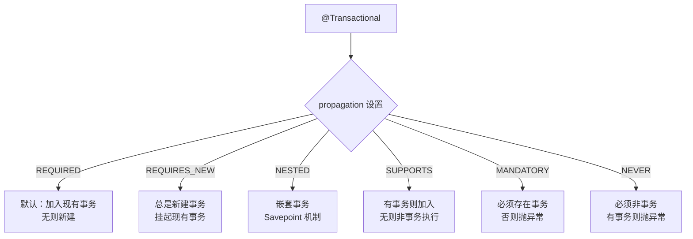

### 6.3 事务失效速查

| 失效场景 | 原因 | 解决方案 |
|---------|------|---------|
| 方法不是 public | Spring AOP 只代理 public 方法 | 改为 public |
| 方法内部调用 | 未走代理，直接调用 this 方法 | 注入自身代理或使用 AopContext |
| 异常被捕获 | 异常未抛出，代理无法感知 | 手动标记 `setRollbackOnly()` |
| 异常类型不匹配 | 默认只回滚 RuntimeException | 指定 `rollbackFor = Exception.class` |
| 数据库不支持事务 | 如 MySQL MyISAM 引擎 | 使用 InnoDB 引擎 |
| 类未被 Spring 管理 | 无 @Service 等注解 | 添加组件注解 |

---

## 七、Bean 生命周期概述

::: info 深入阅读
本节是 Bean 生命周期的概述。完整的生命周期回调、三级缓存、循环依赖解决等内容，请阅读 [Bean 生命周期与循环依赖](04-Bean生命周期与循环依赖.md)。
:::

一个 Bean 从创建到销毁，经历以下主要阶段：

```mermaid
flowchart TD
    A[1. 实例化<br/>Instantiation] --> B[2. 属性赋值<br/>Populate]
    B --> C[3. 初始化<br/>Initialization]
    C --> D[4. 使用中<br/>In Use]
    D --> E[5. 销毁<br/>Destruction]

    subgraph 实例化阶段
        A1[推断构造方法] --> A2[实例化对象]
        A2 --> A3[MergedBeanDefinitionPostProcessor]
    end

    subgraph 初始化阶段
        C1[InvokeAwareMethods] --> C2[BeanPostProcessor Before]
        C2 --> C3[@PostConstruct]
        C3 --> C4[InitializingBean.afterPropertiesSet]
        C4 --> C5[init-method]
        C5 --> C6[BeanPostProcessor After<br/>生成代理]
    end

    subgraph 销毁阶段
        E1[@PreDestroy] --> E2[DisposableBean.destroy]
        E2 --> E3[destroy-method]
    end

```

**初始化回调的执行顺序**：`@PostConstruct` → `InitializingBean.afterPropertiesSet()` → 自定义 `init-method`

**销毁回调的执行顺序**：`@PreDestroy` → `DisposableBean.destroy()` → 自定义 `destroy-method`

---

## 八、Spring 注解体系

### 8.1 核心注解分类

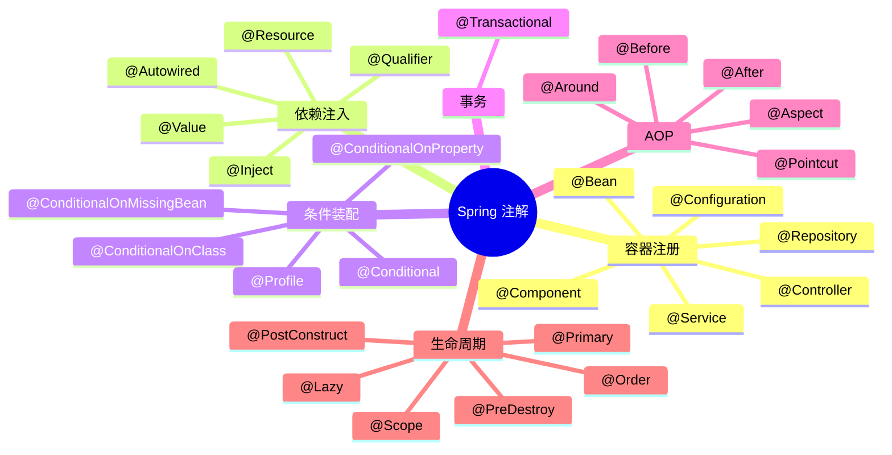

### 8.2 容器注册注解详解

#### @Component 及其派生注解

| 注解 | 语义 | 层级 | 特殊能力 |
|-----|------|------|---------|
| @Component | 通用组件 | 通用 | 无 |
| @Repository | 数据访问层 | DAO | 自动转换持久化异常 |
| @Service | 业务逻辑层 | Service | 无（语义标记） |
| @Controller | 控制器层 | Web | 配合 HandlerMapping |
| @RestController | REST 控制器 | Web | @Controller + @ResponseBody |

```java
@Repository  // 数据访问层：自动转换持久化异常
public class UserRepositoryImpl implements UserRepository { }

@Service     // 业务逻辑层：语义标记
public class UserService { }

@RestController  // REST 控制器：@Controller + @ResponseBody
@RequestMapping("/api/users")
public class UserRestController {
    @GetMapping("/{id}")
    public User getUser(@PathVariable Long id) {
        return userService.findById(id);
    }
}
```

#### @Configuration 和 @Bean

```java
@Configuration
public class AppConfig {

    @Bean
    @Primary  // 首选 Bean
    public UserRepository userRepository() {
        return new UserRepositoryImpl();
    }

    @Bean
    @Scope("prototype")  // 原型作用域
    public UserService userService() {
        return new UserService();
    }

    @Bean(initMethod = "init", destroyMethod = "destroy")
    public OrderService orderService() {
        return new OrderService();
    }

    @Bean
    @Conditional(OnProductionCondition.class)  // 条件装配
    public DataSource productionDataSource() {
        return new HikariDataSource();
    }
}
```

### 8.3 条件装配注解

```java
// 自定义条件
public class OnProductionCondition implements Condition {
    @Override
    public boolean matches(ConditionContext context, AnnotatedTypeMetadata metadata) {
        String env = context.getEnvironment().getProperty("app.env");
        return "production".equals(env);
    }
}

// @Profile：按环境激活
@Configuration
public class DataSourceConfig {
    @Bean
    @Profile("development")
    public DataSource devDataSource() { /* 开发环境 */ }

    @Bean
    @Profile("production")
    public DataSource prodDataSource() { /* 生产环境 */ }
}
```

**激活 Profile**：

```properties
# application.properties
spring.profiles.active=development
```

### 8.4 其他常用注解

| 注解 | 说明 | 典型用法 |
|-----|------|---------|
| @Scope | 指定 Bean 作用域 | `@Scope("prototype")` |
| @Lazy | 延迟初始化 | `@Lazy`（也可标注在注入点上延迟解析） |
| @Primary | 首选 Bean | 多个同类型 Bean 时优先注入 |
| @Qualifier | 指定 Bean 名称 | `@Qualifier("userRepository")` |
| @Order | 排序优先级 | `@Order(1)` 数字越小优先级越高 |
| @Value | 注入配置值 | `@Value("${app.name}")` |

---

## 九、创建 Spring 程序

Spring 官方提供新工程的初始化工具 [Spring Initializr](https://start.spring.io)，可以快速创建空白工程。

> 阿里云基于 Spring Initializr 的代码也制作了网站 https://start.aliyun.com/，在国内访问速度较快，而且是中文界面。

### 使用 Spring Initializr 创建项目

1. 访问 https://start.spring.io 或 https://start.aliyun.com
2. 选择 Project（Maven）、Language（Java）、Spring Boot 版本
3. 填写项目元数据（Group、Artifact 等）
4. 添加依赖（如 Spring Web）
5. 点击 GENERATE 下载项目压缩包

### 编写 REST 服务

```java
package learning.spring.helloworld;

import org.springframework.boot.SpringApplication;
import org.springframework.boot.autoconfigure.SpringBootApplication;
import org.springframework.web.bind.annotation.RequestMapping;
import org.springframework.web.bind.annotation.RestController;

@SpringBootApplication
@RestController
public class Application {

    public static void main(String[] args) {
        SpringApplication.run(Application.class, args);
    }

    @RequestMapping("/helloworld")
    public String helloworld() {
        return "Hello World! Bravo Spring!";
    }
}
```

使用 curl 访问：

```bash
curl http://localhost:8080/helloworld
```

### 传统 XML 配置方式

现代项目使用 Spring Boot + 注解配置，几乎不需要手写 XML。但维护存量项目时需要理解 XML 配置语法，以下为传统 XML Bean 定义核心语法参考。

::: details XML Bean 定义语法

#### 基本配置

```xml
<?xml version="1.0" encoding="UTF-8"?>
<beans xmlns="http://www.springframework.org/schema/beans"
  xmlns:xsi="http://www.w3.org/2001/XMLSchema-instance"
  xsi:schemaLocation="http://www.springframework.org/schema/beans
    http://www.springframework.org/schema/beans/spring-beans.xsd">

  <!-- id：Bean 在容器中的唯一标识；class：Bean 的全限定名 -->
  <!-- 默认调用无参构造方法创建实例 -->
  <bean id="userDao" class="com.example.dao.impl.UserDaoImpl"/>
</beans>
```

```java
// 加载配置并获取 Bean
ApplicationContext ctx = new ClassPathXmlApplicationContext("applicationContext.xml");
UserDao userDao = (UserDao) ctx.getBean("userDao");
```

#### Bean 作用域与生命周期

```xml
<bean id="userDao" class="com.example.dao.impl.UserDaoImpl"
  scope="singleton" init-method="init" destroy-method="destroy"/>
```

| 作用域 | 说明 | 实例化时机 |
|--------|------|-----------|
| `singleton`（默认） | 单例 | 容器加载时 |
| `prototype` | 多例 | 调用 `getBean()` 时 |

#### 依赖注入：Setter 方法注入（`<property>`）

```xml
<bean id="userService" class="com.example.service.impl.UserServiceImpl">
  <!-- ref：注入其他 Bean 引用 -->
  <property name="userDao" ref="userDao"/>
  <!-- value：注入普通数据类型 -->
  <property name="username" value="jack"/>
  <property name="age" value="18"/>
</bean>
```

#### 依赖注入：构造方法注入（`<constructor-arg>`）

```xml
<bean id="userService" class="com.example.service.impl.UserServiceImpl">
  <constructor-arg name="userDao" ref="userDao"/>
</bean>
```

#### 集合数据类型注入

```xml
<!-- List -->
<property name="list">
  <list>
    <value>aaa</value>
    <ref bean="user"/>
  </list>
</property>

<!-- Map -->
<property name="map">
  <map>
    <entry key="k1" value="ddd"/>
    <entry key="k2" value-ref="user"/>
  </map>
</property>

<!-- Properties -->
<property name="properties">
  <props>
    <prop key="k1">v1</prop>
    <prop key="k2">v2</prop>
  </props>
</property>
```

#### P 命名空间（Setter 注入的简写）

需先引入命名空间：`xmlns:p="http://www.springframework.org/schema/p"`

```xml
<!-- 等价于 <property name="userDao" ref="userDao"/> -->
<bean id="userService" class="com.example.service.impl.UserServiceImpl"
  p:userDao-ref="userDao"/>
```

`-ref` 后缀表示引用其他 Bean，不加后缀表示普通值：`p:username="jack"`。

#### Bean 实例化方式

1. **无参构造方法**（最常用）：`<bean id="userDao" class="com.example.dao.impl.UserDaoImpl"/>`
2. **工厂静态方法**：`<bean id="userDao" class="com.example.factory.StaticFactoryBean" factory-method="createUserDao"/>`
3. **工厂普通方法**：

```xml
<bean id="factory" class="com.example.factory.DynamicFactoryBean"/>
<bean id="userDao" factory-bean="factory" factory-method="createUserDao"/>
```

#### 配置文件模块化

大型项目可将配置拆分到多个文件：

```xml
<!-- 主配置文件中引入子配置 -->
<import resource="applicationContext-dao.xml"/>
<import resource="applicationContext-service.xml"/>
```

或并列加载：`new ClassPathXmlApplicationContext("beans1.xml", "beans2.xml")`

::: warning 同名 Bean 规则
同一个 XML 中不能出现相同名称的 Bean，否则报错。多个 XML 中出现同名 Bean 不会报错，但后加载的会覆盖先加载的。
:::

#### XML 配置与注解配置对照

| 功能 | XML 配置 | 注解配置 |
|------|---------|---------|
| 定义 Bean | `<bean id="..." class="..."/>` | `@Component` / `@Service` / `@Repository` |
| 注入依赖 | `<property ref="..."/>` | `@Autowired` / 构造器注入 |
| 注入值 | `<property value="..."/>` | `@Value` |
| 作用域 | `scope="..."` | `@Scope` |
| 初始化 | `init-method="..."` | `@PostConstruct` |
| 销毁 | `destroy-method="..."` | `@PreDestroy` |
| 组件扫描 | `<context:component-scan>` | `@ComponentScan` |
| 配置文件 | `<context:property-placeholder>` | `@PropertySource` |

:::

---

## 十、Spring 中的设计模式

| 设计模式 | Spring 中的应用 | 说明 |
|---------|----------------|------|
| **工厂模式** | BeanFactory、ApplicationContext | 创建和管理 Bean |
| **单例模式** | Spring Bean 默认作用域 | 容器级别的单例实现 |
| **代理模式** | AOP、事务管理 | JDK 动态代理 / CGLIB 代理 |
| **模板方法模式** | JdbcTemplate、RestTemplate | 定义算法骨架，子类实现细节 |
| **策略模式** | Resource 加载策略 | 不同资源使用不同加载策略 |
| **观察者模式** | ApplicationEvent、ApplicationListener | 事件驱动机制 |
| **适配器模式** | HandlerAdapter | 适配不同类型的 Handler |
| **装饰器模式** | BeanWrapper | 增强 Bean 的功能 |
| **建造者模式** | BeanDefinitionBuilder | 构建 BeanDefinition |
| **责任链模式** | Filter、Interceptor | 请求的链式处理 |

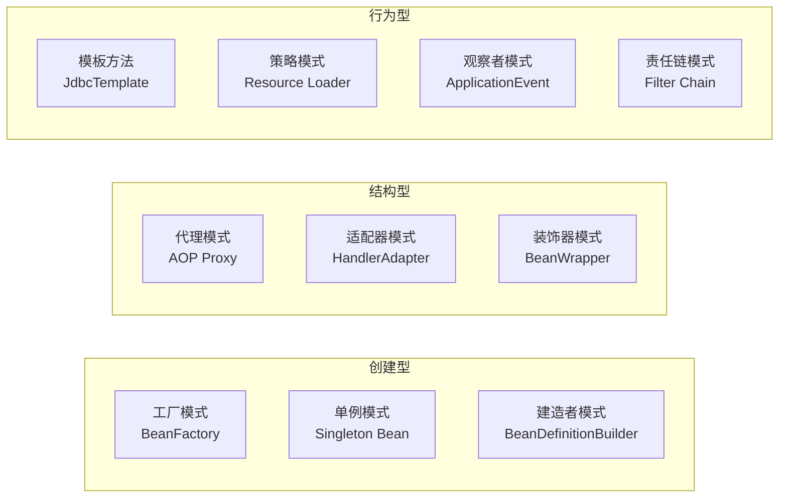

---

## 十一、面试高频问题

### IoC 相关

**Q1：BeanFactory 和 ApplicationContext 的区别？**

| 特性 | BeanFactory | ApplicationContext |
|-----|------------|-------------------|
| 初始化时机 | 延迟初始化（懒加载） | 容器启动时预初始化 |
| 国际化支持 | × | √ |
| 事件发布机制 | × | √ |
| 资源加载 | × | √ |
| AOP 支持 | × | √ |

**Q2：Spring Bean 的作用域有哪些？**

| 作用域 | 说明 | 适用场景 |
|-------|------|---------|
| singleton | 单例（默认） | 无状态 Bean |
| prototype | 每次获取都创建新实例 | 有状态 Bean |
| request | 每个 HTTP 请求一个实例 | Web 应用 |
| session | 每个 HTTP Session 一个实例 | Web 应用 |
| application | 整个 ServletContext 一个实例 | Web 应用 |

**Q3：Spring 如何解决循环依赖？**

通过三级缓存解决单例 Bean 的 Setter/字段注入循环依赖：
1. **singletonObjects（一级缓存）**：完整的单例 Bean
2. **earlySingletonObjects（二级缓存）**：早期的单例 Bean
3. **singletonFactories（三级缓存）**：单例工厂

无法解决：构造器注入循环依赖（可用 @Lazy）、原型作用域循环依赖

### AOP 相关

**Q4：Spring AOP 和 AspectJ 的区别？**

| 特性 | Spring AOP | AspectJ |
|-----|-----------|---------|
| 实现方式 | 运行时动态代理 | 编译期/类加载期织入 |
| 功能范围 | 方法级别 | 方法、字段、构造器等 |
| 性能 | 略低 | 更高 |
| 使用复杂度 | 简单 | 较复杂 |

**Q5：JDK 动态代理和 CGLIB 代理的区别？**

| 特性 | JDK 动态代理 | CGLIB 代理 |
|-----|-------------|-----------|
| 实现方式 | 基于接口 | 基于继承 |
| 要求 | 目标类必须实现接口 | 目标类不能是 final |
| 默认选择 | 目标类实现了接口时默认（Framework） | 目标类无接口时默认（Framework）；Spring Boot 2.x+ 默认 |

### 事务相关

**Q6：Spring 事务失效的场景有哪些？**

1. 方法不是 public
2. 方法内部调用（未通过代理）
3. 异常被捕获未重新抛出
4. 异常类型不匹配（默认只回滚 RuntimeException）
5. 数据库不支持事务（如 MySQL MyISAM）
6. 事务管理器未正确配置
7. 类未被 Spring 管理（无 @Service 等注解）

**Q7：REQUIRED、REQUIRES_NEW 和 NESTED 的区别？**

| 传播行为 | 外层事务回滚时 | 内层事务回滚时 |
|---------|-------------|-------------|
| REQUIRED | 内层一起回滚 | 外层一起回滚 |
| REQUIRES_NEW | 不影响内层 | 不影响外层 |
| NESTED | 内层一起回滚 | 外层可以不回滚 |

### 设计模式相关

**Q8：Spring 中用了哪些设计模式？**

工厂（BeanFactory）、单例（Singleton Bean）、代理（AOP）、模板方法（JdbcTemplate）、策略（Resource）、观察者（ApplicationEvent）、适配器（HandlerAdapter）、责任链（Filter Chain）。

---

## 十二、总结

Spring 框架作为 Java 企业级开发的基石，其核心思想是简化开发、降低耦合。通过 IoC 容器管理对象的生命周期和依赖关系，通过 AOP 实现横切关注点的模块化，通过声明式事务管理简化事务处理。

**学习 Spring 的关键路径**：

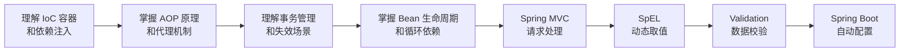

**下一步学习建议**：

1. **实践**：搭建 Spring 项目，实践 IoC 和 AOP
2. **源码阅读**：阅读 Spring 核心源码，深入理解原理
3. **SpEL**：掌握表达式语言在 `@Value`、缓存键、条件装配中的用法 → [SpEL 表达式语言](10-SpEL表达式语言.md)
4. **Validation**：掌握 Bean Validation 注解、分组校验与自定义约束 → [Spring 验证与数据校验](11-Spring验证与数据校验.md)
5. **Spring Boot**：学习 Spring Boot，快速构建应用 → [Spring Boot 介绍](/JAVA/SpringBoot/00-SpringBoot介绍)
6. **Spring Cloud**：学习 Spring Cloud，构建分布式系统
7. **性能优化**：学习 Spring 性能调优技巧

## 版本差异(旧版 → Spring 6.x)

| 特性 | 旧版(Spring 5.x) | Spring 6.x |
|------|-----------------|------------|
| JDK 基线 | Java 8+ | Java 17+ |
| 命名空间 | javax.* | jakarta.*（强制） |
| 容器核心 | IoC/AOP | 不变；核心设计稳定 |
| 响应式 | WebFlux 5.x | 不变；响应式语义稳定 |
| 原生支持 | 无 | GraalVM Native Image（AOT） |
| 虚拟线程 | 无 | Spring 6.1+ 支持虚拟线程 |

