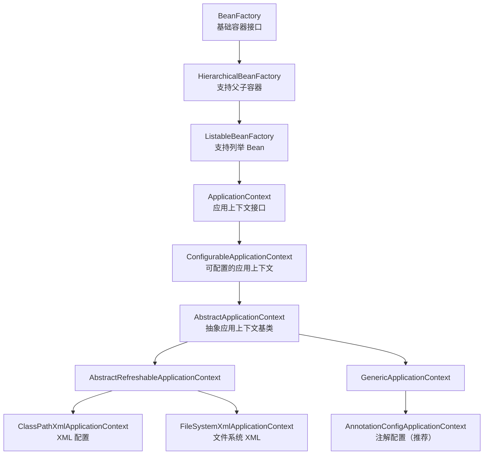
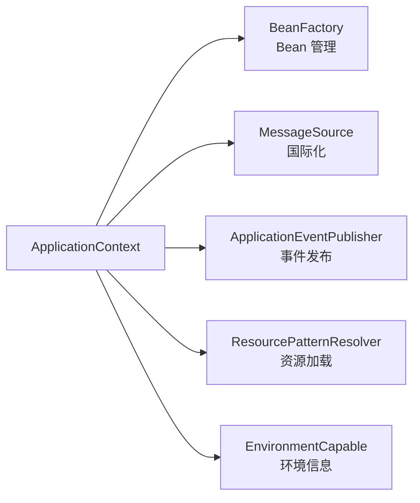
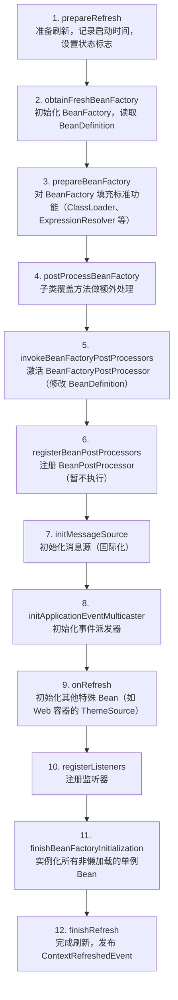
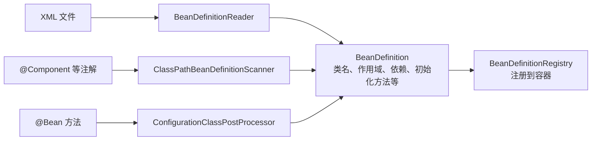
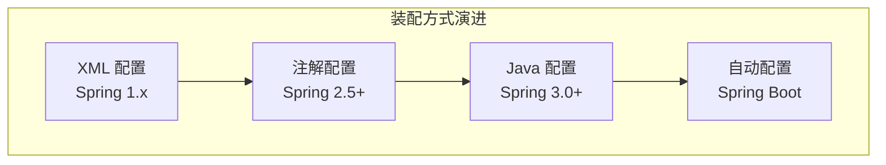
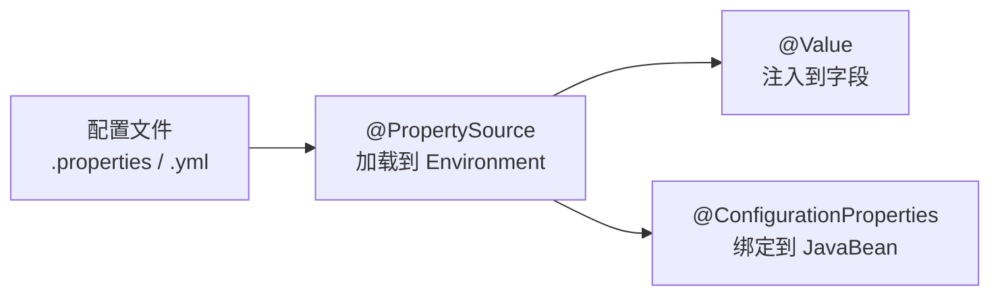
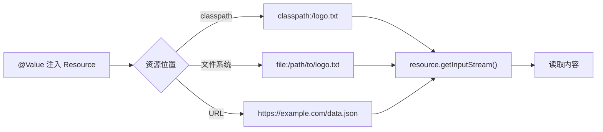
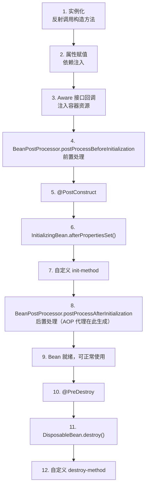
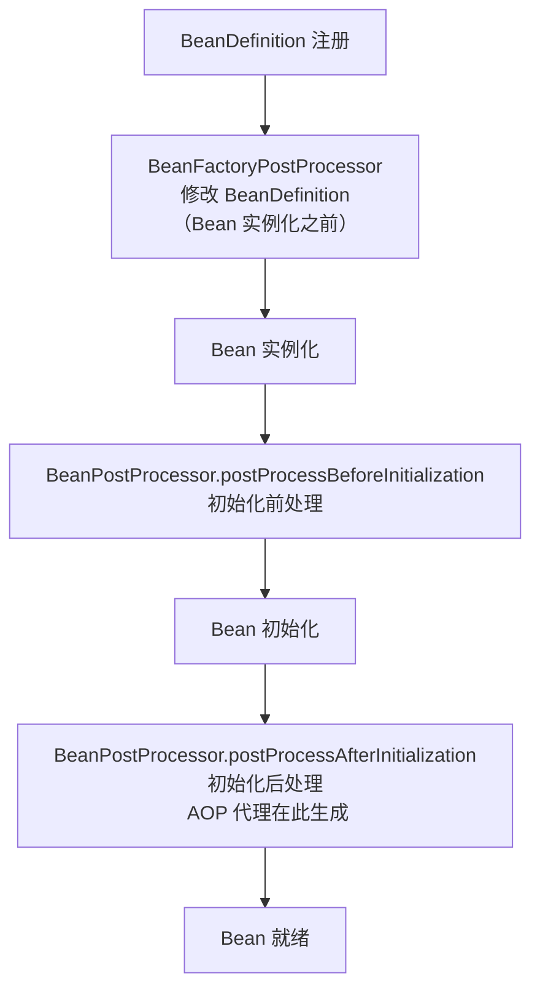
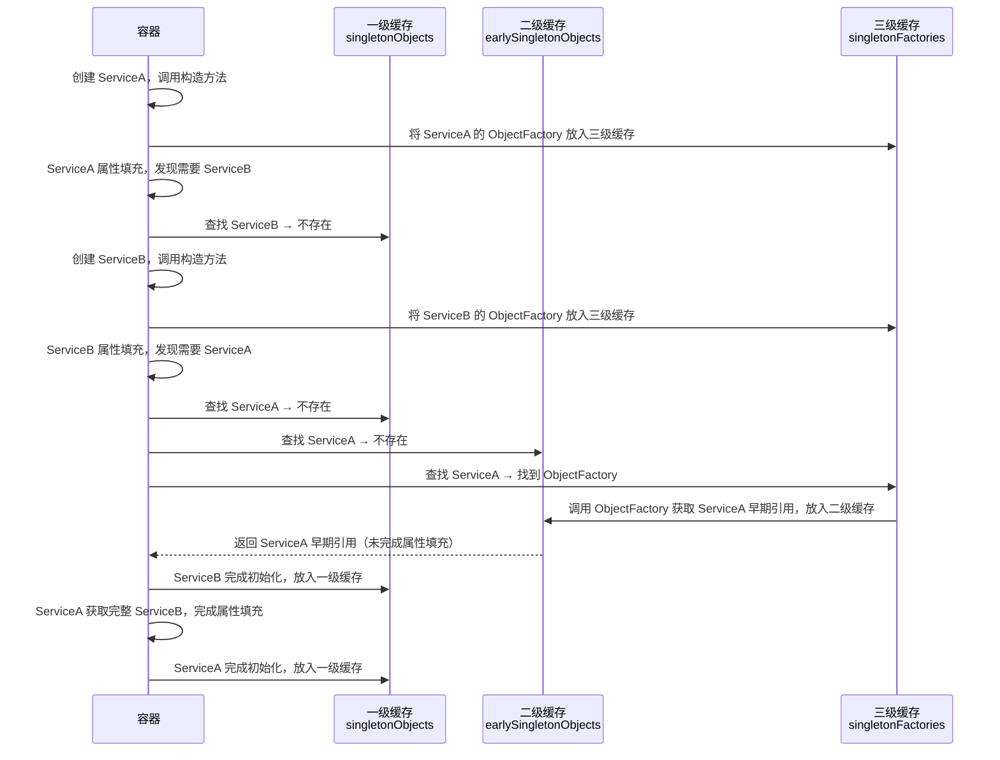

# IoC 容器

IoC（Inversion of Control，控制反转）是 Spring 框架的基石。本篇从 IoC 的核心概念出发，逐步深入到容器启动流程、Bean 定义与注册、依赖注入方式、作用域与自动装配，最后落到实战场景与常见陷阱。

::: tip 版本基准
本文档以 **Spring Framework 6.x / Spring Boot 3.x** 为主，必要时标注与 Spring 5.x / Boot 2.x 的差异。Spring 6 要求 Java 17+，且 `javax.*` 包已迁移为 `jakarta.*`。
:::

## IoC 与 DI：概念与关系

### 什么是 IoC

**IoC（Inversion of Control，控制反转）** 是一种设计原则，它将对象的创建和依赖关系的管理从程序代码中转移到了外部容器。Spring 的 IoC 容器是整个框架的核心，负责实例化、配置和组装 Bean。

"控制反转"反转了什么？

- **创建对象的控制权**：从对象本身转移到容器
- **依赖关系的控制权**：从调用者转移到容器
- **对象生命周期的控制权**：从对象本身转移到容器

### IoC 与 DI 的关系

**DI（Dependency Injection，依赖注入）** 是 IoC 的实现方式。两者从不同角度描述同一件事：

- **IoC 是目标**：实现对象间解耦
- **DI 是手段**：通过注入依赖实现 IoC

::: tip 一句话理解
IoC 说的是"谁来管"，DI 说的是"怎么给"。容器管对象叫 IoC，容器把依赖塞进去叫 DI。
:::

### 为什么需要 IoC 容器

| 传统方式的问题 | IoC 容器的优势 |
|--------------|--------------|
| 对象间耦合度高，难以测试 | 松耦合，易于单元测试 |
| 手动管理对象生命周期 | 容器自动管理生命周期 |
| 依赖关系硬编码在代码中 | 依赖关系可配置，灵活切换实现 |
| 重复的对象创建代码 | 统一的对象创建和管理 |
| 违反开闭原则，修改实现需改代码 | 面向接口编程，替换实现无需改业务代码 |

传统方式的核心问题可以归纳为五点：

1. **实例化复杂** — 组件的创建逻辑分散在各处，每个组件都需要自己处理依赖的初始化（如读取配置、创建连接池）
2. **组件共享困难** — 多个组件各自创建同一依赖的实例，无法共享（如多个 Service 各自创建 DataSource）
3. **生命周期管理混乱** — 共享组件何时销毁、谁来负责释放资源，缺乏统一管理
4. **依赖关系复杂** — 随着组件增多，依赖网络越来越复杂，手动维护成本急剧上升
5. **测试困难** — 组件与具体实现紧耦合，无法轻松替换为 Mock 对象进行单元测试

```java
// 传统方式：硬编码依赖，紧耦合
public class OrderService {
    private OrderRepository repo = new OrderRepositoryImpl();  // 直接 new
    private PaymentService payment = new AlipayService();       // 换支付方式要改代码
}

// IoC 方式：依赖由容器注入，松耦合
@Service
public class OrderService {
    private final OrderRepository repo;
    private final PaymentService payment;

    public OrderService(OrderRepository repo, PaymentService payment) {
        this.repo = repo;        // 容器注入，可随时替换实现
        this.payment = payment;  // 切换支付方式只需改配置
    }
}
```

### 无侵入设计

Spring 的 IoC 容器是高度可扩展的**无侵入容器**。所谓无侵入，是指应用程序的组件无需实现 Spring 的特定接口，组件根本不知道自己在 Spring 的容器中运行。

无侵入设计的优势：

1. **应用解耦** — 组件既可以在 Spring 容器中运行，也可以自行组装，不依赖 Spring API
2. **测试友好** — 测试时不依赖容器，可直接使用 Mock 对象
3. **迁移方便** — 可轻松迁移到其他 IoC 容器，不被框架锁定

```java
// 侵入式：直接依赖 Spring API
public class BookService implements ApplicationContextAware {
    private ApplicationContext context;
    @Override
    public void setApplicationContext(ApplicationContext ctx) { this.context = ctx; }
    public Book getBook(long id) {
        DataSource ds = context.getBean(DataSource.class); // 主动从容器获取
    }
}

// 无侵入：不依赖任何 Spring API
public class BookService {
    private DataSource dataSource;
    public void setDataSource(DataSource dataSource) { this.dataSource = dataSource; }
    public Book getBook(long id) { /* 直接使用 dataSource */ }
}
```

::: warning 何时可以打破无侵入原则
某些场景下合理使用 Aware 接口是必要的（如需要发布事件、读取环境变量），但关键是不要在业务逻辑中直接调用 `getBean()`，而是通过依赖注入获取所需对象。
:::

## 容器体系：BeanFactory 与 ApplicationContext

Spring 提供了两种主要的容器接口，它们构成父子关系：ApplicationContext 继承自 BeanFactory 并大幅扩展了功能。

### 容器接口继承体系



### BeanFactory

**BeanFactory** 是最基础的容器接口，提供了基本的 IoC 功能：

```java
public interface BeanFactory {
    Object getBean(String name);
    <T> T getBean(String name, Class<T> requiredType);
    <T> T getBean(Class<T> requiredType);
    boolean containsBean(String name);
    boolean isSingleton(String name);
    boolean isPrototype(String name);
    // ... 其他方法
}
```

**特点**：
- **延迟加载（懒加载）**：第一次调用 `getBean()` 时才创建实例
- 功能相对简单，适合资源受限环境
- 需要手动注册 `BeanPostProcessor`

**常用实现**：`DefaultListableBeanFactory`，它是 Spring 内部最常用的 BeanFactory 实现，ApplicationContext 内部也持有一个该实例。

### ApplicationContext

**ApplicationContext** 继承自 BeanFactory，同时实现了以下接口，提供企业级功能：



**特点**：
- **预加载**：容器启动时创建所有单例 Bean（非懒加载的）
- 自动注册 `BeanPostProcessor`、`BeanFactoryPostProcessor`
- 支持国际化、事件传播、资源加载、环境抽象

**常用实现**：

| 实现类 | 配置方式 | 典型场景 |
|-------|---------|---------|
| `AnnotationConfigApplicationContext` | Java 注解 | **现代无 XML 配置（推荐）** |
| `ClassPathXmlApplicationContext` | XML 文件 | 传统 Spring 应用 |
| `FileSystemXmlApplicationContext` | 文件系统 XML | 外部配置文件 |
| `AnnotationConfigServletWebServerApplicationContext` | 注解 + Web | Spring Boot Web 应用 |

### BeanFactory vs ApplicationContext

| 特性 | BeanFactory | ApplicationContext |
|-----|------------|-------------------|
| Bean 初始化时机 | 延迟初始化（懒加载） | 容器启动时预初始化 |
| 国际化支持 | × | √（MessageSource） |
| 事件发布机制 | × | √（ApplicationEventPublisher） |
| 资源加载 | × | √（ResourcePatternResolver） |
| AOP 支持 | × | √ |
| 自动后处理器注册 | ×（需手动） | √（自动注册） |

::: warning 选择建议
企业级应用**推荐使用 ApplicationContext**。BeanFactory 仅在资源极度受限的环境（如嵌入式设备）中考虑使用。Spring Boot 默认使用 ApplicationContext。
:::

## 容器启动流程

`ApplicationContext.refresh()` 是容器启动的核心方法，包含 12 个标准步骤。理解这个流程是排查 Bean 创建问题的基础。

### refresh() 十二步流程



**关键步骤解读**：

1. **第 5 步**：`BeanFactoryPostProcessor` 在 Bean 实例化之前执行，可以修改 BeanDefinition。典型应用：`PropertyPlaceholderConfigurer` 替换占位符、`ConfigurationClassPostProcessor` 处理 `@Configuration` 类。
2. **第 11 步**：这是最耗时的步骤，所有非懒加载的单例 Bean 在此完成实例化、属性填充和初始化。Spring Boot 启动慢通常卡在这一步。

::: tip 启动性能优化
如果容器启动慢，可以：
- 对非核心 Bean 使用 `@Lazy` 延迟初始化
- 检查是否有不必要的 `@ComponentScan` 范围过大
- 使用 Spring Boot 的 `lazy-initialization` 配置：`spring.main.lazy-initialization=true`
:::

### refresh() 源码解析

以 `AnnotationConfigApplicationContext` 为例，其构造方法做了三件事：

```java
public AnnotationConfigApplicationContext(Class<?>... componentClasses) {
    this();           // 1. 调用父类构造方法，创建 DefaultListableBeanFactory
    register(componentClasses);  // 2. 注册配置类
    refresh();        // 3. 刷新容器（核心方法）
}
```

`refresh()` 方法源码：

```java
@Override
public void refresh() throws BeansException, IllegalStateException {
    synchronized (this.startupShutdownMonitor) {
        prepareRefresh();
        ConfigurableListableBeanFactory beanFactory = obtainFreshBeanFactory();
        prepareBeanFactory(beanFactory);
        try {
            postProcessBeanFactory(beanFactory);
            invokeBeanFactoryPostProcessors(beanFactory);
            registerBeanPostProcessors(beanFactory);
            initMessageSource();
            initApplicationEventMulticaster();
            onRefresh();
            registerListeners();
            finishBeanFactoryInitialization(beanFactory);
            finishRefresh();
        }
        catch (BeansException ex) {
            destroyBeans();
            cancelRefresh(ex);
            throw ex;
        }
    }
}
```

> 注：`synchronized (this.startupShutdownMonitor)` 为 Spring 5.3 的实现；Spring 6.0 起改用 `ReadWriteLock` 控制并发刷新/关闭，12 个步骤顺序不变。

各步骤详解：

- **prepareRefresh()**：设置启动时间、状态标志，验证必需属性
- **obtainFreshBeanFactory()**：创建 BeanFactory，加载并解析 BeanDefinition
- **prepareBeanFactory()**：配置 BeanFactory 的标准特性（类加载器、后置处理器等）
- **invokeBeanFactoryPostProcessors()**：执行 `BeanDefinitionRegistryPostProcessor` 和 `BeanFactoryPostProcessor`，这是修改 BeanDefinition 的关键时机
- **registerBeanPostProcessors()**：注册 BeanPostProcessor，用于后续 Bean 初始化时的拦截处理
- **finishBeanFactoryInitialization()**：实例化所有非懒加载的单例 Bean，这是最耗时的步骤
- **finishRefresh()**：发布 `ContextRefreshedEvent` 事件，通知所有监听器容器已就绪

### BeanDefinition：Bean 的元数据

容器启动时，各种配置来源（XML、注解、Java Config）都会被解析为 **BeanDefinition（Bean 定义）** 对象，它是容器创建 Bean 的"图纸"。



**BeanDefinition 包含的关键信息**：

| 属性 | 说明 | 对应配置 |
|-----|------|---------|
| beanClass | Bean 的全限定类名 | `class="com.example.UserService"` |
| scope | 作用域 | `@Scope` / `scope="singleton"` |
| lazyInit | 是否懒加载 | `@Lazy` / `lazy-init="true"` |
| dependsOn | 依赖的 Bean | `@DependsOn` / `depends-on="otherBean"` |
| initMethodName | 初始化方法 | `@PostConstruct` / `init-method` |
| destroyMethodName | 销毁方法 | `@PreDestroy` / `destroy-method` |
| propertyValues | 属性值（用于 Setter 注入） | `<property>` |
| constructorArgumentValues | 构造器参数 | `<constructor-arg>` |

## 依赖注入的三种方式

Spring 支持三种主要的依赖注入方式。选择哪种方式直接影响代码的可测试性、可维护性和安全性。

### 1. 构造器注入（推荐）

**优点**：
- 保证依赖不可变（`final` 字段）
- 保证对象初始化完成后即可用
- 易于单元测试（无需反射框架）
- 明确表达必需依赖
- 避免循环依赖（编译期即可发现）

**示例**：

```java
@Service
public class UserService {
    private final UserRepository userRepository;
    private final EmailService emailService;

    // Spring 4.3+ 单构造器可省略 @Autowired
    public UserService(UserRepository userRepository, EmailService emailService) {
        this.userRepository = userRepository;
        this.emailService = emailService;
    }
}
```

::: tip Spring 4.3+ 简化规则
如果一个类只有一个构造器，Spring 会自动将其作为注入点，无需显式标注 `@Autowired`。如果有多个构造器，则必须在目标构造器上标注 `@Autowired`。
:::

### 2. Setter 方法注入

**优点**：
- 灵活，适合可选依赖
- 兼容 JavaBean 规范
- 可以在运行时重新配置

**缺点**：
- 对象可能处于不完整状态（Setter 未调用前）
- 依赖可能被修改（非 `final`）

**示例**：

```java
@Service
public class UserService {
    private UserRepository userRepository;
    private EmailService emailService;

    @Autowired(required = false)  // 可选依赖，找不到时不报错
    public void setEmailService(EmailService emailService) {
        this.emailService = emailService;
    }

    @Autowired
    public void setUserRepository(UserRepository userRepository) {
        this.userRepository = userRepository;
    }
}
```

### 3. 字段注入（不推荐）

**缺点**：
- 无法用于 `final` 字段
- 难以单元测试（需要反射或 Mockito）
- 隐藏依赖关系，违反单一职责时不易察觉
- Spring 官方明确不推荐

**示例**：

```java
@Service
public class UserService {
    @Autowired  // 不推荐
    private UserRepository userRepository;

    @Autowired  // 不推荐
    private EmailService emailService;
}
```

::: danger 为什么字段注入仍然常见？
字段注入代码最简洁，很多教程和快速原型都在用。但在正式项目中，它隐藏了依赖数量，当依赖超过 5-6 个时你不会警觉——而构造器注入参数过多会直接提醒你拆分服务。
:::

### 三种方式对比与选择

| 特性 | 构造器注入 | Setter 注入 | 字段注入 |
|-----|----------|-----------|---------|
| 不可变性 | √ `final` 字段 | × | × |
| 可测试性 | √ 直接传参 | √ 可设值 | × 需 Mockito |
| 依赖明确性 | √ 构造器可见 | △ 需查看 Setter | × 隐藏依赖 |
| 可选依赖 | × 不支持 | √ 支持 | √ 支持 |
| Spring 官方推荐度 | √ 官方推荐 | △ 可用 | × 不推荐 |

**选择建议**：

| 场景 | 推荐方式 |
|-----|---------|
| 必需依赖 | 构造器注入 |
| 可选依赖 | Setter 注入 |
| 第三方类（无法修改源码） | Setter 注入 |
| 循环依赖（不得已时） | Setter 注入 + `@Lazy` |

### 推荐的组合写法

```java
@Service
public class UserService {
    private final UserRepository userRepository;  // 必需依赖
    private EmailService emailService;              // 可选依赖

    // 构造器注入：必需依赖
    public UserService(UserRepository userRepository) {
        this.userRepository = userRepository;
    }

    // Setter 注入：可选依赖
    @Autowired(required = false)
    public void setEmailService(EmailService emailService) {
        this.emailService = emailService;
    }
}
```

::: details 历史参考：XML 配置方式的注入语法

```xml
<!-- Setter 方法注入 -->
<bean id="bookService" class="com.example.BookService">
  <property name="dataSource" ref="dataSource" />
  <property name="bookName" value="defaultName" />
</bean>

<!-- 构造方法注入：按索引 -->
<bean id="bookService" class="com.example.BookService">
  <constructor-arg index="0" ref="dataSource" />
  <constructor-arg index="1" value="defaultBookName" />
</bean>

<!-- 构造方法注入：按名称 -->
<bean id="bookService" class="com.example.BookService">
  <constructor-arg name="dataSource" ref="dataSource" />
  <constructor-arg name="bookName" value="defaultBookName" />
</bean>

<!-- 注入集合类型 -->
<bean id="collectionBean" class="com.example.CollectionBean">
  <property name="list">
    <list>
      <value>item1</value>
      <value>item2</value>
      <ref bean="otherBean" />
    </list>
  </property>
  <property name="map">
    <map>
      <entry key="key1" value="value1" />
      <entry key="key2" value-ref="otherBean" />
    </map>
  </property>
</bean>
```
:::

## 自动装配

自动装配（Autowiring）是 Spring 容器根据类型或名称自动解析依赖关系并注入的机制。

### @Autowired

`@Autowired` 是 Spring 提供的注解，**按类型（byType）优先**进行依赖注入。

**注入位置**：

```java
@Service
public class UserService {
    private UserRepository userRepository;
    private EmailService emailService;

    // 1. 构造器注入（Spring 4.3+ 单构造器可省略 @Autowired）
    public UserService(UserRepository userRepository) {
        this.userRepository = userRepository;
    }

    // 2. Setter 方法注入
    @Autowired
    public void setEmailService(EmailService emailService) {
        this.emailService = emailService;
    }

    // 3. 任意方法注入（不常用）
    @Autowired
    public void configure(UserRepository repo, EmailService email) {
        this.userRepository = repo;
        this.emailService = email;
    }
}
```

**`@Autowired` 的属性**：

```java
@Autowired(required = false)  // 可选依赖，找不到时不报错
private OptionalService optionalService;

// 更推荐用 Optional 表达可选性（字段类型声明为 Optional<EmailService>）
@Autowired
public UserService(Optional<EmailService> emailService) {
    this.emailService = emailService;  // 使用时需处理空值
}

// Spring 5.0+ 也可使用 @Nullable
@Autowired
public void setService(@Nullable SomeService service) {
    this.service = service;
}
```

::: warning @Autowired(required = false) 的陷阱
`required = false` 意味着该依赖可能为 `null`，如果后续代码直接调用而不做空判断，运行时将抛出 `NullPointerException`。**真正可选的依赖推荐用 `Optional<T>` 包装**，让编译器帮你记住"这里可能为空"。
:::

### 可选注入的三种方式

| 方式 | 特点 | 适用场景 |
|-----|------|---------|
| `@Autowired(required = false)` | 最简单，适合字段注入 | 字段注入场景 |
| `Optional<T>` | 更安全，强制调用方处理空值 | 推荐方式 |
| `@Nullable` | 语义清晰，适合构造方法参数 | 构造器参数 |

```java
// Optional 注入
@Autowired
private Optional<NotificationService> notificationService;

public void notifyUser(User user, String message) {
    notificationService.ifPresent(service -> service.send(user, message));
}

// @Nullable 注入
public UserService(@Nullable NotificationService notificationService) {
    this.notificationService = notificationService;
}
```

### @Qualifier：按名称限定

当同一类型有多个 Bean 时，`@Autowired` 按类型会冲突，需要用 `@Qualifier` 指定 Bean 名称：

```java
public interface UserRepository { }

@Repository("jpaUserRepo")
public class JpaUserRepository implements UserRepository { }

@Repository("mybatisUserRepo")
public class MybatisUserRepository implements UserRepository { }

@Service
public class UserService {
    @Autowired
    @Qualifier("jpaUserRepo")  // 指定注入名为 "jpaUserRepo" 的 Bean
    private UserRepository userRepository;
}
```

也可以在 `@Bean` 定义时配合 `@Qualifier` 标注：

```java
@Bean
@Primary
@Qualifier("primaryUserRepository")
public UserRepository primaryUserRepository() {
    return new JpaUserRepository();
}

@Bean
@Qualifier("secondaryUserRepository")
public UserRepository secondaryUserRepository() {
    return new JdbcUserRepository();
}
```

### @Primary：设置首选 Bean

`@Primary` 标注的 Bean 在同一类型有多个候选时优先被注入，比 `@Qualifier` 更优雅：

```java
@Repository
@Primary  // 同类型多个 Bean 时，优先注入此 Bean
public class JpaUserRepository implements UserRepository { }

@Repository
public class MybatisUserRepository implements UserRepository { }

@Service
public class UserService {
    @Autowired  // 自动注入 JpaUserRepository（@Primary 生效）
    private UserRepository userRepository;
}
```

::: tip @Primary vs @Qualifier
- `@Primary`：全局默认选择，适合"大多数场景用这个"
- `@Qualifier`：局部精确指定，适合"这个特定位置用那个"
- 两者同时使用时，`@Qualifier` 优先级更高
:::

### @Resource（JSR-250）

`@Resource` 是 Jakarta EE（原 Java EE）标准注解，**按名称（byName）优先**注入：

```java
// 默认按字段名查找 Bean
@Resource
private UserRepository userRepository;  // 查找名为 "userRepository" 的 Bean

// 指定 Bean 名称
@Resource(name = "jpaUserRepo")
private UserRepository jpaUserRepo;     // 按指定名称查找，字段名随意

// 也可按类型注入
@Resource(type = EmailService.class)
private EmailService emailService;
```

### @Inject（JSR-330）

`@Inject` 是 Jakarta EE 标准注解，行为类似 `@Autowired`，按类型注入。需要额外引入 `jakarta.inject` 依赖（Spring 6 / Boot 3）：

```java
@Inject  // 按类型注入
private UserRepository userRepository;

@Inject
@Named("jpaUserRepo")  // 配合 @Named 指定名称
private UserRepository userRepository;
```

### 三种注解对比

| 特性 | `@Autowired` | `@Resource` | `@Inject` |
|-----|-------------|-------------|-----------|
| 来源 | Spring 特有 | JSR-250 标准 | JSR-330 标准 |
| 默认装配方式 | 按类型（byType） | 按名称（byName） | 按类型（byType） |
| 指定 Bean 名称 | 配合 `@Qualifier` | `name` 属性 | 配合 `@Named` |
| `required` 支持 | √ | × | × |
| Spring 6 / Boot 3 | √ | √（`jakarta.annotation`） | √（需额外依赖） |

**使用建议**：
- **Spring 项目**：优先使用 `@Autowired`
- **需要按名称注入**：`@Resource` 更简洁
- **跨框架兼容**：`@Inject`（实际项目中很少用）

## Bean 的作用域

Spring 支持多种 Bean 作用域，作用域决定了容器创建和管理 Bean 实例的方式。

### 内置作用域

| 作用域 | 说明 | 线程安全 | 典型场景 |
|-------|------|---------|---------|
| `singleton` | 单例，容器中只有一个实例（**默认**） | 需自行保证 | 无状态服务、工具类 |
| `prototype` | 原型，每次获取创建新实例 | 是（每个引用独立） | 有状态对象 |
| `request` | 每个 HTTP 请求一个实例 | 是 | Web 应用请求参数 |
| `session` | 每个 HTTP 会话一个实例 | 是 | 用户会话信息 |
| `application` | ServletContext 生命周期 | 需自行保证 | Web 应用全局配置 |
| `websocket` | 每个 WebSocket 会话一个实例 | 是 | WebSocket 通信 |

### 配置方式

```java
@Component
@Scope("singleton")  // 默认值，可省略
public class SingletonService { }

@Component
@Scope("prototype")
public class PrototypeService { }

// Web 作用域需要代理模式
@Component
@Scope(value = WebApplicationContext.SCOPE_REQUEST,
        proxyMode = ScopedProxyMode.TARGET_CLASS)
public class RequestScopedBean { }
```

### 单例 Bean 注入原型 Bean 的问题

这是一个经典陷阱：单例 Bean 只初始化一次，其依赖的原型 Bean 也只注入一次，后续调用拿到的始终是同一个实例。

```java
@Component  // 默认 singleton
public class SingletonBean {
    @Autowired
    private PrototypeBean prototypeBean;  //  问题：始终是同一个实例

    public void doSomething() {
        prototypeBean.process();  // 每次调用用的都是同一个 prototypeBean
    }
}
```

**解决方案**：

```java
// 方案1：使用 ObjectProvider（推荐）
@Component
public class SingletonBean {
    @Autowired
    private ObjectProvider<PrototypeBean> prototypeBeanProvider;

    public void doSomething() {
        PrototypeBean bean = prototypeBeanProvider.getObject();  // 每次获取新实例
        bean.process();
    }
}

// 方案2：使用 Provider（JSR-330 标准）
@Component
public class SingletonBean {
    @Autowired
    private Provider<PrototypeBean> prototypeBeanProvider;

    public void doSomething() {
        PrototypeBean bean = prototypeBeanProvider.get();  // 每次获取新实例
    }
}

// 方案3：使用 @Lookup 方法注入
@Component
public abstract class SingletonBean {
    public void doSomething() {
        PrototypeBean bean = getPrototypeBean();  // 每次获取新实例
        bean.process();
    }

    @Lookup  // Spring 通过 CGLIB 生成子类覆盖此方法
    protected abstract PrototypeBean getPrototypeBean();
}
```

::: warning ObjectProvider vs @Lookup
- `ObjectProvider`：不需要抽象类，更灵活，Spring 官方推荐
- `Provider`：JSR-330 标准，跨框架兼容
- `@Lookup`：需要将类声明为抽象类，方法由 CGLIB 覆盖，适合遗留代码
:::

### Web 作用域代理模式

当短生命周期的 Web 作用域 Bean（如 request/session）注入到长生命周期的 Singleton Bean 时，需要使用代理模式：

```java
@Service
public class SingletonService {
    @Autowired
    private RequestBean requestBean;  // Request 作用域注入到 Singleton

    public void processRequest() {
        String requestId = requestBean.getRequestId();  // 通过代理访问
    }
}

// RequestBean 必须配置代理模式
@Component
@Scope(value = WebApplicationContext.SCOPE_REQUEST,
       proxyMode = ScopedProxyMode.TARGET_CLASS)
public class RequestBean {
    // ...
}
```

**代理模式选项**：

| 选项 | 说明 | 适用场景 |
|-----|------|---------|
| `ScopedProxyMode.NO` | 不使用代理（默认） | 同生命周期注入 |
| `ScopedProxyMode.INTERFACES` | 基于接口的 JDK 动态代理 | Bean 实现了接口 |
| `ScopedProxyMode.TARGET_CLASS` | 基于类的 CGLIB 代理 | **最常用** |
| `ScopedProxyMode.DEFAULT` | 通常等同于 TARGET_CLASS | — |

::: details 为什么需要代理模式？
当 Singleton Bean 在容器启动时创建，而 Request Bean 在 HTTP 请求到达时才创建，两者生命周期不匹配。如果不使用代理，Singleton Bean 创建时 Request Bean 还不存在，会导致注入失败。代理模式注入的是一个代理对象，每次方法调用时代理会委托给当前请求对应的真实 Bean 实例。
:::

### 懒加载

`@Lazy` 让 Bean 在首次使用时才创建，而不是容器启动时创建：

```java
// 在 @Bean 方法上使用
@Bean
@Lazy
public ExpensiveService expensiveService() {
    return new ExpensiveService();
}

// 在组件上使用
@Service
@Lazy
public class HeavyService { /* 耗时初始化 */ }

// 在注入点使用（首次调用才创建）
@Autowired
@Lazy
private HeavyService heavyService;
```

懒加载的作用：加快容器启动速度、节省资源、配合 `@Lazy` 解决构造器注入的循环依赖。

::: warning 懒加载失效的常见原因
1. Bean 被其他非懒加载 Bean 依赖——依赖链上的 Bean 都需要标记 `@Lazy`
2. 容器启动时主动调用了 `getBean`（如启动逻辑、事件监听器提前触发）
:::

## 配置方式

Spring 提供三种配置方式，现代项目以 Java Config 为主，XML 配置主要用于维护遗留系统。

### 配置方式演进



| 阶段 | Bean 定义 | 依赖注入 | 配置加载 |
|------|---------|---------|---------|
| 纯 XML | `<bean>` | `<property>` / `<constructor-arg>` | `ClassPathXmlApplicationContext` |
| 半注解 | `@Component` | `@Autowired` | XML + `<context:component-scan>` |
| 纯注解 | `@Component` + `@Bean` | `@Autowired` / 构造器 | `AnnotationConfigApplicationContext` |
| Spring Boot | 自动扫描 + 条件装配 | 构造器注入 | `@SpringBootApplication` |

### 基于 Java 的配置（推荐）

```java
@Configuration
@ComponentScan(basePackages = "com.example")
@PropertySource("classpath:application.properties")
public class AppConfig {

    @Bean
    @Primary
    public DataSource dataSource(
            @Value("${spring.datasource.url}") String url,
            @Value("${spring.datasource.username}") String username,
            @Value("${spring.datasource.password}") String password) {
        return DataSourceBuilder.create()
                .url(url)
                .username(username)
                .password(password)
                .build();
    }

    @Bean
    public JdbcTemplate jdbcTemplate(DataSource dataSource) {
        return new JdbcTemplate(dataSource);  // 参数自动注入
    }
}
```

### @Configuration 的代理机制

`@Configuration` 类会被 CGLIB 代理，保证 `@Bean` 方法之间的调用返回的是同一个 Bean 实例（而非新创建的对象）：

```java
@Configuration
public class AppConfig {

    @Bean
    public UserService userService() {
        // 直接调用 userRepository() 返回的是容器中的单例，而非新实例
        return new UserService(userRepository());
    }

    @Bean
    public UserRepository userRepository() {
        return new UserRepositoryImpl();
    }
}
```

::: tip proxyBeanMethods
Spring 5.2+ 引入 `@Configuration(proxyBeanMethods = true/false)`：
- `true`（默认）：CGLIB 代理，`@Bean` 方法间调用返回同一实例
- `false`：不代理，`@Bean` 方法间调用会创建新实例，但启动更快

Spring Boot 3 的自动配置类大量使用 `proxyBeanMethods = false` 来加速启动。**用户自定义的 `@Configuration` 类建议保持默认值**。
:::

### @ComponentScan 详解

`@ComponentScan` 控制组件扫描的范围和过滤规则：

```java
@Configuration
@ComponentScan(
  basePackages = "com.example",   // 指定扫描包
  basePackageClasses = {UserService.class, MailService.class}, // 指定扫描类所在包
  includeFilters = {              // 包含过滤器
    @Filter(type = FilterType.ANNOTATION, classes = Component.class)
  },
  excludeFilters = {              // 排除过滤器
    @Filter(type = FilterType.ASSIGNABLE_TYPE, classes = ExcludeService.class)
  }
)
public class AppConfig { }
```

**过滤器类型**：

| 类型 | 说明 | 示例 |
|-----|------|------|
| `FilterType.ANNOTATION` | 按注解过滤 | `classes = Component.class` |
| `FilterType.ASSIGNABLE_TYPE` | 按指定类型过滤 | `classes = UserService.class` |
| `FilterType.ASPECTJ` | AspectJ 表达式过滤 | `pattern = "com.example..*Service"` |
| `FilterType.REGEX` | 正则表达式过滤 | `pattern = "com\\.example\\..*Service"` |
| `FilterType.CUSTOM` | 自定义过滤器 | `classes = MyTypeFilter.class` |

**@Component 的衍生注解**：

| 注解 | 语义层次 | 典型用途 |
|-----|---------|---------|
| `@Repository` | 持久层 | 数据访问对象，自动转换持久层异常 |
| `@Service` | 业务层 | 业务逻辑处理 |
| `@Controller` | 控制层 | Web 请求处理 |
| `@Configuration` | 配置层 | Bean 定义和配置 |

这些注解本质上都是 `@Component`，但语义更清晰，并且可以配合 AOP 进行特定处理（例如 `@Repository` 会自动转换数据库异常为 Spring 的 `DataAccessException`）。

### @Bean 详解

```java
@Configuration
public class AppConfig {

    @Bean
    public UserService userService() {
        return new UserService();
    }

    @Bean(name = "myDataSource")  // 指定 Bean 名称
    public DataSource myDataSource() {
        return new HikariDataSource();
    }

    @Bean({"bean1", "bean2"})  // 多个别名
    public MailService mailService() {
        return new MailService();
    }

    // 方法参数注入（推荐）
    @Bean
    public UserService cachedUserService(DataSource dataSource) {
        UserService service = new UserService();
        service.setDataSource(dataSource);
        return service;
    }

    // 初始化和销毁
    @Bean(initMethod = "init", destroyMethod = "cleanup")
    public HikariDataSource pooledDataSource() {
        return new HikariDataSource();
    }
}
```

::: tip @Bean 的 destroyMethod 自动检测
Spring 会自动检测 `close()` / `shutdown()` 方法作为销毁回调。如果不需要自动检测，可使用 `@Bean(destroyMethod = "")` 禁用。
:::

### @Import 导入配置

```java
// 1. 导入配置类
@Configuration
@Import({DatabaseConfig.class, SecurityConfig.class})
public class AppConfig { }

// 2. 导入 XML 配置
@Configuration
@ImportResource("classpath:legacy-context.xml")
public class AppConfig { }

// 3. 导入普通类（注册为 Bean）
@Configuration
@Import({UserService.class, MailService.class})
public class AppConfig { }
```

**高级导入方式**：

```java
// ImportSelector：根据条件选择导入的配置类（Spring Boot 自动配置大量使用）
public class MyImportSelector implements ImportSelector {
    @Override
    public String[] selectImports(AnnotationMetadata metadata) {
        return new String[]{"com.example.UserService", "com.example.MailService"};
    }
}

// ImportBeanDefinitionRegistrar：手动注册 BeanDefinition（框架级扩展）
public class MyRegistrar implements ImportBeanDefinitionRegistrar {
    @Override
    public void registerBeanDefinitions(AnnotationMetadata metadata, BeanDefinitionRegistry registry) {
        RootBeanDefinition bd = new RootBeanDefinition(UserService.class);
        registry.registerBeanDefinition("userService", bd);
    }
}

@Configuration
@Import({MyImportSelector.class, MyRegistrar.class})
public class AppConfig { }
```

::: details 三种 @Import 方式的区别
- **直接导入类**：最简单，将类注册为 Bean
- **ImportSelector**：根据条件动态选择要导入的类，Spring Boot 自动配置大量使用这种方式
- **ImportBeanDefinitionRegistrar**：最灵活，可以手动操作 BeanDefinition，适用于框架级扩展
:::

### 集合注入

Spring 支持将同类型的所有 Bean 自动注入为集合：

```java
// 注入 List（按 @Order 排序）
@Component
public class Validators {
    @Autowired
    List<Validator> validators;

    public void validate(String email, String password, String name) {
        for (var validator : this.validators) {
            validator.validate(email, password, name);
        }
    }
}

@Component
@Order(1)
public class EmailValidator implements Validator { /* ... */ }

@Component
@Order(2)
public class PasswordValidator implements Validator { /* ... */ }

@Component
@Order(3)
public class NameValidator implements Validator { /* ... */ }
```

```java
// 注入 Map（Key 为 Bean 名称，Value 为 Bean 实例）
@Service
public class PaymentService {
    private final Map<String, PaymentStrategy> strategies;

    @Autowired
    public PaymentService(Map<String, PaymentStrategy> strategies) {
        this.strategies = strategies;
    }

    public void pay(String type, BigDecimal amount) {
        PaymentStrategy strategy = strategies.get(type + "PaymentStrategy");
        if (strategy != null) {
            strategy.pay(amount);
        }
    }
}

// 注入数组
@Autowired
private Validator[] validators;
```

::: details 历史参考：XML 配置完整语法

```xml
<!-- 最简单的 Bean 定义 -->
<bean id="userService" class="com.example.UserService" />

<!-- 带 Bean 名称的配置 -->
<bean name="userService,userSvc" class="com.example.UserService" />

<!-- 指定作用域 -->
<bean id="prototypeBean" class="com.example.PrototypeBean" scope="prototype" />

<!-- 懒加载 -->
<bean id="lazyBean" class="com.example.LazyBean" lazy-init="true" />

<!-- 注入 Bean 引用 -->
<bean id="userService" class="com.example.UserService">
  <property name="mailService" ref="mailService" />
</bean>

<!-- 注入基本类型 -->
<bean id="dataSource" class="com.zaxxer.hikari.HikariDataSource">
  <property name="jdbcUrl" value="jdbc:mysql://localhost:3306/test" />
  <property name="username" value="root" />
  <property name="password" value="password" />
  <property name="maximumPoolSize" value="10" />
  <property name="autoCommit" value="true" />
</bean>

<!-- 自动装配 -->
<bean id="userService" class="com.example.UserService" autowire="byName" />
<bean id="userService" class="com.example.UserService" autowire="byType" />
<bean id="userService" class="com.example.UserService" autowire="constructor" />

<!-- 全局默认自动装配 -->
<beans default-autowire="byType">
  <!-- 所有 Bean 默认使用 byType 自动装配 -->
</beans>
```
:::

## 条件装配

条件装配是 Spring Boot 自动配置的核心机制，Spring Framework 也提供了基础支持。

### @Profile：环境隔离

`@Profile` 根据当前激活的环境决定是否创建 Bean：

```java
@Configuration
public class DataSourceConfig {

    @Bean
    @Profile("dev")
    public DataSource devDataSource() {
        return new EmbeddedDatabaseBuilder()
                .setType(EmbeddedDatabaseType.H2)
                .build();
    }

    @Bean
    @Profile("prod")
    public DataSource prodDataSource() {
        return DataSourceBuilder.create()
                .url("jdbc:mysql://prod-db:3306/myapp")
                .username("produser")
                .password("prodpass")
                .build();
    }
}
```

**@Profile 高级用法**：

```java
// 否定条件：非 test 环境
@Bean
@Profile("!test")
ZoneId createZoneId() { return ZoneId.systemDefault(); }

// 多 Profile：满足 test 或 master（"或"关系）
@Bean
@Profile({"test", "master"})
ZoneId createZoneId() { /* ... */ }

// 标注在 @Configuration 类上，整组 Bean 条件加载
@Configuration
@Profile("dev")
public class DevConfig { /* ... */ }
```

激活 Profile 的方式（优先级从高到低）：

```bash
# 命令行参数（最高优先级）
java -jar app.jar --spring.profiles.active=dev

# JVM 参数
-Dspring.profiles.active=dev

# 环境变量
SPRING_PROFILES_ACTIVE=dev

# application.properties
spring.profiles.active=dev
```

```java
// 代码方式
AnnotationConfigApplicationContext context = new AnnotationConfigApplicationContext();
context.getEnvironment().setActiveProfiles("dev");
context.register(AppConfig.class);
context.refresh();
```

### @Conditional：自定义条件

`@Conditional` 允许自定义条件逻辑，比 `@Profile` 更灵活：

```java
@Component
@Conditional(OnSmtpEnvCondition.class)
public class SmtpMailService implements MailService { /* ... */ }

public class OnSmtpEnvCondition implements Condition {
    @Override
    public boolean matches(ConditionContext context, AnnotatedTypeMetadata metadata) {
        // ConditionContext：提供对容器环境的访问（BeanFactory、Environment 等）
        // AnnotatedTypeMetadata：提供标注 @Conditional 的类/方法的注解信息
        return "true".equalsIgnoreCase(System.getenv("smtp"));
    }
}
```

```java
// 更复杂的自定义条件
public class OnDebugModeCondition implements Condition {
    @Override
    public boolean matches(ConditionContext context, AnnotatedTypeMetadata metadata) {
        String debug = context.getEnvironment().getProperty("app.debug", "false");
        return "true".equalsIgnoreCase(debug);
    }
}
```

::: details @Profile 的底层实现
`@Profile` 实际上是基于 `@Conditional` 实现的。Spring 内部有一个 `ProfileCondition` 类，它检查当前激活的 Profile 是否与 `@Profile` 注解中指定的值匹配。理解这一点有助于将 Profile 和自定义 Condition 结合使用。
:::

### Spring Boot 条件注解

Spring Boot 基于 `@Conditional` 封装了大量开箱即用的条件注解，是自动配置的核心：

**@ConditionalOnProperty**：根据配置属性决定

```java
// 功能开关
@Component
@ConditionalOnProperty(name = "app.smtp", havingValue = "true")
public class MailService { /* ... */ }

// matchIfMissing：配置项不存在时也视为匹配（提供默认实现）
@Component
@ConditionalOnProperty(name = "app.storage", havingValue = "file", matchIfMissing = true)
public class FileUploader implements Uploader { /* ... */ }

@Component
@ConditionalOnProperty(name = "app.storage", havingValue = "s3")
public class S3Uploader implements Uploader { /* ... */ }
```

**@ConditionalOnClass / @ConditionalOnMissingClass**：根据类路径

```java
@Configuration
@ConditionalOnClass(DataSource.class)
public class DataSourceAutoConfiguration { /* ... */ }

@Configuration
@ConditionalOnMissingClass("com.example.CustomDataSource")
public class DefaultDataSourceConfiguration { /* ... */ }
```

**@ConditionalOnBean / @ConditionalOnMissingBean**：根据容器中是否已有 Bean

```java
@Bean
@ConditionalOnBean(DataSource.class)
public UserService userService() { return new UserService(); }

@Bean
@ConditionalOnMissingBean
public UserService defaultUserService() { return new DefaultUserService(); }
```

::: warning @ConditionalOnBean 的陷阱
`@ConditionalOnBean` 依赖于 Bean 的注册顺序。如果被依赖的 Bean 还未注册，条件评估可能返回错误结果。建议尽量使用 `@ConditionalOnClass` 代替，因为类路径检查不依赖注册顺序。
:::

**其他条件注解**：

```java
// SpEL 表达式
@Bean
@ConditionalOnExpression("${app.feature.enabled} and ${app.feature.premium}")
public PremiumFeatureService premiumFeatureService() { /* ... */ }

// Web 应用
@Configuration
@ConditionalOnWebApplication(type = Type.SERVLET)
public class WebConfiguration { /* ... */ }

// Java 版本
@Configuration
@ConditionalOnJava(value = JavaVersion.SEVENTEEN, range = Range.EQUAL_OR_NEWER)
public class Java17Configuration { /* ... */ }
```

**Spring Boot 条件注解汇总**：

| 注解 | 条件 | 典型用途 |
|-----|------|---------|
| `@ConditionalOnProperty` | 配置属性满足条件 | 功能开关、策略选择 |
| `@ConditionalOnClass` | 类路径存在指定类 | 自动配置（依赖检测） |
| `@ConditionalOnMissingClass` | 类路径不存在指定类 | 提供默认实现 |
| `@ConditionalOnBean` | 容器中存在指定 Bean | 依赖其他 Bean 的配置 |
| `@ConditionalOnMissingBean` | 容器中不存在指定 Bean | 提供默认 Bean |
| `@ConditionalOnExpression` | SpEL 表达式为 true | 复合条件判断 |
| `@ConditionalOnWebApplication` | 是 Web 应用 | Web 专用配置 |
| `@ConditionalOnJava` | Java 版本满足条件 | 版本兼容配置 |

### 条件装配的组合使用

多个条件注解可以组合使用，所有条件都满足时 Bean 才会被创建：

```java
@Configuration
public class CacheConfig {

    @Bean
    @ConditionalOnProperty(name = "cache.type", havingValue = "redis")
    @ConditionalOnClass(RedisTemplate.class)
    public CacheService redisCacheService(RedisTemplate<String, Object> redisTemplate) {
        return new RedisCacheService(redisTemplate);
    }

    @Bean
    @ConditionalOnProperty(name = "cache.type", havingValue = "local", matchIfMissing = true)
    public CacheService localCacheService() {
        return new LocalCacheService();
    }
}
```

## 配置注入

Spring 提供了优雅的配置注入机制，让开发者无需手动读取文件，而是通过注解将配置值直接注入到 Bean 中。



### @PropertySource 加载配置

`@PropertySource` 自动读取 `.properties` 文件到 Spring Environment：

```java
@Configuration
@ComponentScan
@PropertySource("app.properties")  // 读取 classpath 的 app.properties
public class AppConfig {
    @Value("${app.zone:Z}")  // ${key:defaultValue}
    String zoneId;

    @Bean
    ZoneId createZoneId() {
        return ZoneId.of(zoneId);
    }
}
```

**@Value 注入语法**：
- `"${app.zone}"` — 读取 key 为 `app.zone` 的 value，key 不存在则启动报错
- `"${app.zone:Z}"` — 读取 `app.zone`，不存在则使用默认值 `Z`

也可以注入到方法参数：

```java
@Bean
ZoneId createZoneId(@Value("${app.zone:Z}") String zoneId) {
    return ZoneId.of(zoneId);
}
```

**多配置文件**：

```java
@PropertySource({"app.properties", "smtp.properties"})
```

::: warning @PropertySource 的局限
- 只支持 `.properties` 格式，不支持 `.yml` / `.yaml`
- 在 Spring Boot 中通常不需要 `@PropertySource`，因为 `application.properties` / `application.yml` 会被自动加载
:::

### SpEL 表达式注入

`#{bean.property}` 形式使用 SpEL（Spring Expression Language）从 Bean 读取属性：

```java
// 先定义一个持有配置的 Bean
@Component
public class SmtpConfig {
    @Value("${smtp.host:localhost}")
    private String host;

    @Value("${smtp.port:25}")
    private int port;

    public String getHost() { return host; }
    public int getPort() { return port; }
}

// 在其他 Bean 中通过 SpEL 引用
@Component
public class MailService {
    @Value("#{smtpConfig.host}")  // 调用 smtpConfig.getHost()
    private String smtpHost;

    @Value("#{smtpConfig.port}")  // 调用 smtpConfig.getPort()
    private int smtpPort;
}
```

::: tip ${} vs #{} 的区别
- `${key:default}` — 从配置文件读取属性值，是**属性占位符**
- `#{bean.property}` — 从 Spring Bean 读取属性值，是 **SpEL 表达式**

SpEL 更强大，支持方法调用、运算、正则等，但对于简单的配置读取，`${}` 更直观。
:::

### @ConfigurationProperties 类型安全绑定

Spring Boot 提供了 `@ConfigurationProperties`，将配置属性批量绑定到一个 JavaBean：

```java
@ConfigurationProperties(prefix = "app.datasource")
public class DataSourceProperties {
    private String url;
    private String username;
    private String password;
    private int maximumPoolSize = 10;
    private long connectionTimeout = 30000;

    // getters and setters（必须提供，Spring 通过 Setter 方法注入）
}
```

```yaml
# application.yml
app:
  datasource:
    url: jdbc:mysql://localhost:3306/mydb
    username: root
    password: secret
    maximum-pool-size: 20    # 松散绑定：自动映射到 maximumPoolSize
    connection-timeout: 60000
```

```java
@Configuration
@EnableConfigurationProperties(DataSourceProperties.class)
public class DataSourceConfig {

    @Bean
    public DataSource dataSource(DataSourceProperties properties) {
        HikariDataSource ds = new HikariDataSource();
        ds.setJdbcUrl(properties.getUrl());
        ds.setUsername(properties.getUsername());
        ds.setPassword(properties.getPassword());
        ds.setMaximumPoolSize(properties.getMaximumPoolSize());
        return ds;
    }
}
```

**配置属性校验**（JSR-303）：

```java
@ConfigurationProperties(prefix = "app.datasource")
@Validated
public class DataSourceProperties {
    @NotBlank
    private String url;

    @NotBlank
    private String username;

    @Min(1)
    @Max(100)
    private int maximumPoolSize = 10;

    // getters and setters
}
```

### @Value vs @ConfigurationProperties

| 特性 | @Value | @ConfigurationProperties |
|-----|--------|------------------------|
| 功能 | 单个属性注入 | 批量属性绑定 |
| 类型安全 | 弱（字符串为主） | 强（自动类型转换） |
| 松散绑定 | 不支持 | 支持（`max-pool-size` → `maximumPoolSize`） |
| SpEL 支持 | 支持 | 不支持 |
| 校验 | 不支持 | 支持 `@Validated` |
| 适用场景 | 少量配置值 | 一组相关配置 |

::: tip 选择建议
- **少量、分散的配置** — 使用 `@Value`
- **一组相关配置** — 使用 `@ConfigurationProperties`
- **Spring Boot 应用** — 优先使用 `@ConfigurationProperties`
:::

### Spring Boot 配置文件加载顺序

Spring Boot 会自动加载配置文件，优先级从高到低：

1. `config/application.properties`（jar 包同级 config 目录）
2. `config/application.yml`
3. `application.properties`（classpath 根目录）
4. `application.yml`

Profile 特定配置的优先级高于默认配置：`application-prod.properties` > `application.properties`

::: details 完整的配置加载优先级
Spring Boot 配置加载的完整优先级（从高到低）：
1. 命令行参数
2. `SPRING_APPLICATION_JSON` 环境变量
3. ServletConfig 初始化参数
4. ServletContext 初始化参数
5. JNDI 属性
6. Java 系统属性（`System.getProperties()`）
7. 操作系统环境变量
8. `application-{profile}.properties`（jar 外）
9. `application-{profile}.properties`（jar 内）
10. `application.properties`（jar 外）
11. `application.properties`（jar 内）
:::

## 资源注入

Spring 提供了 `Resource` 接口统一抽象资源文件，可通过 `@Value` 直接注入，极大简化文件读取代码。



### 基本用法

```java
@Component
public class AppService {
    @Value("classpath:/logo.txt")  // 从 classpath 注入
    private Resource resource;

    private String logo;

    @PostConstruct
    public void init() throws IOException {
        try (var reader = new BufferedReader(
          new InputStreamReader(resource.getInputStream(), StandardCharsets.UTF_8))) {
            this.logo = reader.lines().collect(Collectors.joining("\n"));
        }
    }
}
```

也可以指定文件系统路径：

```java
@Value("file:/path/to/logo.txt")
private Resource resource;
```

### Resource 接口

`Resource` 是 Spring 对资源文件的统一抽象：

```java
public interface Resource extends InputStreamSource {
    InputStream getInputStream() throws IOException;  // 获取输入流
    boolean exists();       // 判断资源是否存在
    boolean isReadable();   // 判断资源是否可读
    URL getURL() throws IOException;   // 获取资源 URL
    File getFile() throws IOException; // 获取 File 对象
    long contentLength() throws IOException;   // 内容长度
    String getFilename();   // 文件名
    String getDescription(); // 描述
}
```

### 资源位置前缀

| 前缀 | 示例 | 说明 |
|-----|------|------|
| `classpath:` | `classpath:/config/app.properties` | 从 classpath 根目录查找 |
| `classpath*:` | `classpath*:/config/app.properties` | 从所有 classpath（含 jar 包）查找 |
| `file:` | `file:/data/config/app.properties` | 从文件系统绝对路径查找 |
| 无前缀 | `/config/app.properties` | 取决于 ApplicationContext 实现 |

::: tip classpath vs classpath*
- `classpath:` — 只查找第一个匹配的资源
- `classpath*:` — 查找所有匹配的资源（包括 jar 包中的），适合需要合并多个同名配置文件的场景
:::

### ResourceLoader 动态加载

需要动态选择资源时，注入 `ResourceLoader`：

```java
@Service
public class ResourceService {
    @Autowired
    private ResourceLoader resourceLoader;

    public String loadResource(String location) throws IOException {
        Resource resource = resourceLoader.getResource(location);
        try (InputStream is = resource.getInputStream()) {
            return new String(is.readAllBytes(), StandardCharsets.UTF_8);
        }
    }
}
```

::: warning Resource 注入的注意事项
1. `Resource` 注入的是资源定位，不是资源内容——需要手动调用 `getInputStream()` 读取
2. `getFile()` 只对文件系统资源有效，jar 包内的资源调用 `getFile()` 会抛异常，应使用 `getInputStream()`
3. 资源文件应放在 `src/main/resources` 目录下，Maven 会自动将其复制到 classpath
:::

## Bean 的生命周期

Bean 的生命周期是 Spring 面试的高频考点，也是理解容器扩展点的基础。

### 生命周期全流程



### 初始化回调的执行顺序

三种初始化方式的执行顺序固定：`@PostConstruct` → `InitializingBean.afterPropertiesSet()` → 自定义 `init-method`

```java
public class LifecycleBean implements InitializingBean {

    @PostConstruct  // 1. 注解方式（推荐）
    public void postConstruct() {
        System.out.println("@PostConstruct");
    }

    @Override
    public void afterPropertiesSet() throws Exception {  // 2. 接口方式
        System.out.println("InitializingBean.afterPropertiesSet()");
    }

    public void customInit() {  // 3. 自定义方法
        System.out.println("customInit()");
    }
}
```

配置自定义 `init-method`：

```java
// Java Config
@Bean(initMethod = "customInit")
public LifecycleBean lifecycleBean() {
    return new LifecycleBean();
}
```

### 销毁回调的执行顺序

销毁回调顺序（与初始化回调依次对应，仍是"注解 → 接口 → 自定义方法"）：`@PreDestroy` → `DisposableBean.destroy()` → 自定义 `destroy-method`

```java
public class LifecycleBean implements DisposableBean {

    @PreDestroy  // 1. 注解方式（推荐）
    public void preDestroy() {
        System.out.println("@PreDestroy");
    }

    @Override
    public void destroy() throws Exception {  // 2. 接口方式
        System.out.println("DisposableBean.destroy()");
    }

    public void customDestroy() {  // 3. 自定义方法
        System.out.println("customDestroy()");
    }
}
```

::: tip 何时用哪种初始化方式？
- **`@PostConstruct` / `@PreDestroy`**：推荐，JSR-250 标准，不依赖 Spring 接口
- **`InitializingBean` / `DisposableBean`**：需要与 Spring 框架耦合，但执行时机更确定
- **`init-method` / `destroy-method`**：适合第三方类（无法修改源码），通过配置指定
:::

### Aware 接口

如果 Bean 需要感知容器的某些资源，可以实现对应的 Aware 接口，容器会在属性注入后自动回调：

| 接口 | 注入内容 | 使用场景 |
|-----|---------|---------|
| `ApplicationContextAware` | ApplicationContext | 获取其他 Bean、发布事件 |
| `BeanFactoryAware` | BeanFactory | 动态获取 Bean |
| `BeanNameAware` | Bean 名称 | 日志、监控 |
| `MessageSourceAware` | 消息源 | 国际化 |
| `EnvironmentAware` | Environment | 读取配置 |
| `ResourceLoaderAware` | ResourceLoader | 加载资源文件 |
| `ApplicationEventPublisherAware` | 事件发布器 | 发布事件 |

```java
@Component
public class MyBean implements ApplicationContextAware, BeanNameAware {
    private ApplicationContext context;
    private String beanName;

    @Override
    public void setBeanName(String name) {
        this.beanName = name;  // 容器注入 Bean 名称
    }

    @Override
    public void setApplicationContext(ApplicationContext context) {
        this.context = context;  // 容器注入 ApplicationContext
    }
}
```

::: warning Aware 接口的使用原则
Aware 接口会让 Bean 依赖 Spring 容器 API，破坏了 POJO 的纯粹性。**只在确实需要容器资源时才实现**，大多数场景应通过依赖注入获取所需对象。
:::

### BeanPostProcessor 与 BeanFactoryPostProcessor

两者是容器最重要的扩展点，但作用时机完全不同：



| 扩展点 | 作用对象 | 作用时机 | 典型应用 |
|-------|---------|---------|---------|
| `BeanFactoryPostProcessor` | BeanDefinition | Bean 实例化之前 | 修改 Bean 定义、占位符替换 |
| `BeanPostProcessor` | Bean 实例 | Bean 初始化前后 | AOP 代理、属性校验 |

**常见的 BeanPostProcessor 实现**：

1. **AutowiredAnnotationBeanPostProcessor** — 处理 `@Autowired` 注解
2. **CommonAnnotationBeanPostProcessor** — 处理 `@PostConstruct`、`@PreDestroy` 等注解
3. **ApplicationContextAwareProcessor** — 注入 `ApplicationContext` 等对象
4. **AbstractAutoProxyCreator** — 创建 AOP 代理

**自定义 BeanPostProcessor**：

```java
@Component
public class CustomBeanPostProcessor implements BeanPostProcessor {

    @Override
    public Object postProcessBeforeInitialization(Object bean, String beanName) {
        if (bean instanceof LifecycleBean) {
            System.out.println("BeanPostProcessor - 初始化前处理: " + beanName);
        }
        return bean;
    }

    @Override
    public Object postProcessAfterInitialization(Object bean, String beanName) {
        if (bean instanceof LifecycleBean) {
            System.out.println("BeanPostProcessor - 初始化后处理: " + beanName);
        }
        return bean;
    }
}
```

## 循环依赖

循环依赖是两个或多个 Bean 之间互相持有对方的引用。Spring 通过**三级缓存**解决单例 Bean 的 Setter/字段注入循环依赖，但构造器注入的循环依赖无法自动解决。

### 三级缓存机制



| 缓存级别 | 名称 | 存放内容 | 作用 |
|---------|------|---------|------|
| 一级缓存 | `singletonObjects` | 完整的单例 Bean | 保证单例语义 |
| 二级缓存 | `earlySingletonObjects` | 早期的 Bean 引用（未完成属性填充） | 解决代理场景下的重复创建 |
| 三级缓存 | `singletonFactories` | ObjectFactory（Bean 工厂） | 延迟执行代理创建逻辑 |

### 无法解决的循环依赖

::: danger 以下循环依赖无法自动解决
- **构造器注入**的循环依赖：构造方法执行时 Bean 还未创建，无法提前暴露引用。可使用 `@Lazy` 延迟加载。
- **原型作用域**的循环依赖：Spring 不缓存原型 Bean，无法通过缓存提前暴露引用。
- Spring Boot 2.6+ 默认禁止循环依赖（`spring.main.allow-circular-references=false`），遇到循环依赖直接报错。
:::

**解决方案**：

```java
// 方案1：使用 @Lazy（推荐）
@Service
public class ServiceA {
    @Autowired
    @Lazy  // 延迟创建代理对象，打破循环
    private ServiceB serviceB;
}

// 方案2：使用 Setter 注入（配合三级缓存）
@Service
public class ServiceA {
    private ServiceB serviceB;

    @Autowired
    public void setServiceB(ServiceB serviceB) {
        this.serviceB = serviceB;
    }
}

// 方案3：重构设计，提取公共逻辑（最佳）
@Service
public class CommonService {
    // 公共逻辑
}

@Service
public class ServiceA {
    @Autowired
    private CommonService commonService;  // 不再循环依赖
}
```

## 实战场景

### 场景一：多数据源配置

```java
@Configuration
public class MultiDataSourceConfig {

    @Bean
    @Primary  // 默认数据源
    @ConfigurationProperties(prefix = "spring.datasource.primary")
    public DataSource primaryDataSource() {
        return DataSourceBuilder.create().build();
    }

    @Bean
    @ConfigurationProperties(prefix = "spring.datasource.secondary")
    public DataSource secondaryDataSource() {
        return DataSourceBuilder.create().build();
    }

    @Bean
    @Primary
    public JdbcTemplate primaryJdbcTemplate(DataSource primaryDataSource) {
        return new JdbcTemplate(primaryDataSource);
    }

    @Bean
    public JdbcTemplate secondaryJdbcTemplate(
            @Qualifier("secondaryDataSource") DataSource secondaryDataSource) {
        return new JdbcTemplate(secondaryDataSource);
    }
}
```

使用时通过 `@Qualifier` 指定数据源：

```java
@Service
public class UserService {

    @Autowired
    @Qualifier("primaryJdbcTemplate")
    private JdbcTemplate primaryJdbcTemplate;

    @Autowired
    @Qualifier("secondaryJdbcTemplate")
    private JdbcTemplate secondaryJdbcTemplate;
}
```

### 场景二：动态 Bean 注册

某些场景需要在运行时动态注册 Bean，例如根据配置创建不同实现的插件：

```java
@Configuration
public class DynamicBeanConfig implements BeanDefinitionRegistryPostProcessor {

    @Override
    public void postProcessBeanDefinitionRegistry(BeanDefinitionRegistry registry)
            throws BeansException {
        // 动态注册 Bean
        BeanDefinitionBuilder builder = BeanDefinitionBuilder
                .rootBeanDefinition(DynamicService.class)
                .addPropertyValue("name", "dynamic")
                .setScope("singleton");

        registry.registerBeanDefinition("dynamicService", builder.getBeanDefinition());
    }
}
```

### 场景三：FactoryBean

**FactoryBean（工厂 Bean）** 是 Spring 提供的一种特殊 Bean，它本身是一个 Bean，但它的 `getObject()` 返回的对象才是真正注册到容器中的 Bean。常用于创建复杂对象（如 MyBatis 的 `SqlSessionFactory`）。

```java
public class MyFactoryBean implements FactoryBean<MyService> {

    private String serviceName;

    public void setServiceName(String serviceName) {
        this.serviceName = serviceName;
    }

    @Override
    public MyService getObject() throws Exception {
        return new MyService(serviceName);
    }

    @Override
    public Class<?> getObjectType() {
        return MyService.class;
    }

    @Override
    public boolean isSingleton() {
        return true;  // 默认单例
    }
}
```

```java
// 注册 FactoryBean
@Bean
public MyFactoryBean myService() {
    MyFactoryBean factoryBean = new MyFactoryBean();
    factoryBean.setServiceName("myService");
    return factoryBean;  // 容器会调用 getObject() 获取真正的 MyService 实例
}

// 获取 FactoryBean 产生的 Bean
context.getBean("myService");        // 返回 MyService 实例
context.getBean("&myService");       // 返回 MyFactoryBean 实例（& 前缀）
```

::: tip FactoryBean vs @Bean
- **简单对象**：优先使用 `@Bean`
- **复杂对象、需要动态代理**：使用 `FactoryBean`
- **框架集成**：参考框架文档（如 MyBatis 的 `SqlSessionFactoryBean`）
:::

## 常见误区与避坑

### 误区1：单例 Bean 持有可变状态

```java
// × 错误：单例 Bean 持有可变状态，线程不安全
@Service
public class UserService {
    private User currentUser;  // 多线程共享，危险！

    public void setCurrentUser(User user) {
        this.currentUser = user;
    }
}

// √ 正确：无状态 Bean，通过参数传递
@Service
public class UserService {
    public void doSomething(User currentUser) {
        // 通过参数传递，不持有状态
    }
}

// √ 正确：使用 ThreadLocal（需注意清理）
@Service
public class UserService {
    private final ThreadLocal<User> currentUserHolder = new ThreadLocal<>();

    public void setCurrentUser(User user) {
        currentUserHolder.set(user);
    }

    public User getCurrentUser() {
        return currentUserHolder.get();
    }
}
```

::: danger 单例 Bean 线程安全原则
单例 Bean 被所有线程共享。**无状态 Bean 天然线程安全**，有状态 Bean 必须自行保证线程安全。优先设计无状态 Bean，避免在单例中使用可变实例变量。
:::

### 误区2：过度使用字段注入

```java
// × 字段注入：依赖关系不透明，容易违反单一职责
@Service
public class UserService {
    @Autowired private UserRepository userRepository;
    @Autowired private EmailService emailService;
    @Autowired private SmsService smsService;
    @Autowired private LogService logService;
    @Autowired private CacheService cacheService;
    // ... 更多依赖，你不会意识到这个类已经过于臃肿
}

// √ 构造器注入：依赖一目了然，参数过多时提醒你拆分
@Service
public class UserService {
    private final UserRepository userRepository;
    private final EmailService emailService;

    public UserService(UserRepository userRepository, EmailService emailService) {
        this.userRepository = userRepository;
        this.emailService = emailService;
    }
}
```

### 误区3：滥用 @Autowired(required = false)

```java
// × 隐藏必需依赖，运行时可能 NPE
@Service
public class UserService {
    @Autowired(required = false)
    private UserRepository userRepository;

    public User findById(Long id) {
        return userRepository.findById(id);  // userRepository 可能为 null！
    }
}

// √ 必需依赖用构造器注入，可选依赖用 Optional
@Service
public class UserService {
    private final UserRepository userRepository;
    private final Optional<EmailService> emailService;

    public UserService(UserRepository userRepository,
                       Optional<EmailService> emailService) {
        this.userRepository = Objects.requireNonNull(userRepository,
                "UserRepository must not be null");
        this.emailService = emailService;
    }

    public void sendNotification(String message) {
        emailService.ifPresent(service -> service.send(message));
    }
}
```

### 误区4：构造器注入参数过多

```java
// × 参数过多，违反单一职责
@Service
public class UserService {
    public UserService(UserRepository repo, EmailService email,
                       SmsService sms, LogService log,
                       CacheService cache, AuditService audit,
                       ConfigService config) {
        // 7 个参数！这个类做了太多事
    }
}

// √ 拆分服务，每个类职责单一
@Service
public class UserService {
    private final UserRepository repo;
    public UserService(UserRepository repo) { this.repo = repo; }
}

@Service
public class NotificationService {
    private final EmailService email;
    private final SmsService sms;
    public NotificationService(EmailService email, SmsService sms) { ... }
}
```

::: tip 经验法则
构造器参数超过 **4-5 个**时，应该考虑拆分服务。这不仅是 Spring 的建议，更是单一职责原则的要求。
:::

### 误区5：不理解 @Configuration 代理

```java
// × 误以为 @Bean 方法间调用会创建新实例
@Configuration
public class AppConfig {
    @Bean
    public UserService userService() {
        return new UserService(userRepository());  // 担心这里会 new 两次？
    }

    @Bean
    public UserRepository userRepository() {
        return new UserRepositoryImpl();
    }
}

// 实际上：@Configuration 默认被 CGLIB 代理
// userRepository() 调用会被拦截，返回容器中的单例
// 所以不会创建新实例

//  但如果用 @Configuration(proxyBeanMethods = false) 或 @Component
// 则 userRepository() 调用会创建新实例！
```

## 面试高频问题

### Q1：BeanFactory 和 ApplicationContext 的区别？

ApplicationContext 继承自 BeanFactory，是 BeanFactory 的超集。主要区别：

1. **初始化时机**：BeanFactory 延迟加载（懒加载），ApplicationContext 启动时预加载所有单例 Bean
2. **扩展功能**：ApplicationContext 额外支持国际化（MessageSource）、事件发布（ApplicationEventPublisher）、资源加载（ResourcePatternResolver）、环境抽象（EnvironmentCapable）
3. **后处理器注册**：BeanFactory 需要手动注册 BeanPostProcessor，ApplicationContext 自动注册
4. **企业级应用推荐使用 ApplicationContext**，BeanFactory 仅在资源极度受限时考虑

### Q2：Spring Bean 的生命周期是怎样的？

Bean 的完整生命周期：实例化 → 属性赋值 → Aware 接口回调 → BeanPostProcessor 前置处理 → `@PostConstruct` → `InitializingBean.afterPropertiesSet()` → 自定义 `init-method` → BeanPostProcessor 后置处理（AOP 代理在此生成） → Bean 就绪 → `@PreDestroy` → `DisposableBean.destroy()` → 自定义 `destroy-method`

关键点：
- 初始化回调的执行顺序固定：注解 → 接口 → 自定义方法
- AOP 代理在 BeanPostProcessor 后置处理阶段生成
- 销毁回调仅对 singleton 作用域的 Bean 有效

### Q3：@Autowired 和 @Resource 的区别？

| 特性 | @Autowired | @Resource |
|-----|-----------|-----------|
| 来源 | Spring 特有 | JSR-250 标准（`jakarta.annotation`） |
| 默认装配方式 | 按类型（byType） | 按名称（byName） |
| 指定 Bean 名称 | 配合 `@Qualifier` | `name` 属性 |
| `required` 支持 | √ | × |

当按类型找到多个候选 Bean 时：`@Autowired` 需配合 `@Qualifier` 或 `@Primary` 指定；`@Resource` 先按字段名匹配，匹配不到再按类型。

### Q4：Spring 如何解决循环依赖？

Spring 通过三级缓存解决单例 Bean 的 Setter/字段注入循环依赖：

1. **singletonObjects（一级缓存）**：存放完整的单例 Bean
2. **earlySingletonObjects（二级缓存）**：存放早期的 Bean 引用（未完成属性填充），解决代理场景下的重复创建
3. **singletonFactories（三级缓存）**：存放 ObjectFactory，延迟执行代理创建逻辑

核心流程：创建 A → A 的工厂放入三级缓存 → A 填充属性发现需要 B → 创建 B → B 的工厂放入三级缓存 → B 填充属性发现需要 A → 从三级缓存获取 A 的早期引用 → B 完成初始化放入一级缓存 → A 获取完整 B 完成初始化放入一级缓存。

**无法解决的情况**：构造器注入的循环依赖（可用 `@Lazy`）、原型作用域的循环依赖。Spring Boot 2.6+ 默认禁止循环依赖。

### Q5：FactoryBean 和 BeanFactory 的区别？

- **BeanFactory**：Spring 容器的根接口，负责管理和获取所有 Bean。`getBean()` 返回的是 Bean 实例。
- **FactoryBean**：一种特殊的 Bean，它本身注册在容器中，但 `getObject()` 返回的对象才是真正被使用的 Bean。常用于创建初始化逻辑复杂的对象（如 MyBatis 的 `SqlSessionFactoryBean`）。

获取方式：`context.getBean("myFactoryBean")` 返回 FactoryBean 产生的对象；`context.getBean("&myFactoryBean")`（加 `&` 前缀）返回 FactoryBean 本身。

### Q6：@Value 和 @ConfigurationProperties 有什么区别？

- **@Value** — 适合注入单个配置值，支持 SpEL，不支持松散绑定和校验
- **@ConfigurationProperties** — 适合一组相关配置，支持松散绑定、类型安全转换和 JSR-303 校验

Spring Boot 应用中推荐优先使用 `@ConfigurationProperties`。

### Q7：Spring Boot 自动配置的原理是什么？

Spring Boot 通过 `@EnableAutoConfiguration` 开启自动配置，它使用 `@Import(AutoConfigurationImportSelector.class)` 导入候选配置类。每个自动配置类上都有条件注解（如 `@ConditionalOnClass`、`@ConditionalOnMissingBean`），只有条件满足时配置类才会生效。

---

::: details 关联阅读
- [Spring 概览](00-Spring.md) — Spring 历史、模块组成、设计思想
- [Bean 生命周期与循环依赖](04-Bean生命周期与循环依赖.md) — 生命周期回调、三级缓存详解
- [AOP](02-AOP.md) — 代理原理、通知类型、切入点表达式
:::

## 版本差异(旧版 → Spring 6.x)

| 特性 | 旧版(Spring 5.x) | Spring 6.x |
|------|-----------------|------------|
| BeanDefinition | 不变 | 不变；核心抽象稳定 |
| 依赖注入 | @Autowired/@Resource(javax) | @Resource 迁至 jakarta.annotation |
| 注解配置 | @Configuration/@ComponentScan | 不变 |
| 循环依赖 | 默认允许 | Boot 2.6+ 默认禁止 |
| 函数式注册 | BeanDefinitionRegistry 手动注册 | 变化不大（`BeanRegistrar` API 自 Spring Framework 7 起才提供） |
