# AOP 面向切面编程

AOP（Aspect Oriented Programming，面向切面编程）是 Spring 框架的两大核心特性之一（另一个是 IoC）。日志、事务、权限、审计、监控等横切能力，本质上都依赖 AOP 来完成。理解 AOP 不仅是写出优雅切面代码的前提，更是排查事务失效、代理边界等生产问题的关键基础。

## AOP 解决什么问题

很多系统里会存在这样一类逻辑：

- 方法执行前后打印日志
- 统一做权限检查
- 统计接口耗时
- 开启和提交事务
- 统一异常处理
- 参数校验

这些逻辑有一个共同特点：它们不是某个业务方法独有的，而是**横跨多个模块重复出现**。如果把这些代码直接写进业务方法里，常见后果是：

- **代码冗余**：相同的逻辑在多个地方重复编写
- **职责混乱**：业务代码和通用逻辑交织在一起
- **维护困难**：修改一处规则时要改很多地方
- **可读性差**：核心业务逻辑被非业务代码淹没

::: tip AOP 的核心价值
把横切关注点（Cross-Cutting Concern，即横跨多个模块的通用逻辑）从业务代码中抽出来，统一组织和复用，实现**关注点分离**（SoC，Separation of Concerns）。
:::

### AOP 不是什么

AOP 不是用来替代面向对象编程（OOP），也不是"为了高级而高级"的技巧。它更适合处理这些场景：

- 与业务主流程无强耦合的通用逻辑
- 需要统一拦截的公共能力
- 可以通过代理方式织入的方法级增强

::: warning 滥用 AOP 的后果
如果把复杂业务流程本身塞进切面里，代码通常会更难理解。AOP 不是万能的，滥用会导致代码可读性和可维护性下降——切面逻辑对调用方是隐式的，过度使用会让程序执行流程变得难以追踪。
:::

### 适合与不适合的场景

**适合用 AOP 的场景**：

- 日志记录（统一记录方法调用信息）
- 性能监控（统计方法执行耗时）
- 权限校验（统一检查用户权限）
- 事务管理（统一管理事务边界）
- 异常处理（统一捕获和处理异常）
- 缓存（统一管理缓存读写）

**不适合用 AOP 的场景**：

- 复杂的业务逻辑判断
- 核心业务流程控制
- 领域模型的业务规则
- 需要频繁修改的业务逻辑

## 核心概念

| 概念 | 英文 | 说明 |
|---|---|---|
| 切面 | Aspect | 对横切关注点的封装，例如日志切面、权限切面。通常是一个带有 `@Aspect` 注解的类 |
| 连接点 | Join Point | 程序执行过程中可以被增强的位置。在 Spring AOP 中通常指方法执行点 |
| 切入点 | Pointcut | 用于匹配哪些连接点需要增强。通过切入点表达式定义 |
| 通知 | Advice | 在匹配到的连接点上执行的增强逻辑 |
| 织入 | Weaving | 把切面逻辑应用到目标对象的过程 |
| 目标对象 | Target Object | 被增强的业务对象 |
| 代理对象 | AOP Proxy | Spring 最终暴露给外部使用、带增强能力的对象 |
| 引入 | Introduction | 动态地为类添加新的方法或属性（Spring AOP 中较少使用） |

### 各概念之间的关系

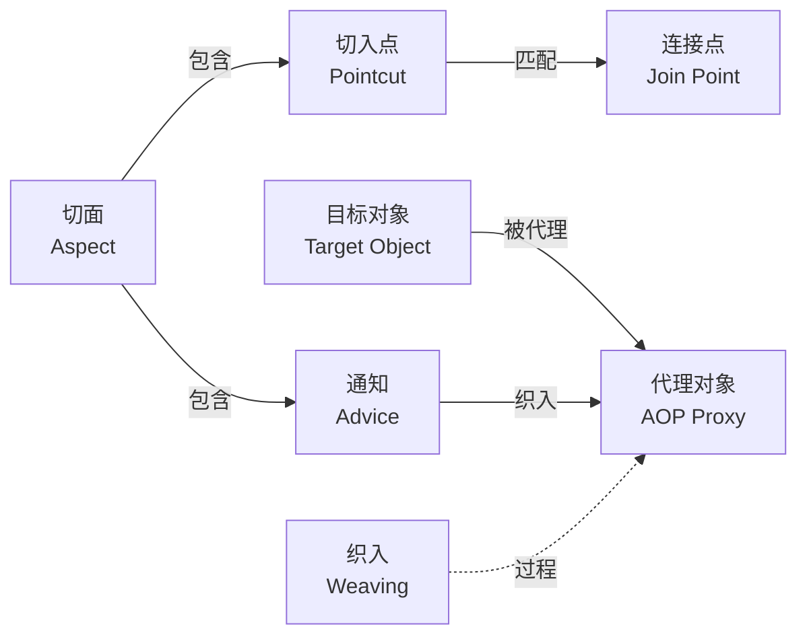

**理解要点**：切面（Aspect）是切入点（Pointcut）和通知（Advice）的容器。切入点决定"在哪里增强"，通知决定"增强什么"。织入是将切面逻辑应用到目标对象生成代理对象的过程。

## Spring AOP 的实现原理

### Spring AOP 基于代理

Spring AOP 并不是直接修改目标类字节码，而是通过**代理对象**在方法调用前后织入增强逻辑。这是理解所有 AOP 行为的基石。

::: details 为什么 Spring 选择代理而不是字节码修改？
代理方式的优势在于：
1. **无需额外编译步骤**：不需要 AspectJ 编译器或字节码增强工具
2. **与 IoC 容器天然集成**：代理对象本身就是容器管理的 Bean
3. **运行时灵活**：可以根据条件动态决定是否创建代理
4. **简单易用**：开发者只需关注切面逻辑，不需要理解字节码操作

代价是只能支持方法级连接点，无法拦截字段访问、构造器调用等。如果需要这些能力，应考虑 AspectJ 的编译时织入（CTW）或加载时织入（LTW）。
:::

### 两种代理方式

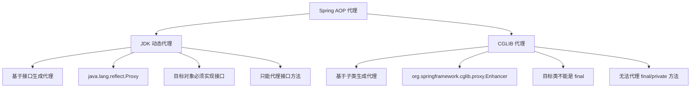

#### JDK 动态代理

- **实现方式**：基于接口生成代理类
- **核心类**：`java.lang.reflect.Proxy` + `InvocationHandler`
- **要求**：目标对象必须实现至少一个接口
- **特点**：
  - 原生 Java 支持，无需额外依赖
  - 只能代理接口中定义的方法
  - JDK 8+ 性能已大幅优化

#### CGLIB 代理

- **实现方式**：基于子类继承生成代理类
- **核心类**：`org.springframework.cglib.proxy.Enhancer` + `MethodInterceptor`
- **要求**：目标类不能是 final 类，方法不能是 final/private
- **特点**：
  - 可以代理没有接口的类
  - 通过继承实现，无法代理 final 方法和类
  - 方法调用性能较好（首次创建代理有开销）

### Spring 如何选择代理方式

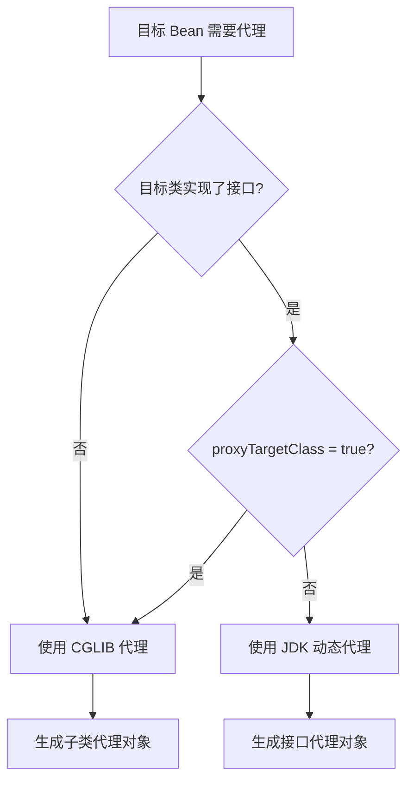

Spring 会根据以下规则自动选择代理方式：

1. **有接口**：如果目标对象实现了接口，默认使用 JDK 动态代理
2. **无接口**：如果目标对象没有实现接口，使用 CGLIB 代理
3. **强制 CGLIB**：可以通过配置强制使用 CGLIB 代理

```java
// 强制使用 CGLIB 代理（Spring Boot 2.x+ 默认就是如此）
@EnableAspectJAutoProxy(proxyTargetClass = true)
```

::: tip Spring Boot 2.x 后的变化
从 Spring Boot 2.x 开始，默认使用 CGLIB 代理（`proxyTargetClass=true`），即使目标对象实现了接口。Spring Boot 3.x / Spring 6.x 延续了这一默认行为。这主要是为了保持行为一致性，避免因接口变化导致的代理方式切换问题。
:::

### 代理机制的核心前提

**外部调用要经过代理对象，增强逻辑才会生效。**

这也是很多 AOP 问题的根源：

| 场景 | 问题原因 | 结果 |
|------|---------|------|
| 同类内部方法直接调用 | 没有经过代理对象 | AOP 不生效 |
| `private` 方法 | 无法被子类继承（CGLIB）或代理（JDK） | AOP 不生效 |
| `final` 方法/类 | 无法被子类继承（CGLIB） | AOP 不生效 |
| Bean 没有交给 Spring 容器管理 | 没有代理对象 | AOP 不生效 |
| 静态方法 | 属于类级别，不参与对象实例化 | AOP 不生效 |

::: warning 为什么事务失效问题常常是 AOP 问题？
事务管理本质上是通过 AOP 实现的。如果 AOP 代理链没走到，事务自然就不会生效。所以遇到事务失效问题时，首先要检查是否满足 AOP 的生效条件。详见 [事务管理与失效场景](03-事务管理与失效场景.md)。
:::

## AspectJ 注解与启用

Spring AOP 借用了 AspectJ 的注解风格（`@Aspect`、`@Pointcut`、`@Around` 等），但运行时仍然是通过动态代理实现的，不是 AspectJ 的编译时织入。

### 启用 AOP

```java
// 注解方式启用（推荐）
@Configuration
@EnableAspectJAutoProxy
public class AppConfig {}

// 强制 CGLIB + 暴露代理对象
@EnableAspectJAutoProxy(proxyTargetClass = true, exposeProxy = true)
```

Spring Boot 项目引入 `spring-boot-starter-aop` 即可自动配置，无需手动添加 `@EnableAspectJAutoProxy`。

### 定义切面

```java
@Aspect   // 标记为切面类
@Component
public class LoggingAspect {

    @Before("execution(* com.example.service.*.*(..))")
    public void logBefore(JoinPoint joinPoint) {
        System.out.println("调用方法: " + joinPoint.getSignature().getName());
    }
}
```

::: details Spring AOP 使用了 AspectJ 的注解，但不是 AspectJ
Spring AOP 借用了 AspectJ 的注解风格（如 `@Aspect`、`@Pointcut`、`@Around`），但运行时仍然是通过动态代理实现的，不是 AspectJ 的编译时织入。Spring 文档明确说明：Spring AOP 是"AspectJ 风格的注解"，而非 AspectJ 本身。
:::

## 切入点表达式详解

切入点表达式（Pointcut Expression）用于定义哪些连接点（方法）需要被增强。Spring AOP 使用 AspectJ 的切入点表达式语法。

### execution 表达式（最常用）

**完整语法**：

```
execution(修饰符模式? 返回类型模式 方法名模式(参数模式) 异常模式?)
```

**常用语法**：

```
execution(* 包名.类名.方法名(参数列表))
```

#### 通配符说明

| 通配符 | 说明 |
|--------|------|
| `*` | 匹配任意字符，但只能匹配一个单词（包名、类名、方法名）或任意返回类型 |
| `..` | 匹配任意字符，可以匹配多个单词（在参数中表示任意数量参数） |
| `+` | 匹配指定类及其子类 |

#### 常用示例

```java
// 1. 匹配所有 public 方法
execution(public * *(..))

// 2. 匹配所有以 set 开头的方法
execution(* set*(..))

// 3. 匹配 AccountService 接口的所有方法
execution(* com.example.service.AccountService.*(..))

// 4. 匹配 service 包下所有类的所有方法
execution(* com.example.service.*.*(..))

// 5. 匹配 service 包及其子包下所有类的所有方法（注意 .. 的位置）
execution(* com.example.service..*.*(..))

// 6. 匹配特定方法名，且参数为两个字符串
execution(* com.example.service.AccountService.create(String, String))

// 7. 匹配无参数方法
execution(* com.example.service.AccountService.*())

// 8. 匹配第一个参数为 String 的方法
execution(* com.example.service.*.*(String, ..))

// 9. 匹配返回值为 String 的方法
execution(String com.example.service.*.*(..))

// 10. 匹配抛出特定异常的方法
execution(* com.example.service.*.*(..) throws java.lang.IllegalArgumentException)
```

::: warning execution 表达式常见错误
- `execution(* com.example.service..)` — 缺少方法名部分，语法错误
- `execution(* com.example.service.*Service)` — 缺少方法名，应为 `*Service.*(..)`
- `execution(* *..service.*.*(..))` — `*..` 虽然合法但范围过大，不推荐
:::

### 其他切入点指示符

#### 1. `@annotation` — 匹配带有特定注解的方法（推荐）

```java
// 匹配所有带有 @Loggable 注解的方法
@annotation(com.example.annotation.Loggable)

// 绑定注解实例，在通知中获取注解属性
@Around("@annotation(loggable)")
public Object logMethod(ProceedingJoinPoint joinPoint, Loggable loggable) throws Throwable {
    String operation = loggable.value();  // 获取注解属性
    // ...
}
```

::: tip 为什么推荐 @annotation？
`@annotation` 比 `execution` 更灵活、更精确：只有标注了注解的方法才会被代理，不会误伤新增方法，代码可读性也更好——一眼就能看出哪些方法被增强了。Spring 的 `@Transactional` 就是这种模式的典范。
:::

#### 2. `@within` — 匹配带有特定注解的类中的所有方法

```java
// 匹配所有带有 @Service 注解的类中的方法
@within(org.springframework.stereotype.Service)
```

#### 3. `within` — 匹配特定类型中的所有方法

```java
// 匹配 AccountService 类中的所有方法
within(com.example.service.AccountService)

// 匹配 service 包下所有类中的方法
within(com.example.service..*)
```

#### 4. `this` 和 `target`

```java
// this: 匹配代理对象是指定类型的方法（受代理方式影响）
this(com.example.service.AccountService)

// target: 匹配目标对象是指定类型的方法（不受代理方式影响）
target(com.example.service.AccountService)
```

::: details this 和 target 的区别
- `this` 匹配的是**代理对象**的类型。使用 JDK 动态代理时，代理对象只实现接口，所以 `this(实现类)` 可能匹配不到
- `target` 匹配的是**目标对象**的类型，不受代理方式影响
- 实际开发中，`target` 更稳定可靠，`this` 较少使用
:::

#### 5. `args` — 匹配参数类型

```java
// 匹配第一个参数为 String 类型的方法
args(String, ..)

// 匹配两个参数，第一个为 String，第二个为 Long
args(String, Long)
```

#### 6. `bean` — 匹配特定名称的 Bean

```java
// 匹配名称为 accountService 的 Bean 的所有方法
bean(accountService)

// 匹配名称以 Service 结尾的 Bean 的所有方法
bean(*Service)
```

### 组合切入点表达式

使用逻辑运算符组合多个切入点表达式：

```java
// && (AND): 同时满足两个条件
@Pointcut("execution(* com.example.service.*.*(..)) && args(String, ..)")
public void serviceMethodWithStringParam() {}

// || (OR): 满足任意一个条件
@Pointcut("execution(* com.example.service.*.*(..)) || execution(* com.example.dao.*.*(..))")
public void serviceOrDaoMethod() {}

// ! (NOT): 取反
@Pointcut("execution(* com.example.service.*.*(..)) && !@annotation(com.example.annotation.SkipLog)")
public void serviceMethodWithoutSkipLog() {}
```

### 切入点表达式的最佳实践

1. **尽量缩小范围**：范围越大，性能开销越大，误拦截风险越高
2. **使用命名切入点**：复用切入点表达式，提高可维护性
3. **避免过于复杂的表达式**：复杂的表达式难以理解和维护
4. **优先使用注解匹配**：`@annotation` 比 `execution` 更灵活、更精确

```java
// 推荐：使用命名切入点
@Aspect
@Component
public class LoggingAspect {

    // 定义命名切入点
    @Pointcut("execution(* com.example.service..*.*(..))")
    public void serviceLayer() {}

    @Pointcut("@annotation(com.example.annotation.Loggable)")
    public void loggableMethod() {}

    // 复用切入点
    @Around("serviceLayer() && loggableMethod()")
    public Object logMethod(ProceedingJoinPoint joinPoint) throws Throwable {
        // ...
    }
}
```

## 注解装配实战

### 为什么推荐注解装配

使用 `execution` 切入点表达式做"无差别全覆盖"存在明显缺点：

1. **过于宽泛**：匹配包下所有方法，可能拦截不需要的方法
2. **误伤面大**：新增方法自动被拦截，可能不符合预期
3. **不够灵活**：无法精确控制哪些方法需要代理
4. **可读性差**：需要查看切面类才能知道哪些方法被代理了

按方法名前缀拦截更不可取：

```java
// × 从方法前缀区分是否是数据库操作，非常不可靠
@Around("execution(public * update*(..))")
public Object doLogging(ProceedingJoinPoint pjp) throws Throwable { ... }
```

| 特性 | 切入点表达式 | 注解装配 |
|------|------------|---------|
| 精确度 | 可能过于宽泛 | 精确控制，只代理标注注解的方法 |
| 可读性 | 需要查看切面类 | 注解在方法上，一目了然 |
| 灵活性 | 修改需要改切面代码 | 修改注解即可 |
| 维护性 | 新增方法可能被意外代理 | 明确指定，无意外 |

Spring 的 `@Transactional` 就是注解装配的典范——只有标注了 `@Transactional` 的方法才有事务，其他方法不受影响。

### 实战：自定义 @MetricTime 注解

**第一步：定义注解**

```java
package com.example.annotation;

@Target(ElementType.METHOD)           // 作用于方法
@Retention(RetentionPolicy.RUNTIME)   // 运行时保留（AOP 需要运行时反射）
public @interface MetricTime {
    String value();  // 监控名称
}
```

::: tip @Retention 为什么必须是 RUNTIME？
`@Retention(RetentionPolicy.RUNTIME)` 确保注解在运行时可通过反射获取。如果使用 `CLASS` 或 `SOURCE`，Spring AOP 在运行时无法读取注解，切面不会生效。
:::

**第二步：使用注解**

```java
@Component
public class UserService {
    // 监控 register() 方法性能
    @MetricTime("register")
    public User register(String email, String password, String name) {
        User user = new User(email, password, name);
        return userRepository.save(user);
    }

    // 不需要监控的方法不标注注解
    public boolean isValidEmail(String email) {
        return email != null && email.contains("@");
    }
}
```

**第三步：定义切面**

```java
@Aspect @Component
public class MetricAspect {
    /**
     * 环绕通知：拦截所有标注了 @MetricTime 注解的方法
     *
     * @param joinPoint  连接点
     * @param metricTime 注解对象（参数名必须与 @annotation(...) 中引用的名字一致）
     */
    @Around("@annotation(metricTime)")
    public Object metric(ProceedingJoinPoint joinPoint, MetricTime metricTime) throws Throwable {
        String name = metricTime.value();  // 获取注解的 value 属性
        long start = System.currentTimeMillis();

        try {
            return joinPoint.proceed();
        } finally {
            long elapsed = System.currentTimeMillis() - start;
            System.err.println("[Metrics] " + name + ": " + elapsed + "ms");
        }
    }
}
```

**关键点**：

1. `@Around("@annotation(metricTime)")`：匹配带有 `@MetricTime` 注解的方法
2. 参数 `MetricTime metricTime`：Spring 自动注入注解对象
3. 参数名 `metricTime` 必须与切入点表达式中引用的名字一致（`@annotation(metricTime)` 引用的就是参数名）

**输出**：

```
[Metrics] register: 105ms
```

只有标注了 `@MetricTime` 的方法才会被监控，其他方法不受影响。

### 类级别注解

注解不仅可以作用在方法上，还可以作用在类上，使用 `@within` 匹配：

```java
// 定义类级别注解
@Target(ElementType.TYPE)
@Retention(RetentionPolicy.RUNTIME)
public @interface ServiceMonitor {
    String serviceName();
}

// 使用
@ServiceMonitor(serviceName = "用户服务")
@Service
public class UserService {
    public User getUser(Long id) { ... }
}

// 切面
@Aspect @Component
public class ServiceMonitorAspect {
    @Around("@within(serviceMonitor)")
    public Object monitor(ProceedingJoinPoint joinPoint, ServiceMonitor serviceMonitor) throws Throwable {
        String serviceName = serviceMonitor.serviceName();
        String methodName = joinPoint.getSignature().getName();
        log.info("服务: {}, 方法: {}", serviceName, methodName);
        return joinPoint.proceed();
    }
}
```

### 组合注解

将多个注解组合成一个复合注解，减少重复标注：

```java
// 组合事务 + 日志 + 权限
@Target(ElementType.METHOD)
@Retention(RetentionPolicy.RUNTIME)
@Transactional
@Log
@RequirePermission
public @interface ServiceMethod {
    String value() default "";
    String permission() default "";
}

// 使用组合注解
@Service
public class UserService {
    @ServiceMethod(value = "创建用户", permission = "user:create")
    public User createUser(String name, String email) { ... }
}
```

::: warning 组合注解的局限性
组合注解要求每个元注解的切面都能识别到它。如果切面使用 `@annotation(Log)`，而方法上标注的是 `@ServiceMethod`（其上有 `@Log`），则不会匹配。需要改用 `@annotation` 的全限定名或使用 `@within` 等其他方式。
:::

## 通知类型详解

Spring AOP 支持 5 种通知类型（Advice）：

| 通知类型 | 注解 | 执行时机 | 能否访问参数 | 能否访问返回值 | 能否访问异常 | 能否控制执行 |
|---------|------|---------|------------|-------------|-----------|------------|
| 前置通知 | `@Before` | 方法执行前 | 是 | 否 | 否 | 否（除非抛异常） |
| 后置返回通知 | `@AfterReturning` | 方法正常返回后 | 否 | 是 | 否 | 否 |
| 异常通知 | `@AfterThrowing` | 方法抛出异常后 | 否 | 否 | 是 | 否 |
| 最终通知 | `@After` | 方法结束后（无论成功或异常） | 否 | 否 | 否 | 否 |
| 环绕通知 | `@Around` | 包住整个方法调用 | 是 | 是 | 是 | 是 |

### 1. 前置通知（@Before）

在目标方法执行前执行，常用于参数校验、权限检查等。

```java
@Aspect
@Component
public class ValidationAspect {

    // 通过 JoinPoint 获取方法信息
    @Before("execution(* com.example.service.*.*(..))")
    public void logParameters(JoinPoint joinPoint) {
        String methodName = joinPoint.getSignature().getName();
        Object[] args = joinPoint.getArgs();
        System.out.println("调用方法: " + methodName + ", 参数: " + Arrays.toString(args));
    }

    // 通过 args 绑定直接获取参数
    @Before("execution(* com.example.service.*.create*(..)) && args(entity)")
    public void validateEntity(Object entity) {
        if (entity == null) {
            throw new IllegalArgumentException("实体不能为 null");
        }
        System.out.println("参数校验通过: " + entity);
    }
}
```

::: tip JoinPoint 的常用方法
- `getSignature()` — 获取方法签名（方法名、返回类型等）
- `getArgs()` — 获取方法参数数组
- `getTarget()` — 获取目标对象
- `getThis()` — 获取代理对象
:::

### 2. 后置返回通知（@AfterReturning）

在目标方法正常返回后执行，可以访问方法的返回值。

```java
@Aspect
@Component
public class ResultLogAspect {

    @AfterReturning(
        pointcut = "execution(* com.example.service.*.find*(..))",
        returning = "result"
    )
    public void logReturnValue(Object result) {
        System.out.println("方法返回值: " + result);
    }

    // 修改返回值（谨慎使用）
    @AfterReturning(
        pointcut = "execution(* com.example.service.UserService.findById(..))",
        returning = "user"
    )
    public void maskSensitiveData(User user) {
        // 脱敏处理
        if (user != null) {
            user.setPassword("******");
        }
    }
}
```

::: warning @AfterReturning 不能替换返回值
`@AfterReturning` 可以修改返回值对象的内部状态（如脱敏），但**不能替换返回值本身**。如果需要替换返回值，必须使用 `@Around`。
:::

### 3. 异常通知（@AfterThrowing）

在目标方法抛出异常后执行，可以访问抛出的异常对象。

```java
@Aspect
@Component
public class ExceptionLogAspect {

    @AfterThrowing(
        pointcut = "execution(* com.example.service.*.*(..))",
        throwing = "ex"
    )
    public void logException(Exception ex) {
        System.err.println("方法抛出异常: " + ex.getMessage());
        // 发送告警
        alertService.sendAlert(ex);
    }
}
```

::: warning @AfterThrowing 不会吞掉异常
`@AfterThrowing` 只能"观察"异常，不能"吞掉"异常。异常仍然会继续抛出。如果需要吞掉异常或转换为其他异常，必须使用 `@Around`。
:::

### 4. 最终通知（@After）

无论目标方法是正常返回还是抛出异常，都会执行。类似 try-catch-finally 中的 finally。

```java
@Aspect
@Component
public class CleanupAspect {

    @After("execution(* com.example.service.*.*(..))")
    public void doCleanup() {
        // 清理工作
        ThreadLocalContext.clear();
        System.out.println("清理工作完成");
    }
}
```

::: warning @After 无法获取返回值和异常
`@After` 既不能访问返回值，也不能访问异常对象。如果需要这些信息，应该使用 `@AfterReturning` 或 `@AfterThrowing`，或者直接使用功能最全的 `@Around`。
:::

### 5. 环绕通知（@Around）

最强大的通知类型，可以完全控制目标方法的执行。适合用于：

- 统计方法执行时间
- 缓存
- 重试
- 统一异常处理
- 条件性执行

```java
@Aspect
@Component
public class AroundAspectExample {

    // 示例1：统计方法执行时间
    @Around("execution(* com.example.service.*.*(..))")
    public Object logExecutionTime(ProceedingJoinPoint joinPoint) throws Throwable {
        long startTime = System.currentTimeMillis();

        try {
            Object result = joinPoint.proceed();
            return result;
        } finally {
            long cost = System.currentTimeMillis() - startTime;
            String methodName = joinPoint.getSignature().toShortString();
            System.out.println(methodName + " 执行耗时: " + cost + " ms");
        }
    }

    // 示例2：缓存
    @Around("execution(* com.example.service.*.findById(..)) && args(id)")
    public Object cacheResult(ProceedingJoinPoint joinPoint, Long id) throws Throwable {
        String cacheKey = "user:" + id;
        Object cachedValue = cacheService.get(cacheKey);

        if (cachedValue != null) {
            System.out.println("命中缓存: " + cacheKey);
            return cachedValue;
        }

        Object result = joinPoint.proceed();

        if (result != null) {
            cacheService.set(cacheKey, result, 3600);
        }

        return result;
    }

    // 示例3：重试机制
    @Around("@annotation(retry)")
    public Object retryOnFailure(ProceedingJoinPoint joinPoint, Retry retry) throws Throwable {
        int maxAttempts = retry.maxAttempts();
        int attempt = 0;
        Throwable lastException;

        do {
            attempt++;
            try {
                return joinPoint.proceed();
            } catch (Throwable ex) {
                lastException = ex;
                if (attempt < maxAttempts) {
                    System.out.println("第 " + attempt + " 次尝试失败，准备重试");
                    Thread.sleep(retry.delay());
                }
            }
        } while (attempt < maxAttempts);

        throw lastException;
    }
}

// 重试注解
@Target(ElementType.METHOD)
@Retention(RetentionPolicy.RUNTIME)
public @interface Retry {
    int maxAttempts() default 3;
    long delay() default 1000;
}
```

::: danger @Around 必须调用 proceed()
`@Around` 通知中**必须**调用 `joinPoint.proceed()`，否则目标方法不会执行。忘记调用 proceed() 是最常见的 AOP 错误之一。同时，proceed() 的返回值就是目标方法的返回值，不要丢弃它。
:::

## 多切面与执行顺序

当多个通知应用于同一个连接点时，执行顺序如下：

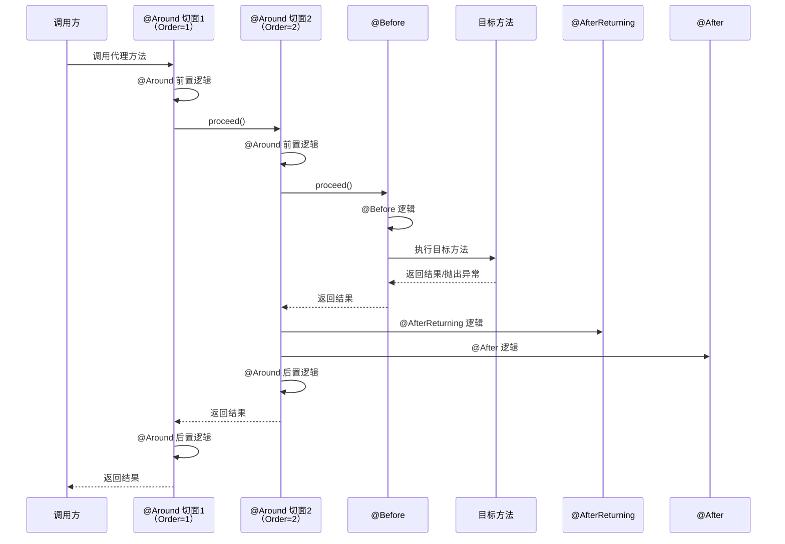

**简化记忆**：

```
@Around 前置 → @Before → 目标方法 → @AfterReturning/@AfterThrowing → @After → @Around 后置
```

### 控制通知顺序

使用 `@Order` 注解或实现 `Ordered` 接口控制多个切面的执行顺序：

```java
@Aspect
@Component
@Order(1)  // 数字越小，优先级越高（最先进入，最后退出）
public class LoggingAspect {
    // ...
}

@Aspect
@Component
@Order(2)
public class TransactionAspect {
    // ...
}
```

::: warning @Order 的"先入后出"特性
`@Order` 值小的切面**先执行前置逻辑，后执行后置逻辑**（类似栈的入栈出栈）。这意味着：
- 前置顺序：Order(1) → Order(2) → Order(3)
- 后置顺序：Order(3) → Order(2) → Order(1)

这在事务和日志的配合中很重要：通常希望事务切面（Order 小）包住日志切面（Order 大），确保日志在事务内执行。
:::

### 多切面顺序设计原则

| 优先级 | 切面 | 理由 |
|--------|------|------|
| 最高（Order 小） | 安全/权限 | 先检查权限，避免无权限操作浪费资源 |
| 高 | 事务 | 保证事务包裹业务逻辑，确保原子性 |
| 低 | 日志 | 记录完整执行过程 |
| 最低（Order 大） | 性能监控 | 统计完整耗时 |

::: danger 事务切面的顺序至关重要
事务切面必须包住业务逻辑和其他切面（日志、监控等），否则：
- 如果日志切面在事务外，日志写入可能成功但事务回滚，导致日志与数据不一致
- 如果安全切面在事务内，权限检查失败会触发事务回滚，浪费数据库资源
:::

### Spring 5.2.7+ 的顺序修正

在 Spring 5.2.7 之前，同一个切面内 `@After` 先于 `@AfterReturning` 执行，这不符合直觉。Spring 5.2.7 修正了这个问题，现在的顺序是：

```
@AfterReturning → @After
```

Spring 6.x / Boot 3.x 自然继承了修正后的行为。

## AOP 原理（源码级）

::: details 从注解到代理：整体流程

`@EnableAspectJAutoProxy` 注解向容器注册了 `AnnotationAwareAspectJAutoProxyCreator`，它是一个 `BeanPostProcessor`，在 Bean 初始化后介入：

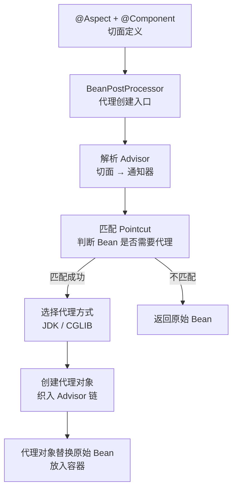

**关键角色**：

| 角色 | 类 | 职责 |
|------|-----|------|
| 代理创建入口 | `AnnotationAwareAspectJAutoProxyCreator` | BeanPostProcessor 实现，扫描 @Aspect 并创建代理 |
| 通知器 | `Advisor` / `PointcutAdvisor` | 切入点 + 通知的封装，代理链的基本单元 |
| 代理工厂 | `ProxyFactory` | 根据条件选择 JDK 或 CGLIB 创建代理 |
| 调用链 | `ReflectiveMethodInvocation` | 责任链模式，依次执行 Advisor 中的通知 |

```java
// 简化逻辑
public Object postProcessAfterInitialization(Object bean, String beanName) {
    if (bean != null) {
        // 1. 从所有 @Aspect Bean 中解析出 Advisor 列表
        List<Advisor> advisors = findCandidateAdvisors();

        // 2. 筛选出匹配当前 Bean 的 Advisor
        List<Advisor> eligibleAdvisors = findAdvisorsThatCanApply(advisors, bean.getClass());

        if (!eligibleAdvisors.isEmpty()) {
            // 3. 创建代理对象
            return createProxy(bean, eligibleAdvisors);
        }
    }
    return bean;  // 不需要代理，返回原始 Bean
}
```

为什么是 `postProcessAfterInitialization` 而不是之前？Spring 需要等 Bean 完成属性注入和初始化（`@PostConstruct`）后，才能确定它的最终类型和接口，从而正确选择代理方式。如果在初始化前创建代理，可能导致属性注入失败或代理类型不匹配。
:::

::: details Advisor 链的构建

Spring 不会直接使用 `@Aspect` 类，而是将其解析为一组 `Advisor`（通知器）。每个通知方法对应一个 `InstantiationModelAwarePointcutAdvisor`：

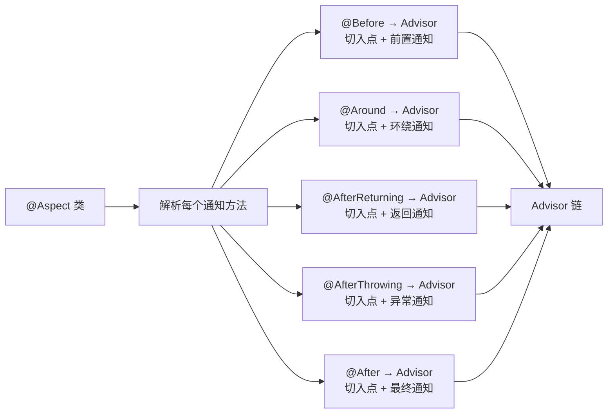

**Advisor 的结构**：

```java
public interface Advisor {
    Advice getAdvice();        // 通知逻辑
    boolean isPerInstance();
}

public interface PointcutAdvisor extends Advisor {
    Pointcut getPointcut();    // 切入点
}
```

每个 Advisor 就是一个"切入点 + 通知"的配对，是代理链调度的最小单元。

**切入点匹配过程**：Spring 使用 `Pointcut` 的 `ClassFilter` 和 `MethodMatcher` 两级过滤来判断一个 Bean 是否需要代理：

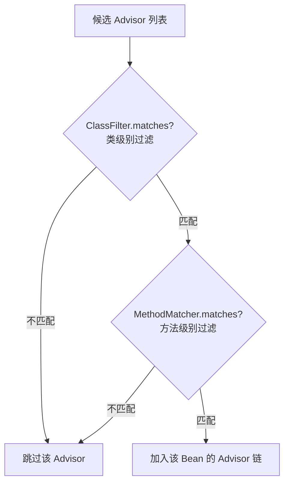

`MethodMatcher` 有两种模式：
- **静态匹配**（`isRuntime() = false`）：匹配结果在代理创建时确定，运行时不再检查，性能好
- **动态匹配**（`isRuntime() = true`）：每次方法调用都要根据参数重新匹配，开销大

绝大多数场景使用静态匹配。`args()` 表达式绑定参数时可能触发动态匹配。
:::

::: details 调用链执行机制：ReflectiveMethodInvocation 与责任链

代理对象的方法调用最终由 `ReflectiveMethodInvocation` 处理，它采用**责任链模式**依次执行 Advisor 链中的通知：

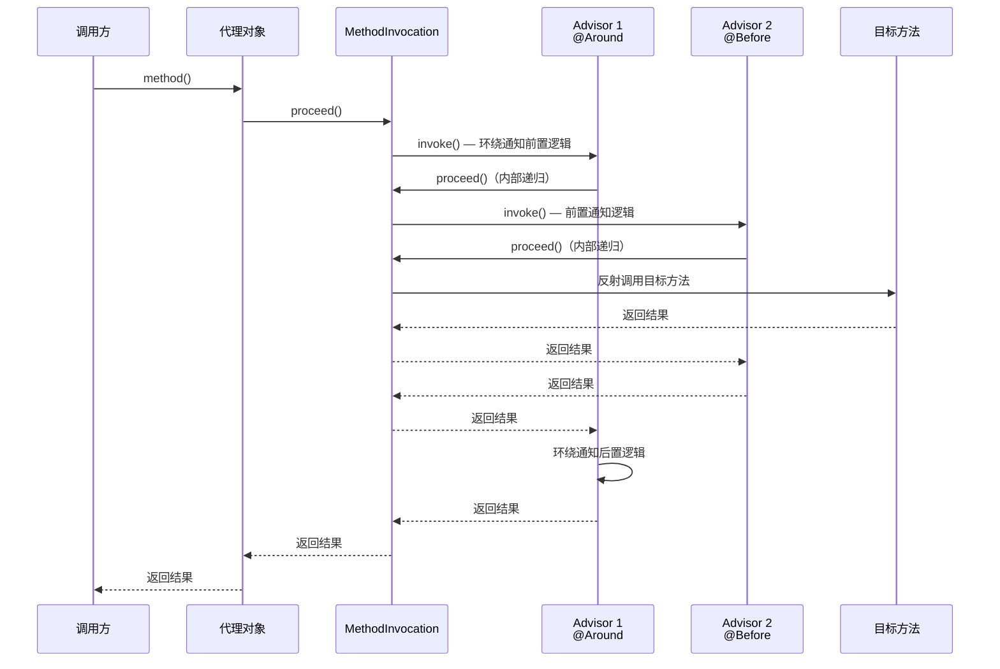

`proceed()` 的递归本质：

```java
public Object proceed() throws Throwable {
    // 所有 Advisor 都执行完毕，调用目标方法
    if (this.currentInterceptorIndex == this.interceptorsAndDynamicMethodMatchers.size() - 1) {
        return invokeJoinpoint();  // 反射调用目标方法
    }

    // 获取下一个 Advisor
    Object interceptorOrInterceptionAdvice =
        this.interceptorsAndDynamicMethodMatchers.get(++this.currentInterceptorIndex);

    if (interceptorOrInterceptionAdvice instanceof InterceptorAndDynamicMethodMatcher) {
        // 动态匹配：需要运行时检查参数
        InterceptorAndDynamicMethodMatcher dm =
            (InterceptorAndDynamicMethodMatcher) interceptorOrInterceptionAdvice;
        if (dm.methodMatcher.matches(this.method, this.targetClass, this.arguments)) {
            return dm.interceptor.invoke(this);  // 递归调用
        } else {
            return proceed();  // 跳过，继续下一个
        }
    } else {
        // 静态匹配：直接执行
        return ((MethodInterceptor) interceptorOrInterceptionAdvice).invoke(this);  // 递归调用
    }
}
```

**关键理解**：

1. 每个 Advisor 的 `invoke()` 方法接收 `this`（MethodInvocation），可以决定是否调用 `proceed()` 继续链
2. `@Around` 通知必须调用 `proceed()`，否则链断裂，目标方法不执行
3. `@Before` 通知在 `proceed()` 之前执行逻辑，然后自动调用 `proceed()`
4. `@AfterReturning` / `@AfterThrowing` / `@After` 通知在 `proceed()` 之后执行逻辑

**不同通知类型的适配器**：

Spring 将每种通知类型适配为 `MethodInterceptor` 接口，统一纳入责任链：

| 通知注解 | 适配器类 | invoke() 行为 |
|---------|---------|--------------|
| `@Around` | `AspectJAroundAdvice` | 手动调用 `proceed()`，完全控制 |
| `@Before` | `MethodBeforeAdviceInterceptor` | 先执行通知，再调用 `proceed()` |
| `@AfterReturning` | `AfterReturningAdviceInterceptor` | 先 `proceed()`，成功后执行通知 |
| `@AfterThrowing` | `AspectJAfterThrowingAdvice` | 先 `proceed()`，异常后执行通知 |
| `@After` | `AspectJAfterAdvice` | try { proceed() } finally { 通知 } |

`@Before` 适配器的源码：

```java
public class MethodBeforeAdviceInterceptor implements MethodInterceptor {
    private final MethodBeforeAdvice advice;

    @Override
    public Object invoke(MethodInvocation invocation) throws Throwable {
        this.advice.before(invocation.getMethod(), invocation.getArguments(), invocation.getThis());
        return invocation.proceed();  // 前置通知执行后，自动继续链
    }
}
```

可以看到 `@Before` 通知无法阻止链继续执行（除非抛异常），也无法访问返回值。
:::

::: details 三级缓存与 AOP 代理创建

当 Bean 被 AOP 代理时，Spring 通过三级缓存确保循环依赖场景下代理对象的正确暴露：

```java
// AbstractAutowireCapableBeanFactory 中的三级缓存
/** 一级缓存：完整的 Bean */
private final Map<String, Object> singletonObjects = new ConcurrentHashMap<>(256);

/** 二级缓存：早期 Bean（已实例化，未填充属性） */
private final Map<String, Object> earlySingletonObjects = new ConcurrentHashMap<>(16);

/** 三级缓存：Bean 工厂（用于生成代理对象） */
private final Map<String, ObjectFactory<?>> singletonFactories = new HashMap<>(16);
```

三级缓存的关键：`singletonFactories` 中存放的不是 Bean 本身，而是一个 `ObjectFactory`，它会在被调用时判断是否需要创建代理：

```java
// 提前暴露 Bean 的工厂
addSingletonFactory(beanName, () -> getEarlyBeanReference(beanName, mbd, bean));

// getEarlyBeanReference 内部逻辑（简化）
protected Object getEarlyBeanReference(String beanName, RootBeanDefinition mbd, Object bean) {
    Object exposedObject = bean;
    // 遍历所有 BeanPostProcessor，如果需要代理则提前创建代理
    for (SmartInstantiationAwareBeanPostProcessor bp : getBeanPostProcessors()) {
        exposedObject = bp.getEarlyBeanReference(exposedObject, beanName);
    }
    return exposedObject;
}
```

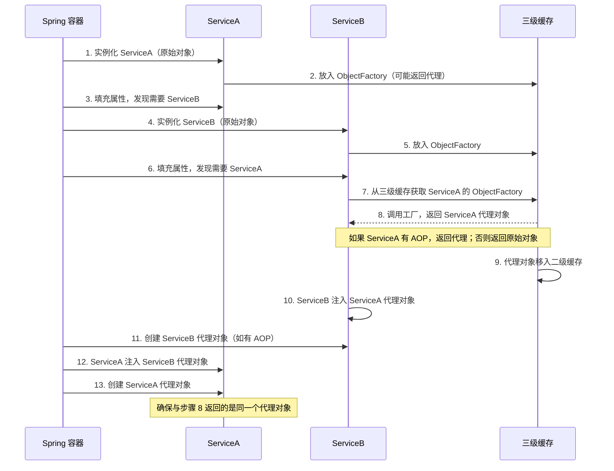

::: warning 构造器注入的循环依赖无法解决
如果 ServiceA 通过构造器注入 ServiceB，那么在实例化 ServiceA 时就需要 ServiceB，而此时 ServiceA 还未创建，无法提前暴露到三级缓存。解决方案是使用 `@Lazy` 延迟注入：

```java
@Service
public class ServiceA {
    private final ServiceB serviceB;

    public ServiceA(@Lazy ServiceB serviceB) {
        this.serviceB = serviceB;  // 注入的是代理，不是真实对象
    }
}
```
:::
:::

## 代理失效与避坑

### 陷阱1：同类内部调用导致 AOP 不生效

这是最常见的 AOP 陷阱，也是事务失效的头号原因。

```java
@Service
public class OrderService {

    public void createOrder() {
        // 直接调用同类方法，不经过代理
        validateOrder();  // × AOP 不生效
    }

    @Transactional
    public void validateOrder() {
        // 事务不生效
    }
}
```

**根因**：外部调用经过代理对象，增强逻辑生效；内部调用使用 `this` 引用，直接调用原始对象的方法，绕过了代理。

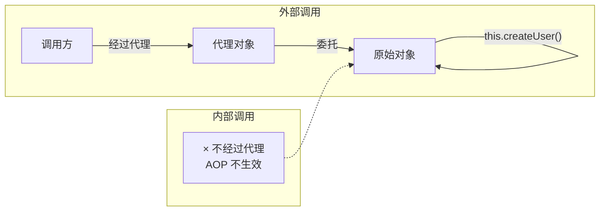

**解决方案**：

```java
// 方案1：注入自己，通过代理调用（推荐）
@Service
public class OrderService {

    @Autowired
    private OrderService self;  // 注入自己

    public void createOrder() {
        self.validateOrder();  // √ 经过代理
    }

    @Transactional
    public void validateOrder() {
        // 事务生效
    }
}

// 方案2：使用 AopContext 获取当前代理对象
@Service
public class OrderService {

    public void createOrder() {
        OrderService proxy = (OrderService) AopContext.currentProxy();
        proxy.validateOrder();  // √ 经过代理
    }

    @Transactional
    public void validateOrder() {
        // 事务生效
    }
}

// 注意：使用 AopContext 需要配置
@EnableAspectJAutoProxy(exposeProxy = true)
```

::: warning 方案1 的循环依赖问题
通过 `@Autowired` 注入自身在 Spring Boot 2.6+ 中可能触发循环依赖检测。解决方案：使用 `@Lazy` 延迟注入，或改用方案2（`AopContext`），或将方法拆分到不同 Service 中。**拆分 Service 是最干净的方案**，从根本上避免自调用。
:::

### 陷阱2：CGLIB 代理的成员变量陷阱（final 变量 NPE）

这是 AOP 最经典的坑之一——被代理 Bean 的 `final` 成员变量可能为 null。

**问题复现**：

```java
@Component
public class UserService {
    // final 成员变量
    public final ZoneId zoneId = ZoneId.systemDefault();

    public ZoneId getZoneId() {
        return zoneId;
    }

    public final ZoneId getFinalZoneId() {
        return zoneId;
    }
}
```

在 `MailService` 中注入并使用：

```java
@Component
public class MailService {
    @Autowired
    UserService userService;

    public String sendMail() {
        ZoneId zoneId = userService.zoneId;  // 直接访问字段
        return "Hello, it is " + ZonedDateTime.now(zoneId).toString();
    }
}
```

没有 AOP 时一切正常。但给 `UserService` 加上 AOP 后，`userService.zoneId` 的值变成 **null**——一个 `final` 变量竟然是 null。

**根因分析**：Spring 用 Objenesis 实例化 CGLIB 代理对象，**完全不执行目标类的构造方法**。而 Java 中成员变量的初始化实际上是在构造方法中完成的：

```java
// 我们写的代码
public class UserService {
    public final ZoneId zoneId = ZoneId.systemDefault();
    public UserService() {}
}

// 编译器实际生成的代码
public class UserService {
    public final ZoneId zoneId;
    public UserService() {
        super();                          // 自动添加
        zoneId = ZoneId.systemDefault();  // 成员变量初始化移入构造方法
    }
}
```

由于代理实例创建时没有执行任何构造方法（字段初始化代码编译在构造方法里），从父类继承的成员变量初始化代码不会运行，导致 `zoneId` 保持默认值 `null`。

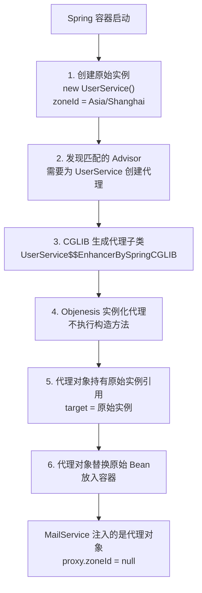

::: danger 核心结论
CGLIB 创建的代理实例不会初始化从父类继承的任何成员变量，包括 `final` 变量。这是因为 Spring 通过 Objenesis 创建代理实例，不执行任何构造方法，而字段初始化代码已被编译器移入构造方法。
:::

**解决方案**：

```java
@Component
public class MailService {
    @Autowired
    UserService userService;

    public String sendMail() {
        // × 直接访问字段：proxy.zoneId = null
        // ZoneId zoneId = userService.zoneId;

        // √ 通过方法访问：代理类覆写了 getZoneId()，委托给原始实例
        ZoneId zoneId = userService.getZoneId();
        return "Hello, it is " + ZonedDateTime.now(zoneId).toString();
    }
}
```

代理类覆写了 `getZoneId()` 方法，将其委托给原始实例：

```java
// CGLIB 生成的代理类（伪代码）
public class UserService$$EnhancerBySpringCGLIB extends UserService {
    private UserService target;  // 持有原始实例

    @Override
    public ZoneId getZoneId() {
        return target.getZoneId();  // 委托给原始实例，zoneId 已正确初始化
    }
}
```

`final` 方法无法被代理类覆写，调用 `getFinalZoneId()` 时直接执行代理类自身的方法，返回的是代理类的 `zoneId`（即 null）。Spring 启动时会打印警告：

```
DEBUG o.s.aop.framework.CglibAopProxy - Final method [public final java.time.ZoneId
  xxx.UserService.getFinalZoneId()] cannot get proxied via CGLIB:
  Calls to this method will NOT be routed to the target instance and might
  lead to NPEs against uninitialized fields in the proxy instance.
```

::: warning 两条核心规则
1. **访问被注入的 Bean 时总是调用方法**，不要直接访问字段
2. **编写 Bean 时，如果可能被代理，不要编写 `public final` 方法**
:::

### 陷阱3：代理方式与类型注入陷阱

```java
public interface UserService {
    User getUser(Long id);
}

@Service
public class UserServiceImpl implements UserService {
    @Override
    public User getUser(Long id) {
        return userRepository.findById(id);
    }
}

// 另一个 Bean 注入时
@Service
public class OrderService {
    // × 注入实现类类型
    @Autowired
    private UserServiceImpl userServiceImpl;
}
```

当 `UserServiceImpl` 被代理时，代理方式决定了类型兼容性：

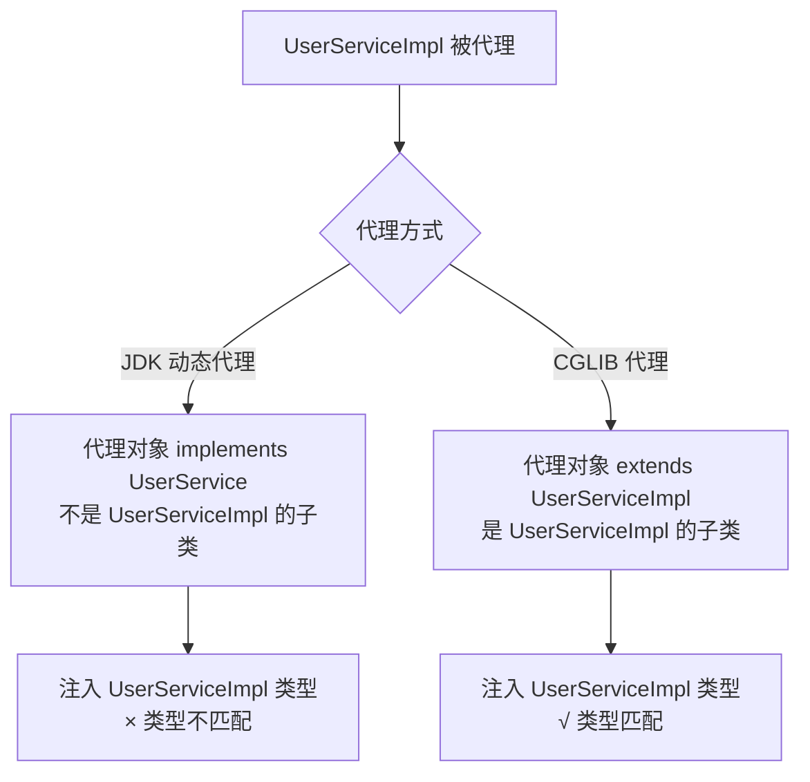

JDK 动态代理生成的对象只实现接口，不是 `UserServiceImpl` 的子类，注入 `UserServiceImpl` 类型会报错：

```
Bean not of required type [com.example.service.UserServiceImpl]
```

**解决方案**：始终注入接口类型，兼容两种代理方式。

::: tip Spring Boot 2.x+ 的默认行为
Spring Boot 2.x+ 默认使用 CGLIB 代理（`proxyTargetClass=true`），代理对象是目标类的子类，注入实现类类型不会报错。但**注入接口仍然是最佳实践**，因为面向接口编程是 Java 的基本规范，且如果将来切换代理方式不会出问题。
:::

### 陷阱4：构造方法中调用被代理方法

```java
@Service
public class UserService {
    @Autowired
    private UserRepository userRepository;

    // × 构造方法中调用被代理方法
    public UserService() {
        initUserCache();  // 此时代理对象还未创建
    }

    @Cacheable("userCache")
    public List<User> initUserCache() {
        return userRepository.findAll();
    }
}
```

代理对象在 Bean **初始化后**（`postProcessAfterInitialization`）才创建。构造方法执行时，Bean 还未完成实例化，代理对象更不存在，`@Cacheable` 注解不会生效。

**解决方案**：

```java
@Service
public class UserService {
    @Autowired
    private UserRepository userRepository;

    // √ 使用 @PostConstruct，在 Bean 初始化后执行
    @PostConstruct
    public void init() {
        initUserCache();  // 此时代理对象已创建
    }

    @Cacheable("userCache")
    public List<User> initUserCache() {
        return userRepository.findAll();
    }
}
```

::: warning @PostConstruct 中的自调用问题
`@PostConstruct` 在代理创建前执行，方法体运行在原始对象上，此时 `this.initUserCache()` 是自调用，AOP 不会生效。注意：换成 `SmartInitializingSingleton` 也解决不了——回调最终仍委托到原始对象执行，`this` 直调照样绕过代理。真有此需求，应注入自身代理（`@Lazy`）调用，或将初始化逻辑挪到容器就绪后（如监听 `ApplicationReadyEvent`）经代理调用。
:::

### 陷阱5：private / final / static 方法无法被代理

```java
@Service
public class UserService {

    @Transactional
    private void internalMethod() {
        // × 事务不生效，private 方法无法被代理
    }
}

@Service
public final class FinalService {

    @Transactional
    public void doSomething() {
        // × 如果使用 CGLIB，final 类无法被代理
    }
}
```

**解决方案**：去掉 `final`/`private` 修饰符，使用 `public` 方法。

::: tip Spring 6 / Boot 3 的变化
Spring 6.x 中，CGLIB 代理对 final 方法的处理更加严格。如果一个类只有 final 方法，Spring 会跳过代理创建并输出警告日志。建议在 Service 层避免使用 final 修饰符。
:::

### 陷阱6：异常被吞掉导致事务不回滚

```java
@Service
public class OrderService {

    @Transactional
    public void createOrder() {
        try {
            orderDao.save(order);
            inventoryService.deduct(order);  // 可能抛异常
        } catch (Exception e) {
            log.error("创建订单失败", e);
            // × 异常被吞掉，事务不会回滚
        }
    }
}

// 解决方案1：重新抛出异常
@Transactional
public void createOrder() {
    try {
        orderDao.save(order);
        inventoryService.deduct(order);
    } catch (Exception e) {
        log.error("创建订单失败", e);
        throw e;  // √ 重新抛出，事务回滚
    }
}

// 解决方案2：手动标记回滚
@Transactional
public void createOrder() {
    try {
        orderDao.save(order);
        inventoryService.deduct(order);
    } catch (Exception e) {
        log.error("创建订单失败", e);
        TransactionAspectSupport.currentTransactionStatus().setRollbackOnly();  // √ 手动回滚
    }
}
```

### 排障思路

遇到 AOP 不生效时，按照以下顺序排查：

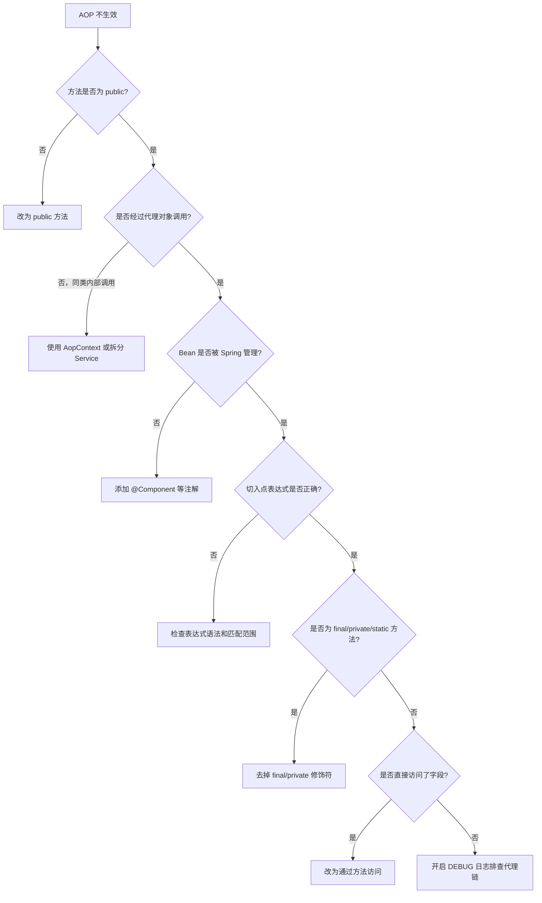

**调试技巧**：

```java
// 1. 检查是否创建了代理对象
AopUtils.isAopProxy(bean);          // 是否是代理
AopUtils.isCglibProxy(bean);        // 是否是 CGLIB 代理
AopUtils.isJdkDynamicProxy(bean);   // 是否是 JDK 代理

// 2. 查看代理对象的 Advisor 链
Advisor[] advisors = ((Advised) bean).getAdvisors();

// 3. 查看实际类型
bean.getClass().getName();
// 输出: UserService$$EnhancerBySpringCGLIB$$1c76af9d
```

**开启 AOP 调试日志**：

```yaml
# application.yml
logging:
  level:
    org.springframework.aop: DEBUG
    org.springframework.beans.factory.support.DefaultListableBeanFactory: DEBUG
```

## 实战案例：转账事务演进

这个案例从"为什么需要 AOP"出发，通过转账业务演示 AOP 的实战价值。

### 问题：事务应该在哪一层？

转账业务包含"转出"和"转入"两步操作，必须保证原子性——要么都成功，要么都回滚。如果事务放在 DAO 层，每个操作独立提交，中间出现异常就会导致数据不一致：

```java
@Service
public class AccountServiceImpl implements AccountService {

    @Autowired
    private AccountDao accountDao;

    @Override
    public void transfer(String outUser, String inUser, Double money) {
        accountDao.out(outUser, money);  // 成功提交
        int i = 1 / 0;                   // 模拟异常
        accountDao.in(inUser, money);     // 未执行，钱转出了但对方没收到
    }
}
```

### 手动事务：代码臃肿、耦合严重

将事务挪到 Service 层后，每个业务方法都要写 try-catch-finally，业务代码和事务代码深度耦合：

```java
// × 每个方法都重复事务模板代码
public void transfer(String outUser, String inUser, Double money) {
    try {
        transactionManager.beginTransaction();
        accountDao.out(outUser, money);
        accountDao.in(inUser, money);
        transactionManager.commit();
    } catch (Exception e) {
        transactionManager.rollback();
    } finally {
        transactionManager.release();
    }
}
```

**核心矛盾**：业务逻辑与横切关注点混在一起，违反单一职责原则。

### AOP 解决方案：声明式事务

Spring AOP 通过动态代理，在不修改源码的前提下将横切逻辑织入目标方法。最终效果——业务代码只写业务，事务由框架处理：

```java
// √ 业务代码只关注业务
@Service
public class AccountServiceImpl implements AccountService {

    @Autowired
    private AccountDao accountDao;

    @Transactional  // 声明式事务，AOP 自动织入
    @Override
    public void transfer(String outUser, String inUser, Double money) {
        accountDao.out(outUser, money);
        accountDao.in(inUser, money);
    }
}
```

整个演进过程：

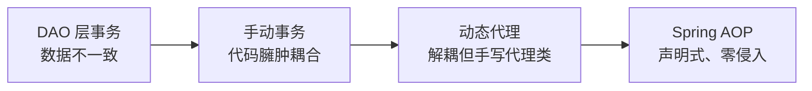

## XML 配置 AOP（历史参考）

::: warning 历史参考
以下内容属于传统 XML 配置方式。现代 Spring 项目（Spring Boot 2.x+ / Spring 6.x）推荐使用**注解方式**（`@Aspect` + `@EnableAspectJAutoProxy`），新项目请勿使用 XML 方式。
:::

### XML 启用 AOP

```xml
<?xml version="1.0" encoding="UTF-8"?>
<beans xmlns="http://www.springframework.org/schema/beans"
       xmlns:aop="http://www.springframework.org/schema/aop"
       xmlns:context="http://www.springframework.org/schema/context"
       xmlns:xsi="http://www.w3.org/2001/XMLSchema-instance"
       xsi:schemaLocation="
           http://www.springframework.org/schema/beans
           https://www.springframework.org/schema/beans/spring-beans.xsd
           http://www.springframework.org/schema/aop
           https://www.springframework.org/schema/aop/spring-aop.xsd
           http://www.springframework.org/schema/context
           https://www.springframework.org/schema/context/spring-context.xsd">

    <!-- 启用 AspectJ 自动代理（等价于 @EnableAspectJAutoProxy） -->
    <aop:aspectj-autoproxy/>

    <!-- 组件扫描 -->
    <context:component-scan base-package="com.example"/>

</beans>
```

### 纯 XML 配置（不使用注解）

如果不使用 AspectJ 注解，也可以完全通过 XML 声明切面：

```xml
<aop:config>
    <!-- 定义切入点 -->
    <aop:pointcut id="serviceMethod"
        expression="execution(* com.example.service.*.*(..))"/>

    <!-- 定义切面 -->
    <aop:aspect id="loggingAspect" ref="loggingAdvice">
        <!-- 前置通知 -->
        <aop:before pointcut-ref="serviceMethod" method="beforeAdvice"/>
        <!-- 环绕通知 -->
        <aop:around pointcut-ref="serviceMethod" method="aroundAdvice"/>
        <!-- 后置返回通知 -->
        <aop:after-returning pointcut-ref="serviceMethod"
            method="afterReturningAdvice" returning="result"/>
        <!-- 异常通知 -->
        <aop:after-throwing pointcut-ref="serviceMethod"
            method="afterThrowingAdvice" throwing="ex"/>
        <!-- 最终通知 -->
        <aop:after pointcut-ref="serviceMethod" method="afterAdvice"/>
    </aop:aspect>
</aop:config>

<!-- 切面逻辑类（普通 Bean，无需 @Aspect 注解） -->
<bean id="loggingAdvice" class="com.example.advice.LoggingAdvice"/>
```

对应的切面逻辑类：

```java
// 纯 XML 方式的切面类：不需要任何注解
public class LoggingAdvice {

    public void beforeAdvice(JoinPoint joinPoint) {
        System.err.println("[Before] " + joinPoint.getSignature().getName());
    }

    public Object aroundAdvice(ProceedingJoinPoint pjp) throws Throwable {
        System.err.println("[Around] start " + pjp.getSignature());
        Object result = pjp.proceed();
        System.err.println("[Around] done " + pjp.getSignature());
        return result;
    }

    public void afterReturningAdvice(JoinPoint joinPoint, Object result) {
        System.err.println("[AfterReturning] result = " + result);
    }

    public void afterThrowingAdvice(JoinPoint joinPoint, Exception ex) {
        System.err.println("[AfterThrowing] exception = " + ex.getMessage());
    }

    public void afterAdvice(JoinPoint joinPoint) {
        System.err.println("[After] " + joinPoint.getSignature().getName());
    }
}
```

### 代理方式配置

```xml
<!-- 强制使用 CGLIB 代理（Spring Boot 2.x+ 默认行为） -->
<aop:aspectj-autoproxy proxy-target-class="true"/>

<!-- 暴露代理对象（等价于 @EnableAspectJAutoProxy(exposeProxy = true)） -->
<aop:aspectj-autoproxy expose-proxy="true"/>
```

### XML 方式 vs 注解方式

| 对比维度 | 注解方式 | XML 方式 |
|---------|---------|---------|
| 配置位置 | 切面类上直接标注注解 | 独立的 XML 配置文件 |
| 可读性 | 注解在方法上，一目了然 | 需要对照 XML 和 Java 类 |
| 维护性 | 修改注解即可 | 需要同时修改 XML 和 Java 类 |
| 编译检查 | 注解写错编译期可发现 | XML 配置错误运行时才发现 |
| 适用场景 | 新项目（推荐） | 旧项目维护 |

::: tip 迁移建议
如果正在维护使用 XML 配置 AOP 的旧项目，建议逐步迁移到注解方式：
1. 保留现有 XML 配置不变
2. 新增的切面使用 `@Aspect` + `@Component` 注解
3. 确认 XML 中 `<aop:aspectj-autoproxy/>` 已启用
4. 逐步将旧切面迁移为注解方式
:::

## Spring AOP 与 AspectJ 对比

| 对比维度 | Spring AOP | AspectJ |
|---------|-----------|---------|
| **织入方式** | 运行时通过动态代理 | 编译时（CTW）或加载时（LTW）织入字节码 |
| **功能强度** | 较弱，只支持方法级连接点 | 强大，支持字段、构造器、方法调用等多种连接点 |
| **性能** | 有代理开销，性能稍低 | 无运行时开销，性能更好 |
| **易用性** | 简单，无需额外编译 | 复杂，需要 AspectJ 编译器 |
| **依赖** | 只需 Spring 核心 | 需要 AspectJ 编译器和相关工具 |
| **适用场景** | 大多数 Spring 应用 | 性能敏感、功能需求复杂的场景 |

### 什么时候使用 AspectJ？

- 需要拦截字段访问
- 需要拦截构造器
- 需要更高性能
- 有复杂的 AOP 需求，Spring AOP 无法满足

::: details 三种织入方式完整对比

| 维度 | 编译期（CTW） | 类加载期（LTW） | 运行期（Spring AOP） |
|------|-------------|---------------|-------------------|
| 织入时机 | 编译时 | 类加载时 | Bean 创建时 |
| 性能 | 最优 | 较好 | 有代理开销 |
| 连接点范围 | 方法、字段、构造器等 | 方法、字段、构造器等 | 仅方法 |
| 额外依赖 | AspectJ 编译器 | AspectJ Agent | 无 |
| 配置复杂度 | 高 | 中 | 低 |
| 适用场景 | 性能敏感 / 复杂织入 | 不想改编译流程 | 绝大多数 Spring 应用 |
:::

## 面试高频问题

### 1. Spring AOP 的底层实现原理是什么？

**参考答案**：

Spring AOP 基于**动态代理**实现，有两种代理方式：

- **JDK 动态代理**：基于接口，通过 `java.lang.reflect.Proxy` 生成代理类，目标对象必须实现接口
- **CGLIB 代理**：基于继承，通过生成目标类的子类实现代理，目标类不能是 final

Spring Boot 2.x+ 默认使用 CGLIB 代理。代理对象在方法调用前后织入增强逻辑，调用方无感知。与 AspectJ 的编译时字节码织入不同，Spring AOP 是运行时代理，只支持方法级连接点。

### 2. 为什么同类内部调用会导致 AOP（事务）失效？如何解决？

**参考答案**：

Spring AOP 基于代理机制：外部调用经过代理对象，增强逻辑生效；同类内部调用直接调用目标对象本身，不经过代理，增强逻辑不生效。

解决方案：
1. **注入自身**：通过 `@Autowired` 注入自己，调用时走代理（需注意循环依赖问题）
2. **AopContext**：通过 `AopContext.currentProxy()` 获取当前代理对象（需配置 `@EnableAspectJAutoProxy(exposeProxy = true)`）
3. **拆分 Service**：将方法拆分到不同的 Service 中，从根本上避免自调用（推荐）

### 3. JDK 动态代理和 CGLIB 代理有什么区别？

**参考答案**：

| 对比项 | JDK 动态代理 | CGLIB 代理 |
|-------|-------------|-----------|
| 实现方式 | 基于接口，实现 `InvocationHandler` | 基于继承，生成子类 |
| 要求 | 目标对象必须实现接口 | 目标类不能是 final |
| 限制 | 只能代理接口中定义的方法 | 无法代理 final/private 方法 |
| 性能 | JDK 8+ 已优化，差距不大 | 方法调用性能略好 |

Spring Boot 2.x+ 默认使用 CGLIB（`proxyTargetClass=true`），保持行为一致性。

### 4. @Around 和 @Before 的区别？什么时候用 @Around？

**参考答案**：

- `@Before` 只能在方法执行前做操作，无法控制方法是否执行，无法访问返回值
- `@Around` 包住整个方法调用，可以控制是否执行（`proceed()`）、修改参数、修改返回值、吞掉异常

**使用 `@Around` 的场景**：统计方法执行时间、缓存、重试机制、统一异常处理、修改返回值

**只用 `@Before` 就够的场景**：参数校验、权限检查、简单的日志记录

原则：能用简单通知就不用 `@Around`，`@Around` 必须调用 `proceed()` 且不要丢弃返回值。

### 5. Spring AOP 有哪些常见失效场景？

**参考答案**：

1. **同类内部调用**：不经过代理对象，AOP 不生效
2. **方法非 public**：JDK 代理要求接口方法为 public，CGLIB 也无法代理 private 方法
3. **final 类/方法**：CGLIB 基于继承，无法代理 final
4. **静态方法**：属于类级别，不参与实例化代理
5. **Bean 未被 Spring 管理**：没有 `@Component` 等注解，容器不会创建代理
6. **异常被吞掉**：try-catch 吞掉异常后，`@AfterThrowing` 不会触发，事务也不会回滚
7. **直接访问字段**：CGLIB 代理对象不初始化父类成员变量，直接访问字段可能得到 null

### 6. 为什么 Spring AOP 代理的对象，成员变量可能为 null？

**参考答案**：

CGLIB 通过继承目标类生成代理类，但 Spring 使用 Objenesis 实例化代理对象，**不执行任何构造方法**。Java 中成员变量的初始化是在构造方法中完成的（编译器将字段初始化代码移入构造方法），因此代理实例从父类继承的成员变量（包括 `final` 变量）都没有被初始化，保持默认值。

解决方案：通过方法访问而非直接访问字段。代理类覆写了方法并委托给原始实例，原始实例的成员变量是正确初始化的。

### 7. 为什么推荐使用注解装配 AOP 而非切入点表达式？

**参考答案**：

注解装配的核心优势是**精确控制**和**代码可读性**：
1. 只有标注注解的方法才会被代理，不会误伤新增方法
2. 注解在方法上，一眼就能看出哪些方法被增强了
3. 修改注解即可控制代理行为，无需修改切面代码
4. 符合声明式编程理念，Spring 的 `@Transactional` 就是这种模式的典范

切入点表达式适合大范围通用功能（如拦截整个包的所有方法），但日常开发中注解装配更灵活、更安全。

### 8. Spring AOP 代理对象是什么时候创建的？

**参考答案**：

代理对象在 Bean 的**初始化后**（`postProcessAfterInitialization`）创建。具体流程：

1. `AnnotationAwareAspectJAutoProxyCreator` 作为 `BeanPostProcessor`，在每个 Bean 初始化后介入
2. 解析所有 `@Aspect` 类，生成 Advisor 列表
3. 用 ClassFilter + MethodMatcher 判断当前 Bean 是否匹配任何 Advisor
4. 如果匹配，通过 `ProxyFactory` 创建代理对象（JDK 或 CGLIB）
5. 代理对象替换原始 Bean 放入容器

**特殊情况**：存在循环依赖时，代理对象可能在 `getEarlyBeanReference()` 中提前创建，放入二级缓存。

---

::: details 延伸阅读
- [事务管理与失效场景](03-事务管理与失效场景.md) — 事务传播行为、隔离级别、失效排查
- [Spring 概览](00-Spring.md) — Spring 框架整体设计思想与模块组成
:::

## 版本差异(旧版 → Spring 6.x)

| 特性 | 旧版(Spring 5.x) | Spring 6.x |
|------|-----------------|------------|
| AOP 实现 | JDK 代理/CGLIB | 不变；Boot 2.x+ 默认 CGLIB |
| 切面语法 | @AspectJ | 不变 |
| 拦截器 | MethodInterceptor | 不变 |
| 虚拟线程 | 无 | AOP 代理在虚拟线程下正常生效 |
| AOT | 无 | Spring 6 AOT 下 AOP 有限支持 |
