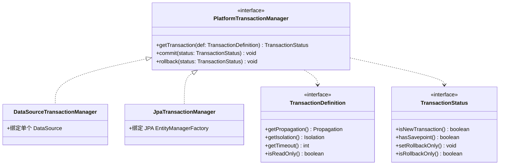
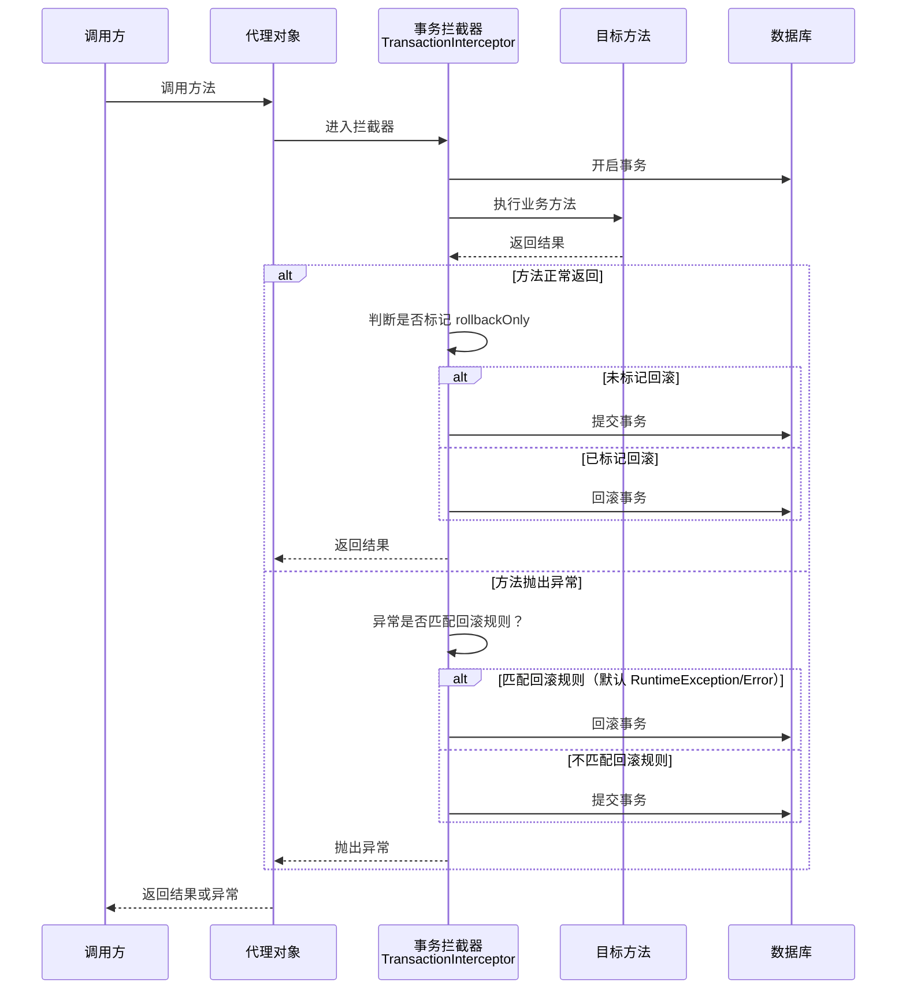
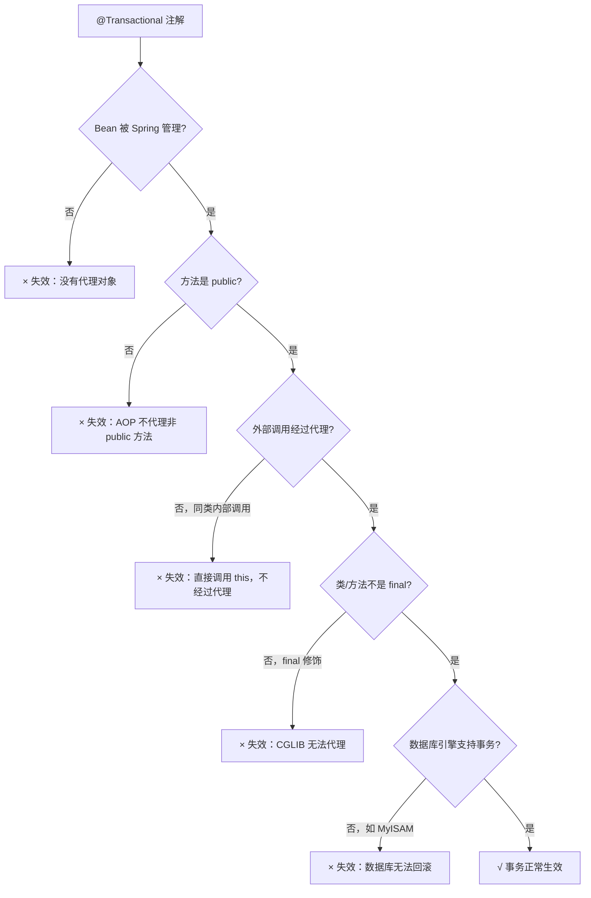
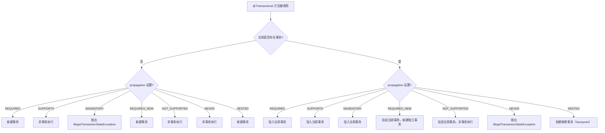
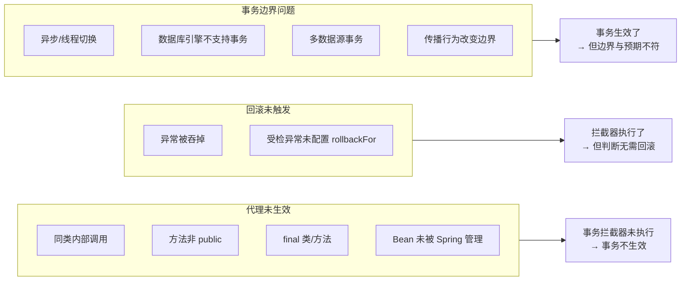
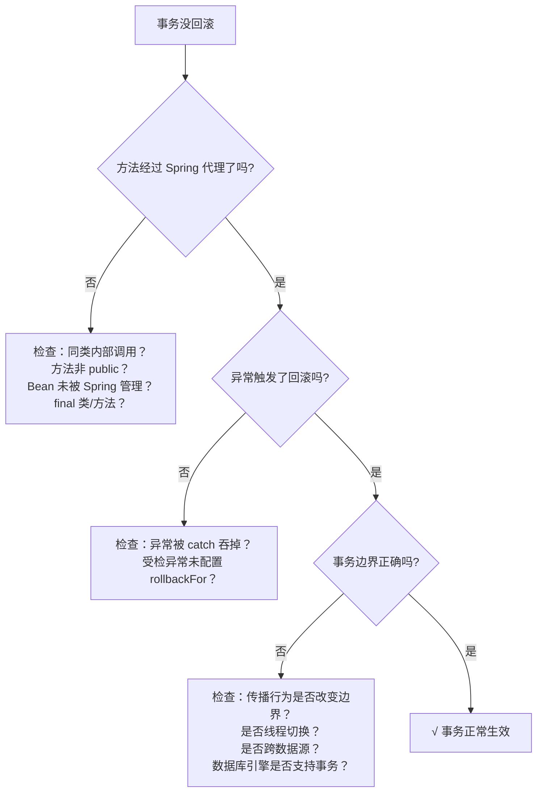

# 事务管理与失效场景

Spring 事务是 Java 后端面试和线上排障里的高频主题。很多项目不是不会写 `@Transactional`，而是不知道它什么时候真正生效、什么时候会悄悄失效。

所以这页真正要解决的问题是：

- Spring 事务是怎么接入业务方法的
- 哪些场景会导致事务失效
- 排障时应该先看什么
- 如何正确使用事务避免踩坑

## 为什么需要事务管理

事务（Transaction）是一组操作的逻辑单元，这些操作要么全部成功，要么全部失败。在数据库操作中，事务保证了数据的**一致性**和**完整性**。

**典型场景**：

- 银行转账：A 账户减钱，B 账户加钱，必须同时成功或失败
- 订单创建：创建订单、扣减库存、生成支付记录，必须保持一致
- 批量导入：要么全部导入成功，要么全部回滚

### 事务的 ACID 特性

| 特性 | 说明 | 示例 |
|------|------|------|
| **A**tomicity（原子性） | 事务是不可分割的最小单元，要么全部成功，要么全部失败 | 转账操作，A 减钱和 B 加钱必须同时成功或失败 |
| **C**onsistency（一致性） | 事务执行前后，数据库的完整性约束没有被破坏 | 转账前后，A+B 的总金额不变 |
| **I**solation（隔离性） | 多个并发事务之间相互隔离，互不干扰 | A 转账给 B 的过程中，B 无法看到中间状态 |
| **D**urability（持久性） | 事务提交后，数据永久保存，即使系统崩溃也不丢失 | 转账成功后，即使断电，数据也不会丢失 |

::: tip 什么时候不需要事务？
- 单条查询语句（数据库自身保证原子性）
- 单条插入/更新语句
- 只读操作且不要求可重复读
滥用事务不仅没有收益，反而会占用连接池资源、增加锁持有时间。
:::

## 数据访问基础

事务管理建立在数据访问之上。在深入事务原理之前，先了解 Spring 提供的数据访问抽象——它们是事务操作的实际载体。

### JdbcTemplate：JDBC 的模板封装

Java 程序通过 JDBC 访问数据库的基本步骤：创建 `DataSource` → 获取 `Connection` → 创建 `PreparedStatement` → 执行 SQL → 处理 `ResultSet`。正确编写 JDBC 代码的关键是使用 `try ... finally` 释放资源。Spring 的 `JdbcTemplate` 采用模板方法模式，封装了资源释放和异常处理，大幅减少样板代码。

**Spring Boot 自动配置**：只需引入 `spring-boot-starter-jdbc` 依赖，`DataSource` 和 `JdbcTemplate` 即被自动创建，无需手动定义 Bean。

#### 核心方法速查

| 场景 | 推荐方法 | 说明 |
|------|---------|------|
| 简单查询 | `query()` / `queryForObject()` | 只需 SQL、参数和 `RowMapper` |
| 增删改 | `update()` | 只需 SQL 和参数 |
| 复杂操作 | `execute(ConnectionCallback)` | 拿到 `Connection` 可做任何 JDBC 操作 |

#### queryForObject — 单行映射

`T queryForObject(String sql, RowMapper<T> rowMapper, Object... args)` 自动创建 `PreparedStatement`、执行查询并返回 `ResultSet`，只需提供 `RowMapper`（行映射器）将当前行映射为 Java 对象：

```java
public User getUserByEmail(String email) {
  return jdbcTemplate.queryForObject(
    "SELECT * FROM users WHERE email = ?",
    (ResultSet rs, int rowNum) -> new User(
      rs.getLong("id"),
      rs.getString("email"),
      rs.getString("password"),
      rs.getString("name")),
    email);
}
```

`RowMapper` 不限于返回 JavaBean，例如 `SELECT COUNT(*)` 可返回 `Long`：

```java
public long getUsers() {
  return jdbcTemplate.queryForObject("SELECT COUNT(*) FROM users",
    (ResultSet rs, int rowNum) -> rs.getLong(1));
}
```

#### query — 多行查询

```java
public List<User> getUsers(int pageIndex) {
  int limit = 100;
  int offset = limit * (pageIndex - 1);
  return jdbcTemplate.query("SELECT * FROM users LIMIT ? OFFSET ?",
    new BeanPropertyRowMapper<>(User.class), limit, offset);
}
```

`BeanPropertyRowMapper`（Bean 属性行映射器）在表结构与 JavaBean 属性名一致时，可自动按列名转换。若列名与属性名不一致，可用 SQL 别名解决：

```sql
-- 表列名 office_address，JavaBean 属性 workAddress
SELECT id, email, office_address AS workAddress, name FROM users WHERE email = ?
```

#### update — 增删改操作

```java
public void updateUser(User user) {
  if (1 != jdbcTemplate.update("UPDATE users SET name = ? WHERE id = ?",
      user.getName(), user.getId())) {
    throw new RuntimeException("User not found by id");
  }
}
```

获取自增主键需使用 `KeyHolder`（键持有器）：

```java
public User register(String email, String password, String name) {
  KeyHolder holder = new GeneratedKeyHolder();
  if (1 != jdbcTemplate.update((conn) -> {
    var ps = conn.prepareStatement(
      "INSERT INTO users(email, password, name) VALUES(?, ?, ?)",
      Statement.RETURN_GENERATED_KEYS); // 必须指定返回自增键
    ps.setObject(1, email);
    ps.setObject(2, password);
    ps.setObject(3, name);
    return ps;
  }, holder)) {
    throw new RuntimeException("Insert failed.");
  }
  return new User(holder.getKey().longValue(), email, password, name);
}
```

::: tip 现代实践
Spring Boot 项目中，`JdbcTemplate` 会被自动配置。配合 `BeanPropertyRowMapper` 或 `DataClassRowMapper`（Spring 6.1+，支持 record 类型），可以进一步简化数据访问代码。更复杂的数据访问需求推荐使用 MyBatis-Plus 或 Spring Data JPA。
:::

### DAO 模式与 @Repository

在多层应用程序中，数据访问层只负责对数据进行增删改查（CRUD），业务层负责处理业务逻辑。DAO（Data Access Object，数据访问对象）模式将数据访问逻辑封装到独立的类中：

```java
@Repository  // 数据访问层组件
public class UserDao {

  @Autowired
  JdbcTemplate jdbcTemplate;

  public User getById(long id) { /* ... */ }

  public List<User> getUsers(int page) { /* ... */ }

  public User createUser(User user) { /* ... */ }

  public User updateUser(User user) { /* ... */ }

  public void deleteUser(User user) { /* ... */ }
}
```

`@Repository` 不仅是 `@Component` 的语义特化，还具备一个特殊能力：**自动转换持久化异常**。原生 JDBC 抛出的 `SQLException` 是受检异常，Spring 会将其转换为统一的 `DataAccessException` 层次结构（非受检异常），使业务代码无需 `try-catch`。

::: tip 现代替代
Spring Data JPA 通过 `Repository` 接口自动生成 CRUD 实现，MyBatis-Plus 通过继承 `BaseMapper` 获得通用方法，都比手写 DAO 更简洁强大。DAO 模式的核心思想——将数据访问逻辑与业务逻辑分离——在现代框架中仍然适用，只是实现方式更加自动化。
:::

### ORM 集成概览

ORM（Object-Relational Mapping，对象关系映射）是将关系数据库的表记录映射为 Java 对象的过程。使用 `JdbcTemplate` 配合 `RowMapper` 可以看作最原始的 ORM，而 Hibernate 是成熟的 ORM 框架，提供更自动化的映射能力。

现代项目推荐使用 **Spring Data JPA**（基于 Hibernate 实现），它提供了更简洁的 Repository 抽象，无需手动操作 `SessionFactory`。Spring Boot 引入 `spring-boot-starter-data-jpa` 即可自动配置。

::: details 传统 Hibernate 集成配置（历史参考）

Spring 集成 Hibernate 需要配置三个核心 Bean：

| Bean | 类型 | 作用 |
|------|------|------|
| DataSource | `HikariDataSource` | 数据库连接池 |
| SessionFactory | `LocalSessionFactoryBean` | Hibernate 会话工厂（封装 DataSource） |
| TransactionManager | `HibernateTransactionManager` | 事务管理器 |

```java
@Configuration
@ComponentScan
@EnableTransactionManagement
@PropertySource("jdbc.properties")
public class AppConfig {

  @Bean
  DataSource createDataSource() { /* ... */ }

  @Bean
  LocalSessionFactoryBean createSessionFactory(@Autowired DataSource dataSource) {
    var props = new Properties();
    props.setProperty("hibernate.hbm2ddl.auto", "update"); // 自动建表，生产环境禁用
    props.setProperty("hibernate.dialect", "org.hibernate.dialect.HSQLDialect");
    props.setProperty("hibernate.show_sql", "true");

    var sessionFactoryBean = new LocalSessionFactoryBean();
    sessionFactoryBean.setDataSource(dataSource);
    sessionFactoryBean.setPackagesToScan("com.example.entity"); // 扫描 Entity 类
    sessionFactoryBean.setHibernateProperties(props);
    return sessionFactoryBean;
  }

  @Bean
  PlatformTransactionManager createTxManager(@Autowired SessionFactory sessionFactory) {
    return new HibernateTransactionManager(sessionFactory);
  }
}
```

`LocalSessionFactoryBean` 是一个 `FactoryBean`，它会自动创建 `SessionFactory`。`Session` 封装了 JDBC `Connection`，`SessionFactory` 封装了 `DataSource`。

Entity 映射使用 JPA 注解：

```java
@Entity // 标记为实体类
public class User extends AbstractEntity {

  @Column(nullable = false, unique = true, length = 100)
  public String getEmail() { /* ... */ }

  @Column(nullable = false, length = 100)
  public String getPassword() { /* ... */ }

  @Column(nullable = false, length = 100)
  public String getName() { /* ... */ }
}
```

::: warning 注意事项
- Entity Bean 的属性必须使用**包装类型**（`Long`、`Integer`），不要使用基本类型（`long`、`int`）。基本类型有默认值 `0`，会影响 Hibernate 判断主键是否为新建对象。
- 所有注解均来自 `jakarta.persistence` 包（JPA 规范），使用 Spring 集成 Hibernate 时无需额外的 XML 配置。
:::
:::

::: details 传统声明式事务配置（历史参考）

传统 Spring（非 Boot）需要手动配置事务管理器：

```java
@Configuration
@ComponentScan
@EnableTransactionManagement // 启用声明式事务
@PropertySource("jdbc.properties")
public class AppConfig {
  // ...

  @Bean
  PlatformTransactionManager createTxManager(@Autowired DataSource dataSource) {
    return new DataSourceTransactionManager(dataSource);
  }
}
```

Spring Boot 项目中，`@EnableTransactionManagement` 和 `PlatformTransactionManager` 均由 `TransactionAutoConfiguration` 自动完成，无需手动配置。
:::

## Spring 事务体系架构

在深入 `@Transactional` 之前，先理解 Spring 事务的分层设计，这有助于后续理解失效场景的根本原因。

### 核心组件



**关键接口说明**：

- **`PlatformTransactionManager`**（平台事务管理器）：Spring 事务的顶层抽象，定义了获取事务、提交、回滚三个核心操作。不同数据访问技术有不同实现
- **`TransactionDefinition`**（事务定义）：封装传播行为、隔离级别、超时时间、只读标志等事务属性
- **`TransactionStatus`**（事务状态）：代表当前运行中的事务，可以查询是否是新事务、是否有保存点、标记仅回滚等

::: details Spring Boot 自动配置了哪个事务管理器？
Spring Boot 根据 classpath 中的依赖自动选择：

| classpath 中存在 | 自动配置的事务管理器 |
|---|---|
| `spring-boot-starter-jdbc` 或 MyBatis | `DataSourceTransactionManager` |
| `spring-boot-starter-data-jpa` | `JpaTransactionManager` |
| 两者都有 | 优先 `JpaTransactionManager`（可通过 `@Primary` 覆盖） |

大多数场景下无需手动配置，Spring Boot 的 `TransactionAutoConfiguration` 已自动完成。
:::

### 声明式事务 vs 编程式事务

Spring 提供两种事务管理方式：

| 方式 | 实现 | 适用场景 | 优缺点 |
|------|------|---------|--------|
| **声明式事务** | `@Transactional` 注解 / XML 配置 | 大多数业务场景 | 代码侵入低，但粒度较粗（方法级） |
| **编程式事务** | `TransactionTemplate` / `PlatformTransactionManager` | 需要精确控制事务边界 | 粒度细，但代码侵入性高 |

**编程式事务示例**（`TransactionTemplate`）：

```java
@Service
public class OrderService {

    private final TransactionTemplate transactionTemplate;

    // Spring Boot 自动注入 PlatformTransactionManager
    public OrderService(PlatformTransactionManager txManager) {
        this.transactionTemplate = new TransactionTemplate(txManager);
        // 可以配置事务属性
        this.transactionTemplate.setIsolationLevel(TransactionDefinition.ISOLATION_READ_COMMITTED);
        this.transactionTemplate.setTimeout(30);
    }

    public void createOrder(OrderDTO dto) {
        // 编程式事务：精确控制事务边界
        transactionTemplate.execute(status -> {
            orderDao.insert(order);
            inventoryService.deductStock(dto.getProductId(), dto.getCount());
            return null;
        });
    }

    public void createOrderWithResult(OrderDTO dto) {
        // 带返回值的事务
        Order order = transactionTemplate.execute(status -> {
            orderDao.insert(order);
            inventoryService.deductStock(dto.getProductId(), dto.getCount());
            return order;
        });
    }
}
```

::: tip 何时选择编程式事务？
- 事务边界需要在方法内部精确控制（如循环中每 N 条提交一次）
- 需要根据运行时条件决定是否开启事务
- 避免声明式事务的自调用失效问题
大多数业务场景仍然推荐声明式事务，可读性更好。
:::

## 声明式事务原理

### AOP 代理机制

Spring 声明式事务本质上不是"给方法打个注解就自动回滚"，而是通过 **AOP 代理**把方法包进事务拦截逻辑里：



**核心流程**：

1. 外部调用经过代理对象
2. `TransactionInterceptor` 拦截方法调用
3. 根据 `TransactionDefinition` 决定开启新事务还是加入已有事务
4. 执行目标业务方法
5. 根据执行结果和回滚规则决定提交或回滚

这也解释了一个核心前提：**事务首先得经过代理，才能生效。**

::: warning 代理的本质
Spring AOP 默认使用 CGLIB 子类代理（Spring Boot 2.x 起默认 `proxyTargetClass=true`）。代理对象是目标类的子类，外部调用代理对象的方法时会先经过拦截器链，而同类内部调用直接走 `this`，不经过代理。关于代理原理和避坑指南的详细讲解，参见 [AOP](02-AOP.md)。
:::

### @Transactional 注解详解

`@Transactional` 注解可以标注在类或方法上，用于声明事务边界。

#### 注解属性

```java
@Target({ElementType.TYPE, ElementType.METHOD})
@Retention(RetentionPolicy.RUNTIME)
public @interface Transactional {

    // 事务管理器名称（多事务管理器场景）
    String value() default "";

    // 同 value，推荐用这个
    String transactionManager() default "";

    // 传播行为
    Propagation propagation() default Propagation.REQUIRED;

    // 隔离级别
    Isolation isolation() default Isolation.DEFAULT;

    // 超时时间（秒）
    int timeout() default TransactionDefinition.TIMEOUT_DEFAULT;

    // 是否只读
    boolean readOnly() default false;

    // 指定哪些异常会触发回滚（默认 RuntimeException 和 Error）
    Class<? extends Throwable>[] rollbackFor() default {};

    // 指定哪些异常不触发回滚
    Class<? extends Throwable>[] noRollbackFor() default {};

    // 指定回滚异常的异常名称（字符串形式）
    String[] rollbackForClassName() default {};

    // 指定不回滚异常的异常名称
    String[] noRollbackForClassName() default {};
}
```

#### 默认行为

默认情况下：

- **回滚规则**：运行时异常（`RuntimeException`）和错误（`Error`）会触发回滚，受检异常（Checked Exception，如 `IOException`）默认不回滚
- **传播行为**：默认为 `REQUIRED`（有事务就加入，没有就新建）
- **隔离级别**：使用数据库默认隔离级别
- **超时时间**：使用底层事务系统的默认超时
- **只读**：默认为 false

::: danger 关键陷阱
如果抛出的是受检异常（如 `IOException`、`Exception`），又没有显式指定 `rollbackFor`，业务可能报错了但事务并没有回滚。这是线上最常见的事务失效原因之一。
:::

#### 注解生效的前提条件

`@Transactional` 不是加了就生效，必须同时满足以下条件：



## 事务隔离级别

隔离级别（Isolation Level）定义了一个事务必须与其它事务隔离的程度。隔离级别越高，数据一致性越好，但并发性能越低。

### 隔离级别一览

| 隔离级别 | 说明 | 脏读 | 不可重复读 | 幻读 | 性能 |
|---------|------|------|-----------|------|------|
| **DEFAULT** | 使用数据库默认隔离级别 | - | - | - | - |
| **READ_UNCOMMITTED** | 读未提交 | 可能 | 可能 | 可能 | 最高 |
| **READ_COMMITTED** | 读已提交 | 不会 | 可能 | 可能 | 较高 |
| **REPEATABLE_READ** | 可重复读（MySQL InnoDB 默认） | 不会 | 不会 | 可能 | 较低 |
| **SERIALIZABLE** | 串行化 | 不会 | 不会 | 不会 | 最低 |

### 三种读问题详解

**1. 脏读（Dirty Read）**

一个事务读到了另一个事务未提交的数据。

```
时间 | 事务A                    | 事务B
-----|--------------------------|--------------------------
T1   | 开始事务                  |
T2   | 修改账户余额为 100        |
T3   |                          | 查询余额 = 100（读到了未提交的数据）
T4   | 回滚                     |
T5   |                          | 余额应该是 200，但读到了脏数据 100
```

**2. 不可重复读（Unrepeatable Read）**

一个事务内多次读取同一数据，结果不一致（被其他事务修改了）。

```
时间 | 事务A                    | 事务B
-----|--------------------------|--------------------------
T1   | 开始事务                  |
T2   | 查询余额 = 100           |
T3   |                          | 修改余额为 200
T4   |                          | 提交
T5   | 查询余额 = 200（前后不一致）|
```

**3. 幻读（Phantom Read）**

一个事务内多次查询，记录数不一致（被其他事务插入或删除了）。

```
时间 | 事务A                          | 事务B
-----|--------------------------------|--------------------------------
T1   | 开始事务                        |
T2   | 查询年龄>20的用户，共 10 条     |
T3   |                                | 插入一条年龄=25的用户
T4   |                                | 提交
T5   | 查询年龄>20的用户，共 11 条     |
```

::: details MySQL InnoDB 如何在 REPEATABLE_READ 下避免幻读？
MySQL InnoDB 通过 **MVCC（Multi-Version Concurrency Control，多版本并发控制）** 和 **Next-Key Lock（间隙锁）** 在 `REPEATABLE_READ` 隔离级别下避免了大部分幻读场景：

- **快照读**（普通 SELECT）：通过 MVCC 读取事务开始时的快照，自然不会看到其他事务的新插入
- **当前读**（SELECT ... FOR UPDATE / INSERT / UPDATE / DELETE）：通过 Next-Key Lock 锁住间隙，阻止其他事务在间隙中插入新记录

因此，MySQL InnoDB 的 `REPEATABLE_READ` 在实际使用中基本等同于 `SERIALIZABLE` 的效果，但性能好得多。
:::

### 使用示例

```java
@Service
public class OrderService {

    // 使用数据库默认隔离级别（MySQL 为 REPEATABLE_READ）
    @Transactional(rollbackFor = Exception.class)
    public void createOrder() {}

    // 读操作使用读已提交 + 只读，提高并发性能
    @Transactional(readOnly = true, isolation = Isolation.READ_COMMITTED)
    public List<Order> listOrders() {}

    // 写操作使用可重复读，保证一致性
    @Transactional(rollbackFor = Exception.class, isolation = Isolation.REPEATABLE_READ)
    public void updateOrder() {}
}
```

::: warning 隔离级别的实际使用建议
- 大多数业务场景使用 `DEFAULT` 即可，让数据库决定
- 只有在明确遇到并发问题（如脏读、不可重复读）时才考虑调整
- 不要为了"更安全"而盲目使用 `SERIALIZABLE`，性能下降非常明显
:::

## 事务传播行为

传播行为（Propagation Behavior）定义了事务方法被另一个事务方法调用时，如何处理事务边界。这是 Spring 事务最核心也最容易出错的概念。

### 七种传播行为总览

| 传播行为 | 当前有事务时 | 当前无事务时 | 典型场景 |
|---------|------------|------------|---------|
| **REQUIRED** | 加入当前事务 | 新建事务 | 大多数业务操作（默认） |
| **SUPPORTS** | 加入当前事务 | 非事务执行 | 查询操作 |
| **MANDATORY** | 加入当前事务 | 抛出异常 | 强制要求事务的内部方法 |
| **REQUIRES_NEW** | 挂起当前事务，新建事务 | 新建事务 | 日志记录、独立业务 |
| **NOT_SUPPORTED** | 挂起当前事务，非事务执行 | 非事务执行 | 耗时操作，避免长事务 |
| **NEVER** | 抛出异常 | 非事务执行 | 强制不使用事务 |
| **NESTED** | 创建嵌套事务（Savepoint） | 新建事务 | 部分回滚场景 |

### 传播行为决策流程



### REQUIRED（默认）

**行为**：如果当前存在事务则加入，没有则创建新事务。这是最常用的传播行为。

```java
@Service
public class OrderService {

    @Autowired
    private InventoryService inventoryService;

    @Transactional(rollbackFor = Exception.class)
    public void createOrder() {
        orderDao.insert(order);
        // deductStock() 会加入当前事务
        inventoryService.deductStock(productId, count);
    }
}

@Service
public class InventoryService {

    @Transactional(rollbackFor = Exception.class) // 加入 OrderService 的事务
    public void deductStock(Long productId, int count) {
        inventoryDao.deduct(productId, count);
    }
}
```

**执行流程**：

```
createOrder() 开始事务
  └─ deductStock() 加入同一事务
  └─ 如果 deductStock() 抛异常 → 整个事务回滚
  └─ 如果 createOrder() 抛异常 → 整个事务回滚
createOrder() 提交事务
```

### REQUIRES_NEW

**行为**：总是创建新事务，如果当前存在事务则挂起。新事务独立提交或回滚，与外层事务互不影响。

```java
@Service
public class OrderService {

    @Autowired
    private LogService logService;

    @Transactional(rollbackFor = Exception.class)
    public void createOrder() {
        orderDao.insert(order);
        // 独立事务记录日志
        logService.recordLog("创建订单");
        // 后续操作失败，订单回滚，但日志已提交保留
        throw new RuntimeException("订单创建失败");
    }
}

@Service
public class LogService {

    @Transactional(propagation = Propagation.REQUIRES_NEW, rollbackFor = Exception.class)
    public void recordLog(String message) {
        logDao.insert(new Log(message));
    }
}
```

**执行流程**：

```
createOrder() 开始事务A
  └─ recordLog() 挂起事务A，开始新事务B
  └─ recordLog() 提交事务B（日志已持久化）
  └─ 抛出异常
createOrder() 回滚事务A（日志不受影响）
```

**适用场景**：

- 日志/审计记录：即使主业务失败，日志也要保留
- 消息发送记录：独立于主事务

::: warning REQUIRES_NEW 的隐藏代价
每次使用 `REQUIRES_NEW` 都需要从连接池获取一个新连接。如果外层事务中循环调用 `REQUIRES_NEW` 方法，会快速消耗连接池，可能导致连接耗尽。在高并发场景下慎用。
:::

### NESTED（嵌套事务）

**行为**：如果当前存在事务则创建一个嵌套事务（基于 Savepoint，即保存点），没有则新建事务。嵌套事务可以独立回滚到保存点，不影响外部事务；但外部事务回滚时，嵌套事务也会回滚。

::: tip 前提条件
嵌套事务需要底层数据库支持保存点（Savepoint），如 MySQL InnoDB、PostgreSQL、Oracle 等。不支持 Savepoint 的数据库退化为 `REQUIRED` 行为。
:::

```java
@Service
public class BatchService {

    @Autowired
    private ItemService itemService;

    @Transactional(rollbackFor = Exception.class)
    public void batchImport(List<Item> items) {
        for (Item item : items) {
            try {
                // 每个项目的导入是嵌套事务
                itemService.importItem(item);
            } catch (Exception e) {
                // 单个项目失败不影响其他项目
                log.error("导入失败: {}", item, e);
            }
        }
    }
}

@Service
public class ItemService {

    @Transactional(propagation = Propagation.NESTED, rollbackFor = Exception.class)
    public void importItem(Item item) {
        itemDao.insert(item);
    }
}
```

**执行流程**：

```
batchImport() 开始事务
  └─ importItem(item1) 创建保存点1，执行，释放保存点1
  └─ importItem(item2) 创建保存点2，执行失败，回滚到保存点2
  └─ importItem(item3) 创建保存点3，执行，释放保存点3
batchImport() 提交事务
```

### NESTED vs REQUIRES_NEW 对比

| 对比项 | NESTED | REQUIRES_NEW |
|-------|--------|-------------|
| 事务数量 | 一个事务，多个保存点 | 多个独立事务 |
| 数据库连接 | 共享一个连接 | 每个独立事务需要独立连接 |
| 外部事务回滚 | 嵌套事务也回滚 | 独立事务不受影响 |
| 嵌套/独立事务回滚 | 不影响外部事务 | 独立事务不受影响 |
| 性能 | 更好（共享连接） | 较差（需要多个连接） |
| 典型场景 | 批量操作中单条失败不影响整体 | 日志记录，主事务回滚但日志保留 |

### 其他传播行为

#### SUPPORTS

有事务则加入，无事务则非事务执行。适合查询操作。

```java
@Service
public class QueryService {

    @Transactional(propagation = Propagation.SUPPORTS, readOnly = true)
    public List<Order> queryOrders() {
        // 可以在事务中执行，也可以不在事务中执行
        return orderDao.selectAll();
    }
}
```

#### MANDATORY

必须在事务中运行，否则抛出 `IllegalTransactionStateException`。适合内部方法，防止被误用。

```java
@Service
public class PaymentService {

    @Transactional(propagation = Propagation.MANDATORY)
    public void processPayment(Long orderId) {
        paymentDao.insert(payment);
    }
}

// 正确用法：在事务中调用
@Transactional(rollbackFor = Exception.class)
public void createOrder() {
    paymentService.processPayment(orderId); // 在事务中调用
}

// 错误用法：直接调用
public void standalone() {
    paymentService.processPayment(orderId); // 抛异常：No existing transaction found
}
```

#### NOT_SUPPORTED

以非事务方式执行，如果当前存在事务则挂起。适合耗时操作，避免长事务。

```java
@Service
public class ReportService {

    @Transactional(propagation = Propagation.NOT_SUPPORTED)
    public void generateBigReport() {
        // 耗时操作，不希望长时间占用事务连接
        reportDao.generateBigReport();
    }
}
```

#### NEVER

以非事务方式执行，如果当前存在事务则抛出 `IllegalTransactionStateException`。适合明确不应该在事务中执行的操作。

```java
@Service
public class CacheService {

    @Transactional(propagation = Propagation.NEVER)
    public void clearCache() {
        cacheDao.clearAll();
    }
}
```

## 只读事务与超时

### 只读事务

`readOnly = true` 表示事务只读，不会修改数据。

**好处**：

1. **性能优化**：数据库可以进行优化（如 InnoDB 不加排他锁、Hibernate 不做脏检查）
2. **意图明确**：代码可读性更好，明确表示这是查询操作
3. **驱动层优化**：某些 JDBC 驱动会对只读事务做特殊处理

```java
@Service
public class QueryService {

    // 只读事务，提高查询性能
    @Transactional(readOnly = true)
    public List<Order> listOrders() {
        return orderDao.selectAll();
    }

    // 只读事务 + 指定隔离级别
    @Transactional(readOnly = true, isolation = Isolation.READ_COMMITTED)
    public Order getOrderById(Long id) {
        return orderDao.selectById(id);
    }
}
```

::: warning 只读事务的注意事项
- 只读事务仍然会开启事务，只是标记为只读
- 在只读事务中执行写操作，行为取决于数据库和 ORM 框架：
  - **MySQL InnoDB**：写操作仍可执行，但违反只读语义
  - **Hibernate**：会跳过脏检查（flush），写操作不会被持久化
  - **PostgreSQL**：`readOnly = true` 会在数据库层面真正禁止写操作
- 建议：只读事务方法中不要出现写操作，避免歧义
:::

### 事务超时

`timeout` 属性设置事务超时时间（秒），超时后自动回滚并抛出 `TransactionTimedOutException`。

```java
@Service
public class BatchService {

    // 设置超时时间为 30 秒
    @Transactional(rollbackFor = Exception.class, timeout = 30)
    public void batchProcess() {
        for (int i = 0; i < 10000; i++) {
            processOne();
        }
    }
}
```

::: warning 超时时间的计算方式
- 超时时间是**整个事务**从开启到当前的时间，不是单个方法的执行时间
- 如果方法 A 开启事务（timeout=30），方法 B 以 `REQUIRED` 加入，方法 B 执行时已经过了 20 秒，那么方法 B 只剩 10 秒
- 超时检查发生在语句执行时，不是实时监控。如果一条 SQL 执行了 60 秒，即使 timeout=30 也会等 SQL 执行完才抛异常
:::

## 事务失效场景详解

这是本篇的核心部分。理解失效场景的根本原因，比死记场景列表更有价值——所有失效都可以归结为：**事务拦截器没有机会执行，或者执行后判断不需要回滚**。

### 失效场景总览



### 场景一：同类内部调用

这是最常见也最隐蔽的失效场景。

**问题代码**：

```java
@Service
public class OrderService {

    public void createOrder() {
        // 直接调用同类方法，不经过代理
        saveOrder();  // × 事务不生效
    }

    @Transactional(rollbackFor = Exception.class)
    public void saveOrder() {
        orderDao.insert(order);
    }
}
```

**原因分析**：

- Spring 事务基于 AOP 代理
- 同类内部调用使用 `this.saveOrder()`，直接调用目标对象的方法，不经过代理对象
- 事务拦截器没有机会执行

**解决方案**：

```java
// 方案1：注入自己（推荐，最简洁）
@Service
public class OrderService {

    @Autowired
    private OrderService self;  // 注入自己

    public void createOrder() {
        self.saveOrder();  // √ 经过代理，事务生效
    }

    @Transactional(rollbackFor = Exception.class)
    public void saveOrder() {
        orderDao.insert(order);
    }
}

// 方案2：使用 AopContext（需要在启动类配置）
@Service
public class OrderService {

    public void createOrder() {
        OrderService proxy = (OrderService) AopContext.currentProxy();
        proxy.saveOrder();  // √ 经过代理，事务生效
    }

    @Transactional(rollbackFor = Exception.class)
    public void saveOrder() {
        orderDao.insert(order);
    }
}

// 启动类需要配置暴露代理
@EnableAspectJAutoProxy(exposeProxy = true)
@SpringBootApplication
public class Application {}
```

::: details 方案1 "注入自己"会不会导致循环依赖？
Spring 通过三级缓存解决了单例 Bean 的循环依赖问题。`@Autowired` 注入自身不会报错，因为 Spring 在创建代理对象时使用了早期引用。但如果构造器注入自身，则会失败。关于循环依赖的详细分析，参见 [Bean 生命周期与循环依赖](04-Bean生命周期与循环依赖.md)。
:::

### 场景二：方法不是 public

**问题代码**：

```java
@Service
public class OrderService {

    @Transactional
    private void saveOrder() {  // × private 方法，事务不生效
        orderDao.insert(order);
    }

    @Transactional
    protected void updateOrder() {  //  protected 方法，不保证生效
        orderDao.update(order);
    }

    @Transactional
    void deleteOrder() {  //  包私有方法，不保证生效
        orderDao.delete(order);
    }
}
```

**原因分析**：

- Spring AOP 默认只对 public 方法应用事务（`TransactionAttributeSource` 的 `allowPublicMethodsOnly()` 逻辑，非 public 方法上的 `@Transactional` 会被静默忽略）
- private 方法无法被代理（子类无法访问）
- protected 和包私有方法同样拿不到事务属性，建议统一使用 public

**解决方案**：

```java
@Service
public class OrderService {

    @Transactional(rollbackFor = Exception.class)
    public void saveOrder() {  // √ public 方法，事务生效
        orderDao.insert(order);
    }
}
```

### 场景三：异常被吞掉

**问题代码**：

```java
@Service
public class OrderService {

    @Transactional(rollbackFor = Exception.class)
    public void createOrder() {
        try {
            orderDao.insert(order);
            inventoryService.deductStock();
            throw new RuntimeException("库存不足");
        } catch (Exception ex) {
            log.error("创建订单失败", ex);
            // × 异常被捕获，没有继续抛出，事务正常提交
        }
    }
}
```

**原因分析**：

- 事务拦截器通过捕获方法抛出的异常来判断是否回滚
- 异常被捕获后没有抛出，拦截器认为方法正常结束
- 事务正常提交，不会回滚

**解决方案**：

```java
@Service
public class OrderService {

    // 方案1：继续抛出异常（推荐）
    @Transactional(rollbackFor = Exception.class)
    public void createOrder() {
        try {
            orderDao.insert(order);
            inventoryService.deductStock();
        } catch (Exception ex) {
            log.error("创建订单失败", ex);
            throw ex;  // √ 继续抛出异常，触发回滚
        }
    }

    // 方案2：使用手动回滚（适合需要返回错误信息而非抛异常的场景）
    @Transactional(rollbackFor = Exception.class)
    public void createOrder() {
        try {
            orderDao.insert(order);
            inventoryService.deductStock();
        } catch (Exception ex) {
            log.error("创建订单失败", ex);
            TransactionAspectSupport.currentTransactionStatus().setRollbackOnly();  // √ 手动标记回滚
        }
    }

    // 方案3：不捕获异常，让异常自然传播
    @Transactional(rollbackFor = Exception.class)
    public void createOrder() {
        orderDao.insert(order);
        inventoryService.deductStock();  // √ 异常自然抛出，自动回滚
    }
}
```

### 场景四：受检异常未配置回滚

**问题代码**：

```java
@Service
public class OrderService {

    @Transactional
    public void createOrder() throws IOException {
        orderDao.insert(order);
        writeToFile();  // 抛出 IOException
        // × IOException 是受检异常，默认不回滚
    }

    private void writeToFile() throws IOException {
        throw new IOException("文件写入失败");
    }
}
```

**原因分析**：

- Spring 默认只对 `RuntimeException` 和 `Error` 回滚
- 受检异常（Checked Exception，如 `IOException`、`Exception`）默认不回滚
- 这个设计来自 EJB 规范的传统，Spring 沿用了此默认行为

**解决方案**：

```java
@Service
public class OrderService {

    // 方案1：统一指定 Exception.class（推荐，最安全）
    @Transactional(rollbackFor = Exception.class)
    public void createOrder() throws IOException {
        orderDao.insert(order);
        writeToFile();
    }

    // 方案2：指定特定异常
    @Transactional(rollbackFor = IOException.class)
    public void createOrder() throws IOException {
        orderDao.insert(order);
        writeToFile();
    }

    // 方案3：包装为运行时异常
    @Transactional
    public void createOrder() {
        orderDao.insert(order);
        try {
            writeToFile();
        } catch (IOException e) {
            throw new RuntimeException("文件写入失败", e);  // √ RuntimeException 会回滚
        }
    }
}
```

::: danger 最佳实践
**项目中统一使用 `rollbackFor = Exception.class`**，这是一个团队级规范问题，不是个人偏好。可以在代码检查工具中配置规则，强制要求 `@Transactional` 必须指定 `rollbackFor`。
:::

### 场景五：异步/线程切换后失效

**问题代码**：

```java
@Service
public class OrderService {

    @Transactional(rollbackFor = Exception.class)
    public void createOrder() {
        orderDao.insert(order);

        // × 异步线程中的操作不在当前事务中
        CompletableFuture.runAsync(() -> {
            inventoryService.deductStock();  // 新线程，新的事务上下文
        });

        // × 新线程中的操作不在当前事务中
        new Thread(() -> {
            logService.recordLog();  // 新线程，新的事务上下文
        }).start();
    }
}
```

**原因分析**：

- Spring 事务上下文绑定在 `ThreadLocal` 中
- 新线程或异步线程无法继承父线程的事务上下文
- 异步操作在新的事务上下文中执行（或根本没有事务）

**解决方案**：

```java
@Service
public class OrderService {

    // 方案1：在主线程完成所有事务操作，再异步执行非事务操作
    @Transactional(rollbackFor = Exception.class)
    public void createOrder() {
        orderDao.insert(order);
        inventoryService.deductStock();  // √ 在事务中完成
    }

    public void createOrderAsync() {
        createOrder();  // 同步执行事务操作

        // 事务提交后再异步执行非事务操作
        CompletableFuture.runAsync(() -> {
            notificationService.sendEmail();  // 非事务操作
        });
    }

    // 方案2：异步方法开启独立事务
    @Transactional(rollbackFor = Exception.class)
    public void createOrder() {
        orderDao.insert(order);
        asyncService.deductStockAsync();  // 异步方法有自己的事务
    }
}

@Service
public class AsyncService {

    @Async
    @Transactional(propagation = Propagation.REQUIRES_NEW, rollbackFor = Exception.class)
    public void deductStockAsync() {
        inventoryService.deductStock();  // √ 独立事务
    }
}
```

### 场景六：数据库引擎不支持事务

**问题代码**：

```java
@Service
public class OrderService {

    @Transactional(rollbackFor = Exception.class)
    public void createOrder() {
        orderDao.insert(order);  // MySQL MyISAM 引擎
        // × MyISAM 不支持事务，Spring 层面"开启事务"但数据库无法回滚
    }
}
```

**原因分析**：

- MySQL 的 MyISAM 引擎不支持事务
- Spring 开启事务后调用 JDBC 的 `connection.setAutoCommit(false)`，MyISAM 会忽略此设置
- 即使 Spring 认为事务已开启，数据库也无法回滚

**解决方案**：

```sql
-- 使用 InnoDB 引擎（MySQL 5.5+ 默认）
CREATE TABLE orders (
    id BIGINT PRIMARY KEY,
    -- ...
) ENGINE=InnoDB;
```

::: tip 如何检查表的引擎？
```sql
-- 查看表的引擎
SHOW TABLE STATUS LIKE 'orders';

-- 查看所有表的引擎
SELECT TABLE_NAME, ENGINE FROM information_schema.TABLES
WHERE TABLE_SCHEMA = 'your_database';
```
现代 MySQL（5.5+）默认引擎已是 InnoDB，此场景主要出现在维护老项目时。
:::

### 场景七：final 方法/类

**问题代码**：

```java
@Service
public final class OrderService {  // × final 类，CGLIB 无法生成子类

    @Transactional(rollbackFor = Exception.class)
    public void createOrder() {
        orderDao.insert(order);
    }
}

@Service
public class UserService {

    @Transactional(rollbackFor = Exception.class)
    public final void createUser() {  // × final 方法，CGLIB 无法覆盖
        userDao.insert(user);
    }
}
```

**原因分析**：

- CGLIB 通过生成目标类的子类来创建代理
- `final` 类无法被继承，`final` 方法无法被覆盖
- Spring Boot 2.x 起默认使用 CGLIB 代理，`final` 会直接导致代理失败

::: details Spring 6 / Boot 3 的变化
Spring Framework 6.0 对 `final` 方法的处理更加严格：如果 `@Transactional` 标注在 `final` 方法上，Spring 6 会直接抛出异常（而非静默失效），这比旧版本更容易发现问题。建议在项目中配置编译器警告或使用 Error Prone 等工具检测 `final` 与事务注解的冲突。
:::

**解决方案**：

```java
@Service
public class OrderService {  // √ 去掉 final

    @Transactional(rollbackFor = Exception.class)
    public void createOrder() {  // √ 去掉 final
        orderDao.insert(order);
    }
}
```

### 场景八：Bean 未被 Spring 管理

**问题代码**：

```java
// × 没有 @Service 等注解，不被 Spring 管理
public class OrderService {

    @Transactional(rollbackFor = Exception.class)
    public void createOrder() {
        orderDao.insert(order);
    }
}

// × 手动创建对象，不经过 Spring 容器
public class Main {
    public static void main(String[] args) {
        OrderService orderService = new OrderService();
        orderService.createOrder();  // 无代理
    }
}
```

**解决方案**：

```java
@Service  // √ 添加 Spring 注解
public class OrderService {

    @Transactional(rollbackFor = Exception.class)
    public void createOrder() {
        orderDao.insert(order);
    }
}

// 通过 Spring 容器获取
public class Main {
    public static void main(String[] args) {
        ApplicationContext ctx = new AnnotationConfigApplicationContext(AppConfig.class);
        OrderService orderService = ctx.getBean(OrderService.class);  // √ 从容器获取代理对象
        orderService.createOrder();
    }
}
```

### 场景九：多数据源事务

**问题代码**：

```java
@Service
public class OrderService {

    @Transactional(rollbackFor = Exception.class)
    public void createOrder() {
        masterOrderDao.insert(order);  // 操作主库
        slaveLogDao.insert(log);       // 操作从库
        // × 默认事务管理器只管理一个数据源，跨库事务失效
    }
}
```

**原因分析**：

- Spring 默认的事务管理器只管理一个数据源
- 跨数据源操作无法通过本地事务保证一致性

**解决方案**：

```java
// 方案1：指定事务管理器（各自管各自的数据源）
@Service
public class OrderService {

    @Transactional(transactionManager = "masterTransactionManager", rollbackFor = Exception.class)
    public void createOrder() {
        masterOrderDao.insert(order);
    }

    @Transactional(transactionManager = "slaveTransactionManager", rollbackFor = Exception.class)
    public void recordLog() {
        slaveLogDao.insert(log);
    }
}

// 方案2：使用分布式事务框架（如 Seata）
@GlobalTransactional
public void createOrder() {
    masterOrderDao.insert(order);
    slaveLogDao.insert(log);
}
```

::: warning 分布式事务的代价
分布式事务（2PC、TCC、Seata 等）的复杂度和性能开销远高于本地事务。在架构设计时优先考虑**避免跨库事务**，如通过消息队列实现最终一致性。关于分布式事务的详细讨论，参见 Redis 和 消息队列 相关章节。
:::

## 实战场景与最佳实践

### 场景一：订单创建后库存没回滚

**问题描述**：创建订单事务里同时写订单表和库存表，结果库存更新失败但订单状态提交了。

**问题代码**：

```java
@Service
public class OrderService {

    @Transactional
    public void createOrder(OrderDTO dto) {
        orderDao.insert(order);
        try {
            inventoryService.deductStock(dto.getProductId(), dto.getCount());
        } catch (Exception e) {
            log.error("扣减库存失败", e);
            // × 异常被捕获，没有抛出，事务提交
        }
    }
}
```

**解决方案**：

```java
@Service
public class OrderService {

    @Transactional(rollbackFor = Exception.class)  // √ 统一配置 rollbackFor
    public void createOrder(OrderDTO dto) {
        orderDao.insert(order);
        // √ 不捕获异常，让事务回滚
        inventoryService.deductStock(dto.getProductId(), dto.getCount());
    }
}
```

### 场景二：批量导入中部分数据提交

**问题描述**：批量导入方法外层打了事务，但内部每条记录调用了 `REQUIRES_NEW` 方法，导致单条记录单独提交，整体失败时无法整体回滚。

**问题代码**：

```java
@Service
public class ImportService {

    @Transactional(rollbackFor = Exception.class)
    public void batchImport(List<Item> items) {
        for (Item item : items) {
            // × REQUIRES_NEW 会开启新事务，独立提交
            itemService.importItem(item);
        }
    }
}

@Service
public class ItemService {

    @Transactional(propagation = Propagation.REQUIRES_NEW, rollbackFor = Exception.class)
    public void importItem(Item item) {
        itemDao.insert(item);
    }
}
```

**解决方案**：

```java
// 方案1：使用默认传播行为（REQUIRED），整体回滚
@Service
public class ImportService {

    @Transactional(rollbackFor = Exception.class)
    public void batchImport(List<Item> items) {
        for (Item item : items) {
            itemService.importItem(item);  // √ 加入外层事务
        }
    }
}

@Service
public class ItemService {

    @Transactional(rollbackFor = Exception.class)  // 默认 REQUIRED
    public void importItem(Item item) {
        itemDao.insert(item);
    }
}

// 方案2：使用嵌套事务（部分回滚，单条失败不影响整体）
@Service
public class ImportService {

    @Transactional(rollbackFor = Exception.class)
    public void batchImport(List<Item> items) {
        for (Item item : items) {
            try {
                itemService.importItem(item);  // √ 嵌套事务，可独立回滚
            } catch (Exception e) {
                log.error("导入失败: {}", item, e);
            }
        }
    }
}

@Service
public class ItemService {

    @Transactional(propagation = Propagation.NESTED, rollbackFor = Exception.class)
    public void importItem(Item item) {
        itemDao.insert(item);
    }
}
```

### 场景三：事务提交后再发消息

**问题描述**：在事务方法中发送消息，如果事务回滚但消息已发出，会导致数据不一致。

**问题代码**：

```java
@Service
public class OrderService {

    @Transactional(rollbackFor = Exception.class)
    public void createOrder(OrderDTO dto) {
        orderDao.insert(order);
        // × 事务未提交就发送消息，如果后续失败回滚，消息已发出
        messageService.sendAsync("order.created", order);
        inventoryService.deductStock(dto.getProductId());
    }
}
```

**解决方案**：

```java
// 方案1：使用 TransactionSynchronizationManager 注册回调
@Service
public class OrderService {

    @Transactional(rollbackFor = Exception.class)
    public void createOrder(OrderDTO dto) {
        orderDao.insert(order);
        inventoryService.deductStock(dto.getProductId());

        // 注册事务提交后的回调
        TransactionSynchronizationManager.registerSynchronization(
            new TransactionSynchronization() {
                @Override
                public void afterCommit() {
                    // √ 事务提交后再发送消息
                    messageService.sendAsync("order.created", order);
                }
            }
        );
    }
}

// 方案2：使用 @TransactionalEventListener（推荐，解耦更好）
@Service
public class OrderService {

    @Autowired
    private ApplicationEventPublisher eventPublisher;

    @Transactional(rollbackFor = Exception.class)
    public void createOrder(OrderDTO dto) {
        orderDao.insert(order);
        inventoryService.deductStock(dto.getProductId());
        // 发布领域事件
        eventPublisher.publishEvent(new OrderCreatedEvent(order));
    }
}

@Component
public class OrderEventListener {

    @TransactionalEventListener(phase = TransactionPhase.AFTER_COMMIT)  // √ 事务提交后执行
    public void handleOrderCreated(OrderCreatedEvent event) {
        messageService.sendAsync("order.created", event.getOrder());
    }
}
```

::: tip @TransactionalEventListener vs @EventListener
- `@EventListener`：事件发布后立即执行，不管事务状态
- `@TransactionalEventListener`：在事务的特定阶段执行，常用 `AFTER_COMMIT`
- 如果监听器中的操作失败，不会影响已提交的事务
:::

### 场景四：长事务导致数据库锁等待

**问题描述**：一个事务方法执行时间过长，占用数据库连接，导致其他操作锁等待超时。

**问题代码**：

```java
@Service
public class ReportService {

    @Transactional(rollbackFor = Exception.class)
    public void generateReport() {
        // × 长事务：查询 + 计算 + 写入，时间过长
        List<Data> data = dataDao.queryBigData();  // 查询耗时 10 秒
        Report report = calculateReport(data);      // 计算耗时 20 秒
        reportDao.insert(report);                   // 写入耗时 1 秒
        // 总耗时 31 秒，长时间占用数据库连接和锁
    }
}
```

**解决方案**：

```java
@Service
public class ReportService {

    // 拆分事务：查询和计算不需要事务，只有写入需要
    public void generateReport() {
        // 查询（非事务）
        List<Data> data = queryBigData();
        // 计算（非事务）
        Report report = calculateReport(data);
        // 写入（短事务）
        saveReport(report);
    }

    @Transactional(readOnly = true, timeout = 30)
    public List<Data> queryBigData() {
        return dataDao.queryBigData();
    }

    @Transactional(rollbackFor = Exception.class, timeout = 10)  // √ 短事务，只包含写入
    public void saveReport(Report report) {
        reportDao.insert(report);
    }
}
```

### 场景五：事务中不应夹杂 RPC 和复杂循环

```java
// × 不推荐：事务中夹杂 RPC、消息和复杂循环
@Transactional(rollbackFor = Exception.class)
public void createOrder() {
    orderDao.insert(order);
    inventoryService.remoteDeductStock();  // RPC 调用，耗时不可控
    messageService.sendMessage();          // 发消息，可能失败
    for (int i = 0; i < 10000; i++) {     // 复杂循环
        processOne();
    }
}

// √ 推荐：拆分事务和非事务操作
public void createOrder() {
    createOrderWithTransaction();  // 事务操作
    messageService.sendMessage();  // 非事务操作
}

@Transactional(rollbackFor = Exception.class, timeout = 10)
public void createOrderWithTransaction() {
    orderDao.insert(order);
    inventoryService.deductStock();  // 本地调用
}
```

## 排查与治理

### 排查顺序

遇到"事务没回滚"时，按照以下优先级排查：



### 排查工具

#### 1. 开启事务日志

```yaml
# application.yml（Spring Boot 3.x）
logging:
  level:
    org.springframework.transaction: DEBUG
    org.springframework.jdbc.datasource.DataSourceTransactionManager: DEBUG
    org.springframework.orm.jpa.JpaTransactionManager: DEBUG
```

日志输出示例：

```
Creating new transaction with name [com.example.OrderService.createOrder]: PROPAGATION_REQUIRED,ISOLATION_DEFAULT
Participating in existing transaction
Initiating transaction commit
Initiating transaction rollback
```

#### 2. 使用 TransactionSynchronizationManager 检查事务状态

```java
@Service
public class OrderService {

    public void checkTransactionStatus() {
        // 检查是否在事务中
        boolean inTransaction = TransactionSynchronizationManager.isActualTransactionActive();
        log.info("是否在事务中: {}", inTransaction);

        // 获取事务名称（通常是方法全限定名）
        String transactionName = TransactionSynchronizationManager.getCurrentTransactionName();
        log.info("事务名称: {}", transactionName);

        // 获取事务隔离级别
        int isolationLevel = TransactionSynchronizationManager.getCurrentTransactionIsolationLevel();
        log.info("隔离级别: {}", isolationLevel);

        // 获取当前事务是否标记为只读
        boolean readOnly = TransactionSynchronizationManager.isCurrentTransactionReadOnly();
        log.info("是否只读: {}", readOnly);
    }
}
```

#### 3. Spring Boot Actuator 监控

Spring Boot 会自动注册 HikariCP 连接池指标（`jdbc.connections.active` 等），开启 `spring.jdbc.template.metrics=true` 后还能统计 JdbcTemplate 的查询耗时。注意：Boot 没有开箱即用的"事务提交/回滚次数"指标，需要时可以基于上面的长事务监控切面自行上报 Micrometer 指标。

```yaml
# application.yml - 暴露 metrics 端点并开启 JdbcTemplate 指标
management:
  endpoints:
    web:
      exposure:
        include: metrics
spring:
  jdbc:
    template:
      metrics: true
```

访问 `/actuator/metrics/jdbc.connections.active` 可查看当前活跃连接数等指标。

### 治理重点

#### 1. 事务入口放在清晰的应用服务层

```java
// √ 推荐：应用服务层控制事务边界
@Service
public class OrderApplicationService {

    @Transactional(rollbackFor = Exception.class)
    public void createOrder(CreateOrderCommand command) {
        orderService.createOrder(command);
        inventoryService.deductStock(command);
        paymentService.createPayment(command);
    }
}

// √ 推荐：领域服务专注业务逻辑，不关心事务
@Service
public class OrderService {

    public void createOrder(CreateOrderCommand command) {
        orderRepository.save(order);
    }
}
```

#### 2. 统一 rollbackFor 和传播行为配置

```java
// √ 推荐：项目级统一配置
@Transactional(rollbackFor = Exception.class, propagation = Propagation.REQUIRED)
public void businessMethod() {
    // ...
}
```

#### 3. 事务范围尽量短

将非事务操作（查询、计算、RPC、发消息）移到事务之外，只在必要的数据写入时开启事务。

#### 4. 长事务监控

```java
// 自定义长事务监控切面
@Aspect
@Component
@Slf4j
public class LongTransactionMonitor {

    // 超过 3 秒视为长事务
    private static final long WARN_THRESHOLD = 3000;

    @Around("@annotation(transactional)")
    public Object monitorTransaction(ProceedingJoinPoint pjp, Transactional transactional) throws Throwable {
        long start = System.currentTimeMillis();
        try {
            return pjp.proceed();
        } finally {
            long elapsed = System.currentTimeMillis() - start;
            if (elapsed > WARN_THRESHOLD) {
                log.warn("长事务警告: {} 耗时 {}ms", pjp.getSignature(), elapsed);
            }
        }
    }
}
```

## 最佳实践总结

### 事务注解使用规范

```java
@Service
public class OrderService {

    // √ 写操作：统一配置 rollbackFor
    @Transactional(rollbackFor = Exception.class)
    public void createOrder() {}

    // √ 查询操作：使用只读事务
    @Transactional(readOnly = true)
    public List<Order> listOrders() {}

    // √ 批量操作：设置超时
    @Transactional(rollbackFor = Exception.class, timeout = 30)
    public void batchProcess() {}
}
```

### 传播行为使用场景速查

| 场景 | 推荐传播行为 | 说明 |
|------|-------------|------|
| 常规业务操作 | `REQUIRED` | 默认，加入已有事务或创建新事务 |
| 日志记录、审计 | `REQUIRES_NEW` | 独立事务，不受主事务影响 |
| 部分回滚 | `NESTED` | 嵌套事务，支持保存点 |
| 查询操作 | `SUPPORTS` + `readOnly` | 可选事务，提高性能 |
| 耗时非事务操作 | `NOT_SUPPORTED` | 挂起事务，避免长事务 |

### 避免常见陷阱清单

- 事务方法必须是 **public**
- 避免**同类内部调用**，需要时使用 `self` 注入或 `AopContext.currentProxy()`
- 统一配置 **`rollbackFor = Exception.class`**
- 不在事务中捕获异常后**不抛出**
- 避免在事务中做 **RPC** 或**发消息**
- 避免在事务中做**耗时计算**和**复杂循环**
- 注意**异步/多线程**场景下的事务边界
- 确保数据库引擎**支持事务**（InnoDB vs MyISAM）
- 去掉事务类/方法的 **final** 修饰

## 面试高频问题

### 1. Spring 事务的实现原理是什么？

**参考答案**：

Spring 事务基于 **AOP 代理**实现。核心流程：

1. 当 Bean 被标注 `@Transactional` 时，Spring 在容器启动阶段通过 `InfrastructureAdvisorAutoProxyCreator` 为其创建代理对象
2. 代理对象拦截外部方法调用，交由 `TransactionInterceptor` 处理
3. `TransactionInterceptor` 调用 `PlatformTransactionManager` 开启事务
4. 执行目标业务方法
5. 根据方法执行结果（是否抛出异常、异常是否匹配回滚规则）决定提交或回滚

关键前提：**事务必须经过代理才能生效**，这也是同类内部调用失效的根本原因。

### 2. @Transactional 失效有哪些常见场景？

**参考答案**：

| 失效原因 | 根本原因 | 解决方案 |
|---------|---------|---------|
| 同类内部调用 | 不经过代理 | 注入自己 / AopContext |
| 方法非 public | AOP 不代理非 public | 改为 public |
| final 类/方法 | CGLIB 无法继承/覆盖 | 去掉 final |
| Bean 未被 Spring 管理 | 无代理对象 | 添加 @Service |
| 异常被吞掉 | 拦截器认为正常返回 | 继续抛出或手动回滚 |
| 受检异常未配置 rollbackFor | 默认不回滚受检异常 | 指定 rollbackFor=Exception.class |
| 异步/线程切换 | ThreadLocal 无法传递 | 主线程完成事务操作 |
| 数据库引擎不支持 | MyISAM 无事务能力 | 使用 InnoDB |
| 多数据源 | 本地事务无法跨库 | 指定事务管理器 / 分布式事务 |

### 3. Spring 事务默认回滚哪些异常？为什么受检异常不回滚？

**参考答案**：

**默认回滚**：`RuntimeException` 及其子类、`Error` 及其子类。

**默认不回滚**：受检异常（Checked Exception），如 `IOException`、`SQLException`。

**原因**：这个设计来自 EJB 规范。Spring 的设计哲学认为，受检异常通常表示业务可以预期的异常，调用者应该自行处理，不一定要回滚整个事务。而 `RuntimeException` 通常表示非预期的程序错误，应该回滚。

但在实际开发中，这个默认行为经常导致踩坑。**最佳实践是统一配置 `rollbackFor = Exception.class`**。

### 4. 事务传播行为 REQUIRED、REQUIRES_NEW、NESTED 有什么区别？

**参考答案**：

| 对比项 | REQUIRED | REQUIRES_NEW | NESTED |
|-------|----------|-------------|--------|
| 当前有事务时 | 加入 | 挂起当前，新建独立事务 | 创建嵌套事务（Savepoint） |
| 当前无事务时 | 新建 | 新建 | 新建 |
| 内部回滚影响外部 | 整体回滚 | 不影响 | 不影响（回滚到保存点） |
| 外部回滚影响内部 | 整体回滚 | 不影响 | 嵌套事务也回滚 |
| 连接数 | 共享 1 个 | 需要 2 个 | 共享 1 个 |
| 典型场景 | 大多数业务 | 日志/审计 | 批量操作部分回滚 |

### 5. 如何解决事务中发消息的数据一致性问题？

**参考答案**：

核心问题是：事务未提交就发消息，如果事务回滚，消息已发出，导致不一致。

**推荐方案**：

1. **`@TransactionalEventListener(phase = AFTER_COMMIT)`**（推荐）：在事务提交后触发消息发送，解耦且可靠
2. **`TransactionSynchronizationManager.registerSynchronization`**：在 `afterCommit` 回调中发消息
3. **本地消息表**：消息先写入本地数据库表（与业务同事务），后台定时扫描发送，保证最终一致性
4. **事务消息**（如 RocketMQ）：消息中间件层面支持半消息和回查机制

方案 1 和 2 适用于单机场景，方案 3 和 4 适用于分布式场景。

## 版本差异(旧版 → Spring 6.x)

| 特性 | 旧版(Spring 5.x) | Spring 6.x |
|------|-----------------|------------|
| 事务管理 | @Transactional | 不变；声明式事务语义稳定 |
| 事务监听 | @TransactionalEventListener | 不变 |
| 包名 | javax.transaction.* | jakarta.transaction.* |
| 编程式事务 | TransactionTemplate | 不变 |
| 虚拟线程 | 无 | 事务在虚拟线程中正常生效（ThreadLocal 绑定） |
