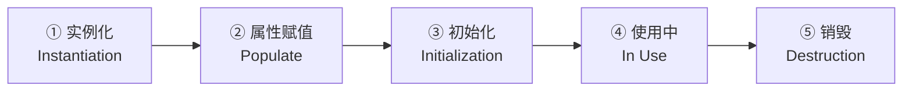
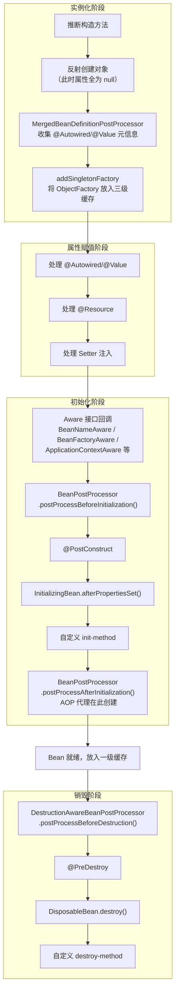
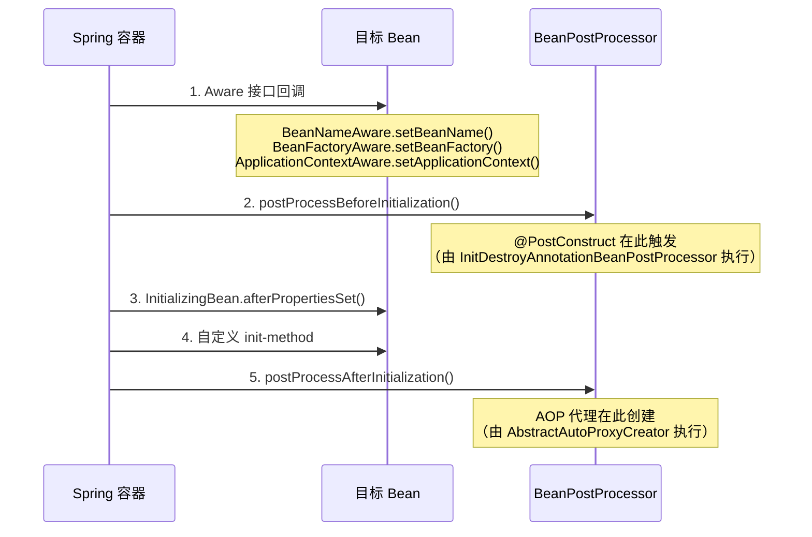
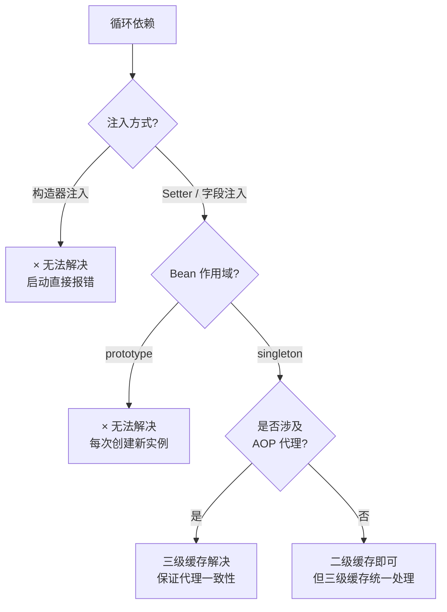
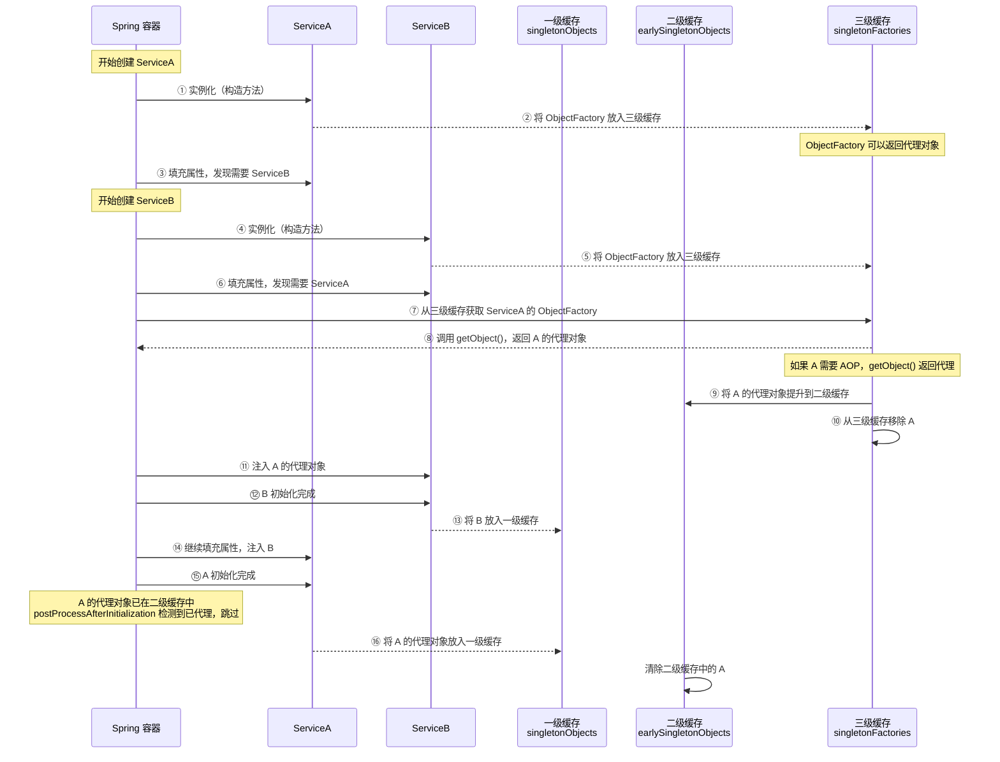
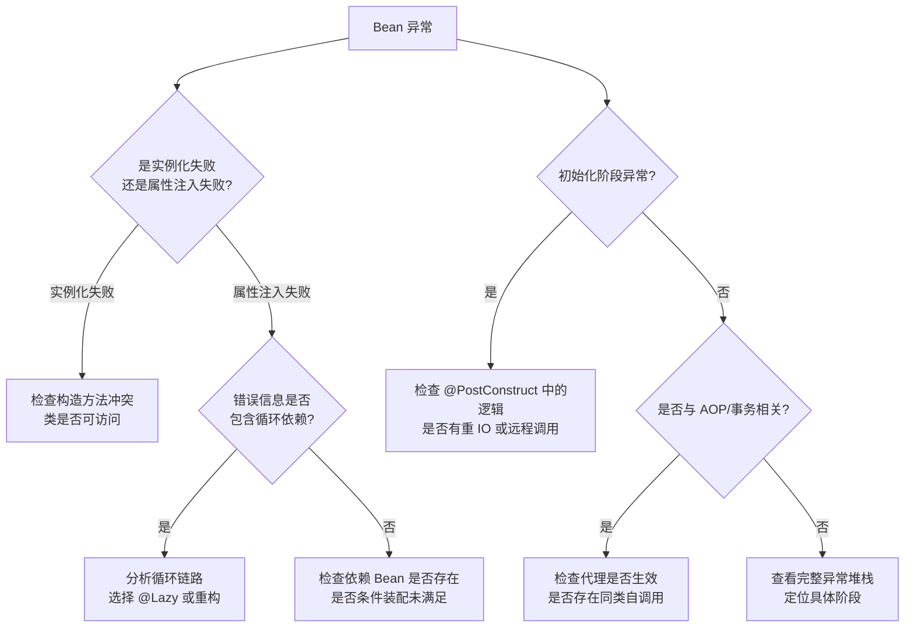

# Bean 生命周期与循环依赖

## 概念与背景

Spring 容器的核心价值不是"帮你 new 对象"，而是接管对象从创建、依赖注入、初始化到销毁的完整过程。很多线上问题——初始化失败、代理对象异常、循环依赖风险——本质上都和 Bean 生命周期有关。

理解 Bean 生命周期对于：

- **排查启动失败**：理解为什么 Bean 创建失败，异常出在哪个阶段
- **理解 AOP 原理**：代理对象是在生命周期哪个环节创建的
- **解决循环依赖**：三级缓存的工作时机和限制
- **扩展 Spring**：通过 `BeanPostProcessor` 等扩展点定制功能

::: tip 前置知识
本文涉及 IoC 容器和 AOP 的基础概念，建议先阅读 [IoC 容器](01-IoC容器.md)和 [AOP](02-AOP.md)。
:::

## Bean 生命周期总览

### 五大阶段

一个 Bean 从创建到销毁，经历以下主要阶段：



| 阶段 | 核心动作 | 典型问题 |
|------|---------|---------|
| 实例化 | 推断构造方法，反射创建对象 | 多构造方法冲突、构造器循环依赖 |
| 属性赋值 | 注入 `@Autowired`、`@Value`、`@Resource` 依赖 | 依赖找不到、循环依赖 |
| 初始化 | Aware 回调 → `@PostConstruct` → `afterPropertiesSet()` → AOP 代理 | 初始化顺序、代理对象与原始对象不一致 |
| 使用中 | Bean 就绪，被业务代码调用 | 同类自调用代理失效 |
| 销毁 | `@PreDestroy` → `destroy()` → `destroy-method` | 销毁顺序、资源泄漏 |

### 完整生命周期流程图



::: details 为什么初始化回调的顺序是 @PostConstruct → afterPropertiesSet() → init-method？
这是 Spring 的硬编码顺序。`@PostConstruct` 由 `InitDestroyAnnotationBeanPostProcessor` 在 `postProcessBeforeInitialization` 阶段触发；`InitializingBean.afterPropertiesSet()` 和 `init-method` 则在 `postProcessBeforeInitialization` 之后由 Spring 框架直接调用。这个顺序不可更改。
:::

## 实例化阶段

### 推断构造方法

Spring 在实例化 Bean 时，需要确定使用哪个构造方法：

1. **只有一个构造方法**——直接使用它
2. **有多个构造方法**——查找 `@Autowired` 标注的构造方法（只能标一个）
3. **有多个构造方法且无 `@Autowired`**——使用无参构造方法
4. **有多个构造方法、无 `@Autowired`、也无无参构造方法**——抛出异常

```java
@Component
public class UserService {

    private final UserRepository userRepository;

    // √ 推荐：单一构造方法，Spring 自动选用，无需 @Autowired
    public UserService(UserRepository userRepository) {
        this.userRepository = userRepository;
    }
}
```

```java
@Component
public class OrderService {

    private final PaymentService paymentService;
    private final NotificationService notificationService;

    // √ 多构造方法时，用 @Autowired 指定
    @Autowired
    public OrderService(PaymentService paymentService) {
        this.paymentService = paymentService;
        this.notificationService = null; // 可选依赖
    }

    // 其他构造方法不会被 Spring 使用
    public OrderService(PaymentService paymentService, NotificationService notificationService) {
        this.paymentService = paymentService;
        this.notificationService = notificationService;
    }
}
```

::: warning 构造方法与循环依赖
构造器注入的参数在实例化阶段就必须就绪。如果 A 的构造方法需要 B，B 的构造方法又需要 A，Spring 无法创建任何一个——这就是构造器循环依赖无法解决的根本原因。详见后文[循环依赖详解](#循环依赖详解)。
:::

### MergedBeanDefinitionPostProcessor

实例化之后、属性注入之前，Spring 会调用 `MergedBeanDefinitionPostProcessor` 来收集注解元信息：

```java
// AutowiredAnnotationBeanPostProcessor 实现了此接口
// 它在 postProcessMergedBeanDefinition() 中扫描 @Autowired、@Value 注解
// 将元信息缓存到 InjectionMetadata 中，供后续属性注入使用
```

这个步骤是属性赋值的前置准备，开发者通常不需要直接干预。

## 属性赋值阶段

实例化只产生了一个"空壳"对象（属性为 null），属性赋值阶段才把依赖注入进去。

### 注入方式对比

| 注入方式 | 示例 | 推荐度 | 说明 |
|---------|------|-------|------|
| 构造器注入 | `public Service(Dep d) { this.d = d; }` | √ 推荐 | 依赖不可变、依赖不为 null、天然防循环依赖 |
| Setter 注入 | `@Autowired public void setDep(Dep d)` | △ 可用 | 可选依赖场景 |
| 字段注入 | `@Autowired private Dep d;` | × 不推荐 | 代码简洁但隐藏设计问题、无法构建不可变对象 |

```java
@Component
public class OrderService {

    // 构造器注入（推荐）：强制依赖
    private final PaymentService paymentService;

    // Setter 注入：可选依赖
    private InventoryService inventoryService;

    // 字段注入（不推荐）：看似简单，实则隐藏问题
    // @Autowired
    // private UserService userService;

    public OrderService(PaymentService paymentService) {
        this.paymentService = paymentService;
    }

    @Autowired(required = false) // 可选依赖
    public void setInventoryService(InventoryService inventoryService) {
        this.inventoryService = inventoryService;
    }
}
```

::: danger 字段注入的问题
1. 依赖关系隐藏在类的内部，无法从构造方法签名看出来
2. 无法声明 `final`，对象不是不可变的
3. 与 Spring 容器强耦合，脱离容器后难以测试
4. 循环依赖在启动时不会暴露（Setter/字段注入会被三级缓存兜底）
:::

## 初始化阶段

初始化阶段是 Bean 生命周期中最关键的环节，AOP 代理、事务增强、校验等都在此阶段完成。

### 回调执行顺序



::: warning @PostConstruct 的真实触发时机
`@PostConstruct` 不是由 Spring 直接调用的，而是由 `InitDestroyAnnotationBeanPostProcessor`（父类 `CommonAnnotationBeanPostProcessor`）在 `postProcessBeforeInitialization` 阶段触发的。因此它排在 `InitializingBean.afterPropertiesSet()` 之前。完整顺序为：

1. `BeanPostProcessor.postProcessBeforeInitialization()`
2. → 其中 `InitDestroyAnnotationBeanPostProcessor` 触发 **`@PostConstruct`**
3. `InitializingBean.afterPropertiesSet()`
4. 自定义 `init-method`
5. `BeanPostProcessor.postProcessAfterInitialization()`
:::

### Aware 接口回调

Aware（感知）接口让 Bean 获得容器的内部信息。常用接口：

| Aware 接口 | 注入内容 | 典型用途 |
|-----------|---------|---------|
| `BeanNameAware` | Bean 的名称 | 日志记录、动态路由 |
| `BeanFactoryAware` | BeanFactory 实例 | 手动获取 Bean |
| `ApplicationContextAware` | ApplicationContext 实例 | 发布事件、获取环境变量 |
| `EnvironmentAware` | Environment 实例 | 读取配置 |
| `ResourceLoaderAware` | ResourceLoader 实例 | 加载外部资源 |
| `ApplicationEventPublisherAware` | 事件发布器 | 发布自定义事件 |

```java
@Component
public class MyService implements ApplicationContextAware, EnvironmentAware {

    private ApplicationContext ctx;
    private Environment env;

    @Override
    public void setApplicationContext(ApplicationContext ctx) {
        this.ctx = ctx;
    }

    @Override
    public void setEnvironment(Environment env) {
        this.env = env;
    }

    @PostConstruct
    public void init() {
        // 在 @PostConstruct 中，Aware 注入的字段已可用
        String activeProfile = env.getProperty("spring.profiles.active");
        System.out.println("当前环境: " + activeProfile);
    }
}
```

::: tip 现代 Spring Boot 中的替代方案
在 Spring Boot 中，`Environment`、`ApplicationContext` 等通常可以直接用 `@Autowired` 注入，不必实现 Aware 接口。Aware 接口更多用于框架内部或需要更早获取引用的场景。
:::

### @PostConstruct vs InitializingBean vs init-method

三者都能完成初始化逻辑，选择时参考：

| 方式 | 来源 | 特点 | 推荐场景 |
|------|------|------|---------|
| `@PostConstruct` | JSR-250 标准 | 与 Spring 解耦，语义清晰 | **首选**，一般初始化逻辑 |
| `InitializingBean` | Spring 接口 | 与 Spring 耦合，但异常签名明确 | 框架内部组件、需要保证执行顺序 |
| `init-method` | XML / `@Bean` | 与代码解耦，外部配置驱动 | 无法修改源码的第三方 Bean |

```java
@Component
public class CacheService implements InitializingBean {

    private final CacheConfig cacheConfig;
    private Cache cache;

    public CacheService(CacheConfig cacheConfig) {
        this.cacheConfig = cacheConfig;
    }

    @PostConstruct
    public void postConstruct() {
        // 轻量校验：确保配置已注入
        Objects.requireNonNull(cacheConfig, "缓存配置不能为空");
    }

    @Override
    public void afterPropertiesSet() throws Exception {
        // 实际初始化：创建缓存实例
        this.cache = new Cache(cacheConfig);
    }
}
```

### AOP 代理创建时机

AOP 代理在 `BeanPostProcessor.postProcessAfterInitialization()` 中创建，这是理解很多问题的关键：

```java
// AbstractAutoProxyCreator（AOP 代理创建的核心类）
public Object postProcessAfterInitialization(Object bean, String beanName) {
    if (bean != null) {
        // 包装缓存 key
        Object cacheKey = getCacheKey(bean.getClass(), beanName);
        // 如果早期引用没有被代理过，才在此处创建代理
        if (this.earlyProxyReferences.remove(cacheKey) != bean) {
            return wrapIfNecessary(bean, beanName, cacheKey);
        }
    }
    return bean;
}
```

这意味着：

1. **正常流程**：Bean 初始化完成后才创建代理，注入给其他 Bean 的是代理对象
2. **循环依赖流程**：Bean 可能提前被代理（通过三级缓存的 ObjectFactory），此时 `earlyProxyReferences` 会记录，避免在 `postProcessAfterInitialization` 中重复代理

相关内容详见 [AOP](02-AOP.md)。

## 销毁阶段

容器关闭时，Bean 按以下顺序执行清理逻辑：

1. `DestructionAwareBeanPostProcessor.postProcessBeforeDestruction()`
2. `@PreDestroy`
3. `DisposableBean.destroy()`
4. 自定义 `destroy-method`

```java
@Component
public class ResourceHolder implements DisposableBean {

    private Connection connection;

    @PreDestroy
    public void preDestroy() {
        // 第一批清理：释放业务资源
        System.out.println("释放业务资源");
    }

    @Override
    public void destroy() throws Exception {
        // 第二批清理：关闭底层连接
        if (connection != null) {
            connection.close();
        }
    }
}
```

### @Bean 的销毁方法配置

```java
@Configuration
public class AppConfig {

    // @Bean 默认会推断 close() / shutdown() 方法作为销毁方法
    // 可以用 destroyMethod = "" 禁用自动推断
    @Bean(destroyMethod = "customClose")
    public DataSource dataSource() {
        return new HikariDataSource();
    }
}
```

::: warning Spring Boot 的 destroyMethod 自动推断
`@Bean` 默认会自动推断名为 `close` 或 `shutdown` 的方法作为销毁回调。如果你的 Bean 有这些方法但不想被自动调用，需要显式设置 `@Bean(destroyMethod = "")` 来禁用。常见于第三方连接池等已有自身关闭逻辑的 Bean。
:::

### SmartLifecycle：有序启动与关闭

Spring 提供了 `SmartLifecycle` 接口，支持按优先级控制 Bean 的启动和关闭顺序：

```java
@Component
public class RpcServer implements SmartLifecycle {

    private volatile boolean running = false;

    @Override
    public void start() {
        // 启动 RPC 服务
        running = true;
        System.out.println("RPC 服务启动");
    }

    @Override
    public void stop() {
        // 优雅关闭 RPC 服务
        running = false;
        System.out.println("RPC 服务关闭");
    }

    @Override
    public boolean isRunning() {
        return running;
    }

    @Override
    public int getPhase() {
        // phase 值越小越先启动、越后关闭
        // 0 是默认值，Integer.MAX_VALUE 最后启动、最先关闭
        return 0;
    }

    @Override
    public boolean isAutoStartup() {
        return true; // 容器刷新时自动调用 start()
    }
}
```

::: tip 启动与关闭顺序
- **启动**：`phase` 值从小到大（`Integer.MIN_VALUE` 最先启动）
- **关闭**：`phase` 值从大到小（`Integer.MAX_VALUE` 最先关闭）
- 适用于需要有序管理的组件：RPC 服务、消息消费者、定时任务等
:::

### SmartInitializingSingleton

所有单例 Bean 初始化完成后的回调接口：

```java
@Component
public class WarmUpService implements SmartInitializingSingleton {

    @Override
    public void afterSingletonsInstantiated() {
        // 所有单例 Bean 都已初始化完毕
        // 适合做缓存预热、健康检查等
        System.out.println("所有 Bean 初始化完成，开始预热缓存");
    }
}
```

与 `@PostConstruct` 的区别：`@PostConstruct` 在当前 Bean 初始化时触发，此时其他 Bean 可能还没初始化；`SmartInitializingSingleton` 在所有单例 Bean 都初始化后才触发。

## 完整示例：观察 Bean 生命周期

```java
@Component
public class LifecycleDemo implements
        BeanNameAware, BeanFactoryAware, ApplicationContextAware,
        InitializingBean, DisposableBean {

    private static final Logger log = LoggerFactory.getLogger(LifecycleDemo.class);

    private String beanName;
    private ApplicationContext ctx;

    // ① 实例化
    public LifecycleDemo() {
        log.info("① 构造方法：实例化");
    }

    // ② 属性赋值
    @Autowired
    public void setDataSource(DataSource dataSource) {
        log.info("② 属性注入：DataSource");
    }

    // ③ Aware 回调
    @Override
    public void setBeanName(String name) {
        this.beanName = name;
        log.info("③ BeanNameAware: {}", name);
    }

    @Override
    public void setBeanFactory(BeanFactory beanFactory) {
        log.info("④ BeanFactoryAware");
    }

    @Override
    public void setApplicationContext(ApplicationContext ctx) {
        this.ctx = ctx;
        log.info("⑤ ApplicationContextAware");
    }

    // ④ @PostConstruct（在 postProcessBeforeInitialization 中触发）
    @PostConstruct
    public void postConstruct() {
        log.info("⑥ @PostConstruct：所有依赖已注入，可安全使用");
    }

    // ⑤ InitializingBean
    @Override
    public void afterPropertiesSet() throws Exception {
        log.info("⑦ InitializingBean.afterPropertiesSet()");
    }

    // 业务方法
    public void doWork() {
        log.info("业务方法执行");
    }

    // ⑥ @PreDestroy
    @PreDestroy
    public void preDestroy() {
        log.info("⑧ @PreDestroy：准备销毁");
    }

    // ⑦ DisposableBean
    @Override
    public void destroy() throws Exception {
        log.info("⑨ DisposableBean.destroy()");
    }
}
```

预期输出：

```
① 构造方法：实例化
② 属性注入：DataSource
③ BeanNameAware: lifecycleDemo
④ BeanFactoryAware
⑤ ApplicationContextAware
⑥ @PostConstruct：所有依赖已注入，可安全使用
⑦ InitializingBean.afterPropertiesSet()
业务方法执行
⑧ @PreDestroy：准备销毁
⑨ DisposableBean.destroy()
```

## BeanPostProcessor 扩展点

`BeanPostProcessor`（Bean 后置处理器）是 Spring 最核心的扩展机制之一。它允许你在每个 Bean 的初始化前后插入自定义逻辑，AOP、`@Autowired`、`@PostConstruct` 等特性都基于它实现。

### 接口定义

```java
@FunctionalInterface
public interface BeanPostProcessor {

    // 在初始化方法（@PostConstruct、afterPropertiesSet()）之前执行
    @Nullable
    default Object postProcessBeforeInitialization(Object bean, String beanName)
            throws BeansException {
        return bean;
    }

    // 在初始化方法之后执行
    //  AOP 代理就是在这里由 AbstractAutoProxyCreator 创建的
    @Nullable
    default Object postProcessAfterInitialization(Object bean, String beanName)
            throws BeansException {
        return bean;
    }
}
```

### BeanPostProcessor vs BeanFactoryPostProcessor

两者容易混淆，区别关键在于**作用时机**和**操作对象**：

| 维度 | BeanFactoryPostProcessor | BeanPostProcessor |
|------|-------------------------|-------------------|
| 作用时机 | Bean 实例化**之前** | Bean 实例化**之后** |
| 操作对象 | `BeanDefinition`（Bean 的元数据） | Bean 实例本身 |
| 能否修改 Bean 定义 | √ 可以 | × 不可以 |
| 能否替换 Bean 实例 | × 不可以 | √ 可以（如创建代理） |
| 典型应用 | `@Conditional` 评估、属性占位符替换 | AOP 代理、`@Autowired` 注入、`@PostConstruct` 触发 |

```java
// BeanFactoryPostProcessor：修改 Bean 定义（实例化之前）
@Component
public class MyBeanFactoryPostProcessor implements BeanFactoryPostProcessor {
    @Override
    public void postProcessBeanFactory(ConfigurableListableBeanFactory beanFactory) {
        BeanDefinition bd = beanFactory.getBeanDefinition("myService");
        bd.setScope("prototype"); // 动态修改作用域
    }
}

// BeanPostProcessor：修改或替换 Bean 实例（实例化之后）
@Component
public class MyBeanPostProcessor implements BeanPostProcessor {
    @Override
    public Object postProcessAfterInitialization(Object bean, String beanName) {
        // 可以返回代理对象，替换原始 Bean
        return bean;
    }
}
```

### 内置的 BeanPostProcessor

Spring 内置了很多重要的 `BeanPostProcessor`：

| BeanPostProcessor | 作用 | 触发阶段 |
|-------------------|------|---------|
| `AutowiredAnnotationBeanPostProcessor` | 处理 `@Autowired`、`@Value` 注入 | 属性赋值（内部用 `MergedBeanDefinitionPostProcessor` + `SmartInstantiationAwareBeanPostProcessor`） |
| `CommonAnnotationBeanPostProcessor` | 处理 `@PostConstruct`、`@PreDestroy`、`@Resource` | 初始化前/销毁前 |
| `ApplicationContextAwareProcessor` | 处理 Aware 接口回调 | 初始化前 |
| `AbstractAutoProxyCreator` | 创建 AOP 代理 | 初始化后 |
| `AsyncAnnotationBeanPostProcessor` | 处理 `@Async` 代理 | 初始化后 |
| `ScheduledAnnotationBeanPostProcessor` | 处理 `@Scheduled` 定时任务 | 初始化后 |

### 自定义 BeanPostProcessor 示例

```java
// 示例：记录 Bean 初始化耗时
@Component
public class TimingBeanPostProcessor implements BeanPostProcessor, Ordered {

    private static final Logger log = LoggerFactory.getLogger(TimingBeanPostProcessor.class);
    private final ThreadLocal<Long> startTime = new ThreadLocal<>();

    @Override
    public Object postProcessBeforeInitialization(Object bean, String beanName) {
        startTime.set(System.currentTimeMillis());
        return bean;
    }

    @Override
    public Object postProcessAfterInitialization(Object bean, String beanName) {
        long elapsed = System.currentTimeMillis() - startTime.get();
        startTime.remove();
        if (elapsed > 100) {
            log.warn("Bean [{}] 初始化耗时 {}ms，可能影响启动速度", beanName, elapsed);
        }
        return bean;
    }

    @Override
    public int getOrder() {
        return Ordered.LOWEST_PRECEDENCE; // 最后执行，确保计时覆盖完整初始化
    }
}
```

::: warning BeanPostProcessor 的注意事项
1. **不要在 BeanPostProcessor 中注入被它处理的 Bean**——会导致循环依赖或提前实例化
2. **BeanPostProcessor 对 AOP 的影响**——如果你的 BeanPostProcessor 在 `AbstractAutoProxyCreator` 之前执行并返回了代理对象，可能导致 AOP 代理被覆盖
3. **Order 很重要**——多个 BeanPostProcessor 的执行顺序由 `Ordered` 接口决定
:::

## 循环依赖详解

### 什么是循环依赖

最典型的循环依赖就是 A 依赖 B，B 又依赖 A：

```java
@Component
public class ServiceA {
    @Autowired
    private ServiceB serviceB;
}

@Component
public class ServiceB {
    @Autowired
    private ServiceA serviceA;
}
```

更复杂的还有三方循环（A → B → C → A），本质一样。

### 循环依赖的类型与解决能力



#### 1. 构造器循环依赖：无法解决

```java
@Component
public class ServiceA {
    private final ServiceB serviceB;
    @Autowired
    public ServiceA(ServiceB serviceB) {
        this.serviceB = serviceB;
    }
}

@Component
public class ServiceB {
    private final ServiceA serviceA;
    @Autowired
    public ServiceB(ServiceA serviceA) {
        this.serviceA = serviceA;
    }
}
```

**失败原因**：Spring 创建 A 时需要先拿到 B 作为构造参数，创建 B 时又需要 A 作为构造参数，形成死锁。此时对象都还没实例化，三级缓存无法介入。

#### 2. Setter / 字段循环依赖：可以解决

```java
@Component
public class ServiceA {
    private ServiceB serviceB;
    @Autowired
    public void setServiceB(ServiceB serviceB) {
        this.serviceB = serviceB;
    }
}

@Component
public class ServiceB {
    private ServiceA serviceA;
    @Autowired
    public void setServiceA(ServiceA serviceA) {
        this.serviceA = serviceA;
    }
}
```

**解决原理**：Spring 先调用 A 的构造方法创建实例（此时属性为 null），将 A 的早期引用放入缓存，再去创建 B。B 发现需要 A，从缓存拿到 A 的早期引用，完成自身创建后返回给 A，A 再完成属性注入。

#### 3. Prototype 作用域循环依赖：无法解决

```java
@Component @Scope("prototype")
public class ServiceA {
    @Autowired private ServiceB serviceB;
}

@Component @Scope("prototype")
public class ServiceB {
    @Autowired private ServiceA serviceA;
}
```

Prototype Bean 不走三级缓存，每次 `getBean` 都创建新实例，无法实现循环引用。

### 三级缓存机制

Spring 使用三级缓存解决 singleton Bean 的循环依赖问题：

```java
// DefaultSingletonBeanRegistry 中的三级缓存

// 一级缓存：存放完全初始化好的 Bean（所有属性已注入、初始化回调已执行）
private final Map<String, Object> singletonObjects = new ConcurrentHashMap<>(256);

// 二级缓存：存放早期暴露的 Bean（已实例化，但属性未注入、初始化未完成）
private final Map<String, Object> earlySingletonObjects = new HashMap<>(16);

// 三级缓存：存放 ObjectFactory，调用时才决定返回原始对象还是代理对象
private final Map<String, ObjectFactory<?>> singletonFactories = new HashMap<>(16);
```

#### 三级缓存工作流程

以 ServiceA ↔ ServiceB 循环依赖（A 需要 AOP 代理）为例：



#### 核心源码

```java
// DefaultSingletonBeanRegistry.java

// 获取单例 Bean（依次从一级 → 二级 → 三级缓存查找）
protected Object getSingleton(String beanName, boolean allowEarlyReference) {
    // 1. 先从一级缓存获取（完全初始化好的 Bean）
    Object singletonObject = this.singletonObjects.get(beanName);

    if (singletonObject == null && isSingletonCurrentlyInCreation(beanName)) {
        synchronized (this.singletonObjects) {
            // 2. 从二级缓存获取（早期暴露的 Bean）
            singletonObject = this.earlySingletonObjects.get(beanName);

            if (singletonObject == null && allowEarlyReference) {
                // 3. 从三级缓存获取（ObjectFactory）
                ObjectFactory<?> singletonFactory = this.singletonFactories.get(beanName);

                if (singletonFactory != null) {
                    // 调用工厂方法，决定返回原始对象还是代理对象
                    singletonObject = singletonFactory.getObject();
                    // 提升到二级缓存
                    this.earlySingletonObjects.put(beanName, singletonObject);
                    // 从三级缓存移除
                    this.singletonFactories.remove(beanName);
                }
            }
        }
    }

    return singletonObject;
}

// Bean 实例化后，将 ObjectFactory 放入三级缓存
protected void addSingletonFactory(String beanName, ObjectFactory<?> singletonFactory) {
    synchronized (this.singletonObjects) {
        if (!this.singletonObjects.containsKey(beanName)) {
            this.singletonFactories.put(beanName, singletonFactory);
            this.earlySingletonObjects.remove(beanName);
            this.registeredSingletons.add(beanName);
        }
    }
}

// Bean 完全初始化后，放入一级缓存，清除二、三级缓存
protected void addSingleton(String beanName, Object singletonObject) {
    synchronized (this.singletonObjects) {
        this.singletonObjects.put(beanName, singletonObject);
        this.singletonFactories.remove(beanName);
        this.earlySingletonObjects.remove(beanName);
        this.registeredSingletons.add(beanName);
    }
}
```

### 为什么需要三级而不是二级？

这是面试高频追问，关键在于 **AOP 代理的一致性**。

假设 ServiceA 需要 AOP 代理，且与 ServiceB 存在循环依赖：

**只用二级缓存的问题**：

1. A 实例化后，直接把原始对象放入二级缓存
2. B 从二级缓存拿到 A 的原始对象并注入
3. A 在 `postProcessAfterInitialization` 中被代理，代理对象放入一级缓存
4. **不一致**：B 持有 A 的原始对象，一级缓存中是代理对象，行为不统一

**三级缓存的解决方式**：

1. A 实例化后，把 `ObjectFactory` 放入三级缓存（不是直接放对象）
2. B 需要注入 A 时，调用 `ObjectFactory.getObject()`
3. `getObject()` 内部判断：如果 A 需要 AOP 代理，返回代理对象；否则返回原始对象
4. 返回的对象提升到二级缓存
5. B 注入的是代理对象（如果需要代理的话）
6. A 初始化完成后，代理对象放入一级缓存
7. **一致**：B 持有的和一级缓存中的是同一个代理对象

::: tip 关键理解
三级缓存存的不是对象本身，而是**对象工厂**（`ObjectFactory`）。工厂的 `getObject()` 方法会根据情况返回原始对象或代理对象，保证"无论谁先获取到这个 Bean 的早期引用，拿到的都是同一个版本"。
:::

::: details 如果确定没有 AOP，二级缓存够用吗？
理论上够用。但 Spring 无法在实例化阶段就确定 Bean 是否会被 AOP 代理（代理是在 `postProcessAfterInitialization` 中创建的），所以统一使用三级缓存是最安全的策略。这也是为什么 Spring 不提供"关闭三级缓存只留二级"的选项。
:::

### Spring Boot 2.6+ 默认禁止循环依赖

从 Spring Boot 2.6 开始，`spring.main.allow-circular-references` 默认值改为 `false`，即循环依赖直接报错。Spring Boot 3.x 延续了这个默认值。

```yaml
# application.yml
spring:
  main:
    allow-circular-references: true  # 不推荐，仅用于遗留项目过渡
```

::: danger 不要用 allow-circular-references=true 掩盖问题
这个配置只是让 Spring 不再报错，并不能真正解决设计问题。循环依赖带来的模块边界模糊、初始化顺序不确定、代理对象不一致等风险依然存在。新项目应从架构层面消除循环依赖。
:::

### 构造器循环依赖的解决方案

```java
// × 无法启动
@Service
public class ServiceA {
    private final ServiceB serviceB;
    public ServiceA(ServiceB serviceB) {
        this.serviceB = serviceB;
    }
}

@Service
public class ServiceB {
    private final ServiceA serviceA;
    public ServiceB(ServiceA serviceA) {
        this.serviceA = serviceA;
    }
}
```

#### 方案一：@Lazy 延迟注入

```java
@Service
public class ServiceA {
    private final ServiceB serviceB;

    // @Lazy 让 Spring 注入一个代理对象，而不是立即创建真实 Bean
    public ServiceA(@Lazy ServiceB serviceB) {
        this.serviceB = serviceB;
    }
}
```

`@Lazy` 的原理：Spring 在遇到 `@Lazy` 标注的依赖时，不会立即调用 `getBean()`，而是创建一个代理对象注入。只有第一次实际调用该依赖的方法时，代理对象才会触发真实 Bean 的创建。

#### 方案二：重构，提取公共逻辑（推荐）

```java
// × 循环依赖
@Service
public class OrderService {
    @Autowired private UserService userService;
    public void createOrder() { /* 需要 userService */ }
}

@Service
public class UserService {
    @Autowired private OrderService orderService;
    public void getUserOrders() { /* 需要 orderService */ }
}

// √ 提取查询逻辑到第三方服务
@Service
public class OrderQueryService {
    public List<Order> queryByUserId(Long userId) { /* ... */ }
}

@Service
public class OrderService {
    private final OrderQueryService orderQueryService;
    public OrderService(OrderQueryService orderQueryService) {
        this.orderQueryService = orderQueryService;
    }
    public void createOrder() { /* ... */ }
}

@Service
public class UserService {
    private final OrderQueryService orderQueryService;
    public UserService(OrderQueryService orderQueryService) {
        this.orderQueryService = orderQueryService;
    }
    public void getUserOrders() {
        orderQueryService.queryByUserId(userId);
    }
}
```

#### 方案三：使用事件驱动解耦

```java
// × 循环依赖：OrderService 直接依赖 NotificationService
@Service
public class OrderService {
    @Autowired private NotificationService notificationService;
    public void createOrder() {
        // 创建订单...
        notificationService.sendNotification(); // 直接调用
    }
}

// √ 事件驱动：通过 ApplicationEvent 解耦
@Service
public class OrderService {
    @Autowired
    private ApplicationEventPublisher publisher;

    public void createOrder() {
        // 创建订单...
        publisher.publishEvent(new OrderCreatedEvent(order));
    }
}

@Component
public class NotificationEventListener {
    @EventListener
    public void handleOrderCreated(OrderCreatedEvent event) {
        // 发送通知，无需反向依赖 OrderService
    }
}
```

### @Async 导致的循环依赖

```java
@Component
public class ServiceA {
    @Autowired
    private ServiceB serviceB;
}

@Component
public class ServiceB {
    @Async  // @Async 通过 BeanPostProcessor 创建代理
    public void asyncMethod() { /* ... */ }

    @Autowired
    private ServiceA serviceA;
}
```

**问题**：`@Async` 在 `postProcessAfterInitialization` 中为 ServiceB 创建代理。如果 ServiceB 在 A 的属性注入阶段被获取，此时 B 还没走到 `postProcessAfterInitialization`，三级缓存会提前调用 ObjectFactory 为 B 创建代理。在某些场景下，这会导致 `BeanCurrentlyInCreationException`。

**解决方案**：

```java
@Component
public class ServiceA {
    @Autowired
    @Lazy  // 延迟加载，打破循环
    private ServiceB serviceB;
}
```

## 实战场景

### 场景一：初始化阶段访问未准备好的资源

```java
@Service
public class BadService {

    @Autowired
    private UserRepository userRepository;

    // × 构造方法中依赖还未注入
    public BadService() {
        User user = userRepository.findById(1L); // NullPointerException!
    }

    // × @PostConstruct 中做耗时操作
    @PostConstruct
    public void init() {
        List<User> users = userRepository.findAll(); // 影响启动速度
        remoteService.call(); // 可能导致启动失败
    }
}
```

**正确做法**：

```java
@Service
public class GoodService {

    private final UserRepository userRepository;

    // √ 构造器注入，依赖在构造时就已确定
    public GoodService(UserRepository userRepository) {
        this.userRepository = userRepository;
    }

    @PostConstruct
    public void init() {
        // √ 只做轻量校验，不做重 IO
        Objects.requireNonNull(userRepository, "UserRepository 不能为空");
    }

    // √ 延迟到首次使用时初始化
    private volatile boolean warmedUp = false;

    public User getUser(Long id) {
        if (!warmedUp) {
            synchronized (this) {
                if (!warmedUp) {
                    warmUpCache(); // 首次使用时预热
                    warmedUp = true;
                }
            }
        }
        return userRepository.findById(id).orElse(null);
    }
}
```

### 场景二：代理对象与原始对象不一致

```java
@Service
public class OrderService {

    @Transactional
    public void createOrder() { /* ... */ }

    public void invokeSelf() {
        // × this 是原始对象，不走代理，事务不生效
        this.createOrder();
    }
}
```

**解决方案**：

```java
@Service
public class OrderService {

    // 方案一：注入自身代理
    @Autowired
    @Lazy // 必须 @Lazy，否则循环依赖
    private OrderService self;

    @Transactional
    public void createOrder() { /* ... */ }

    public void invokeSelf() {
        self.createOrder(); // √ 走代理，事务生效
    }
}
```

```java
// 方案二：通过 AopContext 获取当前代理（需开启 exposeProxy）
@SpringBootApplication
@EnableAspectJAutoProxy(exposeProxy = true)
public class Application { }

@Service
public class OrderService {

    @Transactional
    public void createOrder() { /* ... */ }

    public void invokeSelf() {
        // √ 通过 AopContext 获取当前代理对象
        ((OrderService) AopContext.currentProxy()).createOrder();
    }
}
```

::: warning AopContext 的限制
1. 必须设置 `@EnableAspectJAutoProxy(exposeProxy = true)`
2. 只能在代理对象的方法调用链内使用，外部直接调用 `AopContext.currentProxy()` 会抛异常
3. 详见 [AOP](02-AOP.md)
:::

### 场景三：多构造方法冲突

```java
@Service
public class PaymentService {
    private final PaymentGateway gateway;
    private final RiskService riskService;

    // × 多个构造方法、无 @Autowired、无无参构造 → 启动失败
    public PaymentService(PaymentGateway gateway) {
        this.gateway = gateway;
        this.riskService = null;
    }

    public PaymentService(PaymentGateway gateway, RiskService riskService) {
        this.gateway = gateway;
        this.riskService = riskService;
    }
}
```

**解决方案**：

```java
@Service
public class PaymentService {
    private final PaymentGateway gateway;
    private final RiskService riskService;

    // √ 用 @Autowired 指定要使用的构造方法
    @Autowired
    public PaymentService(PaymentGateway gateway,
                          @Nullable RiskService riskService) {
        this.gateway = gateway;
        this.riskService = riskService;
    }
}
```

## 排查与治理

### 排查顺序

遇到启动期 Bean 异常时，按以下优先级排查：



### 排查工具

#### 开启调试日志

```yaml
# application.yml
logging:
  level:
    org.springframework.beans.factory: DEBUG
    org.springframework.context.annotation: DEBUG
```

#### 使用 Spring Boot Actuator

```xml
<dependency>
    <groupId>org.springframework.boot</groupId>
    <artifactId>spring-boot-starter-actuator</artifactId>
</dependency>
```

访问 `/actuator/beans` 查看所有注册的 Bean 及其依赖关系。

#### 自定义 BeanPostProcessor 排查初始化顺序

```java
@Component
public class DebugBeanPostProcessor implements BeanPostProcessor, Ordered {

    private static final Logger log = LoggerFactory.getLogger(DebugBeanPostProcessor.class);

    @Override
    public Object postProcessBeforeInitialization(Object bean, String beanName) {
        log.debug("[BeforeInit] {} -> {}", beanName, bean.getClass().getSimpleName());
        return bean;
    }

    @Override
    public Object postProcessAfterInitialization(Object bean, String beanName) {
        log.debug("[AfterInit] {} -> {}", beanName, bean.getClass().getSimpleName());
        return bean;
    }

    @Override
    public int getOrder() {
        return Ordered.HIGHEST_PRECEDENCE; // 最先执行，确保记录完整链路
    }
}
```

### 治理重点

1. **优先按职责拆分，消除循环依赖**——提取公共逻辑、使用事件驱动、避免过度耦合
2. **初始化阶段只做轻量准备**——不在构造方法中访问依赖、不在 `@PostConstruct` 中做耗时操作
3. **优先使用构造器注入**——依赖关系更清晰、循环依赖会在启动时立即暴露
4. **理解代理的创建时机**——AOP 代理在 `postProcessAfterInitialization` 中创建，同类自调用不走代理

## 常见误区

| 误区 | 正解 |
|------|------|
| Spring 能解决循环依赖，设计上也没问题 | 循环依赖本质是设计问题，三级缓存是兜底不是特性 |
| 在 `@PostConstruct` 中做远程调用和复杂逻辑 | 初始化方法应轻量化，只做必要的校验和准备 |
| 不理解 BeanPostProcessor 就讨论事务和 AOP | AOP 代理是通过 BeanPostProcessor 创建的，理解扩展点才能理解代理 |
| 把代理对象问题误判成"注入失败" | 注入的是代理对象，需要理解代理机制才能正确排障 |
| 只追求容器启动成功，不关注依赖关系是否混乱 | 启动成功不代表设计合理，应关注代码质量和依赖方向 |

## 面试高频问题

### 1. Bean 的生命周期有哪些阶段？各阶段的核心回调是什么？

**参考答案**：

五大阶段及核心回调：

1. **实例化**：推断构造方法 → 反射创建对象 → `MergedBeanDefinitionPostProcessor` 收集注解元信息
2. **属性赋值**：处理 `@Autowired`、`@Value`、`@Resource` 注入
3. **初始化**：Aware 回调 → `BeanPostProcessor.before` → `@PostConstruct` → `InitializingBean.afterPropertiesSet()` → `init-method` → `BeanPostProcessor.after`（AOP 代理在此创建）
4. **使用**：Bean 就绪，可被业务代码调用
5. **销毁**：`@PreDestroy` → `DisposableBean.destroy()` → `destroy-method`

其中初始化阶段的回调顺序是硬编码的，不可更改。

### 2. Spring 如何通过三级缓存解决循环依赖？为什么需要三级而不是二级？

**参考答案**：

三级缓存分别是：
- **一级缓存**（`singletonObjects`）：存放完全初始化好的 Bean
- **二级缓存**（`earlySingletonObjects`）：存放早期暴露的 Bean（已实例化但未完成初始化）
- **三级缓存**（`singletonFactories`）：存放 `ObjectFactory`，调用时才决定返回原始对象还是代理对象

工作流程：Bean 实例化后立即将 ObjectFactory 放入三级缓存 → 其他 Bean 需要早期引用时调用 `getObject()` → 返回的对象提升到二级缓存 → Bean 完全初始化后放入一级缓存。

**为什么需要三级**：如果只用二级缓存，AOP 代理的场景会出现不一致——B 从缓存拿到的是原始对象，但一级缓存中最终放入的是代理对象。三级缓存的 ObjectFactory 保证无论谁先获取早期引用，拿到的都是同一个版本（代理对象或原始对象），从而保证引用一致性。

### 3. 构造器循环依赖为什么无法解决？如何处理？

**参考答案**：

构造器循环依赖无法解决是因为：Spring 创建 A 时需要先获取构造器参数 B，创建 B 时又需要 A 作为构造器参数，此时两个对象都还没实例化，三级缓存无法介入（三级缓存在实例化之后才放入）。

处理方式：
1. **`@Lazy` 延迟注入**：在构造器参数上加 `@Lazy`，Spring 会注入代理对象而非立即创建真实 Bean
2. **重构消除**：提取公共逻辑到第三方 Service，从根本上打破循环（推荐）
3. **事件驱动解耦**：通过 `ApplicationEvent` 替代直接依赖

### 4. BeanPostProcessor 和 BeanFactoryPostProcessor 的区别？

**参考答案**：

- **BeanFactoryPostProcessor**：在 Bean 实例化之前执行，操作的是 `BeanDefinition`（Bean 的元数据定义），可以修改 Bean 的属性、作用域等。典型应用如 `PropertyPlaceholderConfigurer`（属性占位符替换）。
- **BeanPostProcessor**：在 Bean 实例化之后执行，操作的是 Bean 实例本身，可以在初始化前后修改或替换 Bean。典型应用如 AOP 代理创建、`@Autowired` 注入、`@PostConstruct` 触发。

核心区别：前者改"定义"，后者改"实例"。

### 5. @PostConstruct、InitializingBean.afterPropertiesSet()、init-method 的执行顺序是什么？应该选哪个？

**参考答案**：

执行顺序：`@PostConstruct` → `InitializingBean.afterPropertiesSet()` → `init-method`

选择建议：
- **首选 `@PostConstruct`**：JSR-250 标准，与 Spring 解耦，语义清晰
- **`InitializingBean`**：适用于框架内部组件，需要保证执行顺序或异常签名的场景
- **`init-method`**：适用于无法修改源码的第三方 Bean，通过外部配置指定

三者可以同时使用，Spring 会按固定顺序依次调用。

## 总结

Bean 生命周期和循环依赖是 Spring 框架的核心概念，理解它们对于：

- **排查启动问题**：理解 Bean 创建失败的原因和异常所处阶段
- **理解 Spring 机制**：理解 AOP、事务等特性的实现原理和代理创建时机
- **设计良好架构**：避免循环依赖，保持清晰的依赖关系和模块边界
- **扩展 Spring 功能**：通过 BeanPostProcessor 等扩展点定制功能

关键要点回顾：

1. 生命周期五大阶段：**实例化 → 属性赋值 → 初始化 → 使用 → 销毁**
2. 初始化回调顺序固定：**Aware → `@PostConstruct` → `afterPropertiesSet()` → `init-method`**
3. AOP 代理在 `postProcessAfterInitialization` 中创建
4. 三级缓存解决 singleton 的 Setter/字段循环依赖，**构造器循环依赖无法解决**
5. Spring Boot 2.6+ 默认禁止循环依赖，应从设计层面消除

掌握这些知识，不仅能写出更健壮的代码，也能更好地理解 Spring 框架的设计思想。

## 版本差异(旧版 → Spring 6.x)

| 特性 | 旧版(Spring 5.x) | Spring 6.x |
|------|-----------------|------------|
| 生命周期回调 | @PostConstruct(javax) | jakarta.annotation 包 |
| 三级缓存 | 单例缓存 | 不变；核心机制稳定 |
| 循环依赖 | 默认允许 | Boot 2.6+ 默认禁止 |
| 初始化顺序 | 不变 | 不变 |
| AOT | 无 | Spring 6 AOT 下循环依赖不可用 |
