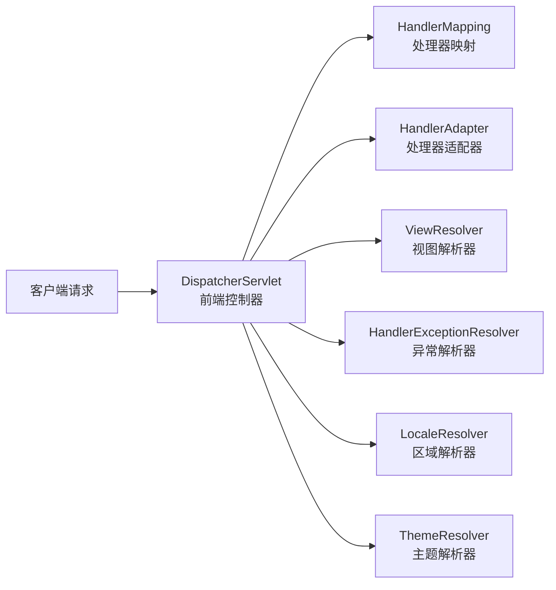
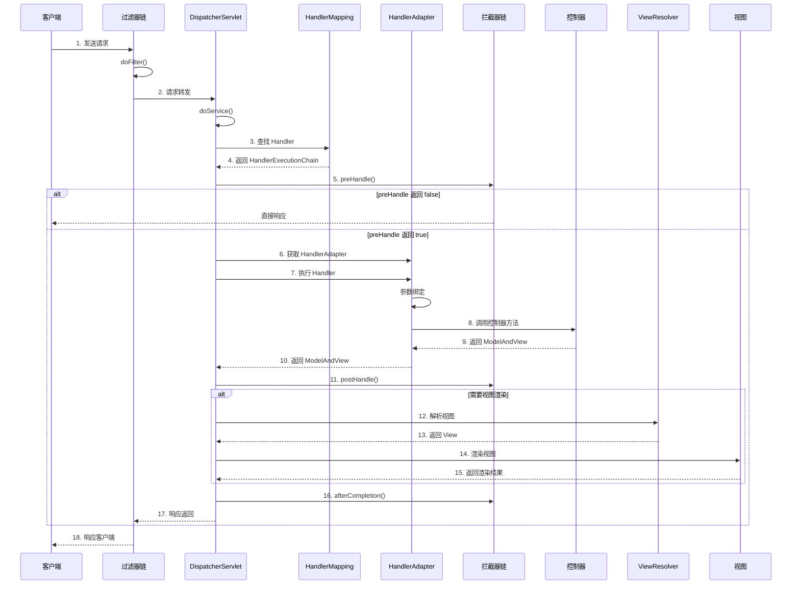
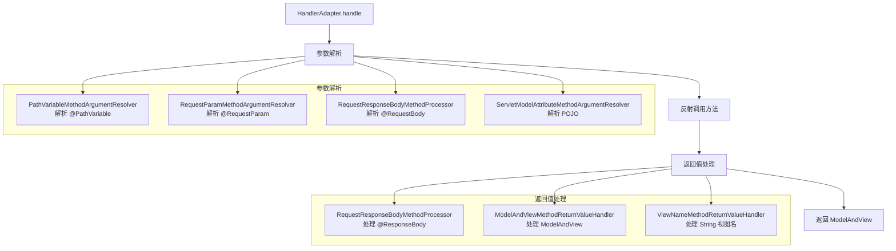
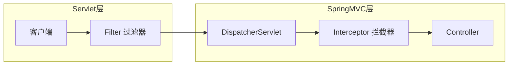
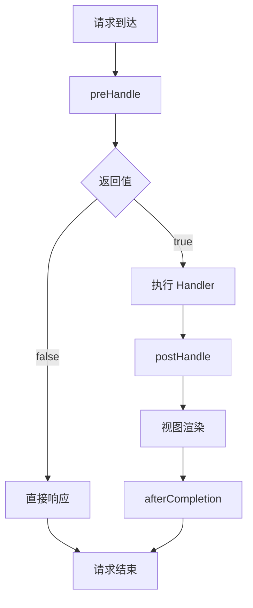
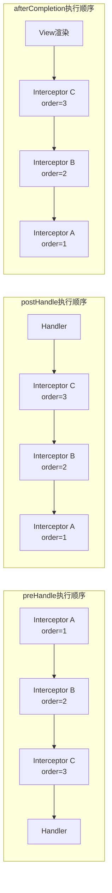
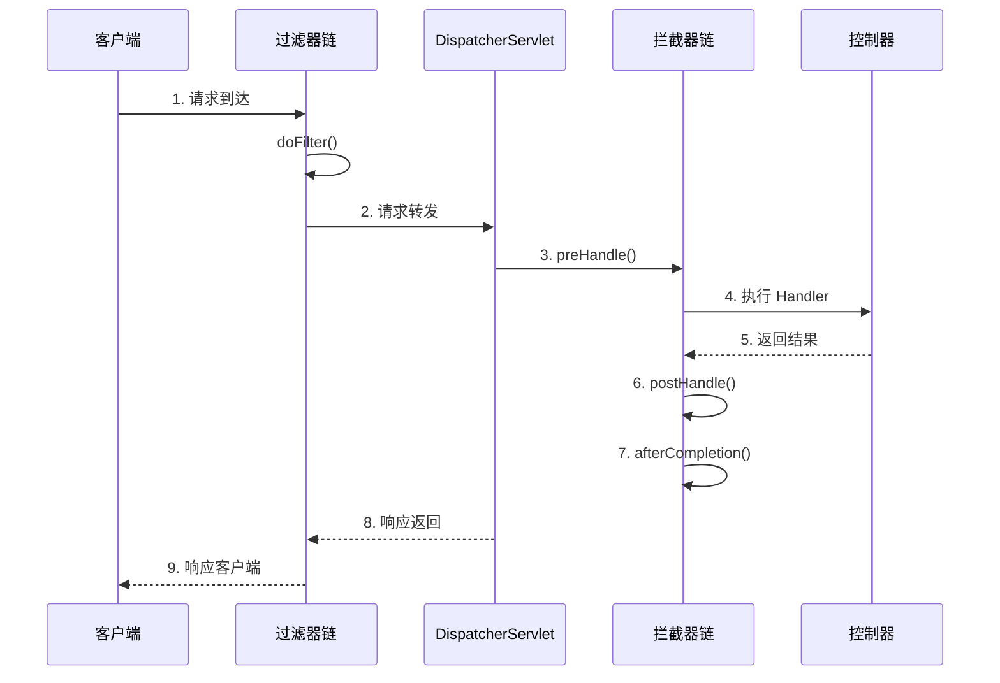
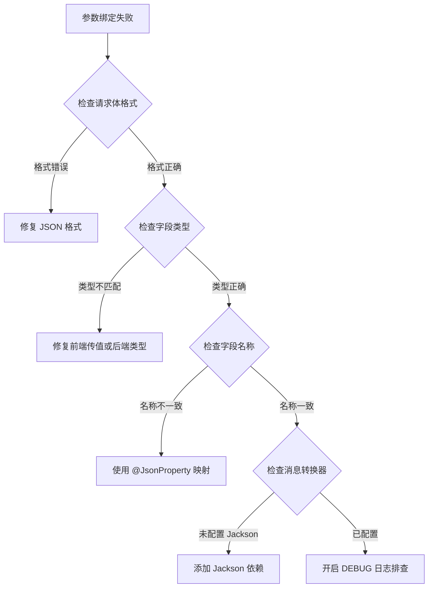

# SpringMVC 执行流程与拦截器

SpringMVC 是 Spring 框架的 Web 层核心模块，理解其执行流程是排查 Web 层问题的基础。本文从 DispatcherServlet 的核心调度机制出发，深入讲解请求处理流程、拦截器链路、参数绑定与返回值处理机制，并对比过滤器与拦截器的使用场景。

::: tip 版本基准
本文档以 **Spring Framework 6.x** 和 **Spring Boot 3.x** 为主要版本。代码示例优先使用现代配置方式（Java Config / 注解），必要时标注与旧版本（Spring 5.x / Boot 2.x）的差异。
:::

## 为什么必须理解执行流程

很多开发者会写 `@GetMapping`、`@PostMapping`，但遇到以下问题时却无从下手：

| 问题场景 | 需要理解的流程环节 |
|---------|-------------------|
| 参数绑定失败 | HandlerAdapter 参数解析机制 |
| 返回值序列化异常 | 返回值处理器和消息转换器 |
| 拦截器顺序错误 | 拦截器链执行顺序规则 |
| 异常处理不生效 | 异常解析器链执行时机 |
| 跨域预检失败 | CORS 拦截器执行位置 |
| 性能瓶颈定位 | 各环节耗时分析 |

**SpringMVC 真正值钱的地方**：不是会写注解，而是知道一个请求进来后框架到底做了什么，能够快速定位问题出在哪个环节。

## 核心组件与职责

### DispatcherServlet：前端控制器

**DispatcherServlet** 是 SpringMVC 的核心，采用**前端控制器模式**（Front Controller Pattern）统一接收和分发所有请求。



**核心职责**：

| 职责 | 说明 |
|-----|------|
| 统一接收请求 | 所有请求先到达 DispatcherServlet |
| 分发请求 | 根据请求信息找到对应的处理器 |
| 协调组件 | 调用各个组件完成请求处理 |
| 异常处理 | 统一处理请求过程中的异常 |
| 视图渲染 | 处理返回值和视图渲染 |

**前端控制器模式的优势**：

- **集中控制**：统一管理请求处理流程，避免各组件分散处理
- **解耦设计**：各组件独立，易于扩展和替换
- **可维护性**：修改流程不影响业务代码

### 核心组件一览

| 组件 | 职责 | 默认实现 |
|-----|------|---------|
| **HandlerMapping** | 根据请求 URL 找到对应的 Handler | RequestMappingHandlerMapping |
| **HandlerAdapter** | 执行 Handler 方法，处理参数绑定和返回值 | RequestMappingHandlerAdapter |
| **HandlerExceptionResolver** | 处理 Handler 执行过程中的异常 | DefaultHandlerExceptionResolver |
| **ViewResolver** | 将逻辑视图名解析为实际 View 对象 | InternalResourceViewResolver |
| **LocaleResolver** | 解析请求的区域信息 | AcceptHeaderLocaleResolver |
| **ThemeResolver** | 解析请求的主题信息 | FixedThemeResolver |
| **MultipartResolver** | 处理文件上传请求 | StandardServletMultipartResolver |

## 请求参数绑定

SpringMVC 自动将请求参数绑定到 Controller 方法参数，HandlerAdapter 内部通过参数解析器链完成这一过程。

### 绑定注解一览

| 注解 | 数据来源 | 示例 |
|-----|---------|------|
| `@RequestParam` | 查询参数 | `?name=zhangsan` |
| `@PathVariable` | URL 路径 | `/users/{id}` |
| `@RequestBody` | 请求体（JSON/XML） | POST/PUT 请求体 |
| `@RequestHeader` | 请求头 | `X-Token: xxx` |
| `@CookieValue` | Cookie | `sessionId=xxx` |
| 无注解 POJO | 表单/查询参数 | `User user` |

### @RequestParam — 查询参数

```java
// GET /users?pageNum=1&pageSize=10
@GetMapping("/users")
public Result<Page<User>> list(
    @RequestParam(name = "page", defaultValue = "1") Integer pageNum,
    @RequestParam(name = "size", defaultValue = "10") Integer pageSize,
    @RequestParam(required = false) String keyword) {
    // ...
}
```

| 属性 | 说明 | 默认值 |
|-----|------|--------|
| `value`/`name` | 请求参数名 | - |
| `required` | 是否必需 | true |
| `defaultValue` | 默认值（设置后 required 自动变为 false） | - |

### @PathVariable — 路径变量

获取 RESTful 风格 URL 中的路径变量：

```java
// GET /users/123
@GetMapping("/users/{id}")
public Result<User> getUser(@PathVariable Long id) {
    return Result.success(userService.findById(id));
}

// 多个路径变量
// GET /users/123/orders/456
@GetMapping("/users/{userId}/orders/{orderId}")
public Result<Order> getOrder(
    @PathVariable Long userId,
    @PathVariable Long orderId) {
    return Result.success(orderService.findByUserAndId(userId, orderId));
}
```

### @RequestBody — JSON 请求体

将请求体中的 JSON 绑定到对象，前端必须设置 `Content-Type: application/json`：

```java
@PostMapping("/users")
public Result<User> create(@RequestBody UserCreateDTO dto) {
    return Result.success(userService.create(dto));
}

// 接收 JSON 数组
@PostMapping("/users/batch")
public Result<Void> batchCreate(@RequestBody List<UserCreateDTO> dtos) {
    userService.batchCreate(dtos);
    return Result.success(null);
}
```

::: warning 注意事项
- 一个方法只能有一个 `@RequestBody` 参数
- GET 请求无请求体，不能使用 `@RequestBody`
:::

### @RequestHeader 和 @CookieValue

```java
@GetMapping("/profile")
public Result<User> getProfile(
    @RequestHeader("Authorization") String token,
    @CookieValue("sessionId") String sessionId) {
    // ...
}
```

### POJO 对象绑定

请求参数名与 POJO 属性名一致时自动封装，支持嵌套对象（如 `address.province` 可绑定到 `user.address.province`）：

```java
// POST /users?username=zhangsan&age=25
@PostMapping("/users")
public Result<User> create(User user) {
    return Result.success(userService.save(user));
}
```

集合参数需包装在 VO 对象中：

```java
public class UserBatchVO {
    private List<Long> ids;
    private String reason;
    // getter setter
}

// 前端: ids[0]=1&ids[1]=2&reason=批量删除
@PostMapping("/users/batch-delete")
public Result<Void> batchDelete(UserBatchVO vo) {
    userService.batchDelete(vo.getIds(), vo.getReason());
    return Result.success();
}
```

### 参数验证

使用 `@Validated` 配合 JSR-303 注解进行参数校验：

```java
// DTO 上添加校验注解
public class UserCreateDTO {
    @NotBlank(message = "用户名不能为空")
    @Size(min = 3, max = 20, message = "用户名长度必须在3-20之间")
    private String username;

    @Email(message = "邮箱格式不正确")
    private String email;

    @Min(value = 0, message = "年龄不能小于0")
    @Max(value = 150, message = "年龄不能大于150")
    private Integer age;
}

// Controller 中使用 @Validated
@PostMapping("/users")
public Result<User> create(@Validated @RequestBody UserCreateDTO dto) {
    return Result.success(userService.create(dto));
}
```

常用校验注解：`@NotNull`、`@NotBlank`、`@Size(min, max)`、`@Min`/`@Max`、`@Pattern(regexp)`、`@Email`。

### 自定义类型转换器

处理特殊格式（如日期）的类型转换：

```java
// 方式一：实现 Converter 接口
@Component
public class StringToDateConverter implements Converter<String, Date> {
    @Override
    public Date convert(String source) {
        try {
            return new SimpleDateFormat("yyyy-MM-dd").parse(source);
        } catch (ParseException e) {
            throw new IllegalArgumentException("日期格式错误，请使用 yyyy-MM-dd");
        }
    }
}

// 方式二：使用 @DateTimeFormat 注解（Spring Boot 自动注册）
public class User {
    @DateTimeFormat(pattern = "yyyy-MM-dd")
    private Date birthday;
}
```

## 响应处理

### 返回值类型一览

| 返回类型 | 说明 | 典型场景 |
|---------|------|---------|
| `@ResponseBody` 对象 | 通过 HttpMessageConverter 序列化为 JSON | 前后端分离 API |
| `String`（视图名） | 由 ViewResolver 解析为物理视图 | 服务端渲染 |
| `ModelAndView` | 同时设置模型数据和视图 | 服务端渲染 |
| `ResponseEntity<T>` | 带状态码和响应头的响应 | REST API（精确控制状态码） |
| `void` | 直接操作 Servlet API 响应 | 文件下载 |
| `CompletableFuture<T>` | 异步处理 | 异步 API |

### @ResponseBody 与 @RestController

使用 `@ResponseBody` 将返回值序列化为 JSON。`@RestController` = `@Controller` + `@ResponseBody`：

```java
// 方式一：方法级别
@GetMapping("/users/{id}")
@ResponseBody
public User getUser(@PathVariable Long id) {
    return userService.findById(id);
}

// 方式二：类级别（推荐）
@RestController
@RequestMapping("/api/users")
public class UserRestController {
    @GetMapping("/{id}")
    public User getUser(@PathVariable Long id) {
        return userService.findById(id);
    }
}
```

### ResponseEntity — 精确控制响应

```java
@GetMapping("/users/{id}")
public ResponseEntity<User> getUser(@PathVariable Long id) {
    User user = userService.findById(id);
    if (user == null) {
        return ResponseEntity.notFound().build();
    }
    return ResponseEntity.ok()
            .header("X-User-Id", String.valueOf(user.getId()))
            .body(user);
}
```

### 转发与重定向

```java
// 转发（一次请求，地址栏不变）
@GetMapping("/forward-demo")
public String forwardDemo() {
    return "forward:/pages/user-list";
}

// 重定向（两次请求，地址栏改变，避免表单重复提交）
@PostMapping("/save")
public String save(User user) {
    userService.save(user);
    return "redirect:/pages/user-list";
}
```

| 特性 | 转发（forward） | 重定向（redirect） |
|-----|----------------|-------------------|
| 请求次数 | 1 次 | 2 次 |
| 地址栏 | 不变 | 改变 |
| 请求域 | 可共享 | 不可共享 |

### 统一响应格式

```java
@Data
public class Result<T> {
    private Integer code;
    private String message;
    private T data;
    private Long timestamp;

    public static <T> Result<T> success(T data) {
        Result<T> result = new Result<>();
        result.setCode(200);
        result.setMessage("success");
        result.setData(data);
        result.setTimestamp(System.currentTimeMillis());
        return result;
    }

    public static <T> Result<T> fail(Integer code, String message) {
        Result<T> result = new Result<>();
        result.setCode(code);
        result.setMessage(message);
        result.setTimestamp(System.currentTimeMillis());
        return result;
    }
}
```

### RESTful API 设计

| 操作 | HTTP 方法 | URL | 说明 |
|-----|----------|-----|------|
| 查询所有 | GET | `/users` | 获取用户列表 |
| 查询单个 | GET | `/users/{id}` | 获取指定用户 |
| 新增 | POST | `/users` | 创建用户 |
| 全量更新 | PUT | `/users/{id}` | 更新用户全部信息 |
| 部分更新 | PATCH | `/users/{id}` | 更新用户部分信息 |
| 删除 | DELETE | `/users/{id}` | 删除用户 |

```java
@RestController
@RequestMapping("/api/users")
public class UserRestController {

    @GetMapping
    public Result<List<User>> list() {
        return Result.success(userService.findAll());
    }

    @GetMapping("/{id}")
    public Result<User> getById(@PathVariable Long id) {
        User user = userService.findById(id);
        if (user == null) {
            return Result.fail(404, "用户不存在");
        }
        return Result.success(user);
    }

    @PostMapping
    public Result<User> create(@Validated @RequestBody UserCreateDTO dto) {
        return Result.success(userService.create(dto));
    }

    @PutMapping("/{id}")
    public Result<User> update(@PathVariable Long id,
                              @Validated @RequestBody UserUpdateDTO dto) {
        dto.setId(id);
        return Result.success(userService.update(dto));
    }

    @DeleteMapping("/{id}")
    public Result<Void> delete(@PathVariable Long id) {
        userService.delete(id);
        return Result.success(null);
    }
}
```

## 完整请求处理流程

### 流程时序图



### 详细步骤解析

#### 步骤 1-2：请求进入 DispatcherServlet

**传统 web.xml 配置**（Spring 5.x 及之前）：

```xml
<!-- web.xml -->
<servlet>
    <servlet-name>dispatcherServlet</servlet-name>
    <servlet-class>org.springframework.web.servlet.DispatcherServlet</servlet-class>
    <init-param>
        <param-name>contextConfigLocation</param-name>
        <param-value>classpath:springmvc.xml</param-value>
    </init-param>
    <load-on-startup>1</load-on-startup>
</servlet>

<servlet-mapping>
    <servlet-name>dispatcherServlet</servlet-name>
    <url-pattern>/</url-pattern>
</servlet-mapping>
```

**Spring Boot 3.x 配置**（自动配置）：

```java
// Spring Boot 自动注册 DispatcherServlet
// 无需手动配置，通过 application.yml 调整参数

// application.yml
spring:
  mvc:
    servlet:
      path: /                    # DispatcherServlet 映射路径
      load-on-startup: 1         # 启动时加载
    async:
      request-timeout: 30000     # 异步请求超时时间
```

::: details DispatcherServlet 核心源码解析

```java
// DispatcherServlet 核心方法
protected void doDispatch(HttpServletRequest request, HttpServletResponse response) throws Exception {
    HttpServletRequest processedRequest = request;
    HandlerExecutionChain mappedHandler = null;
    boolean multipartRequestParsed = false;
    WebAsyncManager asyncManager = WebAsyncUtils.getAsyncManager(request);

    try {
        ModelAndView mv = null;
        Exception dispatchException = null;

        try {
            // 处理文件上传请求
            processedRequest = checkMultipart(request);
            multipartRequestParsed = (processedRequest != request);

            // 步骤 3: 获取 HandlerExecutionChain（包含 Handler 和拦截器链）
            mappedHandler = getHandler(processedRequest);
            if (mappedHandler == null) {
                noHandlerFound(processedRequest, response);
                return;
            }

            // 步骤 6: 获取 HandlerAdapter
            HandlerAdapter ha = getHandlerAdapter(mappedHandler.getHandler());

            // 处理 Last-Modified 缓存头
            String method = request.getMethod();
            boolean isGet = "GET".equals(method);
            if (isGet || "HEAD".equals(method)) {
                long lastModified = ha.getLastModified(request, mappedHandler.getHandler());
                if (new ServletWebRequest(request, response).checkNotModified(lastModified)) {
                    return;
                }
            }

            // 步骤 5: 执行拦截器前置处理
            if (!mappedHandler.applyPreHandle(processedRequest, response)) {
                return;
            }

            // 步骤 7-9: 执行 Handler（控制器方法）
            mv = ha.handle(processedRequest, response, mappedHandler.getHandler());

            // 处理异步请求
            if (asyncManager.isConcurrentHandlingStarted()) {
                return;
            }

            // 设置默认视图名
            applyDefaultViewName(processedRequest, mv);

            // 步骤 11: 执行拦截器后置处理
            mappedHandler.applyPostHandle(processedRequest, response, mv);

        } catch (Exception ex) {
            dispatchException = ex;
        } catch (Throwable err) {
            // Spring 6.0 起不再包装为 NestedServletException，直接透传 Throwable
            dispatchException = err;
        }

        // 步骤 12-16: 处理结果（视图渲染或异常处理）
        processDispatchResult(processedRequest, response, mappedHandler, mv, dispatchException);

    } finally {
        // 异步请求处理
        if (asyncManager.isConcurrentHandlingStarted()) {
            if (mappedHandler != null) {
                mappedHandler.applyAfterConcurrentHandlingStarted(processedRequest, response);
            }
        } else {
            // 清理文件上传资源
            if (multipartRequestParsed) {
                cleanupMultipart(processedRequest);
            }
        }
    }
}
```
:::

#### 步骤 3-4：HandlerMapping 查找处理器

**HandlerMapping 接口定义**：

```java
public interface HandlerMapping {
    // 根据请求找到 HandlerExecutionChain
    @Nullable
    HandlerExecutionChain getHandler(HttpServletRequest request) throws Exception;
}
```

**常用 HandlerMapping 实现**：

| 实现类 | 说明 | 适用场景 |
|-------|------|---------|
| `RequestMappingHandlerMapping` | 基于 `@RequestMapping` 注解 | 现代 Spring 应用的主流方式 |
| `BeanNameUrlHandlerMapping` | 基于 Bean 名称 URL | 传统方式，已很少使用 |
| `SimpleUrlHandlerMapping` | 基于配置的 URL 映射 | 静态资源映射 |
| `RouterFunctionMapping` | 基于 RouterFunction | Spring WebFlux 函数式路由 |

**RequestMappingHandlerMapping 工作原理**：

```java
// 启动时扫描所有 @RequestMapping 方法并注册映射
@Controller
@RequestMapping("/users")
public class UserController {

    @GetMapping("/{id}")
    public Result<User> getUser(@PathVariable Long id) {
        return Result.success(userService.findById(id));
    }

    @PostMapping
    public Result<User> createUser(@Validated @RequestBody UserCreateDTO dto) {
        return Result.success(userService.create(dto));
    }

    @PutMapping("/{id}")
    public Result<User> updateUser(@PathVariable Long id, @RequestBody UserUpdateDTO dto) {
        return Result.success(userService.update(id, dto));
    }
}

// HandlerMapping 会注册以下映射:
// GET    /users/{id}   -> UserController.getUser()
// POST   /users        -> UserController.createUser()
// PUT    /users/{id}   -> UserController.updateUser()
```

**HandlerExecutionChain 结构**：

```java
public class HandlerExecutionChain {
    private final Object handler;                              // Handler 方法
    private final List<HandlerInterceptor> interceptorList;    // 拦截器链
    private int interceptorIndex = -1;                         // 当前执行的拦截器索引

    // 执行 preHandle
    boolean applyPreHandle(HttpServletRequest request, HttpServletResponse response) throws Exception {
        for (int i = 0; i < this.interceptorList.size(); i++) {
            HandlerInterceptor interceptor = this.interceptorList.get(i);
            if (!interceptor.preHandle(request, response, this.handler)) {
                triggerAfterCompletion(request, response, null);
                return false;
            }
            this.interceptorIndex = i;
        }
        return true;
    }

    // 执行 postHandle
    void applyPostHandle(HttpServletRequest request, HttpServletResponse response, @Nullable ModelAndView mv) {
        for (int i = this.interceptorList.size() - 1; i >= 0; i--) {
            HandlerInterceptor interceptor = this.interceptorList.get(i);
            interceptor.postHandle(request, response, this.handler, mv);
        }
    }
}
```

#### 步骤 6-10：HandlerAdapter 执行处理器

**HandlerAdapter 接口定义**：

```java
public interface HandlerAdapter {
    // 判断是否支持该 Handler
    boolean supports(Object handler);

    // 执行 Handler 方法
    @Nullable
    ModelAndView handle(HttpServletRequest request,
                       HttpServletResponse response,
                       Object handler) throws Exception;

    // 获取 Last-Modified 时间戳
    long getLastModified(HttpServletRequest request, Object handler);
}
```

**常用 HandlerAdapter 实现**：

| 实现类 | 支持的 Handler | 核心职责 |
|-------|---------------|---------|
| `RequestMappingHandlerAdapter` | `@RequestMapping` 方法 | 参数绑定、方法调用、返回值处理 |
| `HttpRequestHandlerAdapter` | `HttpRequestHandler` | 处理静态资源 |
| `SimpleControllerHandlerAdapter` | `Controller` 接口 | 传统 Controller |

**RequestMappingHandlerAdapter 执行流程**：



**参数绑定详解**：

```java
@GetMapping("/users/{id}/orders")
public Result<Page<Order>> getUserOrders(
    @PathVariable Long id,                    // 路径变量：从 URL 路径提取
    @RequestParam(defaultValue = "1") Integer page,  // 请求参数：从查询参数提取
    @RequestParam(defaultValue = "10") Integer size,
    @RequestHeader("X-Token") String token,   // 请求头：从请求头提取
    @CookieValue("sessionId") String sessionId, // Cookie：从 Cookie 提取
    HttpServletRequest request,               // Servlet API：直接注入
    Principal principal,                      // 认证信息：从 SecurityContext 注入
    @CurrentUser User user                    // 自定义参数：通过自定义解析器注入
) {
    // HandlerAdapter 会自动完成以下工作:
    // 1. 从 URL 路径 /users/123/orders 提取 id = 123
    // 2. 从查询参数 ?page=2&size=20 提取 page=2, size=20
    // 3. 从请求头 X-Token 提取 token 值
    // 4. 从 Cookie 提取 sessionId 值
    // 5. 注入 HttpServletRequest 对象
    // 6. 注入当前认证用户 Principal
    // 7. 通过自定义参数解析器注入当前用户
}
```

**常用参数解析器**：

| 解析器 | 注解 | 数据来源 | 示例 |
|-------|------|---------|------|
| `PathVariableMethodArgumentResolver` | `@PathVariable` | URL 路径 | `/users/{id}` |
| `RequestParamMethodArgumentResolver` | `@RequestParam` | 查询参数 | `?name=zhangsan` |
| `RequestHeaderMethodArgumentResolver` | `@RequestHeader` | 请求头 | `X-Token: xxx` |
| `RequestResponseBodyMethodProcessor` | `@RequestBody` | 请求体 | JSON/XML |
| `ServletCookieValueMethodArgumentResolver` | `@CookieValue` | Cookie | `sessionId=xxx` |
| `ServletModelAttributeMethodArgumentResolver` | 无注解 POJO | 表单/查询参数 | `User user` |

::: details 自定义参数解析器示例

```java
// 1. 定义自定义注解
@Target(ElementType.PARAMETER)
@Retention(RetentionPolicy.RUNTIME)
public @interface CurrentUser {
}

// 2. 实现参数解析器
@Component
public class CurrentUserArgumentResolver implements HandlerMethodArgumentResolver {

    @Autowired
    private UserService userService;

    @Override
    public boolean supportsParameter(MethodParameter parameter) {
        // 支持带有 @CurrentUser 注解且类型为 User 的参数
        return parameter.hasParameterAnnotation(CurrentUser.class)
            && parameter.getParameterType().equals(User.class);
    }

    @Override
    public Object resolveArgument(MethodParameter parameter,
                                  ModelAndViewContainer mavContainer,
                                  NativeWebRequest webRequest,
                                  WebDataBinderFactory binderFactory) {
        // 从请求头获取 token
        String token = webRequest.getHeader("Authorization");
        if (token == null) {
            throw new UnauthorizedException("未登录");
        }
        // 根据 token 获取用户
        return userService.findByToken(token);
    }
}

// 3. 注册参数解析器
@Configuration
public class WebMvcConfig implements WebMvcConfigurer {

    @Autowired
    private CurrentUserArgumentResolver currentUserArgumentResolver;

    @Override
    public void addArgumentResolvers(List<HandlerMethodArgumentResolver> resolvers) {
        resolvers.add(currentUserArgumentResolver);
    }
}

// 4. 使用自定义参数解析器
@GetMapping("/profile")
public Result<User> getProfile(@CurrentUser User user) {
    return Result.success(user);
}
```
:::

**返回值处理详解**：

```java
// 1. 返回 JSON（@ResponseBody）
@GetMapping("/users/{id}")
@ResponseBody
public User getUser(@PathVariable Long id) {
    return userService.findById(id);
}
// 等价于（类级别 @RestController）
@RestController
public class UserController {
    @GetMapping("/users/{id}")
    public User getUser(@PathVariable Long id) {
        return userService.findById(id);
    }
}

// 2. 返回视图名（String）
@GetMapping("/users/{id}/profile")
public String userProfile(@PathVariable Long id, Model model) {
    model.addAttribute("user", userService.findById(id));
    return "user/profile";  // 解析为 /WEB-INF/views/user/profile.jsp
}

// 3. 返回 ModelAndView
@GetMapping("/users/{id}/detail")
public ModelAndView userDetail(@PathVariable Long id) {
    ModelAndView mv = new ModelAndView("user/detail");
    mv.addObject("user", userService.findById(id));
    return mv;
}

// 4. 返回 ResponseEntity（带响应头和状态码）
@GetMapping("/users/{id}")
public ResponseEntity<User> getUser(@PathVariable Long id) {
    User user = userService.findById(id);
    if (user == null) {
        return ResponseEntity.notFound().build();
    }
    return ResponseEntity.ok()
            .header("X-User-Id", String.valueOf(user.getId()))
            .body(user);
}

// 5. 异步返回（CompletableFuture）
@GetMapping("/users/{id}/async")
public CompletableFuture<User> getUserAsync(@PathVariable Long id) {
    return CompletableFuture.supplyAsync(() -> userService.findById(id));
}
```

**常用返回值处理器**：

| 处理器 | 注解/类型 | 行为 |
|-------|----------|------|
| `RequestResponseBodyMethodProcessor` | `@ResponseBody` | 通过 HttpMessageConverter 序列化为 JSON/XML |
| `ModelAndViewMethodReturnValueHandler` | `ModelAndView` | 直接返回视图和模型 |
| `ViewNameMethodReturnValueHandler` | `String` | 作为视图名称解析 |
| `HttpEntityMethodProcessor` | `ResponseEntity` | 处理响应体和响应头 |
| `CallableMethodReturnValueHandler` | `Callable` | 异步处理 |
| `CompletableFutureReturnValueHandler` | `CompletableFuture` | 异步处理 |

#### 步骤 12-15：ViewResolver 解析视图

**ViewResolver 接口定义**：

```java
public interface ViewResolver {
    @Nullable
    View resolveViewName(String viewName, Locale locale) throws Exception;
}
```

**常用 ViewResolver 实现**：

| 实现类 | 说明 | 视图技术 |
|-------|------|---------|
| `InternalResourceViewResolver` | JSP 视图解析 | JSP |
| `ThymeleafViewResolver` | Thymeleaf 视图解析 | Thymeleaf |
| `FreeMarkerViewResolver` | FreeMarker 视图解析 | FreeMarker |
| `ContentNegotiatingViewResolver` | 内容协商视图解析 | 多种视图 |
| `BeanNameViewResolver` | Bean 名称视图解析 | 自定义 View Bean |

**视图解析配置**：

```java
// Spring Boot 3.x 配置 Thymeleaf
// application.yml
spring:
  thymeleaf:
    prefix: classpath:/templates/
    suffix: .html
    cache: false  # 开发环境关闭缓存

// Spring Boot 3.x 配置 JSP（不推荐，仅作参考）
spring:
  mvc:
    view:
      prefix: /WEB-INF/views/
      suffix: .jsp

// 传统 Java Config 配置
@Configuration
public class WebMvcConfig implements WebMvcConfigurer {

    @Bean
    public ViewResolver viewResolver() {
        InternalResourceViewResolver resolver = new InternalResourceViewResolver();
        resolver.setPrefix("/WEB-INF/views/");
        resolver.setSuffix(".jsp");
        resolver.setOrder(1);
        return resolver;
    }
}
```

**视图解析示例**：

```java
// Controller 返回 "user/list"
// 解析为: /WEB-INF/views/user/list.jsp（JSP）
// 或: classpath:/templates/user/list.html（Thymeleaf）

@Controller
public class UserController {

    @GetMapping("/users")
    public String listUsers(Model model) {
        model.addAttribute("users", userService.findAll());
        return "user/list";
    }
}
```

## 拦截器详解

### 拦截器的作用与定位

**拦截器（HandlerInterceptor）** 用于在请求处理前后执行通用逻辑，是 SpringMVC 层面的横切关注点处理机制。



**典型应用场景**：

| 场景 | preHandle | postHandle | afterCompletion |
|-----|-----------|------------|-----------------|
| 登录校验 | 检查登录状态 | - | - |
| 权限校验 | 检查权限 | - | - |
| 审计日志 | 记录请求开始 | - | 记录请求结束 |
| TraceId 注入 | 生成 TraceId | - | 清理 MDC |
| 性能监控 | 记录开始时间 | - | 计算耗时 |
| 统一上下文 | 设置用户信息 | 添加公共模型 | 清理 ThreadLocal |
| 参数预处理 | 参数校验/转换 | - | - |

### 拦截器接口

```java
public interface HandlerInterceptor {

    /**
     * 前置处理：在 Handler 执行前调用
     * @return true 继续执行，false 中断请求
     */
    default boolean preHandle(HttpServletRequest request,
                             HttpServletResponse response,
                             Object handler) throws Exception {
        return true;
    }

    /**
     * 后置处理：在 Handler 执行后、视图渲染前调用
     * 可以修改 ModelAndView
     */
    default void postHandle(HttpServletRequest request,
                           HttpServletResponse response,
                           Object handler,
                           @Nullable ModelAndView modelAndView) throws Exception {
    }

    /**
     * 完成回调：在视图渲染后调用（无论成功或异常）
     * 用于资源清理
     */
    default void afterCompletion(HttpServletRequest request,
                                HttpServletResponse response,
                                Object handler,
                                @Nullable Exception ex) throws Exception {
    }
}
```

**三个方法的执行时机**：



::: warning afterCompletion 的异常参数
`afterCompletion` 方法的 `ex` 参数只有在 Handler 执行过程中抛出异常时才不为 null。如果请求被 `preHandle` 拦截（返回 false），`afterCompletion` 仍会被调用，但 `ex` 为 null。
:::

### 拦截器实现示例

#### 示例 1：登录校验拦截器

```java
@Component
public class LoginInterceptor implements HandlerInterceptor {

    @Override
    public boolean preHandle(HttpServletRequest request,
                             HttpServletResponse response,
                             Object handler) throws Exception {
        // 1. 从 Session 获取用户信息
        HttpSession session = request.getSession(false);
        if (session == null || session.getAttribute("user") == null) {
            // 2. 未登录，返回 401
            response.setStatus(HttpServletResponse.SC_UNAUTHORIZED);
            response.setContentType("application/json;charset=UTF-8");
            response.getWriter().write("{\"code\":401,\"message\":\"未登录，请先登录\"}");
            return false;  // 中断请求
        }

        // 3. 已登录，将用户信息放入请求上下文
        User user = (User) session.getAttribute("user");
        request.setAttribute("currentUser", user);
        return true;
    }
}
```

#### 示例 2：审计日志拦截器

```java
@Component
@Slf4j
public class AuditLogInterceptor implements HandlerInterceptor {

    private static final String START_TIME = "startTime";
    private static final String TRACE_ID = "traceId";

    @Override
    public boolean preHandle(HttpServletRequest request,
                             HttpServletResponse response,
                             Object handler) throws Exception {
        // 1. 生成 TraceId
        String traceId = UUID.randomUUID().toString().replace("-", "");
        request.setAttribute(TRACE_ID, traceId);
        MDC.put("traceId", traceId);  // 放入日志上下文，便于日志追踪

        // 2. 记录请求开始
        request.setAttribute(START_TIME, System.currentTimeMillis());

        // 3. 获取 Handler 信息
        if (handler instanceof HandlerMethod handlerMethod) {
            String className = handlerMethod.getBeanType().getSimpleName();
            String methodName = handlerMethod.getMethod().getName();
            log.info("[{}] 请求开始: {} {} -> {}.{}",
                    traceId, request.getMethod(), request.getRequestURI(),
                    className, methodName);
        } else {
            log.info("[{}] 请求开始: {} {}",
                    traceId, request.getMethod(), request.getRequestURI());
        }

        return true;
    }

    @Override
    public void afterCompletion(HttpServletRequest request,
                                HttpServletResponse response,
                                Object handler,
                                Exception ex) throws Exception {
        // 1. 计算耗时
        Long startTime = (Long) request.getAttribute(START_TIME);
        long duration = System.currentTimeMillis() - (startTime != null ? startTime : 0L);

        // 2. 记录请求结束
        String traceId = (String) request.getAttribute(TRACE_ID);
        if (ex != null) {
            log.error("[{}] 请求异常: 状态={}, 耗时={}ms, 异常={}",
                    traceId, response.getStatus(), duration, ex.getMessage());
        } else {
            log.info("[{}] 请求结束: 状态={}, 耗时={}ms",
                    traceId, response.getStatus(), duration);
        }

        // 3. 清理 MDC 上下文，防止内存泄漏
        MDC.remove("traceId");
    }
}
```

#### 示例 3：性能监控拦截器

```java
@Component
@Slf4j
public class PerformanceInterceptor implements HandlerInterceptor {

    @Autowired
    private MeterRegistry meterRegistry;  // Micrometer 指标注册

    private static final String START_TIME = "startTime";

    @Override
    public boolean preHandle(HttpServletRequest request,
                             HttpServletResponse response,
                             Object handler) throws Exception {
        request.setAttribute(START_TIME, System.currentTimeMillis());
        return true;
    }

    @Override
    public void afterCompletion(HttpServletRequest request,
                                HttpServletResponse response,
                                Object handler,
                                Exception ex) throws Exception {
        Long startTime = (Long) request.getAttribute(START_TIME);
        if (startTime == null) return;

        long duration = System.currentTimeMillis() - startTime;
        String uri = request.getRequestURI();
        String method = request.getMethod();
        int status = response.getStatus();

        // 1. 记录 Prometheus 指标
        Timer.builder("http.server.requests")
                .tag("method", method)
                .tag("uri", uri)
                .tag("status", String.valueOf(status))
                .register(meterRegistry)
                .record(Duration.ofMillis(duration));

        // 2. 慢请求告警（超过 3 秒）
        if (duration > 3000) {
            log.warn("慢请求告警: {} {} 耗时 {}ms, 状态={}",
                    method, uri, duration, status);
        }
    }
}
```

#### 示例 4：权限校验拦截器

```java
@Component
public class PermissionInterceptor implements HandlerInterceptor {

    @Autowired
    private PermissionService permissionService;

    @Override
    public boolean preHandle(HttpServletRequest request,
                             HttpServletResponse response,
                             Object handler) throws Exception {
        // 1. 获取当前用户
        User user = (User) request.getAttribute("currentUser");
        if (user == null) {
            response.sendError(HttpServletResponse.SC_UNAUTHORIZED, "未登录");
            return false;
        }

        // 2. 检查 Handler 方法上的权限注解
        if (handler instanceof HandlerMethod handlerMethod) {
            RequirePermission annotation = handlerMethod.getMethodAnnotation(RequirePermission.class);
            if (annotation != null) {
                String requiredPermission = annotation.value();

                // 3. 检查权限
                if (!permissionService.hasPermission(user.getId(), requiredPermission)) {
                    response.sendError(HttpServletResponse.SC_FORBIDDEN,
                            "无权限: " + requiredPermission);
                    return false;
                }
            }
        }

        return true;
    }
}

// 自定义权限注解
@Target({ElementType.METHOD, ElementType.TYPE})
@Retention(RetentionPolicy.RUNTIME)
public @interface RequirePermission {
    String value();
}

// 使用示例
@RestController
@RequestMapping("/admin")
public class AdminController {

    @GetMapping("/users")
    @RequirePermission("user:list")
    public Result<List<User>> listUsers() {
        return Result.success(userService.findAll());
    }

    @DeleteMapping("/users/{id}")
    @RequirePermission("user:delete")
    public Result<Void> deleteUser(@PathVariable Long id) {
        userService.delete(id);
        return Result.success();
    }
}
```

### 拦截器配置

#### 方式 1：实现 WebMvcConfigurer（推荐）

```java
@Configuration
public class WebMvcConfig implements WebMvcConfigurer {

    @Autowired
    private LoginInterceptor loginInterceptor;

    @Autowired
    private AuditLogInterceptor auditLogInterceptor;

    @Autowired
    private PermissionInterceptor permissionInterceptor;

    @Override
    public void addInterceptors(InterceptorRegistry registry) {
        // 1. 审计日志拦截器（最先执行，记录所有请求）
        registry.addInterceptor(auditLogInterceptor)
                .addPathPatterns("/**")
                .order(1);

        // 2. 登录校验拦截器
        registry.addInterceptor(loginInterceptor)
                .addPathPatterns("/**")
                .excludePathPatterns(
                        "/login",
                        "/register",
                        "/error",
                        "/static/**",
                        "/swagger-ui/**",
                        "/v3/api-docs/**"
                )
                .order(2);

        // 3. 权限校验拦截器（依赖登录拦截器）
        registry.addInterceptor(permissionInterceptor)
                .addPathPatterns("/**")
                .excludePathPatterns(
                        "/login",
                        "/register",
                        "/error",
                        "/static/**"
                )
                .order(3);
    }
}
```

**路径匹配规则**：

| 模式 | 说明 | 匹配示例 | 不匹配示例 |
|-----|------|---------|-----------|
| `/**` | 匹配所有路径 | `/api/users`, `/admin/settings` | - |
| `/api/**` | 匹配 /api 下所有路径 | `/api/users`, `/api/orders/123` | `/users` |
| `/api/*` | 匹配 /api 下一级路径 | `/api/users`, `/api/orders` | `/api/users/123` |
| `/api/users` | 精确匹配 | `/api/users` | `/api/users/123` |

**order 属性的作用**：



- **preHandle**：按 order 升序执行（1 → 2 → 3）
- **postHandle**：按 order 降序执行（3 → 2 → 1）
- **afterCompletion**：按 order 降序执行（3 → 2 → 1）

#### 方式 2：拦截器自我注册（实现 WebMvcConfigurer）

```java
// 将拦截器组件同时实现为 WebMvcConfigurer，完成自我注册
// 注意：仅标注 @Component 并不会注册拦截器，注册必须经由 addInterceptors

@Component
public class LoginInterceptor implements HandlerInterceptor, WebMvcConfigurer {

    @Override
    public void addInterceptors(InterceptorRegistry registry) {
        registry.addInterceptor(this)
                .addPathPatterns("/**")
                .excludePathPatterns("/login", "/register");
    }
}
```

::: warning 说明
实现 `WebMvcConfigurer` 的组件会被 `DelegatingWebMvcConfiguration` 自动收集，`addInterceptors` 因此生效。但 `@Component` 本身不会自动注册拦截器——缺少 `WebMvcConfigurer` 时拦截器不会进入拦截器链。
:::

### 异步拦截器

对于异步请求（Servlet 3.0+ 异步处理或 Spring 的 `@Async`），可以使用 `AsyncHandlerInterceptor`：

```java
public interface AsyncHandlerInterceptor extends HandlerInterceptor {

    /**
     * 异步请求开始时调用（在主线程分发给异步线程后）
     */
    default void afterConcurrentHandlingStarted(HttpServletRequest request,
                                                HttpServletResponse response,
                                                Object handler) throws Exception {
    }
}

// 示例：异步请求的 TraceId 传递
@Component
public class AsyncTraceInterceptor implements AsyncHandlerInterceptor {

    @Override
    public boolean preHandle(HttpServletRequest request,
                             HttpServletResponse response,
                             Object handler) {
        // 主线程设置 TraceId
        String traceId = UUID.randomUUID().toString();
        request.setAttribute("traceId", traceId);
        MDC.put("traceId", traceId);
        return true;
    }

    @Override
    public void afterConcurrentHandlingStarted(HttpServletRequest request,
                                               HttpServletResponse response,
                                               Object handler) {
        // 异步线程开始前，需要将 TraceId 传递到异步线程
        String traceId = (String) request.getAttribute("traceId");
        // 使用 TaskDecorator 将 MDC 传递到异步线程
    }

    @Override
    public void afterCompletion(HttpServletRequest request,
                                HttpServletResponse response,
                                Object handler,
                                Exception ex) {
        MDC.remove("traceId");
    }
}
```

## 过滤器 vs 拦截器

### 核心区别



| 维度 | 过滤器（Filter） | 拦截器（Interceptor） |
|-----|-----------------|---------------------|
| **所属层级** | Servlet 容器层（Tomcat/Jetty） | Spring MVC 层 |
| **实现接口** | `jakarta.servlet.Filter` | `HandlerInterceptor` |
| **执行时机** | 在 DispatcherServlet 之前 | 在 Handler 之前/之后 |
| **依赖注入** | 需要特殊配置（DelegatingFilterProxy） | 自动支持 `@Autowired` |
| **访问范围** | 所有请求（包括静态资源、错误页面） | 仅 SpringMVC 处理的请求 |
| **拦截范围** | `/*` 匹配 Servlet | `/**` 匹配 Handler |
| **获取信息** | 仅 ServletRequest/Response | 可获取 Handler 信息（方法、注解） |
| **执行顺序** | 按 `@Order` 或 web.xml 顺序 | 按 `InterceptorRegistry.order()` |
| **异常处理** | 需自行处理 | 可被 `HandlerExceptionResolver` 处理 |
| **影响范围** | 可拦截静态资源 | 不影响静态资源 |

### 使用场景选择

**优先使用过滤器**：

- 字符编码转换（CharacterEncodingFilter）
- XSS 防护
- CSRF 防护（非 Spring Security 场景）
- 全局日志记录（包括静态资源）
- 静态资源缓存控制
- CORS 处理（非注解方式）
- 请求/响应包装（如 GZIP 压缩）

**优先使用拦截器**：

- 登录校验
- 权限检查
- 审计日志（业务相关）
- 性能监控（仅接口）
- 上下文注入（用户信息、租户信息）
- 参数预处理
- 统一响应包装

### 组合使用示例

```java
// 过滤器：处理编码和 XSS
@Component
@Order(1)
public class CharacterEncodingFilter implements Filter {

    @Override
    public void doFilter(ServletRequest request, ServletResponse response, FilterChain chain)
            throws IOException, ServletException {
        request.setCharacterEncoding("UTF-8");
        response.setCharacterEncoding("UTF-8");
        response.setContentType("application/json;charset=UTF-8");
        chain.doFilter(request, response);
    }
}

// 过滤器：XSS 防护
@Component
@Order(2)
public class XssFilter implements Filter {

    @Override
    public void doFilter(ServletRequest request, ServletResponse response, FilterChain chain)
            throws IOException, ServletException {
        // 包装请求，过滤 XSS 字符
        XssHttpServletRequestWrapper wrappedRequest = new XssHttpServletRequestWrapper((HttpServletRequest) request);
        chain.doFilter(wrappedRequest, response);
    }
}

// 拦截器：处理登录和审计
@Component
public class LoginInterceptor implements HandlerInterceptor {

    @Autowired
    private UserService userService;  // 可以自动注入

    @Override
    public boolean preHandle(HttpServletRequest request, HttpServletResponse response, Object handler) {
        String token = request.getHeader("Authorization");
        User user = userService.findByToken(token);
        if (user == null) {
            response.setStatus(401);
            return false;
        }
        request.setAttribute("currentUser", user);
        return true;
    }
}
```

::: details 过滤器中注入 Spring Bean 的方法

```java
// 方法 1：使用 DelegatingFilterProxy（传统方式）
// web.xml
<filter>
    <filter-name>springSecurityFilterChain</filter-name>
    <filter-class>org.springframework.web.filter.DelegatingFilterProxy</filter-class>
</filter>

// 方法 2：使用 FilterRegistrationBean（Spring Boot）
@Configuration
public class FilterConfig {

    @Bean
    public FilterRegistrationBean<MyFilter> myFilterRegistration(MyFilter myFilter) {
        FilterRegistrationBean<MyFilter> registration = new FilterRegistrationBean<>();
        registration.setFilter(myFilter);
        registration.addUrlPatterns("/*");
        registration.setOrder(1);
        return registration;
    }
}

// 方法 3：直接使用 @Component（Spring Boot 3.x）
@Component
@Order(1)
public class MyFilter implements Filter {
    @Autowired
    private MyService myService;  // 可以直接注入
}
```
:::

## 实战场景与踩坑指南

### 场景一：参数绑定失败排查

**问题描述**：

```java
@PostMapping("/users")
public Result<User> createUser(@RequestBody User user) {
    return Result.success(userService.create(user));
}

// 前端发送:
// {"name": "张三", "age": "abc"}  // age 应该是数字，但传了字符串
```

**异常信息**：

```
org.springframework.http.converter.HttpMessageNotReadableException:
JSON parse error: Cannot deserialize value of type `java.lang.Integer` from String "abc"
```

**排查思路**：



**解决方案**：

```java
// 方案 1：使用 @Validated 校验
@PostMapping("/users")
public Result<User> createUser(@Validated @RequestBody User user) {
    return Result.success(userService.create(user));
}

public class User {
    @NotBlank(message = "姓名不能为空")
    private String name;

    @Min(value = 0, message = "年龄必须大于等于 0")
    @Max(value = 150, message = "年龄必须小于等于 150")
    private Integer age;

    // getters and setters
}

// 方案 2：全局异常处理
@RestControllerAdvice
public class GlobalExceptionHandler {

    @ExceptionHandler(HttpMessageNotReadableException.class)
    public Result<?> handleHttpMessageNotReadableException(HttpMessageNotReadableException e) {
        return Result.fail(400, "请求参数格式错误: " + e.getCause().getMessage());
    }

    @ExceptionHandler(MethodArgumentNotValidException.class)
    public Result<?> handleValidationException(MethodArgumentNotValidException e) {
        String message = e.getBindingResult().getFieldErrors().stream()
                .map(FieldError::getDefaultMessage)
                .collect(Collectors.joining(", "));
        return Result.fail(400, message);
    }
}

// 方案 3：开启 DEBUG 日志
// application.yml
logging:
  level:
    org.springframework.web.servlet.mvc.method.annotation.RequestMappingHandlerAdapter: DEBUG
    org.springframework.http.converter.json.MappingJackson2HttpMessageConverter: DEBUG
```

### 场景二：拦截器顺序错误

**问题描述**：

```java
@Configuration
public class WebMvcConfig implements WebMvcConfigurer {

    @Override
    public void addInterceptors(InterceptorRegistry registry) {
        // 顺序错误：日志拦截器需要用户信息，但登录拦截器还未执行
        registry.addInterceptor(logInterceptor).addPathPatterns("/**");
        registry.addInterceptor(loginInterceptor).addPathPatterns("/**");
    }
}

// 日志拦截器中:
public class LogInterceptor implements HandlerInterceptor {
    @Override
    public boolean preHandle(HttpServletRequest request, HttpServletResponse response, Object handler) {
        User user = (User) request.getAttribute("currentUser");  // null!
        log.info("用户 {} 执行了操作", user.getName());  // NullPointerException!
        return true;
    }
}
```

**问题原因**：

- 拦截器按注册顺序执行 `preHandle`
- 日志拦截器在登录拦截器之前执行
- 此时用户信息还未注入请求上下文

**解决方案**：

```java
@Configuration
public class WebMvcConfig implements WebMvcConfigurer {

    @Override
    public void addInterceptors(InterceptorRegistry registry) {
        // 正确顺序：登录拦截器先执行
        registry.addInterceptor(loginInterceptor)
                .addPathPatterns("/**")
                .excludePathPatterns("/login", "/register")
                .order(1);

        // 日志拦截器后执行
        registry.addInterceptor(logInterceptor)
                .addPathPatterns("/**")
                .order(2);
    }
}
```

### 场景三：拦截器异常处理不当

**问题代码**：

```java
@Component
public class LoginInterceptor implements HandlerInterceptor {

    @Override
    public boolean preHandle(HttpServletRequest request, HttpServletResponse response, Object handler) {
        String token = request.getHeader("Authorization");
        if (token == null) {
            throw new BusinessException("未登录");  // preHandle 中抛出异常
        }
        return true;
    }
}
```

::: info 拦截器异常到底走不走全局异常处理？
`preHandle` 中抛出的异常会被 `DispatcherServlet.doDispatch` 捕获并交给 `HandlerExceptionResolver` 链，因此**能够**被 `@RestControllerAdvice` 的 `@ExceptionHandler` 捕获（经 Spring 6.x 实测返回正常响应）。但有两个真正的例外：

- `afterCompletion` 中抛出的异常不会被异常解析器处理，会直接向 Servlet 容器传播
- 过滤器（Filter）中抛出的异常完全不经过 SpringMVC 的异常解析链
:::

**推荐写法**（在拦截器里手动写入响应，不依赖异常链，代码路径更直观）：

```java
@Component
public class LoginInterceptor implements HandlerInterceptor {

    @Override
    public boolean preHandle(HttpServletRequest request, HttpServletResponse response, Object handler)
            throws IOException {
        String token = request.getHeader("Authorization");
        if (token == null) {
            // 手动写入响应
            response.setStatus(HttpServletResponse.SC_UNAUTHORIZED);
            response.setContentType("application/json;charset=UTF-8");
            response.getWriter().write("{\"code\":401,\"message\":\"未登录，请先登录\"}");
            return false;  // 中断请求
        }
        return true;
    }
}
```

### 场景四：拦截器路径配置错误

**问题描述**：

```java
@Configuration
public class WebMvcConfig implements WebMvcConfigurer {

    @Override
    public void addInterceptors(InterceptorRegistry registry) {
        registry.addInterceptor(loginInterceptor)
                .addPathPatterns("/*");  // 错误：只匹配一级路径
    }
}

// 问题:
// /users        会匹配
// /users/123    不会匹配！
// /api/users    不会匹配！
```

**解决方案**：

```java
@Override
public void addInterceptors(InterceptorRegistry registry) {
    registry.addInterceptor(loginInterceptor)
            .addPathPatterns("/**")  // 正确：匹配所有路径
            .excludePathPatterns(
                    "/login",
                    "/register",
                    "/static/**",
                    "/error"
            );
}
```

### 场景五：跨域问题

**问题描述**：

前端跨域请求被拦截：

```
Access to XMLHttpRequest at 'http://api.example.com/users' from origin
'http://localhost:3000' has been blocked by CORS policy:
No 'Access-Control-Allow-Origin' header is present on the requested resource.
```

**解决方案**：

```java
// 方案 1：@CrossOrigin 注解（细粒度控制）
@RestController
@RequestMapping("/api")
@CrossOrigin(
        origins = "http://localhost:3000",
        methods = {RequestMethod.GET, RequestMethod.POST, RequestMethod.PUT, RequestMethod.DELETE},
        allowedHeaders = "*",
        allowCredentials = "true",
        maxAge = 3600
)
public class ApiController {
    // ...
}

// 方案 2：全局 CORS 配置（推荐）
@Configuration
public class WebMvcConfig implements WebMvcConfigurer {

    @Override
    public void addCorsMappings(CorsRegistry registry) {
        registry.addMapping("/api/**")
                .allowedOriginPatterns("http://localhost:*")
                .allowedMethods("GET", "POST", "PUT", "DELETE", "OPTIONS")
                .allowedHeaders("*")
                .allowCredentials(true)
                .maxAge(3600);
    }
}

// 方案 3：CORS 过滤器（最灵活）
@Component
@Order(Ordered.HIGHEST_PRECEDENCE)  // 最高优先级，确保在所有过滤器之前执行
public class CorsFilter implements Filter {

    @Override
    public void doFilter(ServletRequest req, ServletResponse res, FilterChain chain)
            throws IOException, ServletException {
        HttpServletResponse response = (HttpServletResponse) res;
        HttpServletRequest request = (HttpServletRequest) req;

        String origin = request.getHeader("Origin");
        if (origin != null && origin.startsWith("http://localhost:")) {
            response.setHeader("Access-Control-Allow-Origin", origin);
        }

        response.setHeader("Access-Control-Allow-Methods", "GET,POST,PUT,DELETE,OPTIONS");
        response.setHeader("Access-Control-Allow-Headers", "*");
        response.setHeader("Access-Control-Allow-Credentials", "true");
        response.setHeader("Access-Control-Max-Age", "3600");

        // 预检请求直接返回
        if ("OPTIONS".equalsIgnoreCase(request.getMethod())) {
            response.setStatus(HttpServletResponse.SC_OK);
            return;
        }

        chain.doFilter(req, res);
    }
}
```

::: warning Spring Boot 3.x 的变化
Spring Boot 3.x 中，`allowedOrigins("*")` 与 `allowCredentials(true)` 不能同时使用。需要使用 `allowedOriginPatterns("*")` 替代。
:::

### 场景六：统一响应格式

**需求**：

- 所有接口返回统一格式
- 异常统一处理
- 记录异常日志

**实现**：

```java
// 1. 统一响应格式
@Data
@AllArgsConstructor
@NoArgsConstructor
public class Result<T> {
    private Integer code;
    private String message;
    private T data;
    private Long timestamp;

    public static <T> Result<T> success(T data) {
        return new Result<>(200, "success", data, System.currentTimeMillis());
    }

    public static <T> Result<T> fail(String message) {
        return new Result<>(500, message, null, System.currentTimeMillis());
    }

    public static <T> Result<T> fail(Integer code, String message) {
        return new Result<>(code, message, null, System.currentTimeMillis());
    }
}

// 2. 使用 ResponseBodyAdvice 统一包装
@RestControllerAdvice
public class ResponseWrapperAdvice implements ResponseBodyAdvice<Object> {

    @Override
    public boolean supports(MethodParameter returnType, Class<? extends HttpMessageConverter<?>> converterType) {
        // 排除已经包装过的 Result 类型
        return !returnType.getParameterType().equals(Result.class);
    }

    @Override
    public Object beforeBodyWrite(Object body, MethodParameter returnType, MediaType selectedContentType,
                                  Class<? extends HttpMessageConverter<?>> selectedConverterType,
                                  ServerHttpRequest request, ServerHttpResponse response) {
        // 统一包装为 Result
        return Result.success(body);
    }
}

// 3. 全局异常处理
@RestControllerAdvice
@Slf4j
public class GlobalExceptionHandler {

    // 业务异常
    @ExceptionHandler(BusinessException.class)
    public Result<?> handleBusinessException(BusinessException e) {
        log.warn("业务异常: {}", e.getMessage());
        return Result.fail(e.getCode(), e.getMessage());
    }

    // 参数校验异常（@RequestBody + @Validated）
    @ExceptionHandler(MethodArgumentNotValidException.class)
    public Result<?> handleValidationException(MethodArgumentNotValidException e) {
        String message = e.getBindingResult().getFieldErrors().stream()
                .map(FieldError::getDefaultMessage)
                .collect(Collectors.joining(", "));
        log.warn("参数校验失败: {}", message);
        return Result.fail(400, message);
    }

    // 参数绑定异常（表单提交）
    @ExceptionHandler(BindException.class)
    public Result<?> handleBindException(BindException e) {
        String message = e.getBindingResult().getFieldErrors().stream()
                .map(FieldError::getDefaultMessage)
                .collect(Collectors.joining(", "));
        return Result.fail(400, message);
    }

    // 缺少请求参数
    @ExceptionHandler(MissingServletRequestParameterException.class)
    public Result<?> handleMissingParam(MissingServletRequestParameterException e) {
        return Result.fail(400, "缺少参数: " + e.getParameterName());
    }

    // 请求方法不支持
    @ExceptionHandler(HttpRequestMethodNotSupportedException.class)
    public Result<?> handleMethodNotSupported(HttpRequestMethodNotSupportedException e) {
        return Result.fail(405, "不支持 " + e.getMethod() + " 请求方法");
    }

    // 其他异常
    @ExceptionHandler(Exception.class)
    public Result<?> handleException(Exception e) {
        log.error("系统异常", e);
        return Result.fail("系统繁忙，请稍后重试");
    }
}

// 4. 自定义业务异常
public class BusinessException extends RuntimeException {
    private final Integer code;

    public BusinessException(String message) {
        super(message);
        this.code = 500;
    }

    public BusinessException(Integer code, String message) {
        super(message);
        this.code = code;
    }

    public Integer getCode() {
        return code;
    }
}
```

::: warning 拦截器异常的处理边界
`preHandle` / `postHandle` 中抛出的异常会进入 `HandlerExceptionResolver` 链，可被 `@RestControllerAdvice` 处理；但 `afterCompletion` 中的异常与过滤器中的异常不会，需要自行兜底处理。
:::

### 场景七：文件上传

**上传三要素**：表单 `type="file"`、`method="POST"`、`enctype="multipart/form-data"`。

当 `enctype="multipart/form-data"` 时，请求体按 boundary 分隔为多个部分，`request.getParameter()` 失效，需要通过 `MultipartFile` 接收。

**Spring Boot 配置**：

```yaml
# application.yml
spring:
  servlet:
    multipart:
      max-file-size: 5MB       # 单个文件最大 5MB
      max-request-size: 10MB   # 整个请求最大 10MB
```

**单文件上传**：

```java
@RestController
@RequestMapping("/api/files")
public class FileController {

    @Value("${file.upload-path:/tmp/upload/}")
    private String uploadPath;

    @PostMapping("/upload")
    public Result<String> upload(@RequestParam("file") MultipartFile file) throws IOException {
        // 1. 校验
        if (file.isEmpty()) {
            return Result.fail(400, "文件不能为空");
        }
        String contentType = file.getContentType();
        if (!List.of("image/jpeg", "image/png", "image/gif").contains(contentType)) {
            return Result.fail(400, "只支持 JPG、PNG、GIF 格式");
        }

        // 2. UUID 重命名 + 按日期分目录存储
        String extension = file.getOriginalFilename()
            .substring(file.getOriginalFilename().lastIndexOf("."));
        String newFilename = UUID.randomUUID() + extension;
        String datePath = LocalDate.now().format(DateTimeFormatter.ofPattern("yyyy/MM/dd"));
        Path dirPath = Paths.get(uploadPath, datePath);
        Files.createDirectories(dirPath);

        // 3. 保存文件
        file.transferTo(dirPath.resolve(newFilename));

        // 4. 返回访问路径
        String fileUrl = "/upload/" + datePath + "/" + newFilename;
        return Result.success(fileUrl);
    }
}
```

**MultipartFile 常用 API**：

| 方法 | 说明 |
|-----|------|
| `getOriginalFilename()` | 获取原始文件名 |
| `getSize()` | 获取文件大小（字节） |
| `getContentType()` | 获取内容类型 |
| `getBytes()` | 获取字节数组 |
| `getInputStream()` | 获取输入流 |
| `isEmpty()` | 判断是否为空 |
| `transferTo(File dest)` | 保存文件到指定路径 |

**多文件上传**：

```java
@PostMapping("/batch-upload")
public Result<List<String>> batchUpload(@RequestParam("files") MultipartFile[] files) throws IOException {
    List<String> fileUrls = new ArrayList<>();
    for (MultipartFile file : files) {
        if (!file.isEmpty()) {
            String url = saveFile(file);
            fileUrls.add(url);
        }
    }
    return Result.success(fileUrls);
}
```

**文件上传安全校验**：三层校验策略——扩展名校验（最基础）→ Content-Type 校验 → 文件头校验（最安全，防止伪装扩展名）。

::: danger 安全要点
- 使用 UUID 重命名文件，避免文件名冲突和目录遍历攻击
- 存储目录不应在 Web 根目录下，防止直接访问上传文件
- 限制上传目录的执行权限，防止上传脚本文件被执行
:::

**文件下载**：

大文件优先使用流式传输（`HttpServletResponse` + `Files.copy`），避免一次性加载到内存导致 OOM：

```java
@GetMapping("/download/{filename}")
public void download(@PathVariable String filename,
                    HttpServletResponse response) throws IOException {
    Path filePath = Paths.get(uploadPath, filename);
    if (!Files.exists(filePath)) {
        response.sendError(HttpServletResponse.SC_NOT_FOUND);
        return;
    }
    response.setContentType("application/octet-stream");
    response.setHeader("Content-Disposition",
        "attachment; filename=" + URLEncoder.encode(filename, StandardCharsets.UTF_8));
    response.setHeader("Content-Length", String.valueOf(Files.size(filePath)));
    Files.copy(filePath, response.getOutputStream());
}
```

## 最佳实践

### 拦截器设计原则

| 原则 | 说明 | 示例 |
|-----|------|------|
| **单一职责** | 每个拦截器只做一件事 | `LoginInterceptor` 只做登录校验 |
| **顺序明确** | 明确指定 `order` | `.order(1)`、`.order(2)` |
| **路径精确** | 精确配置 include 和 exclude | 排除登录、注册、静态资源 |
| **快速失败** | 失败时尽早返回 | `preHandle` 返回 `false` |
| **清理上下文** | `afterCompletion` 清理资源 | 移除 ThreadLocal、MDC |

### 异常处理分层

```mermaid
flowchart TD
    A[异常发生] --> B{发生位置}
    B -->|拦截器| C[手动处理响应<br/>response.setStatus<br/>response.getWriter]
    B -->|Handler| D{异常类型}
    D -->|业务异常| E[@RestControllerAdvice<br/>返回业务错误码]
    D -->|校验异常| F[@Validated +<br/>@RestControllerAdvice]
    D -->|系统异常| G[记录日志<br/>返回通用错误]
```

### 性能优化建议

1. **减少拦截器数量**：合并功能相似的拦截器
2. **路径匹配优化**：使用精确路径，避免 `/**` 全匹配
3. **异步处理**：耗时操作异步执行

```java
@Override
public void afterCompletion(HttpServletRequest request,
                            HttpServletResponse response,
                            Object handler,
                            Exception ex) {
    // 异步记录审计日志
    CompletableFuture.runAsync(() -> {
        auditLogService.record(request, response);
    });
}
```

4. **缓存常用数据**：

```java
@Component
public class PermissionInterceptor implements HandlerInterceptor {

    @Autowired
    private CacheManager cacheManager;

    @Override
    public boolean preHandle(HttpServletRequest request, HttpServletResponse response, Object handler) {
        User user = (User) request.getAttribute("currentUser");
        // 缓存用户权限，避免重复查询
        Cache cache = cacheManager.getCache("userPermissions");
        String cacheKey = "user:" + user.getId() + ":permissions";
        Set<String> permissions = cache.get(cacheKey, () ->
                permissionService.findPermissionsByUserId(user.getId())
        );
        request.setAttribute("userPermissions", permissions);
        return true;
    }
}
```

## 面试高频问题

### 1. SpringMVC 的完整执行流程是什么？

**参考答案**：

SpringMVC 的请求处理流程如下：

1. **请求到达 DispatcherServlet**：所有请求先由前端控制器 DispatcherServlet 接收
2. **HandlerMapping 查找处理器**：根据请求 URL 找到对应的 Handler，返回 HandlerExecutionChain（包含 Handler 和拦截器链）
3. **执行拦截器 preHandle**：按 order 升序执行所有拦截器的 `preHandle` 方法，任一返回 `false` 则中断请求
4. **获取 HandlerAdapter**：根据 Handler 类型获取对应的 HandlerAdapter
5. **HandlerAdapter 执行 Handler**：包括参数绑定、反射调用方法、返回值处理
6. **执行拦截器 postHandle**：按 order 降序执行所有拦截器的 `postHandle` 方法
7. **视图解析和渲染**：ViewResolver 解析视图名，View 渲染视图
8. **执行拦截器 afterCompletion**：按 order 降序执行所有拦截器的 `afterCompletion` 方法
9. **返回响应**：将渲染结果返回给客户端

### 2. 过滤器和拦截器有什么区别？

**参考答案**：

| 维度 | 过滤器 | 拦截器 |
|-----|-------|-------|
| 所属层级 | Servlet 容器层 | Spring MVC 层 |
| 执行时机 | 在 DispatcherServlet 之前 | 在 Handler 之前/之后 |
| 依赖注入 | 需要特殊配置 | 自动支持 |
| 访问范围 | 所有请求（包括静态资源） | 仅 SpringMVC 处理的请求 |
| 获取信息 | 仅 ServletRequest | 可获取 Handler 信息（方法、注解） |
| 异常处理 | 需自行处理 | 可被全局异常处理器捕获 |

**使用场景**：
- 过滤器：编码转换、XSS 防护、静态资源缓存、全局日志
- 拦截器：登录校验、权限检查、审计日志、性能监控

### 3. 拦截器的三个方法分别在什么时候执行？

**参考答案**：

- **preHandle**：在 Handler 执行前调用，返回 `true` 继续执行，返回 `false` 中断请求。常用于登录校验、权限检查。
- **postHandle**：在 Handler 执行后、视图渲染前调用，可以修改 ModelAndView。常用于添加公共模型数据。
- **afterCompletion**：在视图渲染后调用（无论成功或异常），用于资源清理。常用于清理 ThreadLocal、MDC、记录审计日志。

**执行顺序**：
- `preHandle`：按 order 升序执行（1 → 2 → 3）
- `postHandle` 和 `afterCompletion`：按 order 降序执行（3 → 2 → 1）

### 4. 拦截器中抛出的异常会被全局异常处理器捕获吗？

**参考答案**：

分位置讨论：

- **`preHandle` / `postHandle`**：异常会被 `DispatcherServlet` 捕获并交给 `HandlerExceptionResolver` 链，因此**能被** `@RestControllerAdvice` 的 `@ExceptionHandler` 捕获
- **`afterCompletion`**：异常不经过异常解析器，会直接向 Servlet 容器传播
- **过滤器（Filter）**：完全不经过 SpringMVC 的异常解析链

**实践建议**：
拦截器中校验失败时通常手动写入响应（状态码 + JSON），路径直观且不依赖异常链：

```java
@Override
public boolean preHandle(HttpServletRequest request, HttpServletResponse response, Object handler)
        throws IOException {
    if (!checkLogin(request)) {
        response.setStatus(HttpServletResponse.SC_UNAUTHORIZED);
        response.setContentType("application/json;charset=UTF-8");
        response.getWriter().write("{\"code\":401,\"message\":\"未登录\"}");
        return false;
    }
    return true;
}
```

### 5. 如何自定义参数解析器？

**参考答案**：

1. 实现 `HandlerMethodArgumentResolver` 接口
2. 在 `supportsParameter` 方法中判断是否支持该参数
3. 在 `resolveArgument` 方法中解析参数值
4. 通过 `WebMvcConfigurer.addArgumentResolvers` 注册

```java
@Component
public class CurrentUserArgumentResolver implements HandlerMethodArgumentResolver {
    @Override
    public boolean supportsParameter(MethodParameter parameter) {
        return parameter.hasParameterAnnotation(CurrentUser.class)
            && parameter.getParameterType().equals(User.class);
    }

    @Override
    public Object resolveArgument(MethodParameter parameter, ...) {
        String token = webRequest.getHeader("Authorization");
        return userService.findByToken(token);
    }
}
```

## 总结

SpringMVC 执行流程是理解整个框架的核心：

**核心要点**：

1. **前端控制器模式**：DispatcherServlet 统一调度，各组件解耦
2. **完整流程**：请求 → HandlerMapping → HandlerAdapter → Controller → ViewResolver → View
3. **拦截器机制**：preHandle → Handler → postHandle → View → afterCompletion
4. **过滤器 vs 拦截器**：层级不同，时机不同，场景不同

**关键原则**：

- 理解流程比记注解更重要
- 拦截器用于业务层横切逻辑
- 过滤器用于 Servlet 层通用逻辑
- 异常处理要分层处理

**关联阅读**：

- [Spring 概览](00-Spring.md) — 模块组成与整体设计
- [AOP](02-AOP.md) — 理解代理模式
- [Spring Boot 介绍](/JAVA/SpringBoot/00-SpringBoot介绍) — 自动配置机制

## 版本差异(旧版 → Spring 6.x)

| 特性 | 旧版(Spring MVC 5.x) | Spring MVC 6.x |
|------|----------------------|----------------|
| Servlet API | javax.servlet.* | jakarta.servlet.* |
| DispatcherServlet | 核心流程不变 | 不变 |
| 拦截器 | HandlerInterceptor | 不变 |
| 虚拟线程 | 无 | 6.1+ 支持虚拟线程处理请求 |
| 参数解析 | 不变 | 不变；可自定义 ArgumentResolver |
