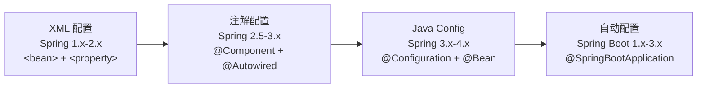

# 传统 Spring 内容的现代阅读路径

Spring 框架自 2004 年发布以来，经历了从 XML 配置到注解配置、再到 Spring Boot 自动配置的演进。本模块保留了相当数量的传统内容（XML 配置、传统 Spring MVC 写法、旧式数据访问示例等），它们在今天不是现代项目的默认选择，但仍有重要的学习价值——关键在于用**现代视角**去阅读。

::: tip 版本基准
本文档以 **Spring Framework 6.x** 和 **Spring Boot 3.x** 为主要版本。Spring 6 的一个重大变化是包名从 `javax.*` 迁移到 `jakarta.*`（如 `jakarta.servlet`、`jakarta.persistence`），阅读旧资料时需注意这一差异。
:::

## 为什么要学传统内容

### 排障需要理解底层

Spring Boot 大大简化了配置，但出问题时必须理解底层机制：

- **事务失效**：同类内部调用绕过了 AOP 代理，`@Transactional` 不生效
- **循环依赖**：Bean 互相注入导致启动失败，需理解三级缓存
- **AOP 代理边界**：`final` 方法、非 `public` 方法无法被代理增强
- **Bean 初始化顺序**：`@PostConstruct` 与 `@Autowired` 的执行时序

这些问题的排查都依赖对传统 Spring 底层机制的理解，详见 [事务管理与失效场景](03-事务管理与失效场景.md) 和 [Bean 生命周期与循环依赖](04-Bean生命周期与循环依赖.md)。

### 维护存量项目

企业中大量存量项目仍在使用传统 Spring 配置。理解 XML 配置是维护老项目的基础能力：

```xml
<!-- 存量项目中常见的数据源与事务配置 -->
<bean id="dataSource" class="com.alibaba.druid.pool.DruidDataSource">
    <property name="url" value="${jdbc.url}"/>
    <property name="username" value="${jdbc.username}"/>
    <property name="password" value="${jdbc.password}"/>
</bean>

<bean id="transactionManager"
      class="org.springframework.jdbc.datasource.DataSourceTransactionManager">
    <property name="dataSource" ref="dataSource"/>
</bean>

<tx:advice id="txAdvice" transaction-manager="transactionManager">
    <tx:attributes>
        <tx:method name="get*" read-only="true"/>
        <tx:method name="*" propagation="REQUIRED"/>
    </tx:attributes>
</tx:advice>
```

::: warning 存量项目维护原则
维护存量项目时，**局部修改遵循原有风格**，不要在 XML 项目中混入注解配置；如果是大规模重构，再考虑整体迁移到 Spring Boot。
:::

### 面试考察原理深度

面试官常通过传统配置考察候选人对原理的理解：

- Spring IoC 容器的启动流程是什么？
- Bean 的生命周期包含哪些阶段？
- AOP 如何选择 JDK 代理还是 CGLIB 代理？
- 声明式事务的实现原理是什么？

## Spring 配置演进路线



每一次演进都是**配置形式的变化**，底层原理（IoC 容器管理对象、AOP 代理织入增强、事务边界控制）始终不变。

## 现代阅读三层法

### 第一层：只保留原理价值

阅读传统内容时，优先关注背后的**原理**，而非具体写法：

| 传统内容 | 核心原理 | 现代体现 |
|---------|---------|---------|
| XML `<bean>` 配置 | IoC 容器管理对象 | `@Component`、`@Bean` |
| `<aop:config>` | 动态代理模式 | `@Aspect`、`@Around` |
| `<tx:advice>` | 事务边界控制 | `@Transactional` |
| `DispatcherServlet` 配置 | 前端控制器模式 | Spring Boot 自动配置 |

**示例：IoC 原理不变，配置形式演进**

传统 XML 配置：

```xml
<bean id="userService" class="com.example.UserService">
    <property name="userDao" ref="userDao"/>
</bean>
<bean id="userDao" class="com.example.UserDaoImpl"/>
```

现代注解配置（Spring 6 / Boot 3）：

```java
@Service
public class UserService {
    private final UserDao userDao;

    // 构造器注入（推荐，替代字段注入 @Autowired）
    public UserService(UserDao userDao) {
        this.userDao = userDao;
    }
}

@Repository
public class UserDaoImpl implements UserDao { }
```

两种方式本质相同：容器启动 → 解析定义 → 反射创建 → 注入依赖 → 存入单例池。区别仅在于声明方式。

::: tip 为什么推荐构造器注入？
Spring 官方推荐构造器注入，原因：① 依赖不可变（`final` 字段）；② 依赖不为 `null`（构造时强制传入）；③ 不依赖容器也能单元测试；④ 避免循环依赖（编译期即可发现）。
:::

### 第二层：识别历史实现 vs 核心原理

**历史实现（了解即可）**：JSP 视图解析器、`SimpleUrlHandlerMapping`、手工 `web.xml` 配置等，是特定时期的实现方式，现代项目已不再使用。

**核心原理（必须掌握）**：IoC 容器的对象管理机制、AOP 的代理实现原理、事务的传播行为和隔离级别、MVC 的请求处理流程。

### 第三层：映射到 Spring Boot 自动配置

读传统内容时，始终带着三个问题：

1. **这个能力在 Spring Boot 里现在怎么体现？**
2. **自动配置替你省掉了哪些工作？**
3. **线上排障时哪些原理仍然有效？**

**示例：数据源配置的演进**

传统 Spring（手工配置）：

```xml
<bean id="dataSource" class="com.zaxxer.hikari.HikariDataSource">
    <property name="jdbcUrl" value="${jdbc.url}"/>
    <property name="username" value="${jdbc.username}"/>
    <property name="password" value="${jdbc.password}"/>
    <property name="maximumPoolSize" value="20"/>
</bean>
```

Spring Boot 3（自动配置 + YAML）：

```yaml
spring:
  datasource:
    url: jdbc:mysql://localhost:3306/mydb
    username: root
    password: secret
    hikari:
      maximum-pool-size: 20
```

原理映射：`DataSourceAutoConfiguration` 替你声明了 DataSource Bean，`JdbcTemplateAutoConfiguration` 替你创建了 JdbcTemplate。配置属性通过 `@ConfigurationProperties` 绑定到 YAML。

## 传统与现代对照速查

### IoC 容器

| 功能 | 传统 XML | 现代注解 / Boot 自动配置 |
|-----|---------|------------------------|
| 定义 Bean | `<bean id="..." class="..."/>` | `@Component`、`@Service`、`@Repository` |
| 注入依赖 | `<property ref="..."/>` | 构造器注入（推荐）、`@Autowired` |
| 配置属性 | `<property value="..."/>` | `@Value`、`@ConfigurationProperties` |
| 条件装配 | 无原生支持 | `@ConditionalOnProperty` 等 |
| 加载配置 | `<context:property-placeholder>` | `application.yml` 自动加载 |

### AOP

| 功能 | 传统 XML | 现代注解 |
|-----|---------|---------|
| 启用 AOP | `<aop:aspectj-autoproxy/>` | `@EnableAspectJAutoProxy` |
| 定义切面 | `<aop:config>` + `<aop:aspect>` | `@Aspect` + `@Component` |
| 定义切点 | `<aop:pointcut expression="..."/>` | `@Pointcut("execution(...)")` |
| 环绕通知 | `<aop:around method="..." pointcut-ref="..."/>` | `@Around("...")` |

::: details Spring Boot 的 AOP 默认值变化
Spring Boot 2.0 起，`spring.aop.proxy-target-class` 默认值就改为 `true`，即**默认使用 CGLIB 代理**（不再优先尝试 JDK 动态代理），Spring 6 / Boot 3 延续该默认值。这意味着即使目标类实现了接口，也会生成子类代理。如果需要恢复 JDK 代理行为，需显式设置 `spring.aop.proxy-target-class=false`。
:::

### 事务管理

| 功能 | 传统 XML | 现代注解 |
|-----|---------|---------|
| 启用事务 | `<tx:annotation-driven/>` | `@EnableTransactionManagement`（Boot 自动启用） |
| 定义事务 | `<tx:advice>` + `<aop:advisor>` | `@Transactional` |
| 传播行为 | XML 属性配置 | `@Transactional(propagation = ...)` |
| 隔离级别 | XML 属性配置 | `@Transactional(isolation = ...)` |

### 数据访问

| 功能 | 传统方式 | 现代替代 |
|-----|---------|---------|
| 数据访问封装 | 手写 DAO + 泛型 `AbstractDao` | Spring Data JPA `Repository`、MyBatis-Plus `BaseMapper` |
| ORM 集成 | 手动配置 `SessionFactory` + `HibernateTransactionManager` | Spring Data JPA + Boot 自动配置 |
| JDBC 操作 | `JdbcTemplate` 手动配置 `DataSource` | Boot 自动配置 `JdbcTemplate` |
| 旧式工具 | DbUtils（Apache Commons） | MyBatis-Plus、Spring Data JPA |
| 异常转换 | 手写 DAO 无统一异常体系 | `@Repository` 自动转换 `SQLException` → `DataAccessException` |
| 注入方式 | Setter 注入（XML `<property>`） | 构造器注入（推荐） |

### Spring MVC

| 功能 | 传统 XML | Spring Boot 自动配置 |
|-----|---------|---------------------|
| DispatcherServlet | `web.xml` 配置 | `DispatcherServletAutoConfiguration` |
| 组件扫描 | `<context:component-scan>` | `@SpringBootApplication` 包含 `@ComponentScan` |
| 视图解析器 | `<bean class="InternalResourceViewResolver">` | `WebMvcAutoConfiguration` |
| 静态资源 | `<mvc:resources>` | `spring.web.resources.static-locations` |
| 消息转换器 | `<mvc:annotation-driven>` 配置 | `HttpMessageConvertersAutoConfiguration` |

## 实战：验证自动配置做了什么

理解传统配置后，可以用以下方式验证 Spring Boot 自动配置替你完成了哪些工作：

```java
@SpringBootApplication
public class Application {
    public static void main(String[] args) {
        ConfigurableApplicationContext context = SpringApplication.run(Application.class, args);

        // 查看自动配置了哪些 DataSource Bean
        String[] dataSourceBeans = context.getBeanNamesForType(DataSource.class);
        System.out.println("DataSource Beans: " + Arrays.toString(dataSourceBeans));

        // 开启自动配置报告（debug 模式）
        // 启动参数加 --debug 或在 application.yml 中设置 debug: true
        // 可查看哪些自动配置生效、哪些未生效及原因
    }
}
```

::: tip 查看自动配置报告的推荐方式
在 `application.yml` 中设置 `debug: true`，启动后控制台会打印 `CONDITIONS EVALUATION REPORT`，列出所有自动配置类的匹配结果和原因。这是理解"Boot 替你做了什么"最直接的方式。
:::

## 常见误区

| 误区 | 后果 | 正解 |
|-----|------|------|
| 完全跳过传统内容，只学注解 | 遇到问题无法深入排查 | 以原理为主线，传统内容作为理解原理的素材 |
| 在新项目中使用 XML 配置 | 配置繁琐，与 Boot 自动配置冲突 | 新项目优先注解和自动配置 |
| 背诵 XML 语法，不做现代映射 | 知识无法迁移，投入产出比低 | 理解原理，建立传统与现代的映射关系 |
| 以为注解和 XML 是两套不同机制 | 混淆概念 | 底层都是 BeanDefinition，只是声明方式不同 |

## 学习建议

| 你的背景 | 建议路径 | 重点 |
|---------|---------|------|
| 初学者 | 先学 Spring Boot → 遇到问题再深挖原理 | Spring Boot 总览 |
| 有经验者 | 系统学习 IoC/AOP/事务原理 → 阅读源码 | [IoC 容器](01-IoC容器.md)、[AOP](02-AOP.md) |
| 维护存量项目 | 对照阅读传统配置 → 理解 XML 含义 | 下文"历史资料索引" |
| 面试准备 | 原理优先 → 场景分析 → 对照总结 | [事务失效场景](03-事务管理与失效场景.md)、[循环依赖](04-Bean生命周期与循环依赖.md) |

## 历史资料索引

以下列出本模块中偏旧式写法的文件及其阅读价值，供维护存量项目或深入理解原理时按需查阅。

### 传统入门与 XML 配置

**原文件**：Spring 快速入门与配置文件（已合并至 [Spring 概览](00-Spring.md)）

| 阅读目的 | 对应主线文档 |
|---------|---------|
| 理解原理 | [1-Spring 概览](00-Spring.md) 中的传统 XML 配置方式 |
| 维护老项目 | [1-Spring 概览](00-Spring.md) 中的 XML 配置语法折叠块 |
| 面试准备 | [2-IoC 容器](01-IoC容器.md) 中 BeanFactory vs ApplicationContext |

### 旧式 AOP 扩展材料

**原文件**：AOP 开发（已合并至 [AOP](02-AOP.md)）

| 阅读目的 | 对应主线文档 |
|---------|---------|
| 理解原理 | [3-AOP](02-AOP.md) 中的代理原理深入章节 |
| 维护老项目 | [3-AOP](02-AOP.md) 中的 XML 配置 AOP 章节 |
| 面试准备 | [3-AOP](02-AOP.md) 中的避坑指南和面试高频问题 |

### 传统数据访问补充

**原文件**：DbUtils 与 Spring 注解开发（已合并至 [IoC 容器](01-IoC容器.md)）

| 阅读目的 | 对应主线文档 |
|---------|---------|
| 理解原理 | [2-IoC 容器](01-IoC容器.md) 中的配置方式演进章节 |
| 学习注解演进 | [2-IoC 容器](01-IoC容器.md) 中的配置方式章节 |
| 面试准备 | [2-IoC 容器](01-IoC容器.md) 中的面试高频问题 |

### 数据访问（传统方式）

以下内容已合并至 [事务管理与失效场景](03-事务管理与失效场景.md)：

| 原文件 | 合并至主线文档的章节 |
|------|---------|
| 使用 JDBC | [4-事务管理](03-事务管理与失效场景.md) 中的"数据访问基础"章节 |
| 使用 DAO | [4-事务管理](03-事务管理与失效场景.md) 中的"DAO 模式与 @Repository"章节 |
| 使用声明式事务 | [4-事务管理](03-事务管理与失效场景.md) 中的传统配置折叠块 |
| 集成 Hibernate | [4-事务管理](03-事务管理与失效场景.md) 中的"ORM 集成概览"章节 |

## 面试高频问题

1. **为什么传统 Spring 内容今天仍然值得看？**
   排障需要理解底层原理（事务失效、循环依赖等）、维护存量项目需要、面试考察原理深度。

2. **XML 配置和注解配置底层有什么共同点？**
   底层都是生成 `BeanDefinition` 注册到容器，只是声明方式不同。XML 通过 `XmlBeanDefinitionReader` 解析，注解通过 `ClassPathBeanDefinitionScanner` 扫描。

3. **Spring Boot 自动配置替你省掉了哪些工作？**
   声明 DataSource Bean、配置连接池参数、创建 JdbcTemplate、注册 DispatcherServlet、配置视图解析器等。核心是 `@Conditional` 系列注解根据条件决定是否装配。

4. **Spring 6 相比 Spring 5 有哪些影响阅读旧资料的变化？**
   包名从 `javax.*` 迁移到 `jakarta.*`；最低要求 Java 17。另注意：默认 CGLIB 代理（`proxy-target-class=true`）是 Spring Boot 2.0 起的自动配置行为，并非 Spring 6 才引入。

5. **构造器注入为什么比字段注入（`@Autowired` on field）更推荐？**
   依赖不可变（`final`）、不为 `null`、不依赖容器也能测试、编译期可发现循环依赖。

---

::: details 关联阅读
- [Spring 概览](00-Spring.md) — 模块组成与整体设计
- [IoC 容器](01-IoC容器.md) — IoC 原理与依赖注入详解
- [AOP](02-AOP.md) — 代理原理与通知类型
- [事务管理与失效场景](03-事务管理与失效场景.md) — 事务失效排查
- [Bean 生命周期与循环依赖](04-Bean生命周期与循环依赖.md) — 三级缓存机制
- [SpEL 表达式语言](10-SpEL表达式语言.md) — 表达式语法与校验上下文
- [Spring 验证与数据校验](11-Spring验证与数据校验.md) — Bean Validation 与分组校验
- [Spring Boot 介绍](/JAVA/SpringBoot/00-SpringBoot介绍) — 自动配置与现代实践
:::

## 版本差异(旧版 → Spring 6.x)

| 特性 | 旧版(Spring 5.x) | Spring 6.x |
|------|-----------------|------------|
| 阅读路径 | 传统 XML/注解 | 不变；优先注解 + 自动配置 |
| 命名空间 | javax.* | jakarta.* |
| 推荐实践 | XML 配置 | 注解/JavaConfig 为主 |
| 新增能力 | 无 | AOT、虚拟线程、HTTP Interface 客户端 |
