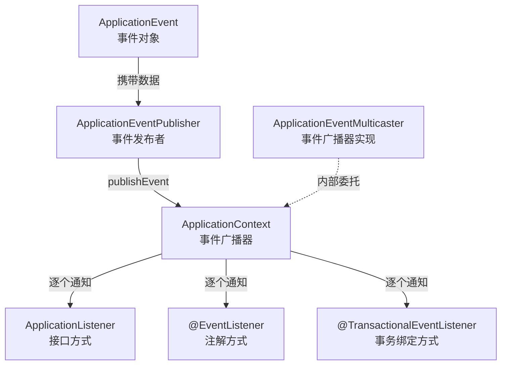
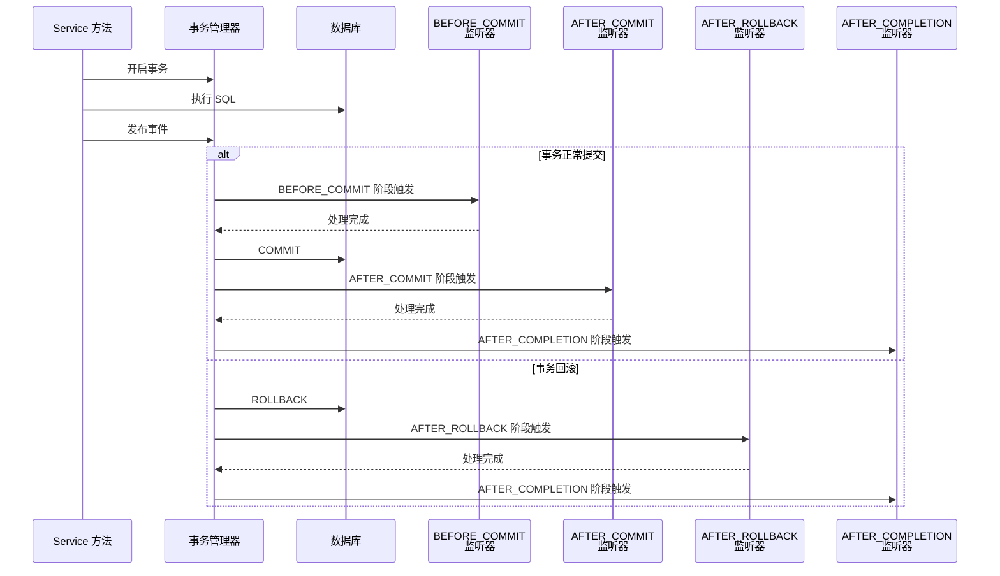
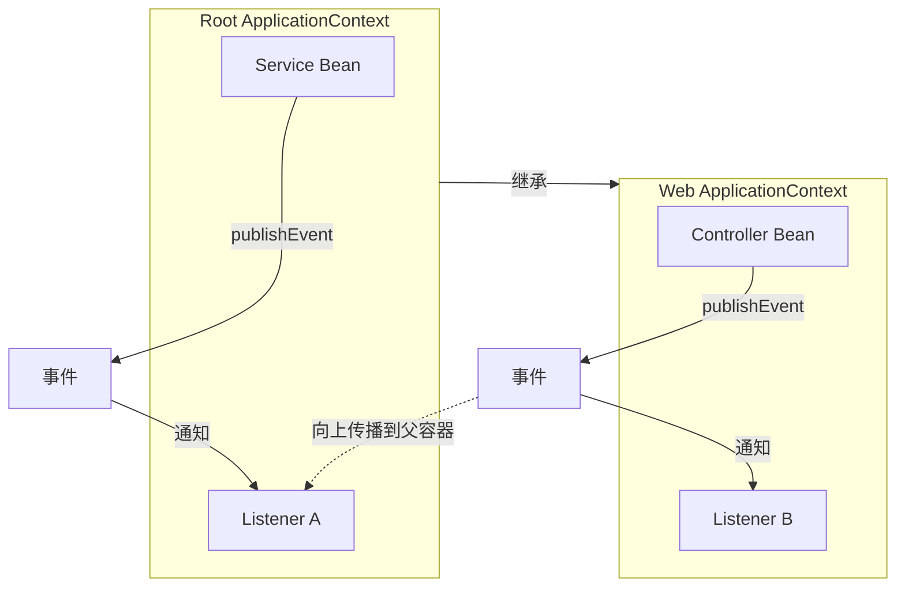

# Spring 事件机制

Spring 事件机制是框架内置的发布-订阅（Publish-Subscribe）通信模型，基于观察者设计模式实现。它让 Bean 之间通过事件进行松耦合交互——发布者不需要知道谁在监听，监听者也不需要知道谁在发布。

这页要解决的核心问题：

- Spring 事件机制的三大组件是什么，如何协作
- 自定义事件的完整开发流程
- @TransactionalEventListener 如何绑定事务阶段
- 异步事件、条件过滤、顺序控制等高级用法
- 父子容器下事件的传播行为

## 概念与背景

### 为什么需要事件机制

在业务系统中，一个动作往往需要触发多个后续处理。以用户注册为例：

```java
// 紧耦合写法：注册逻辑与后续处理绑死
@Service
public class UserService {
    public void register(User user) {
        userDao.save(user);           // 1. 保存用户
        emailService.sendWelcome(user); // 2. 发送欢迎邮件
        logService.record(user);       // 3. 记录日志
        pointService.initPoints(user); // 4. 初始化积分
    }
}
```

这种写法的问题：

- **耦合度高**：注册逻辑与邮件、日志、积分等后续处理绑死，增删处理需要改注册方法
- **职责不清**：UserService 承担了不属于它的通知职责
- **容错性差**：邮件发送失败可能导致整个注册流程回滚

事件机制的核心思想：**把"发生了什么事"和"这件事该怎么处理"解耦**。

```java
// 松耦合写法：注册只负责发布事件
@Service
public class UserService {
    @Autowired
    private ApplicationEventPublisher publisher;

    public void register(User user) {
        userDao.save(user);
        publisher.publishEvent(new UserRegisteredEvent(user)); // 发布事件
    }
}
```

### 与观察者模式的关系

Spring 事件机制是观察者模式（Observer Pattern）的经典实现：

| 观察者模式角色 | Spring 事件对应 | 说明 |
|--------------|----------------|------|
| Subject（被观察者） | ApplicationEventPublisher | 发布事件通知 |
| Observer（观察者） | ApplicationListener / @EventListener | 接收并处理事件 |
| 通知内容 | ApplicationEvent | 携带事件数据 |

Spring 在标准观察者模式上做了增强：

- **类型安全**：通过泛型指定监听的事件类型
- **注解驱动**：`@EventListener` 替代实现接口，更简洁
- **事务绑定**：`@TransactionalEventListener` 可绑定事务阶段
- **异步支持**：配合 `@Async` 实现异步监听
- **条件过滤**：通过 `condition` 属性筛选事件

## 核心组件



### ApplicationEvent（事件对象）

`ApplicationEvent` 是 Spring 事件的基类，所有自定义事件都继承自它。

```java
// Spring 6 中 ApplicationEvent 的核心结构
public abstract class ApplicationEvent extends EventObject {
    private final long timestamp; // 事件发生时间戳

    public ApplicationEvent(Object source) {
        super(source);
        this.timestamp = System.currentTimeMillis();
    }

    public long getTimestamp() {
        return this.timestamp;
    }
}
```

::: tip Spring 4.2+ 的简化
从 Spring 4.2 开始，事件对象不再必须继承 `ApplicationEvent`，任意 POJO 都可以作为事件发布。Spring 会自动将其包装为 `PayloadApplicationEvent`。这在实际开发中更常用。
:::

### ApplicationEventPublisher（事件发布者）

`ApplicationEventPublisher` 是事件发布的接口，`ApplicationContext` 继承了它，因此任何能注入容器的 Bean 都可以发布事件。

```java
@FunctionalInterface
public interface ApplicationEventPublisher {
    default void publishEvent(ApplicationEvent event) {
        publishEvent((Object) event);
    }
    void publishEvent(Object event); // Spring 4.2+ 支持任意对象
}
```

**使用方式**：直接注入 `ApplicationEventPublisher`，或注入 `ApplicationContext`（它继承了 Publisher）。

```java
@Service
public class OrderService {
    // 推荐方式：直接注入 Publisher，职责更清晰
    private final ApplicationEventPublisher publisher;

    public OrderService(ApplicationEventPublisher publisher) {
        this.publisher = publisher;
    }

    public void createOrder(Order order) {
        orderDao.save(order);
        // 发布事件
        publisher.publishEvent(new OrderCreatedEvent(order));
    }
}
```

::: warning 注入 ApplicationContext 还是 ApplicationEventPublisher？
两者都能发布事件，但推荐注入 `ApplicationEventPublisher`：
- **职责单一**：`ApplicationContext` 功能太多，注入它容易滥用
- **可测试性**：`ApplicationEventPublisher` 更容易 Mock
- **语义清晰**：注入 Publisher 明确表达"我要发布事件"
:::

### ApplicationListener / @EventListener（事件监听者）

Spring 提供两种监听方式：

**方式一：实现 ApplicationListener 接口**

```java
@Component
public class EmailListener implements ApplicationListener<UserRegisteredEvent> {
    @Override
    public void onApplicationEvent(UserRegisteredEvent event) {
        User user = event.getUser();
        // 发送欢迎邮件
        emailService.sendWelcome(user.getEmail());
    }
}
```

**方式二：使用 @EventListener 注解（推荐）**

```java
@Component
public class EmailListener {
    @EventListener
    public void onUserRegistered(UserRegisteredEvent event) {
        User user = event.getUser();
        emailService.sendWelcome(user.getEmail());
    }
}
```

| 对比项 | ApplicationListener 接口 | @EventListener 注解 |
|--------|--------------------------|---------------------|
| 事件类型指定 | 泛型参数 | 方法参数类型 |
| 一个类监听多个事件 | 需要多个实现类 | 一个类多个 @EventListener 方法 |
| 条件过滤 | 需手动判断 | condition 属性 |
| SpEL 表达式 | 不支持 | 支持 |
| 推荐程度 | 历史方式 | **推荐** |

## 使用方式

### 自定义事件

**方式一：继承 ApplicationEvent（传统方式）**

```java
// 自定义事件：用户注册事件
public class UserRegisteredEvent extends ApplicationEvent {
    private final User user;

    public UserRegisteredEvent(Object source, User user) {
        super(source); // source 是事件源，通常是发布事件的 Bean
        this.user = user;
    }

    public User getUser() {
        return user;
    }
}
```

**方式二：使用 POJO（推荐，Spring 4.2+）**

```java
// POJO 事件：无需继承 ApplicationEvent
public class UserRegisteredEvent {
    private final User user;
    private final LocalDateTime registeredAt;

    public UserRegisteredEvent(User user) {
        this.user = user;
        this.registeredAt = LocalDateTime.now();
    }

    public User getUser() { return user; }
    public LocalDateTime getRegisteredAt() { return registeredAt; }
}
```

::: tip 两种方式如何选择？
- **新项目推荐 POJO 方式**：更简洁，事件类不依赖 Spring 框架，便于测试和复用
- **需要事件时间戳时用 ApplicationEvent**：基类自带 `timestamp` 字段
- **POJO 方式底层**：Spring 自动将 POJO 包装为 `PayloadApplicationEvent`，功能等价
:::

### 发布事件

```java
@Service
public class UserService {
    private final ApplicationEventPublisher publisher;
    private final UserDao userDao;

    public UserService(ApplicationEventPublisher publisher, UserDao userDao) {
        this.publisher = publisher;
        this.userDao = userDao;
    }

    public void register(String username, String email) {
        User user = new User(username, email);
        userDao.save(user);

        // 发布用户注册事件
        publisher.publishEvent(new UserRegisteredEvent(user));

        // 也可以发布任意对象作为事件（Spring 4.2+）
        // publisher.publishEvent(user); // 直接用实体类，但不推荐，语义不清
    }
}
```

### 监听事件

**基本监听**

```java
@Component
public class UserEventListeners {

    // 监听用户注册事件
    @EventListener
    public void onUserRegistered(UserRegisteredEvent event) {
        System.out.println("用户注册：" + event.getUser().getUsername());
    }
}
```

**监听方法返回值作为新事件**

如果 `@EventListener` 方法返回非空对象，Spring 会自动将其作为新事件发布：

```java
@Component
public class UserEventListeners {
    @EventListener
    public WelcomeEmailEvent onUserRegistered(UserRegisteredEvent event) {
        // 处理注册逻辑...
        // 返回值会自动作为新事件发布
        return new WelcomeEmailEvent(event.getUser().getEmail());
    }

    @EventListener
    public void onWelcomeEmail(WelcomeEmailEvent event) {
        emailService.send(event.getEmail(), "欢迎注册");
    }
}
```

::: warning 返回值自动发布事件的陷阱
- 返回值自动发布是隐式行为，容易让代码阅读者困惑
- 如果方法返回值不想被发布，将返回类型声明为 `void`
- 推荐显式调用 `publisher.publishEvent()` 而非依赖返回值自动发布
:::

## 高级特性

### @TransactionalEventListener（事务绑定事件）

这是 Spring 事件机制中最实用的高级特性。它让事件监听与事务生命周期绑定，解决"事务未提交就发通知"的问题。

**问题场景**：

```java
@Service
public class UserService {
    @Autowired
    private ApplicationEventPublisher publisher;

    @Transactional
    public void register(User user) {
        userDao.save(user);
        // 问题：事件在事务提交前发布
        // 如果监听者去查数据库，可能还查不到这条用户记录
        // 如果事务回滚，监听者已经执行了不该执行的操作
        publisher.publishEvent(new UserRegisteredEvent(user));
    }
}
```

**解决方案**：`@TransactionalEventListener` 指定在事务的哪个阶段触发监听。

```java
@Component
public class EmailListener {
    // 事务提交后才执行，确保数据已持久化
    @TransactionalEventListener(phase = TransactionPhase.AFTER_COMMIT)
    public void onUserRegistered(UserRegisteredEvent event) {
        emailService.sendWelcome(event.getUser().getEmail());
    }
}
```

**四个事务阶段**：

| 阶段 | TransactionPhase | 触发时机 | 典型用途 |
|------|-----------------|---------|---------|
| BEFORE_COMMIT | 事务提交前 | 刷新 Session 后、提交前 | 事务内最终校验 |
| AFTER_COMMIT | 事务提交后 | 事务成功提交后 | 发送通知、更新缓存 |
| AFTER_ROLLBACK | 事务回滚后 | 事务回滚后 | 清理临时数据、告警 |
| AFTER_COMPLETION | 事务完成后 | 提交或回滚后都触发 | 通用清理、日志记录 |



::: danger @TransactionalEventListener 的关键注意事项
1. **必须运行在事务上下文中**：如果发布事件的方法没有 `@Transactional`，`@TransactionalEventListener` 不会触发（因为没有事务可绑定）
2. **默认阶段是 AFTER_COMMIT**：如果未指定 `phase`，等同于 `phase = TransactionPhase.AFTER_COMMIT`
3. **fallbackExecution 属性**：设置 `fallbackExecution = true` 可在没有事务时也执行监听器
4. **AFTER_COMMIT 监听器中的异常不会回滚原事务**：原事务已经提交，监听器中的异常是独立的
:::

```java
// fallbackExecution 示例：没有事务时也执行
@TransactionalEventListener(phase = TransactionPhase.AFTER_COMMIT, fallbackExecution = true)
public void onUserRegistered(UserRegisteredEvent event) {
    emailService.sendWelcome(event.getUser().getEmail());
}
```

### 异步事件监听

默认情况下，事件监听是**同步**执行的——发布者线程会依次执行所有监听器，全部完成后才继续。如果某个监听器耗时较长，会阻塞发布者。

**解决方案**：`@EventListener` + `@Async`

```java
@Component
public class AsyncListeners {

    @Async // 异步执行，不阻塞发布者
    @EventListener
    public void onUserRegistered(UserRegisteredEvent event) {
        // 耗时操作：发送邮件、初始化积分等
        emailService.sendWelcome(event.getUser().getEmail());
        pointService.initPoints(event.getUser());
    }
}
```

**启用异步支持**：需要在配置类上添加 `@EnableAsync`。

```java
@Configuration
@EnableAsync // 启用 @Async 支持
public class AsyncConfig {
    // 可选：自定义异步线程池
    @Bean
    public Executor eventExecutor() {
        ThreadPoolTaskExecutor executor = new ThreadPoolTaskExecutor();
        executor.setCorePoolSize(4);
        executor.setMaxPoolSize(8);
        executor.setQueueCapacity(100);
        executor.setThreadNamePrefix("event-async-");
        executor.initialize();
        return executor;
    }
}
```

指定异步监听器使用的线程池：

```java
@Async("eventExecutor") // 指定线程池 Bean 名称
@EventListener
public void onUserRegistered(UserRegisteredEvent event) {
    // 使用 eventExecutor 线程池执行
}
```

::: warning 异步事件的注意事项
1. **异常不会传播到发布者**：异步监听器中的异常发布者感知不到，需要自行处理（如 `@Async` 配合 `AsyncUncaughtExceptionHandler`）
2. **事务上下文不传播**：异步线程不在原事务中，`@TransactionalEventListener` + `@Async` 的组合需要特别注意
3. **顺序不可控**：异步监听器之间没有执行顺序保证
4. **线程池配置**：默认使用 `SimpleAsyncTaskExecutor`（每次新建线程），生产环境必须配置线程池
:::

### 事件过滤（@EventListener condition）

`@EventListener` 的 `condition` 属性支持 SpEL 表达式，可以按条件过滤事件：

```java
@Component
public class OrderEventListeners {

    // 只处理金额大于 1000 的订单事件
    @EventListener(condition = "#event.order.amount > 1000")
    public void onHighValueOrder(OrderCreatedEvent event) {
        // 大额订单特殊处理：风控审核
        riskService.review(event.getOrder());
    }

    // 只处理特定类型的用户注册
    @EventListener(condition = "#event.user.type == 'VIP'")
    public void onVipUserRegistered(UserRegisteredEvent event) {
        // VIP 用户专属欢迎礼包
        giftService.sendVipWelcomePack(event.getUser());
    }
}
```

**SpEL 常用表达式**：

| 表达式 | 说明 |
|--------|------|
| `#event` | 引用监听方法的**事件参数**（上方示例中参数名恰为 `event`；POJO 事件此时是解包后的 payload） |
| `#event.property` | 访问事件属性（依赖方法参数名，需编译时保留参数名信息） |
| `#root.event` | root 对象上的原始 `ApplicationEvent`（POJO 事件为 `PayloadApplicationEvent` 包装，**不等同于**方法参数） |
| `#root.args[0]` | 访问调用参数数组的第一个元素 |

> 官方文档的惯用写法是用方法参数名引用事件（如 `condition = "#blEvent.content == 'my-event'"`）；`#root` 是一个包含 `event` 与 `args` 的根对象，单独写 `#root.xxx` 不会指向事件属性。

### @Order 控制监听器顺序

默认情况下，同一事件的多个监听器执行顺序不确定。使用 `@Order` 注解可以控制执行优先级：

```java
@Component
public class UserRegisteredListeners {

    // 优先级最高，先执行
    @Order(1)
    @EventListener
    public void validateUser(UserRegisteredEvent event) {
        // 数据校验
    }

    // 其次执行
    @Order(2)
    @EventListener
    public void initPoints(UserRegisteredEvent event) {
        // 初始化积分
    }

    // 最后执行
    @Order(3)
    @EventListener
    public void sendEmail(UserRegisteredEvent event) {
        // 发送邮件
    }
}
```

::: tip @Order 的值
- 值越小，优先级越高
- 默认值是 `Ordered.LOWEST_PRECEDENCE`（即最低优先级）
- `@Order` 只控制同步监听器的顺序，异步监听器之间顺序不可控
:::

## 实战案例

### 用户注册事件

完整的用户注册事件驱动案例：

```java
// 1. 定义事件
public class UserRegisteredEvent {
    private final User user;
    private final LocalDateTime registeredAt;

    public UserRegisteredEvent(User user) {
        this.user = user;
        this.registeredAt = LocalDateTime.now();
    }

    public User getUser() { return user; }
    public LocalDateTime getRegisteredAt() { return registeredAt; }
}

// 2. 发布事件
@Service
public class UserService {
    private final ApplicationEventPublisher publisher;
    private final UserDao userDao;

    public UserService(ApplicationEventPublisher publisher, UserDao userDao) {
        this.publisher = publisher;
        this.userDao = userDao;
    }

    @Transactional
    public User register(String username, String email, String password) {
        // 校验用户名是否重复
        if (userDao.existsByUsername(username)) {
            throw new BusinessException("用户名已存在");
        }

        User user = new User(username, email, password);
        userDao.save(user);

        // 发布注册事件
        publisher.publishEvent(new UserRegisteredEvent(user));
        return user;
    }
}

// 3. 监听事件 —— 多个监听器各司其职
@Component
public class UserRegisteredListeners {

    // 事务提交后发送欢迎邮件
    @TransactionalEventListener(phase = TransactionPhase.AFTER_COMMIT)
    public void sendWelcomeEmail(UserRegisteredEvent event) {
        emailService.sendWelcome(event.getUser().getEmail());
    }

    // 事务提交后初始化积分账户
    @TransactionalEventListener(phase = TransactionPhase.AFTER_COMMIT)
    public void initPoints(UserRegisteredEvent event) {
        pointService.initPoints(event.getUser().getId(), 100); // 赠送 100 初始积分
    }

    // 事务提交后异步记录审计日志
    @Async("eventExecutor")
    @TransactionalEventListener(phase = TransactionPhase.AFTER_COMMIT)
    public void auditLog(UserRegisteredEvent event) {
        auditService.log("用户注册", event.getUser().getUsername(), event.getRegisteredAt());
    }
}
```

**为什么用 @TransactionalEventListener 而不是 @EventListener？**

- 注册方法有 `@Transactional`，事务提交前用户数据可能还未真正写入数据库
- 邮件服务、积分服务如果去查用户，需要确保数据已持久化
- 如果注册事务回滚（如后续校验失败），不应该发送欢迎邮件

### 订单状态变更事件

```java
// 1. 定义订单状态变更事件
public class OrderStatusChangedEvent {
    private final Long orderId;
    private final OrderStatus oldStatus;
    private final OrderStatus newStatus;
    private final LocalDateTime changedAt;

    public OrderStatusChangedEvent(Long orderId, OrderStatus oldStatus, OrderStatus newStatus) {
        this.orderId = orderId;
        this.oldStatus = oldStatus;
        this.newStatus = newStatus;
        this.changedAt = LocalDateTime.now();
    }

    // getter 省略
}

// 2. 发布事件
@Service
public class OrderService {
    private final ApplicationEventPublisher publisher;
    private final OrderDao orderDao;

    public OrderService(ApplicationEventPublisher publisher, OrderDao orderDao) {
        this.publisher = publisher;
        this.orderDao = orderDao;
    }

    @Transactional
    public void payOrder(Long orderId) {
        Order order = orderDao.findById(orderId)
            .orElseThrow(() -> new BusinessException("订单不存在"));

        OrderStatus oldStatus = order.getStatus();
        order.setStatus(OrderStatus.PAID);
        orderDao.save(order);

        // 发布状态变更事件
        publisher.publishEvent(
            new OrderStatusChangedEvent(orderId, oldStatus, OrderStatus.PAID)
        );
    }

    @Transactional
    public void shipOrder(Long orderId) {
        Order order = orderDao.findById(orderId)
            .orElseThrow(() -> new BusinessException("订单不存在"));

        OrderStatus oldStatus = order.getStatus();
        order.setStatus(OrderStatus.SHIPPED);
        orderDao.save(order);

        publisher.publishEvent(
            new OrderStatusChangedEvent(orderId, oldStatus, OrderStatus.SHIPPED)
        );
    }
}

// 3. 监听事件
@Component
public class OrderStatusListeners {

    // 订单支付成功 → 通知仓库发货
    @EventListener(condition = "#event.newStatus == T(com.example.OrderStatus).PAID")
    @TransactionalEventListener(phase = TransactionPhase.AFTER_COMMIT)
    public void onOrderPaid(OrderStatusChangedEvent event) {
        warehouseService.notifyShipment(event.getOrderId());
    }

    // 订单发货 → 通知买家
    @EventListener(condition = "#event.newStatus == T(com.example.OrderStatus).SHIPPED")
    @TransactionalEventListener(phase = TransactionPhase.AFTER_COMMIT)
    public void onOrderShipped(OrderStatusChangedEvent event) {
        notificationService.notifyBuyer(event.getOrderId(), "您的订单已发货");
    }

    // 所有状态变更 → 记录日志
    @TransactionalEventListener(phase = TransactionPhase.AFTER_COMMIT)
    public void logStatusChange(OrderStatusChangedEvent event) {
        orderLogService.log(
            event.getOrderId(),
            event.getOldStatus(),
            event.getNewStatus()
        );
    }
}
```

::: warning @EventListener 和 @TransactionalEventListener 不能同时使用
上面的代码中 `@EventListener(condition = ...)` 和 `@TransactionalEventListener` 同时标注是**错误写法**。正确做法是将条件过滤放在 `@TransactionalEventListener` 中：

```java
// 正确写法：只用 @TransactionalEventListener + condition
@TransactionalEventListener(
    phase = TransactionPhase.AFTER_COMMIT,
    condition = "#event.newStatus == T(com.example.OrderStatus).PAID"
)
public void onOrderPaid(OrderStatusChangedEvent event) {
    warehouseService.notifyShipment(event.getOrderId());
}
```
:::

## 事件传播机制

### 父子容器中的事件传播

Spring 中存在父子容器（Parent-Child Context）的概念，典型场景是 Spring MVC 中 `ApplicationContext`（父）和 `WebApplicationContext`（子）。



**传播规则**：

| 发布位置 | 子容器监听器 | 父容器监听器 |
|---------|------------|------------|
| 子容器发布事件 | 能收到 | **能收到**（事件向上传播） |
| 父容器发布事件 | **收不到** | 能收到 |

::: danger 父子容器事件传播的坑
1. **子容器发布的事件会传播到父容器**：父容器中的监听器会收到子容器的事件，可能导致重复处理
2. **父容器发布的事件不会传播到子容器**：子容器中的监听器收不到父容器的事件
3. **Spring Boot 默认没有父子容器**：Spring Boot 使用单一 `ApplicationContext`，不存在此问题
4. **传统 Spring MVC 有父子容器**：`ContextLoaderListener` 创建父容器，`DispatcherServlet` 创建子容器
:::

### Spring Boot 中的事件

Spring Boot 在启动过程中发布了一系列内置事件，了解它们有助于理解 Boot 启动流程：

| 事件 | 触发时机 | 用途 |
|------|---------|------|
| ApplicationStartingEvent | 应用启动，任何处理之前 | 初始化早期配置 |
| ApplicationEnvironmentPreparedEvent | Environment 准备好 | 修改环境配置 |
| ApplicationContextInitializedEvent | 容器初始化完成，Bean 定义加载前 | 注册 Bean 定义 |
| ApplicationPreparedEvent | Bean 定义加载完成，刷新前 | 修改 Bean 定义 |
| ApplicationStartedEvent | 容器刷新完成，CommandLineRunner 前 | 启动后初始化 |
| ApplicationReadyEvent | 应用完全就绪 | 健康检查、通知 |
| ApplicationFailedEvent | 启动失败 | 失败告警、清理 |

```java
@Component
public class StartupListener {
    @EventListener
    public void onReady(ApplicationReadyEvent event) {
        // 应用完全启动后执行
        System.out.println("应用已就绪，端口："
            + event.getApplicationContext().getEnvironment()
                .getProperty("local.server.port"));
    }
}
```

## 内置事件

Spring Framework 自身也发布了一些内置事件：

| 事件 | 触发时机 |
|------|---------|
| ContextRefreshedEvent | ApplicationContext 刷新完成（所有 Bean 就绪） |
| ContextStartedEvent | ApplicationContext 启动（`start()` 方法调用） |
| ContextStoppedEvent | ApplicationContext 停止（`stop()` 方法调用） |
| ContextClosedEvent | ApplicationContext 关闭 |

```java
@Component
public class ContextLifecycleListener {
    @EventListener
    public void onRefreshed(ContextRefreshedEvent event) {
        // 容器刷新完成，所有 Bean 已初始化
        System.out.println("容器刷新完成");
    }

    @EventListener
    public void onClosed(ContextClosedEvent event) {
        // 容器关闭，执行清理
        System.out.println("容器关闭");
    }
}
```

::: warning ContextRefreshedEvent 可能触发多次
在父子容器场景下，`ContextRefreshedEvent` 会触发两次（父容器刷新一次、子容器刷新一次）。如果只想执行一次，需要加判断：

```java
@EventListener
public void onRefreshed(ContextRefreshedEvent event) {
    // 只在根容器刷新时执行
    if (event.getApplicationContext().getParent() == null) {
        // 初始化逻辑
    }
}
```
Spring Boot 单容器场景不存在此问题。
:::

## 面试高频问题

### 1. Spring 事件机制的原理是什么？

Spring 事件机制基于观察者模式，由三个核心组件协作：
- **ApplicationEvent**：事件对象，携带数据
- **ApplicationEventPublisher**：事件发布者，通过 `publishEvent()` 发布事件
- **ApplicationListener / @EventListener**：事件监听者，处理事件

底层实现：`ApplicationContext` 内部维护一个 `ApplicationEventMulticaster`（默认实现 `SimpleApplicationEventMulticaster`），发布事件时由它遍历所有匹配的监听器并调用。

### 2. @EventListener 和 @TransactionalEventListener 的区别？

| 对比项 | @EventListener | @TransactionalEventListener |
|--------|---------------|---------------------------|
| 触发时机 | 事件发布时立即触发 | 绑定事务阶段触发 |
| 事务感知 | 不感知事务 | 可指定 BEFORE_COMMIT、AFTER_COMMIT 等 |
| 无事务时 | 正常触发 | 默认不触发（可设 `fallbackExecution = true`） |
| 适用场景 | 通用事件处理 | 需要事务保证的事件（如发邮件前确保数据已持久化） |

### 3. Spring 事件监听是同步还是异步？

**默认同步**：发布者线程依次执行所有监听器，全部完成后才继续。配合 `@Async` 注解可以实现异步监听，但需要注意：
- 异步监听器中的异常不会传播到发布者
- 异步监听器不在原事务上下文中
- 异步监听器之间没有执行顺序保证

### 4. 父子容器中事件如何传播？

- 子容器发布的事件会**向上传播**到父容器，父容器中的监听器能收到
- 父容器发布的事件**不会向下传播**到子容器
- Spring Boot 使用单一容器，不存在此问题

### 5. 如何保证事件在事务提交后才处理？

使用 `@TransactionalEventListener(phase = TransactionPhase.AFTER_COMMIT)`。它通过 Spring 事务管理器注册事务同步回调（`TransactionSynchronization`），在事务提交后触发监听器。关键前提是发布事件的方法必须运行在事务中。

## Spring 6 / Boot 3 注意事项

### 1. Jakarta 命名空间迁移

Spring 6 基于 Jakarta EE 9+，包名从 `javax.*` 迁移到 `jakarta.*`。事件机制本身不受影响（`ApplicationEvent` 等在 `org.springframework.context` 包下），但如果事件监听器中使用了 `@Transactional` 等注解，需要确保导入的是 `jakarta.transaction` 而非 `javax.transaction`。

### 2. 虚拟线程支持

Java 21 的虚拟线程（Virtual Threads）与 `@Async` 事件监听器配合使用时，可以配置虚拟线程执行器：

```java
@Configuration
@EnableAsync
public class AsyncConfig {
    @Bean
    public Executor eventExecutor() {
        // Java 21+ 虚拟线程执行器
        return Executors.newVirtualThreadPerTaskExecutor();
    }
}
```

### 3. GraalVM Native Image 兼容性

在 Native Image 场景下，Spring AOT 处理会自动识别 `@EventListener` 和 `@TransactionalEventListener` 注解的方法，但以下情况需要额外处理：

- 运行时动态注册的监听器不会被 AOT 识别
- `condition` 中的 SpEL 表达式需要在编译期可解析
- 使用 `ApplicationListener` 接口实现时，确保泛型参数在编译期确定

### 4. 可观测性增强

Spring 6 集成了 Micrometer 观测 API，事件发布和监听可以关联 Tracing：

```yaml
# application.yml - 开启事件观测
management:
  tracing:
    sampling:
      probability: 1.0
```

事件发布时自动传播 Trace 上下文，异步监听器也能关联到原始请求链路。

### 5. 接口默认方法上的 @EventListener

Spring 6 增强了对接口默认方法（`default method`）上 `@EventListener` 的支持，但建议仍然在具体实现类上使用注解，避免 AOT 和代理相关的兼容问题。

---

::: details 本文档核心要点速查

| 主题 | 要点 |
|------|------|
| 核心组件 | ApplicationEvent + ApplicationEventPublisher + ApplicationListener |
| 事件定义 | POJO 即可（Spring 4.2+），无需继承 ApplicationEvent |
| 事件发布 | 注入 ApplicationEventPublisher，调用 publishEvent() |
| 事件监听 | @EventListener 注解（推荐）> ApplicationListener 接口 |
| 事务绑定 | @TransactionalEventListener(phase = AFTER_COMMIT) |
| 异步监听 | @EventListener + @Async + @EnableAsync |
| 条件过滤 | @EventListener(condition = "#event.xxx > 100") |
| 执行顺序 | @Order 注解，值越小优先级越高 |
| 父子容器 | 子→父传播，父→子不传播；Boot 单容器无此问题 |
:::

::: details 关联阅读
- [IoC 容器](01-IoC容器.md) — 理解 ApplicationContext 作为事件发布者的底层机制
- [AOP](02-AOP.md) — @Async 和 @TransactionalEventListener 依赖 AOP 代理
- [事务管理与失效场景](03-事务管理与失效场景.md) — @TransactionalEventListener 绑定事务的前提
- [Bean 生命周期与循环依赖](04-Bean生命周期与循环依赖.md) — ApplicationEventMulticaster 的初始化时机
:::

## 版本差异(旧版 → Spring 6.x)

| 特性 | 旧版(Spring 5.x) | Spring 6.x |
|------|-----------------|------------|
| 事件机制 | ApplicationEvent/Listener | 不变；核心机制稳定 |
| 异步事件 | @Async 监听器 | 不变；可配合虚拟线程执行器 |
| 事务事件 | @TransactionalEventListener | 不变 |
| 虚拟线程 | 无 | 事件发布在虚拟线程中正常 |
