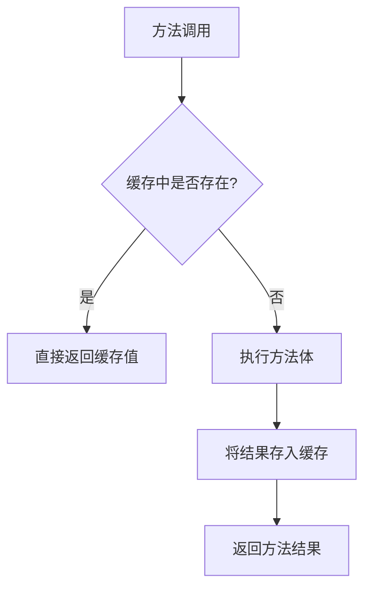
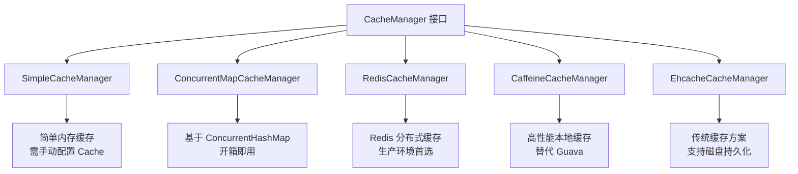
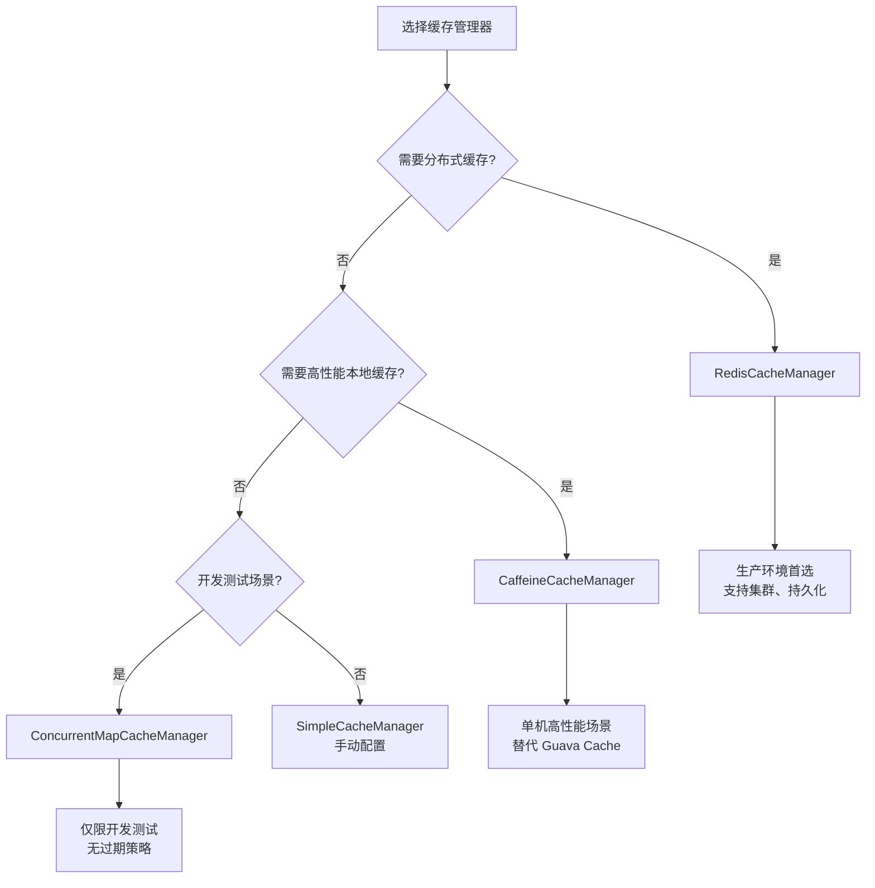
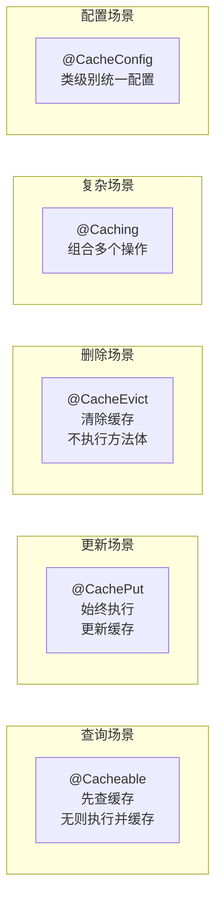

# Spring 缓存抽象

Spring 缓存抽象是 Spring 框架提供的一套统一的缓存接口体系，让开发者可以通过简单的注解实现方法级别的缓存，而无需关心底层使用的是内存缓存、Redis 还是其他缓存方案。

这页要解决的核心问题是：

- Spring 缓存抽象的设计思想是什么
- 各缓存注解如何使用，有什么区别
- 如何选择和配置缓存管理器
- Key 生成策略如何定制
- 实战中如何应对缓存穿透、击穿、雪崩

## 为什么需要缓存抽象

### 问题背景

在业务系统中，缓存是提升性能的重要手段。但不同的缓存方案（内存缓存、Redis、Ehcache、Caffeine 等）API 各不相同，切换缓存方案需要大量修改业务代码。

**传统方式的问题**：

```java
// 直接使用 Redis 客户端
@Service
public class UserService {
    
    @Autowired
    private RedisTemplate<String, Object> redisTemplate;
    
    public User getUserById(Long id) {
        String key = "user:" + id;
        // 手动查询缓存
        User user = (User) redisTemplate.opsForValue().get(key);
        if (user != null) {
            return user;
        }
        // 缓存未命中，查询数据库
        user = userMapper.selectById(id);
        // 手动写入缓存
        redisTemplate.opsForValue().set(key, user, 1, TimeUnit.HOURS);
        return user;
    }
}
```

这种方式的缺点：

- **代码冗余**：每个需要缓存的方法都要重复"查缓存 → 查数据库 → 写缓存"的逻辑
- **耦合度高**：业务代码与 Redis API 强绑定，切换缓存方案成本高
- **维护困难**：缓存 Key 的命名、过期时间等策略分散在各处

### Spring 缓存抽象的解决方案

Spring 缓存抽象的核心思想是：**将缓存逻辑从业务代码中剥离，通过 AOP 统一处理**。

```java
// 使用 Spring 缓存注解
@Service
public class UserService {
    
    @Cacheable(value = "user", key = "#id")
    public User getUserById(Long id) {
        return userMapper.selectById(id);
    }
}
```

一个注解就完成了缓存逻辑，业务代码只关注核心逻辑。

::: tip 缓存抽象的本质
Spring 缓存抽象不是具体的缓存实现，而是一套**标准化的缓存接口**。它定义了 `CacheManager` 和 `Cache` 两个核心接口，具体的缓存方案（Redis、Caffeine 等）只需实现这些接口即可接入。
:::

## 核心注解详解

Spring 缓存抽象提供了五个核心注解：

| 注解 | 作用 | 典型场景 |
|------|------|---------|
| `@Cacheable` | 查询缓存，有则返回，无则执行方法并缓存 | 查询操作 |
| `@CachePut` | 执行方法并更新缓存 | 更新操作 |
| `@CacheEvict` | 清除缓存 | 删除操作 |
| `@Caching` | 组合多个缓存操作 | 复杂缓存场景 |
| `@CacheConfig` | 类级别缓存配置 | 统一缓存配置 |

### @Cacheable：缓存查询

`@Cacheable` 是最常用的缓存注解，执行逻辑是：**先查缓存，有则直接返回；无则执行方法，将结果缓存后返回**。



**核心属性**：

| 属性 | 说明 | 示例 |
|------|------|------|
| `value` / `cacheNames` | 缓存名称（必填） | `@Cacheable("user")` |
| `key` | 缓存 Key，支持 SpEL | `@Cacheable(key = "#id")` |
| `condition` | 满足条件才缓存 | `@Cacheable(condition = "#id > 0")` |
| `unless` | 满足条件不缓存 | `@Cacheable(unless = "#result == null")` |
| `keyGenerator` | 自定义 Key 生成器 | `@Cacheable(keyGenerator = "myKeyGenerator")` |
| `cacheManager` | 指定缓存管理器 | `@Cacheable(cacheManager = "redisCacheManager")` |

**使用示例**：

```java
@Service
public class UserService {

    // 基本用法：使用参数作为 Key
    @Cacheable(value = "user", key = "#id")
    public User getUserById(Long id) {
        return userMapper.selectById(id);
    }

    // 组合 Key：使用多个参数
    @Cacheable(value = "user", key = "#deptId + ':' + #name")
    public User getByDeptAndName(Long deptId, String name) {
        return userMapper.selectByDeptAndName(deptId, name);
    }

    // 条件缓存：只缓存特定条件的数据
    @Cacheable(value = "user", key = "#id", condition = "#id > 100")
    public User getUserWithCondition(Long id) {
        return userMapper.selectById(id);
    }

    // 排除空值：不缓存 null 结果
    @Cacheable(value = "user", key = "#id", unless = "#result == null")
    public User getUserExcludeNull(Long id) {
        return userMapper.selectById(id);
    }
}
```

::: warning 缓存 null 值的问题
默认情况下，`@Cacheable` 会缓存 `null` 结果。这可能导致**缓存穿透**问题（恶意请求不存在的数据，绕过缓存直接打到数据库）。建议使用 `unless = "#result == null"` 排除空值，或在缓存管理器层面配置空值缓存策略。
:::

### @CachePut：缓存更新

`@CachePut` 会**始终执行方法体**，然后将结果更新到缓存中。适用于更新操作后刷新缓存的场景。

```java
@Service
public class UserService {

    // 更新用户并刷新缓存
    @CachePut(value = "user", key = "#user.id")
    public User updateUser(User user) {
        userMapper.updateById(user);
        return user;
    }

    // 创建用户并写入缓存
    @CachePut(value = "user", key = "#result.id")
    public User createUser(User user) {
        userMapper.insert(user);
        return user;  // 返回插入后的对象（包含生成的 ID）
    }
}
```

**@Cacheable vs @CachePut**：

| 对比项 | @Cacheable | @CachePut |
|--------|------------|-----------|
| 是否执行方法体 | 缓存命中时不执行 | 始终执行 |
| 主要用途 | 查询缓存 | 更新缓存 |
| 返回值处理 | 缓存命中时返回缓存值 | 始终返回方法执行结果 |

### @CacheEvict：缓存清除

`@CacheEvict` 用于清除缓存，常用于删除操作或批量刷新场景。

```java
@Service
public class UserService {

    // 删除用户并清除对应缓存
    @CacheEvict(value = "user", key = "#id")
    public void deleteUser(Long id) {
        userMapper.deleteById(id);
    }

    // 清除整个 user 缓存区域
    @CacheEvict(value = "user", allEntries = true)
    public void clearAllUserCache() {
        // 方法体可以为空，仅触发缓存清除
    }

    // 方法执行前清除缓存（默认是执行后）
    @CacheEvict(value = "user", key = "#id", beforeInvocation = true)
    public void deleteUserBeforeInvocation(Long id) {
        userMapper.deleteById(id);
    }
}
```

**核心属性**：

| 属性 | 说明 | 默认值 |
|------|------|--------|
| `allEntries` | 是否清除整个缓存区域 | `false` |
| `beforeInvocation` | 是否在方法执行前清除 | `false` |

::: tip beforeInvocation 的使用场景
当方法可能抛出异常时，如果希望在异常情况下也清除缓存，设置 `beforeInvocation = true`。否则，方法异常时缓存不会被清除。
:::

### @Caching：组合操作

当需要组合多个缓存操作时，使用 `@Caching` 注解。

```java
@Service
public class UserService {

    // 组合：查询时缓存多个 Key
    @Caching(cacheable = {
        @Cacheable(value = "user", key = "#id"),
        @Cacheable(value = "user:detail", key = "#id")
    })
    public User getUserById(Long id) {
        return userMapper.selectById(id);
    }

    // 组合：更新时清除多个缓存
    @Caching(evict = {
        @CacheEvict(value = "user", key = "#user.id"),
        @CacheEvict(value = "user:list", allEntries = true),
        @CacheEvict(value = "user:detail", key = "#user.id")
    })
    public User updateUser(User user) {
        userMapper.updateById(user);
        return user;
    }

    // 混合操作：更新缓存 + 清除其他缓存
    @Caching(
        put = @CachePut(value = "user", key = "#user.id"),
        evict = @CacheEvict(value = "user:list", allEntries = true)
    )
    public User updateUserAndClearList(User user) {
        userMapper.updateById(user);
        return user;
    }
}
```

### @CacheConfig：类级别配置

`@CacheConfig` 用于在类级别统一配置缓存属性，避免在每个方法上重复配置。

```java
@Service
@CacheConfig(
    cacheNames = "user",           // 默认缓存名称
    keyGenerator = "myKeyGenerator", // 默认 Key 生成器
    cacheManager = "redisCacheManager" // 默认缓存管理器
)
public class UserService {

    // 继承类级别配置，只需指定 Key
    @Cacheable(key = "#id")
    public User getUserById(Long id) {
        return userMapper.selectById(id);
    }

    // 可以覆盖类级别配置
    @Cacheable(value = "user:detail", key = "#id")
    public User getUserDetail(Long id) {
        return userMapper.selectDetailById(id);
    }
}
```

## 缓存管理器

缓存管理器（`CacheManager`）是 Spring 缓存抽象的核心组件，负责创建和管理 `Cache` 实例。不同的缓存方案有不同的 `CacheManager` 实现。



### SimpleCacheManager

最简单的缓存管理器，需要手动配置 `Cache` 实例。

```java
@Configuration
@EnableCaching
public class CacheConfig {

    @Bean
    public CacheManager cacheManager() {
        SimpleCacheManager cacheManager = new SimpleCacheManager();
        cacheManager.setCaches(Arrays.asList(
            new ConcurrentMapCache("user"),
            new ConcurrentMapCache("product")
        ));
        return cacheManager;
    }
}
```

### ConcurrentMapCacheManager

基于 `ConcurrentHashMap` 的缓存管理器，开箱即用，适合简单场景。

```java
@Bean
public CacheManager cacheManager() {
    return new ConcurrentMapCacheManager("user", "product", "order");
}
```

::: warning 不推荐生产使用
`ConcurrentMapCacheManager` 是纯内存缓存，不支持过期时间、容量限制等特性，且应用重启后缓存丢失。仅适合开发测试或极小规模应用。
:::

### RedisCacheManager

基于 Redis 的分布式缓存管理器，是生产环境的首选方案。

**Spring Boot 自动配置**：

```yaml
# application.yml
spring:
  cache:
    type: redis
    redis:
      time-to-live: 3600000  # 默认过期时间：1小时（毫秒）
      cache-null-values: false  # 不缓存 null 值
      key-prefix: "myapp:"  # Key 前缀
      use-key-prefix: true  # 是否使用 Key 前缀
```

**手动配置（自定义序列化等）**：

```java
@Configuration
@EnableCaching
public class RedisCacheConfig {

    @Bean
    public RedisCacheManager cacheManager(RedisConnectionFactory factory) {
        // 配置序列化
        RedisCacheConfiguration config = RedisCacheConfiguration.defaultCacheConfig()
            .entryTtl(Duration.ofHours(1))  // 默认过期时间
            .serializeKeysWith(RedisSerializationContext.SerializationPair
                .fromSerializer(new StringRedisSerializer()))
            .serializeValuesWith(RedisSerializationContext.SerializationPair
                .fromSerializer(new GenericJackson2JsonRedisSerializer()))
            .disableCachingNullValues()  // 不缓存 null
            .prefixCacheNameWith("myapp:");  // Key 前缀

        // 针对不同缓存区域配置不同过期时间
        Map<String, RedisCacheConfiguration> cacheConfigurations = new HashMap<>();
        cacheConfigurations.put("user", config.entryTtl(Duration.ofMinutes(30)));
        cacheConfigurations.put("product", config.entryTtl(Duration.ofHours(2)));
        cacheConfigurations.put("hot", config.entryTtl(Duration.ofMinutes(5)));

        return RedisCacheManager.builder(factory)
            .cacheDefaults(config)
            .withInitialCacheConfigurations(cacheConfigurations)
            .transactionAware()  // 支持事务
            .build();
    }
}
```

### CaffeineCacheManager

Caffeine 是高性能的本地缓存库，比 Guava Cache 性能更优，支持过期策略、容量限制、统计信息等。

**添加依赖**：

```xml
<dependency>
    <groupId>com.github.ben-manes.caffeine</groupId>
    <artifactId>caffeine</artifactId>
</dependency>
<dependency>
    <groupId>org.springframework.boot</groupId>
    <artifactId>spring-boot-starter-cache</artifactId>
</dependency>
```

**配置方式**：

```java
@Configuration
@EnableCaching
public class CaffeineCacheConfig {

    @Bean
    public CacheManager cacheManager() {
        CaffeineCacheManager cacheManager = new CaffeineCacheManager();
        cacheManager.setCaffeine(Caffeine.newBuilder()
            .expireAfterWrite(Duration.ofMinutes(30))  // 写入后 30 分钟过期
            .initialCapacity(100)  // 初始容量
            .maximumSize(1000)  // 最大容量
            .recordStats());  // 开启统计
        return cacheManager;
    }

    // 针对不同缓存区域配置不同策略
    @Bean
    @Primary
    public CacheManager caffeineCacheManager() {
        CaffeineCacheManager cacheManager = new CaffeineCacheManager("user", "product");
        cacheManager.setCaffeine(Caffeine.newBuilder()
            .expireAfterWrite(Duration.ofMinutes(30))
            .maximumSize(500));
        return cacheManager;
    }
}
```

### 缓存管理器选择决策



## Key 生成策略

缓存 Key 的设计直接影响缓存效果。Spring 提供了灵活的 Key 生成机制。

### 默认 KeyGenerator

默认使用 `SimpleKeyGenerator`，生成规则：

- 无参数：返回 `SimpleKey.EMPTY`
- 单参数：返回该参数对象
- 多参数：返回包含所有参数的 `SimpleKey`

```java
// 默认生成的 Key 示例
@Cacheable("user")  // Key = SimpleKey.EMPTY
public List<User> getAllUsers() { ... }

@Cacheable("user")  // Key = 123L（参数值）
public User getUserById(Long id) { ... }

@Cacheable("user")  // Key = SimpleKey [1L, "admin"]
public User getByDeptAndName(Long deptId, String name) { ... }
```

::: warning 默认 Key 的问题
默认 Key 生成器直接使用参数对象，可能导致：
- 参数对象未实现 `hashCode()`/`equals()` 时，Key 不正确
- 不同方法使用相同参数时，Key 冲突
- 参数对象较大时，Key 过长

建议显式指定 `key` 属性或自定义 KeyGenerator。
:::

### SpEL 表达式

`key` 属性支持 Spring Expression Language (SpEL)，可以灵活构建 Key。

**常用 SpEL 表达式**：

| 表达式 | 说明 | 示例 |
|--------|------|------|
| `#param` | 方法参数 | `#id`、`#user.id` |
| `#result` | 方法返回值（`@CachePut` 的 `key` 与 `@Cacheable` 的 `unless` 中可用） | `#result.id` |
| `#root.methodName` | 方法名 | `getUserById` |
| `#root.targetClass` | 目标类 | `class com.example.UserService` |
| `#root.args[0]` | 第一个参数 | 同 `#id`（假设第一个参数是 id） |

**使用示例**：

```java
@Service
public class UserService {

    // 使用参数属性
    @Cacheable(value = "user", key = "#user.id")
    public User saveUser(User user) {
        return userMapper.insert(user);
    }

    // 使用方法名 + 参数
    @Cacheable(value = "user", key = "#root.methodName + ':' + #id")
    public User getUserById(Long id) {
        return userMapper.selectById(id);
    }

    // 使用返回值（@CachePut）
    @CachePut(value = "user", key = "'user:' + #result.id")
    public User updateUser(User user) {
        userMapper.updateById(user);
        return user;
    }

    // 复杂表达式
    @Cacheable(value = "user", 
               key = "T(String).format('user:%d:%s', #deptId, #name)")
    public User getByDeptAndName(Long deptId, String name) {
        return userMapper.selectByDeptAndName(deptId, name);
    }
}
```

### 自定义 KeyGenerator

当需要统一的 Key 生成策略时，可以实现自定义 `KeyGenerator`。

```java
@Component("customKeyGenerator")
public class CustomKeyGenerator implements KeyGenerator {

    @Override
    public Object generate(Object target, Method method, Object... params) {
        StringBuilder sb = new StringBuilder();
        sb.append(target.getClass().getSimpleName()).append(":");
        sb.append(method.getName()).append(":");
        
        if (params.length == 0) {
            sb.append("no_params");
        } else {
            for (Object param : params) {
                sb.append(param == null ? "null" : param.toString()).append(",");
            }
            sb.setLength(sb.length() - 1);  // 移除最后的逗号
        }
        
        return sb.toString();
    }
}

// 使用自定义 KeyGenerator
@Cacheable(value = "user", keyGenerator = "customKeyGenerator")
public User getUserById(Long id) {
    return userMapper.selectById(id);
}
// 生成的 Key: UserService:getUserById:123
```

## 实战案例

### 用户信息缓存

完整的用户缓存方案，包含查询、更新、删除场景。

```java
@Service
@CacheConfig(cacheNames = "user")
public class UserService {

    @Autowired
    private UserMapper userMapper;

    /**
     * 查询用户：优先从缓存获取
     * Key: user:{id}
     */
    @Cacheable(key = "'user:' + #id", unless = "#result == null")
    public User getUserById(Long id) {
        return userMapper.selectById(id);
    }

    /**
     * 更新用户：更新数据库后刷新缓存
     * Key: user:{user.id}
     */
    @CachePut(key = "'user:' + #user.id")
    public User updateUser(User user) {
        userMapper.updateById(user);
        return user;
    }

    /**
     * 删除用户：删除数据库后清除缓存
     * 同时清除用户详情缓存和用户列表缓存
     */
    @Caching(evict = {
        @CacheEvict(key = "'user:' + #id"),
        @CacheEvict(key = "'user:detail:' + #id"),
        @CacheEvict(key = "'user:list'", cacheNames = "user")
    })
    public void deleteUser(Long id) {
        userMapper.deleteById(id);
    }

    /**
     * 查询用户列表：使用分页参数作为 Key
     * 注意：列表缓存需要在数据变更时清除
     */
    @Cacheable(key = "'user:list:' + #pageNum + ':' + #pageSize")
    public List<User> getUserList(int pageNum, int pageSize) {
        return userMapper.selectList(pageNum, pageSize);
    }
}
```

### 多级缓存方案

结合本地缓存（Caffeine）和分布式缓存（Redis）的多级缓存方案。

```java
@Configuration
@EnableCaching
public class MultiLevelCacheConfig {

    // 一级缓存：Caffeine（本地）
    @Bean("localCacheManager")
    public CacheManager localCacheManager() {
        CaffeineCacheManager cacheManager = new CaffeineCacheManager("user", "product");
        cacheManager.setCaffeine(Caffeine.newBuilder()
            .expireAfterWrite(Duration.ofMinutes(5))  // 本地缓存时间短
            .maximumSize(100));
        return cacheManager;
    }

    // 二级缓存：Redis（分布式）
    @Bean("redisCacheManager")
    @Primary
    public CacheManager redisCacheManager(RedisConnectionFactory factory) {
        RedisCacheConfiguration config = RedisCacheConfiguration.defaultCacheConfig()
            .entryTtl(Duration.ofHours(1));  // Redis 缓存时间长
        return RedisCacheManager.builder(factory)
            .cacheDefaults(config)
            .build();
    }
}

// 使用时指定缓存管理器
@Service
public class UserService {

    @Autowired
    @Lazy
    private UserService self;  // 注入自身代理，避免自调用绕过 @Cacheable

    // 本地缓存（高频访问、容忍短暂不一致）
    @Cacheable(cacheNames = "user", key = "#id", cacheManager = "localCacheManager")
    public User getUserFromLocal(Long id) {
        return self.getUserFromRedis(id);
    }

    // Redis 缓存（需要一致性保证）
    @Cacheable(cacheNames = "user", key = "#id", cacheManager = "redisCacheManager")
    public User getUserFromRedis(Long id) {
        return userMapper.selectById(id);
    }
}
```

### 缓存问题应对

#### 缓存穿透

**问题**：请求不存在的数据，缓存和数据库都没有，请求直接打到数据库。

**解决方案**：

```java
// 方案 1：缓存空值（设置较短过期时间）
@Cacheable(value = "user", key = "#id", unless = "#result == null")
public User getUserById(Long id) {
    User user = userMapper.selectById(id);
    if (user == null) {
        // 返回非 null 的空对象标记，会被正常缓存，避免同一 id 反复穿透
        return User.EMPTY;  // 定义一个空对象标记
    }
    return user;
}

// 方案 2：布隆过滤器（在 Redis 模块详细介绍）
// 在查询前先通过布隆过滤器判断数据是否可能存在
```

#### 缓存击穿

**问题**：热点 Key 过期瞬间，大量请求同时访问，直接打到数据库。

**解决方案**：

```java
// 方案 1：互斥锁（手动 cache-aside，只让一个请求去加载数据）
public User getUserByIdWithLock(Long id) {
    String key = "user:" + id;
    // 先查缓存
    User cached = (User) redisTemplate.opsForValue().get(key);
    if (cached != null) {
        return cached;
    }

    String lockKey = "lock:user:" + id;
    try {
        // 尝试获取分布式锁
        Boolean locked = redisTemplate.opsForValue()
            .setIfAbsent(lockKey, "1", Duration.ofSeconds(10));

        if (Boolean.TRUE.equals(locked)) {
            User user = userMapper.selectById(id);
            // 回写缓存
            redisTemplate.opsForValue()
                .set(key, user, Duration.ofHours(1));
            return user;
        } else {
            // 未抢到锁，等待后重试读取缓存
            Thread.sleep(100);
            return getUserByIdWithLock(id);
        }
    } catch (InterruptedException e) {
        Thread.currentThread().interrupt();
        throw new RuntimeException("获取用户信息失败", e);
    } finally {
        redisTemplate.delete(lockKey);
    }
}

// 方案 2：逻辑过期（不设置 TTL，数据永不过期）
// 在数据中存储过期时间，后台异步刷新
```

#### 缓存雪崩

**问题**：大量缓存同时过期，请求全部打到数据库。

**解决方案**：

```java
// 方案 1：随机过期时间
@Configuration
public class CacheConfig {
    
    @Bean
    public RedisCacheManager cacheManager(RedisConnectionFactory factory) {
        RedisCacheConfiguration config = RedisCacheConfiguration.defaultCacheConfig()
            // 1 小时基础 TTL + 应用启动时随机偏移（仅示例；按 key 维度打散需在业务层为不同 key 设置随机 TTL）
            .entryTtl(Duration.ofSeconds(3600 + new Random().nextInt(600)));
        return RedisCacheManager.builder(factory).cacheDefaults(config).build();
    }
}

// 方案 2：缓存预热（应用启动时加载热点数据）
@Component
public class CachePreheat implements ApplicationRunner {
    
    @Autowired
    private UserService userService;
    
    @Override
    public void run(ApplicationArguments args) {
        // 预加载热点用户数据
        List<Long> hotUserIds = Arrays.asList(1L, 2L, 3L, 4L, 5L);
        for (Long id : hotUserIds) {
            userService.getUserById(id);
        }
    }
}
```

::: tip 更多缓存问题详解
缓存穿透、击穿、雪崩的详细分析和解决方案，请参考 Redis 模块 - 缓存一致性与热点问题（详见微服务多级缓存章节）。
:::

## 缓存注解对比



| 注解 | 执行方法体 | 操作类型 | 返回值来源 | 典型场景 |
|------|-----------|---------|-----------|---------|
| `@Cacheable` | 缓存未命中时执行 | 读取/写入 | 缓存或方法执行 | 查询操作 |
| `@CachePut` | 始终执行 | 写入 | 方法执行结果 | 更新操作 |
| `@CacheEvict` | 始终执行 | 删除 | 方法执行结果 | 删除操作 |
| `@Caching` | 根据组合注解 | 混合 | 根据配置 | 复杂场景 |
| `@CacheConfig` | - | 配置 | - | 类级别配置 |

## 面试高频问题

### 1. Spring 缓存抽象的核心组件有哪些？

**答案要点**：

- **`CacheManager`**：缓存管理器，负责创建和管理 Cache 实例
- **`Cache`**：缓存接口，定义 get、put、evict 等操作
- **`KeyGenerator`**：Key 生成策略
- **缓存注解**：`@Cacheable`、`@CachePut`、`@CacheEvict` 等

核心设计思想是**接口与实现分离**，业务代码通过注解声明缓存需求，底层可灵活切换缓存方案。

### 2. @Cacheable 和 @CachePut 的区别？

**答案要点**：

| 对比项 | @Cacheable | @CachePut |
|--------|------------|-----------|
| 执行逻辑 | 先查缓存，命中则不执行方法 | 始终执行方法 |
| 缓存操作 | 读取 + 写入（未命中时） | 写入 |
| 适用场景 | 查询操作 | 更新操作 |
| 返回值 | 缓存值或方法执行结果 | 方法执行结果 |

关键区别：`@Cacheable` 可能不执行方法体（缓存命中时），`@CachePut` 始终执行。

### 3. 如何解决缓存穿透问题？

**答案要点**：

1. **缓存空值**：将 null 结果缓存，设置较短过期时间
2. **布隆过滤器**：在查询前判断数据是否可能存在
3. **参数校验**：在入口处过滤非法请求（如 id <= 0）

Spring 缓存层面可通过 `unless = "#result == null"` 控制是否缓存空值，或配置 `cache-null-values: true`。

### 4. 如何实现多级缓存？

**答案要点**：

1. 配置多个 `CacheManager`（如 Caffeine + Redis）
2. 通过 `cacheManager` 属性指定使用的缓存管理器
3. 业务层实现缓存查询逻辑：先查本地缓存，再查分布式缓存，最后查数据库
4. 更新时需要同时更新两级缓存

也可以使用 Spring Cache 的 `CompositeCacheManager` 组合多个缓存管理器。

### 5. Spring 缓存注解的失效场景有哪些？

**答案要点**：

1. **未启用缓存**：缺少 `@EnableCaching` 注解
2. **内部调用**：同类方法调用不走代理（与 AOP 失效原因相同）
3. **非 public 方法**：代理只能拦截 public 方法
4. **异常被吞**：方法抛出异常时，`@Cacheable` 不会缓存结果
5. **错误的 Key 配置**：SpEL 表达式错误导致 Key 生成失败

## Spring 6 / Boot 3 注意事项

### 版本变化

| 变化项 | Spring 5 / Boot 2 | Spring 6 / Boot 3 |
|--------|-------------------|-------------------|
| 最低 JDK 版本 | JDK 8 | JDK 17 |
| Redis 缓存序列化 | 默认 JDK 序列化 | 推荐使用 JSON 序列化 |
| Caffeine 版本 | 2.x | 3.x（API 有变化） |

### 推荐配置

```java
@Configuration
@EnableCaching
public class CacheConfig {

    @Bean
    public RedisCacheManager cacheManager(RedisConnectionFactory factory) {
        RedisCacheConfiguration config = RedisCacheConfiguration.defaultCacheConfig()
            // Spring 6 推荐使用 JSON 序列化
            .serializeValuesWith(RedisSerializationContext.SerializationPair
                .fromSerializer(new GenericJackson2JsonRedisSerializer()))
            .entryTtl(Duration.ofMinutes(30))
            .disableCachingNullValues();
        
        return RedisCacheManager.builder(factory)
            .cacheDefaults(config)
            .transactionAware()  // Spring 6 支持事务感知
            .enableStatistics()  // 开启统计（Spring 6 新增）
            .build();
    }
}
```

### Caffeine 3.x 变化

```java
// Caffeine 3.x API 变化
@Bean
public CacheManager caffeineCacheManager() {
    CaffeineCacheManager cacheManager = new CaffeineCacheManager();
    cacheManager.setCaffeine(Caffeine.newBuilder()
        // 3.x 使用 Duration API
        .expireAfterWrite(Duration.ofMinutes(30))
        .maximumSize(1000)
        .recordStats()  // 统计仍需显式开启
        .evictionListener((key, value, cause) -> {
            // 驱逐监听器
        }));
    return cacheManager;
}
```

## 小结

Spring 缓存抽象通过统一的注解体系，将缓存逻辑从业务代码中解耦，让开发者可以专注于业务实现。核心要点：

1. **理解注解语义**：`@Cacheable` 用于查询，`@CachePut` 用于更新，`@CacheEvict` 用于删除
2. **选择合适的缓存管理器**：生产环境推荐 Redis，单机高性能场景推荐 Caffeine
3. **设计合理的 Key 策略**：避免 Key 冲突，支持灵活的 SpEL 表达式
4. **应对缓存问题**：穿透、击穿、雪崩需要在架构层面综合考虑
5. **注意失效场景**：内部调用、非 public 方法等会导致缓存注解失效

## 关联阅读

- Redis 模块总览（Redis 缓存实践） — Redis 缓存实践详解
- 缓存一致性与热点问题（缓存穿透/击穿/雪崩） — 缓存穿透/击穿/雪崩详解
- [AOP](02-AOP.md) — 理解缓存注解的底层实现
- [事务管理与失效场景](03-事务管理与失效场景.md) — 类似的注解失效场景分析

## 版本差异(旧版 → Spring 6.x)

| 特性 | 旧版(Spring 5.x) | Spring 6.x |
|------|-----------------|------------|
| 缓存抽象 | @Cacheable 等 | 不变；语义稳定 |
| 多缓存管理器 | CacheManager | 不变 |
| 序列化 | 默认 JDK 序列化 | 推荐显式配置 JSON 序列化 |
| 虚拟线程 | 无 | 缓存调用在虚拟线程中正常 |
