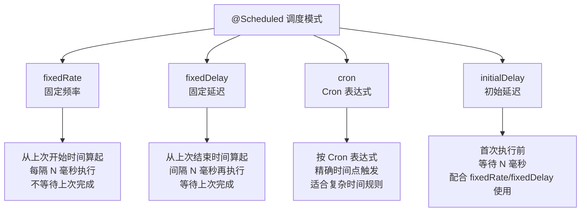
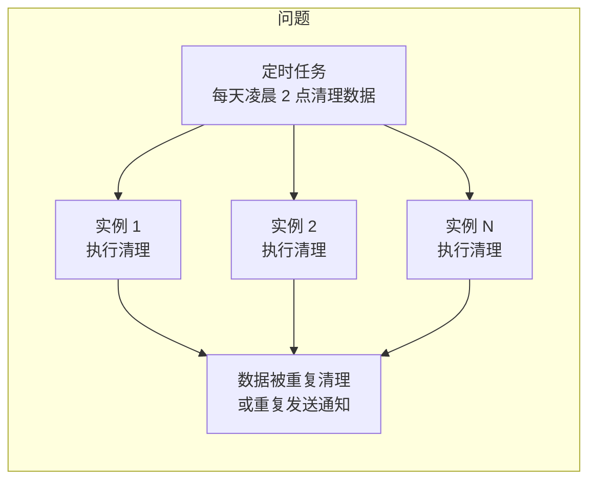
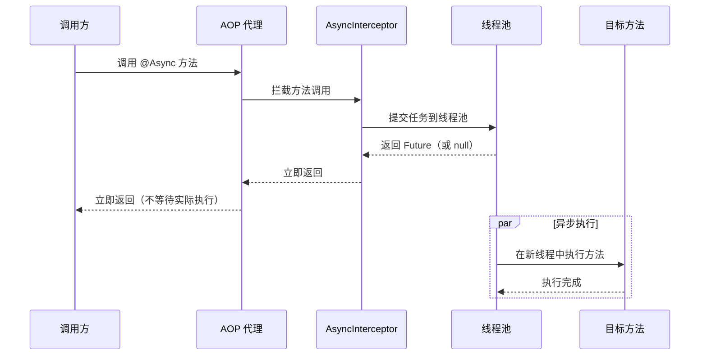
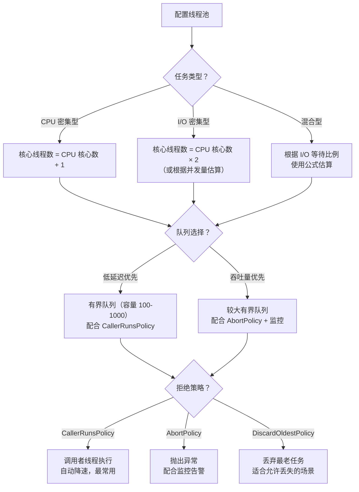
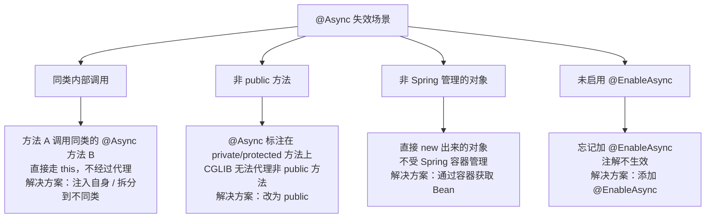

# Spring 定时任务与异步处理

定时任务和异步处理是后端系统里两类常见需求：前者解决"到了某个时间点就执行"的问题，后者解决"这件事不用等它做完就能返回"的问题。Spring 对两者都提供了注解驱动的支持——`@Scheduled` 和 `@Async`，但它们各自的坑点不少：定时任务默认单线程、分布式环境下重复执行、`@Async` 同类调用失效、异常被静默吞掉……

这页要解决的核心问题：

- `@Scheduled` 四种调度模式怎么选，线程池怎么配
- `@Async` 的生效前提和失效场景
- 两者在生产环境中的实战配置与避坑

## 定时任务 @Scheduled

### 启用定时任务

在配置类上添加 `@EnableScheduling`，Spring 会自动注册 `ScheduledAnnotationBeanPostProcessor`，扫描所有标注了 `@Scheduled` 的方法并注册调度任务。

```java
@Configuration
@EnableScheduling  // 启用定时任务支持
public class SchedulingConfig {
}
```

::: tip @EnableScheduling 放哪里？
Spring Boot 项目中，通常放在启动类或专门的配置类上即可。只要在组件扫描范围内，`@EnableScheduling` 放在哪个 `@Configuration` 类上效果相同。
:::

### 四种调度模式

`@Scheduled` 支持四种调度策略，通过不同属性配置：



| 模式 | 属性 | 含义 | 适用场景 |
|------|------|------|---------|
| **fixedRate** | `fixedRate = 5000` | 从上次**开始**时间起，每隔 5 秒执行一次（不等待上次完成） | 采集指标、心跳检测等不关心上一次是否完成的场景 |
| **fixedDelay** | `fixedDelay = 5000` | 从上次**结束**时间起，间隔 5 秒再执行 | 数据同步、清理任务等必须等上次完成的场景 |
| **cron** | `cron = "0 0 2 * * ?"` | 按 Cron 表达式在精确时间点触发 | 每天凌晨跑批、每小时统计等有明确时间要求的场景 |
| **initialDelay** | `initialDelay = 10000` | 首次执行前等待 10 秒 | 应用启动后延迟执行，避免启动期资源竞争 |

::: warning fixedRate 不等于"每 N 秒执行一次"
`fixedRate` 的计时起点是上次任务的**开始时间**，不是结束时间。如果任务执行耗时超过间隔，下一次会**立即启动**（不会跳过），可能导致任务堆积。如果需要"上次做完再等 N 秒"，用 `fixedDelay`。
:::

**代码示例**：

```java
@Component
public class ScheduledTasks {

    // 固定频率：每隔 5 秒执行（从上次开始时间算起）
    @Scheduled(fixedRate = 5000)
    public void reportCurrentTimeWithFixedRate() {
        System.out.println("fixedRate 执行：" + LocalTime.now());
    }

    // 固定延迟：上次执行完毕后等 5 秒再执行
    @Scheduled(fixedDelay = 5000)
    public void reportCurrentTimeWithFixedDelay() {
        System.out.println("fixedDelay 执行：" + LocalTime.now());
    }

    // Cron 表达式：每天凌晨 2 点执行
    @Scheduled(cron = "0 0 2 * * ?")
    public void dailyCleanup() {
        System.out.println("凌晨清理任务执行");
    }

    // 初始延迟 + 固定频率：启动后 10 秒首次执行，之后每隔 30 秒执行
    @Scheduled(initialDelay = 10000, fixedRate = 30000)
    public void delayedStartTask() {
        System.out.println("延迟启动任务执行：" + LocalTime.now());
    }
}
```

### Cron 表达式语法速查

Spring 的 Cron 表达式由 6 个字段组成（比 Linux 的 crontab 多了"秒"字段，比 Quartz 少了"年"字段）：

```
┌──────── 秒（0-59）
│ ┌────── 分（0-59）
│ │ ┌──── 时（0-23）
│ │ │ ┌── 日（1-31）
│ │ │ │ ┌─ 月（1-12）
│ │ │ │ │ ┌ 星期（0-7，0 和 7 都代表周日）
│ │ │ │ │ │
* * * * * ?
```

| 字段 | 允许值 | 特殊字符 |
|------|--------|---------|
| 秒 | 0-59 | `, - * /` |
| 分 | 0-59 | `, - * /` |
| 时 | 0-23 | `, - * /` |
| 日 | 1-31 | `, - * / ? L W` |
| 月 | 1-12 或 JAN-DEC | `, - * /` |
| 星期 | 0-7 或 SUN-SAT | `, - * / ? L #` |

**特殊字符含义**：

| 符号 | 含义 | 示例 |
|------|------|------|
| `*` | 任意值 | `* * * * * ?` 每秒 |
| `?` | 不指定（日和星期互斥时使用） | `0 0 2 * * ?` 每天凌晨 2 点 |
| `-` | 范围 | `0 0 9-17 * * ?` 每小时整点（9 点到 17 点） |
| `,` | 枚举 | `0 0 9,12,18 * * ?` 9 点、12 点、18 点 |
| `/` | 步长 | `0 0/30 * * * ?` 每 30 分钟 |
| `L` | 最后（Last） | `0 0 2 L * ?` 每月最后一天凌晨 2 点 |
| `W` | 最近工作日（Weekday） | `0 0 2 15W * ?` 每月 15 号最近的工作日 |
| `#` | 第几个星期几 | `0 0 2 ? * 6#3` 每月第三个周六凌晨 2 点（Spring 中星期编号 1=周一、6=周六、0/7=周日，注意与 Quartz 的 1=周日 不同） |

**常用 Cron 表达式**：

| 表达式 | 含义 |
|--------|------|
| `0 0/5 * * * ?` | 每 5 分钟 |
| `0 0 * * * ?` | 每小时整点 |
| `0 0 2 * * ?` | 每天凌晨 2 点 |
| `0 0 2 * * MON-FRI` | 工作日凌晨 2 点 |
| `0 0/30 9-17 * * ?` | 工作时间每 30 分钟 |
| `0 0 0 1 * ?` | 每月 1 号零点 |

::: details 日和星期都写 `*` 或都指定具体值，合法吗？
与 Quartz 不同，Spring 的 `CronExpression` **不强制**日与星期互斥（经实测，Spring 6.x）：

- 都用 `*`（或 `?`）：表示"每天"，完全合法
- 一个指定具体值、另一个用 `*`：按指定值触发
- 都指定具体值（如 `0 0 2 15 * 1`）：是"且"关系——15 号**且**是周一才会触发
- `?` 在 Spring 中只是 `*` 的别名，主要用于兼容从 Quartz 迁移过来的表达式
:::

### 定时任务的线程池配置

**默认行为**：Spring 的 `@Scheduled` 默认使用单线程的 `ScheduledExecutorService`。这意味着所有定时任务**串行执行**——一个任务卡住，其他任务全部等待。

```java
// 问题演示：两个定时任务互相阻塞
@Component
public class BlockingTasks {

    @Scheduled(fixedRate = 2000)
    public void taskA() throws InterruptedException {
        Thread.sleep(5000); // 模拟耗时操作
        System.out.println("任务A 完成 - " + Thread.currentThread().getName());
    }

    @Scheduled(fixedRate = 2000)
    public void taskB() {
        System.out.println("任务B 完成 - " + Thread.currentThread().getName());
    }
    // 结果：任务B 被任务A 阻塞，无法按时执行
}
```

**解决方案**：实现 `SchedulingConfigurer` 接口，自定义线程池。

```java
@Configuration
@EnableScheduling
public class SchedulingConfig implements SchedulingConfigurer {

    @Override
    public void configureTasks(ScheduledTaskRegistrar taskRegistrar) {
        // 设置线程池，核心线程数根据定时任务数量调整
        taskRegistrar.setScheduler(scheduledExecutorService());
    }

    @Bean(destroyMethod = "shutdown")
    public ScheduledExecutorService scheduledExecutorService() {
        return Executors.newScheduledThreadPool(
            4,  // 核心线程数，建议 >= 定时任务数量
            new CustomThreadFactory("scheduled-task-")
        );
    }

    // 自定义线程工厂，便于线程命名和问题排查
    static class CustomThreadFactory implements ThreadFactory {
        private final AtomicInteger counter = new AtomicInteger(1);
        private final String prefix;

        CustomThreadFactory(String prefix) {
            this.prefix = prefix;
        }

        @Override
        public Thread newThread(Runnable r) {
            Thread thread = new Thread(r, prefix + counter.getAndIncrement());
            thread.setDaemon(true);  // 设为守护线程，不阻止 JVM 关闭
            return thread;
        }
    }
}
```

::: tip 线程数怎么定？
- 核心线程数 >= 定时任务数量，确保每个任务都有线程可用
- 如果任务执行时间短（< 1 秒），可以适当减少
- 如果任务有 I/O 等待（网络请求、数据库查询），可以适当增加
- 生产环境建议通过配置文件注入，方便调整
:::

### 分布式定时任务的挑战

单机定时任务在多实例部署时会遇到**重复执行**问题——每个实例都会触发相同的定时任务。



**常见解决方案**：

| 方案 | 原理 | 优点 | 缺点 |
|------|------|------|------|
| **数据库乐观锁** | 利用唯一约束或版本号，只有一个实例能抢到执行权 | 简单，无需额外组件 | 数据库压力，锁粒度粗 |
| **Redis 分布式锁** | `SET key value NX PX timeout`，抢到锁的实例执行 | 性能好，实现简单 | 需要处理锁续期和释放 |
| **ShedLock** | 专门为 `@Scheduled` 设计的分布式锁框架 | 与 `@Scheduled` 无缝集成 | 需要外部存储（JDBC/MongoDB/Redis） |
| **XXL-JOB / ElasticJob** | 分布式任务调度平台 | 功能全面（分片、失败重试、监控） | 架构复杂，引入额外组件 |

**Redis 分布式锁示例**：

```java
@Component
public class DistributedScheduledTask {

    @Autowired
    private StringRedisTemplate redisTemplate;

    @Scheduled(cron = "0 0 2 * * ?")
    public void dailyCleanup() {
        // 尝试获取分布式锁，锁 30 分钟自动过期
        String lockKey = "scheduled:daily-cleanup";
        String lockValue = UUID.randomUUID().toString();
        Boolean acquired = redisTemplate.opsForValue()
            .setIfAbsent(lockKey, lockValue, Duration.ofMinutes(30));

        if (Boolean.TRUE.equals(acquired)) {
            try {
                // 执行业务逻辑
                doCleanup();
            } finally {
                // 释放锁（使用 Lua 脚本保证原子性，防止误删其他实例的锁）
                releaseLock(lockKey, lockValue);
            }
        } else {
            System.out.println("其他实例已获取锁，跳过本次执行");
        }
    }

    private void releaseLock(String lockKey, String lockValue) {
        String script = "if redis.call('get', KEYS[1]) == ARGV[1] " +
                        "then return redis.call('del', KEYS[1]) " +
                        "else return 0 end";
        redisTemplate.execute(
            new DefaultRedisScript<>(script, Long.class),
            List.of(lockKey),
            lockValue
        );
    }
}
```

::: warning 分布式定时任务的核心问题
1. **幂等性**：即使加了分布式锁，也要保证任务逻辑本身是幂等的——因为锁可能因超时释放导致重复执行
2. **时钟同步**：Cron 表达式依赖系统时钟，多实例间时钟不同步会导致调度偏差
3. **任务监控**：单机定时任务没有统一的执行记录和告警机制，生产环境建议接入任务调度平台
:::

## 异步处理 @Async

### 启用异步

与 `@EnableScheduling` 类似，在配置类上添加 `@EnableAsync`：

```java
@Configuration
@EnableAsync  // 启用异步方法执行支持
public class AsyncConfig {
}
```

### @Async 基本用法

`@Async` 标注在方法上，调用时会在独立线程中执行，调用方立即返回：

```java
@Service
public class EmailService {

    // 异步发送邮件，调用方无需等待
    @Async
    public void sendEmail(String to, String subject, String content) {
        // 模拟耗时操作
        Thread.sleep(3000);
        System.out.println("邮件已发送至：" + to);
    }
}
```

```java
@RestController
public class UserController {

    @Autowired
    private EmailService emailService;

    @PostMapping("/register")
    public Result register(@RequestBody UserDTO user) {
        // 1. 同步：保存用户
        userService.save(user);
        // 2. 异步：发送欢迎邮件（不阻塞响应）
        emailService.sendEmail(user.getEmail(), "欢迎注册", "...");
        // 3. 立即返回
        return Result.success("注册成功");
    }
}
```

### @Async 执行流程



### 自定义线程池配置

默认情况下，Spring 使用 `SimpleAsyncTaskExecutor`（每次创建新线程，不推荐）或 `ThreadPoolTaskExecutor`。生产环境必须自定义线程池。

```java
@Configuration
@EnableAsync
public class AsyncConfig implements AsyncConfigurer {

    @Override
    public Executor getAsyncExecutor() {
        ThreadPoolTaskExecutor executor = new ThreadPoolTaskExecutor();
        executor.setCorePoolSize(5);       // 核心线程数
        executor.setMaxPoolSize(20);       // 最大线程数
        executor.setQueueCapacity(100);    // 队列容量
        executor.setKeepAliveSeconds(60);  // 空闲线程存活时间
        executor.setThreadNamePrefix("async-task-");  // 线程名前缀，便于排查
        executor.setRejectedExecutionHandler(new ThreadPoolExecutor.CallerRunsPolicy());  // 拒绝策略
        executor.setWaitForTasksToCompleteOnShutdown(true);  // 关闭时等待任务完成
        executor.setAwaitTerminationSeconds(60);  // 最大等待时间
        executor.initialize();
        return executor;
    }

    @Override
    public AsyncUncaughtExceptionHandler getAsyncUncaughtExceptionHandler() {
        // 异步方法的异常处理器
        return (throwable, method, params) -> {
            System.err.println("异步方法异常 - 方法：" + method.getName()
                + "，参数：" + Arrays.toString(params)
                + "，异常：" + throwable.getMessage());
        };
    }
}
```

**线程池参数配置决策图**：



::: tip 线程池参数经验值
- **核心线程数**：CPU 密集型任务设为 `CPU + 1`；I/O 密集型任务设为 `CPU × 2` 或更高
- **队列容量**：不宜过大（避免 OOM），也不宜过小（频繁触发拒绝策略），通常 100-1000
- **拒绝策略**：生产环境推荐 `CallerRunsPolicy`——让调用者线程执行任务，起到自动降速的效果
- **线程名前缀**：务必设置，线上排查线程问题时能快速定位
:::

### @Async 的返回值

`@Async` 方法可以返回 `void`、`Future<T>` 或 `CompletableFuture<T>`。推荐使用 `CompletableFuture`，它支持链式调用和异常处理。

```java
@Service
public class ReportService {

    // 返回 CompletableFuture（推荐）
    @Async
    public CompletableFuture<String> generateReport(String reportId) {
        try {
            // 模拟耗时报表生成
            Thread.sleep(5000);
            String result = "报表-" + reportId + "-生成完成";
            return CompletableFuture.completedFuture(result);
        } catch (InterruptedException e) {
            return CompletableFuture.failedFuture(e);
        }
    }

    // 返回 Future（传统方式）
    @Async
    public Future<String> generateReportLegacy(String reportId) {
        String result = "报表-" + reportId + "-生成完成";
        return new AsyncResult<>(result);
    }
}
```

**调用方使用 CompletableFuture**：

```java
@Service
public class OrderService {

    @Autowired
    private ReportService reportService;

    public void processOrder(String orderId) throws Exception {
        // 发起异步调用
        CompletableFuture<String> future = reportService.generateReport(orderId);

        // 方式 1：阻塞等待结果（不推荐，失去了异步的意义）
        String result = future.get(10, TimeUnit.SECONDS);

        // 方式 2：注册回调（推荐）
        future.thenAccept(r -> System.out.println("报表结果：" + r))
              .exceptionally(ex -> {
                  System.err.println("报表生成失败：" + ex.getMessage());
                  return null;
              });

        // 方式 3：组合多个异步任务
        CompletableFuture<String> report1 = reportService.generateReport("A");
        CompletableFuture<String> report2 = reportService.generateReport("B");
        CompletableFuture.allOf(report1, report2)
            .thenRun(() -> System.out.println("所有报表生成完成"));
    }
}
```

### @Async 异常处理

`@Async` 方法抛出的异常不会传播到调用方——因为方法在另一个线程执行。如果返回类型是 `void`，异常会被**静默吞掉**，必须通过 `AsyncUncaughtExceptionHandler` 处理。

**方式 1：全局异常处理器**（实现 `AsyncConfigurer`）

```java
@Configuration
@EnableAsync
public class AsyncConfig implements AsyncConfigurer {

    @Override
    public AsyncUncaughtExceptionHandler getAsyncUncaughtExceptionHandler() {
        return (throwable, method, params) -> {
            // 记录日志、发送告警
            log.error("异步方法执行异常 - 方法：{}，参数：{}，异常：{}",
                method.getName(), Arrays.toString(params), throwable.getMessage(), throwable);
        };
    }
}
```

**方式 2：通过 CompletableFuture 处理**

```java
@Async
public CompletableFuture<String> asyncTaskWithException() {
    try {
        // 业务逻辑
        return CompletableFuture.completedFuture("成功");
    } catch (Exception e) {
        // 通过 CompletableFuture 传递异常
        return CompletableFuture.failedFuture(e);
    }
}

// 调用方
reportService.asyncTaskWithException()
    .exceptionally(ex -> {
        log.error("异步任务失败", ex);
        return "默认值";
    });
```

::: danger void 返回的 @Async 方法异常会被吞掉
如果 `@Async` 方法返回 `void` 且抛出异常，调用方完全感知不到。这是最常见的坑之一。**强烈建议**：
1. 优先使用 `CompletableFuture` 返回类型，通过 `exceptionally` 处理异常
2. 如果必须用 `void`，一定要配置 `AsyncUncaughtExceptionHandler`
3. 在 `@Async` 方法内部做好 try-catch，不要让异常逃逸
:::

### @Async 失效场景

`@Async` 和 `@Transactional` 一样，基于 AOP 代理实现。以下场景会导致失效：



**失效场景 1：同类内部调用（最常见）**

```java
@Service
public class UserService {

    // 错误：同类内部调用，@Async 不生效
    public void register(User user) {
        saveUser(user);       // 同步执行！不走代理
        sendWelcomeEmail(user.getEmail());  // 同步执行！不走代理
    }

    @Async
    public void sendWelcomeEmail(String email) {
        // 本应异步执行，但同类调用导致同步执行
    }

    // 解决方案 1：注入自身（推荐）
    @Autowired
    @Lazy  // 避免循环依赖
    private UserService self;

    public void register(User user) {
        saveUser(user);
        self.sendWelcomeEmail(user.getEmail());  // 通过代理调用，异步生效
    }

    // 解决方案 2：拆分到不同类（更推荐，职责更清晰）
}
```

**失效场景 2：非 public 方法**

```java
@Service
public class BadExample {

    @Async
    private void asyncPrivate() { }   // 不生效！CGLIB 无法代理 private 方法

    @Async
    protected void asyncProtected() { } // 不生效！

    @Async
    public void asyncPublic() { }       // 正确
}
```

::: warning 与 @Transactional 失效的对比
`@Async` 的失效场景和 [事务管理与失效场景](03-事务管理与失效场景.md) 中分析的 `@Transactional` 失效场景本质相同——都是 AOP 代理的边界问题。核心原则：**外部调用走代理，内部调用走 this**。关于代理原理和避坑指南的详细讲解，参见 [AOP](02-AOP.md)。
:::

## 实战案例

### 案例 1：定时数据清理

```java
@Component
@Slf4j
public class DataCleanupTask {

    @Autowired
    private OrderRepository orderRepository;
    @Autowired
    private StringRedisTemplate redisTemplate;

    /**
     * 每天凌晨 3 点清理 30 天前的已完成订单
     * 使用分布式锁避免多实例重复执行
     */
    @Scheduled(cron = "0 0 3 * * ?")
    public void cleanExpiredOrders() {
        String lockKey = "task:clean-expired-orders";
        String lockValue = UUID.randomUUID().toString();
        Boolean acquired = redisTemplate.opsForValue()
            .setIfAbsent(lockKey, lockValue, Duration.ofMinutes(30));

        if (!Boolean.TRUE.equals(acquired)) {
            log.info("其他实例正在执行清理任务，跳过");
            return;
        }

        try {
            LocalDateTime threshold = LocalDateTime.now().minusDays(30);
            int deleted = orderRepository.deleteByStatusAndCreateTimeBefore(
                OrderStatus.COMPLETED, threshold);
            log.info("清理完成，删除 {} 条过期订单", deleted);
        } finally {
            releaseLock(lockKey, lockValue);
        }
    }

    /**
     * 每小时清理过期的验证码缓存
     * 轻量级任务，无需分布式锁
     */
    @Scheduled(cron = "0 0 * * * ?")
    public void cleanExpiredCaptcha() {
        Set<String> keys = redisTemplate.keys("captcha:*");
        if (keys != null && !keys.isEmpty()) {
            int removed = 0;
            for (String key : keys) {
                Long ttl = redisTemplate.getExpire(key, TimeUnit.SECONDS);
                if (ttl != null && ttl <= 0) {
                    redisTemplate.delete(key);
                    removed++;
                }
            }
            log.info("清理 {} 个过期验证码", removed);
        }
    }

    private void releaseLock(String key, String value) {
        String script = "if redis.call('get',KEYS[1])==ARGV[1] " +
                        "then return redis.call('del',KEYS[1]) " +
                        "else return 0 end";
        redisTemplate.execute(
            new DefaultRedisScript<>(script, Long.class),
            List.of(key), value);
    }
}
```

### 案例 2：异步邮件发送

```java
@Service
@Slf4j
public class EmailService {

    @Autowired
    private JavaMailSender mailSender;

    @Value("${spring.mail.username}")
    private String from;

    /**
     * 异步发送简单邮件
     */
    @Async
    public CompletableFuture<Boolean> sendSimpleEmail(String to, String subject, String text) {
        try {
            SimpleMailMessage message = new SimpleMailMessage();
            message.setFrom(from);
            message.setTo(to);
            message.setSubject(subject);
            message.setText(text);
            mailSender.send(message);
            log.info("邮件发送成功：{}", to);
            return CompletableFuture.completedFuture(true);
        } catch (Exception e) {
            log.error("邮件发送失败：{}，原因：{}", to, e.getMessage());
            return CompletableFuture.failedFuture(e);
        }
    }

    /**
     * 异步发送带附件的邮件
     */
    @Async
    public CompletableFuture<Boolean> sendEmailWithAttachment(String to, String subject,
                                                               String text, File attachment) {
        try {
            MimeMessage message = mailSender.createMimeMessage();
            MimeMessageHelper helper = new MimeMessageHelper(message, true);
            helper.setFrom(from);
            helper.setTo(to);
            helper.setSubject(subject);
            helper.setText(text, true);
            helper.addAttachment(attachment.getName(), attachment);
            mailSender.send(message);
            log.info("带附件邮件发送成功：{}", to);
            return CompletableFuture.completedFuture(true);
        } catch (Exception e) {
            log.error("带附件邮件发送失败：{}", to, e.getMessage());
            return CompletableFuture.failedFuture(e);
        }
    }
}
```

```java
// 调用方
@Service
public class NotificationService {

    @Autowired
    private EmailService emailService;

    public void notifyUser(User user) {
        // 异步发送，不阻塞主流程
        emailService.sendSimpleEmail(
                user.getEmail(),
                "系统通知",
                "您有一条新消息")
            .exceptionally(ex -> {
                // 发送失败不影响主流程，记录日志即可
                log.warn("通知邮件发送失败，用户：{}", user.getId());
                return false;
            });
    }
}
```

### 案例 3：异步报表生成

```java
@Service
@Slf4j
public class ReportService {

    @Autowired
    private OrderRepository orderRepository;
    @Autowired
    private UserRepository userRepository;

    /**
     * 异步生成日报表，返回 CompletableFuture
     */
    @Async("reportExecutor")  // 指定专用线程池
    public CompletableFuture<DailyReport> generateDailyReport(LocalDate date) {
        try {
            log.info("开始生成日报表：{}", date);

            // 并行查询多个数据源
            CompletableFuture<BigDecimal> revenueFuture =
                CompletableFuture.supplyAsync(() ->
                    orderRepository.sumRevenueByDate(date));
            CompletableFuture<Long> orderCountFuture =
                CompletableFuture.supplyAsync(() ->
                    orderRepository.countByDate(date));
            CompletableFuture<Long> newUserFuture =
                CompletableFuture.supplyAsync(() ->
                    userRepository.countByRegisterDate(date));

            // 等待所有查询完成，组装报表
            DailyReport report = new DailyReport();
            report.setDate(date);
            report.setRevenue(revenueFuture.get(30, TimeUnit.SECONDS));
            report.setOrderCount(orderCountFuture.get(30, TimeUnit.SECONDS));
            report.setNewUserCount(newUserFuture.get(30, TimeUnit.SECONDS));

            log.info("日报表生成完成：{}", date);
            return CompletableFuture.completedFuture(report);
        } catch (Exception e) {
            log.error("日报表生成失败：{}", date, e);
            return CompletableFuture.failedFuture(e);
        }
    }
}
```

```java
// 专用线程池配置
@Configuration
@EnableAsync
public class AsyncExecutorConfig {

    /**
     * 报表生成专用线程池（I/O 密集型，线程数较多）
     */
    @Bean("reportExecutor")
    public Executor reportExecutor() {
        ThreadPoolTaskExecutor executor = new ThreadPoolTaskExecutor();
        executor.setCorePoolSize(4);
        executor.setMaxPoolSize(10);
        executor.setQueueCapacity(50);
        executor.setKeepAliveSeconds(60);
        executor.setThreadNamePrefix("report-");
        executor.setRejectedExecutionHandler(new ThreadPoolExecutor.CallerRunsPolicy());
        executor.initialize();
        return executor;
    }

    /**
     * 通用异步线程池
     */
    @Bean("commonExecutor")
    public Executor commonExecutor() {
        ThreadPoolTaskExecutor executor = new ThreadPoolTaskExecutor();
        executor.setCorePoolSize(5);
        executor.setMaxPoolSize(20);
        executor.setQueueCapacity(100);
        executor.setKeepAliveSeconds(60);
        executor.setThreadNamePrefix("async-");
        executor.setRejectedExecutionHandler(new ThreadPoolExecutor.CallerRunsPolicy());
        executor.initialize();
        return executor;
    }
}
```

::: tip 多线程池隔离
通过 `@Async("beanName")` 指定不同的线程池，可以实现任务隔离——报表生成任务不会耗尽邮件发送的线程资源。生产环境建议按业务类型划分线程池，避免相互影响。
:::

## Spring 6 / Boot 3 注意事项

### 虚拟线程（Virtual Threads）支持

Java 21 引入了虚拟线程（Virtual Threads，协程的 Java 实现），Spring Boot 3.2+ 原生支持：

```yaml
# application.yml - 一行配置启用虚拟线程
spring:
  threads:
    virtual:
      enabled: true
```

启用后，Spring Boot 会自动将 `@Async` 的默认线程池替换为虚拟线程执行器，Tomcat 请求处理也使用虚拟线程。

```java
// 启用虚拟线程后，@Async 自动使用虚拟线程
@Async
public CompletableFuture<String> asyncTask() {
    // 此方法在虚拟线程中执行
    System.out.println("线程：" + Thread.currentThread());
    // 输出：线程：VirtualThread@xxx
    return CompletableFuture.completedFuture("done");
}
```

**虚拟线程对定时任务和异步处理的影响**：

| 维度 | 传统平台线程 | 虚拟线程 |
|------|------------|---------|
| 创建成本 | 高（约 1MB 栈空间） | 极低（约几 KB） |
| 适合场景 | CPU 密集型 | I/O 密集型（网络请求、数据库查询） |
| 线程池配置 | 需要精心调参 | 可以大量创建，无需传统线程池 |
| @Async | 需要配置 ThreadPoolTaskExecutor | 可直接使用，无需手动配置池大小 |
| @Scheduled | 需要配置 ScheduledThreadPool | 仍建议配置，控制并发度 |

::: warning 虚拟线程的注意事项
1. **不要池化虚拟线程**：虚拟线程本身很轻量，不需要像平台线程那样池化。`@Async` 配合虚拟线程时，每次调用创建新的虚拟线程即可
2. **synchronized 会固定载体线程**：在虚拟线程中使用 `synchronized` 会导致载体线程（Carrier Thread）被固定，失去虚拟线程的优势。建议改用 `ReentrantLock`
3. **CPU 密集型任务不适合**：虚拟线程解决的是 I/O 等待问题，CPU 密集型任务仍然需要平台线程
4. **Spring Boot 3.2+ 才支持**：需要 Java 21+ 和 Spring Boot 3.2+
:::

### 其他 Spring 6 / Boot 3 变化

- **`@Scheduled` 的 Cron 表达式**：`CronExpression` 自 Spring 5.3 起替代了旧的 `CronSequenceGenerator`（Spring 6 延续），并新增了 `@hourly`、`@daily`、`@weekly`、`@monthly`、`@yearly`、`@annually` 等宏表达式
- **`@EnableAsync` 的 proxyTargetClass**：`@EnableAsync` 注解本身该属性默认为 `false`，但 Spring Boot 自动配置默认启用 CGLIB 代理（等价于 `proxyTargetClass=true`）
- **Jakarta EE 命名空间**：Spring 6 从 `javax.*` 迁移到 `jakarta.*`，如果自定义异步相关的 Servlet Filter，注意包名变更

## 面试高频问题

### 1. @Scheduled 的 fixedRate 和 fixedDelay 有什么区别？

**答**：`fixedRate` 从上次任务的**开始时间**计算间隔，任务可能重叠；`fixedDelay` 从上次任务的**结束时间**计算间隔，保证上次执行完再等固定时间。如果任务执行时间超过间隔，`fixedRate` 会在上次执行完后立即启动下一次（不会跳过），而 `fixedDelay` 永远保证间隔。

### 2. Spring 定时任务默认是几个线程？如何修改？

**答**：默认单线程（`ScheduledExecutorService` 的核心线程数为 1），所有 `@Scheduled` 方法串行执行。修改方式：实现 `SchedulingConfigurer` 接口，在 `configureTasks` 方法中通过 `taskRegistrar.setScheduler()` 设置自定义的 `ScheduledExecutorService`，指定核心线程数。

### 3. @Async 失效的场景有哪些？

**答**：
1. **同类内部调用**：直接调用 `this.asyncMethod()`，不经过 AOP 代理。解决：注入自身（`@Lazy @Autowired`）或拆分到不同类
2. **非 public 方法**：`@Async` 标注在 private/protected 方法上，CGLIB 无法代理。解决：改为 public
3. **非 Spring 管理的对象**：直接 `new` 出来的对象，不受容器管理。解决：通过容器获取 Bean
4. **未启用 @EnableAsync**：忘记在配置类上添加注解

### 4. @Async 方法抛异常，调用方能捕获吗？

**答**：不能。`@Async` 方法在独立线程执行，异常不会传播到调用方。如果返回 `void`，异常会被静默吞掉，必须通过 `AsyncUncaughtExceptionHandler` 处理；如果返回 `CompletableFuture`，可以通过 `exceptionally` 或 `handle` 方法处理异常。

### 5. 分布式环境下定时任务重复执行怎么解决？

**答**：
1. **Redis 分布式锁**：任务执行前用 `SET key value NX PX timeout` 抢锁，抢到才执行
2. **数据库乐观锁**：利用唯一约束或版本号保证只有一个实例执行
3. **ShedLock 框架**：与 `@Scheduled` 无缝集成，支持多种存储后端
4. **分布式任务调度平台**：XXL-JOB、ElasticJob 等，提供分片、失败重试、监控等完整方案

核心原则：即使加了分布式锁，任务逻辑本身也要保证**幂等性**。

## 小结

| 特性 | @Scheduled | @Async |
|------|-----------|--------|
| 核心注解 | `@Scheduled` | `@Async` |
| 启用注解 | `@EnableScheduling` | `@EnableAsync` |
| 实现原理 | `ScheduledAnnotationBeanPostProcessor` | AOP 代理 + `TaskExecutor` |
| 默认线程 | 单线程 | `SimpleAsyncTaskExecutor`（每次新建线程） |
| 线程池配置 | `SchedulingConfigurer` | `AsyncConfigurer` / 自定义 Bean |
| 失效场景 | 较少（注解在方法上即可） | 同类调用、非 public、非容器对象 |
| 分布式挑战 | 重复执行（需分布式锁） | 无（每个请求独立触发） |
| 返回值 | `void` | `void` / `Future` / `CompletableFuture` |
| 异常处理 | 直接 try-catch | `AsyncUncaughtExceptionHandler` / `CompletableFuture` |

**核心记忆点**：

1. `@Scheduled` 默认单线程，必须配置线程池
2. `fixedRate` 按开始时间算间隔，`fixedDelay` 按结束时间算间隔
3. `@Async` 和 `@Transactional` 一样依赖 AOP 代理，同类调用失效
4. `@Async` 返回 `void` 时异常被吞，必须配置异常处理器
5. 分布式定时任务要保证幂等性，分布式锁只是手段之一

## 关联阅读

- [AOP](02-AOP.md) — 代理原理与避坑指南，理解 `@Async` 失效的根本原因
- [Spring Boot 介绍](/JAVA/SpringBoot/00-SpringBoot介绍) — Spring Boot 自动配置对定时任务和异步的支持

## 版本差异(旧版 → Spring 6.x)

| 特性 | 旧版(Spring 5.x) | Spring 6.x |
|------|-----------------|------------|
| @Async | 默认线程池 | 不变；可配置虚拟线程执行器 |
| @Scheduled | 单线程调度 | 不变；支持虚拟线程调度器 |
| 调度器 | TaskScheduler | 不变 |
| 虚拟线程 | 无 | Spring 6.1+ 支持虚拟线程执行器（Boot 3.2 一行配置启用） |
