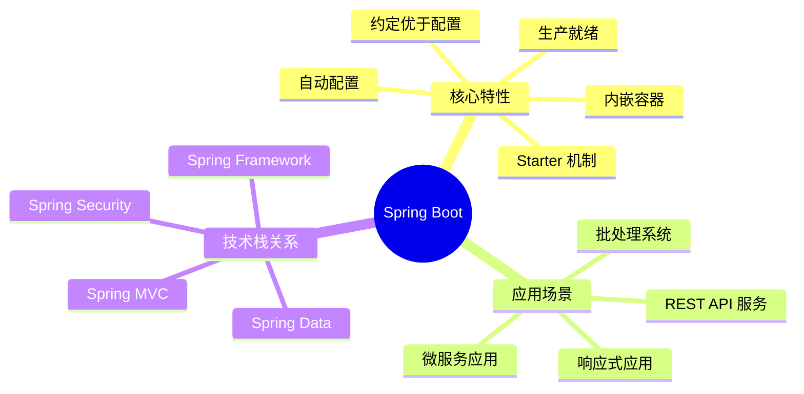
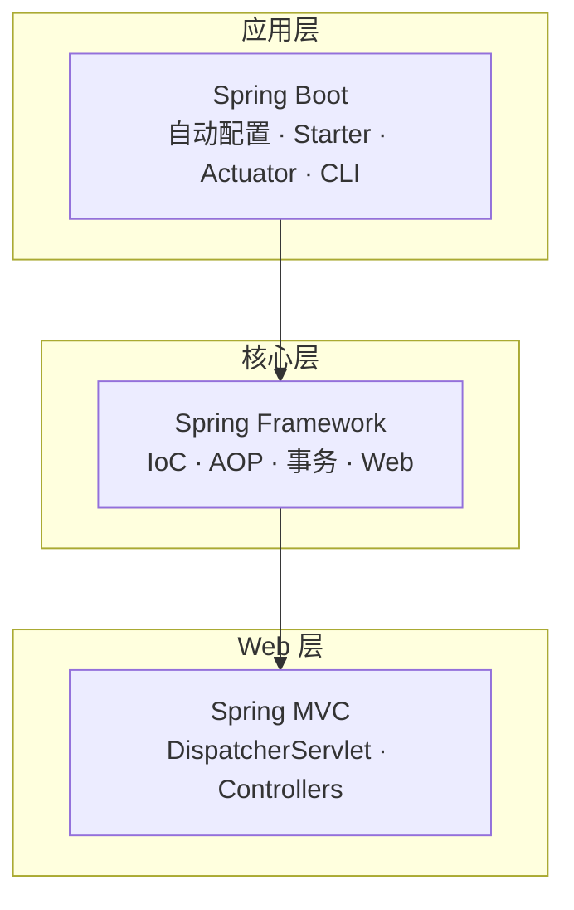
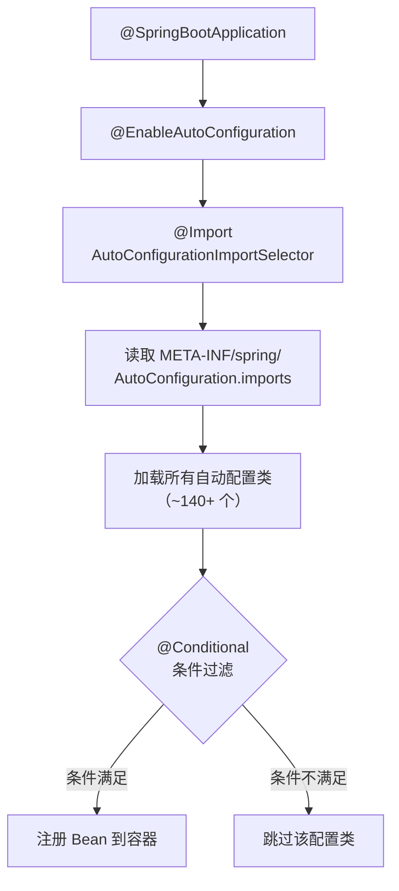
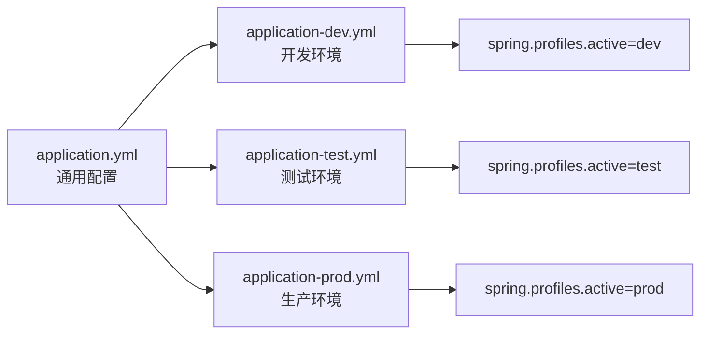
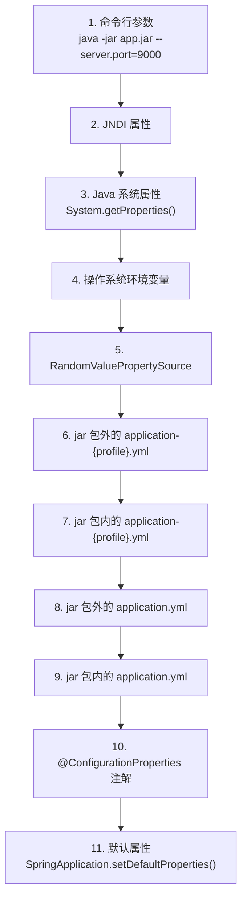
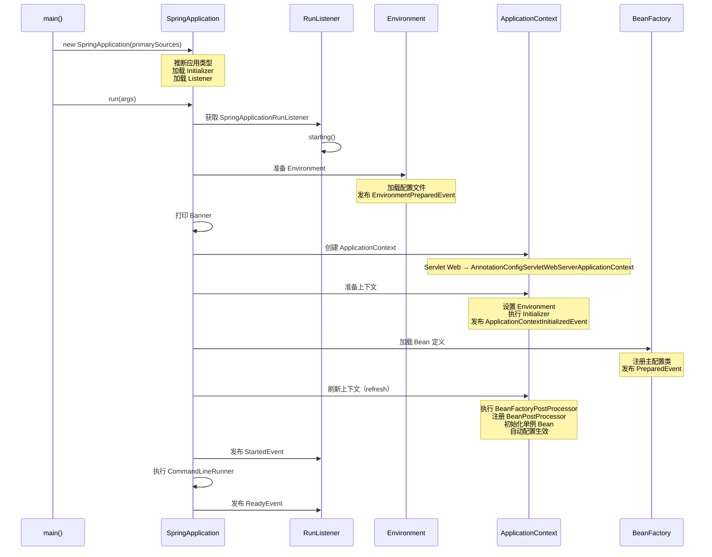

# Spring Boot 介绍

## 概述

Spring Boot 是现代 Java 后端开发的主线框架。它的价值不只是"让项目更容易启动"，而是把企业应用里高频而重复的基础装配工作标准化，让开发者把更多注意力放在业务边界、接口设计和运行治理上。

自 2014 年发布以来，Spring Boot 彻底改变了 Java 应用开发的方式，成为构建微服务、REST API 和企业级应用的首选框架。根据多项 JVM 生态调研报告（不同调查口径略有差异），Spring Boot 在 Java Web 框架中的使用率长期位居前列，是最受欢迎的 Java 框架之一。



## 概念与背景

### 什么是 Spring Boot

Spring Boot 是建立在 Spring Framework 之上的快速开发框架，目标是用更少的样板配置搭建可运行、可测试、可部署的企业级应用。

它并不是"替代 Spring"，而是在 Spring 的基础上提供了：

- **更统一的工程约定**：标准化的项目结构和配置方式
- **更少的手工配置**：通过自动配置减少 80% 以上的配置代码
- **更完整的生产就绪能力**：内置健康检查、指标监控、外部化配置等
- **更友好的启动、打包和部署方式**：内嵌容器、可执行 JAR

### Spring Boot 的设计理念

#### 1. 约定优于配置（Convention over Configuration）

Spring Boot 提供了一套合理的默认约定，开发者只需要在偏离这些约定时才需要进行显式配置。

```yaml
# Spring Boot 默认约定 — 无需显式配置即可生效
server:
  port: 8080                    # 默认端口 8080
```

数据源并不属于默认约定（Spring Boot 不会默认连接 MySQL，仅当 classpath 存在嵌入式数据库时才会自动配置），需要显式配置：

```yaml
# 数据源无默认值，偏离约定时必须显式配置
spring:
  datasource:
    url: jdbc:mysql://localhost:3306/test
    username: root
    driver-class-name: com.mysql.cj.jdbc.Driver
```

只有当你的配置与默认值不同时，才需要在 `application.yml` 中指定。

#### 2. 独立运行（Stand-alone Applications）

Spring Boot 应用可以独立运行，无需部署到外部应用服务器。这通过内嵌 Tomcat、Jetty 或 Undertow 实现。

**优势：**

- 简化开发和部署流程
- 更适合云原生和容器化环境
- 运维成本更低

#### 3. 自动配置（Auto-configuration）

Spring Boot 根据项目依赖自动配置 Spring 应用，消除大量的 XML 配置和样板代码。

```java
// 传统 Spring MVC 需要：
// 1. web.xml 配置 DispatcherServlet
// 2. spring-mvc.xml 配置组件扫描、视图解析器等
// 3. 手动配置 Jackson、文件上传等

// Spring Boot 只需要：
@SpringBootApplication
public class Application {
    public static void main(String[] args) {
        SpringApplication.run(Application.class, args);
    }
}
```

#### 4. 生产就绪（Production-ready）

Spring Boot 提供了一整套生产环境所需的功能：

- **健康检查**：`/actuator/health`
- **应用指标**：`/actuator/metrics`
- **环境信息**：`/actuator/env`
- **日志配置**：动态调整日志级别

::: tip 生产就绪 ≠ 仅限生产
Actuator 的监控能力在开发阶段同样有价值——用 `debug=true` 查看自动配置报告、用 `/actuator/beans` 排查 Bean 注入问题，远比翻日志高效。
:::

### 为什么 Spring Boot 会成为主线

在传统 Spring 项目里，开发者往往需要自己处理很多重复性工作：

| 问题 | 传统 Spring | Spring Boot |
|-----|------------|-------------|
| 依赖版本协调 | 手动管理，容易冲突 | BOM 统一管理 |
| Web 容器整合 | 手动配置和部署 | 内嵌容器，开箱即用 |
| 数据源配置 | 大量 XML 或 Java 配置 | 自动配置 + 简单属性 |
| 日志管理 | 手动引入和配置 | 默认 Logback 配置 |
| 监控能力 | 需要自行集成 | Actuator 内置 |
| 打包部署 | 需要 WAR 包和外置容器 | 可执行 JAR |

Spring Boot 通过以下机制解决了这些问题：

#### Starter 机制

Starter 是一组依赖描述符的集合，将常用的依赖组合在一起，减少版本组合成本。

```xml
<!-- 引入一个 starter 即可获得所有相关依赖 -->
<dependency>
    <groupId>org.springframework.boot</groupId>
    <artifactId>spring-boot-starter-web</artifactId>
</dependency>

<!-- 等价于引入以下依赖（且版本已协调） -->
<!-- spring-web, spring-webmvc, spring-boot-starter-tomcat -->
<!-- spring-boot-starter, spring-boot-starter-json -->
<!-- spring-boot-starter-validation 等 -->
```

#### 自动配置

根据 classpath 中的类和已定义的 Bean，自动装配常用组件。

#### 嵌入式容器

应用可直接启动运行，无需外部应用服务器。

#### 生产就绪能力

Actuator、配置管理、健康检查、可观测性一应俱全。

### Spring Boot 的核心优势

#### 1. 开发效率大幅提升

```java
// 传统 Spring MVC 配置文件示例（spring-mvc.xml）
<beans>
    <context:component-scan base-package="com.example"/>

    <bean class="org.springframework.web.servlet.view.InternalResourceViewResolver">
        <property name="prefix" value="/WEB-INF/views/"/>
        <property name="suffix" value=".jsp"/>
    </bean>

    <bean id="dataSource" class="com.zaxxer.hikari.HikariDataSource">
        <property name="driverClassName" value="${jdbc.driver}"/>
        <property name="jdbcUrl" value="${jdbc.url}"/>
        <property name="username" value="${jdbc.username}"/>
        <property name="password" value="${jdbc.password}"/>
    </bean>

    <!-- 更多配置... -->
</beans>

// Spring Boot 只需要
@SpringBootApplication
public class Application { ... }

// 数据源配置在 application.yml 中
spring:
  datasource:
    url: jdbc:mysql://localhost:3306/mydb
    username: root
    password: secret
```

#### 2. 配置简化

| 配置项 | 传统 Spring | Spring Boot |
|-------|------------|-------------|
| 组件扫描 | XML 配置 | `@SpringBootApplication` 自动扫描 |
| 数据源 | 多个 Bean 定义 | 属性文件配置 |
| MVC 配置 | 多个 Bean 和拦截器 | 自动配置 + 可选覆盖 |
| 事务管理 | XML 或注解配置 | 自动配置 |

#### 3. 微服务友好

```yaml
# 微服务配置示例
spring:
  application:
    name: user-service
  cloud:
    nacos:
      discovery:
        server-addr: localhost:8848

server:
  port: 8081

management:
  endpoints:
    web:
      exposure:
        include: health,info,metrics
```

## 与 Spring、Spring MVC 的关系

### 技术栈层次关系



### 详细对比

| 技术 | 作用 | 关系说明 |
|-----|------|---------|
| **Spring Framework** | 提供 IoC、AOP、事务、Web、数据访问等基础能力 | 底层核心，Spring Boot 基于 Spring 6.x+ |
| **Spring MVC** | Spring 的 Web MVC 模块，负责请求映射、参数绑定、视图与响应处理 | Spring Boot 的 Web 模块默认使用 Spring MVC |
| **Spring Boot** | 在 Spring 之上提供自动配置、Starter、工程约定和生产能力 | 封装 Spring，简化使用，不替代 Spring |

### 与 Spring MVC 的对比

| 特性 | Spring MVC | Spring Boot |
|-----|-----------|-------------|
| **配置方式** | 大量 XML 或 Java 配置 | 自动配置 + 少量属性 |
| **容器依赖** | 需要外部 Tomcat/Jetty | 内嵌容器，独立运行 |
| **依赖管理** | 手动管理版本 | BOM + Starter 自动管理 |
| **启动方式** | 打包 WAR，部署到容器 | 打包 JAR，直接运行 |
| **生产监控** | 需要额外集成 | Actuator 内置 |
| **开发体验** | 配置复杂，启动慢 | 约定优先，快速启动 |

**传统 Spring MVC 项目结构：**

```
myapp/
├── src/
│   └── main/
│       ├── java/
│       ├── resources/
│       └── webapp/
│           └── WEB-INF/
│               ├── web.xml          # 必须
│               └── spring-mvc.xml   # 必须
└── pom.xml
```

**Spring Boot 项目结构：**

```
myapp/
├── src/
│   └── main/
│       ├── java/
│       │   └── com/example/
│       │       └── Application.java  # 启动类即可
│       └── resources/
│           └── application.yml       # 可选配置
└── pom.xml
```

现代项目里，Spring Boot 往往作为应用入口，但底层依然在使用 Spring 和 Spring MVC。

## 当前推荐基线

### 版本选择

| 组件 | 推荐版本 | 说明 |
|-----|---------|------|
| **JDK** | `17` 或 `21` | LTS 版本，长期支持 |
| **Spring Boot** | `3.x` | 最新稳定版，支持虚拟线程 |
| **命名空间** | `jakarta.*` | Spring Boot 3.x 强制要求 |
| **配置文件** | `application.yml` | 层次清晰，可读性强 |
| **依赖管理** | `spring-boot-starter-parent` | 统一版本管理 |

### 版本兼容矩阵

| Spring Boot | JDK | Spring Framework | Servlet API | Jakarta EE |
|-------------|-----|------------------|-------------|------------|
| 3.5.x | 17-24 | 6.2.x | 6.0 | 10 |
| 3.4.x | 17-23 | 6.2.x | 6.0 | 10 |
| 3.3.x | 17-22 | 6.1.x | 6.0 | 10 |
| 3.2.x | 17-21 | 6.1.x | 6.0 | 10 |
| 3.1.x | 17-21 | 6.0.x | 6.0 | 10 |
| 3.0.x | 17-21 | 6.0.x | 6.0 | 10 |
| 2.7.x | 8-21 | 5.3.x | 4.0 | 8 |

::: warning 注意
如果还停留在"Spring Boot 一定要配 Java 8、Boot 2.x"的认识，已经不适合大多数新项目。Java 8 已于 2019 年停止公共更新，Spring Boot 2.x 也已进入维护模式。
:::

### 迁移注意事项

从 Spring Boot 2.x 迁移到 3.x：

1. **JDK 升级**：最低要求 JDK 17
2. **命名空间迁移**：`javax.*` → `jakarta.*`
3. **依赖升级**：检查第三方库兼容性
4. **配置变更**：部分配置属性名称调整
5. **API 变更**：部分废弃 API 已移除

::: danger 生产事故案例
某团队在升级 Spring Boot 3.x 时只改了版本号，未将 `javax.servlet.*` 迁移为 `jakarta.servlet.*`，导致运行时 `ClassNotFoundException`，整个应用无法启动。升级前务必使用 OpenRewrite 等自动化迁移工具进行全量扫描。
:::

## 核心原理概览

本节提供 Spring Boot 核心原理的全局视角，每个主题的深入分析请参考对应编号文档。

### 自动配置原理

自动配置是 Spring Boot 最核心的特性，其工作流程如下：



#### 核心注解说明

```java
@Target(ElementType.TYPE)
@Retention(RetentionPolicy.RUNTIME)
@Documented
@Inherited
@SpringBootConfiguration      // 标识这是一个配置类
@EnableAutoConfiguration       // 启用自动配置
@ComponentScan(               // 组件扫描
    excludeFilters = {
        @Filter(type = FilterType.CUSTOM, classes = TypeExcludeFilter.class),
        @Filter(type = FilterType.CUSTOM, classes = AutoConfigurationExcludeFilter.class)
    }
)
public @interface SpringBootApplication {
    // ...
}
```

#### 常用条件注解

| 条件注解 | 作用 | 示例 |
|---------|------|------|
| `@ConditionalOnClass` | 类路径中存在指定类 | `@ConditionalOnClass(DataSource.class)` |
| `@ConditionalOnMissingClass` | 类路径中不存在指定类 | `@ConditionalOnMissingClass("redis.clients.jedis.Jedis")` |
| `@ConditionalOnBean` | 容器中存在指定 Bean | `@ConditionalOnBean(DataSource.class)` |
| `@ConditionalOnMissingBean` | 容器中不存在指定 Bean | `@ConditionalOnMissingBean` |
| `@ConditionalOnProperty` | 配置属性满足条件 | `@ConditionalOnProperty(name = "spring.mvc.enabled", havingValue = "true")` |
| `@ConditionalOnWebApplication` | 是 Web 应用 | `@ConditionalOnWebApplication` |
| `@ConditionalOnExpression` | SpEL 表达式成立 | `@ConditionalOnExpression("${feature.enabled:false}")` |

::: tip 查看自动配置报告
在 `application.yml` 中设置 `debug: true`，或在启动参数中加入 `--debug`，Spring Boot 会在控制台输出 CONDITIONS EVALUATION REPORT，列出所有生效和未生效的自动配置类及其原因。这是排查"为什么我的配置没生效"的第一手段。
:::

::: details 自动配置报告示例
```
============================
CONDITIONS EVALUATION REPORT
============================

Positive matches:
-----------------
   DispatcherServletAutoConfiguration matched:
      - @ConditionalOnClass found required class 'org.springframework.web.servlet.DispatcherServlet' (OnClassCondition)
      - found 'session' scope (OnWebApplicationCondition)

   WebMvcAutoConfiguration matched:
      - @ConditionalOnClass found required classes 'jakarta.servlet.Servlet', 'org.springframework.web.servlet.DispatcherServlet' (OnClassCondition)
      - found 'session' scope (OnWebApplicationCondition)

Negative matches:
-----------------
   RedisAutoConfiguration:
      Did not match:
         - @ConditionalOnClass did not find required class 'redis.clients.jedis.Jedis' (OnClassCondition)
```
:::

>  自动配置的完整源码级分析，请参考 [21-自动配置与Starter机制](21-自动配置与Starter机制)

### 约定优于配置

Spring Boot 倾向于让开发者优先遵循默认约定，只有在默认约定不满足需求时才进行显式配置。

#### 核心约定

| 约定项 | 默认值 | 说明 |
|-------|--------|------|
| **启动类位置** | 根包及其子包 | 自动扫描 `@Component` 及其衍生注解 |
| **配置文件** | `application.yml/properties` | 支持多环境配置 |
| **端口** | `8080` | 内嵌容器默认端口 |
| **日志** | Logback + SLF4J | 默认输出到控制台 |
| **JSON 序列化** | Jackson | REST API 默认使用 JSON |
| **数据库** | H2 内存数据库 | 如果未配置数据源 |
| **静态资源** | `classpath:/static/` | 静态文件默认路径 |
| **模板引擎** | `classpath:/templates/` | 视图模板默认路径 |

#### 包扫描约定

```java
// 默认扫描启动类所在包及其子包
@SpringBootApplication
public class Application {
    public static void main(String[] args) {
        SpringApplication.run(Application.class, args);
    }
}

// 如果启动类在 com.example 下，则扫描：
// com.example
// com.example.controller
// com.example.service
// com.example.repository
// ... 所有子包
```

::: warning 启动类位置错误的后果
如果启动类放在 `com.example.controller` 下而非 `com.example` 下，则 `com.example.service` 和 `com.example.repository` 包中的组件将**不会被扫描**，导致 `NoSuchBeanDefinitionException`。这是初学者最常犯的错误之一。
:::

#### 修改默认约定

```java
@SpringBootApplication(scanBasePackages = "com.mycompany")
public class Application { ... }

// 或使用 @ComponentScan
@SpringBootApplication
@ComponentScan(basePackages = {"com.example", "com.common"})
public class Application { ... }
```

### Starter 机制详解

Starter 是 Spring Boot 最重要的特性之一，它将一组相关的依赖和自动配置打包在一起。

#### Starter 的作用

1. **依赖管理**：将一组依赖打包，避免版本冲突
2. **自动配置**：引入 Starter 后自动配置相关组件
3. **简化开发**：减少配置工作，开箱即用

#### 官方 Starter 清单

**核心 Starter：**

| Starter | 作用 | 包含内容 |
|---------|------|---------|
| `spring-boot-starter` | 核心 Starter | Spring Core、自动配置、日志、YAML |
| `spring-boot-starter-web` | Web 开发 | Spring MVC、Tomcat、Jackson（校验需另加 `spring-boot-starter-validation`） |
| `spring-boot-starter-webflux` | 响应式 Web | Spring WebFlux、Reactor、Netty |
| `spring-boot-starter-validation` | 参数校验 | Hibernate Validator |

**数据访问 Starter：**

| Starter | 作用 |
|---------|------|
| `spring-boot-starter-jdbc` | JDBC 支持 |
| `spring-boot-starter-data-jpa` | JPA 支持 |
| `spring-boot-starter-data-redis` | Redis 支持 |
| `spring-boot-starter-data-mongodb` | MongoDB 支持 |
| `spring-boot-starter-data-elasticsearch` | Elasticsearch 支持 |
| `spring-boot-starter-batch` | 批处理 |
| `spring-boot-starter-quartz` | 定时任务 |

**安全与监控 Starter：**

| Starter | 作用 |
|---------|------|
| `spring-boot-starter-security` | Spring Security |
| `spring-boot-starter-oauth2-client` | OAuth2 客户端 |
| `spring-boot-starter-oauth2-resource-server` | OAuth2 资源服务器 |
| `spring-boot-starter-actuator` | 生产监控 |

**其他常用 Starter：**

| Starter | 作用 |
|---------|------|
| `spring-boot-starter-aop` | AOP 支持 |
| `spring-boot-starter-amqp` | RabbitMQ |
| `spring-boot-starter-kafka` | Kafka |
| `spring-boot-starter-mail` | 邮件发送 |
| `spring-boot-starter-cache` | 缓存抽象 |
| `spring-boot-starter-logging` | 日志（默认包含） |
| `spring-boot-starter-log4j2` | Log4j2 日志 |

#### 自定义 Starter

创建自定义 Starter 的规范：

**1. 命名规范**

- 官方 Starter：`spring-boot-starter-*`
- 第三方 Starter：`*-spring-boot-starter`

**2. 项目结构**

```
my-spring-boot-starter/
├── src/main/java/
│   └── com/example/
│       ├── autoconfigure/
│       │   ├── MyAutoConfiguration.java
│       │   └── MyProperties.java
│       └── MyService.java
└── src/main/resources/
    └── META-INF/spring/
        └── org.springframework.boot.autoconfigure.AutoConfiguration.imports
```

**3. 自动配置类**

```java
@Configuration(proxyBeanMethods = false)
@ConditionalOnClass(MyService.class)
@EnableConfigurationProperties(MyProperties.class)
public class MyAutoConfiguration {

    @Bean
    @ConditionalOnMissingBean
    public MyService myService(MyProperties properties) {
        return new MyService(properties.getPrefix());
    }
}
```

**4. 配置属性类**

```java
@ConfigurationProperties(prefix = "my.service")
public class MyProperties {

    private String prefix = "default";
    private boolean enabled = true;

    // getters and setters
}
```

**5. 注册自动配置类**

在 `META-INF/spring/org.springframework.boot.autoconfigure.AutoConfiguration.imports` 中添加：

```
com.example.autoconfigure.MyAutoConfiguration
```

>  Starter 机制的完整源码级分析，请参考 [21-自动配置与Starter机制](21-自动配置与Starter机制)

### 嵌入式容器

Spring Boot 支持内嵌 Servlet 容器，应用可以直接作为可执行 JAR 运行。

#### 支持的容器

| 容器 | 默认 | Starter |
|-----|------|---------|
| Tomcat | √ | `spring-boot-starter-tomcat` |
| Jetty | | `spring-boot-starter-jetty` |
| Undertow | | `spring-boot-starter-undertow` |

#### 切换容器

```xml
<!-- 排除默认的 Tomcat -->
<dependency>
    <groupId>org.springframework.boot</groupId>
    <artifactId>spring-boot-starter-web</artifactId>
    <exclusions>
        <exclusion>
            <groupId>org.springframework.boot</groupId>
            <artifactId>spring-boot-starter-tomcat</artifactId>
        </exclusion>
    </exclusions>
</dependency>

<!-- 使用 Undertow -->
<dependency>
    <groupId>org.springframework.boot</groupId>
    <artifactId>spring-boot-starter-undertow</artifactId>
</dependency>
```

::: tip 容器选型建议
- **Tomcat**：默认选择，生态最成熟，社区资源最多，适合大多数场景
- **Undertow**：轻量高性能，I/O 模型更先进，适合高并发微服务
- **Jetty**：长连接和 WebSocket 支持更好，适合实时通信场景
:::

#### 容器配置

```yaml
server:
  port: 8080
  servlet:
    context-path: /api

  # Tomcat 配置
  tomcat:
    uri-encoding: UTF-8
    threads:
      max: 200
      min-spare: 10
    accept-count: 100
    max-connections: 10000
    connection-timeout: 5000ms

  # Undertow 配置（如果使用 Undertow）
  undertow:
    threads:
      io: 16
      worker: 256
    buffer-size: 1024
    direct-buffers: true
```

## 配置管理概览

配置管理是 Spring Boot 应用的重要组成部分。本节介绍核心概念，深入内容请参考 [12-配置绑定与环境隔离](12-配置绑定与环境隔离)。

### 配置文件

Spring Boot 支持多种配置文件格式：

| 格式 | 文件名 | 优先级 |
|-----|--------|--------|
| Properties | `application.properties` | 高 |
| YAML | `application.yml` | 低 |
| YAML | `application.yaml` | 低 |

同一位置同时存在 `application.properties` 与 YAML 文件时，`.properties` 中的同名配置会覆盖 YAML（官方推荐只保留一种格式，避免混淆）。

YAML 格式层次清晰，实际项目中更受推荐：

```yaml
# application.yml
server:
  port: 8080

spring:
  application:
    name: my-service
  datasource:
    url: jdbc:mysql://localhost:3306/mydb
    username: root
    password: secret
    driver-class-name: com.mysql.cj.jdbc.Driver

logging:
  level:
    root: INFO
    com.example: DEBUG
```

### Profile 多环境配置

Profile 允许针对不同环境使用不同的配置。



#### 激活 Profile

```yaml
# application.yml
spring:
  profiles:
    active: dev  # 激活 dev 环境
```

或通过命令行参数：

```bash
java -jar myapp.jar --spring.profiles.active=prod

# 或使用环境变量
export SPRING_PROFILES_ACTIVE=prod
java -jar myapp.jar
```

#### Profile 配置示例

```yaml
# application.yml（通用配置）
spring:
  application:
    name: my-service

---
# application-dev.yml
server:
  port: 8080

spring:
  datasource:
    url: jdbc:mysql://localhost:3306/mydb_dev
    username: root
    password: root

logging:
  level:
    com.example: DEBUG

---
# application-prod.yml
server:
  port: 80

spring:
  datasource:
    url: jdbc:mysql://prod-db:3306/mydb
    username: ${DB_USERNAME}
    password: ${DB_PASSWORD}

logging:
  level:
    com.example: INFO
```

### 配置优先级

Spring Boot 配置属性的优先级从高到低：



::: warning 配置覆盖陷阱
命令行参数优先级最高，这意味着运维人员在启动时通过 `--` 传入的参数会覆盖配置文件中的值。生产环境中如果发现"配置明明写了但不生效"，首先检查是否有命令行参数或环境变量覆盖了你的配置。
:::

#### 配置覆盖示例

```bash
# application.yml 中配置
server:
  port: 8080

# 命令行参数覆盖（优先级最高）
java -jar app.jar --server.port=9000

# 环境变量覆盖
export SERVER_PORT=9001
java -jar app.jar
```

### 配置绑定

#### @Value 注解

```java
@RestController
public class MyController {

    @Value("${server.port}")
    private int port;

    @Value("${app.message:Hello}")  // 默认值
    private String message;

    @GetMapping("/info")
    public String info() {
        return "Running on port: " + port + ", message: " + message;
    }
}
```

#### @ConfigurationProperties

推荐使用类型安全的配置类：

```java
@ConfigurationProperties(prefix = "app")
@Component
public class AppProperties {

    private String name;
    private String description;
    private int timeout = 3000;
    private List<String> servers = new ArrayList<>();
    private Map<String, String> metadata = new HashMap<>();

    // getters and setters
}
```

```yaml
app:
  name: my-service
  description: A demo service
  timeout: 5000
  servers:
    - server1.example.com
    - server2.example.com
  metadata:
    env: prod
    region: cn-north
```

>  配置绑定的完整源码级分析（松散绑定、校验、复杂类型绑定等），请参考 [12-配置绑定与环境隔离](12-配置绑定与环境隔离)

### 外部化配置实践

```yaml
# 生产环境推荐使用环境变量
spring:
  datasource:
    url: ${DB_URL:jdbc:mysql://localhost:3306/mydb}
    username: ${DB_USERNAME:root}
    password: ${DB_PASSWORD:}

# Docker/Kubernetes 环境变量
# DB_URL=jdbc:mysql://mysql-service:3306/mydb
# DB_USERNAME=app_user
# DB_PASSWORD=secure_password
```

## Spring Boot 应用启动流程

理解 Spring Boot 的启动流程有助于排查启动问题和进行性能优化。

### SpringApplication.run() 执行流程



### @SpringBootApplication 解析

```java
// @SpringBootApplication 是一个组合注解：

@SpringBootConfiguration       // 标识这是一个配置类
@EnableAutoConfiguration       // 启用自动配置
@ComponentScan(               // 组件扫描
    excludeFilters = {
        @Filter(type = FilterType.CUSTOM, classes = TypeExcludeFilter.class),
        @Filter(type = FilterType.CUSTOM, classes = AutoConfigurationExcludeFilter.class)
    }
)
public @interface SpringBootApplication { ... }
```

等价于：

```java
@Configuration
@EnableAutoConfiguration
@ComponentScan
public class Application {
    public static void main(String[] args) {
        SpringApplication.run(Application.class, args);
    }
}
```

### 启动事件监听

可以监听 Spring Boot 启动过程中的各种事件：

```java
@Component
public class MyApplicationListener {

    @EventListener
    public void onApplicationReady(ApplicationReadyEvent event) {
        log.info("应用已就绪！");
    }

    @EventListener
    public void onApplicationFailed(ApplicationFailedEvent event) {
        log.error("应用启动失败：{}", event.getException().getMessage());
    }
}
```

::: warning 早期事件收不到 @EventListener
`ApplicationStartingEvent`、`ApplicationEnvironmentPreparedEvent` 等发生在容器刷新**之前**，此时 `@Component` Bean 还未注册，`@EventListener` 收不到这些事件。要监听早期事件，需通过 `SpringApplication.addListeners(...)` 或 `META-INF/spring.factories` 注册监听器。
:::

::: tip 事件监听的实际用途
- `ApplicationReadyEvent`：在所有 Bean 初始化完成后执行预热逻辑（如加载缓存、建立连接池）
- `ApplicationFailedEvent`：记录启动失败原因，触发告警通知
- `ApplicationEnvironmentPreparedEvent`：在配置加载后、上下文创建前修改环境变量
:::

### 启动性能优化

```java
@SpringBootApplication
public class Application {
    public static void main(String[] args) {
        // 延迟初始化，按需创建 Bean
        SpringApplication app = new SpringApplication(Application.class);
        app.setLazyInitialization(true);
        app.run(args);

        // 或使用 Builder 模式
        new SpringApplicationBuilder(Application.class)
            .lazyInitialization(true)
            .logStartupInfo(false)
            .run(args);
    }
}
```

>  启动流程的完整源码级分析，请参考 [20-启动流程源码剖析](20-启动流程源码剖析)

## 快速入门示例

下面通过一个完整的示例演示 Spring Boot 的基本用法。

### 创建项目

#### 方式一：使用 Spring Initializr

访问 https://start.spring.io/，选择以下选项：

- Project: Maven
- Language: Java
- Spring Boot: 3.5.x
- Group: com.example
- Artifact: demo
- Package name: com.example.demo
- Packaging: Jar
- Java: 21
- Dependencies: Spring Web, Spring Data JPA, MySQL Driver, Lombok

#### 方式二：使用 IDE

IntelliJ IDEA：File → New → Project → Spring Initializr

>  更多创建方式（Maven 手动创建、Gradle 等），请参考 [03-创建SpringBoot应用](03-创建SpringBoot应用)

### 项目结构

```
demo/
├── src/
│   ├── main/
│   │   ├── java/
│   │   │   └── com/example/demo/
│   │   │       ├── DemoApplication.java
│   │   │       ├── controller/
│   │   │       │   └── UserController.java
│   │   │       ├── service/
│   │   │       │   ├── UserService.java
│   │   │       │   └── impl/UserServiceImpl.java
│   │   │       ├── repository/
│   │   │       │   └── UserRepository.java
│   │   │       ├── entity/
│   │   │       │   └── User.java
│   │   │       └── dto/
│   │   │           └── UserDTO.java
│   │   └── resources/
│   │       ├── application.yml
│   │       └── application-dev.yml
│   └── test/
│       └── java/
│           └── com/example/demo/
│               └── DemoApplicationTests.java
└── pom.xml
```

### 完整示例代码

#### pom.xml

```xml
<?xml version="1.0" encoding="UTF-8"?>
<project xmlns="http://maven.apache.org/POM/4.0.0"
         xmlns:xsi="http://www.w3.org/2001/XMLSchema-instance"
         xsi:schemaLocation="http://maven.apache.org/POM/4.0.0
         https://maven.apache.org/xsd/maven-4.0.0.xsd">
    <modelVersion>4.0.0</modelVersion>

    <parent>
        <groupId>org.springframework.boot</groupId>
        <artifactId>spring-boot-starter-parent</artifactId>
        <version>3.5.0</version>
        <relativePath/>
    </parent>

    <groupId>com.example</groupId>
    <artifactId>demo</artifactId>
    <version>0.0.1-SNAPSHOT</version>
    <name>demo</name>
    <description>Demo project for Spring Boot</description>

    <properties>
        <java.version>21</java.version>
    </properties>

    <dependencies>
        <!-- Spring Boot Starter -->
        <dependency>
            <groupId>org.springframework.boot</groupId>
            <artifactId>spring-boot-starter-web</artifactId>
        </dependency>

        <!-- Spring Data JPA -->
        <dependency>
            <groupId>org.springframework.boot</groupId>
            <artifactId>spring-boot-starter-data-jpa</artifactId>
        </dependency>

        <!-- Validation -->
        <dependency>
            <groupId>org.springframework.boot</groupId>
            <artifactId>spring-boot-starter-validation</artifactId>
        </dependency>

        <!-- MySQL Driver -->
        <dependency>
            <groupId>com.mysql</groupId>
            <artifactId>mysql-connector-j</artifactId>
            <scope>runtime</scope>
        </dependency>

        <!-- Lombok -->
        <dependency>
            <groupId>org.projectlombok</groupId>
            <artifactId>lombok</artifactId>
            <optional>true</optional>
        </dependency>

        <!-- Test -->
        <dependency>
            <groupId>org.springframework.boot</groupId>
            <artifactId>spring-boot-starter-test</artifactId>
            <scope>test</scope>
        </dependency>
    </dependencies>

    <build>
        <plugins>
            <plugin>
                <groupId>org.springframework.boot</groupId>
                <artifactId>spring-boot-maven-plugin</artifactId>
                <configuration>
                    <excludes>
                        <exclude>
                            <groupId>org.projectlombok</groupId>
                            <artifactId>lombok</artifactId>
                        </exclude>
                    </excludes>
                </configuration>
            </plugin>
        </plugins>
    </build>
</project>
```

#### 启动类

```java
package com.example.demo;

import org.springframework.boot.SpringApplication;
import org.springframework.boot.autoconfigure.SpringBootApplication;

@SpringBootApplication
public class DemoApplication {

    public static void main(String[] args) {
        SpringApplication.run(DemoApplication.class, args);
    }
}
```

#### 实体类

```java
package com.example.demo.entity;

import jakarta.persistence.*;
import lombok.Data;
import java.time.LocalDateTime;

@Data
@Entity
@Table(name = "users")
public class User {

    @Id
    @GeneratedValue(strategy = GenerationType.IDENTITY)
    private Long id;

    @Column(nullable = false, unique = true, length = 50)
    private String username;

    @Column(nullable = false)
    private String password;

    @Column(length = 100)
    private String email;

    @Column(length = 20)
    private String phone;

    @Column(name = "created_at")
    private LocalDateTime createdAt;

    @Column(name = "updated_at")
    private LocalDateTime updatedAt;

    @PrePersist
    protected void onCreate() {
        createdAt = LocalDateTime.now();
        updatedAt = LocalDateTime.now();
    }

    @PreUpdate
    protected void onUpdate() {
        updatedAt = LocalDateTime.now();
    }
}
```

#### DTO

```java
package com.example.demo.dto;

import jakarta.validation.constraints.Email;
import jakarta.validation.constraints.NotBlank;
import jakarta.validation.constraints.Size;
import lombok.Data;

@Data
public class UserDTO {

    @NotBlank(message = "用户名不能为空")
    @Size(min = 3, max = 50, message = "用户名长度必须在3-50之间")
    private String username;

    @NotBlank(message = "密码不能为空")
    @Size(min = 6, message = "密码长度不能少于6位")
    private String password;

    @Email(message = "邮箱格式不正确")
    private String email;

    private String phone;
}
```

#### Repository

```java
package com.example.demo.repository;

import com.example.demo.entity.User;
import org.springframework.data.jpa.repository.JpaRepository;
import org.springframework.stereotype.Repository;
import java.util.Optional;

@Repository
public interface UserRepository extends JpaRepository<User, Long> {

    Optional<User> findByUsername(String username);

    boolean existsByUsername(String username);

    boolean existsByEmail(String email);
}
```

#### Service

```java
package com.example.demo.service;

import com.example.demo.dto.UserDTO;
import com.example.demo.entity.User;
import java.util.List;

public interface UserService {

    User create(UserDTO userDTO);

    User getById(Long id);

    List<User> getAll();

    User update(Long id, UserDTO userDTO);

    void delete(Long id);
}
```

```java
package com.example.demo.service.impl;

import com.example.demo.dto.UserDTO;
import com.example.demo.entity.User;
import com.example.demo.repository.UserRepository;
import com.example.demo.service.UserService;
import lombok.RequiredArgsConstructor;
import org.springframework.stereotype.Service;
import org.springframework.transaction.annotation.Transactional;

import java.util.List;

@Service
@RequiredArgsConstructor
public class UserServiceImpl implements UserService {

    private final UserRepository userRepository;

    @Override
    @Transactional
    public User create(UserDTO userDTO) {
        if (userRepository.existsByUsername(userDTO.getUsername())) {
            throw new RuntimeException("用户名已存在");
        }

        User user = new User();
        user.setUsername(userDTO.getUsername());
        user.setPassword(userDTO.getPassword()); // 实际应该加密
        user.setEmail(userDTO.getEmail());
        user.setPhone(userDTO.getPhone());

        return userRepository.save(user);
    }

    @Override
    public User getById(Long id) {
        return userRepository.findById(id)
                .orElseThrow(() -> new RuntimeException("用户不存在"));
    }

    @Override
    public List<User> getAll() {
        return userRepository.findAll();
    }

    @Override
    @Transactional
    public User update(Long id, UserDTO userDTO) {
        User user = getById(id);
        user.setEmail(userDTO.getEmail());
        user.setPhone(userDTO.getPhone());
        return userRepository.save(user);
    }

    @Override
    @Transactional
    public void delete(Long id) {
        userRepository.deleteById(id);
    }
}
```

#### Controller

```java
package com.example.demo.controller;

import com.example.demo.dto.UserDTO;
import com.example.demo.entity.User;
import com.example.demo.service.UserService;
import jakarta.validation.Valid;
import lombok.RequiredArgsConstructor;
import org.springframework.http.HttpStatus;
import org.springframework.http.ResponseEntity;
import org.springframework.web.bind.annotation.*;

import java.util.List;

@RestController
@RequestMapping("/api/users")
@RequiredArgsConstructor
public class UserController {

    private final UserService userService;

    @PostMapping
    public ResponseEntity<User> create(@Valid @RequestBody UserDTO userDTO) {
        User user = userService.create(userDTO);
        return ResponseEntity.status(HttpStatus.CREATED).body(user);
    }

    @GetMapping("/{id}")
    public ResponseEntity<User> getById(@PathVariable Long id) {
        User user = userService.getById(id);
        return ResponseEntity.ok(user);
    }

    @GetMapping
    public ResponseEntity<List<User>> getAll() {
        List<User> users = userService.getAll();
        return ResponseEntity.ok(users);
    }

    @PutMapping("/{id}")
    public ResponseEntity<User> update(@PathVariable Long id,
                                       @Valid @RequestBody UserDTO userDTO) {
        User user = userService.update(id, userDTO);
        return ResponseEntity.ok(user);
    }

    @DeleteMapping("/{id}")
    public ResponseEntity<Void> delete(@PathVariable Long id) {
        userService.delete(id);
        return ResponseEntity.noContent().build();
    }
}
```

#### 配置文件

```yaml
# application.yml
spring:
  application:
    name: demo-service

  datasource:
    url: jdbc:mysql://localhost:3306/demo?useUnicode=true&characterEncoding=utf8&useSSL=false&serverTimezone=Asia/Shanghai
    username: root
    password: root
    driver-class-name: com.mysql.cj.jdbc.Driver

  jpa:
    hibernate:
      ddl-auto: update
    show-sql: true
    properties:
      hibernate:
        format_sql: true
        dialect: org.hibernate.dialect.MySQLDialect

server:
  port: 8080

logging:
  level:
    com.example.demo: DEBUG
```

#### 全局异常处理

```java
package com.example.demo.exception;

import lombok.Data;
import org.springframework.http.HttpStatus;
import org.springframework.http.ResponseEntity;
import org.springframework.validation.FieldError;
import org.springframework.web.bind.MethodArgumentNotValidException;
import org.springframework.web.bind.annotation.ExceptionHandler;
import org.springframework.web.bind.annotation.RestControllerAdvice;

import java.time.LocalDateTime;
import java.util.HashMap;
import java.util.Map;

@RestControllerAdvice
public class GlobalExceptionHandler {

    @ExceptionHandler(RuntimeException.class)
    public ResponseEntity<ErrorResponse> handleRuntimeException(RuntimeException ex) {
        ErrorResponse error = new ErrorResponse(
            HttpStatus.BAD_REQUEST.value(),
            ex.getMessage(),
            LocalDateTime.now()
        );
        return ResponseEntity.badRequest().body(error);
    }

    @ExceptionHandler(MethodArgumentNotValidException.class)
    public ResponseEntity<Map<String, String>> handleValidationExceptions(
            MethodArgumentNotValidException ex) {
        Map<String, String> errors = new HashMap<>();
        ex.getBindingResult().getFieldErrors().forEach((error) -> {
            String fieldName = error.getField();
            String errorMessage = error.getDefaultMessage();
            errors.put(fieldName, errorMessage);
        });
        return ResponseEntity.badRequest().body(errors);
    }

    @Data
    public static class ErrorResponse {
        private final int status;
        private final String message;
        private final LocalDateTime timestamp;
    }
}
```

### 运行和测试

```bash
# 启动应用
mvn spring-boot:run

# 或打包后运行
mvn clean package
java -jar target/demo-0.0.1-SNAPSHOT.jar
```

#### 测试接口

```bash
# 创建用户
curl -X POST http://localhost:8080/api/users \
  -H "Content-Type: application/json" \
  -d '{"username":"test","password":"123456","email":"test@example.com"}'

# 获取所有用户
curl http://localhost:8080/api/users

# 获取单个用户
curl http://localhost:8080/api/users/1

# 更新用户
curl -X PUT http://localhost:8080/api/users/1 \
  -H "Content-Type: application/json" \
  -d '{"username":"test","password":"123456","email":"newemail@example.com"}'

# 删除用户
curl -X DELETE http://localhost:8080/api/users/1
```

## 使用场景

Spring Boot 常见于这些场景：

### 1. REST API 服务

最典型的应用场景，构建微服务后端：

```java
@RestController
@RequestMapping("/api/products")
public class ProductController {
    // CRUD 接口
}
```

### 2. 微服务应用

结合 Spring Cloud 构建分布式系统：

```xml
<dependency>
    <groupId>org.springframework.cloud</groupId>
    <artifactId>spring-cloud-starter-netflix-eureka-client</artifactId>
</dependency>
```

### 3. 管理后台

使用模板引擎（Thymeleaf）或前后端分离：

```xml
<dependency>
    <groupId>org.springframework.boot</groupId>
    <artifactId>spring-boot-starter-thymeleaf</artifactId>
</dependency>
```

### 4. 定时任务系统

```java
@SpringBootApplication
@EnableScheduling
public class Application {
    public static void main(String[] args) {
        SpringApplication.run(Application.class, args);
    }
}

@Component
public class ScheduledTasks {

    @Scheduled(cron = "0 0 2 * * ?")
    public void cleanupTask() {
        // 每天凌晨2点执行清理任务
    }
}
```

### 5. 批处理应用

```java
@SpringBootApplication
public class BatchApplication {
    public static void main(String[] args) {
        SpringApplication.run(BatchApplication.class, args);
    }
}
```

::: warning Boot 3 不要加 @EnableBatchProcessing
在 Spring Boot 3.x 中，引入 `spring-boot-starter-batch` 即自动配置 Spring Batch；若在启动类上加 `@EnableBatchProcessing`，反而会**关闭** Boot 的 Batch 自动配置（该注解变为"由你接管配置"的信号），导致 JobRepository 等基础设施 Bean 缺失。
:::

### 6. 响应式应用

```xml
<dependency>
    <groupId>org.springframework.boot</groupId>
    <artifactId>spring-boot-starter-webflux</artifactId>
</dependency>
```

```java
@RestController
public class ReactiveController {

    @GetMapping("/stream")
    public Flux<User> streamUsers() {
        return userService.getAllFlux();
    }
}
```

## 常见问题与解决方案

### 1. 端口被占用

**问题：** 启动时报错 `Port 8080 is already in use`

**解决方案：**

```yaml
# 方式1：修改端口
server:
  port: 8081
```

```bash
# 方式2：命令行参数
java -jar app.jar --server.port=8081
```

### 2. Bean 冲突

**问题：** 启动时报错 `The bean 'xxx', defined in class path resource, could not be registered`

**解决方案：**

```yaml
# 允许覆盖
spring:
  main:
    allow-bean-definition-overriding: true
```

::: warning Bean 覆盖不是银弹
`allow-bean-definition-overriding: true` 只是掩盖了问题，不是解决问题。Bean 冲突通常意味着你的配置有歧义——可能是重复的 `@Bean` 定义，也可能是自动配置与手动配置冲突。应该找到根本原因，而不是简单地允许覆盖。
:::

### 3. 自动配置不生效

**问题：** 引入了 Starter 但配置没生效

**排查步骤：**

1. 开启调试模式：`debug: true`
2. 检查自动配置报告
3. 确认条件注解是否满足
4. 检查是否有依赖冲突

```bash
# 查看自动配置报告
mvn spring-boot:run -Dspring-boot.run.arguments=--debug
```

### 4. 配置文件不生效

**问题：** `application.yml` 配置没有被读取

**可能原因：**

1. 文件名拼写错误（`application.yml` 或 `application.yaml` 均可）
2. 文件位置错误（应该在 `src/main/resources/`）
3. YAML 格式错误

```yaml
# 错误示例：缩进错误
spring:
datasource:  # 缺少缩进
  url: xxx
```

### 5. 循环依赖

**问题：** `The dependencies of some of the beans in the application context form a cycle`

**解决方案：**

```java
// 方式1：使用 @Lazy
@Service
public class ServiceA {
    private final ServiceB serviceB;

    public ServiceA(@Lazy ServiceB serviceB) {
        this.serviceB = serviceB;
    }
}

// 方式2：使用 setter 注入
@Service
public class ServiceA {
    private ServiceB serviceB;

    @Autowired
    public void setServiceB(ServiceB serviceB) {
        this.serviceB = serviceB;
    }
}
```

::: danger Spring Boot 2.6+ 默认禁止循环依赖
从 Spring Boot 2.6 开始，`spring.main.allow-circular-references` 默认为 `false`，循环依赖会直接报错。这是正确的行为——循环依赖通常意味着设计有问题，应该通过重构（如提取公共逻辑到第三个 Bean）来解决，而不是用 `@Lazy` 绕过。
:::

### 6. 数据库连接失败

**问题：** `Unable to open JDBC Connection`

**排查步骤：**

1. 检查数据库服务是否启动
2. 检查连接配置是否正确
3. 检查网络连通性
4. 检查驱动依赖

```bash
# 测试连接
telnet localhost 3306
```

## 最佳实践

### 1. 项目结构规范

```
com.example.demo/
├── config/          # 配置类
├── controller/      # 控制器
├── service/         # 服务层
│   └── impl/
├── repository/      # 数据访问层
├── entity/          # 实体类
├── dto/             # 数据传输对象
├── vo/              # 视图对象
├── exception/       # 异常处理
├── util/            # 工具类
└── constant/        # 常量
```

### 2. 配置管理规范

- 敏感信息使用环境变量
- 不同环境使用不同 Profile
- 配置集中管理

```yaml
# 推荐做法
spring:
  datasource:
    url: ${DB_URL}
    username: ${DB_USERNAME}
    password: ${DB_PASSWORD}
```

### 3. 异常处理规范

```java
// 自定义业务异常
public class BusinessException extends RuntimeException {
    private final int code;

    public BusinessException(int code, String message) {
        super(message);
        this.code = code;
    }
}

// 全局异常处理
@RestControllerAdvice
public class GlobalExceptionHandler {

    @ExceptionHandler(BusinessException.class)
    public ResponseEntity<ErrorResponse> handleBusinessException(BusinessException ex) {
        return ResponseEntity.badRequest()
            .body(new ErrorResponse(ex.getCode(), ex.getMessage()));
    }
}
```

>  异常处理的完整深度分析，请参考 [05-Java异常深度处理](05-Java异常深度处理)

### 4. 日志规范

```java
// 使用 SLF4J
@Slf4j
@Service
public class UserService {

    public User getById(Long id) {
        log.debug("查询用户，ID: {}", id);
        User user = userRepository.findById(id).orElse(null);
        if (user == null) {
            log.warn("用户不存在，ID: {}", id);
        }
        return user;
    }
}
```

::: tip 日志占位符 vs 字符串拼接
始终使用 `log.debug("msg: {}", value)` 而非 `log.debug("msg: " + value)`。前者在日志级别不匹配时不会执行字符串拼接，后者无论是否输出都会先拼接字符串，造成不必要的性能开销。
:::

### 5. 接口规范

统一返回格式：

```java
@Data
public class Result<T> {
    private int code;
    private String message;
    private T data;

    public static <T> Result<T> success(T data) {
        Result<T> result = new Result<>();
        result.setCode(200);
        result.setMessage("success");
        result.setData(data);
        return result;
    }

    public static <T> Result<T> error(int code, String message) {
        Result<T> result = new Result<>();
        result.setCode(code);
        result.setMessage(message);
        return result;
    }
}
```

### 6. 安全建议

```yaml
# 不要暴露敏感端点
management:
  endpoints:
    web:
      exposure:
        include: health,info  # 只暴露必要的端点

# 生产环境关闭详细错误信息
server:
  error:
    include-message: never
    include-binding-errors: never
```

## 常见误区

### 误区 1：把 Spring Boot 当成"能跑起来的脚手架"

**正确认识：** Spring Boot 是一套完整的企业级开发框架，提供了从开发到部署的全流程支持。

### 误区 2：只会复制配置，不理解自动配置条件

**正确做法：** 使用 `debug=true` 查看自动配置报告，理解每个自动配置类的生效条件。

### 误区 3：认为引入了 Starter 就不用关注底层组件行为

**正确做法：** 了解 Starter 引入的组件和默认配置，必要时进行调整。

### 误区 4：把所有环境配置都写死在代码里

**正确做法：** 使用配置文件和环境变量，实现配置外部化。

### 误区 5：忽视生产监控和运维能力

**正确做法：** 善用 Actuator 提供的监控端点，集成 Prometheus、Grafana 等监控工具。

>  Actuator 的完整深度分析，请参考 [13-Actuator与可观测性接入](13-Actuator与可观测性接入)

### 误区 6：Actuator 端点可以直接暴露到生产环境

**正确做法：**

```yaml
# 错误示例：直接暴露所有端点
management:
  endpoints:
    web:
      exposure:
        include: "*"

# 正确配置
management:
  server:
    port: 8081                    # 独立管理端口
    address: 127.0.0.1           # 只监听本地

  endpoints:
    web:
      exposure:
        include: health,info,prometheus  # 只暴露必要端点

  endpoint:
    health:
      show-details: when-authorized  # 需要授权才显示详情
```

::: danger 安全事故案例
某项目在生产环境将 `management.endpoints.web.exposure.include` 设为 `*`，导致 `/actuator/env` 端点暴露了数据库密码、API Key 等敏感信息，被外部扫描器发现并利用。**生产环境务必使用独立管理端口 + 最小暴露原则 + 访问认证**。
:::

## 面试要点

### 核心原理类

#### 1. Spring Boot 自动配置的核心思想是什么？

**答案：** 按条件装配默认 Bean，并允许用户覆盖。通过 `@EnableAutoConfiguration` 加载候选配置类，再通过条件注解（`@ConditionalOnXxx`）筛选生效的配置。

#### 2. Spring Boot 为什么适合企业项目？

**答案：**
- 统一约定：降低团队协作成本
- 降低样板代码：提高开发效率
- 工程能力完整：监控、配置、部署一站式解决
- 生态丰富：与 Spring Cloud、安全、数据访问等无缝集成

#### 3. Starter 和自动配置有什么区别？

**答案：**
- Starter 解决**依赖组合问题**：将相关依赖打包，管理版本
- 自动配置解决 **Bean 装配问题**：根据条件自动配置组件

#### 4. 为什么 Spring Boot 适合容器化部署？

**答案：**
- 内嵌容器：应用独立运行
- 打包统一：可执行 JAR
- 启动方式简单：`java -jar`
- 配置外部化：支持环境变量

#### 5. Spring Boot 3.x 相比 2.x 有哪些重大变化？

**答案：**
- 最低要求 JDK 17
- 命名空间从 `javax.*` 迁移到 `jakarta.*`
- 支持虚拟线程（JDK 21）
- 支持 Native Compilation（GraalVM）
- Spring Framework 升级到 6.x

#### 6. 如何理解"约定优于配置"？

**答案：** Spring Boot 提供一套合理的默认约定，开发者只需要在偏离这些约定时才进行显式配置。例如默认扫描启动类所在包、默认端口 8080、默认配置文件 `application.yml` 等。

#### 7. Spring Boot 如何实现配置外部化？

**答案：** 通过多层级的配置源和优先级机制：
- 命令行参数
- 环境变量
- 配置文件
- 默认值

生产环境推荐使用环境变量或配置中心管理配置。

## 知识导航

本篇是 Spring Boot 的全局介绍，各主题的深入分析请参考对应文档：

| 主题 | 文档 |
|------|------|
| 自动配置源码剖析 | [21-自动配置与Starter机制](21-自动配置与Starter机制) |
| 配置绑定与环境隔离 | [12-配置绑定与环境隔离](12-配置绑定与环境隔离) |
| Actuator 与可观测性 | [13-Actuator与可观测性接入](13-Actuator与可观测性接入) |
| 启动流程源码剖析 | [20-启动流程源码剖析](20-启动流程源码剖析) |
| Bean 生命周期与容器原理 | [23-Bean生命周期与循环依赖源码](23-Bean生命周期与循环依赖源码) |
| RESTful API 注解详解 | [01-RESTfulAPI注解](01-RESTfulAPI注解) |
| 创建 Spring Boot 应用 | [03-创建SpringBoot应用](03-创建SpringBoot应用) |
| 注解体系 | [04-注解](04-注解) |
| 异常处理 | [05-Java异常深度处理](05-Java异常深度处理) |
| 安全 | [06-SpringSecurity安全](06-SpringSecurity安全) |
| 国际化与本地化 | [18-SpringBoot国际化与本地化](18-SpringBoot国际化与本地化) |
| 文件上传与 Multipart | [19-SpringBoot文件上传与Multipart](19-SpringBoot文件上传与Multipart) |

## 版本差异(旧版 → Spring Boot 3.5.x)

| 特性 | 旧版(Spring Boot 2.x) | Spring Boot 3.5.x |
|------|----------------------|-------------------|
| JDK 基线 | Java 8+ | Java 17-24（21 LTS 推荐） |
| 命名空间 | javax.* | jakarta.*（强制迁移） |
| Spring Framework | 5.3.x | 6.2.x |
| 虚拟线程 | 不支持 | `spring.threads.virtual.enabled=true`（Java 21+） |
| 循环依赖 | 可默认放行 | 2.6+ 默认禁止（allow-circular-references=false） |
| Servlet API | 4.0 | 6.0 |
| Jakarta EE | 8 | 10 |
