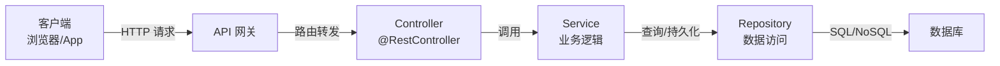
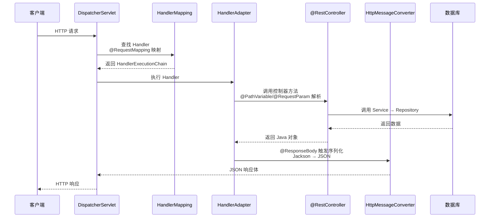
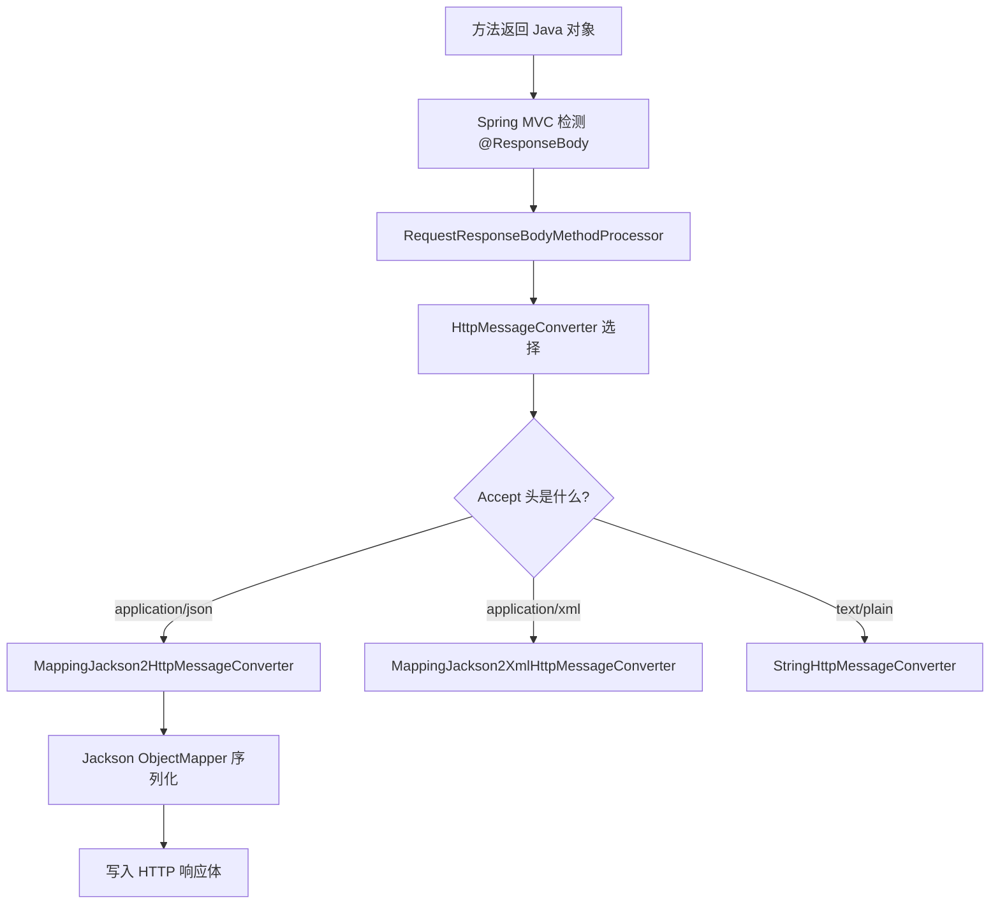
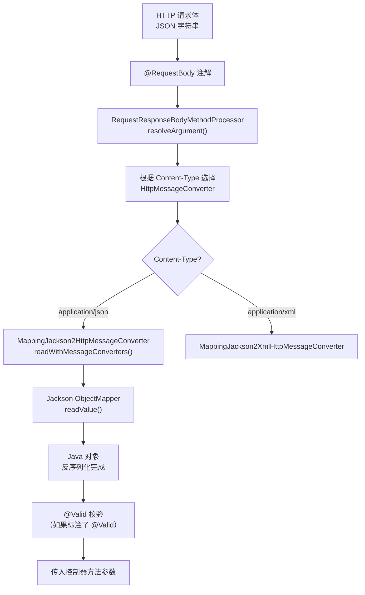

# RESTful API 注解详解

## RESTful API 核心概念

>  REST 架构的完整设计原则和最佳实践，请参考 [10-RESTfulAPI设计最佳实践](10-RESTfulAPI设计最佳实践)。本节仅做简要回顾。

### 什么是 REST

REST(Representational State Transfer,表述性状态转移)是一种软件架构风格,由 Roy Fielding 在 2000 年提出。RESTful API 是基于 REST 架构风格的 Web API 设计方法。

### REST 六大原则速览

| 原则 | 核心思想 | 关键约束 |
|------|---------|---------|
| 客户端-服务器分离 | UI 与数据存储分离 | 独立演化 |
| 无状态 | 每个请求自包含 | 不依赖服务端 Session |
| 可缓存 | 响应明确标识可缓存性 | Cache-Control / ETag |
| 统一接口 | 统一的 URI + HTTP 方法 | 资源标识 + 表述操作 |
| 分层系统 | 中间层透明 | 负载均衡 / 代理 / 缓存 |
| 按需代码(可选) | 服务器可扩展客户端 | 返回可执行代码 |



## RESTful API 注解详解

### Spring MVC 请求处理流程

理解注解之前，先看一个 HTTP 请求在 Spring MVC 中是如何被处理的：



::: tip 注解的本质
所有 REST 注解最终都服务于这个请求处理流程：`@RequestMapping` 系列负责**路由映射**，`@PathVariable`/`@RequestParam`/`@RequestBody` 负责**参数解析**，`@ResponseBody` 负责**响应序列化**。理解这条链路，就不需要死记硬背每个注解的用法。
:::

### @RestController

#### 概念

`@RestController` 是 Spring 4.0 引入的组合注解,相当于 `@Controller` + `@ResponseBody`。

#### 原理

```java
// @RestController 源码
@Target(ElementType.TYPE)
@Retention(RetentionPolicy.RUNTIME)
@Documented
@Controller
@ResponseBody
public @interface RestController {
    @AliasFor(annotation = Controller.class)
    String value() default "";
}
```

::: warning @ResponseBody 的类级作用
`@RestController` 中的 `@ResponseBody` 是**类级别**的——它告诉 Spring MVC：这个控制器中所有方法的返回值都应该通过 `HttpMessageConverter` 序列化后直接写入响应体，而不是交给视图解析器渲染。如果某个方法需要返回视图（如 Thymeleaf 页面），应该使用 `@Controller` 而不是 `@RestController`。
:::

#### @ResponseBody 的处理链路



::: details HttpMessageConverter 注册机制
Spring Boot 通过 `WebMvcAutoConfiguration` 自动注册以下 `HttpMessageConverter`：

1. `ByteArrayHttpMessageConverter` — 处理 byte[]
2. `StringHttpMessageConverter` — 处理 String
3. `ResourceHttpMessageConverter` — 处理 Resource
4. `MappingJackson2HttpMessageConverter` — 处理 JSON（默认）
5. `MappingJackson2XmlHttpMessageConverter` — 处理 XML（需引入 jackson-dataformat-xml）
6. `HttpMessageConverter` 的选择基于请求的 `Accept` 头和方法返回类型

可以通过实现 `WebMvcConfigurer.configureMessageConverters()` 自定义或替换默认的 Converter。
:::

#### 使用场景

所有返回 JSON/XML 数据的 RESTful API 控制器都应使用此注解。

#### 完整示例

```java
@RestController
@RequestMapping("/api/users")
public class UserController {
    
    private final UserService userService;
    
    // 构造器注入
    public UserController(UserService userService) {
        this.userService = userService;
    }
    
    @GetMapping
    public List<User> getAllUsers() {
        return userService.findAll();
    }
    
    @GetMapping("/{id}")
    public User getUserById(@PathVariable Long id) {
        return userService.findById(id);
    }
}
```

#### @RestController vs @Controller 对比

| 对比项 | @RestController | @Controller |
|--------|----------------|-------------|
| 返回值处理 | 自动序列化为 JSON | 解析为视图名称 |
| 使用场景 | RESTful API | 传统 Web 应用(返回页面) |
| 需要配合 | 不需要 @ResponseBody | 需要 @ResponseBody |
| 视图解析 | 不经过视图解析器 | 经过视图解析器 |

```java
// 传统 MVC 控制器
@Controller
public class PageController {
    
    @GetMapping("/users/page")
    public String userPage(Model model) {
        model.addAttribute("users", userService.findAll());
        return "users/list";  // 返回视图名称,解析为 /WEB-INF/views/users/list.jsp
    }
}

// RESTful API 控制器
@RestController
@RequestMapping("/api/users")
public class UserController {
    
    @GetMapping
    public List<User> getAllUsers() {
        return userService.findAll();  // 自动序列化为 JSON
    }
}
```

---

### @RequestMapping

#### 概念

`@RequestMapping` 是最基础的请求映射注解,用于将 HTTP 请求映射到控制器方法。

#### 核心属性

```java
@Target({ElementType.TYPE, ElementType.METHOD})
@Retention(RetentionPolicy.RUNTIME)
public @interface RequestMapping {
    String name() default "";
    @AliasFor("path")
    String[] value() default {};
    @AliasFor("value")
    String[] path() default {};
    RequestMethod[] method() default {};
    String[] params() default {};
    String[] headers() default {};
    String[] consumes() default {};
    String[] produces() default {};
}
```

#### 详细示例

##### 1. 基本用法

```java
@RestController
public class UserController {
    
    // 映射 GET 请求到 /users
    @RequestMapping(value = "/users", method = RequestMethod.GET)
    public List<User> getUsers() {
        return userService.findAll();
    }
    
    // 映射 POST 请求到 /users
    @RequestMapping(value = "/users", method = RequestMethod.POST)
    public User createUser(@RequestBody User user) {
        return userService.save(user);
    }
    
    // 映射多个路径
    @RequestMapping(value = {"/users", "/list"}, method = RequestMethod.GET)
    public List<User> listUsers() {
        return userService.findAll();
    }
}
```

##### 2. 类级别和方法级别组合

```java
@RestController
@RequestMapping("/api/users")  // 类级别:公共路径前缀
public class UserController {
    
    // 完整路径: /api/users
    @RequestMapping(method = RequestMethod.GET)
    public List<User> getUsers() {
        return userService.findAll();
    }
    
    // 完整路径: /api/users/{id}
    @RequestMapping(value = "/{id}", method = RequestMethod.GET)
    public User getUserById(@PathVariable Long id) {
        return userService.findById(id);
    }
    
    // 完整路径: /api/users/{id}/orders
    @RequestMapping(value = "/{id}/orders", method = RequestMethod.GET)
    public List<Order> getUserOrders(@PathVariable Long id) {
        return userService.findOrdersByUserId(id);
    }
}
```

##### 3. 限制请求参数和请求头

```java
@RestController
@RequestMapping("/api/users")
public class UserController {
    
    // 只处理包含 status 参数的请求
    @RequestMapping(value = "/search", method = RequestMethod.GET, params = "status")
    public List<User> getUsersByStatus(@RequestParam String status) {
        return userService.findByStatus(status);
    }
    
    // 只处理不包含 status 参数的请求
    @RequestMapping(value = "/search", method = RequestMethod.GET, params = "!status")
    public List<User> getAllUsers() {
        return userService.findAll();
    }
    
    // 只处理包含特定请求头的请求
    @RequestMapping(value = "/admin", method = RequestMethod.GET, 
                    headers = "X-Role=admin")
    public List<User> getAdminUsers() {
        return userService.findAdminUsers();
    }
}
```

##### 4. 限制请求和响应的 Content-Type

```java
@RestController
@RequestMapping("/api/users")
public class UserController {
    
    // 只处理 Content-Type 为 application/json 的请求
    @RequestMapping(method = RequestMethod.POST, 
                    consumes = "application/json")
    public User createUser(@RequestBody User user) {
        return userService.save(user);
    }
    
    // 只处理 Accept 为 application/json 的请求,返回 JSON
    @RequestMapping(method = RequestMethod.GET, 
                    produces = "application/json")
    public List<User> getUsersAsJson() {
        return userService.findAll();
    }
    
    // 返回 XML 格式
    @RequestMapping(method = RequestMethod.GET, 
                    produces = "application/xml")
    public List<User> getUsersAsXml() {
        return userService.findAll();
    }
}
```

#### 使用建议

- **优先使用组合注解**:@GetMapping、@PostMapping 等,更简洁
- **类级别定义公共路径**:避免重复代码
- **使用 produces/consumes**:明确 API 的输入输出格式

---

### 组合注解:@GetMapping、@PostMapping、@PutMapping、@DeleteMapping、@PatchMapping

#### 概念

Spring 4.3 引入的组合注解,是 `@RequestMapping` 的快捷方式,分别对应不同的 HTTP 方法。

#### 原理

```java
// @GetMapping 源码
@Target(ElementType.METHOD)
@Retention(RetentionPolicy.RUNTIME)
@Documented
@RequestMapping(method = RequestMethod.GET)
public @interface GetMapping {
    @AliasFor(annotation = RequestMapping.class)
    String name() default "";
    @AliasFor(annotation = RequestMapping.class)
    String[] value() default {};
    @AliasFor(annotation = RequestMapping.class)
    String[] path() default {};
    @AliasFor(annotation = RequestMapping.class)
    String[] params() default {};
    @AliasFor(annotation = RequestMapping.class)
    String[] headers() default {};
    @AliasFor(annotation = RequestMapping.class)
    String[] consumes() default {};
    @AliasFor(annotation = RequestMapping.class)
    String[] produces() default {};
}
```

#### 详细示例

```java
@RestController
@RequestMapping("/api/users")
public class UserController {
    
    // ========== @GetMapping:查询操作 ==========
    
    // GET /api/users - 获取用户列表
    @GetMapping
    public List<User> getAllUsers() {
        return userService.findAll();
    }
    
    // GET /api/users/123 - 获取单个用户
    @GetMapping("/{id}")
    public User getUserById(@PathVariable Long id) {
        return userService.findById(id);
    }
    
    // GET /api/users/search?name=张三 - 搜索用户
    @GetMapping("/search")
    public List<User> searchUsers(@RequestParam String name) {
        return userService.findByName(name);
    }
    
    // ========== @PostMapping:创建操作 ==========
    
    // POST /api/users - 创建用户
    @PostMapping
    @ResponseStatus(HttpStatus.CREATED)  // 返回201状态码
    public User createUser(@Valid @RequestBody UserDTO userDTO) {
        return userService.create(userDTO);
    }
    
    // POST /api/users/batch - 批量创建用户
    @PostMapping("/batch")
    @ResponseStatus(HttpStatus.CREATED)
    public List<User> createUsers(@Valid @RequestBody List<UserDTO> userDTOs) {
        return userService.createBatch(userDTOs);
    }
    
    // ========== @PutMapping:全量更新操作 ==========
    
    // PUT /api/users/123 - 全量更新用户
    @PutMapping("/{id}")
    public User updateUser(@PathVariable Long id, 
                          @Valid @RequestBody UserDTO userDTO) {
        return userService.update(id, userDTO);
    }
    
    // ========== @PatchMapping:部分更新操作 ==========
    
    // PATCH /api/users/123/status - 更新用户状态
    @PatchMapping("/{id}/status")
    public User updateStatus(@PathVariable Long id, 
                            @RequestParam String status) {
        return userService.updateStatus(id, status);
    }
    
    // ========== @DeleteMapping:删除操作 ==========
    
    // DELETE /api/users/123 - 删除用户
    @DeleteMapping("/{id}")
    @ResponseStatus(HttpStatus.NO_CONTENT)  // 返回204状态码
    public void deleteUser(@PathVariable Long id) {
        userService.delete(id);
    }
    
    // DELETE /api/users - 批量删除
    @DeleteMapping
    @ResponseStatus(HttpStatus.NO_CONTENT)
    public void deleteUsers(@RequestBody List<Long> ids) {
        userService.deleteBatch(ids);
    }
}
```

#### 组合注解对比表

| 注解 | HTTP 方法 | 典型用途 | 是否幂等 |
|------|----------|---------|---------|
| @GetMapping | GET | 查询资源 | √ 幂等 |
| @PostMapping | POST | 创建资源 | × 非幂等 |
| @PutMapping | PUT | 全量更新 | √ 幂等 |
| @PatchMapping | PATCH | 部分更新 | × 不保证幂等（依补丁语义而定） |
| @DeleteMapping | DELETE | 删除资源 | √ 幂等 |

#### 使用建议

1. **查询用 GET**:只读操作,不修改资源状态
2. **创建用 POST**:新增资源,非幂等
3. **全量更新用 PUT**:需要提供完整资源对象
4. **部分更新用 PATCH**:只更新指定字段
5. **删除用 DELETE**:删除资源

---

### @PathVariable

#### 概念

`@PathVariable` 用于将 URL 中的占位符参数绑定到控制器方法参数。

::: tip @PathVariable 的底层处理
`@PathVariable` 由 `PathVariableMethodArgumentResolver` 解析。Spring MVC 从 `HandlerMapping` 匹配到的 URI 模板变量中提取值，然后通过 `WebDataBinder` 进行类型转换（如 String → Long）。如果类型转换失败（如路径变量是 `/users/abc` 但参数类型是 Long），会抛出 `MethodArgumentTypeMismatchException`。
:::

#### 基本用法

```java
@RestController
@RequestMapping("/api/users")
public class UserController {
    
    // 单个路径变量
    @GetMapping("/{id}")
    public User getUserById(@PathVariable Long id) {
        return userService.findById(id);
    }
    
    // 多个路径变量
    @GetMapping("/{userId}/orders/{orderId}")
    public Order getUserOrder(@PathVariable Long userId, 
                             @PathVariable Long orderId) {
        return orderService.findByUserIdAndOrderId(userId, orderId);
    }
    
    // 路径变量名称不一致时,需要指定名称
    @GetMapping("/{userId}/orders/{orderId}")
    public Order getOrder(@PathVariable("userId") Long uid, 
                         @PathVariable("orderId") Long oid) {
        return orderService.findByUserIdAndOrderId(uid, oid);
    }
}
```

#### 正则表达式约束

```java
@RestController
@RequestMapping("/api/users")
public class UserController {
    
    // 只匹配数字ID
    @GetMapping("/{id:\\d+}")
    public User getUserById(@PathVariable Long id) {
        return userService.findById(id);
    }
    
    // 只匹配字母username
    @GetMapping("/{username:[a-zA-Z]+}")
    public User getUserByUsername(@PathVariable String username) {
        return userService.findByUsername(username);
    }
    
    // 匹配UUID
    @GetMapping("/{uuid:[0-9a-f]{8}-[0-9a-f]{4}-[0-9a-f]{4}-[0-9a-f]{4}-[0-9a-f]{12}}")
    public User getUserByUuid(@PathVariable String uuid) {
        return userService.findByUuid(uuid);
    }
}
```

#### 可选路径变量

```java
@RestController
@RequestMapping("/api")
public class UserController {
    
    // 使用 required = false 设置可选路径变量
    @GetMapping({"/users", "/users/{id}"})
    public Object getUsersOrUser(@PathVariable(required = false) Long id) {
        if (id == null) {
            return userService.findAll();
        }
        return userService.findById(id);
    }
}
```

#### 使用 Map 接收所有路径变量

```java
@RestController
@RequestMapping("/api")
public class UserController {
    
    @GetMapping("/users/{userId}/orders/{orderId}")
    public Order getOrder(@PathVariable Map<String, String> pathVars) {
        Long userId = Long.parseLong(pathVars.get("userId"));
        Long orderId = Long.parseLong(pathVars.get("orderId"));
        return orderService.findByUserIdAndOrderId(userId, orderId);
    }
}
```

---

### @RequestParam

#### 概念

`@RequestParam` 用于将请求参数(查询参数或表单参数)绑定到控制器方法参数。

::: warning @RequestParam 的 required 默认行为
`@RequestParam` 的 `required` 属性默认为 `true`，如果请求中没有该参数，Spring 会抛出 `MissingServletRequestParameterException`。对于可选参数，务必设置 `required = false` 或提供 `defaultValue`。
:::

#### 基本用法

```java
@RestController
@RequestMapping("/api/users")
public class UserController {
    
    // 必填参数
    @GetMapping("/search")
    public List<User> searchByName(@RequestParam String name) {
        return userService.findByName(name);
    }
    
    // 可选参数
    @GetMapping("/list")
    public List<User> listUsers(@RequestParam(required = false) String status) {
        if (status == null) {
            return userService.findAll();
        }
        return userService.findByStatus(status);
    }
    
    // 设置默认值
    @GetMapping
    public Page<User> getUsers(
            @RequestParam(defaultValue = "0") int page,
            @RequestParam(defaultValue = "10") int size,
            @RequestParam(defaultValue = "id") String sort) {
        return userService.findAll(PageRequest.of(page, size, Sort.by(sort)));
    }
    
    // 参数名称不一致时,需要指定名称
    @GetMapping("/search")
    public List<User> search(@RequestParam("name") String username) {
        return userService.findByName(username);
    }
}
```

#### 数组和列表参数

```java
@RestController
@RequestMapping("/api/users")
public class UserController {
    
    // 接收多个同名参数(数组)
    @GetMapping("/by-ids")
    public List<User> getUsersByIds(@RequestParam Long[] ids) {
        return userService.findByIds(Arrays.asList(ids));
    }
    
    // 接收多个同名参数(List)
    @GetMapping("/by-status")
    public List<User> getUsersByStatuses(@RequestParam List<String> statuses) {
        return userService.findByStatuses(statuses);
    }
    
    // 请求示例: /api/users/by-status?statuses=ACTIVE&statuses=INACTIVE
}
```

#### 使用 Map 接收所有参数

```java
@RestController
@RequestMapping("/api/users")
public class UserController {
    
    @GetMapping("/search")
    public List<User> searchUsers(@RequestParam Map<String, String> params) {
        String name = params.get("name");
        String status = params.get("status");
        return userService.search(name, status);
    }
    
    // 请求示例: /api/users/search?name=张三&status=ACTIVE
}
```

#### 接收复杂对象

```java
// 定义参数对象
public class UserQueryDTO {
    private String name;
    private String status;
    private Integer page = 0;
    private Integer size = 10;
    
    // getters and setters
}

@RestController
@RequestMapping("/api/users")
public class UserController {
    
    // 使用对象接收多个参数
    @GetMapping("/query")
    public Page<User> queryUsers(UserQueryDTO query) {
        return userService.query(query);
    }
    
    // 请求示例: /api/users/query?name=张三&status=ACTIVE&page=0&size=10
}
```

#### @RequestParam vs @PathVariable 对比

| 对比项 | @RequestParam | @PathVariable |
|--------|--------------|--------------|
| 参数位置 | URL 查询参数 | URL 路径的一部分 |
| 适用场景 | 可选参数、过滤条件、分页参数 | 资源标识符 |
| URL 示例 | /users?name=张三 | /users/123 |
| 可选性 | 默认必填,可设置 required=false | 默认必填,可设置 required=false |
| 语义 | 查询条件 | 资源定位 |

**使用建议**:
- 资源标识符用 `@PathVariable`:用户ID、订单ID等
- 查询条件用 `@RequestParam`:搜索关键词、状态、分页参数等

---

### @RequestBody

#### 概念

`@RequestBody` 用于将 HTTP 请求体(body)绑定到控制器方法参数,通常用于接收 JSON 或 XML 格式的数据。

#### 原理

1. Spring 使用 `HttpMessageConverter` 将请求体反序列化为 Java 对象
2. 默认使用 `Jackson` 将 JSON 转换为 Java 对象
3. 可以通过 `consumes` 属性指定 Content-Type



::: danger @RequestBody 反序列化失败的常见原因
1. **JSON 字段名与 Java 属性名不匹配**：Jackson 默认使用严格匹配，字段名不一致会导致 `UnrecognizedPropertyException`。解决方式：使用 `@JsonProperty` 映射或配置 `ObjectMapper.configure(DeserializationFeature.FAIL_ON_UNKNOWN_PROPERTIES, false)`
2. **日期格式不兼容**：Jackson 默认不支持 `yyyy-MM-dd` 格式。解决方式：使用 `@JsonFormat(pattern = "yyyy-MM-dd")`
3. **嵌套对象为 null**：前端未传递嵌套对象时，Jackson 会将其设为 null，而非创建空对象。解决方式：使用 `@JsonDeserialize` 或在 DTO 中初始化默认值
:::

#### 基本用法

```java
// DTO 定义
public class UserDTO {
    @NotBlank(message = "用户名不能为空")
    private String username;
    
    @Email(message = "邮箱格式不正确")
    private String email;
    
    @Pattern(regexp = "^1[3-9]\\d{9}$", message = "手机号格式不正确")
    private String phone;
    
    // getters and setters
}

@RestController
@RequestMapping("/api/users")
public class UserController {
    
    // 接收 JSON 对象
    @PostMapping
    @ResponseStatus(HttpStatus.CREATED)
    public User createUser(@Valid @RequestBody UserDTO userDTO) {
        return userService.create(userDTO);
    }
    
    // 接收 JSON 数组
    @PostMapping("/batch")
    @ResponseStatus(HttpStatus.CREATED)
    public List<User> createUsers(@Valid @RequestBody List<UserDTO> userDTOs) {
        return userService.createBatch(userDTOs);
    }
}
```

#### 请求示例

```http
POST /api/users HTTP/1.1
Content-Type: application/json

{
  "username": "zhangsan",
  "email": "zhangsan@example.com",
  "phone": "13800138000"
}
```

#### 接收 Map 和 JsonNode

```java
@RestController
@RequestMapping("/api/users")
public class UserController {
    
    // 接收 Map(字段不确定时)
    @PostMapping("/dynamic")
    public User createDynamicUser(@RequestBody Map<String, Object> userData) {
        return userService.createDynamic(userData);
    }
    
    // 接收 JsonNode(需要灵活处理时)
    @PostMapping("/flexible")
    public User createFlexibleUser(@RequestBody JsonNode userData) {
        String username = userData.get("username").asText();
        // 灵活处理字段
        return userService.create(username, userData);
    }
}
```

#### 多个 @RequestBody 参数

**注意**:一个方法只能有一个 `@RequestBody` 参数,如果需要多个参数,应该组合成一个对象。

```java
// × 错误:多个 @RequestBody
@PostMapping("/wrong")
public User create(@RequestBody UserDTO user, @RequestBody AddressDTO address) {
    // 这样写会报错
}

// √ 正确:组合成一个对象
public class CreateUserRequest {
    private UserDTO user;
    private AddressDTO address;
    // getters and setters
}

@PostMapping("/correct")
public User create(@RequestBody CreateUserRequest request) {
    return userService.create(request.getUser(), request.getAddress());
}
```

#### 与 @Valid 配合使用

```java
@RestController
@RequestMapping("/api/users")
public class UserController {
    
    @PostMapping
    public ResponseEntity<?> createUser(@Valid @RequestBody UserDTO userDTO,
                                        BindingResult bindingResult) {
        // 手动校验
        if (bindingResult.hasErrors()) {
            List<String> errors = bindingResult.getFieldErrors().stream()
                    .map(error -> error.getField() + ": " + error.getDefaultMessage())
                    .collect(Collectors.toList());
            return ResponseEntity.badRequest().body(errors);
        }
        
        User user = userService.create(userDTO);
        return ResponseEntity.status(HttpStatus.CREATED).body(user);
    }
}

// 或使用全局异常处理器
@RestControllerAdvice
public class GlobalExceptionHandler {
    
    @ExceptionHandler(MethodArgumentNotValidException.class)
    public ResponseEntity<Map<String, String>> handleValidationException(
            MethodArgumentNotValidException ex) {
        Map<String, String> errors = new HashMap<>();
        ex.getBindingResult().getFieldErrors().forEach(error -> 
            errors.put(error.getField(), error.getDefaultMessage())
        );
        return ResponseEntity.badRequest().body(errors);
    }
}
```

---

### @ResponseBody

#### 概念

`@ResponseBody` 用于将控制器方法的返回值直接作为 HTTP 响应体返回,而不是解析为视图名称。

#### 使用场景

1. **方法级别**:单个方法返回 JSON
2. **类级别**:配合 `@Controller` 实现类似 `@RestController` 的效果

#### 示例

```java
// 方式1:使用 @Controller + @ResponseBody
@Controller
@RequestMapping("/api/users")
public class UserController {
    
    @GetMapping("/{id}")
    @ResponseBody  // 方法级别
    public User getUserById(@PathVariable Long id) {
        return userService.findById(id);
    }
}

// 方式2:类级别使用 @ResponseBody
@Controller
@ResponseBody  // 类级别:所有方法都返回 JSON
@RequestMapping("/api/users")
public class UserController {
    
    @GetMapping("/{id}")
    public User getUserById(@PathVariable Long id) {
        return userService.findById(id);
    }
}

// 方式3:使用 @RestController(推荐)
@RestController  // 相当于 @Controller + @ResponseBody
@RequestMapping("/api/users")
public class UserController {
    
    @GetMapping("/{id}")
    public User getUserById(@PathVariable Long id) {
        return userService.findById(id);
    }
}
```

#### 返回类型处理

```java
@RestController
@RequestMapping("/api/users")
public class UserController {
    
    // 返回对象:自动序列化为 JSON
    @GetMapping("/{id}")
    public User getUserById(@PathVariable Long id) {
        return userService.findById(id);
    }
    
    // 返回集合:序列化为 JSON 数组
    @GetMapping
    public List<User> getAllUsers() {
        return userService.findAll();
    }
    
    // 返回 Map:序列化为 JSON 对象
    @GetMapping("/stats")
    public Map<String, Object> getStats() {
        Map<String, Object> stats = new HashMap<>();
        stats.put("total", userService.count());
        stats.put("active", userService.countByStatus("ACTIVE"));
        return stats;
    }
    
    // 返回 String:直接返回字符串
    @GetMapping("/greeting")
    public String greeting() {
        return "Hello, World!";
    }
    
    // 返回 void:空响应体
    @DeleteMapping("/{id}")
    @ResponseStatus(HttpStatus.NO_CONTENT)
    public void deleteUser(@PathVariable Long id) {
        userService.delete(id);
    }
}
```

---

### @ResponseStatus

#### 概念

`@ResponseStatus` 用于指定响应的 HTTP 状态码和原因短语。

#### 使用场景

1. **方法级别**:指定特定方法的状态码
2. **异常处理器**:配合 `@ExceptionHandler` 使用
3. **自定义异常**:指定异常对应的状态码

#### 示例

##### 1. 方法级别使用

```java
@RestController
@RequestMapping("/api/users")
public class UserController {
    
    // 创建成功返回 201
    @PostMapping
    @ResponseStatus(HttpStatus.CREATED)
    public User createUser(@RequestBody UserDTO userDTO) {
        return userService.create(userDTO);
    }
    
    // 删除成功返回 204
    @DeleteMapping("/{id}")
    @ResponseStatus(HttpStatus.NO_CONTENT)
    public void deleteUser(@PathVariable Long id) {
        userService.delete(id);
    }
    
    // 自定义状态码和原因
    @PostMapping("/import")
    @ResponseStatus(value = HttpStatus.ACCEPTED, reason = "Import task submitted")
    public void importUsers(@RequestBody MultipartFile file) {
        asyncImportService.submit(file);
    }
}
```

##### 2. 自定义异常使用

```java
// 自定义异常
@ResponseStatus(value = HttpStatus.NOT_FOUND, reason = "User not found")
public class UserNotFoundException extends RuntimeException {
    public UserNotFoundException(Long id) {
        super("User not found with id: " + id);
    }
}

// 控制器使用
@RestController
@RequestMapping("/api/users")
public class UserController {
    
    @GetMapping("/{id}")
    public User getUserById(@PathVariable Long id) {
        return userService.findById(id)
                .orElseThrow(() -> new UserNotFoundException(id));
    }
}
```

##### 3. 异常处理器使用

```java
@RestControllerAdvice
public class GlobalExceptionHandler {
    
    @ExceptionHandler(ResourceNotFoundException.class)
    @ResponseStatus(HttpStatus.NOT_FOUND)
    public ErrorResponse handleResourceNotFound(ResourceNotFoundException ex) {
        return new ErrorResponse("NOT_FOUND", ex.getMessage());
    }
    
    @ExceptionHandler(DuplicateResourceException.class)
    @ResponseStatus(HttpStatus.CONFLICT)
    public ErrorResponse handleDuplicateResource(DuplicateResourceException ex) {
        return new ErrorResponse("CONFLICT", ex.getMessage());
    }
    
    @ExceptionHandler(MethodArgumentNotValidException.class)
    @ResponseStatus(HttpStatus.BAD_REQUEST)
    public ErrorResponse handleValidationException(MethodArgumentNotValidException ex) {
        List<String> errors = ex.getBindingResult().getFieldErrors().stream()
                .map(error -> error.getField() + ": " + error.getDefaultMessage())
                .collect(Collectors.toList());
        return new ErrorResponse("VALIDATION_FAILED", String.join(", ", errors));
    }
}
```

---

### @RestControllerAdvice

#### 概念

`@RestControllerAdvice` 是 `@ControllerAdvice` + `@ResponseBody` 的组合注解,用于定义全局异常处理器或全局数据绑定。

#### 使用场景

1. **全局异常处理**:统一处理控制器抛出的异常
2. **全局数据绑定**:添加全局属性到所有模型
3. **全局数据预处理**:预处理所有请求参数

#### 全局异常处理

```java
// 统一错误响应格式
public class ErrorResponse {
    private String code;
    private String message;
    private List<String> details;
    private LocalDateTime timestamp;
    
    public ErrorResponse(String code, String message) {
        this.code = code;
        this.message = message;
        this.timestamp = LocalDateTime.now();
    }
    
    // getters and setters
}

// 全局异常处理器
@RestControllerAdvice
public class GlobalExceptionHandler {
    
    // 处理自定义业务异常
    @ExceptionHandler(BusinessException.class)
    public ResponseEntity<ErrorResponse> handleBusinessException(BusinessException ex) {
        ErrorResponse error = new ErrorResponse(ex.getCode(), ex.getMessage());
        return ResponseEntity.status(ex.getHttpStatus()).body(error);
    }
    
    // 处理资源不存在异常
    @ExceptionHandler(ResourceNotFoundException.class)
    @ResponseStatus(HttpStatus.NOT_FOUND)
    public ErrorResponse handleResourceNotFound(ResourceNotFoundException ex) {
        ErrorResponse error = new ErrorResponse("RESOURCE_NOT_FOUND", ex.getMessage());
        return error;
    }
    
    // 处理参数校验异常
    @ExceptionHandler(MethodArgumentNotValidException.class)
    @ResponseStatus(HttpStatus.BAD_REQUEST)
    public ErrorResponse handleValidationException(MethodArgumentNotValidException ex) {
        List<String> details = ex.getBindingResult().getFieldErrors().stream()
                .map(error -> error.getField() + ": " + error.getDefaultMessage())
                .collect(Collectors.toList());
        
        ErrorResponse error = new ErrorResponse("VALIDATION_FAILED", "参数校验失败");
        error.setDetails(details);
        return error;
    }
    
    // 处理约束违反异常
    @ExceptionHandler(ConstraintViolationException.class)
    @ResponseStatus(HttpStatus.BAD_REQUEST)
    public ErrorResponse handleConstraintViolation(ConstraintViolationException ex) {
        List<String> details = ex.getConstraintViolations().stream()
                .map(violation -> violation.getPropertyPath() + ": " + violation.getMessage())
                .collect(Collectors.toList());
        
        ErrorResponse error = new ErrorResponse("CONSTRAINT_VIOLATION", "约束违反");
        error.setDetails(details);
        return error;
    }
    
    // 处理 HTTP 消息不可读异常
    @ExceptionHandler(HttpMessageNotReadableException.class)
    @ResponseStatus(HttpStatus.BAD_REQUEST)
    public ErrorResponse handleHttpMessageNotReadable(HttpMessageNotReadableException ex) {
        return new ErrorResponse("INVALID_JSON", "请求体格式错误");
    }
    
    // 处理请求方法不支持异常
    @ExceptionHandler(HttpRequestMethodNotSupportedException.class)
    @ResponseStatus(HttpStatus.METHOD_NOT_ALLOWED)
    public ErrorResponse handleMethodNotSupported(HttpRequestMethodNotSupportedException ex) {
        String message = String.format("不支持 %s 方法,支持的方法: %s", 
                ex.getMethod(), 
                String.join(", ", ex.getSupportedMethods()));
        return new ErrorResponse("METHOD_NOT_ALLOWED", message);
    }
    
    // 处理所有未捕获异常
    @ExceptionHandler(Exception.class)
    @ResponseStatus(HttpStatus.INTERNAL_SERVER_ERROR)
    public ErrorResponse handleAllExceptions(Exception ex) {
        // 记录日志
        log.error("Unhandled exception", ex);
        return new ErrorResponse("INTERNAL_ERROR", "服务器内部错误");
    }
}
```

#### 全局数据绑定

```java
@RestControllerAdvice
public class GlobalDataAdvice {
    
    // 添加全局属性到所有模型
    @ModelAttribute
    public void addGlobalAttributes(Model model) {
        model.addAttribute("apiVersion", "1.0.0");
        model.addAttribute("timestamp", LocalDateTime.now());
    }
}
```

#### 全局数据预处理

```java
@RestControllerAdvice
public class GlobalDataPreprocessor {
    
    // 预处理所有请求参数
    @InitBinder
    public void initBinder(WebDataBinder binder) {
        // 注册自定义编辑器
        binder.registerCustomEditor(String.class, new StringTrimmerEditor(true));
        
        // 注册自定义日期格式
        SimpleDateFormat dateFormat = new SimpleDateFormat("yyyy-MM-dd");
        dateFormat.setLenient(false);
        binder.registerCustomEditor(Date.class, new CustomDateEditor(dateFormat, true));
    }
}
```

---

## 请求参数接收方式详解

### 完整对比表

| 接收方式 | 注解 | 参数位置 | 适用场景 | 示例 |
|---------|------|---------|---------|------|
| URL路径参数 | @PathVariable | URL路径 | 资源标识符 | /users/{id} |
| 查询参数 | @RequestParam | URL查询串 | 过滤、分页、搜索 | /users?name=张三 |
| 请求体 | @RequestBody | HTTP Body | POST/PUT 数据 | {"name":"张三"} |
| 请求头 | @RequestHeader | HTTP Header | 认证信息、元数据 | Authorization: Bearer xxx |
| Cookie | @CookieValue | Cookie | 会话标识 | JSESSIONID=xxx |
| 表单数据 | 无需注解 | 表单提交 | 文件上传、表单 | multipart/form-data |

### 实战示例

```java
@RestController
@RequestMapping("/api")
public class ApiController {
    
    // ========== URL 路径参数 @PathVariable ==========
    
    // GET /api/users/123
    @GetMapping("/users/{id}")
    public User getUser(@PathVariable Long id) {
        return userService.findById(id);
    }
    
    // GET /api/users/123/orders/456
    @GetMapping("/users/{userId}/orders/{orderId}")
    public Order getOrder(@PathVariable Long userId, 
                         @PathVariable Long orderId) {
        return orderService.findByUserIdAndOrderId(userId, orderId);
    }
    
    // ========== 查询参数 @RequestParam ==========
    
    // GET /api/users?page=0&size=10&sort=name,desc
    @GetMapping("/users")
    public Page<User> getUsers(
            @RequestParam(defaultValue = "0") int page,
            @RequestParam(defaultValue = "10") int size,
            @RequestParam(defaultValue = "id") String sort) {
        return userService.findAll(PageRequest.of(page, size, Sort.by(sort)));
    }
    
    // GET /api/users/search?name=张三&status=ACTIVE
    @GetMapping("/users/search")
    public List<User> searchUsers(
            @RequestParam(required = false) String name,
            @RequestParam(required = false) String status) {
        return userService.search(name, status);
    }
    
    // GET /api/users/by-ids?ids=1,2,3 或 ids=1&ids=2&ids=3
    @GetMapping("/users/by-ids")
    public List<User> getUsersByIds(@RequestParam List<Long> ids) {
        return userService.findByIds(ids);
    }
    
    // ========== 请求体 @RequestBody ==========
    
    // POST /api/users
    @PostMapping("/users")
    @ResponseStatus(HttpStatus.CREATED)
    public User createUser(@Valid @RequestBody UserDTO userDTO) {
        return userService.create(userDTO);
    }
    
    // PUT /api/users/123
    @PutMapping("/users/{id}")
    public User updateUser(@PathVariable Long id, 
                          @Valid @RequestBody UserDTO userDTO) {
        return userService.update(id, userDTO);
    }
    
    // ========== 请求头 @RequestHeader ==========
    
    // 获取单个请求头
    @GetMapping("/me")
    public User getCurrentUser(@RequestHeader("Authorization") String token) {
        return userService.findByToken(token);
    }
    
    // 获取所有请求头
    @GetMapping("/headers")
    public Map<String, String> getHeaders(@RequestHeader Map<String, String> headers) {
        return headers;
    }
    
    // ========== Cookie @CookieValue ==========
    
    @GetMapping("/session")
    public String getSession(@CookieValue("JSESSIONID") String sessionId) {
        return "Session ID: " + sessionId;
    }
    
    // ========== 表单数据和文件上传 ==========
    
    @PostMapping("/upload")
    public String uploadFile(@RequestParam("file") MultipartFile file,
                            @RequestParam("description") String description) {
        // 处理文件上传
        fileService.upload(file, description);
        return "上传成功";
    }
    
    // ========== 组合使用 ==========
    
    // PUT /api/users/123/profile?notify=true
    @PutMapping("/users/{id}/profile")
    public User updateProfile(@PathVariable Long id,
                             @RequestParam(defaultValue = "false") boolean notify,
                             @Valid @RequestBody ProfileDTO profileDTO,
                             @RequestHeader("Authorization") String token) {
        return userService.updateProfile(id, profileDTO, notify, token);
    }
}
```

---

## 响应数据封装

### 统一响应格式设计

#### 标准响应结构

```java
// 统一响应格式
public class ApiResponse<T> {
    private Integer code;       // 状态码
    private String message;     // 提示信息
    private T data;             // 业务数据
    private LocalDateTime timestamp;  // 时间戳
    
    // 成功响应
    public static <T> ApiResponse<T> success(T data) {
        ApiResponse<T> response = new ApiResponse<>();
        response.setCode(200);
        response.setMessage("操作成功");
        response.setData(data);
        response.setTimestamp(LocalDateTime.now());
        return response;
    }
    
    // 成功响应(自定义消息)
    public static <T> ApiResponse<T> success(String message, T data) {
        ApiResponse<T> response = new ApiResponse<>();
        response.setCode(200);
        response.setMessage(message);
        response.setData(data);
        response.setTimestamp(LocalDateTime.now());
        return response;
    }
    
    // 失败响应
    public static <T> ApiResponse<T> error(Integer code, String message) {
        ApiResponse<T> response = new ApiResponse<>();
        response.setCode(code);
        response.setMessage(message);
        response.setTimestamp(LocalDateTime.now());
        return response;
    }
    
    // getters and setters
}
```

#### 分页响应结构

```java
// 分页响应
public class PageResponse<T> {
    private List<T> content;      // 数据列表
    private Long total;           // 总记录数
    private Integer page;         // 当前页码
    private Integer size;         // 每页大小
    private Integer totalPages;   // 总页数
    
    public static <T> PageResponse<T> of(Page<T> page) {
        PageResponse<T> response = new PageResponse<>();
        response.setContent(page.getContent());
        response.setTotal(page.getTotalElements());
        response.setPage(page.getNumber());
        response.setSize(page.getSize());
        response.setTotalPages(page.getTotalPages());
        return response;
    }
    
    // getters and setters
}
```

### 使用示例

```java
@RestController
@RequestMapping("/api/users")
public class UserController {
    
    // 返回单个对象
    @GetMapping("/{id}")
    public ApiResponse<User> getUserById(@PathVariable Long id) {
        User user = userService.findById(id);
        return ApiResponse.success(user);
    }
    
    // 返回列表
    @GetMapping
    public ApiResponse<List<User>> getAllUsers() {
        List<User> users = userService.findAll();
        return ApiResponse.success(users);
    }
    
    // 返回分页数据
    @GetMapping("/page")
    public ApiResponse<PageResponse<User>> getUsersPage(
            @RequestParam(defaultValue = "0") int page,
            @RequestParam(defaultValue = "10") int size) {
        Page<User> userPage = userService.findAll(PageRequest.of(page, size));
        return ApiResponse.success(PageResponse.of(userPage));
    }
    
    // 创建成功
    @PostMapping
    public ApiResponse<User> createUser(@Valid @RequestBody UserDTO userDTO) {
        User user = userService.create(userDTO);
        return ApiResponse.success("创建成功", user);
    }
    
    // 删除成功(无返回数据)
    @DeleteMapping("/{id}")
    public ApiResponse<Void> deleteUser(@PathVariable Long id) {
        userService.delete(id);
        return ApiResponse.success("删除成功", null);
    }
}
```

### 使用 ResponseEntity 精确控制

```java
@RestController
@RequestMapping("/api/users")
public class UserController {
    
    // 使用 ResponseEntity 控制状态码和响应头
    @PostMapping
    public ResponseEntity<ApiResponse<User>> createUser(
            @Valid @RequestBody UserDTO userDTO,
            UriComponentsBuilder uriBuilder) {
        
        User user = userService.create(userDTO);
        
        // 构建 location 响应头
        URI location = uriBuilder.path("/api/users/{id}")
                .buildAndExpand(user.getId())
                .toUri();
        
        ApiResponse<User> response = ApiResponse.success("创建成功", user);
        
        return ResponseEntity.created(location)  // 201 Created
                .body(response);
    }
    
    // 根据条件返回不同状态码
    @GetMapping("/{id}")
    public ResponseEntity<ApiResponse<User>> getUserById(@PathVariable Long id) {
        return userService.findById(id)
                .map(user -> ResponseEntity.ok(ApiResponse.success(user)))
                .orElse(ResponseEntity.notFound().build());
    }
    
    // 缓存控制
    @GetMapping("/{id}/details")
    public ResponseEntity<User> getUserDetails(@PathVariable Long id,
                                              @RequestHeader(value = "If-None-Match", required = false) String eTag) {
        User user = userService.findById(id);
        String currentETag = String.valueOf(user.getVersion());
        
        // 如果客户端缓存未修改,返回 304
        if (currentETag.equals(eTag)) {
            return ResponseEntity.status(HttpStatus.NOT_MODIFIED).build();
        }
        
        // 返回带缓存的响应
        return ResponseEntity.ok()
                .eTag(currentETag)
                .cacheControl(CacheControl.maxAge(3600, TimeUnit.SECONDS))
                .body(user);
    }
}
```

---

## RESTful 最佳实践

### 1. 版本控制

#### URL 路径版本控制

```java
// 版本1 API
@RestController
@RequestMapping("/api/v1/users")
public class UserV1Controller {
    @GetMapping("/{id}")
    public UserV1 getUser(@PathVariable Long id) {
        return userService.findByIdV1(id);
    }
}

// 版本2 API
@RestController
@RequestMapping("/api/v2/users")
public class UserV2Controller {
    @GetMapping("/{id}")
    public UserV2 getUser(@PathVariable Long id) {
        return userService.findByIdV2(id);
    }
}
```

#### 请求头版本控制

```java
@RestController
@RequestMapping("/api/users")
public class UserController {
    
    @GetMapping(value = "/{id}", headers = "X-API-Version=1")
    public UserV1 getUserV1(@PathVariable Long id) {
        return userService.findByIdV1(id);
    }
    
    @GetMapping(value = "/{id}", headers = "X-API-Version=2")
    public UserV2 getUserV2(@PathVariable Long id) {
        return userService.findByIdV2(id);
    }
}
```

### 2. 分页、过滤、排序

```java
@RestController
@RequestMapping("/api/users")
public class UserController {
    
    @GetMapping
    public PageResponse<User> getUsers(
            @RequestParam(defaultValue = "0") int page,
            @RequestParam(defaultValue = "10") int size,
            @RequestParam(defaultValue = "id") String sort,
            @RequestParam(defaultValue = "asc") String direction,
            @RequestParam(required = false) String name,
            @RequestParam(required = false) String status,
            @RequestParam(required = false) @DateTimeFormat(pattern = "yyyy-MM-dd") LocalDate startDate,
            @RequestParam(required = false) @DateTimeFormat(pattern = "yyyy-MM-dd") LocalDate endDate) {
        
        // 构建查询条件
        UserQuery query = UserQuery.builder()
                .name(name)
                .status(status)
                .startDate(startDate)
                .endDate(endDate)
                .build();
        
        // 构建分页排序
        Sort.Direction sortDirection = Sort.Direction.fromString(direction);
        Pageable pageable = PageRequest.of(page, size, Sort.by(sortDirection, sort));
        
        Page<User> userPage = userService.query(query, pageable);
        return PageResponse.of(userPage);
    }
}
```

### 3. HATEOAS 实现

```java
@RestController
@RequestMapping("/api/users")
public class UserController {
    
    @GetMapping("/{id}")
    public EntityModel<User> getUserById(@PathVariable Long id) {
        User user = userService.findById(id);
        
        // 添加相关链接
        return EntityModel.of(user,
                linkTo(methodOn(UserController.class).getUserById(id)).withSelfRel(),
                linkTo(methodOn(UserController.class).getAllUsers()).withRel("users"),
                linkTo(methodOn(OrderController.class).getUserOrders(id)).withRel("orders"),
                linkTo(methodOn(UserController.class).updateUser(id, null)).withRel("update"),
                linkTo(methodOn(UserController.class).deleteUser(id)).withRel("delete")
        );
    }
    
    @GetMapping
    public CollectionModel<EntityModel<User>> getAllUsers() {
        List<User> users = userService.findAll();
        
        List<EntityModel<User>> userModels = users.stream()
                .map(user -> EntityModel.of(user,
                        linkTo(methodOn(UserController.class).getUserById(user.getId())).withSelfRel()))
                .collect(Collectors.toList());
        
        return CollectionModel.of(userModels,
                linkTo(methodOn(UserController.class).getAllUsers()).withSelfRel());
    }
}
```

### 4. 限流和防刷

```java
// Resilience4j 的 @RateLimiter（需引入 resilience4j-spring-boot 依赖与 AOP 支持），
// 注解只声明实例名，限流参数在 application.yml 中配置
@RestController
@RequestMapping("/api/users")
public class UserController {
    
    @GetMapping("/{id}")
    @RateLimiter(name = "getUserById")  // 限流参数见下方 yaml
    public User getUserById(@PathVariable Long id) {
        return userService.findById(id);
    }
    
    @PostMapping
    @RateLimiter(name = "createUser")
    @ResponseStatus(HttpStatus.CREATED)
    public User createUser(@Valid @RequestBody UserDTO userDTO) {
        return userService.create(userDTO);
    }
}
```

```yaml
# application.yml：每秒最多放行 10 个请求（createUser 实例同理单独配置）
resilience4j:
  ratelimiter:
    instances:
      getUserById:
        limit-for-period: 10
        limit-refresh-period: 1s
        timeout-duration: 0
```

### 5. 异步处理

```java
@RestController
@RequestMapping("/api/users")
public class UserController {
    
    @PostMapping("/import")
    @ResponseStatus(HttpStatus.ACCEPTED)
    public AsyncTask importUsers(@RequestParam("file") MultipartFile file) {
        String taskId = asyncImportService.submit(file);
        return new AsyncTask(taskId, "IMPORT", "PENDING");
    }
    
    @GetMapping("/tasks/{taskId}")
    public AsyncTask getTaskStatus(@PathVariable String taskId) {
        return asyncImportService.getStatus(taskId);
    }
}

// 异步任务状态
public class AsyncTask {
    private String taskId;
    private String type;
    private String status;  // PENDING, PROCESSING, COMPLETED, FAILED
    private Integer progress;  // 0-100
    private String result;
    private LocalDateTime createTime;
    private LocalDateTime updateTime;
    
    // getters and setters
}
```

---

## 完整实战案例:用户管理 CRUD 接口

### 1. 实体类和 DTO 设计

```java
// 实体类
@Entity
@Table(name = "users")
public class User {
    @Id
    @GeneratedValue(strategy = GenerationType.IDENTITY)
    private Long id;
    
    @NotBlank
    @Column(unique = true)
    private String username;
    
    @Email
    private String email;
    
    @Pattern(regexp = "^1[3-9]\\d{9}$")
    private String phone;
    
    @Enumerated(EnumType.STRING)
    private UserStatus status = UserStatus.ACTIVE;
    
    private LocalDateTime createdAt;
    private LocalDateTime updatedAt;
    
    @Version
    private Long version;
    
    // getters and setters
}

// 创建 DTO
public class UserCreateDTO {
    @NotBlank(message = "用户名不能为空")
    @Size(min = 3, max = 20, message = "用户名长度必须在3-20之间")
    private String username;
    
    @Email(message = "邮箱格式不正确")
    @NotBlank(message = "邮箱不能为空")
    private String email;
    
    @Pattern(regexp = "^1[3-9]\\d{9}$", message = "手机号格式不正确")
    private String phone;
    
    // getters and setters
}

// 更新 DTO
public class UserUpdateDTO {
    @Email(message = "邮箱格式不正确")
    private String email;
    
    @Pattern(regexp = "^1[3-9]\\d{9}$", message = "手机号格式不正确")
    private String phone;
    
    // getters and setters
}

// 查询 DTO
public class UserQueryDTO {
    private String username;
    private String email;
    private UserStatus status;
    private LocalDate startDate;
    private LocalDate endDate;
    
    // getters and setters
}
```

### 2. 完整控制器实现

```java
@RestController
@RequestMapping("/api/v1/users")
@Validated
public class UserController {
    
    private final UserService userService;
    
    public UserController(UserService userService) {
        this.userService = userService;
    }
    
    // ========== 查询操作 ==========
    
    /**
     * 获取用户列表(分页)
     * GET /api/v1/users
     */
    @GetMapping
    public ApiResponse<PageResponse<User>> getUsers(
            @RequestParam(defaultValue = "0") int page,
            @RequestParam(defaultValue = "10") int size,
            @RequestParam(defaultValue = "id") String sort,
            @RequestParam(defaultValue = "asc") String direction,
            UserQueryDTO query) {
        
        Sort.Direction sortDirection = Sort.Direction.fromString(direction);
        Pageable pageable = PageRequest.of(page, size, Sort.by(sortDirection, sort));
        
        Page<User> userPage = userService.query(query, pageable);
        return ApiResponse.success(PageResponse.of(userPage));
    }
    
    /**
     * 获取单个用户
     * GET /api/v1/users/{id}
     */
    @GetMapping("/{id}")
    public ApiResponse<User> getUserById(
            @PathVariable @Min(value = 1, message = "用户ID必须大于0") Long id) {
        User user = userService.findById(id);
        return ApiResponse.success(user);
    }
    
    /**
     * 搜索用户
     * GET /api/v1/users/search?keyword=张三
     */
    @GetMapping("/search")
    public ApiResponse<List<User>> searchUsers(
            @RequestParam String keyword,
            @RequestParam(defaultValue = "10") int limit) {
        List<User> users = userService.search(keyword, limit);
        return ApiResponse.success(users);
    }
    
    // ========== 创建操作 ==========
    
    /**
     * 创建用户
     * POST /api/v1/users
     */
    @PostMapping
    public ResponseEntity<ApiResponse<User>> createUser(
            @Valid @RequestBody UserCreateDTO userDTO,
            UriComponentsBuilder uriBuilder) {
        
        User user = userService.create(userDTO);
        
        // 构建资源位置
        URI location = uriBuilder.path("/api/v1/users/{id}")
                .buildAndExpand(user.getId())
                .toUri();
        
        return ResponseEntity.created(location)
                .body(ApiResponse.success("创建成功", user));
    }
    
    /**
     * 批量创建用户
     * POST /api/v1/users/batch
     */
    @PostMapping("/batch")
    @ResponseStatus(HttpStatus.CREATED)
    public ApiResponse<List<User>> createUsers(
            @Valid @RequestBody List<UserCreateDTO> userDTOs) {
        List<User> users = userService.createBatch(userDTOs);
        return ApiResponse.success("批量创建成功", users);
    }
    
    // ========== 更新操作 ==========
    
    /**
     * 全量更新用户
     * PUT /api/v1/users/{id}
     */
    @PutMapping("/{id}")
    public ApiResponse<User> updateUser(
            @PathVariable @Min(value = 1, message = "用户ID必须大于0") Long id,
            @Valid @RequestBody UserUpdateDTO userDTO) {
        User user = userService.update(id, userDTO);
        return ApiResponse.success("更新成功", user);
    }
    
    /**
     * 部分更新用户状态
     * PATCH /api/v1/users/{id}/status
     */
    @PatchMapping("/{id}/status")
    public ApiResponse<User> updateStatus(
            @PathVariable @Min(value = 1, message = "用户ID必须大于0") Long id,
            @RequestParam UserStatus status) {
        User user = userService.updateStatus(id, status);
        return ApiResponse.success("状态更新成功", user);
    }
    
    // ========== 删除操作 ==========
    
    /**
     * 删除用户
     * DELETE /api/v1/users/{id}
     */
    @DeleteMapping("/{id}")
    @ResponseStatus(HttpStatus.NO_CONTENT)
    public void deleteUser(
            @PathVariable @Min(value = 1, message = "用户ID必须大于0") Long id) {
        userService.delete(id);
    }
    
    /**
     * 批量删除用户
     * DELETE /api/v1/users
     */
    @DeleteMapping
    @ResponseStatus(HttpStatus.NO_CONTENT)
    public void deleteUsers(@RequestBody @NotEmpty(message = "用户ID列表不能为空") List<Long> ids) {
        userService.deleteBatch(ids);
    }
    
    // ========== 统计操作 ==========
    
    /**
     * 获取用户统计数据
     * GET /api/v1/users/stats
     */
    @GetMapping("/stats")
    public ApiResponse<Map<String, Object>> getStats() {
        Map<String, Object> stats = userService.getStats();
        return ApiResponse.success(stats);
    }
}
```

### 3. 全局异常处理

```java
@RestControllerAdvice
public class GlobalExceptionHandler {
    
    private static final Logger log = LoggerFactory.getLogger(GlobalExceptionHandler.class);
    
    @ExceptionHandler(ResourceNotFoundException.class)
    @ResponseStatus(HttpStatus.NOT_FOUND)
    public ApiResponse<Void> handleResourceNotFound(ResourceNotFoundException ex) {
        log.warn("资源不存在: {}", ex.getMessage());
        return ApiResponse.error(404, ex.getMessage());
    }
    
    @ExceptionHandler(DuplicateResourceException.class)
    @ResponseStatus(HttpStatus.CONFLICT)
    public ApiResponse<Void> handleDuplicateResource(DuplicateResourceException ex) {
        log.warn("资源冲突: {}", ex.getMessage());
        return ApiResponse.error(409, ex.getMessage());
    }
    
    @ExceptionHandler(MethodArgumentNotValidException.class)
    @ResponseStatus(HttpStatus.BAD_REQUEST)
    public ApiResponse<Map<String, String>> handleValidationException(
            MethodArgumentNotValidException ex) {
        Map<String, String> errors = new HashMap<>();
        ex.getBindingResult().getFieldErrors().forEach(error -> 
            errors.put(error.getField(), error.getDefaultMessage())
        );
        
        log.warn("参数校验失败: {}", errors);
        return ApiResponse.error(400, "参数校验失败");
    }
    
    @ExceptionHandler(ConstraintViolationException.class)
    @ResponseStatus(HttpStatus.BAD_REQUEST)
    public ApiResponse<Void> handleConstraintViolation(ConstraintViolationException ex) {
        String message = ex.getConstraintViolations().stream()
                .map(ConstraintViolation::getMessage)
                .collect(Collectors.joining(", "));
        
        log.warn("约束违反: {}", message);
        return ApiResponse.error(400, message);
    }
    
    @ExceptionHandler(Exception.class)
    @ResponseStatus(HttpStatus.INTERNAL_SERVER_ERROR)
    public ApiResponse<Void> handleException(Exception ex) {
        log.error("服务器异常", ex);
        return ApiResponse.error(500, "服务器内部错误");
    }
}
```

---

## 常见误区和注意事项

### 误区1:滥用 POST 请求

**错误做法**:
```java
@PostMapping("/getUsers")  // × 查询操作使用 POST
public List<User> getUsers() {
    return userService.findAll();
}

@PostMapping("/deleteUser")  // × 删除操作使用 POST
public void deleteUser(@RequestBody Map<String, Long> params) {
    userService.delete(params.get("id"));
}
```

**正确做法**:
```java
@GetMapping("/users")  // √ 查询使用 GET
public List<User> getUsers() {
    return userService.findAll();
}

@DeleteMapping("/users/{id}")  // √ 删除使用 DELETE
public void deleteUser(@PathVariable Long id) {
    userService.delete(id);
}
```

### 误区2:URL 中使用动词

**错误做法**:
```java
@GetMapping("/getAllUsers")      // × URL 中包含动词
@PostMapping("/createNewUser")   // × URL 中包含动词
@PutMapping("/updateUserInfo")   // × URL 中包含动词
```

**正确做法**:
```java
@GetMapping("/users")      // √ URL 只包含资源名词
@PostMapping("/users")     // √ 使用 HTTP 方法表达操作
@PutMapping("/users/{id}") // √ 资源标识符放在路径中
```

### 误区3:忽略 HTTP 状态码

**错误做法**:
```java
@PostMapping("/users")
public ApiResponse<User> createUser(@RequestBody UserDTO userDTO) {
    try {
        User user = userService.create(userDTO);
        return ApiResponse.success(user);  // × 所有情况都返回 200
    } catch (Exception e) {
        return ApiResponse.error(500, e.getMessage());  // × 手动处理错误
    }
}
```

**正确做法**:
```java
@PostMapping("/users")
@ResponseStatus(HttpStatus.CREATED)  // √ 使用正确的状态码
public User createUser(@Valid @RequestBody UserDTO userDTO) {
    return userService.create(userDTO);  // √ 异常交给全局处理器
}

// 全局异常处理器统一处理异常
@RestControllerAdvice
public class GlobalExceptionHandler {
    @ExceptionHandler(Exception.class)
    @ResponseStatus(HttpStatus.INTERNAL_SERVER_ERROR)
    public ApiResponse<Void> handleException(Exception ex) {
        return ApiResponse.error(500, ex.getMessage());
    }
}
```

### 误区4:过度使用 @RequestParam

**错误做法**:
```java
@GetMapping("/users")
public List<User> searchUsers(
        @RequestParam(required = false) String name,
        @RequestParam(required = false) String email,
        @RequestParam(required = false) String phone,
        @RequestParam(required = false) String status,
        @RequestParam(required = false) String startDate,
        @RequestParam(required = false) String endDate) {
    // × 参数过多,方法签名复杂
}
```

**正确做法**:
```java
// √ 使用 DTO 封装查询参数
@GetMapping("/users")
public List<User> searchUsers(UserQueryDTO query) {
    return userService.search(query);
}

public class UserQueryDTO {
    private String name;
    private String email;
    private String phone;
    private UserStatus status;
    private LocalDate startDate;
    private LocalDate endDate;
    // getters and setters
}
```

### 误区5:忽略幂等性设计

**错误做法**:
```java
@PostMapping("/orders")  // × POST 接口没有幂等性设计
public Order createOrder(@RequestBody OrderDTO orderDTO) {
    return orderService.create(orderDTO);
}
```

**正确做法**:
```java
@PostMapping("/orders")
public Order createOrder(
        @RequestHeader("Idempotency-Key") String idempotencyKey,  // √ 幂等键
        @RequestBody OrderDTO orderDTO) {
    // 检查是否重复请求
    Order existingOrder = orderService.findByIdempotencyKey(idempotencyKey);
    if (existingOrder != null) {
        return existingOrder;  // 返回已存在的订单
    }
    
    // 创建新订单
    return orderService.create(idempotencyKey, orderDTO);
}
```

### 误区6:忽略安全性问题

**错误做法**:
```java
@DeleteMapping("/users/{id}")
public void deleteUser(@PathVariable Long id) {
    // × 没有权限校验,任何用户都可以删除
    userService.delete(id);
}
```

**正确做法**:
```java
@DeleteMapping("/users/{id}")
public void deleteUser(
        @PathVariable Long id,
        @AuthenticationPrincipal User currentUser) {
    
    // √ 权限校验
    if (!currentUser.isAdmin() && !currentUser.getId().equals(id)) {
        throw new ForbiddenException("无权删除该用户");
    }
    
    userService.delete(id);
}
```

### 误区7:忽略版本控制

**错误做法**:
```java
@RestController
@RequestMapping("/api/users")  // × 没有版本控制
public class UserController {
    // 一旦接口需要修改,会破坏所有客户端
}
```

**正确做法**:
```java
@RestController
@RequestMapping("/api/v1/users")  // √ 包含版本号
public class UserV1Controller {
    // 旧版本接口
}

@RestController
@RequestMapping("/api/v2/users")  // √ 新版本接口
public class UserV2Controller {
    // 新版本接口,不影响旧客户端
}
```

### 误区8:忽略文档和测试

**错误做法**:
```java
@RestController
@RequestMapping("/api/users")
public class UserController {
    // × 没有文档说明,没有测试用例
    @GetMapping("/{id}")
    public User getUserById(@PathVariable Long id) {
        return userService.findById(id);
    }
}
```

**正确做法**:
```java
// 注：@Api/@ApiOperation 为已停止维护的 springfox（Swagger 2）注解，
// 新项目推荐 springdoc-openapi 的 @Tag/@Operation（Spring Boot 3.x 不兼容 springfox）
@RestController
@RequestMapping("/api/users")
@Api(tags = "用户管理")
public class UserController {
    
    @GetMapping("/{id}")
    @ApiOperation("获取用户详情")
    @ApiResponses({
        @ApiResponse(code = 200, message = "成功"),
        @ApiResponse(code = 404, message = "用户不存在")
    })
    public User getUserById(
            @ApiParam(value = "用户ID", required = true)
            @PathVariable Long id) {
        return userService.findById(id);
    }
}

// 测试类
@WebMvcTest(UserController.class)
class UserControllerTest {
    
    @Autowired
    private MockMvc mockMvc;
    
    @MockBean  // WebMvcTest 只加载 Web 层，依赖的 Service 必须 mock
    private UserService userService;
    
    @Test
    void getUserById_Success() throws Exception {
        mockMvc.perform(get("/api/users/1"))
                .andExpect(status().isOk())
                .andExpect(jsonPath("$.id").value(1));
    }
    
    @Test
    void getUserById_NotFound() throws Exception {
        mockMvc.perform(get("/api/users/999"))
                .andExpect(status().isNotFound());
    }
}
```

---

## 面试要点

### 基础概念题

#### 1. 什么是 RESTful API?它的核心原则是什么?

**答案**:
RESTful API 是基于 REST 架构风格的 Web API 设计方法。核心原则包括:
1. **客户端-服务器分离**:界面和数据分离
2. **无状态**:每个请求包含所有必要信息
3. **可缓存**:响应明确标识是否可缓存
4. **统一接口**:使用标准 HTTP 方法和状态码
5. **分层系统**:客户端不知道是否直接连接到服务器
6. **按需代码**(可选):服务器可以扩展客户端功能

#### 2. GET 和 POST 请求的区别?

**答案**:

| 对比项 | GET | POST |
|--------|-----|------|
| 用途 | 获取资源 | 创建资源 |
| 参数位置 | URL 查询参数 | 请求体 |
| 安全性 | 安全(不修改资源) | 不安全 |
| 幂等性 | 幂等 | 非幂等 |
| 可缓存 | 可缓存 | 不可缓存 |
| 历史记录 | 可保留在浏览器历史 | 不保留 |
| 长度限制 | URL 有长度限制 | 无限制 |

#### 3. 什么是幂等性?哪些 HTTP 方法是幂等的?

**答案**:
幂等性指多次执行相同操作,结果相同。

**幂等方法**:
- GET:多次查询结果相同
- PUT:多次更新结果相同
- DELETE:多次删除结果相同

**非幂等方法**:
- POST:多次创建会产生多个资源
- PATCH:RFC 5789 不保证幂等，是否幂等取决于补丁语义（如 JSON Patch 一般幂等，自增类补丁则不幂等）

#### 4. @RestController 和 @Controller 的区别?

**答案**:

| 对比项 | @RestController | @Controller |
|--------|----------------|-------------|
| 组成 | @Controller + @ResponseBody | 单独注解 |
| 返回值 | 自动序列化为 JSON | 解析为视图名称 |
| 使用场景 | RESTful API | 传统 Web 应用 |
| 视图解析 | 不经过 | 经过视图解析器 |

#### 5. @RequestParam 和 @PathVariable 的区别?

**答案**:

| 对比项 | @RequestParam | @PathVariable |
|--------|--------------|--------------|
| 参数位置 | URL 查询参数 | URL 路径 |
| 适用场景 | 可选参数、过滤条件 | 资源标识符 |
| URL 示例 | /users?name=张三 | /users/123 |
| 可选性 | 可设置 required=false | 可设置 required=false |

### 进阶应用题

#### 6. 如何设计 RESTful API 的版本控制?

**答案**:
常用三种方式:

1. **URL 路径版本控制**:
   ```
   /api/v1/users
   /api/v2/users
   ```
   优点:清晰明了,易于缓存
   缺点:URL 变化,客户端需要修改

2. **请求头版本控制**:
   ```
   GET /api/users
   Headers: X-API-Version: 1
   ```
   优点:URL 不变
   缺点:不够直观,需要客户端设置请求头

3. **Accept 头版本控制**:
   ```
   GET /api/users
   Accept: application/vnd.myapi.v1+json
   ```
   优点:符合 REST 规范
   缺点:复杂,不直观

**推荐**:使用 URL 路径版本控制,简单明了。

#### 7. 如何处理 RESTful API 的异常?

**答案**:
使用全局异常处理器统一处理:

```java
@RestControllerAdvice
public class GlobalExceptionHandler {
    
    @ExceptionHandler(ResourceNotFoundException.class)
    @ResponseStatus(HttpStatus.NOT_FOUND)
    public ErrorResponse handleResourceNotFound(ResourceNotFoundException ex) {
        return new ErrorResponse("NOT_FOUND", ex.getMessage());
    }
    
    @ExceptionHandler(MethodArgumentNotValidException.class)
    @ResponseStatus(HttpStatus.BAD_REQUEST)
    public ErrorResponse handleValidationException(MethodArgumentNotValidException ex) {
        // 处理校验异常
    }
}
```

#### 8. 如何实现 RESTful API 的幂等性?

**答案**:

1. **POST 接口幂等性**:
```java
@PostMapping("/orders")
public Order createOrder(
        @RequestHeader("Idempotency-Key") String idempotencyKey,
        @RequestBody OrderDTO orderDTO) {
    // 检查幂等键是否存在
    Order existingOrder = orderService.findByIdempotencyKey(idempotencyKey);
    if (existingOrder != null) {
        return existingOrder;
    }
    // 创建新订单并保存幂等键
    return orderService.create(idempotencyKey, orderDTO);
}
```

2. **使用数据库唯一约束**:
```sql
CREATE TABLE orders (
    id BIGINT PRIMARY KEY,
    idempotency_key VARCHAR(100) UNIQUE,
    ...
);
```

3. **使用 Redis 存储幂等键**:
```java
String key = "idempotency:" + idempotencyKey;
if (redisTemplate.hasKey(key)) {
    return redisTemplate.opsForValue().get(key);
}
Order order = orderService.create(orderDTO);
redisTemplate.opsForValue().set(key, order, 24, TimeUnit.HOURS);
```

#### 9. 如何设计 RESTful API 的分页?

**答案**:

```java
@GetMapping("/users")
public PageResponse<User> getUsers(
        @RequestParam(defaultValue = "0") int page,
        @RequestParam(defaultValue = "10") int size,
        @RequestParam(defaultValue = "id") String sort,
        @RequestParam(defaultValue = "asc") String direction) {
    
    Pageable pageable = PageRequest.of(page, size, 
            Sort.by(Sort.Direction.fromString(direction), sort));
    
    Page<User> userPage = userService.findAll(pageable);
    
    return PageResponse.of(userPage);
}
```

响应格式:
```json
{
  "content": [...],
  "total": 100,
  "page": 0,
  "size": 10,
  "totalPages": 10
}
```

#### 10. 如何保证 RESTful API 的安全性?

**答案**:

1. **认证授权**:
   - 使用 JWT Token 认证
   - 使用 OAuth2.0 授权
   - 实现 RBAC 权限控制

2. **HTTPS**:
   - 强制使用 HTTPS
   - 防止中间人攻击

3. **输入验证**:
   - 参数校验(@Valid)
   - SQL 注入防护
   - XSS 攻击防护

4. **限流防刷**:
   - 实现限流(令牌桶、漏桶)
   - 防止 DDoS 攻击

5. **敏感数据保护**:
   - 密码加密存储
   - 敏感字段脱敏
   - 日志脱敏

### 实战场景题

#### 11. 如何设计一个支持复杂查询的 RESTful API?

**答案**:

```java
// 使用 DTO 封装查询条件
@GetMapping("/users")
public PageResponse<User> searchUsers(UserQueryDTO query,
                                      @RequestParam(defaultValue = "0") int page,
                                      @RequestParam(defaultValue = "10") int size) {
    return userService.search(query, PageRequest.of(page, size));
}

// 查询 DTO
public class UserQueryDTO {
    private String name;        // 模糊查询
    private String email;       // 精确查询
    private UserStatus status;  // 枚举查询
    private LocalDate startDate; // 日期范围
    private LocalDate endDate;
    private List<Long> ids;     // IN 查询
    // getters and setters
}

// 请求示例
// GET /api/users?name=张三&status=ACTIVE&startDate=2024-01-01&page=0&size=10
```

#### 12. 如何处理大量数据的批量操作?

**答案**:

```java
// 批量创建
@PostMapping("/users/batch")
@ResponseStatus(HttpStatus.CREATED)
public BatchResult<User> createUsers(
        @Valid @RequestBody List<UserCreateDTO> userDTOs) {
    return userService.createBatch(userDTOs);
}

// 批量删除
@DeleteMapping("/users/batch")
@ResponseStatus(HttpStatus.NO_CONTENT)
public void deleteUsers(
        @RequestBody @NotEmpty(message = "用户ID列表不能为空") List<Long> ids) {
    userService.deleteBatch(ids);
}

// 批量结果
public class BatchResult<T> {
    private int success;           // 成功数量
    private int failed;            // 失败数量
    private List<T> successItems;  // 成功项
    private List<ErrorItem> errors; // 失败项
}
```

#### 13. 如何设计文件上传下载接口?

**答案**:

```java
// 文件上传
@PostMapping("/files/upload")
public FileInfo uploadFile(@RequestParam("file") MultipartFile file) {
    return fileService.upload(file);
}

// 文件下载
@GetMapping("/files/{id}/download")
public ResponseEntity<Resource> downloadFile(@PathVariable Long id) {
    FileInfo fileInfo = fileService.findById(id);
    Resource resource = fileService.loadAsResource(id);
    
    return ResponseEntity.ok()
            .contentType(MediaType.parseMediaType(fileInfo.getContentType()))
            .header(HttpHeaders.CONTENT_DISPOSITION, 
                    "attachment; filename=\"" + fileInfo.getFilename() + "\"")
            .body(resource);
}
```

---

## 参考资料

- [Spring Framework Documentation](https://docs.spring.io/spring-framework/docs/current/reference/html/web.html)
- [Spring Boot Reference Guide](https://docs.spring.io/spring-boot/docs/current/reference/htmlsingle/)
- [RESTful API Design Best Practices](https://restfulapi.net/)
- [HTTP/1.1 Semantics and Content](https://tools.ietf.org/html/rfc7231)
- [JSON API Specification](https://jsonapi.org/)

## 版本差异(旧版 → Spring Boot 3.5.x)

| 特性 | 旧版(Spring Boot 2.x) | Spring Boot 3.5.x |
|------|----------------------|-------------------|
| 请求注解 | javax.servlet.* | jakarta.servlet.*（包名迁移） |
| @RestController | 不变 | 不变；3.x 支持虚拟线程处理请求 |
| 参数校验 | javax.validation.* | jakarta.validation.* |
| HTTP 客户端 | RestTemplate | RestClient（3.2+）更推荐 |
| 响应式客户端 | WebClient | 不变；可配合虚拟线程 |
